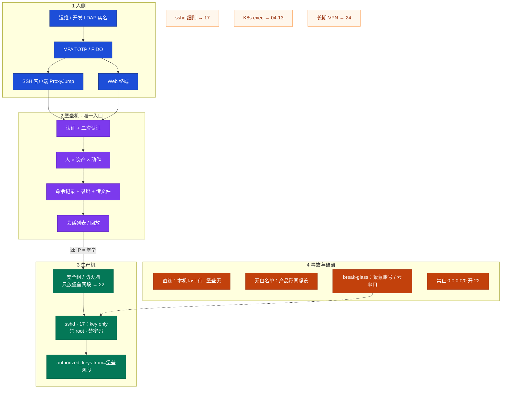
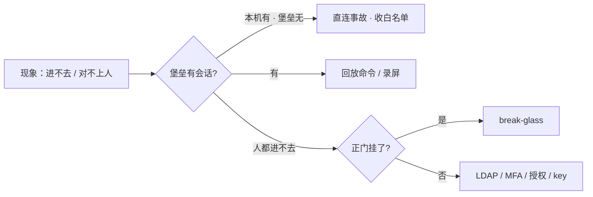
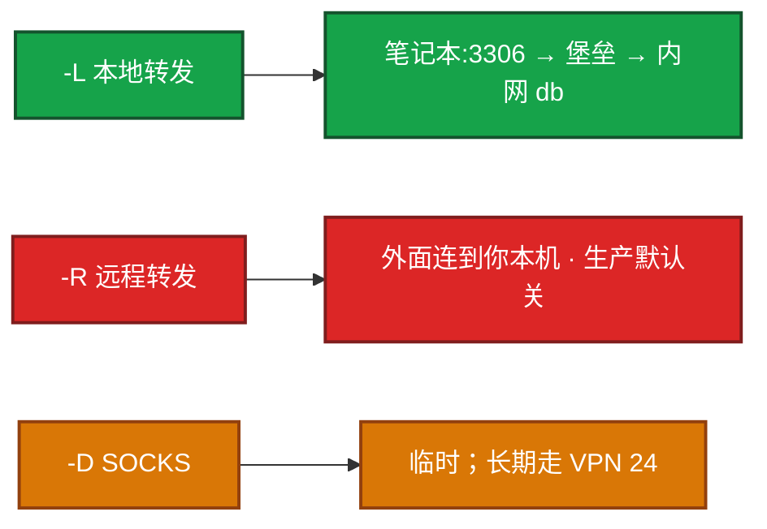
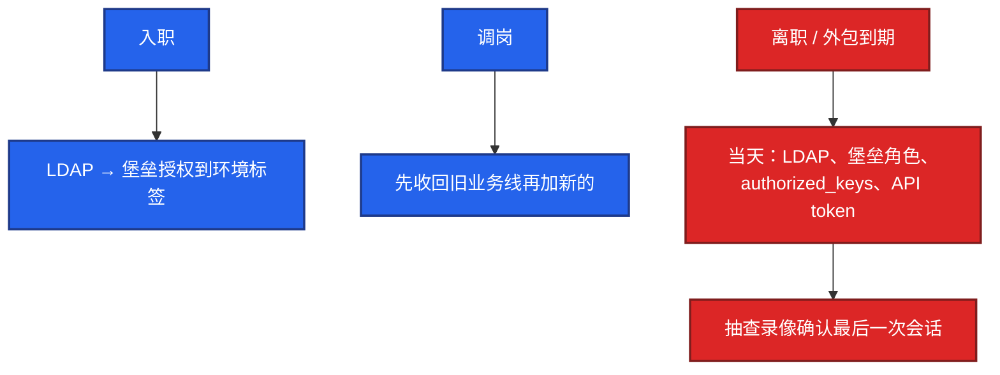
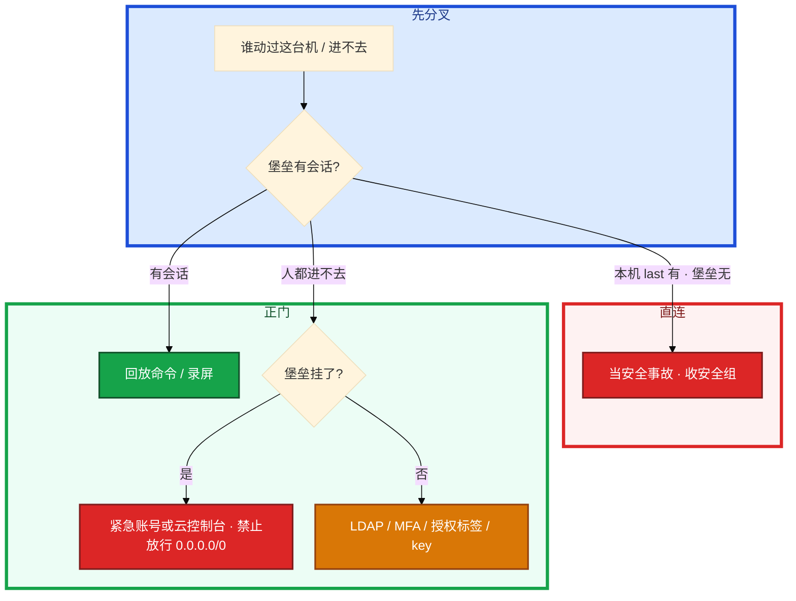

# 堡垒机与跳板机

> **这章解决什么**：开发在安全组给自己笔记本加了 22、「就改一行」；支付库出现对不上人的 DROP；堡垒升级挂了有人要 `0.0.0.0/0` 开 22——**人从哪进生产、留下什么证据、正门挂了走哪条破窗通道**？  
> **读法**：**先看总图** → **再认名词** → **再分节抠跳板 vs 堡垒 / 审计 / ProxyJump / break-glass**。  
> **刻意不展开**：sshd_config 逐项、SUID、auditd、AIDE、sudo 白名单 → [27 Linux 安全加固](../27-Linux安全加固/)；正向代理、WireGuard → [20](../20-HAProxy与Keepalived/)；云 IAM、安全组产品面、串口/VNC 控制台操作细节 → [06 云平台](../../06-云平台/)；K8s RBAC、`kubectl exec` 审计 → [03-13](../../03-Kubernetes/13-RBAC与安全/)；录屏文件怎么轮转、怎么集中入库 → [23 日志运维](../23-日志运维/)；时间对不齐 → [25 NTP](../25-NTP与时间同步/)；堡垒探活/证书过期告警 → [22 监控与告警](../22-监控与告警/)。

---

## 本章目录

1. [本章定位](#1-本章定位)
2. [先看总图：人怎么进生产](#2-先看总图人怎么进生产) ← **开篇必读**
   - [2.0 全章知识串图](#20-全章知识串图一张把细节串起来) ← **架构总览**
   - [2.1 两段路径坐标系](#21-两段路径坐标系办公网--堡垒--生产)
   - [2.2 主线三步](#22-主线三步唯一入口--审计--破窗)
   - [2.3 完整走读](#23-完整走读支付库-drop从电话到结案)
3. [名词扫盲（对照总图认词）](#3-名词扫盲对照总图认词)
4. [跳板机 vs 堡垒机：本章最易混](#4-跳板机-vs-堡垒机本章最易混) ← **重点精读**
5. [审计：命令 · 录屏 · 文件传输](#5-审计命令--录屏--文件传输)
6. [ProxyJump 与三种隧道](#6-proxyjump-与三种隧道)
7. [MFA · 最小权限 · 密钥选项](#7-mfa--最小权限--密钥选项)
8. [Break-glass：正门挂了怎么破窗](#8-break-glass正门挂了怎么破窗) ← **重点精读**
9. [落地与核心配置](#9-落地与核心配置)
10. [定责决策树与命令速查](#10-定责决策树与命令速查)
11. [去哪章继续学](#11-去哪章继续学)
12. [面试 · 易错 · 数字](#12-面试--易错--数字)
13. [合上书](#合上书)

---

## 1. 本章定位

| 章 | 负责 |
|----|------|
| **25（本章）** | **人怎么跳进生产**：唯一入口、审计闭环、ProxyJump/隧道政策、break-glass；跳板 vs 堡垒怎么分 |
| **17** | 主机硬化：sshd key only、禁 root/密码、sudo 白名单、MAC、auditd——**门闩怎么拧紧** |
| **15** | 五链四表、conntrack——**规则写在哪**；本章只说「白名单只放堡垒网段」 |
| **04-13** | K8s exec / RBAC——**另一条入口**，不替代主机 22 白名单 |
| **07** | 云安全组产品、串口/VNC——破窗通道的**云侧手段** |
| **24** | WireGuard / 正向代理——长期进内网的**正门 VPN**，不是每人一条 `-D` |

本章是**人侧访问入口**。17 告诉你「进了机子能跑什么、本机怎么留痕」；本章告诉你「人该不该直连 22、会话有没有录像、正门挂了能不能不开公网 22」。

🎯 **值班签名**：本机 `last` 有登录、堡垒会话列表没有——**先当直连事故收白名单**，不是口头批评「图方便」。

开发在安全组给自己笔记本加了 22，「就改一行配置」。支付库随后出现一条对不上人的 DROP。另一次堡垒机升级挂了，群里有人要改安全组对世界开放 22。本机 `last` 有登录，堡垒会话列表没有——先别动手改业务，先分清是**绕过**还是**正门故障**。

**读完你能：** 白板上画出「人只经堡垒进生产」；讲清跳板 vs 堡垒、审计三件套、MFA/最小权限；会 `ProxyJump` / `-L` / 为什么 `-R` 默认关；能口述 break-glass 与「临时开 22」的红线；没有防火墙白名单等于没做堡垒。

---

## 2. 先看总图：人怎么进生产

> **正确开篇顺序**：先有全局画面，再认词，再抠审计 / ProxyJump / 破窗。  
> 先看 **§2.0 全章串图**（考点挂一张板上），再看 **§2.1 两段路径**，再用 **§2.3 走读**把一次工单串起来。

### 2.0 全章知识串图（一张把细节串起来）

> 🎯 **合上书要能默画这张。** 蓝=人与认证 · 紫=堡垒控制面 · 绿=生产机 · 橙=事故/破窗。  
> 若预览仍报错，以下面 **ASCII 一页板** 为准。



**读图路线：**

| 段 | 记住 |
|----|------|
| ① | 实名 + MFA；Web 与 SSH **都要进堡垒审计**（§5、§7） |
| ② | 认证 → 授权 → 审计；会话列表是值班第一刀（§5） |
| ③ | **没有笔记本直达生产 22 的箭头**；白名单 + `from=`（§4、§9） |
| ④ | 直连当事故；正门挂了走 break-glass，**禁止**对世界开 22（§8、§10） |

```text
┌──────────────────────────────────────────────────────────────────────────┐
│                     25 一张板：人 → 堡垒 → 生产 → 定责                      │
├─────────────┬────────────────────┬───────────────────────────────────────┤
│  ① 人       │  ② 堡垒（唯一入口） │  ③ 生产机                              │
│  LDAP 实名  │  认证 + MFA        │  安全组只放堡垒网段→22                 │
│  SSH/Web    │  人×资产×动作      │  17：key · 禁 root · 禁密码            │
│             │  命令+录屏+传文件  │  authorized_keys from=堡垒            │
├─────────────┴────────────────────┴───────────────────────────────────────┤
│  ④ 事故：本机 last 有 · 堡垒无 = 直连 ｜ 破窗：紧急账号/云串口 · 禁止开公网22 │
│  隧道：-J 默认 · -L 排障 · -R 默认关 · -D 临时（长期→24 VPN）                │
└──────────────────────────────────────────────────────────────────────────┘
```

### 2.1 两段路径坐标系（办公网 → 堡垒 → 生产）

**一句话：** 访问是**两段 SSH（或一段 HTTPS 到 Web 终端）**，不是「笔记本到生产机」一条直线。

```text
  笔记本 / 办公网                    堡垒区                         生产区
  ┌──────────────┐              ┌──────────────┐              ┌──────────────┐
  │ 人 + MFA     │── HTTPS/SSH ─▶│ 认证·授权·审计 │── SSH ──────▶│ sshd 白名单   │
  │ ProxyJump    │              │ 源 IP 对本段  │              │ 只认堡垒网段  │
  └──────────────┘              └──────────────┘              └──────────────┘
         ✕ 禁止：笔记本公网 IP ─────────────────────────────────▶ 生产 :22
```

**读图三句话：**

1. **没有从笔记本直达生产 22 的箭头。** 办公网进堡垒，堡垒进生产，两段分开。
2. **Web 终端和 SSH 客户端都要审计。** 只录像 Web、SSH 协议开个口，等于半套。
3. **源 IP 必须是堡垒。** `authorized_keys` 可 `from="堡垒网段"`；安全组只放该网段。

开源常见 **JumpServer**；商业 CyberArk、BeyondTrust、云厂商堡垒机。功能要会讲：资产、用户对接 LDAP、授权、会话审计、批量命令、Web 终端——**产品菜单背不全没关系，白名单 + 审计闭环说不全才是硬伤**。

> **别混**：装了 JumpServer ≠ 做了堡垒。没有「SSH 白名单只放堡垒」时，产品只是多了一道密码，人仍能直连，**审计是空的**。

### 2.2 主线三步（唯一入口 · 审计 · 破窗）

**本章主线（排障就按这三步想）：**

1. **唯一入口**：生产 SSH 白名单只放堡垒网段；人只走 ProxyJump / Web 终端。
2. **审计三件套**：命令 + 录屏 + 文件传输留痕；出事先查堡垒会话列表。
3. **堡垒挂了走紧急通道（break-glass）**，禁止 `0.0.0.0/0` 开放 22。



🎯 **总图结论**：堡垒机解决的是**人侧访问可控、可追责**；跳板只解决路径。本章后半全是「怎么认直连、怎么配 ProxyJump、正门挂了怎么破窗」。

### 2.3 完整走读：支付库 DROP，从电话到结案

假设：安全群里喊「支付库刚有人 DROP 表」；你只有堡垒控制台权限和一台跳板式登录习惯。

```text
① 问清时间窗
   「大约 13:40～13:50」→ 先对齐 NTP 后再对日志（19）
   「是谁」未知 → 禁止先猜同事名字

② 堡垒会话列表（§5）
   该时间窗：支付库资产上 **无** 对应会话 / 无 DROP 命令回放
   → 已怀疑绕过；不要先去改业务数据

③ 登录支付库本机（若你仍能经堡垒进；若进不去走 §8）
   last -20
   grep 'Accepted' /var/log/secure | tail -20

④ 屏幕出现：
   ops     pts/0    203.0.113.88    Fri Aug 28 13:42   still logged in
   Accepted publickey for ops from 203.0.113.88 port 52134 ssh2

⑤ 说明什么
   源 IP 203.0.113.88 = 某开发笔记本公网 IP，**不是堡垒网段**
   → 直连事故；审计空窗；DROP 对不上堡垒实名

⑥ 立刻动作
   收安全组 / 防火墙 22 白名单只留堡垒
   禁用该 key / 查 authorized_keys · crontab 是否被改
   补安全事故单；需要时按 17 隔离取证
```

**对照：错误走读（禁止照抄）**

```text
电话响 → 「谁干的」群里骂人
     → 安全组给自己 IP 加 22「方便查」
     → 只看业务 binlog 不对堡垒会话
     → 堡垒挂了就 0.0.0.0/0 开 22
```

---

## 3. 名词扫盲（对照总图认词）

对照 §2 认词即可，细节在后文展开。

| 词 | 人话 | 本章哪里用 |
|----|------|------------|
| **跳板机** | 一台能 SSH 中转的机器；多半无录像 | §4 |
| **堡垒机** | 认证 + 授权 + 录像 + 命令审计的控制系统 | §4、§5 |
| **唯一入口** | 生产 22 只接受堡垒网段 | §2、§4、§9 |
| **直连** | 人绕过堡垒打到生产 sshd | §4、§10 |
| **审计三件套** | 命令回放 + 录屏 + 文件传输留痕 | §5 |
| **会话列表** | 堡垒控制台「谁在何时进了哪台」 | §5、§10 |
| **ProxyJump / `-J`** | SSH 先连跳转主机再连目标 | §6 |
| **`-L` / `-R` / `-D`** | 本地转发 / 远程转发 / SOCKS | §6 |
| **MFA** | 二次因子；开在登录堡垒这一跳 | §7 |
| **step-up** | 高危资产再要一次审批/MFA | §7 |
| **人 × 资产 × 动作** | 最小权限三维度 | §7 |
| **`from=`** | authorized_keys 限制公钥来源网段 | §7、§9 |
| **break-glass** | 正门故障时的预置紧急通道 | §8 |
| **紧急账号** | 保险箱+审批才能启用的破窗账号 | §8 |
| **云串口 / VNC** | 不经 22 的云控制台通道 → 07 | §8 |

### 3.1 值班里怎么认现象（先听安全/审计怎么说）

| 现场说的 | 技术含义 | 你的第一刀 |
|----------|----------|------------|
| 「支付库有 DROP 对不上人」 | 可能直连绕过堡垒 | 堡垒会话 vs 本机 `last` |
| 「堡垒升级进不去生产」 | 控制面挂了 | break-glass，**不是**开放 22 |
| 「离职同事还能登录」 | LDAP/key 没当天关 | 当天关账号 |
| 「本机有 SSH、堡垒没有」 | 直连事故 | 收安全组白名单 |
| 「买了 JumpServer 还有人直连」 | 白名单没做 | 收 22；产品 alone 不够 |
| 「CI 能 `-L` 扫内网」 | 机器人 key 权限过大 | `from=` + `no-port-forwarding` |

开口先说 **唯一入口 + 禁直连**。sshd 硬化（禁 root/密码、算法、MaxAuthTries）在 **17**。本章假设已经 key only。人侧用跳转，不要每台公网 22。

> **记住**：产品再全，生产机 SSH 不白名单，人仍能直连，审计是空的。本机有登录、堡垒没有 = 直连事故。

**面试怎么说**：「生产唯一入口是堡垒；安全组只放堡垒网段到 22。装了 JumpServer 不收 22 等于没做。直连当安全事故，不是方便。」

---

## 4. 跳板机 vs 堡垒机：本章最易混

> 🎯 **合上书要能一口分清。** 面试最爱把「我们有跳板」说成「我们有堡垒」。

### 4.1 一句话 + 比方

**一句话：** 跳板只解决**路径**；堡垒还要**人是谁、能碰哪台、敲了什么、能不能回放**。

**打个比方**：跳板机像多了一扇门——进了后院仍说不清是谁拿了东西；堡垒机像银行柜台——每笔操作有监控、有流水单，出事能对到人。

### 4.2 对照表（钉死）

| | 跳板机 | 堡垒机 |
|--|--------|--------|
| 本质 | SSH 中转主机 | 访问控制**产品/系统** |
| 权限 | 有账号往往就能进后面 | **人 ↔ 资产 ↔ 动作** 细粒度 |
| 审计 | 基本无（最多本机 bash history） | 命令 + 录屏 + 传文件 |
| 账号 | 各机 `authorized_keys` 手维护 | LDAP/AD 实名对接 |
| 合规 | 通常不够等保 / SOC2 | 合规默认要的是这个 |
| 成本 | 低 | 中高 |
| 适用 | 很小的团队过渡 | 中大厂默认 |

小团队可以先跳板，但大厂默认：**没有堡垒机日志的操作，等于没发生过**——出事无法追责。

### 4.3 现场怎么认「你到底有没有堡垒」

**现场走一遍**（安全问「有没有录像、能不能证明谁 DROP」）：

1. 问：生产机 22 的安全组/防火墙是否**只**放堡垒网段？  
2. 问：交互 shell / Web 终端 / SFTP 是否都有会话与回放？  
3. 抽一次：经堡垒登录 → 控制台能看到会话；故意从办公网直连 → **应失败**。  
4. 若直连仍成功 → 你只有产品壳或跳板，**审计覆盖「乖的人」**。

```text
验收口算：
  办公网直连生产 :22  → 必须失败
  经堡垒进生产       → 成功且有录像
  Web 与 SSH 协议    → 都有会话
  SFTP 上传          → 单独日志
  测试离职账号       → 当天进不去
```

### 4.4 生产禁止清单（和 17 叠在一起，不是二选一）

| 禁止 | 为什么 | 主责 |
|------|--------|------|
| root 直连 | 对不上人 | 17 + 本章禁直连 |
| 密码登录 | 撞库 | 17 |
| 绕过堡垒 | 无录像，合规失败 | **本章** |
| 共用 `ops` | 无法追责 | 本章 |
| 私钥无 passphrase / 丢网盘 | 等于把门复制走 | 17 + 本章 |
| 生产机对公网 22 | 扫描面 | 本章白名单 + 17 |
| 只收主机 22、不管 K8s exec | 另一条门 | 04-13 |

K8s `kubectl exec` 是绕过主机 SSH 的另一条门，要走 04-13 的 RBAC 和审计。主机白名单管的是 sshd，不是 apiserver。**两条入口都要收。**

> **别混**：跳板能进 ≠ 堡垒能追责；没有白名单的堡垒只是多了一道密码。

**面试怎么说**：「跳板解决网络路径；堡垒还要 LDAP+MFA、人×资产×动作、命令和录屏。机器侧 SSH 只允许堡垒 IP，否则产品形同虚设。」

---

## 5. 审计：命令 · 录屏 · 文件传输

### 5.1 一句话 + 比方

**一句话：** 没有堡垒机录像的操作，等于没发生过；本机有 `last`、堡垒没有 = **直连事故**。

**打个比方**：柜台流水单 + 监控录像；只有「有人进过大门」的门禁刷卡（本机 `last`），对不上柜员工号和操作画面，等于没审计。

### 5.2 三件套分别干什么

| 能力 | 现场怎么用 | 缺了会怎样 |
|------|------------|------------|
| **命令回放** | 事故查「谁在几点敲了 drop」 | 只能猜 |
| **录屏** | 交互式 vim / mysql 客户端也有画面 | 只记命令行会漏交互 |
| **文件传输** | 上传脚本、下载 dump 单独授权、单独留痕 | dump 从旁边溜走 |
| **会话列表** | 值班先问堡垒，再看本机 `last` / `w` | 分不清正门还是绕过 |
| **批量命令** | 类似 Ansible，仍要审计 | SSH 循环裸跑无痕 |

| 对比项 | 有堡垒审计 | 只有跳板 |
|--------|-----------|----------|
| 谁操作的 | 实名 + MFA | 说不清 |
| 敲了什么 | 命令回放 | 无 |
| 交互操作 | 录屏 | 无 |
| 传文件 | SFTP 留痕 | 无 |
| 合规 | 等保/SOC2 | 通常不够 |

### 5.3 现场走一遍（对照 §2.3）

```bash
# 堡垒控制台：按资产 + 时间窗查会话（产品 UI / API，依厂商）
# 本机：
last -20
w
grep 'Accepted' /var/log/secure | tail -20   # 部分发行版在 auth.log
```

**输出解读：**

```text
ops     pts/0    10.0.100.12     Fri Aug 28 13:42   still logged in
Accepted publickey for ops from 10.0.100.12 port 52134 ssh2
```

| 字段 | 正常（经堡垒） | 异常（直连） |
|------|----------------|--------------|
| 源 IP | 堡垒网段（如 `10.0.100.0/24`） | 办公网 / 家宽公网 |
| 堡垒会话 | 有对应会话与回放 | **无** |
| 账号 | LDAP 映射实名 | 常是共用 `ops` |

录屏按合规留 **180 天+**（常见等保口径，以法务为准）。不要和游戏热日志同一套 7 天删除（22）。录屏文件进**独立盘或对象存储**。堡垒盘满导致无法录像时，策略应是 **拒绝新会话**，而不是静默放行无审计登录。

会话审计要覆盖：交互 shell、Web 终端、SFTP/scp、端口转发申请。只记命令行、不记传文件，dump 库会从旁边溜走。录像时钟用 NTP（19），否则和业务日志对不上时间线。

> **记住**：出事我先查堡垒会话列表，再看本机 `last`。本机有、堡垒没有就是直连事故，要收白名单不是口头批评。

**面试怎么说**：「审计三件套是命令、录屏、传文件。值班对比堡垒会话和本机 last；对不上就当直连事故。」

---

## 6. ProxyJump 与三种隧道

### 6.1 一句话 + 比方

**一句话：** 人默认走 `ProxyJump`/`-J`；`-L` 排障可用要审计；`-R` 生产默认关；`-D` 临时，长期走 VPN（24）。

**打个比方**：`-J` 是先刷大楼门禁再进机房；`-L` 是把机房里的数据库「接到你工位网线」排障；`-R` 是把你工位端口「暴露到门禁门口」让外面连——生产默认不许；`-D` 是临时借一条万能网线，不能当架构。

### 6.2 ProxyJump：默认路径

```bash
ssh -J jumphost target-server
ssh -J bastion ops@prod-db-01

# ~/.ssh/config
Host production-*
    ProxyJump jumphost.example.com
    User ops
    IdentityFile ~/.ssh/id_ed25519

# 多跳
ssh -J bastion,jumphost2 target
```

| 目的 | 命令 / 配置 | 看什么 |
|------|-------------|--------|
| 跳转 | `-J` / `ProxyJump` | 第二跳源 IP 是堡垒 |
| 多跳 | `-J a,b` | config 链式写清 |
| 保活 | `ServerAliveInterval 60` + `CountMax 3` | 少莫名断 |

笔记本只装堡垒客户端 / 配 ProxyJump。**生产机永不加他的公网 IP。**

### 6.3 三种隧道（最易翻车）



| 方式 | 干什么 | 谁发起 | 生产 |
|------|--------|--------|------|
| **`-J` / ProxyJump** | 人先到堡垒再 SSH 目标 | 你 → 堡垒 → 目标 | **默认路径** |
| **`-L` 本地转发** | 本机端口经堡垒到内网服务 | 你的客户端连本机端口 | 排障可用，**要审计/工单** |
| **`-R` 远程转发** | 让外面连到你本机服务 | **对端**发起连到你 | **默认禁止** |
| **`-D` SOCKS** | 浏览器等走 SSH 动态代理 | 你 | 临时；不是出网/进内网架构 |

```bash
# -L：排障连内网库（正道）
ssh -L 3306:db-internal:3306 -N jumphost
mysql -h 127.0.0.1 -P 3306

# 或用 Host 别名
# Host db-tunnel
#   HostName jumphost.example.com
#   LocalForward 3306 db-internal:3306
#   LocalForward 6379 redis-internal:6379
#   ExitOnForwardFailure yes
ssh -fN db-tunnel

# 禁止默认：
# ssh -R 8080:localhost:8080 jumphost

# 临时 SOCKS：
ssh -D 1080 jumphost   # 长期走 24 WireGuard
```

🔥 **易错钉死**：`-L` 与 `-R` **方向相反，风险完全不同**。`-R` 生产等于在跳板上开洞。`AllowTcpForwarding no` 能防隧道绕过，但运维常用 `-L` 连库——**政策上：隧道只允许从堡垒机发起，生产机可关转发。** 全关会疼，全开等于堡垒白名单被隧道穿透到任意内网。按资产角色拆。

长期 `-fN` 不要当个人 VPN——每人一条常开隧道 = 影子入口。正门是 **24 WireGuard / 公司 VPN** 或堡垒端口转发工单。

### 6.4 现场走一遍（DB 不暴露公网）

1. 需求：笔记本 mysql 客户端连内网 `db-internal:3306`。  
2. 经堡垒：`ssh -L 3306:db-internal:3306 -N bastion`（或产品侧「端口开放」申请）。  
3. 本地：`mysql -h 127.0.0.1 -P 3306`。  
4. 堡垒会话应能记到「开了本地转发」；用完关掉，不要 `-f` 挂一周。  
5. 若有人 `-R` 把生产 3306 转到自己电脑还开着 `-f` → **当开口子事故**，禁 `-R`、查会话、收 `AllowTcpForwarding`。

> **记住**：人走 ProxyJump；生产机只认堡垒网段的 key。`-L` 连内网库是排障正道；`-R` 生产默认关。

### 6.5 输出怎么认「第二跳真的经了堡垒」

在**生产机**上看成功登录的源 IP（经堡垒应为堡垒网段）：

```text
# 正常（经堡垒 10.0.100.12）
Accepted publickey for zhangsan from 10.0.100.12 port 48221 ssh2

# 异常（直连家宽）
Accepted publickey for ops from 203.0.113.88 port 52134 ssh2
```

在**你的笔记本**上确认 ProxyJump 两段都通：

```bash
ssh -J bastion -v ops@prod-db-01 2>&1 | grep -E 'Authenticating|Connecting|proxy'
# 应先后看到连 jumphost、再连 target；不要只有一段直连 target:22
```

堡垒产品侧：会话列表应出现「SSH / 端口转发」类会话；只有本机 `last`、控制台空白 → 白名单破了或人根本没走产品。

### 6.6 `-D` 与「假 VPN」边界

| 场景 | 做法 | 定责 |
|------|------|------|
| 临时看一眼内网 Grafana | `-D` 经堡垒，用完关 | 可接受 |
| 每人常开 `ssh -fND 1080` 当上班通路 | 影子入口 | 改 24 VPN / SSO |
| 生产机 `AllowTcpForwarding no` 导致 `-D` 失败 | 正门在逼你走 VPN/堡垒申请 | **不要**为方便再打开转发 |
| 公司出网要代理 | Squid 等正向代理 → 24 | 别用 `-D` 当出网架构 |

**面试怎么说**：「默认 ProxyJump；`-L` 排障加审计；`-R` 生产默认禁止；`-D` 临时，长期 VPN。方向反了风险就反了。」

---

## 7. MFA · 最小权限 · 密钥选项

### 7.1 MFA：开在哪一跳

**一句话：** MFA 开在**登录堡垒**这一跳；失效时不能改直连；支付库等高危还应 **step-up**。

**打个比方**：进大楼先刷卡再按楼层——开在正门这一跳。刷卡机坏了不能拆外墙让人爬窗（改直连）。

| MFA 类型 | 强度 | 备注 |
|----------|------|------|
| TOTP（Authenticator） | 强 | 推荐默认 |
| 硬件 U2F/FIDO | 更强 | 高敏资产 |
| 短信 | 弱 | 能上 TOTP 就别只靠 |
| 备份码 | 应急 | 进保险箱，离职作废 |

**现场走一遍**（TOTP 抖动，有人提议「先密码直连」）：

1. 确认范围：全员还是个别客户端时钟漂移。  
2. 笔记本：`date; timedatectl status`——偏差 > 30s → 先 NTP（19），**不要**开放生产 22。  
3. 控制面真挂 → §8 break-glass。  
4. 高危资产（支付库、GM、生产 DROP）会话内再要一次审批或 MFA（step-up）。

只 MFA 没有白名单：key 在笔记本上，人仍可直连生产，**MFA 形同虚设**。

### 7.2 最小权限：人 × 资产 × 动作

**一句话：** 默认拒绝；按环境标签授权；时间盒；动作拆开（能 SSH ≠ 能 SFTP）。

| 维度 | 正确做法 | 错误做法 |
|------|----------|----------|
| 人 | LDAP 实名账号 | 共用 `ops` |
| 资产 | 测试环境标签；支付单独名单 | 全部生产+支付 |
| 动作 | SSH 只读 / 禁 SFTP / 禁剪贴板 | 全能+无期限 |
| 时间 | 活动值班 2 天过期 | 永久 |



权限关闭必须 **当天**。HR 流程接进出系统，不要等「下周迭代」。外包到期与离职同一条：账号带过期时间。季度 review 支付 / GM / 数据库资产。「临时加一下」必须有到期，和 21 的 Silence 同一纪律。

账号被盗：立刻禁用、吊销 key、看录像和 `last`、评估有没有改 `authorized_keys` 和 crontab、轮换被碰过的密钥。已经变成入侵按 17 隔离取证。活动高峰被盗不降级处理：先关门再排故障。

### 7.3 密钥选项：落到 `authorized_keys`

```text
from="10.0.100.0/24" ssh-ed25519 AAAA... zhangsan@company.com

from="10.0.100.0/24",no-pty,no-port-forwarding ssh-ed25519 AAAA... ci@jenkins
```

| 选项 | 干什么 |
|------|--------|
| `from="192.168.1.0/24"` | 即使 key 泄漏，不在网段也废 |
| `no-port-forwarding` | CI 不能开隧道扫内网 |
| `no-pty` | 不能交互 shell |
| passphrase | 防私钥文件被拷 |

批量发公钥：Ansible `authorized_key`，或 **AuthorizedKeysCommand 从 LDAP 拉**，不要 200 台手拷。禁用某 key：从文件删除或加限制前缀。轮换和吊销流程要能说（17 的「key 被盗」）。

> **记住**：入职最小授权到标签；离职当天关 LDAP 和 key。`from=` 与 MFA、白名单是三层门，缺一不可。

**面试怎么说**：「MFA 开在登录堡垒；支付库 step-up。最小权限是人×资产×动作；密钥加 from= 和 no-port-forwarding。没有白名单，MFA 也救不了直连。」

---

## 8. Break-glass：正门挂了怎么破窗

> 🔥 **本章第二块重点。** 堡垒挂了 ≠ 临时开放 22。

### 8.1 一句话 + 比方

**一句话：** 正门故障走**预置紧急通道**（保险箱紧急账号或云串口/VNC）；用完收回并补审计说明；**禁止** `0.0.0.0/0` 或对个人 IP 长期开 22。

**打个比方**：大楼门禁坏了——走消防通道（有钥匙箱、有双人、有登记），不是把临街卷帘门焊开让全世界进来。

### 8.2 允许的破窗 vs 禁止的「方便」

| 做法 | 是否允许 | 条件 |
|------|:--------:|------|
| 云厂商 **串口 / VNC 控制台**（07） | ✅ | 云 IAM 有审计；操作后补说明 |
| **紧急账号**（保险箱取密、审批启用） | ✅ | 限时、用完禁用；双人审批 |
| 文档写明的灾难级、双人审批、**限时自动收回**的个人 IP | ⚠️ 默认否 | 仅最高灾难级别；事后审计 |
| 对个人 IP「临时」开 22 不收回 | ❌ | 直连且无堡垒录像 |
| `0.0.0.0/0` 开放 22 | ❌ | 扫描面 + 无审计 |
| 紧急账号长期 `NOPASSWD` 挂机上 | ❌ | 第二扇永久门 |

### 8.3 现场走一遍（堡垒升级失败，大厅要改配置）

```text
① 确认：控制面挂 / 全员无法建会话（不是个人 MFA 时钟）
② 打开预先演练过的通道：
   - 云控制台串口/VNC 登录该机；或
   - 审批取紧急账号 → 启用 → 登录
③ 做最小必要变更；whoami; last -5；留下操作笔记
④ 立刻：禁用紧急账号 / 结束控制台会话
⑤ 补审计说明：谁、何时、为何、做了什么、影响面
⑥ 堡垒恢复后：抽查该时段本机 last，确认无旁路直连残留
```

```bash
# 紧急通道示例：云控制台登录后
whoami
last -5
# 操作完立刻补审计说明；禁用紧急登录
```

升级前就要 **打开紧急通道演练**，不是升级当晚才找串口密码。HA：控制面至少两台；会话在 Redis；库主从；录屏卷独立。活动高峰改配置：仍然走堡垒；21 的红线**不豁免**审计。

> **别混**：break-glass ≠ 临时开放 22。紧急通道有审批、有期限、用完收回；对个人 IP 开放 22 = 第二扇没审计的门。

### 8.4 演练清单（升级前必做）

| 项 | 通过标准 |
|----|----------|
| 串口/VNC 能登录一台非关键生产机 | 5～15 分钟内进 shell |
| 紧急账号启用流程 | 双人审批单据可查；启用有时间盒 |
| 紧急账号默认状态 | **禁用** / 不能密码常开；取密在保险箱 |
| 补审计模板 | 谁/何时/为何/命令摘要/影响面 五字段齐 |
| 恢复后抽查 | 该时段无非堡垒源 IP 的 Accepted |
| 回滚 | 升坏能回上一版控制面，不靠开 22 |

```text
破窗口播（值班）：
  1. 正门确认挂了（不是个人 MFA）
  2. 走串口或紧急账号，不改安全组
  3. 最小变更 → 立刻收回
  4. 五字段补说明 → 恢复后对 last
```

**面试怎么说**：「堡垒挂了走云控制台或保险箱紧急账号，绝不 0.0.0.0/0 开 22。用完收回并补说明。紧急账号不能长期 NOPASSWD。升级前要演练过破窗。」

---

## 9. 落地与核心配置

### 9.1 选型与验收

| 项 | 选 | 不选 |
|----|----|------|
| 入口 | 堡垒唯一；办公网只到堡垒 | 办公网段:22 直达生产 |
| 账号 | LDAP 实名 | 堡垒本地一套、Linux 又一套对不上；共用 ops |
| MFA | 堡垒登录必开 | MFA 挂了改回密码直连 |
| HA | 控制面多实例，PG/MySQL 主从，Redis 会话 | 单机堡垒当单点还关紧急通道 |
| 审计存储 | 独立盘 / OSS，180 天+ | 和 ES 热日志抢盘、7 天删 |
| 生产 sshd | 白名单 + 17 硬化 | 对公网 22；root/密码 |
| 隧道 | `-L` 工单化；`-R` 关 | 每人长期 `-fN` / `-D` |

JumpServer 一类落地时资产进清单：服务器 / 数据库 / K8s 分标签（环境、业务线、是否支付）。授权是人×资产×动作（SSH、SFTP、执行命令、拉桌面），不要「登录了就能 sudo 无密码」（sudo 白名单在 17，堡垒侧仍要关传文件、关剪贴板）。

资产发现：新机器入流水线必须先挂堡垒白名单和标签，再交业务。先上线后补堡垒 = 一段无审计窗口。K8s 节点同样：kubelet 所在机 22 也只放堡垒。

高危动作（生产 DROP、改 `authorized_keys`、关防火墙）走 **二次审批 / step-up MFA**，会话里打标。批量命令当 Ansible 用也要同一套审计，不要 SSH 循环裸跑。

网络分段：办公网 → 堡垒区 → 生产区。堡垒网卡可双臂，生产机默认路由不必指向办公网。跳板机历史遗留要收到与堡垒同一白名单，不能两套入口并存。

**验收清单：**

- [ ] 从办公网直连生产 22 **失败**
- [ ] 经堡垒成功且有录像
- [ ] Web 与 SSH 协议都有会话
- [ ] SFTP 上传有单独日志
- [ ] 测试离职账号当天进不去
- [ ] 支付资产无「全员可进」角色
- [ ] 堡垒盘满时拒绝新会话（非无审计放行）
- [ ] break-glass 演练过且能在 15 分钟内启用

### 9.2 人侧 SSH 配置（本章加的是跳转，不是 17 的 sshd 表）

```bash
# ~/.ssh/config
Host jumphost
    HostName jumphost.example.com
    User ops
    IdentityFile ~/.ssh/id_ed25519
    ServerAliveInterval 60
    ServerAliveCountMax 3

Host production-*
    ProxyJump jumphost
    User ops
    IdentityFile ~/.ssh/id_ed25519

Host db-tunnel
    HostName jumphost.example.com
    User ops
    LocalForward 3306 db-internal:3306
    LocalForward 6379 redis-internal:6379
    ServerAliveInterval 60
    ServerAliveCountMax 3
    ExitOnForwardFailure yes
```

密钥：`ssh-keygen -t ed25519`。生产机 `authorized_keys`：

```text
from="10.0.100.0/24" ssh-ed25519 AAAA... ops@company.com
```

| 政策 | 生产怎么用 | 改错会怎样 |
|------|------------|------------|
| SSH 白名单 | 只放堡垒网段 | 产品形同虚设 |
| MFA | 堡垒登录；高危可 step-up | 失效时改直连 = 事故门 |
| 隧道 | `-L` 排障 + 工单；`-R` 默认关 | `-R` 等于跳板开口子 |
| 长期 `-fN` | 工单，不要当个人 VPN | 每人一条常开隧道 |
| 录屏保留 | 180 天+ | 7 天删 = 合规失败 |
| 紧急账号 | 保险箱、审批、用完收回 | 长期 NOPASSWD = 第二扇门 |

文件传输默认关，需要时单独开 SFTP 并留痕。剪贴板/下载 dump 进支付机按高危资产走 step-up。堡垒时钟必须 NTP（19）。会话空闲超时与 17 的 sshd 空闲一致。

---

## 10. 定责决策树与命令速查

### 10.1 定责树

三问：这条登录堡垒有没有会话？生产 sshd 是否只认堡垒？能不能在不开放 22 的情况下修？



| 现象 | 先做什么 | 不要做什么 |
|------|----------|------------|
| 本机有 last、堡垒没有 | 当直连事故；收 22 | 「图方便」放过 |
| 买了 JumpServer 仍办公网:22 | 安全组只放堡垒 | 以为产品已经合规 |
| 离职账号还能进 | 当天关 LDAP/key/token | 等 HR 下周 |
| 共用跳板账号 | 立刻拆实名 | 事后猜是谁 |
| 堡垒升级失败 | 云控制台 / 紧急账号 | `0.0.0.0/0` 开放 22 |
| CI key 被拿去 `-L` 扫内网 | `from=` + `no-port-forwarding` | 只靠 sudoers |
| `-D` 当长期翻墙进 Grafana | 改 VPN 或堡垒正门 | 每人一条 SOCKS |
| K8s exec 绕过 sshd | 04-13 RBAC/审计 | 只收主机 22 |
| 录屏盘满仍放行登录 | 拒绝新会话 | 无审计放行 |
| 堡垒证书过期控制台打不开 | 21 的 7 天线；走紧急通道 | 开放生产 22 |
| MFA 全员失败 | 先查时钟/NTP；再 break-glass | 密码直连生产 |
| `-R` 把生产口转到笔记本 | 禁 `-R`、查会话、收转发策略 | 「临时调试」放过 |

活动高峰改配置：走堡垒；不要为了快把 22 打开。审计事后补不回来的是直连那几分钟。

### 10.2 命令速查

| 目的 | 命令 | 什么时候用 | 正常 / 异常 |
|------|------|------------|-------------|
| 跳转 | `ssh -J bastion ops@host` | 日常进生产 | 第二跳源 IP=堡垒 |
| 本地转发 | `ssh -L 3306:db:3306 -N bastion` | 排障连库 | 有工单/会话；用完关 |
| 动态转发 | `ssh -D 1080 bastion` | 临时 | 长期 → 异常架构 |
| 远程转发 | `ssh -R ...` | **默认不要** | 出现即审查 |
| 谁在机上 | 堡垒会话；`last` / `w` | 对不上人 | 有 last 无堡垒=直连 |
| 登录源 IP | `grep Accepted /var/log/secure` | 证直连 | 非堡垒网段=事故 |
| 吊销 | 删 key / LDAP 禁用 | 离职/被盗 | 必须当天 |
| 保活 | `ServerAliveInterval 60` | 长会话 | 莫名断先查这个 |

```bash
ssh -J bastion ops@prod-db-01
ssh -L 3306:db-internal:3306 -N jumphost
mysql -h 127.0.0.1 -P 3306
ssh -fN db-tunnel          # 有工单才挂后台
# 禁止默认：ssh -R 8080:localhost:8080 jumphost
# 临时：ssh -D 1080 jumphost

last -20
w
grep 'Accepted' /var/log/secure | tail -20
```

生产机上 `sshd` 日志对源 IP：不是堡垒网段的成功登录 = 白名单破了。堡垒自身也要被 21 盯：进程、证书、磁盘（录屏盘将满）。

### 10.3 和 17 / 04-13 怎么分口（开口别背错章）

| 被问 | 先说本章 | 再链 |
|------|----------|------|
| 「SSH 怎么加固」 | 唯一入口 + 禁直连 + 白名单 | 17：`PermitRootLogin` / 禁密码 / sudo |
| 「谁动过这台机」 | 堡垒会话 vs `last` | 17：auditd；22：日志集中 |
| 「容器里怎么追责」 | 主机 22 白名单管不了 exec | 04-13：RBAC + 审计 |
| 「长期进内网」 | `-D` 不是架构 | 24：VPN |
| 「安全组规则怎么写」 | 只放堡垒网段到 22 | 15：链/表细节 |

开口顺序：**人从哪进 → 留下什么 → 挂了怎么破窗**；不要一上来背 `sshd_config` 二十项。

---

## 11. 去哪章继续学

| 你卡住的点 | 去哪 |
|------------|------|
| sshd 逐项、sudo、SELinux、auditd、AIDE | [27 Linux 安全加固](../27-Linux安全加固/) |
| 安全组怎么写、conntrack 表满 | [17 iptables 与 conntrack](../17-iptables与conntrack/) |
| 云串口/VNC、云 IAM | [06 云平台](../../06-云平台/) |
| `kubectl exec`、K8s RBAC | [03-13 RBAC 与安全](../../03-Kubernetes/13-RBAC与安全/) |
| 长期 VPN、正向代理 | [20 HAProxy 与 Keepalived](../20-HAProxy与Keepalived/)（WireGuard 等） |
| 录屏/审计日志怎么集中、保留策略怎么落地 | [23 日志运维](../23-日志运维/) |
| 堡垒与业务日志时间对不齐 | [25 NTP 与时间同步](../25-NTP与时间同步/) |
| 堡垒证书/磁盘/进程探活 | [22 监控与告警](../22-监控与告警/) |

---

## 12. 面试 · 易错 · 数字

### 12.1 对错表

| 说法 | 对错 | 口径 |
|------|:----:|------|
| 有跳板就够等保 | 错 | 要人是谁、碰哪台、录像 |
| 装了 JumpServer 不必收 22 | 错 | 白名单不做等于没做 |
| 绕过堡垒直连只是方便 | 错 | 无录像，当事故 |
| 共用 ops 账号能追责 | 错 | 追不到人 |
| root / 密码登录可以开着 | 错 | 17 禁；本章禁直连 |
| MFA 挂了就改密码直连 | 错 | 紧急通道不是直连 |
| `-R` 和 `-L` 风险一样 | 错 | `-R` 生产默认关 |
| 200 台手拷公钥可维护 | 错 | LDAP / Ansible；漏吊销 |
| 只录像 Web 终端即可 | 错 | SSH 协议也要审计 |
| 录屏和游戏日志一起 7 天删 | 错 | 180 天+、独立存储 |
| 堡垒挂了就开放 22 | 错 | 紧急账号或云控制台 |
| 紧急账号长期 NOPASSWD | 错 | 第二扇门 |
| K8s exec 不算入口 | 错 | 另一条门，04-13 |
| `-D` 可当生产出网 / 进内网架构 | 错 | 临时；正门是 VPN/堡垒 |
| 入职授权到全部机器省事 | 错 | 标签 + 最小权限 |
| 离职明天再关 LDAP | 错 | 必须当天 |
| 录屏盘满继续放行 | 错 | 应拒绝新会话 |
| 只开 MFA、22 仍对办公网 | 错 | key 仍可直连，MFA 空转 |

### 12.2 数字与口播锚点

| 数字 / 锚点 | 含义 |
|-------------|------|
| **180 天+** | 录屏常见合规保留（以法务为准） |
| **1 年+** | 审计日志合规常见口径（22） |
| **7 天** | 堡垒证书/探活跟 21 的告警线 |
| **当天** | 离职关 LDAP / key / token |
| **ED25519** | 密钥算法默认 |
| **60 / 3** | `ServerAliveInterval` / `CountMax` |
| **>30s** | MFA 时钟偏差先怀疑 NTP |

### 12.3 易混一对钉死

| 易混 | 一句话 |
|------|--------|
| 跳板 vs 堡垒 | 路径 vs 可控可追责 |
| `-L` vs `-R` vs `-D` | 排障 / 默认禁 / 临时 |
| 本章入口 vs 17 sshd | 人怎么跳 vs 门闩怎么拧 |
| 主机 22 vs K8s exec | 两条门都要收 |
| MFA vs 安全组白名单 | 认证因子 vs 网络只能从哪来 |
| break-glass vs 临时开 22 | 预置通道 vs 事故门 |
| 能 SSH vs 能 SFTP | 动作维度拆开 |
| 登录 MFA vs 高危 step-up | 进门 vs 进金库再刷一次 |

### 12.4 30 秒口述模板

> 「生产唯一入口是堡垒：人 LDAP+MFA，经 ProxyJump 或 Web 终端；生产 22 白名单只放堡垒网段。审计要命令、录屏、传文件；本机 last 有、堡垒没有当直连事故。`-L` 排障，`-R` 默认关。堡垒挂了走紧急账号或云串口，绝不 0.0.0.0/0 开 22。」

---

## 合上书

1. 生产唯一入口是什么？没有白名单的堡垒还算不算做了？
2. 跳板机和堡垒机差在哪？合规要的是哪一个？
3. 审计要留下哪几样？本机有 `last`、堡垒没有说明什么？
4. MFA 开在哪一跳？高危资产要不要 step-up？失效时能不能改直连？
5. `ProxyJump`、`-L`、`-R`、`-D` 生产各允许到什么程度？
6. 最小权限落到人×资产×动作和密钥 `from=` / `no-port-forwarding` 怎么讲？
7. 离职当天关什么？堡垒挂了走哪条 break-glass、绝不能做什么？

七题都能口述，这一章就过了。基础底座「人从哪进生产」到这里收口；门闩细节回 17，长期 VPN 回 24，容器入口回 04-13。
