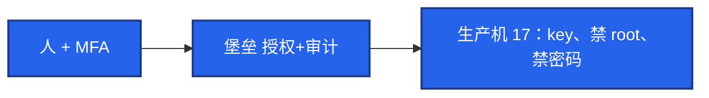
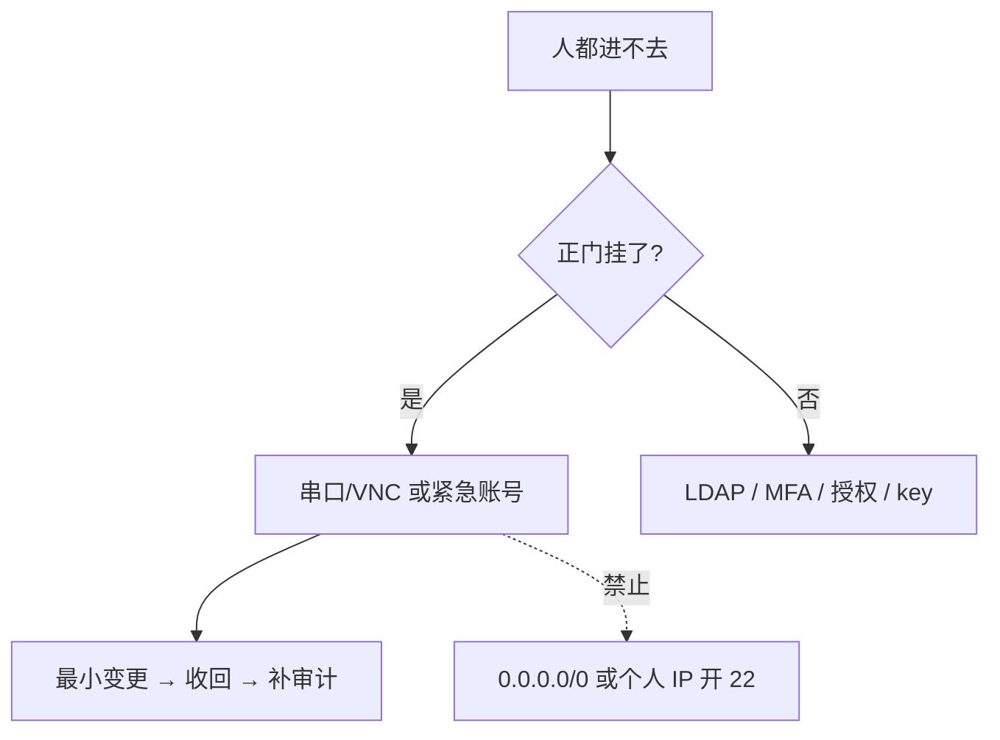

# 25｜堡垒机与跳板机 · 练习题

先对照 [知识点](知识点.md) **§2 总图 + §4 跳板vs堡垒 + §5 审计 + §6 ProxyJump + §8 break-glass** 自己口述，再对答案。关键字（唯一入口、白名单、会话vs last、`-L`/`-R`、破窗）要能定责。每题标了覆盖范围：

| 标记 | 含义 |
|------|------|
| **核心** | 不懂整章就没建立起来 |
| **必会** | 值班和面试都要能讲 |
| **常用** | 线上会反复碰到 |
| **常考** | 白板和追问的高频口径 |

## 本题目录

- [Q1 唯一入口与总图](#q1)
- [Q2 跳板 vs 堡垒](#q2)
- [Q3 审计三件套与直连事故](#q3)
- [Q4 ProxyJump 与三种隧道](#q4)
- [Q5 没有白名单的 JumpServer](#q5)
- [Q6 MFA / 最小权限 / from=](#q6)
- [Q7 Break-glass](#q7)
- [Q8 离职与被盗](#q8)
- [Q9 和 17 / 03-13 分工](#q9)
- [Q10 SOCKS 与假 VPN](#q10)
- [Q11 录屏盘满与验收](#q11)
- [合上书](#合上书)

---

## Q1

**★★★★★｜生产怎么管服务器访问？白板上先画什么？**

**覆盖**：核心 · 必会 · 常考

**对应**：知识点 §1 · §2

### 场景

面试官：「你们生产 SSH 怎么管？」有人开始背 JumpServer 菜单。

### 完整解答

**一句话**：先画两段路径——人+MFA→堡垒（认证·授权·审计）→生产（白名单只放堡垒）；没有笔记本直达 22 的箭头。



主线三步（§2.2）：① 唯一入口 ② 审计三件套 ③ 正门挂了走 break-glass。产品功能可以说资产/LDAP/会话，但**白名单 + 审计闭环**说不全是硬伤。

### 再追问

- 小作坊可以先跳板吗？——可以过渡；中大厂、等保、出事追责必须堡垒。开源或云产品均可，关键是白名单。
- 验收第一刀？——办公网直连生产 22 必须失败。

---

## Q2

**★★★★★｜跳板机和堡垒机差在哪？为什么禁止直连？**

**覆盖**：核心 · 必会 · 常考

**对应**：知识点 §4

### 场景

「我们有跳板机，大家都 ssh 上去再跳。」安全问有没有录像、能不能证明谁 DROP 了表。开发在安全组给自己笔记本加了 22，「就改一行配置」。

### 完整解答

**一句话**：跳板只解决路径；堡垒还要人是谁、碰哪台、命令和录屏；直连绕过审计，当事故不是方便。

| | 跳板 | 堡垒 |
|--|------|------|
| 本质 | SSH 中转 | 访问控制产品 |
| 审计 | 基本无 | 命令+录屏+传文件 |
| 账号 | 手维护 keys | LDAP 实名 |
| 合规 | 通常不够 | 等保等要这个 |

直连 = 密钥在笔记本上，离职、丢失、投毒都对不上堡垒录像。生产机防火墙必须 **deny 除堡垒外的 SSH**，包括运维自己的家宽 IP。共用跳板账号等于没人。

### 再追问

- K8s exec 算不算直连？——绕过主机 SSH 的另一条门，要走 04-13 的 RBAC 和审计。主机白名单管的是 sshd，不是 apiserver。两条入口都要收。
- 「有跳板就够等保」对不对？——错。要人是谁、碰哪台、录像。

---

## Q3

**★★★★★｜支付库 DROP 对不上人，第一刀敲什么？**

**覆盖**：核心 · 必会 · 常考

**对应**：知识点 §2.3 · §5 · §10

### 场景

安全群：「支付库刚有人 DROP。」你只有堡垒控制台和机器登录权限。

### 完整解答

**一句话**：先查堡垒会话列表（时间窗+资产），再对本机 `last` / `Accepted` 源 IP；本机有、堡垒无 = 直连事故。

```text
① 对齐时间窗（必要时 19 NTP）
② 堡垒：该资产该时段有无会话 / 命令回放
③ 本机：last；grep Accepted .../secure|auth.log
④ 源 IP ∈ 堡垒网段？有会话？——否 → 收白名单、禁 key、事故单
```

```text
# 异常例
Accepted publickey for ops from 203.0.113.88 port 52134 ssh2
# 203.0.113.88 是家宽 ≠ 堡垒网段
```

审计三件套：命令回放、录屏、文件传输。只记命令行不记 SFTP，dump 会溜走。录屏 **180 天+**、独立存储，别跟游戏日志 7 天删。

### 再追问

- 群里先骂人行不行？——不行；先取证定责。
- 为了「方便查」给自己 IP 开 22？——制造第二扇无审计门，禁止。

---

## Q4

**★★★★☆｜ProxyJump 和三种隧道各干什么？生产允许哪种？**

**覆盖**：必会 · 常用 · 常考

**对应**：知识点 §6

### 场景

DB 不暴露公网。有人 `-R` 把生产 3306 转到自己电脑还开着 `-f`。另有人问怎么用笔记本连内网库。

### 完整解答

**一句话**：默认 ProxyJump；`-L` 排障可用要审计；`-R` 生产默认禁止；`-D` 临时，长期 VPN。

| 方式 | 干什么 | 生产 |
|------|--------|------|
| `-J` / ProxyJump | 人先到堡垒再 SSH 目标 | 默认路径 |
| `-L` 本地转发 | 本机端口经堡垒到内网服务 | 排障可用，要审计 |
| `-R` 远程转发 | 让外面连到你本机 | **默认禁止** |
| `-D` SOCKS | 浏览器走 SSH | 临时，不是架构（24） |

```bash
ssh -J bastion ops@prod-db-01
ssh -L 3306:db-internal:3306 -N bastion
mysql -h 127.0.0.1 -P 3306
```

`-L`：流量从你电脑发起；`-R`：对端发起连到你——方向反了，风险完全不同。`-R` 等于在跳板上开洞。长期 `-fN` 要工单，不要当个人 VPN。生产机可 `AllowTcpForwarding no`，隧道只允许从堡垒发起。

### 再追问

- 怎么证明第二跳经了堡垒？——生产机 `Accepted` 源 IP 必须是堡垒网段；堡垒有会话。
- `ServerAliveInterval`？——常见 60，`CountMax` 3，减少莫名断连。

---

## Q5

**★★★★★｜JumpServer 部署了但机器仍对办公网开放 22，有用吗？**

**覆盖**：核心 · 必会 · 常考

**对应**：知识点 §2.1 · §4.3 · §9 · §10

### 场景

买了产品，安全组还是 `办公网段:22`。有人从不点 Web 终端，直接 ssh。

### 完整解答

**一句话**：没有 SSH 白名单的堡垒等于没做——审计只覆盖「乖的人」，必须 sshd+安全组只放堡垒网段。

没有用。办公网进堡垒，堡垒进生产，两段分开。验收：直连失败；经堡垒成功且有录像；Web 与 SSH **都要**审计；SFTP 单独日志。

MFA 开在堡垒登录上。录屏存储与保留策略写进合规（180 天+），别和游戏日志同一套 7 天删除（[23](../23-日志运维/)）。

### 再追问

- 只录像 Web、SSH 协议开个口？——等于半套。
- 历史跳板和堡垒两套入口并存？——收到同一白名单，不能两套正门。

---

## Q6

**★★★★☆｜MFA、最小权限、authorized_keys 选项怎么一口回？**

**覆盖**：必会 · 常用 · 常考

**对应**：知识点 §7

### 场景

面试官：「你们堡垒机除了能登录，还解决什么？」新人入职 HR 说「先给全部机器方便熟悉」。CI 公钥能登录还被拿去 `-L` 扫内网。

### 完整解答

**一句话**：MFA 开在登录堡垒；人×资产×动作+时间盒；密钥 `from=` / `no-port-forwarding`；没有白名单这三件都空。

1. **MFA**：开在堡垒登录；支付库/GM **step-up**；失效走 break-glass，不改密码直连。时钟偏 >30s 先 NTP（19）。  
2. **最小权限**：入职到环境标签，不是全部生产；调岗先收后加；动作拆开（能 SSH ≠ 能 SFTP）。  
3. **密钥**：

```text
from="10.0.100.0/24" ssh-ed25519 AAAA... zhangsan@company.com
from="10.0.100.0/24",no-pty,no-port-forwarding ssh-ed25519 AAAA... ci@jenkins
```

`from=`：key 泄漏离开网段也废。`no-port-forwarding`：CI 不能开隧道。passphrase 防文件被拷。批量用 Ansible / LDAP `AuthorizedKeysCommand`，200 台手拷必漏吊销。

### 再追问

- 只开 MFA、22 仍对办公网？——key 仍可直连，MFA 形同虚设。
- 短信 MFA 够不够？——弱；能上 TOTP/FIDO 别只靠短信。

---

## Q7

**★★★★★｜紧急通道和「临时开 22」怎么选？**

**覆盖**：核心 · 必会 · 常考

**对应**：知识点 §8 · §10

### 场景

堡垒机升级失败。大厅要紧急改配置。群里有人要改安全组放行自己 IP，有人喊 `0.0.0.0/0`。

### 完整解答

**一句话**：走云串口/VNC 或保险箱紧急账号；禁止对个人 IP 长期开 22 和 `0.0.0.0/0`；用完收回并补五字段说明。



| 允许 | 禁止 |
|------|------|
| 云控制台串口/VNC（07） | `0.0.0.0/0` |
| 紧急账号：审批、限时、用完禁用 | 紧急账号长期 NOPASSWD |
| 升级前演练过破窗 | 当晚才找串口密码 |

对个人 IP 开放 = 直连且无审计，只在文档写明的灾难级别、双人审批、限时自动收回才可能接受，**默认否**。

### 再追问

- MFA 全员失败是不是立刻开 22？——先查时钟/NTP；确认控制面挂了再 break-glass。
- 活动高峰能豁免审计吗？——不能；21 红线不豁免。

---

## Q8

**★★★★☆｜离职当天来不及、账号被盗怎么办？**

**覆盖**：必会 · 常用

**对应**：知识点 §7.2 · §10

### 场景

员工已走，LDAP 明天才关。旧笔记本还能 ProxyJump 进支付机。另一次怀疑 key 被盗。

### 完整解答

**一句话**：离职当天关 LDAP、堡垒授权、所有 `authorized_keys` 和 token；被盗先禁用吊销再取证，不降级。

权限关闭必须 **当天**：LDAP、堡垒角色、所有机器 key、API token。HR 接进出系统，不要等「下周迭代」。外包到期同一条：账号带过期时间。

被盗：禁用 → 吊销 key → 看录像和 `last` → 查是否加了新公钥和 crontab → 轮换被碰过的密钥。已变入侵按 [27](../27-Linux安全加固/) 隔离取证。活动高峰被盗：先关门再排故障。

### 再追问

- 共用跳板账号怎么追？——追不到人；立刻拆实名+堡垒。
- 季度 review 盯什么资产？——支付 / GM / 数据库。

---

## Q9

**★★★★☆｜和 17、04-13 怎么分工？开口别背错章**

**覆盖**：必会 · 常考

**对应**：知识点 §1 · §10.3 · §11

### 场景

被问「SSH 怎么加固」时把 17 的 sshd 表背完，没提堡垒。另有人说「主机白名单做了，K8s 就安全了」。

### 完整解答

**一句话**：开口先说唯一入口+禁直连，再引用 17 的 sshd 表；K8s exec 是另一条门，走 04-13。

| 章 | 负责 |
|----|------|
| **25** | 人怎么跳、审计、ProxyJump、break-glass |
| **17** | 门闩：key only、禁 root/密码、sudo、MAC、auditd |
| **04-13** | `kubectl exec` / RBAC / 审计 |
| **24** | 长期 VPN，不是每人 `-D` |

本章加的：`from=`、ProxyJump、隧道政策、离职清 key、破窗。不要两章重复背同一份 `sshd_config`。

### 再追问

- 批量发公钥？——Ansible `authorized_key` 或 LDAP `AuthorizedKeysCommand`。
- 安全组规则细节？——「只放堡垒网段」在本章；链/表写法在 15。

---

## Q10

**★★★★☆｜运维用 -D 当 SOCKS 翻到内网管理界面，行不行？**

**覆盖**：常用 · 常考

**对应**：知识点 §6.3 · §6.6

### 场景

内网 Grafana 不暴露。有人 `ssh -D` 再把浏览器指到 1080，还 `-fN` 挂着当上班通路。

### 完整解答

**一句话**：`-D` 临时排障可以且须经堡垒；长期应走 VPN 或内网 SSO，不是每人一条 SOCKS。

临时排障可以，会话能记到「开了动态转发」。长期 = 影子入口。生产机 `AllowTcpForwarding no` 时失败——那是在逼你走正门。公司出网用 Squid（24）；进内网管理面用 VPN 或堡垒端口转发。SSH `-D` 是方便工具，不是架构。

### 再追问

- 这和正向代理有什么关系？——都是「我当客户端去连别人」；正门产品化，别用 SSH 隧道顶替。
- `-L` 连库挂一周算不算假 VPN？——长期 `-fN` 同样要工单化，用完关。

---

## Q11

**★★★★☆｜录屏盘满仍放行？落地验收盯哪几条？**

**覆盖**：必会 · 常用

**对应**：知识点 §5 · §9.1

### 场景

录屏卷 95%。有人说「先放登录，别挡业务」。新机器先上线、下周再挂堡垒。

### 完整解答

**一句话**：盘满应拒绝新会话，禁止无审计放行；新机器必须先挂白名单和标签再交业务。

| 验收 | 标准 |
|------|------|
| 直连 | 办公网→生产 22 失败 |
| 正门 | 经堡垒成功且有录像 |
| 协议 | Web + SSH 都有会话 |
| 传文件 | SFTP 单独日志 |
| 离职 | 测试账号当天进不去 |
| 支付 | 无「全员可进」角色 |
| 盘满 | 拒绝新会话 |
| 破窗 | 演练过，15 分钟内能启用 |

先上线后补堡垒 = 一段无审计窗口。K8s 节点 22 同样只放堡垒。HA：控制面多实例、会话 Redis、录屏独立卷。

### 再追问

- 录屏和热日志同一套 7 天删？——错；180 天+、独立存储（22）。
- 堡垒证书过期控制台打不开？——走紧急通道；盯 21 的 7 天线；不要开生产 22。

---

## 合上书

- [ ] 能默画 §2：人→堡垒→生产，无直连箭头；主线三步
- [ ] 能分清跳板 vs 堡垒；说明没有白名单等于没做
- [ ] 能讲审计三件套；本机 `last` 有、堡垒没有 = 直连事故
- [ ] 能区分 ProxyJump、`-L`、`-R`、`-D` 生产各允许到什么程度
- [ ] 能说出 MFA 开在哪一跳；失效时能不能改直连
- [ ] 能讲人×资产×动作与 `from=` / `no-port-forwarding`
- [ ] 能口述 break-glass：紧急账号/云串口，绝不能 `0.0.0.0/0`
- [ ] 能说出离职当天关什么；和 17 / 04-13 怎么分口
