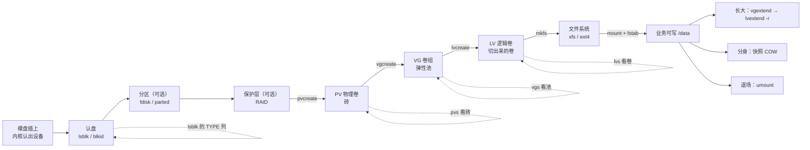
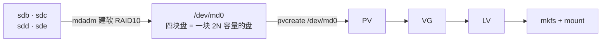
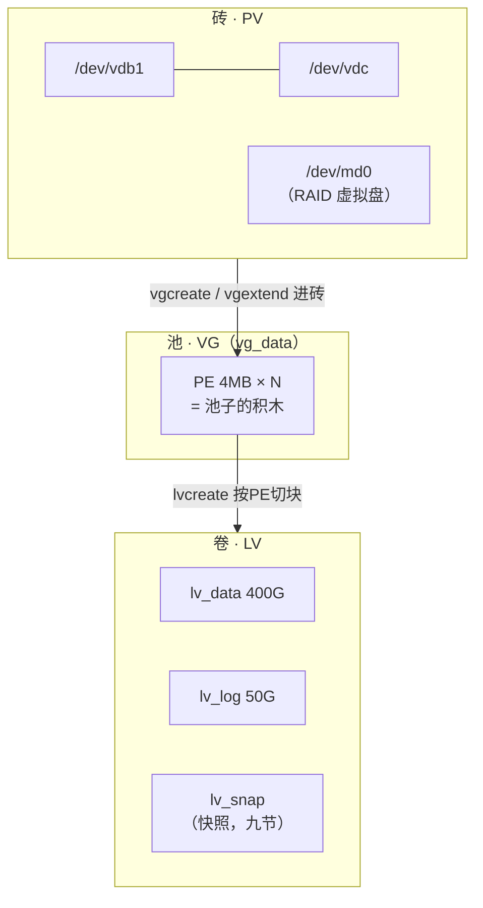
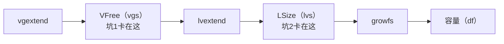
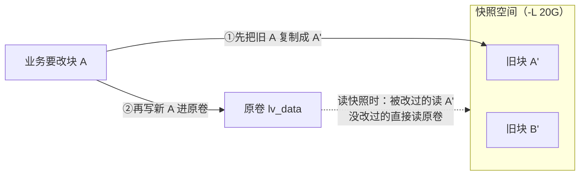
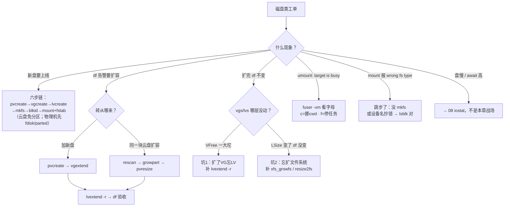

# 磁盘管理与 LVM

> 逻辑服 `/data` 用到 95%，工单批了一块 500G 新盘。新同事直接 `mount /dev/vdb /data`，报 `wrong fs type`——从一块裸盘到业务能写的卷，中间隔着认盘、分区、LVM、文件系统、fstab 五道门，跳过任何一道都挂不上；还有人在 `umount` 时撞上 `target is busy` 不敢动。
> **本章回答**：一块裸盘从被内核认出来、变成 PV/VG/LV、格式化挂载、在线扩容到安全下线的全链，以及「扩了盘 df 不变」「umount 说忙」这类工单的第一刀。
> **不讲**：盘慢与 IO 定责（await/脏页/iostat）→ [08](../08-磁盘与IO/)；文件系统机制（inode/journal/链接/fsck）→ [09](../09-文件系统与inode/)；备份策略与容灾 → [31](../31-备份与恢复/)、[33](../33-高可用与容灾/)。

**标记**：🎯重点 · 🔥难点 · ⭐常考 · 🔧实操

---

## 一、一张图：一块裸盘的一生

> 🎯 **一句话**：裸盘要过五道门才变成可用卷：认盘 → 分区 → 成砖入池 → 切卷格式化 → 挂载与扩容。



**读图**：主线从左往右是一次加盘的施工顺序——分区和 RAID 两道门是可选的（云盘常两道都跳过），但 PV → VG → LV 这三道门一张也少不了，它们就是 LVM 的三层。虚线是每层的观测命令：`lsblk` 的 TYPE 列、`pvs`/`vgs`/`lvs` 三兄弟分别照砖、池、卷——后面每一节都是把图上一个方块放大。扩容、快照、下线不是新状态，是这个卷「活着」期间会经历的三件事。

> ⚠️ **别混**：本章管「块设备怎么变成可用卷」；卷做成之后的**性能**（await/队列/脏页）→ [08](../08-磁盘与IO/)，卷上**文件怎么存**（inode/journal）→ [09](../09-文件系统与inode/)。三张地图对着看，别在一张里找另一张的答案。

---

## 二、认盘：lsblk 与磁盘命名 ⭐

> 🎯 **一句话**：`lsblk` 一屏看清机器上有哪些块设备、谁是谁的爹；盘符会变，UUID 不会。

**块设备（block device）** = 按块（sector/block）随机读写的设备文件，`/dev/` 下那个名字。动手前第一件事永远是认清盘——拿错盘，后面每一步都是事故。

> 🔍 **现场**：
> ```bash
> lsblk
> ```
> | NAME | MAJ:MIN | SIZE | TYPE | MOUNTPOINT | 说明 |
> |---|---|---|---|---|---|
> | sda | 8:0 | 200G | disk | | |
> | sda1（sda 的分区） | 8:1 | 1G | part | /boot | |
> | sda2（sda 的分区） | 8:2 | 199G | part | | |
> | vg_root-lv_root（长在 sda2 下） | 253:0 | 199G | lvm | / | TYPE=lvm：这是 LVM 卷，不是分区 |
> | vdb | 252:16 | 500G | disk | | 没有孩子、没挂载：一块待施工的裸盘 |

四列读法：**NAME**（设备名，树形缩进表示父子——分区别在盘下、LV 挂在分区下）、**SIZE**、**TYPE**（`disk` 整盘 / `part` 分区 / `lvm` 逻辑卷 / `rom` 光驱）、**MOUNTPOINT**（挂在哪，空的就是没挂）。**树形结构本身就是答案**：`vg_root-lv_root` 长在 `sda2` 下面，说明根分区已经被 LVM 接管了。

**磁盘命名的三种姓**：

- `/dev/sd*`（sda、sdb…）——SATA/SCSI/SAS/USB，虚拟机 virtio 盘也常叫 vd*；**字母按枚举顺序分配，热插拔后可能变**
- `/dev/vd*`（vda、vdb…）——virtio 半虚拟化盘，云主机最常见
- `/dev/nvme0n1`、`/dev/nvme0n1p1`——NVMe 盘；`n1` 是 namespace，`p1` 是分区（nvme 分区名中间多个 `p`，踩过 `nvme0n11` 和 `nvme0n1p1` 分不清的坑就懂了）

**lsblk -f 多两列身份信息**：

> 🔍 **现场**：
> ```bash
> lsblk -f /dev/vdb1
> blkid /dev/vdb1
> ```
> ```text
> NAME   FSTYPE LABEL UUID                                   MOUNTPOINT
> vdb1   xfs          a3f2c8d1-5b6e-4c7a-9d21-0123456789ab   ← 没做文件系统时 FSTYPE 为空
> # /dev/vdb1: UUID="a3f2c8d1-…" TYPE="xfs"                  ← blkid 直接吐 UUID，写 fstab 用
> ```

> ⚠️ **别混**：`/dev/sdb` 这个名字**只在本次开机内稳定**——重启、热插拔后 sdb 可能变成 sdc。所以 fstab 里挂载认 **UUID**（第七节），人肉操作时用 `lsblk` 现场确认，别背昨天的盘符。

> 📝 **面试**：问「新加了一块盘怎么确认内核认到了」——`lsblk` 看 TYPE=disk 的新节点、`dmesg -T | tail` 看内核的 attach 日志；再补一句「盘符不稳定，持久化一律用 UUID」。

---

## 三、分割：分区表与 fdisk/parted

> 🎯 **一句话**：分区是把一块盘在开头记一张目录；MBR 老、GPT 新，2TB 以上只能 GPT。

**分区（partition）** = 在盘的开头写一张**分区表（partition table）**，把一块物理盘划分成若干逻辑段。为什么裸盘上跑 mkfs 也完全合法，但还要分区：系统盘要分出 /boot 和 /（启动有讲究）、一块盘要多文件系统混用。而**纯数据盘（尤其云盘）可以完全跳过分区**——整盘直接做成 PV，少一层间接、日后在线扩容还更省事（第八节的 `pvresize` 直接吃满整盘）。

两种分区表一句话分清：**MBR（Master Boot Record，主引导记录）**——老标准，最多 4 个主分区、**寻址上限 2TB**；**GPT（GUID Partition Table）**——现代标准，128 个分区、容量上无实际限制。新盘一律 GPT，老工具不认的场合才退 MBR。

| 对比 | **fdisk** | **parted** |
|------|-----------|------------|
| 交互 | 菜单式，`g` 建GPT `n` 新建 `w` 写入 | 命令式，可 `--script` 进脚本 |
| 大盘/2TB+ | 新版可以，老版本不行 | **可以**，传统上 >2TB 的唯一选择 |
| 生产姿势 | 交互式手动改盘 | 脚本化装机/云镜像的主流 |

> 🔍 **现场**：给 /dev/vdb 建一个 GPT 全盘分区：
> ```bash
> parted /dev/vdb --script mklabel gpt mkpart primary 1MiB 100%
> partprobe /dev/vdb            # ← 让内核重读分区表，免得 reboot 才认到
> lsblk /dev/vdb
> ```
> | NAME | MAJ:MIN | SIZE | TYPE | MOUNTPOINT | 说明 |
> |---|---|---|---|---|---|
> | vdb | 252:16 | 500G | disk | | |
> | vdb1（vdb 的分区） | 252:17 | 500G | part | | 分区出生，名字 = 盘名 + 数字 |

云盘免分区的现实：云厂商数据盘没有引导需求、底层冗余也不靠你分区，**整盘 `pvcreate /dev/vdb` 是完全正统的姿势**——分区只在「一块盘要切多个用途」时才必要。本节之后的所有示例走「vdb1 有分区」和「vdc 免分区」两条线，命令差异只有设备名。

> ⚠️ **别混**：`mklabel gpt` 是**格式化分区表**（整盘数据没了），`mkpart` 才是**新建分区**。parted 的命令顺序错了没有撤销——生产上对着 `lsblk` 反复确认设备名再回车。

---

## 四、护体：RAID 概览与叠层

> 🎯 **一句话**：RAID 把多块盘拼成性能/冗余更好的「一块虚拟盘」；LVM 不提供冗余，冗余这层要么 RAID 要么云盘底层。

**RAID（Redundant Array of Independent Disks，独立冗余磁盘阵列）** = 把多块物理盘按某种规则组织成一个逻辑盘的方案。分**硬 RAID**（RAID 卡/阵列卡，OS 只见一块盘）和**软 RAID**（Linux `mdadm`，OS 自己算）。四个级别一行一个：

| RAID | 冗余能力 | 生产用途 |
|------|----------|----------|
| 0 条带 | 无 | 两块盘拼容量提速，坏一块全没——只放可丢数据 |
| 1 镜像 | 1 块 | 系统盘：两块盘内容互为备份 |
| 5 校验 | 1 块 | 读多写少；写有惩罚（每写一笔要多算校验，多一次读写） |
| 10 镜像+条带 | 每镜像组 1 块 | 数据库/高 IO 盘，生产推荐，至少 4 块 |

**叠层关系（一句话 + 图示）**：先 RAID 把 N 块盘变成 OS 眼里的一块可靠的虚拟盘，再在这块虚拟盘上照常走 LVM——LVM 根本不知道脚下是几块物理盘。



**读图**：从左往右看，RAID 是插在「物理盘」和「LVM」之间的一层**护甲**——上层一切照旧，`pvcreate` 的参数从 `/dev/sdb1` 换成 `/dev/md0` 而已。反过来不成立：**LVM 不提供冗余**，VG 里坏一块 PV，建在它上面的 LV 一起没——要冗余，要么脚下有 RAID，要么用云盘（底层三副本，**云上一般不自建 RAID**，→ [08](../08-磁盘与IO/)）。

RAID 两个运维提醒：重建期（换盘补数据）IOPS 近乎腰斩，要当变更窗口管理；RAID 不是备份——误删照样全删，备份 → [31](../31-备份与恢复/)。

**多路径（multipath）一句带过**：SAN 存储里同一块盘有两条物理路径（双 HBA 卡），**DM-Multipath** 把它们合成为 `/dev/mapper/mpathX` 一个设备，LVM 直接吃它；云环境和单机碰不到，见到 `mpath` 设备知道是这回事即可。

---

## 五、成砖：PV 与 LVM 三层结构 ⭐🔥

> 🎯 **一句话**：LVM 在「分区」和「文件系统」之间加一层池化抽象——盘成砖、砖入池、池切卷，容量从此可搬家。

先回答「为什么需要 LVM」。传统分区是**一次性定型**的：`/dev/sdb1` 分了 300G 给 /data，用满了怎么办？分区边界在盘上是死的，扩分区要停机、挪数据、赌运气。LVM（Logical Volume Manager，逻辑卷管理器）的解法是把「空间」从具体盘里抽象出来：

> 💡 **打个比方**：传统分区像**一排焊死的储物柜**——3 号柜塞满了，哪怕隔壁 4 号柜空着你也放不进去；LVM 是把所有柜子拆成**同一规格的乐高积木**（PE），拼一个大池子（VG），要多少容量从池子里现拼一个箱子（LV）。箱子不够大？再从池里抓几块积木接上——**这就是在线扩容的全部秘密**。

三层结构，每层一个身份、一组命令：


- **PV**：被 LVM 打了标记的盘或分区——设备上写一份元数据，宣告「我归 LVM 管」。
- **VG**：一个或多个 PV 堆出来的**空间池**。`vg_data` 里有多少空闲、被谁用了，是 LVM 记的账。
- **LV**：从 VG 里切出来的一段逻辑容量，对上层就是一块「看起来像盘」的设备（`/dev/vg_data/lv_data`，软链接到 `/dev/mapper/vg_data-lv_data`），可以在它上面 mkfs。
- **PE（Physical Extent，物理块）**：池子里的最小分配单位，**默认 4MB**——LV 的容量是按 PE 个数分配的，`-L 100G` 会被取整到 4MB 的倍数。

> 🔍 **现场**：三兄弟查看命令，一张屏看全三层：
> ```bash
> pvs && vgs && lvs
> ```
> ```text
>   PV         VG      Fmt  Attr PSize   PFree
>   /dev/vdb1  vg_data lvm2 a--  500.00g 100.00g    ← 砖：全给了 vg_data，池里还剩 100G
>   VG      #PV #LV #SN Attr   VSize   VFree
>   vg_data   1   1   0 wz--n- 500.00g 100.00g    ← 池：VFree 是池子还剩的空闲
>   LV      VG      Attr       LSize   Pool Origin
>   lv_data vg_data -wi-ao---- 400.00g               ← 卷：只切了 400G，不是池里有多少就切多少
> ```

> ⚠️ **别混**：`VFree`（VG 还剩多少空闲砖）和 LV 已用空间是两码事——VFree 是「池里还没分给任何 LV 的」，文件系统用了多少要问 `df`。三层各有各的账本：池的账看 `vgs`、卷的账看 `lvs`、文件系统的账看 `df`，这是第八节「df 不变」两大坑的根源。

---

## 六、垒池切卷：从 pvcreate 到 mount 的创建全链 🔧⭐

> 🎯 **一句话**：首次创建六步走：pvcreate → vgcreate → lvcreate → mkfs → blkid → mount，一步一个命令。

这是 [08](../08-磁盘与IO/) 和 [09](../09-文件系统与inode/) 两章都指向这里的全链考题。场景：500G 新盘 /dev/vdb 已分好区（第三节），要给 /data 做一个 vg_data/lv_data 卷。

> 🔍 **现场**：完整施工，每步给预期输出要点：
> ```bash
> # ① 成砖：分区（或云盘免分区直接 pvcreate /dev/vdb）
> pvcreate /dev/vdb1
> #   Physical volume "/dev/vdb1" successfully created.        ← 只打元数据，几秒完事
> # ② 垒池
> vgcreate vg_data /dev/vdb1
> #   Volume group "vg_data" successfully created
> # ③ 切卷：-n 名字 -L 大小；-l 100%FREE = 池里剩多少切多少
> lvcreate -n lv_data -L 400G vg_data
> #   Logical volume "lv_data" created.
> # ④ 格式化（xfs 与 ext4 怎么选 → 09）
> mkfs.xfs /dev/vg_data/lv_data
> #   meta-data=… data=… isize=512 agcount=4 …                ← 看到 agcount 才算开始写
> # ⑤ 取 UUID（fstab 用，→ 09）
> blkid /dev/vg_data/lv_data
> #   /dev/vg_data/lv_data: UUID="a3f2c8d1-…" TYPE="xfs"
> # ⑥ 挂载（挂载点目录要先建）
> mkdir -p /data && mount /dev/vg_data/lv_data /data
> df -h /data
> #   /dev/mapper/vg_data-lv_data  400G   33M  400G   1% /data ← 验收：容量、设备名都对上
> ```

六个动作对应主图的六道门，**顺序不可换**：没有 PV 就没有池，没有池切不出卷，没有 mkfs 的卷 mount 会报 `wrong fs type`（开篇那个事故）。每一步的验证输出就是下一步的入场券。

🔧 日常失误集中在两处：设备名抄错（对着 `lsblk` 现抄，别背）；`lvcreate -L` 写成池容量以上（`insufficient free space` 报错是好事，说明账没记错）。

> 📝 **面试**：「新加一块盘到可挂载的完整流程」——背这条链并带上两个分支：**物理机**要 fdisk/parted 分区（MBR 2TB 上限，大盘 GPT）再 pvcreate；**云盘**可免分区整盘 pvcreate。收尾一句「fstab 用 UUID 持久化，`mount -a` 验证后才 reboot」直接把面试官引到你熟的领域。

### 收束：LVM 凭什么弹性

把本节的链和第五节的三层收成一张可背的结构图：



**读图**：自下而上是「物理 → 池 → 卷」的三层抽离——任意一块砖（包括 RAID 设备）都能进同一个池，池把所有砖的容量揉成 PE 积木，再按需切给任意多个卷。**弹性来自中间那层池**：扩容是往池里加砖（`vgextend`）再把某个卷拉长（`lvextend`），全程不碰已有数据的物理位置。

可背清单：**砖 pvcreate、池 vgcreate、卷 lvcreate；看 pvs/vgs/lvs；进砖 vgextend、拉卷 lvextend；成对出现的三层账本（VFree / LSize / df）**。

> ⚠️ **别混**：LVM 保证的是**容量弹性**，不保证**性能**（性能归盘本身和 08 章）也不保证**冗余**（四节：坏一块 PV 上面的 LV 一起没）。把「上了 LVM 所以不怕坏盘」说出口，面试直接掉一档。

> 📝 **面试**：记忆分组报三层——**PV 层（成砖：pvcreate/pvresize）、VG 层（池：vgcreate/vgextend）、LV 层（切卷：lvcreate/lvextend）**，每层再各报一个查看命令 pvs/vgs/lvs。先报层名再报命令，条理分就有了。

---

## 七、落地：挂载与 fstab 持久化 🔧⭐

> 🎯 **一句话**：mount 只管本次；重启还在，要写进 /etc/fstab，且用 UUID。

第六节的 `mount` 是**一次性**的——重启即失。持久挂载写进 `/etc/fstab`，六个字段：

```text
UUID=a3f2c8d1-5b6e-4c7a-9d21-0123456789ab  /data  xfs  defaults,noatime  0  0
# ↑设备：blkid 取，别写 /dev/vdb1             ↑挂载点 ↑类型 ↑选项           ↑dump ↑fsck顺序
```

逐字段一句：**设备**（UUID，理由见二节——盘符会漂）；**挂载点**（目录要先存在）；**类型**（xfs/ext4/nfs/swap…）；**选项**（`defaults` 一套基础参数，`noatime` 少写一次访问时间戳，通用数据盘常开）；**dump**（备份工具 ufsdump 用，现代全是 0）；**fsck 顺序**（开机时 fsck 的次序：根分区 1、其他 2、**0 = 不检查**——xfs 根本不走这里，坏了用 xfs_repair，→ [09](../09-文件系统与inode/)）。

> 🔍 **现场**：写完 fstab 的标准验收，**先验证再允许 reboot**：
> ```bash
> mount -a            # ← 把 fstab 里没挂的都挂一遍；报错就回去改，此时 reboot 会起不来
> findmnt /data       # ← 确认真挂上了
> df -hT /data
> ```
> ```text
> TARGET SOURCE                   FSTYPE OPTIONS
> /data  /dev/mapper/vg_data-lv_data xfs rw,relatime,noatime  ← 类型、选项与 fstab 对上
> ```

> ⚠️ **别混**：`nofail` 只给**可缺的盘**（挂载失败也让系统继续起）；给关键存档盘加 nofail = 挂不上还静默起业务，数据写进空目录——那场「日志写丢」事故的完整机制在 [09](../09-文件系统与inode/)（挂载点把文件藏了）。fstab 字段的深坑（fsck 顺序、_netdev、写错进救援模式）也在 09，本章只管「持久挂载怎么落」。

**swap 一句带过**：swap 也可以做成 LV——`lvcreate -L 8G -n lv_swap vg_data && mkswap /dev/vg_data/lv_swap && swapon /dev/vg_data/lv_swap`，fstab 里挂载点写成 `swap` 类型。没规划 LV 时用 **swapfile** 四步：`fallocate -l 4G /swapfile && chmod 600 /swapfile && mkswap /swapfile && swapon /swapfile`。swap 该给多大、swappiness 怎么调 → [07](../07-内存与OOM/)。

---

## 八、长大：在线扩容与 df 不变的两大坑 🔥⭐🔧

> 🎯 **一句话**：扩容链三步：vgextend 进砖 → lvextend -r 拉卷并同步扩文件系统 → df 验收，全程不停业务。

业务量涨，/data 从 400G 逼近 85% 红线（使用率 85% 当故障处理，→ [08](../08-磁盘与IO/)）。两条扩容路径，取决于「砖从哪来」：

**路径 A：加新盘**（最常见）：

> 🔍 **现场**：
> ```bash
> pvcreate /dev/vdc                    # ← 新盘成砖（免分区直上）
> vgextend vg_data /dev/vdc            # ← 砖入池：vgs 的 VFree 立刻 +500G
> lvextend -r -L +200G /dev/vg_data/lv_data
> df -h /data
> ```
> ```text
> Size of logical volume vg_data/lv_data changed from 400.00 GiB …
> meta-data=…                        ← -r 连文件系统一起扩了，这两段输出是 xfs_growfs
> /dev/mapper/vg_data-lv_data  600G  320G  280G  54% /data   ← 验收：600G 到账
> ```

**路径 B：同一块云盘在线扩容**（云控制台把盘从 500G 扩到 1T 后）：

```bash
echo 1 > /sys/class/block/vdb/device/rescan   # ← 让内核重新读盘容量
growpart /dev/vdb 1                            # ← 有分区时先把分区边界顶到新边界（cloud-utils 包）
pvresize /dev/vdb1                             # ← PV 认领新空间，免分区则直接 pvresize /dev/vdb
lvextend -r -l +100%FREE /dev/vg_data/lv_data # ← 池里新砖全部给这个卷
```

`lvextend -r` 是**一步到位**：拉长 LV 的同时自动调用文件系统扩容（xfs 走 xfs_growfs、ext4 走 resize2fs）。手动两步的等价写法（老系统上 `-r` 不可用时要会）：

```bash
lvextend -L +200G /dev/vg_data/lv_data   # ← 只拉 LV，不动文件系统
xfs_growfs /data                         # ← xfs 跟【挂载点】
resize2fs /dev/vg_data/lv_data           # ← ext4 跟【设备】——跟错对象直接报错
```

> ⚠️ **别混**：`xfs_growfs` 跟**挂载点**、`resize2fs` 跟**块设备**——这对比 08/09 章已写过，本章只强调扩容链里它俩是最后一步、忘掉就是下面第一坑。

### df 不变的两大坑 🔥

扩容工单关闭后又被打回——`df` 数字没动。两个病、一个签名（df 不变）、三种药，**先看 vgs/lvs 再看 df 定位卡在哪一层**：

1. **扩了 VG 忘了 LV**：砖进了池（`vgs` 的 VFree 一大坨），但 LV 还是旧大小（`lvs` 没变）。药：`lvextend -r` 把池里的空闲拉给卷。
2. **扩了 LV 忘了文件系统**：`lvs` 变大了，`df` 不变——**这是最常见的一个**。LV 只是块设备的逻辑长度，文件系统的「记账范围」（superblock 里登记的总块数）还是旧的，不 resize 它就只认旧容量。药：补 `xfs_growfs /data` / `resize2fs /dev/…`。



> 💡 **打个比方**：VG 是仓库、LV 是货架、文件系统是账本。**坑 1** = 仓库扩了面积却没加新货架；**坑 2** = 货架加长了，账本还按旧长度记库存——收银系统（df）当然显示老数字。`lvextend -r` 的价值就是「加货架的同时自动改账本」。

> 📝 **面试**：「lvextend 之后 df 没变，为什么」——先反问哪一层：`vgs` 看 VFree（池里有没有空闲）、`lvs` 看 LSize（卷拉没拉）、再看 `df`。答案落在「lvextend 不带 -r 时不会自动扩文件系统」上；再补一句 `-r` 一步到位、XFS 用 xfs_growfs 跟挂载点。这个分层答题比背命令高一档。

> 🔍 **现场**：在线扩容的完整验收三连，写进扩容 checklist：
> ```bash
> vgs vg_data && lvs vg_data && df -h /data
> ```

---

## 九、分身：快照原理与 df 不等于 du ⭐🔥

> 🎯 **一句话**：快照靠写时复制——改块前先把旧块搬进快照空间，旧块不释放，df 和 du 从此对不上。

**快照（snapshot）** = 某一时刻 LV 的冻结视图。最大用途是**一致性备份点**：先快照、再对着快照备份，业务继续写原卷，备份拿到的是「拍照那一瞬」的一致数据（备份本身 → [31](../31-备份与恢复/)）。

原理是 **COW（Copy-on-Write，写时复制）**：

> 💡 **打个比方**：快照不是把整本账复印一份，而是给账本拍了张「封面照片」；之后你每要改一页，**先把这页的旧内容复印存进快照区**，再动笔。于是照片永远能看到「拍照时刻」的全书——旧页都留在快照区里，一页不丢。



**读图**：创建快照是**零拷贝**的（几秒完成，不管 LV 多大）；随后的每次「首次改某块」才触发一次旧块搬运。快照空间只会被「旧块」吃掉——原卷改得越凶，快照越快满；`Data%` 顶到 100%，快照**失效**（invalid），不是安静躺平。

> 🔍 **现场**：
> ```bash
> lvcreate -s -n lv_data_snap -L 20G /dev/vg_data/lv_data   # ← -s 就是快照；几秒返回
> lvs
> mount /dev/vg_data/lv_data_snap /mnt/snap                 # ← 快照可以像盘一样挂起来读
> ```
> ```text
>   LV           VG      Attr       LSize  Pool Origin  Data%
>   lv_data      vg_data owi-aos---- 400.00g
>   lv_data_snap vg_data swi-a-s----  20.00g     lv_data   8.42
>   # ↑ Attr 的 s = snapshot；Data% = 快照空间已被旧块吃掉的比例，顶到 100% 快照失效
> ```

**快照持有旧块 → df ≠ du**：快照存在期间，被改写数据块的**旧版本不能释放**——文件系统明明只「用着」400G 的文件，df 却显示多出来一块。`du` 顺着目录树只能算出用户文件之和，**看不见快照区里的旧块**。这是 [09](../09-文件系统与inode/)「df ≠ du 四条路」里快照那条的机制源头：快照该多大（短窗口备份给源 LV 的 10%~20%）、用完即删（`lvremove /dev/vg_data/lv_data_snap` 释放旧块）、`Data%` 要监控——快照运维三句。云盘快照是云厂商在存储层做的另一套东西，策略运维 → [33](../33-高可用与容灾/)。

> ⚠️ **别混**：LVM 快照**不等于备份**——快照和原卷在同一个 VG 里，VG 所在的盘坏了两者一起没。它是「备份进行时的冻结点」和「改坏前的后悔药」，真正的备份要落到别的介质（→ [31](../31-备份与恢复/)）。

> 📝 **面试**：问「做了快照之后 df 变大 / rm 后空间没全回来」——答 COW 持有旧块：快照生命周期内被改写的旧块不释放，du 看不到；删快照（lvremove）立即归还。追问「快照怎么算大小」：取决于快照存活期间原卷的**写入量**，不是 LV 大小。

---

## 十、退场：缩容、umount 忙与安全下线

> 🎯 **一句话**：XFS 只扩不缩；umount 报 busy 先找占用的进程，别硬拔。

**缩容，生产口径是「不做」**。两个理由：**XFS 根本不支持缩容**（只能备份 → 删 LV 重建小卷 → 恢复）；ext4 缩容要 umount 且顺序严苛（先 `resize2fs` 缩文件系统、**再** `lvreduce` 缩 LV，顺序反了 = 直接截断数据）。要「腾出容量」的正路是在 VG 里另切一个 LV 迁移数据，而不是拿生产卷练手。

**umount 报 busy**，先定位谁占着，三个工具一层层收网：

> 🔍 **现场**：
> ```bash
> umount /data
> # umount: /data: target is busy.
> fuser -vm /data          # ← 哪些进程的文件/cwd 在这个挂载点下（-v 详情 -m 按挂载点匹配）
> ```
> ```text
> USER        PID ACCESS COMMAND
> root      12847 ..c.. game-serv      # ← c = cwd：进程的工作目录在 /data 下，最常见
> root      28451 f.... tar            # ← f = 打开着文件：tar 正在备份
> ```
> ```bash
> lsof +D /data           # ← 换个视角：目录树里被打开的文件清单（大目录慢，先 fuser）
> cd / && umount /data    # ← 占用的是 cwd 就把进程挪走再 umount；文件占用找业务方停写
> ```

`fuser -vm` 的字母是答案：**c** = 进程 cwd 钉在挂载点（你自己 shell 在 /data 里 umount 也会 busy，先 `cd /`）；**f** = 有打开的文件（备份任务、日志进程——停任务或协调停写，别 kill 业务进程，信号语义 → [05](../05-进程与信号/)）。**不要**用 `umount -l`（lazy）懒卸载糊弄——它让挂载点「看起来卸了」，占用的进程还在往旧句柄写，出问题更晚更难查。

**安全下线一块数据盘**的顺序，倒着走施工链：**停写入（业务/定时任务）→ umount → 从 fstab 注释掉该行 → lvremove / vgreduce → pvremove**。先 umount 再动 fstab——顺序反了，下次 reboot 直接进紧急模式（→ [04](../04-内核与系统/)）。

---

## 十一、作战：加盘扩容定责 🔧

> 🎯 **一句话**：新盘按六步链施工；扩容后 df 不变按三层账本查；umount 忙按 fuser 的字母查。

### 决策树



**读图**：入口按工单现象分五路——施工、扩容、df 不变、busy、报错，每条分支开头都是屏幕上真实看到的一句话。两条最容易走错的：`df 不变` 不回头查三层账本就会反复扩容白干；`盘慢` 误入本章查 LVM，真正的战场在 [08](../08-磁盘与IO/)。

### 现象 · 先做 · 别做

| 现象 | 先做 | 别做 |
|------|------|------|
| 新盘 mount 报 wrong fs type | `lsblk -f` 看有没有 FSTYPE | 直接 reboot 试试 |
| df 85% 告警 | `vgs` 看 VFree，定加盘还是扩盘 | 等到 100% 再动 |
| lvextend 后 df 不变 | `vgs` + `lvs` 对三层账本 | 再扩一次 VG 以为没生效 |
| xfs 想缩容 | 备份 → 重建小卷 → 恢复 | lvreduce 硬缩（截数据） |
| umount 报 busy | `fuser -vm /data` 看字母 | `umount -l` 糊弄 |
| 快照 Data% 飙到 90% | 删快照或扩快照空间 | 等它 100% 失效 |
| df 比 du 大很多且有快照 | `lvs` 看 Data% | 在 09 的四条路里打转（先查本章快照） |
| fstab 改完 | `mount -a` 验证 | 未验证直接 reboot |

### 60 秒剧本 🔧

```text
① 0–10s   lsblk；df -h /data        # ← 对上设备树和容量水位，确认是哪块盘哪条链
② 10–30s  pvs && vgs && lvs         # ← 三层账本一屏：砖、池、卷各在哪层断了
③ 30–45s  按决策树补缺的一步：lvextend -r / growfs / fuser 定位占用
④ 45–60s  验收：df -h 数字真的变了；写 fstab 的跑 mount -a；
          现象是「慢」的转 08 iostat，别在这章抠
```

---

## 十二、收口

> 🎯 **一句话**：一条施工链、三层账本、两个 df 坑、一个 COW——带走这四样，本章就齐了。

### 命令速查 🔧

```bash
# 认盘
lsblk && lsblk -f
blkid /dev/vdb1
dmesg -T | tail
# 分区（物理机）
parted /dev/vdb --script mklabel gpt mkpart primary 1MiB 100%
partprobe /dev/vdb
# 创建全链
pvcreate /dev/vdb1 && vgcreate vg_data /dev/vdb1
lvcreate -n lv_data -L 400G vg_data && mkfs.xfs /dev/vg_data/lv_data
# 查看（三层账本）
pvs && vgs && lvs
# 扩容
pvcreate /dev/vdc && vgextend vg_data /dev/vdc          # ← 加盘路径
pvresize /dev/vdb1                                      # ← 同盘扩容路径（先 growpart）
lvextend -r -L +200G /dev/vg_data/lv_data               # ← -r 一步到位
xfs_growfs /data                                        # ← 手动补扩：xfs 跟挂载点
resize2fs /dev/vg_data/lv_data                          # ← ext4 跟设备
# 快照
lvcreate -s -n snap -L 20G /dev/vg_data/lv_data
lvs                                                     # ← 看 Data%
lvremove /dev/vg_data/snap
# 下线
fuser -vm /data
lsof +D /data
umount /data
# 持久挂载
blkid                                                   # ← 取 UUID 起草 fstab 行
mount -a && findmnt /data                               # ← 验证 + 验收
```

### 面试锚点

| 问 | 30 秒答 |
|----|---------|
| 新盘到可挂载的流程？ | 六步链：pvcreate→vgcreate→lvcreate→mkfs→blkid→mount+fstab；物理机先分区（GPT），云盘可免分区整盘做 PV |
| PV/VG/LV 各是什么？ | 砖/池/卷：PV 是打了 LVM 标记的盘，VG 是空间池（最小单位 PE 4MB），LV 是从池里切出的逻辑设备；pvs/vgs/lvs 各看一层 |
| 为什么要 LVM？ | 分区容量焊死，LVM 池化后可在线扩、可多盘拼池、可快照；代价是不提供冗余和性能 |
| 在线扩容怎么做？ | 加盘：pvcreate→vgextend→lvextend -r；同盘云盘：rescan→growpart→pvresize→lvextend -r；全程不停业务 |
| lvextend 后 df 没变？ | 三层账本定位：VFree 没给 LV（补 lvextend）或 LV 没扩文件系统（补 xfs_growfs 跟挂载点 / resize2fs 跟设备）；-r 一步到位 |
| XFS 能缩吗？ | 不能，只扩；ext4 缩容也要 umount 且先缩 FS 再缩 LV，生产口径是不缩、迁移重建 |
| 快照原理？ | COW：改块前旧块搬进快照空间；创建零拷贝、空间被写入量吃掉、Data% 满即失效；不等于备份（同 VG 共生死） |
| 做了快照 df 为什么比 du 大？ | 快照持有旧块不释放，du 顺目录树看不到；删快照即归还（09 的四条路之一） |
| RAID 怎么配？ | 库 RAID 10、系统盘 RAID 1、读多写少 RAID 5（写有惩罚）；云盘底层有冗余不自建；RAID 上再叠 LVM 是标准分层 |
| LVM 提供冗余吗？ | 不。坏一块 PV 上面的 LV 一起没；冗余靠 RAID 或云盘底层 |
| umount busy 怎么办？ | fuser -vm：c=进程 cwd（挪走）、f=打开文件（停任务）；别 umount -l 糊弄 |
| fstab 挂载用什么标识盘？ | UUID（blkid 取）；盘符热插拔会漂；关键盘不加 nofail；mount -a 验证后才 reboot |

### 易错一句话对照

- 「加了盘 /data 就自动变大」→ 还要 vgextend + lvextend + 扩文件系统三步，df 才认
- 「vgextend 完扩容就完成了」→ 坑1：池变大不等于卷变大，VFree 只是躺在池里
- 「lvextend 完 df 就该变」→ 坑2：不带 -r 不扩文件系统，superblock 还按旧容量记账
- 「xfs_growfs 跟设备」→ 跟挂载点；resize2fs 才跟设备
- 「XFS 在线缩一下」→ XFS 不支持缩容，缩容 = 备份重建
- 「快照是备份」→ 同 VG 共生死，它是冻结点/后悔药，备份要落别的介质
- 「快照期间 df 比 du 大是空间泄漏」→ COW 持有旧块，删快照即归还
- 「上了 LVM 不怕坏盘」→ LVM 无冗余，坏 PV 连坐 LV；冗余是 RAID/云盘的事
- 「umount busy 就 umount -l」→ 懒卸载让占用进程继续写旧句柄，问题更晚爆
- 「fstab 写 /dev/sdb1 简洁」→ 盘符会漂，一律 UUID
- 「fstab 改完顺手 reboot」→ mount -a 验证通过才允许 reboot
- 「盘慢查 LVM」→ await/队列是 08 的战场，LVM 只管容量形状

### 数字墙

> **MBR** 上限 2TB / 4 主分区 · **GPT** 128 分区 · **PE** 默认 4MB（lvcreate -L 按 4MB 取整）· 盘使用率 **85% 当故障**（→ 08）· `lvextend -r` = 扩 LV + 扩 FS **一步** · XFS **只扩不缩** · 快照空间 ≈ 存活期**写入量**（短窗口备份给源 LV 的 10%~20%）· 快照 **Data% 100% = 失效** · RAID 10 至少 **4 块**盘 · fstab 六字段：设备/挂载点/类型/选项/**dump**/**fsck顺序**（根 1 · 其他 2 · 0 不查）· swapfile 权限 **600** · `mount -a` 是 reboot 前的**唯一**验证

---

## 合上书

- [ ] **默画主图**：裸盘 → 认盘 → 分区（可选）→ RAID（可选）→ PV → VG → LV → mkfs → mount/fstab → 扩容/快照/退场；`lsblk`、`pvs`/`vgs`/`lvs` 各照哪一段。
- [ ] **口述认盘**：lsblk 四列的读法、TYPE=disk/part/lvm 的含义、三种盘符姓氏、为什么 fstab 认 UUID 不认盘符。
- [ ] **口述分区**：MBR vs GPT 一句分清、fdisk vs parted 怎么选、云盘免分区的理由。
- [ ] **讲清 RAID**：0/1/5/10 各一行、软硬 RAID 一句、「先 RAID 再 LVM」的叠层图、LVM 为什么不提供冗余、云上为什么不自建。
- [ ] **口述三层**：PV/VG/LV/PE 各是什么、焊死的储物柜和乐高积木的比方、三层账本（VFree/LSize/df）各用什么命令看。
- [ ] **默写创建全链**：六步链每步的命令与预期输出要点；物理机与云盘两条线的差异。
- [ ] **口述扩容**：加盘与同盘云盘扩容两条路径的命令；`-r` 一步到位 vs 手动两步；xfs_growfs/resize2fs 各跟什么。
- [ ] **分型**：扩容后 df 不变两大坑各自的签名与补法（三层账本怎么定位）。
- [ ] **讲清快照**：COW 三步、创建为什么零拷贝、Data% 的含义、「持有旧块 → df≠du」、为什么不是备份。
- [ ] **口述退场**：XFS 不缩的理由、ext4 缩容的顺序要求、fuser -vm 字母的含义、umount -l 为什么是糊弄、安全下线的顺序。
- [ ] **作战**：60 秒剧本四步各敲什么；哪些现象该转 08/09 而不是留在这章。
