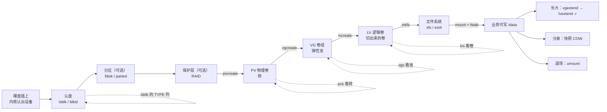
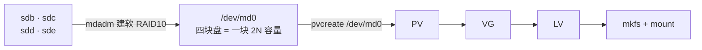
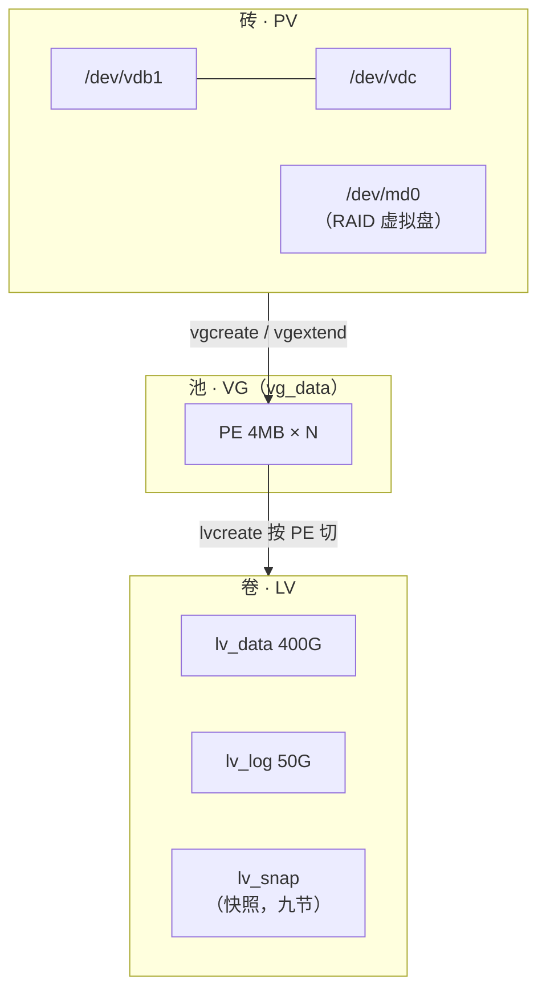
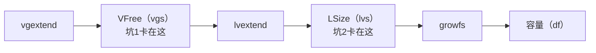
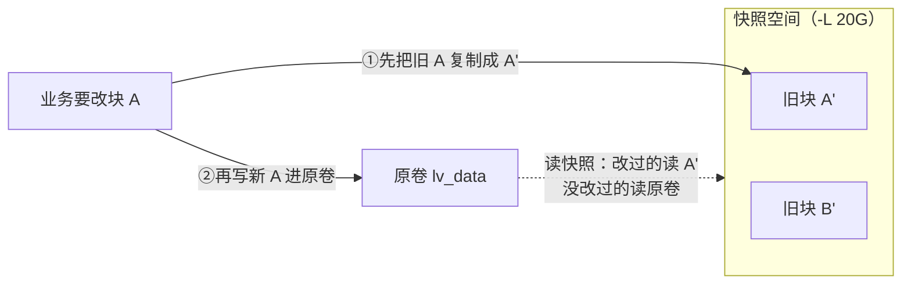
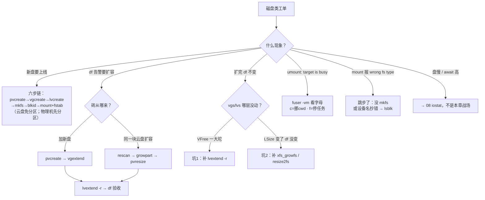

# 磁盘管理与 LVM

> 逻辑服 `/data` 用到 95%，工单批了一块 500G 新盘。新同事直接 `mount /dev/vdb /data`，报 `wrong fs type`——有人喊「reboot 一下试试」。
> **本章回答**：一块裸盘从认盘、分区、LVM、文件系统到挂载与在线扩容的全链，以及「扩完 df 不变」「umount 忙」的第一刀。
> **不讲**：盘慢与 IO 定责 → [08](../08-磁盘与IO/)；文件系统机制（inode/journal/fsck）→ [09](../09-文件系统与inode/)；备份与容灾 → [31](../31-备份与恢复/)、[33](../33-高可用与容灾/)。

**标记**：🎯重点 · 🔥难点 · ⭐常考 · 🔧实操

---

## 一、一张图：一块裸盘的一生

> 🎯 **一句话**：裸盘要过五道门才变成可用卷：认盘 → 分区 → 成砖入池 → 切卷格式化 → 挂载与扩容。



- 📖 **读图**
  - 🛤️ 主线从左往右是加盘施工顺序；分区 / RAID 可跳（云盘常两道都跳），**PV → VG → LV 一张不能少**
  - 🔭 虚线是每层观测：`lsblk` 看 TYPE；`pvs` / `vgs` / `lvs` 分别照砖、池、卷——扩容 / 快照 / 下线是「活着」期间的三件事，不是新状态

> ⚠️ **别混**：本章管「块设备怎么变成可用卷」；卷做成后的**性能**（await/脏页）→ [08](../08-磁盘与IO/)，卷上**文件怎么存**（inode/journal）→ [09](../09-文件系统与inode/)。

---

## 二、认盘：lsblk 与磁盘命名 ⭐

> 🎯 **一句话**：`lsblk` 一屏看清机器上有哪些块设备、谁是谁的爹；盘符会变，UUID 不会。

🔥 开头那位直接 `mount /dev/vdb`——**连认盘都跳了**。口诀：**「lsblk 认亲，UUID 落户」**（练习题 Q1）。

- 🔑 **块设备（block device）** = `/dev/` 下按块随机读写的设备文件
  - 动手前第一件事永远是认清盘——拿错盘，后面每一步都是事故

> 🔍 **现场**：

```bash
lsblk
```

```text
NAME                 MAJ:MIN SIZE TYPE MOUNTPOINT
sda                    8:0   200G disk
├─sda1                 8:1     1G part /boot
├─sda2                 8:2   199G part
│ └─vg_root-lv_root  253:0   199G lvm  /          # ← TYPE=lvm：根已在 LVM 上
vdb                  252:16  500G disk              # ← 无孩子、无挂载：待施工裸盘
```

- 🧭 **四列读法**
  - **NAME**：树形缩进 = 父子（分区别在盘下，LV 挂在分区下）
  - **SIZE** / **TYPE**：`disk` 整盘 · `part` 分区 · `lvm` 逻辑卷 · `rom` 光驱
  - **MOUNTPOINT**：空 = 没挂；树形本身就是答案——`vg_root-lv_root` 长在 `sda2` 下

- 📛 **三种盘符姓氏**
  - `/dev/sd*` —— SATA/SCSI/SAS/USB；字母按枚举顺序，**热插拔后可能变**
  - `/dev/vd*` —— virtio，云主机最常见
  - `/dev/nvme0n1` / `nvme0n1p1` —— NVMe；`n1` 命名空间，`p1` 分区（别把 `nvme0n11` 和 `nvme0n1p1` 搞混）

#### ❓ 为什么 fstab 不能写 `/dev/sdb`？

- ❌ **盘符只是本次开机的临时工号**：重启 / 热插拔后 `sdb` 可能变 `sdc`
- ✅ **UUID 才是身份证**：`blkid` 取，写进 fstab；人肉操作时用 `lsblk` 现场确认，别背昨天的盘符

> 🔍 **现场**：

```bash
lsblk -f /dev/vdb1
blkid /dev/vdb1
```

```text
NAME FSTYPE UUID                                   MOUNTPOINT
vdb1 xfs    a3f2c8d1-5b6e-4c7a-9d21-0123456789ab   # ← 没 mkfs 时 FSTYPE 为空
# /dev/vdb1: UUID="a3f2c8d1-…" TYPE="xfs"         # ← blkid 直接吐 UUID，写 fstab 用
```

> ⚠️ **别混**：`/dev/sdb` 本次开机内稳定 ≠ 跨 reboot 稳定。持久化一律 UUID（七节）。

> 📝 **面试**：新盘怎么确认内核认到——`lsblk` 看 TYPE=disk 新节点、`dmesg -T | tail` 看 attach；补一句「盘符不稳定，持久化用 UUID」。⭐（练习题 Q1）

本节对应练习题 Q1。盘认清了——要不要分区？MBR 还是 GPT？

---

## 三、分割：分区表与 fdisk/parted

> 🎯 **一句话**：分区是把一块盘在开头记一张目录；MBR 老、GPT 新，2TB 以上只能 GPT。

- 🔑 **分区（partition）** = 在盘开头写**分区表**，把物理盘划成逻辑段
  - 为什么还要分区：系统盘要分 `/boot` 与 `/`；一块盘要多文件系统混用
  - **纯数据盘（尤其云盘）可以整盘跳过分区**——直接 `pvcreate`，少一层间接，日后 `pvresize` 更省事（八节）

- 📜 **两种分区表**
  - **MBR**：最多 4 主分区，**寻址上限 2TB**
  - **GPT**：128 分区、容量无实际限制——**新盘一律 GPT**

| 对比 | **fdisk** | **parted** |
|------|-----------|------------|
| 交互 | 菜单式，`g` 建 GPT / `n` 新建 / `w` 写入 | 命令式，可 `--script` |
| 大盘/2TB+ | 新版可以，老版本不行 | **可以**，传统上 >2TB 首选 |
| 生产姿势 | 交互式手动改盘 | 脚本化装机 / 云镜像主流 |

#### ❓ 为什么云盘常常整盘做 PV、不分区？

- ☁️ 云数据盘无引导需求，冗余在底层三副本——**整盘 `pvcreate /dev/vdb` 是正统姿势**
- ✂️ 分区只在「一块盘要切多个用途」时才必要；本节后示例走「vdb1 有分区」和「vdc 免分区」两条线，差异只有设备名

> 🔍 **现场**：给 `/dev/vdb` 建一个 GPT 全盘分区：

```bash
parted /dev/vdb --script mklabel gpt mkpart primary 1MiB 100%
partprobe /dev/vdb            # ← 让内核重读分区表，免得 reboot 才认到
lsblk /dev/vdb
```

```text
NAME   MAJ:MIN SIZE TYPE
vdb    252:16  500G disk
└─vdb1 252:17  500G part      # ← 名字 = 盘名 + 数字
```

> ⚠️ **别混**：`mklabel gpt` 是**格式化分区表**（整盘数据没了），`mkpart` 才是**新建分区**。对着 `lsblk` 反复确认设备名再回车。

本节对应练习题 Q2。分区定了——RAID 和 LVM 谁管冗余？

---

## 四、护体：RAID 概览与叠层

> 🎯 **一句话**：RAID 把多块盘拼成性能/冗余更好的「一块虚拟盘」；LVM 不提供冗余，冗余这层要么 RAID 要么云盘底层。

- 🔑 **RAID** = 把多块物理盘按规则组织成逻辑盘
  - **硬 RAID**：阵列卡，OS 只见一块盘
  - **软 RAID**：Linux `mdadm`，OS 自己算

| RAID | 冗余 | 生产用途 |
|------|------|----------|
| 0 条带 | 无 | 拼容量提速，坏一块全没——只放可丢数据 |
| 1 镜像 | 1 块 | 系统盘：两块盘互备 |
| 5 校验 | 1 块 | 读多写少；写有惩罚 |
| 10 镜像+条带 | 每组 1 块 | 库 / 高 IO，生产推荐，至少 4 块 |



- 📖 **读图**
  - 🛡️ RAID 插在「物理盘」和「LVM」之间——上层照旧，只是 `pvcreate` 参数换成 `/dev/md0`
  - 🔁 反过来不成立：**LVM 不提供冗余**；坏一块 PV，上面的 LV 一起没

#### ❓ 为什么「先 RAID 再 LVM」，不能指望 LVM 扛坏盘？

- ❌ **「上了 LVM 所以不怕坏盘」**：VG 里坏一块 PV → 建在它上面的 LV 一起没
- ✅ **冗余在脚下**：要么 RAID，要么云盘底层三副本——**云上一般不自建 RAID**（→ [08](../08-磁盘与IO/)）
- 📌 RAID 两提醒：重建期 IOPS 近乎腰斩；RAID **不是备份**——误删照样全删（→ [31](../31-备份与恢复/)）

- 🔀 **多路径一句**：SAN 里同一块盘两条路径，DM-Multipath 合成 `/dev/mapper/mpathX`，LVM 直接吃；见到 `mpath` 知道是这回事即可

本节对应练习题 Q3。冗余归 RAID——LVM 三层到底是什么？

---

## 五、成砖：PV 与 LVM 三层结构 ⭐🔥

> 🎯 **一句话**：LVM 在「分区」和「文件系统」之间加一层池化抽象——盘成砖、砖入池、池切卷，容量从此可搬家。

🔥 分区焊死后满了怎么办？很多人答「再分一个区挂过来」——**半对**。大白话：**PV 是砖、VG 是池、LV 是切出来的卷**；弹性全来自中间那层池。⭐（练习题 Q4）

> 💡 **打个比方**：传统分区像**一排焊死的储物柜**——3 号柜满了，隔壁空着也放不进去；LVM 把柜子拆成**同一规格的乐高积木**（PE），拼成大池（VG），要多少从池里现拼箱子（LV）。箱子不够？再抓几块积木接上——**在线扩容的全部秘密**。


- 🧱 **三层身份**
  - **PV**：打了 LVM 元数据标记的盘或分区——宣告「我归 LVM 管」
  - **VG**：一个或多个 PV 堆出来的**空间池**；空闲与占用由 LVM 记账
  - **LV**：从 VG 切出的逻辑容量，对上层像盘（`/dev/vg_data/lv_data` → `/dev/mapper/vg_data-lv_data`）
  - **PE（Physical Extent）**：池内最小分配单位，**默认 4MB**——`-L 100G` 按 4MB 取整

#### ❓ 为什么不是「分区直接 mkfs」就够了？

- ❌ **分区边界焊死在盘上**：扩分区要停机、挪数据、赌运气
- ✅ **中间加池**：空间从具体盘抽象出来——扩容 = 往池里加砖再拉长卷，不碰已有数据物理位置
- 📊 **三层各有账本**：池看 `vgs`（VFree）、卷看 `lvs`（LSize）、文件系统看 `df`——「df 不变」两大坑的根源（八节）

> 🔍 **现场**：

```bash
pvs && vgs && lvs
```

```text
  PV         VG      Fmt  Attr PSize   PFree
  /dev/vdb1  vg_data lvm2 a--  500.00g 100.00g    # ← 砖：全给 vg_data，池剩 100G
  VG      #PV #LV #SN Attr   VSize   VFree
  vg_data   1   1   0 wz--n- 500.00g 100.00g    # ← 池：VFree = 还没分给任何 LV
  LV      VG      Attr       LSize
  lv_data vg_data -wi-ao---- 400.00g               # ← 卷：只切了 400G
```

> ⚠️ **别混**：`VFree`（池里未分配）≠ 文件系统已用空间——后者问 `df`。

本节对应练习题 Q4。三层懂了——从裸盘到 `/data` 可写，六步怎么敲？

---

## 六、垒池切卷：从 pvcreate 到 mount 的创建全链 🔧⭐

> 🎯 **一句话**：首次创建六步走：pvcreate → vgcreate → lvcreate → mkfs → blkid → mount，一步一个命令。

这是 [08](../08-磁盘与IO/) / [09](../09-文件系统与inode/) 都指向这里的全链考题。场景：500G `/dev/vdb` 已分好区，要做 `vg_data/lv_data`。

> 🔍 **现场**：

```bash
# ① 成砖（云盘免分区可直接 pvcreate /dev/vdb）
pvcreate /dev/vdb1
#   Physical volume "/dev/vdb1" successfully created.   # ← 只打元数据

# ② 垒池
vgcreate vg_data /dev/vdb1

# ③ 切卷：-n 名字 -L 大小；-l 100%FREE = 池里剩多少切多少
lvcreate -n lv_data -L 400G vg_data

# ④ 格式化（xfs vs ext4 → 09）
mkfs.xfs /dev/vg_data/lv_data
#   meta-data=… agcount=4 …                             # ← 看到 agcount 才算开始写

# ⑤ 取 UUID（fstab 用）
blkid /dev/vg_data/lv_data
#   UUID="a3f2c8d1-…" TYPE="xfs"

# ⑥ 挂载
mkdir -p /data && mount /dev/vg_data/lv_data /data
df -h /data
#   /dev/mapper/vg_data-lv_data  400G  33M  400G  1% /data
```

- 🪜 **顺序不可换**：没有 PV 就没有池，没有池切不出卷，没有 mkfs 的卷 mount 报 `wrong fs type`（开篇事故）
- 🔧 **日常两坑**：设备名抄错（对着 `lsblk` 现抄）；`lvcreate -L` 超过池容量（`insufficient free space` 是好事）

> 📝 **面试**：「新加一块盘到可挂载」——背六步链；**物理机**先 GPT 分区再 pvcreate，**云盘**可免分区整盘 pvcreate；收尾「fstab 用 UUID，`mount -a` 验证后才 reboot」。⭐（练习题 Q5、Q6）

### 收束：LVM 凭什么弹性



- 📖 **读图**
  - ⬆️ 物理 → 池 → 卷：任意砖（含 RAID 设备）进同一池，池揉成 PE，再切给多个卷
  - 🧬 **弹性来自中间那层池**：`vgextend` 加砖 + `lvextend` 拉卷，不碰已有数据物理位置

- ✅ **可背清单**：砖 `pvcreate`、池 `vgcreate`、卷 `lvcreate`；看 `pvs/vgs/lvs`；进砖 `vgextend`、拉卷 `lvextend`；三层账本 VFree / LSize / df

> ⚠️ **别混**：LVM 保证**容量弹性**，不保证**性能**（→ 08）也不保证**冗余**（四节）。把「上了 LVM 所以不怕坏盘」说出口，面试直接掉档。

> 📝 **面试**：记忆分组——**PV 层（pvcreate/pvresize）· VG 层（vgcreate/vgextend）· LV 层（lvcreate/lvextend）**，每层各报一个查看命令。

本节对应练习题 Q5、Q6。卷起来了——重启还在吗？fstab 怎么写才不翻车？

---

## 七、落地：挂载与 fstab 持久化 🔧⭐

> 🎯 **一句话**：mount 只管本次；重启还在，要写进 `/etc/fstab`，且用 UUID。

第六节的 `mount` 是一次性的——重启即失。持久挂载写进 `/etc/fstab`，六个字段：

```text
UUID=a3f2c8d1-5b6e-4c7a-9d21-0123456789ab  /data  xfs  defaults,noatime  0  0
# ↑设备：blkid 取，别写 /dev/vdb1             ↑挂载点 ↑类型 ↑选项           ↑dump ↑fsck顺序
```

- 📋 **逐字段**
  - **设备**：UUID（二节——盘符会漂）
  - **挂载点**：目录要先存在
  - **类型**：xfs / ext4 / nfs / swap…
  - **选项**：`defaults` + 数据盘常开 `noatime`
  - **dump**：现代全是 0
  - **fsck 顺序**：根 1、其他 2、**0 = 不检查**——xfs 坏了用 `xfs_repair`（→ [09](../09-文件系统与inode/)）

> 🔍 **现场**：**先验证再允许 reboot**：

```bash
mount -a            # ← fstab 里没挂的都挂一遍；报错就改，此时 reboot 会起不来
findmnt /data
df -hT /data
```

```text
TARGET SOURCE                         FSTYPE OPTIONS
/data  /dev/mapper/vg_data-lv_data    xfs    rw,relatime,noatime
```

#### ❓ 为什么关键盘不能加 `nofail`？

- ❌ **给关键存档盘加 nofail**：挂不上还静默起业务，数据写进空目录
- ✅ **`nofail` 只给可缺的盘**；「日志写丢」完整机制 → [09](../09-文件系统与inode/)；fstab 深坑（_netdev、救援模式）也在 09

- 💾 **swap 一句**：可做成 LV（`lvcreate` + `mkswap` + `swapon`），或 **swapfile** 四步：`fallocate` → `chmod 600` → `mkswap` → `swapon`。大小与 swappiness → [07](../07-内存与OOM/)

本节对应练习题 Q7。挂上了——业务涨了要扩容，为什么有人扩完 df 不变？

---

## 八、长大：在线扩容与 df 不变的两大坑 🔥⭐🔧

> 🎯 **一句话**：扩容链三步：vgextend 进砖 → lvextend -r 拉卷并同步扩文件系统 → df 验收，全程不停业务。

🔥 `vgextend` 成功了，`df` 该不该立刻变大？——**不该**。口诀：**「三层账本：vgs 看池、lvs 看卷、df 看文件系统；哪层没动补哪层」**（练习题 Q8、Q9）。

- 📈 **路径 A：加新盘**（最常见）

> 🔍 **现场**：

```bash
pvcreate /dev/vdc                    # ← 新盘成砖（免分区直上）
vgextend vg_data /dev/vdc            # ← 砖入池：VFree 立刻 +500G
lvextend -r -L +200G /dev/vg_data/lv_data
df -h /data
```

```text
Size of logical volume vg_data/lv_data changed from 400.00 GiB …
meta-data=…                        # ← -r 连 FS 一起扩（xfs_growfs）
/dev/mapper/vg_data-lv_data  600G  320G  280G  54% /data
```

- ☁️ **路径 B：同一块云盘在线扩容**（控制台把盘从 500G 扩到 1T 后）

```bash
echo 1 > /sys/class/block/vdb/device/rescan   # ← 内核重读盘容量
growpart /dev/vdb 1                            # ← 有分区时先顶分区边界
pvresize /dev/vdb1                             # ← 免分区则 pvresize /dev/vdb
lvextend -r -l +100%FREE /dev/vg_data/lv_data
```

- ⚡ **`lvextend -r`**：拉 LV 同时自动扩 FS（xfs → `xfs_growfs`，ext4 → `resize2fs`）
  - 老系统无 `-r` 时手动两步：

```bash
lvextend -L +200G /dev/vg_data/lv_data   # ← 只拉 LV
xfs_growfs /data                         # ← xfs 跟【挂载点】
resize2fs /dev/vg_data/lv_data           # ← ext4 跟【设备】
```

> ⚠️ **别混**：`xfs_growfs` 跟**挂载点**、`resize2fs` 跟**块设备**——跟错对象直接报错。

### df 不变的两大坑 🔥

一个签名（df 不变）、两种病——**先看 vgs/lvs 再看 df**：

1. **扩了 VG 忘了 LV**：`vgs` 的 VFree 一大坨，`lvs` 没变 → 补 `lvextend -r`
2. **扩了 LV 忘了文件系统**：`lvs` 变大、`df` 不变（最常见）——superblock 还按旧容量记账 → 补 `xfs_growfs` / `resize2fs`



- 📖 **读图**：哪层数字没动，就补哪层——别反复 `vgextend` 白干

#### ❓ 为什么 vgextend / lvextend 成功了，df 还可以不变？

- 🏪 **打个比方**：VG=仓库、LV=货架、文件系统=账本
  - **坑 1** = 仓库扩了面积却没加新货架
  - **坑 2** = 货架加长了，账本还按旧长度记——收银（df）当然显示老数字
- ✅ **`lvextend -r`** = 加货架的同时自动改账本

> 📝 **面试**：「lvextend 之后 df 没变」——先反问哪一层：`vgs` → `lvs` → `df`；答案常落在「没带 `-r`」；补一句 XFS 用 `xfs_growfs` 跟挂载点。⭐（练习题 Q8、Q9）

> 🔍 **现场**：扩容验收三连

```bash
vgs vg_data && lvs vg_data && df -h /data
```

本节对应练习题 Q8、Q9。扩容链通了——快照为什么会让 df 比 du 大？

---

## 九、分身：快照原理与 df 不等于 du ⭐🔥

> 🎯 **一句话**：快照靠写时复制——改块前先把旧块搬进快照空间，旧块不释放，df 和 du 从此对不上。

🔥 「做了快照空间泄漏」是**高频错答**。大白话：**COW = 改块前先把旧块复印进快照区，旧块不释放**。⭐（练习题 Q10）

- 🔑 **快照（snapshot）** = 某一时刻 LV 的冻结视图
  - 最大用途：**一致性备份点**——先快照、再对着快照备份，业务继续写原卷（备份本身 → [31](../31-备份与恢复/)）

> 💡 **打个比方**：快照不是整本账复印一份，而是给账本拍了张「封面照片」；之后每要改一页，**先把这页旧内容复印存进快照区**再动笔——照片永远能看到「拍照时刻」的全书。



- 📖 **读图**
  - 📸 创建快照是**零拷贝**（几秒完成，不管 LV 多大）；每次「首次改某块」才触发旧块搬运
  - 💣 原卷改得越凶，快照越快满；`Data%` 顶到 100% → 快照**失效**（invalid）

#### ❓ 为什么做了快照之后 df 比 du 大、rm 后空间也不全回来？

- ❌ **「空间泄漏 / 文件系统坏了」**：错；是 COW **持有旧块不释放**
- ✅ **du 顺目录树只算用户文件**，看不见快照区旧块；`lvremove` 删快照立即归还
- 📏 快照该多大：取决于存活期间原卷**写入量**（短窗口备份给源 LV 的 10%~20%），不是 LV 大小；用完即删，监控 `Data%`

> 🔍 **现场**：

```bash
lvcreate -s -n lv_data_snap -L 20G /dev/vg_data/lv_data   # ← -s = 快照
lvs
mount /dev/vg_data/lv_data_snap /mnt/snap
```

```text
  LV           VG      Attr       LSize   Origin  Data%
  lv_data      vg_data owi-aos---- 400.00g
  lv_data_snap vg_data swi-a-s----  20.00g  lv_data  8.42
  # ↑ Attr 的 s = snapshot；Data% = 旧块吃掉的比例，100% = 失效
```

> ⚠️ **别混**：LVM 快照**不等于备份**——快照和原卷同 VG，盘坏两者一起没。它是「备份进行时的冻结点」和「改坏前的后悔药」（→ [31](../31-备份与恢复/)）。云盘快照是另一套东西（→ [33](../33-高可用与容灾/)）。

> 📝 **面试**：做了快照 df 变大 / rm 后空间没全回来——答 COW 持有旧块；删快照归还。追问大小：看写入量，不是 LV 大小。⭐（练习题 Q10）

本节对应练习题 Q10。快照懂了——想缩容、umount 报 busy，怎么退场？

---

## 十、退场：缩容、umount 忙与安全下线

> 🎯 **一句话**：XFS 只扩不缩；umount 报 busy 先找占用的进程，别硬拔。

#### ❓ 为什么生产口径是「不做缩容」？

- ❌ **「XFS 在线缩一下」**：XFS **根本不支持缩容**——只能备份 → 删 LV 重建小卷 → 恢复
- ⚠️ **ext4 缩容**：要 umount，且顺序严苛——先 `resize2fs` 缩 FS、**再** `lvreduce`；顺序反了 = 截断数据
- ✅ **腾容量正路**：在 VG 里另切 LV 迁移数据，别拿生产卷练手

- 🚪 **umount 报 busy**：三个工具一层层收网

> 🔍 **现场**：

```bash
umount /data
# umount: /data: target is busy.
fuser -vm /data          # ← -v 详情 -m 按挂载点
```

```text
USER        PID ACCESS COMMAND
root      12847 ..c.. game-serv      # ← c = cwd：工作目录在 /data 下，最常见
root      28451 f.... tar            # ← f = 打开着文件：tar 正在备份
```

```bash
lsof +D /data           # ← 大目录慢，先 fuser
cd / && umount /data    # ← cwd 占用：挪走再 umount；文件占用：停写/停任务
```

#### ❓ 为什么不能 `umount -l` 糊弄？

- ❌ **lazy 卸载**：挂载点「看起来卸了」，占用进程还在往旧句柄写——问题更晚更难查
- ✅ **`fuser -vm` 字母是答案**：`c` = 挪 cwd（你自己 shell 在 `/data` 里也会 busy，先 `cd /`）；`f` = 停任务或协调停写，别乱 kill 业务（信号 → [05](../05-进程与信号/)）

- 🛑 **安全下线顺序**（倒着走施工链）：停写入 → umount → 注释 fstab → `lvremove` / `vgreduce` → `pvremove`
  - 先 umount 再动 fstab——反了，下次 reboot 进紧急模式（→ [04](../04-内核与系统/)）

本节对应练习题 Q11、Q12。现在看开头那个 `wrong fs type` 和 `target is busy`——60 秒怎么定责？

---

## 十一、作战：加盘扩容定责 🔧

> 🎯 **一句话**：新盘按六步链施工；扩容后 df 不变按三层账本查；umount 忙按 fuser 的字母查。

### 决策树



- 📖 **读图**
  - 🚪 入口按现象分五路：施工 / 扩容 / df 不变 / busy / 报错
  - ⚠️ 两条最容易走错：`df 不变` 不回头查三层账本会反复扩容白干；`盘慢` 误入本章——真战场在 [08](../08-磁盘与IO/)

### 现象 · 先做 · 别做

| 现象 | 先做 | 别做 |
|------|------|------|
| 新盘 mount 报 wrong fs type | `lsblk -f` 看有没有 FSTYPE | 直接 reboot 试试 |
| df 85% 告警 | `vgs` 看 VFree，定加盘还是扩盘 | 等到 100% 再动 |
| lvextend 后 df 不变 | `vgs` + `lvs` 对三层账本 | 再扩一次 VG 以为没生效 |
| xfs 想缩容 | 备份 → 重建小卷 → 恢复 | `lvreduce` 硬缩 |
| umount 报 busy | `fuser -vm /data` 看字母 | `umount -l` 糊弄 |
| 快照 Data% 飙到 90% | 删快照或扩快照空间 | 等它 100% 失效 |
| df 比 du 大很多且有快照 | `lvs` 看 Data% | 先在 09 四条路里打转 |
| fstab 改完 | `mount -a` 验证 | 未验证直接 reboot |

### 60 秒剧本 🔧

```text
① 0–10s   lsblk；df -h /data        # ← 设备树 + 容量水位
② 10–30s  pvs && vgs && lvs         # ← 三层账本：砖/池/卷哪层断了
③ 30–45s  按决策树补缺：lvextend -r / growfs / fuser
④ 45–60s  验收 df；写 fstab 的跑 mount -a；
          「慢」转 08 iostat，别在这章抠
```

本节对应练习题 Q13、Q14。开头那位直接 `mount /dev/vdb`——你已经知道该怎么拦住他了。

---

## 十二、收口

> 🎯 **一句话**：一条施工链、三层账本、两个 df 坑、一个 COW——带走这四样，本章就齐了。

### 命令速查 🔧

```bash
# 认盘
lsblk && lsblk -f
blkid /dev/vdb1
dmesg -T | tail
# 分区（物理机）
parted /dev/vdb --script mklabel gpt mkpart primary 1MiB 100%
partprobe /dev/vdb
# 创建全链
pvcreate /dev/vdb1 && vgcreate vg_data /dev/vdb1
lvcreate -n lv_data -L 400G vg_data && mkfs.xfs /dev/vg_data/lv_data
# 查看（三层账本）
pvs && vgs && lvs
# 扩容
pvcreate /dev/vdc && vgextend vg_data /dev/vdc          # ← 加盘
pvresize /dev/vdb1                                      # ← 同盘（先 growpart）
lvextend -r -L +200G /dev/vg_data/lv_data               # ← -r 一步到位
xfs_growfs /data                                        # ← xfs 跟挂载点
resize2fs /dev/vg_data/lv_data                          # ← ext4 跟设备
# 快照
lvcreate -s -n snap -L 20G /dev/vg_data/lv_data
lvs                                                     # ← 看 Data%
lvremove /dev/vg_data/snap
# 下线
fuser -vm /data
lsof +D /data
umount /data
# 持久挂载
blkid                                                   # ← 取 UUID
mount -a && findmnt /data
```

### 面试锚点

| 问 | 30 秒答 |
|----|---------|
| 新盘到可挂载的流程？ | 六步链：pvcreate→vgcreate→lvcreate→mkfs→blkid→mount+fstab；物理机先 GPT，云盘可免分区 |
| PV/VG/LV 各是什么？ | 砖/池/卷：PV 打标记的盘，VG 空间池（PE 默认 4MB），LV 从池切出的逻辑设备；pvs/vgs/lvs 各看一层 |
| 为什么要 LVM？ | 分区焊死，池化后可在线扩、多盘拼池、可快照；不提供冗余和性能 |
| 在线扩容怎么做？ | 加盘：pvcreate→vgextend→lvextend -r；同盘云盘：rescan→growpart→pvresize→lvextend -r |
| lvextend 后 df 没变？ | 三层账本：VFree 没给 LV 或 LV 没扩 FS；`-r` 一步到位；xfs_growfs 跟挂载点 |
| XFS 能缩吗？ | 不能，只扩；ext4 缩也要 umount 且先缩 FS 再缩 LV；生产不缩、迁移重建 |
| 快照原理？ | COW：改块前旧块进快照区；创建零拷贝、Data% 满即失效；≠ 备份 |
| 做了快照 df 为什么比 du 大？ | 旧块不释放，du 看不见；删快照即归还 |
| RAID 怎么配？ | 库 RAID10、系统盘 RAID1、读多写少 RAID5；云盘不自建；RAID 上再叠 LVM |
| LVM 提供冗余吗？ | 不。坏 PV 连坐 LV；冗余靠 RAID 或云盘 |
| umount busy 怎么办？ | fuser -vm：c=挪 cwd、f=停任务；别 umount -l |
| fstab 用什么标识盘？ | UUID；关键盘不加 nofail；mount -a 验证后才 reboot |

### 易错一句话对照

- 「加了盘 /data 就自动变大」→ 还要 vgextend + lvextend + 扩 FS，df 才认
- 「vgextend 完扩容就完成了」→ 坑1：VFree 只是躺在池里
- 「lvextend 完 df 就该变」→ 坑2：不带 `-r` 不扩文件系统
- 「xfs_growfs 跟设备」→ 跟挂载点；resize2fs 才跟设备
- 「XFS 在线缩一下」→ XFS 不支持缩容，缩容 = 备份重建
- 「快照是备份」→ 同 VG 共生死，只是冻结点/后悔药
- 「快照期间 df 比 du 大是空间泄漏」→ COW 持有旧块，删快照即归还
- 「上了 LVM 不怕坏盘」→ LVM 无冗余，坏 PV 连坐 LV
- 「umount busy 就 umount -l」→ 懒卸载让旧句柄继续写
- 「fstab 写 /dev/sdb1 简洁」→ 盘符会漂，一律 UUID
- 「fstab 改完顺手 reboot」→ `mount -a` 通过才允许 reboot
- 「盘慢查 LVM」→ await/队列是 08 的战场

### 数字墙

> **MBR** 上限 2TB / 4 主分区 · **GPT** 128 分区 · **PE** 默认 4MB · 盘使用率 **85% 当故障**（→ 08）· `lvextend -r` = 扩 LV + 扩 FS **一步** · XFS **只扩不缩** · 快照空间 ≈ 存活期**写入量**（短窗口 10%~20%）· 快照 **Data% 100% = 失效** · RAID 10 至少 **4 块** · fstab 六字段（根 fsck=1 · 其他 2 · 0 不查）· swapfile 权限 **600** · `mount -a` 是 reboot 前的**唯一**验证

---

## 合上书

- [ ] **默画主图**：裸盘 → 认盘 → 分区（可选）→ RAID（可选）→ PV → VG → LV → mkfs → mount/fstab → 扩容/快照/退场；`lsblk`、`pvs`/`vgs`/`lvs` 各照哪一段
- [ ] **口述认盘**：lsblk 四列、TYPE=disk/part/lvm、三种盘符姓氏、为什么 fstab 认 UUID
- [ ] **口述分区**：MBR vs GPT、fdisk vs parted、云盘免分区的理由
- [ ] **讲清 RAID**：0/1/5/10 各一行、「先 RAID 再 LVM」、LVM 为什么不提供冗余、云上为什么不自建
- [ ] **口述三层**：PV/VG/LV/PE、储物柜与乐高比方、三层账本各用什么命令看
- [ ] **默写创建全链**：六步链每步命令与预期输出；物理机与云盘两条线差异
- [ ] **口述扩容**：加盘与同盘云盘两条路径；`-r` vs 手动两步；xfs_growfs/resize2fs 各跟什么
- [ ] **分型**：df 不变两大坑的签名与补法
- [ ] **讲清快照**：COW 三步、为何零拷贝、Data%、持有旧块 → df≠du、为什么不是备份
- [ ] **口述退场**：XFS 不缩、ext4 缩容顺序、fuser 字母、umount -l 为何糊弄、安全下线顺序
- [ ] **作战**：60 秒剧本四步；哪些现象该转 08/09
