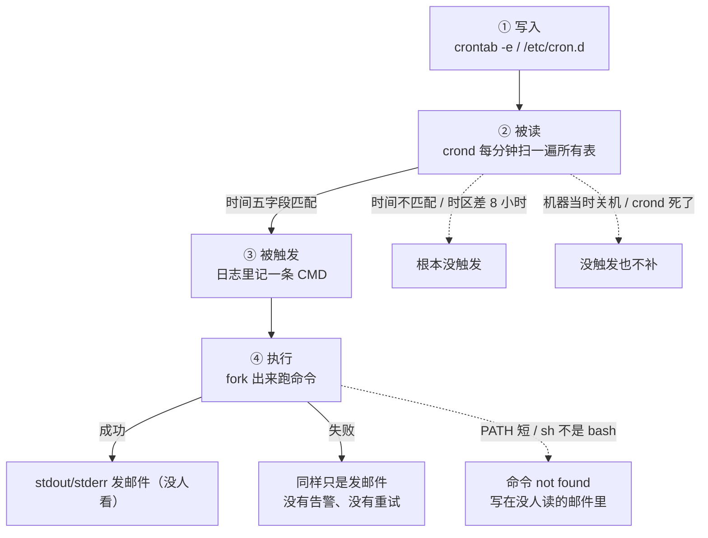
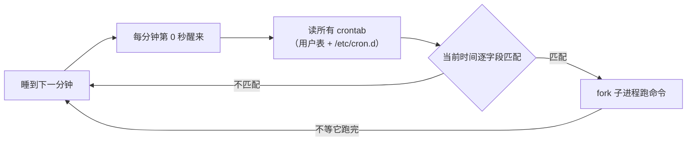
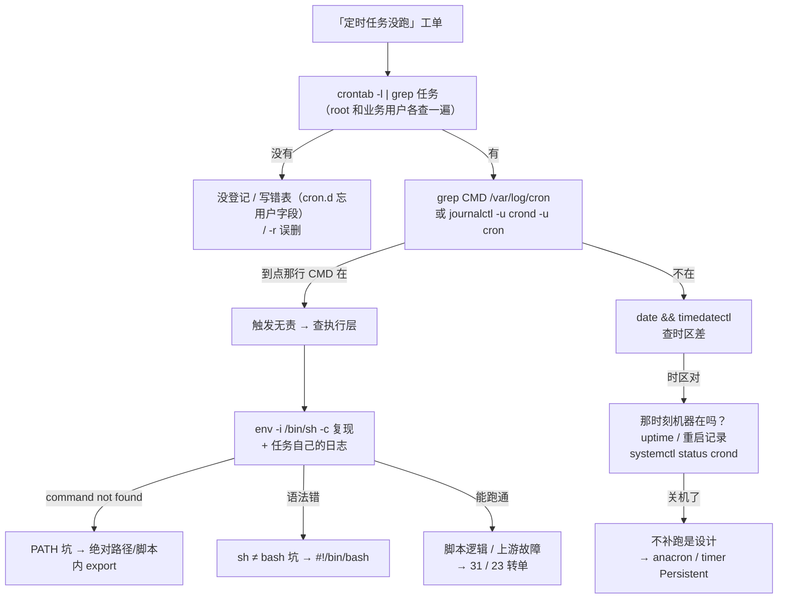

# 定时任务与 Cron

> 大家好，欢迎来到这次分享。开讲之前，先带大家回到一个很多值班同学都经历过的现场：
> 每天凌晨 2 点的全服备份连着三天没跑，白天手动一跑就成功——没有报错、没有告警，直到活动日要回档才发现存档停在三天前。群里已经有人在骂「备份脚本又坏了」，手伸向改脚本。
> 这一章讲完，你会知道当时那个人错在哪，以及「定时没跑」该沿哪四个驿站查。
> **本章回答**：一条 cron 任务从写进 crontab 到被调度、被执行（或安静地没执行）的一生，以及「定时没跑」怎么在 60 秒内定位。
> **不讲**：systemd unit 机制与 timer 深讲 → [11](../11-Systemd与服务管理/)；机器时间从哪来、时区怎么换算 → [32](../32-NTP与时间同步/)；备份策略本身 → [31](../31-备份与恢复/)。这些都有专门的章节，本章只在用到时点到为止。

**标记**：🎯重点 · 🔥难点 · ⭐常考 · 🔧实操

**怎么听这场分享**：咱们先看第一节的主图，把「一条 cron 任务的一生」装进脑子；第二到第七节顺着写入 → 被读 → 环境 → 无声失败 → flock → timer 往下走；作战节专门讲定责，也就是开头那个现场的正确解法。每一节讲完都会提示对应练习题，学完就去练。

---

## 一、一张图：一条 cron 任务的一生

> 🎯 **一句话**：cron 任务的一生是四个驿站——写入、被读、被触发、执行或无声地死，每个驿站都有专属的翻车点。

咱们先不急着背五字段。学 cron 最怕的就是「手动能跑、定时不行」却只会改脚本。先看图，把四个驿站装进脑子里：



**读图**：带着三个问题看这张图，比背 crontab 语法有用得多——主干是①→②→③→④，注意终点没有「报错」这个出口——cron 的世界里**失败是无声的**，stdout/stderr 默认只进邮件。三条虚线是「任务没跑」的三大家族：**没写对**（时间字段/时区）、**没机会跑**（关机/crond 死了）、**跑了但秒死**（环境差异）——后面每一节各治一家。

### 把主图走活：那单「备份三天没跑」

凌晨 2 点备份连挂三天、手动能跑——对着主图四步走：

**① 写入**——`crontab -l` 确认任务在、时间字段 `0 2 * * *` 没写错。在，排掉「根本没登记」。

**②③ 被读与触发**——`grep 'backup' /var/log/cron`：每天 02:00 都有一条 `CMD (/opt/game/backup.sh)`。**触发了**，排掉时区和关机两家。

**④ 执行**——CMD 记了但备份文件没出来：命令被 fork 出去后**秒死了**。`env -i /bin/sh -c '/opt/game/backup.sh'` 一复现：脚本里裸写 `mysqldump`，cron 的 PATH 里没有它——`command not found` 这行字，正安静躺在没人读的邮件里。

**⑤ 收口（防复发）**——修复不是只改那一行：脚本内 `export PATH` + `cd` 绝对目录（四节修法三件套），表里补 `>> /var/log/backup.log 2>&1` 让下次有据可查，成功收尾加 `&& touch /var/run/backup.ok` 心跳（五节）——同一类事故这辈子第二次都不该出现。

三天的根因一分钟定位完。这就是全章的路线图：**排障不是盯着脚本看，是沿着四个驿站逐个问「这步发生了吗」**。

---

---

好，主图有了。咱们正式出发——第一站：一行 crontab 怎么写才对？

---

## 二、出生：把任务写进 crontab ⭐

> 🎯 **一句话**：一行 crontab = 五个时间字段 + 一条命令；语法读不对，后面全白搭。

### 2.1 一行的解剖

```text
  0 2 * * * /opt/game/backup.sh >> /var/log/backup.log 2>&1
# ↑ ↑ ↑ ↑ ↑
# 前五段是时间，从左到右依次：分 时 日 月 周（第六段起是命令本身）
```

⭐ 五字段记「**分时日月周**」——从最小单位读到最大。各自的取值范围：

| 字段 | 取值范围 |
|------|----------|
| 分 | 0–59 |
| 时 | 0–23 |
| 日 | 1–31 |
| 月 | 1–12 |
| 周 | 0–7（0 和 7 都是周日） |

每个字段三种写法：

| 写法 | 含义 |
|------|------|
| `*` | 每个（这一位任意值都匹配） |
| `*/n` | 每隔 n：`*/5` 在分位 = 每 5 分钟 |
| `a-b,c,d` | 范围加列表：`1-5` 工作日、`8,12,18` 指定点 |

读几个常见的（**读得出才写得对**）：

```text
*/5 * * * *     每 5 分钟
0 2 * * *       每天凌晨 2:00
30 4 * * 1-5    工作日（周一到周五）4:30
0 0 1 * *       每月 1 号 0:00
0 18 * * 5      每周五 18:00
```

> ⚠️ **别混**：日和周**同时**写了具体值，语义是「**或**」不是「且」——`0 0 1 * 1` 是「每月 1 号**和**每个周一」都跑，不是「每月 1 号且是周一」。想要「且」，判断写进脚本里。

### 2.2 六个特殊字符串

```text
@reboot          开机后跑一次（crond 启动时）
@yearly / @annually   每年 1 月 1 日 0:00
@monthly         每月 1 日 0:00
@weekly          每周日 0:00
@daily / @midnight   每天 0:00
@hourly          每小时 0 分
```

⭐ `@reboot` 是唯一不带时间语义的：**crond 启动那一刻**触发一次——注意它不等网络就绪、不等业务起来，「开机后拉起某个守护」的诉求交给 systemd unit 更对（→ [11](../11-Systemd与服务管理/)）。

### 2.3 三张表放任务，位置决定格式

- **用户表**（`crontab -e` 编辑）：五字段 + 命令，存在 `/var/spool/cron/<用户名>`，以该用户身份跑——root 的表就是 root 权限
- **`/etc/crontab` 和 `/etc/cron.d/xxx`**（系统表）：**多一个用户字段**——`0 2 * * * game /opt/game/backup.sh`，中间的 `game` 是执行身份。**五字段直接抄进系统表会把它当用户名，整行不跑还难查** 🔥
- **`/etc/cron.daily/`、`cron.hourly/` 等目录**：扔进去一个可执行脚本，每天/每小时跑一次（anacron 驱动，见七）

`crontab` 三个子命令必须条件反射：**`-e` 编辑、`-l` 列出、`-r` 删除整表**。🔥 `-r` 挨着 `-e`、**没有任何确认**、删完就没了——「想 -e 结果手滑 -r」是上古惨案；习惯用 `crontab -l > 备份文件` 先存一份，改完 `crontab -l` 回读确认。

### 2.4 表头能写变量：SHELL、PATH、MAILTO

crontab 不是只能放任务行——**没缩进的 `名字=值` 行是给后续所有任务行设环境**的表头（/etc/cron.d 里同用法）：

```text
SHELL=/bin/bash                  # ← 把默认 /bin/sh 换成 bash：四节的坑③从表头层面拆掉
PATH=/usr/local/mysql/bin:/usr/bin:/bin   # ← 给所有任务行补 PATH：坑①的表头级修法
MAILTO=""                        # ← 关掉邮件
0 2 * * * /opt/game/backup.sh >> /var/log/backup.log 2>&1
```

表头修法 vs 脚本内修法：表头**只救这张表**，且要求所有任务行真的在这张表里；脚本内 `export PATH`（四节）**跟着脚本走**，换表、换机器、被 timer 调都不丢。**复杂任务一律脚本内自理，表头只做兜底**——两层都设不冲突。

### 2.5 谁能用 crontab：allow/deny 一句话

`/etc/cron.allow` 存在时**只有**列在里面的用户能用 crontab；否则看 `/etc/cron.deny`，deny 里的被拒；两个都不存在时全开放（Debian 系）或只许 root（RHEL 系默认）。排障遇到「普通用户 `crontab -e` 报 not allowed」，答案在这两个文件——这是权限问题不是玄学（用户与权限体系 → [25](../25-用户权限与特殊位/)）。

### 2.6 翻译练习：把人话翻成表达式

写表前先做一遍口头翻译，翻不出来说明语义还没想清——这步省了，后面就是排障：

```text
「每天凌晨 2 点」            0 2 * * *
「工作日每天 8 点 40」       40 8 * * 1-5
「每 10 分钟一次」           */10 * * * *
「只在周六和周日」           0 0 * * 6,0      ← 0 是周日；也可写 6,7
「季度第一天」               0 0 1 1,4,7,10 *
「每月最后一天」             写不出！月末 28~31 不定：圈出候选日 + 脚本精判
```

「每月最后一天」暴露了 cron 表达力的边界：字段语义没有「最后」概念。这类需求的通用分工是**表达式管粗筛、脚本管精判**——`0 0 28-31 * *` 圈出候选日，脚本第一行 `[ "$(date -d tomorrow +%d)" = "01" ] || exit 0` 精判。想清楚这层分工，一半的「时间写错」事故在写表前就消灭了。

> 📝 **面试**：问「crontab 怎么用」不要只答 `-e`——带出三张表的位置与差异（用户表五字段、`cron.d` 多一个用户字段、目录扔脚本）、表头能设 SHELL/PATH/MAILTO，最后补一句「`-r` 无确认要备份」，条理分立刻出来。

---

---

写入段到这儿。本节对应练习题 Q1、Q2。好，语法会了——crond 什么时候读表、时区差 8 小时会怎样？

---

## 三、被读：crond 怎么调度到你 ⭐

> 🎯 **一句话**：crond 每分钟醒一次、扫一遍所有表、匹配就 fork——它只保证「到点开枪」，不保证「打中了」。

**crond（cron daemon，cron 守护进程）** 的工作循环极其朴素：



**读图**：从左边睡到醒来是每分钟一圈的节拍器；关键在最后一步——fork 之后**立刻回去睡**，不等命令跑完（这正是六节重叠问题的源头）；匹配失败的行什么都不发生，连日志都不会有——「没匹配」是无声的，所以排障要靠「日志里有没有 CMD」反推（五节）。

一句话版：**每分钟第 0 秒醒来 → 读所有 crontab（含 /etc/cron.d）→ 拿当前时间逐字段匹配 → 匹配的行 fork 一个子进程跑命令 → 睡到下一分钟**。实现有好几个流派（RHEL 系的 cronie、经典的 vixie-cron、Debian 的 cron），行为大同小异、服务名却不同（crond vs cron）——下面所有命令把两个名字都带上，就是防这个。三个推论要刻进脑子：

⭐ **最小粒度是 1 分钟**——`*/1` 就是极限，没有「每 30 秒」这种写法。真要秒级：要么脚本内部自己 `sleep` 循环，要么 systemd timer 的 `OnUnitActiveSec=30s`（→ [11](../11-Systemd与服务管理/)）。

⭐ **错过的就是错过了，没有补跑**——2 点那台机器在重启，2:00 的匹配窗口过去就过去，crond 不会在 2:20 补枪。「补跑」需求走 anacron 或 timer 的 `Persistent=true`（七节）。

⭐ **匹配的是机器本地时间**——时区坑在这里爆发（下面单独说）。

### crond 自己活着吗：排障前的第零问

上面三个推论都默认 crond 在跑。「任务没跑」的最粗一层是 **crond 进程本身没了**——被误杀、起不来、机器根本没起 cron 服务。一次 `systemctl status` 三秒排掉：

> 🔍 **现场**：
> ```bash
> systemctl status crond cron 2>/dev/null | head -6
> ps -ef | grep -v grep | grep '[c]rond'
> # 两个都没有输出 = crond 没在跑：systemctl start crond && systemctl enable crond
> ```
> 顺手 `systemctl is-enabled crond`——见过「上次装机忘了 enable，重启后全表停摆」的事故，一张表都没删，只是没人去扫表。

### 时区：UTC 机器上的「2 点没跑」🔥

云上机器很多装系统时默认 **UTC**，`date` 出来的 02:00 是**伦敦凌晨 2 点 = 北京上午 10 点**。你按北京时间写 `0 2 * * *`，任务在北京时间上午 10 点才跑；你以为「没跑」，其实它每天准点跑——只是那个点不在你预期里。另外改时区后 **crond 要重启**才认（它缓存了时区）：`timedatectl set-timezone Asia/Shanghai && systemctl restart crond`。时间从哪来、NTP 为什么不能停 → [32](../32-NTP与时间同步/)。

> 🔍 **现场**：写任何定时任务前先问机器「你的表是哪的表」：
> ```bash
> date; timedatectl | grep 'Time zone'
> # Time zone: UTC (UTC, +0000)   ← 表是 UTC 的：北京时间 2:00 = 这里的 18:00 前一天
> ```

### MAILTO：默认的「通知渠道」是个没人读的邮箱

crond 默认把每条任务的 **stdout/stderr 用邮件发给任务属主**（本机 mailbox）。前提是装了并配了 MTA——云上精简镜像通常**没有**，于是输出被静默丢弃。两条正路：

- 任务行尾自己重定向：`>> /var/log/backup.log 2>&1`——把输出落到能查的地方（**首选**）
- 表头写 `MAILTO=""` 明确关掉，或 `MAILTO=ops@example.com` 真把邮件送出去

日志体系（journald/rsyslog 落盘与轮转）→ [23](../23-日志运维/)；本章只管「cron 任务的输出去哪了」这一段。

> 📝 **面试**：问「crond 怎么调度」三句答——**每分钟醒来扫一遍所有表、时间字段匹配就 fork、只管开枪不管结果**；三个推论各跟一个问题：秒级做不到、错过不补跑、匹配的是机器本地时间。把「闹钟」这个定位说死，后面所有坑都顺理成章。

---

---

被读段到这儿。本节对应练习题 Q3、Q4。好，触发懂了——为什么手动能跑、cron 里秒死？

---

## 四、干活：cron 的环境和你的环境是两个世界 🔥⭐

🔥 开头「手动能跑、定时不行」——**高频错答是改脚本**。大白话：**cron 的 PATH 极短、shell 是 sh 不是 bash，你登录态带的环境它一份都没有**。口诀：**「能跑≠会跑：先 env -i /bin/sh -c 复现」**（练习题 Q5、Q6）。

> 🎯 **一句话**：「手动能跑、定时跑不了」九成是环境差异——cron 用一个短 PATH、不读 bashrc 的干净世界跑你的命令。

> 💡 **打个比方**：cron 是**凌晨来替班的实习生**——你桌上的东西（你 shell 里 `export` 的一切）他一概不知，只认识公司前台清单上的工具（系统默认 PATH）。你留张字条「跑那个备份」，他找不到工具箱，只好在小票上写一句 not found 塞进没人开的信箱。白天你一问「昨晚跑了吗」，他说没听见啊。

机制一句话：crond 起的命令跑在**非登录、非交互的 `/bin/sh`** 里——`.bash_profile`、`.bashrc` 都不会被读，`source` 过的环境变量、别名、函数统统不存在。两个世界并排看：

| | 你的交互 shell | cron 的世界 |
|------|------|------|
| PATH | 长长一串，含 /usr/local/bin、/opt/xxx/bin | `/usr/bin:/bin`，只有最短清单 |
| SHELL | /bin/bash（登录 shell） | /bin/sh（非登录非交互；Debian 系是 dash） |
| 启动时读了什么 | /etc/profile → ~/.bashrc，一层层 source | 什么都不读 |
| 你 export 的变量 | 全都在 | 一个都没有 |
| cwd | 你 cd 到哪是哪 | 不确定，别依赖 |
| tty | 有 | 没有 |

三大坑：

**坑 ①：PATH 只有系统默认的最短清单**。cron 环境里典型是 `PATH=/usr/bin:/bin`——`/usr/local/bin`、`/opt/xxx/bin` 下的工具全部「不存在」：`mysqldump: command not found`。这是第一大根因。

**坑 ②：HOME 变了、相对路径悬空**。cron 里 `cd backup && ./run.sh` 的相对路径不从你以为的目录出发；`~/.my.cnf`、`./config.yaml` 这类依赖 HOME 和 cwd 的配置读不到。**脚本第一行先 `cd` 到绝对目录**，配置写绝对路径。

**坑 ③：`/bin/sh` 不是 bash**。Debian/Ubuntu 上 sh 是 dash，你顺手写的 bashism——`[[ ]]`、`source`、数组、`function` 关键字——直接语法报错。脚本头写 `#!/bin/bash` 并用绝对路径调脚本本体，别指望表里的 `sh xxx.sh`。

> 🔍 **现场**：让实习生摊开他的口袋——看 cron 环境到底长什么样：
> ```bash
> # 临时任务：把环境打出来给自己
> * * * * * env > /tmp/cron-env.txt
> ```
> ```text
> PATH=/usr/bin:/bin          ← 比你交互 shell 的 PATH 短一大截
> HOME=/root
> SHELL=/bin/sh               ← 不是 bash
> LOGNAME=root
> # ↑ 没有 LANG 之外的变量：你 export 的那些一个都没有
> ```
> 复现「手动能跑定时不行」的黄金命令：
> ```bash
> env -i /bin/sh -c '/opt/game/backup.sh'   # ← 清空环境用 sh 跑：能复现就是环境问题
> ```

**修法三件套**（从根上不再踩）：

```bash
# 表里写绝对路径，别裸写命令名
0 2 * * * /usr/local/bin/mysqldump game > /backup/game.sql

# 复杂任务进脚本，脚本头自己造环境
#!/bin/bash
export PATH=/usr/local/bin:/usr/bin:/bin
cd /opt/game                  # ← 相对路径的锚点自己钉死
exec >> /var/log/backup.log 2>&1
```

> ⚠️ **别混**：「手动能跑」的手动是在**你的交互 shell** 里跑的——它的 PATH、变量、bash 是你十年来 `export` 出来的积累。「定时跑不了」的定时是在**干净世界**里跑的。两个世界对同一行命令，本来就不该期望结果一样。

> 📝 **面试**：这是 11 章 timer 一节明确留给本章的经典题。30 秒口径：「cron 用非登录非交互的 /bin/sh 跑命令，PATH 只有 /usr/bin:/bin、不读 bashrc——所以裸写命令名会 not found。修法是脚本 + #!/bin/bash + 脚本内 export PATH + cd 绝对路径；验证用 `env -i /bin/sh -c` 复现。」

---

---

环境段到这儿。本节对应练习题 Q5、Q6。🔥 开头备份三天没跑——根因往往就在「环境是两个世界」。大家想想：失败了为什么没人知道？

---

## 五、失败无声：日志与排障四步 🔧

> 🎯 **一句话**：cron 日志只证明「到点开枪了」，不证明「打中了」——任务的成功失败，得靠你自己落日志。

### 5.1 日志去哪看：两套账本

> 💡 **打个比方**：cron 的日志像**大楼门禁记录**——它记得「02:00 有人刷卡进了机房」，但这个人进去之后是干成了活还是晕倒在里面，门禁一无所知。

- **RHEL/CentOS 系**：`/var/log/cron`（rsyslog 把 cron facility 落的盘，→ [23](../23-日志运维/)）
- **Debian/Ubuntu 系**：进 `/var/log/syslog`，或直接 `journalctl -u cron`
- 服务名两种拼法都存在：RHEL 叫 `crond.service`，Debian 叫 `cron.service`——`journalctl -u crond -u cron` 两个都点名就不赌发行版
- unit 名怎么猜都不中的兜底：按进程名过滤，`journalctl _COMM=crond --since today` / `journalctl _COMM=cron --since today`——管你服务叫什么，进程叫什么就查到什么（journal 过滤语法 → [23](../23-日志运维/)）

> 🔍 **现场**：
> ```bash
> grep 'backup' /var/log/cron | tail -3
> journalctl -u crond -u cron --since '02:00' --until '02:05' | grep -i backup
> ```
> ```text
> Sep 01 02:00:01 log-srv01 CROND[28451]: (root) CMD (/opt/game/backup.sh)
> # ↑ 这行只证明：02:00:01 crond 触发了这条 CMD
> # ↑ 它不证明：脚本跑成功了、跑完了、甚至真的存在
> ```

**判定规则就一句：日志里 CMD 在 = 触发层无责，往下查执行层；CMD 不在 = 触发层就没发生，往上查时间与调度。**这条规则把「没跑」劈成两半，各走各的路。

执行层要自己留证据——两个标准姿势：

```bash
# 姿势一：输出落文件（最常用）
0 2 * * * /opt/game/backup.sh >> /var/log/backup.log 2>&1

# 姿势二：logger 进 journald，跟系统日志一起查（→ 23）
/opt/game/backup.sh || logger -t backup -p user.error '备份失败'
```

### 5.2 排障四步（背下来）

```text
① 任务在吗？    crontab -l | grep backup     ← 表里有、时间字段读得对吗
② 触发了吗？    日志里那分钟有没有 CMD 那行   ← 在 = 触发无责；不在 = 查时区/关机/crond
③ 环境能复现吗？ env -i /bin/sh -c '脚本'    ← 能复现 = 环境问题（四节的三大坑）
④ 任务自己呢？   看任务自己的输出日志         ← 报错在它自己的 log 里，不在 cron 日志里
```

### 5.3 心跳：让「没跑」主动报警

四步是**事后**排障；真正的 SRE 口径是让无声失败**变成告警**。思路反转：不监控「任务跑没跑」（噪音大、难判断），监控「**最近一次成功是什么时候**」——cron 不会告诉你的事，让任务自己招供：

```bash
# 任务成功收尾时写心跳：一个文件的 mtime 就是「最后成功时间」
0 2 * * * /opt/game/backup.sh >> /var/log/backup.log 2>&1 && touch /var/run/backup.ok
```

监控侧只判一条：**心跳文件的年龄超过 26 小时（周期 + 容差）就告警**。这套「死人开关（dead man's switch）」的逻辑是：告警条件挂在**成功**上，任务失败、没触发、crond 死了、机器没开机——四种死法全覆盖，一个探头全兜住。开源方案 healthchecks.io / cronitor 是它的托管版（一个任务一个 URL，成功收尾 curl 一下，超时未 ping 就发告警）；自建用上面一个 touch 文件 + 现有监控也够。

> ⚠️ **别混**：心跳监控「**成功**有没有发生」，flock（六节）管「**重叠**有没有发生」——一个防漏、一个防重，配套但不互替。

---

### 收束：一条「没跑」的判定链

```mermaid
flowchart TB
    A["「定时任务没跑」"] --> B{"crontab -l 里有这行吗"}
    B -->|"没有"| B1["没登记 / -r 误删 / 写错表<br/>→ 回二"]
    B -->|"有"| C{"日志里到点有 CMD 吗"}
    C -->|"没有"| C1["时区差 8 小时？机器当时关机？<br/>crond 死没死？→ 三"}
    C -->|"有"| D{"env -i 复现也失败吗"}
    D -->|"是"| D1["环境三坑：PATH / HOME / sh<br/>→ 四"]
    D -->|"不是"| E["看任务自己的日志<br/>脚本逻辑/上游故障 → 31/23"]
```

**读图**：三个菱形就是四步的可视化——每一问都把现场劈成两半，三刀下去根因必然落在某片叶子上。注意最左边「没有」那支常常是 `crontab -r` 误删或写错了表（系统表忘了用户字段），不是什么玄学。

> ⚠️ **别混**：`/var/log/cron` 记录的是**调度**，任务自身的成败要去**任务自己的日志**里看——「cron 日志里明明有 CMD，凭什么说没跑」这句质疑，答案就是门禁和监控的区别。

> 📝 **面试**：「定时任务没跑怎么排查」四句答：先 `crontab -l` 确认登记，再看 `/var/log/cron` 或 `journalctl -u crond` 确认触发，然后 `env -i` 复现环境，最后查任务自己的输出日志。四步对应「写入→触发→执行→结果」四层，顺序不乱。

---

---

无声段到这儿。本节对应练习题 Q7、Q8。好，日志有了——任务重叠跑、错峰怎么防？

---

## 六、防身：flock 防重叠与错峰纪律 ⭐

> 🎯 **一句话**：cron 不会等上一轮跑完——任务比周期长就重叠，flock -n 是唯一正解；全公司的 0 点任务要主动错峰。

### 6.1 重叠：上一轮还没跑完，下一轮又开枪了

⭐ crond 每分钟无脑开枪，**不管上一发打完没有**：任务排成每小时跑，某次跑了 90 分钟（数据涨了、盘慢了），下个整点第二轮照常启动——两个备份进程写同一个文件、两个统计脚本算同一份账、双份流量打垮同一个下游。**且重叠往往只在高峰偶发**——平时测不出来，偏偏在活动日炸。

> 💡 **打个比方**：`flock` 就是**公共卫生间的门锁**：进门先锁（拿锁），锁被占着就**不等、直接走人**（`-n` 非阻塞）——总比两个人同时挤进一个隔间强。用 touch 手搓锁文件是拿「门上贴张纸条」当锁：进程崩了纸条还在，后面的人永远进不去。flock 的锁随进程生死自动释放，没有残留问题。

```bash
# -n：拿不到锁就放弃这一轮（上一轮还在跑，正好不要重叠）
0 * * * * /usr/bin/flock -n /var/run/backup.lock /opt/game/backup.sh
```

两句话记住参数：**`-n` 拿不到就退出**（防重叠场景永远用它）；锁文件路径全局唯一（一个任务一把锁）。

> 🔍 **现场**：确认「重叠真的发生过」——同名进程同时活着两个，就是铁证；flock 上线后这条再查一次，应当只剩一个：
> ```bash
> ps -ef | grep '[a]rchive.sh'
> # root  12847  1  0 02:00 ?  00:00:41 /bin/bash /opt/game/archive.sh
> # root  28451  1  0 03:00 ?  00:00:12 /bin/bash /opt/game/archive.sh
> # ↑ 两个 PID 同时在跑：上一轮（02:00 起的）还没结束，下一轮（03:00）又开枪了
> ```

### 6.2 错峰：0 点惊群

所有任务都爱写 `0 0 * * *`——备份、日志切割、账单统计、证书续期全在 00:00:00 同时开枪：备份打满盘（→ [08](../08-磁盘与IO/)）、logrotate 抢锁、数据库同时被三个 dump 连接。纪律两条：

- **分钟级错峰**：`5 0 * * *`、`17 0 * * *`——别都挤在 0 分，几分钟的偏移零成本
- **机器级错峰**：全服 100 台的「每天 2 点备份」改成按机器尾号错开 2:00/2:10/2:20——下游存储和带宽是共享的，惊群是集群级的（备份落盘与带宽规划 → [31](../31-备份与恢复/)）

> ⚠️ **别混**：flock 防「**同一任务**重叠」，错峰防「**不同任务**同时」——两码事、两个工具，别指望把所有任务错峰错得精确到不重叠来替代锁。

> 📝 **面试**：「任务执行时间超过调度周期怎么办」——flock -n 锁文件，拿不到就跳过这轮；补一句「touch 手搓锁会有残留死锁，flock 随进程释放」，这句是踩过坑的标记。

---

---

防身段到这儿。本节对应练习题 Q9、Q10。好，重叠防住了——什么时候该换 systemd timer？

---

## 七、另一条路：cron vs systemd timer

> 🎯 **一句话**：cron 赢在「人人会写」，timer 赢在日志统一、能补跑、能清点——新任务优先 timer，存量 cron 必须会修。

[11](../11-Systemd与服务管理/) 章立过 timer 的机制（`.timer` 触发 `Type=oneshot` 的 `.service`），本章只做选型：

| 维度 | cron | systemd timer |
|------|------|---------------|
| 日志 | 自建文件 / `/var/log/cron` 只记触发 | `journalctl -u xxx.service` 全量统一 |
| 错过补跑 | 无（关机就没了） | `Persistent=true` 补跑 |
| 清点 | `crontab -l` 逐用户翻 | `systemctl list-timers` 一屏 |
| 秒级 | 不支持 | `OnUnitActiveSec=30s` 支持 |
| 上手成本 | 全员会写 | 要写一对 unit 文件 |

> 🔍 **现场**：timer 侧的清点一屏完事——这是 cron 拿 `crontab -l` 逐用户翻永远追不上的体验：
> ```bash
> systemctl list-timers
> ```
> ```text
> NEXT                     LEFT LAST  UNIT                ACTIVATES
> Mon 2026-09-01 02:00:00 5h   02:00 game-backup.timer   game-backup.service
> Mon 2026-09-01 00:00:00 3h   n/a   logrotate.timer     logrotate.service
> # ↑ NEXT 停在昨天/n/a = 没在跑：systemctl status 那个 .timer 看 enabled/active
> # ↑ LAST 一列等于自带「上次触发」审计，cron 要去翻 /var/log/cron 才有
> ```

选型口径一句话：**新任务优先 timer（可控可查可补跑），但存量 cron 巨大、且任何一台机器都可能遇到别人的 cron——排障能力是刚需**。这正是 11 章把「cron 的环境坑」指到本章的原因：不是让你继续用 cron，是让你能接住历史。

**anacron 一句**：给**不 7×24 开机**的机器（办公机、备份机）按「天」补课的调度器——只认 daily/weekly/monthly 粒度，开机后检查「上次跑是什么时候」，隔够了就补跑一次；`/etc/cron.daily/` 目录正是它驱动的（二节三张表里的第三张）。服务器常开就用不上它，它的存在本身就是「cron 不补跑」的官方补丁。

---

---

timer 段到这儿。本节对应练习题 Q11。现在再看开头那单备份——四个驿站 60 秒怎么定责？

---

## 八、作战：「定时任务没跑」定责 🔧

> 🎯 **一句话**：先分「没触发」还是「触发了没成功」，再沿判定链走——盯着脚本看一小时，不如按四步问四个问题。

### 8.1 定责决策树



**读图**：左半是「没触发」家族（登记、时区、关机、crond 死了），右半是「触发了没成功」家族（环境三坑、脚本自身）——**第一刀永远先劈这两半**，劈错了方向就是一小时白干。最容易漏的叶子是「root 表里没有、业务用户表里有」：查表要两个用户各查一遍。

### 8.2 现象 · 先做 · 别做

| 现象 | 先做 | 别做 |
|------|------|------|
| 手动能跑、定时不行 | `env -i /bin/sh -c` 复现 | 在交互 shell 里反复试（环境不同永远复现不了） |
| 日志里 CMD 在、没结果 | 看任务自己的输出文件 | 盯着 /var/log/cron 找报错（它不记结果） |
| 找不到 cron 日志 | `journalctl -u crond -u cron`；Debian 看 syslog | 判「日志丢了」结案 |
| UTC 机器、北京时间没跑 | `date; timedatectl` 换算后再核 | 直接重写时间字段碰运气 |
| 那时刻机器重启过 | 查补跑方案（anacron/timer） | 以为 cron 会自动补 |
| 高峰期任务偶发重叠 | 加 `flock -n` | 缩短周期、加 sleep 玄学 |
| 0 点全服任务互相踩 | 分钟级 + 机器级错峰 | 都堆在 0 0 * * * |
| 改了表不生效 | `crontab -l` 回读确认写入 | 连续改三遍（多半是时间字段就没到点） |

### 8.3 60 秒剧本 🔧

- **0–10s**：`crontab -l | grep <任务>`（root、业务用户各一遍）——先确认登记与时间字段
- **10–30s**：`grep CMD /var/log/cron | tail` 或 `journalctl -u crond -u cron --since '<时刻>'`——劈开「没触发」与「没成功」
- **30–45s**：触发在 → `env -i /bin/sh -c '<命令>'` 复现 + `tail` 任务自己的日志；触发不在 → `date && timedatectl` 核时区、`uptime` 核关机
- **45–60s**：结案口径——「环境坑，改脚本加 export PATH」/「时区差 8 小时，已换算」/「关机无补跑，转 timer」；顺手把这次的坑写进新任务模板

值班最小三联（背下来）：

```bash
crontab -l | grep <任务>
grep CMD /var/log/cron | tail -5 || journalctl -u crond -u cron -n 20
env -i /bin/sh -c '<任务命令>'
```

### 8.4 新任务模板（把本章的坑焊死在门外）

```bash
# 分钟错峰（别挤 0 分）+ 绝对路径 + 输出落文件
17 2 * * * /usr/bin/flock -n /var/run/backup.lock /opt/game/backup.sh >> /var/log/backup.log 2>&1
```

模板四件：**错峰的分钟、flock 防重叠、绝对路径、输出重定向**——四件各堵一个家族的坑（六节两坑 + 四节两坑）。写新任务时照抄这行改命令，本章 90% 的事故与你无关。

模板四件里再补半件（2.5 件）：**成功收尾写心跳**（五节 5.3 的 `&& touch /var/run/xxx.ok`）——四件防的是「出事」，心跳保证「出了事你知道」。这半件是最常被省略、也最贵的一件。

### 8.5 高频根因（对着树背）

1. **手动能跑、定时不行**——PATH 里没有自定义目录，command not found 进了没人读的邮件（四节坑①，第一大根因）
2. **/etc/cron.d 忘写用户字段**——整行静默不跑，「文件在内容对就是不跑」（二节）
3. **UTC 机器按北京时间写表**——任务每天准点跑，只是不在你以为的点（三节时区）
4. **改了时区没 restart crond**——crond 缓存旧时区，改了白改（三节时区）
5. **凌晨窗口撞上重启/维护**——cron 不补跑，错过的就没了（三节推论；八节关机家族）
6. **@reboot 拉网络依赖的服务**——crond 起来时网络未就绪，时灵时不灵（二节 @reboot）
7. **全公司 0 0 * * * 惊群**——备份、轮转、统计同秒开枪，下游打爆（六节错峰）
8. **touch 手搓锁残留死锁**——进程被杀后删锁的代码永远跑不到，任务从此停摆（六节 flock）
9. **`crontab -r` 手滑**——无确认删整表，没有备份就要靠记忆重建（二节）

这九条覆盖了「定时任务没跑」工单的九成现场——每条都能在判定树上找到自己的叶子，背的时候对着树背。

---

---

作战段到这儿。本节对应练习题 Q12～Q14。现在再看开头那位要改备份脚本的同事——你已经知道该先查哪一站了。

---

## 九、收口

### 命令速查 🔧

```bash
crontab -l                                   # ← 列出当前用户任务（改前先备份）
crontab -e                                   # ← 编辑（小心 -r 就在隔壁）
grep CMD /var/log/cron | tail -5             # ← RHEL 系：触发记录
journalctl -u crond -u cron --since '02:00'  # ← 两种服务名都点名，不赌发行版
env -i /bin/sh -c '<命令>'                   # ← 复现 cron 干净环境
env > /tmp/cron-env.txt                      # ← 临时任务打印真实 cron 环境
/usr/bin/flock -n /var/run/x.lock <命令>      # ← 防重叠
systemctl list-timers                        # ← timer 侧清点（→ 11）
logger -t backup -p user.error '失败'         # ← 把结果写进 journald
find /var/run -name '*.ok' -mmin +1560       # ← 心跳探测：超 26h 没心跳的任务（→ 5.3）
```

### 面试锚点

遮住右列自问自答，卡壳的行回去重读对应小节——这张表就是本章的「30 秒口径速查」。

| 问 | 30 秒答 |
|----|---------|
| 手动能跑、定时不行？ | cron 用非登录非交互 /bin/sh，PATH 短、不读 bashrc；env -i 复现；修法：脚本 + #!/bin/bash + export PATH + cd 绝对路径 |
| crontab 五字段？ | 分时日月周；`*` 任意、`*/n` 每隔、`a-b,c` 列表；日与周同写是「或」 |
| @reboot 什么时候跑？ | crond 启动那一刻，不等网络；开机拉服务用 systemd |
| cron 日志在哪？ | RHEL /var/log/cron、Debian syslog / journalctl -u cron；只记触发不记结果 |
| 定时任务没跑怎么查？ | 四步：crontab -l → 日志 CMD → env -i 复现 → 任务自己的日志 |
| cron 会补跑吗？ | 不会，错过就没了；补跑用 anacron 或 timer 的 Persistent=true |
| 任务比周期长怎么办？ | flock -n 锁文件，拿不到就跳过；touch 手搓锁会残留死锁 |
| 秒级任务怎么做？ | cron 最小 1 分钟；脚本内 sleep 循环或 timer 的 OnUnitActiveSec |
| UTC 机器定时没跑？ | 匹配的是机器本地时间，北京时间 2 点 = UTC 18:00；改时区后 restart crond |
| cron 和 timer 选谁？ | 新任务优先 timer（journal/Persistent/list-timers）；存量 cron 必须会修 |
| 怎么发现任务静默失败？ | 成功收尾写心跳文件/URL，监控「最后成功时间」超龄即告警——死人开关四种死法全覆盖 |
| /etc/cron.d 和 crontab 差别？ | cron.d 多一个用户字段，忘写整行不跑 |

### 易错一句话对照

- 「cron 日志里有 CMD 就是跑了」→ 只证明触发，成败看任务自己的日志
- 「手动能跑定时就该能跑」→ 两个世界：交互 shell 和干净环境，PATH 都不一样
- 「/etc/cron.d 里照抄 crontab 那行」→ 少了用户字段，整行不跑
- 「没跑就是任务写错了」→ 还有时区、关机、crond 死了三个家族
- 「机器当时关机，回来会补跑」→ cron 没有补跑，这是 anacron/Persistent 的活
- 「crontab -r 只是删一条」→ 删的是整张表，无确认
- 「日和周都写了就是求交集」→ 是并集（或），求且要写进脚本
- 「任务重叠了缩短周期就好」→ 用 flock -n，重叠和周期是两回事
- 「写个 touch 锁文件防重叠」→ 进程崩了锁残留，死锁；用 flock 随进程释放
- 「0 0 * * * 最整洁」→ 全公司都这么想，0 点惊群；分钟和机器都错峰
- 「改了时区 cron 会自己跟着走」→ crond 缓存时区，set-timezone 后必须 restart crond

### 数字墙

> **最小粒度**：1 分钟——cron 没有「每 30 秒」
> **五字段**：分 时 日 月 周；**六个特殊字符串**：@reboot/@yearly/@monthly/@weekly/@daily/@hourly
> **cron 默认 PATH**：/usr/bin:/bin——你的 /usr/local/bin 不在里面
> **时区差**：UTC 机器上，北京时间 2:00 = 表里的前一天 18:00
> **错峰纪律**：分钟级错开（5 0、17 0）；机器级按尾号错开
> **心跳容差**：监控「最后成功」年龄 > 周期 + 2~4 小时（如每日任务 26h）才告警

---

## 合上书

对齐练习题「合上书」，逐条口述，卡住就回对应节 / 题号。现在再看开头那个现场——备份三天没跑、白天手动成功、有人要改脚本——你该知道先沿四个驿站查了。

- [ ] **默画主图**：写入 → 被读 → 被触发 → 执行/无声死；三条虚线「没跑」家族各指向哪节
- [ ] **口述**：五字段与三种写法；日周同写的语义；六个特殊字符串；@reboot 的真实时机
- [ ] **讲清**：三张表（用户表 / /etc/cron.d / cron.daily 目录）的位置、格式差异、各自以谁的身份跑
- [ ] **讲清**：crond 的每分钟循环推出的三个推论——最小粒度、不补跑、匹配本地时间
- [ ] **分型**：时区坑的机制与修法（date + timedatectl + restart crond）；为什么「2 点没跑」可能其实每天在跑
- [ ] **讲清**：环境三坑（PATH / HOME 相对路径 / sh 不是 bash）的机制与修法三件套；env -i 怎么复现
- [ ] **口述**：日志两套账本（/var/log/cron 与 journalctl -u crond）各记什么、不记什么；MAILTO 的默认行为
- [ ] **背下**：排障四步与判定链——每一刀把现场劈成哪两半
- [ ] **讲清**：flock -n 为什么是正解、touch 手搓锁为什么死锁；错峰的两级纪律
- [ ] **口述**：cron vs timer 选型表与 anacron 的定位；11 章为什么把这章接在 timer 后面
- [ ] **作战**：60 秒剧本三个时间窗各敲什么；新任务模板四件各堵哪个坑
