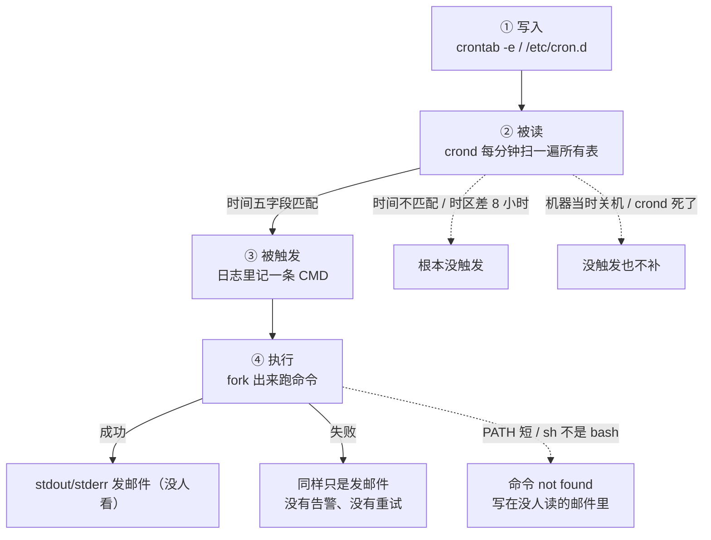
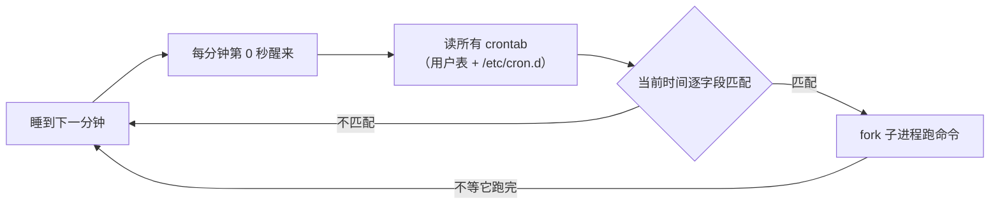
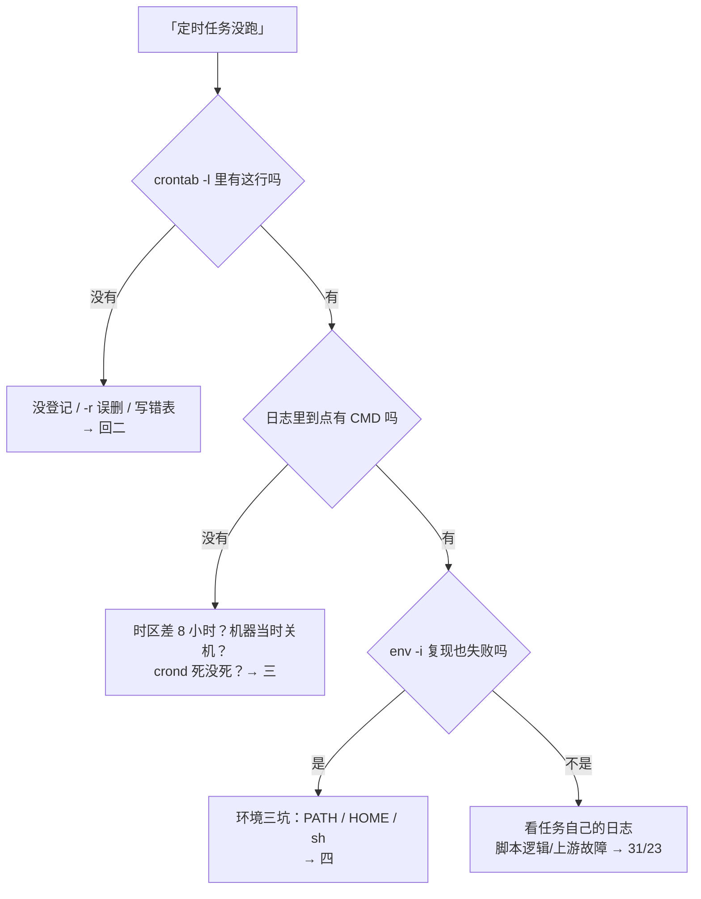
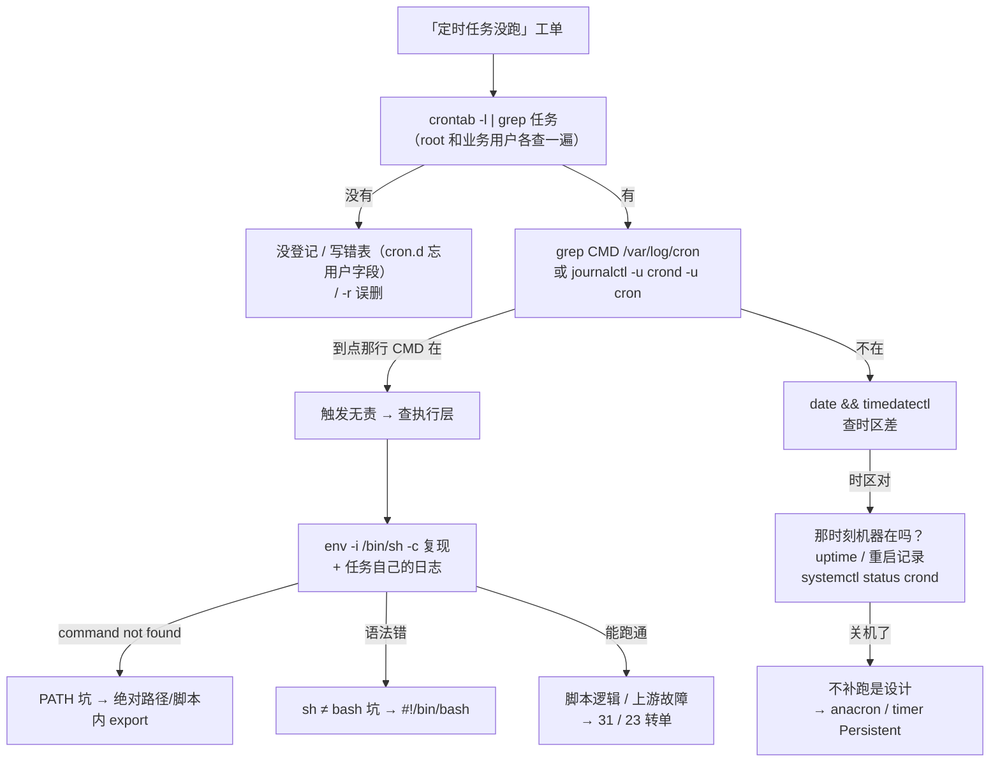

# 定时任务与 Cron

> 每天凌晨 2 点全服备份连着三天没跑，白天手动一跑就成功——没有报错、没有告警，活动日要回档才发现存档停在三天前。群里有人喊「备份脚本又坏了」，手伸向改脚本。
> **本章回答**：一条 cron 任务从写进 crontab 到被调度、被执行（或安静地没执行）的一生，以及「定时没跑」怎么在 60 秒内定位。
> **不讲**：systemd unit 与 timer 深讲 → [11](../11-Systemd与服务管理/)；机器时间从哪来、时区换算 → [32](../32-NTP与时间同步/)；备份策略本身 → [31](../31-备份与恢复/)。

**标记**：🎯重点 · 🔥难点 · ⭐常考 · 🔧实操

---

## 一、一张图：一条 cron 任务的一生

> 🎯 **一句话**：cron 任务的一生是四个驿站——写入、被读、被触发、执行或无声地死；每个驿站都有专属翻车点。



- 📖 **读图**
  - 🛤️ 主干 ①→②→③→④；终点**没有「报错告警」出口**——失败默认只进邮件
  - 👻 三条虚线 =「没跑」三大家族：没写对 / 没机会跑 / 跑了但秒死——后面每节各治一家

### 🎬 把主图走活：备份三天没跑

- **① 写入**：`crontab -l` → 任务在、`0 2 * * *` 没错 → 排掉「没登记」
- **②③ 被读与触发**：`grep backup /var/log/cron` → 每天 02:00 都有 `CMD (...backup.sh)` → **触发了**，排掉时区/关机
- **④ 执行**：CMD 在、备份文件没有 → fork 后秒死；`env -i /bin/sh -c '/opt/game/backup.sh'` 复现：裸写 `mysqldump`，cron PATH 里没有 → `command not found` 躺在没人读的邮件里
- **⑤ 防复发**：脚本内 `export PATH` + `cd` 绝对目录；表里 `>> log 2>&1`；成功收尾 `&& touch /var/run/backup.ok` 心跳

> ⭐ **路线图**：排障不是盯着脚本看，是沿四个驿站逐个问「这步发生了吗」。

---

## 二、出生：把任务写进 crontab ⭐

> 🎯 **一句话**：一行 crontab = 五个时间字段 + 一条命令；语法读不对，后面全白搭。

### 🧩 一行的解剖

```text
  0 2 * * * /opt/game/backup.sh >> /var/log/backup.log 2>&1
# ↑ ↑ ↑ ↑ ↑
# 前五段是时间，从左到右：分 时 日 月 周（第六段起是命令）
```

- ⭐ 口诀「**分时日月周**」——从最小单位读到最大
  - 分 0–59 · 时 0–23 · 日 1–31 · 月 1–12 · 周 0–7（0 和 7 都是周日）
- 三种写法：`*` 任意 · `*/n` 每隔 n · `a-b,c,d` 范围/列表

```text
*/5 * * * *     每 5 分钟
0 2 * * *       每天凌晨 2:00
30 4 * * 1-5    工作日 4:30
0 0 1 * *       每月 1 号 0:00
0 18 * * 5      每周五 18:00
```

#### ❓ 为什么日和周同时写是「或」不是「且」？

- ❌ 误会：`0 0 1 * 1` =「每月 1 号**且**是周一」
- ✅ 实际：日、周都写了具体值 → 语义是**或**——「每月 1 号**和**每个周一」都跑
- 🛠️ 要「且」→ 判断写进脚本（表达式只管粗筛）

### 🏷️ 六个特殊字符串

```text
@reboot          开机后跑一次（crond 启动时）
@yearly / @annually   每年 1 月 1 日 0:00
@monthly         每月 1 日 0:00
@weekly          每周日 0:00
@daily / @midnight   每天 0:00
@hourly          每小时 0 分
```

- ⭐ `@reboot` 唯一不带时间语义：**crond 启动那一刻**触发一次
  - 不等网络就绪、不等业务起来
  - 「开机拉守护」→ systemd unit 更对（→ [11](../11-Systemd与服务管理/)）

### 📂 三张表：位置决定格式 🔥

- **用户表**（`crontab -e`）
  - 五字段 + 命令；落在 `/var/spool/cron/<用户>`；以该用户身份跑
- **系统表**（`/etc/crontab`、`/etc/cron.d/xxx`）
  - **多一个用户字段**：`0 2 * * * game /opt/game/backup.sh`
  - 🔥 五字段直接抄进系统表 → 把命令当用户名 → **整行不跑还难查**
- **目录**（`/etc/cron.daily/` 等）
  - 扔可执行脚本；anacron 驱动（见七）

- 🔧 三个子命令：`-e` 编辑 · `-l` 列出 · `-r` 删整表
  - 🔥 `-r` 挨着 `-e`、**无确认**、删完就没了
  - 习惯：`crontab -l > backup` 先存，改完再 `-l` 回读

### 🧾 表头变量：SHELL / PATH / MAILTO

```text
SHELL=/bin/bash
PATH=/usr/local/mysql/bin:/usr/bin:/bin
MAILTO=""
0 2 * * * /opt/game/backup.sh >> /var/log/backup.log 2>&1
```

- 表头 = 给**后续所有任务行**设环境（/etc/cron.d 同用法）
- 表头只救这张表；脚本内 `export PATH`（四节）跟着脚本走
- **复杂任务一律脚本内自理，表头只做兜底**

### 🔐 谁能用：allow / deny

- `/etc/cron.allow` 存在 → **只有**名单内能用
- 否则看 `/etc/cron.deny`；两文件都不在 → Debian 系全开放 / RHEL 系默认只 root
- 「`crontab -e` not allowed」→ 先查这两个文件（→ [25](../25-用户权限与特殊位/)）

### 🗣️ 翻译练习：人话 → 表达式

```text
「每天凌晨 2 点」            0 2 * * *
「工作日每天 8 点 40」       40 8 * * 1-5
「每 10 分钟一次」           */10 * * * *
「只在周六和周日」           0 0 * * 6,0
「季度第一天」               0 0 1 1,4,7,10 *
「每月最后一天」             写不出！→ 0 0 28-31 * * + 脚本精判
```

- 表达式管粗筛、脚本管精判——`[ "$(date -d tomorrow +%d)" = "01" ] || exit 0`

> 📝 **面试**：问「crontab 怎么用」——三张表差异（用户表五字段、`cron.d` 多用户字段、目录扔脚本）+ 表头 SHELL/PATH/MAILTO +「`-r` 无确认要备份」。⭐（练习题 Q1、Q2）

---

## 三、被读：crond 怎么调度到你 ⭐

> 🎯 **一句话**：crond 每分钟醒一次、扫一遍所有表、匹配就 fork——只保证「到点开枪」，不保证「打中了」。



- 📖 **读图**
  - ⏱️ 左边节拍器每分钟一圈；fork 后**立刻回去睡**（六节重叠的源头）
  - 🔇 不匹配 = 无声（连日志都没有）——排障靠「有没有 CMD」反推（五节）

**crond（cron daemon）** 实现流派不同（cronie / vixie-cron / Debian cron），服务名 `crond` vs `cron`——命令里两个都带。

三个推论刻进脑子：

- ⭐ **最小粒度 1 分钟**——没有「每 30 秒」；秒级 → 脚本内 `sleep` 或 timer `OnUnitActiveSec=30s`（→ [11](../11-Systemd与服务管理/)）
- ⭐ **错过就是错过，不补跑**——2:00 机器在重启，窗口过去就过去
- ⭐ **匹配的是机器本地时间**——时区坑在这里爆发

#### ❓ 为什么错过就不补跑？

- 🎯 crond 是**闹钟**：到点开枪，不是「欠账要还」的调度器
- ❌ 关机 / 维护窗口撞上触发点 → 这一枪永久消失
- ✅ 要补跑 → anacron（天粒度）或 timer `Persistent=true`（七节）

### 🩺 第零问：crond 自己活着吗

> 🔍 **现场**：
> ```bash
> systemctl status crond cron 2>/dev/null | head -6
> ps -ef | grep -v grep | grep '[c]rond'
> # 两个都没有 = crond 没在跑：systemctl start crond && systemctl enable crond
> ```
> 顺手 `systemctl is-enabled crond`——见过「装机忘 enable，重启后全表停摆」。

### 🌍 时区：UTC 机器上的「2 点没跑」🔥

- 云机常默认 **UTC**：`date` 的 02:00 = 伦敦凌晨 = 北京上午 10 点
- 按北京时间写 `0 2 * * *` → 任务在北京 10:00 才跑——你以为没跑，其实每天准点跑
- 改时区后 **必须 restart crond**（它缓存时区）：`timedatectl set-timezone Asia/Shanghai && systemctl restart crond`
- 时间从哪来 → [32](../32-NTP与时间同步/)

> 🔍 **现场**：写表前先问机器「你的表是哪的表」：
> ```bash
> date; timedatectl | grep 'Time zone'
> # Time zone: UTC (UTC, +0000)   ← 北京 2:00 = 这里前一天 18:00
> ```

### 📬 MAILTO：默认通知是没人读的邮箱

- 默认：stdout/stderr **邮件给任务属主**（本机 mailbox）
- 云镜像常没 MTA → 输出被静默丢弃
- 正路两条：
  - 行尾 `>> /var/log/backup.log 2>&1`（**首选**）
  - 表头 `MAILTO=""` 关掉，或真填可送达的地址

> 📝 **面试**：crond 三句——**每分钟扫表、匹配就 fork、只管开枪不管结果**；三个推论：秒级做不到、错过不补、匹配本地时间。⭐（练习题 Q3、Q4）

---

## 四、干活：cron 的环境和你的环境是两个世界 🔥⭐

> 🎯 **一句话**：「手动能跑、定时跑不了」九成是环境差异——cron 用短 PATH、不读 bashrc 的干净世界跑你的命令。

> 💡 **打个比方**：cron 是**凌晨来替班的实习生**——你桌上 `export` 的一切他一概不知，只认前台清单上的工具。你留字条「跑备份」，他找不到工具箱，在小票写 not found 塞进没人开的信箱。

机制：crond 起的命令跑在**非登录、非交互的 `/bin/sh`** 里——`.bash_profile` / `.bashrc` 不读，别名/函数/`export` 统统不存在。

| | 你的交互 shell | cron 的世界 |
|------|------|------|
| PATH | 含 /usr/local/bin、/opt/xxx/bin | `/usr/bin:/bin` |
| SHELL | /bin/bash | /bin/sh（Debian 系常是 dash） |
| 启动读了什么 | profile → bashrc | 什么都不读 |
| 你 export 的变量 | 全都在 | 一个都没有 |
| cwd | 你 cd 到哪 | 不确定，别依赖 |
| tty | 有 | 没有 |

#### ❓ 为什么手动能跑、定时秒死？

- ❌ 高频错答：改脚本逻辑 / 在交互 shell 里反复试
- ✅ 两个世界对同一行命令，本来就不该期望结果一样
- 🔑 口诀：**「能跑≠会跑：先 `env -i /bin/sh -c` 复现」**

三大坑：

- **① PATH 最短清单**——`mysqldump: command not found`（第一大根因）
- **② HOME / cwd 悬空**——`cd backup && ./run.sh`、`~/.my.cnf` 全漂；脚本第一行 `cd` 到绝对目录
- **③ `/bin/sh` 不是 bash**——`[[ ]]`、`source`、数组、`function` 在 dash 上炸；头写 `#!/bin/bash`，用绝对路径调脚本

> 🔍 **现场**：让实习生摊开口袋：
> ```bash
> * * * * * env > /tmp/cron-env.txt
> ```
> ```text
> PATH=/usr/bin:/bin          ← 短一大截
> SHELL=/bin/sh               ← 不是 bash
> # ↑ 你 export 的那些一个都没有
> ```
> 黄金复现：
> ```bash
> env -i /bin/sh -c '/opt/game/backup.sh'   # ← 能复现 = 环境问题
> ```

**修法三件套**：

```bash
# 表里写绝对路径
0 2 * * * /usr/local/bin/mysqldump game > /backup/game.sql

# 复杂任务进脚本，脚本头自己造环境
#!/bin/bash
export PATH=/usr/local/bin:/usr/bin:/bin
cd /opt/game
exec >> /var/log/backup.log 2>&1
```

> ⚠️ **别混**：「手动」= 你的交互 shell；「定时」= 干净世界。见本节表。

> 📝 **面试**（11 章 timer 留给本章的经典题）：cron 用非登录非交互 `/bin/sh`，PATH 只有 `/usr/bin:/bin`、不读 bashrc；修法脚本 + `#!/bin/bash` + `export PATH` + `cd` 绝对路径；验证 `env -i /bin/sh -c`。⭐🔥（练习题 Q5、Q6）

---

## 五、失败无声：日志与排障四步 🔧

> 🎯 **一句话**：cron 日志只证明「到点开枪了」，不证明「打中了」——成败靠你自己落日志。

### 📒 两套账本

> 💡 **打个比方**：cron 日志像**大楼门禁**——记得「02:00 有人刷卡进了机房」，进去干成了还是晕倒，门禁一无所知。

- **RHEL/CentOS**：`/var/log/cron`（rsyslog cron facility → [23](../23-日志运维/)）
- **Debian/Ubuntu**：`/var/log/syslog` 或 `journalctl -u cron`
- 服务名：`crond.service` vs `cron.service` → `journalctl -u crond -u cron` 两个都点
- 兜底：`journalctl _COMM=crond --since today`

> 🔍 **现场**：
> ```bash
> grep 'backup' /var/log/cron | tail -3
> journalctl -u crond -u cron --since '02:00' --until '02:05' | grep -i backup
> ```
> ```text
> Sep 01 02:00:01 log-srv01 CROND[28451]: (root) CMD (/opt/game/backup.sh)
> # ↑ 只证明：02:00:01 触发了这条 CMD
> # ↑ 不证明：脚本成功、跑完、甚至真的存在
> ```

#### ❓ 为什么日志里有 CMD 还说「没跑」？

- 🚪 CMD = 门禁刷卡 = **触发层**证据
- 📦 成败在**任务自己的日志**（重定向文件 / logger）
- ✅ 判定一句：**CMD 在 → 触发无责，查执行层；CMD 不在 → 查时间与调度**

执行层留证据：

```bash
0 2 * * * /opt/game/backup.sh >> /var/log/backup.log 2>&1
/opt/game/backup.sh || logger -t backup -p user.error '备份失败'
```

### 🪜 排障四步（背下来）

```text
① 任务在吗？    crontab -l | grep backup     ← 表里有、时间字段对吗
② 触发了吗？    日志里那分钟有没有 CMD       ← 在=触发无责；不在=时区/关机/crond
③ 环境能复现吗？ env -i /bin/sh -c '脚本'    ← 能复现=环境三坑
④ 任务自己呢？   看任务自己的输出日志         ← 报错不在 cron 日志里
```

### 💓 心跳：让「没跑」主动报警

```bash
0 2 * * * /opt/game/backup.sh >> /var/log/backup.log 2>&1 && touch /var/run/backup.ok
```

- 监控：**心跳文件年龄 > 周期 + 容差（如每日 26h）** → 告警
- 死人开关：失败 / 没触发 / crond 死 / 机器没开机——四种死法一个探头全兜
- 托管版：healthchecks.io / cronitor（成功收尾 curl 一下）

> ⚠️ **别混**：心跳防**漏**；flock（六节）防**重**——配套不互替。

### 收束：一条「没跑」的判定链



- 📖 **读图**：三个菱形 = 四步可视化；最左「没有」常是 `-r` 误删或 `cron.d` 忘用户字段

> ⚠️ **别混**：`/var/log/cron` 记**调度**；成败去**任务自己的日志**。

> 📝 **面试**：四步——`crontab -l` → 日志 CMD → `env -i` → 任务自己的日志；对应写入→触发→执行→结果。🔧（练习题 Q7、Q8）

---

## 六、防身：flock 防重叠与错峰纪律 ⭐

> 🎯 **一句话**：cron 不会等上一轮跑完——任务比周期长就重叠，`flock -n` 是唯一正解；全公司 0 点任务要主动错峰。

### 🔒 重叠：上一轮没完，下一轮又开枪

- ⭐ crond 每分钟无脑开枪，**不管上一发打完没有**
- 某次跑了 90 分钟 → 下个整点第二轮照常启动：双进程写同文件、双份流量打垮下游
- 且常只在高峰偶发——平时测不出，活动日炸

> 💡 **打个比方**：`flock` = **公共卫生间门锁**：进门先锁；锁被占着就**不等、直接走人**（`-n`）。touch 手搓锁 = 门上贴纸条——进程崩了纸条还在，后面永远进不去。flock 随进程生死自动释放。

```bash
0 * * * * /usr/bin/flock -n /var/run/backup.lock /opt/game/backup.sh
```

#### ❓ 为什么用 flock 不用 touch 锁文件？

- ❌ touch 锁：进程被杀 → 删锁代码跑不到 → **残留死锁**，任务从此停摆
- ✅ `flock -n`：拿不到就退出本轮；锁随 fd/进程释放，无残留
- 🔑 锁文件路径全局唯一（一个任务一把锁）

> 🔍 **现场**：同名进程同时两个 = 重叠铁证：
> ```bash
> ps -ef | grep '[a]rchive.sh'
> # root  12847  ... 02:00 ... /opt/game/archive.sh
> # root  28451  ... 03:00 ... /opt/game/archive.sh
> # ↑ 上一轮还没结束，下一轮又开枪
> ```

### ⏰ 错峰：0 点惊群

- 所有人爱写 `0 0 * * *` → 备份、logrotate、账单、证书同秒开枪
- 纪律两条：
  - **分钟级**：`5 0`、`17 0`——几分钟偏移零成本
  - **机器级**：全服按尾号错开 2:00/2:10/2:20——下游存储带宽是共享的（→ [31](../31-备份与恢复/)）

> ⚠️ **别混**：flock 防**同一任务**重叠；错峰防**不同任务**同时——别指望错峰精确到可替代锁。

> 📝 **面试**：任务比周期长 → `flock -n`；补一句「touch 手搓锁会残留死锁」。⭐（练习题 Q9、Q10）

---

## 七、另一条路：cron vs systemd timer

> 🎯 **一句话**：cron 赢在「人人会写」；timer 赢在日志统一、能补跑、能清点——新任务优先 timer，存量 cron 必须会修。

[11](../11-Systemd与服务管理/) 立过 timer 机制（`.timer` 触发 `Type=oneshot` 的 `.service`），本章只做选型：

| 维度 | cron | systemd timer |
|------|------|---------------|
| 日志 | 自建 / `/var/log/cron` 只记触发 | `journalctl -u xxx.service` 全量 |
| 错过补跑 | 无 | `Persistent=true` |
| 清点 | `crontab -l` 逐用户翻 | `systemctl list-timers` 一屏 |
| 秒级 | 不支持 | `OnUnitActiveSec=30s` |
| 上手 | 全员会写 | 要写一对 unit |

#### ❓ 为什么新任务优先 timer 还要会修 cron？

- ✅ timer：journal / Persistent / list-timers——可控可查可补跑
- 🏭 存量 cron 巨大；任何一台机器都可能遇到别人的 cron
- 👉 11 章把「cron 环境坑」指到本章：不是继续推广 cron，是让你**能接住历史**

> 🔍 **现场**：
> ```bash
> systemctl list-timers
> ```
> ```text
> NEXT                     LEFT LAST  UNIT                ACTIVATES
> Mon 2026-09-01 02:00:00 5h   02:00 game-backup.timer   game-backup.service
> # ↑ NEXT 停在昨天 / LAST=n/a → status 那个 .timer 看 enabled/active
> ```

**anacron 一句**：给**不 7×24** 的机器按「天」补课——检查上次跑够不够间隔，够了就补；`/etc/cron.daily/` 正是它驱动。服务器常开用不上；它存在本身就是「cron 不补跑」的官方补丁。

本节对应练习题 Q11。

---

## 八、作战：「定时任务没跑」定责 🔧

> 🎯 **一句话**：先分「没触发」还是「触发了没成功」，再沿判定链走——盯脚本一小时，不如按四步问四个问题。

### 🗺️ 定责决策树



- 📖 **读图**：左「没触发」、右「触发了没成功」——**第一刀永远先劈这两半**；易漏叶子：root 表没有、业务用户表有

### 现象 · 先做 · 别做

| 现象 | 先做 | 别做 |
|------|------|------|
| 手动能跑、定时不行 | `env -i /bin/sh -c` 复现 | 在交互 shell 里反复试 |
| 日志 CMD 在、没结果 | 看任务自己的输出文件 | 盯 `/var/log/cron` 找报错 |
| 找不到 cron 日志 | `journalctl -u crond -u cron` | 判「日志丢了」结案 |
| UTC 机器、北京时间没跑 | `date; timedatectl` 换算后再核 | 直接重写时间字段碰运气 |
| 那时刻机器重启过 | 查补跑方案（anacron/timer） | 以为 cron 会自动补 |
| 高峰偶发重叠 | 加 `flock -n` | 缩短周期、加 sleep 玄学 |
| 0 点全服互相踩 | 分钟级 + 机器级错峰 | 都堆在 `0 0 * * *` |
| 改了表不生效 | `crontab -l` 回读确认 | 连续改三遍 |

### ⏱️ 60 秒剧本 🔧

- **0–10s**：`crontab -l | grep <任务>`（root、业务用户各一遍）
- **10–30s**：`grep CMD /var/log/cron | tail` 或 `journalctl -u crond -u cron --since '<时刻>'`——劈开没触发 / 没成功
- **30–45s**：触发在 → `env -i` + `tail` 任务日志；不在 → `date && timedatectl`、`uptime`
- **45–60s**：结案口径写清；坑写进新任务模板

值班最小三联：

```bash
crontab -l | grep <任务>
grep CMD /var/log/cron | tail -5 || journalctl -u crond -u cron -n 20
env -i /bin/sh -c '<任务命令>'
```

### 🧱 新任务模板（把坑焊死）

```bash
17 2 * * * /usr/bin/flock -n /var/run/backup.lock /opt/game/backup.sh >> /var/log/backup.log 2>&1
```

- 四件：**错峰分钟 · flock · 绝对路径 · 输出重定向**
- 再补半件：成功收尾 `&& touch /var/run/xxx.ok`（五节心跳）

### 高频根因（对着树背）

1. 手动能跑定时不行——PATH 短，not found 进没人读的邮件（四节①）
2. `/etc/cron.d` 忘用户字段——整行静默不跑（二节）
3. UTC 机器按北京时间写表——每天准点跑，不在你以为的点（三节）
4. 改了时区没 restart crond（三节）
5. 凌晨窗口撞重启——不补跑（三节推论）
6. `@reboot` 拉网络依赖——网络未就绪时灵时不灵（二节）
7. 全公司 `0 0 * * *` 惊群（六节）
8. touch 手搓锁残留死锁（六节）
9. `crontab -r` 手滑删整表（二节）

本节对应练习题 Q12～Q14。

---

## 九、收口

### 命令速查 🔧

```bash
crontab -l                                   # ← 列出（改前先备份）
crontab -e                                   # ← 编辑（小心 -r 在隔壁）
grep CMD /var/log/cron | tail -5             # ← RHEL：触发记录
journalctl -u crond -u cron --since '02:00'  # ← 两种服务名都点名
env -i /bin/sh -c '<命令>'                   # ← 复现 cron 干净环境
env > /tmp/cron-env.txt                      # ← 临时任务打印真实 cron 环境
/usr/bin/flock -n /var/run/x.lock <命令>      # ← 防重叠
systemctl list-timers                        # ← timer 清点（→ 11）
logger -t backup -p user.error '失败'         # ← 结果进 journald
find /var/run -name '*.ok' -mmin +1560       # ← 心跳：超 26h 没心跳
```

### 面试锚点

| 问 | 30 秒答 |
|----|---------|
| 手动能跑、定时不行？ | 非登录非交互 /bin/sh，PATH 短、不读 bashrc；env -i 复现；脚本 + #!/bin/bash + export PATH + cd 绝对路径 |
| crontab 五字段？ | 分时日月周；`*` / `*/n` / `a-b,c`；日周同写是「或」 |
| @reboot 何时跑？ | crond 启动那一刻，不等网络；开机拉服务用 systemd |
| cron 日志在哪？ | RHEL `/var/log/cron`、Debian syslog / `journalctl -u cron`；只记触发不记结果 |
| 定时没跑怎么查？ | 四步：crontab -l → 日志 CMD → env -i → 任务自己的日志 |
| cron 会补跑吗？ | 不会；补跑用 anacron 或 timer Persistent=true |
| 任务比周期长？ | flock -n；touch 手搓锁会残留死锁 |
| 秒级怎么做？ | cron 最小 1 分钟；脚本 sleep 或 timer OnUnitActiveSec |
| UTC 机器定时没跑？ | 匹配本地时间；北京 2 点 = UTC 前一天 18:00；改时区后 restart crond |
| cron vs timer？ | 新任务优先 timer；存量 cron 必须会修 |
| 怎么发现静默失败？ | 成功收尾写心跳，监控「最后成功」超龄告警 |
| /etc/cron.d 差别？ | 多一个用户字段，忘写整行不跑 |

### 易错一句话对照

- 「cron 日志有 CMD 就是跑了」→ 只证明触发，成败看任务自己的日志
- 「手动能跑定时就该能跑」→ 交互 shell 与干净环境是两个世界
- 「/etc/cron.d 照抄 crontab 那行」→ 少了用户字段，整行不跑
- 「没跑就是任务写错了」→ 还有时区、关机、crond 死了三个家族
- 「关机回来会补跑」→ cron 不补跑，那是 anacron/Persistent 的活
- 「crontab -r 只删一条」→ 删整表，无确认
- 「日和周同写是求交」→ 是并（或），求且写进脚本
- 「重叠了缩短周期就好」→ 用 flock -n，重叠和周期是两回事
- 「touch 锁文件防重叠」→ 崩了残留死锁；用 flock
- 「0 0 * * * 最整洁」→ 0 点惊群；分钟和机器都错峰
- 「改了时区 cron 自己跟着走」→ crond 缓存时区，必须 restart

### 数字墙

> **最小粒度**：1 分钟——没有「每 30 秒」
> **五字段**：分 时 日 月 周；**六个特殊字符串**：@reboot/@yearly/@monthly/@weekly/@daily/@hourly
> **cron 默认 PATH**：/usr/bin:/bin——你的 /usr/local/bin 不在里面
> **时区差**：UTC 机器上，北京 2:00 = 表里前一天 18:00
> **错峰**：分钟级（5 0、17 0）；机器级按尾号
> **心跳容差**：最后成功年龄 > 周期 + 2~4h（每日任务约 26h）

---

## 合上书

- [ ] **默画主图**：写入 → 被读 → 被触发 → 执行/无声死；三条虚线「没跑」家族各指向哪节
- [ ] **口述**：五字段与三种写法；日周同写的语义；六个特殊字符串；@reboot 真实时机
- [ ] **讲清**：三张表（用户表 / cron.d / cron.daily）位置、格式差异、执行身份
- [ ] **讲清**：crond 每分钟循环的三个推论——最小粒度、不补跑、匹配本地时间
- [ ] **分型**：时区坑机制与修法（date + timedatectl + restart crond）
- [ ] **讲清**：环境三坑与修法三件套；`env -i` 怎么复现
- [ ] **口述**：两套账本各记什么、不记什么；MAILTO 默认行为
- [ ] **背下**：排障四步与判定链——每一刀劈成哪两半
- [ ] **讲清**：flock -n 为何正解、touch 为何死锁；错峰两级纪律
- [ ] **口述**：cron vs timer 选型与 anacron 定位；11 章为何把本章接在 timer 后
- [ ] **作战**：60 秒剧本三窗各敲什么；新任务模板四件各堵哪个坑
