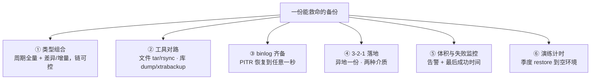
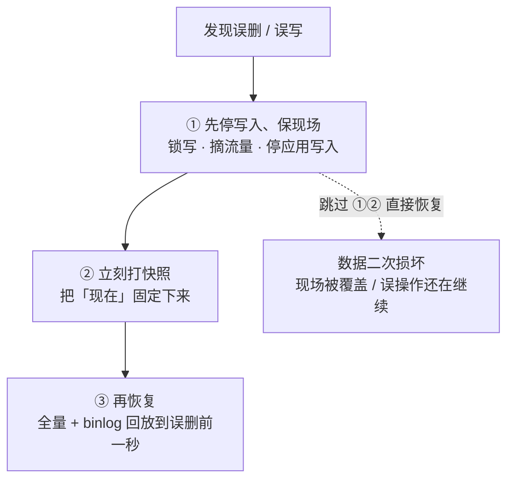
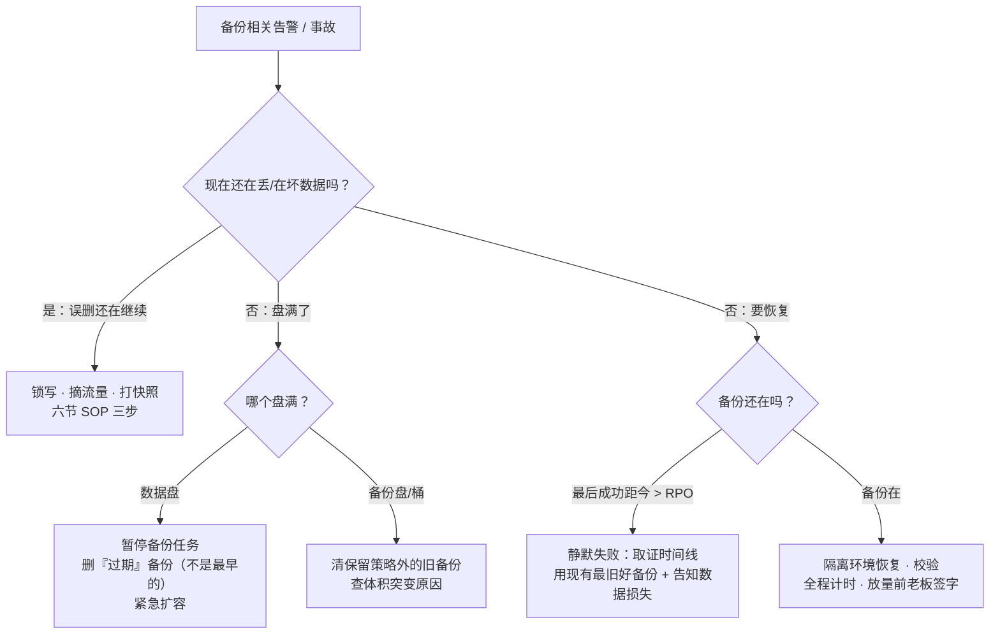

# 备份与恢复

> 凌晨备份任务把数据盘写满、全服登录卡死；更狠的一次是误删 `DELETE` 之后想恢复，翻完日志才发现备份任务半年前就静默失败——从来没有成功过。
> **本章回答**：一份数据从生到死到重生的备份一生——为什么备、备什么、用什么备、怎么知道真的备上了、出事了怎么救回来。
> **不讲**：LVM/云盘快照的底层机制 → [29](../29-磁盘管理与LVM/)；日志留存治理 → [23](../23-日志运维/)；高可用切换与容灾分级 → [33](../33-高可用与容灾/)；MySQL 复制与 binlog 全解 → [02-01](../../02-中间件与数据库/01-MySQL/)。

**标记**：🎯重点 · 🔥难点 · ⭐常考 · 🔧实操

---

## 一、一张图：一份数据的备份一生

> 🎯 **一句话**：备份不是一条命令，是「定档 → 生成 → 搬运 → 看守 → 验证 → 重生」一条流水线；断在哪一段，出事当天才知道疼。


**读图**：

- 左边三段（定档/生成/搬运）是**平时**的活，占备份工程的九成；右边两段（验证/重生）平时不做，出事当天价值百分之百。
- 「看守」和「验证」是两段最常被跳过的：备份任务天天绿灯不代表能恢复，「半年前就静默失败」的事故都断在这两段。
- 监控照的是「看守」段：备份是否成功、体积是否突变、最后成功备份距现在多久（→ [22](../22-监控与告警/)）。

---

## 二、出生：为什么备份——四类场景与 RPO/RTO

> 🎯 **一句话**：备份是为了四类「删了就没了」的事故；RPO 管丢多少、RTO 管停多久，先定这两个数字再谈方案。

### 四类灭顶场景 ⭐

值班生涯里真正会用上备份的，几乎全是下面四类：

1. **误操作**：`rm -rf` 路径少打一个点、`DELETE` 忘写 `WHERE`、`DROP TABLE` 手滑——最常见，且主从会**忠实地把错误复制到每一份副本**，切主救不了。
2. **逻辑错误**：版本 bug 把全服玩家余额写坏、脚本把道具表刷错。数据和命令本身都「成功」了，坏的是内容，副本一样是坏的。
3. **勒索/安全事件**：加密病毒把生产盘和同盘快照一起加密。同盘的快照和备份**一起没**——这就是异地一份的由来。
4. **机房级事故**：机房断电失火、整 Region 故障。单机手段全部失效，能救命的只有异地那份。

> ⚠️ **别混**：前三类是**数据坏了**（副本也是坏的，只能回备份）；第四类是**数据没了但可能是好的**（异地还有一份好的）。前者走恢复/回档，后者走容灾切换——两条路完全不同，容灾侧见 [33](../33-高可用与容灾/)。

### 两个数字：RPO 与 RTO ⭐🔥

**RPO（Recovery Point Objective，恢复点目标）** = 最多能丢多少数据，用时间说：每小时备一次份，RPO 最坏就是 1 小时。
**RTO（Recovery Time Objective，恢复时间目标）** = 从故障到重新对外服务的最长时间上限。

> 💡 **打个比方**：RPO 是「日记写到哪一页了」——火灾后从那一页之后写的都没了；RTO 是「店铺重新开门营业要多久」——中间损失的是营业额。日记写得勤是 RPO 的事，开门修得快是 RTO 的事，两件事分开花成本。


**读图**：RPO 段在故障**之前**（丢的是还没备份的数据），RTO 段在故障**之后**（花时间恢复、验证、放流）。RTO 的时钟从告警响就开始算——发现、决策、恢复、验证**全算进去**，不是「restore 命令跑了几分钟」。这两个数字全库通用：[33](../33-高可用与容灾/) 用它们定容灾档位，本章用它们定备份节奏。

**RTO vs MTTR**：RTO 是**承诺**（对老板/业务的口径），MTTR（Mean Time To Repair，平均修复时间）是**成绩单**（历史实测）。演练缩短的是 MTTR；PPT 上写 RTO=30 分钟、实际演练 3 小时——**3 小时才是真 RTO**。

### 3-2-1 原则 ⭐

**3-2-1** = 至少 **3** 份数据、**2** 种介质、**1** 份异地。一条一条核，少一条都是假 3-2-1：

```text
3 份数据     生产 + 备份 ×2
             反例：生产 + 同一块盘上的快照 —— 还是「在一块盘上」，盘坏一起没

2 种介质     磁盘 + 对象存储 / 磁带
             反例：三份全在同一块云盘的快照链 —— 介质只算一种

1 份异地     另一 Region / 另一账号的对象存储
             反例：同账号同地域的桶 —— 火灾和盗号一起没；勒索软件最爱的就是同账号
```

> 📝 **面试**：「备份怎么设计？先问业务要 RPO/RTO 两个数字，再按 3-2-1 落：三份数据、两种介质、一份异地；备份频率由 RPO 定，恢复能力由演练证明——没演练过的备份等于没有。」这四句就是本章全部骨架。

### 备份窗口：RPO 不是白来的 ⭐

**备份窗口（backup window）** = 每次备份占用的那段时间——它是 RPO 的成本侧：窗口越长，越不敢高频跑，RPO 就越差；窗口太长还会挤占业务盘 IO/CPU（八节「凌晨盘满」的案子就是这么来的）。

```text
2T 的库 × 每晚全量 5 小时
→ 备份窗口 5h，业务侧已经有感知（IO 争抢）
→ 不敢改成 6 小时一次 → RPO 卡在日级
→ 想把 RPO 压到秒级？窗口问题的答案不是「跑得更勤」，是 binlog（四节）
```

压缩窗口的常规三板斧：**从库/专用备份机上打**（不碰主库 IO）、**物理备份换逻辑备份**（大库快数倍）、**全量+差异组合**（把全量摊薄到周末）。备份窗口、备份盘容量、网络带宽是备份工程的三个物理预算——定 RPO 之前先算这三个数，拿 2T 的库各算一笔：

```text
窗口账   每晚全量 5h → 一天只有一次敢跑的机会 → RPO 封顶日级
         换「周日全量 + 每日差异」→ 平日窗口 ~40min，链也只两条
容量账   日 7 + 周 5 + 月 12 ≈ 一份全量 × 二十几份的空间（差异/压缩会更少）
         备份盘按「全量大小 × 保留份数 × 1.5 冗余」规划，别等 100% 才告警
带宽账   跨机房搬 2T ≈ 限速 50MB/s 要传 11 小时
         异地同步追不上生成速度 → 「越积越多传不完」是异地份断档的隐形根因
```

---

## 三、成长：全量、增量、差异的取舍

> 🎯 **一句话**：三种备份类型赌的是「恢复时需要几条链」——全量恢复最快、备份最慢，增量反过来，差异取中间。

### 定义与恢复链 ⭐🔥

- **全量（full）**：把所有数据完整备一份。
- **增量（incremental）**：只备**上一次备份**（不论哪种）之后变化的部分。
- **差异（differential）**：只备**上一次全量**之后变化的部分。

> 💡 **打个比方**：像游戏存档。全量是「整份存档另存一个槽」；增量是「每次只记录从上一个存档点往前推的改动」，读档必须把一串改动按顺序全打上；差异是「永远只记从整份存档点到现在一共改了什么」，读档只要整份 + 最后一份差异。

```text
周日全量 F —— 周一增量 d1 —— 周二增量 d2 —— 周三增量 d3 —— 周四增量 d4

增量恢复（要回到周四）：F + d1 + d2 + d3 + d4   ← 5 条链，断一条回不去
差异恢复（要回到周四）：F + D4（D4=周一至今全部改动）  ← 2 条链
全量恢复（周四另打过全量 F2）：F2                 ← 1 条链，最快
```

**读图**：恢复链越长，出事当天越危险——任何一环损坏/丢失/校验不过，整条链报废。**恢复速度优先选全量或差异，存储成本优先选增量**；生产常见组合是「周日全量 + 每日差异/增量 + 定期再打全量缩短链」。

| 对比 | 全量 | 增量 | 差异 |
|------|------|------|------|
| 备份耗时/体积 | 最大 | 最小 | 越攒越大（到下次全量前） |
| 恢复需要几份 | 1 份 | 全量 + 之后每份增量 | 全量 + 最后一份差异 |
| 某份损坏的后果 | 换上一份全量 | 该点之后全废 | 退回上一份差异 |

> ⚠️ **别混**：增量的基准是「上一次**任何**备份」，差异的基准是「上一次**全量**」——一句话：**增量对上一次，差异对全量**。答反了恢复链长度就全错。

### 两种「差异」的实战取舍 🔥

文件侧和数据库侧对增量/差异的用法不一样，别拿一套答案套两边：

```text
文件侧（rsync --link-dest / 云增量快照）
  天然的「每份都完整」：未变文件硬链接/块指针复用
  → 恢复永远只要「最近那份目录」，没有链的概念
  → 代价是 inode 与元数据；快照链的存储语义 → [29](../29-磁盘管理与LVM/)

数据库侧（xtrabackup 增量 / dump 拆分）
  增量基于上次的物理页变化
  → 恢复必须按 全量 → i1 → i2 … 依次 prepare，链和三节一模一样
  → 某环校验不过，该环之后全废
```

**读图**：所以生产上常见的折中是「周期全量 + 数据库增量 + binlog 兜底到秒级」——增量控窗口，binlog 控 RPO，全量周期性地把链长清零。三个手段各管一段，谁也替代不了谁。

---

## 四、干活：工具全景——从 tar 到 binlog

> 🎯 **一句话**：文件用 tar/rsync，数据库分逻辑与物理两路，快照当手段之一用，binlog 负责恢复到任意一秒。

### tar：文件全量的基本功 🔧

```bash
tar -czf /backup/etc-$(date +%F).tar.gz -C / etc \
    --exclude='etc/mtab' --exclude='etc/ssh/ssh_host_*'   # ← 备配置目录；-C 先切目录再打包，包内不带路径前缀
tar -tzf /backup/etc-2026-09-01.tar.gz | head             # ← 备份完必须 -t 验一下能列目录，写坏的一眼看出
tar -xzf /backup/etc-2026-09-01.tar.gz -C /tmp/restore --numeric-owner
#    ↑ 恢复侧成对记：-C 落位到目标目录；--numeric-owner 按数字 uid/gid 还原
#      ——跨机恢复时新机没有同名用户，缺了它属主会变成一串数字或错人
```

两个一句带过的点：`--exclude` 排除会跟着打包的运行时文件（pid/sock/mtab）；数据库文件、VM 镜像这类**稀疏文件（sparse file）**要加 `--sparse`，否则文件里的「洞」会被实打实写满，几个 GB 的稀疏盘备份出几百 GB。

### rsync：增量搬运与它的坑 🔧🔥

**rsync** 的本事是**增量算法**：两边比对块指纹，只传差异部分。基础三板斧 `-avz`（归档/详谈/压缩）+ 走 ssh 到远端。

```bash
rsync -avz --partial --progress /data/ remote:/backup/data/    # ← 源路径带不带尾斜杠语义不同
rsync -avz --link-dest=/backup/data-2026-08-31 /data/ /backup/data-2026-09-01/
#    ↑ 未变化的文件在新目录里做硬链接指回昨天那份，只真拷变化的 —— 空间近似增量、每份又都是完整目录
```

三个必知的坑：

- **尾斜杠语义**🔥：`/data` 表示「把 data 这个目录整个拷过去」，`/data/` 表示「把 data 里面的内容拷过去」。备份脚本里搞反，目标目录会一层层套娃 `data/data/data`。
- **`--delete` 双刃剑**🔥：让目标目录和源**完全一致**，源里删了的，目标里也删。日常镜像很好用；但源被误删/被勒索清空后再跑一次带 `--delete` 的 rsync，**备份里那份好的也被同步没了**——备份瞬间从保险箱变成事故共犯。给备份用的 rsync 不带 `--delete`，或先落快照再镜像。
- **断点续传**：大文件传一半断线，默认整个重传；`--partial`（或 `-P` = `--partial --progress`）保留半截文件续传。跨机房搬大备份没有它就是每天重看进度条。
- **限速别把业务挤死**：备份搬运是「自己发起的流量事故」——跨机房/跨网段搬运加 `--bwlimit=50m`（限速 50MB/s）留带宽给业务；本机重 IO 操作配 `ionice -c2 -n7` 让内核把备份的 IO 排到最低优先级。凌晨盘满/白天变卡这类「备份肇事」，一半能靠这两个参数提前摁住。

### mysqldump vs xtrabackup：逻辑与物理之分 ⭐🔥

| 对比 | mysqldump（逻辑备份） | xtrabackup（物理备份） |
|------|----------------------|------------------------|
| 备的是什么 | `CREATE TABLE`/`INSERT` 语句文本 | 直接拷贝数据文件 + redo log |
| 恢复方式 | 重放 SQL，像重演一遍写入 | 文件拷回去即挂起，快 |
| 速度 | 库越大越慢；备份期间有锁表窗口 | 大库快得多，InnoDB 热备 |
| 跨版本/跨平台 | 好（文本通用，可改） | 差（要匹配版本与引擎） |
| 典型用途 | 小库、单表导出、迁结构 | 大库、定时全量 |

> 💡 **打个比方**：逻辑备份是把菜**重新炒一遍**（照着菜谱 INSERT 重演），物理备份是**把整锅端走**（连锅带灶拷文件）。锅小重炒无所谓；锅大的时候，端锅快得多，但端走的锅只能放回同样的灶上。

一句话纪律：**mysqldump 备份期间业务还能写，靠的是一致性快照读（`--single-transaction`，仅 InnoDB）；xtrabackup 靠 copy-on-write 追 redo**。参数细节与 binlog 格式 → [02-01](../../02-中间件与数据库/01-MySQL/)。

两边的恢复命令也要成对记住——「备得出、还得回去」才闭环：

```bash
mysql -u root -p db_name < full-2026-09-01.sql        # ← 逻辑恢复：重放 SQL；大库要关 binlog 加 --no-defaults 类参数提速（细节 → 02-01）
xtrabackup --prepare --target-dir=/bk/full            # ← 物理恢复第一步：用 redo 把拷贝中不一致的部分滚到同一时刻
xtrabackup --copy-back --target-dir=/bk/full          # ← 第二步：文件拷回 datadir（先停库、清空目录、拷完 chown mysql）
```

**读命令**：物理备份的三步——`--backup` 拷文件、`--prepare` 追一致性、`--copy-back` 落地——一步都不能省；跳过 `--prepare` 直接挂起来，大概率起不来或数据停在半截。物理备份同样有增量：`--incremental-basedir` 指向上次全量，恢复时按全量 → 增量的顺序依次 `--prepare`，恢复链的逻辑和三节完全同构。

### 快照：把备份做在存储层 ⭐

云盘快照/LVM 快照把「某一时刻的整块盘」固定下来，秒级完成、恢复也是整盘回滚，是「全量备份」最省事的形态。本章只把它当**备份手段之一**用：快照≠异地（尤其同盘快照），快照的生命周期、COW 机制与 LVM 细节 → [29](../29-磁盘管理与LVM/)。快照当备份的取舍就三句：

```text
快        秒级打、秒级整盘回滚 —— RTO 里最便宜的一段
不异地    同盘/同存储池的快照与生产共存亡 —— 只补「份数」，补不了「1 份异地」
会过期    快照链越长 COW 写放大越重，保留策略与备份是两套账
```

所以快照的正确定位是「恢复手段 + 全量的廉价来源」——把快照导成镜像上传异地，才补齐 3-2-1 里那个「1」；拿快照链替代备份体系，等于把鸡蛋放回同一个篮子再拍张照。

### binlog：恢复到任意一秒的关键 🔥⭐

**binlog（binary log，二进制日志）** 记录了库上每一次数据变更。备份的真正完整形态是：

```text
全量备份（周日 02:00）
   + 周日 02:00 起保留的 binlog
   = 可以恢复到此后任意一秒（Point-in-Time Recovery，PITR）
```

> 💡 **打个比方**：全量备份是「存档点」，binlog 是「从头到尾的监控录像」。回档就是把存档点读出来，再把录像**快进到出事前一秒**重演一遍。没有录像，你只能回到存档点那一刻——中间一整天的数据全丢。


**读图**：PITR 恢复 = 恢复全量 + 按 binlog 重放，重放的终点由你指定（精确到秒）。误 `DELETE` 发生在 10:32:00，就把重放停在 10:31:59。代价：binlog 必须和全量一样被备份、被异地保管，且保留期要覆盖备份间隔——只备全量不备 binlog，RPO 就是整个备份间隔。

### 不只备数据：配置、密钥与「备机」本身 ⭐

库救回来了、服务起不来，是演练里最常见的「第二关」。生产备份清单里必须有三样非数据件：

```text
① 系统与调度配置    /etc（排除运行时文件）、systemd unit、crontab、sysctl/limits
                    ← 库好了任务不跑、参数不对服务不稳
② 证书与密钥        TLS 证书与私钥、DB 密码、对象存储/异地桶凭证、SSH key
                    ← 密钥不在手边 = 备份不存在；异地凭证要与备份机隔离（勒索场景）
③ 可复现的运行环境   镜像 tag / 包版本清单 / 配置仓库快照
                    ← 避免「只能在那台旧机上跑」；重建环境 → [04](../../04-工程化与自动化/)
```

凭证管理进 [27](../27-Linux安全加固/)；这类的备份要跟数据备份**同一个周期**演练——密钥过期三个月才在恢复现场发现，是最冤的一种失败。

### 收束：一份能救命的备份清单 🎯⭐

把本节的零件收成一张可背清单——面试问「你们的备份方案」，按这六件答：



**读图**：①②③回答「备什么、怎么备」，④回答「放到哪」，⑤回答「怎么知道还活着」，⑥回答「凭什么信它能恢复」。六件里缺任何一件，都是「看起来有备份」——出事当天逐件现原形。

> ⚠️ **别混**：这份清单保证的是「数据能回到过去某个点」，**不保证**：不丢最近 RPO 窗口内的数据、恢复过程不停机、主机配置自动恢复——`/etc`、crontab、证书密钥要单独备，**密钥不在手边等于备份不存在**。

> 📝 **面试**：按「**备什么 → 放哪 → 怎么盯 → 怎么验**」四段背：全量+差异组合与恢复链、3-2-1 异地一份、失败与体积告警、季度演练计时。最后补一句「误删走 PITR 回档，不走切主」——这句把本章和 [33](../33-高可用与容灾/) 的边界说清了。

---

## 五、看守：备份的监控与告警

> 🎯 **一句话**：备份最大的风险不是失败，是**静默失败**——任务死了没人知道，半年后误删时才发现从来没有备份。

### 静默失败的三张面孔 🔥

```text
① cron 任务失败，输出邮件发给早就不存在的本地 root 邮箱 —— 没人看
② 备份盘悄悄满了，tar 写出半截文件退出非 0，脚本没检查 exit code —— 「备上了」其实是半份
③ 凭证过期/源目录改名/权限被收 —— 天天失败天天「正常」
```

治法对应三件套：**检查退出码**（`set -e` / `||` 告警）、**监控「最后一次成功备份距今时长」**、**对备份产物做校验**（`tar -tzf` 列目录、md5、xtrabackup `--prepare` 跑通）。

> 🔍 **现场**：治法落到脚本，就是这副最小骨架——退出码、校验、可观测三样齐：

```bash
#!/usr/bin/env bash
set -euo pipefail                            # ← 任何一步非 0 就停，别带病继续
trap 'echo "backup FAILED at $LINENO" |
      curl -s --data-binary @- http://alert.example.com/hook' ERR
                                             # ← 失败必叫人：webhook/邮件都行，别靠没人看的 root 邮箱
DEST=/backup/db-$(date +%F).tar.gz
tar -czf "$DEST" -C /data db                 # ← 正主
tar -tzf "$DEST" >/dev/null                  # ← 产物校验：列不出目录 = 半截文件
md5sum "$DEST" | tee "$DEST.md5"             # ← 校验和落盘，异地搬运后 md5sum -c 过了才敢用
echo "backup ok $(date +%s) $(stat -c%s "$DEST")" >> /var/log/backup-ok.log
                                             # ← 成功也要留痕：监控就吃这行（最后成功时间 + 体积）
```

**读命令**：`set -euo pipefail` 治「半截也算成功」，`trap ... ERR` 治「失败没人看」，末尾那行日志治「监控没数据」——三张面孔一张脸一个对策。监控侧再挂一条「backup-ok.log 的 mtime 距今超过 26h 告警」，静默失败就没有藏身之处了。

> 🔍 **现场**：巡检一台「据说有备份」的机器，三分钟走完：

```bash
ls -lh --time-style=+%F\ %T /backup/ | tail -5     # ← 最后一行的时间戳 = 最后一次成功写入，距今半年就是实锤
grep -i backup /var/log/cron* | tail               # ← cron 到底跑没跑、退出没报错
crontab -l | grep -iE 'backup|dump|rsync'          # ← 计划任务还在不在、命令指向的路径还存不存在
```

### 体积突变是个信号 🔥

备份体积不该突变。监控基线上下浮动，两种方向两种病：

```text
骤降（-50% 以上）   大概率只备了一半：盘满截断 / 源目录改路径后少了一块 / 权限丢了一层
                    —— 危险：看起来「备份成功」，恢复时才发现少一半

骤涨（+几倍）       日志/缓存目录混进了备份范围 / 业务暴涨 / 重复备份叠在一个目录
                    —— 先查再保留：盘被打满的连锁事故就是它（见八节）
```

### 保留策略：GFS

**GFS（Grandfather-Father-Son，祖父-父-子）**：日备份留 7 份、周备份留 4~5 份、月备份留 12 份——近的留密、远的留稀，既控空间又保证「三个月前那个坏版本」也回得去。保留脚本用「删过期」而不是「全删重灌」，删的必须是**过期**的，不是「最早的」（最早的可能是唯一月备）。

> 🔍 **现场**：GFS 用文件名约定 + cron 实现，一个「删过期」的骨架长这样：

```bash
# 每日备份命名：/backup/db-2026-09-01.tar.gz
find /backup -name 'db-*.tar.gz' -mtime +7  -delete   # ← 日备：只删「7 天前」的——按时间过期，不是按序号删最早
# 周备/月备单独目录、单独 -mtime +35 / +365；先 find 不带 -delete 列一遍确认，再真删
find /backup -name 'db-*.tar.gz' -mtime +7 -print     # ← 删除前先打印：这就是「删之前确认是备份」那一步
```

**读命令**：`-mtime +7` 的语义是「修改时间在 7 天**之前**」——它天然只删过期的；而 `ls | head -n 5 | xargs rm` 式的「删最早的」会把唯一月备一起送走（八节定责表里那条就是这么来的）。删之前先 `-print` 看清单，是删除类命令的通用纪律（同 [30](../30-定时任务与Cron/) 的 cron 变更规范）。

> 📝 **面试**：「备份怎么监控？三个指标：任务成功率（带退出码）、最后一次成功备份距今时长（超 RPO 即告警）、备份体积基线（突变告警）。再加一条：恢复演练计时——监控只证明备上了，演练才证明救得回。」

---

## 六、重生：恢复演练与误删应急 SOP

> 🎯 **一句话**：没演练过的备份等于没有——恢复时间没人知道、介质没人试过、密钥没人找得到；误删应急的第一动作是停写保现场。

### 恢复演练：什么才算「做过」⭐🔥

```text
不算演练：
  □ 备份任务绿灯
  □ 「应该能还原吧」
  □ 只在原机原目录覆盖试了一下      ← 原机覆盖本身就是在赌生产数据

算演练：
  ☑ 还原到空环境/隔离环境，不碰生产
  ☑ 跑校验：行数、抽样业务记录、应用能连能读
  ☑ 全程计时——这个数字才是真实 RTO 的证据
  ☑ 密钥、权限、网络策略一并验证（异地桶的凭证在异地环境真的拉得下来吗）
  ☑ 季度至少一次；大变更（迁移/升级/合服）前加一次
```

**读图**：演练输出的「耗时」要拿去对标 RTO 承诺：演练 3 小时、承诺 30 分钟，要么加资源要么改口径——**对外说的 RTO 必须被演练过的 MTTR 证明**。游戏库回档的具体剧本 → [07-09](../../07-游戏运维专题/09-玩家数据备份与回档/)。

演练不必每次都「全家桶」，按成本分三级：

```text
月度轻量   抽验产物：tar -tzf / xtrabackup --prepare 挑一份跑通 + 体积基线核对
季度全量   还原到隔离环境 + 校验 + 计时 + 密钥验证 —— 对标 RTO 的那一次
大变更前   迁移/升级/合服前，针对「本次变更会动到的数据」加练一次
```

三级各答一个问题：月度证明「备上没坏」，季度证明「救得回、多快」，变更前证明「明天要动的东西有退路」。只有月度抽验、从不全量演练，等于只证明了前一半。

### 误删应急 SOP：三步的顺序不能错 🔥⭐



**读图**：

- **顺序是铁律**：误删发生后**写入还开着**，恢复进程一边回放 binlog、新写入一边往里灌——两个时间线搅在一起，谁也说不清最后的状态是什么。先停写，时间线冻结了再动手。
- **先快照再动手**：恢复操作本身会改写数据文件。先打快照，恢复搞砸了还能退回「刚出事」那一刻重来一次；没有这份快照，失败一次就少一次机会。
- **别用「再执行一遍反向 SQL」止血**：反写一条 `INSERT` 回去看似快，但表结构/自增/关联表全要人肉对，错一处脏一片；PITR 回放才是确定性路径。

> 🔍 **现场**：PITR 的终点不是拍脑袋定的——先在 binlog 里把误删那条**定位**出来：

```bash
mysqlbinlog --no-defaults -v --base64-output=decode-rows \
    --start-datetime='2026-09-01 10:30:00' binlog.000002 | less
#    ← 从可疑时段开始人肉翻：找到那条不带 WHERE 的 DELETE，记下它前面一行
#      End_of_log_pos / STOP 事件的时间戳 —— 那就是回放的终点（误删前一秒）
SHOW MASTER STATUS;      # ← 当前正在写的 binlog 名与位点；全量备份里记的位点（--master-data=2）则是回放的起点
```

**读命令**：起点来自全量备份时记下的 binlog 位点，终点来自 binlog 里误删语句**前一行**的事件位置——两个位点之间的 binlog 才是要回放的部分。跳过定位直接按「大概 10 点半」估终点，多回放一秒就把误删又执行了一遍。

勒索场景换掉 SOP 的第三步：先取**异地且凭证隔离**的那份备份（另一账号/另一 Region）→ 在干净环境拉下来校验 → 全网轮换密钥后再谈重建。在被加密的机器上「先恢复试试」，等于把最后一份好备份也押上赌桌。

> ⚠️ **别混**：误删应急**不是**「赶紧从库上把数据拷回来」——从库早就把 `DELETE` 复制过去了（→ [02-01](../../02-中间件与数据库/01-MySQL/)）。能救命的只有「备份 + binlog」，这就是本章存在的原因。

### 恢复当天的时间账

```text
t0      发现误删 → 拉群、锁写、摘流量          5 min
t0+5    打快照、定位误操作 binlog 位点         10 min
t0+15   起隔离环境，恢复最近全量               40 min（取决于库大小——这个数只有演练知道）
t0+55   回放 binlog 到 10:31:59，校验          20 min
t0+75   应用切读验证 → 放量                    15 min
──────────────────────────────────────────────
全程 ≈ 90 min = 你的真实 RTO；如果演练从没做过，每一行都是现场现学
```

**读图**：五段里最长的是「恢复全量 40 min」——它由库大小和硬件决定，只有演练量得出；「定位位点 10 min」练两遍就能砍半。这张表每次演练后更新一次，就是团队的**恢复能力台账**：哪段在变长、哪段还从没被测过，一目了然。

---

## 七、作战：备份事故定责

> 🎯 **一句话**：备份侧值班就三种案子——盘被备份打满、要恢复时发现没备份、恢复过程本身出错；先分清「现在还在丢数据吗」。

### 定责决策树



**读图**：第一问分「止血」和「复盘」两条线——还在丢数据的案子先锁写（六节），盘满的案子先分数据盘还是备份盘（**删数据盘上的东西必须确认是备份**），恢复案子先核对最后成功时间再动手。

### 现象 · 先做 · 别做

| 现象 | 先做 | 别做 |
|------|------|------|
| 凌晨全服卡死、盘 100% | 看是不是备份把数据盘写满 | 直接 `rm` 盘上「不知道谁的」大文件 |
| 备份目录里日期断档 | 核对 cron 日志 + 退出码，算清断档起点 | 「补跑一次」了事不查断因 |
| 备份体积骤降 50% | 抽验产物（tar -t / prepare） | 当监控误报静默 |
| 误 DELETE 已执行 | 锁写保现场 → 快照 → PITR | 从库拷数据回来；反向 SQL 硬补 |
| 勒索加密告警 | 隔离机器、保住异地备份凭证 | 在被加密的机器上「先恢复试试」 |
| 恢复演练超 RTO 三倍 | 拆每段耗时，加资源/改链 | 修改报表口径盖过去 |

### 60 秒剧本 🔧

> 🔍 **现场**：接到「误删了 / 备份告警」，60 秒走完这条线再下结论。

```text
① 0–10s   确认是否还在写：还在丢数据 → 立刻锁写摘流量（这一步永远第一）
② 10–30s  ls -lh --time-style 看最后成功备份时间戳；对照 RPO 算最大损失窗口
③ 30–45s  df -h 看备份目标盘余量；体积是否突变（五节两张面孔）
④ 45–60s  定路线：好备份在 → 隔离环境恢复计时；断档 → 取证 + 上报损失预估，别先动手
```

---

## 八、收口

### 命令速查 🔧

```bash
# 文件
tar -czf bk.tar.gz -C / data --exclude='*.sock' --sparse   # 打包：排除运行时文件 + 稀疏文件
tar -tzf bk.tar.gz | head                                   # 验证：能列目录才算备上
rsync -avz --partial src/ remote:/dst/                      # 增量搬运 + 断点续传（注意尾斜杠）
rsync -avz --link-dest=/bk/prev src/ /bk/$(date +%F)/       # 硬链接增量：每份都是完整目录
# 巡检
ls -lh --time-style=+%F\ %T /backup/ | tail                 # 最后成功写入时间
grep -i backup /var/log/cron* | tail                        # 任务跑没跑、退没退错
df -h /backup                                               # 备份盘余量（体积突变第一现场）
md5sum -c /backup/db-2026-09-01.tar.gz.md5                  # 异地搬运后先验校验和再敢用
find /backup -name 'db-*.tar.gz' -mtime +7 -print           # GFS 删过期：先打印确认，再换 -delete
# 数据库（口径与参数 → 02-01）
mysqldump --single-transaction --master-data=2 ... > dump.sql   # 逻辑备份 + 记 binlog 位点
xtrabackup --backup --target-dir=/bk/full                    # 物理备份
xtrabackup --prepare --target-dir=/bk/full                   # 恢复三步之二：追一致性，省了起不来
mysqlbinlog --no-defaults -v --base64-output=decode-rows \
    --start-datetime='...' binlog.000002 | less              # 误删定位：找 DELETE 前一行位点
mysqlbinlog --start-position=... --stop-datetime=... | mysql # PITR：回放到误删前一秒
```

### 面试锚点

| 问 | 30 秒答 |
|----|---------|
| 备份方案怎么设计？ | 先要 RPO/RTO 两个数字；周期全量 + 差异/增量；库分逻辑/物理；3-2-1 异地一份；binlog 做 PITR。 |
| RPO 和 RTO 是什么？ | RPO=最多丢多少（时间计），RTO=最长停多久；RPO 段在故障前、RTO 段在故障后；RTO 是承诺，MTTR 是实测。 |
| 3-2-1？ | 三份数据、两种介质、一份异地；同盘快照不算三份、同账号同地域不算异地。 |
| 全量/增量/差异怎么选？ | 增量省空间但恢复链长，差异链固定两条，全量恢复最快；生产用周期全量 + 差异，控制链长。 |
| mysqldump 和 xtrabackup？ | 逻辑=重放 SQL，跨版本好、大库慢；物理=拷数据文件，快、要匹配版本。 |
| 为什么必须备 binlog？ | 全量只能回到备份点；binlog 才能恢复到任意一秒（PITR），没它 RPO=备份间隔。 |
| rsync --delete 什么坑？ | 镜像对齐：源被清空后再跑，备份也清空；备份用 rsync 不带 --delete。 |
| 备份怎么监控？ | 成功率（退出码）+ 最后成功距今 + 体积基线突变；超 RPO 即告警。 |
| 误删了第一件事干什么？ | 停写保现场 → 打快照 → 再 PITR 恢复；顺序错了二次损坏。 |
| 从库能救误删吗？ | 不能，DELETE 早已复制过去；只能备份 + binlog 回档。 |
| 没演练过的备份？ | 等于没有：恢复时间未知、密钥未验证；季度还原到空环境并计时。 |

### 易错一句话对照

- 备份任务绿 = 有备份 → 错，静默失败半年没人知道是常态
- 快照就是备份 → 错，同盘快照和 production 一起没，快照不满足 3-2-1
- 增量备份省事 → 恢复链最长，一环坏全链废
- 差异对上一次备份 → 错，差异对上一次**全量**；增量才对上一次
- rsync 会自动断点续传 → 要 `--partial`/`-P`，默认整个重传
- `--delete` 更干净 → 备份场景它是「帮事故删证据」
- 误删先从从库拷回来 → 错，早复制过去了；走备份 + binlog
- 误删先赶紧恢复 → 错，先停写打快照；顺序错 = 二次损坏
- 恢复耗时看库大小估一下 → 错，只有演练计时才算数
- 删旧备份腾地方删最早的 → 错，删「过期」的；最早的可能是唯一月备
- 备份只要备数据库 → `/etc`、crontab、证书密钥都要；密钥不在手=备份不存在
- PITR 能恢复到任意时刻 → 前提是 binlog 从全量点起完整保留并异地保存

### 数字墙

> **3-2-1**：3 份数据 / 2 种介质 / 1 份异地 · RPO = 备份间隔上限 · 演练 **季度**至少一次 · GFS 保留：日 **7** / 周 **4~5** / 月 **12** · 体积突变告警线 **±30%~50%** · 停写→快照→恢复 **三步铁序** · tar 稀疏文件用 `--sparse` · rsync 续传 `--partial`/`-P` · mysqldump 一致性 `--single-transaction` · PITR = 全量 + binlog 回放 · 勒索场景同盘快照 **一起没**

---

## 合上书

- [ ] **默画一节的图**：定档 → 生成 → 搬运 → 看守 → 验证 → 重生；监控照哪一段、哪两段最常被跳过。
- [ ] **口述出生**：四类场景各是什么；为什么前三类切主救不了；RPO/RTO 各管哪段、RTO vs MTTR；3-2-1 三条各防什么反例。
- [ ] **口述成长**：全量/增量/差异的定义、恢复链各几条、某份损坏各什么后果；「增量对上一次、差异对全量」。
- [ ] **默画四节 PITR 时间轴**：全量点 + binlog 回放到误删前一秒；为什么只备全量 RPO=备份间隔。
- [ ] **口述干活**：tar 的排除与稀疏文件；rsync 尾斜杠、`--delete` 双刃剑、`--link-dest`、`--partial`；mysqldump vs xtrabackup 逻辑/物理之分。
- [ ] **口述看守**：静默失败三张面孔；体积骤降/骤涨各是什么病；GFS 保留策略。
- [ ] **口述重生**：演练「算做过」的五条清单；误删 SOP 三步及顺序为什么不能错；恢复当天时间账。
- [ ] **定责**：决策树第一问是什么；盘满先分什么；60 秒剧本四步各敲什么。

上一章把存储层讲透了（[29 磁盘管理与 LVM](../29-磁盘管理与LVM/)），本章把数据兜底讲完；数据丢了之后整个系统怎么活，去 [33 高可用与容灾](../33-高可用与容灾/)；游戏回档剧本在 [07-09](../../07-游戏运维专题/09-玩家数据备份与回档/)。
