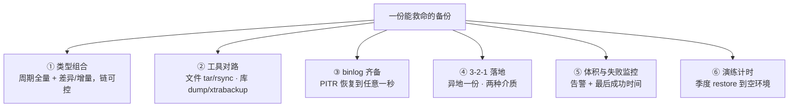
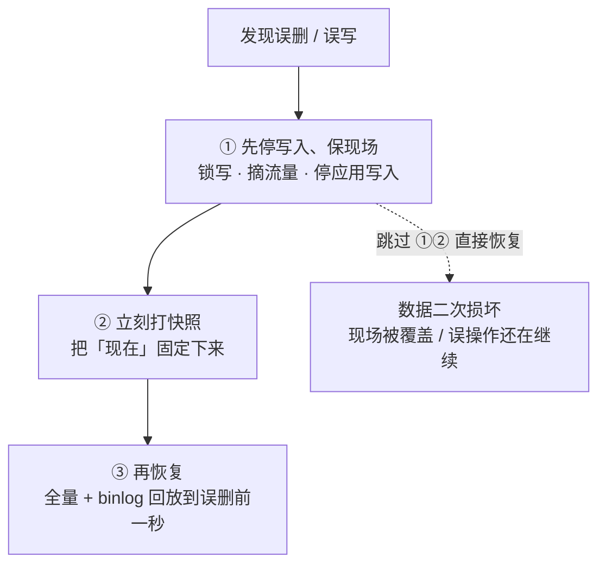
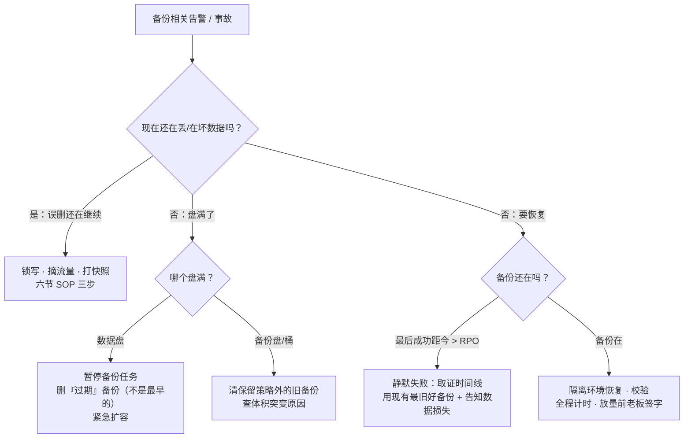

# 备份与恢复

> 凌晨备份把数据盘写满、全服登录卡死；误 `DELETE` 后翻日志才发现备份任务半年前就静默失败。群里有人喊「赶紧切主从」——那个人错了。
> **本章回答**：一份数据从定档到重生的备份一生——为什么备、备什么、用什么备、怎么知道真的备上了、出事了怎么救回来。
> **不讲**：LVM/云盘快照底层 → [29](../29-磁盘管理与LVM/)；日志留存治理 → [23](../23-日志运维/)；高可用切换与容灾分级 → [33](../33-高可用与容灾/)；MySQL 复制与 binlog 全解 → [02-01](../../02-中间件与数据库/01-MySQL/)。

**标记**：🎯重点 · 🔥难点 · ⭐常考 · 🔧实操

---

## 一、一张图：一份数据的备份一生

> 🎯 **一句话**：备份不是一条命令，是「定档 → 生成 → 搬运 → 看守 → 验证 → 重生」一条流水线；断在哪一段，出事当天才知道疼。


- 📖 **读图**
  - 🛤️ 左三段（定档/生成/搬运）是平时九成活；右两段（验证/重生）平时不做，出事当天价值百分之百
  - 🔥 「看守」「验证」最常被跳过——任务绿灯 ≠ 能恢复；「半年静默失败」都断在这两段
  - 🔭 监控照「看守」：成功与否、体积突变、最后成功距今多久（→ [22](../22-监控与告警/)）

---

## 二、出生：为什么备份——四类场景与 RPO/RTO

> 🎯 **一句话**：备份挡四类「删了就没了」；RPO 管丢多少、RTO 管停多久——先定数字再谈方案。

### 💣 四类灭顶场景 ⭐

- 🔥 开头喊切主从——**对逻辑误删是高频错答**。口诀：**「副本防机器坏，备份防人祸与逻辑坏」**（练习题 Q1、Q2）

1. **误操作**：`rm -rf` 少打一点、`DELETE` 忘 `WHERE`、`DROP TABLE`——主从会**忠实地把错误复制到每一份副本**，切主救不了
2. **逻辑错误**：版本 bug 写坏余额、脚本刷错道具表——命令「成功」了，坏的是内容，副本一样坏
3. **勒索/安全**：加密病毒把生产盘和同盘快照一起加密——同盘手段**一起没**，才要异地一份
4. **机房级事故**：断电失火、整 Region 挂——单机手段全失效，能救命的只有异地那份

> ⚠️ **别混**：前三类是**数据坏了**（副本也坏，只能回备份）；第四类是**数据没了但可能还好**（异地还有好份）。前者走恢复/回档，后者走容灾切换 → [33](../33-高可用与容灾/)。

#### ❓ 为什么切主从救不了误删？

- ❌ **以为**：从库是「干净副本」，切过去就好了
- ✅ 复制忠实地重放每一条变更——`DELETE` 早到从库了
- 🧭 **副本防硬件/进程挂；备份 + binlog 防人祸与逻辑坏**——两条路，别混（→ [02-01](../../02-中间件与数据库/01-MySQL/)）

### ⏱️ 两个数字：RPO 与 RTO ⭐🔥

> 🎯 **一句话**：RPO = 最多丢多久的数据；RTO = 最多停多久的业务。备份越勤，变小的是 **RPO**。

- **RPO（Recovery Point Objective）** = 最多能丢多少数据（时间说）：每小时备一次，最坏丢 1 小时
- **RTO（Recovery Time Objective）** = 从故障到重新对外的最长时间上限

> 💡 **打个比方**：RPO 是「日记写到哪一页」——火灾后那一页之后都没了；RTO 是「店铺重新开门要多久」。日记写得勤是 RPO，开门修得快是 RTO，两件事分开花成本。


- 📖 **读图**
  - RPO 段在故障**之前**（丢还没备份的）；RTO 段在故障**之后**（发现、决策、恢复、验证**全算**，不是 restore 跑了几分钟）
  - 全库通用：[33](../33-高可用与容灾/) 用它们定容灾档；本章用它们定备份节奏

#### ❓ 为什么备份越勤只压 RPO、不压 RTO？

- 📉 **勤备** → 可恢复点更近 → **RPO 变小**
- ⏱️ **RTO** 取决于恢复链长度、盘速、人力决策——靠演练缩短 MTTR，不是靠多跑几次备份
- 📊 **RTO vs MTTR**：RTO 是**承诺**；MTTR 是**成绩单**。PPT 写 30 分钟、演练 3 小时——**3 小时才是真 RTO**

### 📦 3-2-1 原则 ⭐

**3-2-1** = 至少 **3** 份数据、**2** 种介质、**1** 份异地。少一条都是假 3-2-1：

```text
3 份数据     生产 + 备份 ×2
             反例：生产 + 同一块盘上的快照 —— 盘坏一起没

2 种介质     磁盘 + 对象存储 / 磁带
             反例：三份全在同一块云盘的快照链 —— 介质只算一种

1 份异地     另一 Region / 另一账号的对象存储
             反例：同账号同地域的桶 —— 火灾和盗号一起没；勒索最爱同账号
```

> 📝 **面试**：「备份怎么设计？先问业务要 RPO/RTO，再按 3-2-1 落：三份数据、两种介质、一份异地；频率由 RPO 定，恢复能力由演练证明——没演练过的备份等于没有。」四句就是本章骨架。⭐（练习题 Q1、Q2）

### 🪟 备份窗口：RPO 不是白来的 ⭐

**备份窗口（backup window）** = 每次备份占用的时间——窗口越长越不敢高频，RPO 越差；太长还挤业务 IO（八节「凌晨盘满」）。

```text
2T 的库 × 每晚全量 5 小时
→ 窗口 5h，业务已有感知 → 不敢改成 6 小时一次 → RPO 卡在日级
→ 想压到秒级？答案不是「跑得更勤」，是 binlog（四节）
```

- 🪓 **压窗口三板斧**：从库/专用备份机打（不碰主库 IO）· 物理备份换逻辑（大库快数倍）· 全量+差异组合（全量摊到周末）
- 📐 **三本物理账**（定 RPO 前先算）：

```text
窗口账   每晚全量 5h → 一天一次机会 → RPO 封顶日级
         「周日全量 + 每日差异」→ 平日窗口 ~40min，链只两条
容量账   日 7 + 周 5 + 月 12 ≈ 全量 × 二十几份（差异/压缩更少）
         按「全量 × 保留份数 × 1.5」规划，别等 100% 才告警
带宽账   跨机房 2T @ 50MB/s ≈ 11h；追不上生成速度 → 异地份断档的隐形根因
```

本节对应练习题 Q1、Q2。档位定了——全量/增量/差异怎么选？

---

## 三、成长：全量、增量、差异的取舍

> 🎯 **一句话**：三种类型赌的是「恢复时需要几条链」——全量恢复最快、备份最慢；增量反过来；差异取中间。

### 🔗 定义与恢复链 ⭐🔥

- **全量（full）**：把所有数据完整备一份
- **增量（incremental）**：只备**上一次备份**（不论哪种）之后的变化
- **差异（differential）**：只备**上一次全量**之后的变化

> 💡 **打个比方**：全量 = 整份存档另存一槽；增量 = 只记从上一个存档点的改动，读档要把一串改动全打上；差异 = 永远只记从整份存档到现在一共改了什么，读档只要整份 + 最后一份差异。

```text
周日全量 F —— 周一增量 d1 —— 周二增量 d2 —— 周三增量 d3 —— 周四增量 d4

增量恢复（回到周四）：F + d1 + d2 + d3 + d4   ← 5 条链，断一条回不去
差异恢复（回到周四）：F + D4（D4=周一至今）   ← 2 条链
全量恢复（周四另打过 F2）：F2                  ← 1 条链，最快
```

- 📖 **读图**：链越长出事越危险——任一环损坏/丢失/校验不过，整条报废。**恢复速度优先全量或差异，存储成本优先增量**；生产常见「周日全量 + 每日差异/增量 + 定期再打全量缩短链」

| 对比 | 全量 | 增量 | 差异 |
|------|------|------|------|
| 备份耗时/体积 | 最大 | 最小 | 越攒越大（到下次全量前） |
| 恢复需要几份 | 1 份 | 全量 + 之后每份增量 | 全量 + 最后一份差异 |
| 某份损坏的后果 | 换上一份全量 | 该点之后全废 | 退回上一份差异 |

> ⚠️ **别混**：增量基准是「上一次**任何**备份」，差异基准是「上一次**全量**」——**增量对上一次，差异对全量**。答反了恢复链长度全错。

#### ❓ 为什么差异不是「对上一次备份」？

- 📌 **差异永远锚定全量**：周一到周四的差异都相对周日 F，所以恢复永远只要 **F + 最后一份差异**
- 📌 **增量锚定上一次任意备份**：d4 相对 d3——缺 d2 就断链
- 🎯 面试白板画错基准 = 链长度全错（练习题 Q3）

### 📁 两种「差异」的实战取舍 🔥

文件侧和数据库侧用法不一样，别拿一套答案套两边：

```text
文件侧（rsync --link-dest / 云增量快照）
  天然「每份都完整」：未变文件硬链接/块指针复用
  → 恢复只要「最近那份目录」，没有链的概念
  → 代价是 inode 与元数据；快照链语义 → [29](../29-磁盘管理与LVM/)

数据库侧（xtrabackup 增量 / dump 拆分）
  增量基于上次的物理页变化
  → 恢复必须 全量 → i1 → i2 … 依次 prepare，链和本节一模一样
  → 某环校验不过，该环之后全废
```

- 📖 **读图**：生产折中常是「周期全量 + 库增量 + binlog 兜底到秒级」——增量控窗口，binlog 控 RPO，全量周期性把链长清零。三手段各管一段，谁也替代不了谁。

本节对应练习题 Q3。策略有了——各工具各管哪一段？

---

## 四、干活：工具全景——从 tar 到 binlog

> 🎯 **一句话**：文件用 tar/rsync，数据库分逻辑与物理两路，快照当手段之一，binlog 负责恢复到任意一秒。

### 📦 tar：文件全量的基本功 🔧

```bash
tar -czf /backup/etc-$(date +%F).tar.gz -C / etc \
    --exclude='etc/mtab' --exclude='etc/ssh/ssh_host_*'   # ← -C 先切目录再打包，包内不带路径前缀
tar -tzf /backup/etc-2026-09-01.tar.gz | head             # ← 备完必须 -t 验能列目录
tar -xzf /backup/etc-2026-09-01.tar.gz -C /tmp/restore --numeric-owner
#    ↑ 恢复成对记：-C 落位；--numeric-owner 按数字 uid/gid 还原
#      ——跨机恢复时新机没有同名用户，缺了它属主会错
```

- 📎 `--exclude` 排除会跟着打包的运行时文件（pid/sock/mtab）
- 📎 数据库文件、VM 镜像等**稀疏文件**加 `--sparse`，否则「洞」被写满，几 GB 稀疏盘备出几百 GB

### 🔄 rsync：增量搬运与它的坑 🔧🔥

**rsync** 本事是**增量算法**：两边比对块指纹，只传差异。基础 `-avz` + ssh。

```bash
rsync -avz --partial --progress /data/ remote:/backup/data/    # ← 源路径带不带尾斜杠语义不同
rsync -avz --link-dest=/backup/data-2026-08-31 /data/ /backup/data-2026-09-01/
#    ↑ 未变文件硬链接指回昨天，只真拷变化的 —— 空间近似增量、每份又是完整目录
```

- 🔥 **尾斜杠语义**：`/data` = 把目录整个拷过去；`/data/` = 把里面的内容拷过去。搞反 → 目标套娃 `data/data/data`
- 🔥 **`--delete` 双刃剑**：让目标与源完全一致。源被误删/勒索清空后再跑带 `--delete` 的 rsync，**备份里好的也被同步没了**——保险箱变事故共犯。备份用 rsync **不带** `--delete`，或先落快照再镜像
- 🔧 **断点续传**：大文件断线默认整文件重传；`--partial`（或 `-P`）保留半截续传
- 🔧 **限速别挤死业务**：跨机房加 `--bwlimit=50m`；本机重 IO 配 `ionice -c2 -n7`

#### ❓ 为什么备份场景不该带 `--delete`？

- ✅ 日常**镜像**要对齐，源删了目标也删——合理
- ❌ 备份是保险箱：源被清空后再对齐 = **把好备份一起删掉**
- 🛡️ 正解：备份 rsync 不带 `--delete`；要镜像先打快照再镜像

### 🗄️ mysqldump vs xtrabackup ⭐🔥

| 对比 | mysqldump（逻辑备份） | xtrabackup（物理备份） |
|------|----------------------|------------------------|
| 备的是什么 | `CREATE`/`INSERT` 语句文本 | 直接拷数据文件 + redo |
| 恢复方式 | 重放 SQL | 文件拷回去即挂起，快 |
| 速度 | 库越大越慢；有锁表窗口 | 大库快得多，InnoDB 热备 |
| 跨版本/跨平台 | 好（文本可改） | 差（要匹配版本与引擎） |
| 典型用途 | 小库、单表导出、迁结构 | 大库、定时全量 |

> 💡 **打个比方**：逻辑 = 照菜谱**重炒一遍**；物理 = **整锅端走**。锅小重炒无所谓；锅大端锅快，但只能放回同样的灶。

- 🔑 **一致性怎么来的**：mysqldump 靠 `--single-transaction`（仅 InnoDB 快照读）；xtrabackup 靠 copy-on-write 追 redo。细节 → [02-01](../../02-中间件与数据库/01-MySQL/)

```bash
mysql -u root -p db_name < full-2026-09-01.sql        # ← 逻辑恢复：重放 SQL
xtrabackup --prepare --target-dir=/bk/full            # ← 物理第一步：redo 滚到同一时刻
xtrabackup --copy-back --target-dir=/bk/full          # ← 第二步：拷回 datadir（先停库、清空、chown）
```

- 📖 **读命令**：物理三步——`--backup` 拷文件、`--prepare` 追一致性、`--copy-back` 落地——一步不能省；跳过 `--prepare` 大概率起不来。增量用 `--incremental-basedir`，恢复按全量 → 增量依次 `--prepare`，链逻辑同三节。

### 📸 快照：把备份做在存储层 ⭐

云盘/LVM 快照把「某一时刻整块盘」固定下来，秒级打、整盘回滚——「全量」最省事形态。本章只当**手段之一**：

```text
快        秒级打、秒级整盘回滚 —— RTO 里最便宜的一段
不异地    同盘/同池快照与生产共存亡 —— 只补「份数」，补不了「1 份异地」
会过期    快照链越长 COW 写放大越重；保留与备份是两套账
```

#### ❓ 为什么快照不等于备份？

- ❌ **以为**：有快照链 = 做了 3-2-1
- ✅ 同盘快照补「份数」，**补不了异地**；勒索/盘坏一起没
- 🧭 正确定位：「恢复手段 + 全量廉价来源」——导成镜像上传异地，才补齐那个「1」；细节 → [29](../29-磁盘管理与LVM/)

### 🎞️ binlog：恢复到任意一秒的关键 🔥⭐

**binlog（binary log）** 记录库上每一次数据变更。完整形态：

```text
全量备份（周日 02:00）
   + 周日 02:00 起保留的 binlog
   = 可恢复到此后任意一秒（Point-in-Time Recovery，PITR）
```

> 💡 **打个比方**：全量是「存档点」，binlog 是「从头到尾的监控录像」。回档 = 读存档 + 把录像**快进到出事前一秒**重演。没有录像，只能回到存档点——中间一整天全丢。


- 📖 **读图**：PITR = 恢复全量 + 按 binlog 重放，终点你指定（精确到秒）。误删 10:32:00 → 重放停在 10:31:59。代价：binlog 必须和全量一样被备份、异地保管，保留期覆盖备份间隔——只备全量不备 binlog，**RPO = 整个备份间隔**。

#### ❓ 为什么只备全量不够？

- 📍 全量只能回到**备份点那一刻**
- 🎞️ binlog 才能 PITR 到任意一秒；没它，中间变更全丢
- 📦 binlog 自己也要进 3-2-1，否则全量白备

### 🔑 不只备数据：配置、密钥与「备机」本身 ⭐

库救回来了、服务起不来——演练里最常见的「第二关」。清单必须有：

```text
① 系统与调度配置    /etc（排除运行时）、systemd unit、crontab、sysctl/limits
② 证书与密钥        TLS、DB 密码、对象存储/异地桶凭证、SSH key
                    ← 密钥不在手边 = 备份不存在；异地凭证要与备份机隔离
③ 可复现的运行环境   镜像 tag / 包版本清单 / 配置仓库快照
                    ← 重建环境 → [04](../../04-工程化与自动化/)
```

凭证管理 → [27](../27-Linux安全加固/)；跟数据备份**同一周期**演练。

### 收束：一份能救命的备份清单 🎯⭐



- 📖 **读图**：①②③「备什么、怎么备」；④「放到哪」；⑤「怎么知道还活着」；⑥「凭什么信能恢复」。缺任一件 =「看起来有备份」。

> ⚠️ **别混**：清单保证「数据能回到过去某个点」，**不保证**：不丢 RPO 窗口内数据、恢复不停机、主机配置自动恢复——`/etc`、crontab、密钥要单独备。

> 📝 **面试**：按「**备什么 → 放哪 → 怎么盯 → 怎么验**」四段背；补一句「误删走 PITR，不走切主」——把本章和 [33](../33-高可用与容灾/) 边界说清。⭐（练习题 Q4～Q7）

本节对应练习题 Q4～Q7。绿灯任务为什么不等于能恢复？

---

## 五、看守：备份的监控与告警

> 🎯 **一句话**：备份最大的风险不是失败，是**静默失败**——任务死了没人知道，半年后误删才发现从来没有备份。

### 👻 静默失败的三张面孔 🔥

```text
① cron 失败，邮件发给早就不存在的本地 root —— 没人看
② 备份盘悄悄满了，tar 写出半截退出非 0，脚本没查 exit code —— 「备上了」其实半份
③ 凭证过期/源目录改名/权限被收 —— 天天失败天天「正常」
```

- 🛠️ **三件套**：查退出码（`set -e` / `||` 告警）· 监控「最后一次成功距今」· 对产物做校验（`tar -tzf`、md5、xtrabackup `--prepare`）

#### ❓ 为什么任务绿灯不等于能恢复？

- 🟢 cron/调度器常只看「进程起来了」，不看 exit code、不看半截文件
- 📦 没人 `tar -t` / `--prepare` → 坏介质躺半年
- ✅ **监控证明备上了；演练才证明救得回**——两段都要（六节）

> 🔍 **现场**：最小骨架——退出码、校验、可观测三样齐：

```bash
#!/usr/bin/env bash
set -euo pipefail                            # ← 任何一步非 0 就停
trap 'echo "backup FAILED at $LINENO" |
      curl -s --data-binary @- http://alert.example.com/hook' ERR
DEST=/backup/db-$(date +%F).tar.gz
tar -czf "$DEST" -C /data db
tar -tzf "$DEST" >/dev/null                  # ← 列不出目录 = 半截文件
md5sum "$DEST" | tee "$DEST.md5"
echo "backup ok $(date +%s) $(stat -c%s "$DEST")" >> /var/log/backup-ok.log
# ← 监控吃这行：最后成功时间 + 体积；mtime 超 26h 告警
```

> 🔍 **现场**：三分钟巡检「据说有备份」的机器：

```bash
ls -lh --time-style=+%F\ %T /backup/ | tail -5     # ← 最后一行时间戳；距今半年 = 实锤
grep -i backup /var/log/cron* | tail               # ← cron 跑没跑、退出没报错
crontab -l | grep -iE 'backup|dump|rsync'          # ← 计划任务还在、路径还存不存在
```

### 📈 体积突变是个信号 🔥

```text
骤降（-50% 以上）   只备了一半：盘满截断 / 源改路径少一块 / 权限丢一层
                    —— 看起来「成功」，恢复才发现少一半

骤涨（+几倍）       日志/缓存混进范围 / 业务暴涨 / 重复备份叠目录
                    —— 先查再保留：盘打满连锁事故就是它（八节）
```

### 👴 GFS 保留策略

**GFS（Grandfather-Father-Son）**：日留 7、周留 4~5、月留 12——近密远稀。用「删过期」不是「全删重灌」；删的是**过期**的，不是「最早的」（最早的可能是唯一月备）。

```bash
find /backup -name 'db-*.tar.gz' -mtime +7 -print     # ← 删前先打印确认
find /backup -name 'db-*.tar.gz' -mtime +7 -delete    # ← -mtime +7 = 修改时间在 7 天之前
# 周备/月备单独目录、单独 -mtime +35 / +365
```

- 📖 **读命令**：`ls | head -n 5 | xargs rm` 式「删最早」会把唯一月备送走。删前 `-print` 是删除类通用纪律（同 [30](../30-定时任务与Cron/)）。

> 📝 **面试**：「备份怎么监控？三指标：任务成功率（带退出码）、最后成功距今（超 RPO 告警）、体积基线突变。再加一条：恢复演练计时——监控证明备上了，演练证明救得回。」⭐（练习题 Q8、Q9）

本节对应练习题 Q8、Q9。出事当天怎么救？

---

## 六、重生：恢复演练与误删应急 SOP

> 🎯 **一句话**：没演练过的备份等于没有；误删第一动作是停写保现场。

### ✅ 恢复演练：什么才算「做过」⭐🔥

```text
不算演练：
  □ 备份任务绿灯
  □ 「应该能还原吧」
  □ 只在原机原目录覆盖试了一下      ← 原机覆盖本身在赌生产

算演练：
  ☑ 还原到空环境/隔离环境，不碰生产
  ☑ 跑校验：行数、抽样业务记录、应用能连能读
  ☑ 全程计时——这个数字才是真实 RTO 的证据
  ☑ 密钥、权限、网络策略一并验证
  ☑ 季度至少一次；大变更（迁移/升级/合服）前加一次
```

- 📖 **读清单**：演练耗时对标 RTO——演练 3h、承诺 30min，要么加资源要么改口径。游戏库回档剧本 → [07-09](../../07-游戏运维专题/09-玩家数据备份与回档/)

```text
月度轻量   抽验产物：tar -tzf / xtrabackup --prepare + 体积基线
季度全量   隔离还原 + 校验 + 计时 + 密钥 —— 对标 RTO 的那一次
大变更前   针对「本次会动的数据」加练一次
```

### 🛑 误删应急 SOP：三步顺序不能错 🔥⭐



- 📖 **读图**
  - **顺序是铁律**：写入还开着时一边回放 binlog、一边新写入灌入——两个时间线搅在一起。先停写再动手
  - **先快照再动手**：恢复本身改写数据文件；搞砸了还能退回「刚出事」重来
  - **别用反向 SQL 止血**：人肉对表结构/自增/关联，错一处脏一片；PITR 才是确定性路径

#### ❓ 为什么必须先停写再恢复？

- 🔥 写入不停 → 恢复进程与新业务写**抢同一时间线** → 最终状态谁也说不清
- 📸 没快照 → 恢复失败一次少一次机会
- ❌ 「从从库拷回来」更错——`DELETE` 早已复制过去

> 🔍 **现场**：PITR 终点先在 binlog 里**定位**：

```bash
mysqlbinlog --no-defaults -v --base64-output=decode-rows \
    --start-datetime='2026-09-01 10:30:00' binlog.000002 | less
#    ← 找到不带 WHERE 的 DELETE，记下前一行 End_of_log_pos / 时间戳 = 回放终点
SHOW MASTER STATUS;      # ← 当前 binlog 名与位点；全量里 --master-data=2 记的是起点
```

- 📖 **读命令**：起点 = 全量备份时的 binlog 位点；终点 = 误删语句**前一行**。跳过定位按「大概 10 点半」估，多回放一秒就把误删又执行一遍。

勒索场景换第三步：取**异地且凭证隔离**的那份 → 干净环境校验 → 全网轮换密钥后再重建。在被加密机器上「先恢复试试」= 把最后一份好备份押上赌桌。

> ⚠️ **别混**：误删应急**不是**「赶紧从库上拷回来」——能救命的只有「备份 + binlog」。

### ⏰ 恢复当天的时间账

```text
t0      发现误删 → 拉群、锁写、摘流量          5 min
t0+5    打快照、定位误操作 binlog 位点         10 min
t0+15   起隔离环境，恢复最近全量               40 min（只有演练知道）
t0+55   回放 binlog 到 10:31:59，校验          20 min
t0+75   应用切读验证 → 放量                    15 min
──────────────────────────────────────────────
全程 ≈ 90 min = 真实 RTO；从没演练过，每一行都是现场现学
```

- 📖 **读账**：最长常是「恢复全量」——由库大小/硬件决定，只有演练量得出。每次演练后更新 = 团队**恢复能力台账**。

本节对应练习题 Q10、Q11。60 秒怎么定责？

---

## 七、作战：备份事故定责

> 🎯 **一句话**：备份侧值班三种案子——盘被备份打满、要恢复时发现没备份、恢复过程本身出错；先分清「现在还在丢数据吗」。

### 🌳 定责决策树



- 📖 **读图**：第一问分「止血」和「复盘」——还在丢先锁写（六节）；盘满先分数据盘还是备份盘（**删数据盘上的东西必须确认是备份**）；恢复先核对最后成功时间再动手。

### 📋 现象 · 先做 · 别做

| 现象 | 先做 | 别做 |
|------|------|------|
| 凌晨全服卡死、盘 100% | 看是不是备份把数据盘写满 | 直接 `rm` 盘上「不知道谁的」大文件 |
| 备份目录里日期断档 | 核对 cron 日志 + 退出码，算清断档起点 | 「补跑一次」了事不查断因 |
| 备份体积骤降 50% | 抽验产物（tar -t / prepare） | 当监控误报静默 |
| 误 DELETE 已执行 | 锁写保现场 → 快照 → PITR | 从库拷数据；反向 SQL 硬补 |
| 勒索加密告警 | 隔离机器、保住异地备份凭证 | 在被加密机器上「先恢复试试」 |
| 恢复演练超 RTO 三倍 | 拆每段耗时，加资源/改链 | 修改报表口径盖过去 |

### ⏱️ 60 秒剧本 🔧

> 🔍 **现场**：接到「误删了 / 备份告警」，60 秒走完再下结论。

```text
① 0–10s   确认是否还在写：还在丢 → 立刻锁写摘流量（永远第一）
② 10–30s  ls -lh --time-style 看最后成功时间戳；对照 RPO 算最大损失窗口
③ 30–45s  df -h 看备份目标盘余量；体积是否突变（五节）
④ 45–60s  定路线：好备份在 → 隔离恢复计时；断档 → 取证 + 上报损失预估，别先动手
```

本节对应练习题 Q12～Q14。开头那位要切主从的同事——你已经知道该走备份了。

---

## 八、收口

### 命令速查 🔧

```bash
# 文件
tar -czf bk.tar.gz -C / data --exclude='*.sock' --sparse   # 打包：排除运行时 + 稀疏文件
tar -tzf bk.tar.gz | head                                   # 验证：能列目录才算备上
rsync -avz --partial src/ remote:/dst/                      # 增量搬运 + 断点续传（注意尾斜杠）
rsync -avz --link-dest=/bk/prev src/ /bk/$(date +%F)/       # 硬链接增量：每份完整目录
# 巡检
ls -lh --time-style=+%F\ %T /backup/ | tail                 # 最后成功写入时间
grep -i backup /var/log/cron* | tail                        # 任务跑没跑、退没退错
df -h /backup                                               # 备份盘余量
md5sum -c /backup/db-2026-09-01.tar.gz.md5                  # 异地搬运后先验校验和
find /backup -name 'db-*.tar.gz' -mtime +7 -print           # GFS 删过期：先打印再 -delete
# 数据库（口径与参数 → 02-01）
mysqldump --single-transaction --master-data=2 ... > dump.sql
xtrabackup --backup --target-dir=/bk/full
xtrabackup --prepare --target-dir=/bk/full                   # 恢复三步之二：追一致性
mysqlbinlog --no-defaults -v --base64-output=decode-rows \
    --start-datetime='...' binlog.000002 | less              # 误删定位：找 DELETE 前一行位点
mysqlbinlog --start-position=... --stop-datetime=... | mysql # PITR：回放到误删前一秒
```

### 面试锚点

| 问 | 30 秒答 |
|----|---------|
| 备份方案怎么设计？ | 先要 RPO/RTO；周期全量 + 差异/增量；库分逻辑/物理；3-2-1 异地一份；binlog 做 PITR。 |
| RPO 和 RTO 是什么？ | RPO=最多丢多少（时间计），RTO=最长停多久；RPO 在故障前、RTO 在故障后；RTO 是承诺，MTTR 是实测。 |
| 3-2-1？ | 三份数据、两种介质、一份异地；同盘快照不算三份、同账号同地域不算异地。 |
| 全量/增量/差异怎么选？ | 增量省空间但恢复链长，差异链固定两条，全量恢复最快；生产用周期全量 + 差异控链长。 |
| mysqldump 和 xtrabackup？ | 逻辑=重放 SQL，跨版本好、大库慢；物理=拷数据文件，快、要匹配版本。 |
| 为什么必须备 binlog？ | 全量只能回到备份点；binlog 才能 PITR 到任意一秒，没它 RPO=备份间隔。 |
| rsync --delete 什么坑？ | 镜像对齐：源被清空后再跑，备份也清空；备份用 rsync 不带 --delete。 |
| 备份怎么监控？ | 成功率（退出码）+ 最后成功距今 + 体积基线突变；超 RPO 即告警。 |
| 误删了第一件事干什么？ | 停写保现场 → 打快照 → 再 PITR；顺序错了二次损坏。 |
| 从库能救误删吗？ | 不能，DELETE 早已复制过去；只能备份 + binlog 回档。 |
| 没演练过的备份？ | 等于没有：恢复时间未知、密钥未验证；季度还原到空环境并计时。 |

### 易错一句话对照

- 备份任务绿 = 有备份 → 错，静默失败半年没人知道是常态
- 快照就是备份 → 错，同盘快照和 production 一起没，不满足 3-2-1
- 增量备份省事 → 恢复链最长，一环坏全链废
- 差异对上一次备份 → 错，差异对上一次**全量**；增量才对上一次
- rsync 会自动断点续传 → 要 `--partial`/`-P`，默认整个重传
- `--delete` 更干净 → 备份场景它是「帮事故删证据」
- 误删先从从库拷回来 → 错，早复制过去了；走备份 + binlog
- 误删先赶紧恢复 → 错，先停写打快照；顺序错 = 二次损坏
- 恢复耗时看库大小估一下 → 错，只有演练计时才算数
- 删旧备份腾地方删最早的 → 错，删「过期」的；最早的可能是唯一月备
- 备份只要备数据库 → `/etc`、crontab、证书密钥都要；密钥不在手=备份不存在
- PITR 能恢复到任意时刻 → 前提是 binlog 从全量点起完整保留并异地保存

### 数字墙

> **3-2-1**：3 份数据 / 2 种介质 / 1 份异地 · RPO = 备份间隔上限 · 演练 **季度**至少一次 · GFS 保留：日 **7** / 周 **4~5** / 月 **12** · 体积突变告警线 **±30%~50%** · 停写→快照→恢复 **三步铁序** · tar 稀疏文件用 `--sparse` · rsync 续传 `--partial`/`-P` · mysqldump 一致性 `--single-transaction` · PITR = 全量 + binlog 回放 · 勒索场景同盘快照 **一起没**

---

## 合上书

对齐练习题「合上书」，逐条口述，卡住就回对应节 / 题号。现在再看开头那个现场——盘写满、静默失败、有人喊切主从——你该知道先守哪一段流水线了。

- [ ] **默画一节的图**：定档 → 生成 → 搬运 → 看守 → 验证 → 重生；监控照哪一段、哪两段最常被跳过。
- [ ] **口述出生**：四类场景各是什么；为什么前三类切主救不了；RPO/RTO 各管哪段、RTO vs MTTR；3-2-1 三条各防什么反例。
- [ ] **口述成长**：全量/增量/差异的定义、恢复链各几条、某份损坏各什么后果；「增量对上一次、差异对全量」。
- [ ] **默画四节 PITR 时间轴**：全量点 + binlog 回放到误删前一秒；为什么只备全量 RPO=备份间隔。
- [ ] **口述干活**：tar 的排除与稀疏文件；rsync 尾斜杠、`--delete` 双刃剑、`--link-dest`、`--partial`；mysqldump vs xtrabackup 逻辑/物理之分。
- [ ] **口述看守**：静默失败三张面孔；体积骤降/骤涨各是什么病；GFS 保留策略。
- [ ] **口述重生**：演练「算做过」的五条清单；误删 SOP 三步及顺序为什么不能错；恢复当天时间账。
- [ ] **定责**：决策树第一问是什么；盘满先分什么；60 秒剧本四步各敲什么。

上一章把存储层讲透了（[29 磁盘管理与 LVM](../29-磁盘管理与LVM/)），本章把数据兜底讲完；数据丢了之后整个系统怎么活，去 [33 高可用与容灾](../33-高可用与容灾/)；游戏回档剧本在 [07-09](../../07-游戏运维专题/09-玩家数据备份与回档/)。
