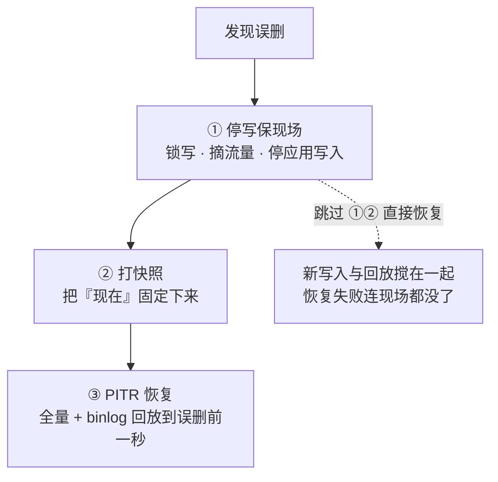

# 31｜备份与恢复 · 练习题

开始做题前，先给大家一个小建议：合上知识点，对着**第一节的主图**，把「一份数据的备份一生（定档 → 生成 → 搬运 → 看守 → 验证 → 重生）」口述一遍。能顺下来，下面这些题你会发现大半都会了；卡壳的地方，就是你该回去重读的那一节。

做题的方式也建议改一下：每道题**先看标题和场景，自己口述一遍答案，再往下看「完整解答」对答案**。直接看解答，容易产生「我会了」的错觉——能讲出来才是真的会。

| 标记 | 含义 |
|------|------|
| **核心** | 不懂整章就没建立起来 |
| **必会** | 值班和面试都要能讲 |
| **常用** | 线上会反复碰到 |
| **常考** | 白板和追问的高频口径 |

题目的顺序也是有意排的：Q1～Q3 先钉场景与 RPO/RTO；Q4～Q9 工具与看守；Q10～Q14 恢复定责与白板。

## 本题目录

- [Q1 四类场景](#q1)
- [Q2 RPO/RTO](#q2)
- [Q3 3-2-1](#q3)
- [Q4 三种备份类型](#q4)
- [Q5 rsync 的坑](#q5)
- [Q6 逻辑 vs 物理](#q6)
- [Q7 binlog 与 PITR](#q7)
- [Q8 静默失败巡检](#q8)
- [Q9 体积突变](#q9)
- [Q10 误删应急 SOP](#q10)
- [Q11 演练与真实 RTO](#q11)
- [Q12 定责分流](#q12)
- [Q13 PITR 白板走读](#q13)
- [Q14 备份恢复白板综合题](#q14)
- [合上书](#合上书)

---

## Q1

**★★★★★｜为什么要备份？哪些事故切主/加机器救不了？**

**覆盖**：核心 · 必会 · 常考 ｜ **对应**：知识点 [二、出生：为什么备份——四类场景与 RPO/RTO](知识点.md)

### 场景

老板问：「咱们主从双活都有冗余了，备份是不是可以砍掉省钱？」旁边新人也附和「主库删了从库不是还有一份吗」。


就是开头有人喊切主从。

先自己试试：四类灭顶场景各是什么？切主从救得了吗？

### 完整解答

> 🎯 **一句话**：备份防的是四类「删了就没了」的事故，其中前三类连副本也是坏的，冗余救不了。

```text
① 误操作      rm -rf / DELETE 忘 WHERE / DROP TABLE      ← 主从忠实地复制错误
② 逻辑错误    版本 bug 写坏全服余额、脚本刷错道具        ← 命令成功、内容坏，副本一样坏
③ 勒索/安全   生产盘与同盘快照一起被加密                  ← 要靠异地那份
④ 机房级事故  断电失火、整 Region 故障                   ← 单机手段全失效
```

冗余（主从/多活）应对的是「**数据还在、载体坏了**」；前三类是「**数据本身坏了/没了**」，复制链会把坏数据忠实地铺到每一份副本——切主只会切到另一份坏的。这就是「冗余管活、备份管回」的分界：切换侧见 [33](../33-高可用与容灾/)。

> ⚠️ **别混**：前三类走**恢复/回档**（回到过去某个好点），第四类走**容灾切换**（换一份好的顶上）——两条路动作完全不同，答混了方向就反了。

### 再追问

- 那冗余是不是白花钱？——不是，冗余把「载体故障」的 RTO 从小时级压到分钟级；它和备份是两件事各管一段（[33](../33-高可用与容灾/)）。
- 勒索场景为什么强调「异地」？——同账号同地域的备份桶和凭证一起被盗/一起被加密；真异地（另一账号/另一 Region、凭证隔离）才是 3-2-1 的那「1」。

---

## Q2

**★★★★★｜RPO 和 RTO 各是什么？和 MTTR 什么关系？**

**覆盖**：核心 · 必会 · 常考 ｜ **对应**：知识点 [二、出生：为什么备份——四类场景与 RPO/RTO](知识点.md)

### 场景

业务方要你在备份方案评审上开口径：「你们到底能保证什么？」有同事抢答「RTO 就是恢复耗时，我们 restore 只要 20 分钟」。


先自己试试：RPO/RTO 各管什么？怎么定档？

### 完整解答

> 🎯 **一句话**：RPO=最多丢多少数据（时间计），RTO=最长停多久；RPO 段在故障前，RTO 段在故障后。

```text
最近一次成功备份 ──RPO（这段没备上的丢了）──> t0 事故 ──RTO（发现+决策+恢复+验证全算）──> 服务可用
```

- **RPO（Recovery Point Objective，恢复点目标）** 由**备份频率**决定：每小时备一次，最坏丢 1 小时。
- **RTO（Recovery Time Objective，恢复时间目标）** 是对业务的**承诺**；时钟从告警响就开始，不是 restore 命令的耗时。
- **MTTR** 是历史实测的**成绩单**；演练缩短 MTTR。承诺 RTO=30 分钟、演练 3 小时——**3 小时才是真 RTO**。

> 📝 **面试**：「先向业务要 RPO/RTO 两个数字再设计方案：RPO 定备份频率与 binlog 保留，RTO 定恢复架构与演练要求；对外承诺的 RTO 必须被演练计时证明。」

### 再追问

- 只备每日全量、不备 binlog，RPO 是多少？——最坏 24 小时（距上次备份以来全丢）；binlog 才能把 RPO 压到秒级（→ Q7）。
- 同事说的「restore 20 分钟」为什么不能当 RTO？——漏了发现、决策、隔离环境准备、校验、放量的时间；RTO 是全链路时钟。

---

## Q3

**★★★★☆｜3-2-1 原则是什么？举三个「假 3-2-1」。**

**覆盖**：必会 · 常考 ｜ **对应**：知识点 [二、出生：为什么备份——四类场景与 RPO/RTO](知识点.md)

### 场景

评审会上，各组汇报自己的备份现状：A 组「生产+同盘快照」，B 组「三份都在同一个云账号的同地域桶」，C 组「生产+同账号异地域两份」。


先自己试试：3-2-1 是什么？

### 完整解答

> 🎯 **一句话**：三份数据、两种介质、一份异地——逐条核，少一条都是假 3-2-1。

```text
3 份数据   生产 + 备份×2            A 组：生产+同盘快照 = 还在一块盘上，盘坏一起没
2 种介质   磁盘 + 对象存储/磁带      三份同一云盘的快照链 = 介质只算一种
1 份异地   另一 Region/另一账号      B 组：同账号同地域 = 火灾和盗号一起没；勒索最爱同账号
```

C 组（同账号异地域两份）勉强够到「异地」，但**凭证不隔离**：账号被盗一次，三份一起删。真·异地要加上凭证隔离与删保护（桶版本控制/MFA 删除）。

> ⚠️ **别混**：3-2-1 说的是**副本分布**，不是「备份任务跑三个脚本」——三个脚本写到同一个盘/同一个桶，份数没变多。

### 再追问

- 快照算不算三份里的一份？——算副本但**不算介质**，同盘快照更是和生产一起没；跨盘/跨区域的快照才计入（机制 → [29](../29-磁盘管理与LVM/)）。
- 「1 份异地」怎么落地最省事？——备份机 rsync/上传到另一账号对象存储桶，开版本控制防覆盖删除。

---

## Q4

**★★★★★｜全量、增量、差异怎么选？恢复链各几条？**

**覆盖**：核心 · 必会 · 常考 ｜ **对应**：知识点 [三、成长：全量、增量、差异的取舍](知识点.md)

### 场景

新人设计的方案是「每月 1 号全量，之后每天增量」，跑了大半年。白板上让你复述周日到周四要恢复时各需要哪几份文件。


先自己试试：全量/增量/差异怎么选？

### 完整解答

> 🎯 **一句话**：增量对上一次备份、差异对上一次全量；恢复链全量 1 条、差异 2 条、增量越积越长。

```text
周日全量 F — 周一 i1 — 周二 i2 — 周三 i3 — 周四 i4

回到周四（增量路线）：F + i1 + i2 + i3 + i4    ← 5 条，断一条全废
回到周四（差异路线）：F + D4                    ← 2 条，D4 = 周一至今全部改动
回到周四（周四有全量 F2）：F2                   ← 1 条，最快
```

**读图**：恢复速度优先选全量/差异，存储成本优先选增量。新人的「每月全量+每日增量」意味着月底恢复链 **30 条**——任何一环损坏或缺失，整条链报废。生产常见「周日全量 + 每日差异/增量 + 定期再打全量缩短链」。

> ⚠️ **别混**：**增量对上一次（任何类型）备份，差异对上一次全量**——基准答反，链长全错；面试高频送分/送命题。

> 📝 **面试**：「全量恢复最快备份最贵；增量最省但链最长；差异固定两条链，是链长和成本的折中；我们用周期全量+差异，链长可控。」

### 再追问

- 某一天的增量文件损坏了怎么办？——该点之后全废，只能退回损坏点之前的链；差异路线只损失回到上一份差异。
- 为什么不干脆天天全量？——大库全量动辄数小时+占用备份窗口和带宽；备份期间盘 IO/CPU 也挤业务（盘满事故就是这么来的，→ Q12）。

---

## Q5

**★★★★☆｜rsync 做备份有哪三个坑？--delete 为什么危险？**

**覆盖**：必会 · 常用 ｜ **对应**：知识点 [四、干活：工具全景——从 tar 到 binlog](知识点.md)

### 场景

备份脚本 `rsync -az --delete /data/ backup:/backup/` 跑了两年。某天凌晨源目录被勒索进程清空，脚本照常在 3 点执行——第二天早上 /backup/ 是空的。


先自己试试：tar/rsync/快照/xtrabackup 各适合啥？

### 完整解答

> 🎯 **一句话**：rsync 三坑——尾斜杠语义、`--delete` 双刃剑、默认不断点续传；备份场景慎用 `--delete`。

```bash
rsync -avz --partial --progress /data/ remote:/backup/data/
#    ↑ 尾斜杠：/data 拷「目录本身」，/data/ 拷「目录内容」——搞反了目标会套娃 data/data/data
rsync -avz --link-dest=/backup/data-0831 /data/ /backup/data-0901/
#    ↑ 未变文件做硬链接指回昨天，空间近似增量、每份又是完整目录
```

`--delete` 让目标与源**完全一致**：源被清空后它忠实地把备份也清空——备份从保险箱变成事故共犯。大文件断线默认整个重传，要 `--partial`（或 `-P` = `--partial --progress`）保留半截续传。

> ⚠️ **别混**：`--delete` 在**镜像分发**场景（配置分发、发布产物）是好工具；危险的是**备份方向**用它。要「备份自动清理旧文件」的正确姿势是 GFS 保留策略删**过期**份，不是镜像同步。

### 再追问

- 已经发生了怎么救？——立刻停任务保住还没被同步删的异地份/快照；这就是为什么 3-2-1 的异地份凭证要与备份机隔离。
- `--link-dest` 和增量备份什么区别？——硬链接版每份都是**完整可独立恢复的目录**（恢复只要一份），增量是**链**；前者费 inode、后者怕断链。

---

## Q6

**★★★★☆｜mysqldump 和 xtrabackup 怎么选？逻辑备份和物理备份差在哪？**

**覆盖**：必会 · 常考 ｜ **对应**：知识点 [四、干活：工具全景——从 tar 到 binlog](知识点.md)

### 场景

2T 的玩家库要做每日备份。目前用 mysqldump，每晚跑 5 小时，业务侧开始抱怨备份窗口卡顿。有人提议直接 tar 打包 datadir。


先自己试试：binlog 在恢复链里扮演什么？

### 完整解答

> 🎯 **一句话**：逻辑=重放 SQL 慢而通用，物理=拷文件快而挑版本；大库用 xtrabackup，别 tar 活库。

| 对比 | mysqldump（逻辑） | xtrabackup（物理） |
|------|------------------|--------------------|
| 备的是什么 | CREATE/INSERT 文本 | 数据文件 + redo log |
| 恢复 | 重放 SQL，像重演一遍写入 | 文件拷回去即挂起，快 |
| 速度 | 库越大越慢 | 大库快，InnoDB 热备 |
| 跨版本/平台 | 好 | 差（匹配版本与引擎） |
| 适用 | 小库、单表导出、迁结构 | 大库、定时全量 |

直接 `tar` 打包**运行中的** datadir 是错的：文件在打包过程中被持续写入，出来的是不一致的拼接体。物理备份的一致性靠 xtrabackup 这类工具「拷文件 + 追 redo + prepare」来保证。

> ⚠️ **别混**：mysqldump 备份期间业务能继续写，靠的是 `--single-transaction` 的一致性快照读（仅 InnoDB），**不是**「dump 不锁表」——MyISAM 一样要锁；复制参数与 binlog 格式细节 → [02-01](../../02-中间件与数据库/01-MySQL/)。

### 再追问

- 5 小时窗口怎么压？——换 xtrabackup 全量 + binlog；或周中差异/增量，全量只周末打。
- 逻辑备份就一无是处？——单表导出、跨大版本迁移、人工检查修改 SQL 文本，物理备份都做不了。

---

## Q7

**★★★★★｜只备全量够吗？binlog 在备份里扮演什么角色？PITR 怎么做？**

**覆盖**：核心 · 必会 · 常考 ｜ **对应**：知识点 [四、干活：工具全景——从 tar 到 binlog](知识点.md)

### 场景

周日凌晨全量备份。周三上午 10:32 运营误执行不带 WHERE 的 UPDATE 把全服道具数量刷爆。DBA 说「回周日备份吧」，业务方炸了：中间三天的充值流水怎么办。


先自己试试：同盘快照为什么不是异地？

### 完整解答

> 🎯 **一句话**：全量是存档点、binlog 是监控录像，PITR = 恢复全量 + 回放 binlog 到出事前一秒。

```text
周日 02:00 全量 ── binlog.000001 ── binlog.000002 ──> 10:31:59（恢复终点）
                                                      （10:32:00 是误操作，不回放它）
```

```bash
mysqlbinlog --start-position=<全量记录的位点> --stop-datetime="10:31:59" \
    binlog.000001 binlog.000002 | mysql        # ← 逐条重放到终点前一秒
```

只备全量：RPO=备份间隔（本例最坏 7 天）。备了全量+binlog：RPO 压到**秒级**。条件是 binlog 要像全量一样**被备份、被异地保管**，且保留期覆盖备份间隔——mysqldump 加 `--master-data=2` 就是把全量对应的 binlog 位点写进备份文件。

> ⚠️ **别混**：PITR 回放是**确定性重演**，不是「把误操作那条删掉」——先恢复全量到隔离环境、再按位点/时间点回放；别在生产库上「反向 UPDATE 硬补」，表结构/自增/关联错一处脏一片。

> 📝 **面试**：「备份的完整形态=全量+binlog：全量定存档点，binlog 让 RPO 到秒级；误删回档=PITR 回放到误删前一秒，且必须在停写之后做。」

### 再追问

- 回放到 10:31:59 之后玩家又充值了怎么办？——所以误删第一动作是**停写摘流量**，时间线冻结了才谈恢复（→ Q10）。
- binlog 保留多久？——至少覆盖一个全量周期，再叠加业务最长回档需求；游戏服常备 7 天以上（回档剧本 → [07-09](../../07-游戏运维专题/09-玩家数据备份与回档/)）。

---

## Q8

**★★★★☆｜「据说有备份」的机器，三分钟怎么核实？静默失败长什么样？**

**覆盖**：必会 · 常用 ｜ **对应**：知识点 [五、看守：备份的监控与告警](知识点.md)

### 场景

接手一套老环境，交接文档写着「备份每天自动跑」。下周一要停机迁移，你得先确认这个备份是不是真的存在。


先自己试试：看守要盯哪些指标？

### 完整解答

> 🎯 **一句话**：看三样——最后成功备份的时间戳、cron 到底跑没跑、产物能不能列出来。

```bash
ls -lh --time-style=+%F\ %T /backup/ | tail -5   # ← 最后一行时间戳=最后成功写入；距今半年=实锤静默失败
grep -i backup /var/log/cron* | tail             # ← 任务跑没跑、退出有没有报错
crontab -l | grep -iE 'backup|dump|rsync'        # ← 计划任务还在不在、路径还存不存在
tar -tzf /backup/xxx.tar.gz | head               # ← 产物能列目录才算「备上」；半截文件一验就露馅
```

静默失败三张面孔：①失败邮件发到没人看的本地 root 邮箱；②备份盘满，tar 写出半截、退出码没人检查；③凭证过期/源目录改名/权限被收，天天失败天天「正常」。治法三件套：检查退出码（`set -e`/`||` 告警）、监控「最后一次成功距今时长」（超 RPO 即告警）、产物定期校验。

> ⚠️ **别混**：「cron 里有这条任务」≠「有备份」——任务存在、执行成功、产物完整、能恢复，是四件事；监控只能证明前三件，第四件靠演练（→ Q11）。

### 再追问

- 监控指标怎么设计？——三个：成功率（带退出码）、最后成功距今（超 RPO 告警）、体积基线突变（→ Q9）。
- 为什么不用「任务运行了」做告警？——运行≠成功：半截文件、空包、写错目录都可能悄悄错；告警要挂在**产物**上。

---

## Q9

**★★★☆☆｜备份体积一晚上从 200G 掉到 90G，什么病？涨了 3 倍呢？**

**覆盖**：必会 · 常用 ｜ **对应**：知识点 [五、看守：备份的监控与告警](知识点.md)

### 场景

周一巡检发现昨晚的备份体积掉了一半多，但备份任务显示成功。同组的另一台机器则连涨三晚，备份盘快满了。


就是开头「半年没成功过」。

先自己试试：静默失败怎么发现？

### 完整解答

> 🎯 **一句话**：骤降=可能只备了一半；骤涨=范围混入垃圾或业务暴涨——两个方向两种病。

```text
骤降（-50%）  盘满截断 / 源目录改路径少了一块 / 权限丢一层
              → 危险点：任务「成功」但产物缺一半，恢复时才发现
骤涨（×3）    日志缓存目录混进备份范围 / 业务暴涨 / 重复备份叠进同一目录
              → 连锁风险：备份盘被打满 → 下一个备份写半截 → 骤降（两病互为因果）
```

处置：骤降先**抽验产物**（`tar -tzf`/xtrabackup `--prepare`），别当监控误报；骤涨先 `du -sh` 找大目录、核对 `--exclude` 清单，再清**保留策略外**的旧备份。保留策略用 GFS（Grandfather-Father-Son，祖父-父-子）：日留 7、周留 4~5、月留 12。

> ⚠️ **别混**：腾空间删的是「**过期**的备份」，不是「**最早的**」——最早那份可能是唯一的月备；删错等于亲手把 RPO 拉长到季。

### 再追问

- 体积监控怎么做基线？——环比上周同天 + 绝对阈值告警（±30%~50%），游戏服要排除周四强更/合服日的已知尖峰。
- 备份盘满了任务怎么失败得这么安静？——写半截退出非 0，但脚本没检查退出码、失败邮件没人看——正是 Q8 的第二张面孔。

---

## Q10

**★★★★★｜线上误删了，第一件事干什么？完整 SOP 顺序？**

**覆盖**：核心 · 必会 · 常考 ｜ **对应**：知识点 [六、重生：恢复演练与误删应急 SOP](知识点.md)

### 场景

下午 4 点，运营在群里贴了张截图：一条不带 WHERE 的 DELETE 已经执行完。DBA 立刻开始在生产库上恢复周日的全量。值班经理喊「先别动」，两人吵起来了。


先自己试试：恢复演练怎么做才算数？

### 完整解答

> 🎯 **一句话**：三步铁序——停写保现场 → 打快照 → 再 PITR 恢复；顺序错=二次损坏。



- **为什么先停写**：误删后写入还开着，回放 binlog 的同时新数据往里灌，两条时间线搅在一起，最终状态谁也说不清；停写=冻结时间线。
- **为什么先快照**：恢复操作本身改写数据文件；先快照，恢复搞砸还能退回「刚出事」那一刻重来。
- **DBA 错在哪**：直接在**生产库**上覆盖恢复——没停写、没快照、没隔离环境，一旦恢复失败连「刚出事」的现场都没了。正确姿势是隔离环境恢复+校验，放量前业务签字。

> ⚠️ **别混**：误删**不是**「从从库拷回来」——DELETE 早已复制到从库（[02-01](../../02-中间件与数据库/01-MySQL/)）；也别用反向 SQL 硬补，PITR 回放才是确定性路径。

> 📝 **面试**：「误删第一动作是停写摘流量保现场，第二打快照，第三在隔离环境 PITR 回放到误删前一秒，校验后再放量——三步顺序不能乱。」

### 再追问

- 恢复期间玩家在干什么？——入口已摘流量，玩家看到的是「维护中」；这就是 RTO 时钟在走，所以演练要计时（→ Q11）。
- 勒索加密和误删的 SOP 一样吗？——前两步一样（隔离保现场），第三步不同：勒索要先保住**异地**备份凭证再谈恢复，且别在被加密的机器上操作。

---

## Q11

**★★★★☆｜什么样的备份演练才算做过？演练超时说明什么？**

**覆盖**：必会 · 常考 ｜ **对应**：知识点 [六、重生：恢复演练与误删应急 SOP](知识点.md)

### 场景

季度审计问各组「备份演练做了吗」。A 组答「备份任务一直是绿的」；B 组答「我们在原机原目录试过覆盖，能成功」；C 组贴了隔离环境的恢复记录和计时表。


先自己试试：误删应急 SOP 第一步是什么？

### 完整解答

> 🎯 **一句话**：演练=隔离环境还原+校验+计时；没演练过的备份等于没有。

```text
不算演练：□ 任务绿灯（那只是监控）  □「应该能还原吧」  □ 原机原目录覆盖（本身在赌生产）

算演练：  ☑ 还原到隔离/空环境，不碰生产
          ☑ 校验：行数、抽样业务记录、应用能连能读
          ☑ 全程计时——这个数字才是真实 RTO 的证据
          ☑ 密钥/权限/网络策略一并验证（异地桶凭证在异地环境拉得下来吗）
          ☑ 季度至少一次；迁移/升级/合服前加一次
```

B 组的「原机覆盖」尤其危险：等于在生产数据上做了一次没有退路的试验——覆盖失败现场就没了。A/B 两组共同的问题：**恢复时间没人知道、介质没人试过、密钥没人找得到**。演练超时（如承诺 30 分钟实测 3 小时）说明要么拆耗时加资源，要么改承诺口径——对外说的 RTO 必须被演练过的 MTTR 证明。

> 📝 **面试**：「监控证明备上了，演练才证明救得回；演练四要素：隔离环境、数据校验、全程计时、密钥验证；季度一次，大变更前加练。」

### 再追问

- 演练要恢复到什么粒度？——至少完整恢复+应用读通；核心库再加业务抽样校验（随机玩家的充值记录核对）。
- 演练太贵能不能降频？——降频的前提是把「最后成功恢复时间」纳入监控告警；核心库建议保持季度，玩具服务可放宽（游戏回档剧本 → [07-09](../../07-游戏运维专题/09-玩家数据备份与回档/)）。

---

## Q12

**★★★★☆｜备份相关值班事故怎么定责？**

**覆盖**：核心 · 必会 ｜ **对应**：知识点 [七、作战：备份事故定责](知识点.md)

### 场景

凌晨 3 点被电话叫醒：「全服登录卡死，数据盘 100%」。登上机器发现 /backup 挂在数据盘上，凌晨 2 点备份开始后一路写满。同组有人提议「赶紧 rm 掉盘上最大的几个文件」。


开头盘写满卡登录——作战版。

先自己试试：盘写满那单 60 秒怎么定责？

### 完整解答

> 🎯 **一句话**：第一问永远是「还在丢/坏数据吗」——盘满先分数据盘还是备份盘，删文件前先确认是备份。

```text
① 0–10s   还在丢数据吗？误删还在继续 → 立刻锁写摘流量（永远第一）
② 10–30s  df -h 分清哪个盘满：数据盘 → 暂停备份任务 + 清『过期』备份 + 扩容
                                  备份盘 → 清保留策略外旧备份 + 查体积突变原因
③ 30–45s  ls -lh --time-style 看最后成功备份；别 rm「不知道谁的」大文件
④ 45–60s  定路线：好备份在 → 隔离环境恢复计时；断档 → 取证 + 上报损失预估
```

本案正确动作：暂停备份任务止血 → 确认 /backup 里哪些是 GFS 保留策略**外**的旧份再删 → 排查体积突变根因（多半是日志/缓存混进了备份范围）→ 恢复登录。「rm 最大的几个文件」的坑：盘上最大的文件可能是生产数据文件（数据盘满时），rm 完服务直接起不来——**删数据盘上的东西必须先确认是备份**。

> ⚠️ **别混**：腾空间删「过期」备份，**不是**删「最早的」——最早那份可能是唯一月备；也不是 `--delete` 镜像一把梭（→ Q5）。

> 📝 **面试**：「备份事故三案：盘满、断档、恢复出错；先问还在丢数据吗，再分盘定责；任何删除动作前先确认对象是备份产物。」

### 再追问

- 根治「备份写满数据盘」？——备份目录独立挂盘/桶，配额隔离；监控备份盘余量告警在 80% 而不是 100%。
- 如果当时还有个「误删正在继续」的告警同时响？——盘满让路：先锁写保现场（丢数据 > 卡顿），盘满的止血动作排第二。

---

## Q13

**★★★★☆｜白板走读：周四 10:32 误删一行，PITR 要拿哪几份备份？**

**覆盖**：必会 · 常考 ｜ **对应**：知识点 [四、干活：工具全景](知识点.md) · [六、重生：恢复演练](知识点.md)

### 场景

DBA 说「有全量+binlog」。你要在白板画出恢复链，不说糊话。


先自己试试：与 29/33 章边界怎么划？

### 完整解答

> 🎯 **一句话**：**最近全量 ≤ 误删时刻 + binlog 回放到误删前 1 秒**；增量链要能说清「对上一次还是对全量」。

```text
周日全量 base
  + 周一增量
  + 周二增量
  + 周三差异
  + binlog 10:00–10:31:59  → 恢复到 10:31:59

恢复在隔离库验证 → 再切流量
```

| 类型 | 恢复需要 |
|------|----------|
| 增量 | 上次备份以来所有增量 |
| 差异 | 最近全量 + 一份差异 |
| PITR | 全量 + 连续 binlog |

### 再追问

- 没有 binlog？——RPO 就是上次全量点，认损（Q2）。

---

## Q14

**★★★★★｜白板：备份一生六段 + 误删三步 + 3-2-1 验收？**

**覆盖**：核心 · 必会 · 常考 ｜ **对应**：知识点 [一、一张图](知识点.md) · [八、收口](知识点.md)

### 场景

白板综合：「画备份主线，说静默失败和误删 SOP 各先做什么。」


先自己试试：备份一生 + 3-2-1，90 秒怎么讲？

### 完整解答

> 🎯 **一句话**：**定档→生成→搬运→看守→验证→重生**；误删 **锁写→停备份→隔离恢复**；3-2-1 是真三份两介质一离线。

```text
静默失败: 体积/时间/mtime 三角验证
断档: 别 rm 最大文件，先确认是备份产物
演练: 计时恢复+业务读通 才算 RTO
```

> 📝 **面试**：切主救不了误删 → 33 章 restore 路线。

### 再追问

- rsync --delete 镜像坑？——源空会删光目的地（Q5）。

---

## 合上书

对齐知识点「合上书」，逐条口述，卡住就回对应节 / 题号。现在再看开头那位要切主从的同事——你该知道逻辑误删该走哪条路了。

- [ ] 默画一节主图：定档 → 生成 → 搬运 → 看守 → 验证 → 重生；哪两段最常被跳过
- [ ] 口述四类灭顶场景，说清为什么前三类切主救不了（Q1）
- [ ] 白板画 RPO/RTO 时间轴：RPO 段在故障前、RTO 段在故障后；RTO vs MTTR（Q2）
- [ ] 3-2-1 逐条核对 + 三个「假 3-2-1」反例（Q3）
- [ ] 默画增量/差异恢复链：回到周四各要哪几份；「增量对上一次、差异对全量」（Q4）
- [ ] rsync 三坑：尾斜杠、--delete、--partial（Q5）
- [ ] 逻辑 vs 物理备份对比表口述（Q6）
- [ ] 默画 PITR 时间轴：全量点 + binlog 回放到 10:31:59（Q7）
- [ ] 静默失败三张面孔 + 三分钟核实命令（Q8）
- [ ] 体积骤降/骤涨两种病 + GFS 保留（Q9）
- [ ] 默画误删 SOP 三步图及「跳过 ①②」的后果（Q10）
- [ ] 演练「算做过」的四要素（Q11）
- [ ] 60 秒定责剧本四步（Q12）
- [ ] PITR 白板走读（Q13）
- [ ] 备份一生白板综合（Q14）

与知识点「合上书」逐条对齐；都能口述这一章就过了。
