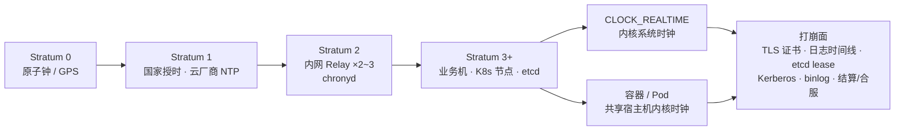
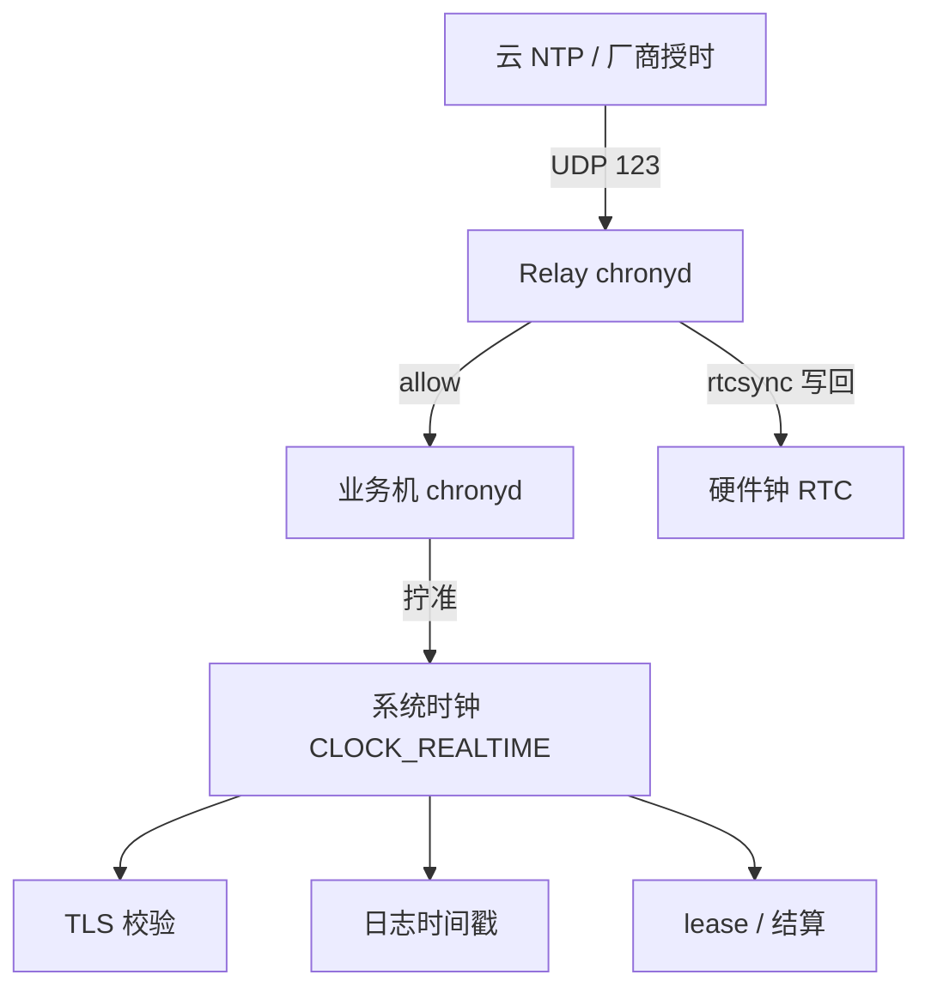
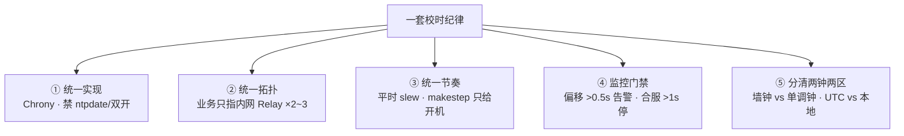
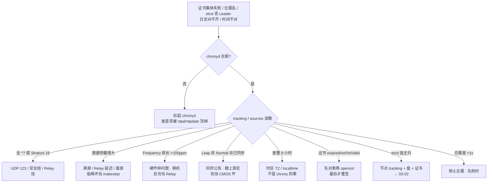

# NTP 与时间同步

> 大家好，欢迎来到这次分享。开讲之前，先带大家回到一个很多值班同学都经历过的现场：
> 合服前排行榜时间戳对不上、kubelet 集体报证书 expired、etcd 半夜丢 Leader——三件事各自查了三天，根因是同一件：**某台机器以为的「现在」偏了 62 秒**。群里已经有人在重签证书、有人在重启 etcd。
> 这一章讲完，你会知道当时那些人错在哪，以及第一刀为什么是 `chronyc tracking`。
> **本章回答**：一个时间戳从原子钟到玩家客户端的一生——时间从哪来、谁在对表、偏差怎么读、偏了会炸什么、合服前怎么设门禁。
> **不讲**：TLS 握手与证书链本身 → [14](../14-HTTP与TLS/)；API Server/kubelet 证书轮换 → [03-03](../../03-Kubernetes/03-API-Server/)；etcd Raft 细节 → [03-02](../../03-Kubernetes/02-etcd/)；合服流程本身 → [07-06](../../07-游戏运维专题/06-开服合服/)；日志字段规范 → [23](../23-日志运维/)；cron 的时区坑 → [30](../30-定时任务与Cron/)。这些都有专门的章节，本章只在用到时点到为止。

**标记**：🎯重点 · 🔥难点 · ⭐常考 · 🔧实操

**怎么听这场分享**：咱们先看第一节的主图，把「一个时间戳的一生」装进脑子；第二到第七节顺着出身 → 对表 → 读数 → 百病 → 时区 → 拓扑往下走；作战节专门讲定责，也就是开头那个现场的正确解法。每一节讲完都会提示对应练习题，学完就去练。

---

## 一、一张图：一个时间戳的一生

> 🎯 **一句话**：时间从原子钟出发，经授时中心→云 NTP→内网 Relay→业务机内核时钟，最后被 TLS/日志/结算拿去用；任何一环偏了，下游全歪。

咱们先不急着改 chrony 配置。学时间最怕的就是「证书过期」先重签。先看图，把对表链装进脑子里：



**读图**：带着三个问题看这张图，比背 Stratum 数字有用得多：

- 左半段（钟源→Relay→业务机）是**对表链**：业务机只指内网 Relay，Relay 再指云/公网——不许每台直连公网池。数字 **Stratum** 表示离钟源几层，**16 = 没对上表**。
- 右边是**打崩面**：时钟差看起来像业务 bug——证书报过期、日志对不齐、排行榜乱，第一刀都是 `chronyc tracking`（→ 四节），不是先怀疑业务代码。
- 容器是这条链上的「搭车者」：Pod 不跑 chronyd，宿主机时钟对准了它就对准了（→ 七节）；但它**可以**有自己的时区——差 8 小时的坑在时区不在时钟（→ 六节）。

---

---

好，主图有了。咱们正式出发——第一站：时间从哪来？Stratum 是什么？

---

## 二、出身：原子钟、授时与 Stratum 分层

🔥 Stratum 第一次见容易懵。大白话：**Stratum = 离真正的钟问了几手；数字越大越远，16 = 根本没对上表**。⭐ 面试必考（练习题 Q1）。

> 🎯 **一句话**：真实时间只有钟源知道，其他机器靠「问离钟源近的人」；Stratum 就是这个「问了几手」。

**NTP（Network Time Protocol，网络时间协议）** 跑在 **UDP 123** 上，干的就一件事：让一台机器的时钟和上游对齐。上游不是凭空来的，是一条分层链：

- **Stratum 0**：原子钟、GPS——真·时间本体，不直接对外。
- **Stratum 1**：直接连着 Stratum 0 的授时服务——国家授时中心、各大云厂商的 NTP。
- **Stratum 2**：指 Stratum 1 的机器——典型就是**内网 Relay**（企业自建 2~3 台 chronyd，对内提供授时）。
- **Stratum 3+**：业务机，指 Relay。生产上业务机 **Stratum ≤4** 为好；**>10** 当链路有问题；**16 = 未同步**。

> 💡 **打个比方**：像问路。「直接看过钟的人」是 Stratum 1，「问了 Stratum 1 的人」是 Stratum 2——**问的手数越多，误差累积越大**。所以「Stratum 数字大」从来不是「更准」，而是「离钟更远」；16 则是「根本没问到人」。

**客户机视角的数据流**（这张小图后面每节都在用）：



**读图**：应用读的永远是**内核系统时钟**（CLOCK_REALTIME）——chronyd 负责把它拧准，应用自己不会「再对一次表」。`rtcsync` 把校准结果写回硬件钟（RTC），防止**重启后又偏回去**。所以「校时」的完整闭环是：上游→系统时钟→写回 RTC。

> ⚠️ **别混**：**时钟（UTC 这一刻对不对）≠ 时区（显示成东八还是 UTC）**。差 8 小时先 `timedatectl` 查时区（→ 六节），不是先换 NTP 源——NTP 同步的是 UTC 时刻，与时区无关。

---

---

出身段到这儿。本节对应练习题 Q1。好，分层懂了——chrony 怎么对表？

---

## 三、对表：chrony 怎么把本机拧准

> 🎯 **一句话**：新系统默认 Chrony；平时用 slew 慢慢拧，只有开机前几次的大偏差才允许 step 跳钟。

### 选型：Chrony / ntpd / ntpdate ⭐

**Chrony** 是现代 NTP 客户端+服务端实现，**RHEL 8+ / Ubuntu 20+ 的系统默认**；老机房常残留 ntpd 和 crontab 里的 ntpdate 遗毒。

| 对比 | Chrony | ntpd | ntpdate |
|------|--------|------|---------|
| 角色 | 客户端 + 可当 Relay | 老实现 | 一次性猛调（已过时） |
| 初始同步 | **秒级** | 可能几十分钟 | 立刻跳一刀 |
| 闪断恢复 | 快 | 慢 | 不适用 |
| 大偏差 | makestep 受控跳 | 保守慢拧，要人介入 | 永远跳 |
| 能否与 chronyd 并存 | —— | **禁止双开** | **禁止** |

为什么 Chrony 快（面试够用版）：不是换了另一套 NTP 协议，而是 ① 滤波/估算更敢用短采样收敛；② 允许受控 step（makestep）开机对齐；③ 实现轻，虚拟机/休眠场景恢复好。

> 🔍 **现场**：接手老机器，先查有没有「抢时钟」的：

```bash
systemctl is-active ntpd chronyd 2>/dev/null
# active          ← ntpd 在跑
# active          ← chronyd 也在跑 —— 双开，两个进程抢着拧 CLOCK_REALTIME
crontab -l 2>/dev/null | grep -E 'ntpdate|ntp'
# 0 * * * * /usr/sbin/ntpdate -u ntp.example.com   ← 每小时猛掰一次指针的遗毒
```

处置四步：`systemctl disable --now ntpd` → 删 crontab ntpdate → 只留 chronyd → `chronyc sources -v` 确认有 `^*`。不要「先停 chrony 留 ntpd」——新规范是 Chrony。

### slew vs step：本章最易混 🔥⭐

**slew（微调）** = 拧晶振频率，让时钟**连续地**慢慢追上——时间线不中断，业务无感。
**step（跳变）** = 直接把系统时间**改到目标值**——时间线出现**空洞或重叠**，一秒被跳过或经历两次。

| | slew（微调） | step（跳变） |
|--|--------------|--------------|
| 做什么 | 拧频率，时钟单调追赶 | 直接改墙钟跳一下 |
| 业务体感 | 几乎无感 | 时间线空洞/重叠 |
| 结算/lease | 安全 | 可能双扣、租约错乱、证书窗口瞬移 |
| 何时用 | **运行中默认** | 开机前几次 / 低峰应急 |

> 💡 **打个比方**：slew 是发现表快了 5 秒，**不掰指针**，只把走速调慢一点让它自然追平；step 是直接**掰指针**。平时戴的表永远用前者；只有刚捡回来快了 12 秒的表，才值得掰一次。

**makestep** 就是「允许跳」的策略，写在 chrony.conf 里：

```ini
makestep 1.0 3      # 前 3 次同步若偏差 >1.0s，允许 step；之后永远只 slew
makestep 0.1 2      # 更严：前 2 次、>0.1s 就跳 —— 网络差时可能过频 step，慎用
```

三句铁律 ⭐🔥：

1. `makestep 1.0 3` 是**开机对齐策略**，不是「随时可以跳」——大头在开机头几次，之后常态是 slew。
2. **运行中手打 `chronyc -a makestep` = 主动制造事故**：跳钟会让结算双扣/漏扣、lease 错乱、证书窗口瞬移。真要应急，低峰+广播变更窗口。
3. `date -s` **绝对禁止**：手改后 chronyd 会再 slew/step 拉回来，时间线二次抖动——和 chronyd 打架。正确路径永远是「修源 → 必要时低峰 makestep → 确认 tracking」。

> ⚠️ **别混**：跳钟 ≠ 校准。「校准」的默认答案是 slew；step 是受控的极端手段。面试问「怎么处理偏差 3 秒」，答「先查为什么偏（源/硬件），别上来就 makestep」。

---

---

对表段到这儿。本节对应练习题 Q2、Q3。好，拧准了——tracking 各字段怎么读？

---

## 四、读数：chronyc tracking 与 sources

> 🎯 **一句话**：证书炸、合服乱、日志歪，第一刀都是 tracking——Stratum、System time、Frequency、Leap 四个字段定方向。

### 什么时候用

| 现象 | 第一刀 |
|------|--------|
| 证书集体 expired/notYetValid | `chronyc tracking` |
| 合服/结算乱 | 两边各 `tracking` |
| 偏移告警 | `tracking` + `sources -v` |
| 日志对不齐 | tracking（先分偏差还是时区） |
| etcd 丢 Leader | 节点 tracking，与盘、证书并列 |

不要第一刀去对「标准时间网站」——那看不到 Stratum、毒源、硬件漂移。**进程活着 ≠ 同步好了**，一切以 tracking 为准。

### 健康输出怎么读 🔧

> 🔍 **现场**：一台健康的业务机长这样：

```text
Reference ID    : CB6B0B0A (203.107.6.10)   # ← 当前选中的源；空/乱跳 = 源不稳
Stratum         : 3                          # ← 业务机 ≤4 正常；16=未同步；>10=链可疑
Ref time (UTC)  : Sun Aug 30 12:01:02 2026   # ← 上游最后一次应答时刻
System time     : 0.000123456 seconds slow of NTP time
                                             # ← 核心字段：本机相对 NTP 的当前偏差
                                             #   <0.05s 很好；>0.1s 该查；>0.5s 告警叫人
Last offset     : +0.000098765 seconds       # ← 上次校准的偏差；持续变大=换源或查网络
RMS offset      : 0.000112233 seconds        # ← 一段时间的均方根偏差，看稳定性
Frequency       : 5.678 ppm slow relative to hardware clock
                                             # ← 为对表把晶振拧了多少；>100ppm=疑硬件，勿当 Relay
Residual freq   : +0.001 ppm                 # ← 剩余未消掉的频差，越小越好
Skew            : 0.012 ppm                  # ← 频率估计的误差
Root delay      : 0.012345678 seconds        # ← 到钟源的总延迟
Root dispersion : 0.001234567 seconds        # ← 累积误差
Update interval : 64.2 seconds               # ← 轮询间隔，随稳定度自动拉长
Leap status     : Normal                     # ← Normal=无闰秒；Insert/Delete=闰秒公告；Not synchronized=没同步
```

### sources 怎么认 🔧

> 🔍 **现场**：tracking 看方向，sources 定「源还是本机」：

```text
MS Name/IP address         Stratum Poll Reach LastRx Last sample
===============================================================================
^* 10.0.0.10                     2   6   377    23   +12us[ +10us] +/-  450us
#  ↑ ^* = 当前选用源，必须有一个
^+ 10.0.0.11                     2   6   377    28   +18us[ +15us] +/-  480us
#  ↑ ^+ = 候选源
^- 10.0.0.12                     2   6   377    31   -5us[  -8us] +/-  460us
#  ↑ ^- = 被算法排除（和多数派不一致）
^? 203.107.6.88                  0   6     0     -     +0ns[   +0ns] +/-    0ns
#  ↑ ^? = 不可达/未测量；Reach 0 = 一直失败
```

**Reach 377** 是八进制满值：最近 8 次探测全成功；掉到 0 就是从来不通。业务机的 sources 里**只应出现内网 Relay**——再堆一堆公网池说明配置没管住。

硬件钟一侧用 `hwclock -r` 对照：RTC 与系统时钟差 **>1s** 当故障处理（电池没电/主板问题）；这台机器修好之前**不该被提成 Relay**——否则它会把错钟批发给整个内网。

### 三段对照输出 🔥

排障就是拿现象对号入座，这三段背下来：

```text
A. 未同步（Stratum 16）
   Stratum : 16 · Leap status : Not synchronized · sources 全 ^? Reach 0
   → 修 UDP 123 / 安全组 / Relay / chronyd；绝不 date -s

B. 有源但偏很大
   Stratum : 3 · System time : 2.345 seconds fast of NTP time · 有 ^*
   → 源通但本机漂了或刚恢复；低峰评估 makestep；查 Frequency 是否硬件问题

C. 时区坑（不是 NTP）
   tracking 全绿（System time 0.0001s）但业务日志比节点 date 快 8 小时
   → timedatectl 查时区 / 容器设 TZ；别换 NTP 源
```

### 和监控怎么分工

规模化的第一道防线是监控，不是人肉：node_exporter 的 **`node_timex_*`** 系列指标（如 `node_timex_offset`）做**偏移 >0.5s 告警**（→ [22](../22-监控与告警/)）；`chronyc tracking` 是告警响后的**人肉第一刀**；`sources -v` 定责源还是本机；`hwclock -r` 与 Frequency 看硬件；`timedatectl` 分时区。四层由粗到细，别跳着用。

> 📝 **面试**：「时间类故障第一刀 chronyc tracking，看 Stratum/System time/Frequency/Leap 四个字段：16 未同步查源和 UDP 123，偏大查源与硬件，Frequency 超 100ppm 疑主板别让它当 Relay，差 8 小时查时区。」

---

---

读数段到这儿。本节对应练习题 Q4、Q5。🔥 开头证书 expired、etcd 丢 Leader——大家想想：第一刀查什么？

---

## 五、上岗：时间不对的百病

🔥 开头三件事各自查了三天——**第一刀却不是业务**。大白话：**时钟差长得像业务 bug**。口诀：**「证书/etcd/排行榜先 chronyc，别先重签」**（练习题 Q6、Q7）。⭐ 值班天天见。

> 🎯 **一句话**：时钟差总伪装成业务 bug——证书、日志、etcd、Kerberos、结算各有各的「疼法」，量级也不同。

### 偏差量级：值班要有的数量感 ⭐

| 场景 | 量级 | 值班直觉 |
|------|------|----------|
| 金融 | 常盯 **小于 50ms** | 监管/对账敏感 |
| 游戏结算/合服 | 盯 **小于 500ms** | 排行榜、邮件时间戳 |
| 日志对齐 | **小于 1 秒** 就开始难受 | 多机关联排查糊掉 |
| 告警线 | **>0.5s** 叫人 | 别等 1s |
| tracking 排查线 | System time **>0.1s** | 还没炸也查源 |
| 合服门禁 | 两环境差 **>1s 停止合服** | 先合再补更贵 |
| 硬件钟 vs 系统 | hwclock 差 **>1s** 当故障 | 且勿当 Relay |
| Stratum | 业务机 **≤4**；>10 链断可疑；**16=未同步** | 数字大≠更准 |
| Kerberos 窗口 | 默认约 **5 分钟** | 表差五分钟门口不认 |
| TLS 窗口 | **分钟级**就可能炸 | expired / notYetValid |

### TLS / 证书：一例钉死 🔥⭐

最经典的一例：kubelet 报证书 expired，`openssl x509 -dates` 一看 **notAfter 还有 60 天**。

> 🔍 **现场**：

```bash
chronyc tracking | grep -E 'Stratum|System time'
# System time     : 62.345678 seconds fast of NTP time   ← 节点比真实时间快了 62 秒
openssl x509 -in kubelet-client-current.pem -noout -dates
# notAfter=Jan  1 00:00:00 2027 GMT                     ← 证书明明还有 60 天
```

机制：TLS 校验证书窗口用**本机时钟**。本机快了几十秒，`notAfter` 在本机眼里已经过去——集体报 expired；反过来慢太多则 `notYetValid`。处置顺序是铁的：**先对表（修源，低峰才 makestep）→ 再 openssl 看窗口 → 最后才轮换重签**。对表后窗口校验恢复，往往立刻好；别上来就重签一地证书。

### 日志时间线

多机排障靠时间窗关联，同一请求在两台机器日志里差几百 ms～数秒，因果顺序就搅糊了——**小于 1 秒 就开始难受**。两种病要分叉：

```text
差几百 ms ~ 数秒   → NTP 偏移：多机 tracking 对比
差整 8 小时        → 时区：timedatectl / 容器 TZ（→ 六节）
按时间回放错乱     → 历史曾跳钟：查 makestep 记录、谁手改过 date
```

服务器与采集链路优先**存 UTC**，展示层再转本地（→ [23](../23-日志运维/)）。

### etcd / Raft / lease

表现：`etcd_has_leader==0`、选主抖、lease 提前过期或双主错觉。机制（够用版）：Raft 的心跳/选举超时按**物理时钟流逝**感知，节点间墙钟大幅偏移时超时判断失真——不是「etcd 不需要 NTP」，恰恰是**控制面节点 NTP 必须健康**。并列三刀：① 各 etcd 节点 tracking ② 磁盘延迟/fsync（→ [03-02](../../03-Kubernetes/02-etcd/)）③ peer 证书是否也被时钟歪了。跨 region 不要靠拧 `election-timeout` 硬扛时钟问题。

### Kerberos

票据默认时间窗口约 **5 分钟**：域控和业务机各指各的公网 NTP、或有的机器根本没同步，就集体 401/票据失败。一刀：统一内网 Relay，先 tracking 两侧再查 KDC。

### 其他一刀表

- **MySQL 主从/PITR**：binlog 时间戳乱，按时间恢复会错位（→ [31](../31-备份与恢复/)、[02-01](../../02-中间件与数据库/01-MySQL/)）。
- **Redis 过期**：key 提前或推迟删，秒级客诉（→ [02-02](../../02-中间件与数据库/02-Redis/)）。
- **分布式锁 lease**：时钟跳变导致锁双持有/误释放，秒级事故。
- **游戏排行榜/合服结算**：时间戳不一致 → 差 **>1s 停止合服**（门禁见七节）。
- **反作弊**：时间戳异常误杀，看阈值。
- **定时任务错位**：cron 的时区坑（服务器 TZ vs 任务 TZ vs CRON_TZ）归 [30](../30-定时任务与Cron/)；CI 重复触发（同一 commit 因时间回跳被判定跑两次）也是时钟病的一种。

### 收束：一套校时纪律 🎯⭐

把打崩面收成一张可背清单——面试问「生产时间怎么管」，按五件答：



**读图**：①②管「谁跟谁对」，③管「怎么对」（不打跳），④管「偏了怎么知道」，⑤管「用什么钟、显示成什么区」。出事时反向走：现象 → 打崩面对号 → tracking 读数 → 源/本机/硬件/时区四选一。

> ⚠️ **别混**：这套纪律保证的是「**各机的 UTC 时刻一致」**，不保证：时区显示一致（那是 TZ 的事）、单调钟不跳（单调钟与 NTP 无关，→ 六节）、以及业务时间戳语义正确（活动开关要写绝对 UTC 时刻，不能写「明晚 8 点」）。

> 📝 **面试**：「证书 expired 先 tracking 再 openssl；日志差 8h 先看时区；etcd 丢 Leader 时钟、盘、证书并列查；Kerberos 5 分钟窗口要统一 NTP；合服差 >1s 停合。」

---

---

百病段到这儿。本节对应练习题 Q6、Q7。好，偏了会炸——时区和时钟差是一回事吗？

---

## 六、变脸：时区、单调钟与闰秒

> 🎯 **一句话**：同一个「现在」有三副面孔——UTC 时刻、本地时区显示、以及和 NTP 无关的单调钟；闰秒则是墙钟的官方事件。

### 时区三件套 🔧

时区（timezone）只决定**显示**，不改变 UTC 时刻。三处配置要分清：

```bash
timedatectl                      # ← 系统时区总览：Time zone / NTP synchronized / RTC in local TZ
sudo timedatectl set-timezone Asia/Shanghai
ls -l /etc/localtime             # ← 指向 /usr/share/zoneinfo/... 的软链，系统级时区
env | grep TZ                    # ← TZ 环境变量，进程级，优先级高于系统设置
```

容器差 8 小时的标准修法：镜像默认 UTC，业务要东八——给 Pod 设 `TZ=Asia/Shanghai` 环境变量，或挂载 `/etc/localtime`。出海策略一条线：**服务器、库、日志存 UTC，展示层转本地，活动开关写绝对时刻（UTC 或带时区）**——不要每台机器 set-timezone 设当地时区当唯一真相，合服/跨区对账会炸。

> ⚠️ **别混**：`timedatectl` 里的 `NTP synchronized: no` 是**时钟没同步**（NTP 的事，→ 三、四节）；`Time zone: UTC` 是**时区显示**（TZ 的事，本节）——两个字段两个病，别一起治。

### 墙上钟 vs 单调钟 🔥⭐

- **墙上钟（wall clock，CLOCK_REALTIME）**：就是 `date` 看到的「现在几点」——**会被 NTP 调整**（slew 微调、step 跳变、`date -s` 手改都会动它）。
- **单调钟（monotonic clock，CLOCK_MONOTONIC）**：只管「**过了多久**」，从某个起点单调递增，**NTP 动不了它**，也永远不能倒退。

> 💡 **打个比方**：墙上钟是墙上的挂钟——别人可以来拨快拨慢；单调钟是你手里的秒表——只负责「按了多久」，没人能拨。计**间隔**用秒表，记**时间点**用挂钟。

落成一句铁律：**「间隔」用单调钟（超时、重试退避、结算间隔），「时间点」用墙上钟（日志时间戳、活动开始时刻）**。用墙上钟做间隔，一次跳钟/闰秒就会让超时翻倍或归零——反作弊和结算的隐性 bug 多出于此。

### 闰秒与 Leap status ⭐

**闰秒（leap second）** 是官方在 UTC 里插入/删除一秒（23:59:60）——**不是**主板坏了，也不是 makestep。

> 💡 **打个比方**：平时对表是微调手表快慢；闰秒是广播宣布「今晚 23:59:60 多念一秒」——全世界**约定好的事件**，你家的表芯没坏。

tracking 里看 `Leap status`：`Normal` 无闰秒；`Insert second`/`Delete second` 是上游公告了闰秒；`Not synchronized` 是没同步（常伴 Stratum 16）。处置：关注 IERS/上游公告，确认 chrony 版本与源支持，结算/发奖窗口避开闰秒边界。应用若假设「每分钟永远 60 秒」，闰秒窗口会踩坑——这正是「间隔用单调钟」的另一个理由。

> ⚠️ **别混**：**Leap status ≠ Frequency 漂移**。Leap 非 Normal 且已同步 = 闰秒事件（跟公告走）；Frequency **>100ppm** 且 offset 持续爬 = **单机硬件问题**（换电池/换实例，且这台机器**不许当 Relay**，会把错钟传遍内网）。两件事范围不同：闰秒是全球的，硬件漂是单机的。

---

---

变脸段到这儿。本节对应练习题 Q8、Q9。好，时区分清了——容器要跑 chronyd 吗？Relay 怎么摆？

---

## 七、安家：容器、云与 Relay 拓扑

> 🎯 **一句话**：NTP 做在节点不做在 Pod；云上优先厂商 NTP；业务只指内网 2~3 台 Relay——验收、门禁、滚动升级都有章法。

### 容器与 K8s

**容器共享宿主机内核时钟**：节点 Chrony 好了，所有 Pod 的 UTC 就对。**不要**在 sidecar/Pod 里再跑 chronyd——抢不到内核时钟还添乱。Pod 能改的只有**时区**（TZ 环境变量或挂 /etc/localtime，→ 六节）。一句话：**NTP 做在节点，时区做在镜像/Pod**。

### 云厂商 NTP ⭐

| 云 | 地址 | 特点 |
|----|------|------|
| 阿里云 | `ntp.aliyun.com` / `ntp1–7.aliyun.com` | 免费、低延迟 |
| AWS | **169.254.169.123** | VPC 内 link-local，不必出公网 |
| 火山引擎 | `ntp.volcengine.com` | 同理 |

云主机优先厂商 NTP（延迟低、安全组好放行）；虚拟化环境看清 hypervisor 是否注入时钟，**不要**客机+宿主两套猛调。以及那条最常踩的：**安全组不放 UDP 123，再好的 Chrony 也是 sources 全 `^?`**——十次有九次是网络策略，不是 chrony 坏了。

### Relay 配置与验收 🔧

路径：Ubuntu `/etc/chrony/chrony.conf` · RHEL `/etc/chrony.conf`。

> 🔍 **现场**：Relay 与业务机的最小配置对照：

```ini
# ── Relay（指云 NTP，对内服务）──
server ntp.aliyun.com iburst minpoll 4 maxpoll 10   # ← iburst 加快初始同步
server ntp1.aliyun.com iburst                        # ← 多源互证，防单源毒
server ntp2.aliyun.com iburst
makestep 1.0 3      # ← 开机前 3 次、>1s 允许 step
rtcsync             # ← 校准结果写回硬件钟，防重启回偏
allow 10.0.0.0/8    # ← 给内网提供授时；不写则业务指了也被拒
# local stratum 10  # ← 源全死时的临时兜底；滥用会把错钟传遍内网
logdir /var/log/chrony

# ── 业务机（只写内网 Relay）──
server 10.0.0.10 iburst
server 10.0.0.11 iburst
server 10.0.0.12 iburst
makestep 1.0 3
rtcsync
# 反例：业务机再写一堆 pool.ntp.org —— 拓扑失控、源不可控
```

| 参数 | 含义 | 改错会怎样 |
|------|------|------------|
| `iburst` | 加快初始同步 | 去掉则开机对齐慢 |
| `makestep 1.0 3` | 前 3 次 >1s 跳齐 | 运行中乱加次数 = 结算突跳 |
| `rtcsync` | 写回硬件钟 | 关掉则重启又偏 |
| `allow` | Relay 对内授时 | 不写则业务指了也拒 |
| `local stratum 10` | 无源时当兜底源 | 滥用会传错钟 |
| `minpoll/maxpoll` | 轮询间隔指数（4=16s、10≈17min） | 过小增负载，过大收敛慢 |

**验收（进程在不算数）**：chronyd active；业务机 Stratum **≤4**；sources 至少一个 **`^*`**；System time **小于 0.05 秒** 更好、**0.5s** 告警；hwclock 与系统差 **小于 1 秒**；timedatectl 时区策略全集群一致（建议 UTC）；业务机 conf **无公网 server 行**。

### 滚动升级与换源 🔥

```text
升级 chrony 包    先升一台 Relay，业务指剩余的        ← 两台 Relay 同时停 = 全网失源
ntpd → Chrony     停 ntpd + 删 ntpdate，再起 chronyd   ← 禁止双开「过渡观察几天」
源毒/反复 step    换 Relay 或换云 NTP                  ← 别在业务机加大 makestep 掩盖
Frequency 几百ppm 换电池/下线该机                      ← 别把病机提成 Relay
应急 makestep     低峰 + 广播变更窗口                   ← 结算高峰静默执行 = 事故
```

### 合服前一晚对表（完整走读）⭐

用现网角色把全章串一遍。设定：A/B 两区要合服，监控先报 A 区某逻辑服偏移 2s。

```text
① 告警机     Prometheus node_timex_offset > 0.5s        ← 叫人，别等合服当晚
② 嫌疑逻辑服 systemctl is-active chronyd → active        ← 进程在 ≠ 同步好
③ 同上       chronyc tracking → Stratum 16               ← 根本没同步源
④ 同上       chronyc sources -v → 全 ^? Reach 0          ← 查 UDP 123 / 安全组 / Relay
⑤ Relay      chronyc tracking + activity                 ← Relay 自己要有 ^*，业务才指得住
⑥ 修通后     业务机 tracking → Stratum 3, System time 0.0001s
⑦ 合服流水线 两边批量扫 tracking，差 >1s → 停止合服       ← 门禁，不是建议
⑧ 红线       有人 crontab ntpdate、有人 date -s          ← 与 chronyd 抢表，合服后还会跳
```

**读图**：告警线 0.5s 是「叫人」，合服门禁 1s 是「停合」——两档别混。Stratum 16 先修源，不要手改 date。证书/排行榜乱看起来像业务 bug，根因常在第 ③④ 步。放行后结算仍建议盯 **小于 500ms**；回档比校时贵一个数量级，别指望「先合再补」。

---

---

安家段到这儿。本节对应练习题 Q10。现在再看开头偏了 62 秒——60 秒怎么定责？

---

## 八、作战：时间事故定责

> 🎯 **一句话**：三问口诀——chronyd 在不在？源通不通？这是时钟还是时区？

### 定责决策树



**读图**：第一问先排「进程不在/被抢」，第二问按 tracking 读数分流——16 和全 `^?` 走网络，偏大有源走源质量，Frequency 走硬件，8 小时走时区。证书、etcd、合服三个业务现象各自有明确归属，但入口都是同一刀 tracking。

### 现象 · 先做 · 别做

| 现象 | 先做 | 别做 |
|------|------|------|
| Stratum 16 | 查源、UDP 123、chronyd | 手改 date |
| sources 全 `^?` | 安全组放 UDP 123；AWS 用 169.254.169.123 | 重装 chrony 碰运气 |
| 时间突跳 | 查 makestep、谁手打了、源是否毒 | 再 makestep 掩盖 |
| 证书还有 60 天却 expired | 节点时间是否在未来（tracking） | 先重签 |
| 日志差整 8 小时 | timedatectl / TZ | 当 NTP 事故换源 |
| 日志差数百 ms~数秒 | 多机 tracking 对比 | 先改采集字段 |
| etcd 丢 Leader | 节点 tracking + 盘 + peer 证书 | 只重启逻辑服 |
| Frequency 几百 ppm | 换电池/下线；勿当 Relay | 加大 makestep |
| 合服差 3 秒 | **停合**，对齐再跑 | 先合再回档 |
| Leap status 非 Normal | 查闰秒公告 | 当 CMOS 坏了换主板 |
| ntpd+chronyd 双开 | 停 ntpd、删 ntpdate | 「都留着当冗余」 |

### 60 秒剧本 🔧

> 🔍 **现场**：接到「证书炸了 / 合服乱 / 日志歪」，60 秒走完：

```text
① 0–10s   systemctl status chronyd —— 进程在不在？有没有 ntpd/ntpdate 在抢？
② 10–30s  chronyc sources -v —— 有没有 ^*？全 ^? 就是网络（UDP 123/安全组/Relay）
③ 30–45s  chronyc tracking —— Stratum 16？System time 多大？Frequency 几 ppm？
④ 45–60s  timedatectl —— 是不是整 8 小时？是 → 时区问题收工；否 → 按决策树走源/硬件
          证书相关再补 date -u + openssl x509 -dates 对窗口
```

---

---

作战段到这儿。本节对应练习题 Q11～Q14。现在再看开头那些重签证书、重启 etcd 的人——你已经知道该先对表了。

---

## 九、收口

### 命令速查 🔧

```bash
systemctl status chronyd                        # 进程在 ≠ 已同步
chronyc tracking                                # 第一刀：Stratum/System time/Frequency/Leap
chronyc sources -v                              # 源：^* ^+ ^- ^? / Reach 377
chronyc sourcestats -v                          # 抖动、延迟统计
chronyc activity                                # Relay 上有多少客户端在问
date -u                                         # UTC 时刻——与 openssl 的 GMT 窗口同口径对照
timedatectl                                     # 时区 + NTP synchronized 总览
hwclock -r                                      # 硬件钟与系统差 >1s 当故障
systemctl is-active ntpd; crontab -l | grep ntpdate   # 查抢时钟的双开/遗毒
sudo chronyc -a makestep                        # 应急跳齐：仅低峰 + 广播窗口
grep -E 'makestep|rtcsync|allow|server' /etc/chrony.conf   # 配置面四件套
```

### 面试锚点

遮住右列自问自答，卡壳的行回去重读对应小节——这张表就是本章的「30 秒口径速查」。

| 问 | 30 秒答 |
|----|---------|
| 生产时间怎么管？ | 统一 Chrony；业务只指内网 2~3 台 Relay；偏移 >0.5s 告警；平时 slew。 |
| 为何不用 ntpdate？ | 一次性猛调、已过时、和 chronyd 抢时钟；禁止 crontab 跑它。 |
| Chrony 比 ntpd 好在哪？ | 秒级对齐、闪断恢复快、受控 step；新系统默认；不是换了协议。 |
| slew 和 step？ | slew 拧频率连续追，业务无感；step 直接跳，时间线空洞/重叠；运行中默认 slew。 |
| makestep 1.0 3？ | 前 3 次同步偏差 >1s 允许 step，之后只 slew；运行中不手打。 |
| Stratum 16？ | 未同步；数字大=离钟源更远，不是更准；业务机应 ≤4。 |
| 证书突然 expired？ | 先 tracking 看本机是否跑到未来，再 openssl，最后才重签。 |
| 日志差 8 小时？ | 先查时区（timedatectl/TZ），不是先换 NTP 源。 |
| 容器要 chronyd 吗？ | 不要，共享宿主机内核时钟；Pod 只改时区（TZ）。 |
| Leap 是什么？ | UTC 闰秒，看 Leap status；别和硬件 Frequency 漂移混。 |
| etcd 丢 Leader？ | 节点 NTP + 磁盘 + 证书并列查，不是只看盘。 |
| Kerberos 和 NTP？ | 票据窗口默认约 5 分钟，表偏就 401；统一内网 Relay。 |
| 合服差 3 秒？ | >1s 停合，先校时再合；回档比校时贵一个数量级。 |
| 间隔用什么钟？ | 间隔用单调钟（NTP 动不了），时间点用墙上钟。 |

### 易错一句话对照

- crontab 跑 ntpdate 就算同步了 → 错，猛调、过时、和 chronyd 抢时钟
- 新系统默认还是 ntpd → 错，RHEL 8+/Ubuntu 20+ 默认 Chrony
- ntpd 和 chronyd 双开更稳 → 错，两个进程抢 CLOCK_REALTIME
- Stratum 数字大更准 → 错，离钟源更远；16=没同步
- 每台直连公网池最准 → 错，大规模用内网 Relay，源可控
- 差 8 小时 = NTP 坏了 → 错，先查时区
- 运行中偏差大就 makestep → 错，跳钟打崩结算/lease/证书；先修源
- date -s 改一下也行 → 错，和 chronyd 打架，二次抖动
- 证书报过期就重签 → 错，先 tracking 看本机是否在未来
- Leap 非 Normal = 主板坏了 → 错，是闰秒公告；Frequency >100ppm 才看硬件
- Frequency 几百 ppm 的机器拿来当 Relay → 错，把错钟传遍内网
- 容器里跑 chronyd 对表 → 错，共享宿主机时钟，改 TZ 就够
- sources 全 `^?` 是 chrony 坏了 → 错，十有八九安全组没放 UDP 123
- 超时/重试用墙上钟算 → 错，跳钟会让间隔翻倍或归零，用单调钟
- 只看 date 对时间网站就够 → 错，看不到 Stratum、毒源、漂移
- 两台 Relay 一起停机升级 → 错，全网失源；滚动一台一台来
- chronyd 关了系统时钟就不走了 → 错，内核时钟自己走，chronyd 只是定期校准
- Pod 时间不对就进容器装 chronyd → 错，容器共享宿主内核时钟，修宿主机
- Reach=377 就一定准 → 错，Reach 只表示能通，偏移大仍是毒源（看 Offset）

### 数字墙

> **UDP 123** NTP 端口 · Stratum：业务机 **≤4** / **>10** 链断可疑 / **16** 未同步 · 偏差线：tracking **>0.1s** 查 / 告警 **>0.5s** / 日志难受 **小于 1 秒** / 游戏结算 **小于 500ms** / 金融 **小于 50ms** · 合服门禁 **>1s 停合** · hwclock 差 **>1s** 当故障 · `makestep 1.0 3`（前 3 次 >1s 跳）· 严版 `0.1 2` · Frequency **>100ppm** 疑硬件 · Kerberos 窗口约 **5 分钟** · TLS 分钟级偏差就可能炸 · Relay **2~3** 台 · AWS NTP **169.254.169.123** · `minpoll 4 / maxpoll 10` · 闰秒 **23:59:60** · Reach 满值 **377**（八进制）

---

## 合上书

对齐练习题「合上书」，逐条口述，卡住就回对应节 / 题号。现在再看开头那个现场——偏了 62 秒、证书 expired、有人要重签——你该知道第一刀敲什么了。

- [ ] **默画一节主图**：原子钟→授时/云 NTP→Relay→业务机→CLOCK_REALTIME→打崩面；容器挂在哪、Pod 里能不能跑 chronyd。
- [ ] **口述出身**：Stratum 0/1/2/3 各是什么；16 什么含义；为什么数字大≠更准；时钟和时区怎么分。
- [ ] **口述对表**：Chrony vs ntpd vs ntpdate 选型三条禁令；slew vs step 一例钉死；`makestep 1.0 3` 语义；为什么运行中不手打、date -s 为什么禁止。
- [ ] **默画四节 tracking 输出**：四个关键字段及阈值；sources 的 `^* ^+ ^- ^?` 与 Reach 377；三段对照输出（16 / 偏大 / 时区）各走哪条路。
- [ ] **口述百病**：证书 62 秒一例的机制与处置顺序；日志差 8h vs 差几百 ms 分叉；etcd 三刀；Kerberos 5 分钟；收束五件套。
- [ ] **口述两钟两区一闰**：墙钟 vs 单调钟谁管什么；时区三件套；出海 UTC 策略；Leap status vs Frequency 漂移。
- [ ] **口述安家**：云厂商 NTP 地址；Relay/业务机配置差异与验收线；滚动升级为什么不许两台同停；合服前一晚对表八步。
- [ ] **定责**：三问口诀；决策树按什么分叉；60 秒剧本四步各敲什么。

上一章把数据兜底讲完了（[31 备份与恢复](../31-备份与恢复/)），本章把分布式的时间基准立住；可用性怎么变成数字、故障怎么切换，去 [33 高可用与容灾](../33-高可用与容灾/)。
