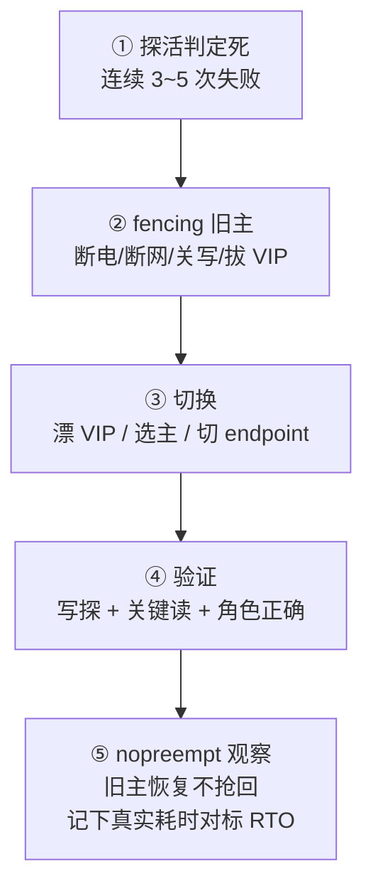
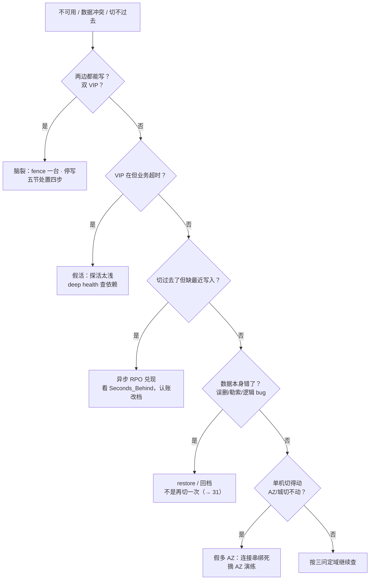

# 高可用与容灾

> 大家好，欢迎来到这次分享。开讲之前，先带大家回到一个很多值班同学都经历过的现场：
> 机房闪断 90 秒，恢复后发现两边都在写充值、两套玩家道具不知道哪套是真相；另一次 SLA 签了 99.99%，一年只挂一次、却修了 8 个小时——老板问「我们的高可用到底做到哪一档」。群里已经有人在喊「两边都拉起来先顶着」。
> 这一章讲完，你会知道当时那个人错在哪，以及为什么要先 fencing 再抬新主。
> **本章回答**：一次故障从发生到恢复的时间轴一生——怎么定档（几个 9）、怎么发现（探活）、怎么切换（fencing）、怎么修复（主备/双活）、怎么兜底（降级/演练）、怎么定责。
> **不讲**：Keepalived/VRRP 配置与 GARP → [20](../20-HAProxy与Keepalived/)；LVS 四层转发 → [18](../18-LVS与四层负载均衡/)；MySQL 复制与 MGR → [02-01](../../02-中间件与数据库/01-MySQL/)；etcd 多数派操作 → [03-02](../../03-Kubernetes/02-etcd/)；备份与 restore 剧本 → [31](../31-备份与恢复/)；合服校时门禁 → [32](../32-NTP与时间同步/)；SLO 与错误预算细账 → [09-06](../../09-可观测性与SRE方法论/06-SLI-SLO与错误预算/)。这些都有专门的章节，本章只在用到时点到为止。

**标记**：🎯重点 · 🔥难点 · ⭐常考 · 🔧实操

**怎么听这场分享**：咱们先看第一节的主图，把「一次故障的一生」装进脑子；第二到第七节顺着发生 → 定档 → 发现 → 切换 → 修复 → 兜底往下走；作战节专门讲定责，也就是开头那个双写现场的正确解法。每一节讲完都会提示对应练习题，学完就去练。

---

## 一、一张图：一次故障的一生

> 🎯 **一句话**：一次故障的一生是一条时间轴——发生、发现、决策、隔离、切换、验证、复盘，每段都有专属的坑。

咱们先不急着背几个 9。学高可用最怕的就是「有备机 = 高可用」。先看图，把时间轴装进脑子里：


**读图**：带着三个问题看这张图，比背 SLA 数字有用得多：

- **RTO 的时钟从「发现」开始走到「验证放量」，不是切换脚本跑的那几秒**——发现、到位、决策、fence、切、验全算进去。
- 「隔离」排在「切换」之前是本章最反直觉的一条：先让旧主死干净（fencing），再抬新主——顺序反了就是脑裂双写。
- 右侧的虚线是这一行章存在的另一半理由：每次故障的复盘（演练、降级预案、变更纪律）都在缩短下一次的时间轴。

---

---

好，主图有了。咱们正式出发——第一站：故障有哪四种死法？

---

## 二、发生：故障的四种形态与冗余的四个层面

> 🎯 **一句话**：故障有四种死法——单点、雪崩、脑裂、级联；冗余有四个层面——部件、机器、机房、地域，一层防一层。

### 故障形态学 ⭐

值班里见到的高可用事故，几乎都是这四种形态之一：

```text
单点故障    一个部件/一台机器死了，全链路跟着死          ← 没有「备」
雪崩        一台慢，拖垮连接池/线程池，好机器也被拖死    ← 没有「隔离与降级」
脑裂        网络分区后两边都升主、都在写                ← 没有「quorum + fencing」
级联故障    依赖链上游抖一下，下游超时重试放大成雪崩    ← 没有「重试上限与熔断」
```

- **单点**：登录服只有一台，它挂全服挂——这是「冗余」要解决的问题。
- **雪崩**：主库变慢，登录服每个请求都等到超时，线程池耗尽，本来健康的节点也接不了新请求——这是「限流、熔断、降级」要解决的问题（本章七节）。
- **脑裂**：防火墙误拦心跳，两边都以为对方死了、都升主——这是 quorum/fencing 要解决的问题（本章五节）。
- **级联**：DB 慢 → 缓存穿透 → DB 更慢 → 全线超时——依赖治理问题，机制见 [22](../22-监控与告警/)。

### 冗余的四个层面 ⭐

冗余不是「多买一台」，是在**不同故障域**各放一份：

```text
部件级    RAID 卡双活、双电源、ECC 内存          ← 防单个部件坏；机器不重启
机器级    主备 / 多副本 / 自动切换               ← 防一台机器死；本章主角
机房级    同城双 AZ，跨机房同步或异步复制         ← 防一个机房断电/着火
地域级    异地灾备 / 两地三中心                  ← 防城级事故（光缆挖断、地震）
```

**读图**：一层只防一层的事——双电源防不了机房断电，同城双 AZ 防不了光缆被挖。买冗余之前先问「我在防哪一层的死」，这就是三节定档要给的答案。

> 📝 **面试**：「故障我按形态分：单点靠冗余、雪崩靠隔离降级、脑裂靠 quorum+fencing、级联靠熔断；冗余分部件/机器/机房/地域四层，一层防一层，不是堆机器数。」

---

---

发生段到这儿。本节对应练习题 Q1、Q2。好，形态懂了——几个 9 和 RTO/RPO 怎么承诺？

---

## 三、定档：几个 9 与 RTO/RPO 的承诺

> 🎯 **一句话**：先把「能挂多久、能丢多少」换成数字，再选方案——不要一上来画全球双活。

### 可用性公式与 525600 这把尺子 ⭐🔥

**可用性（availability）≈ MTBF / (MTBF + MTTR)**——MTBF（Mean Time Between Failures，平均无故障间隔）越长、MTTR（Mean Time To Repair，平均修复时间）越短，可用性越高。口算尺子是**一年 525600 分钟**（365×24×60），停机预算 = 525600 × (1 − SLA)：

| SLA | 年停机预算 |
|-----|-----------|
| 99% | **87.6 小时** |
| 99.9% | **8.76 小时** |
| 99.95% | **4.38 小时** |
| 99.99% | **52.6 分钟** |
| 99.999% | **5.26 分钟** |

**读表**：差一个 9，停机预算差约一个**数量级**。99.99% 不是「基本不掉线」，是「全年只准停一次晚高峰的功夫」：

```text
承诺 99.99% → 年停机预算 52.6 min
实测单次 MTTR = 120 min → 全年只能容忍 ≈0.4 次这种级事故
一年只挂一次、修 8 小时 → 远超预算：挂得少救不了修得慢
```

对外 SLA 应**松于**内部 SLO，留出 error budget——细则与玩法见 [09-06](../../09-可观测性与SRE方法论/06-SLI-SLO与错误预算/)；游戏整体常谈 99.95%~99.99%，登录/支付按 99.99% 口径（[07-13](../../07-游戏运维专题/13-游戏SRE稳定性/)）。

### RTO 与 RPO：时间轴上的两段 ⭐🔥


**读图**：RPO（Recovery Point Objective，恢复点目标）段在故障**之前**——丢的是没同步/没备份的数据；RTO（Recovery Time Objective，恢复时间目标）段在故障**之后**——花的每分钟都在兑现承诺。数字定档：

```text
群里说的            翻译成数字            对应方案档位
「挂了半小时内要好」 → RTO ≤ 30 min       → 温备/自动切换够格，不必多活
「数据库不能丢」     → RPO ≈ 0            → 同步复制或等价
「我们要四个 9」     → 年停机 ≈ 52.6 min  → 先口算再谈方案
「切过去数据少了」   → 异步 RPO 兑现了     → 查复制落后，不是再切
```

**RTO 全链路**：发现 → 到位 → 决策 → fencing → 切换 → 验证，**全部计时**。PPT 写 RTO=5 分钟、演练 3 小时才拉起——3 小时才是真 RTO。缩短它的前提是知道时间花在哪，拆 MTTR 就拆这六段：

```text
发现   告警到人走多久？（告警分级与值班机制 → [22](../22-监控与告警/)）
到位   oncall 上机、拿到权限要几分钟？
决策   有预案照着做是 1 分钟，现场拉群吵是 30 分钟
切换   脚本秒级，人肉敲命令分钟级
验证   写探 + 关键读，几分钟
放量   灰度放流，几分钟
```

**读图**：演练和事故复盘都按这六段记录耗时，最长的那段就是下一次优化的对象——买机器治不了「决策 30 分钟」，预案和演练才能。

> ⚠️ **别混**：RTO 是**承诺**（对业务的口径），MTTR 是**成绩单**（历史实测平均）——演练缩短的是 MTTR，用它证明 RTO 没吹牛；两者不是一个词的两种读法。

### 一例钉死：凌晨 2:17 主库磁盘挂了 ⭐

```text
凌晨 2:17 主库磁盘故障。最近一次成功同步点 2:12。
2:25 VIP 切到备；2:28 登录写探通过放流。过去 90 天同类故障平均 14 分钟恢复。

RPO（承诺）    业务说「最多丢 5 分钟」
本次实际丢失    约 5 分钟（2:12 → 2:17），落在承诺内
RTO（承诺）    业务说「15 分钟内恢复」
本次实际恢复    11 分钟（2:17 → 2:28），达标
MTTR           历史平均 14 分钟 —— 成绩单，证明 RTO 没吹牛
```

**读图**：问老板「能丢多久」得到 RPO，决定同步还是异步；问「能挂多久」得到 RTO，决定自动切还是人拉起；看演练记录得到 MTTR，对标承诺是否诚实。RPO 的完整定义与备份侧的用法 → [31](../31-备份与恢复/)。

> 📝 **面试**：「我不会先画双活。先问 RTO/RPO：半小时内恢复、不能丢——同城同步主从+自动切；有状态默认主备；备份必须季度 restore。99.99% 一年约 52.6 分钟，不是 8 小时。」

---

---

定档段到这儿。本节对应练习题 Q3、Q4。好，档位定了——探活怎么避免假活？

---

## 四、发现：探活、假活与连续失败

> 🎯 **一句话**：探活要碰到关键依赖，连续 3~5 次失败才切——一次就切是抖，从不切换是破 RTO。

### 探活深度：从「进程在」到「真能干活」 🔧🔥

> 💡 **打个比方**：探活像查岗——问一句「在吗」谁都会答「在」；真查岗是让他当场干个活。`killall -0` 是问一句，`/health/deep` 查库才是干活。

```bash
killall -0 nginx; echo $?                              # ← 返回 0 只说明进程在，可能早已不 accept
curl -s -o /dev/null -w '%{http_code}\n' http://127.0.0.1/health
#    ↑ 静态 200：DB 挂了它也 200 —— 假活
curl -s -o /dev/null -w '%{http_code} %{time_total}\n' http://127.0.0.1/health/deep
#    ↑ deep 版真查库/真登录，返回 503 或超时才该计入失败 —— 这才是探活
```

**假活**：进程在、心跳在、静态 200 也在，但业务已经死了（库只读、磁盘满写不进、依赖全断）。Keepalived 默认只保证 VRRP 报文还在发——**心跳通 ≠ 业务活**；要 `track_script` 碰到应用层（配置 → [20](../20-HAProxy与Keepalived/)）。

### 切换阈值：连续 3~5 次 🔥⭐

```text
连续第 1 次失败 → 不切（偶发丢包、GC 尖刺不是死）
连续第 2 次失败 → 不切
连续第 3~5 次失败 → 判定死，进入切换
```

- 失败**一次就切** → 网络抖一下就切，活动期间反复闪断。
- **从不切** → 探活形同虚设，RTO 全靠玩家客诉来「发现」。
- 参数口径：间隔 **1~5s**，单次**超时 < 间隔**（否则超时叠加重试会误判）；探活本身别太重——每次全表扫会把 DB 打满，探活自己变成事故源。

> 🔍 **现场**：Keepalived 场景的这套口径长这样（VRRP 机制 → [20](../20-HAProxy与Keepalived/)）：

```ini
vrrp_script chk_deep {
    script "/usr/local/bin/deep_probe.sh"   # ← 真打到依赖：curl /health/deep + 超时控制
    interval 3                               # ← 每 3s 查一次（落在 1~5s 区间）
    timeout 2                                # ← 单次超时 2s < interval，不会叠着误判
    fall 3                                   # ← 连续 3 次失败才判死（抖动容错）
    rise 2                                   # ← 连续 2 次成功才判活（防「抖好了又抖坏」）
}
```

**读配置**：`fall 3 × interval 3s` = 最快 9 秒切换——比 `fall 1 × 1s` 慢，但网络抖一下不再把整个活动场闪断。`rise` 是常被漏掉的另一半：判死要有耐心，**判活也要有耐心**，否则抖动期间反复摘挂节点，比不切还伤。

> 📝 **面试**：「VIP 在但玩家全超时，第一怀疑探活太浅——`/health` 只 return 200 是假活，要打到登录依赖；切不切看连续失败 3~5 次，间隔 1~5 秒、超时小于间隔。」

---

---

发现段到这儿。本节对应练习题 Q5。🔥 开头两边都在写——大家想想：为什么要先隔离再切换？

---

## 五、切换：fencing、脑裂与 quorum

🔥 开头「两边都拉起来先顶着」——**这是脑裂双写的标准诱因**。大白话：**fencing = 先确认旧主死干净（隔离），再抬新主；quorum = 过半数说了算**。口诀：**「先杀旧主，再立新主」**（练习题 Q6、Q7）。⭐ 面试必考。

> 🎯 **一句话**：先让旧主死干净再抬新主——fencing 是切换的前置动作，不做就是脑裂双写。

### fencing：切换的铁律 ⭐🔥

**fencing（隔离）** = 切换前先确保旧主**不能再写**：断电（STONITH，Shoot The Other Node In The Head）、断网、关写、拔 VIP，任选其一，必须做实。

> 💡 **打个比方**：fencing 像交接班——正确顺序是**先收回旧钥匙，再发新钥匙**。先发新钥匙（漂 VIP）再慢慢收旧钥匙（杀旧主），中间那段时间两把钥匙都能开金库。

```text
正确顺序：探活判定死 → fencing（旧主不能写）→ 抬新主/漂 VIP → 验证
错误顺序：先漂 VIP → 旧主还在写 → 双写窗口 → 充值写两份 → 「选哪边当真相」
```

托管云的自动故障转移往往把 fencing 语义做进了控制面；自建 MHA/Keepalived **必须自己想清楚旧主怎么死干净**。

### 脑裂：分区后双写 🔥⭐

**脑裂（split-brain）**：网络分区后，两边都收不到对方的心跳，都认为自己是主、都在写；分区恢复后两套数据冲突，新的 RPO 变成「选哪边当真相」。

```text
AZ-A：收不到 B → 我升主，VIP 在我这，继续写充值
AZ-B：收不到 A → 我也升主，VIP 也在我这，也写充值
恢复后：两套玩家道具账——选哪边？丢哪边？已经没有好答案
```

### quorum：多数派与奇数节点 ⭐🔥

> 💡 **打个比方**：quorum 像举手表决——**过半数**通过才算数；两人对半永远僵着，所以节点数取奇数，别让「平票」有出现的机会。

| 节点数 N | quorum = N/2+1 | 可容忍故障 | 备注 |
|---------|---------------|-----------|------|
| 2 | 2 | **0** | 挂 1 台就没了多数，整集群不可用 |
| **3** | 2 | **1** | 生产最常见 |
| 4 | 3 | **1** | 和 3 台一样只扛 1，多买的那台白买 |
| **5** | 3 | **2** | 要扛 2 台故障再上 |

**读表**：4 台不比 3 台更能抗——容错能力仍是 1 台。生产取 **3 或 5**；**2 节点 quorum 类集群（etcd/Raft）不要上生产**。

> ⚠️ **别混**：**quorum**（etcd/Raft 多数派投票，没凑够 N/2+1 不许写）和 **VRRP**（Keepalived 的心跳协议，IP 协议 **112**，靠优先级+谁还活着发通告）**不是同一层东西**——Keepalived 两台**不算** quorum，心跳被防火墙拦了就会双 VIP。机制与配置 → [20](../20-HAProxy与Keepalived/)；etcd 多数派操作 → [03-02](../../03-Kubernetes/02-etcd/)。

防脑裂三板斧：**quorum**（不够多数不许写）、**fencing**（切换前先杀旧主）、**VIP 唯一**（二层里一个 VIP 只该有一台）。普通 MySQL 主从**不防脑裂**——主从复制没有投票；MGR/MHA+fencing 才有说法（→ [02-01](../../02-中间件与数据库/01-MySQL/)）。

### 脑裂已发生：现场处置 ⭐

> 🔍 **现场**：怀疑双写，两台都跑一遍，同一条命令看同一个 VIP：

```bash
ip -br addr show | grep -v 127.0.0.1     # ← 同一 VIP 出现在两台 = 双 VIP 实锤
#    再看两边 DB 角色：两边都 writable = 双主已发生
```

```text
① 立刻 fence 一台、停写 —— 停止血比恢复优先级高
② 冻结变更与放流，保留两边现场日志（这是选真相的证据）
③ 比对两边数据差异，选定真相源，必要时走 restore（→ 31）
④ 修分区根因（防火墙/隔离域），演练分区时是否还会双升主
```

**别做**：让玩家重连「试一下」、直接重启两边逻辑服赌运气、只加机器不加 quorum 规则。

> 📝 **面试**：「脑裂是分区后双写，防靠 quorum+fencing；3 台扛 1、4 台仍只扛 1、2 台不能上生产；Keepalived 两台不是多数派，心跳被拦会双 VIP——第一刀是 fence 停写，不是重启。」

---

---

切换段到这儿。本节对应练习题 Q6、Q7。好，fencing 懂了——主备/双活/容灾分级怎么选？

---

## 六、修复：主备、双活与容灾分级

> 🎯 **一句话**：有状态默认主备（同一时刻一份写），无状态才双活，抗城级靠两地三中心——异地那只脚是灾备，不是日常双写。

### 三种生产形态 ⭐

| | 主备 Active-Passive | 双活 Active-Active | 两地三中心 |
|--|--------------------|--------------------|-----------|
| 同一时刻几份写 | **一份** | 多份 | 同城写；异地为备 |
| 切换体感 | 秒~分钟有缝 | 几乎无切 | 同城秒~分；异地分~小时 |
| 脑裂难度 | 相对可控（仍要 fencing） | 难：同时写同一行就冲突 | 异地切回要处理落后 |
| 默认给谁 | **有状态**（DB） | **无状态**（登录 API） | 抗城级需求 |

**主备（Active-Passive，即 Active-Standby）**：主接写，备被动复制待命——注意「备」是待命，不是「另一台也在日常双写」。**双活**的前提是无状态：登录 API 挂 LB 后面多副本，LB 摘一台即可，RTO 可 小于 30 秒。**游戏房间服**内存里有状态——默认**状态外置（落库）+ 单写 + 拉起**，不跨城内存双活：双写同一房间的冲突比掉线更惨（玩家宁可重连，不要两份互相矛盾的账）。

> ⚠️ **别混**：**两地三中心 ≠ 异地双活**。异地第三中心平时是**灾备脚**，通常异步复制、不日常双写，RPO 不为 0；把「异地也在写」当卖点，成本和冲突处理都会失控。

### 容灾分级：RTO/RPO 的量级 ⭐

```text
同城双活      同 AZ 间同步/近同步      RPO≈0        RTO 秒~分钟   ← 抗机房/AZ
两地三中心    同城双中心 + 异地异步    RPO 分钟级   RTO 分~小时   ← 抗城级
异地冷备      只备份/快照，人工拉起    RPO 小时级   RTO 小时~天   ← 只保数据不保业务
```

**读图**：越往下越便宜也越慢——冷备只承诺「数据还在」，不承诺「业务还活」。选哪级由三节定的 RTO/RPO 决定，不是由 PPT 决定。切过去只是半个故事，**回切**是另半个：

```text
回切 ≠ 原路返回：灾备侧切换后已接新写入，它成了新的真相源
① 确认原机房根因修复，稳定观察一个周期
② 反向建复制：原主从灾备侧同步，追平 Seconds_Behind
③ 低峰锁写 → 切回 → 验证 → 放量（和首次切换同一套五步，见本节收束）
④ 回切窗口同样守变更红线：高峰不回切、不与其他变更叠加
```

### 同步与异步：RPO 的旋钮 🔥

```text
同步/半同步    RPO ≈ 0                     代价：延迟敏感，网络抖动可能拖慢主库
异步          RPO = 落后量                 代价：切主后缺最近写入——方案如此，不是切坏了

切主后玩家缺约 5 分钟充值，Seconds_Behind_Master: 312
→ 异步 RPO ≈ 5 分钟已兑现；若老板承诺「不能丢」，是方案档错了，不是再切一次能补回来的
```

### 假多 AZ：PPT 上的双机房 🔥

```text
jdbc:mysql://10.0.1.50:3306/game   ← 连接串绑死 AZ-A 内网 IP
AZ 挂了，LB/VIP 都切好了，但应用的连接串仍指向死 AZ
→ 「多 AZ」只存在于架构图上；要用托管 endpoint / 可切域名，并真的演练过摘 AZ
```

### 同城 MySQL HA 三条路 ⭐

| 路子 | RTO | RPO | 备注 |
|------|-----|-----|------|
| 托管多 AZ | 常 **小于 30 秒** | 0 | fencing 语义在云控制面；看云文档并演练（→ [06-03](../../06-云平台/03-云上存储与数据库/)） |
| MHA + VIP | **1~2min** | 0~秒（看半同步） | 自建要自己想清楚 fencing |
| MGR | **小于 30 秒** | 0 | 带多数派，防脑裂（→ [02-01](../../02-中间件与数据库/01-MySQL/)） |

游戏各组件的定档参考（与 [07-13](../../07-游戏运维专题/13-游戏SRE稳定性/) 对齐）：

| 组件 | RTO | RPO | 路子 |
|------|-----|-----|------|
| 登录 | **小于 30 秒** | — | 无状态多副本 + LB |
| 玩家 MySQL | **小于 5 分钟** | **0** | 同步主从 + 自动切 |
| Redis Session | **小于 30 秒** | 可丢一点 | 主从 / Sentinel |
| 逻辑服 | **小于 2 分钟** | **0**（状态在库） | 落库 + 拉起，不内存双活 |

### 收束：一次标准切换的五步 🎯⭐



**读图**：②在③之前是防脑裂的命门；④没通过之前不要对外报「切好了」；⑤的 `nopreempt`（不抢占）防的是旧主一恢复就把 VIP 抢回去造成**二次闪断**——备机稳住就让备机继续干。**高峰不切主**（变更红线见七节）。

> 📝 **面试**：「有状态默认主备或状态外置，不假装无状态双活；同步换 RPO≈0，异步就接受落后；切主前先 fencing，切完验证放流，nopreempt 防抢回——VIP 漂移会断存量连接，不要说完全无感（→ [20](../20-HAProxy与Keepalived/)）。」

---

---

修复段到这儿。本节对应练习题 Q8、Q9。好，架构选了——降级和演练怎么兜底？

---

## 七、兜底：降级、备份与变更纪律

> 🎯 **一句话**：切换救进程、restore 救数据；救不了就降级——有损服务优于无服务。

### 切主 vs restore：先分清是哪一类 ⭐🔥

```text
故障分两类的分界：数据本身还「好」吗？
  进程/机器死了，数据还在     → 切换 / 拉起（本章）
  误删 / 勒索 / 逻辑错误已复制 → restore / 回档（→ 31）
```

> ⚠️ **别混**：**切主救得了「载体坏了」，救不了「数据坏了」**——不带 WHERE 的 `DELETE` 早就主从一起复制过去了，再切一次主只是切到另一份坏数据上；勒索加密时同盘快照也一起没了，只能靠异地的备份。

### 降级：有损服务优于无服务 ⭐

> 💡 **打个比方**：降级像超市停电——先开应急灯、只收现金，而不是拉闸关门。灯暗一点、支付方式少一点，但顾客还能结账。

```text
排队      登录限流排队，放慢不放死            ← 挡住雪崩的入口
只读      写入口关闭、读还通                  ← 主库坏但数据可查，公告致歉
缩功能    关聊天/关排行/关活动，保登录战斗     ← 按依赖重要性裁剪
```

降级开关要**平时演练过**——真出事才第一次点开的降级按钮，多半点了没反应。预案清单放 runbook，不放在脑子里，每条都要能一句话答出「谁、什么条件、按哪个开关」：

```text
□ 登录限流 50%     开关：网关配置    触发：登录 QPS 超基线 2 倍
□ 关聊天/排行榜    开关：功能 flag   触发：DB 慢查询堆积
□ 全站只读公告     开关：入口页      触发：主库不可写且切换未完成
□ 每条注明：谁有权按 · 按下后玩家看到什么 · 怎么解除
```

### 升级与回滚 ⭐

- 有 quorum 的组件（etcd 等）**滚动升级**：先升备 → 切 → 升旧主，全程保多数派（→ [03-02](../../03-Kubernetes/02-etcd/)）。
- **数据目录升过级，可能不能靠换回旧二进制回滚**——回滚靠**升级前快照** restore。
- 切错了且新主已写入：回滚是一次**新的数据决策**（选哪份数据当真相），不是「撤销」；VIP 抢回只会二次闪断。
- 一句话：**没有升级前快照 = 没有回滚**。

### 演练与混沌工程 🔧⭐

```text
摘 AZ / 同城切换验收清单：
  □ 复制确实跨 AZ（不是两台同 AZ 装样子）
  □ VIP / 托管 endpoint / DNS 能切到活侧
  □ 应用连接串未绑死死掉的内网 IP（假多 AZ 的命门）
  □ 防火墙/安全组放行跨 AZ 路径
  □ 旧侧 fencing 有效（不会双写）
  □ 记下真实 RTO（发现 → 验证放量全程计时）

切异地加验：
  □ 接受异步 RPO（数字写进 runbook，别口头）
  □ DNS TTL / 全局入口真的切过一次
  □ 回切剧本单独写（不是「原路返回」一句话）
  □ 密钥与备份在异地可取
```

**本机 kill 过 mysqld ≠ 多 AZ 验收通过**——摘过 AZ、restore 过，PPT 上的 RTO 才算数。混沌工程（主动注入故障验证韧性）**先预发**把切换和告警跑通，再生产小剂量——它是验证 RTO 的手段，不是表演勇气。

### 变更窗口红线 🔥

```text
翻车剧本（真实常见）：
  02:00 合服
  02:30 「顺便」升内核 / 切 VIP 演练
  03:10 排行乱 + VIP 抖，群里同时喊：脑裂？合服脚本？时钟？
  → 变更叠加让定责树失效，谁都说不清哪刀出的血

红线：高峰不切主；合服窗口只做合服，不叠强更/内核/HA 演练；
      扩容只读副本可谨慎做，仍避开登录尖峰；改文档/告警阈值不碰数据面随便做
```

**读图**：变更窗口本身也是可用性——高峰切主、合服叠强更，花的都是 error budget。活动日历与高峰细则 → [07-03](../../07-游戏运维专题/03-活动高峰与压测/)。

> 📝 **面试**：「数据问题先分类：载体坏走切换，数据坏走 restore；都救不了就降级——排队、只读、缩功能，有损优于无服务；降级开关和平时要演练，高峰不切主、合服不叠强更。」

---

---

兜底段到这儿。本节对应练习题 Q10、Q11。现在再看开头双写和修了 8 小时——60 秒怎么定责？

---

## 八、作战：故障定责

> 🎯 **一句话**：第一问永远是「现在还在丢/坏数据吗」——还在丢先止血，丢完了才谈恢复和定责。

### 定责决策树 🎯



**读图**：树的第一层先分「双写」（最危险、正在制造新损失），第二层分「假活」（表面恢复实际没好），第三层分「RPO 兑现」（方案如此不是事故），第四层才轮到 restore 和假多 AZ——**危险度从上往下递减**，先排上面的。

### 现象 · 先做 · 别做 ⭐

| 现象 | 先做 | 别做 |
|------|------|------|
| 双 VIP / 两边写充值 | 立刻 fence 一台、停写 | 让玩家重连「试一下」 |
| 进程在但业务超时 | `/health/deep` 打到依赖 | 只 `killall -0` 就判定活 |
| 切主后缺最近 5 分钟写入 | 看 `Seconds_Behind`，认 RPO | 怪切换脚本再切一次 |
| DELETE 已复制到从库 | 隔离环境 restore | 再切一次主 |
| 合服排行乱 | `chronyc tracking` 校时门禁（→ [32](../32-NTP与时间同步/)） | 当脑裂去抢 VIP |
| 备份绿灯却勒索加密 | 取异地备份 + 演练记录 | 相信同盘快照 |
| 一年挂一次修 8 小时 | 拆 MTTR：发现到验证各段耗时 | 用「挂得少」对冲 SLA |
| 高峰切主失败 | 变更窗口本身进复盘 | 再切一次赌运气 |

### 60 秒剧本 🔧

> 🔍 **现场**：接到「全服不可用」，60 秒走完这条线再下结论。

```text
① 0–10s   还在丢数据吗？双 VIP / 两边可写 → 立刻 fence 停写（永远第一）
② 10–30s  三问定域：进程还在不在？还能不能写入？已有流量还通不通？
③ 30–45s  ip -br addr 看 VIP 在哪；curl /health/deep 区分真死假活
④ 45–60s  查 Seconds_Behind 算当前 RPO；定路线：切 / restore / 降级，报时间预估
```

**三问定域**：进程还在不在（探活层）？还能不能写入（存储层）？已有流量还通不通（入口层）？三问把「不可用」切成三个可排查的层——入口问题去 [18](../18-LVS与四层负载均衡/)，控制面去 [03-02](../../03-Kubernetes/02-etcd/)，复制与库去 [02-01](../../02-中间件与数据库/01-MySQL/)。

> 📝 **面试**：「故障定责我先问还在丢数据吗：双写先 fence；VIP 在业务死查探活深度；切后缺数据看复制延迟认 RPO；误删走 restore；合服乱先校时——五条路在决策树上，第一刀永远是止血。」

---

---

作战段到这儿。本节对应练习题 Q12～Q14。现在再看开头那位「两边都拉起来」的同事——你已经知道该先 fencing 了。

---

## 九、收口

### 命令速查 🔧

```bash
# 脑裂取证：同一 VIP 出现在两台 = 双 VIP 实锤
ip -br addr show | grep -v 127.0.0.1            # ← 两台都跑一遍对比
# 探活深度：静态 200 是假活，deep 才算数
curl -s -o /dev/null -w '%{http_code} %{time_total}\n' http://127.0.0.1/health/deep
# 异步 RPO 证据：切主后缺数据先看它
mysql -e 'SHOW SLAVE STATUS\G' | grep Seconds_Behind_Master
# 合服门禁：排行乱先校时，不是抢 VIP
chronyc tracking | grep 'System time'
# 进程在不在（只能证明进程在，不证明业务活）
killall -0 nginx && echo alive
```

### 面试锚点

遮住右列自问自答，卡壳的行回去重读对应小节——这张表就是本章的「30 秒口径速查」。

| 问 | 30 秒答 |
|----|---------|
| RTO/RPO？ | RTO=恢复上限，RPO=最多丢多少；先要这两个数字再选方案，不先画双活。 |
| RTO vs MTTR？ | RTO 是承诺，MTTR 是历史实测成绩单；发现到验证放流全算进 RTO。 |
| 99.99% 年停机？ | ≈52.6 分钟（525600×0.0001）；8.76 小时是 99.9%——差一个 9 差一个数量级。 |
| 有状态怎么 HA？ | 默认主备或状态外置落库；不内存双活——双写冲突比掉线贵。 |
| 脑裂怎么防？ | quorum+fencing；3 台扛 1、4 台仍只扛 1、2 台不能上生产。 |
| Keepalived 两台算集群吗？ | 不算 quorum；VRRP（IP 协议 112）靠优先级+心跳，被拦就双 VIP。 |
| 探活怎么设计？ | 连续 3~5 次失败才切，间隔 1~5s、超时小于间隔；/health 要打到依赖。 |
| 切主能救误 DELETE 吗？ | 不能，早复制到从库了；走 restore/回档（→ 31）。 |
| 两地三中心？ | 同城双中心抗 AZ，异地脚是灾备、常异步不日常双写，≠ 异地双活。 |
| 切后缺 5 分钟数据？ | 异步 RPO 兑现，看 Seconds_Behind；承诺不能丢就改同步，不是再切。 |
| 降级怎么做？ | 排队/只读/缩功能——有损服务优于无服务；开关要平时演练过。 |
| 合服就是容灾切换吗？ | 不是；运营合并 vs 城级切流；排行乱先校时（>1s 停），回滚靠快照不靠抢 VIP。 |

### 易错一句话对照

- 先画全球双活再问能丢多久 → 先 RTO/RPO 两个数字，再选档位
- RTO 就是恢复耗时 → RTO 是承诺；从发现到验证放流全计时，MTTR 才是实测
- 99.99% ≈ 一年停 8 小时 → 52.6 分钟；8.76 小时是 99.9%
- 4 台比 3 台更能扛 2 台故障 → 4 台容错仍是 1，要扛 2 上 5 台
- 2 节点 etcd 省钱又高可用 → 挂 1 台就没多数，整集群不可用
- Keepalived 两台 = 有 quorum → 优先级+心跳不是投票；可能双 VIP
- 失败一次就切更灵敏 → 连续 3~5 次；一次就切是抖动放大器
- `/health` 返回 200 就算活 → 静态 200 是假活，要打到库/登录依赖
- 先漂 VIP 再杀旧主 → 顺序反了是双写窗口；fencing 永在切换前
- 主备的备也在日常双写 → 备是复制待命；双写是双活的事，且有状态不做
- 两地三中心 = 异地双活 → 异地脚是灾备，常异步，RPO 不为 0
- 切主能救误删/勒索 → 数据坏了切换救不了，走 restore
- 切后缺数据 = 切坏了再切一次 → 异步 RPO 兑现；再切只会丢更多
- 房间服内存双活防掉线 → 双写冲突比掉线更惨；状态落库+拉起
- 合服排行乱当脑裂抢 VIP → 先跑校时门禁（→ 32）
- 高峰切主缩短窗口 → 变更窗口本身在花 error budget
- VIP 漂移完全无感 → 存量 TCP 常断，客户端要重连
- 备份绿灯 = 有 RPO 保障 → 必须 restore 演练过（→ 31）
- 本机 kill 过 mysqld = 多 AZ 验收 → 摘过 AZ、演练过切流才算

### 数字墙

> **525600** 分钟/年 · 99% **87.6h** · 99.9% **8.76h** · 99.95% **4.38h** · 99.99% **52.6min** · 99.999% **5.26min** · 可用性 = MTBF/(MTBF+MTTR) · 探活连续失败 **3~5** 次、间隔 **1~5s**、超时 < 间隔 · quorum = N/2+1：**3 扛 1 · 4 仍扛 1 · 5 扛 2 · 2 不能上生产** · VRRP = IP 协议 **112** · 切换五步：探活判定 → **fencing** → 切 → 验证 → nopreempt · 登录 RTO **小于 30 秒** · 玩家 MySQL **小于 5 分钟 / RPO 0** · Redis Session **小于 30 秒** 可丢一点 · 逻辑服 **小于 2 分钟** 状态在库 · 托管多 AZ 常 **小于 30 秒** · MHA **1~2min** · MGR **小于 30 秒** · 异步 RPO 看 **Seconds_Behind_Master** · 合服校时 **>1s 停** · 演练 **季度**至少一次 · 没有升级前快照 = 没有回滚

---

## 合上书

对齐练习题「合上书」，逐条口述，卡住就回对应节 / 题号。现在再看开头那个现场——闪断双写、有人喊两边拉起来——你该知道先隔离哪一边了。

- [ ] **默画一节主图**：发生 → 发现 → 决策 → 隔离 → 切换 → 验证 → 复盘；RTO 时钟从哪走到哪、哪两步顺序最不能反。
- [ ] **口述发生**：故障四种形态各是什么、各靠什么治；冗余四个层面一层防哪层的死。
- [ ] **口述定档**：可用性公式；99.99% 一年允许多少停机；RTO 全链路都算什么；2:17 那一例里 RPO/RTO/MTTR 各是哪个数。
- [ ] **口述发现**：探活三级深度各能证明什么；假活长什么样；为什么连续 3~5 次才切。
- [ ] **默画五节切换**：fencing 为什么在切换前；脑裂的定义与现场处置四步；3/4/5 台各扛几台；Keepalived 两台和 quorum 差在哪。
- [ ] **口述修复**：主备/双活/两地三中心各给谁；同步异步怎么定 RPO；假多 AZ 长什么样；切换五步收束图。
- [ ] **口述兜底**：切主 vs restore 的分界；降级三招；为什么没有升级前快照就没有回滚；摘 AZ 验收清单第一条。
- [ ] **定责**：决策树第一问是什么；60 秒剧本四步各敲什么；三问定域怎么把「不可用」切成三层。

数据兜底的全套工具在 [31 备份与恢复](../31-备份与恢复/)；VIP 怎么漂在 [20](../20-HAProxy与Keepalived/)；SLO 与错误预算在 [09-06](../../09-可观测性与SRE方法论/06-SLI-SLO与错误预算/)——可用性是把它们焊成今晚能走的步骤。
