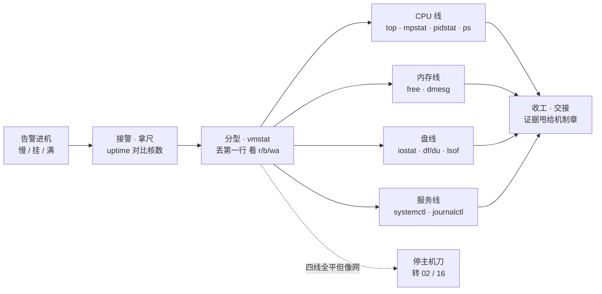
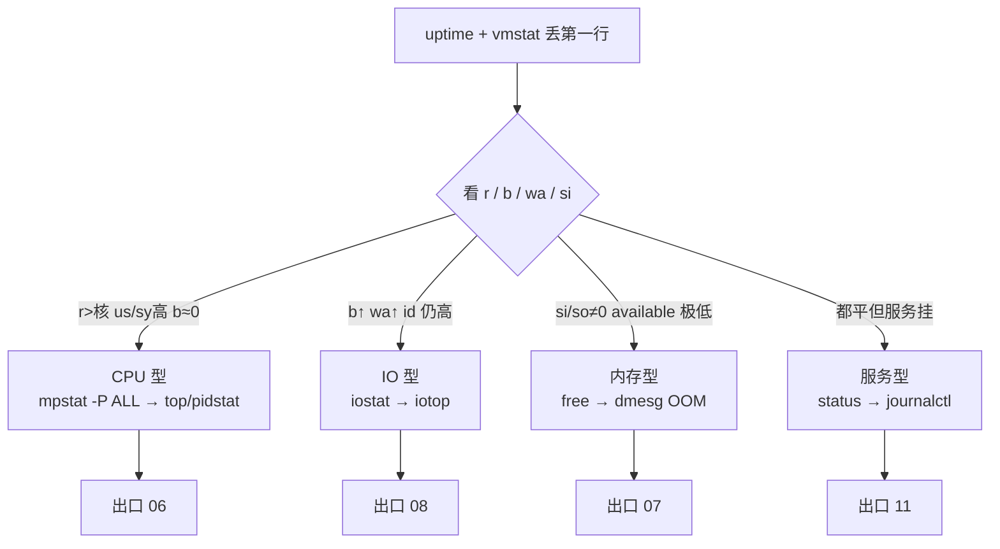
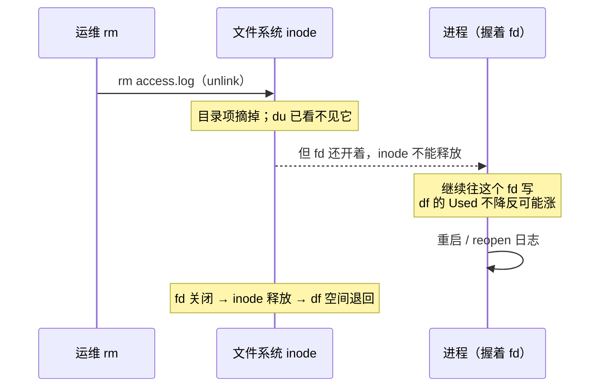
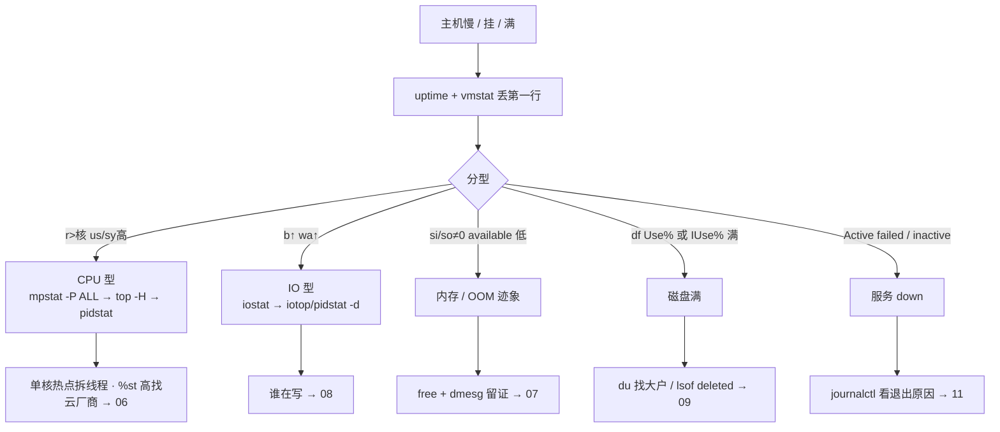

# 主机排查命令

> 告警群喊「登录服慢」，有人已经在 `top` 里按 P/M 来回切，有人直接 `strace -fp` 挂上——机器更卡了。刀序错了，机制懂得再多也白忙。
> **本章回答**：登上一台被告警的主机，第一分钟敲什么、每屏看哪几列、下一刀砍向 CPU / 内存 / 盘 / 服务哪一线、什么时候带着证据交接。
> **不讲**：Load / 软中断 / steal 机制 → [06](../06-CPU与Load/)；OOM 计分 / 换页深排 → [07](../07-内存与OOM/)；await 公式 / 脏页 → [08](../08-磁盘与IO/)；unit 写法 / 重启策略 → [11](../11-Systemd与服务管理/)；网络刀法 → [35](../35-网络排查命令/) · [16](../16-网络排障与抓包/)。

**标记**：🎯重点 · 🔥难点 · ⭐常考 · 🔧实操

---

## 一、一张图：一次主机排查的一生

> 🎯 **一句话**：一次排查有固定的一生——接警拿尺 → 一屏分型 → 按型追凶 → 带证据收工；四条追凶线互不串味。



- 📖 **读图**
  - 🛤️ 主线：**接警拿尺 → 分型 → 四线追凶 → 收工交接**；每节讲一段
  - 🧭 `vmstat` 是分水岭——把「机器慢」切成 CPU / 内存 / 盘 / 服务四型；用错刀（IO 型去加核）就是事故扩大器 ⭐（Q1、Q13）
  - 📦 「收工」= **定域 + 证据**，不是修好；四线全平但像网络 → 停主机刀转 [35](../35-网络排查命令/)

---

## 二、接警：uptime / lscpu 先拿尺子

> 🎯 **一句话**：Load 高不高必须拿核数当尺子；1m/5m/15m 三个数自带趋势。

🔥 **Load（load average，平均负载）** = 「可运行的 + 不可中断睡眠的」任务队列长度的指数平均——数的是**排队**，不是 CPU 用了多少（深义 → [06](../06-CPU与Load/)）。「Load 21 算不算高」没有核数就无解：8 核的 21 和 64 核的 21 完全两码事。

> 💡 **打个比方**：Load 是医院叫号大厅「排队人数」，CPU% 是「诊室里医生这一秒在干啥」。大厅排 40 人、诊室却闲着七成——病人卡在拍片子（等 IO），不是病难看。

> 🔍 **现场**：任何主机告警的第一刀。

```bash
uptime
# 21:03:12 up 42 days,  3:15,  2 users,  load average: 35.21, 12.08, 4.02
# ← 三个数是 1m / 5m / 15m
```

```text
load average: 35.21, 12.08, 4.02
  1m ≫ 15m           ← 刚砸上来（事故刚开始，看 1m）
  三个数都高且接近    ← 持续过载（长期病，看趋势线）
  15m ≫ 1m           ← 刚发生过、现在缓了（去看监控回放）
up 42 days           ← 久未重启：内核冤案 / 内存泄漏类要想到，但不等于有病
```

```bash
lscpu | egrep '^CPU\(s\)|Thread|Core|Socket'
# CPU(s):              8        ← 对比 Load 用这个：逻辑核数
# Thread(s) per core:  2        ← 超线程：逻辑 8 核时 Load=8 已是「打满感」参考线
nproc                          # 同一个数；cat /proc/loadavg 同 uptime 还多俩字段
```

```text
# /proc/loadavg
35.21 12.08 4.02 8/1432 28901
# ← 前三个数同 uptime；8/1432 = 正在跑的可运行实体数 / 线程总数；28901 = 最近创建的 PID
```

#### ❓ 为什么 Load 高还不能直接加核？

- ❌ **把 Load 当 CPU%**：会得出「加核」的错处方
- ✅ **8 核 idle 70% + Load 40 完全可能**——大量进程在等盘（D 状态照样计入 Load）
- 🧭 Load ≈ 核数只是「可能打满」；还要分排队算（R）还是排队等盘（D）——下一节 `vmstat` 干这个

> ⚠️ **别混**：Load **不是** CPU 利用率。另一头（容器）：`nproc` 常返回**宿主机核数**，不是你的配额；CPU 配额看 cgroup → [10](../10-cgroup与容器/)。

> 📝 **面试**：先「Load 对比核数」答高不高，再「1m/5m/15m」答急不急；追问「Load 是什么」→「R + D 队列长度的平均，不是 CPU%」。⭐（Q2）

---

## 三、分型：vmstat 一屏定四型

> 🎯 **一句话**：丢掉第一行，看 `r`/`b` 与 `us/wa/si`，三秒判「忙在哪型」——vmstat 是分型仪，不是根因仪。

### 🗑️ 为什么第一行必须丢 🔥⭐

#### ❓ 为什么第一行不能结案？

- ❌ 第一行 = **开机以来的平均值**，跟「现在这一秒」无关
- ✅ 后面每行才是刚踩的每一脚油门
- 🔁 同一铁律适用于 `iostat`（六节）：**「vmstat / iostat，第一行整组丢」**

> 💡 **打个比方**：第一行是全程平均车速，后面每行才是你刚踩的油门。拿平均车速判断「现在是不是在爬坡」，必然误判。

> 🔍 **现场**：机器慢的开场，几乎必敲。

```bash
vmstat 1 5     # 间隔 1s 采 5 组；-w 宽列更好读
```

```text
procs -----------memory---------- ---swap-- -----io---- -system-- ------cpu-----
 r  b   swpd   free   buff  cache   si   so    bi    bo   in   cs us sy id wa st
 1  0      0 8123456 123456 9876543   0    0   120   800 4500  9000  5  2 93  0  0
 2 18      0 8123000 123456 9876540   0    0   115  8900 4480 11800  5  2 70 18  0
 2 19      0 8122900 123450 9876500   0    0   110  9100 4490 12000  4  2 71 18  0
 ↑
 第一行 = 开机平均，整行丢掉
```

- 📊 **值班最小列集**
  - **`r`（run queue）**：可运行队列——持续 **> 核数** → CPU 排队 → mpstat
  - **`b`（blocked）**：不可中断阻塞（多半等盘）——持续明显 > 0 → IO 型 → iostat
  - **`si/so`**：换入换出 KB/s——**非 0** → 先当内存压力 → [07](../07-内存与OOM/)
  - **`us/sy`**：用户态 / 内核态；高且 `b≈0` → CPU 型
  - **`id`**：空闲——**高不能单独证明没事**（可能在等 IO）
  - **`wa`（iowait）**：等 IO 的 CPU 时间占比——高 → 盘链
  - **`st`（steal）**：被宿主机抢走（虚机）——持续 > ~10% → 超卖 → [06](../06-CPU与Load/)
  - **`cs`**：上下文切换/s——持续 > ~10 万且延迟涨 → 查线程数 / 锁
  - **`in`**：中断/s——突增且 mpstat `%soft` 高 → 网卡 / 中断 → [06](../06-CPU与Load/)
  - **`bi/bo`**：块设备读 / 写 KB/s——`bo` 巨大 → 写方向（细看 iostat）
  - `free` 列只粗看；结案用 `free -h` 的 **available**（五节）

### 🧭 三秒分型口诀 ⭐

```text
r↑  us/sy↑  b≈0  wa≈0        → CPU 型  → mpstat / top
b↑  wa↑    id 仍可观           → IO 型   → iostat / iotop
si/so ≠ 0  或 available 极低   → 内存型  → free / dmesg OOM
三者都平，但服务挂了             → 服务型  → systemctl / journalctl
```

### 🎬 完整走读：活动开始机器「慢」

- 场景：8 核登录服，活动 T+3 分钟，群里喊「Load 35，加核？」；P99 40ms → 600ms

```text
① uptime    → 35.21, 12.08, 4.02；8 核 → Load 远大于核数，忙是真的
② vmstat    → 丢第一行后：b=18/19、wa=18、id=70、us=5 → IO 型排队
③ iostat    → 某盘 await=180、%util=98 → 盘忙（第六节）
④ iotop     → mysqld 在狂写 80MB/s；df -h 排除空间满
⑤ 收工      → 证据甩 [08](../08-磁盘与IO/) 深排；别开加核工单
```

- 🔀 若另一型：`r` > 核且 `us/sy` 高 → `mpstat -P ALL`；`si/so` 非 0 → `free -h` + dmesg OOM；都平但服务挂 → `systemctl status`

### 🔧 30 秒定域套餐 🔧

> 🔍 **现场**：背诵件，合上书要能默敲顺序。

```bash
# ① 尺度
uptime; lscpu | egrep '^CPU\(s\)'
# ② 分型（丢第一行）
vmstat 1 5
# ③ 按型三选一
mpstat -P ALL 1 2     # CPU 嫌疑
free -h               # 内存嫌疑
iostat -xz 1 2        # IO 嫌疑（丢第一组）
# ④ 服务还在否
systemctl is-active gameserver || systemctl status gameserver --no-pager -l | head -30
# ⑤ 空间（写入类故障必加）
df -hT
```

### 🧩 收束：一次排查凭什么 30 秒定域 🎯⭐



- 📖 **读图**
  - 入口：一把尺（uptime）+ 一块分型屏（vmstat）
  - 四型各配一刀、各通一章：CPU→[06](../06-CPU与Load/) · IO→[08](../08-磁盘与IO/) · 内存→[07](../07-内存与OOM/) · 服务→[11](../11-Systemd与服务管理/)
  - 背法：**签名 → 刀 → 出口**；签名认错后面全错

> ⚠️ **别混**：定域 ≠ 定根因。这张图**不保证**「为什么盘忙 / 为什么 OOM」——只保证别把 IO 型当 CPU 型治。处方互不通用：IO 型加核没用、CPU 型调 `somaxconn` 没用、内存型别先 `drop_caches`。另有独立出口：四线全平但像网络 → **停主机刀**，转 [35](../35-网络排查命令/) / [16](../16-网络排障与抓包/)。

> 📝 **面试**：背「**一尺一屏四刀四口**」——uptime / vmstat / mpstat·free·iostat·systemctl / 06·08·07·11；再补「先分型再挥刀，禁止一上来 top 乱翻或 strace 乱挂」。⭐（Q1、Q3、Q13）

---

## 四、追凶·CPU：top / mpstat / pidstat

> 🎯 **一句话**：mpstat 回答「哪颗核、哪一格」，top / pidstat 回答「哪个 PID / TID」——两刀都要，缺一不可。

### 📡 mpstat：整机平均会骗人 🔥⭐

#### ❓ 为什么整机才 38% 还可能是 CPU 瓶颈？

- ❌ 「整机还有余量」← `all` 行被闲核稀释
- ✅ **一颗核打满**就能把依赖单线程主循环的业务 P99 打爆
- 🔑 口诀：**「整机平均会骗人，单核打满就够炸」** ⭐

> 🔍 **现场**：CPU 型定域之后；或 top 显示整机不高但 P99 炸。

```bash
mpstat -P ALL 1 3     # 每颗核逐核看；需 sysstat 包；没有就 top 按 1 凑合
```

```text
21:06:01  CPU    %usr   %nice  %sys  %iowait  %irq  %soft  %steal  %idle
21:06:02  all    38.20   0.00   2.10    0.50  0.00   1.00    0.00   58.20
21:06:02    3    99.20   0.00   0.80    0.00  0.00   0.00    0.00    0.00
21:06:02    7     2.00   0.00   1.00    0.00  0.00  45.00    0.00   52.00
# ← all 38% 看着还有余量，CPU3 单核 99.2% 已打满；CPU7 %soft 45% 软中断偏核
```

- 🔍 **怎么读**
  - **`all` 行**：整机平均——没有 `-P ALL` 不准下「还有余量」（Q4）
  - **`%soft` 高**：软中断偏核 → RSS / 中断亲和 → [06](../06-CPU与Load/)；别先改 TCP 窗口
  - **`%steal` 持续 > ~10%**：虚机被抢 → 找云厂商 / 换机，不是先调 JVM
  - **`%sys` 高**：内核 / syscall 重 → strace 统计模式（七节）
  - **`%iowait` 高**：和 vmstat `wa` 同一故事 → 六节；口诀 **「%iowait 高 ≠ CPU 不够，是 CPU 在等盘」**

> ⚠️ **别混**：`%iowait` 高 ≠ CPU 不够——是 CPU 在**等盘**，加核常无效。mpstat 叫 `%iowait`，top 抬头叫 `wa`，一回事。

- 📜 同家族 **`sar`**（sysstat）：回看历史——`sar -u -P ALL` / `sar -r` / `sar -q`；vmstat/mpstat 只能看现在

### 👀 top / htop：锁定 PID 与 TID ⭐

> 🔍 **现场**：已偏向 CPU 型，要快速扫「谁」。

```bash
top              # 常用键：P 按CPU排序 · M 内存 · T 时间 · 1 展开每核 · c 完整命令行
top -H -p 2341   # 只看该进程的线程，找烫的 TID
```

```text
top - 21:05:01 up 42 days,  load average: 35.21, 12.08, 4.02
Tasks: 312 total,   2 running, 310 sleeping,   0 stopped,   0 zombie
%Cpu(s):  8.0 us,  2.0 sy,  0.0 ni, 70.0 id, 18.0 wa,  0.0 hi,  2.0 si,  0.0 st
MiB Mem :  15800.0 total,    400.0 free,   8200.0 used,   7200.0 buff/cache
MiB Swap:   2048.0 total,   2048.0 free,      0.0 used.   6100.0 avail Mem

  PID USER    PR  NI    VIRT    RES  %CPU %MEM   TIME+ COMMAND
 2341 game    20   0 4523000  1.2g   12.0  7.8  4:01.22 gameserver
 2890 mysql   20   0   9.8g   6.1g    3.0 39.5 120:01.01 mysqld
# ← 抬头 %Cpu(s) 是整机平均（和 mpstat 的 all 一回事）；进程 %CPU 多线程可 >100%
```

- 🔑 **要点**
  - 抬头 `%Cpu(s)` **是整机平均**——单核问题按 `1` 展开或用 mpstat
  - **`%CPU > 100%`** 正常：多线程跑满多颗核（相对单核的百分比）
  - `top -H -p` 锁定烫线程后，Java 用 `printf '%x\n' <TID>` 对齐 `jstack` 的 `nid=0x…`
  - **htop** 与 top 信息同级——定责口径不变，不是新刀

> ⚠️ **别混**：top 找「谁」，mpstat 找「哪颗核、哪一格」。只有 top 会错过单核热点；只有 mpstat 不知道该看谁的栈。另：`%MEM` 最高 ≠ OOM 元凶——看 available + dmesg `Killed process`（五节）。

### 📏 pidstat：把格子拆到进程 / 线程 ⭐

```bash
pidstat -u 1 3          # 每进程 CPU
pidstat -t -p 2341 1 3  # 拆到线程
pidstat -r 1 3          # 内存：minflt / majflt
pidstat -d 1 3          # 每进程磁盘 IO
pidstat -w 1 3          # 上下文切换
```

```text
21:07:01   UID    PID    %usr %system  %guest  %wait   %CPU  CPU  Command
21:07:02  1000   2341    78.00   4.00    0.00   0.00  82.00    3  gameserver
# ← CPU 列：最近跑在哪颗核——和 mpstat 的 CPU3=99% 互相印证
21:07:02    27   2890     2.00   1.00    0.00   0.00   3.00    1  mysqld
```

- 🔗 **证据链**：`pidstat -u` 说 78% 在 CPU3 + mpstat CPU3 打满 + `top -H` TID 烫 → **热点型，拆那个线程，不是整机再加 8 核**
- **`-w`**：`cswch/s` 自愿切换、`nvcswch/s` 非自愿——非自愿极高 + 延迟涨 → 查线程/锁 → [06](../06-CPU与Load/)
- **`-d`**：`kB_wr/s` 巨大 + iostat await 高 → 写放大嫌疑；配合 iotop
- **`-r`**：`majflt` 升高结合 free / si/so；偶发 majflt 可能只是冷启动
- `pidstat` 的 `%wait` 与 mpstat iowait **不是同一把尺**，交叉看别硬换算

### 🌳 ps / pstree：状态与归属 🔥

```bash
ps -eo pid,ppid,stat,wchan:20,cmd --sort=stat | head -50
pstree -ap 2341        # 从业务 PID 往下看树，别从 systemd 全量展开
```

```text
  PID  PPID STAT WCHAN                 CMD
 2341     1 Ssl  -                     /opt/game/gameserver
 2360  2341 D    wait_on_page_bit_co  /opt/game/gameserver
 2401  2341 Z    -                     [gameserver] <defunct>
# ← D：不可中断睡眠（卡在等页/盘）；Z：僵尸（defunct）；PPID=1：被 init 收养
```

- 🔤 **STAT**
  - `R` 可运行 · `S` 可中断睡眠（正常多）
  - **`D` 不可中断睡眠（uninterruptible sleep）**：几乎都在等盘；`kill -9` 杀不掉——信号要等返回可中断点；先解 IO（六节）→ [05](../05-进程与信号/)
  - **`Z` 僵尸（zombie / defunct）**：已死，父进程没 `wait`；修父或杀父让 init 收养
- `wchan`：卡在哪个内核等待点
- `PPID=1`：原父已死被 systemd 收养；`systemctl status` Main PID 应与 pstree 树根一致

> ⚠️ **别混**：D =「活着但卡死在等盘，杀不掉」；Z =「已经死了，尸体没人收」。口诀：**「D 治 IO，Z 治父」**。另：`ps aux` 的 `%MEM` 加总 ≠ 全机内存——共享库被重复计。

本节对应练习题 Q4、Q5、Q10。

---

## 五、追凶·内存：free 与 OOM 痕迹

> 🎯 **一句话**：结案看 available，free 列小多半是 cache 正常占着；进程「突然没了」先想 OOM，dmesg 留证。

### 💰 free：只盯 available ⭐

#### ❓ 为什么 free 只剩 400Mi 还不等于爆了？

- ❌ 盯 free 列 → 误判「内存爆了」
- ✅ 结案列是 **available**，不是 free
- 🔑 口诀：**「结案看 available，free 小多半是 cache」**

> 🔍 **现场**：内存告警、vmstat `si/so` 非 0、业务报分配失败。

```bash
free -h
```

```text
              total        used        free      shared  buff/cache   available
Mem:           15Gi       8.0Gi       400Mi       200Mi        7.0Gi        6.1Gi
Swap:         2.0Gi          0B       2.0Gi
# ← free 只剩 400Mi 但 available 还有 6.1Gi：不是内存爆了
```

> 💡 **打个比方**：free 是「口袋现金」，buff/cache 是「周转库存」——需要时能立刻变现；available =「现金 + 随时可变现的库存」。现代内核默认把闲内存做缓存，free **常年很小是正常的**。

- **`available`（`MemAvailable`）** = 内核估计「不杀进程大致还能给应用多少」——**值班结案列**
- **`buff/cache`（page cache）可回收**——cache 大 ≠ 被泄漏吞掉
- `used + free ≠ total`，中间隔着 buff/cache
- **`Swap used` 持续增长 / `si/so` 在跳** → 找 RSS 大户 → [07](../07-内存与OOM/)

> ⚠️ **别混**：`free` **命令的 free 列** ≠ **available**。配套「别做」：**别拿 `drop_caches` 当常规止血**——打冷热缓存 → IO 风暴 = 二次故障。（Q6）

### ☠️ OOM 迹象：发现 + 贴证 ⭐

- 进程「突然没了」、重启后「好了」——先证明是不是 OOM killer，**禁止只重启不留证**

```bash
dmesg -T | grep -iE 'out of memory|oom-killer|Killed process' | tail -20
journalctl -k -b | grep -iE 'out of memory|oom' | tail -20
```

```text
[Sun Aug 30 21:01:02 2026] Out of memory: Killed process 2341 (gameserver) total-vm:4523000kB ...
# ← Killed process + PID + 名字：OOM 实锤，贴证
```

- 看到 `Killed process` → 记 PID / 名字，甩 [07](../07-内存与OOM/)
- **容器**：容器里被杀、宿主机 `free` 却胖 → **cgroup 内存限额**在杀，不是整机不够 → [10](../10-cgroup与容器/) · [07](../07-内存与OOM/)
- 没 Swap 的机器 OOM 来得更陡；有 Swap 也不是免费午餐（换页本身是 IO）

> 📝 **面试**：内存线三句——「free -h 只看 available；突然没了先 dmesg 搜 Killed process 留证；容器先怀疑 cgroup 限额」。挡三个坑：drop_caches、只重启不留证、只看宿主机 free。（Q6、Q7）

---

## 六、追凶·磁盘：iostat / df / du / lsof

> 🎯 **一句话**：iostat 定「盘忙不忙、等多久」，iotop / pidstat -d 定「谁在刷」；空间问题 df 定「满没满」、du 找大户、对不上就 lsof 抓 deleted。

### 💾 iostat：设备忙不忙 🔧⭐

> 🔍 **现场**：vmstat `b/wa` 指向 IO；df 未满但业务慢；怀疑写放大。

```bash
iostat -xz 1 3     # -x 扩展列；-z 隐藏全 0 设备；丢第一组
iotop -oPa         # 只显示实际有 IO 的；累加；没权限就用 pidstat -d 或 cat /proc/{pid}/io
```

```text
Device    r/s    w/s   rkB/s   wkB/s  await  aqu-sz  %util
nvme0n1   10.0   20.0   128.0   256.0    1.2    0.05   3.00
nvme0n1   80.0  900.0   500.0  81920   180.0   12.50  98.50
# ← 第一组 = 开机平均，整组丢掉；第二组 await=180、%util=98.5、aqu-sz=12.5：盘忙实锤方向
```

- 📊 **关键列**
  - **第一组丢掉**——和 vmstat 同一铁律
  - **`await`**：请求平均等待（含排队 + 服务）；高就是「疼」→ [08](../08-磁盘与IO/)
  - **`%util`**：设备忙时间占比；≈100 = 饱和方向感（SSD 并行度高时未必到极限 → 08）
  - **`aqu-sz`**：平均队列深度
  - `wkB/s` 巨大 → 写方向 → iotop / `pidstat -d`
  - **`%util ≈ 100` ≠ 立刻加盘**——先问：单进程写爆？打错盘？网络盘/邻居吵？

### 📁 df / du：空间与 inode

> 🔍 **现场**：写入失败、日志停写、`No space left on device`。

```bash
df -hT
df -i
du -xh --max-depth=1 /var 2>/dev/null | sort -h
```

```text
Filesystem     Type  Size  Used Avail Use% Mounted on
/dev/nvme0n1p3 xfs   100G   98G  2.1G  98% /
tmpfs          tmpfs  7.8G     0  7.8G   0% /dev/shm
# ← Use% 98%+ 空间告急；Type 是 xfs/ext4/nfs——网络盘满和本地满处置不同
```

- 多个挂载点别只盯 `/`——看准 `Mounted on`；清错分区是雪上加霜
- **`df -i`**：海量小文件吃光 inode 时，`df -h` 还有空间却写不进 → [09](../09-文件系统与inode/)
- `du` 加 `-x` + `--max-depth=1` 分层下钻，别在 `/` 无深度狂扫

### 👻 deleted：df 满、du 对不上 🔥⭐

#### ❓ 为什么再 rm 一次吐不出空间？

- 🎭 **经典案**：`df` 100%，`du` 加起来只有 60G——空间被「已删除但仍被打开」的文件占着
- ❌ 对 deleted 路径再 rm → 目录项早就没了，占空间的是还开着的 fd
- ✅ 让握 fd 的进程放手（重启 / reopen）空间才退

> 💡 **打个比方**：`rm` 只是把门牌从门牌表上摘了，住客（fd）还握着钥匙住在里面——直到退房，房间才退费。



- 📖 **读图**
  - unlink 只删目录项；**inode 回收条件 = 没有任何 fd 指着它**
  - 从此 df（数块）和 du（沿目录树）各说各话；要退空间必须让进程放手

```bash
lsof +L1                 # link count=0 却仍被打开的文件
lsof | grep deleted
# nginx 1234 ... /var/log/nginx/access.log (deleted)
```

- 处置：① `lsof` 确认谁握着；② **重启对应服务**（或 `kill -USR1` nginx 类 reopen）；③ 长期上 logrotate；**别无脑 `kill -9`**
- 反过来：删大日志前先确认没人握着——正在狂写的日志被 rm = 主动制造 deleted 案

> ⚠️ **别混**：对 deleted 路径再 rm **不会吐空间**。练习题 Q8、Q9。

---

## 七、追凶·服务：systemctl / journalctl / strace

> 🎯 **一句话**：服务挂了先 status 看三件套，再 journalctl 看退出原因；strace 是放大镜，不是望远镜。

### 🔌 systemctl：还在不在 ⭐

> 🔍 **现场**：「服务挂了 / 起不来 / 反复重启」，排除「根本没在跑」。

```bash
systemctl is-active gameserver
systemctl status gameserver --no-pager -l
systemctl show gameserver -p ActiveState -p SubState -p MainPID -p NRestarts -p Result
systemctl list-units --failed
```

```text
● gameserver.service - Game Login Server
   Loaded: loaded (/etc/systemd/system/gameserver.service; enabled; ...)
   Active: failed (Result: exit-code) since Sun 2026-08-30 21:04:12 CST; 2min ago
  Process: 2341 ExecStart=/opt/game/gameserver (code=exited, status=2)
 Main PID: 2341 (code=exited, status=2)
# ← 三件套：Loaded（unit 在不在）· Active（active/failed/activating/inactive）· Main PID（主进程）
```

- 🚦 **Active 下一刀**
  - **active (running)**：主进程在——慢就转 CPU / IO / 网刀
  - **failed**：看 Result + 尾部日志 → journalctl
  - **activating 卡住**：查 Type= / 依赖 / 挂载 → [11](../11-Systemd与服务管理/)
  - **inactive (dead)**：没起——被停了 / 没 enable
- **NRestarts** 暴露狂重启；**start-limit-hit** → 先修崩溃再 `reset-failed` → [11](../11-Systemd与服务管理/)

> 📝 **面试**：status 三件套 → failed 就 journalctl -u；别无限 restart。追问：active 只说明主进程活着，不说明业务通。

> ⚠️ **别混**：**active ≠ 健康**——进程在但玩家进不去，主机刀扫一轮没异常 → 转 [35](../35-网络排查命令/) 或探活（[21](../21-性能方法论-USE与RED/) · [22](../22-监控与告警/)）。

### 📜 journalctl / dmesg：为什么挂 🔧

```bash
journalctl -u gameserver -b --no-pager           # 本次开机以来
journalctl -u gameserver --since "20 min ago"    # 先掐时间窗再 grep
journalctl -p err..alert -b --no-pager           # 只看错误级以上
dmesg -T | tail -50                              # 内核环形缓冲（ring buffer），-T 转人话时间
dmesg -T | grep -iE 'oom|killed process|i/o error|read-only|reset'
```

```text
Aug 30 21:04:12 login-1 gameserver[2341]: panic: runtime error: ...   ← 应用自己炸，别先怪内核
Aug 30 21:04:12 login-1 systemd[1]: gameserver.service: Main process exited, code=exited, status=2
Aug 30 21:04:12 login-1 systemd[1]: gameserver.service: Failed with result 'exit-code'.
```

- 应用 panic / 堆栈 → 修应用
- `Main process exited, status=N`：退出码非 0；`signal=` → 配合 dmesg 看 OOM
- dmesg 里 `I/O error` / `Read-only file system` → [08](../08-磁盘与IO/) · [09](../09-文件系统与inode/)
- `-T` 必加；日志巨多先 `--since` 掐窗；**别只翻应用日志文件**——stdout/stderr 默认进 journal

### 🔬 strace：放大镜不是望远镜 ⭐

#### ❓ 为什么不能一上来 `strace -fp`？

- 🔭 **望远镜**（uptime/vmstat 30 秒套餐）负责「往哪看」
- 🔬 **放大镜**（strace）负责「看清这一处」——顺序永远先望远镜后放大镜
- 🐢 strace 靠 **ptrace** 在每个 syscall 处停一下 → **天然拖慢目标**；一上来 `-fp` 大进程 = 机器当场更慢

> 🔍 **现场**：进程在、CPU 不高、看起来「卡住」；已缩到单个 PID。

```bash
timeout 20 strace -p 2341 -T -ttt 2>&1 | tail -100        # 短挂；-T 显示每次调用耗时
timeout 20 strace -p 2341 -e trace=network,file,desc -T    # 收窄到三类
timeout 15 strace -p 2341 -c                                # 统计模式：只看各 syscall 耗时占比
```

```text
21:08:01.123456 read(12, "...", 4096) = 4096 <0.000012>
21:08:01.123500 futex(0x7f.., FUTEX_WAIT, ...) = -1 ETIMEDOUT <2.000001>
# ← 卡点：大量 futex WAIT 且不前进 = 等锁
```

- 认四类：**等锁**（`futex … WAIT`）· **等 IO**（`read`/`fsync` 长）· **等网**（`recvfrom` 不回）· **找文件**（`ENOENT`/`EACCES`）
- 规则：**必带 timeout**；默认别 `-f`（输出爆炸）；`-c` 最安全；不当首刀、不长期挂

> ⚠️ **别混**：口诀 **「望远镜先，放大镜后；strace 必带 timeout」**。⭐（Q11、Q12）

---

## 八、作战：定责与交接

> 🎯 **一句话**：四条树——高 Load / OOM 迹象 / 盘满 / 服务 down——都是「先定域贴证，再甩机制章」，每条都有明确别做。

### 🗺️ 定责决策树



- 📖 **读图**
  - 入口永远是 30 秒套餐
  - 分支写**真实现象**（`r>核`、`b↑ wa↑`、`df 满`），不是抽象类别
  - 本章只把证据送到岔路口，根因甩机制章

### 现象 · 先做 · 别做

| 现象 | 先做 | 别做 |
|------|------|------|
| Load ≫ 核、r↑、us↑、单核 100% | `mpstat -P ALL` → `top -H` → 06 | 不看单核就加核 |
| Load ≫ 核、b↑、wa↑、idle 仍高 | `iostat` → `iotop` → 08 | **加核**（IO 型加核无效） |
| Load 高、%soft 单核满 | 想 RSS / 中断亲和 → 06 | 先改 TCP 窗口 |
| Load 高、%st 持续 >10% | 超卖找云厂商 / 换机 | 先调应用参数 |
| 进程突然没了 | `free -h` + `dmesg` 搜 OOM **留证** | 只重启不留证 |
| 容器里被杀、宿主机还闲 | 查 cgroup 内存限额 → 10 | 只看宿主机 free |
| df 满 | 分层 `du` 找大户；清日志/临时 | 乱删 `/usr` 等系统目录 |
| df 满、du 对不上 | `lsof` deleted → 重启握 fd 的服务 | 再 rm 一次同名路径 |
| df -h 有空但写失败 | `df -i` 查 inode | 只扩容量 |
| failed / exit-code | `status` + `journalctl -u` | 无限 restart 不看日志 |
| start-limit-hit | 修崩溃原因，再 reset-failed → 11 | 只 reset 不治本 |
| active 但玩家进不去 | 主机刀扫一轮没异常 → 转网刀 02/16 | 看到 active 就结案 |

### ⏱️ 60 秒剧本 🔧

> 🔍 **现场**：接到「机器慢」报障，60 秒走完再下结论。

```text
① 0–10s   uptime：Load 对比核数，1m/5m/15m 看趋势——忙不忙、刚发生还是长期
② 10–25s  vmstat 1 5（丢第一行）：r/b/wa/si 定四型
③ 25–40s  按型补刀：mpstat -P ALL（单核？%soft？%st？）或 free -h 或 iostat -xz
④ 40–55s  systemctl is-active + df -hT：排除「根本没在跑」和「盘满了」
⑤ 55–60s  定型 + 定责：一句话结论 + 证据片段，甩对应机制章；像网就转 02/16
```

### 可贴工单的最小证据包

```text
[时间] 
uptime / lscpu CPU(s)
vmstat 1 5（注明已丢第一行）
（按型）mpstat -P ALL 1 3  或  free -h  或  iostat -xz 1 3
systemctl status <unit> 片段 或 df -hT
一句话定域：例「IO 型，nvme0n1 await~180、%util 98，进程 mysqld 狂写 80MB/s」
```

回到开头：有人 top 乱翻、有人准备 `strace -fp`——正确处理是 uptime → vmstat 分型 → 按型补刀 → systemctl/df 排除挂/满 → 贴证据。本节对应练习题 Q13、Q14。

---

## 九、收口

### 命令速查 🔧

```bash
# 开场
uptime; lscpu | egrep '^CPU\(s\)'        # 尺子 + Load 趋势
vmstat 1 5                                # 分型（丢第一行）
# CPU 线
mpstat -P ALL 1 3                         # 哪颗核哪一格（sysstat；历史回看用 sar -u）
top -H -p {PID}; pidstat -u/-w/-d/-r 1 3  # 哪个 PID/TID、切换、IO、缺页
ps -eo pid,ppid,stat,wchan:20,cmd; pstree -ap {PID}   # 状态 D/Z、卡点、树
# 内存线
free -h                                   # 只盯 available
dmesg -T | grep -iE 'out of memory|oom-killer|Killed process'   # OOM 留证
# 盘线
iostat -xz 1 3; iotop -oPa                # 丢第一组；谁在刷
df -hT; df -i                             # 空间 + inode
du -xh --max-depth=1 <目录> | sort -h; lsof +L1   # 大户 + deleted
# 服务线
systemctl status <unit> --no-pager -l; systemctl show <unit> -p NRestarts
journalctl -u <unit> --since "20 min ago"; dmesg -T | tail -50
# 放大镜（最后才用）
timeout 15 strace -p {PID} -c
```

### 面试锚点

遮住右列自问自答，卡壳的行回去重读对应小节：

| 问 | 30 秒答 |
|----|---------|
| 登主机第一分钟敲什么？ | uptime 对比核数 → vmstat 丢首行分型 → 按型 mpstat/free/iostat → systemctl/df；top/strace 不是首刀。 |
| Load 40、idle 70%，加核吗？ | Load 是队列不是 CPU%；先看 vmstat b/wa——IO 型加核无效，转 iostat。 |
| Load 和 CPU% 什么关系？ | Load 数「可运行+不可中断」队列长度，CPU% 数时间格子；两把尺，D 状态只进 Load。 |
| vmstat/iostat 第一行为什么丢？ | 开机以来的平均，不代表当前；从第二组起读。 |
| 整机 CPU 40% 为何还超时？ | 平均被闲核稀释，单核打满就够炸 P99；必须 mpstat -P ALL。 |
| %iowait 高说明什么？ | CPU 在等盘，不是 CPU 不够；加核常无效，转 iostat。 |
| free 和 available？ | 结案看 available；free 小多半是 page cache 正常占着，可回收。 |
| 能 drop_caches 止血吗？ | 别：打冷热缓存、引发 IO 风暴；真告急走 free + dmesg OOM 刀序。 |
| 进程突然没了怎么查？ | free -h + dmesg 搜 Killed process 留证；容器先怀疑 cgroup 限额。 |
| D 状态为什么 kill -9 无效？ | 不可中断睡眠，信号要等返回可中断点；先解 IO，治法在 IO 不在信号。 |
| 僵尸进程怎么治？ | 它已死，是父进程没 wait；修父进程或杀父让它被 init 收养。 |
| df 满但 du 对不上？ | deleted 文件仍被 fd 握着；lsof 找到进程，重启/reopen 才退空间。 |
| df -h 有空间却写失败？ | 查 df -i：inode 被小文件吃光同样写不进。 |
| %util 100% 要立刻加盘吗？ | 不：先看谁在写、是否网络盘/邻居吵；加盘是选项不是第一反应。 |
| systemctl active 等于健康吗？ | 不等于：只说明主进程在；玩家进不去要转网刀或应用探活。 |
| 服务 failed 下一步？ | journalctl -u 看退出原因；别无限 restart，小心 start-limit-hit。 |
| 什么时候上 strace？ | 已缩到单 PID、timeout 15–20s 短挂确认卡在哪类 syscall；不当首刀、别裸 -f。 |
| 主机四线都平但像网络？ | 停主机刀，转网络刀法 02 / 抓包 16，别在 top 里耗死。 |

### 易错一句话对照

- Load = CPU% → 两把尺：一个数队列、一个数时间格子
- 1m/5m/15m 一起看 → 事故看 1m，15m 只回答「是不是一直这样」
- 拿 vmstat/iostat 第一行结案 → 开机平均，丢掉
- id 高 = 没事 → IO 型可以 id 高、Load 高、业务惨
- 整机 CPU 40% = 还有余量 → 单核打满就能炸 P99，mpstat -P ALL
- %iowait 高加核 → CPU 在等盘，加核无效
- free 小 = 内存爆 → 看 available，cache 可回收
- drop_caches 当常规止血 → 制造 IO 风暴的二次故障
- %MEM 最高 = OOM 元凶 → OOM 看打分和 dmesg，不是 %MEM 排名
- 见 D 就 kill -9 → 杀不掉，先解 IO
- 见僵尸就杀僵尸 → 它已死，修的是父进程的 wait
- %util 100% 就加盘 → 先找谁在写、是否网络盘
- deleted 再 rm 一次会腾空间 → fd 还开着就不会
- 只看应用日志文件找挂因 → unit 的 stdout 在 journal，先 journalctl -u
- 服务挂只 restart → 先 journalctl，小心 start-limit-hit
- active 就结案 → 只说明主进程在，不说明业务通
- 一上来 strace -fp → 放大镜当望远镜，机器更慢
- 主机慢先 tcpdump → 先 30 秒定域，网刀归 02/16

### 数字墙

> Load 对比 **nproc**（1m/5m/15m 三个数）· vmstat / iostat **丢第一行/组** · cs 持续 **> ~10 万/s** 查切换 · **%steal > ~10%** 超卖嫌疑 · **%util ≈ 100** + await 高 = 盘饱和方向 · **df Use% 95%+** / **inode IUse% 100%** 空间告急 · top 进程 %CPU 可 **> 100%**（多线程，相对单核）· strace 短挂 **15～20s** 封顶 · Load = 核数只是「打满感」参考线（超线程算逻辑核）

---

## 合上书

- [ ] **默画主图**：告警 → 接警拿尺 → vmstat 分型 → 四条追凶线 → 收工交接；四线各带什么刀、各甩哪章；哪条情况下停主机刀转网络。（Q1、Q13、Q14）
- [ ] **口述接警**：Load 是什么、为什么要拿核数当尺、1m/5m/15m 怎么读趋势、为什么 Load ≠ CPU%。（Q2）
- [ ] **口述分型**：vmstat 丢第一行的理由、r/b/wa/si 各量什么、三秒分型口诀、8 核 Load 35 的走读案例怎么定成 IO 型。（Q1、Q3）
- [ ] **默画收束图**：四型 × 签名 × 下一刀 × 出口；说清「定域 ≠ 定根因」、为什么处方互不通用。（Q1、Q13）
- [ ] **口述 CPU 线**：整机平均为什么骗人、%soft/%steal/%iowait 高各指哪、top -H 怎么接 jstack、pidstat 四把尺（-u/-r/-d/-w）与 cswch/nvcswch、D 与 Z 状态怎么分怎么治。（Q4、Q5、Q10）
- [ ] **口述内存线**：available vs free 列、为什么别 drop_caches、OOM 刀序（free → dmesg 留证 → 07）、容器里为什么看 cgroup 不看宿主机 free。（Q6、Q7）
- [ ] **口述盘线**：iostat 丢第一组后看哪三列、%util≈100 的三个先问、df -i 是另一种满、deleted 的机制（unlink 后 inode 活到 fd 关闭）与处置三步。（Q8、Q9）
- [ ] **口述服务线**：status 三件套、Active 四种值各下一刀、journalctl 行读法（panic / status=N / start-limit-hit）、strace 为什么必带 timeout 且不当首刀。（Q11、Q12）
- [ ] **定责**：四条树各「先做 / 别做」；60 秒剧本五步；四线全平但像网络时在哪一步止损。（Q13、Q14）
- [ ] **口述证据包**：交接邻章要带哪几段命令输出、一句话定域怎么说。（Q13）

下一章：网络排查刀法 → [35 网络排查命令](../35-网络排查命令/)。机制深排：[06](../06-CPU与Load/) · [07](../07-内存与OOM/) · [08](../08-磁盘与IO/) · [09](../09-文件系统与inode/) · [11](../11-Systemd与服务管理/) · [21](../21-性能方法论-USE与RED/)。
