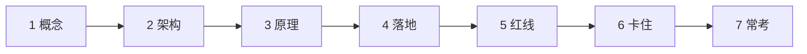
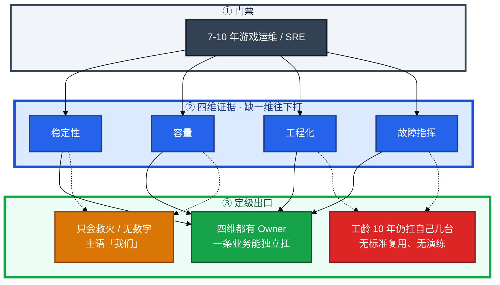
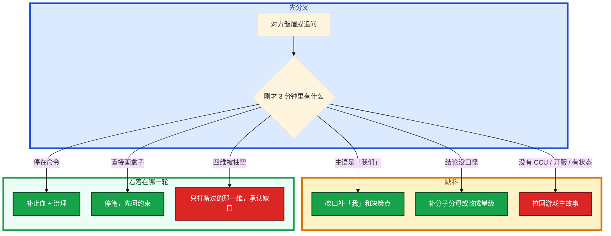

# 高级 SRE 能力模型与定级

总监桌上是你的简历，开口第一句往往是：「你独立扛过哪条业务？」工龄 8 年、K8s 题全对，只证明你会干活。他们拿你讲的项目，对照本厂 **高级** 的最低证据。对得上就定高级 band，对不上就压一级再谈薪。

这一章后半全是你会交出去的：**四维各备 1 个 Owner 故事和 2 个硬数字、技术题怎么走到治理、定级对话怎么听 High/Low。** 前面的概念和对照表，是为了让你交材料时不选错维度。

**读完你能：** 用证据而不是工龄自评 L5/L6；四维缺哪条自己先知道；技术轮停在命令时能自己补到止血和治理；投游戏厂时主动带开服和有状态边界。

## 本章目录

缩进 = 上下级。3 下面才是 3.1。

想钉在**正文左边**跟着滚：菜单 **查看 → 打开视图 → 大纲**。Markdown 预览做不到独立左栏，目录只能写在文章开头。

- [1. 基本概念](#1-基本概念)
- [2. 架构图](#2-架构图)
- [3. 原理](#3-原理)
  - [3.1 稳定性](#31-稳定性slo-才是门禁)
  - [3.2 容量](#32-容量先满的那一层)
  - [3.3 工程化](#33-工程化别人在用才算)
  - [3.4 故障指挥](#34-故障指挥不是救火英雄)
  - [3.5 各轮在判什么](#35-各轮在判什么)
- [4. 落地方法](#4-落地方法)
  - [4.1 每维怎么备证据](#41-每维怎么备证据)
  - [4.2 技术题六段](#42-技术题六段)
  - [4.3 本模块怎么用](#43-本模块怎么用不平均复习)
- [5. 常见坑与红线](#5-常见坑与红线)
- [6. 卡住时怎么改](#6-卡住时怎么改)
- [7. 必会 · 常考](#7-必会--常考)
- [合上书](#合上书问自己)

**本章不讲：** STAR、五层追问、不会的不写 → [02 简历与项目](../02-简历与项目/)；开服 / SLO / 容量 / 发布 / K8s / 多活怎么画 → [03 系统设计](../03-系统设计/)；事故复盘、冲突、反问、65–75 万 → [04 行为面与谈薪](../04-行为面与谈薪/)；开合服、热更、活动细节 → [08 游戏运维专题](../../08-游戏运维专题/)；Linux / K8s 排障命令 → [02 基础底座](../../02-基础底座/)、[04 Kubernetes](../../04-Kubernetes/)。

---

## 1. 基本概念

定级（leveling）看的是 **你决策的影响面和证据**，不看工龄。工龄是门票：7–10 年游戏运维够坐到桌前。桌上对照的是本厂高级 band 的最低证据。目标锚点：阿里 P6+ / P7 门槛、字节 2-1 / 2-2、腾讯 T9 / T10、游戏厂高级 / 专家；年包 **65–75 万**（一线城市高级中位，随城市和股票浮动）。

四个角色不要混：

| 角色 | 干什么 | 不是什么 |
|------|--------|----------|
| **稳定性 Owner** | 定义「坏了」：SLI / SLO / 错误预算进发布门禁 | 「有监控」 |
| **容量 Owner** | 活动前按层扩；现场知道什么不能扩 | 「大促加机器」 |
| **工程化 Owner** | 别人在用你的流水线 / 告警规则 / IaC | 「写了很多脚本」 |
| **故障指挥** | war room 拍板止血、对外同步、action 落地 | 第一个发现火、靠重启恢复 |

L5 / L6 用影响面区分，不要用工龄：

| 档 | 约等于 | 最低证据 | 再往上还要 |
|----|--------|----------|------------|
| **L5 · 高级** | 阿里 P6 扎实、字节 2-1、腾讯 T9、游戏厂高级 | **一条业务** 的稳定性和容量你能独立扛；P0 能指挥到止血和复盘落地 | — |
| **L6 · 门槛** | 阿里 P7、字节 2-2、腾讯 T10、游戏厂资深 / 专家 | 你定的规范别人在用；跨 2 条以上业务复用同一套机制 | 带演练、改组织纪律、跨团队 impact |

「独立扛」不是「这几台机器我熟」。现场能对上这三句才算：你是这条业务的 on-call primary；活动窗口扩什么、冻什么你拍板；发布冻结 / 回滚你有否决权。你不在场时门禁仍按你的规则跑，才像 L6。

**7 年 vs 10 年**：不是多会几个命令。10 年如果还在讲「我重启好了」，不如 6 年能讲清 SLO、容量水位、一次 war room 决策。10 年加分：带过演练、定过标准、跨 2 个以上业务复用同一套机制。7 年合格线是 **一条业务你能独立扛**。仍只扛自己几台机器，会被认为停滞，年包给到 65 万都紧。

同一套 K8s：互联网厂证明你能管集群；游戏厂必须再证明 **开服失败怎么回滚、活动时有状态服扩什么不能扩什么**。缺游戏证据，会被当成「会容器的 Web 运维」，定级和年包按中级。

> **记住**：工龄是门票，四维证据才是定级材料。缺一维，band 往下打。技术题答满不自动 Senior。

---

## 2. 架构图

先把整张图钉住。后面四维、各轮、落地都对着这张图说话。

图上三条线：

1. **没有箭头从「工龄」直接指向高级 band。**
2. **四维都要有你 Owner 的数字**；一维只能答「我们团队一起」，这一维记 0。
3. **出口是 band，不是故事。** High 信号够，HR 拿到高级预算；Low 信号多，拿到的是中级预算。

四家对照（同一套 K8s，游戏厂还要有状态证据）：

投阿里：准备变更管控、容量、大促对等窗口。投字节：容量、多集群、告警治理数字。投腾讯 / 游戏厂：**开服、热更、活动、回档** 必须能讲 5 分钟。AI / GPU 是加分，不是定级主科；主线仍挂稳定性。

---

## 3. 原理

原理只保留定级和面试会用到的：对方抽查哪四句、每维怎样才算高级、各轮过了不自动带下一轮。

**本节 5 块：** 3.1 稳定性 · 3.2 容量 · 3.3 工程化 · 3.4 故障指挥 · 3.5 各轮

现场你会听到的不是「你工龄够不够」，而是四句抽查：

1. 这条业务 **什么叫坏了**，谁被叫醒？（稳定性）
2. 活动峰值你 **提前扩了什么、现场不能扩什么**？（容量）
3. 别人是不是在用你留下的流水线 / 告警规则？（工程化）
4. P0 的 war room 里 **谁拍板回滚**，复盘 action 还在不在？（故障指挥）

四句里有一句只能答「我们团队一起」，这一维记 0，band 往下打。

三个词不要混：

| 词 | 是什么 | 定级怎么用 |
|----|--------|------------|
| **SLI** | 你量的那根针：登录成功率、掉线率、支付成功率 | 游戏不要套纯 Web 的 HTTP 占比 |
| **SLO** | 和业务约定的目标 | 写进简历就必须能约束发布 |
| **SLA** | 对外合同 / 处罚 | 面试少讲 SLA，多讲 SLO 怎么进门禁 |
| **错误预算** | `1 − SLO` 允许烧掉的那截 | **烧完停功能发布**，不停 hotfix / 回滚 |

没有一次「因预算烧完而停发版」的记录，就别把 SLO 写进简历。

### 3.1 稳定性：SLO 才是门禁

对方问：「你们登录成功率 SLO 是多少？错误预算烧完怎么办？」

| | 中级信号 | 高级信号 |
|--|---------|---------|
| SLO | 「可用性 99.9%」一句话 | 登录成功率、进战斗 / 核心 API、掉线、支付分开 |
| 变更 | 有审批流 | 发布窗口、灰度门禁、错误预算耗尽停功能发布 |
| 演练 | 「做过故障演练」 | 杀过 AZ / 切过主从 / 演练过回档，有失败记录和改进 |

游戏补充：CCU 10 分钟腰斩、登录队列堆积、充值失败，三类必须能说到告警和预案。只有机器 CPU 告警，稳定性评不上高级。

卡住长什么样：对方追「错误预算怎么约束发布」，你说「我们会评估一下」。这等于承认 SLO 从不进门禁。

没有历史 SLO：先连续测 **2 周** 核心 SLI，目标略松于现状 P99，再收紧；同时先上叫醒规则（登录跌破、支付失败、CCU 腰斩）。不要现场编一个 99.95%。

不合格很具体：核心链路没有 SLO 或 SLO 从不约束发布；变更无灰度无回滚演练；P0 靠个人英雄、复盘没有 action；容量靠「感觉再加两台」。7–10 年还停在这一层，技术轮或许能过，定级不会给到高级。

### 3.2 容量：先满的那一层

对方问：「上次活动峰值，你提前扩了什么？现场超了怎么办？」

口径先定：注册、DAU、**CCU**、战斗并发、登录 QPS，混用一定被追问。有模型、有水位、有扩容边界。有状态逻辑服 **不能按无状态 HPA 乱扩**；能扩的是网关、大厅、无状态接入；不能扩的走排队、分服、降级。压测对齐真实路径（登录洪峰 ≠ 平稳在线）。结论落到：哪一层先满、满了是限流、排队还是开新服。

你眼睛里该有的数字：峰值 CCU、单玩家资源、哪一层水位先红、活动前扩了几台网关、逻辑服人数上限是多少。说「大促前加机器」没有模型，容量维记 0。

阿里会追全链路压测和水位；字节会追你用哪个数据做扩容决策；游戏厂会追活动峰值你 **提前扩了什么、现场不能扩什么**。

### 3.3 工程化：别人在用才算

对方问：「这套开服流水线，现在几个项目在用？失败了谁能回滚？」

不是「写了很多脚本」。高级看 **别人是否在用、故障率 / 人效是否下降、失败能否重放**。可被承认的产出：

1. 开服 / 发布 / 回滚流水线：有门禁、失败能停、能回滚到确定版本
2. GitOps / IaC：生产变更可审计，人工 `kubectl edit` 不是主路径
3. 告警治理：有效率、on-call 叫醒次数有前后对比
4. 平台或自助化：开发能自助看日志 / 扩容 / 回滚，而不是每件事工单找你

「参与建设监控平台」没有个人模块和数字，工程化记 0 分。脚本只在自己笔记本里不算。卡住时对方会要 **流水线阶段名、门禁失败过一次的案例**——说不出就降成「写过脚本」。

平台没做成：讲失败（范围过大 / 没有业务 Owner），后来改成先做开服五段门禁这一条，失败可停，才有人用。体现取舍，比假装平台已上线强。

DevOps / SRE / 平台工程，对话里一句话区分：

| 词 | 一句话 | 生产怎么用 |
|----|--------|------------|
| **DevOps** | 协作和交付节奏 | 「我们关系很好」不是 DevOps |
| **SRE** | 用 SLO / 错误预算量化可靠性 | 预算耗尽停功能发布 |
| **平台工程** | 把能力做成自助产品 | 开发自助开服 / 回滚；没有平台也可以是合格 SRE |

投大厂 SRE 主线挂 SRE，另外两个能辨即可。按你们真实组织说，别硬套名词。

同一套 GitOps：互联网厂追变更可审计、回滚 RTO、谁有权 sync。游戏厂还要：有状态能不能套 HPA、liveness 会不会集体踢人、开服目录写入是不是流水线最后一步、活动时现场不能扩逻辑服。缺这些，技能栈再漂亮也定不了高级。没有开服流水线、只有手工开服：诚实讲痛点和你推动到哪一步，不要把手工值班说成「自动化 Owner」。

### 3.4 故障指挥：不是救火英雄

对方问：「那次登录 P0，谁拍板回滚的？」

救火英雄是第一个发现问题、靠熟练重启恢复。故障领导力是 **war room 里做止血决策、对外同步、事后把 action 落地的人**。一次 P0 必须能按时间线讲：发现 → 影响面 → 止血（回滚 / 切流 / 降级 / 扩容选了哪个）→ 根因（技术 + 流程）→ 防复发是否真的上线。指挥过 3 人以上、和运营对过玩家公告、复盘里有你签字的改进项，才像 7–10 年。

只讲「我定位到 Redis 连接池然后重启」，这是执行层。高级要补：为什么先止血不先查代码、谁有权回滚、下次同样告警会不会还要你在场。

根因是同事引入的：如实讲协作——你负责止血、时间线和推动复盘；根因归变更未灰度，不点名羞辱，也不把别人的设计说成自己的。

时间线对不上、主语全是「我们」、复盘 action 说不清谁做了。先把那一次 P0 按分钟写下来，见 [04-行为面与谈薪](../04-行为面与谈薪/)。

### 3.5 各轮在判什么

把一次完整流程想成四段对话。每段对方要的证据不一样；上一段过了不自动带下一段。禁止招聘场次叫法。

| 轮次 | 对方在判 | 你要交的证据 | 挂法 |
|------|---------|-------------|------|
| 技术轮 | 会不会干活、原理是否扎实 | Linux / 网络 / K8s 排障到命令；1 个小故障闭环 | 背概念、不会看指标 |
| 项目深挖 / 系统设计 | 是否真操过生产 | 游戏项目 5 层深挖 + 系统设计先问约束 | 简历写了讲不深、设计直接画盒子 |
| 定级 / 总监对话 | 能不能定到高级 | 四维各 1 个证据；跨团队推动；取舍 | 7 年口吻像 3 年；骂前司；无数字 |
| HR 谈薪 | 稳不稳、价是否在 band | 离职向前看；年包 65–75 万给区间 | 先报底价；只谈月薪 |

High / Low（定级时用这个听自己）：

| High | Low |
|------|-----|
| 开口先确认规模和 SLO | 直接背组件清单 |
| 每个结论跟数字和口径 | 「大幅提升」「稳定性很好」 |
| 主语「我」，决策点清楚 | 「我们团队一起」 |
| 有 rejected 方案和代价 | 只有唯一正确架构 |
| 承认当时没做容量 / 灰度，后来补了 | 事故里自己毫无责任 |
| 游戏约束（有状态、开服开关）主动讲 | 把战斗服讲成可随意滚动的 Web |

技术轮过了只说明执行和原理够用。项目深挖过了说明项目像真的。定级 High 信号够，才会按高级 band 报薪；Low 信号多，HR 拿到的是中级预算。

65–75 万是一线城市高级 band 的中位锚点，**前提是定级按高级**。四维证据不足会被按中级预算谈，数字再争也难。职级明确中级，很难靠谈薪谈到 75；要么接受中级数字，要么证明四维后让他们重定级，要么礼貌拒。步骤见 [04-行为面与谈薪](../04-行为面与谈薪/)。

> **重点**：技术轮炫架构、定级不会讲人，材料作废。定级只打四维 + 复盘 + 推动。

---

## 4. 落地方法

### 4.1 每维怎么备证据

技术题只证明你会干活。下面四维决定高级还是中级。准备法：每维只备 **1 个你 Owner 过的故事 + 2 个硬数字**，不要四维都讲成「我们有 Prometheus」。

证据从哪来（面试能指到文档名）：

| 维 | 故事从哪抽 | 数字从哪来 | 现场要能指 |
|----|-----------|-----------|-----------|
| 稳定性 | 一次因预算烧完停发版；一次灰度拦住 | SLO 文档、发布冻结记录 | 哪条 SLI、谁被叫醒 |
| 容量 | 一次活动前扩容 + 现场超模型 | 容量模型表、压测报告 | 哪一层先满、逻辑服上限 |
| 工程化 | 一条流水线被第 2 个项目接入 | 接入项目数、告警量前后 | 阶段名、失败退出码 |
| 故障指挥 | 一次你拍板回滚的 P0 | MTTR、是否复发、action owner | 分钟级时间线 |

IC 深度可以不带人。高级 SRE 的「带人」信号是 **跨团队推动**：培训接入、把门禁写进别人的发布清单，不是编制 5 人。

自评口诀：对照四维说现有证据和缺口，例如「容量模型有、跨业务规范还没有」。不要说「我肯定 P7」。差在哪先自己说清，比让对方替你定性便宜。

人设一句话（按真实数字替换，禁止虚构）：

> N 年游戏运维 / SRE，做过 XX 从 0 到 1：开合服自动化、K8s、监控。峰值 CCU / 区服数 / 云。目标高级 SRE，稳定性和发布做成可复制体系。

定级对话前夜，对着这句话检查四维：每维能不能立刻接上 1 个数字。接不上的维，不要等对方问到再编。

### 4.2 技术题六段

技术轮用六段。停在「命令」会被判中级。用一个具体动作串：大厅登录成功率从 99.5% 掉到 92%，持续 8 分钟，告警打到你。

1. **原理**：登录链过网关 → 大厅 → Redis session → 目录。不是「查一下机器」。
2. **现象带规模**：峰值 CCU N，哪几个区服，登录错误率 A%→B%，持续 Z 分钟。
3. **看哪个**：登录失败码、网关连接数、Redis 延迟 / 热点，不是先看 CPU。
4. **止血**：最近变更能回就回；Redis 热点切只读 / 扩从；**不先重启战斗服**（有状态，踢人）。
5. **根因**：技术（热点 key）+ 流程（没有水位告警、变更未灰度）。
6. **治理**：水位告警上线、该类变更冻结窗口，90 天能否 0 复发。

停在第 3 段「我用 redis-cli 看了 slowlog」——执行层。高级必须走到止血决策和治理是否还在。

登录 P99 从 200ms 到 2s：登录延迟 = 排队 + 鉴权 + 目录 + 逻辑服分配 + 下游。错误率未升则先看下游和排队。止血：限流 / 排队放缓、扩无状态、熔断慢下游。错误率升而不是延迟：先分协议失败码 / HTTP 4xx 5xx，先问有没有发版或配表，再看依赖和容量，避免一上来就扩容。

系统设计开口第一句：**先问约束再画图**。约束至少问：规模（CCU / QPS / 区服）、SLO、有状态还是无状态、失败回滚的 RTO、预算 / 团队能否自建。不问就画「标准微服务」，系统设计轮直接降级。画法见 [03-系统设计](../03-系统设计/)。

> **记住**：技术题六段；系统设计先问约束。命令只是第 3 段。

### 4.3 本模块怎么用：不要平均复习

职业发展不替代 02 / 04 / 07 的技术。用法：

1. 先把技术底座扛住，同时改简历（第 1 周就改，不要留到最后）。
2. 每个代表项目填一页深挖稿，按五层追问练口述（见 02 + [项目深挖模板总索引](../项目深挖模板总索引.md)）。
3. 系统设计只练六主菜：开服、监控告警与 SLO、容量、发布回滚、K8s 集群、多活。LLM 平台不当主设计题。
4. 定级前把四维证据和谈薪三档背熟。

投游戏厂主故事必须是开服 / 热更 / 活动。AI 经历加分一笔，主线不跑偏。

---

## 5. 常见坑与红线

现场最常见的五种走法，对方怎么判、你怎么改：

| 坑 | 考官怎么判 | 改法 |
|----|-----------|------|
| 用工龄换职级 | 「7 年」但故事全是接单 | 每维补 1 个 Owner 证据 |
| 四维只讲稳定性 | 容量 / 工程化 / 指挥全空 | 容量模型和一次 war room 必须备 |
| 游戏履历讲成 Web | 有状态、开服、热更没出现 | 主故事必须是游戏约束 |
| 把 AI / LLM 当主线 | 岗是业务 SRE，主线跑偏 | 加分一笔带过，主线仍是稳定性 |
| 技术轮炫架构、定级不会讲人 | 定级材料没备 | 定级只打四维 + 复盘 + 推动 |

7 年经验却被打成中级，典型信号：答题停在命令；项目主语是「我们」；没有数字和 rejected 方案；游戏履历讲成可随意滚动的 Web；事故里自己毫无责任；定级骂前司 / 规划与 JD 无关。

红线（当场把 band 往下打）：

1. 把不会的 SLO / GitOps 写成 Owner。
2. 战斗服按 Web 滚动、逻辑服现场 HPA。
3. 先报底价、只谈月薪（04 会展开；定级材料不足时晚上再争也晚了）。
4. 虚构 P7 / 2-2。自评对证据，不对称号。

**最大坑**：以为技术题答满就自动 Senior。大厂按 **你有没有独立扛过稳定性和容量** 定级；技术只是门票。

---

## 6. 卡住时怎么改

和 01 同一套三问：刚才那句话的主语是谁？有没有口径？有没有游戏约束？

现场顺序：

1. 停 2 秒，不要继续堆组件。
2. 改口：「我这边的口径是……我拍板的是……」
3. 接一个数字。没有精确百分比就用量级。
4. 哪一轮最弱就点名 + 已做的补法（例如系统设计按六题白板计时），不要说「都还行」。

卡住时的自检：刚才 3 分钟里有没有出现 CCU、开服开关、有状态扩容边界、一次你拍板的回滚。一个都没有，就是在讲 Web 运维。

---

## 7. 必会 · 常考

白板和追问高频，能一口回：

| 说法 | 对错 | 口径 |
|------|:----:|------|
| 工龄 8 年就该定 P7 / 2-2 | 错 | 按证据，不按工龄 |
| 技术题答满自动 Senior | 错 | 技术是门票；四维定 band |
| 四维缺容量仍可定高级 | 错 | 缺一维，band 往下打 |
| 「可用性 99.9%」算稳定性 Owner | 错 | 要分 SLI，且错误预算能停发布 |
| 有审批流 = 变更受控 | 错 | 要窗口、灰度、预算门禁 |
| 大促加机器 = 容量 Owner | 错 | 要口径、模型、水位、有状态边界 |
| 写了 30 个脚本 = 工程化 | 错 | 别人在用、失败能重放 |
| 第一个发现火 = 故障领导力 | 错 | 要拍板、同步、action 落地 |
| 逻辑服可以按 CPU 做 HPA | 错 | 有状态；现场排队 / 分服 / 降级 |
| 同一套 K8s，游戏厂按互联网口径定级 | 错 | 还要开服回滚和有状态边界 |
| 10 年自动高一档 | 错 | 加分是标准复用和带演练 |
| AI / GPU 可以当定级主线 | 错 | 加分；主线仍是稳定性 |
| DevOps 就是关系好所以发布快 | 错 | SRE 用错误预算；平台是自助产品 |
| 职级中级也能谈到 75 万 | 错 | 很难；先重定级或礼貌拒 |
| 系统设计开口先画微服务 | 错 | 先问约束再画图 |

数字：年包锚点 **65–75 万**；每维 **1 个 Owner + 2 个硬数字**；P0 指挥 **3 人以上**；没有 SLO 先测 **2 周**；错误预算烧完停 **功能发布**；CCU **10 分钟腰斩** 必须能讲预案；7 年合格线 = **一条业务独立扛**。

易混：L5 一条业务 Owner vs L6 定规范别人用；救火英雄 vs 故障指挥；DevOps vs SRE vs 平台工程；SLI vs SLO vs SLA；互联网 GitOps vs 游戏厂有状态追问；技术轮过了 vs 定级过了。

---

## 合上书，问自己

1. 定级看什么？四维缺一维会怎样？L5 和 L6 差在哪？
2. 阿里 / 字节 / 腾讯 / 游戏厂各要什么最低证据？同一套 K8s，游戏厂还多问什么？
3. 稳定性、容量、工程化、故障指挥，你各有哪 1 个故事、哪 2 个数字？
4. 技术题六段是哪六段？系统设计开口第一句问什么？
5. High / Low 你刚才那句话落在哪边？7 年被打成中级的典型信号有哪些？
6. 65–75 万和定级怎么咬？DevOps / SRE / 平台工程各一句话？

六题都能口述，这一章就过了。下一章把简历写成供词：写上去的每一项，默认你能讲到配置、命令、失败案例。
