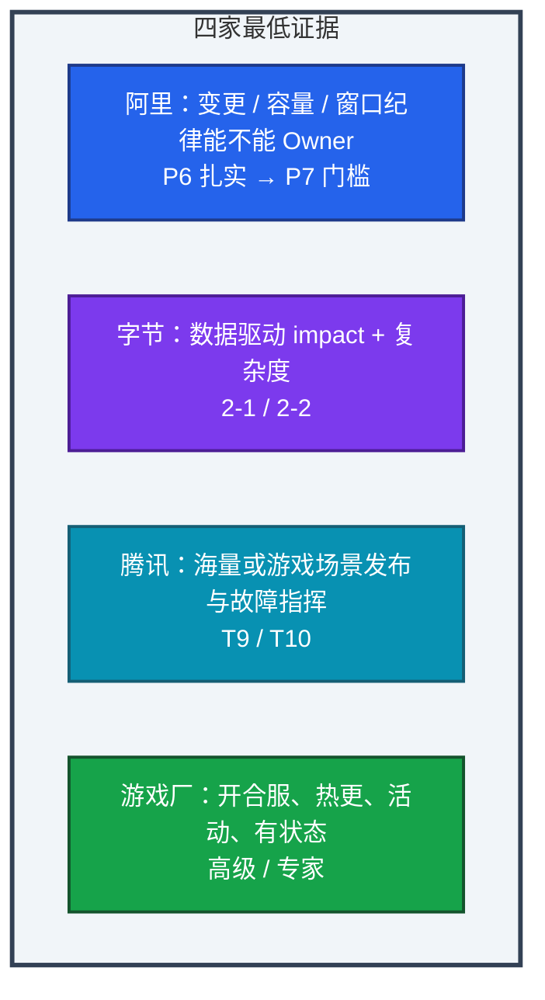
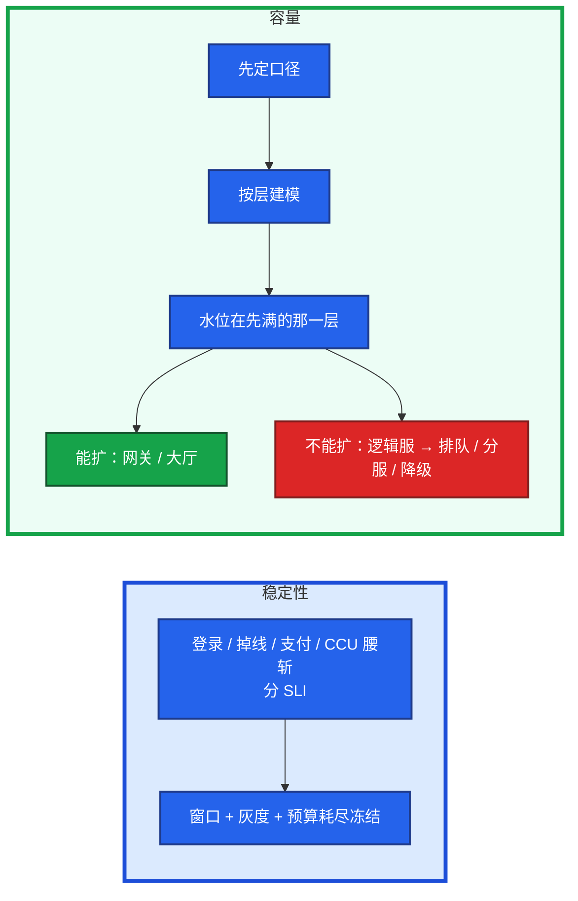
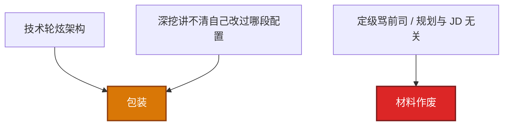

# 01｜能力模型 · 练习题

先对照 [知识点](知识点.md) **本章主线** 自己口述，再对答案。每题标了覆盖范围：

| 标记 | 含义 |
|------|------|
| **核心** | 不懂整章就没建立起来 |
| **必会** | 值班和面试都要能讲 |
| **常用** | 线上会反复碰到 |
| **常考** | 白板和追问的高频口径 |

## 本题目录

- [Q1 四家怎么定级](#q1)
- [Q2 稳定性与容量证据](#q2)
- [Q3 故障指挥 vs 救火](#q3)
- [Q4 各轮在判什么](#q4)
- [Q5 工程化到什么程度](#q5)
- [Q6 7 年被打成中级](#q6)
- [Q7 技术题六段](#q7)
- [Q8 DevOps / SRE / 平台](#q8)
- [Q9 GitOps 互联网 vs 游戏厂](#q9)
- [Q10 年包和定级怎么咬](#q10)
- [合上书](#合上书)

---

## Q1

**★★★★★｜7–10 年高级 SRE，阿里 / 腾讯 / 字节 / 游戏厂分别怎么定级？**

**覆盖**：核心 · 必会 · 常考

**对应**：知识点 §2 架构图

### 场景

总监问：「你觉得自己现在是哪一级？」有人答「我工作 8 年了应该是 P7」。

### 完整解答

**一句话**：定级按四维 Owner 证据，不按工龄；四家 band 不同，但缺一维都会往下打。

按证据定级，先画四家最低线，再对照四维缺口。

| 厂 | L5 最低证据 | L6 再往上还要 |
|----|------------|--------------|
| **阿里** | 变更可审计、冻结发布、容量模型、窗口纪律 | 定规范，别人按你的标准做 |
| **字节** | 数字驱动：告警有效率 / 水位 / MTTR、多集群 | 跨业务 impact，把人从重复劳动捞出来 |
| **腾讯** | 海量 CVM 或游戏 BG：发布、故障闭环完整 | 版本 / 活动保障可复制 |
| **游戏厂** | 开合服、热更、活动高峰；有状态服门禁和回滚 | 监控 / 发布 / 开服流水线被后续项目复用 |

四维（稳定性、容量、工程化、故障领导力）缺一维，band 往下打。L5 / P6 / 2-1 / T9 最低线：一条业务的稳定性和容量你能独立扛，P0 能指挥到止血和复盘落地。L6 / P7 / 2-2 / T10 再往上要能定规范、跨团队复用。同一套 K8s，互联网厂证明能管集群；游戏厂还要证明开服失败怎么回滚、活动时有状态服扩什么不能扩什么。10 年如果还在讲重启，不如 6 年能讲 SLO 和 war room 决策。

### 再追问

- 你觉得自己现在是哪一级？差在哪？——对照四维说现有证据和缺口，例如容量模型有、跨业务规范还没有。不要说「我肯定 P7」。
- L5 和 L6 差在哪？——L5 是一条业务 Owner；L6 是你定的规范别人在用，你不在场门禁仍跑。

---

## Q2

**★★★★★｜稳定性和容量，考官分别要听什么证据？**

**覆盖**：核心 · 必会 · 常考

**对应**：知识点 §3.1、§3.2

### 场景

「我们有监控，大促会加机器。」对方皱眉，开始追 SLO 口径。

### 完整解答

**一句话**：稳定性要 SLO 门禁和叫醒规则；容量要口径分层和先满的那一层——只有监控和加机器算中级。

| 维 | 中级信号 | 高级信号 |
|----|---------|---------|
| **稳定性 · SLO** | 「可用性 99.9%」一句话 | 登录成功率、进战斗 / 核心 API、掉线、支付分开 |
| **稳定性 · 变更** | 有审批流 | 发布窗口、灰度门禁、错误预算耗尽停功能发布 |
| **稳定性 · 演练** | 「做过故障演练」 | 杀过 AZ / 切过主从 / 演练过回档，有失败记录和改进 |
| **容量 · 口径** | 注册 / DAU / CCU 混用 | 注册、DAU、CCU、战斗并发、登录 QPS 分开 |
| **容量 · 模型** | 感觉再加两台 | 哪一层先满、水位、扩容边界 |
| **容量 · 有状态** | 逻辑服按 HPA 扩 | 能扩网关 / 大厅；不能扩走排队、分服、降级 |

登录洪峰和平稳在线分开压。阿里追全链路压测，字节追你用哪个水位决策，游戏厂追活动前你提前扩了什么。没有一次因预算烧完而停发版的记录，不要把 SLO 写进简历。

### 再追问

没有历史 SLO 怎么办？——先连续测 2 周核心 SLI，目标略松于现状 P99，再收紧；同时先上叫醒规则（登录跌破、支付失败、CCU 腰斩）。

---

## Q3

**★★★★★｜故障领导力和「救火英雄」差在哪？**

**覆盖**：核心 · 必会 · 常考

**对应**：知识点 §3.4

### 场景

复盘会上你讲「我定位到 Redis 连接池然后重启」。对方问：下次你不在场呢？

### 完整解答

**一句话**：救火英雄靠熟练重启恢复；故障领导力是 war room 拍板止血、对外同步、action 落地——只讲重启是执行层。

| | 中级信号 | 高级信号 |
|--|---------|---------|
| **角色** | 第一个发现、熟练重启 | war room 拍板止血、对外同步、action 落地 |
| **时间线** | 模糊 | 发现 → 影响面 → 止血 → 根因 → 防复发，按分钟 |
| **规模** | 单人操作 | 指挥过 **3 人以上**、和运营对过玩家公告 |

高级要解释为什么先止血不先查代码。指挥过多人、和运营对过公告口径、复盘改进真的上线，才像 7–10 年。

### 再追问

根因是同事引入的，你怎么讲？——如实讲协作：你负责止血、时间线和推动复盘；根因归变更未灰度，不点名羞辱，也不把别人的设计说成自己的。

---

## Q4

**★★★★★｜技术轮、项目深挖、定级对话分别在判什么？怎么准备？**

**覆盖**：核心 · 必会 · 常考

**对应**：知识点 §3.5

### 场景

有人技术排障很熟，系统设计直接画微服务盒子，定级材料没有数字。

### 完整解答

**一句话**：上一段过了不自动带下一段——技术轮看会不会干活，定级看四维 Owner 证据，谈薪看 band 区间。

| 轮次 | 对方在判 | 你要交的证据 |
|------|---------|-------------|
| 技术轮 | 会不会干活、原理是否扎实 | Linux / 网络 / K8s 排障到命令；1 个小故障闭环 |
| 项目深挖 / 系统设计 | 是否真操过生产 | 游戏项目 5 层深挖 + 系统设计先问约束 |
| 定级 / 总监对话 | 能不能定到高级 | 四维各 1 个证据；跨团队推动；取舍 |
| HR 谈薪 | 稳不稳、价是否在 band | 离职向前看；年包 65–75 万给区间 |

技术轮准备排障 SOP 和 1 个小闭环。项目深挖 2–3 个游戏项目备到 L5。系统设计六主菜开口先问规模 / SLO / 状态 / 回滚。定级只打四维 + 一个跨团队推进。投游戏厂主故事必须是开服 / 热更 / 活动。AI 经历加分一笔，主线不跑偏。

### 再追问

哪一轮最弱？——点名一轮 + 已做的补法（例如系统设计按六题白板计时），不要说「都还行」。

---

## Q5

**★★★★☆｜工程化做到什么程度才算高级，而不是「写了很多脚本」？**

**覆盖**：必会 · 常用 · 常考

**对应**：知识点 §3.3

### 场景

「我写了 30 个巡检脚本。」对方问：别人在用吗？失败能按同一条流水线重放吗？

### 完整解答

**一句话**：工程化看别人是否在用、故障率或人效是否下降、失败能否重放——笔记本里的脚本不算。

| | 中级信号 | 高级信号 |
|--|---------|---------|
| **产出** | 写了很多脚本 | 别人在用、故障率 / 人效下降、失败能重放 |
| **流水线** | 能跑 | 有门禁、失败能停、能回滚到确定版本 |
| **告警** | 有 Prometheus | 有效率、on-call 叫醒次数有前后对比 |

可被承认：开服 / 发布带门禁和回滚；GitOps / IaC 可审计；告警有效率和叫醒次数有前后对比；开发能自助回滚或看日志。要讲你设计的模块、推动谁接入、数字口径。「参与建设监控平台」无个人边界，记 0 分。

### 再追问

平台没做成怎么办？——讲失败：范围过大 / 没有业务 Owner。后来改成先做开服五段门禁这一条，失败可停，才有人用。体现取舍。

---

## Q6

**★★★★☆｜7 年经验却被打成中级，典型信号有哪些？**

**覆盖**：必会 · 常用 · 常考

**对应**：知识点 §5 常见坑与红线

### 场景

HR 回来说「职级按中级，年包到不了 65」。技术轮其实过了。

### 完整解答

**一句话**：7 年被打成中级，通常是 High / Low 全落在 Low 侧——无数字、无主语、无游戏约束、无 rejected。

| 信号 | 表现 | 定级后果 |
|------|------|----------|
| 技术轮炫架构 | 排障停在命令，系统设计直接画盒子 | 会干活，但不像 Owner |
| 深挖讲不清 | L3 说不出配置 / 命令 / 流水线阶段 | L1 数字被当成包装 |
| 定级材料空 | 主语「我们」、无 rejected、无游戏约束 | band 往下打 |
| 骂前司 / 规划跑偏 | 与 JD 无关的空喊转 AI / 管理 | 材料作废 |

改法：每维 1 个 Owner 证据；简历删不会的；主故事带有状态和开服约束。

### 再追问

工龄 10 年会不会自动高一档？——不会。10 年加分是标准复用和带演练；仍只扛自己几台机器，会被认为停滞，年包给到 65 万都紧。

---

## Q7

**★★★★☆｜技术题用什么结构答？举登录延迟升高。**

**覆盖**：必会 · 常用

**对应**：知识点 §4.2

### 场景

「登录 P99 从 200ms 到 2s。」有人一上来 `kubectl top` 和重启战斗服。

### 完整解答

**一句话**：技术题走六段——原理 → 现象 → 指标 / 日志 → 止血 → 根因 → 治理；停在命令是中级。

| 段 | 登录延迟这题要交什么 |
|----|---------------------|
| 1 原理 | 登录 = 排队 + 鉴权 + 目录 + 逻辑服分配 + 下游 |
| 2 现象 | P99 200ms→2s，带规模（哪几个区服、是否全链路） |
| 3 指标 / 日志 | RED、网关耗时、Redis / DB、逻辑服人数；错误率未升则先看下游和排队 |
| 4 止血 | 限流 / 排队放缓、扩无状态、熔断慢下游，**不先重启有状态战斗服** |
| 5 根因 | 举例：连接池或目录未扩 |
| 6 治理 | 水位告警、开服 / 活动前容量检查、runbook 改顺序 |

### 再追问

错误率升而不是延迟呢？——先分协议失败码 / HTTP 4xx 5xx，先问有没有发版或配表，再看依赖和容量，避免一上来就扩容。

---

## Q8

**★★★★☆｜DevOps、SRE、平台工程，对话里怎么一句话区分？**

**覆盖**：必会 · 常考

**对应**：知识点 §3.3

### 场景

对方问「你们是 DevOps 还是 SRE」。有人背 Google 书名。

### 完整解答

**一句话**：DevOps 是协作和交付节奏；SRE 用 SLO / 错误预算量化可靠性；平台工程把能力做成自助产品。

| 词 | 一句话 | 生产表述示例 |
|----|--------|-------------|
| **DevOps** | 协作和交付节奏 | 「关系好所以叫 DevOps」不算 |
| **SRE** | 用 SLO / 错误预算量化可靠性 | 错误预算耗尽停功能发布 |
| **平台工程** | 把能力做成自助产品 | 开发自助开服 / 回滚 |

投大厂 SRE 主线挂 SRE，另外两个能辨即可。平台是工程化成熟后的形态，没有平台也可以是合格 SRE。按你们真实组织说，别硬套名词。

### 再追问

你们公司更像哪一种？——结合真实：例如发布仍靠运维执行、SLO 刚起步 → 偏传统运维 + 在补 SRE；不要吹已是平台团队。

---

## Q9

**★★★★☆｜同一套 GitOps，互联网厂和游戏厂追问差在哪？**

**覆盖**：必会 · 常用 · 常考

**对应**：知识点 §3.3

### 场景

K8s + Argo 讲得很顺。游戏厂对方问：「战斗服滚动时探针怎么配？」答成和 Web 一样。

### 完整解答

**一句话**：互联网厂追变更可审计和回滚 RTO；游戏厂还要追有状态、探针、开服目录开关——缺这些定不了高级。

| 追问方向 | 互联网厂 | 游戏厂 |
|---------|---------|--------|
| 变更 | 可审计、回滚 RTO、谁有权 sync | 同上 + 有状态能不能套 HPA |
| 探针 | HTTP / gRPC 常规 | liveness 会不会集体踢人 |
| 开服 | 较少 | 目录写入是不是流水线最后一步 |
| 活动 | 较少 | 现场不能扩逻辑服，只能排队 / 降级 |

缺游戏约束证据，技能栈再漂亮也定不了高级。

### 再追问

没有开服流水线，只有手工开服，怎么定级？——诚实讲痛点和你推动到哪一步（哪怕只把门禁做成可停的脚本）。不要把手工值班说成「自动化 Owner」。

---

## Q10

**★★★★☆｜年包目标 65–75 万，和定级怎么咬在一起？**

**覆盖**：必会 · 常考

**对应**：知识点 §3.5

### 场景

能力模型还没对齐，HR 先问期望。有人报「最低 60 万月薪随便」。

### 完整解答

**一句话**：65–75 万是高级 band 中位锚点，前提是定级按高级；四维证据不足会被按中级预算谈。

| 定级结果 | 年包谈判空间 | 典型误区 |
|---------|-------------|---------|
| 高级 band 对齐 | 65–75 万有依据，给区间不报底价 | 还没定级就先报「最低 60」 |
| 四维缺一维 | band 往下打，数字再争也难 | 技术轮过了就以为能谈 75 |
| 职级明确中级 | 很难谈到 75 | 靠贬低对方 band 或威胁拒 offer |

先把定级材料备齐，谈薪给区间不报底价，步骤见 [04 行为面与谈薪](../04-行为面与谈薪/)。

### 再追问

职级明确中级，能不能靠谈薪谈到 75？——很难，也不该靠贬低对方 band。要么接受中级数字，要么证明四维后让他们重定级，要么礼貌拒。详见 04。

---

## 合上书

- [ ] 能说出定级看证据不看工龄；L5 / L6 差在影响面
- [ ] 能对照阿里 / 字节 / 腾讯 / 游戏厂各要什么最低证据
- [ ] 能把稳定性、容量、工程化、故障指挥各交 1 个 Owner + 2 个数字
- [ ] 能用六段答技术题；系统设计先问约束
- [ ] 能区分救火英雄 vs 指挥、脚本 vs 工程化、DevOps vs SRE vs 平台
- [ ] 能解释 65–75 万和高级 band 怎么咬，中级为什么谈不到 75
