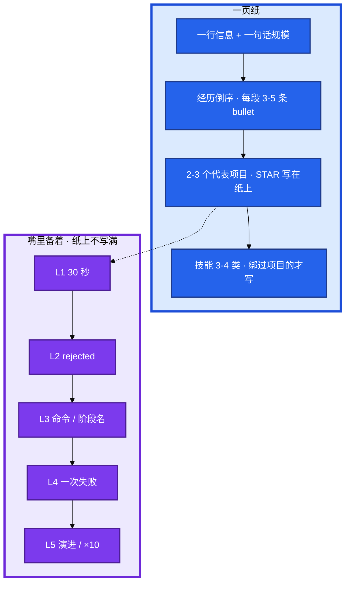
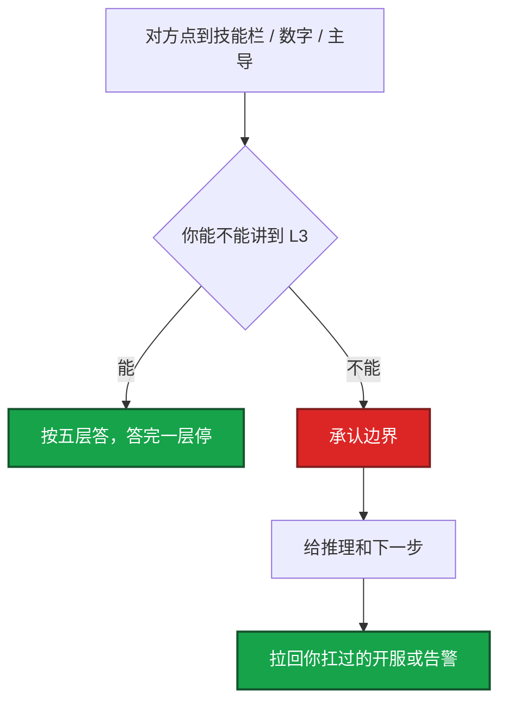

# 简历与项目深挖


同样会 K8s，差在你能不能把游戏生产讲到命令和数字。简历进不了考察，或进了之后项目经不起五层追问——65–75 万看的是 **2–3 个项目的 Owner 深度**。

**本章主线（写简历就按这三步想）：**

1. **供词原则**：写上去的每一项，默认能讲到配置、命令、失败案例；不会的就删。
2. **三刀自检**：投前三刀——数字口径 / rejected 方案 / L3 命令；一刀答不上，这一行先改再投。
3. **深挖备稿**：2–3 个代表项目备到 L5（L3 有命令，L4 有失败，L5 禁止「没什么要改」）。

**读完你能：** 一页纸按公式写完；bullet 经得起「数字口径 / rejected / 命令」三刀；被问倒时收口到真实边界；技能三档标对；每个代表项目备到 L5。

## 本章目录

- [1. 基本概念](#1-基本概念)
- [2. 架构图](#2-架构图)
- [3. 原理](#3-原理)
  - [3.1 STAR 按编号写](#31-star按编号写不要抒情)
  - [3.2 量化没有数字等于没有-owner](#32-量化没有数字--没有-owner)
- [4. 落地方法](#4-落地方法)
  - [4.1 简历怎么写](#41-简历怎么写)
  - [4.2 技能三档](#42-技能三档熟练--用过--不写)
  - [4.3 项目深挖五层](#43-项目深挖五层按编号备稿)
- [5. 常见坑与红线](#5-常见坑与红线)
- [6. 被问倒怎么走](#6-被问倒怎么走)
- [7. 必会 · 常考](#7-必会--常考)
- [合上书](#合上书问自己)

**本章不讲：** 四家定级、四维证据 → [01 能力模型](../01-能力模型/)；开服 / SLO / 发布怎么画 → [03 系统设计](../03-系统设计/)；复盘 STAR、谈薪 → [04 行为面与谈薪](../04-行为面与谈薪/)；开合服 / 热更细节 → [08 游戏运维专题](../../08-游戏运维专题/)；深挖填空模板 → [项目深挖模板总索引](../项目深挖模板总索引.md)。

---

## 1. 基本概念

简历是 **供词**。写上去的每一项，默认你能讲到配置、命令、失败案例。项目是 **深挖稿**：STAR 写在纸上，五层备在嘴里。

简历公式：

```
[主导 / 设计 / 推动] + [做什么] + [用什么] + [规模] + [结果数字]
```

动词：主导 > 负责 > 设计 / 推动 > 优化。慎用「参与」，不用「协助」。主导 = 方案主要你定、落地你推、结果你复盘。团队 8 个人都写主导同一平台，L3 一问就穿——拆模块。

| 弱 | 强 |
|----|----|
| 负责 K8s 运维 | 主导 3 套生产集群（N 节点 / M Pod），GitOps + PDB，变更类故障 A%→B% |
| 搭建监控 | 设计游戏服 SLO（登录 / 掉线 / 支付），日告警 X→Y，MTTR A→B min |
| 负责开服 | 落地开服流水线（预检→数据面→服务面→验收→开放目录），单服从 T1→T2，失败可回滚 |

技能栏写了「精通 Cilium」但项目里没出现，深挖第一刀就砍这里。ATS 可以对齐 JD 关键词，但对齐的必须是你真做过的。

游戏厂扫简历时要能看见有状态约束。只有 K8s + Prometheus、没有开服 / 热更 / 活动 / 回档，会被当成 Web 运维往下打一级。

定级语言：L5 写「一条业务的开服 / SLO / 容量我 Owner」；不要写「推动公司级 SRE 体系」却讲不出第二个接入项目——那是 L6 的供词。

> **记住**：简历是供词。写上去的每一项，默认你能讲到配置、命令、失败案例。

---

## 2. 架构图

后面 STAR、数字、五层都对着这张图。



**读图三句话：**

1. **技能栏每一项必须能绑到下面某条 bullet。**
2. **2–3 个项目备到 L5**，不要五份都浅。
3. **纸上是 STAR 和数字，嘴里是命令和失败。** L3 说不出，L1 的数字会被当成包装。

开场 4 句（约 90 秒）：


固定 4 句：年限与游戏角色；规模一个数字；最强项目一个结果数字；为什么投这个岗。不要说「想来学 AI」。对方说「再展开 K8s」，切到那个项目的 L1+L2，不要从 kubelet 原理讲起。

---

## 3. 原理

### 3.1 STAR：按编号写，不要抒情

**一句话：** 抒情没有动作，动作没有 rejected，都不是高级叙事。

四段必须按 1–4 号写：

1. **S 背景**：2 句。规模 + 痛点数字（日开 N 服、失败残留脏 server_id A 次 / 月）。
2. **T 任务**：你的目标，主语「我」。
3. **A 动作**：2–4 个动作，其中至少 1 个 **rejected 方案**。
4. **R 结果**：至少 2 个硬数字 + 口径。

A 里没有 rejected，对方会问「为什么不复制一台模板？」——这题你必须先自己答掉。

用稳定性 / 变更 / 容量 / 回滚重组真实工作，不发明项目：

| 真实工作 | 写成高级 SRE 叙事 | 必须带的数字 |
|----------|-------------------|--------------|
| 开服 | 流水线门禁、失败回滚、对玩家可见的开关 | 日开 N 服、单服耗时、失败率、回滚次数 |
| 合服 | 停写→备份→映射→校验→只开目标服 | 窗口时长、冲突条数、回滚演练结果 |
| 热更 / 强更 | 灰度、兼容、失败回滚、是否踢在线 | 覆盖率、回滚 RTO、版本失败次数 |
| 活动高峰 | 扩什么 / 不能扩什么、排队、降级 | 峰值 CCU、扩容提前量、活动期 P0 次数 |
| 故障 | 发现→止血→根因→治理 | 影响 CCU / 时长、MTTR、是否复发 |
| 回档 | RPO / RTO、审批、防二次伤害 | 备份点、恢复耗时、误伤范围 |
| 发布 | 变更门禁、制品不可变、自动回滚 | 发布频率、变更故障占比、回滚耗时 |
| K8s | 有状态怎么滚、PDB、探针能否套战斗服 | 集群数、异常 Pod、变更故障率 |

口述骨架（替换真实数字）：

**开服：** 背景：N 个区服、日均开 M 服，手工复制环境，失败要人肉清残留。我负责把开服做成可停可回滚的流水线。做了三件事：预检阻断；数据面和服务面分段，未挂目录前玩家不可见；验收失败整服拆掉不开放。淘汰「复制一台模板再改配置」。结果：单服耗时 X→Y，脏环境从 A 次 / 月到 0。

**故障治理：** 背景：峰值 CCU N，登录错误率 A%→B%，持续 Z 分钟。我是 on-call primary。动作：5 分钟拉 war room，先回滚最近变更；Redis 热点切只读 / 扩从，不先重启战斗服。淘汰「全集群重启」。结果：MTTR X→Y，90 天 0 复发。

**活动高峰：** 背景：版本日预估 CCU 超模型 30%。我负责容量，提前扩网关 / 大厅，逻辑服不按 HPA 加副本。现场排队放缓 + 降级非核心玩法。结果：活动期 P0 从 A 次到 B 次。

> **记住**：STAR 按 1–4 编号写完，嘴里才能经得起追问。

### 3.2 量化：没有数字 = 没有 Owner

**一句话：** 编精确数字一定穿；说不清来源比没有数字更糟。

数字从哪来：故障复盘表、发布单、监控月报、工单、云账单。没有系统就用 **同一口径的前后对比**（改造前 12 个月 vs 后 6 个月）。

| 类别 | 可写 | 口径注意 |
|------|------|----------|
| 规模 | 区服数、峰值 CCU、节点数、日发布次数 | CCU 和 DAU 不要混 |
| 稳定 | 年 P0 次数、登录成功率、掉线率 | 写了就要能说统计窗口 |
| 效率 | 开服耗时、MTTR、回滚耗时、人天 | 改造前后同一口径 |
| 告警 | 日告警量、有效率、周叫醒次数 | 有效 = 需要人处理且处理对了 |
| 成本 | 云账单、利用率、闲时缩容 | 承认有其他因素 |

口径示例（可原话）：

```text
按 P0 复盘表，发现告警到登录恢复，不含等开发排期。
改造前 12 个月 11 次平均约 40 分钟级，后 6 个月 3 次都在 10 分钟内。

变更故障：按 P0/P1 复盘标签，变更类包括配置错误、未灰度、requests 设错。
改造前 12 个月 25 起 P1+ 里 10 起变更相关 ≈40%；
上线后 6 个月 17 起里 2 起 ≈12%。
主动承认还有审批、演练等并行因素，GitOps / 流水线是主因之一。
```

说不清精确百分比就改成「从四十分钟级降到十分钟内」，并补你怎么定义 MTTR。

---

## 4. 落地方法

### 4.1 简历怎么写

1 页为佳。空间不够砍早期无关经历，不要缩小字号塞两页。经历碎：按主题聚合——稳定性、工程化、规模；仍要动词 + 数字，答题只深挖 1 个你最有发言权的点。

投递前扫 JD：关键词只从真实经历里出现，每词至少能展开到 L3。已经投出写了 Cilium：深挖开场主动收口「生产是 Calico，Cilium 只做过阅读，不应当作 Owner」，下一版删掉。

「你还做过什么没写在简历上？」准备 1 个小而完整、和岗位相关的（ChatOps、巡检自动化）。不主动展开 GPU / LLM，除非对方岗需要。

### 4.2 技能三档：熟练 / 用过 / 不写

| 写了 | 会被问到 | 不会就删或降级 |
|------|---------|----------------|
| K8s 网络 | CNI、Service 空 Endpoints、CoreDNS ndots | 只会 apply → 删「精通 K8s 网络」 |
| Kafka | 积压、再均衡、重复消费 | 只用过积压告警 → 写「用过，处理过 lag」 |
| AWS | VPC / NLB / IAM / IRSA | 只会开 EC2 → 不要写「熟悉 AWS 网络」 |
| Go | goroutine / channel / context 泄漏 | 改过小工具 → 写「脚本级 Go」 |
| SLO / GitOps | 错误预算怎么停发布、Argo sync policy | 只听过名词 → 整词删掉 |
| GPU / LLM | 推理 SLA、显存、限流 | 没做过生产 → 不写 |
| Thanos | compact、downsample | 只做过 PoC → 不写精通 |

技能分档：**熟练**（生产 Owner）/ **使用**（跟过项目）/ 不写。没有「了解 Thanos」这种占位。

准备 1 条真 PromQL 或 1 条真开服失败日志，比罗列名词强。质疑夸大时展开 L3 / L4，并如实说同事做了哪块。

### 4.3 项目深挖五层：按编号备稿

**一句话：** 2–3 个备到 L5；L3 要有命令，L4 要有失败，L5 禁止「没什么要改」。

| 层 | 考官在验 | 你要准备到 |
|----|---------|-----------|
| **L1** | 真实性、规模、角色 | 30 秒：规模 + 职责 + 1 个结果数字 |
| **L2** | 有没有权衡 | 至少 1 个对比方案和 rejected 原因 |
| **L3** | 是不是亲手 | 架构、关键配置、命令、流水线阶段 |
| **L4** | 是否真操过生产 | 一次失败：止血、你的决策、根因、有没有复发 |
| **L5** | 高级还是执行 | 当时没做的原因；×10 怎么演进；留下了什么机制 |

一页深挖稿：

```text
项目名 / 规模（区服、CCU、集群）
S 痛点数字 --> T 我的目标数字
架构：采集 / 发布 / 开服 数据流
选型 3 个：A vs B，为什么淘汰 B
故障 1 个：命令、止血、根因、治理
L1-L5 各 8-12 句，能脱口
```

开服五层口述（数字改成你的）：

1. **L1**：日开 N 服，我做流水线 Owner，单服 X→Y 分钟，脏环境从每月 A 到 0。
2. **L2**：不用「复制一台当模板再手工改」——残留 server_id 清不干净；不用一套大流水线自动跑完——失败会把半成品挂到目录。
3. **L3**：五段门禁；镜像禁 `latest`；验收没过不写服列表；失败走拆除 job。
4. **L4**：一次预检漏了 Redis 规格，验收登录超时；阻断开放、拆环境、补预检项，当天改用备份窗口重开。
5. **L5**：重来会把「目录写入」做成唯一开关并加人工确认；规模 ×10 按大区拆流水线 worker。

开服 L3 必须报出：预检 / 数据面 / 服务面 / 验收 / 目录写入；镜像禁 `latest`；失败走拆除 job 的 stage 名。报不出，这一行从简历上删。

| 卡住 | 回哪 |
|------|------|
| L1 数字被追口径 | 回 3.2，说清分子分母 |
| L2 答不出 rejected | 补「为什么不复制模板机」 |
| L3 说不出阶段名 / 命令 | 这一行从简历上删，或补到能讲 |
| L4 只有成功 | 备一次真实失败，没有就不要当 Owner |
| L5 「没什么要改」 | 改口：当时没做的 + ×10 怎么拆 |

---

## 5. 常见坑与红线

| 坑 | 后果 | 改法 |
|----|------|------|
| 技能清单无项目 | 初筛过、深挖空 | 每项技能绑 1 条 bullet |
| 「参与」「协助」 | 评执行层 | 改主导 / 推动，协作如实讲 |
| 无数字 | 不可信 | 量化表补口径 |
| 项目造假 | 追问崩、背调风险 | 只重组真实经历 |
| 经历碎、项目多而浅 | 没有记忆点 | 按稳定性 / 开服 / 工程化三条线聚合 |
| 游戏内容写成纯 Web | 游戏厂定级失败 | 主故事必须带有状态约束 |

红线：

1. 编精确百分比说不清来源。
2. ATS 对齐 JD 补假词（Cilium / Thanos / 错误预算冻结）。
3. 把全组平台写成个人从 0 到 1。
4. 技能栏「了解 XXX」占位。

> **记住**：简历不是技术列表。对方要的是 2–3 个能挖到 L5 的故事，不是 20 个名词。

---

## 6. 被问倒怎么走

**一句话：** 投前删掉或降级；现场承认边界，拉回你扛过的开服或告警。



现场：「这块生产我没 Owner，我按故障域会这样设计」，再拉回开服或告警。编「我们用 Cilium Hubble 排过」而实际没有，下一层命令就死。

开场自我介绍超时：立刻砍到那 4 句，项目细节留给追问。

---

## 7. 必会 · 常考

| 说法 | 对错 | 口径 |
|------|:----:|------|
| 简历写成技术列表更全 | 错 | 2–3 个能挖到 L5 的故事 |
| 「参与」「协助」显得谦虚 | 错 | 评执行层；改主导 / 推动 |
| 没有数字可以先投 | 错 | 没有数字 = 没有 Owner |
| 精确到 47.3% 更专业 | 错 | 说不清来源比没有数字更糟 |
| ATS 对齐可以写没做过的 Cilium | 错 | 筛过但深挖穿更亏 |
| 技能写「了解 Thanos」占位 | 错 | 熟练 / 用过 / 不写 |
| 五个项目都写一点显得面广 | 错 | 2–3 个备到 L5，其余会浅 |
| L5 答「没什么要改」 | 错 | 判没有演进意识 |
| L3 说不出命令但 L1 数字漂亮 | 错 | 数字会被当成包装 |
| 游戏履历只写 K8s + Prometheus | 错 | 游戏厂当 Web 运维往下打 |
| 已经投出的假词深挖时硬扛 | 错 | 开场收口，下一版删 |

数字：1 页；经历每段 **3–5** 条 bullet；代表项目 **2–3** 个备到 L5；STAR **1–4** 编号；结果至少 **2** 个硬数字；开场 **4 句 / 约 90 秒**；投前三刀：口径 / rejected / 命令。

易混：主导 vs 参与；熟练 vs 用过 vs 不写；L1 电梯版 vs L3 命令；MTTR 发现到恢复 vs 告警到恢复；重组真实工作 vs 发明项目。

---

## 合上书，问自己

1. bullet 公式是哪五段？开场 4 句怎么砍？
2. STAR 1–4 各写什么？没有 rejected 会怎样？
3. 「47 分钟」被追口径你怎么答？说不清为什么改成量级？
4. 技能三档怎么标？写了 K8s 网络会被问到什么？
5. L1–L5 各验什么？开服 L3 必须报出哪五段门禁？
6. 被问倒是承认边界还是编 Hubble？已经投出的假词怎么收口？

六题都能口述，这一章就过了。下一章把开服、SLO、容量、发布、K8s、多活画成可停的系统：先问约束再画图。
