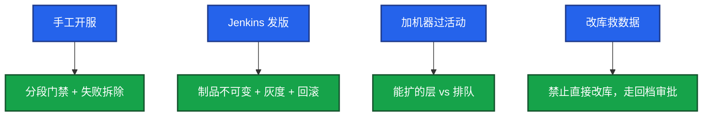

# 02｜简历与项目 · 练习题

先对照 [知识点](知识点.md) **本章主线** 自己口述，再对答案。每题标了覆盖范围：

| 标记 | 含义 |
|------|------|
| **核心** | 不懂整章就没建立起来 |
| **必会** | 值班和面试都要能讲 |
| **常用** | 线上会反复碰到 |
| **常考** | 白板和追问的高频口径 |

## 本题目录

- [Q1 2 分钟介绍定级项目](#q1)
- [Q2 五层追问](#q2)
- [Q3 数字口径](#q3)
- [Q4 不会的写上了](#q4)
- [Q5 游戏经历写成 SRE](#q5)
- [Q6 主导 vs 参与](#q6)
- [Q7 技能最强 / 最弱](#q7)
- [Q8 经历很碎怎么写](#q8)
- [Q9 自我介绍超时](#q9)
- [Q10 ATS 假词来得及改吗](#q10)
- [合上书](#合上书)

---

## Q1

**★★★★★｜用 2 分钟介绍你最能定级的游戏运维项目。**

**覆盖**：核心 · 必会 · 常考

**对应**：知识点 §3.1

### 场景

开场：「做个自我介绍，重点讲一个项目。」有人从入职第一年讲到现在，超时还没数字。

### 完整解答

**一句话**：2 分钟只讲一个定级项目，STAR 按编号，超时砍背景，必须含 rejected 和两个硬数字。

| STAR | 开服项目示例 | 现场要求 |
|------|-------------|---------|
| **S** | N 个区服，日均开 M 服，手工复制，失败残留脏 server_id | 30 秒内讲完规模 |
| **T** | 我作为流水线 Owner，目标单服耗时降下来且失败不对外开放 | 主语「我」 |
| **A** | 预检阻断；数据面和服务面分段；验收失败走拆除；淘汰「复制模板机再改配置」 | 含 rejected |
| **R** | 耗时 X→Y，脏环境从每月 A 到 0 | 至少 2 个硬数字 |

### 再追问

Argo / Jenkins 你为什么选当时那套？——按团队约束答：已有 Jenkins + 游戏服有状态，先把门禁做成可停；GitOps 后置。不要吹没用过的工具。

---

## Q2

**★★★★★｜简历写了「主导 K8s / 监控 / 开服」，五层追问你怎么扛？**

**覆盖**：核心 · 必会 · 常考

**对应**：知识点 §4.3

### 场景

对方顺着简历一条 bullet 往下挖。L1 数字很漂亮，L3 说不出流水线阶段名。

### 完整解答

**一句话**：五层从电梯版到演进，L3 必须有命令 / 配置，L5 禁止「没什么要改」——L3 说不出，L1 数字会被当成包装。

| 层 | 验什么 | 开服项目 L3 必须能报 |
|----|--------|---------------------|
| **L1** | 规模 + 角色 + 1 个数字（30 秒电梯版） | 「日均 5 服，我 Owner，耗时 47min→12min」 |
| **L2** | 为什么，必须有 rejected | 为什么不用复制模板机 |
| **L3** | 配置 / 命令 / 环境名 / 告警名 / 流水线阶段 | 预检 / 数据面 / 服务面 / 验收 / 目录写入；镜像禁 `latest` |
| **L4** | 一次真实失败 | 预检验收没过、探针误杀、告警漏报 |
| **L5** | 演进与取舍 | 当时没做金丝雀 / 目录开关的原因和现在的演进 |

每个代表项目一页稿，2–3 个备到 L5。失败走拆除 job。

### 再追问

现场写一条你当时的命令 / 配置？——准备真的：`kubectl describe` 事件、Argo sync policy、开服 job 失败退出码、PromQL 燃烧率。编的命令会在下一问穿。

---

## Q3

**★★★★★｜简历上「变更故障 40%→12%」这种数字怎么来的？对方不信怎么办？**

**覆盖**：核心 · 必会 · 常考

**对应**：知识点 §3.2

### 场景

「40% 是怎么算的？」说不出分母，开始改口。

### 完整解答

**一句话**：每个百分比必须说清窗口、分母、标签口径——说不清就改成量级并补定义，不要硬编。

| 要素 | 你要能答 | 示例 |
|------|---------|------|
| **统计窗口** | 改造前多久、改造后多久 | 改造前 12 个月 vs 上线后 6 个月 |
| **分母** | 什么事件集合 | P1+ 复盘总数 |
| **标签口径** | 什么算「变更类」 | 配置错误、未灰度、requests 设错 |
| **前后对比** | 同一口径 | 25 起里 10 起 ≈40% → 17 起里 2 起 ≈12% |

主动承认还有审批、演练等并行因素，GitOps / 流水线是主因之一。继续降：金丝雀、自动回滚、错误预算门禁。

### 再追问

MTTR 从发现算还是从告警算？——先定义你用的：发现到恢复，还是告警到恢复，是否含等开发。口径变了就不要和简历混用。

---

## Q4

**★★★★★｜不会的技能写上了，被问倒怎么办？正确做法是什么？**

**覆盖**：核心 · 必会 · 常考

**对应**：知识点 §4.2、§6 被问倒怎么走

### 场景

简历「精通 Thanos」，生产是 VictoriaMetrics。对方开始问 compact 和 downsample。

### 完整解答

**一句话**：投前按三档标技能，不会的就删；现场被问倒承认边界给推理，不编生产经历。

| 档位 | 怎么标 | 典型错误 |
|------|--------|---------|
| **熟练** | 日常 Owner，能到命令和失败案例 | Thanos 只 PoC 却写精通 |
| **用过** | 改过配置 / 跑通过，非 Owner | K8s 网络只会 apply 却写精通 CNI |
| **不写** | 没生产 Owner 就不写 | AWS 只会开 EC2 却写熟悉 VPC / IAM |

现场收口：「这块生产我没 Owner，我按故障域会这样设计」，再拉回开服或告警。编 Cilium Hubble 下一层命令就死。ATS 对齐 JD 只能用真实经历里的词。

### 再追问

那你简历为什么还写？——若确实误写：承认包装过度，说明已改、真实边界在哪。比继续圆更好。

---

## Q5

**★★★★☆｜游戏运维经历怎么写成 SRE 语言，又不假？**

**覆盖**：必会 · 常用 · 常考

**对应**：知识点 §4.1

### 场景

JD 要 SLO、GitOps。真实工作是手工开服和 Jenkins。有人写成「落地了错误预算驱动发布」，实际从未冻结过发布。

### 完整解答

**一句话**：用稳定性 / 变更 / 容量 / 回滚重组真实工作，每个 SRE 关键词后面要有你做过的动作。

| 真实工作 | SRE 语言重组 | 不能发明 |
|---------|-------------|---------|
| 手工开服 | 分段门禁 + 失败拆除 | 错误预算冻结发布（没做过就不写） |
| Jenkins 发版 | 制品不可变 + 灰度 + 回滚 | GitOps Owner（只是 apply 就不写） |
| 加机器过活动 | 能扩的层 vs 排队 / 降级 | 逻辑服 HPA 接人 |
| 改库救数据 | 禁止直接改库，走回档审批 | SLO 写进简历却无门禁 |

没有 SLO 就说自建登录成功率和掉线率，不要写从未做过的错误预算冻结。

### 再追问

合服你能讲到哪一层？——能讲停写、双备份、映射冲突、失败恢复备份而不是反向再迁——再写进简历。只会「跟过一次合服当晚值班」就不要写主导合服。

---

## Q6

**★★★★☆｜「主导」和「参与」怎么界定？对方怀疑夸大怎么办？**

**覆盖**：必会 · 常用 · 常考

**对应**：知识点 §4.1

### 场景

团队 8 个人简历都写了主导同一平台。

### 完整解答

**一句话**：主导 = 方案主要你定、落地你推、结果你复盘；质疑时展开 L3 / L4 并如实说同事做了哪块。

| 角色 | 界定 | 现场怎么扛 |
|------|------|-----------|
| **主导** | 方案主要你定、落地你推、结果你复盘 | 展开 L3：你写过哪段流水线 / 代码 |
| **参与** | 模块或执行 | 如实说同事做了 Helm chart 等 |
| **夸大** | 全组平台写成个人从 0 到 1 | L3 一问就穿 |

GitOps 例：架构和 Argo 你调、培训你组织、指标你盯，Helm 同事写，可以说协作但不把 Owner 让掉。经理背调口径要和自述一致。拆模块：你负责开服门禁和回滚，别人负责监控采集。

### 再追问

团队 8 个人都写了主导怎么办？——拆模块，不要争「整个项目都是我」。

---

## Q7

**★★★★☆｜技能哪项最强、哪项可能被问倒？**

**覆盖**：必会 · 常用

**对应**：知识点 §4.2

### 场景

「你技能栈最熟的是哪块？」有人列 15 个名词。

### 完整解答

**一句话**：最强选日常 Owner、能到命令和失败案例的；弱项诚实 + 简历不标熟练。

| 类型 | 怎么选 | 示例 |
|------|--------|------|
| **最强** | 日常 Owner + L3 命令 + L4 失败 | 游戏开服流水线 + 生产排障 + 告警治理 |
| **弱项** | 诚实 + 入职补什么 | 大规模多集群联邦、没做过生产 GPU |
| **简历** | 弱项标「用过」或「不写」 | 不能写 burn rate 却不会写 PromQL |

投岗若强依赖弱项，说入职补什么，不现场装熟。准备 1 条真 PromQL 或一条真开服失败日志，比罗列名词强。

### 再追问

现场写 burn rate？——能写就写；不能写就不要在简历写 SLO 驱动发布。

---

## Q8

**★★★★☆｜7 年经历很碎、没有「大项目」，怎么写？**

**覆盖**：必会 · 常用

**对应**：知识点 §4.1

### 场景

换过几条业务线，每段都是救火和脚本，没有从 0 到 1 的平台。

### 完整解答

**一句话**：按主题聚合（稳定性 / 工程化 / 规模），仍要动词 + 数字，答题只深挖 1 个你最有发言权的点。

| 聚合主题 | 从碎片经历里抽 | 写法 |
|---------|---------------|------|
| **稳定性** | 几次故障闭环 | 动词 + MTTR / 复发次数 |
| **工程化** | 脚本 / 流水线总人天 | 谁在用 + 失败能重放 |
| **规模** | 区服 / 机器加总 | 一个 CCU 或区服数字 |

不要按时间流水报 10 个小需求。没有 SLO 就讲自建指标和告警治理。换工作频繁用发展叙述，不抱怨。禁止把别人的平台和没做过的开服合成一个假项目。

### 再追问

你还做过什么没写在简历上？——准备 1 个小而完整、和岗位相关的（ChatOps、巡检自动化）。不主动展开 GPU / LLM，除非对方岗需要。

---

## Q9

**★★★★☆｜一句话自我介绍超时了，怎么砍？**

**覆盖**：必会 · 常考

**对应**：知识点 §4.1

### 场景

讲了 4 分钟还在讲第一份工作的机房搬迁。

### 完整解答

**一句话**：自我介绍固定 4 句约 90 秒，项目细节留给追问，早期无关经历直接不说。

| 句序 | 内容 | 时间 |
|------|------|------|
| 1 | 年限与游戏角色 | ~15s |
| 2 | 规模一个数字（CCU / 区服 / 云） | ~15s |
| 3 | 最强项目一个结果数字 | ~30s |
| 4 | 为什么投这个岗 | ~15s |

项目细节留给追问。早期无关经历直接不说。

### 再追问

对方说「再展开一下 K8s」？——切到那个项目的 L1+L2，不要从 kubelet 原理讲起。原理放技术轮。

---

## Q10

**★★★★☆｜ATS 为了对齐 JD，把没做过的 Cilium 写上了，投前还来得及改吗？**

**覆盖**：必会 · 常用 · 常考

**对应**：知识点 §4.2、§6 被问倒怎么走

### 场景

投出去的版本已经写了。对方约了项目深挖。

### 完整解答

**一句话**：投前删假词；已投出的深挖主动收口到真实边界，比被问 Hubble 再编强。

| 时机 | 做法 | 后果对比 |
|------|------|---------|
| **投前** | 三刀自检：口径 / rejected / L3 命令；假词删掉 | 筛过且深挖能扛 |
| **已投出** | 开场主动收口：「Cilium 只做过阅读，生产是 Calico」 | 比硬扛 Hubble 强 |
| **下一版** | 用真实 CNI / Service / 排障词对齐 JD | 假词筛过但穿更亏 |

### 再追问

会不会因为删了关键词筛不过？——筛过但深挖穿，更亏。用真实做过的词对齐 JD，比假词安全。

---

## 合上书

- [ ] 能用 STAR 1–4 在 2 分钟内讲完一个开服 / 故障 / 发布项目，含 rejected 和两个数字
- [ ] 能按 L1–L5 扛一条简历 bullet；开服 L3 能报五段门禁
- [ ] 能说清一个百分比的窗口、分母、标签；说不清就改成量级
- [ ] 能把技能标成熟练 / 用过 / 不写；被问倒承认边界不编 Hubble
- [ ] 能把手工开服 / Jenkins / 加机器重组为 SRE 语言且不假
- [ ] 能界定主导 vs 参与、砍自我介绍到 4 句、处理已投出的假词
