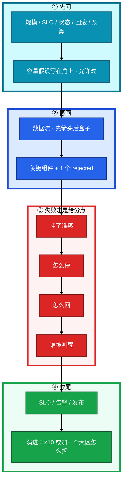
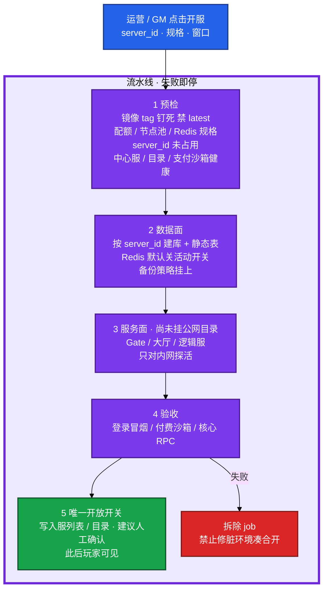
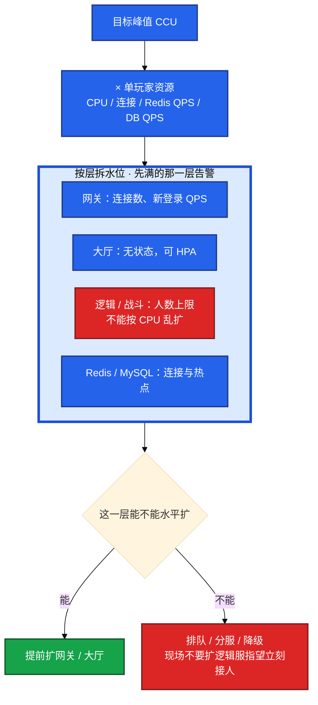
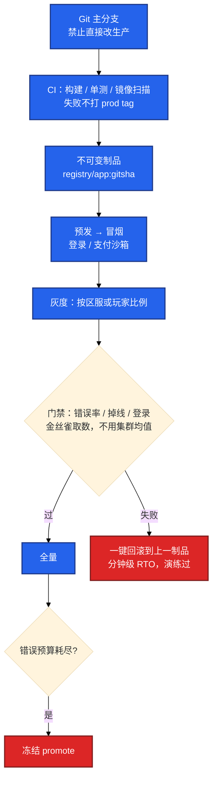
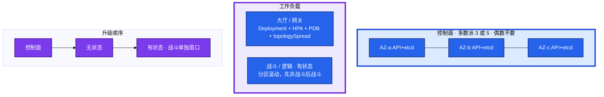
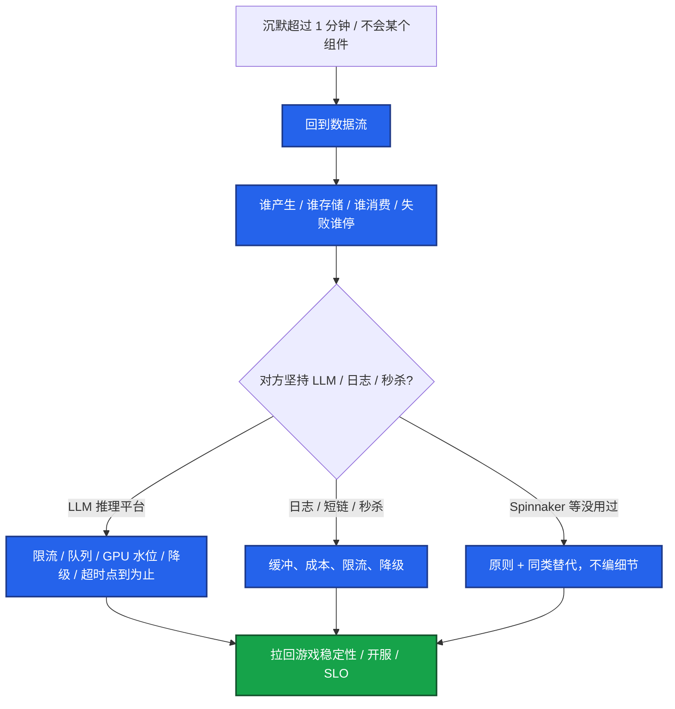

# SRE 系统设计（游戏生产）


白板题：「设计一个每天能开 N 个新区的开服系统。」45 分钟。不问约束就画「接入-逻辑-DB」、有状态战斗服按 Web 乱扩、失败没有回滚——按中级评。有人 15 分钟堆满组件名，总监问「验收失败怎么办」答不上来；给分点在失败路径，不在盒子数量。

**本章主线（白板就按这三步想）：**

1. **先问再画**：2–3 分钟只问不画——规模、SLO、有状态、回滚 RTO、预算；假设写在角上，允许对方改数字。
2. **先流后盒**：数据流（谁产生 / 谁存储 / 谁消费 / 失败谁停）先于组件名；失败路径比功能堆叠分高。
3. **六主菜轮换**：开服、监控 SLO、容量、发布回滚、K8s 集群、多活——同一骨架，只换数据流里的盒子。

**读完你能：** 开口 2–3 分钟只问不画；六主菜都能画到失败怎么停、怎么回、谁被叫醒；有状态逻辑服不当 HPA；LLM 不当主菜。

## 本章目录

- [1. 基本概念](#1-基本概念)
- [2. 架构图](#2-架构图)
- [3. 原理](#3-原理)
  - [3.1 先问约束再画图](#31-先问约束再画图)
  - [3.2 游戏三条硬约束](#32-游戏三条硬约束)
  - [3.3 容量与错误预算](#33-容量与错误预算)
- [4. 落地方法](#4-落地方法)
  - [4.1 开服系统](#41-开服系统每天开-n-服失败可回滚)
  - [4.2 监控告警与 SLO](#42-监控告警与-slo)
  - [4.3 容量](#43-容量百万注册峰值-ccu)
  - [4.4 发布回滚](#44-发布回滚灰度强更热更一键回滚)
  - [4.5 K8s 集群](#45-k8s-集群升级时战斗服不能集体掉线)
  - [4.6 多活](#46-多活)
- [5. 常见坑与红线](#5-常见坑与红线)
- [6. 卡住与降级题](#6-卡住与降级题)
- [7. 必会 · 常考](#7-必会--常考)
- [合上书](#合上书问自己)

**本章不讲：** 定级四维、答题像不像高级 → [01 能力模型](../01-能力模型/)；项目五层口述 → [02 简历与项目](../02-简历与项目/)；开合服 / 热更 / 活动实现细节 → [08 游戏运维专题](../../08-游戏运维专题/)；etcd / 控制面 → [04-K8s 01](../../04-Kubernetes/01-集群架构/)、[02 etcd](../../04-Kubernetes/02-etcd/)；GitOps → [04-K8s 22](../../04-Kubernetes/22-GitOps-ArgoCD与Tekton/)、[05 工程化](../../05-工程化与自动化/)；GPU / LLM → [09 AI](../../09-AI与智能运维/)。

---

## 1. 基本概念

系统设计轮看 **你能不能把生产约束问清，再把失败路径画成可停的系统**。六主菜：开服、监控告警与 SLO、容量、发布回滚、K8s 集群、多活。LLM 平台不当主设计题。

**白板里怎么认「必问五类」**（开口前 2–3 分钟只问不画）：

| 必问 | 例子 | 不问会怎样 |
|------|------|-----------|
| 规模与口径 | 每天开几服？峰值 CCU 还是登录 QPS？ | 容量和机器数全错 |
| SLO / 失败定义 | 登录成功率、掉线、支付、开服 RTO | 告警和多活方案无法选 |
| 状态 | 大厅无状态还是战斗服有 Session？ | 乱画弹性扩容 |
| 回滚 | 失败是拆环境、回版本还是回档？RTO？ | 开服和发布题直接挂 |
| 约束 | 自建还是云、团队人数、能否停服 | 堆一堆养不起的组件 |

**打个比方**：白板像盖房子——不问「几层、有没有地下室、地震带」就画平面图，地基全错。

45 分钟节奏：0–5 问约束 → 5–15 画数据流 → 15–30 深挖 1–2 个失败路径 → 30–40 SLO / 告警 / 发布 → 40–45 权衡和演进。时间不够先保 **主干 + 失败回滚 + 谁被叫醒**。

开场可以原话：

```text
这题我按生产系统来设计。先确认几件事：
规模（CCU / 日开服数 / 节点）、SLO（什么叫坏了）、
是否有状态、失败回滚的 RTO、自建还是云。
确认后我写容量假设，再画数据流。
```

白板口诀：**先问再画，先流后盒，先失败后功能，先 SLO 后组件。**

每层选型一句话：「选 A 因为…；B 淘汰因为成本 / 运维 / 有状态。」不会的组件说「生产没用过 X，我会用 Y 的原则做」，禁止编没见过的产品细节。

> **记住**：不问约束直接画图，按中级评。时间不够保主干 + 回滚 + 谁被叫醒。

**面试怎么说**：「系统设计我开口 2–3 分钟只问不画，假设写在角上；先画数据流和失败路径，再堆组件。」

---

## 2. 架构图

六主菜都套这张图，只换数据流里的盒子。



**读图三句话：**

1. **没有箭头从「组件清单」直接指向完成**——堆盒子不给分。
2. **别人讲功能，你讲失败怎么停、怎么回、谁被叫醒**——③ 才是给分点。
3. **换题用同一骨架重启**，不解释上一题为什么没答完。

卡住超过 1 分钟：回到数据流——谁产生、谁存储、谁消费、失败谁停。

---

## 3. 原理

### 3.1 先问约束再画图

**一句话：** 不问约束直接画「接入-逻辑-DB」，按中级评。

**打个比方**：像导航——不问目的地就画路线，可能把你导到河对岸。

**现场走一遍**（开服白板题，45 分钟）：

1. **0–3 分钟只问不画**：「日开几服？峰值 CCU？战斗服有 Session 吗？开服失败 RTO？自建还是云？」
2. **假设写在角上**：「假设日开 5 服、单服 CCU 8000、有状态逻辑服、失败拆环境 RTO 30 分钟——您要改数字吗？」
3. **5–15 分钟画数据流**：GM 点击 → 预检 → 数据面 → 服务面 → 验收 → 目录写入；箭头先于盒子名。
4. **15–25 分钟挖失败**：「验收超时走拆除 job，当天干净环境重开；目录写入是最后一步。」
5. **30–40 分钟 SLO / 告警**：开服验收失败叫醒谁；CCU 腰斩预案。

**输出解读**（45 分钟时间分配）：

| 阶段 | 分钟 | 必须产出 |
|------|------|----------|
| 问约束 | 0–5 | 五类约束 + 角上假设 |
| 数据流 | 5–15 | 箭头 + 1 个 rejected |
| 失败路径 | 15–30 | 怎么停、怎么回、谁叫醒 |
| SLO / 发布 | 30–40 | 业务 SLI，不是 CPU |
| 演进 | 40–45 | ×10 或加大区怎么拆 |

**面试怎么说**：「我开口 2–3 分钟只问不画，假设写在白板角上；时间不够先保主干、失败回滚和谁被叫醒。」

> **记住**：先问再画，先流后盒，先失败后功能。

### 3.2 游戏三条硬约束

**一句话：** 有状态逻辑服不能套 Web 弹性；目录写入是开服最后一步。

**打个比方**：战斗服像正在进行的棋局——不能随意换棋盘（HPA 加副本）；目录写入像裁判宣布「比赛开始」，半成品不能提前挂出去。

**现场走一遍**（容量题，对方说「CCU 爆了加机器」）：

1. 先拆状态：「大厅无状态可 HPA；逻辑 / 战斗服绑 Session、人数上限 500/服。」
2. 画分层：网关（连接数）→ 大厅（无状态）→ 逻辑服（有状态）→ Redis / MySQL。
3. 对方追问「逻辑服能扩吗？」——「**现场加副本不接人**，走排队、分服、降级；能扩的是网关和大厅。」
4. 开服题补第三条：「目录 / 服列表写入 = 玩家可见，必须是流水线第 5 步，建议人工确认。」
5. 数据题：「交易、背包以 MySQL 为准；回档看 RPO / 停写 / 脑裂以谁为准。」

**输出解读**：

| 约束 | 含义 | 设计后果 |
|------|------|----------|
| **有状态** | 战斗 / 逻辑服绑 Session、人数上限 | 不能按 CPU 做 HPA；现场加副本不接人 |
| **对玩家开关** | 目录 / 服列表写入 = 可见 | 开服最后一步才写；半成品禁止挂出去 |
| **数据不能丢** | 交易、背包、回档以 MySQL 为准 | 多活看 RPO / 停写 / 脑裂以谁为准 |

**面试怎么说**：「游戏设计我主动讲三条约束：有状态不能 HPA、目录写入是最后开关、数据以 MySQL 为准——不会把战斗服画成可随意滚动的 Web。」

> **别混**：能扩（网关 / 大厅）vs 不能扩（逻辑服现场加副本）；开服拆除 vs 合服恢复备份。

### 3.3 容量与错误预算

**一句话：** 注册百万不算容量；先满的那一层告警；预算烧完停功能发布。

**打个比方**：容量像水管——注册是总用户数（水库容量），CCU 是同时开的水龙头数；先爆的是最细的那根管（网关连接 / Redis 热点），不是「加机器」四个字能解决的。

**现场走一遍**（活动容量题）：

1. 写公式（允许改数字）：「目标 CCU 4.5 万 × 单玩家 1 连接 / 单网关 8000 连接 ≈ 6 台网关留 20% 水位。」
2. 逻辑服：「500 人 / 服上限，不按 CPU 利用率算台数。」
3. 压测：「登录脉冲 vs 平稳 CCU **分开打**，打到 **1.2×** 找第一瓶颈。」
4. 错误预算：「烧完停**非关键变更 / 功能发布**，不停 hotfix 和回滚。」
5. 金丝雀门禁：「看金丝雀自己的错误率相对发布前 5 分钟 baseline，不用集群均值。」

**输出解读**（容量公式口算）：

```text
目标 CCU × 单玩家连接 / 单网关连接上限 = 网关台数
逻辑服台数 = ceil(目标 CCU / 单服人数上限)   ← 不是 CPU 利用率

压测：登录脉冲 + 平稳 CCU 两条曲线，1.2× 找第一瓶颈
活动前：freeze 非必要发布；预热 CDN；扩无状态
```

**面试怎么说**：「容量我先拆 CCU 口径和哪一层先满；逻辑服按人数上限不算 HPA；错误预算烧完停功能发布，金丝雀看相对 baseline 不是集群均值。」

> **记住**：有状态逻辑服不能按 HPA 乱扩；压测 **1.2×**；CCU **10 分钟腰斩** 必须能讲预案。

---

## 4. 落地方法

六主菜。每题先问约束，再套第 2 节骨架。

### 4.1 开服系统：每天开 N 服，失败可回滚

**一句话：** 每段失败必须阻断；开放目录是最后一步；回滚是拆脏环境，不是对玩家「再试一次」。

**打个比方**：开服像发射火箭——预检、燃料、点火、验收，任一步失败整段中止；「对玩家可见」是最后一秒才按的发射键。



白板走查时，先讲五段再讲失败——下面是对常见卡点的定责：

| 卡住 | 先看哪 |
|------|--------|
| 预检失败仍继续跑 | 有没有「失败即停」；不要先画 K8s YAML |
| 服务面起来玩家已能搜到服 | 目录写入太早；必须是第 5 步 |
| 验收超时「改改配置再开」 | 走拆除 job，当天干净环境重开 |
| 合服和开服画在同一条流水线 | 合服失败恢复备份，禁止反向再迁 |

**面试怎么说**：「开服五段：预检→数据面→服务面→验收→目录写入；验收失败走拆除 job，目录是最后唯一开关。」

### 4.2 监控告警与 SLO

**一句话：** 叫醒看业务 SLI，不看 CPU；CCU 腰斩必须能讲预案。

游戏 SLI 不要只套「HTTP 99.9%」——下面几条分开量：

| SLI | 为什么单独量 |
|-----|-------------|
| 登录成功率 | 玩家进不来是第一痛点 |
| 进战斗 / 核心协议成功率 | 大厅通了战斗不通 |
| 掉线率 | 长连接游戏核心体验 |
| 支付成功率 | 直接收入 |
| CCU 异常（10 分钟腰斩） | 比 CPU 90% 更该叫醒 |

```mermaid
%%{init: {"flowchart": {"padding": 16, "nodeSpacing": 30, "rankSpacing": 48}, "theme": "base"}}%%
flowchart TB
    subgraph src ["采集"]
        g[游戏服 / 网关 / Redis / MySQL]
        ex[exporter]
        biz[业务埋点]
        lg[日志 · 登录失败码]
        g --> ex & biz & lg
    end

    subgraph prom ["Prometheus 分片 · 按大区 / 集群"]
        p[高基数禁止 user_id<br/>scrape 超时可见]
    end

    ex & biz & lg --> p
    p --> vm[长期存储 VM / Thanos<br/>按团队能力选]
    p --> am[Alertmanager<br/>分组 / 抑制 / 静默]
    am --> call[电话 / IM / 升级]
    vm --> graf[Grafana：SLO 燃烧率 + 开服 / 活动大盘]

    classDef a fill:#334155,stroke:#0F172A,stroke-width:2px,color:#fff
    classDef b fill:#2563EB,stroke:#1E3A8A,stroke-width:2px,color:#fff
    classDef c fill:#7C3AED,stroke:#4C1D95,stroke-width:2px,color:#fff
    classDef d fill:#16A34A,stroke:#14532D,stroke-width:2px,color:#fff
    class g,ex,biz,lg a
    class p b
    class vm,am,graf c
    class call d

    style src fill:#F1F5F9,stroke:#334155,stroke-width:3px
    style prom fill:#DBEAFE,stroke:#1D4ED8,stroke-width:4px
```

叫醒：登录跌破 SLO、支付失败、CCU 腰斩、开服验收失败。不叫醒：单机 CPU、已抑制的上游连锁。Rejected：单实例 Prometheus 扛所有 series；无分级的全量告警。

### 4.3 容量：百万注册、峰值 CCU

**一句话：** 能扩的提前扩；不能扩的排队、分服、降级；逻辑服现场加副本不当容量方案。



压测：登录脉冲与平稳 CCU 分开打，打到 1.2× 找第一瓶颈。活动前：freeze 非必要发布；预热 CDN；扩无状态。

### 4.4 发布回滚：灰度、强更、热更、一键回滚

**一句话：** 门禁看金丝雀相对 baseline；一键回滚必须演练过；热更发错配表回上一制品，不要现场改库。



游戏约束：

1. 热更失败能停；配表当制品版本化。
2. 强更兼容旧客户端。
3. 战斗服滚动：liveness 不能按 Web 套，PDB + 分区；单独窗口。
4. DB：expand-contract，禁止破坏性 DDL 和代码同发。

### 4.5 K8s 集群：升级时战斗服不能集体掉线

**一句话：** 控制面挂 → 已有 Pod 仍跑，无法变更；etcd 偶数不要；drain 前看 PDB。



影响面三句：控制面挂——已有 Pod 仍跑，无法变更。etcd 挂——失忆，靠备份演练。调度器挂——新 Pod Pending。Rejected：一个大集群塞所有大区；生产 `kubectl edit` 当发布；liveness 过激导致集体重启踢人。

### 4.6 多活

**一句话：** 画两个 AZ 负载均衡不等于多活；数据层才是题眼。


| 模式 | 适用 | 代价 |
|------|------|------|
| 同城双 AZ | 机器 / 无状态接入 / etcd | 逻辑服 Session 仍要粘滞或可重建 |
| 分区多活 | 按大区拆集群和数据 | 跨区玩法要单独设计 |
| 异地灾备 | 保底 RTO 小时级 | 热双活成本极高 |

讲清 **切流开关、演练、脑裂时以谁为准**。Redis 跨城同步：Session 可重建的才可丢；交易和背包以 MySQL 为准，切流前停写。

多活 8 分钟：声明假设（分区多活、RPO 分钟级、不做战斗服热双活），画大区独立 + 切流开关 + 数据以谁为准，点名 rejected（全球双写）。

---

## 5. 常见坑与红线

白板扣分和加分，对照这张表自检——功能堆叠不等于高级：

| 扣分 | 加分 |
|------|------|
| 不问约束直接画图 | 假设写在角上，允许改数字 |
| 组件堆砌、无数据流 | 先箭头后盒子 |
| 无失败路径、无回滚 | 每题讲一种失败怎么停 |
| 把有状态服当 Web 无状态 | 明确能扩 / 不能扩 |
| 多活只画双 AZ | 讲数据 RPO 和切流开关 |
| 编造没用过的组件 | 「没用过 X，原则是 Y」 |

红线：

1. 开服预检失败仍跑完、半成品挂目录。
2. 逻辑服现场 HPA 当容量方案。
3. 金丝雀用集群均值；一键回滚没演练过。
4. 为赶升级删 PDB；战斗服套 Web liveness。
5. 业务 / 游戏 SRE 岗把题做成 Prompt / Agent 主线。

---

## 6. 卡住与降级题

**一句话：** 沉默超过 1 分钟 → 回到数据流；LLM / 秒杀题点到为止，拉回游戏稳定性。



业务 SRE / 游戏 SRE 岗，主动把题往开服、SLO、容量、发布上引。编造没用过的 Cilium / Spinnaker 细节，追问即崩。

---

## 7. 必会 · 常考

| 说法 | 对错 | 口径 |
|------|:----:|------|
| 开口先画接入-逻辑-DB | 错 | 先问约束，假设写在角上 |
| 开服失败改改配置再开 | 错 | 拆除 job，当天干净环境重开 |
| 目录写入可以和服务面一起做 | 错 | 第 5 步唯一开关，建议人工确认 |
| 合服和开服同一条流水线 | 错 | 合服失败恢复备份，禁止反向再迁 |
| SLO 写 HTTP 99.9% 即可 | 错 | 登录 / 进战斗 / 掉线 / 支付 / CCU 腰斩 |
| 半夜 CPU 90% 该叫醒 | 错 | 叫醒看业务 SLI |
| 注册百万就给逻辑服 HPA | 错 | 先定 CCU 口径；有状态不能乱扩 |
| 现场 CCU 超模型立刻扩逻辑服 | 错 | 扩网关 / 大厅、排队、降级 |
| Git revert 就算一键回滚 | 错 | 回上一制品且演练过 |
| 金丝雀看集群均值 | 错 | 看金丝雀相对 baseline |
| 战斗服跟大厅一起滚 | 错 | liveness 过激会踢人；单独窗口 |
| 为赶升级可以删 PDB | 错 | 先看 maxUnavailable；战斗单独排 |
| 两个 AZ + LB = 多活 | 错 | 看数据 RPO / 切流 / 脑裂 |
| etcd 挂了玩家立刻掉线 | 错 | 已有 Pod 还在，不能变更 |

数字：单服 CCU 假设常见 **8000**；日开 **5** 服；压测 **1.2×**；CCU **10 分钟腰斩** 叫醒；回滚 **分钟级 RTO**；etcd **3 或 5**。

易混：开服拆除 vs 合服恢复备份；能扩 vs 不能扩；金丝雀 vs 集群均值；控制面挂 vs 玩家掉线；同城双 AZ vs 分区多活 vs 异地灾备。

---

## 合上书，问自己

1. 开口必问哪五类约束？45 分钟时间不够保哪三样？
2. 开服五段是哪五段？验收失败做什么？目录写入为什么是最后一步？
3. 游戏 SLI 有哪几条？谁被叫醒、谁不叫醒？
4. 容量公式怎么写？逻辑服现场能扩吗？
5. 发布门禁用谁的错误率？热更发错配表怎么回？战斗服怎么滚？
6. 多活三种模式各适用什么？脑裂以谁为准？LLM 题怎么降级？

六题都能口述，这一章就过了。下一章把 P0 时间线和 65–75 万按编号走完：下午交 Owner，晚上交区间。
