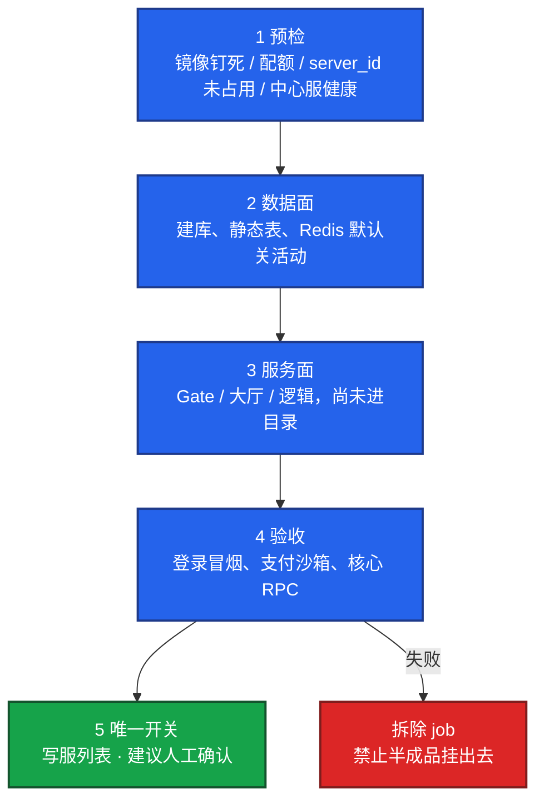
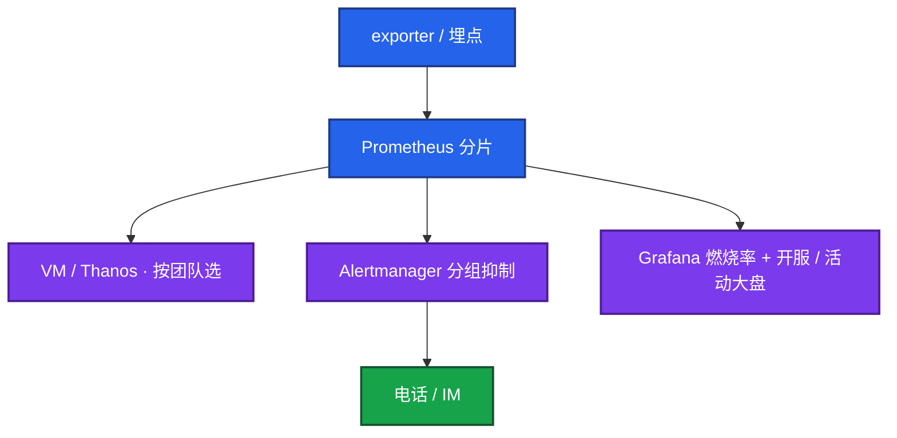
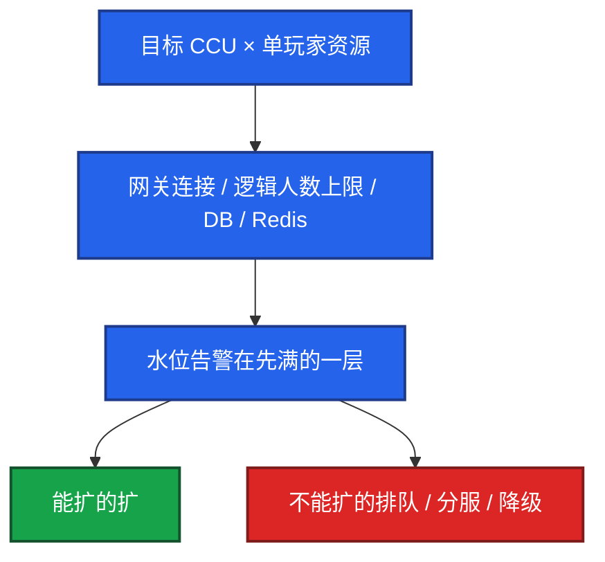
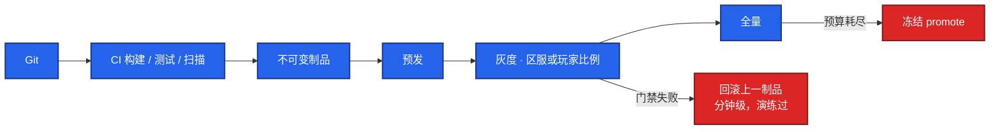
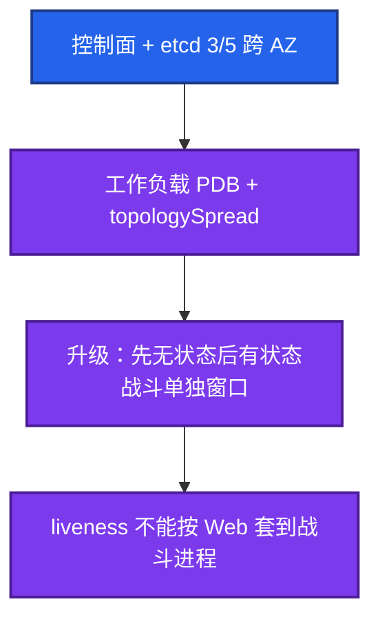
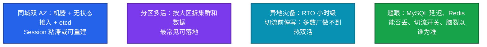

# 03｜系统设计 · 练习题

先对照 [知识点](知识点.md) **本章主线** 自己口述，再对答案。每题标了覆盖范围：

| 标记 | 含义 |
|------|------|
| **核心** | 不懂整章就没建立起来 |
| **必会** | 值班和面试都要能讲 |
| **常用** | 线上会反复碰到 |
| **常考** | 白板和追问的高频口径 |

## 本题目录

- [Q1 开服系统](#q1)
- [Q2 监控告警与 SLO](#q2)
- [Q3 容量](#q3)
- [Q4 发布回滚](#q4)
- [Q5 K8s 集群](#q5)
- [Q6 多活](#q6)
- [Q7 开口问哪些约束](#q7)
- [Q8 卡住或不会组件](#q8)
- [Q9 LLM 推理平台](#q9)
- [Q10 时间不够怎么取舍](#q10)
- [合上书](#合上书)

---

## Q1

**★★★★★｜设计游戏开服系统，支持每天开 N 服，失败可回滚。**

**覆盖**：核心 · 必会 · 常考

**对应**：知识点 §4.1

### 场景

「画一个每天能开 5 个新区的系统。」有人直接画 Jenkins 连 K8s，没有对玩家开关，失败继续跑完。

### 完整解答

**一句话**：开服五段每步失败必须阻断，目录写入是最后一步，回滚是拆脏环境不是对玩家「再试一次」。

先问：每天几服、单服 CCU、可见开关、失败 RTO、镜像是否钉死。假设写在角上。

| 给分点 | 中级 | 高级 |
|--------|------|------|
| 失败处理 | 继续跑完或手工修 | 失败即停 + 拆除 job |
| 玩家可见 | 半成品已进目录 | 目录写入是最后一步 |
| 回滚 | 「再试一次」 | 拆脏环境，禁止凑合开 |

合服不要混进这题：合服失败恢复备份，禁止反向再迁。

### 再追问

流水线某步失败但继续跑完了怎么办？——这是事故。门禁必须失败即停；目录写入做成独立审批。补预检项和告警，当天用干净环境重开，不修脏环境凑合开。

---

## Q2

**★★★★★｜设计游戏服监控告警：SLO 怎么定，什么情况该半夜叫醒？**

**覆盖**：核心 · 必会 · 常考

**对应**：知识点 §4.2

### 场景

「给我们游戏做一套监控。」有人只画 Prometheus + Grafana，SLO 写 HTTP 99.9%，半夜 CPU 90% 也打电话。

### 完整解答

**一句话**：SLO 拆业务 SLI，叫醒绑燃烧率和 P0 业务指标——单机 CPU 不叫醒，CCU 腰斩按业务故障走。

先问长连接还是 HTTP、谁 on-call。SLO 拆登录成功率、核心协议 / 进战斗、掉线、支付、CCU 异常。

| 指标 | 叫醒 | 不叫醒 |
|------|------|--------|
| 登录跌破 / 支付失败 | ✓ P0 | |
| CCU 10 分钟腰斩 | ✓ 业务故障 | |
| 开服验收失败 | ✓ | |
| 单机 CPU 90% | | ✗ 白天处理 |

Rejected：单实例扛所有 series；无分级全量告警。错误预算烧完停非关键发布。

### 再追问

CCU 掉了一半，但 CPU 都正常？——按业务故障处理：登录、网关连接、目录、发版、热更。CPU 正常不能排除逻辑挂死或玩家进不去。这正是必须有业务 SLI 的原因。

---

## Q3

**★★★★★｜百万注册、峰值 CCU，你怎么做容量？**

**覆盖**：核心 · 必会 · 常考

**对应**：知识点 §4.3

### 场景

运营给了「注册破百万」。有人按注册数给逻辑服做 HPA。

### 完整解答

**一句话**：容量先定口径再按层建模，水位告警在先满的那一层——有状态逻辑服现场不加副本当方案。

| 口径 | 不能混用 | 建模方式 |
|------|---------|---------|
| 注册 / DAU / CCU | 各自含义不同 | 分开建模 |
| 登录 QPS vs 平稳 CCU | 压测曲线不同 | 两条曲线分开打到 1.2× |
| 逻辑服 | 有状态人数上限 | 不按 CPU 做 HPA |

公式写在白板上：目标 CCU × 单玩家连接 / 单网关连接上限 = 网关台数。逻辑服按人数上限算，不按 CPU。活动前 freeze 非必要发布。

### 再追问

现场 CCU 超模型，逻辑服能立刻扩吗？——多数不能立刻接人。现场扩网关 / 大厅、收紧排队放行、降级非核心玩法。逻辑服扩容是活动前的事。

---

## Q4

**★★★★★｜设计发布系统：灰度、强更、热更、一键回滚。**

**覆盖**：核心 · 必会 · 常考

**对应**：知识点 §4.4

### 场景

「我们要一键回滚。」有人说 Git revert。战斗服用 Web 的 liveness。配表热更发错准备改库。

### 完整解答

**一句话**：发布走不可变制品 + 灰度门禁 + 一键回滚演练；热更配表当制品，禁止现场改库。

先问日发布次数、热更是否改协议、强更是否踢在线、回滚 RTO、DB 是否同发。

| 类型 | 门禁 | 红线 |
|------|------|------|
| 灰度 | 错误率 / 掉线 / 登录相对 baseline | 不用集群均值 |
| 热更 | 配表版本化、能停 | 禁止现场改库 |
| 强更 | 兼容旧客户端 | 战斗服谨慎配 liveness |
| DB | expand-contract | 禁止破坏性 DDL 和代码同发 |

### 再追问

热更发错配表怎么回？——配表当制品；一键回上一份；必要时关活动开关。不要现场改库。

---

## Q5

**★★★★★｜设计生产 K8s 集群，升级时战斗服不能集体掉线。**

**覆盖**：核心 · 必会 · 常考

**对应**：知识点 §4.5

### 场景

「集群要滚动升级。」有人 drain 全节点，PDB 被删掉赶时间。

### 完整解答

**一句话**：控制面跨 AZ + 工作负载 PDB / topologySpread，战斗服单独窗口升级，liveness 不能按 Web 套。

先问战斗服是否在集群内、能否停服、多 AZ 与否。

| 组件 | 挂了会怎样 | 升级顺序 |
|------|-----------|---------|
| 控制面 | 已有 Pod 仍跑、无法变更 | 先无状态后有状态 |
| etcd | 失忆，靠备份 | 3/5 跨 AZ，偶数不要 |
| 调度器 | 新 Pod Pending | 禁止一个大集群塞所有大区 |
| 战斗服 | 集体掉线 | 单独窗口 + 谨慎 liveness |

发布走 GitOps。etcd 备份并演练恢复。

### 再追问

PDB 把 drain 卡住了？——先看 maxUnavailable / minAvailable 是否与副本数冲突；战斗服升级窗口单独排；禁止为了赶升级删 PDB。

---

## Q6

**★★★★★｜游戏要多活，你怎么设计？**

**覆盖**：核心 · 必会 · 常考

**对应**：知识点 §4.6

### 场景

「我们要多活。」有人画两个 AZ 前面一个 LB，战斗服双写 Redis。

### 完整解答

**一句话**：多活看数据层 RPO / 停写 / 脑裂以谁为准——画两个 AZ 框不等于多活。

先问同城双活、异地灾备还是分区多活，以及 RPO / RTO、跨区玩法。

| 模式 | 适用 | 题眼 |
|------|------|------|
| 同城双 AZ | 机器 + 无状态接入 + etcd | Session 粘滞或可重建 |
| 分区多活 | 按大区拆集群和数据 | **最常见可落地** |
| 异地灾备 | RTO 小时级 | 切流前停写；多数厂做不到热双活 |

不要一上来双写所有游戏库。排行榜 / 交易 / 公会跨区要单独设计。

### 再追问

Redis 跨城同步行不行？——延迟和脑裂不可接受就不要当多活数据面。Session 可重建的才可丢；交易和背包以 MySQL 准，切流前停写。

---

## Q7

**★★★★☆｜系统设计开头你问哪些约束？不问直接画图会怎样？**

**覆盖**：核心 · 必会 · 常考

**对应**：知识点 §3 原理

### 场景

45 分钟题，前 10 分钟已经画满微服务。对方改口「我们单服只有 2000 CCU」，图全废。

### 完整解答

**一句话**：先问 2–3 分钟再画——规模、SLO、有状态、回滚 RTO、预算；假设错了整题按中级评。

| 必问 | 例子 | 不问会怎样 |
|------|------|-----------|
| 规模与口径 | 每天开几服？峰值 CCU 还是登录 QPS？ | 容量和机器数全错 |
| SLO / 失败定义 | 什么叫坏了？回滚 RTO？ | 叫醒和门禁全错 |
| 是否有状态 | 战斗服能否 HPA？ | 按 Web 乱扩 |
| 回滚 RTO | 失败玩家可见吗？ | 开服半成品挂出去 |
| 团队 / 预算 | 自建还是云？ | 组件选型脱离现实 |

开口：「先确认约束再画。」45 分钟：0–5 问清，5–15 数据流，15–30 失败路径，30–40 SLO / 发布，最后权衡。白板口诀：先问再画，先流后盒，先失败后功能，先 SLO 后组件。

### 再追问

对方说规模你定。——自己给一档合理假设并声明可调：例如单服 CCU 8000、日开 5 服、开服失败玩家不可见。

---

## Q8

**★★★★☆｜设计中途卡住或不会某个组件怎么办？**

**覆盖**：必会 · 常用

**对应**：知识点 §6 卡住与降级题

### 场景

对方问 Spinnaker 策略。你没用过。沉默了两分钟。

### 完整解答

**一句话**：卡住就回到数据流四问，不会的产品说原则和同类替代，把题往 SLO / 回滚 / 容量上收。

| 动作 | 怎么做 | 别做 |
|------|--------|------|
| 回到数据流 | 谁产生、谁存储、谁消费、失败谁停 | 沉默超过一分钟 |
| 不会的产品 | 说原则和同类替代 | 编 Spinnaker / Cilium 细节 |
| 收题 | 往 SLO / 回滚 / 容量上引 | 硬撑到追问穿 |

先画主干再填名字。换题用同一骨架重启。

### 再追问

重来这套监控你怎么改？——更早上业务 SLI 和依赖抑制；长期存储按团队能力选简单的；和发布事件打通便于归因。

---

## Q9

**★★★★☆｜对方让你设计 LLM 推理平台，你怎么处理？**

**覆盖**：必会 · 常用

**对应**：知识点 §6 卡住与降级题

### 场景

业务 SRE 岗。白板写成 Prompt 链路和 Agent。游戏稳定性一句没有。

### 完整解答

**一句话**：业务 / 游戏 SRE 岗 LLM 不当主菜——限流 / 队列 / GPU 水位点到为止，拉回你的游戏稳定性经验。

| 岗类型 | 怎么处理 LLM 题 | 主战场 |
|--------|----------------|--------|
| 业务 / 游戏 SRE | 确认是否 AI Infra 岗；骨架仍是约束→容量→降级→SLO | 开服和游戏 SLO |
| AI Infra 岗 | 按第九章展开 | token/s、队列、GPU |

不要展开 MCP / Prompt / Agent。若对方坚持，骨架仍是约束→容量（token/s、队列）→失败降级→SLO。然后明确：生产主战场是开服和游戏 SLO。

### 再追问

那日志系统 / 秒杀要不要画？——SRE 岗频率低于六主菜。被问到讲缓冲、成本、限流、降级，尽快回到可观测和容量。

---

## Q10

**★★★★☆｜开服和多活两道题时间不够，怎么取舍？**

**覆盖**：必会 · 常用 · 常考

**对应**：知识点 §5 常见坑与红线

### 场景

开服图画完，多活只剩 8 分钟。有人硬画全球双活。

### 完整解答

**一句话**：时间不够先保主干数据流 + 一种失败怎么停 + 谁被叫醒——不要半成品全球架构。

| 剩余时间 | 保什么 | 怎么收 |
|---------|--------|--------|
| 充足 | 六主菜完整 + 失败路径 | 正常展开 |
| 8 分钟（多活） | 声明假设 + 大区独立 + 切流开关 | 点名 rejected：全球双写 |
| 任意不够 | 主干 + 回滚 + 叫醒 | 不解释上一题为什么没答完 |

多活 8 分钟：声明假设（分区多活、RPO 分钟级、不做战斗服热双活），画大区独立 + 切流开关 + 数据以谁为准。

### 再追问

考官换题怎么办？——同一骨架重启，不解释上一题为什么没答完。

---

## 合上书

- [ ] 能开口先问五类约束，假设写在角上；时间不够保主干 + 回滚 + 谁被叫醒
- [ ] 能画出开服五段；验收失败走拆除；目录写入是最后一步
- [ ] 能拆游戏 SLI 和叫醒标准；CCU 腰斩按业务故障走
- [ ] 能按层做容量；逻辑服现场不加副本当方案
- [ ] 能讲发布门禁（金丝雀不是均值）、一键回滚演练、热更配表当制品、战斗服单独滚
- [ ] 能区分同城双 AZ / 分区多活 / 异地灾备；LLM 题降级拉回游戏稳定性
