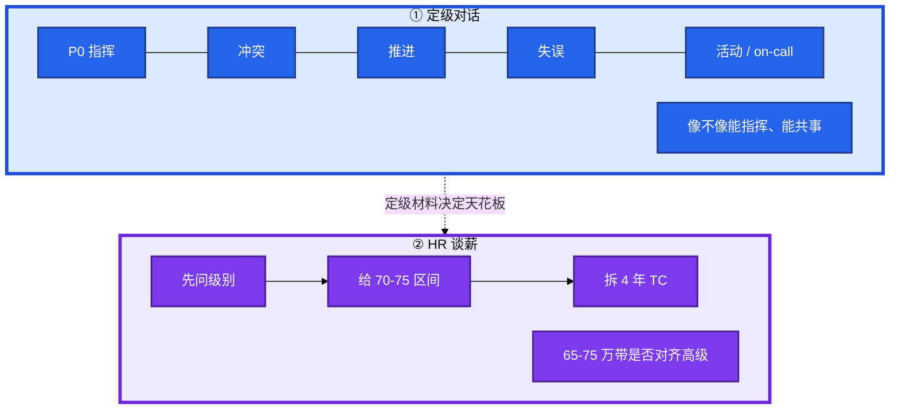
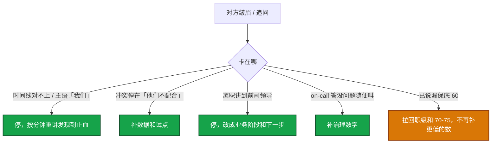

# 行为面与谈薪


技术轮过了。下午总监问「讲一次你指挥的 P0」；晚上 HR 问「期望薪资」。两段判的不是同一件事：定级听 Owner 证据；谈薪听 **年包 Total Comp 区间**。

**本章主线（两段对话就按这三步想）：**

1. **下午交 Owner**：五个 STAR 主语「我」、有数字、先止血再追责、有留下的机制。
2. **晚上交区间**：先问级，给 **70–75 万** 期望区间，拆 4 年 TC；不报最低 60、不只谈月薪。
3. **定级决定天花板**：P0 时间线讲糊了，晚上再报 70–75，HR 手里已是中级预算。

**读完你能：** 五个 STAR 主语是「我」；复盘讲到还在线上的机制；被逼问期望时给 70–75 区间不报最低 60；on-call 接受并带治理数字。

## 本章目录

- [1. 基本概念](#1-基本概念)
- [2. 架构图](#2-架构图)
- [3. 原理](#3-原理)
- [4. 落地方法](#4-落地方法)
  - [4.1 事故复盘怎么讲](#41-事故复盘怎么讲)
  - [4.2 冲突与推进](#42-冲突与推进)
  - [4.3 反问](#43-反问定级对话结尾)
  - [4.4 年包 65–75 万](#44-年包-65-75-万按编号走的谈判路径)
  - [4.5 离职、规划、on-call](#45-离职规划on-call口径)
- [5. 常见坑与红线](#5-常见坑与红线)
- [6. 卡住时怎么改](#6-卡住时怎么改)
- [7. 必会 · 常考](#7-必会--常考)
- [合上书](#合上书问自己)

**本章不讲：** 四维证据、High / Low → [01 能力模型](../01-能力模型/)；项目五层、数字口径 → [02 简历与项目](../02-简历与项目/)；开服 / SLO 怎么画 → [03 系统设计](../03-系统设计/)；告警治理技术 → [04-K8s 18](../../04-Kubernetes/18-监控与可观测性/)、[02-21](../../02-基础底座/21-监控与告警/)。

---

## 1. 基本概念

定级对话听 **Owner**：主语「我」、有数字、先止血再追责、有留下的机制。谈薪听 **区间**：4 年 Total Comp，不是月薪。总监面前不算薪，HR 面前不讲内核。

目标带是一线城市高级 SRE 的 **中位锚点**，不是保底。前提：定级按高级；四维证据不足会被按中级预算谈，见 [01](../01-能力模型/)。

准备 5 个 STAR 即可：① P0 指挥 ② 与研发冲突 ③ 主动推进 ④ 最大失误 ⑤ 高压活动 / on-call。每个 ≥2 个数字，主语是「我」。

| 题型 | 对方要确认 | 你必须带到 |
|------|-----------|-----------|
| 事故复盘 | 会不会指挥、会不会改进系统 | 时间线、影响面、止血决策、根因、action 落地 |
| 冲突 | 会不会把发布和人搞砸 | 数据、试点、妥协边界、结果 |
| 推进 | 是不是只接单 | 非 KPI 也推动、跨团队、量化 |
| 失败 | 诚实不装英雄 | 真实错误、担责、已改、0 次同类 |
| 离职 / 规划 | 会不会来了就跑、岗是否匹配 | 向前看；规划对齐 JD |
| on-call | 是否认岗位、会不会裸扛 | 接受 + 告警治理 / runbook，不是「没问题」 |

谈薪三档（一线、高级 band，投前按当年 offer 校准）：

| 档 | 年包 | 用法 |
|----|------|------|
| 保底 | 约 **65 万** | 低于此且职级不对齐，谨慎接 |
| 期望 | **70–75 万** | 谈判锚点 |
| 惊喜 | **80 万+** | 多 offer 或职级上探时 |

> **记住**：下午交 Owner 证据，晚上交区间。两段不要混。

---

## 2. 架构图

后面复盘、冲突、谈薪都对着这张图。



**读图三句话：**

1. **没有箭头从「先报 60 万」指向期望档。**
2. **五个 STAR 是定级材料，不是谈薪话术。**
3. **威胁式「不给到 XX 我就拒」把合作空间关死。**

压缩备稿（替换真实数字）：

| # | S | A（你的决策） | R |
|---|---|--------------|---|
| P0 | 登录错误率升到 X%，影响 Y CCU，Z 分钟 | 5 min 拉群；先查变更；回滚 / 切 Redis；公告口径和运营对齐 | MTTR；0 复发 |
| 冲突 | 研发要跳过预发赶活动 | 用「跳过预发回滚率」数据；压缩验证 + 金丝雀；热修复 24h 补 Git | 活动准时、变更故障 A%→B% |
| 推进 | 日告警 N，有效率低，无人牵头 | 采样 top 噪声；分级 + 抑制；试点一个业务；纳入评审 | 告警量、叫醒次数 |
| 失误 | DDL / 脚本 / 配表未在从库或预发验证 | 立刻止损；复盘主责写自己流程缺失 | 改 checklist / gh-ost / 双人复核，同类 0 |
| 活动 | 峰值 CCU 超模型 | 提前扩无状态；有状态走排队；现场不扩逻辑服 | 活动期 P0 次数、排队等待 |

---

## 3. 原理

**一句话：** 复盘先恢复后根因；冲突用数据不用情绪；谈薪先问级再给区间，拆 4 年 TC。

复盘是 RCA 的口述版：技术根因不够，必须接到流程根因和还在线上的机制。下次同样告警还要你在场吗——答治理是否还在，不要答「我会盯得更紧」。

冲突考 **线上结果优先**，不是情商演讲。推进必须是 **没人派给你仍去做** 的。

谈的是 4 年 TC，不是月薪。纸面「80 万」和 4 年均值不是一回事：股票打折、refresh、forfeiture、签字费只算第一年、游戏厂项目奖波动。职级明确中级且差距大：礼貌拒，不贬对方 band。

> **重点**：先问级，给 70–75 区间，保底看 65，拆 4 年 TC。不报最低月薪。

---

## 4. 落地方法

### 4.1 事故复盘怎么讲

**一句话：** 结构固定七段，临场不要抒情；用你真处理过的一次，准备到命令和群消息时间线。


1. **发现**：哪条告警、几点几分、你是 primary 还是被拉进去的。
2. **影响面**：哪几个区服、峰值 CCU 掉了多少、支付过不过。
3. **止血**：回滚 / 切流 / 降级 / 扩容，选了哪个、谁有权。
4. **对外**：应急群时间线、和运营对齐的玩家公告口径。指挥过 **3 人以上** 才像 7–10 年。
5. **根因**：技术 + 流程。5 Why 到机制。
6. **改进**：监控 / 门禁 / 演练，每项有人和截止日期。
7. **结果**：MTTR、是否复发、机制是否还在。

原则：① 先恢复后根因。② 无指责。③ 你的角色占一块。④ 承认可更快的点。

时间线示例（数字换成你的）：

```text
21:03  登录成功率告警，我是 primary，拉 war room
21:05  影响：3 个区服，CCU 从 N 掉到 0.6N，支付还通
21:08  最近一次变更是热更配表；我拍板回滚上一制品
21:12  和运营对齐公告：「部分区登录排队，预计 10 分钟」
21:20  登录恢复。根因：配表未灰度 + 没有错误预算门禁
次日   门禁上线，90 天 0 复发
```

### 4.2 冲突与推进

**一句话：** 冲突五步走数据；推进必须非 KPI 仍去做。

冲突五步：

1. 立场不同（赶窗口 vs 变更故障率）。
2. 你用什么数据（「跳过预发的回滚率」比「我觉得危险」有用）。
3. 试点或折中（热修复通道、压缩验证窗口、金丝雀）。紧急通道保留，**24h** 补 Git。
4. 升级路径（拉双方 TL，用 SLO / 变更故障率）。
5. 结果数字。活动准时上了，变更故障 A%→B%。

不要演「我强制落地」或「我放弃规范」。被问「你有没有过于强硬」：用反弹案例承认，重点是后来机制能落地。

推进口述：「日告警 N、有效率低，无人牵头。我做两周采样，出 top 噪声；提 P0–P3 和抑制规则；找 TL 要 **20%** 时间；先一个业务试点再铺。结果告警量、周叫醒次数下降，且没有漏掉 P0。」

### 4.3 反问：定级对话结尾

**一句话：** 反问是验团队，也是给「我是来做稳定性的」信号。准备 3 个，临场选。

**问：**

1. 团队目前最大的稳定性挑战是容量、变更还是可观测？
2. 这个岗位半年最重要的目标怎么衡量？
3. on-call 轮值、P0 谁指挥、复盘 action 谁盯？
4. SRE 和研发在发布 / 回滚上的边界是什么？
5. （游戏岗）开服和版本窗口谁有最终否决权？

**不问：** 加班多吗、多久晋升、能不能少 on-call、工资什么时候调。职级和 band 留给 HR。

听完对方回答，用 1 句接上你的经验，证明你在听，不是背题。

### 4.4 年包 65–75 万：按编号走的谈判路径

**一句话：** 按 1–8 编号走，不要跳步先报底价。

| 构成 | 你要问清 | 风险 |
|------|---------|------|
| Base | 几薪、公积金基数 | 只看月薪会低估 / 高估 |
| 年终 | 保底几个月、绩效分布 | 游戏厂项目奖波动大 |
| 股票 / 期权 | 归属、是否打折、刷新、离职 forfeiture | 纸面总包虚高 |
| 签字费 | 一次还是分期、是否要赔 | 补跳槽空窗；不是 4 年 TC 的稳定部分 |

**编号路径：**

1. **技术 / 定级结束前不主动报数。** 被问：「希望先确认级别和职责，年包按市场和我能扛的范围谈。」
2. **被逼问给区间，不报「最低 60」。** 期望 **70–75 万**，可随 base / 股票结构调整。
3. **HR 问当前薪资：** 如实年包或区间，不虚构（背调风险）。问「最低多少」：不报保底绝对值，改说「级别和 package 匹配的话，**65–70 万**我会认真看，更希望按高级 band 定」。
4. **拿到口头包后拆 4 年 TC：** Base × 薪数 + 年终期望 + 股票摊 4 年 + 签字费。
5. **对标竞品：** 用更高的作锚，表达对本团队更感兴趣，请对方匹配到期望档。话术：「能否争取年包到 **72 万**，base 可灵活」。
6. **对方报 62 万：** 感谢并表达兴趣；指出和高级 band 及你能扛范围的差距；用竞品流程作锚，争取 **70–72**，stock 可灵活。职级明确中级且差距大：礼貌拒。
7. **当前司 counter：** 除非解决你离职的根本原因（规模 / 体系 / 职级），否则向前看。
8. **威胁式「不给到 XX 我就拒」不要用。**

对话骨架（数字按你的三档替换）：

```text
HR：期望薪资？
你：想先确认职级和职责。按 7-10 年游戏/SRE 和现在市场，
    年包期望 70-75 万，base 和股票可以调结构。

HR：我们只能到 62 万。
你：对团队方向感兴趣。62 万和高级 band 以及我能扛的
    开服/稳定性范围有差距。手头有一条流程在 70 万左右，
    能否争取到 70-72 万？股票比例我可以灵活。
```

拆 4 年 TC 示例：base 3 万 × 16 薪 = 48 万，年终 4 个月期望 12 万，股票 4 年 40 万摊每年 10 万，签字费 5 万只算第一年——纸面「80 万」和 4 年均值不是一回事。

### 4.5 离职、规划、on-call 口径

**离职**：业务进入维护期 / 想去更大容量和更完整的 SRE 体系 / 城市家庭。不说领导差、加班多、钱少。短呆：业务线调整 + 你学到什么 + 下一份要对齐什么。

**3 年规划**：第 1 年熟悉基础设施和 on-call，在告警或变更上交出数字；第 2–3 年成为 1–2 条核心链路的稳定性 Owner（SLO / 容量 / 重大复盘）。管理还是 IC：先 IC 深度，带项目自然带人。规划必须能对上对方 JD。

**on-call**：接受，这是职责。紧接着讲可持续：告警有效、P0 有 runbook、复盘驱动、轮换公平。用你做过的告警量 / MTTR 数字证明你不是来裸扛的。对方追「能接受凌晨电话吗」：先答接受，立刻补「我这边把日告警从 N 收到 M、叫醒从每周 A 次到 B 次，P0 有 runbook」。

---

## 5. 常见坑与红线

| 坑 | 后果 | 改法 |
|----|------|------|
| 复盘无时间线、无你的决策 | 不像能指挥 | 按 4.1 结构背一版 |
| 冲突故事以赢人结尾 | 情商负分 | 以线上结果和机制结尾 |
| 先报 60 万 | 锁死在 band 下沿 | 先问级，给 70–75 区间 |
| 只谈 base | 4 年 TC 差一截 | 拆 stock 年终签字费 |
| 骂前司 | HR 标不稳定 | 向前看 |
| 反问加班晋升 | 像来过日子 | 问挑战、目标、复盘文化 |
| 最大失误编英雄 | 追问穿 | 真实小事故 + 已改 |

红线：

1. 复盘点名羞辱开发。
2. 编造没发生的 P0。
3. 虚构当前年包（背调风险）。
4. 威胁式拒 offer。
5. 最大失误想过瞒。

> **记住**：定级对话当闲聊 = 最大坑。年包很大程度看你 **事故里像不像 Owner、钱上像不像知道自己 band**。

---

## 6. 卡住时怎么改

**一句话：** P0 按分钟重讲；已说漏保底 60 → 拉回职级和 70–75，不再补更低的数。



先把那一次 P0 按分钟写在纸上再进场。故事停在「他们不配合」：改口补数据和试点；补不上就承认当时升级路径没走完，后来怎么改的。

---

## 7. 必会 · 常考

| 说法 | 对错 | 口径 |
|------|:----:|------|
| 复盘从根因 Redis 讲起 | 错 | 先发现、影响面、止血，再根因 |
| 第一个发现火 = 能指挥 | 错 | 要拍板、同步、action 落地 |
| 冲突以赢人结尾 | 错 | 以线上结果和机制结尾 |
| 推进讲领导让做的脚本 | 错 | 必须非 KPI 仍去做 |
| 最大失误「其实是我救了场」 | 错 | 真实错误 + 已改 + 同类 0 |
| 反问加班 / 晋升 | 错 | 问稳定性挑战和半年目标 |
| on-call「随叫随到没问题」 | 错 | 接受 + 治理数字 |
| 离职讲领导差 / 钱少 | 错 | 向前看 |
| 期望薪资先报最低 60 / 月薪 | 错 | 先问级，区间 70–75 |
| 只看月薪或纸面总包 | 错 | 拆 4 年 TC |
| 职级中级硬谈到 75 | 错 | 礼貌拒或先重定级 |
| 「不给到 78 我就拒」 | 错 | 用更高的作锚，表达更感兴趣 |
| 签字费当成 4 年稳定 TC | 错 | 问清分期赔付，只补空窗 |

数字：五个 STAR 各 **≥2** 个数字；P0 指挥 **3 人以上**；拉 war room **5 分钟**；保底约 **65**、期望 **70–75**、惊喜 **80+**；争取口令常见 **70–72**；热修复 **24h** 补 Git；找 TL **20%** 时间做治理。

易混：定级对话 vs HR 谈薪；止血 vs 根因；主导冲突 vs 强制落地；接受 on-call vs 裸扛；纸面总包 vs 4 年 TC；保底档 vs 先报最低。

---

## 合上书，问自己

1. 五个 STAR 是哪五个？主语和数字各有了吗？
2. 复盘七段是哪七段？下次同样告警还要你在场吗怎么答？
3. 冲突五步怎么走？推进为什么必须非 KPI？
4. 反问哪 3 个？哪几个绝对不问？
5. 谈薪 1–8 步哪一步最容易先报底价？4 年 TC 怎么拆？
6. on-call / 离职 / 3 年规划各一句口径？对方给 62 万你怎么接？

六题都能口述，这一章就过了。职业发展四章合上：证据定级、简历是供词、白板先问约束、下午 Owner 晚上区间。
