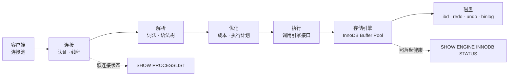
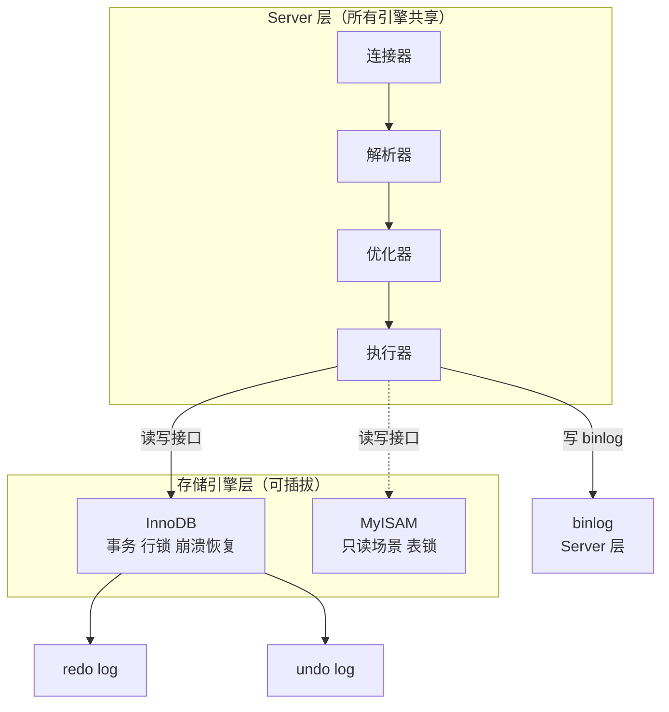
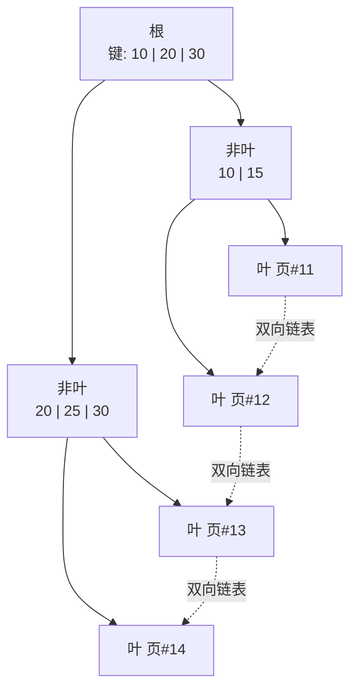
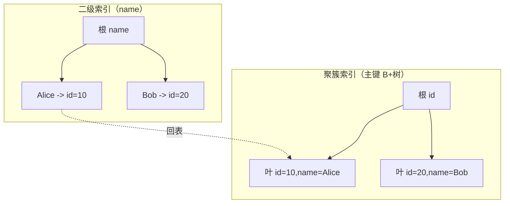
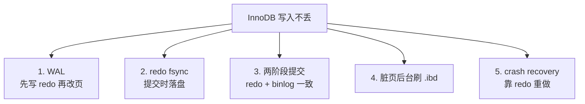
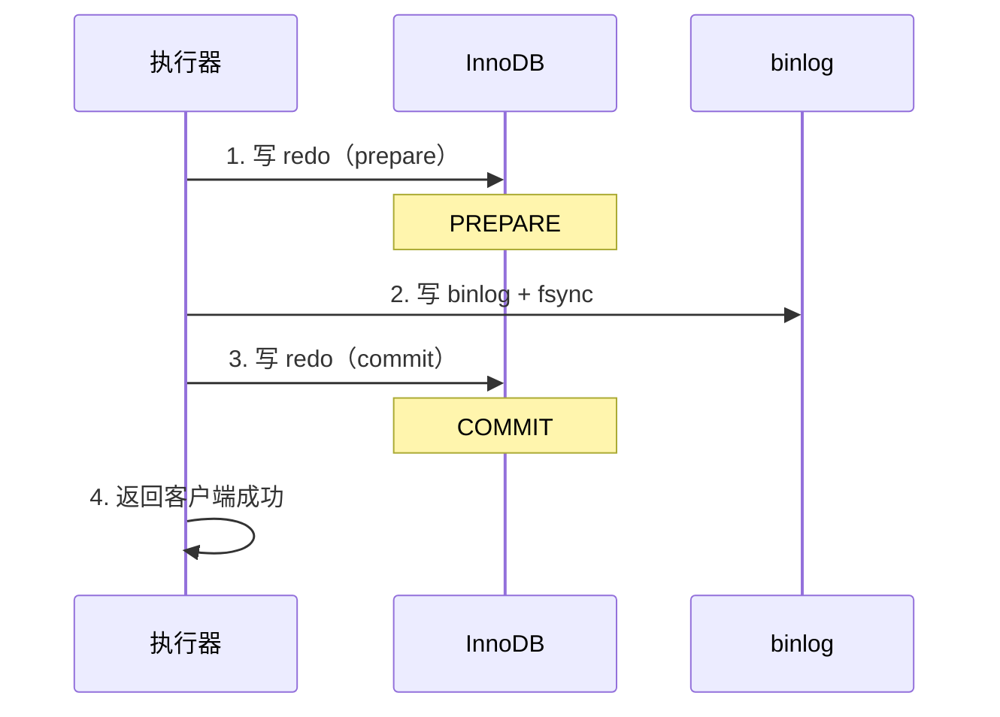
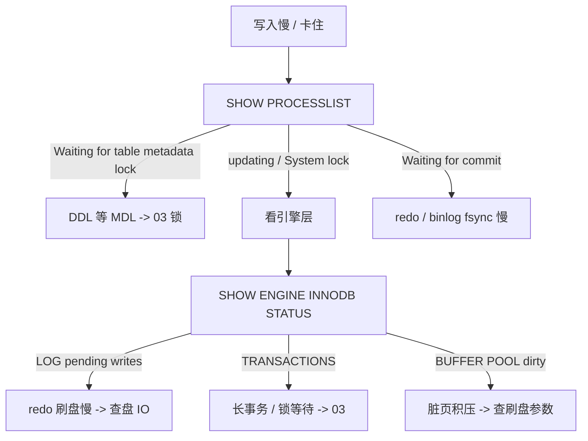

# 架构与存储引擎

> 发版后 DB CPU 飙到 100%，慢查询里全是 `UPDATE`——有人猜索引丢了，有人要扩内存，群里已经有人在敲「重启 mysqld」。`SHOW PROCESSLIST` 一排 `Updating` 卡着，根因其实是 `innodb_flush_log_at_trx_commit=1` 碰上了机械盘——每次提交都在等 fsync，盘跟不上就把整条写入链路堵死了。
> **本章回答**：一条 SQL 从进 MySQL 到落盘走完全程，每一步什么会坏、怎么一眼定位。
> **不讲**：索引调优 → [02-01-02](../02-索引与执行计划/)；事务与锁 → [02-01-03](../03-事务与锁/)；复制与高可用 → [02-01-04](../04-主从与高可用/)；备份恢复 → [02-01-05](../05-备份恢复与慢查询治理/)。

**标记**：🎯重点 · 🔥难点 · ⭐常考 · 🔧实操
---

## 一、一张图：一条 SQL 的一生

> 🎯 **一句话**：一条 SQL 过连接→解析→优化→执行→存储引擎五道关，卡在哪道关症状完全不同。



- 📖 **读图**
  - 🛤️ 主线「连接 → 解析 → 优化 → 执行 → 引擎 → 盘」；每节讲一段
  - 🚪 连接管「谁进来」；解析/优化管「对不对、怎么划算」；执行/引擎管「读写与落盘」
  - ⚔️ 值班两把刀：`SHOW PROCESSLIST` 照连接/执行态；`SHOW ENGINE INNODB STATUS` 照引擎内部

> 本节对应练习题 **Q1、Q2**。

---

## 二、连接：门口的保安与连接池

> 🎯 **一句话**：一个客户端 TCP 连接进来，先认证、再领一条线程——线程数有上限，满了就拒连。

### 🎫 一个连接的诞生 ⭐

- MySQL = **单进程多线程**：`mysqld` 一个进程，每个连接一条线程
- 进门三步：① TCP 三次握手 → ② 认证（`mysql.user` 校验账号权限）→ ③ 从 `thread_cache` 拿线程或新建

```text
客户端 --TCP--> mysqld
                 1. 认证：查 mysql.user
                 2. 分线程：thread_cache 或新建
                 3. 连接就绪，客户端发 SQL
```

> 💡 **打个比方**：餐厅验票（认证）后领服务员（线程）全程跟单——服务员人数有限，满了门口排队，空闲太久被清场（`wait_timeout`）。

```bash
mysql> SHOW VARIABLES LIKE 'max_connections';
# | max_connections | 1000 |          # ← 最多 1000 个并发连接

mysql> SHOW STATUS LIKE 'Threads_%';
# | Threads_cached    | 8     |          # ← 空闲线程缓存
# | Threads_connected | 152   |          # ← 当前连接数
# | Threads_running   | 3     |          # ← 正在执行 SQL 的（其余在等）
```

- 🔍 **读法**：`Threads_connected` 逼近 `max_connections` → 拒连；`Threads_running` 飙 → CPU 被打满的前兆

### 🏊 连接池为什么必须 ⭐

- 每个连接占线程 + 内存（sort/join/read buffer 按连接倍增）
- 短连接频繁建断 = 频繁建线程/TCP → `Threads_created` 一直涨

```bash
mysql> SHOW STATUS LIKE 'Threads_created';
# | Threads_created | 12483 |          # ← 累计创建；一直涨 = 没用池或池太小
```

- 应用侧池（HikariCP / Druid / go-sql-driver）复用连接；`thread_cache_size` 让 MySQL 复用线程——**两边都要做**

#### ❓ 为什么不直接调大 `max_connections`？

- ❌ **先调大上限**：掩盖泄漏/池过大，线程与内存一起涨，容易 OOM
- ✅ **先查谁占坑**：`SHOW PROCESSLIST` 里 `Sleep` 堆山 = 池太大或连接泄漏
- 📏 **池大小 < `max_connections`**：单应用池常见 20–50，看 QPS 与 SQL 耗时；多应用总和必须留余量

> ⚠️ **别混**：`max_connections` 是 MySQL 上限；`maxPoolSize` 是应用侧上限。一个应用把连接吃光，别的服务连不上。

### 🧹 wait_timeout：空闲连接的清道夫 🔧

```bash
mysql> SHOW VARIABLES LIKE 'wait_timeout';
# | wait_timeout | 28800 |          # ← 默认空闲 8h 才断
```

- 太长：空闲连接白占线程/内存
- 太短：池里连接被踢，应用再发 SQL → `MySQL server has gone away`
  - 池要配心跳（`SELECT 1`）或校验连接（`validationQuery`）

> 🔍 **现场**：报 `Too many connections` 先 `SHOW PROCESSLIST`，别急着调大上限。

```bash
mysql> SHOW PROCESSLIST;
# | Id | Command | Time | State    | Info             |
# |  1 | Sleep   |  120 |          | NULL             |  # ← 空闲占坑
# |  2 | Query   |   15 | updating | UPDATE player... |  # ← 执行了 15s
# |  3 | Sleep   | 7200 |          | NULL             |  # ← 空闲 2h
# ← Sleep+大 Time = 占坑；Query+大 Time = 慢 SQL
```

> ⭐ **口诀**：`Too many connections` 先查谁占坑，别先调大上限。

门口过了：SQL 文本先「读懂」，还不碰数据——解析。

> 本节对应练习题 **Q3、Q14**。

---

## 三、解析：词法语法分析与查询缓存

> 🎯 **一句话**：SQL 文本先过词法/语法变成**解析树**，再查表名列名权限——这一步不碰数据。

### 🌳 解析树是什么 ⭐

- **词法**：拆关键字、表名、列名、值
- **语法**：合法否 → 不合法直接 `ERROR 1064`
- **语义**：表/列是否存在、权限够不够

```text
SELECT name FROM player WHERE id = 1

解析树：
  SELECT_STMT
    |- select_list: [name]
    |- from: player
    +- where: id = 1
```

- 解析完只知道「要做什么」，「怎么做最划算」是优化器的事

### 🗑️ 查询缓存：8.0 已删 🔥

MySQL 5.7 及之前有 **Query Cache**：SQL 文本做 key、结果做 value。听起来美好，实际是性能杀手。

#### ❓ 为什么查询缓存要删掉？

- 🧨 **写一改，表级全失效**：对该表的任何写都清空该表缓存 → 写多场景命中率崩
- 🔒 **全局锁**：缓存互斥成瓶颈，比偶发命中更贵
- ✅ **正解**：应用层缓存（Redis / 本地）；别再指望 Server 内 SQL 结果缓存
- 📌 **8.0 已移除**；5.7 建议 `query_cache_type=OFF`

> ⚠️ **别混**：查询缓存 ≠ Redis。前者是 Server 层 SQL 级缓存（已废）；应用层走 Redis/本地。

解析完了——优化器。

> 本节对应练习题 **Q4**。

---

## 四、优化：成本估算与执行计划 ⭐🔥

> 🎯 **一句话**：优化器按统计信息选「怎么走最快」——选错了就是慢查询的根源。

同一条 SQL 昨天走索引、今天全表扫——人没改 SQL，往往是**统计信息过期**。⭐

### 🧭 优化器做什么

- **逻辑优化**：等价改写（子查询转 join、谓词下推、常量折叠）
- **物理优化**：基于**统计信息**估成本，选索引 / join 顺序 / 是否临时表
- 成本 = IO（读页数）+ CPU（处理行数）；选总成本最小的

> 💡 **打个比方**：优化器像导航——路况统计过期（久未 `ANALYZE TABLE`），就会该走高速（索引）却选小路（全表扫）。

### 📉 统计信息为什么会过期 🔧

- 存在 `mysql.innodb_table_stats` / `innodb_index_stats`：行数估算、索引基数（cardinality）
- InnoDB **采样**估算，不是精确值；大量增删改后可能严重偏差

```bash
mysql> SHOW TABLE STATUS LIKE 'player';
# | Name   | Engine | Rows    |          # ← Rows 是估算，不是 COUNT(*)
# | player | InnoDB | 9876543 |

mysql> SHOW INDEX FROM player;
# | Key_name | Column_name | Cardinality |
# | PRIMARY  | id          |    9876543  |  # ← 主键基数 ~ 行数
# | idx_name | name        |     234567  |  # ← 二级索引基数
```

- `Cardinality` 接近行数 = 选择性好（走索引划算）；很小（如性别仅 2 值）= 选择性差
- 治法：`ANALYZE TABLE player;`（大表别高峰跑）；紧急 `FORCE INDEX` 是临时手段

#### ❓ 为什么优化器会「选错」索引？

- 📊 **成本是估的**：统计过期 → 低估全表 / 高估索引 → 选错路
- 🔧 **现场**：`ANALYZE TABLE` 刷新；`EXPLAIN` 看 `key` / `rows`；根因仍是统计或索引设计
- ⚠️ **别混**：`SHOW TABLE STATUS` 的 `Rows` ≠ `COUNT(*)`——MVCC 下精确 count 很贵，别当业务数字

### 🗺️ 执行计划怎么看

详细读法见 [02-01-02](../02-索引与执行计划/)；这里先认存在：

```bash
mysql> EXPLAIN SELECT name FROM player WHERE id = 1\G
#          type: const           # ← 主键/唯一等值，最快
#           key: PRIMARY         # ← 实际走的索引
#          rows: 1               # ← 估算扫描行数
```

日常排查「为什么没走索引」可开 Optimizer Trace（5.6+）：

```bash
mysql> SET optimizer_trace='enabled=on';
mysql> SELECT name FROM player WHERE status = 1;
mysql> SELECT * FROM information_schema.OPTIMIZER_TRACE\G
# ← JSON 里能看到各候选计划成本
```

> 本节对应练习题 **Q5**。

---

## 五、执行：调用引擎接口

> 🎯 **一句话**：执行器按计划逐步调存储引擎接口——读一行调一次、写一行调一次。

⭐ 面试白板几乎必画：Server 层 vs 存储引擎层。

### 🏢 Server 层与存储引擎层 ⭐

- **Server 层**（共享）：连接 / 解析 / 优化 / 执行 / **binlog**
- **引擎层**（可插拔）：数据怎么存、怎么读、事务隔离、崩溃恢复
- 执行器经 **handler API** 调引擎；引擎换了对 Server 透明



- 📖 **读图**
  - Server 像前台：所有 SQL 先到前台，再进哪个仓库（引擎）
  - 日志两层：**binlog** 在 Server；**redo / undo** 在 InnoDB

### ⚔️ InnoDB vs MyISAM ⭐🔧

生产几乎只用 InnoDB。MyISAM 仅历史只读遗留。

| 对比 | **InnoDB** | **MyISAM** |
|------|-----------|------------|
| 事务 | ACID | 不支持 |
| 锁 | 行锁（+ 间隙锁） | 表锁 |
| 崩溃恢复 | redo 恢复 | 无，易损 |
| 索引 | 聚簇（数据=主键树） | 非聚簇（索引与数据分离） |
| 外键 | 支持 | 不支持 |

> ⚠️ **别混**：InnoDB「行锁」≠ 永远只锁一行——无索引条件更新会扫全表、行行加锁，**退化成表锁效果**。细节 → [02-01-03](../03-事务与锁/)。

```bash
mysql> SHOW ENGINES;
# | InnoDB | DEFAULT | Supports transactions, row-level locking, ...
# | MyISAM | YES     | MyISAM storage engine
```

### 🌲 B+ 树：InnoDB 的索引骨架 🔥⭐

- **B+ 树** = 矮胖目录树：数据只在**叶节点**；非叶只存键导航 → 树矮、磁盘 I/O 少
- 叶节点**双向链表**：范围查询顺着扫



- 📖 **读图**：3 层 B+ 可覆盖千万行——约 3 次磁盘 I/O 定位一行；`BETWEEN` 找到起始叶后顺着链表走

> 💡 **打个比方**：非叶像柜子标签（只写编号范围），叶像书架（真书）；过道相连 = 双向链表。

### 📎 聚簇索引与回表 🔥⭐

- **聚簇索引（Clustered Index）**：数据与主键在**同一棵** B+ 树，叶存完整行。一口诀：**数据就是索引**
- **二级索引（Secondary Index）**：叶存**主键值**，再回聚簇查完整行 = **回表（bookmark lookup）**
- **覆盖索引**：查的列全在二级索引里 → 不用回表



- 📖 **读图**：`WHERE name='Alice'` 先二级树拿 `id=10`，再聚簇树拿整行——两棵树各走一遍

#### ❓ 为什么二级索引不直接存整行？InnoDB 为何必须有主键？

- 💾 **存整行 = 每棵二级树复制全表**：写放大、空间炸
- 🔑 **只存主键**：改行数据只动聚簇树；二级树只在键值变时动
- 📌 **必须有主键**：没指定时 InnoDB 建隐藏列，空间与性能都差；MyISAM **不是**聚簇——索引平级、叶存行指针

### 📦 物理存储：页、区、段 ⭐

```text
表空间（.ibd）
  -> 段（叶子段 / 非叶子段）
       -> 区 = 64 连续页 = 1MB
            -> 页 = 16KB（最小 I/O）
                 -> 行
```

- 📖 **读图**：按段→区→页分配，不是一行一行；查询按页读，连续页连读更快

### 🧾 ACID 四件套 📝

⭐ 口诀：**undo 保 A，redo 保 D，锁 + MVCC 保 I**——C = AID + 约束的结果。

- **A 原子性** = undo 回滚；**D 持久性** = redo 恢复；**I 隔离性** = 锁 + MVCC（→ [02-01-03](../03-事务与锁/)）
- **弹性事务**（Saga / TCC）是分布式放宽方案；InnoDB 只做严格 ACID，不提供弹性事务

### ⚙️ 执行器怎么干活

```text
执行器：handler::index_read -> 引擎按主键 B+ 找叶
引擎：  返回该行（Buffer Pool 命中则不读盘）
执行器：取列 → 结果集；再 index_next → 没有则结束
```

- 关键：执行器**一行一行**调引擎；`EXPLAIN` 的 `rows` = 估算扫描行数，效率第一指标

> 📝 **面试**：Server 与引擎交互 = 执行器经 handler API 一行一行调；引擎管存储与事务，Server 管解析优化与 binlog。

> 本节对应练习题 **Q1、Q6、Q7、Q8、Q12**。

---

## 六、存储引擎：Buffer Pool 与日志 🔥⭐

> 🎯 **一句话**：Buffer Pool 缓存热页避磁盘；redo + WAL 保证崩溃不丢，并把随机写变成顺序写。

写入卡时先问：**等锁，还是等盘把 redo fsync 完？**

### 🧠 Buffer Pool：内存缓存层 ⭐

- 缓存数据页（默认 **16KB**/页）；读写都先走它
- 读：命中返回；未命中从盘读一页进来
- 写：改内存页变**脏页**，不立即刷盘——后台异步刷

```text
读：查询 -> BP 命中？ 命中返回 / 未命中读盘进 BP
写：改 BP 页（脏）-> 返回成功 -> 后台刷 .ibd
```

> 💡 **打个比方**：桌面摊着常用文件（内存）；改完先放桌上（脏页），下班再归档（刷盘）——不是每改一笔就跑档案室。

```bash
mysql> SHOW VARIABLES LIKE 'innodb_buffer_pool_size';
# | innodb_buffer_pool_size | 8589934592 |     # ← 8GB；生产常设物理内存 50-70%
```

- 太小 = 热数据不住、IO 飙；太大 = OS/连接不够，可能 OOM

### 🔥 LRU：young / old 与脏页刷盘

- 改进 LRU：**young（热）** / **old（新）**——新页先进 old，第二次访问才升 young
- 刷盘触发：脏页比例 > `innodb_max_dirty_pages_pct`（默认 75%）；redo 空间不够；正常关闭刷光

#### ❓ 为什么 Buffer Pool 要分 young / old？

- 🌊 **全表扫冲刷**：一次扫表把热页全挤走 → 之后冷启动
- 🛡️ **先进 old**：第二次访问才升 young——挡住扫表污染
- 🔍 **现场**：`Innodb_buffer_pool_pages_dirty` 与命中率一起看，别只盯 size

```bash
mysql> SHOW STATUS LIKE 'Innodb_buffer_pool_pages%';
# | Innodb_buffer_pool_pages_data  | 524288 |  # ← 数据页
# | Innodb_buffer_pool_pages_dirty | 12345  |  # ← 脏页
# | Innodb_buffer_pool_pages_free  | 0      |  # ← 0 = 用满
```

> ⚠️ **别混**：脏页刷盘慢 ≠ redo 写慢。前者把脏页写 `.ibd`；后者写 redo 文件——两路不同。

### 📝 redo log：崩溃不丢的保命符 ⭐🔥

提交保证的是 **redo 落盘**，数据页可能仍是脏页。

- **redo log** = 记「页做了什么修改」（物理日志），用于 **crash recovery**
- **WAL（Write-Ahead Logging）**：先写日志并 fsync，再慢慢刷数据页

#### ❓ 为什么不直接刷数据页？

- 🐢 **随机写贵**：脏页散落各处，每次提交刷 `.ibd` = 随机 IO 炸
- 📝 **WAL**：先顺序写 redo（快）→ 后台异步刷脏页；崩了靠 redo 重做
- 🎯 **提交保证的是 redo 落盘**，不是数据页已进 `.ibd`

```text
WAL 写入：
  1. 改 Buffer Pool 页（脏）     <- 内存，快
  2. 写 redo 到 log buffer
  3. redo fsync                   <- 崩溃不丢靠这步
  4. 返回客户端成功
  5. 脏页异步刷 .ibd              <- 后台慢慢做
```

```bash
mysql> SHOW VARIABLES LIKE 'innodb_flush_log_at_trx_commit';
# | innodb_flush_log_at_trx_commit | 1 |   # ← 每次提交 fsync（最安全）
```

| 值 | 行为 | 崩溃丢失 | 性能 |
|----|------|----------|------|
| **1** | 每次提交 fsync | 不丢 | 最慢 |
| **2** | 写 OS Page Cache，不 fsync | OS 崩丢 | 较快 |
| **0** | 每秒刷一次 | 最多丢约 1s | 最快 |

> ⚠️ **别混**：只有 `=1` 保证不丢。`0/2` 在 mysqld 进程崩时往往不丢（OS cache 还在），**机器断电/OS 崩会丢**。核心库必须 1。

### 🔁 redo log 的环形写入 🔥

- 固定大小文件组，**环形**循环写；追上 checkpoint 就强制刷脏页腾空间——常见性能抖动源

```text
file1 [##############......]  file2 [..........######..]
       ^ write pos                    ^ checkpoint
       写满追上 checkpoint -> 强制刷脏页推进 checkpoint
```

#### ❓ 为什么 redo 太小会抖、太大也不好？

- 📉 **太小**：频繁追上 checkpoint → 强制刷脏页 → 写入抖动
- 📈 **太大**：崩溃恢复要重做的日志多 → 启动慢
- ✅ **经验**：总大小容纳约 **10–30 分钟**写入量

```bash
mysql> SHOW VARIABLES LIKE 'innodb_log_file_size';
# | innodb_log_file_size | 1073741824 |   # ← 单文件 1GB
```

### ⏪ undo log：回滚与 MVCC 基础 ⭐

- 记**修改前旧值**：① 回滚恢复原值；② **MVCC** 构建历史版本（读不堵写）
- 在 **undo tablespace**；提交后不立刻删——活跃读还可能要用，无事务需要时由 **purge** 清理
- 细节 → [02-01-03](../03-事务与锁/)

```text
UPDATE ... SET name='新名'
undo：{ id=1, name='旧名' }              <- 旧值
redo：{ page, offset, new='新名' }       <- 物理修改
BP：页内 name 已改（脏）
```

### 收束：一次写入凭什么不丢 🎯⭐



- 📖 **读图**
  - ①② =「不怕崩」；③④⑤ =「崩了能恢复到已提交」
  - 未提交靠 undo 回滚——redo **不保证**未提交不丢

> ⚠️ **别混**：`flush_log_at_trx_commit=1` 只保证「已提交」这个动作不丢，**不是**每改一字节立刻进 `.ibd`。

> 📝 **面试**：不怕崩 = WAL + fsync；崩了能恢复 = 2PC + crash recovery。补一句「redo 保已提交，undo 保未提交能回滚」。

> 本节对应练习题 **Q9、Q10**。

---

## 七、两阶段提交：redo log 与 binlog 的一致性 🔥⭐

> 🎯 **一句话**：redo（引擎）与 binlog（Server）用两阶段提交对齐——任何时刻崩都能恢复到一致状态。

若先写完 redo 再写 binlog 中间崩：主库靠 redo 有变更，从库靠 binlog 少变更 → **主从不一致**。

### 📜 binlog 是什么 ⭐

- Server 层逻辑日志：记已提交的 DDL/DML
- 用途：① 主从复制（→ [02-01-04](../04-主从与高可用/)）；② PITR（`mysqlbinlog`）

```bash
mysql> SHOW VARIABLES LIKE 'log_bin';
# | log_bin | ON |          # ← 生产必须开

mysql> SHOW VARIABLES LIKE 'binlog_format';
# | binlog_format | ROW |   # ← 生产建议 ROW
```

| 格式 | 记什么 | 取舍 |
|------|--------|------|
| **ROW** | 行变更前后值 | 精确、安全；日志大 |
| **STATEMENT** | SQL 原文 | 小；`NOW()`/`UUID()` 复制可能不一致 |
| **MIXED** | 自动选 | 折中 |

> ⚠️ **别混**：**redo = 物理日志（引擎）**；**binlog = 逻辑日志（Server）**——不同层、不同内容、不同用途。

### 🤝 两阶段提交（2PC）🔥

#### ❓ 为什么不能「写完 redo 就算提交」？

- 👻 **一阶段撕裂**：redo 有、binlog 无 → 主库恢复有，从库永远收不到
- ✅ **prepare → binlog → commit**：崩了看 binlog 齐不齐——齐则补提交，不齐则回滚
- ⚠️ **这是单机两本日志对齐**，不是分布式事务协议本身



- 📖 **读图**
  - ① Prepare；②③ Commit。崩溃恢复：
    - redo=**commit** → 已提交，恢复即可
    - redo=**prepare** + binlog 完整 → **补提交**（以 binlog 为准）
    - redo=**prepare** + binlog 无 → **回滚**

> 💡 **打个比方**：合同要盖两章——先盖公司章（prepare），再盖合同章（binlog），回来签字确认（commit）。合同章盖了就认；没盖就撕掉。

> 📝 **面试**：2PC 保证 redo/binlog 一致——崩后以 binlog 是否完整决定提交或回滚，避免主从撕裂。

```bash
mysql> SHOW VARIABLES LIKE 'sync_binlog';
# | sync_binlog | 1 |          # ← 每次提交 fsync binlog
```

- **双 1** = `innodb_flush_log_at_trx_commit=1` + `sync_binlog=1`：核心库标配，已提交任何崩溃不丢；代价是每次提交两次 fsync
- ⭐ 口诀：双 1 = 两次 fsync 换「已提交绝不丢」；核心库别为了性能先动这两闸

> 本节对应练习题 **Q11**。

---

## 八、作战：写入卡住怎么定责

> 🎯 **一句话**：先看 `PROCESSLIST` 的 State，再看 `INNODB STATUS` 的日志与锁——三步定位卡在哪层。

**先定责，再动手**——别先重启、别先改 `flush_log_at_trx_commit=0`。

### 🌳 定责决策树



- 📖 **读图**
  - 第一刀 State：`Waiting*` 多半锁/等待（→ [02-01-03](../03-事务与锁/)）；`updating` = 引擎层；`Waiting for commit` = 日志刷盘
  - 第二刀 STATUS：LOG 看 redo、TRANSACTIONS 看锁、BUFFER POOL 看脏页

### 现象 · 先做 · 别做

| 现象 | 先做 | 别做 |
|------|------|------|
| 大量 Updating | `INNODB STATUS` 看锁 | 先重启 |
| 提交慢（Waiting for commit） | `iostat` 查盘 | 调大 buffer_pool |
| Too many connections | `PROCESSLIST` 找空闲 | 直接调大 max_connections |
| CPU 100% | `PROCESSLIST` 找慢 SQL | 先扩 CPU |
| redo 写满抖动 | 查 `innodb_log_file_size` | 关 flush_log_at_trx_commit |

### 60 秒剧本 🔧

> 🔍 **现场**：接到「DB 写入慢、业务超时」，60 秒走完。

```text
1. 0-10s   SHOW PROCESSLIST;              -> State、条数
2. 10-30s  SHOW ENGINE INNODB STATUS\G   -> LOG / TRANSACTIONS
3. 30-45s  iostat -x 1 3;                -> %util / await
4. 45-60s  定型：锁等待（→03）/ fsync 慢（查盘）/ 脏页积压
```

> 本节对应练习题 **Q13**。

---

## 九、收口

### 命令速查 🔧

```bash
# 连接
SHOW PROCESSLIST;
SHOW STATUS LIKE 'Threads_%';
SHOW STATUS LIKE 'Threads_created';
# 引擎
SHOW ENGINES;
SHOW TABLE STATUS LIKE 'player';
SHOW ENGINE INNODB STATUS\G
# 关键参数
SHOW VARIABLES LIKE 'innodb_buffer_pool_size';
SHOW VARIABLES LIKE 'innodb_flush_log_at_trx_commit';
SHOW VARIABLES LIKE 'innodb_log_file_size';
SHOW VARIABLES LIKE 'sync_binlog';
SHOW VARIABLES LIKE 'max_connections';
# 统计 / 盘
ANALYZE TABLE player;
SHOW INDEX FROM player;
iostat -x 1 3 /dev/nvme0n1
```

### 面试锚点

| 问 | 30 秒答 |
|----|---------|
| MySQL 架构分几层？ | Server（连接/解析/优化/执行/binlog）+ 可插拔引擎（InnoDB 管 redo/undo/BP）。 |
| InnoDB vs MyISAM？ | InnoDB：事务/行锁/崩溃恢复/聚簇；MyISAM：无事务、表锁。生产用 InnoDB。 |
| 一条 SQL 怎么执行？ | 连接→解析→优化→执行（调引擎）→引擎（BP/日志）。 |
| Buffer Pool？ | 内存缓存数据页；读写先走它；脏页异步刷；生产 50–70% 物理内存。 |
| redo / WAL？ | 物理日志；WAL 先写日志再改页；崩溃靠 redo 重做已提交。 |
| flush_log_at_trx_commit？ | 1=每次 fsync；2=OS Cache；0=每秒。核心库必须 1。 |
| undo？ | 旧值；回滚 + MVCC。 |
| binlog？ | Server 逻辑日志；复制 + PITR；生产 ROW。 |
| redo vs binlog？ | 物理/引擎 vs 逻辑/Server；崩溃恢复 vs 复制恢复。 |
| 两阶段提交？ | prepare→binlog→commit；以 binlog 是否完整决定提交或回滚。 |
| 双 1？ | flush=1 + sync_binlog=1，已提交任何崩溃不丢。 |
| 查询缓存为何删？ | 写失效频繁 + 全局锁；8.0 移除。 |
| 优化器选错？ | `ANALYZE TABLE`；紧急 `FORCE INDEX`；根因统计过期。 |
| max_connections？ | 生产常 500–2000；池大小 < 上限。 |
| Threads_created 涨？ | 没用连接池或 thread_cache 太小。 |

### 易错一句话对照

- InnoDB 行锁不会锁全表 → 无索引条件更新会退化成表锁效果
- Buffer Pool 越大越好 → 太大 OOM，约 50–70% 物理内存
- redo 保证所有修改不丢 → 只保已提交；未提交靠 undo 回滚
- flush=0 不丢 → 进程崩往往不丢，OS 崩/断电丢
- redo 和 binlog 是一个东西 → 物理 vs 逻辑、引擎 vs Server
- binlog 记所有操作 → 只记已提交
- 两阶段是为了性能 → 为了 redo/binlog 一致
- `SHOW TABLE STATUS` 的 Rows 精确 → 估算值，不是 COUNT(*)
- 查询缓存能加速 → 已废弃，写场景全局锁瓶颈
- 优化器一定最优 → 基于估算，统计过期会选错
- MyISAM 比 InnoDB 快 → 仅特定只读；缺事务与崩溃恢复
- max_connections 越大越好 → 每连接占线程内存，太大 OOM
- 二级索引叶存整行更好 → 会复制全表；只存主键 + 回表才划算
- 卡住就重启 / 关 flush=1 → 先定责：锁？盘？脏页？

### 数字墙

> Buffer Pool 物理内存 **50–70%** · 页 **16KB** · `max_connections` 生产 **500–2000** · `wait_timeout` 默认 **28800s（8h）** · redo 刷盘 **1/2/0** · `sync_binlog` **1** · 双 1 = `flush=1` + `sync_binlog=1` · `innodb_max_dirty_pages_pct` 默认 **75%** · binlog 生产 **ROW** · LRU young/old 防扫表冲刷 · redo 建议容纳 **10–30 分钟**写入 · 区 **64 页 = 1MB**

---

## 合上书

对着第一节主图口述一遍，卡住就回对应小节。

- [ ] **默画一节的图**：客户端→连接→解析→优化→执行→引擎→盘；日志两层（redo/undo 引擎 + binlog Server）。（Q1、Q2）
- [ ] **口述连接**：诞生三步、连接池为何必须、`wait_timeout` 坑、`Too many connections` 先查占坑。（Q3、Q14）
- [ ] **口述解析与优化**：解析树、查询缓存为何删、成本估算、统计过期、选错索引怎么办。（Q4、Q5）
- [ ] **口述执行**：Server vs 引擎、handler 一行一行调。（Q1）
- [ ] **默画 InnoDB vs MyISAM**：事务/锁/崩溃恢复/聚簇；生产为何只用 InnoDB。（Q6）
- [ ] **默画 B+ 与聚簇**：根→非叶→叶+链表；聚簇存整行、二级存主键、回表、覆盖索引。（Q7）
- [ ] **口述物理存储**：页 16KB、区 1MB、段、表空间。（Q8）
- [ ] **默画 BP 写路径**：改脏页→写 redo→fsync→返回→后台刷；WAL 含义。（Q9）
- [ ] **口述 redo / undo**：物理日志/WAL/环形/三个刷盘值；undo 旧值/回滚+MVCC/purge。（Q9、Q10、Q12）
- [ ] **默画 2PC 与 binlog**：prepare→binlog→commit；崩溃三种情况；ROW/sync_binlog/双 1。（Q11）
- [ ] **口述 ACID**：A=undo、C=约束+AID、I=锁+MVCC、D=redo；弹性事务 InnoDB 不提供。（Q12）
- [ ] **定责**：先 `PROCESSLIST` State，再 `INNODB STATUS`；再看开篇「重启 mysqld」，你知道怎么拦住他了。（Q13）

下一章：[02-01-02](../02-索引与执行计划/)。
