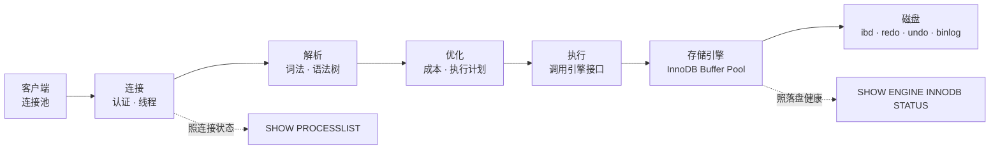
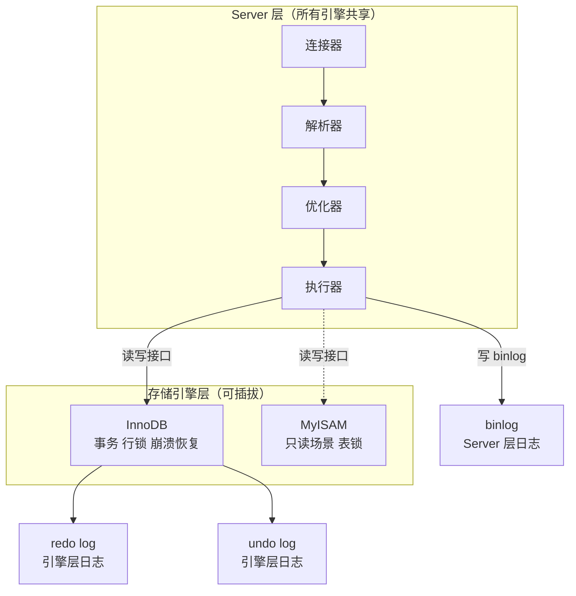
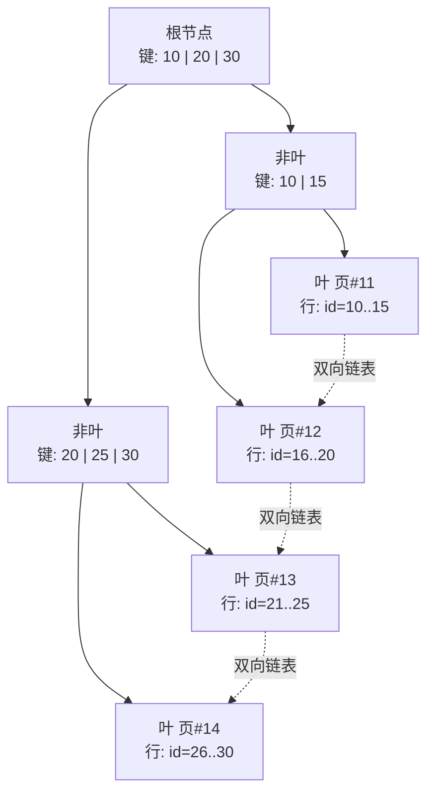
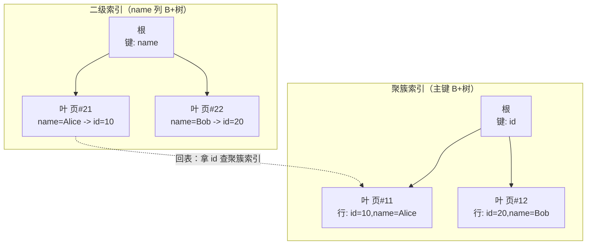
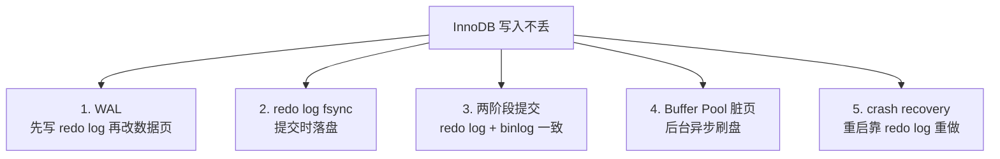
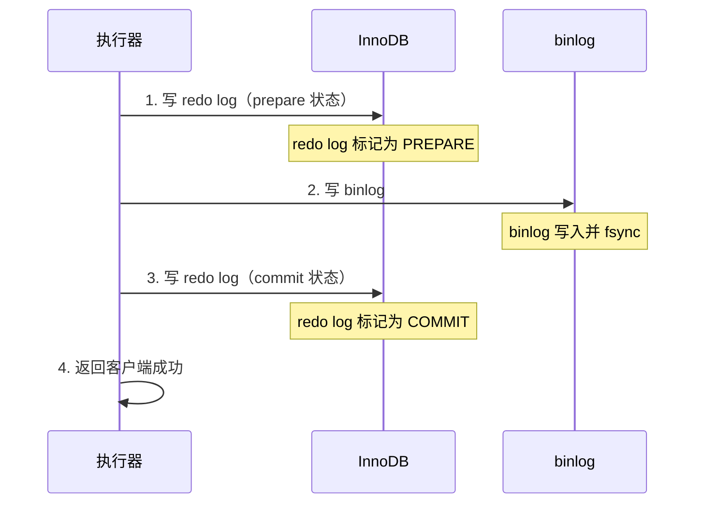
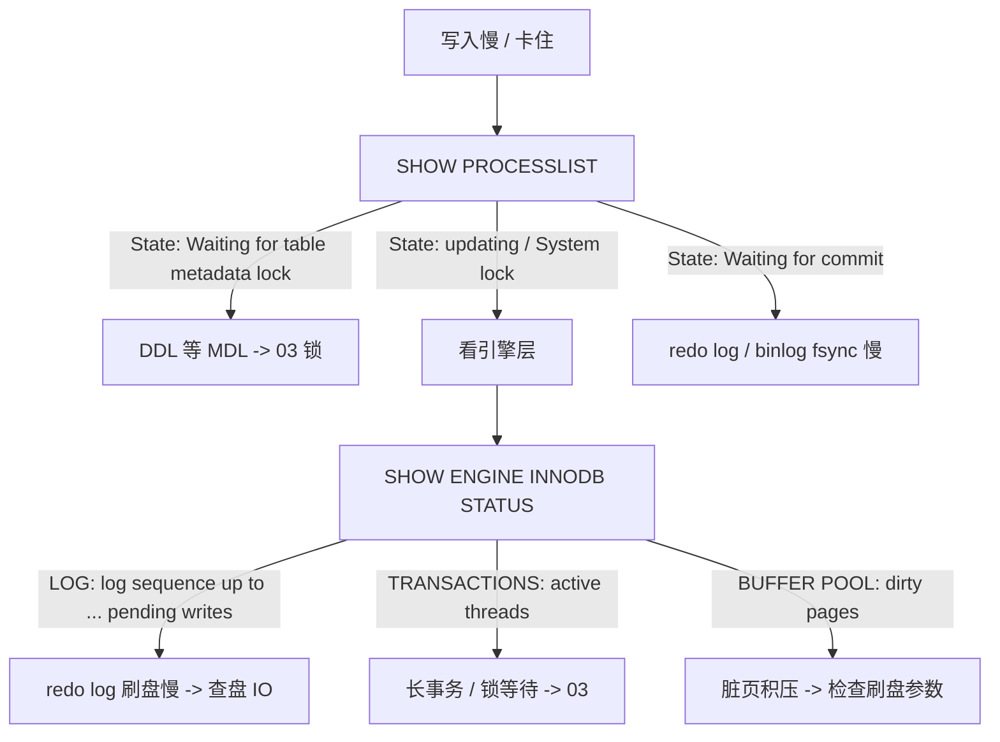

# 架构与存储引擎

> 发版后 DB CPU 飙到 100%，慢查询里全是 `UPDATE`——有人猜是索引丢了，有人要扩内存，但 `SHOW PROCESSLIST` 一排 `Updating` 卡着，根因是 `innodb_flush_log_at_trx_commit=1` 碰上机械盘。
> **本章回答**：一条 SQL 从进 MySQL 到落盘走完全程，每一步什么会坏、怎么一眼定位。
> **不讲**：索引调优 → [02-01-02](../02-索引与执行计划/)；事务与锁 → [02-01-03](../03-事务与锁/)；复制与高可用 → [02-01-04](../04-主从与高可用/)；备份恢复 → [02-01-05](../05-备份恢复与慢查询治理/)。

**标记**：🎯重点 · 🔥难点 · ⭐常考 · 🔧实操

---

## 一、一张图：一条 SQL 的一生

> 🎯 **一句话**：一条 SQL 从连接进来、到数据落盘，要过连接→解析→优化→执行→存储引擎五道关，卡在哪道关症状完全不同。



**读图**：

- 主线是一条 SQL 的旅程，五道关串成一条流水线，每节讲一段。
- 连接管「谁进来、进来几个」；解析和优化管「SQL 对不对、怎么执行最划算」；执行和存储引擎管「数据怎么读写、怎么落盘」。
- 值班两把刀：`SHOW PROCESSLIST` 照连接段和执行段的状态，`SHOW ENGINE INNODB STATUS` 照存储引擎的内部状态。

---

## 二、连接：门口的保安与连接池

> 🎯 **一句话**：MySQL 是一个 `mysqld` 进程，客户端连进来先认证、拿一个线程为你服务——线程数有上限，满了就拒连。

### 一个连接的诞生 ⭐

MySQL 是单进程多线程模型。一个客户端 TCP 连接进来，`mysqld` 做三件事：① 三次握手建 TCP 连接；② 认证（用户名/密码/权限）；③ 分一个**线程**给这个连接，后续这个连接的所有 SQL 都在这条线程里执行。

```text
客户端 --TCP 三次握手--> mysqld
                        1. 认证：查 mysql.user 表，校验密码+权限
                        2. 分线程：从 thread_cache 或新建一条线程
                        3. 连接建立，客户端发 SQL
```

> 💡 **打个比方**：MySQL 像一家餐厅，每个客人进门先验票（认证），然后领一个服务员（线程）全程跟着你点菜——服务员人数有限，满了门口排队（`wait_timeout` 后踢掉）。

```bash
mysql> SHOW VARIABLES LIKE 'max_connections';
# +-----------------+-------+
# | Variable_name   | Value |
# | max_connections | 1000  |          # ← 最多 1000 个并发连接
# +-----------------+-------+

mysql> SHOW STATUS LIKE 'Threads_%';
# +-------------------+-------+
# | Threads_cached    | 8     |          # ← 空闲线程缓存，复用避免频繁创建
# | Threads_connected | 152   |          # ← 当前活跃连接数
# | Threads_running   | 3     |          # ← 正在执行 SQL 的线程数（其余在等）
# +-------------------+-------+
```

**读法**：`Threads_connected` 接近 `max_connections` 就要拒连了；`Threads_running` 大 = 很多线程同时在干活 = CPU 被打满的前兆。

### 连接池为什么必须 ⭐

每个连接占一条线程、占内存（默认 sort buffer / join buffer / read buffer 按连接数倍增）。短连接频繁建断 = 频繁建线程/TCP 握手 → `Threads_created` 飙升。

```bash
mysql> SHOW STATUS LIKE 'Threads_created';
# +-------------------+-------+
# | Threads_created   | 12483 |          # ← 累计创建线程数；一直涨 = 没用连接池或池太小
# +-------------------+-------+
```

应用侧用连接池（HikariCP / Druid / go-sql-driver）复用连接，`thread_cache_size` 开着让 MySQL 复用线程——两边都要做。

> ⚠️ **别混**：`max_connections` 是 MySQL 的上限，连接池的 `maxPoolSize` 是应用侧上限。**连接池大小要 < `max_connections`**，否则一个应用就把 MySQL 连接吃光，别的服务连不上。生产经验：单应用池大小 20-50，看 QPS 和 SQL 耗时。

### wait_timeout：空闲连接的清道夫 🔧

```bash
mysql> SHOW VARIABLES LIKE 'wait_timeout';
# +---------------+-------+
# | wait_timeout  | 28800 |          # ← 空闲 8 小时才断开（默认 28800s = 8h）
# +---------------+-------+
```

空闲连接 8 小时不断，浪费线程和内存。但**调太短也有坑**：连接池里的空闲连接被 MySQL 踢掉，应用不知情再发 SQL 就报 `MySQL server has gone away`。连接池要配**心跳检测**（如 `SELECT 1` 定期探活）或**校验连接**（`validationQuery`）。

> 🔍 **现场**：报 `Too many connections` 先看 `SHOW PROCESSLIST`，别急着调大 `max_connections`。

```bash
mysql> SHOW PROCESSLIST;
# +----+------+-----------+------+---------+------+----------+------------------+
# | Id | User | Host      | db   | Command | Time | State    | Info             |
# +----+------+-----------+------+---------+------+----------+------------------+
# |  1 | app  | 10.0.0.5  | game | Sleep   |  120 |          | NULL             |  # ← 空闲连接
# |  2 | app  | 10.0.0.5  | game | Query   |   15 | updating | UPDATE player... |  # ← 执行了 15s
# |  3 | app  | 10.0.0.6  | game | Sleep   | 7200 |          | NULL             |  # ← 空闲 2 小时
# +----+------+-----------+------+---------+------+----------+------------------+
# ← Time 列是当前状态持续时间；Sleep+大 Time = 空闲占坑；Query+大 Time = 慢 SQL
```

---

## 三、解析：词法语法分析与查询缓存

> 🎯 **一句话**：SQL 文本先过词法语法解析变成**解析树**，再检查表名/列名存不存在、权限够不够——这一步不碰数据。

### 解析树是什么 ⭐

MySQL 把 SQL 文本按 MySQL 语法规则拆成一棵**解析树（parse tree）**。这一步做三件事：

- **词法分析**：拆出关键字、表名、列名、值。
- **语法分析**：检查 SQL 语法是否合法，不合法直接 `ERROR 1064`。
- **语义检查**：表存不存在、列存不存在、用户有没有权限。

```text
SELECT name FROM player WHERE id = 1

解析树：
  SELECT_STMT
    |- select_list: [name]
    |- from: player
    +- where: id = 1
```

解析完成后 MySQL 知道「你要做什么」，但还不知道「怎么做最划算」——那是优化器的事。

### 查询缓存：8.0 已删 🔥

MySQL 5.7 及之前有个 **查询缓存（Query Cache）**：SQL 文本做 key、结果做 value，命中直接返回。听起来美好，实际是性能杀手：

- 任何对表的写操作都让该表所有缓存失效——高并发写场景缓存命中率极低。
- 加锁粒度粗，查询缓存的锁成为全局瓶颈。
- **MySQL 8.0 已移除 Query Cache**，5.7 建议关闭（`query_cache_type=OFF`）。

> ⚠️ **别混**：查询缓存 ≠ Redis 缓存。MySQL 查询缓存是 Server 层的 SQL 级缓存，已废弃；应用层缓存走 Redis 或本地缓存，不要混为一谈。

---

## 四、优化：成本估算与执行计划 ⭐🔥

> 🎯 **一句话**：优化器基于统计信息选「怎么走最快」——走索引还是全表扫描、join 哪张表先——选错了就是慢查询的根源。

### 优化器做什么

优化器（Optimizer）拿到解析树后，做两件事：

- **逻辑优化**：等价改写 SQL（子查询转 join、谓词下推、常量折叠）。
- **物理优化**：基于**统计信息**估算成本，选执行计划——走哪个索引、join 顺序、是否用临时表。

成本 = **IO 成本**（读页数 × 读一页的代价）+ **CPU 成本**（处理行数 × 处理一行的代价）。优化器选总成本最小的方案。

> 💡 **打个比方**：优化器像导航软件——它根据路况统计信息（索引基数、表行数）选路线，如果统计信息过期（长时间没 `ANALYZE TABLE`），就会选错路——本来该走高速（索引），却选了小路（全表扫描）。

### 统计信息为什么会过期 🔧

MySQL 的统计信息存在 `mysql.innodb_table_stats` 和 `innodb_index_stats` 里，记录每张表大概多少行、每个索引的基数（cardinality）。InnoDB 通过**采样**估算，不是精确值——而且只在元数据变更时自动更新，大量增删改后可能严重偏差。

```bash
mysql> SHOW TABLE STATUS LIKE 'player';
# +--------+--------+---------+------------+
# | Name   | Engine | Rows    |Data_length |
# | player | InnoDB | 9876543 | 2147483648 |       # ← Rows 是估算值，不是精确 count(*)
# +--------+--------+---------+------------+

mysql> SHOW INDEX FROM player;
# +--------+------------+----------+-------------+-------------+
# | Table  | Non_unique | Key_name | Column_name | Cardinality |
# | player |          0 | PRIMARY  | id          |    9876543  |  # ← 主键基数 ~ 行数
# | player |          1 | idx_name | name        |     234567  |  # ← 二级索引基数
# +--------+------------+----------+-------------+-------------+
```

**读法**：`Cardinality` 接近行数 = 选择性好（走索引划算）；`Cardinality` 很小（比如性别列只有 2）= 选择性差（优化器会放弃索引走全表）。**统计信息过期 → 优化器选错索引**，这是慢查询最常见的根因之一。

```bash
mysql> ANALYZE TABLE player;     # ← 手动刷新统计信息，大表别在高峰跑
```

> ⚠️ **别混**：`SHOW TABLE STATUS` 的 `Rows` 是**估算值**，不是 `SELECT COUNT(*)` 的精确值——InnoDB 的 MVCC 下精确 count 很贵，不要拿这个数字做业务判断。

### 执行计划怎么看

优化器的输出是**执行计划（Execution Plan）**，用 `EXPLAIN` 查看。执行计划的详细读法见 [02-01-02](../02-索引与执行计划/)，这里先知道它存在、它决定了 SQL 怎么执行：

```bash
mysql> EXPLAIN SELECT name FROM player WHERE id = 1\G
#            id: 1
#   select_type: SIMPLE
#         table: player
#          type: const           # ← 访问类型：const = 主键/唯一索引等值，最快
# possible_keys: PRIMARY
#           key: PRIMARY         # ← 实际走的索引
#         rows: 1               # ← 估算扫描行数
#        Extra: NULL
```

优化器选错索引的现场治法：`ANALYZE TABLE` 刷新统计信息；紧急时用 `FORCE INDEX(idx_xxx)` 强制指定索引——但这是临时手段，根因还是统计信息过期或索引设计不合理。

### Optimizer Trace（一句）

MySQL 5.6+ 有 **Optimizer Trace**，记录优化器估算成本的完整过程，用于分析「为什么没走索引」：

```bash
mysql> SET optimizer_trace='enabled=on';
mysql> SELECT name FROM player WHERE status = 1;
mysql> SELECT * FROM information_schema.OPTIMIZER_TRACE\G
# ← 输出 JSON，能看到每个候选计划的估算成本，找出优化器为什么选了全表扫描
```

日常不用，排查「优化器选错索引」时才开。

---

## 五、执行：调用引擎接口

> 🎯 **一句话**：执行器按执行计划逐步调用存储引擎的接口——读一行调一次、写一行调一次，引擎干完返回，执行器再处理下一行。

### Server 层与存储引擎层的分工 ⭐

MySQL 架构的精髓是 **Server 层 + 可插拔存储引擎（Pluggable Storage Engine）**。Server 层管连接/解析/优化/执行/日志；存储引擎管数据怎么存、怎么读、事务怎么隔离、崩溃怎么恢复。



**读图**：

- Server 层像公司前台——不管数据在哪个仓库（引擎），所有 SQL 都先到前台。
- 执行器通过统一接口（handler API）调用引擎，引擎换了对 Server 层透明。
- 日志分两层：**binlog** 在 Server 层（所有引擎共用），**redo log / undo log** 在 InnoDB 引擎层。

### InnoDB vs MyISAM ⭐🔧

生产几乎只用 InnoDB。MyISAM 在 5.5 之前是默认引擎，现在只在历史遗留的只读场景才会碰到。

| 对比 | **InnoDB** | **MyISAM** |
|------|-----------|------------|
| 事务 | 支持 ACID | 不支持 |
| 锁粒度 | 行锁（+ 间隙锁） | 表锁 |
| 崩溃恢复 | redo log 恢复 | 无，损坏概率高 |
| 聚簇索引 | 数据按主键聚簇存储 | 非聚簇（索引和数据分离） |
| 外键 | 支持 | 不支持 |
| 全文索引 | 5.6+ 支持 | 支持 |

> ⚠️ **别混**：InnoDB 的行锁不是「只锁一行」——在没有索引的列上做条件更新，InnoDB 会退化成**表锁**（因为找不到索引，只能扫全表，每行都要锁）。这是「明明用了 InnoDB 却锁全表」的常见原因。锁的细节见 [02-01-03](../03-事务与锁/)。

```bash
mysql> SHOW ENGINES;
# +--------+---------+-----------------------------------------------------+
# | Engine | Support | Comment                                             |
# +--------+---------+-----------------------------------------------------+
# | InnoDB | DEFAULT | Supports transactions, row-level locking, ...       |
# | MyISAM | YES     | MyISAM storage engine                               |
# | MEMORY | YES     | Hash based, stored in memory, useful for temp ...  |
# +--------+---------+-----------------------------------------------------+
```

### B+ 树：InnoDB 的索引骨架 🔥⭐

InnoDB 用 **B+ 树（B+ Tree）** 组织索引和数据。B+ 树的核心特征：**数据只在叶节点**，非叶节点只存索引键用于导航——非叶节点能塞更多键、树更矮、磁盘 I/O 更少。叶节点之间有**双向链表**相连，范围查询顺着链表扫即可。



**读图**：根节点和非叶节点只存键值（导航用），叶节点存实际行数据。一棵 3 层 B+ 树可以覆盖千万级行——3 次磁盘 I/O 定位任意一行。范围查询 `WHERE id BETWEEN 10 AND 25` 找到起始叶节点后顺着链表扫。

> 💡 **打个比方**：B+ 树像图书馆目录柜——非叶节点是柜子标签（只写编号范围不存书），叶节点是书架（存真正的书）。标签帮你快速定位书架，书架间有过道相连（双向链表），范围查找顺着过道走。

### 聚簇索引与回表 🔥⭐

**聚簇索引（Clustered Index）**：数据和主键索引在**同一棵 B+ 树**里，叶节点直接存完整行数据。一张表只有一个聚簇索引（主键索引）。

**二级索引（Secondary Index）**：叶节点不存完整行，而是存**主键值**。查到主键值后要回聚簇索引查完整行——这个动作叫**回表（bookmark lookup）**。



**读图**：二级索引的叶节点只存 `name -> id` 映射。查 `WHERE name='Alice'` 先在二级索引树找到 `Alice -> id=10`，再拿 `id=10` 去聚簇索引树查完整行——两棵树各走一遍。如果查的列刚好在二级索引里（如 `SELECT id WHERE name='Alice'`），就不用回表，这叫**覆盖索引（Covering Index）**。

> ⚠️ **别混**：MyISAM **不是聚簇索引**——数据和索引分开存，所有索引平级，叶节点存行指针。只有 InnoDB 才有聚簇索引。这也是 InnoDB 表必须有主键的原因：没指定主键 InnoDB 会自动建隐藏列，性能和空间都差。

### 物理存储：页、区、段 ⭐

InnoDB 数据在磁盘上按**页（page）**组织，这是最小 I/O 单位：

- **页（page）**：默认 **16KB**，InnoDB 读写的最小单位。一次磁盘 I/O 至少读一页。
- **区（extent）**：连续 **64 个页 = 1MB**。按区分配空间让范围扫描更快。
- **段（segment）**：区的集合。一个索引有**叶子段**（存叶节点页）和**非叶子段**（存非叶节点页）。
- **表空间（tablespace）**：段的容器，InnoDB 数据存在 `.ibd` 表空间文件里。

```text
表空间（tablespace）
  -> 段（segment）
       -> 叶子段    存 B+ 树叶节点（聚簇索引 = 数据行）
       -> 非叶子段  存 B+ 树非叶节点（导航节点）
            -> 区（extent）= 64 个连续页 = 1MB
                 -> 页（page）= 16KB（最小 I/O 单位）
                      -> 行（row）= 实际数据
```

**读图**：从上到下逐级细分。InnoDB 按段到区到页分配空间，不是一行一行分配。查询也按页读——命中一页就拿到该页所有行，连续页连读效率高。

### ACID 四件套与弹性事务 📝

**ACID** 是事务的四个保证：**A（原子性）**= undo log 回滚；**C（一致性）**= AID + 约束共同保证；**I（隔离性）**= 锁 + MVCC；**D（持久性）**= redo log 恢复。口诀：**undo 保 A，redo 保 D，锁 + MVCC 保 I**。隔离级别细节见 [02-01-03](../03-事务与锁/)。

**弹性事务（elastic transaction）**是分布式数据库场景下放宽一致性的方案（Saga、TCC），换取可用性和扩展性。InnoDB 只做严格 ACID，不提供弹性事务。

### 执行器的工作方式

执行器拿到执行计划后，按计划逐步调用引擎接口。以 `SELECT name FROM player WHERE id = 1` 为例：

```text
执行器：调 handler::index_read -> 引擎按主键 B+ 树找到叶子节点
引擎：  返回 id=1 的这一行（还在 Buffer Pool 里就不用读磁盘）
执行器：判断行数据是否符合 WHERE（引擎已过滤，这步通常跳过）
执行器：取 name 列的值，加入结果集
执行器：调 handler::index_next 看还有没有 -> 引擎说没了 -> 结束
```

**关键点**：执行器是「一行一行」调引擎的——即使优化器估算要扫 100 万行，执行器也只是循环调 100 万次引擎接口。所以 `rows` 列（估算扫描行数）是判断 SQL 效率的最直接指标。

> 📝 **面试**：问「Server 层和引擎层怎么交互」，答「执行器通过 handler API 一行一行地调用引擎——读一行、判断一行、返回一行；引擎管数据存储和事务，Server 管解析优化和 binlog。」

---

## 六、存储引擎：Buffer Pool 与日志 🔥⭐

> 🎯 **一句话**：InnoDB 靠 Buffer Pool 缓存热数据避免每次读磁盘、靠 redo log 保证崩溃不丢、靠 WAL（先写日志再写数据）把随机写变顺序写。

### Buffer Pool：内存里的缓存层 ⭐

**Buffer Pool** 是 InnoDB 在内存中开辟的一块区域，缓存数据页（data page，默认 16KB/页）。所有读写都先走 Buffer Pool：读时先查 Buffer Pool，命中直接返回，未命中才从磁盘读一页进来；写时先改 Buffer Pool 里的页（变成**脏页**），不立即写磁盘。

```text
读路径：  查询 -> Buffer Pool 命中？ -> 命中：返回
                                -> 未命中：从磁盘读一页进 Buffer Pool，再返回

写路径：  写入 -> 改 Buffer Pool 中的页（变脏页）-> 返回成功
              -> 脏页由后台线程异步刷盘（不是写完立即刷）
```

> 💡 **打个比方**：Buffer Pool 像你的桌面——常用的文件摊在桌上（内存），用完先放桌上不急着归档（脏页）；归档（刷盘）是下班前打扫卫生的活，不是每改一笔就跑一次档案室（磁盘）。

Buffer Pool 大小是 InnoDB 性能最关键的参数：

```bash
mysql> SHOW VARIABLES LIKE 'innodb_buffer_pool_size';
# +-------------------------+------------+
# | Variable_name           | Value      |
# | innodb_buffer_pool_size | 8589934592 |     # ← 8GB；生产一般设为物理内存 50-70%
# +-------------------------+------------+
```

**经验值**：专用 MySQL 服务器设物理内存的 **50-70%**。太小 = 缓存不住热数据、磁盘 IO 飙升；太大 = 给 OS 和连接留不够内存，可能 OOM。

### Buffer Pool 的 LRU 与脏页刷盘 🔥

InnoDB 的 LRU 链表做了改进：分 **young 区（热数据）** 和 **old 区（新数据）**，新读入的页先进 old 区，只有被第二次访问才升到 young 区——防止全表扫描一次性把热数据全冲走。

脏页刷盘由后台线程负责，触发条件：① 脏页比例超过 `innodb_max_dirty_pages_pct`（默认 75%）；② redo log 空间不够（见下节）；③ MySQL 正常关闭时刷所有脏页。

```bash
mysql> SHOW VARIABLES LIKE 'innodb_max_dirty_pages_pct';
# +--------------------------------+-------+
# | Variable_name                  | Value |
# | innodb_max_dirty_pages_pct     | 75    |   # ← 脏页超 75% 加速刷盘
# +--------------------------------+-------+

mysql> SHOW STATUS LIKE 'Innodb_buffer_pool_pages%';
# +---------------------------------------+---------+
# | Innodb_buffer_pool_pages_data          | 524288  |  # ← 数据页数
# | Innodb_buffer_pool_pages_dirty          | 12345   |  # ← 脏页数
# | Innodb_buffer_pool_pages_free           | 0       |  # ← 空闲页（0 = 用满了）
# +---------------------------------------+---------+
```

> ⚠️ **别混**：脏页刷盘慢 ≠ redo log 写慢。脏页刷盘是把 Buffer Pool 的脏页写到 `.ibd` 数据文件；redo log 写是先把修改记录到日志文件。两者是不同的写路径，堵的原因也不同。

### redo log：崩溃不丢的保命符 ⭐🔥

**redo log（重做日志）** 记录的是「数据页做了什么修改」，不是修改后的完整数据。它保证 **crash recovery（崩溃恢复）**：MySQL 崩溃后重启，靠 redo log 把已提交但未刷盘的修改重做一遍。

InnoDB 用 **WAL（Write-Ahead Logging，先写日志再写数据）**：修改数据页之前先把 redo log 写好、刷盘，这样即使数据页还没刷盘就崩了，也能靠日志恢复。

```text
写入流程（WAL）：
  1. 修改 Buffer Pool 中的数据页（变脏页）     <- 内存操作，快
  2. 写 redo log 到 log buffer              <- 内存
  3. redo log 刷盘（fsync）                  <- 这步保证崩溃不丢
  4. 返回客户端「成功」
  5. 脏页异步刷盘到 .ibd                     <- 后台慢慢做
```

> 💡 **打个比方**：你记账时先在便签上记一笔（redo log），便签贴在墙上掉不了（fsync）；月底再把数字誊到正式账本（刷脏页到 .ibd）。便签在就丢不了账，哪怕正式账本还没来得及誊。

两个关键参数控制 redo log 的刷盘策略：

```bash
mysql> SHOW VARIABLES LIKE 'innodb_flush_log_at_trx_commit';
# +--------------------------------+-------+
# | Variable_name                  | Value |
# | innodb_flush_log_at_trx_commit | 1     |   # ← 每次提交都 fsync（最安全）
# +--------------------------------+-------+
```

| 值 | 行为 | 崩溃丢失 | 性能 |
|----|------|----------|------|
| **1** | 每次提交都 fsync | 不丢 | 最慢 |
| **2** | 每次提交写 OS Page Cache，不 fsync | OS 崩了丢 | 较快 |
| **0** | 每秒刷一次 | 最多丢 1 秒 | 最快 |

> ⚠️ **别混**：`innodb_flush_log_at_trx_commit=1` 是**唯一保证不丢**的设置。设成 0 或 2 在 MySQL 进程崩溃时不丢（因为 OS Page Cache 还在），但**机器断电/OS 崩溃**会丢数据。生产核心库必须设 1，非核心库可以设 2 换性能。

### redo log 的环形写入 🔥

redo log 是**固定大小**的文件组，循环写入（环形 buffer）。写满一圈就要强制刷脏页腾空间——这是性能抖动的常见原因。

```text
file1 [##############......]  file2 [..........######..]
       ^--- write position ---^         ^--- checkpoint ---^
       已写未覆盖的区域 = write pos 到 checkpoint 之间
       写满就追上 checkpoint -> 强制刷脏页推进 checkpoint
```

```bash
mysql> SHOW VARIABLES LIKE 'innodb_log_file_size';
# +----------------------+------------+
# | Variable_name        | Value      |
# | innodb_log_file_size | 1073741824 |   # ← 单个 redo log 文件 1GB
# +----------------------+------------+
```

redo log 太小 = 频繁强制刷脏页、性能抖动；太大 = 崩溃恢复时间长（要重做的日志多）。生产建议总大小能容纳 **10-30 分钟**的写入量。

### undo log：回滚与 MVCC 的基础 ⭐

**undo log（回滚日志）** 记录的是「修改前的旧值」。两个用途：① 事务回滚时恢复原值；② 实现 **MVCC（多版本并发控制）**，让读不阻塞写、写不阻塞读。

```text
UPDATE player SET name='新名' WHERE id=1

undo log 记录：{ id=1, name='旧名' }     <- 旧值
redo log 记录：{ page_no=100, offset=20, new_value='新名' }  <- 物理修改
Buffer Pool：数据页中 name 改为 '新名'（脏页）
```

undo log 存在 **undo tablespace**（独立的表空间文件）里，不是和业务数据混放的。事务提交后 undo log 不是立即删——还有活跃的读事务可能需要靠它构建历史版本，等没有事务再需要时才被 **purge 线程**清理。

MVCC 和 undo log 的细节见 [02-01-03](../03-事务与锁/)；这里只需知道 undo log 是「旧值快照」的来源。

### 收束：一次写入凭什么不丢 🎯⭐

到这里，一条写入 SQL 的全部零件都齐了。面试直接问「**MySQL 崩溃了数据会不会丢**」，答这张清单：



**读图**：① 保证「改之前有记录」，② 保证「记录落了盘」，③ 保证「redo 和 binlog 不撕裂」，④ 保证「数据最终写到 .ibd」，⑤ 保证「崩溃后能恢复到已提交状态」。前两件是「不怕崩」，后三件是「崩了能恢复」。

> ⚠️ **别混**：redo log 保证的是「已提交的事务不丢」，**不保证未提交的事务不丢**——未提交事务的修改在崩溃后靠 undo log 回滚掉。`innodb_flush_log_at_trx_commit=1` 只是让「已提交」这个动作本身不丢，**不是**「每改一个字节都立即落盘」。

> 📝 **面试**：按「不怕崩 -> 崩了能恢复」分组记：WAL + fsync 负责「不怕崩」，两阶段提交 + crash recovery 负责「崩了能恢复」。最后补一句「redo log 保已提交不丢，undo log 保未提交能回滚」。

---

## 七、两阶段提交：redo log 与 binlog 的一致性 🔥⭐

> 🎯 **一句话**：InnoDB 的 redo log 和 Server 层的 binlog 用两阶段提交保证两者一致——任何时刻崩溃都能恢复到一致状态。

### binlog 是什么 ⭐

**binlog（二进制日志）** 是 MySQL Server 层的日志，记录所有**已提交**的 DDL 和 DML（逻辑日志，记的是「执行了什么 SQL」或「行变更了什么」）。它有两个核心用途：

- **主从复制**：从库靠读 binlog 重放同步数据（见 [02-01-04](../04-主从与高可用/)）。
- **数据恢复**：`mysqlbinlog` 工具解析 binlog，可以按时间点恢复（PITR）。

```bash
mysql> SHOW VARIABLES LIKE 'log_bin';
# +---------------+-------+
# | Variable_name | Value |
# | log_bin       | ON    |          # ← binlog 已开启（生产必须开）
# +---------------+-------+

mysql> SHOW VARIABLES LIKE 'binlog_format';
# +-----------------+-------+
# | Variable_name   | Value |
# | binlog_format   | ROW   |          # ← 生产建议 ROW
# +-----------------+-------+
```

| 格式 | 记录内容 | 优点 | 缺点 |
|------|----------|------|------|
| **ROW** | 每行变更前后的值 | 精确、可恢复、复制安全 | 日志量大 |
| **STATEMENT** | SQL 原文 | 日志小 | `NOW()`/`UUID()` 等不确定函数复制可能不一致 |
| **MIXED** | 自动选 | 折中 | 复杂 |

> ⚠️ **别混**：**redo log 是物理日志**（记「哪个页哪个偏移改成什么」），在 InnoDB 引擎层；**binlog 是逻辑日志**（记「执行了什么变更」），在 Server 层。两者不同层、不同内容、不同用途。

### 两阶段提交（2PC）🔥

一条 `UPDATE` 的写入要同时写 redo log 和 binlog，如果先写 redo log 后写 binlog，中间崩了怎么办？redo log 有记录但 binlog 没有——从库靠 binlog 同步，少了这条变更，主从不一致。

**两阶段提交（Two-Phase Commit, 2PC）** 解决这个问题：



**读图**：三步分两个阶段——① 是 **Prepare 阶段**（redo log 写好标记 prepare），②③ 是 **Commit 阶段**（binlog 写完后 redo log 标记 commit）。崩溃恢复时看 redo log 的状态：

- **redo log 是 commit 状态**：事务已完全提交，恢复即可。
- **redo log 是 prepare 状态 + binlog 有完整记录**：说明 binlog 写完了但 commit 标记还没落盘——提交这条事务（以 binlog 为准）。
- **redo log 是 prepare 状态 + binlog 无记录**：说明 binlog 没写完——**回滚**这条事务。

> 💡 **打个比方**：你签合同要盖两个章（公司章 + 合同章），两阶段提交就是「先盖公司章（prepare），再盖合同章（binlog），最后回来在公司章旁签字确认（commit）」。如果中途你被叫走，只要合同章盖了就认合同有效，没盖就撕掉重来。

> 📝 **面试**：问「redo log 和 binlog 为什么要两阶段提交」，答「保证两者一致——崩溃后以 binlog 是否完整决定事务是提交还是回滚，否则可能出现主库提交了但从库没同步（binlog 丢了）或主库回滚了但从库同步了（binlog 写了 redo 没提交）的不一致。」

```bash
mysql> SHOW VARIABLES LIKE 'sync_binlog';
# +---------------+-------+
# | Variable_name | Value |
# | sync_binlog   | 1     |          # ← 每次提交都 fsync binlog（最安全）
# +---------------+-------+
```

`sync_binlog=1` + `innodb_flush_log_at_trx_commit=1` 叫**双 1 配置**，是生产核心库的标配——保证已提交事务在任何崩溃下都不丢。代价是每次提交要两次 fsync，写入吞吐受限。非核心库可以适当放宽。

---

## 八、作战：写入卡住怎么定责

> 🎯 **一句话**：写入卡住先看 `SHOW PROCESSLIST` 的 State、再看 `SHOW ENGINE INNODB STATUS` 的日志和锁，三步定位卡在哪层。

### 定责决策树



**读图**：第一刀先看 `PROCESSLIST` 的 State——`Waiting` 开头多半是锁/等待（去 [02-01-03](../03-事务与锁/)）；`updating` 是正在执行、卡在引擎层；`Waiting for commit` 是日志刷盘。第二刀看 `INNODB STATUS`——LOG 段看 redo log、TRANSACTIONS 段看锁和事务、BUFFER POOL 段看脏页。

### 现象 · 先做 · 别做

| 现象 | 先做 | 别做 |
|------|------|------|
| 大量 Updating 卡住 | SHOW ENGINE INNODB STATUS 看锁 | 先重启 MySQL |
| 提交慢（Waiting for commit） | iostat 查盘 IO | 调大 buffer_pool_size |
| Too many connections | SHOW PROCESSLIST 找空闲连接 | 直接调大 max_connections |
| CPU 100% | SHOW PROCESSLIST 找 Time 大的慢 SQL | 先扩 CPU |
| redo log 写满抖动 | 检查 innodb_log_file_size | 关 innodb_flush_log_at_trx_commit |

### 60 秒剧本 🔧

> 🔍 **现场**：接到「DB 写入慢、业务超时」告警，60 秒走完这条线。

```text
1. 0-10s   SHOW PROCESSLIST;        -> 看卡在哪个 State，有多少条
2. 10-30s  SHOW ENGINE INNODB STATUS\G -> LOG 段看 redo log、TRANSACTIONS 看锁
3. 30-45s  iostat -x 1 3;          -> 磁盘 IO 是否到瓶颈（%util / await）
4. 45-60s  定型：锁等待（去 03）/ fsync 慢（查盘）/ 脏页积压（查刷盘参数）
```

---

## 九、收口

### 命令速查 🔧

```bash
# 连接状态
SHOW PROCESSLIST;                              # ← 看连接在干什么
SHOW STATUS LIKE 'Threads_%';                  # ← 线程缓存/活跃/运行
SHOW STATUS LIKE 'Threads_created';            # ← 涨 = 没用连接池
# 引擎状态
SHOW ENGINES;                                  # ← 支持哪些引擎
SHOW TABLE STATUS LIKE 'player';               # ← 表的引擎、行数估算
SHOW ENGINE INNODB STATUS\G                    # ← InnoDB 内部状态
# 关键参数
SHOW VARIABLES LIKE 'innodb_buffer_pool_size';  # ← Buffer Pool 大小
SHOW VARIABLES LIKE 'innodb_flush_log_at_trx_commit';  # ← redo log 刷盘策略
SHOW VARIABLES LIKE 'innodb_log_file_size';     # ← redo log 文件大小
SHOW VARIABLES LIKE 'sync_binlog';             # ← binlog 刷盘策略
SHOW VARIABLES LIKE 'max_connections';         # ← 最大连接数
# 统计信息
ANALYZE TABLE player;                          # ← 刷新统计信息
SHOW INDEX FROM player;                         # ← 索引基数
# 磁盘 IO
iostat -x 1 3 /dev/nvme0n1                     # ← await / %util 高 = 盘卡
```

### 面试锚点

| 问 | 30 秒答 |
|----|---------|
| MySQL 架构分几层？ | Server 层（连接/解析/优化/执行/binlog）+ 可插拔存储引擎层（InnoDB 管 redo/undo/Buffer Pool）。 |
| InnoDB 和 MyISAM 区别？ | InnoDB 支持事务/行锁/崩溃恢复/聚簇索引；MyISAM 不支持事务、表锁、无崩溃恢复。生产用 InnoDB。 |
| 一条 SQL 怎么执行？ | 连接器 → 解析器（解析树）→ 优化器（执行计划）→ 执行器（调引擎接口）→ 存储引擎（Buffer Pool / 日志）。 |
| Buffer Pool 是什么？ | InnoDB 内存缓存区，缓存数据页；读写都先走它；脏页异步刷盘。生产设物理内存 50-70%。 |
| redo log 是什么？ | InnoDB 物理日志，记数据页修改；WAL 先写日志再改数据；崩溃后靠它重做恢复已提交事务。 |
| WAL 是什么？ | Write-Ahead Logging，先写日志再改数据页，把随机写变顺序写，保证崩溃不丢。 |
| innodb_flush_log_at_trx_commit？ | 1=每次提交 fsync（不丢）；2=写 OS Cache（OS 崩丢）；0=每秒刷（最多丢 1s）。 |
| undo log 是什么？ | 记录修改前的旧值；用于事务回滚和 MVCC（构建历史版本）。 |
| binlog 是什么？ | Server 层逻辑日志，记已提交变更；用于主从复制和数据恢复。建议 ROW 格式。 |
| redo log 和 binlog 区别？ | redo 是物理日志（引擎层）、binlog 是逻辑日志（Server 层）；redo 用于崩溃恢复、binlog 用于复制和恢复。 |
| 两阶段提交是什么？ | redo prepare → binlog → redo commit；崩溃后以 binlog 是否完整决定提交还是回滚。 |
| 双 1 配置是什么？ | innodb_flush_log_at_trx_commit=1 + sync_binlog=1，保证已提交事务任何崩溃不丢。 |
| 查询缓存为什么删了？ | 写操作让缓存频繁失效、全局锁瓶颈、命中率低；8.0 移除，5.7 建议关。 |
| 优化器选错索引怎么办？ | ANALYZE TABLE 刷新统计信息；紧急用 FORCE INDEX 指定；根因是统计信息过期。 |
| max_connections 多少合适？ | 生产 500-2000；应用连接池大小要 < max_connections。 |
| Threads_created 涨说明什么？ | 没用连接池或 thread_cache_size 太小，频繁创建线程。 |

### 易错一句话对照

- InnoDB 行锁不会锁全表 → 没有索引条件更新会退化成表锁
- Buffer Pool 大越好 → 太大会 OOM，50-70% 物理内存
- redo log 保证所有修改不丢 → 只保证已提交的不丢，未提交的靠 undo log 回滚
- innodb_flush_log_at_trx_commit=0 不丢 → 进程崩不丢但 OS 崩/断电丢
- redo log 和 binlog 是一个东西 → 物理 vs 逻辑、引擎层 vs Server 层
- binlog 记所有操作 → 只记已提交的，未提交的不进 binlog
- 两阶段提交是为了性能 → 为了 redo log 和 binlog 一致性
- SHOW TABLE STATUS 的 Rows 精确 → 是估算值不是 COUNT(*)
- 查询缓存能加速 → 已废弃，写场景全局锁瓶颈
- 优化器一定选最优计划 → 基于估算成本，统计信息过期会选错
- MyISAM 比 InnoDB 快 → 只在特定只读场景；缺事务和崩溃恢复
- max_connections 越大越好 → 每个连接占线程和内存，太大 OOM

### 数字墙

> Buffer Pool 物理内存 **50-70%** · 数据页 **16KB** · `max_connections` 生产 **500-2000** · `wait_timeout` 默认 **28800s（8h）** · redo log 刷盘策略 **1=fsync / 2=OS Cache / 0=每秒** · `sync_binlog` **1** · 双 1 = `flush=1` + `sync_binlog=1` · `innodb_max_dirty_pages_pct` 默认 **75%** · binlog 格式生产 **ROW** · LRU young/old 分区防全表扫描冲走热数据 · `thread_cache_size` 复用线程 · redo log 建议容纳 **10-30 分钟**写入量

---

## 合上书

- [ ] **默画一节的图**：客户端 → 连接 → 解析 → 优化 → 执行 → 存储引擎 → 磁盘；日志分两层（redo/undo 引擎层 + binlog Server 层）。
- [ ] **口述连接**：一个连接的诞生（TCP 握手 + 认证 + 分线程）、连接池为什么必须、`wait_timeout` 的坑、`Too many connections` 怎么查。
- [ ] **口述解析与优化**：解析树是什么、查询缓存为什么被删、优化器基于什么选执行计划、统计信息为什么会过期、选错索引怎么办。
- [ ] **口述执行**：Server 层和存储引擎层怎么分工、执行器怎么调引擎接口（一行一行调）、handler API 的意义。
- [ ] **默画 InnoDB vs MyISAM**：事务/锁/崩溃恢复/聚簇索引/外键的对比，生产为什么只用 InnoDB。
- [ ] **默画 B+ 树与聚簇索引**：根→非叶→叶，叶节点双向链表；聚簇索引叶节点存完整行、二级索引存主键值、回表怎么走、覆盖索引是什么。
- [ ] **口述物理存储**：页 16KB（最小 I/O）、区 1MB（64 连续页）、段（叶子段/非叶子段）、表空间。
- [ ] **默画 Buffer Pool 写路径**：改脏页 → 写 redo log → fsync → 返回成功 → 后台刷脏页；WAL 的含义和作用。
- [ ] **口述 redo log 与 undo log**：redo log 物理日志/WAL/环形写入/三个刷盘值；undo log 记旧值/回滚+MVCC/purge 清理。
- [ ] **默画两阶段提交与 binlog**：redo prepare → binlog → redo commit；崩溃恢复三种情况；binlog 逻辑日志/ROW 格式/sync_binlog/双 1 配置。
- [ ] **口述 ACID 与弹性事务**：A=undo、C=约束+AID、I=锁+MVCC、D=redo log；弹性事务是分布式方案，InnoDB 不提供。
- [ ] **定责**：写入卡住先看 `PROCESSLIST` State、再看 `INNODB STATUS`；决策树三个出口各走哪条。
