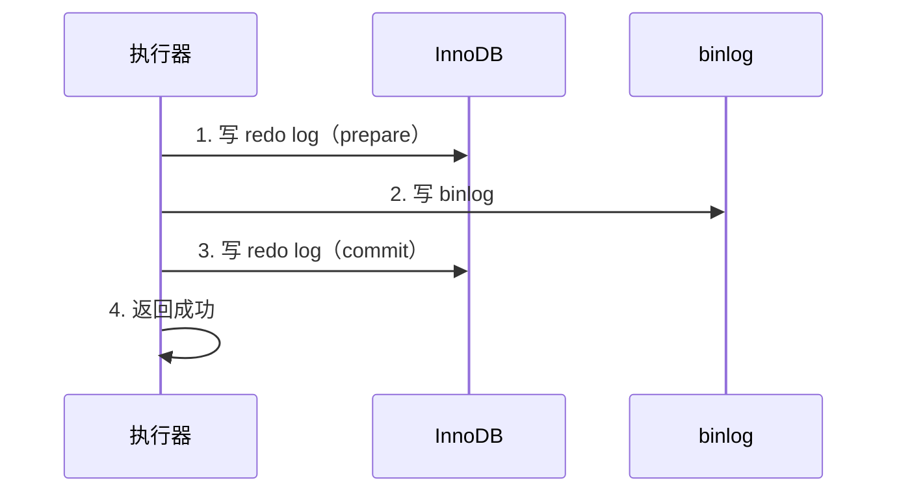

# 01｜架构与存储引擎 · 练习题

开始做题前，先给大家一个小建议：合上知识点，对着 **一节的主图**，把一条 SQL 的旅程从客户端到落盘口述一遍。能顺下来，下面这些题你会发现大半都会了；卡壳的地方，就是你该回去重读的那一节。

做题的方式也建议改一下：每道题**先看标题和场景，自己口述一遍答案，再往下看「完整解答」对答案**。直接看解答，容易产生「我会了」的错觉——能讲出来才是真的会。

| 标记 | 含义 |
|------|------|
| **核心** | 不懂整章就没建立起来 |
| **必会** | 值班和面试都要能讲 |
| **常用** | 线上会反复碰到 |
| **常考** | 白板和追问的高频口径 |

题目的顺序也是有意排的：Q1、Q2 先把分层和 SQL 旅程钉死；Q3～Q8 沿着连接→解析→优化→引擎结构展开；Q9～Q12 专攻日志与 ACID；Q13、Q14 收尾到值班定责与连接池实战。

## 本题目录

- [Q1 MySQL 架构分几层](#q1)
- [Q2 一条 SQL 怎么执行](#q2)
- [Q3 连接池与 max_connections](#q3)
- [Q4 查询缓存为什么删了](#q4)
- [Q5 优化器选错索引怎么办](#q5)
- [Q6 InnoDB vs MyISAM](#q6)
- [Q7 B+ 树与聚簇索引](#q7)
- [Q8 物理存储 页区段](#q8)
- [Q9 Buffer Pool 与 WAL](#q9)
- [Q10 redo log 刷盘策略](#q10)
- [Q11 两阶段提交](#q11)
- [Q12 ACID 各靠什么保证](#q12)
- [Q13 写入卡住怎么定责](#q13)
- [Q14 连接池怎么算 max_connections](#q14)
- [合上书](#合上书)

---

## Q1

**★★★★★｜MySQL 架构分几层？每层干什么？**

**覆盖**：核心 · 必会 · 常考 ｜ **对应**：知识点 [五、执行：调用引擎接口](知识点.md)

### 场景

这道题几乎是 MySQL 面试的「开场白」，也是后面所有题的地基。面试官在白板上画了个 MySQL 的框，让你把内部分层画出来——说不清「Server 层和存储引擎层怎么分」的直接过。

先自己试试：不看下面，你能口述出关键结论吗？想完再对答案。

### 完整解答

> 🎯 **一句话**：Server 层管连接/解析/优化/执行/binlog，存储引擎层管数据怎么存、怎么读、事务怎么恢复，两层通过 handler API 解耦。

Server 层是所有引擎共享的：连接器（认证+线程）→ 解析器（解析树）→ 优化器（执行计划）→ 执行器（调引擎接口）→ binlog（Server 层日志）。存储引擎层可插拔：InnoDB 管 Buffer Pool / redo log / undo log，MyISAM 管自己的索引和数据文件。执行器通过 handler API 一行一行调引擎，引擎换了对 Server 层透明。

> 📝 **面试**：口诀「Server 层共享管解析优化执行，引擎层可插拔管存储恢复」。

### 再追问

- **binlog 在哪一层？** → Server 层，所有引擎共用。
- **redo log 在哪一层？** → InnoDB 引擎层，不是 Server 层——换 MyISAM 就没有 redo log。

---

## Q2

**★★★★★｜一条 SQL 从客户端到落盘经过哪些步骤？**

**覆盖**：核心 · 必会 · 常考 ｜ **对应**：知识点 [一、一张图：一条 SQL 的一生](知识点.md)

### 场景

如果说 Q1 考的是「分层图」，这道题考的就是「时间线」——面试官问「你写了一条 SELECT，MySQL 内部怎么走的」，要求口述完整链路——卡在哪一步说不清就挂。

先自己试试：不看下面，你能口述出关键结论吗？想完再对答案。

### 完整解答

> 🎯 **一句话**：客户端 → 连接（认证+线程）→ 解析（解析树）→ 优化（执行计划）→ 执行（调引擎接口）→ 存储引擎（Buffer Pool / 日志 / 磁盘）。

一条 SELECT 的链路：客户端从连接池借一条 TCP 连接发 SQL → mysqld 认证后分线程 → 解析器做词法+语法分析生成解析树、检查表名列名和权限 → 优化器基于统计信息选执行计划 → 执行器按计划调用引擎 handler API → 引擎先查 Buffer Pool，命中返回、未命中从磁盘读一页 → 结果逐行返回给客户端。写 SQL 多了一步：先写 redo log（WAL），脏页异步刷盘。

> ⚠️ **别混**：SELECT 也要过优化器——不是只有复杂 SQL 才走优化器，每条 SQL 都走。

### 再追问

- **查询缓存不是能跳过这些步骤吗？** → Query Cache 在 8.0 已移除，5.7 建议关闭。不要拿已废弃的东西答。
- **执行器怎么调引擎？** → 一行一行调 handler API——读一行、判断一行、返回一行。

---

## Q3

**★★★★☆｜连接池是 MySQL 的参数吗？max_connections 和连接池什么关系？**

**覆盖**：核心 · 必会 · 常用 ｜ **对应**：知识点 [二、连接：门口的保安与连接池](知识点.md)

### 场景

Q2 走完了链路，现在落到门口：新人把应用的 `maxPoolSize=200` 理解成 MySQL 的 `max_connections=200`，线上多服务共用一个 MySQL 实例，连不上报 `Too many connections`。Q14 是这道题的「算总账」版。

先自己试试：不看下面，你能口述出关键结论吗？想完再对答案。

### 完整解答

> 🎯 **一句话**：连接池是客户端概念，max_connections 是 MySQL 侧上限——连接池大小要小于 max_connections，否则一个应用就吃光 MySQL 所有连接。

MySQL 默认 thread-per-connection：每来一个连接分一个线程，线程数有上限（`max_connections`，生产常见 500-2000）。连接池（HikariCP / Druid）在客户端维护一组 TCP 连接复用，避免频繁建连和认证。两边都要做：应用侧用连接池，MySQL 侧开 `thread_cache_size` 复用线程。

> ⚠️ **别混**：`max_connections` 是 MySQL 的全局上限，连接池的 `maxPoolSize` 是单个应用的上限。多个应用共用一个 MySQL 实例时，各应用池大小之和要 < `max_connections`，否则一个应用把连接吃光，别的服务连不上。

### 再追问

- **`Threads_created` 一直涨说明什么？** → 没用连接池或 `thread_cache_size` 太小，频繁创建线程。
- **`wait_timeout` 调太短有什么坑？** → 连接池里空闲连接被 MySQL 踢掉，应用不知情再发 SQL 报 `gone away`——要配心跳检测。

---

## Q4

**★★★☆☆｜MySQL 查询缓存为什么在 8.0 删了？**

**覆盖**：常用 ｜ **对应**：知识点 [三、解析：词法语法分析与查询缓存](知识点.md)

### 场景

链路里「解析」那一站常被追问：面试官问「MySQL 不是有查询缓存吗，为什么不用」，看你会不会答已废弃的原因——别跟 Redis 搞混。

先自己试试：不看下面，你能口述出关键结论吗？想完再对答案。

### 完整解答

> 🎯 **一句话**：查询缓存（Query Cache）对写场景是毒药——任何写操作让该表所有缓存失效、全局锁瓶颈，8.0 彻底移除。

Query Cache 以 SQL 文本做 key、结果做 value，命中直接返回。问题：① 任何对该表的写（INSERT/UPDATE/DELETE）都让该表所有缓存失效，高并发写场景命中率极低；② 查询缓存的锁是全局的，并发查询争锁成为瓶颈；③ 缓存失效频繁，维护开销大于收益。MySQL 5.7 建议关闭（`query_cache_type=OFF`），8.0 彻底移除。

> ⚠️ **别混**：查询缓存 ≠ Redis 缓存。MySQL Query Cache 是 Server 层的 SQL 级缓存，已废弃；应用层缓存走 Redis 或本地缓存。

### 再追问

- **不用 Query Cache 靠什么加速？** → 靠 Buffer Pool（数据页缓存）和索引优化，不是靠 SQL 结果缓存。

---

## Q5

**★★★★☆｜优化器选错索引怎么办？为什么统计信息会过期？**

**覆盖**：必会 · 常考 ｜ **对应**：知识点 [四、优化：成本估算与执行计划](知识点.md)

### 场景

Q4 说了别靠 Query Cache；真正加速靠优化器选对路。同一条 SQL 时快时慢，`EXPLAIN` 发现有时走索引有时走全表——统计信息过期导致优化器选错路。

先自己试试：不看下面，你能口述出关键结论吗？想完再对答案。

### 完整解答

> 🎯 **一句话**：优化器基于统计信息估算成本选执行计划，统计信息过期就选错——`ANALYZE TABLE` 刷新，紧急用 `FORCE INDEX` 强制指定。

优化器成本 = IO 成本（读页数 × 代价）+ CPU 成本（处理行数 × 代价）。InnoDB 的统计信息通过**采样**估算存在 `innodb_table_stats` / `innodb_index_stats` 里，大量增删改后可能严重偏差。统计信息过期 → 优化器估算的行数不准 → 选了全表扫描而不是索引。

```bash
mysql> ANALYZE TABLE player;     # ← 手动刷新统计信息，大表别在高峰跑
mysql> SHOW INDEX FROM player;   # ← 看 Cardinality 判断选择性
```

紧急治法用 `FORCE INDEX(idx_xxx)` 强制指定索引，但根因还是统计信息过期或索引设计不合理。执行计划深入读法见 [02-01-02](../02-索引与执行计划/)。

> ⚠️ **别混**：`SHOW TABLE STATUS` 的 `Rows` 是**估算值**，不是 `SELECT COUNT(*)` 的精确值——InnoDB 的 MVCC 下精确 count 很贵。

### 再追问

- **怎么知道优化器为什么选了全表扫描？** → 开 Optimizer Trace（`SET optimizer_trace='enabled=on'`）看每个候选计划的估算成本。

---

## Q6

**★★★★★｜InnoDB 和 MyISAM 的核心区别？生产为什么只用 InnoDB？**

**覆盖**：核心 · 必会 · 常考 ｜ **对应**：知识点 [五、执行：调用引擎接口](知识点.md)

### 场景

分层讲完要落到引擎选型：面试官问「InnoDB 和 MyISAM 区别」，只答「InnoDB 支持事务」不够，要说到锁、崩溃恢复、聚簇索引——Q7 的聚簇索引正是 InnoDB 独有的那一刀。

先自己试试：不看下面，你能口述出关键结论吗？想完再对答案。

### 完整解答

> 🎯 **一句话**：InnoDB 支持事务/行锁/崩溃恢复/聚簇索引/外键，MyISAM 全没有——生产只用 InnoDB，MyISAM 只在历史只读场景碰到。

五个核心差异：① InnoDB 支持 ACID 事务，MyISAM 不支持；② InnoDB 行锁（没有索引的列更新会退化成表锁），MyISAM 表锁；③ InnoDB 靠 redo log 崩溃恢复，MyISAM 崩了损坏概率高；④ InnoDB 聚簇索引（数据和主键索引在同一棵 B+ 树），MyISAM 非聚簇（数据和索引分离）；⑤ InnoDB 支持外键，MyISAM 不支持。

> ⚠️ **别混**：InnoDB 的行锁不是「只锁一行」——在没有索引的列上做条件更新，InnoDB 会退化成**表锁**（找不到索引只能扫全表，每行都锁）。锁的细节见 [02-01-03](../03-事务与锁/)。

### 再追问

- **MyISAM 比 InnoDB 快对吗？** → 仅在纯只读无事务场景。InnoDB 行锁 + Buffer Pool 在读写并发下远胜 MyISAM 表锁。
- **MyISAM 的数据怎么存的？** → `.MYD` 存数据、`.MYI` 存索引、`.frm` 存表结构，三个文件分开。

---

## Q7

**★★★★★｜画一棵 B+ 树，说清聚簇索引和二级索引的区别。**

**覆盖**：核心 · 必会 · 常考 ｜ **对应**：知识点 [五、执行：调用引擎接口](知识点.md)

### 场景

这是 Q6「为什么只用 InnoDB」的结构版：面试白板题——画 B+ 树，标注根节点/非叶/叶节点，说清聚簇索引和二级索引的叶节点各存什么、回表怎么走。

先自己试试：不看下面，你能口述出关键结论吗？想完再对答案。

### 完整解答

> 🎯 **一句话**：B+ 树数据只在叶节点、非叶节点只导航，叶节点双向链表连——聚簇索引叶节点存完整行，二级索引叶节点存主键值，查完整行要回表。

B+ 树的核心特征：① 数据只在叶节点，非叶节点只存键值用于导航——树更矮、I/O 更少；② 叶节点之间有双向链表——范围查询顺着链表扫。一棵 3 层 B+ 树覆盖千万行，3 次 I/O 定位任意一行。

**聚簇索引**：数据行存在主键 B+ 树的叶节点里，一张表只有一个。**二级索引**：叶节点存主键值（不是行指针），查到主键后要回聚簇索引查完整行——叫**回表（bookmark lookup）**。如果查询的列都在二级索引里，不用回表，叫**覆盖索引（Covering Index）**。

> 📝 **面试**：记忆口诀「聚簇索引 = 数据就是索引，二级索引 = 索引指向主键，回表 = 拿主键再查一次聚簇索引」。

### 再追问

- **InnoDB 表不指定主键会怎样？** → InnoDB 自动建一个 6 字节隐藏列当主键，性能和空间都差——每张表都该显式定义自增整数主键。
- **MyISAM 有聚簇索引吗？** → 没有。数据和索引分开存，所有索引平级，叶节点存行指针。

---

## Q8

**★★★☆☆｜InnoDB 的页、区、段是什么关系？为什么按页读？**

**覆盖**：必会 ｜ **对应**：知识点 [五、执行：调用引擎接口](知识点.md)

### 场景

B+ 树画完了，再往下沉一层磁盘：面试官问「InnoDB 数据怎么存在磁盘上的」，看你说得清不清物理存储层次。

先自己试试：不看下面，你能口述出关键结论吗？想完再对答案。

### 完整解答

> 🎯 **一句话**：页 16KB 是最小 I/O 单位，区 1MB（64 连续页）是分配单位，段是区的集合（叶子段+非叶子段），表空间是段的容器。

InnoDB 数据在磁盘上按层次组织：**页（page）** 默认 16KB，是 InnoDB 读写的最小单位——一次磁盘 I/O 至少读一页；**区（extent）** 是连续 64 个页 = 1MB，InnoDB 按区分配空间（不是按页零散分配），连续分配让范围扫描更快；**段（segment）** 是区的集合，一个索引有叶子段（存 B+ 树叶节点）和非叶子段（存非叶节点）；**表空间（tablespace）** 是段的容器，数据存在 `.ibd` 文件里。

```text
表空间 -> 段（叶子段/非叶子段）-> 区（1MB=64页）-> 页（16KB）-> 行
```

### 再追问

- **为什么不按行读？** → 磁盘 I/O 的代价是寻道+旋转，读 1 行和读 1 页（16KB）的时间几乎一样——按页读能一次拿到多条行，摊薄 I/O 成本。

---

## Q9

**★★★★★｜Buffer Pool 是什么？WAL 怎么保证崩溃不丢？**

**覆盖**：核心 · 必会 · 常考 ｜ **对应**：知识点 [六、存储引擎：Buffer Pool 与日志](知识点.md)

### 场景

结构讲完，进入「不怕崩」：面试官问「MySQL 写入怎么不丢数据的」，要口述 Buffer Pool → WAL → redo log → fsync 的完整链路。Q10 专门抠刷盘三个值。

先自己试试：不看下面，你能口述出关键结论吗？想完再对答案。

### 完整解答

> 🎯 **一句话**：Buffer Pool 缓存热数据页避免每次读磁盘，WAL 先写 redo log 再改数据页——先记账（redo log fsync）再搬现金（异步刷脏页），崩了靠日志恢复。

Buffer Pool 是 InnoDB 在内存中缓存数据页的区域，读写都先走它：读命中直接返回、未命中读盘；写先改内存变脏页、异步刷盘。WAL（Write-Ahead Logging）的核心：修改数据页之前先把 redo log 写好并 fsync，这样即使数据页还没刷盘就崩了，也能靠 redo log 重做恢复。

```text
写入流程（WAL）：
  1. 改 Buffer Pool 中的数据页（变脏页）     <- 内存操作
  2. 写 redo log 到 log buffer              <- 内存
  3. redo log 刷盘（fsync）                  <- 这步保证崩溃不丢
  4. 返回客户端成功
  5. 脏页异步刷盘到 .ibd                     <- 后台慢慢做
```

> 💡 **打个比方**：先在便签上记一笔（redo log），便签贴墙上掉不了（fsync）；月底再誊到正式账本（刷脏页）。便签在就丢不了账。

### 再追问

- **Buffer Pool 的 LRU 有什么改进？** → 分 young/old 区，新页先进 old 区，被第二次访问才升到 young 区——防止全表扫描冲走热数据。
- **脏页刷盘慢和 redo log 写慢是同一个问题吗？** → 不是。脏页刷盘是写 `.ibd` 数据文件，redo log 写是写日志文件。堵的原因不同。

---

## Q10

**★★★★☆｜innodb_flush_log_at_trx_commit 的三个值各丢什么？什么是双 1 配置？**

**覆盖**：必会 · 常考 ｜ **对应**：知识点 [六、存储引擎：Buffer Pool 与日志](知识点.md)

### 场景

就是知识点开篇那个现场：线上发版后 DB CPU 飙到 100%，慢查询里全是 UPDATE——有人建议把 `innodb_flush_log_at_trx_commit` 改成 0 换性能，你判断该不该改。这是 Q9 的参数特写版。

先自己试试：不看下面，你能口述出关键结论吗？想完再对答案。

### 完整解答

> 🎯 **一句话**：1=每次提交都 fsync（不丢）、2=写 OS Cache 不 fsync（OS 崩丢）、0=每秒刷（最多丢 1 秒）——生产核心库必须设 1，双 1 = flush=1 + sync_binlog=1。

| 值 | 行为 | 崩溃丢失 |
|----|------|----------|
| **1** | 每次提交都 fsync | 不丢 |
| **2** | 每次提交写 OS Page Cache，不 fsync | OS 崩了丢 |
| **0** | 每秒刷一次 | 最多丢 1 秒 |

`innodb_flush_log_at_trx_commit=1` + `sync_binlog=1` 叫**双 1 配置**，保证已提交事务在任何崩溃下都不丢。代价是每次提交要两次 fsync，写入吞吐受限。

> ⚠️ **别混**：`innodb_flush_log_at_trx_commit=0` 在 MySQL 进程崩溃时不丢（因为 OS Page Cache 还在），但**机器断电/OS 崩溃**会丢数据。非核心库可以设 2 换性能，核心库必须设 1。不要因为 CPU 高就改成 0——先查是不是磁盘 IO 瓶颈。

### 再追问

- **redo log 太小会怎样？** → 频繁强制刷脏页、性能抖动。生产建议总大小能容纳 10-30 分钟写入量。
- **发版后 CPU 100% 先做什么？** → `SHOW PROCESSLIST` 看 State 分布，不要先改参数——可能是锁等待或慢查询堆积。

---

## Q11

**★★★★★｜什么是两阶段提交？为什么需要？崩溃后怎么恢复？**

**覆盖**：核心 · 必会 · 常考 ｜ **对应**：知识点 [七、两阶段提交：redo log 与 binlog 的一致性](知识点.md)

### 场景

Q9、Q10 只讲了引擎层 redo；这道题补上 Server 层 binlog——面试白板：画两阶段提交的时序图，说清崩溃后怎么决定提交还是回滚。

先自己试试：不看下面，你能口述出关键结论吗？想完再对答案。

### 完整解答

> 🎯 **一句话**：两阶段提交（2PC）让 redo log 和 binlog 分两层写入保持一致——redo prepare → binlog → redo commit，崩溃后以 binlog 是否完整决定提交还是回滚。

redo log 在 InnoDB 引擎层（物理日志），binlog 在 Server 层（逻辑日志）。如果先写 redo log 后写 binlog，中间崩了：redo log 有记录但 binlog 没有——从库靠 binlog 同步少了这条变更，主从不一致。



崩溃恢复三种情况：① redo log 是 commit → 正常恢复；② redo log 是 prepare + binlog 有完整记录 → 提交（以 binlog 为准）；③ redo log 是 prepare + binlog 无记录 → 回滚。

> 📝 **面试**：问「为什么需要两阶段提交」，答「保证 redo log 和 binlog 一致——否则可能出现主库提交了但从库没同步（binlog 丢了）或主库回滚了但从库执行了的不一致」。

### 再追问

- **redo log 和 binlog 是一回事吗？** → 不是。redo log 是物理日志（引擎层、循环写、崩溃恢复），binlog 是逻辑日志（Server 层、追加写、复制和 PITR）。
- **binlog 生产用什么格式？** → ROW。STATEMENT 格式下 `NOW()`/`UUID()` 等不确定函数复制可能不一致。

---

## Q12

**★★★★☆｜ACID 各靠什么保证？弹性事务是什么？**

**覆盖**：必会 · 常考 ｜ **对应**：知识点 [五、执行：调用引擎接口](知识点.md)

### 场景

把前面 redo / undo / 锁串成四个字母：面试官问「InnoDB 的 ACID 各靠什么机制保证」，只说「靠事务」不够，要答出每个字母对应的具体技术。

先自己试试：不看下面，你能口述出关键结论吗？想完再对答案。

### 完整解答

> 🎯 **一句话**：A 靠 undo log 回滚，C 靠 AID + 约束共同保证，I 靠锁 + MVCC，D 靠 redo log 恢复——弹性事务是分布式场景下放宽一致性的方案，InnoDB 不提供。

- **A（原子性）** = undo log（记修改前的旧值，事务回滚时恢复原值）
- **C（一致性）** = AID + 应用层约束（唯一键、外键、CHECK）共同保证最终状态正确
- **I（隔离性）** = 锁 + MVCC（多版本并发控制，让读不阻塞写）
- **D（持久性）** = redo log（崩溃后重做已提交的事务）

口诀：**undo 保 A，redo 保 D，锁 + MVCC 保 I**。C 不是单靠某个机制，是 AID + 约束的结果。

**弹性事务（elastic transaction）**是分布式数据库场景下放宽严格 ACID 的方案（Saga、TCC），通过最终一致性换取可用性和扩展性。InnoDB 只做严格 ACID，不提供弹性事务。隔离级别细节见 [02-01-03](../03-事务与锁/)。

> ⚠️ **别混**：ACID 保证的是「已提交的事务不丢」，**不保证**未提交的事务——未提交事务在崩溃后靠 undo log 回滚掉。

### 再追问

- **事务提交了数据落盘了吗？** → 不一定。提交只保证 redo log 落盘，数据页可能还是脏页在 Buffer Pool 里。崩溃靠 redo log 恢复。
- **undo log 除了回滚还干什么？** → 给 MVCC 提供历史版本快照，让 `READ COMMITTED` / `REPEATABLE READ` 下读不被写阻塞。

---

## Q13

**★★★★☆｜线上 DB 写入卡住、应用超时，你怎么 60 秒定位？**

**覆盖**：核心 · 必会 · 常用 ｜ **对应**：知识点 [八、作战：写入卡住怎么定责](知识点.md)

### 场景

这张表把前面日志题和锁题串起来了：接到「DB 写入慢、业务超时」告警——有人准备重启 MySQL，有人要扩内存，你 60 秒走完定责流程再开口。就是开篇要拦住的那个人。

先自己试试：不看下面，你能口述出关键结论吗？想完再对答案。

### 完整解答

> 🎯 **一句话**：先 `SHOW PROCESSLIST` 看 State，再 `SHOW ENGINE INNODB STATUS` 看引擎层，最后 `iostat` 查磁盘——三层定位锁等待/fsync 慢/脏页积压。

```text
1. 0-10s   SHOW PROCESSLIST;              -> 看卡在哪个 State，有多少条
2. 10-30s  SHOW ENGINE INNODB STATUS\G    -> LOG 段看 redo log、TRANSACTIONS 看锁
3. 30-45s  iostat -x 1 3;                -> 磁盘 IO 是否到瓶颈（%util / await）
4. 45-60s  定型：锁等待（去 03）/ fsync 慢（查盘）/ 脏页积压（查刷盘参数）
```

`PROCESSLIST` 的 State 是第一刀：`Waiting for table metadata lock` 是 DDL 堵了 DML（去 [02-01-03](../03-事务与锁/)）；`updating` 是正在执行、卡在引擎层；`Waiting for commit` 是日志刷盘。第二刀看 `INNODB STATUS`：LOG 段看 redo log 进度、TRANSACTIONS 段看锁和长事务、BUFFER POOL 段看脏页数。

> ⚠️ **别混**：不要一上来就调大 `max_connections` 或扩内存——先定位卡在哪一层。锁等待去查锁，fsync 慢去查盘 IO，脏页积压去查刷盘参数。

### 再追问

- **大量 `updating` 卡住怎么办？** → 先看 `INNODB STATUS` 的 TRANSACTIONS 段有没有锁等待，不是直接重启。
- **CPU 不忙但慢是什么原因？** → 可能是磁盘 IO 瓶颈（`iostat` 的 `%util` 接近 100%），不是 CPU 问题——加 CPU 没用。

---

## Q14

**★★★★☆｜连接池怎么算？`Too many connections` 先扩 MySQL 吗？**

**覆盖**：必会 · 常用 ｜ **对应**：知识点 [二、连接：门口的保安与连接池](知识点.md)

### 场景

这是 Q3 结论的「算总账」版：48 台 Gate 各配连接池 50，MySQL `max_connections=2000` 仍报 `Too many connections`。DBA 提议把 `max_connections` 调到 5000。

先自己试试：不看下面，你能口述出关键结论吗？想完再对答案。

### 完整解答

> 🎯 **一句话**：先算**总连接 = 实例数 × 每池大小 × 服务数**，再和 `max_connections` 比——池太大或泄漏比 MySQL 上限小更常见。

```text
Gate 48 × 池 50 = 2400  # 已超 2000
再加 Login 32 × 30 = 960
再加 战斗/结算各一套 → 必爆
```

```bash
mysql -e "SHOW STATUS LIKE 'Threads_connected';"
# 1987   ← 接近上限

mysql -e "SHOW PROCESSLIST;" | awk '{print $4}' | sort | uniq -c | sort -rn | head
#  890 game_gate
#  412 login_svc   ← 按应用名聚合，找谁泄漏
```

止血：先缩各服务 `maxPoolSize`、查泄漏（未归还连接、事务未提交），再评估升 `max_connections`。**不要**只调大上限——每个连接占内存，5000 连接可能把 DB 内存打满。

> 📝 **面试**：连接池公式 + `SHOW PROCESSLIST` 按用户聚合；`wait_timeout` 太短会导致频繁建连，`Too many connections` 不等于 MySQL 太小。

### 再追问

**连接泄漏怎么查？**——`Threads_connected` 持续上涨、`Sleep` 状态堆积、应用无流量仍占连接。用 `performance_schema` 或 Druid/Hikari 监控活跃/空闲比。**不要**用 `kill` 乱杀——先定位哪个服务泄漏。

---

## 合上书

做完题再合上书，对着知识点「合上书」逐条过一遍——条数对齐，卡壳的回对应 Q：

- [ ] **默画一节的图**：客户端 → 连接 → 解析 → 优化 → 执行 → 存储引擎 → 磁盘；日志分两层（redo/undo 引擎层 + binlog Server 层）。（Q1、Q2）
- [ ] **口述连接**：一个连接的诞生（TCP 握手 + 认证 + 分线程）、连接池为什么必须、`wait_timeout` 的坑、`Too many connections` 怎么查。（Q3、Q14）
- [ ] **口述解析与优化**：解析树是什么、查询缓存为什么被删、优化器基于什么选执行计划、统计信息为什么会过期、选错索引怎么办。（Q4、Q5）
- [ ] **口述执行**：Server 层和存储引擎层怎么分工、执行器怎么调引擎接口（一行一行调）、handler API 的意义。（Q1）
- [ ] **默画 InnoDB vs MyISAM**：事务/锁/崩溃恢复/聚簇索引/外键的对比，生产为什么只用 InnoDB。（Q6）
- [ ] **默画 B+ 树与聚簇索引**：根→非叶→叶，叶节点双向链表；聚簇索引叶节点存完整行、二级索引存主键值、回表怎么走、覆盖索引是什么。（Q7）
- [ ] **口述物理存储**：页 16KB（最小 I/O）、区 1MB（64 连续页）、段（叶子段/非叶子段）、表空间。（Q8）
- [ ] **默画 Buffer Pool 写路径**：改脏页 → 写 redo log → fsync → 返回成功 → 后台刷脏页；WAL 的含义和作用。（Q9）
- [ ] **口述 redo log 与 undo log**：redo log 物理日志/WAL/环形写入/三个刷盘值；undo log 记旧值/回滚+MVCC/purge 清理。（Q9、Q10、Q12）
- [ ] **默画两阶段提交与 binlog**：redo prepare → binlog → redo commit；崩溃恢复三种情况；binlog 逻辑日志/ROW 格式/sync_binlog/双 1 配置。（Q11）
- [ ] **口述 ACID 与弹性事务**：A=undo、C=约束+AID、I=锁+MVCC、D=redo log；弹性事务是分布式方案，InnoDB 不提供。（Q12）
- [ ] **定责**：写入卡住先看 `PROCESSLIST` State、再看 `INNODB STATUS`；决策树三个出口各走哪条。（Q13）
