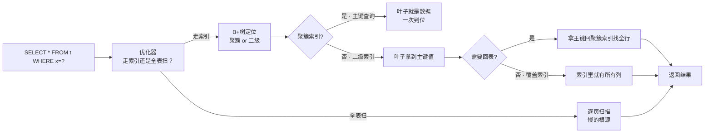
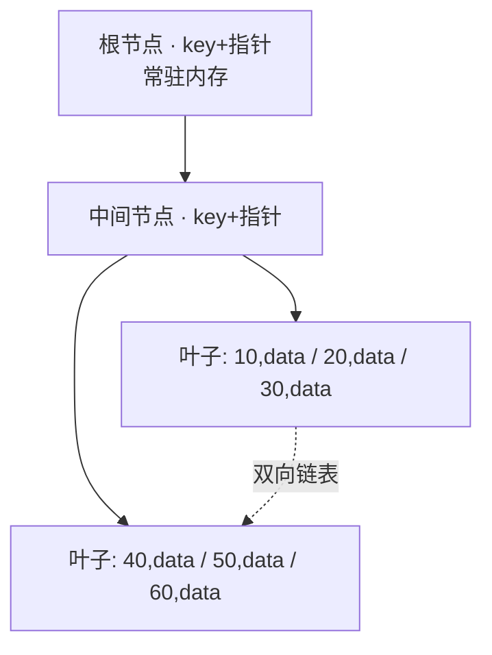
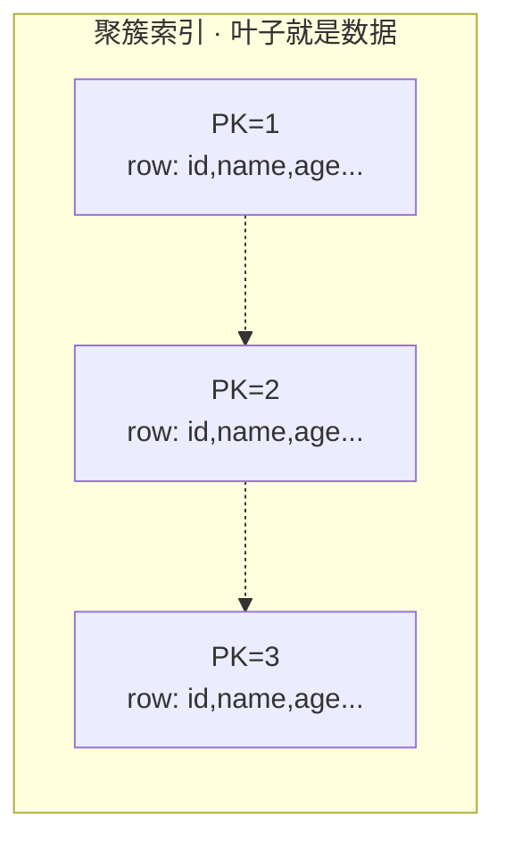
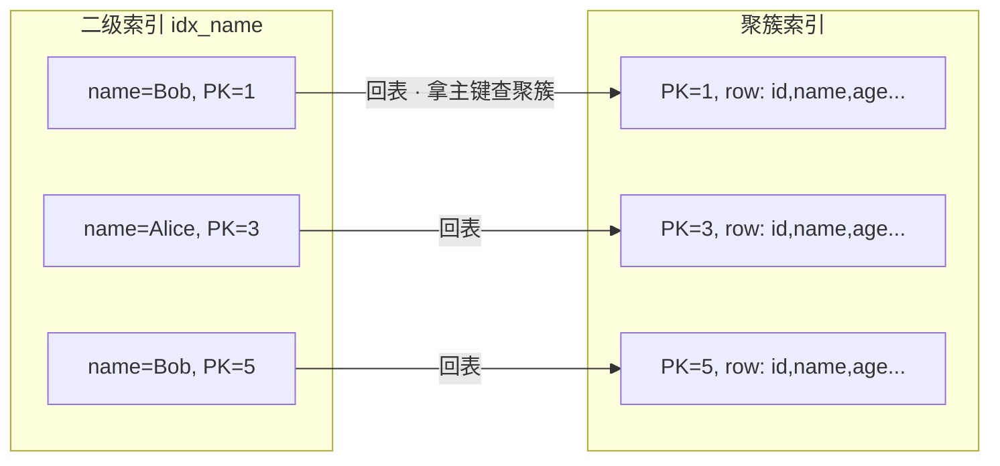
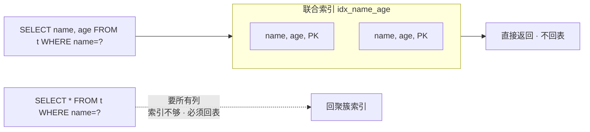
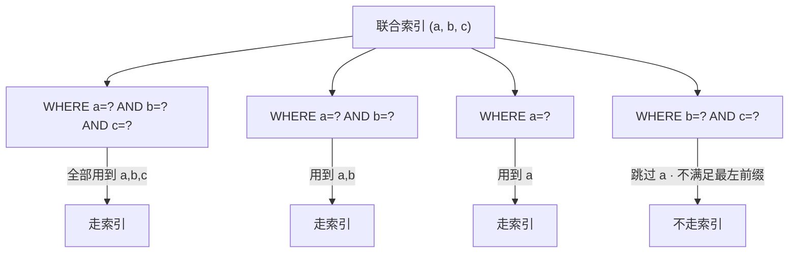
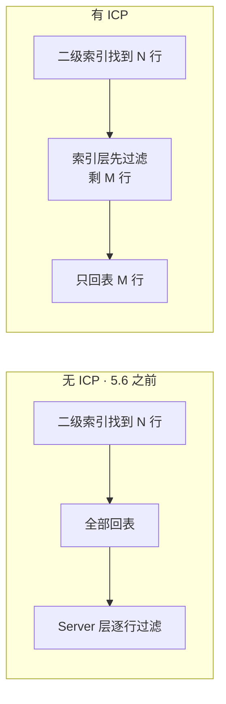
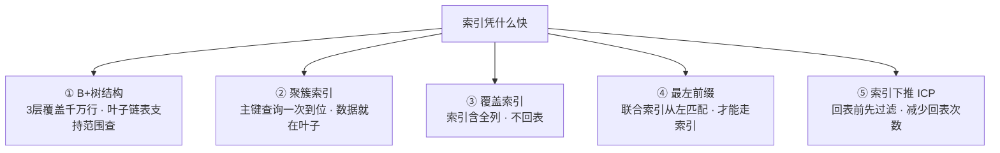
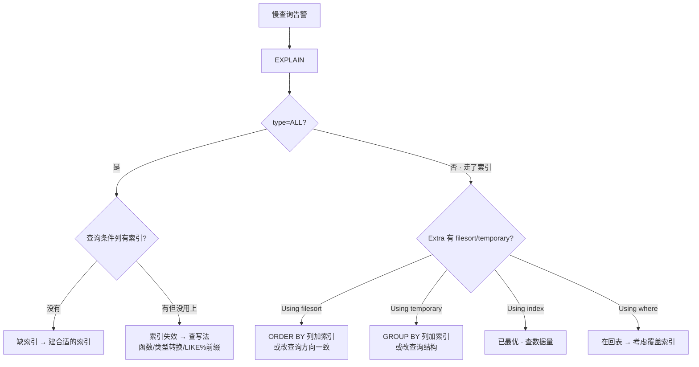

# 索引与执行计划

> 大家好，欢迎来到这次分享。开讲之前，先带大家回到一个很多值班同学都经历过的现场：
> 慢查询告警响了，DBA 说「加个索引就好了」——加完确实快了；换个条件查又慢了，再换一个索引又快。群里已经有人在堆索引，生怕少一个。
> 这一章讲完，你会知道当时那个人错在哪：不是「加索引」不对，而是没先用 EXPLAIN 看清它走了哪条路——盲目加索引只会换一种慢。
> **本章回答的问题**：一条 SELECT 从进来到找到数据，中间走了哪些路、为什么有时快有时慢、怎么用 EXPLAIN 看清它走了哪条。
> **本章不讲**：存储引擎页结构细节、Buffer Pool → [02-01-01](../../02-中间件与数据库/01-MySQL/01-架构与存储引擎/)；事务隔离与锁 → [02-01-03](../../02-中间件与数据库/01-MySQL/03-事务与锁/)。这些都有专门章节，本章只在用到时点到为止。

**标记**：🎯重点 · 🔥难点 · ⭐常考 · 🔧实操

**怎么听这场分享**：咱们先把第一节的「找人之旅」主图看熟——走索引还是全表扫、聚簇还是二级、要不要回表；第二到第六节顺着这张图展开结构与优化；第七节专门讲慢查询是不是索引问题——也就是开头那个现场的正确解法。每一节讲完会提示对应练习题。

---

## 一、一张图：一条查询的找人之旅

> 🎯 **一句话**：一条 SELECT 进来，要么走索引（B+树定位→可能回表），要么全表扫，走哪条由优化器看「哪条便宜」。



**读图**：
- 主线是「走索引还是不走」的分叉——走索引时还要再问「聚簇还是二级」「要不要回表」，每多一道就是一次额外 IO。
- 全表扫是「没有索引可用或优化器觉得更便宜」时的兜底——大表全表扫就是慢查询的常见根因。
- EXPLAIN 就是照这张图拍 X 光，告诉你这条 SQL 实际走了哪条路。

带着这张图，咱们先把「路」本身讲清楚——B+ 树凭什么适合当索引。

> 本节对应练习题 **Q1**（主图整体对应 Q1～Q5 的地基）。

---

## 二、结构：B+树为什么是B+树

> 🎯 **一句话**：InnoDB 的索引是一棵 B+树——非叶子节点只存 key+指针、叶子节点存数据，叶子间用双向链表串起来，让范围查询不用回溯。

大家想想：为什么不用红黑树？很多人答「红黑树也能查」——能查，但树太高，磁盘 IO 扛不住。下面放慢讲透。

### 为什么不是红黑树、不是 B 树 🔥

> 💡 **打个比方**：字典找「张」开头的名字——不会从第一页翻到最后一页（全表扫），而是先翻到「Z」标签（非叶子节点指向），再从「张」那一页往后连续翻（叶子链表）。B+树就是那套「标签 + 连续页」的结构。

红黑树是二叉的，高度等于 `log₂N`——100 万行约 20 层，每层一次磁盘 IO 不可接受。B 树的每个节点都存数据，一个页能放的 key 数量少、树更高。**B+树**的关键设计是：

- **非叶子节点只存 key 和子节点指针**——一个 16KB 的页能放上千个 key，3 层就能覆盖千万级数据（根节点常驻内存，实际只有 2~3 次磁盘 IO）。
- **数据只在叶子节点**——非叶子节点是「路标」，不占空间存数据，一个页能放更多 key，树更矮。
- **叶子节点用双向链表串起来**——范围查询 `WHERE x BETWEEN 10 AND 50` 找到 10 后顺着链表往后走即可，不用回到根节点重新找。



**读图**：非叶子节点全是「路标」，只在叶子存数据；叶子之间用双向链表连接。查 `x=50` 从根节点比较 → 往右走 → 到叶子找到；查 `x BETWEEN 10 AND 50` 则在找到 10 之后顺着链表走到 50，不必回到根节点。

### 页、区、段 ⭐

InnoDB 的存储从大到小：

- **段（segment）**：逻辑概念，一个索引对应一个段——聚簇索引有数据段，二级索引有索引段。段由零散的区和 32 页的「碎片页」组成。
- **区（extent）**：默认 1MB，等于 **64 个页**。分配存储以区为单位，是为了让连续的页在磁盘上也连续——顺序 IO 比随机 IO 快一到两个数量级。
- **页（page）**：InnoDB 的最小 IO 单位，默认 **16KB**——不管你读一行还是一页，磁盘都给你一整页。一个页可以放多行数据（约几百行），也可以放 B+树的一个节点（上千个 key）。

> ⚠️ **别混**：页是 **IO 的最小单位**，不是行的单位。读一行和读一页在磁盘看来是同一次 IO——这就是为什么「少选列」不能减少 IO（覆盖索引靠的是「不用回表」，不是「少读列」）。

结构搞清了，下一问：叶子上到底存什么？聚簇索引回答这个问题。

> 本节对应练习题 **Q1**。

---

## 三、聚簇：主键索引与数据

> 🎯 **一句话**：InnoDB 的聚簇索引就是表本身——叶子节点存的是完整行数据，主键索引和数据不分家。

**聚簇索引（clustered index）** = 索引的叶子节点直接存**整行数据**的索引。一张表只能有一个聚簇索引——InnoDB 选主键；没主键选第一个非空唯一索引；都没有就生成隐藏列 `_rowid`。



**读图**：聚簇索引的叶子节点不存「指向数据的指针」，它就是数据本身。`WHERE id=2` 走聚簇索引，找到叶子节点 2 就拿到了整行——一次 B+树查找，命中 Buffer Pool 则连 IO 都省了。

### InnoDB vs MyISAM ⭐

| 对比 | **InnoDB 聚簇索引** | **MyISAM 非聚簇** |
|------|---------------------|-------------------|
| 数据存哪 | 聚簇索引叶子节点就是数据 | 索引叶子存「行物理位置指针」 |
| 主键查全行 | 一次 B+树查找 | 找索引 → 拿指针 → 再读数据行 |
| 二级索引叶子存什么 | 主键值 | 行物理位置指针 |
| 主键变大时二级索引 | 受影响（要跟着存主键值） | 不受影响 |

> ⚠️ **别混**：MyISAM 的二级索引叶子存的是**行物理位置指针**，不涉及主键；InnoDB 的二级索引叶子存的是**主键值**——所以 InnoDB 二级索引查全行要「回表」到聚簇索引。这就是两家引擎在索引设计上的根本差异。

> 📝 **面试**：问「InnoDB 和 MyISAM 索引区别」，答「InnoDB 是聚簇索引，叶子节点存整行数据，二级索引叶子存主键值要回表；MyISAM 是非聚簇，索引叶子存行物理位置指针，主键和二级索引结构一样」。别只答「InnoDB 支持事务」——那不是索引层面的区别。

**主键为什么建议用自增整型**：聚簇索引按主键排序存储，自增主键总是追加到末尾——页分裂极少发生。用 UUID 做主键，新插入的主键值是随机的，B+树要在中间找位置插入，触发**页分裂（page split）**——一个页满了要拆成两个，写放大、碎片增多。整型主键还比 UUID 小——二级索引要存主键值，主键越大二级索引越大。

聚簇讲完，二级索引才是「多数查询」真正走的路——以及那次著名的「回表」。

> 本节对应练习题 **Q2、Q3**。

---

## 四、找人：二级索引与回表

> 🎯 **一句话**：二级索引的叶子节点存的是主键值不是整行——查到主键后还要回聚簇索引拿全行数据，这一步叫回表。

大家想想：二级索引叶子上如果不存完整行，查完整行要不要多走一趟？要——这一趟叫**回表**，是 ⭐ 面试必考。

**二级索引（secondary index）** = 除聚簇索引以外的所有索引。二级索引的 B+树叶子节点存的是 `(索引列值, 主键值)`，不存整行数据。



**读图**：`SELECT * FROM t WHERE name='Bob'` 走二级索引 `idx_name`，叶子节点找到 `name='Bob', PK=1` 和 `name='Bob', PK=5`——这里只有主键值，没有 `age` 等其他列。要拿全行就得拿这两个主键值回聚簇索引再查一次，这就是**回表（table lookup）**。

> 💡 **打个比方**：二级索引像书的「人名目录」——你查到「Bob 在第 1 页和第 5 页」，但目录里只有页码没有内容。要看内容就得翻到那两页（回表）。聚簇索引像直接按页码排好的正文，翻到那页就是全文。

**回表的代价**：每回表一次就是一次聚簇索引 B+树查找。如果二级索引查出 10000 行，就要回表 10000 次——优化器可能会觉得「回表太贵，不如全表扫」从而放弃二级索引。

> 🔍 **现场**：加了索引却没走，先看是不是回表代价太大。

```sql
-- 有 idx_name 但 SELECT * 要回表拿所有列
EXPLAIN SELECT * FROM users WHERE name='Bob';
-- type=ref, Extra 没有 Using index → 走了二级索引但要回表
-- 如果 name='Bob' 匹配行数很多，优化器可能直接选 ALL 全表扫
```

> ⚠️ **别混**：`SELECT *` 不一定走全表扫——如果条件列有索引，优化器还是会评估「走索引 + 回表」vs「全表扫」哪个便宜。但 `SELECT *` 让回表不可避免，是「明明有索引却没用上」的常见原因。

回表代价清楚了，下一节讲怎么少回表、怎么让联合索引真正用得上。

> 本节对应练习题 **Q4**。

---

## 五、优化：覆盖索引与最左前缀

> 🎯 **一句话**：索引设计的核心就两条——让索引覆盖查询要的所有列（不回表），让查询条件能匹配索引的最左前缀（能走索引）。

开篇那个「加完索引又慢」的现场，大半栽在最左前缀和覆盖索引上——⭐ 口诀先记：**覆盖索引 = 不回表；最左前缀 = 从左往右用，范围一打断后面就废**。

### 覆盖索引：不回表 ⭐🔥

**覆盖索引（covering index）** = 一个索引包含了查询需要的所有列，不必回表查聚簇索引。EXPLAIN 里 `Extra` 列出现 `Using index` 就是覆盖索引生效了。



**读图**：联合索引 `(name, age)` 的叶子节点存了 `name, age, 主键`。`SELECT name, age FROM t WHERE name=?` 需要的列都在索引里，不用回表——覆盖索引。`SELECT *` 要的列索引里不全，就得回表。

> 🎯 **关键直觉**：覆盖索引不是一种索引类型，是一种查询碰巧只用到索引列的状态。设计联合索引时有意把高频查询的列都放进去，就是在「制造覆盖」。

```sql
-- 覆盖索引生效
EXPLAIN SELECT name, age FROM users WHERE name='Bob';
-- Extra: Using index  ← 索引覆盖了所有列，不回表

-- 回表
EXPLAIN SELECT name, age, email FROM users WHERE name='Bob';
-- Extra: NULL（没有 Using index）  ← email 不在索引里，必须回表
```

> 📝 **面试**：问「怎么避免回表」，答「建覆盖索引——让联合索引包含查询要的所有列，EXPLAIN 里 `Using index` 就是生效了」。追问「为什么 SELECT * 有害」——因为它让覆盖索引失效，每次都要回表。

### 最左前缀：索引能不能用上 ⭐🔥

**最左前缀（leftmost prefix）** = 联合索引 `(a, b, c)` 的 B+树先按 `a` 排序、`a` 相同再按 `b` 排序、再按 `c`——查询条件必须从最左列开始连续匹配，索引才能生效。



**读图**：联合索引 `(a, b, c)` 的 B+树是按 `a→b→c` 的顺序排列的。能用到索引的条件组合是：`a`、`a AND b`、`a AND b AND c`——从最左列开始连续。跳过 `a` 直接用 `b` 或 `c`，就像跳过目录第一级直接查第二级，B+树的排序结构帮不上忙。

```text
联合索引 (a, b, c) 能走索引的查询：
  WHERE a=?                  ✅ 用到 a
  WHERE a=? AND b=?          ✅ 用到 a,b
  WHERE a=? AND b=? AND c=?  ✅ 用到 a,b,c
  WHERE a=? AND c=?          ✅ 用到 a（c 用不上，但 a 能定位）
  WHERE b=?                  ❌ 跳过 a
  WHERE b=? AND c=?          ❌ 跳过 a
  WHERE c=?                  ❌ 跳过 a
```

> ⚠️ **别混**：`WHERE a=? AND c=?` 不是完全不走索引——`a` 能用上最左前缀走索引定位，`c` 在索引层用不上过滤，要在回表后或索引遍历时逐行判断。这和 `WHERE b=?` 跳过 `a` 完全不走索引是两码事。

**范围查询打断最左前缀**：`WHERE a=? AND b>? AND c=?`——`a` 等值匹配走索引，`b` 走范围扫描，**`c` 在 `b` 范围查询后用不上索引**（因为 `b` 的范围打破了 `c` 的有序性）。这是最常考的追问。

> 💡 **打个比方**：联合索引像电话簿——先按姓排，姓相同再按名排。你查「张三」能直接翻到（姓=张，名=三）。你查「所有姓张的」也能翻到那一页往后扫。但你查「所有叫三的」——姓被跳过了，电话簿的排序帮不上忙，只能从头翻到尾。

### 联合索引设计：顺序决定一切 ⭐

**联合索引（composite index）** = 多列组成的索引，列的顺序决定了哪些查询能走索引。设计原则：

- **等值查询的列放前面**，范围查询的列放后面——范围查询后面的列用不上索引。
- **区分度高的列放前面**——`status` 只有 0/1/2 三个值，放前面过滤不掉多少行；`user_id` 几万个值，放前面能快速定位。
- **高频查询的列放前面**——覆盖最多查询场景。

```sql
-- 场景：经常 WHERE user_id=? AND created_at BETWEEN ? AND ?
-- 正确：user_id 在前（等值），created_at 在后（范围）
CREATE INDEX idx_uid_time ON orders(user_id, created_at);

-- 错误：created_at 在前（范围），user_id 在后 → user_id 用不上索引
CREATE INDEX idx_time_uid ON orders(created_at, user_id);
```

### 前缀索引：长字符串的折中 🔧

**前缀索引（prefix index）** = 只对字符串前 N 个字符建索引，省空间。代价是无法做覆盖索引（前缀不等于全值），也无法用前缀做 `ORDER BY`。

```sql
-- email 列 varchar(255)，只取前 6 个字符建索引
CREATE INDEX idx_email_prefix ON users(email(6));

EXPLAIN SELECT id, email FROM users WHERE email='bob@example.com';
-- Extra: Using where  ← 前缀索引不覆盖，要回表 + Using where 过滤
-- 注意：不会出现 Using index，因为前缀索引不能覆盖
```

> ⚠️ **别混**：前缀索引的「前缀」和最左前缀的「前缀」是两个概念。前缀索引是对**单个字符串列**截取前 N 个字符建索引；最左前缀是**联合索引**从最左列开始匹配的规则。

### 唯一索引 vs 普通索引 ⭐

**唯一索引（unique index）** = 索引列的值必须唯一。性能差异：

| 对比 | **唯一索引** | **普通索引** |
|------|-------------|-------------|
| 查找 | 找到第一条就停 | 找到后还要往下看有没有重复 |
| 插入 | 要先查重 | 直接插入 |
| 约束 | 保证唯一 | 不保证 |

对于等值查询，两者性能差异在微秒级——别为了那点差异放弃唯一约束。**该唯一的列就建唯一索引**，性能不是选普通索引的理由。

### 索引下推：ICP 🔥

**索引下推（Index Condition Pushdown，ICP）** = MySQL 5.6 引入的优化，把 `WHERE` 条件的一部分「下推」到存储引擎层，在索引遍历时就过滤，减少回表次数。



**读图**：无 ICP 时，二级索引找到的每一条都要回表，再在 Server 层过滤；ICP 把能用索引列的条件推到存储引擎，在回表之前就过滤掉不满足条件的行——回表次数从 N 降到 M。

```sql
-- 联合索引 (name, age)
SELECT * FROM users WHERE name LIKE 'B%' AND age > 18;
-- name LIKE 'B%' 走索引定位（最左前缀）
-- age > 18 在 ICP 开启时，存储引擎在索引层就过滤掉 age<=18 的行，不必回表
EXPLAIN SELECT * FROM users WHERE name LIKE 'B%' AND age > 18;
-- Extra: Using index condition  ← ICP 生效
```

> ⚠️ **别混**：`Using index` = 覆盖索引（不回表）；`Using index condition` = 索引下推（回表前先过滤）。两个 Extra 值差一个词，含义完全不同。

### 收束：索引凭什么快 🎯⭐

到这里，「索引为什么快」的全部零件都齐了。面试直接问「索引为什么快 / 怎么优化慢查询」，要的就是这张清单——**五件套**：



**读图**：
- ① 是结构基础——B+树让查找从 O(N) 降到 O(log N)，叶子链表让范围查询变成顺序遍历。
- ②③ 决定「要不要额外 IO」——聚簇索引不用回表，覆盖索引让二级查询也不回表。
- ④⑤ 决定「索引能不能用上、用得好不好」——最左前缀决定走不走索引，ICP 决定回表少不少。

> ⚠️ **别混**：索引快 **≠ 一定走索引**。优化器会评估「走索引 + 回表」vs「全表扫」哪个便宜——大表全表扫慢，但小表或匹配行数多时全表扫可能更快。`type=ALL` 不一定不合理，要看表大小和匹配比例。也 **≠ 加了索引就万事大吉**——查询写法不对（函数包裹列、隐式类型转换）会让索引失效。

> 📝 **面试**：五件套按「结构 → 存储 → 优化」分组记：B+树是结构，聚簇/覆盖是存储方式，最左前缀/ICP 是查询匹配规则。最后补一句「索引快是因为把随机 IO 变成 B+树查找 + 顺序 IO，但加了索引不一定走、走了不一定不回表——EXPLAIN 才是最终裁判」。

优化手段齐了，值班怎么一眼看出它走没走？EXPLAIN。

> 本节对应练习题 **Q5、Q6、Q7、Q8、Q9**。

---

## 六、诊断：EXPLAIN执行计划

> 🎯 **一句话**：EXPLAIN 是 MySQL 告诉你「这条 SQL 我打算怎么跑」——重点看 type（走了什么级别的访问）和 Extra（有没有额外操作）。

回到开头那个现场：有人准备继续加索引——先停手，`EXPLAIN` 一眼看 type 和 Extra。

### EXPLAIN 怎么读 🔧⭐

```sql
EXPLAIN SELECT * FROM users WHERE name='Bob' AND age > 18;
```

```text
+----+--------+----------+------+---------------+-------------+---------+-------+------+-----------------------+
| id | select | table    | type | possible_keys | key         | key_len | ref   | rows | Extra                 |
+----+--------+----------+------+---------------+-------------+---------+-------+------+-----------------------+
|  1 | SIMPLE | users    | ref  | idx_name_age  | idx_name_age| 62      | const |   10 | Using index condition |
+----+--------+----------+------+---------------+-------------+---------+-------+------+-----------------------+
```

核心列速记：

```text
type            ← 访问类型：从好到差 system > const > eq_ref > ref > range > index > ALL
key             ← 实际用的索引（NULL = 没走索引）
key_len         ← 索引使用长度（判断联合索引用了几列）
rows            ← 优化器估计要扫的行数
Extra           ← 额外信息：Using index / Using where / Using filesort / Using temporary
```

**key_len 怎么读**：联合索引 `(a, b, c)` 里 `a` 是 int（4 字节）、`b` 是 varchar(20)（utf8mb4 下 20×4+2=82 字节）、`c` 是 tinyint（1 字节）。如果 `key_len=4`，只用了 `a`；`key_len=86`，用了 `a+b`；`key_len=87`，三列全用上。看到 `key_len` 比索引总长度短，就说明有列没用上——大概率是被范围查询打断了。

### type 字段：访问类型 🔥

`type` 告诉你 MySQL 用什么方式访问数据，从好到差：

| type 值 | 含义 | 典型场景 |
|---------|------|----------|
| `system` | 表只有一行 | 系统表 |
| `const` | 最多匹配一行 | `WHERE id=?`（主键/唯一索引等值） |
| `eq_ref` | JOIN 中被驱动表用主键/唯一索引等值匹配 | `JOIN ... ON t2.id=t1.id` |
| `ref` | 非唯一索引等值匹配，可能多行 | `WHERE name=?`（普通索引） |
| `range` | 索引范围扫描 | `WHERE id BETWEEN 1 AND 100`、`IN` |
| `index` | 扫描整个索引树（不回表） | 覆盖索引全扫 |
| `ALL` | 全表扫描 | 没有索引或优化器觉得更便宜 |

> ⚠️ **别混**：`index` 和 `ALL` 都要全扫，但 `index` 扫的是索引树（通常比数据表小），`ALL` 扫的是数据表。`index` 出现在覆盖索引时还算可以——至少少读数据；`ALL` 在大表上就是慢查询的信号。

生产红线：`type=ALL` 在大表（>10 万行）上基本要优化——要么缺索引，要么查询条件用了索引列上的函数、隐式类型转换导致索引失效。

### Extra 字段：额外操作 ⭐

`Extra` 是「除了走索引之外还干了什么」，这里出现的关键词直接告诉你有没有额外代价：

| Extra 值 | 含义 | 好不好 |
|----------|------|--------|
| `Using index` | 覆盖索引，不回表 | 最好 |
| `Using index condition` | 索引下推，回表前先过滤 | 好 |
| `Using where` | Server 层过滤 | 可能回表后还需过滤 |
| `Using filesort` | 额外排序 | 需要优化 |
| `Using temporary` | 用了临时表 | 需要优化 |

**Using filesort** 不是说「用磁盘文件排序」——它表示 MySQL 拿到结果后还要额外排序（可能在内存也可能在磁盘）。`ORDER BY` 的列如果没有索引、或排序方向和索引不一致，就会触发。大结果集 + filesort = 内存溢出到磁盘 = 慢。

**Using temporary** 表示 MySQL 要建一张临时表来中间过渡——典型出现在 `DISTINCT`、`GROUP BY`、`UNION` 的场景。临时表可能在内存（Memory 引擎）也可能在磁盘（TempTable/TMP 表），磁盘临时表 = 慢。

> 📝 **面试**：问「EXPLAIN 重点看什么」，答「type 看访问级别——大表出现 ALL 要查索引有没有、用没用上；Extra 看额外操作——Using index 最好（覆盖索引），Using filesort 和 Using temporary 最差（要额外排序和临时表）」。

### 索引失效的常见写法 🔧

```sql
-- ① 函数包裹索引列 → 索引失效
EXPLAIN SELECT * FROM users WHERE YEAR(created_at)=2024;
-- type=ALL  ← 对列用了函数，B+树排序失效

-- 正确写法：改成范围查询
EXPLAIN SELECT * FROM users WHERE created_at >= '2024-01-01' AND created_at < '2025-01-01';
-- type=range  ← 走索引范围扫描

-- ② 隐式类型转换 → 索引失效
EXPLAIN SELECT * FROM users WHERE phone=13800138000;  -- phone 是 varchar
-- type=ALL  ← MySQL 把 phone 转成数字比较，索引失效

-- 正确写法：加引号
EXPLAIN SELECT * FROM users WHERE phone='13800138000';
-- type=ref  ← 走索引

-- ③ LIKE 以 % 开头 → 索引失效
EXPLAIN SELECT * FROM users WHERE name LIKE '%ob';
-- type=ALL  ← 前缀不确定，B+树排序用不上

-- 正确写法：后缀通配
EXPLAIN SELECT * FROM users WHERE name LIKE 'Bo%';
-- type=range  ← 走索引
```

> 🔍 **现场**：线上慢查询，先 EXPLAIN 看 type 和 Extra——`type=ALL` 先查有没有索引，有索引但没用上就查写法（函数/类型/LIKE%前缀）。

读懂 EXPLAIN 之后，才能定责：慢是不是索引的锅。

> 本节对应练习题 **Q10、Q11、Q12**。

---

## 七、作战：定责（慢查询是不是索引问题）

> 🎯 **一句话**：慢查询先 EXPLAIN 看 type 和 Extra——type=ALL 缺索引或索引失效，Extra 有 filesort/temporary 要改查询或加排序索引。

开讲时那个现场的正确解法，就在这一节：**先 EXPLAIN，再决定加不加索引**。

### 定责决策树



**读图**：入口永远是 EXPLAIN，两个主分支——`type=ALL` 查「有没有索引、用没用上」，走了索引再看 Extra 有没有额外排序或临时表。`Using index` 是终点，说明索引已经覆盖了。

### 现象 · 先做 · 别做

| 现象 | 先做 | 别做 |
|------|------|------|
| type=ALL 大表 | 查条件列有没有索引 | 先加 CPU/内存 |
| 有索引 type 仍 ALL | 查写法：函数/隐式转换/LIKE% | 直接删了重建索引 |
| Using filesort | ORDER BY 列加索引 | 关掉排序（业务需要） |
| Using temporary | GROUP BY 列加索引 | 拆成多个查询硬扛 |
| 走索引仍慢 | 看 rows 估算 + 回表行数 | 盲目加更多索引 |
| 加索引后变慢 | 看是不是索引太多影响写入 | 直接删所有索引 |
| LIMIT 深翻页慢 | 改游标分页/延迟关联 | 加 OFFSET 硬翻 |

### 60 秒剧本 🔧

> 🔍 **现场**：接到慢查询告警，60 秒走完这条线再开口。

```text
① 0–10s   拿到慢 SQL，先 EXPLAIN 看 type 和 Extra
            → type=ALL？Extra 有没有 filesort/temporary？
② 10–30s  type=ALL → 查条件列有没有索引（SHOW INDEX FROM t）
            有索引没用上 → 查写法（函数/类型/LIKE）
③ 30–45s  走了索引仍慢 → 看 rows 估算大不大、Extra 有没有 Using where（回表）
            → 回表多就考虑覆盖索引
④ 45–60s  定型 + 验证：缺索引→建索引；写法问题→改 SQL；覆盖索引→扩展联合索引；
            深翻页→改游标分页。加完索引再 EXPLAIN 验证 type 和 Extra 变好了
```

现在再看群里那句「再加一个索引就好了」，你知道该怎么拦住他了。

> 本节对应练习题 **Q13、Q14**。

---

## 八、收口

### 命令速查 🔧

```bash
# 看执行计划
EXPLAIN SELECT ...;                          # 看 type/key/Extra
EXPLAIN FORMAT=JSON SELECT ...;              # 更详细的执行计划
# 看表索引
SHOW INDEX FROM <table>;                     # 看有哪些索引、类型、列
# 查慢查询
SHOW VARIABLES LIKE 'slow_query%';           # 慢查询开关和阈值
SHOW VARIABLES LIKE 'long_query_time';       # 慢查询时间阈值（默认 10s）
# 看索引使用统计
SHOW STATUS LIKE 'Handler_read%';            # Handler_read_rnd_next 高 = 全表扫多
# 加索引（注意大表线上加索引会锁表，用 pt-osc / gh-ost）
ALTER TABLE <table> ADD INDEX idx_x (col);   # 加普通索引
ALTER TABLE <table> ADD UNIQUE INDEX uk_x (col);  # 加唯一索引
ALTER TABLE <table> DROP INDEX idx_x;        # 删索引
```

### 面试锚点

遮住右列自问自答，卡壳的行回去重读对应小节——能讲出来才算会。

| 问 | 30 秒答 |
|----|---------|
| B+树为什么不用红黑树？ | 红黑树二叉，千万行约 20 层每层一次 IO；B+树非叶子只存 key，16KB 页放上千 key，3 层覆盖千万行。叶子链表支持范围查。 |
| 聚簇索引是什么？ | 叶子节点存整行数据，索引就是表本身；InnoDB 主键就是聚簇索引，一张表只有一个。 |
| InnoDB vs MyISAM 索引区别？ | InnoDB 聚簇：叶子存整行，二级索引存主键值要回表；MyISAM 非聚簇：索引叶子存行物理位置指针，主键和二级结构一样。 |
| 什么是回表？ | 二级索引叶子存主键值不是整行，查到主键后回聚簇索引拿全行；一次回表 = 一次聚簇 B+树查找。 |
| 怎么避免回表？ | 覆盖索引——让联合索引包含查询要的所有列，EXPLAIN 出现 Using index 就是不回表。 |
| 最左前缀原则？ | 联合索引 (a,b,c) 按 a→b→c 排序，查询从最左列开始连续匹配才能走索引；跳过 a 用 b/c 走不了。范围查询后续列也用不上。 |
| 覆盖索引是什么？ | 索引包含查询所有列，不必回表；Extra 出现 Using index 就是覆盖索引生效。 |
| 索引下推 ICP？ | 把 WHERE 条件推到存储引擎层在索引遍历时过滤，减少回表次数；Extra 出现 Using index condition。 |
| Using index vs Using index condition？ | Using index = 覆盖索引不回表；Using index condition = ICP 回表前先过滤。差一个词含义不同。 |
| EXPLAIN type 各值？ | system > const > eq_ref > ref > range > index > ALL；大表 ALL 要优化，index 是扫索引树（覆盖索引时可接受）。 |
| Using filesort 是什么？ | 拿到结果后还要额外排序；ORDER BY 列没索引或方向不一致时触发，大结果集可能溢出到磁盘。 |
| Using temporary 是什么？ | 用了临时表；DISTINCT/GROUP BY/UNION 常见，磁盘临时表 = 慢。 |
| 索引失效的常见写法？ | 函数包裹列（YEAR(col)）、隐式类型转换（varchar 列不加引号）、LIKE '%xxx' 前缀通配。 |
| 前缀索引是什么？ | 对字符串前 N 字符建索引省空间；不能覆盖、不能 ORDER BY；前缀 ≠ 最左前缀。 |
| 唯一索引 vs 普通索引？ | 唯一索引查到就停、插入要查重；等值查询差异微秒级。该唯一的列就建唯一索引。 |
| 主键为什么用自增整型？ | 聚簇索引按主键排序，自增追加不页分裂；UUID 随机插入页分裂多。整型主键小，二级索引存主键也小。 |
| 页/区/段是什么？ | 页 16KB 最小 IO 单位；区 1MB=64 页分配单位；段一个索引对应一个段。 |

### 易错一句话对照

- B+树就是 B 树 → B+树非叶子只存 key，数据只在叶子，叶子间有链表
- 加了索引一定走 → 优化器评估全表扫更便宜就不走（小表/匹配行多）
- SELECT * 有索引就没事 → SELECT * 让覆盖索引失效，每次都要回表
- Using index 就是走了索引 → Using index 是覆盖索引不回表，走了索引但没有覆盖不会出现
- Using index = Using index condition → 前者覆盖不回表，后者 ICP 回表前过滤
- type=index 是走了索引很快 → index 是扫描整个索引树，仍全扫只是比 ALL 扫的页少
- 联合索引 (a,b,c) 查 b 能走索引 → 跳过 a 不满足最左前缀
- WHERE a=? AND c=? 完全不走索引 → a 能用上，c 用不上但仍走了索引
- 范围查询后面列能用索引 → b 做范围查后 c 用不上索引（有序性被破坏）
- 前缀索引就是最左前缀 → 前缀索引对单列截取前 N 字符，最左前缀是联合索引从左匹配
- 唯一索引比普通索引快很多 → 等值查询差异微秒级，该唯一就建唯一
- 建了索引慢查询就解决 → 可能写法导致索引失效（函数/类型/LIKE%）
- 页越小 IO 越少 → 页是 IO 最小单位，读一行和读一页是同一次 IO
- 加索引越多越好 → 写入要维护索引树，索引太多拖慢 INSERT/UPDATE
- EXPLAIN rows 是精确值 → 是优化器估算值，不准但够用
- LIMIT 深翻页加 OFFSET 就行 → OFFSET 越大扫的行越多，要改游标分页
- key_len 短就是没用上索引 → key_len 短只说明联合索引没全部匹配，单列索引 key_len 本来就短
- 加索引不锁表 → Online DDL 减少锁但不等于无影响，大表用 gh-ost/pt-osc

### 数字墙

> 页 **16KB** · 区 **1MB**（=64 页）· B+树 3 层覆盖 **千万**行 · 根节点常驻**内存** · 二级索引叶子存**主键值** · 回表 1 次 = 1 次聚簇 B+树查找 · 覆盖索引 Extra = **Using index** · ICP Extra = **Using index condition** · type 最差 **ALL** · 慢查询默认阈值 **10s**（建议改 **1s**）· type 红线：大表 **ALL** · 最左前缀范围查询后**后续列失效** · 前缀索引**不能覆盖** · 唯一索引查到即停 · 自增主键**不页分裂**

---

## 合上书

学到这里，先别急着翻下一章。合上书，试试下面这几件事能不能做到——能做到，这章才算真的听懂了。卡住的那一条，就回到对应小节再听一遍：

- [ ] **默画一节的图**：SQL → 优化器（走索引还是全表扫）→ B+树定位 → 聚簇/二级分叉 → 回表/覆盖分叉 → 返回结果。（对应练习题 Q1～Q5）
- [ ] **口述 B+树**：为什么不用红黑树（二叉太高）、B+树非叶子只存 key 有什么好处、叶子链表干什么用、3 层覆盖千万行的原理。（Q1）
- [ ] **口述页/区/段**：页多大、区多大、段是什么、为什么读一行和读一页是同一次 IO。（Q1）
- [ ] **默画聚簇 vs 二级**：聚簇叶子存整行、二级叶子存主键值；InnoDB vs MyISAM 索引叶子存什么不同。（Q2、Q3）
- [ ] **口述回表**：什么是回表、为什么二级索引要回表、回表的代价（N 行 = N 次聚簇查找）、怎么用 EXPLAIN 判断有没有回表。（Q4）
- [ ] **口述覆盖索引**：什么是覆盖索引、Extra 出现什么、为什么 SELECT * 有害、怎么设计联合索引让它覆盖。（Q5）
- [ ] **默画最左前缀**：联合索引 (a,b,c) 哪些查询能走、哪些不能、范围查询为什么打断后续列。（Q6、Q7）
- [ ] **口述联合索引设计**：等值在前范围在后、区分度高的在前、高频在前。（Q8、Q14）
- [ ] **口述索引下推**：ICP 是什么、Using index condition 和 Using index 区别、ICP 减少了什么。（Q9）
- [ ] **口述 EXPLAIN**：type 从好到差排列、Extra 三个关键词含义、type=ALL 和 type=index 区别。（Q10、Q11）
- [ ] **口述索引失效**：函数包裹列、隐式类型转换、LIKE %前缀，各给对写法。（Q12）
- [ ] **定责**：慢查询 EXPLAIN 决策树两个分支（type=ALL / Extra 有额外操作）各走哪条——现在再看开篇那句「再加一个索引」，你知道该怎么拦住他了。（Q13）

下一章咱们把事务与锁剖开看：读为什么不阻塞写、写为什么会死锁 → [事务与锁](../03-事务与锁/)。地基：[架构与存储引擎](../01-架构与存储引擎/)。
