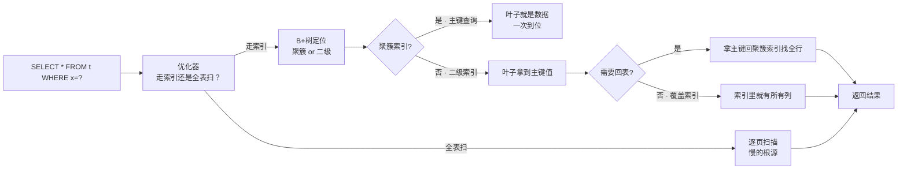
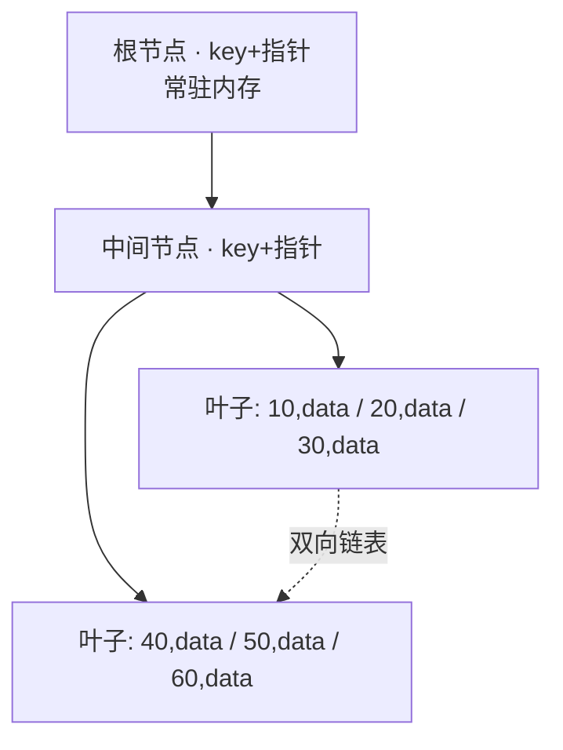
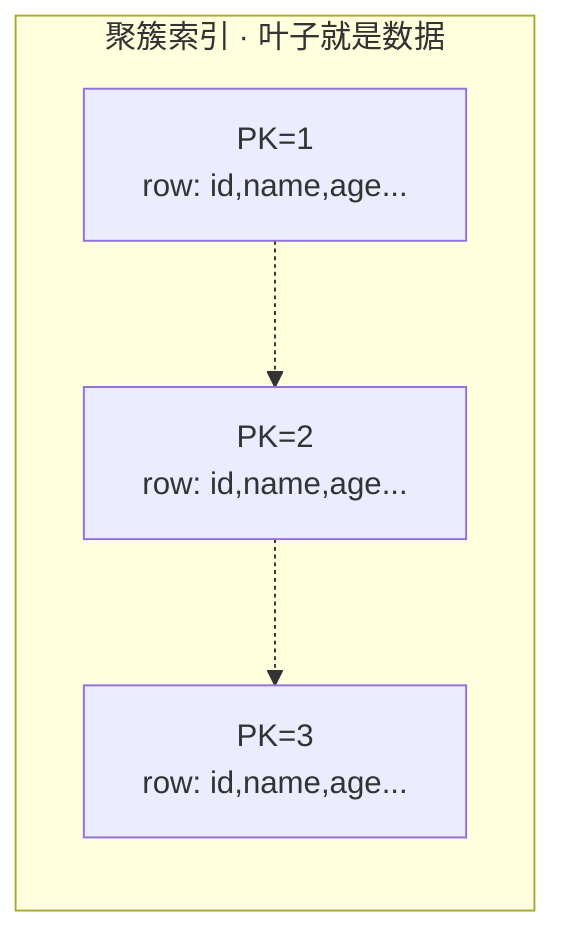
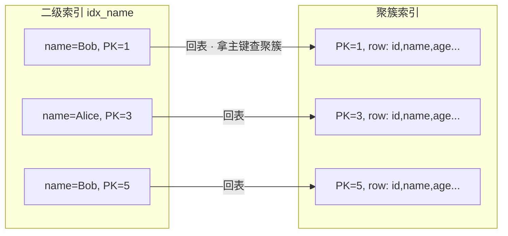
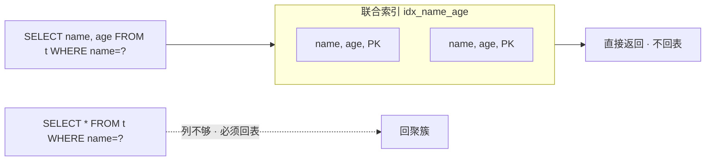
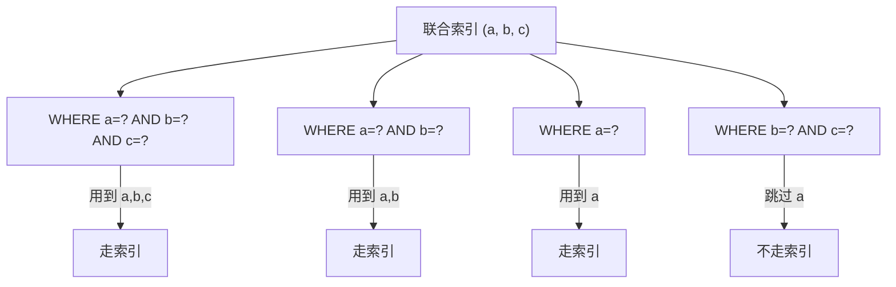
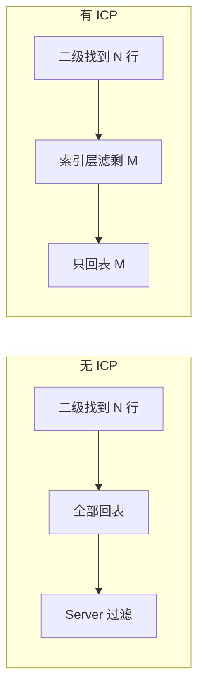
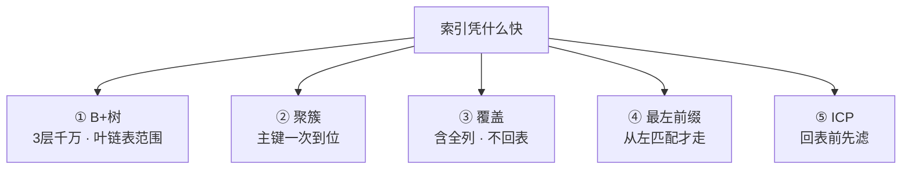
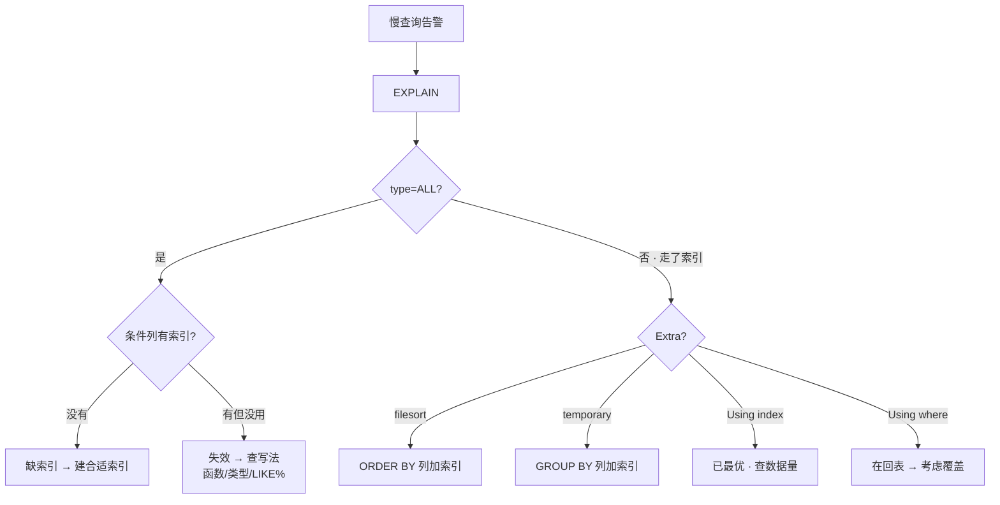

# 索引与执行计划

> 慢查询告警响了，DBA 说「加个索引就好了」——加完确实快了；换个条件查又慢了，再换一个索引又快。群里已经有人在堆索引，生怕少一个。
> **本章回答**：一条 SELECT 从进来到找到数据，中间走了哪些路、为什么有时快有时慢、怎么用 EXPLAIN 看清它走了哪条。
> **不讲**：存储引擎页结构细节、Buffer Pool → [02-01-01](../01-架构与存储引擎/)；事务隔离与锁 → [02-01-03](../03-事务与锁/)。

**标记**：🎯重点 · 🔥难点 · ⭐常考 · 🔧实操
---

## 一、一张图：一条查询的找人之旅

> 🎯 **一句话**：一条 SELECT 进来，要么走索引（B+树定位→可能回表），要么全表扫，走哪条由优化器看「哪条便宜」。



- 📖 **读图**
  - 🛤️ 主线分叉是「走不走索引」；走了还要再问「聚簇还是二级」「要不要回表」——每多一道多一次 IO
  - 🧯 全表扫是兜底：没索引可用，或优化器觉得回表更贵
  - ⚔️ EXPLAIN 就是照这张图拍 X 光（Q1～Q5 地基）

---

## 二、结构：B+树为什么是 B+树

> 🎯 **一句话**：InnoDB 索引是 B+树——非叶只存 key+指针，数据只在叶子，叶子双向链表串起来扛范围查。

### 🌲 为什么是这棵树 🔥

> 💡 **打个比方**：字典找「张」——先翻到「Z」标签（非叶指路），再从「张」那页往后连续翻（叶链表）。B+树 = 「标签 + 连续页」。

#### ❓ 为什么不是红黑树、不是 B 树？

- 📏 **红黑树太高**：二叉 → 百万行 ~20 层，每层一次磁盘 IO 不可接受
- 📦 **B 树节点也存数据**：一页塞的 key 更少、树更高
- ✅ **B+**：非叶只指路 → 16KB 页上千 key、**3 层覆盖千万**；叶链表扛范围扫

- 🔑 **三件关键设计**
  - **非叶只存 key + 子指针** —— 根常驻内存，实际磁盘 IO 往往 2～3 次
  - **数据只在叶子** —— 路标不占数据空间，树更矮
  - **叶子双向链表** —— `WHERE x BETWEEN 10 AND 50` 找到 10 后顺着链表走，不必回根



- 📖 **读图**：非叶全是路标；查 `x=50` 根→右→叶；范围查找到 10 后顺着链表走到 50

### 📄 页、区、段 ⭐

从大到小：

- **段（segment）**：一个索引对应一个段（聚簇有数据段，二级有索引段）
- **区（extent）**：默认 **1MB = 64 页** —— 连续分配，让顺序 IO 快一到两个数量级
- **页（page）**：最小 IO 单位，默认 **16KB** —— 读一行也是整页

> ⚠️ **别混**：页是 **IO 最小单位**，不是行的单位。覆盖索引省的是「不回表」，不是「少读列就能少 IO」。

> 本节对应练习题 **Q1**。

---

## 三、聚簇：主键索引与数据

> 🎯 **一句话**：InnoDB 聚簇索引就是表本身——叶子存整行，主键和数据不分家。

**聚簇索引（clustered index）** = 叶子直接存**整行数据**。一张表只能有一个：选主键 → 否则第一个非空唯一索引 → 否则隐藏 `_rowid`。



- 📖 **读图**：叶子不是「指向数据的指针」，就是数据。`WHERE id=2` 找到叶子 2 = 整行到手

#### ❓ 为什么一张表只能有一个聚簇索引？

- 📦 **叶子 = 整行物理排布**：按主键顺序排整张表，不能同时按两套主键物理排两遍
- 🔀 **二级索引另起一棵树**：叶子只存主键值，要全行再回聚簇（四节）
- 👉 **选主键 = 选物理排序键** —— 自增整型少页分裂；UUID 随机插入易分裂、二级索引也跟着变胖

### ⚖️ InnoDB vs MyISAM ⭐

| 对比 | **InnoDB 聚簇** | **MyISAM 非聚簇** |
|------|-----------------|-------------------|
| 数据存哪 | 聚簇叶子 = 整行 | 索引叶子 = 行物理位置指针 |
| 主键查全行 | 一次 B+树 | 索引 → 指针 → 再读数据 |
| 二级叶子 | **主键值** | 行物理位置指针 |
| 主键变大 | 二级跟着变胖 | 二级不受影响 |

> ⚠️ **别混**：MyISAM 二级叶子是**行指针**；InnoDB 二级叶子是**主键值** → InnoDB 查全行要「回表」。这是两家在索引设计上的根本差。

> 📝 **面试**：别只答「InnoDB 支持事务」——索引层面要答：聚簇 / 二级叶子存什么 / 要不要回表。

> 本节对应练习题 **Q2、Q3**。

---

## 四、找人：二级索引与回表

> 🎯 **一句话**：二级索引叶子存主键值不是整行——查到主键后再回聚簇拿全行，叫回表。

**二级索引（secondary index）** = 非聚簇的所有索引。叶子存 `(索引列值, 主键值)`。⭐



- 📖 **读图**：`WHERE name='Bob'` 在二级叶找到 PK=1、PK=5——只有主键，没有 `age`；要全行就得回聚簇再查

> 💡 **打个比方**：二级像「人名目录」——查到「Bob 在第 1、5 页」，目录里没正文；翻正文 = 回表。聚簇像按页码排好的书，翻到就是全文。

#### ❓ 为什么二级索引不直接存行指针？

- 🧱 **InnoDB 行会搬家**：页分裂、更新变长字段 → 物理位置变；若叶子存指针，全树要改
- 🔑 **存主键值**：主键稳定；代价是查全行多走一趟聚簇（回表）
- 💸 **代价**：二级命中 N 行 ≈ N 次聚簇查找 —— 优化器可能觉得「回表太贵，不如 ALL」

> 🔍 **现场**：有索引却没走，先怀疑回表太贵。

```sql
EXPLAIN SELECT * FROM users WHERE name='Bob';
-- type=ref, Extra 无 Using index → 走了二级但仍要回表
-- name 匹配行很多时，优化器可能直接选 ALL
```

> ⚠️ **别混**：`SELECT *` ≠ 一定全表扫——优化器仍会比「索引+回表」vs「ALL」。但 `SELECT *` 让覆盖失效，是「有索引却没用好」的常见根因。

> 本节对应练习题 **Q4**。

---

## 五、优化：覆盖索引与最左前缀

> 🎯 **一句话**：索引设计核心两条——覆盖查询要的列（不回表），条件匹配最左前缀（能走索引）。

⭐ 口诀：**覆盖 = 不回表；最左 = 从左连续用，范围一打断后面就废**。

### 🎯 覆盖索引：不回表 ⭐🔥

**覆盖索引（covering index）** = 索引含查询所需全部列，不必回聚簇。`Extra: Using index` = 生效。



- 📖 **读图**：`(name, age)` 叶含 `name, age, PK`。只要这两列 → 覆盖；`SELECT *` 缺列 → 回表

> 🎯 **关键直觉**：覆盖不是索引「类型」，是查询碰巧只用到索引列的**状态**。设计联合索引时把高频列塞进去，就是在「制造覆盖」。

```sql
EXPLAIN SELECT name, age FROM users WHERE name='Bob';
-- Extra: Using index  ← 覆盖，不回表

EXPLAIN SELECT name, age, email FROM users WHERE name='Bob';
-- Extra 无 Using index  ← email 不在索引里，必须回表
```

#### ❓ 为什么 SELECT * 会「毁掉」覆盖？

- 📋 **覆盖看 SELECT 列表**：缺一列就要回表
- ⭐ **`SELECT *` = 要所有列** → 二级几乎永远不够 → 覆盖失效
- 🛠️ **写法**：只选需要的列；或把高频列并进联合索引「制造覆盖」

> 📝 **面试**：避免回表 = 建覆盖索引，看 `Using index`。追问 SELECT * 有害 → 让覆盖失效。

### 📐 最左前缀：能不能用上 ⭐🔥

**最左前缀（leftmost prefix）** = 联合索引 `(a,b,c)` 按 `a→b→c` 排序；条件须从最左连续匹配。



- 📖 **读图**：能走的是 `a` / `a+b` / `a+b+c`；跳过 `a` 直接 `b`/`c` = 目录第一级没了，排序帮不上忙

```text
联合索引 (a, b, c)：
  WHERE a=?                  ✅ a
  WHERE a=? AND b=?          ✅ a,b
  WHERE a=? AND b=? AND c=?  ✅ a,b,c
  WHERE a=? AND c=?          ✅ 只用 a（c 定位不上，但 a 能走）
  WHERE b=? / b=? AND c=? / c=?  ❌ 跳过 a
```

> ⚠️ **别混**：`a=? AND c=?` ≠「完全不走」——`a` 仍走最左；`c` 在索引层用不上。这和 `b=?` 完全不走是两码事。

#### ❓ 为什么范围条件会「打断」后面的列？

- 📐 **排序语义**：`a` 定值后按 `b` 排；`b` 一旦是范围，范围内的 `c` **不再全局有序**
- ✅ **仍能用**：`a`（等值）+ `b`（范围）；`c` 只能回表后或 ICP 过滤
- 🛠️ **设计**：等值列在前，范围列放「能用上的最后一列」

> 💡 **打个比方**：电话簿先姓后名。查「张三」能直达；查「所有姓张」能从那页扫；查「所有叫三的」——姓被跳过，只能从头翻。

### 🧩 联合索引设计：顺序决定一切 ⭐

- **等值在前、范围在后** —— 范围后的列用不上
- **区分度高在前** —— `status` 三值过滤弱；`user_id` 万级能定位
- **高频场景在前** —— 覆盖最多查询

```sql
-- 常查：user_id=? AND created_at BETWEEN ? AND ?
CREATE INDEX idx_uid_time ON orders(user_id, created_at);   -- ✅ 等值→范围
CREATE INDEX idx_time_uid ON orders(created_at, user_id);   -- ❌ 范围在前，user_id 废
```

### ✂️ 前缀索引：长字符串折中 🔧

**前缀索引（prefix index）** = 只对字符串前 N 字符建索引，省空间。

- ❌ 不能覆盖（前缀 ≠ 全值）
- ❌ 不能靠前缀做 `ORDER BY`

```sql
CREATE INDEX idx_email_prefix ON users(email(6));
EXPLAIN SELECT id, email FROM users WHERE email='bob@example.com';
-- Extra: Using where  ← 不覆盖；不会出现 Using index
```

> ⚠️ **别混**：前缀索引 = **单列截前 N 字符**；最左前缀 = **联合索引从左匹配**——同名不同义。

### 🔒 唯一索引 vs 普通索引 ⭐

| 对比 | **唯一** | **普通** |
|------|----------|----------|
| 查找 | 找到第一条可停 | 还要看有没有重复 |
| 插入 | 先查重 | 直接插 |
| 约束 | 保证唯一 | 不保证 |

等值查询差异在微秒级——**该唯一就建唯一**，别为那点差放弃约束。

### ⬇️ 索引下推：ICP 🔥

**索引下推（Index Condition Pushdown）** = MySQL 5.6+ 把部分 `WHERE` 推到引擎，在索引遍历时过滤，少回表。



- 📖 **读图**：无 ICP = 每条都回表再滤；ICP = 回表前先滤，N→M

```sql
-- 联合索引 (name, age)
EXPLAIN SELECT * FROM users WHERE name LIKE 'B%' AND age > 18;
-- Extra: Using index condition  ← ICP：age 在索引层先滤
```

#### ❓ `Using index` 和 `Using index condition` 差一个词？

- 🎯 **`Using index`**：覆盖 —— **零回表**
- 🔧 **`Using index condition`**：ICP —— **少回表**，仍可能回
- ⚠️ 说成一回事面试直接减分

### 收束：索引凭什么快 🎯⭐

面试问「索引为什么快 / 怎么优化慢查询」——**五件套**：



- 📖 **读图**
  - ① 结构：O(N)→O(log N)，范围变顺序扫
  - ②③ IO：聚簇/覆盖决定要不要额外查
  - ④⑤ 匹配：最左决定走不走，ICP 决定回表少不少

#### ❓ 加了索引为什么还可能全表扫？

- 🧮 **优化器比成本**：回表行太多时，ALL 可能更便宜（小表 / 匹配比例高）
- ✍️ **写法让索引失效**：函数包列、隐式类型转换、`LIKE '%xx'`（六节）
- ⚖️ **`type=ALL` ≠ 一定错**：看表大小和匹配比例；大表 ALL 才是红线

> 📝 **面试**：五件套按「结构 → 存储 → 匹配」记；补一句「加了不一定走、走了不一定不回表——EXPLAIN 是裁判」。

> 本节对应练习题 **Q5、Q6、Q7、Q8、Q9**。

---

## 六、诊断：EXPLAIN 执行计划

> 🎯 **一句话**：EXPLAIN =「这条 SQL 我打算怎么跑」——重点看 `type`（访问级别）和 `Extra`（额外代价）。

### 🔎 怎么读 🔧⭐

```sql
EXPLAIN SELECT * FROM users WHERE name='Bob' AND age > 18;
```

```text
+----+--------+-------+------+---------------+-------------+---------+-------+------+-----------------------+
| id | select | table | type | possible_keys | key         | key_len | ref   | rows | Extra                 |
+----+--------+-------+------+---------------+-------------+---------+-------+------+-----------------------+
|  1 | SIMPLE | users | ref  | idx_name_age  | idx_name_age| 62      | const |   10 | Using index condition |
+----+--------+-------+------+---------------+-------------+---------+-------+------+-----------------------+
```

- 🔑 **核心列**
  - `type` ← system > const > eq_ref > ref > range > index > ALL
  - `key` ← 实际用的索引（NULL = 没走）
  - `key_len` ← 用了多长 → 联合索引用了几列
  - `rows` ← 估算扫描行（估算值，不是精确）
  - `Extra` ← Using index / where / filesort / temporary / index condition

- 📏 **key_len 读法**：`(a INT, b VARCHAR(20) utf8mb4, c TINYINT)` → `4` 只用 a；`86` 用 a+b；`87` 三列全用。比总长短 = 有列没用上（常见：范围打断）

### 📊 type：访问类型 🔥

从好到差：

- `system` / `const` —— 至多一行（主键/唯一等值）
- `eq_ref` —— JOIN 被驱动表主键/唯一等值
- `ref` —— 非唯一等值，可能多行
- `range` —— 范围 / `IN` / `BETWEEN`
- `index` —— **扫整棵索引树**（常配合覆盖）
- `ALL` —— 全表扫

#### ❓ 为什么 type=index 仍可能很慢？

- 🔁 **`index` = 全扫索引树**，只是通常比数据表小
- ✅ 覆盖场景可接受；❌ 当「很快的索引查找」就错了
- 🚨 大表 `ALL` 基本要治；`index` 看行数与是否真需要全扫

> ⚠️ **别混**：`index` 与 `ALL` 都是全扫形态；差在扫的是索引还是数据页。

### 📎 Extra：额外操作 ⭐

- `Using index` —— 覆盖，最好
- `Using index condition` —— ICP，好
- `Using where` —— Server 层再滤（常伴随回表）
- `Using filesort` —— 额外排序（不一定落盘）；`ORDER BY` 无索引或方向不一致
- `Using temporary` —— 临时表；`DISTINCT` / `GROUP BY` / `UNION` 常见

> 📝 **面试**：EXPLAIN 看 type（大表 ALL 查有没有/用没用上）+ Extra（`Using index` 最好，filesort/temporary 最差）。

### 🚫 索引失效的常见写法 🔧

```sql
-- ① 函数包列
EXPLAIN SELECT * FROM users WHERE YEAR(created_at)=2024;           -- ALL
EXPLAIN SELECT * FROM users
  WHERE created_at >= '2024-01-01' AND created_at < '2025-01-01'; -- range

-- ② 隐式类型转换（phone 是 varchar）
EXPLAIN SELECT * FROM users WHERE phone=13800138000;   -- ALL
EXPLAIN SELECT * FROM users WHERE phone='13800138000'; -- ref

-- ③ LIKE 前缀通配
EXPLAIN SELECT * FROM users WHERE name LIKE '%ob';  -- ALL
EXPLAIN SELECT * FROM users WHERE name LIKE 'Bo%';  -- range
```

> 🔍 **现场**：慢 SQL 先 EXPLAIN —— `ALL` 先查有没有索引；有却没用上查写法（函数/类型/`LIKE%`）。

> 本节对应练习题 **Q10、Q11、Q12**。

---

## 七、作战：定责（慢查询是不是索引问题）

> 🎯 **一句话**：先 EXPLAIN —— `type=ALL` 缺索引或失效；Extra 有 filesort/temporary 改查询或加排序/分组索引。

### 🗺️ 定责决策树



- 📖 **读图**：入口永远 EXPLAIN；`ALL` 查「有没有、用没用上」；走了再看 Extra。`Using index` 是终点

### 现象 · 先做 · 别做

| 现象 | 先做 | 别做 |
|------|------|------|
| type=ALL 大表 | 条件列有没有索引 | 先加 CPU/内存 |
| 有索引仍 ALL | 写法：函数/转换/LIKE% | 直接删重建索引 |
| Using filesort | ORDER BY 列加索引 | 关掉排序（业务要） |
| Using temporary | GROUP BY 列加索引 | 硬拆多查询 |
| 走索引仍慢 | rows + 回表量 | 盲目堆索引 |
| 加索引后变慢 | 索引太多拖写入 | 一口气删光 |
| LIMIT 深翻页 | 游标分页 / 延迟关联 | 加大 OFFSET |

### 60 秒剧本 🔧

> 🔍 **现场**：接到告警，60 秒走完再开口。

```text
① 0–10s   EXPLAIN → type？Extra 有 filesort/temporary？
② 10–30s  ALL → SHOW INDEX；有却没用 → 查写法
③ 30–45s  走了仍慢 → rows 大？Using where（回表）？→ 覆盖
④ 45–60s  定型：建索引 / 改 SQL / 扩联合索引 / 游标分页；再 EXPLAIN 验证
```

> 本节对应练习题 **Q13、Q14**。

---

## 八、收口

### 命令速查 🔧

```bash
EXPLAIN SELECT ...;                          # type / key / Extra
EXPLAIN FORMAT=JSON SELECT ...;              # 更细
SHOW INDEX FROM <table>;                     # 有哪些索引
SHOW VARIABLES LIKE 'slow_query%';           # 慢查询开关
SHOW VARIABLES LIKE 'long_query_time';       # 默认 10s，建议 1s
SHOW STATUS LIKE 'Handler_read%';            # rnd_next 高 ≈ 全表扫多
# 大表线上加索引用 pt-osc / gh-ost，别直接锁表硬加
ALTER TABLE <table> ADD INDEX idx_x (col);
ALTER TABLE <table> ADD UNIQUE INDEX uk_x (col);
ALTER TABLE <table> DROP INDEX idx_x;
```

### 面试锚点

| 问 | 30 秒答 |
|----|---------|
| 为何 B+ 不用红黑树？ | 红黑树层太多每层一次 IO；B+ 非叶只存 key，3 层千万；叶链表扛范围 |
| 聚簇索引？ | 叶子=整行，表本身；InnoDB 主键即聚簇，一张表一个 |
| InnoDB vs MyISAM 索引？ | InnoDB 二级存主键要回表；MyISAM 存行指针，主键/二级结构同 |
| 回表？ | 二级只有主键，回聚簇拿全行；N 行≈N 次聚簇查找 |
| 避免回表？ | 覆盖索引；Extra=`Using index` |
| 最左前缀？ | (a,b,c) 从左连续匹配；跳 a 不走；范围后后续列废 |
| ICP？ | 条件下推引擎，索引层先滤；Extra=`Using index condition` |
| Using index vs condition？ | 前者覆盖零回表；后者 ICP 少回表 |
| EXPLAIN 看啥？ | type 级别 + Extra 代价；大表 ALL / filesort / temporary |
| 索引失效写法？ | 函数包列、隐式转换、`LIKE '%x'` |
| 主键为何自增整型？ | 追加少页分裂；整型小，二级存主键也小 |
| 页/区/段？ | 页 16KB IO 单位；区 1MB=64 页；段=一个索引 |

### 易错一句话对照

- B+树=B 树 → 非叶只存 key，数据只在叶，叶有链表
- 加了索引一定走 → 优化器可判 ALL 更便宜
- SELECT * 有索引就没事 → 覆盖失效，几乎必回表
- Using index = 走了索引 → 是**覆盖**；走了但没覆盖不会出现
- Using index = Using index condition → 覆盖 vs ICP
- type=index 很快 → 仍是全扫索引树
- 查 b 能走 (a,b,c) → 跳 a 不满足最左
- a=? AND c=? 完全不走 → a 能走，c 用不上
- 范围后后面列还能用 → 有序性被破坏，后续列废
- 前缀索引=最左前缀 → 单列截字 vs 联合从左匹配
- 唯一比普通快很多 → 等值差微秒级，该唯一就建
- 建了索引就治好 → 可能写法失效
- 页越小 IO 越少 → 读一行也是整页
- 索引越多越好 → 写入维护成本涨
- EXPLAIN rows 精确 → 估算值
- 深翻页加大 OFFSET → 改游标/延迟关联
- key_len 短=没走索引 → 只说明联合列没用全
- 加索引不锁表 → Online DDL 仍有影响，大表用 gh-ost/pt-osc

### 数字墙

> 页 **16KB** · 区 **1MB**=64 页 · B+ **3 层**覆盖**千万** · 根常驻**内存** · 二级叶存**主键值** · 回表 1 次=1 次聚簇查找 · 覆盖 Extra=**Using index** · ICP Extra=**Using index condition** · type 最差 **ALL** · 慢查询默认 **10s**（建议 **1s**）· 大表 **ALL** 红线 · 范围后**后续列失效** · 前缀索引**不能覆盖** · 自增主键**少页分裂**

---

## 合上书

对着第一节主图口述一遍，卡住就回对应小节。

- [ ] **默画主图**：SQL → 优化器 → B+定位 → 聚簇/二级 → 回表/覆盖 → 结果（Q1～Q5）
- [ ] **口述 B+树**：为何不用红黑树、非叶只存 key、叶链表、3 层千万（Q1）
- [ ] **口述页/区/段**：16KB / 1MB / 段；为何读一行=整页 IO（Q1）
- [ ] **默画聚簇 vs 二级**：叶存什么；InnoDB vs MyISAM（Q2、Q3）
- [ ] **口述回表**：为何要回、代价、EXPLAIN 怎么认（Q4）
- [ ] **口述覆盖**：`Using index`、SELECT * 有害、怎么制造覆盖（Q5）
- [ ] **默画最左前缀**：哪些走、哪些不走、范围为何打断（Q6、Q7）
- [ ] **口述联合设计**：等值→范围、区分度、高频（Q8、Q14）
- [ ] **口述 ICP**：与 `Using index` 差一个词（Q9）
- [ ] **口述 EXPLAIN**：type 阶梯、Extra 三关键词、index vs ALL（Q10、Q11）
- [ ] **口述失效写法**：函数 / 隐式转换 / `LIKE%`，各给对写法（Q12）
- [ ] **定责**：决策树两分支——再看开篇「再加一个索引」，你知道怎么拦住他了（Q13）

下一章：[事务与锁](../03-事务与锁/)。地基：[架构与存储引擎](../01-架构与存储引擎/)。
