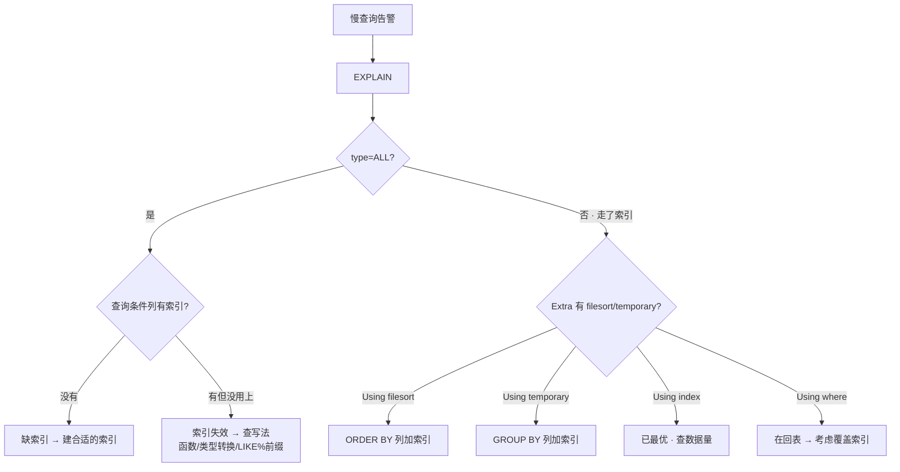

# 02｜索引与执行计划 · 练习题

开始做题前，先给大家一个小建议：合上知识点，对着 **一节的主图**，把「一条查询的找人之旅」口述一遍——SQL 进来 → 优化器选路 → B+树定位 → 聚簇/二级分叉 → 回表/覆盖分叉 → 返回结果。能顺下来，下面这些题你会发现大半都会了；卡壳的地方，就是你该回去重读的那一节。

做题的方式也建议改一下：每道题**先看标题和场景，自己口述一遍答案，再往下看「完整解答」对答案**。直接看解答，容易产生「我会了」的错觉——能讲出来才是真的会。

| 标记 | 含义 |
|------|------|
| **核心** | 不懂整章就没建立起来 |
| **必会** | 值班和面试都要能讲 |
| **常用** | 线上会反复碰到 |
| **常考** | 白板和追问的高频口径 |

题目的顺序也是有意排的：Q1～Q3 钉死 B+树与聚簇地基；Q4～Q9 专攻回表、覆盖、最左前缀与 ICP；Q10～Q12 是 EXPLAIN 读法；Q13、Q14 收尾到值班定责与设计实战。

## 本题目录

- [Q1 B+树为什么不用红黑树](#q1)
- [Q2 聚簇索引是什么，一张表能有几个](#q2)
- [Q3 InnoDB 和 MyISAM 索引区别](#q3)
- [Q4 什么是回表，回表的代价](#q4)
- [Q5 怎么避免回表——覆盖索引](#q5)
- [Q6 最左前缀原则](#q6)
- [Q7 范围查询为什么打断最左前缀](#q7)
- [Q8 联合索引怎么设计列顺序](#q8)
- [Q9 索引下推 ICP](#q9)
- [Q10 EXPLAIN type 各值含义](#q10)
- [Q11 Using index vs Using index condition vs Using filesort](#q11)
- [Q12 索引失效的常见写法](#q12)
- [Q13 慢查询定责——加了索引却没走](#q13)
- [Q14 订单表联合索引怎么设计](#q14)
- [合上书](#合上书)

---

## Q1

**★★★★★｜B+树为什么不用红黑树做索引？**

**覆盖**：核心 · 必会 · 常考 ｜ **对应**：知识点 [二、结构：B+树为什么是B+树](知识点.md)

### 场景

这道题几乎是索引面试的「开场白」。面试官画了一棵红黑树问你「MySQL 为什么不用这个」，你旁边的候选人开始答「红黑树是自平衡二叉树……」——你要答到点子上。

先自己试试：不看下面，你能口述出关键结论吗？想完再对答案。

### 完整解答

> 🎯 **一句话**：红黑树是二叉的，千万行约 20 层每层一次磁盘 IO；B+树非叶子只存 key，一个 16KB 页放上千 key，3 层覆盖千万行。

红黑树是二叉树，高度 `log₂N`——100 万行约 20 层，每层一次磁盘 IO 不可接受。B 树每个节点都存数据，一个页能放的 key 数量少、树也高。**B+树**的三个关键设计：

- **非叶子节点只存 key 和子节点指针**——一个 16KB 页能放上千个 key，3 层就能覆盖千万级数据，根节点常驻内存，实际只有 2~3 次磁盘 IO。
- **数据只在叶子节点**——非叶子节点是路标，不占空间存数据，一个页能放更多 key，树更矮。
- **叶子节点用双向链表串起来**——范围查询 `WHERE x BETWEEN 10 AND 50` 找到 10 后顺着链表走即可，不用回根节点。

页是 InnoDB 的最小 IO 单位，默认 16KB——不管读一行还是一页，磁盘都给一整页。B+树让一个页放更多 key，等于让一次 IO 能排除更多分支，树更矮、IO 更少。

> 📝 **面试**：答完「红黑树二叉太高」后补一句「B+树叶子链表支持范围查询，B 树做范围查要回到根节点重新找——这也是不用 B 树的原因」。

### 再追问

**问**：B+树 3 层能存多少行？
**答**：非叶子节点一个页放上千 key，3 层 = 根(1 页) × 中间(上千页) × 叶子(上千×上千页)，每页放几百行，覆盖千万级行。根节点常驻内存，实际 2~3 次磁盘 IO。

**问**：那为什么不用跳表（Skip List）？
**答**：跳表是内存结构，适合 Redis 那种全内存场景。磁盘 IO 的核心是「减少 IO 次数」——B+树一个页放更多 key 来降低树高，跳表做不到这一点。不要为了「全面」硬比，两者解决的问题域不同。

---

## Q2

**★★★★★｜聚簇索引是什么？一张表能有几个？**

**覆盖**：核心 · 必会 · 常考 ｜ **对应**：知识点 [三、聚簇：主键索引与数据](知识点.md)

### 场景

B+树讲完落到 InnoDB：面试官问「你表上的主键索引是什么样的」，你要说清「索引就是表本身」。

先自己试试：不看下面，你能口述出关键结论吗？想完再对答案。

### 完整解答

> 🎯 **一句话**：聚簇索引的叶子节点存整行数据，索引就是表本身，一张表只能有一个。

**聚簇索引（clustered index）** = 索引的叶子节点直接存**整行数据**的索引。InnoDB 选主键做聚簇索引；没主键选第一个非空唯一索引；都没有就生成隐藏列 `_rowid`。

聚簇索引的 B+树叶子节点不存「指向数据的指针」，它就是数据本身——`WHERE id=2` 走聚簇索引找到叶子节点 2 就拿到了整行，一次 B+树查找就够。

一张表只能有一个聚簇索引——因为数据只能按一种方式物理排序。其他索引都是二级索引，叶子节点存主键值，要回表。

> ⚠️ **别混**：聚簇索引不是「主键索引」的同义词——没有主键时 InnoDB 选唯一索引或隐藏列做聚簇索引。聚簇索引的关键是「叶子存整行数据」，不是「用了主键」。

### 再追问

**问**：没有主键也没有唯一索引，InnoDB 怎么办？
**答**：生成一个 6 字节的隐藏列 `_rowid` 做聚簇索引。所以建表时最好显式定义自增主键——让聚簇索引按追加写入，不页分裂。

**问**：主键为什么建议用自增整型而不是 UUID？
**答**：聚簇索引按主键排序存储，自增主键追加到末尾不页分裂；UUID 随机插入，B+树要在中间找位置触发页分裂——写放大、碎片多。整型主键还比 UUID 小，二级索引叶子存主键值，主键越小二级索引越小。不要用 UUID 做主键——如果业务需要 UUID，存为普通列加二级索引即可。

---

## Q3

**★★★★☆｜InnoDB 和 MyISAM 在索引层面有什么区别？**

**覆盖**：必会 · 常考 ｜ **对应**：知识点 [三、聚簇：主键索引与数据](知识点.md)

### 场景

这是 Q2 的对照版——面试官说「你讲了 InnoDB 是聚簇索引，那 MyISAM 呢」——别只答「InnoDB 支持事务」。

先自己试试：不看下面，你能口述出关键结论吗？想完再对答案。

### 完整解答

> 🎯 **一句话**：InnoDB 聚簇——叶子存整行，二级索引存主键值要回表；MyISAM 非聚簇——索引叶子存行物理位置指针，主键和二级索引结构一样。

| 对比 | **InnoDB 聚簇索引** | **MyISAM 非聚簇** |
|------|---------------------|-------------------|
| 数据存哪 | 聚簇索引叶子节点就是数据 | 索引叶子存「行物理位置指针」 |
| 主键查全行 | 一次 B+树查找 | 找索引 → 拿指针 → 再读数据行 |
| 二级索引叶子存什么 | 主键值 | 行物理位置指针 |
| 主键变大时二级索引 | 受影响（要跟着存主键值） | 不受影响 |

InnoDB 二级索引查全行要回聚簇索引——因为二级索引叶子存的是主键值不是整行。MyISAM 的二级索引叶子存行物理位置指针，直接定位到数据行，不涉及主键——主键和二级索引在结构上没有区别。

> 📝 **面试**：答完区别补一句「InnoDB 二级索引存主键值的好处是主键变了不用重建所有二级索引（只需更新主键值），MyISAM 存行物理位置指针则不受主键变化影响但数据移动后指针要更新」。

### 再追问

**问**：为什么 InnoDB 二级索引不存行物理位置指针？
**答**：InnoDB 的聚簇索引按主键排序——行在页中的物理位置会随着页分裂、行迁移而变化。如果二级索引存物理位置，每次行移动都要更新所有二级索引。存主键值则不受行物理位置变化影响——主键值不变，二级索引就不变。代价是查全行要回表。

---

## Q4

**★★★★★｜什么是回表？回表的代价是什么？**

**覆盖**：核心 · 必会 · 常考 ｜ **对应**：知识点 [四、找人：二级索引与回表](知识点.md)

### 场景

聚簇/二级分清了，下一刀就是回表：线上加了 `idx_name` 索引，`SELECT * FROM users WHERE name='Bob'` 还是慢——DBA 说「回表太多了」。

先自己试试：不看下面，你能口述出关键结论吗？想完再对答案。

### 完整解答

> 🎯 **一句话**：二级索引叶子存主键值不是整行，查到主键后要回聚簇索引拿全行，一次回表 = 一次聚簇 B+树查找。

**二级索引（secondary index）** 的 B+树叶子节点存的是 `(索引列值, 主键值)`，不存整行数据。`SELECT * FROM users WHERE name='Bob'` 走二级索引 `idx_name`，叶子节点找到 `name='Bob', PK=1`——这里只有主键值，没有 `age`、`email` 等其他列。要拿全行就得拿主键值 `PK=1` 回聚簇索引再查一次，这就是**回表（table lookup）**。

回表的代价：每回表一次就是一次聚簇索引 B+树查找。如果二级索引查出 10000 行，就要回表 10000 次——优化器会评估「走索引 + 回表 10000 次」vs「全表扫一次」哪个便宜，如果回表代价太大，优化器直接放弃二级索引走全表扫。

```sql
-- 有 idx_name 但 SELECT * 要回表
EXPLAIN SELECT * FROM users WHERE name='Bob';
-- type=ref, Extra 没有 Using index → 走了二级索引但要回表
```

> ⚠️ **别混**：`SELECT *` 不一定走全表扫——条件列有索引时优化器还是评估「走索引+回表」vs「全表扫」。但 `SELECT *` 让回表不可避免，是「有索引却没用上」的常见原因。

### 再追问

**问**：怎么判断有没有回表？
**答**：EXPLAIN 看 Extra——没有 `Using index` 就是回表了。`Using where` 说明回表后还要在 Server 层过滤。

**问**：为什么优化器有时放弃索引走全表扫？
**答**：回表代价太大——二级索引匹配行数多时，每行回表一次聚簇 B+树查找，优化器评估全表扫更便宜就不走索引。不要看到 `type=ALL` 就说缺索引——先看匹配行数比例。

---

## Q5

**★★★★★｜怎么避免回表？覆盖索引是什么？**

**覆盖**：核心 · 必会 · 常考 ｜ **对应**：知识点 [五、优化：覆盖索引与最左前缀](知识点.md)

### 场景

这是 Q4 的治本版——面试官问「你的查询走了索引但还是慢，怎么优化」——你要答出覆盖索引。

先自己试试：不看下面，你能口述出关键结论吗？想完再对答案。

### 完整解答

> 🎯 **一句话**：让联合索引包含查询要的所有列，索引里就有全量数据，不必回表——EXPLAIN 出现 `Using index` 就是覆盖索引生效。

**覆盖索引（covering index）** = 一个索引包含了查询需要的所有列，不必回表查聚簇索引。联合索引 `(name, age)` 的叶子节点存了 `name, age, 主键`——`SELECT name, age FROM users WHERE name=?` 需要的列都在索引里，直接返回不回表。

```sql
-- 覆盖索引生效
EXPLAIN SELECT name, age FROM users WHERE name='Bob';
-- Extra: Using index  ← 索引覆盖了所有列，不回表

-- 回表
EXPLAIN SELECT name, age, email FROM users WHERE name='Bob';
-- Extra: NULL  ← email 不在索引里，必须回表
```

覆盖索引不是一种索引类型，是一种查询碰巧只用到索引列的状态。设计联合索引时有意把高频查询的列放进去，就是在「制造覆盖」。

> ⚠️ **别混**：覆盖索引减少的是回表 IO，不是「少读列」——页是 IO 最小单位，读一行和读一页是同一次 IO。`SELECT name, age` 和 `SELECT name` 在走索引时 IO 量一样——覆盖索引靠的是「不用回聚簇索引」，不是「少选列少读」。

### 再追问

**问**：为什么 SELECT * 有害？
**答**：`SELECT *` 要所有列，联合索引不可能覆盖所有列（那样索引比表还大），每次都要回表。改成 `SELECT name, age` 只选索引覆盖的列就能避免回表。不要为了「方便」用 `SELECT *`——线上代码必须明确列名。

**问**：前缀索引能不能做覆盖索引？
**答**：不能——前缀索引只存字符串前 N 字符，EXPLAIN 不会出现 `Using index`，会回表 + `Using where` 过滤。前缀索引省的是索引空间，代价是永远不能覆盖。

---

## Q6

**★★★★★｜最左前缀原则是什么？联合索引 (a,b,c) 哪些查询能走索引？**

**覆盖**：核心 · 必会 · 常考 ｜ **对应**：知识点 [五、优化：覆盖索引与最左前缀](知识点.md)

### 场景

覆盖讲完，联合索引怎么用得上：面试官在白板上写 `CREATE INDEX idx ON t(a,b,c)`，然后问了五种 `WHERE` 写法——你要快速判断哪些走索引。

先自己试试：不看下面，你能口述出关键结论吗？想完再对答案。

### 完整解答

> 🎯 **一句话**：联合索引按 a→b→c 排序，查询必须从最左列开始连续匹配才能走索引——跳过 a 用 b/c 走不了。

**最左前缀（leftmost prefix）** = 联合索引 `(a, b, c)` 的 B+树先按 `a` 排序、`a` 相同再按 `b` 排序、再按 `c`——查询条件必须从最左列开始连续匹配。

```text
联合索引 (a, b, c) 能走索引的查询：
  WHERE a=?                  ✅ 用到 a
  WHERE a=? AND b=?          ✅ 用到 a,b
  WHERE a=? AND b=? AND c=?  ✅ 用到 a,b,c
  WHERE a=? AND c=?          ✅ 用到 a（c 用不上，但 a 能定位）
  WHERE b=?                  ❌ 跳过 a
  WHERE b=? AND c=?          ❌ 跳过 a
  WHERE c=?                  ❌ 跳过 a
```

> 💡 **打个比方**：联合索引像电话簿——先按姓排，姓相同再按名排。查「张三」能直接翻到；查「所有姓张的」能翻到那一页往后扫；但查「所有叫三的」——姓被跳过了，电话簿的排序帮不上忙，只能从头翻到尾。

> ⚠️ **别混**：`WHERE a=? AND c=?` 不是完全不走索引——`a` 能用上最左前缀走索引定位，`c` 在索引层用不上过滤。这和 `WHERE b=?` 跳过 `a` 完全不走索引是两码事。

### 再追问

**问**：`WHERE a=? AND b=? AND c=?` 和 `WHERE c=? AND b=? AND a=?` 有区别吗？
**答**：没有——优化器会自动调整条件顺序匹配索引。最左前缀是「索引列的顺序」，不是 `WHERE` 条件的书写顺序。不要为了匹配索引手动调整 `WHERE` 条件顺序——优化器帮你做。

**问**：`WHERE a>? AND b=?` 能走索引吗？
**答**：`a` 做范围查询，`b` 在 `a` 范围查询后用不上索引——因为 `a` 的范围打破了 `b` 的有序性。这叫「范围查询打断最左前缀」。不要把范围查询列放在联合索引前面——等值在前、范围在后。

---

## Q7

**★★★★☆｜范围查询为什么打断最左前缀？`WHERE a=? AND b>? AND c=?` 中 c 能用索引吗？**

**覆盖**：核心 · 常考 ｜ **对应**：知识点 [五、优化：覆盖索引与最左前缀](知识点.md)

### 场景

这是 Q6 最容易踩的坑特写——面试官追问上一题——「如果 b 是范围查询呢，c 还能用索引吗」，很多候选人卡在这里。

先自己试试：不看下面，你能口述出关键结论吗？想完再对答案。

### 完整解答

> 🎯 **一句话**：b 做范围查询后，c 的有序性被打破——B+树在 b 的范围内无法保证 c 有序，c 用不上索引。

联合索引 `(a, b, c)` 的 B+树排序规则：先按 `a` 排序，`a` 相同按 `b` 排序，`b` 相同按 `c` 排序。

`WHERE a=? AND b>? AND c=?` 的过程：
1. `a=?` 等值匹配——走索引定位到 `a` 的分区。
2. `b>?` 范围查询——在 `a` 的分区内，`b` 是有序的，可以范围扫描。
3. `c=?` 等值匹配——在 `b>?` 的范围内，`c` **不一定有序**。因为 B+树的排序是 `a→b→c`，`b` 值不同时 `c` 的顺序是乱的。

> 💡 **打个比方**：电话簿按「姓→名→年龄」排。你查「姓张、名以三开头、年龄>18」——找到「张三」后往后翻，名字不全是「三」了，年龄也就没有顺序了。

```sql
-- 联合索引 (a, b, c)
EXPLAIN SELECT * FROM t WHERE a=1 AND b>10 AND c=5;
-- key_len 只包含 a + b 的长度，c 用不上索引
-- Extra: Using index condition（ICP 可能在索引层过滤 c）
```

> 📝 **面试**：范围查询打断最左前缀——`>, <, BETWEEN, LIKE` 等范围操作后面的列用不上索引。等值查询不会打断。设计联合索引时把范围查询列放最后。

### 再追问

**问**：`LIKE 'Bo%'` 算范围查询吗？
**答**：算——`LIKE 'Bo%'` 匹配的是一个前缀范围，在索引层相当于 `>= 'Bo' AND < 'Bp'`。所以 `WHERE a=? AND b LIKE 'Bo%' AND c=?` 中，`b` 做了范围查询，`c` 用不上索引。但 `LIKE '%ob'` 不是范围查询——它不走索引，根本不在最左前缀的讨论范围内。

**问**：`IN` 算范围查询吗？
**答**：`IN` 在优化器层面通常被当作多个等值查询处理，不像 `>` 那样严格打断后续列。但 `IN` 列表很长时优化器可能退化。不要依赖 `IN` 后面的列一定走索引——EXPLAIN 验证为准。

---

## Q8

**★★★★☆｜联合索引 (a,b,c) 怎么设计列顺序？给一个场景说出原则。**

**覆盖**：必会 · 常考 ｜ **对应**：知识点 [五、优化：覆盖索引与最左前缀](知识点.md)

### 场景

原则记完要会设计：订单表有 5000 万行，高频查询 `WHERE user_id=? AND created_at BETWEEN ? AND ?`，DBA 让你设计索引——你怎么排顺序。

先自己试试：不看下面，你能口述出关键结论吗？想完再对答案。

### 完整解答

> 🎯 **一句话**：等值在前、范围在后；区分度高的在前；高频查询在前——三条原则定顺序。

设计原则：

- **等值查询的列放前面，范围查询的列放后面**——范围查询后面的列用不上索引（范围查询打断最左前缀）。
- **区分度高的列放前面**——`status` 只有 0/1/2 三个值，放前面过滤不掉多少行；`user_id` 几万个值，放前面能快速定位。
- **高频查询的列放前面**——覆盖最多查询场景。

```sql
-- 场景：WHERE user_id=? AND created_at BETWEEN ? AND ?
-- 正确：user_id 在前（等值），created_at 在后（范围）
CREATE INDEX idx_uid_time ON orders(user_id, created_at);

-- 错误：created_at 在前（范围），user_id 在后 → user_id 用不上索引
CREATE INDEX idx_time_uid ON orders(created_at, user_id);
```

验证：`EXPLAIN SELECT * FROM orders WHERE user_id=123 AND created_at BETWEEN '2024-01-01' AND '2024-12-31'`——`idx_uid_time` 的 `key_len` 包含 `user_id + created_at`，两个列都用上了；`idx_time_uid` 只有 `created_at` 用上，`user_id` 被范围查询打断了。

> ⚠️ **别混**：区分度高的列在前，不是「列的基数越大越好」——`url` 列基数极大但几乎不做查询条件，放前面浪费。原则是「**查询条件里**区分度高的在前」。

### 再追问

**问**：如果想覆盖 `SELECT user_id, created_at, amount FROM orders WHERE user_id=?` 呢？
**答**：联合索引改为 `(user_id, created_at, amount)`——`amount` 放最后做覆盖列，不参与最左前缀定位但被索引覆盖，不用回表。代价是 `amount` 更新时索引也要更新。不要盲目加覆盖列——写入代价和查询收益要平衡。

**问**：已有 `(user_id, created_at)` 还要单独加 `user_id` 的索引吗？
**答**：不要——联合索引 `(user_id, created_at)` 的最左前缀就包含 `user_id`，`WHERE user_id=?` 能走这个联合索引。重复加 `user_id` 单列索引是浪费——索引越多写入越慢。

---

## Q9

**★★★★☆｜什么是索引下推 ICP？Using index condition 是什么意思？**

**覆盖**：核心 · 常考 ｜ **对应**：知识点 [五、优化：覆盖索引与最左前缀](知识点.md)

### 场景

索引能用上之后，引擎还能少回表：面试官问你 MySQL 5.6 有什么索引优化——你要答出 ICP 并讲清它减少了什么。

先自己试试：不看下面，你能口述出关键结论吗？想完再对答案。

### 完整解答

> 🎯 **一句话**：ICP 把 WHERE 条件推到存储引擎层，在索引遍历时就过滤，回表次数从 N 降到 M。

**索引下推（Index Condition Pushdown，ICP）** = MySQL 5.6 引入的优化，把 `WHERE` 条件的一部分「下推」到存储引擎层，在索引遍历时就过滤掉不满足条件的行，减少回表次数。

无 ICP 时：二级索引找到 N 行 → 全部回表 → Server 层逐行过滤，回表 N 次。
有 ICP 时：二级索引找到 N 行 → 存储引擎在索引层先过滤（用索引列条件）→ 剩 M 行 → 只回表 M 次。

```sql
-- 联合索引 (name, age)
SELECT * FROM users WHERE name LIKE 'B%' AND age > 18;
-- name LIKE 'B%' 走索引定位（最左前缀）
-- age > 18 在 ICP 开启时，存储引擎在索引层就过滤掉 age<=18 的行，不必回表
EXPLAIN SELECT * FROM users WHERE name LIKE 'B%' AND age > 18;
-- Extra: Using index condition  ← ICP 生效
```

> ⚠️ **别混**：`Using index` = 覆盖索引（不回表）；`Using index condition` = 索引下推（回表前先过滤）。两个 Extra 值差一个词，含义完全不同——一个是不回表，一个是回表但少回。

### 再追问

**问**：ICP 什么时候生效？
**答**：联合索引中，最左前缀能定位但后续列用不上索引时——比如 `name LIKE 'B%'` 走索引，`age > 18` 在 `LIKE` 范围后用不上索引，但 `age` 在索引列里，ICP 可以在索引层过滤。不要把 ICP 和覆盖索引混为一谈——ICP 是减少回表次数，覆盖索引是消除回表。

**问**：ICP 什么时候不生效？
**答**：条件涉及的列不在索引里时——ICP 只能下推索引列上的条件。如果 `WHERE name LIKE 'B%' AND email LIKE '%x%'`，`email` 不在索引 `(name, age)` 里，ICP 对 `email` 条件无效，还是要回表后过滤。

---

## Q10

**★★★★★｜EXPLAIN 的 type 字段各值含义？从好到差排列。**

**覆盖**：核心 · 必会 · 常考 ｜ **对应**：知识点 [六、诊断：EXPLAIN执行计划](知识点.md)

### 场景

结构优化讲完，值班读 X 光片：面试官把 EXPLAIN 输出贴给你，指着 `type` 列问「这个值代表什么，好不好」——你要能逐个说清。

先自己试试：不看下面，你能口述出关键结论吗？想完再对答案。

### 完整解答

> 🎯 **一句话**：type 从好到差 system > const > eq_ref > ref > range > index > ALL——大表 ALL 要优化，index 是扫索引树。

| type 值 | 含义 | 典型场景 |
|---------|------|----------|
| `system` | 表只有一行 | 系统表 |
| `const` | 最多匹配一行 | `WHERE id=?`（主键/唯一索引等值） |
| `eq_ref` | JOIN 中被驱动表用主键/唯一索引等值匹配 | `JOIN ... ON t2.id=t1.id` |
| `ref` | 非唯一索引等值匹配，可能多行 | `WHERE name=?`（普通索引） |
| `range` | 索引范围扫描 | `WHERE id BETWEEN 1 AND 100`、`IN` |
| `index` | 扫描整个索引树（不回表） | 覆盖索引全扫 |
| `ALL` | 全表扫描 | 没有索引或优化器觉得更便宜 |

生产红线：`type=ALL` 在大表（>10 万行）上基本要优化——要么缺索引，要么查询条件用了索引列上的函数、隐式类型转换导致索引失效。

> ⚠️ **别混**：`index` 和 `ALL` 都要全扫，但 `index` 扫的是索引树（通常比数据表小），`ALL` 扫的是数据表。`index` 出现在覆盖索引时还算可以——至少少读数据；`ALL` 在大表上就是慢查询的信号。不要看到 `type=index` 就觉得「走了索引很快」——它还是全扫，只是扫索引树而非数据表。

### 再追问

**问**：`type=ref` 和 `type=const` 区别？
**答**：`const` 是主键或唯一索引等值查询，最多匹配一行，优化器当常量处理；`ref` 是普通索引（非唯一）等值查询，可能匹配多行。`const` 比 `ref` 快——一次查找就结束，`ref` 找到后还要沿叶子链表继续扫。

**问**：`type=ALL` 一定不合理吗？
**答**：不一定——小表全表扫比走索引+回表快（优化器评估的）。大表 `ALL` 才是问题。不要盲目要求所有查询 `type` 都是 `ref` 以上——看表大小和匹配比例。

---

## Q11

**★★★★☆｜Using index、Using index condition、Using filesort 分别是什么意思？**

**覆盖**：核心 · 常考 ｜ **对应**：知识点 [六、诊断：EXPLAIN执行计划](知识点.md)

### 场景

这是 Q10 Extra 列的特写——面试官给了三条 EXPLAIN 输出，Extra 列分别是这三个值——你要逐个解释并说好不好。

先自己试试：不看下面，你能口述出关键结论吗？想完再对答案。

### 完整解答

> 🎯 **一句话**：Using index = 覆盖索引不回表（最好）；Using index condition = ICP 回表前过滤（好）；Using filesort = 额外排序（要优化）。

| Extra 值 | 含义 | 好不好 |
|----------|------|--------|
| `Using index` | 覆盖索引，不回表 | 最好 |
| `Using index condition` | 索引下推，回表前先过滤 | 好 |
| `Using where` | Server 层过滤 | 可能回表后还需过滤 |
| `Using filesort` | 额外排序 | 需要优化 |
| `Using temporary` | 用了临时表 | 需要优化 |

**Using index** — 覆盖索引生效：索引包含查询所有列，不用回表。

**Using index condition** — ICP 生效：WHERE 条件下推到存储引擎，索引层先过滤再回表。和 `Using index` 差一个词但含义完全不同——一个是消除回表，一个是减少回表。

**Using filesort** — MySQL 拿到结果后还要额外排序（可能在内存也可能在磁盘）。`ORDER BY` 列没索引或排序方向和索引不一致时触发。大结果集 + filesort = 内存溢出到磁盘 = 慢。不是「用磁盘文件排序」——filesort 是算法名，不等于磁盘排序。

> 📝 **面试**：问「Extra 重点看什么」，答「`Using index` 最好（覆盖索引），`Using filesort` 和 `Using temporary` 最差（额外排序和临时表），`Using index condition` 是 ICP（回表前过滤）」。

### 再追问

**问**：Using filesort 怎么消除？
**答**：给 `ORDER BY` 的列加索引——联合索引 `(a, b)` 上 `WHERE a=? ORDER BY b` 能走索引排序不触发 filesort。如果 `ORDER BY` 方向和索引不一致（索引 ASC 但查询 `ORDER BY ... DESC`）也可能触发 filesort。不要盲目加排序索引——要和查询条件一起设计联合索引。

**问**：Using temporary 什么时候出现？
**答**：`DISTINCT`、`GROUP BY`、`UNION` 常见——MySQL 要建临时表做中间过渡。磁盘临时表 = 慢。给 `GROUP BY` 列加索引可以避免。不要在大会上 `GROUP BY` 无索引列——大结果集 + Using temporary 是灾难。

---

## Q12

**★★★★☆｜索引失效的常见写法有哪些？各给正确写法。**

**覆盖**：必会 · 常用 · 常考 ｜ **对应**：知识点 [六、诊断：EXPLAIN执行计划](知识点.md)

### 场景

type 会看了，还要防「有索引却失效」：线上慢查询，条件列明明有索引但 `type=ALL`——你怀疑是查询写法导致索引失效。

先自己试试：不看下面，你能口述出关键结论吗？想完再对答案。

### 完整解答

> 🎯 **一句话**：三种常见写法让索引失效——函数包裹列、隐式类型转换、LIKE 以 % 开头。

**① 函数包裹索引列**

```sql
-- 索引失效：对列用了函数，B+树排序失效
EXPLAIN SELECT * FROM users WHERE YEAR(created_at)=2024;
-- type=ALL

-- 正确写法：改成范围查询
EXPLAIN SELECT * FROM users WHERE created_at >= '2024-01-01' AND created_at < '2025-01-01';
-- type=range  ← 走索引范围扫描
```

**② 隐式类型转换**

```sql
-- 索引失效：phone 是 varchar，传了数字，MySQL 把 phone 转成数字比较
EXPLAIN SELECT * FROM users WHERE phone=13800138000;
-- type=ALL

-- 正确写法：加引号
EXPLAIN SELECT * FROM users WHERE phone='13800138000';
-- type=ref  ← 走索引
```

**③ LIKE 以 % 开头**

```sql
-- 索引失效：前缀不确定，B+树排序用不上
EXPLAIN SELECT * FROM users WHERE name LIKE '%ob';
-- type=ALL

-- 正确写法：后缀通配
EXPLAIN SELECT * FROM users WHERE name LIKE 'Bo%';
-- type=range  ← 走索引
```

> ⚠️ **别混**：`LIKE 'Bo%'` 走索引（前缀确定），`LIKE '%ob'` 不走索引（前缀不确定）。`LIKE '%Bob%'` 也不走索引。只有前缀确定的后缀通配才能走索引。

### 再追问

**问**：`WHERE id + 1 = 10` 索引失效吗？
**答**：失效——`id + 1` 是对列做运算，等价于函数包裹列。正确写法是 `WHERE id = 9`。不要在 `WHERE` 条件里对索引列做任何运算——把运算移到右边。

**问**：`WHERE DATE(created_at) = '2024-01-01'` 和 `WHERE created_at >= '2024-01-01' AND created_at < '2024-01-02'` 哪个走索引？
**答**：后者走索引——前者 `DATE()` 函数包裹列导致索引失效，后者是范围查询走 `type=range`。不要对索引列用函数——改写为范围查询。

---

## Q13

**★★★★★｜慢查询加了索引却没走，怎么排查？**

**覆盖**：核心 · 必会 · 常用 · 常考 ｜ **对应**：知识点 [七、作战：定责（慢查询是不是索引问题）](知识点.md)

### 场景

就是开篇那个现场——告警：`SELECT * FROM orders WHERE user_id=123 AND status=1 AND created_at > '2024-01-01'` 慢查询 3 秒。`user_id` 上有索引——为什么没用上？给你 60 秒。

先自己试试：不看下面，你能口述出关键结论吗？想完再对答案。

### 完整解答

> 🎯 **一句话**：先 EXPLAIN 看 type 和 Extra——type=ALL 查索引有没有/用没用上，走了索引看 Extra 有没有额外操作。



**读图**：入口永远是 EXPLAIN，两个主分支——`type=ALL` 查「有没有索引、用没用上」，走了索引再看 Extra 有没有额外排序或临时表。

对这条 SQL：

```sql
EXPLAIN SELECT * FROM orders WHERE user_id=123 AND status=1 AND created_at > '2024-01-01';
-- 假设输出：type=ALL, key=NULL
-- → user_id 有索引但没用上 → 查写法
```

查写法：`user_id=123` 是等值、`status=1` 是等值、`created_at > '2024-01-01'` 是范围——如果索引是 `(created_at, user_id, status)`，`created_at` 范围查询打断了 `user_id` 和 `status`，索引几乎没用。正确索引应该是 `(user_id, status, created_at)`——等值列在前，范围列在后。

```sql
-- 重建索引
CREATE INDEX idx_uid_status_time ON orders(user_id, status, created_at);

-- 再 EXPLAIN 验证
EXPLAIN SELECT * FROM orders WHERE user_id=123 AND status=1 AND created_at > '2024-01-01';
-- type=ref, key=idx_uid_status_time, key_len 包含三列 → 索引生效
-- 但 SELECT * 要回表 → 如果仍慢，考虑覆盖索引或改 SELECT 列
```

60 秒剧本：
```text
① 0–10s   EXPLAIN 看 type 和 Extra
② 10–30s  type=ALL → SHOW INDEX FROM t 查有没有索引
            有索引没用上 → 查写法（函数/类型/LIKE）
③ 30–45s  走了索引仍慢 → 看 rows 估算 + Extra 有没有 Using where（回表）
④ 45–60s  定型 + 验证：缺索引→建索引；写法问题→改 SQL；回表多→覆盖索引
            加完索引再 EXPLAIN 验证
```

> ⚠️ **别混**：`type=ALL` 不一定是缺索引——可能是索引设计顺序不对（范围查询列放前面打断了等值列），也可能是查询写法导致索引失效。先 EXPLAIN 再下结论，不要看到 `ALL` 就加索引。

### 再追问

**问**：加了索引后 INSERT 变慢了怎么办？
**答**：索引越多写入越慢——每加一个索引，INSERT/UPDATE/DELETE 都要维护一棵 B+树。先看是不是索引太多（`SHOW INDEX FROM t`），删掉冗余索引。不要盲目加索引——每个索引都要问「这个索引覆盖了哪些查询，值得吗」。

**问**：大表加索引会锁表吗？
**答**：`ALTER TABLE ADD INDEX` 在 MySQL 5.6+ 默认用 Online DDL（`ALGORITHM=INPLACE, LOCK=NONE`），不锁表但不等于无影响——大表加索引仍然消耗 IO 和内存。生产环境用 `pt-osc` 或 `gh-ost` 做在线表结构变更更安全。不要在高峰期直接 `ALTER TABLE`——大表加索引走 gh-ost 是标准做法。

---

## Q14

**★★★★★｜订单表三条 SQL，联合索引怎么设计？**

**覆盖**：核心 · 必会 · 常考 ｜ **对应**：知识点 [五、优化：覆盖索引与最左前缀](知识点.md)、[八、联合索引怎么设计列顺序](知识点.md)

### 场景

这张表把前面联合索引题串起来了：```sql
-- QPS 最高
SELECT * FROM orders WHERE user_id=? AND status=? ORDER BY created_at DESC LIMIT 20;
-- 运营报表
SELECT COUNT(*) FROM orders WHERE created_at BETWEEN ? AND ? AND status=?;
-- 客服查单
SELECT order_id, amount FROM orders WHERE order_id=?;
```

`order_id` 是主键。有人建 `(status, created_at, user_id)`。

先自己试试：不看下面，你能口述出关键结论吗？想完再对答案。

### 完整解答

> 🎯 **一句话**：**等值列在前、范围列在后**——主查询用 `(user_id, status, created_at)`；`order_id` 走主键；报表要么接受扫时间范围，要么单独索引 `(created_at, status)`。

| SQL | 推荐索引 | 原因 |
|-----|----------|------|
| 用户订单列表 | `(user_id, status, created_at)` | 两等值 + 范围排序，可覆盖 `ORDER BY` |
| 时间范围统计 | `(created_at, status)` | 时间范围在前，status 过滤靠 ICP |
| 按单号查 | 主键 `order_id` | 无需二级索引 |

```sql
CREATE INDEX idx_uid_status_time ON orders(user_id, status, created_at);
-- EXPLAIN: type=ref, Extra=Using where; 若改 SELECT 列可 Using index
```

`(status, created_at, user_id)` 错在：`status` 选择性低且把 `user_id` 挡在后面，用户列表 SQL 几乎走全表。**不要**一个索引硬扛三条写法差异巨大的 SQL——报表可接受慢查询或走从库。

### 再追问

**能不能一个索引覆盖三条？**——很难。列表和报表的列顺序需求相反。宁可两个索引，**不要**为了少索引牺牲最高 QPS 那条。

---

## 合上书

做完题再合上书，对着知识点「合上书」逐条过一遍——条数对齐，卡壳的回对应 Q：

- [ ] **默画一节的图**：SQL → 优化器（走索引还是全表扫）→ B+树定位 → 聚簇/二级分叉 → 回表/覆盖分叉 → 返回结果。（Q1～Q5）
- [ ] **口述 B+树**：为什么不用红黑树（二叉太高）、B+树非叶子只存 key 有什么好处、叶子链表干什么用、3 层覆盖千万行的原理。（Q1）
- [ ] **口述页/区/段**：页多大、区多大、段是什么、为什么读一行和读一页是同一次 IO。（Q1）
- [ ] **默画聚簇 vs 二级**：聚簇叶子存整行、二级叶子存主键值；InnoDB vs MyISAM 索引叶子存什么不同。（Q2、Q3）
- [ ] **口述回表**：什么是回表、为什么二级索引要回表、回表的代价（N 行 = N 次聚簇查找）、怎么用 EXPLAIN 判断有没有回表。（Q4）
- [ ] **口述覆盖索引**：什么是覆盖索引、Extra 出现什么、为什么 SELECT * 有害、怎么设计联合索引让它覆盖。（Q5）
- [ ] **默画最左前缀**：联合索引 (a,b,c) 哪些查询能走、哪些不能、范围查询为什么打断后续列。（Q6、Q7）
- [ ] **口述联合索引设计**：等值在前范围在后、区分度高的在前、高频在前。（Q8、Q14）
- [ ] **口述索引下推**：ICP 是什么、Using index condition 和 Using index 区别、ICP 减少了什么。（Q9）
- [ ] **口述 EXPLAIN**：type 从好到差排列、Extra 三个关键词含义、type=ALL 和 type=index 区别。（Q10、Q11）
- [ ] **口述索引失效**：函数包裹列、隐式类型转换、LIKE %前缀，各给对写法。（Q12）
- [ ] **定责**：慢查询 EXPLAIN 决策树两个分支（type=ALL / Extra 有额外操作）各走哪条。（Q13）

下一章：[事务与锁](../03-事务与锁/)。地基：[架构与存储引擎](../01-架构与存储引擎/)。
