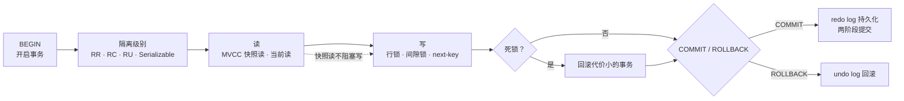
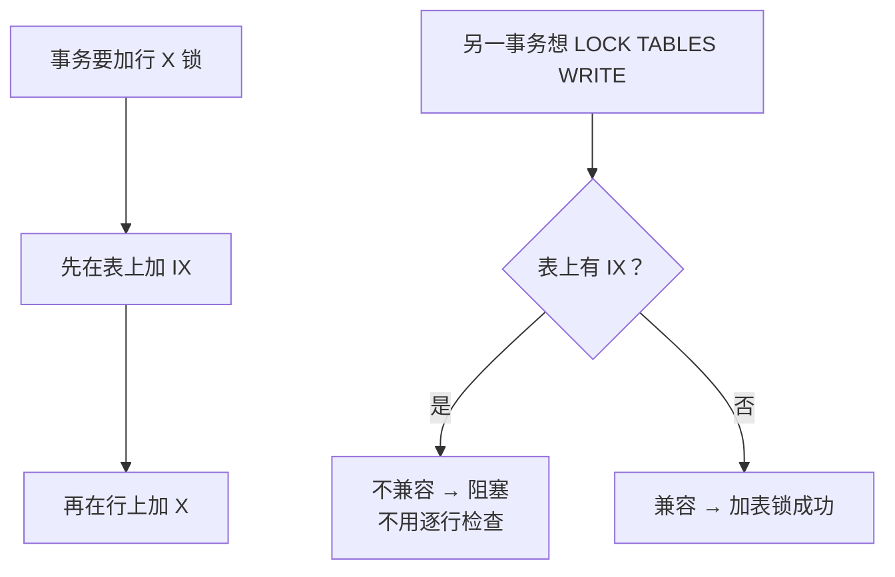
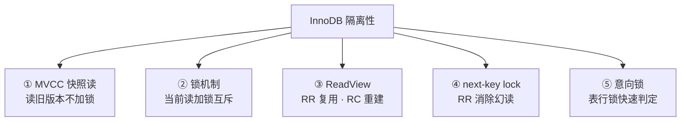
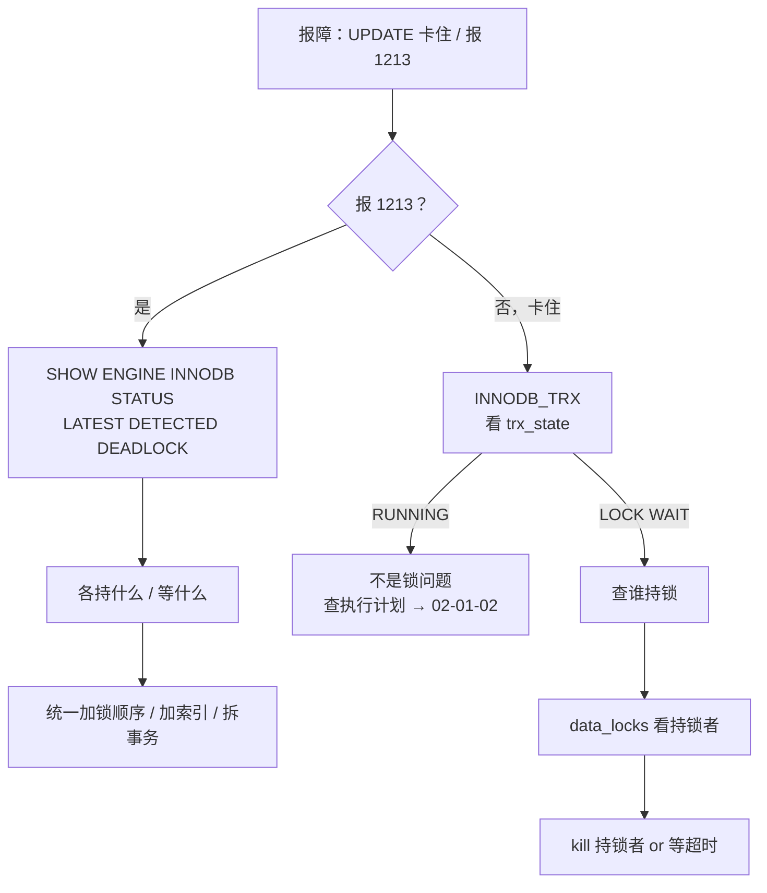

# 事务与锁

> 活动高峰两个 GM 同时给同一玩家发奖，一个扣了库存一个超时——`SHOW PROCESSLIST` 一排 `Updating`，群里已经有人准备 `kill` 掉「卡住」的那条，手就放在回车上。
> **本章回答**：一次事务从 BEGIN 到 COMMIT 经历什么——读为什么不阻塞写、写为什么会死锁、怎么一眼定责。
> **不讲**：B+ 树与索引走法 → [02-01-02](../02-索引与执行计划/)；主从复制与 binlog 格式 → [02-01-04](../04-主从与高可用/)；Buffer Pool 与存储引擎内部 → [02-01-01](../01-架构与存储引擎/)。

**标记**：🎯重点 · 🔥难点 · ⭐常考 · 🔧实操
---

## 一、一张图：一次事务的一生

> 🎯 **一句话**：事务过四关——选隔离级别、读（MVCC）、写（加锁）、提交（持久化）；死锁和锁等待都卡在「写」。



- 📖 **读图**
  - 🛤️ 主线是时间线：BEGIN → 隔离 → 读 → 写 → 提交；虚线强调快照读与写可并行（MVCC 的价值）
  - 🔪 `SHOW ENGINE INNODB STATUS` 照的是「写」这一段：谁持锁、谁在等；死锁是写关并发症，检测后自动回滚代价小的一方

本节对应练习题 **Q1、Q9**。带着这张图出发——第一关：四个承诺怎么落地。

---

## 二、起步：ACID 与隔离级别 ⭐🔥

> 🎯 **一句话**：ACID 靠 undo（回滚）、redo（持久化）、锁+MVCC（隔离）落地；隔离级别决定「并发时能看到别人的什么」。

⭐ 口诀：**undo 保 A，redo 保 D，锁 + MVCC 保 I**——C 是结果不是单独机关。

### 📦 ACID：四个承诺 ⭐

- **A（Atomicity，原子性）**：要么全做要么全不做 → **undo log（回滚日志）** 记改前旧值，回滚按链逆向恢复
- **C（Consistency，一致性）**：前后满足约束（外键、唯一索引等）→ **结果**，不是独立机关
- **I（Isolation，隔离性）**：并发互不干扰 → **锁 + MVCC**；级别决定「隔离到多严」
- **D（Durability，持久性）**：提交后崩溃不丢 → **redo log（重做日志）** 记页的物理修改，崩溃重放

> ⚠️ **别混**：undo 管回滚和 MVCC（旧版本），redo 管崩溃恢复（新状态）——方向相反。Buffer Pool / 刷脏见 [02-01-01](../01-架构与存储引擎/)。

#### ❓ 为什么一致性不是「第五套机制」？

- ❌ 误答：还有一套专门保 C 的日志/锁
- ✅ C = A 全做或全不做 + I 互不踩 + D 提交不丢 + 约束校验的**合取结果**
- 📎 面试问「ACID 靠什么」：A/I/D 各点机关，C 收一句「结果」

### 🔗 两阶段提交：redo 与 binlog 怎么对齐 🔥

**两阶段提交（2PC）** = InnoDB 保证 redo 与 binlog 一致的内部协议（主从复制靠 binlog → [02-01-04](../04-主从与高可用/)）。

#### ❓ 为什么事务提交要两阶段？

- 裂：只写 redo 不写 binlog → 主库有、从库无
- 裂：只写 binlog 不 commit redo → 从库有、主库可能回滚
- ✅ prepare → binlog → commit；崩溃以 **binlog 是否完整** 裁决

```text
① 写 redo log（prepare）   ← 先标记「准备提交」
② 写 binlog                 ← 主从复制靠它
③ 写 redo log（commit）     ← 最后标记「已提交」
```

- 📖 **读图**：顺序不能乱。崩溃时：prepare + 有 binlog → 补 commit；prepare + 无 binlog → 回滚。

```text
① redo = commit              → 已提交，重放恢复
② redo = prepare + 有 binlog → 补 commit
③ redo = prepare + 无 binlog → 回滚
```

> 📝 **面试**：问「为什么不能一阶段」——一阶段 redo 已 commit 而 binlog 写失败 → 主从不一致；两阶段让 redo 先 prepare，binlog 写完才 commit。

### 🎚️ 四个隔离级别 ⭐🔥

**隔离级别**决定并发事务互相能「看到」什么。SQL 标准四档：

| 隔离级别 | 脏读 | 不可重复读 | 幻读 |
|----------|------|------------|------|
| **RU（读未提交）** | 可能 | 可能 | 可能 |
| **RC（读已提交）** | 不可能 | 可能 | 可能 |
| **RR（可重复读）** | 不可能 | 不可能 | InnoDB 不可能 |
| **Serializable** | 不可能 | 不可能 | 不可能 |

- **脏读**：读到别人**未提交**的修改——对方一回滚，你手里是幽灵数据
- **不可重复读**：同一行读两次结果不同——中间有人 COMMIT 了 UPDATE
- **幻读**：同一**范围**两次查，行数不同——中间有人 INSERT/DELETE

> 💡 **打个比方**：你查账，另一出纳同时改账本。RU＝改一半你就看见；RC＝盖章后才看见，但每次看最新版所以两次可不一样；RR＝第一次看时拍快照，之后只看照片；Serializable＝碰账本就排队。

- 🔑 **InnoDB 默认 RR**，且靠 next-key 在 RR 下消除幻读（四节）——比 SQL 标准 RR 更严（标准 RR 仍允许幻读）

```sql
SELECT @@transaction_isolation;           -- 默认 REPEATABLE-READ
SET SESSION TRANSACTION ISOLATION LEVEL READ COMMITTED;
```

> ⚠️ **别混**：RR 消幻读是 **InnoDB 实现**，不是 SQL 标准。Serializable 在 InnoDB **不是真串行**——普通 SELECT 隐式 `LOCK IN SHARE MODE`，退化为当前读。

#### ❓ 为什么线上常有人改用 RC？

- ✅ RC **没有间隙锁** → 锁冲突少、并发高
- 💸 代价：放弃可重复读与防幻读
- 🧭 读一致性要求高 → RR；能接受不可重复读、要吞吐 → RC（很多互联网公司选 RC）

> 📝 **面试**：默认 RR + next-key 消幻读；追问「为何不默认 RC」——RR 快照更稳、贴近 MySQL 复制传统；Oracle/PG 默认 RC。

本节对应练习题 **Q1、Q9、Q13**。承诺钉死了——读怎么做到「不挡写」？

---

## 三、读：MVCC 多版本并发控制 ⭐🔥

> 🎯 **一句话**：普通 SELECT 读旧版本快照（不加锁），UPDATE/DELETE/FOR UPDATE 读最新并加锁——读不挡写、写不挡读。

### 📸 快照读 vs 当前读 🔥

关键不是「读不加锁」，是：**读的是哪个版本**。

🔥 **MVCC（Multi-Version Concurrency Control）**：同一行留多个历史版本——读的人看「该看的那一版」，写的人改「最新版」，两边不用互堵。

- **快照读（snapshot read）**：普通 `SELECT` → 按 ReadView 找可见版本，**不加锁**；RR 下第一次快照时拍「照片」，之后复用
- **当前读（current read）**：`FOR UPDATE` / `LOCK IN SHARE MODE` / `UPDATE` / `DELETE` / `INSERT` → 读**最新**并**加锁**

```sql
SELECT * FROM player WHERE id = 1;                    -- 快照读
SELECT * FROM player WHERE id = 1 FOR UPDATE;         -- 当前读 · X
SELECT * FROM player WHERE id = 1 LOCK IN SHARE MODE; -- 当前读 · S
UPDATE player SET gold = gold + 100 WHERE id = 1;     -- 当前读 · X
```

> ⚠️ **别混**：快照读读的是「旧版本」，不是「不加锁的当前值」。RR 下别人 COMMIT 了 UPDATE，你再 SELECT 仍一样——因为复用同一 ReadView。

#### ❓ 为什么快照读不阻塞写？

- 📖 读沿 undo 链找**历史版本**，不锁最新行
- ✍️ 写改最新行、加行锁——两套路径，互不堵
- ⚠️ **当前读会挡写**：`FOR UPDATE` / `UPDATE` 抢的是同一把锁

### 🧬 undo log 版本链 🔥

每次 UPDATE/DELETE 在 **undo log** 留旧版，用 `roll_pointer` 串链：

```text
最新版本（表中当前行）  trx_id=200  gold=500
                        ↑ roll_pointer
 undo log 版本2        trx_id=150  gold=400
                        ↑ roll_pointer
 undo log 版本1        trx_id=100  gold=300
```

- 📖 **读图**：从最新沿 `roll_pointer` 往回走；快照读按 ReadView 找第一个可见版本。purge 清「不再被任何 ReadView 需要」的旧版——**长事务不提交会堵 purge → undo 膨胀 → 全表变慢**。

> 🔍 **现场**：`SHOW ENGINE INNODB STATUS` 里 `History list length` = 版本链长度。正常个位数～几百；跑到几万 → 先找长事务再看是否回落。

### 👁️ ReadView：RR 和 RC 的唯一机制差 🔥

⭐ 高频错答点：**RR vs RC 只差 ReadView 创建几次**。

**ReadView** = 快照读时的一致性视图，四个字段：

- `m_ids`：生成时活跃（未提交）事务 ID 列表
- `min_trx_id`：`m_ids` 最小值
- `max_trx_id`：下一个将分配的事务 ID
- `creator_trx_id`：创建该 ReadView 的事务自己

```text
trx_id < min_trx_id       → ReadView 前已提交 → 可见
trx_id >= max_trx_id      → ReadView 后才产生 → 不可见
trx_id 在 m_ids 中         → 产生者还没提交 → 不可见
trx_id == creator_trx_id  → 自己改的 → 可见
不可见 → 沿 undo 找上一版，重复判断
```

数字走一遍（`m_ids=[150,200]`，`min=150`，`max=300`）：

```text
trx_id=100  → <150 → 可见
trx_id=150  → 在 m_ids → 不可见
trx_id=180  → 区间内且不在 m_ids → 可见（已提交）
trx_id=250  → 在 m_ids → 不可见
trx_id=350  → >=300 → 不可见
```

#### ❓ RR 和 RC 在 MVCC 上到底差什么？

- 📸 **RR**：第一次快照读创建 ReadView，之后**复用** → 可重复读
- 🔄 **RC**：每次快照读**新建** ReadView → 能看到别人已提交的新值
- ⚠️ 防幻读靠的是 **next-key**，不是「ReadView 拍一次」alone

| 对比 | **RR** | **RC** |
|------|--------|--------|
| ReadView | 事务内第一次快照读创建并复用 | 每次快照读新建 |
| 效果 | 两次读一致 | 每次见最新已提交 |

> 💡 **打个比方**：RR＝进馆拍在馆名单，之后只读名单前归还的书；RC＝每次去书架都重拍名单——别人刚还的书下次就看见。

```text
事务A（RR）：SELECT gold → 100（建 ReadView，B 在活跃列表）
             -- B UPDATE gold=200 并 COMMIT
             SELECT gold → 仍 100（复用；沿 undo 找到旧版）

事务A（RC）：SELECT gold → 100
             -- B UPDATE gold=200 并 COMMIT
             SELECT gold → 200（新建 ReadView，B 已不在活跃列表）
```

> ⚠️ **别混**：RR 第二次读到 100 **不是「数据没变」**——表里已是 200，ReadView 仍当 B「未提交」可见，沿 undo 找到 100。

> 📝 **面试**：RR/RC 区别一句话——「ReadView 创建时机不同：RR 第一次复用，RC 每次重建。」

### 🔧 现场：看事务与长事务 🔧

```sql
SELECT @@GLOBAL.transaction_isolation, @@SESSION.transaction_isolation;
-- | REPEATABLE-READ | REPEATABLE-READ |  # ← InnoDB 默认 RR

SELECT * FROM information_schema.INNODB_TRX\G
-- trx_id: 1234567
-- trx_state: RUNNING
-- trx_started: 2026-09-01 14:30:00   # ← 跑了多久一眼看到
-- trx_rows_modified: 3               # ← 死锁 victim 选代价小的
-- trx_query: UPDATE player SET gold=gold+100 WHERE id=1
```

```sql
-- 跑超过 30 秒的事务
SELECT trx_id, trx_started,
       TIMESTAMPDIFF(SECOND, trx_started, NOW()) AS run_seconds,
       trx_rows_modified, trx_query
  FROM information_schema.INNODB_TRX
 WHERE TIMESTAMPDIFF(SECOND, trx_started, NOW()) > 30;
-- run_seconds: 65   # ← 告警嫌疑犯：持锁久 + 堵 purge
```

> 🔍 **现场**：`trx_started` 跑几十秒的事务是锁等待嫌疑犯——先看它，再决定 `kill`。监控应对 `run_seconds > 30` 报警。

本节对应练习题 **Q2、Q3**。读清楚了——写怎么加锁、怎么防幻？

---

## 四、写：行锁、间隙锁与 next-key ⭐🔥

> 🎯 **一句话**：行锁加在索引上；记录锁锁一行，间隙锁锁「缝」防 INSERT，next-key＝两者之和；RR 默认 next-key，这就是消幻读的手段。

⭐ 口诀：**行锁在索引上；next-key = 记录锁 + 前间隙；RR 有间隙锁，RC 基本没有**。

### 📍 行锁加在索引上 🔥

**InnoDB 行锁挂在索引记录上，不是数据页上**。无索引的 UPDATE/DELETE 全表扫 → 途经行全加锁 → 效果像表锁。

#### ❓ 为什么「没索引的 UPDATE」像表锁？

- 🎯 行锁挂在**索引记录**上；无索引只能扫全表 → 所经行之锁全加上
- ✅ 看起来改一行，实际锁整张表——生产高频事故
- 🔧 先保证 WHERE 能走索引，再谈行锁粒度（走法见 [02-01-02](../02-索引与执行计划/)）

```sql
UPDATE player SET gold = gold + 100 WHERE id = 1;     -- 有主键：锁 id=1
UPDATE player SET gold = 0 WHERE name = 'tester';      -- name 无索引：全表加锁
```

> ⚠️ **别混**：无索引 UPDATE 不是「不加锁」，是「每行都加锁」。

### 🔐 三种行锁：记录 / 间隙 / next-key 🔥⭐

- **记录锁（record lock）**：锁索引上**一条**记录。RC 下基本只有它
- **间隙锁（gap lock）**：锁两记录之间的**缝**，防范围内 INSERT。RR 下存在。gap 之间**互相兼容**（都只是「不让人插」）
- **临键锁（next-key lock）**：记录锁 + **前面的**间隙。RR 下范围查询默认 next-key

```text
索引：10, 20, 30

  记录锁   锁 10 本身        ← 等值命中 (id = 10)
  间隙锁   锁 (10, 20)       ← 防 INSERT id=15
  next-key 锁 (10, 20]       ← 范围 (id <= 20)
```

> 💡 **打个比方**：车位 10、20、30。记录锁＝锁住 20 号；间隙锁＝10～20 之间拉绳不让新车停；next-key＝从 10 后到 20（含）整段围起来。

#### ❓ 为什么间隙锁能防幻读？

- 👻 **幻读**＝范围二次查多出行（别人 INSERT）
- 🪢 **gap / next-key** 锁住「缝」→ INSERT 拿不到插入意向锁 → 插不进来
- ⚠️ **RC 无间隙锁** → 仍可能幻读；别说「MVCC 防幻读」

> ⚠️ **别混**：间隙锁只在 **RR**。等值命中 → next-key 退化为**记录锁**；等值未命中 → 退化为**间隙锁**。next-key = 记录 + **前**间隙（不是后间隙）。

### 🔒 共享锁与排他锁 ⭐

| | **S（共享）** | **X（排他）** |
|---|---------------|---------------|
| 怎么加 | `LOCK IN SHARE MODE` | `UPDATE` / `DELETE` / `FOR UPDATE` |
| 互相 | S 兼容 S | X 与任何不兼容 |
| 用途 | 读但防别人改 | 改数据 |

同一行：S–S 兼容；S–X / X–X 不兼容。

> ⚠️ **别混**：gap 之间兼容；gap 与**插入意向锁**不兼容——你想插、我拦着。

### 🧲 插入意向锁

**插入意向锁（insert intention lock）**：INSERT 等 gap 释放时加的间隙级锁，表示「我要在这缝里插」。多个插入意向锁互相兼容；与 gap **不兼容**——RR 下 INSERT 被堵的直接原因。

```text
A：SELECT ... WHERE id BETWEEN 10 AND 20 FOR UPDATE  → gap (10,20)
B：INSERT (15)  → 插入意向，等 A
C：INSERT (12)  → 与 B 兼容，但都等 A
```

> 💡 **打个比方**：绳子拦住 10～20。想停 12 和想停 15 的司机互不干扰，但都得等绳子撤掉。

### 🏷️ 意向锁：表级的「行锁标记」 ⭐

**意向锁（IS/IX）** 是**表级**标记——加行锁前先加对应意向锁，让「表锁 vs 行锁」冲突判断 O(1)：



- 📖 **读图**：意向锁＝「表上有行锁」的快速旗标。IS/IX 互相兼容，只与表级 S/X 冲突。

#### ❓ 为什么需要意向锁？

- 若无意向锁：想加表锁得**逐行扫**有没有行锁 → O(N)
- 有 IX/IS：表上瞄一眼旗标 → O(1)
- ⚠️ 意向锁**不**和行锁打架——只和表级 S/X 打架

> 📝 **面试**：意向锁＝表级标记；加行锁前先加；IS/IX 互容，只与表级 S/X 冲突。

### 📋 哪些语句加什么锁 ⭐🔧

```sql
-- RC（无间隙锁）
SELECT * FROM t WHERE id = 10 FOR UPDATE;              -- 记录锁
SELECT * FROM t WHERE id > 10 AND id < 20 FOR UPDATE;  -- 匹配行各一条记录锁

-- RR（有间隙 / next-key）
SELECT * FROM t WHERE id = 10 FOR UPDATE;              -- 等值命中 → 记录锁
SELECT * FROM t WHERE id > 10 AND id <= 20 FOR UPDATE; -- next-key (10,20] + (20, next]
SELECT * FROM t WHERE id > 10 FOR UPDATE;              -- next-key (10, +∞]
SELECT * FROM t WHERE id = 15 FOR UPDATE;              -- 等值未命中 → gap
```

```sql
-- MySQL 8.0+ 锁详情
SELECT * FROM performance_schema.data_locks\G
-- INDEX_NAME: PRIMARY
-- LOCK_TYPE: RECORD
-- LOCK_MODE: X                 # ← X / S / X,GAP / X,REC_NOT_GAP / next-key 无后缀 X
-- LOCK_DATA: 10
```

> 🔍 **现场**：`LOCK_MODE` 带 `GAP`＝间隙锁，`REC_NOT_GAP`＝纯记录锁，裸 `X`＝next-key。5.7 用 `information_schema.INNODB_LOCKS`。

### 💥 间隙锁导致的死锁

不只是「你锁行 1 我锁行 2」——RR 下 gap 死锁更隐蔽：

```text
A：SELECT ... WHERE id=15 FOR UPDATE  → 未命中 → gap (10,20)
B：SELECT ... WHERE id=12 FOR UPDATE  → gap (10,20)  ← 兼容！
A：INSERT (15)  → 插入意向等 B 的 gap → 阻塞
B：INSERT (12)  → 插入意向等 A 的 gap → 死锁！
```

#### ❓ 降到 RC 就能消灭死锁吗？

- 📉 RC 少了间隙锁死锁这一类，但**记录锁死锁还在**
- 💸 代价：放弃可重复读与防幻读
- ✅ 正解：统一加锁顺序、缩小事务、补索引——不是一刀切降级

> ⚠️ **别混**：两个 gap 兼容 ≠ 可以随便 INSERT；各自插入意向 vs 对方 gap 不兼容 → 等待环。RC 不会出这类，但「降 RC」不是万能药。

本节对应练习题 **Q4、Q5、Q6、Q7、Q8**。

---

## 五、收束：锁凭什么保证隔离 ⭐

> 🎯 **一句话**：MVCC 管「读不挡写」，锁管「写互斥」，ReadView 管「看哪版」，next-key 管「范围不被插」——再加意向锁做表行协调。



- 📖 **读图**
  - ①②＝读写分离；③＝隔离精度（RR/RC）；④＝防幻；⑤＝表锁判定效率
  - 面试按「读（MVCC+ReadView）→ 写（行锁+间隙+next-key）→ 表行协调（意向锁）」分组背

> ⚠️ **别混**：隔离 ≠ 一致性。I＝并发互不干扰；C＝约束满足。这五件套保的是 **I**，**不保证无死锁**——死锁靠检测解套（六节）。

> 📝 **面试**：收一句「RR 比 SQL 标准强在 next-key 消幻读」。

本节对应练习题 **Q5**。

---

## 六、作战：定责（死锁与锁等待）🔧

> 🎯 **一句话**：先分死锁（1213，已回滚一方）还是锁等待（1205，还在等）——`INNODB_TRX` + `data_locks` + `SHOW ENGINE INNODB STATUS` 三刀。

### ⚔️ 死锁 vs 锁等待 ⭐🔥

| | **死锁** | **锁等待** |
|---|----------|------------|
| 现象 | 互相等对方释放 | A 等 B，B 没死 |
| 处理 | 自动检测，回滚代价小的 | 等 `innodb_lock_wait_timeout`（默认 **50s**） |
| 日志 | STATUS 有 `LATEST DETECTED DEADLOCK` | `trx_state=LOCK WAIT` |
| 错误码 | **1213** | **1205** |

```text
A：UPDATE ... WHERE id=1;  → 锁 1
B：UPDATE ... WHERE id=2;  → 锁 2
A：UPDATE ... WHERE id=2;  → 等 B
B：UPDATE ... WHERE id=1;  → 等 A → 死锁
InnoDB：回滚 trx_rows_modified 少的一方
ERROR 1213 (40001): Deadlock found ...; try restarting transaction
```

> 💡 **打个比方**：窄路两车对开，谁载货少谁倒车——对方收到 1213，业务要重试。

### 🌳 定责决策树



- 📖 **读图**：第一刀分「已回滚的死锁」还是「还在卡的等待」；都不是 → SQL 本身慢，去看计划。

### 现象 · 先做 · 别做

| 现象 | 先做 | 别做 |
|------|------|------|
| 报 `1213` | STATUS 看死锁日志 | 当偶发只重试不改逻辑 |
| UPDATE 卡住 | `INNODB_TRX` 看等待链 | 直接 `kill` 不查持锁者 |
| `1205` 超时 | 查持锁 SQL + 索引 | 调大 `lock_wait_timeout` 拖着 |
| 无索引 UPDATE 锁全表 | 加索引 | 以为是单行锁 |
| 频繁死锁 | 检查加锁顺序 | 一刀切降 RC |
| 长事务持锁 | 缩小事务 | `kill` 后不查业务一致性 |

### ⏱️ 60 秒剧本 🔧

> 🔍 **现场**：接到「UPDATE 卡死」，60 秒走完这条线。

```text
① 0–10s   是否已报 1213？ → 是：STATUS；否：INNODB_TRX
② 10–30s  死锁：对照两事务 HOLDS / WAITING
           等待：trx_state='LOCK WAIT'，记下 trx_id / thread_id / query
③ 30–45s  持锁者：8.0 data_locks（LOCK_MODE / LOCK_DATA）；5.7 INNODB_LOCKS
④ 45–60s  定责：无索引→加索引；顺序乱→统一；长事务→缩小
```

> 🔍 **现场**：死锁日志关键词 `HOLDS THE LOCK(S)`（已持有）与 `WAITING FOR THIS LOCK TO BE GRANTED`（正在等）——对照两边就能画出环。

本节对应练习题 **Q10、Q11、Q12、Q14**。

---

## 七、收口

### 命令速查 🔧

```sql
SELECT @@GLOBAL.transaction_isolation, @@SESSION.transaction_isolation;
SELECT trx_id, trx_state, trx_started, trx_rows_modified, trx_query
  FROM information_schema.INNODB_TRX;
SELECT * FROM performance_schema.data_locks;           -- 8.0+
SELECT * FROM performance_schema.data_lock_waits;
SELECT * FROM information_schema.INNODB_LOCKS;         -- 5.7
SELECT * FROM information_schema.INNODB_LOCK_WAITS;
SHOW ENGINE INNODB STATUS\G    -- → LATEST DETECTED DEADLOCK
SET GLOBAL innodb_print_all_deadlocks = ON;            -- 排查期临时开
SHOW VARIABLES LIKE 'innodb_lock_wait_timeout';        -- 默认 50s
```

### 面试锚点

| 问 | 30 秒答 |
|----|---------|
| ACID 靠什么？ | A→undo，D→redo，I→锁+MVCC，C 是 AID+约束的结果。 |
| 默认隔离级别？ | RR；next-key 消幻读，比 SQL 标准严。 |
| RR vs RC？ | ReadView：RR 第一次复用，RC 每次重建。 |
| MVCC？ | undo 版本链 + ReadView；快照读不加锁读旧版。 |
| 快照读 / 当前读？ | 普通 SELECT＝快照；FOR UPDATE/UPDATE/DELETE＝当前读加锁。 |
| 行锁加在哪？ | 索引上；无索引 UPDATE≈表锁效果。 |
| 记录 / 间隙 / next-key？ | 一行 / 缝防 INSERT / 记录+前间隙；RR 默认 next-key。 |
| 间隙锁只在 RR？ | 是；RC 无间隙 → 仍可能幻读。 |
| S / X？ | S 互容；X 与任何不容。FOR UPDATE＝X。 |
| 意向锁？ | 表级标记；加行锁前先加；IS/IX 互容，只与表级 S/X 冲突。 |
| 怎么防幻读？ | RR 下 next-key 锁间隙，防 INSERT。 |
| undo vs redo？ | undo 旧值（回滚+MVCC）；redo 新值（崩溃恢复）。 |
| 两阶段提交？ | redo prepare → binlog → redo commit。 |
| 死锁怎么处理？ | 自动检测，回滚代价小的（rows_modified 少）。 |
| 死锁怎么查？ | STATUS 的 LATEST DETECTED DEADLOCK。 |
| 超时多少 / 错误码？ | 50s；死锁 1213，等待超时 1205。 |

### 易错一句话对照

- 行锁加在数据页上 → 加在**索引**上
- 无索引 UPDATE 不加锁 → 逐行加锁 ≈ **表锁**
- MVCC 读「不加锁的当前值」 → 读 ReadView 对应的**旧版本**
- RR 下所有读都是快照读 → FOR UPDATE / UPDATE 是**当前读**
- RC 也有间隙锁 → RC **没有**间隙锁
- next-key = 记录 + 后间隙 → 记录 + **前**间隙
- 间隙锁互不兼容 → 间隙锁**互兼容**；gap 与 insert intention 不兼容
- RR 消幻读是 SQL 标准 → **InnoDB 实现**；标准 RR 仍可幻读
- Serializable＝真串行 → 普通 SELECT 隐式 **LOCK IN SHARE MODE**
- undo＝redo → 方向相反：旧值 vs 新值
- 死锁要人工解 → InnoDB **自动**回滚代价小的
- 锁等待＝死锁 → 等待是单方等；死锁是**互相等成环**
- 调大 lock_wait_timeout 能根治 → 只拖时间
- 频繁死锁就降 RC → 治标；应统一加锁顺序
- MVCC 能防幻读 → MVCC 防不可重复读；**next-key** 防幻读
- 意向锁与行锁不兼容 → 意向锁只与**表级** S/X 冲突
- C 有单独机关 → C 是 A+I+D+约束的**结果**

### 数字墙

> 隔离级别 **4** 档 · 默认 **RR** · 锁等待超时 **50s** · 死锁 **1213** · 等待超时 **1205** · ACID **4** · undo 靠 **roll_pointer** · ReadView **4** 字段 · 行锁在**索引** · next-key＝记录+**前间隙** · gap **互兼容** · 意向锁 **IS/IX** · 2PC **3** 步 · RR ReadView **1** 次复用 · RC 每次**新建**

---

## 合上书

对着第一节主图口述一遍，卡住就回对应小节。

- [ ] **默画一节的图**：BEGIN → 隔离 → MVCC 读 → 加锁写 → 死锁判断 → COMMIT/ROLLBACK；读为何不挡写。（Q1、Q2）
- [ ] **口述起步**：ACID 各靠什么、C 为何是结果、2PC 三步、四档隔离各挡什么异常。（Q1、Q9）
- [ ] **口述读**：快照读 vs 当前读、undo 链 + ReadView、RR/RC 创建时机。（Q2、Q3）
- [ ] **默画版本链**：最新 → undo 旧版 → roll_pointer；可见性四条规则走一遍。（Q2、Q3）
- [ ] **口述写**：锁在索引上、三种行锁、RR 有 gap / RC 无、意向锁干什么。（Q4、Q8）
- [ ] **默画锁兼容**：S/X；gap 互兼容；gap vs 插入意向；IS/IX vs 表级 S/X。（Q6、Q7）
- [ ] **口述收束**：五件套怎么保隔离；隔离 ≠ 一致性；≠ 无死锁。（Q5、Q1）
- [ ] **定责**：1213 vs 1205、STATUS / data_locks 各看什么、60 秒剧本——开篇那句「kill 卡住的那条」，你知道怎么拦了。（Q10～Q12、Q14）

下一章：[02-01-04 主从与高可用](../04-主从与高可用/)。地基：[02-01-01](../01-架构与存储引擎/) · 索引：[02-01-02](../02-索引与执行计划/)。
