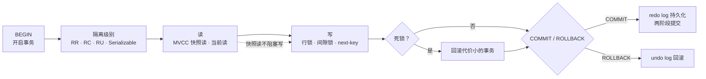
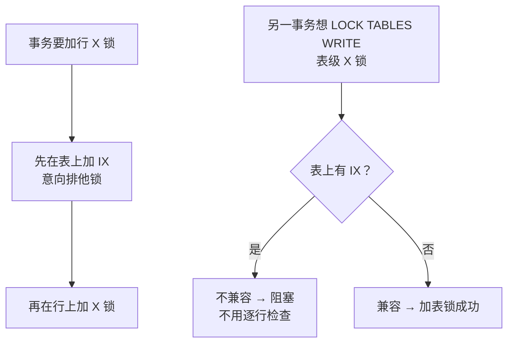
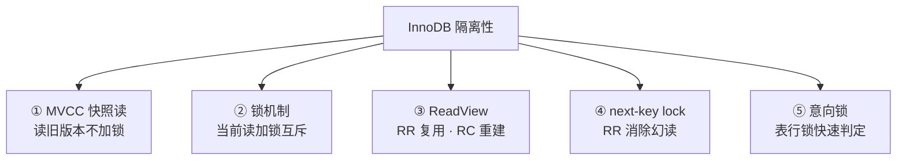
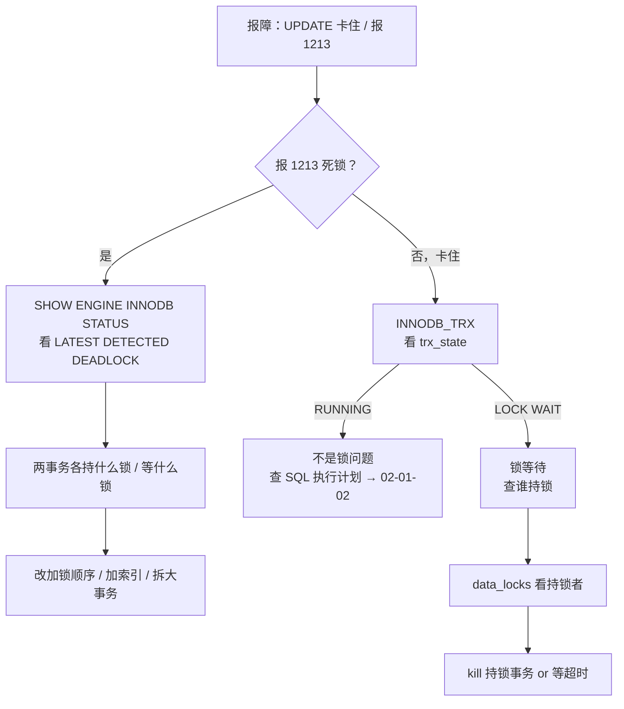

# 事务与锁

> 活动高峰两个 GM 同时给同一玩家发奖，一个扣了库存一个超时——`SHOW PROCESSLIST` 一排 `Updating`，有人准备 `kill` 掉"卡住"的那条。
> **本章回答**：一次事务从 BEGIN 到 COMMIT 经历什么——读为什么不阻塞写、写为什么会死锁、怎么一眼定责。
> **不讲**：B+ 树与索引走法 → [02-01-02](../../02-中间件与数据库/01-MySQL/02-索引与执行计划/)；主从复制与 binlog 格式 → [02-01-04](../../02-中间件与数据库/01-MySQL/04-主从与高可用/)；Buffer Pool 与存储引擎内部 → [02-01-01](../../02-中间件与数据库/01-MySQL/01-架构与存储引擎/)。

**标记**：🎯重点 · 🔥难点 · ⭐常考 · 🔧实操

---

## 一、一张图：一次事务的一生

> 🎯 **一句话**：一个事务从 BEGIN 到 COMMIT 要过四关——选隔离级别、读（MVCC）、写（加锁）、提交（持久化），死锁和锁等待都卡在"写"这关。



**读图**：主线是一条时间线——BEGIN 之后先选隔离级别，读用 MVCC 不加锁（快照读）、写才加锁。`SHOW ENGINE INNODB STATUS` 照的是"写"这一段：锁住谁、等谁。死锁是写关的并发症，由死锁检测自动回滚一个事务解套。虚线强调快照读和写可以并行——这就是 MVCC 的核心价值。

---

## 二、起步：ACID与隔离级别 ⭐🔥

> 🎯 **一句话**：ACID 是事务的四个承诺，靠 undo log（回滚）、redo log（持久化）、锁+MVCC（隔离）三套机制落地；隔离级别决定"并发时能看到别人的什么"。

### ACID：四个承诺 ⭐

- **A（Atomicity，原子性）**：一个事务要么全做要么全不做。靠 **undo log（回滚日志，记录修改前的旧值）** 实现——回滚时按 undo log 逆向恢复。
- **C（Consistency，一致性）**：事务执行前后数据满足所有约束（外键、唯一索引等）。一致性是 A/I/D 的结果，不是一套独立机制。
- **I（Isolation，隔离性）**：并发事务互不干扰。靠 **锁** 和 **MVCC** 共同实现。隔离级别决定了"隔离到什么程度"。
- **D（Durability，持久性）**：提交后即使崩溃也不丢。靠 **redo log（重做日志，记录数据页的物理修改）** 实现——崩溃后重放 redo log 恢复已提交的修改。

> ⚠️ **别混**：undo log 管回滚和 MVCC（旧版本），redo log 管崩溃恢复（新状态）。两个日志方向相反：undo 记"改之前是什么"，redo 记"改之后是什么"。存储引擎的 Buffer Pool、刷脏页等细节见 [02-01-01](../../02-中间件与数据库/01-MySQL/01-架构与存储引擎/)。

### 两阶段提交：redo log 与 binlog 怎么对齐 🔥

**两阶段提交（2PC, two-phase commit）** 是 InnoDB 保证 redo log 和 binlog 一致的内部协议：

```text
① 写 redo log（prepare 状态）   ← 先写 redo，标记"准备提交"
② 写 binlog                     ← 再写 binlog（主从复制靠它，→ 02-01-04）
③ 写 redo log（commit 状态）    ← 最后把 redo 标记"已提交"
```

**读图**：三步的顺序不能乱——redo 先 prepare、binlog 后写、redo 再 commit。崩溃恢复时，如果 redo log 是 prepare 但 binlog 有对应记录 → commit；没有对应 binlog → rollback。这保证主库和从库的数据一致，不会出现"主库提交了从库没收到"或反过来。

崩溃恢复的三种情况：

```text
① redo log = commit 状态     → 事务已提交，直接重放恢复
② redo log = prepare + binlog 有记录 → binlog 写完了但 redo commit 没来得及 → 补 commit
③ redo log = prepare + binlog 无记录 → binlog 还没写 → 回滚
```

> 📝 **面试**：问"两阶段提交为什么不能一阶段"，答"一阶段先写 redo 再写 binlog，如果 binlog 写失败但 redo 已 commit，主库认为已提交、从库没收到，主从不一致。两阶段让 redo 先 prepare，binlog 写完后才 commit，崩溃恢复时靠 binlog 有没有来判断该 commit 还是 rollback。"

### 四个隔离级别 ⭐🔥

**隔离级别（isolation level）** 决定并发事务互相能"看到"什么。SQL 标准定义了四档，从低到高：

| 隔离级别 | 脏读 | 不可重复读 | 幻读 |
|----------|------|------------|------|
| **RU（Read Uncommitted，读未提交）** | 可能 | 可能 | 可能 |
| **RC（Read Committed，读已提交）** | 不可能 | 可能 | 可能 |
| **RR（Repeatable Read，可重复读）** | 不可能 | 不可能 | InnoDB 不可能 |
| **Serializable（串行化）** | 不可能 | 不可能 | 不可能 |

三种读异常内联定义：

- **脏读（dirty read）**：事务 A 读到了事务 B **未提交**的修改——B 回滚后 A 读到的是不存在的数据。
- **不可重复读（non-repeatable read）**：事务 A 两次读同一行，结果不同——B 在中间提交了 UPDATE。
- **幻读（phantom read）**：事务 A 两次**范围查询**，结果集行数不同——B 在中间提交了 INSERT/DELETE。

> 💡 **打个比方**：你查账（事务 A），另一个出纳（事务 B）同时在改账本。RU 是"B 改了一半你就看见了"；RC 是"B 盖章提交后你才看见，但你每看一次都看最新版，所以两次看不一样"；RR 是"你第一次看时拍了一张快照，之后只看这张照片，B 怎么改你都不受影响"；Serializable 是"B 碰一下账本你就排队等着，串行来"。

**InnoDB 默认 RR**，且在 RR 下通过 next-key lock 消除了幻读（四节）。这是 InnoDB 比标准 SQL 更强的地方——标准 SQL 在 RR 下仍允许幻读。

```sql
-- 查看和设置隔离级别
SELECT @@transaction_isolation;           -- InnoDB 默认 REPEATABLE-READ
SET SESSION TRANSACTION ISOLATION LEVEL READ COMMITTED;
```

> ⚠️ **别混**：RR 消除幻读是 **InnoDB 的实现**，不是 SQL 标准。标准 RR 只解决不可重复读，不解决幻读。另外 Serializable 在 InnoDB 里不是真的"串行执行"，而是把所有普通 SELECT 隐式加 `LOCK IN SHARE MODE`，退化为当前读。

> 📝 **面试**：问"InnoDB 默认隔离级别是什么"，答"RR（Repeatable Read，可重复读），且 InnoDB 在 RR 下通过 next-key lock 消除了幻读，比 SQL 标准更严格"。追问"为什么选 RR 而不是 RC"，答"RR 下一致性读（快照）更稳定，适合主从复制场景；Oracle/PG 默认 RC，MySQL 遵循传统选 RR"。

> 📝 **面试**：追问"RC 能不能用于生产"，答"能，很多互联网公司用 RC。RC 没有间隙锁，锁冲突更少、并发更高，代价是放弃可重复读和防幻读。选 RC 还是 RR 取决于业务——如果读一致性要求高用 RR，如果并发要求高且能接受不可重复读用 RC。"

---

## 三、读：MVCC多版本并发控制 ⭐🔥

> 🎯 **一句话**：MVCC 让读不阻塞写、写不阻塞读——普通 SELECT 读旧版本快照（快照读），UPDATE/DELETE/FOR UPDATE 读最新版本加锁（当前读）。

### 快照读 vs 当前读 🔥

**MVCC（Multi-Version Concurrency Control，多版本并发控制）** 是 InnoDB 实现并发读的核心机制。它维护数据的多个版本，让读操作不阻塞写、写操作不阻塞读。读分两种：

- **快照读（snapshot read）**：普通 `SELECT`，读 ReadView 对应的版本，**不加锁**。RR 下读事务第一次快照时拍的"照片"，之后复用。
- **当前读（current read）**：`SELECT ... FOR UPDATE`、`SELECT ... LOCK IN SHARE MODE`、`UPDATE`、`DELETE`、`INSERT`——读**最新**版本并**加锁**。

```sql
SELECT * FROM player WHERE id = 1;                    -- 快照读（不加锁）
SELECT * FROM player WHERE id = 1 FOR UPDATE;         -- 当前读（加 X 锁）
SELECT * FROM player WHERE id = 1 LOCK IN SHARE MODE; -- 当前读（加 S 锁）
UPDATE player SET gold = gold + 100 WHERE id = 1;     -- 当前读（加 X 锁）
```

> ⚠️ **别混**：快照读读的是"旧版本"，不是"不加锁的当前版本"。RR 下如果你先快照读、别人提交了 UPDATE、你再快照读，两次读结果一样——因为读的是同一个 ReadView 对应的旧版本，不是最新值。这就是"可重复读"的实现。

### undo log 版本链 🔥

每次 UPDATE/DELETE 都会在 **undo log** 里留一份旧版本，通过 `roll_pointer` 串成链：

```text
最新版本（表中当前行）  trx_id=200  gold=500
                        ↑ roll_pointer
 undo log 版本2        trx_id=150  gold=400
                        ↑ roll_pointer
 undo log 版本1        trx_id=100  gold=300
```

**读图**：从最新版本沿 `roll_pointer` 往回走，每一步是一个旧版本。快照读根据 ReadView 判断哪个版本可见，沿链找到第一个可见版本返回。purge 线程会清理不再被任何 ReadView 需要的旧版本——长事务不提交会阻塞 purge，导致 undo log 膨胀。

**长事务的危害**：一个事务长时间不提交，它的 ReadView 一直"活"着，purge 线程不敢清理比这个 ReadView 更新的旧版本。结果是 undo log 版本链越拉越长，所有快照读都要沿链走很远才能找到可见版本——全表变慢。这就是为什么线上要监控 `trx_started` 跑了几十秒以上的事务。

> 🔍 **现场**：`SHOW ENGINE INNODB STATUS` 里的 `History list length` 就是 undo log 版本链的长度。正常应该是个位数或几百，如果跑到几万甚至几十万，说明有长事务阻塞 purge——先 kill 长事务，再看 `History list length` 是否回落。

### ReadView：RR 和 RC 的唯一区别 🔥

**ReadView** 是事务执行快照读时生成的"一致性视图"，记录了当时的活跃事务列表。可见性判断靠四个字段：

- `m_ids`：生成 ReadView 时当前活跃（未提交）事务 ID 列表
- `min_trx_id`：`m_ids` 中最小值
- `max_trx_id`：下一个将分配的事务 ID
- `creator_trx_id`：创建该 ReadView 的事务 ID

判断一条记录的 `trx_id` 是否可见：

```text
trx_id < min_trx_id          → 这个版本在 ReadView 之前就提交了 → 可见
trx_id >= max_trx_id         → 这个版本在 ReadView 之后才产生 → 不可见
trx_id 在 m_ids 中            → 产生这个版本的事务还没提交 → 不可见
trx_id == creator_trx_id     → 自己改的 → 可见
不可见 → 沿 undo log 找上一个版本，重复判断
```

用具体数字走一遍：

```text
当前活跃事务列表 m_ids = [150, 200]
min_trx_id = 150  max_trx_id = 300

记录 trx_id=100  → 100 < 150 → 可见（在 ReadView 之前提交了）
记录 trx_id=150  → 在 m_ids 中 → 不可见（事务 150 还没提交）
记录 trx_id=180  → 150 < 180 < 300 且不在 m_ids → 可见（已提交）
记录 trx_id=250  → 在 m_ids 中 → 不可见（事务 250 还没提交）
记录 trx_id=350  → 350 >= 300 → 不可见（ReadView 之后才产生）
```

**RR 和 RC 的区别就在 ReadView 的创建时机**：

| 对比 | **RR（可重复读）** | **RC（读已提交）** |
|------|-------------------|-------------------|
| ReadView 创建时机 | 事务**第一次**快照读时创建，之后复用 | **每次**快照读都创建新的 |
| 效果 | 两次读结果一致（可重复读） | 每次读看到最新已提交（不可重复读） |

> 💡 **打个比方**：RR 是"进图书馆时拍了一张在馆人员名单，之后只读名单之前归还的书"；RC 是"每次去书架前都重新拍一张名单"——所以 RC 下别人刚归还的书你下次就看见了，RR 下永远看不见。

**用具体场景走一遍 RR 和 RC 的区别**：

```text
事务A（RR）：
  SELECT gold FROM player WHERE id=1    → 读到 100（创建 ReadView，trx_id 列表=[B]）
  -- 事务 B 此时 UPDATE gold=200 并 COMMIT
  SELECT gold FROM player WHERE id=1    → 仍读到 100（复用 ReadView，B 在活跃列表中）

事务A（RC）：
  SELECT gold FROM player WHERE id=1    → 读到 100（创建 ReadView，trx_id 列表=[B]）
  -- 事务 B 此时 UPDATE gold=200 并 COMMIT
  SELECT gold FROM player WHERE id=1    → 读到 200（新建 ReadView，B 不在活跃列表中）
```

> ⚠️ **别混**：RR 下第二次 SELECT 读到 100 不是"数据没变"——数据已经改成 200 了，但 ReadView 认为事务 B 还没提交（因为在创建 ReadView 时 B 是活跃的），沿 undo log 找到了旧版本 100。这就是 MVCC 的核心：读的是"快照"，不是"当前值"。

> 📝 **面试**：问"RR 和 RC 在 MVCC 上的区别"，答一句话："ReadView 创建时机不同——RR 在事务第一次快照读时创建并复用，RC 每次快照读都重新创建。这就是可重复读和读已提交的全部区别。"

### 现场：看一条事务的隔离级别 🔧

```sql
-- 查全局和会话隔离级别
SELECT @@GLOBAL.transaction_isolation, @@SESSION.transaction_isolation;
-- +--------------------------------+--------------------------------+
-- | @@GLOBAL.transaction_isolation | @@SESSION.transaction_isolation |
-- +--------------------------------+--------------------------------+
-- | REPEATABLE-READ                | REPEATABLE-READ                 |  # ← InnoDB 默认 RR
-- +--------------------------------+--------------------------------+

-- 看当前活跃事务
SELECT * FROM information_schema.INNODB_TRX\G
-- trx_id: 1234567          # ← 事务 ID
-- trx_state: RUNNING       # ← 运行中
-- trx_started: 2026-09-01 14:30:00   # ← 开始时间，跑了多久一眼看到
-- trx_rows_modified: 3     # ← 改了几行，死锁 victim 选代价小的
-- trx_query: UPDATE player SET gold=gold+100 WHERE id=1   # ← 在执行什么
```

> 🔍 **现场**：`trx_started` 跑了几十秒的事务是锁等待的嫌疑犯——先看它，再决定 `kill` 不 `kill`。长事务还会阻塞 undo log purge，导致版本链膨胀、回表变慢。

**长事务怎么发现**：

```sql
-- 查找运行超过 30 秒的事务
SELECT trx_id, trx_started, TIMESTAMPDIFF(SECOND, trx_started, NOW()) AS run_seconds,
       trx_rows_modified, trx_query
  FROM information_schema.INNODB_TRX
 WHERE TIMESTAMPDIFF(SECOND, trx_started, NOW()) > 30;
-- trx_id: 1234567
-- trx_started: 2026-09-01 14:30:00
-- run_seconds: 65        # ← 跑了 65 秒
-- trx_rows_modified: 3
-- trx_query: UPDATE player SET gold=gold+100 WHERE id=1
```

> 🔍 **现场**：监控告警应该对 `run_seconds > 30` 的事务报警。长事务不仅持锁久、阻塞别人，还阻塞 purge 导致 undo log 膨胀——一处慢、处处慢。

---

## 四、写：行锁、间隙锁与next-key ⭐🔥

> 🎯 **一句话**：InnoDB 的锁加在索引上——记录锁锁一条记录，间隙锁锁两记录之间的"缝"防止 INSERT，next-key 是两者之和；RR 下默认 next-key，这就是消除幻读的手段。

### 行锁加在索引上 🔥

**InnoDB 的行锁（row lock）加在索引上，不是加在数据页上**。没有索引的 UPDATE/DELETE 会导致全表扫描，每行都加锁——退化为表锁的效果。

```sql
-- 假设 id 是主键，有索引
UPDATE player SET gold = gold + 100 WHERE id = 1;     -- 锁 id=1 这条（行锁）

-- 假设 name 无索引
UPDATE player SET gold = 0 WHERE name = 'tester';      -- 全表扫描，每行加锁 → 表锁效果
```

> ⚠️ **别混**：没有索引的 UPDATE 不是"不加锁"，是"每行都加锁"——效果和表锁一样。这是生产事故的常见根源：一条"看起来只改一行"的 SQL 因为走了全表扫描，把整张表锁住。索引怎么选、怎么走见 [02-01-02](../../02-中间件与数据库/01-MySQL/02-索引与执行计划/)。

### 三种行锁：记录锁、间隙锁、next-key 🔥⭐

- **记录锁（record lock）**：锁住索引上**一条记录**。精确到行。RC 下只有记录锁。
- **间隙锁（gap lock）**：锁住两条索引记录之间的**间隙**，防止其他事务在这个范围内 INSERT。RR 下存在。间隙锁之间互相兼容——两个事务可以同时持有同一间隙的 gap lock，都只是"不让人 INSERT"。
- **临键锁（next-key lock）**：记录锁 + 前面的间隙锁。InnoDB 在 RR 下默认对范围查询使用 next-key lock。

```text
索引上有记录：10, 20, 30

  记录锁      锁 10 本身          ← 精确匹配 (id = 10)
  间隙锁      锁 (10, 20) 之间    ← 防止 INSERT id=15
  next-key    锁 (10, 20]         ← 范围查询 (id <= 20) → 锁住 (10,20] 这段
```

> 💡 **打个比方**：停车场有编号 10、20、30 三个车位。记录锁是"锁住 20 号车位"；间隙锁是"在 10 和 20 之间拉条绳子，不让新车停进来"；next-key 是"从 10 后面到 20（含）全围起来"。RR 下范围查询会拉一圈绳子，这就是为什么别人 INSERT 不进来——防的就是幻读。

**为什么间隙锁能防幻读**：RR 下 `SELECT * FROM t WHERE id BETWEEN 10 AND 20 FOR UPDATE` 会加 `(10,20]` 的 next-key lock，另一个事务无法 INSERT id=15（落在间隙内），这就消除了"第二次查发现多了行"的幻读。

> ⚠️ **别混**：间隙锁只在 **RR** 下存在，**RC 没有间隙锁**——RC 下 `WHERE id BETWEEN 10 AND 20 FOR UPDATE` 只锁已有记录（10 和 20），别人照样能 INSERT id=15。这就是 RC 下仍有幻读的原因。另外，等值查询命中记录时 next-key 退化为记录锁（不锁后面间隙）；等值未命中时退化为间隙锁（锁住落点间隙）。

### 共享锁与排他锁 ⭐

**共享锁（S lock, Shared lock）** 和 **排他锁（X lock, Exclusive lock）** 是锁的两种模式：

| 对比 | **共享锁（S）** | **排他锁（X）** |
|------|-----------------|-----------------|
| 怎么加 | `SELECT ... LOCK IN SHARE MODE` | `UPDATE` / `DELETE` / `SELECT ... FOR UPDATE` |
| 互相 | S 之间兼容 | X 与任何锁不兼容 |
| 用途 | 读但加锁防别人改 | 改数据 |

行锁兼容矩阵（同一条记录上）：

|  | S | X |
|---|---|---|
| S | 兼容 | 不兼容 |
| X | 不兼容 | 不兼容 |

> ⚠️ **别混**：gap lock 之间互相兼容——两个事务可以同时持有同一间隙的 gap lock。因为 gap lock 的目的只是"阻止别人 INSERT"，不阻止别人也 gap lock。但 gap lock 和插入意向锁（insert intention lock，INSERT 时加的间隙级锁）不兼容——你想插、我拦着，这就是冲突。

### 插入意向锁

**插入意向锁（insert intention lock）** 是间隙锁的一种特殊形式，INSERT 操作在等待 gap lock 释放时加的锁。它表示"我要在这个间隙里插入一条记录"。多个插入意向锁之间互相兼容——两个人往同一个间隙的不同位置 INSERT 不冲突。但插入意向锁和 gap lock 不兼容——这是 RR 下 INSERT 被阻塞的直接原因。

```text
事务A： SELECT * FROM t WHERE id BETWEEN 10 AND 20 FOR UPDATE  → gap lock (10, 20)
事务B： INSERT INTO t VALUES (15)                                → 插入意向锁，等 A 释放 gap
事务C： INSERT INTO t VALUES (12)                                → 插入意向锁，和 B 兼容，但都等 A
```

> 💡 **打个比方**：gap lock 是"在 10 到 20 号车位之间拉绳子不让停车"。两个想停进来的司机（插入意向锁）互相不干扰——一个停 12 号、一个停 15 号不冲突。但他们都得等绳子撤掉才能停。

### 意向锁：表级的"行锁标记" ⭐

**意向锁（intention lock, IS/IX）** 是**表级锁**，目的是让"表锁"和"行锁"快速判断冲突：



**读图**：意向锁是"表上有行锁"的快速标记——没有它，想加表锁得逐行扫描有没有行锁，O(N) 变 O(1)。IS（意向共享）和 IX（意向排他）之间互相兼容，只与表级 S/X 锁冲突。

表级锁兼容矩阵（IS/IX/S/X）：

|  | IS | IX | S | X |
|---|---|---|---|---|
| IS | 兼容 | 兼容 | 兼容 | 不兼容 |
| IX | 兼容 | 兼容 | 不兼容 | 不兼容 |
| S | 兼容 | 不兼容 | 兼容 | 不兼容 |
| X | 不兼容 | 不兼容 | 不兼容 | 不兼容 |

> 📝 **面试**：问"意向锁是什么"，答"表级标记锁，事务加行锁前先加对应的意向锁，让表锁判断 O(1) 而非逐行扫。IS/IX 之间互相兼容，只与表级 S/X 冲突。"

### 哪些语句加什么锁 ⭐🔧

```sql
-- RC 下（无间隙锁）
SELECT * FROM t WHERE id = 10 FOR UPDATE;              -- 记录锁（id=10）
SELECT * FROM t WHERE id > 10 AND id < 20 FOR UPDATE;  -- 记录锁（每条匹配行）

-- RR 下（有间隙锁/next-key）
SELECT * FROM t WHERE id = 10 FOR UPDATE;              -- 记录锁（等值命中→退化为记录锁）
SELECT * FROM t WHERE id > 10 AND id <= 20 FOR UPDATE;  -- next-key: (10,20] + (20, next]
SELECT * FROM t WHERE id > 10 FOR UPDATE;              -- next-key: (10, +∞]
SELECT * FROM t WHERE id = 15 FOR UPDATE;              -- 间隙锁（等值未命中→退化为 gap lock）
```

> 🔍 **现场**：排查锁等待时，先看是等行锁还是间隙锁——行锁等"别人改完"，间隙锁等"别人别插"。

```sql
-- MySQL 8.0+ 看锁详情
SELECT * FROM performance_schema.data_locks\G
-- INDEX_NAME: PRIMARY          # ← 锁在哪个索引上
-- LOCK_TYPE: RECORD            # ← 表锁(TABLE)还是记录锁(RECORD)
-- LOCK_MODE: X                 # ← X/S/IS/IX/X,GAP/X,REC_NOT_GAP
-- LOCK_DATA: 10                # ← 锁哪条记录/哪个间隙
```

> 🔍 **现场**：`LOCK_MODE` 里带 `GAP` 的就是间隙锁，`REC_NOT_GAP` 是纯记录锁，`X` 不带后缀的就是 next-key。这是定位死锁的最直接证据。MySQL 5.7 用 `information_schema.INNODB_LOCKS`。

### 间隙锁导致的死锁

不是所有死锁都是"你锁行 1 我锁行 2"的经典模式。RR 下间隙锁也能导致死锁——而且更隐蔽：

```text
事务A： SELECT * FROM t WHERE id = 15 FOR UPDATE  → 等值未命中 → gap lock (10, 20)
事务B： SELECT * FROM t WHERE id = 12 FOR UPDATE  → 等值未命中 → gap lock (10, 20)  ← 兼容！
事务A： INSERT INTO t VALUES (15)                 → 插入意向锁，等 B 的 gap lock → 阻塞
事务B： INSERT INTO t VALUES (12)                 → 插入意向锁，等 A 的 gap lock → 死锁！
```

> ⚠️ **别混**：两个 gap lock 互相兼容不等于"两个事务可以随便操作"——当它们各自尝试 INSERT 到对方的 gap lock 范围内时，插入意向锁和 gap lock 不兼容，就形成等待环。这种死锁在 RC 下不会发生（RC 没有 gap lock），所以有人误以为"降级到 RC 能解决所有死锁"——但降级放弃了可重复读和防幻读，不是正解。

---

## 五、收束：锁凭什么保证隔离 ⭐

> 🎯 **一句话**：MVCC 解决"读不阻塞写"，锁解决"写互斥"，ReadView 决定"看到哪个版本"，next-key 在 RR 下堵住"范围里被插"——四件加一件，就是隔离的全部。

到这里，"隔离"两个字的全部零件都齐了。面试问"InnoDB 怎么保证事务隔离"，答这张清单：



**读图**：① 保证"读不阻塞写"（MVCC），② 保证"写互斥"（锁），③ 决定"看到哪个版本"（ReadView 时机），④ 保证"范围查询不被插"（next-key），⑤ 保证"表锁判断高效"（意向锁）。前两件是"读写分离"，后三件是"隔离精度"。

> ⚠️ **别混**：隔离性 **≠** 一致性。隔离保证的是"并发事务互不干扰"，一致性保证的是"数据满足约束"。隔离是手段，一致性是结果。MVCC 和锁保证的是 I，C 是 A+I+D+约束共同的结果。也**不保证**无死锁——锁加多了自然可能冲突，死锁靠检测解决（六节）。

> 📝 **面试**：按"读用什么（MVCC+ReadView）→ 写用什么（行锁+间隙锁+next-key）→ 表行怎么协调（意向锁）"分组记，最后补一句"RR 比 SQL 标准强在 next-key 消除了幻读"。

---

## 六、作战：定责（死锁与锁等待排查）🔧

> 🎯 **一句话**：先看是死锁（自动回滚）还是锁等待（超时），再看等什么锁、等谁——`INNODB_TRX` + `data_locks` + `SHOW ENGINE INNODB STATUS` 三刀定责。

### 死锁 vs 锁等待 ⭐🔥

| 对比 | **死锁（deadlock）** | **锁等待（lock wait）** |
|------|---------------------|------------------------|
| 现象 | 两个事务互相等对方释放锁 | 事务 A 等 B 释放锁，B 没死 |
| 处理 | InnoDB **自动检测**，回滚代价小的事务 | 等 `innodb_lock_wait_timeout`（默认 50s）超时 |
| 日志 | `SHOW ENGINE INNODB STATUS` 有 `LATEST DETECTED DEADLOCK` | `INNODB_TRX` 里 `trx_state=LOCK WAIT` |
| 错误码 | **1213** | **1205** |

**死锁怎么产生的**：事务 A 锁了行 1、等行 2；事务 B 锁了行 2、等行 1——形成等待环，谁也走不了。

```text
事务A： UPDATE t SET v=1 WHERE id=1;  → 锁 id=1
事务B： UPDATE t SET v=2 WHERE id=2;  → 锁 id=2
事务A： UPDATE t SET v=1 WHERE id=2;  → 等 B 释放 id=2
事务B： UPDATE t SET v=2 WHERE id=1;  → 等 A 释放 id=1 → 死锁！
InnoDB：回滚代价小的事务（trx_rows_modified 少的那个）
ERROR 1213 (40001): Deadlock found when trying to get lock; try restarting transaction
```

> 💡 **打个比方**：两辆车在窄路迎面开，各占一半路，谁也退不了——InnoDB 的解法是看谁载货少（改的行少），让那辆倒车。另一个司机收到 1213 报错，要重试。

### 定责决策树



**读图**：第一刀先分"是死锁（已自动回滚）还是锁等待（还在卡）"。死锁看 STATUS 输出找加锁顺序矛盾；锁等待查 `data_locks` 找谁持锁不释放。两者都不是，可能是 SQL 本身慢——去看执行计划。

### 现象 · 先做 · 别做

| 现象 | 先做 | 别做 |
|------|------|------|
| 报 `1213 Deadlock` | `SHOW ENGINE INNODB STATUS` 看死锁日志 | 当成偶发重试不改逻辑 |
| UPDATE 卡住不返回 | `INNODB_TRX` 看锁等待链 | 直接 `kill` 不查持锁者 |
| 锁等待超时（1205） | 查持锁事务 SQL + 索引 | 调大 `lock_wait_timeout` 拖着 |
| 无索引 UPDATE 锁全表 | 加索引让 SQL 走索引 | 以为是单行锁 |
| 频繁死锁 | 检查加锁顺序是否一致 | 降级到 RC 躲避 |
| 长事务持锁 | 缩小事务范围 | `kill` 后不检查业务一致性 |

### 60 秒剧本 🔧

> 🔍 **现场**：接到"UPDATE 卡死"报障，60 秒走完这条线。

```text
① 0–10s  是否已报 1213？  → 是：死锁，去 SHOW ENGINE INNODB STATUS
                        → 否：锁等待，去 INNODB_TRX
② 10–30s 死锁：看死锁日志里两个事务各持什么锁、等什么锁
           锁等待：SELECT * FROM INNODB_TRX WHERE trx_state='LOCK WAIT'\G
                  → 记下 trx_id、trx_mysql_thread_id、trx_query
③ 30–45s 找持锁者：
           MySQL 8.0: SELECT * FROM performance_schema.data_locks
           → 看 LOCK_MODE / LOCK_DATA，是行锁还是间隙锁
           MySQL 5.7: SELECT * FROM information_schema.INNODB_LOCKS
④ 45–60s 定责：无索引→加索引；加锁顺序不一致→统一顺序；长事务→缩小范围
```

> 🔍 **现场**：死锁日志里 `HOLDS THE LOCK(S)` 和 `WAITING FOR THIS LOCK TO BE GRANTED` 是关键词——前者是"已持有"，后者是"正在等"。对照两个事务的 HOLDS 和 WAITING，就能看出谁等谁、形成环的路径在哪。

---

## 七、收口

### 命令速查 🔧

```sql
-- 看隔离级别
SELECT @@GLOBAL.transaction_isolation, @@SESSION.transaction_isolation;
-- 看活跃事务
SELECT trx_id, trx_state, trx_started, trx_rows_modified, trx_query
  FROM information_schema.INNODB_TRX;
-- 看锁详情（8.0+）
SELECT * FROM performance_schema.data_locks;
SELECT * FROM performance_schema.data_lock_waits;
-- 看锁详情（5.7）
SELECT * FROM information_schema.INNODB_LOCKS;
SELECT * FROM information_schema.INNODB_LOCK_WAITS;
-- 看死锁日志
SHOW ENGINE INNODB STATUS\G    -- → LATEST DETECTED DEADLOCK 段
-- 开启死锁日志（排查期临时开）
SET GLOBAL innodb_print_all_deadlocks = ON;
-- 锁等待超时
SHOW VARIABLES LIKE 'innodb_lock_wait_timeout';   -- 默认 50s
```

### 面试锚点

| 问 | 30 秒答 |
|----|---------|
| ACID 靠什么实现？ | A→undo log，D→redo log，I→锁+MVCC，C 是 AID+约束的结果。 |
| InnoDB 默认隔离级别？ | RR（可重复读），比 SQL 标准强——next-key lock 消除幻读。 |
| RR 和 RC 区别？ | ReadView 创建时机：RR 第一次快照读创建并复用，RC 每次重建。 |
| MVCC 怎么实现？ | undo log 版本链 + ReadView 可见性判断；快照读不加锁读旧版本。 |
| 快照读和当前读？ | 普通 SELECT 是快照读（旧版本不加锁）；FOR UPDATE/UPDATE/DELETE 是当前读（最新版本加锁）。 |
| 行锁加在哪？ | 索引上。无索引的 UPDATE 逐行加锁，效果等同表锁。 |
| 记录锁/间隙锁/next-key？ | 记录锁锁一条记录；间隙锁锁两记录之间防 INSERT；next-key=记录锁+前间隙锁。RR 默认 next-key。 |
| 间隙锁只在 RR 有？ | 是。RC 没有间隙锁，所以 RC 下仍有幻读。 |
| 共享锁和排他锁？ | S 之间兼容，X 与任何不兼容。FOR UPDATE 加 X，LOCK IN SHARE MODE 加 S。 |
| 意向锁是什么？ | 表级标记锁，加行锁前先加意向锁，让表锁判断 O(1)。IS/IX 之间兼容。 |
| InnoDB 怎么防幻读？ | RR 下 next-key lock 锁住范围间隙，防止 INSERT。 |
| undo log 和 redo log？ | undo 记旧值（回滚+MVCC），redo 记新值（崩溃恢复）。方向相反。 |
| 两阶段提交？ | redo prepare → binlog → redo commit。崩溃恢复靠它判断该 commit 还是 rollback。 |
| 死锁怎么处理？ | InnoDB 自动检测，回滚代价小的事务（trx_rows_modified 少的）。 |
| 死锁怎么排查？ | SHOW ENGINE INNODB STATUS 看 LATEST DETECTED DEADLOCK，看两事务持锁/等锁。 |
| 锁等待超时多少？ | innodb_lock_wait_timeout 默认 50s，超时报 1205。 |
| 死锁错误码？ | 1213（Deadlock found）；锁等待超时是 1205。 |

### 易错一句话对照

- InnoDB 行锁加在数据页上 → 加在**索引**上
- 无索引的 UPDATE 不加锁 → 逐行加锁，效果等同**表锁**
- MVCC 读的是"不加锁的当前值" → 读的是 ReadView 对应的**旧版本**
- RR 下所有读都是快照读 → FOR UPDATE / UPDATE 是**当前读**，读最新加锁
- RC 也有间隙锁 → RC **没有**间隙锁，只有记录锁
- next-key = 记录锁 + 后间隙 → 记录锁 + **前**间隙
- 间隙锁之间不兼容 → 间隙锁之间**互相兼容**，只有 gap 和 insert intention 不兼容
- RR 消除幻读是 SQL 标准 → 是 **InnoDB 的实现**，标准 RR 仍有幻读
- Serializable 是真的串行 → 是把普通 SELECT 隐式加 **LOCK IN SHARE MODE**，退化为当前读
- undo log 和 redo log 是一回事 → 方向相反：undo 记旧值（回滚），redo 记新值（恢复）
- 死锁要人工处理 → InnoDB **自动检测**并回滚代价小的事务
- 锁等待就是死锁 → 锁等待是一方等另一方，没死；死锁是**互相等**形成环
- 调大 lock_wait_timeout 能解决锁等待 → 只是拖时间，根因在持锁太久或无索引
- 频繁死锁降级到 RC → 治标不治本，应统一加锁顺序
- MVCC 能防幻读 → MVCC 只防不可重复读；**next-key lock** 才防幻读
- 意向锁和行锁不兼容 → 意向锁之间互相兼容，只与**表级** S/X 冲突

### 数字墙

> 隔离级别 **4** 档（RU/RC/RR/Serializable）· InnoDB 默认 **RR** · 锁等待超时 **50s**（`innodb_lock_wait_timeout`）· 死锁错误码 **1213** · 锁等待错误码 **1205** · ACID **4** 件 · undo log 版本链靠 **roll_pointer** 串联 · ReadView **4** 个字段（m_ids/min_trx_id/max_trx_id/creator_trx_id）· 行锁加在**索引**上 · next-key = 记录锁 + **前间隙** · gap lock 之间**兼容** · 意向锁 **IS/IX** 两种 · 两阶段提交 **3** 步（prepare → binlog → commit）· RR ReadView 创建 **1** 次复用 · RC ReadView 每次快照读 **新建**

---

## 合上书

- [ ] **默画一节的图**：BEGIN → 隔离级别 → MVCC 读 → 加锁写 → 死锁判断 → COMMIT/ROLLBACK；读为什么不阻塞写。
- [ ] **口述起步**：ACID 各靠什么实现（undo/redo/锁+MVCC）、两阶段提交三步、四个隔离级别各解决什么异常。
- [ ] **口述读**：快照读 vs 当前读、MVCC 怎么实现（undo log 版本链 + ReadView）、RR 和 RC 的 ReadView 创建时机区别。
- [ ] **默画版本链**：最新版本 → undo log 旧版本 → roll_pointer 串联 → ReadView 判断可见性。
- [ ] **口述写**：行锁加在索引上、记录锁/间隙锁/next-key 各锁什么、RR 有间隙锁 RC 没有。
- [ ] **默画锁兼容**：S/X 兼容矩阵、gap lock 之间兼容、意向锁 IS/IX 与表级 S/X 的关系。
- [ ] **口述收束**：MVCC+锁+ReadView+next-key+意向锁五件套怎么保证隔离、为什么"隔离 ≠ 一致性"。
- [ ] **定责**：死锁（自动回滚 1213）vs 锁等待（超时 1205）怎么分、`SHOW ENGINE INNODB STATUS` 和 `data_locks` 各看什么、60 秒剧本每步敲什么。

下一章：[02-01-04 主从与高可用](../../02-中间件与数据库/01-MySQL/04-主从与高可用/)。地基：[02-01-01](../../02-中间件与数据库/01-MySQL/01-架构与存储引擎/) · 索引：[02-01-02](../../02-中间件与数据库/01-MySQL/02-索引与执行计划/)。
