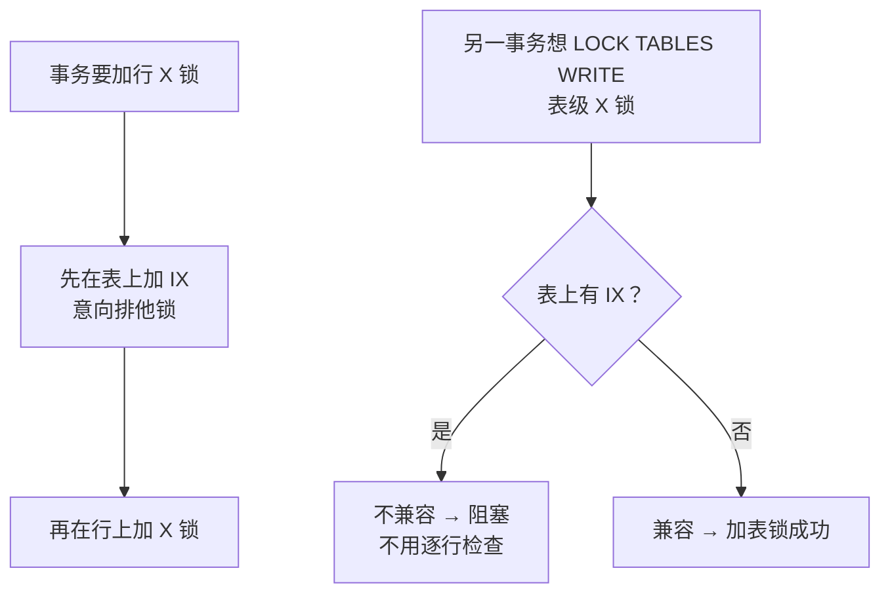

# 03｜事务与锁 · 练习题

开始做题前，先给大家一个小建议：合上知识点，对着 **一节的主图**，把「一次事务的一生」口述一遍（BEGIN → 隔离级别 → MVCC 读 → 加锁写 → 死锁 → COMMIT/ROLLBACK）。能顺下来，下面这些题你会发现大半都会了；卡壳的地方，就是你该回去重读的那一节。

做题的方式也建议改一下：每道题**先看标题和场景，自己口述一遍答案，再往下看「完整解答」对答案**。直接看解答，容易产生「我会了」的错觉——能讲出来才是真的会。

| 标记 | 含义 |
|------|------|
| **核心** | 不懂整章就没建立起来 |
| **必会** | 值班和面试都要能讲 |
| **常用** | 线上会反复碰到 |
| **常考** | 白板和追问的高频口径 |

题目的顺序也是有意排的：Q1～Q3 钉死 ACID / MVCC / RR·RC；Q4～Q8 专攻锁与防幻读；Q9 把日志与 2PC 补齐；Q10～Q14 收尾到死锁定责与生产选型。

## 本题目录

- [Q1 ACID 与四个隔离级别](#q1)
- [Q2 MVCC 怎么实现](#q2)
- [Q3 RR 和 RC 的区别](#q3)
- [Q4 行锁、间隙锁、next-key](#q4)
- [Q5 InnoDB 怎么消除幻读](#q5)
- [Q6 共享锁与排他锁](#q6)
- [Q7 意向锁是什么](#q7)
- [Q8 无索引的 UPDATE 会怎样](#q8)
- [Q9 undo log、redo log 与两阶段提交](#q9)
- [Q10 死锁怎么排查](#q10)
- [Q11 锁等待与死锁怎么分](#q11)
- [Q12 读死锁日志定责](#q12)
- [Q13 RR 和 RC 生产怎么选](#q13)
- [Q14 锁问题 60 秒定责](#q14)
- [合上书](#合上书)

---

## Q1

**★★★★★｜ACID 各靠什么实现？四个隔离级别各解决什么问题？**

**覆盖**：核心 · 必会 · 常考 ｜ **对应**：知识点 [二、起步：ACID与隔离级别](知识点.md)

### 场景

这道题几乎是事务面试的「开场白」。面试官开场就问"说说事务的 ACID"，然后追问"每个靠什么机制保证"。再追问"InnoDB 默认哪个隔离级别，为什么"。

先自己试试：不看下面，你能口述出关键结论吗？想完再对答案。

### 完整解答

> 🎯 **一句话**：ACID 四件靠 undo log（回滚）、redo log（持久化）、锁+MVCC（隔离）三套机制落地，隔离级别决定并发时能看到别人的什么。

- **A（Atomicity，原子性）**：一个事务要么全做要么全不做。靠 **undo log（回滚日志，记录修改前的旧值）** 实现——回滚时按 undo log 逆向恢复。
- **C（Consistency，一致性）**：事务执行前后数据满足所有约束。一致性是 A/I/D 的结果，不是独立机制。
- **I（Isolation，隔离性）**：并发事务互不干扰。靠 **锁** 和 **MVCC** 共同实现。
- **D（Durability，持久性）**：提交后即使崩溃也不丢。靠 **redo log（重做日志，记录数据页的物理修改）** 实现。

> ⚠️ **别混**：undo log 管回滚和 MVCC（旧版本），redo log 管崩溃恢复（新状态）。方向相反：undo 记"改之前是什么"，redo 记"改之后是什么"。

四个隔离级别从低到高：

| 隔离级别 | 脏读 | 不可重复读 | 幻读 |
|----------|------|------------|------|
| **RU（Read Uncommitted，读未提交）** | 可能 | 可能 | 可能 |
| **RC（Read Committed，读已提交）** | 不可能 | 可能 | 可能 |
| **RR（Repeatable Read，可重复读）** | 不可能 | 不可能 | InnoDB 不可能 |
| **Serializable（串行化）** | 不可能 | 不可能 | 不可能 |

- **脏读（dirty read）**：读到其他事务**未提交**的修改。
- **不可重复读（non-repeatable read）**：同一事务两次读同一行结果不同（别人提交了 UPDATE）。
- **幻读（phantom read）**：同一事务两次范围查询行数不同（别人提交了 INSERT/DELETE）。

> 📝 **面试**：InnoDB 默认 RR，且在 RR 下通过 next-key lock 消除了幻读，比 SQL 标准更严格。追问"为什么选 RR"答"RR 下一致性读更稳定，适合主从复制场景"。

### 再追问

**Serializable 是真的串行执行吗？**——不是。InnoDB 的 Serializable 是把所有普通 SELECT 隐式加 `LOCK IN SHARE MODE`，退化为当前读。**不要**以为它"一个事务一个事务排队"。

**RC 能不能用在生产？**——能，很多互联网公司（如阿里）就用 RC。RC 没有间隙锁，锁冲突更少、并发更高，代价是放弃了可重复读和防幻读。**不要**以为"RC 不安全不能用"。

---

## Q2

**★★★★★｜MVCC 怎么实现的？快照读和当前读有什么区别？**

**覆盖**：核心 · 必会 · 常考 ｜ **对应**：知识点 [三、读：MVCC多版本并发控制](知识点.md)

### 场景

ACID 讲完落到读侧：线上有个"先查再改"的逻辑：`SELECT gold FROM player WHERE id=1` 拿到余额是 100，然后 `UPDATE player SET gold=gold-50 WHERE id=1`。开发说"我 SELECT 加了锁，为什么不对"。

先自己试试：不看下面，你能口述出关键结论吗？想完再对答案。

### 完整解答

> 🎯 **一句话**：普通 SELECT 是快照读（读旧版本不加锁），FOR UPDATE / UPDATE 是当前读（读最新加锁）——"先查再改"不加锁的 SELECT 看到的可能不是最新值。

MVCC 让读不阻塞写、写不阻塞读。核心是 undo log 版本链 + ReadView：

```text
最新版本（表中当前行）  trx_id=200  gold=500
                        ↑ roll_pointer
 undo log 版本2        trx_id=150  gold=400
                        ↑ roll_pointer
 undo log 版本1        trx_id=100  gold=300
```

**读图**：从最新版本沿 `roll_pointer` 往回走，快照读根据 ReadView 判断哪个版本可见。本例里 `SELECT gold` 是快照读，读到的是 ReadView 时刻的旧版本；`UPDATE` 是当前读，读的是最新版本——所以两者可能看到不同的 gold 值。

正确的"先查再改"要用当前读：

```sql
-- 错误：快照读读旧版本，和 UPDATE 的当前读不一致
SELECT gold FROM player WHERE id = 1;              -- 快照读，可能读到旧值
UPDATE player SET gold = gold - 50 WHERE id = 1;   -- 当前读，操作最新值

-- 正确：用 FOR UPDATE 做当前读，保证读到最新
SELECT gold FROM player WHERE id = 1 FOR UPDATE;   -- 当前读，加 X 锁
UPDATE player SET gold = gold - 50 WHERE id = 1;   -- 此时 gold 是最新值
```

> ⚠️ **别混**：快照读读的是"旧版本"，不是"不加锁的当前版本"。RR 下两次快照读结果一致，因为读的是同一个 ReadView——不是"数据没变"。

### 再追问

**快照读会不会读到别人还没提交的数据？**——不会。ReadView 的可见性判断会排除 `m_ids` 里的活跃事务，未提交的版本沿 undo log 继续往前找。这就是"读已提交"和"可重复读"都不脏读的原因。

**快照读的旧版本一直保留吗？**——不会。purge 线程会清理不再被任何 ReadView 需要的旧版本。**长事务不提交会阻塞 purge**，导致 undo log 膨胀、回表变慢。**不要**让事务跑太久——这是长事务的一个隐藏危害。

---

## Q3

**★★★★★｜RR 和 RC 在 MVCC 上的区别是什么？为什么 RR 能可重复读？**

**覆盖**：核心 · 必会 · 常考 ｜ **对应**：知识点 [三、读：MVCC多版本并发控制](知识点.md)

### 场景

这是 Q2 的对照特写——面试官问"RR 和 RC 到底差在哪"，有人答"RR 加锁 RC 不加锁"。

先自己试试：不看下面，你能口述出关键结论吗？想完再对答案。

### 完整解答

> 🎯 **一句话**：ReadView 创建时机不同——RR 第一次快照读创建并复用，RC 每次快照读重建——这就是可重复读和读已提交的全部区别。

ReadView 可见性判断靠四个字段：

```text
m_ids        生成 ReadView 时活跃事务列表
min_trx_id   m_ids 中最小值
max_trx_id   下一个将分配的事务 ID
判断：trx_id < min_trx_id → 可见（之前提交了）
     trx_id >= max_trx_id → 不可见（之后产生的）
     trx_id 在 m_ids 中 → 不可见（还没提交）
     否则 → 可见（已提交）
```

| 对比 | **RR（可重复读）** | **RC（读已提交）** |
|------|-------------------|-------------------|
| ReadView 创建时机 | 事务**第一次**快照读时创建，之后**复用** | **每次**快照读都**新建** |
| 效果 | 两次读结果一致 | 每次读看到最新已提交 |

> 💡 **打个比方**：RR 是"进图书馆时拍一张在馆人员名单，之后只读名单之前归还的书"；RC 是"每次去书架前都重新拍一张名单"。

所以 RR 下别人提交了 UPDATE，你再 SELECT 还是看到旧值——ReadView 没变。RC 下别人提交了，你下次 SELECT 创建了新 ReadView，就能看到。

> ⚠️ **别混**：RR 和 RC 的区别**不在加锁**——两者快照读都不加锁。区别**只在 ReadView 创建时机**。有人答"RR 加锁 RC 不加锁"是错的。

### 再追问

**RR 下 UPDATE 能看到别人刚提交的数据吗？**——能。UPDATE 是当前读，读最新版本，不受 ReadView 限制。所以 RR 下可能出现"SELECT 看到旧值，UPDATE 操作新值"的"幻"感——但这不是幻读，幻读的定义是范围查询结果集变化。

**RC 下为什么还有不可重复读？**——因为每次 SELECT 都新建 ReadView。事务 A 第一次 SELECT 看到 gold=100，事务 B 提交了 gold=200，事务 A 第二次 SELECT 新建 ReadView，看到 gold=200——两次读不一样，这就是不可重复读。

---

## Q4

**★★★★★｜行锁、间隙锁、next-key 各锁什么？什么时候退化为记录锁？**

**覆盖**：核心 · 必会 · 常考 ｜ **对应**：知识点 [四、写：行锁、间隙锁与next-key](知识点.md)

### 场景

读侧讲完进入写锁：面试官要求在白板上画出索引上 10、20、30 三条记录，标出三种锁各自锁住的范围。追问"等值查询命中和未命中分别加什么锁"。

先自己试试：不看下面，你能口述出关键结论吗？想完再对答案。

### 完整解答

> 🎯 **一句话**：记录锁锁一条记录，间隙锁锁两记录之间的缝防 INSERT，next-key = 记录锁 + 前间隙锁；RR 下等值命中退化为记录锁，等值未命中退化为间隙锁。

```text
索引上有记录：10, 20, 30

  记录锁      锁 10 本身          ← 精确匹配 (id = 10)
  间隙锁      锁 (10, 20) 之间    ← 防止 INSERT id=15
  next-key    锁 (10, 20]         ← 范围查询 (id <= 20) → 锁住 (10,20] 这段
```

RR 下加锁规则：

```sql
-- 等值命中 → 退化为记录锁
SELECT * FROM t WHERE id = 10 FOR UPDATE;              -- 记录锁：锁 id=10

-- 等值未命中 → 退化为间隙锁
SELECT * FROM t WHERE id = 15 FOR UPDATE;              -- 间隙锁：锁 (10, 20)

-- 范围查询 → next-key
SELECT * FROM t WHERE id > 10 AND id <= 20 FOR UPDATE;  -- next-key: (10,20]
SELECT * FROM t WHERE id > 10 FOR UPDATE;              -- next-key: (10, +∞]
```

> ⚠️ **别混**：间隙锁只在 **RR** 下存在，**RC 没有间隙锁**。RC 下范围查询只锁已有记录，别人照样能 INSERT 进来——这就是 RC 仍有幻读的原因。另外 next-key 锁的是"前间隙"：记录 20 的 next-key 锁 (10, 20]，不是 (20, 30]。

### 再追问

**间隙锁之间兼容吗？**——兼容。两个事务可以同时持有同一间隙的 gap lock，因为 gap lock 的目的只是"不让人 INSERT"，不阻止别人也 gap lock。但 gap lock 和插入意向锁（INSERT 时加）不兼容——你想插、我拦着，冲突。**不要**以为"两个事务对同一范围 FOR UPDATE 就一定死锁"——如果只锁间隙不锁记录，可能不冲突。

**等值命中为什么退化为记录锁？**——因为等值命中时只需要锁住这条记录本身，不需要防止别人 INSERT 到间隙里（你查的就是这条记录，不是范围）。这是优化，不是标准 SQL 的要求。

---

## Q5

**★★★★☆｜InnoDB 在 RR 下怎么消除幻读？为什么标准 SQL 说 RR 还有幻读？**

**覆盖**：核心 · 必会 · 常考 ｜ **对应**：知识点 [四、写：行锁、间隙锁与next-key](知识点.md)

### 场景

这是 Q4 next-key 的用途版——面试官说"SQL 标准里 RR 不能防幻读，InnoDB 说能，谁对？"有人回答"InnoDB 用 MVCC 防的"。

先自己试试：不看下面，你能口述出关键结论吗？想完再对答案。

### 完整解答

> 🎯 **一句话**：标准 RR 只靠 MVCC 防不可重复读，不防幻读；InnoDB 在 RR 下额外用 next-key lock 锁住范围间隙防止 INSERT，所以能防——是实现的加强，不是标准。

幻读的场景：

```text
事务A： SELECT * FROM t WHERE id BETWEEN 10 AND 20;   → 查到 2 行
事务B： INSERT INTO t VALUES (15);                     → 插入 1 行
事务B： COMMIT;
事务A： SELECT * FROM t WHERE id BETWEEN 10 AND 20;   → 查到 3 行？→ 幻读
```

两种读的防线不同：

- **快照读**：MVCC 防幻读。RR 下 ReadView 不变，事务 B 插入的新行 trx_id 比 ReadView 新，不可见——所以两次快照读结果一样。但这只是"看不到新行"，不是"阻止插入"。
- **当前读**：next-key lock 防幻读。`SELECT ... FOR UPDATE` 会加 `(10,20]` 的 next-key lock，事务 B 的 INSERT 落在间隙内，被阻塞——物理上插不进来。

> ⚠️ **别混**：防幻读的主力是 **next-key lock**，不是 MVCC。MVCC 让快照读"看不到"新行，但别人还是能 INSERT；next-key lock 才"阻止"别人 INSERT。如果只靠 MVCC，快照读不幻读但当前读仍会幻读——所以 InnoDB 需要两者结合。标准 SQL 的 RR 只有 MVCC（或者说只有"可重复读"的语义），没有 next-key lock，所以标准说 RR 仍有幻读。

### 再追问

**RC 下为什么防不了幻读？**——RC 没有间隙锁，`SELECT ... FOR UPDATE` 只锁已有记录，别人照样能 INSERT。同时 RC 每次快照读新建 ReadView，也会看到新插入的行。所以 RC 从快照读和当前读两个层面都防不了幻读。

**Serializable 能完全防幻读吗？**——能。InnoDB 的 Serializable 把普通 SELECT 隐式加 `LOCK IN SHARE MODE`，所有读都是当前读+加共享锁，写要等读、读要等写，完全串行。代价是并发大幅下降。**不要**在生产环境随便用 Serializable。

---

## Q6

**★★★☆☆｜共享锁和排他锁的区别？什么时候自动加排他锁？**

**覆盖**：必会 · 常考 ｜ **对应**：知识点 [四、写：行锁、间隙锁与next-key](知识点.md)

### 场景

锁类型里最基础的一对：面试官问"SELECT FOR UPDATE 和 LOCK IN SHARE MODE 有什么区别"，追问"普通 UPDATE 自动加什么锁"。

先自己试试：不看下面，你能口述出关键结论吗？想完再对答案。

### 完整解答

> 🎯 **一句话**：S 锁之间兼容、X 锁与任何锁不兼容；FOR UPDATE 加 X 锁，LOCK IN SHARE MODE 加 S 锁，UPDATE/DELETE 自动加 X 锁。

| 对比 | **共享锁（S, Shared lock）** | **排他锁（X, Exclusive lock）** |
|------|-----------------|-----------------|
| 怎么加 | `SELECT ... LOCK IN SHARE MODE` | `UPDATE` / `DELETE` / `SELECT ... FOR UPDATE` |
| 互相 | S 之间兼容 | X 与任何锁不兼容 |
| 用途 | 读但加锁防别人改 | 改数据 |

行锁兼容矩阵（同一条记录上）：S+S 兼容，S+X 不兼容，X+X 不兼容。

```sql
-- 自动加 X 锁
UPDATE player SET gold = gold + 100 WHERE id = 1;    -- 隐式加 X 锁
DELETE FROM player WHERE id = 1;                      -- 隐式加 X 锁
INSERT INTO player VALUES (1, 'test', 100);           -- 隐式加 X 锁

-- 手动加锁
SELECT * FROM player WHERE id = 1 FOR UPDATE;         -- 显式加 X 锁
SELECT * FROM player WHERE id = 1 LOCK IN SHARE MODE; -- 显式加 S 锁
```

> ⚠️ **别混**：普通 `SELECT` **不加任何锁**（快照读）。`LOCK IN SHARE MODE` 加 S 锁后会阻塞别人的 X 锁（UPDATE/DELETE），但**不阻塞别人的普通 SELECT**——因为普通 SELECT 是快照读，根本不加锁。

### 再追问

**什么时候该用 S 锁？**——很少。大多数业务场景用 `FOR UPDATE`（X 锁）就对了。S 锁的经典场景是"我要读但不让别人改，自己也不改"——比如出报表时防止数据变动。但现代实践中更推荐用 MVCC（RR 下快照读天然一致）或业务层面控制，**不要**滥用 S 锁。

**gap lock 的锁模式是什么？**——gap lock 可以是 S 也可以是 X，但**两者效果一样**——都只是阻止 INSERT。所以 X gap lock 不比 S gap lock 更"排他"，这是 InnoDB 的优化。

---

## Q7

**★★★★☆｜意向锁是什么？为什么需要？**

**覆盖**：必会 · 常考 ｜ **对应**：知识点 [四、写：行锁、间隙锁与next-key](知识点.md)

### 场景

表锁和行锁之间还有一层「标记」：面试官问"事务要加行锁，为什么还要在表上加意向锁"，追问"IS 和 IX 之间兼容吗"。

先自己试试：不看下面，你能口述出关键结论吗？想完再对答案。

### 完整解答

> 🎯 **一句话**：意向锁是表级标记锁，事务加行锁前先加对应的意向锁，让表锁判断"表上有没有行锁"从 O(N) 降为 O(1)。



**读图**：没有意向锁时，想加表锁得逐行扫描有没有行锁。有了意向锁，看表上有没有 IS/IX 就知道了——O(1) 判断。

两种意向锁：**IS（意向共享锁，Intention Shared）** 加行 S 锁前加；**IX（意向排他锁，Intention Exclusive）** 加行 X 锁前加。

IS 和 IX 之间**互相兼容**——两个事务都可以在表上加意向锁，因为意向锁只是"声明我要加行锁"，不冲突。真正冲突的是行级锁。意向锁只与**表级** S/X 锁冲突。

> ⚠️ **别混**：意向锁是**表级**锁，不是行级锁。它不保护具体行，只是"表上有行锁"的快速标记。IS/IX 之间兼容，不兼容的是意向锁和表级 S/X 锁。**不要**把意向锁当成"行锁的一种"。

### 再追问

**意向锁是自动加的还是手动加的？**——自动的。InnoDB 在加行锁前自动在表上加对应的意向锁，开发不需要也不需要手动操作。你能在 `data_locks` 里看到 IS/IX，但不需要写 SQL 去加。

**LOCK TABLES 会加什么锁？**——表级 S 或 X 锁，会和行级锁对应的意向锁冲突。所以"有人加了行锁时 `LOCK TABLES` 会被阻塞"——这就是意向锁的意义。

---

## Q8

**★★★★★｜没有索引的 UPDATE 会怎样？为什么说"InnoDB 行锁可能退化为表锁"？**

**覆盖**：核心 · 必会 · 常用 · 常考 ｜ **对应**：知识点 [四、写：行锁、间隙锁与next-key](知识点.md)

### 场景

就是「行锁退化」那道高频坑——线上告警：一个 GM 执行 `UPDATE player SET gold=0 WHERE name='tester'`（name 无索引），整张表被锁住，所有涉及 player 的操作排队超时。有人以为只锁了一行。

先自己试试：不看下面，你能口述出关键结论吗？想完再对答案。

### 完整解答

> 🎯 **一句话**：InnoDB 行锁加在索引上——没有索引的 UPDATE 走全表扫描，每行都加锁，效果等同于表锁。

```sql
-- id 是主键 → 锁一行
UPDATE player SET gold = gold + 100 WHERE id = 1;

-- name 无索引 → 全表扫描，每行加锁
UPDATE player SET gold = 0 WHERE name = 'tester';
```

**读图**：`name='tester'` 没有索引可用，InnoDB 必须扫描全表的每一行来判断是否匹配。扫描过程中对每一行都加锁——不管是否最终匹配。所以即使只有 1 行 `name='tester'`，全表所有行都被锁住，其他事务的 UPDATE/DELETE/INSERT 全部阻塞。

> ⚠️ **别混**：没有索引的 UPDATE 不是"不加锁"，是"每行都加锁"——不是 InnoDB 选择退化，是全表扫描的必然结果。这和 MyISAM 的表锁不同——InnoDB 加的是行锁，只是加在了每一行上。

> 📝 **面试**：问"InnoDB 行锁加在哪"，答"索引上"。追问"没有索引呢"，答"全表扫描逐行加锁，效果等同表锁"。**不要**答"InnoDB 有行锁所以不会锁全表"——没索引时就是会锁全表。

### 再追问

**怎么避免？**——给 WHERE 条件涉及的列加索引。但**不要**给所有列都加索引——索引有维护成本（B+ 树分裂、写入变慢），只给真正用于查询条件的列加。索引怎么选见 [02-01-02](../../02-中间件与数据库/01-MySQL/02-索引与执行计划/)。

**RC 下也是每行加锁吗？**——是的，但 RC 下只有记录锁没有间隙锁，所以只锁住实际扫描到的行，不锁间隙。RR 下还要加间隙锁，范围更大。**不要**以为"RC 就不怕没索引的 UPDATE"——它照样锁全表记录，只是不锁间隙。

---

## Q9

**★★★★☆｜undo log 和 redo log 各干什么？两阶段提交是什么？**

**覆盖**：必会 · 常考 ｜ **对应**：知识点 [二、起步：ACID与隔离级别](知识点.md)

### 场景

把前面 undo/redo 口径钉死：面试官问"undo log 和 redo log 有什么区别"，追问"崩溃恢复时怎么保证 redo log 和 binlog 一致"。有人答"undo 是回滚日志，redo 也是回滚日志"。

先自己试试：不看下面，你能口述出关键结论吗？想完再对答案。

### 完整解答

> 🎯 **一句话**：undo log 记旧值（回滚+MVCC），redo log 记新值（崩溃恢复），方向相反；两阶段提交保证 redo log 和 binlog 一致。

| 对比 | **undo log（回滚日志）** | **redo log（重做日志）** |
|------|--------------------------|--------------------------|
| 记什么 | 修改**前**的旧值 | 修改**后**的数据页变更 |
| 用途 | 事务回滚（原子性）+ MVCC 旧版本 | 崩溃恢复（持久性） |
| 方向 | 往回看 | 往前重放 |

**两阶段提交（2PC）** 三步：

```text
① 写 redo log（prepare 状态）   ← 先写 redo，标记"准备提交"
② 写 binlog                     ← 再写 binlog（主从复制靠它）
③ 写 redo log（commit 状态）    ← 最后把 redo 标记"已提交"
```

**读图**：三步顺序不能乱。崩溃恢复时的判断逻辑：

- redo log 是 **commit 状态** → 事务已提交，直接恢复。
- redo log 是 **prepare 状态** + binlog 有对应记录 → 说明 binlog 写完了但 redo commit 没来得及 → 判定为已提交，补写 redo commit。
- redo log 是 **prepare 状态** + binlog **无**对应记录 → 说明 binlog 还没写 → 事务回滚。

> ⚠️ **别混**：undo log 和 redo log 不是同一回事——方向相反，用途不同。undo 记"改之前是什么"用于回滚和 MVCC；redo 记"改之后是什么"用于崩溃恢复。**不要**答"undo 也是恢复日志"。

### 再追问

**两阶段提交为什么不用一阶段？**——一阶段就是"先写 redo 再写 binlog"，如果 binlog 写失败但 redo 已 commit，主库认为已提交、从库没收到，主从不一致。两阶段让 redo 先 prepare，binlog 写完后才 commit，崩溃恢复时能根据 binlog 有没有来判断该 commit 还是 rollback。

**binlog 和 redo log 都记修改，不重复吗？**——记法不同。redo log 记的是**数据页的物理变更**（哪个页偏移改成什么），binlog 记的是**逻辑变更**（哪条 SQL 改了哪行）。redo log 是 InnoDB 引擎层，binlog 是 Server 层。主从复制用 binlog，崩溃恢复用 redo log——各管各的。详见 [02-01-04](../../02-中间件与数据库/01-MySQL/04-主从与高可用/)。

---

## Q10

**★★★★★｜死锁怎么产生的？InnoDB 怎么处理？怎么排查？**

**覆盖**：核心 · 必会 · 常用 · 常考 ｜ **对应**：知识点 [六、作战：定责（死锁与锁等待排查）](知识点.md)

### 场景

就是开篇那个准备 kill 的现场——线上报错 `ERROR 1213 (40001): Deadlock found when trying to get lock; try restarting transaction`。业务方说"没有两个事务同时在改"，不知道死锁从哪来。

先自己试试：不看下面，你能口述出关键结论吗？想完再对答案。

### 完整解答

> 🎯 **一句话**：两个事务互相持有对方需要的锁，形成等待环——InnoDB 自动检测并回滚代价小的事务，看 `SHOW ENGINE INNODB STATUS` 排查。

死锁的经典场景：

```text
事务A： UPDATE t SET v=1 WHERE id=1;  → 锁 id=1
事务B： UPDATE t SET v=2 WHERE id=2;  → 锁 id=2
事务A： UPDATE t SET v=1 WHERE id=2;  → 等 B 释放 id=2
事务B： UPDATE t SET v=2 WHERE id=1;  → 等 A 释放 id=1 → 死锁！
InnoDB：回滚 trx_rows_modified 少的那个事务
```

> 💡 **打个比方**：两辆车在窄路迎面开，各占一半路，谁也退不了——InnoDB 看谁载货少（改的行少）就让那辆倒车。

InnoDB 有**死锁检测（deadlock detection）**：每次加锁时检查是否形成等待环。检测到就回滚代价最小的事务（`trx_rows_modified` 最少的），让另一个事务继续。所以 1213 报错的事务是被选中的 victim，不需要人工干预。

排查三步：

```sql
-- ① 看死锁日志
SHOW ENGINE INNODB STATUS\G
-- → LATEST DETECTED DEADLOCK 段：
--   *** (1) TRANSACTION: 事务 A 持有什么锁、等什么锁
--   *** (2) TRANSACTION: 事务 B 持有什么锁、等什么锁
--   *** WE ROLL BACK TRANSACTION (2)  ← 谁被回滚

-- ② 开启全量死锁日志（排查期临时开）
SET GLOBAL innodb_print_all_deadlocks = ON;

-- ③ 看当前锁详情（8.0+）
SELECT * FROM performance_schema.data_locks;
-- → LOCK_MODE 里有 GAP 的是间隙锁，REC_NOT_GAP 是记录锁
```

> ⚠️ **别混**：死锁**不需要人工 kill**——InnoDB 自动检测并回滚。拿到 1213 的应用应该**重试**，不是去找谁 kill 了它。如果频繁死锁，要改业务逻辑（统一加锁顺序），**不要**降级到 RC 逃避。

### 再追问

**怎么预防死锁？**——统一加锁顺序。如果所有事务都按 id 升序加锁，就不会形成等待环。拆大事务为小事务也能减少锁持有时间，降低死锁概率。**不要**用"加 `SET innodb_lock_wait_timeout=1` 让它快速失败"来治死锁——那只是把死锁变成超时，根因还在。

**死锁检测有性能代价吗？**——有。高并发下每次加锁都要检测等待环，CPU 会涨。MySQL 8.0+ 可以设 `innodb_deadlock_detect=OFF` 关掉检测，但必须配合调大 `innodb_lock_wait_timeout`——代价是死锁不会自动解，只能等超时。**不要**在高并发场景随意关死锁检测。

---

## Q11

**★★★★☆｜锁等待和死锁怎么分？锁等待超时了怎么办？**

**覆盖**：必会 · 常用 · 常考 ｜ **对应**：知识点 [六、作战：定责（死锁与锁等待排查）](知识点.md)

### 场景

这是 Q10 的易混对照——UPDATE 卡了 50 秒后报 `ERROR 1205 (HY000): Lock wait timeout exceeded`。有人以为是死锁。

先自己试试：不看下面，你能口述出关键结论吗？想完再对答案。

### 完整解答

> 🎯 **一句话**：死锁是互相等形成环（自动回滚 1213），锁等待是一方等另一方没死（等超时报 1205）——定责先分清是哪种。

| 对比 | **死锁（deadlock）** | **锁等待（lock wait）** |
|------|---------------------|------------------------|
| 错误码 | **1213** | **1205** |
| 现象 | 互相等 → 形成等待环 | 单向等 → B 没死也不回滚 |
| 处理 | InnoDB 自动回滚 | 等 `innodb_lock_wait_timeout`（默认 50s）超时 |
| 日志 | `SHOW ENGINE INNODB STATUS` 的 `LATEST DETECTED DEADLOCK` | `INNODB_TRX` 里 `trx_state=LOCK WAIT` |

锁等待排查：

```sql
-- 看谁在等
SELECT * FROM information_schema.INNODB_TRX WHERE trx_state = 'LOCK WAIT'\G
-- trx_id: 1234567
-- trx_state: LOCK WAIT
-- trx_started: 2026-09-01 14:30:00   # ← 等了多久
-- trx_query: UPDATE player SET gold=0 WHERE id=1   # ← 在等什么
-- trx_rows_modified: 0

-- 看谁持锁（8.0+）
SELECT * FROM performance_schema.data_lock_waits;
-- → REQUESTING_ENGINE_LOCK_ID 和 BLOCKING_ENGINE_LOCK_ID 对比
```

> ⚠️ **别混**：锁等待**不是**死锁。锁等待时 B 还在正常运行（可能在执行大 UPDATE、可能在等 IO），并没有和 A 形成环。调大 `innodb_lock_wait_timeout` 只是让 A 等更久，**治不了根因**——根因是 B 持锁太久。**不要**把超时调到 300s 拖着——那是让用户等 5 分钟。

### 再追问

**持锁事务该不该 kill？**——看情况。如果持锁事务是"跑飞了的大事务"（比如误操作全表 UPDATE），kill 它是对的。如果是正常业务在执行，kill 会导致它回滚，回滚时间可能比执行时间还长（按 undo log 逆向恢复）。**不要** kill 后不检查业务一致性——A 已经改了一半的数据会回滚。

**怎么减少锁等待？**——① 加索引让 SQL 精确加锁不扫全表；② 缩小事务范围（别在事务里做 RPC、文件 IO 等慢操作）；③ 避免长事务（长事务持锁久，undo log 也膨胀）；④ 高并发热点行考虑分片或异步队列。

---

## Q12

**★★★★☆｜给你一段死锁日志，说出两个事务各持什么锁、等什么锁、谁先回滚**

**覆盖**：必会 · 常用 ｜ **对应**：知识点 [六、作战：定责（死锁与锁等待排查）](知识点.md)

### 场景

把 Q10、Q11 落到读日志实战：值班收到死锁告警，`SHOW ENGINE INNODB STATUS` 输出一大段死锁日志，不知道从哪看起。

先自己试试：不看下面，你能口述出关键结论吗？想完再对答案。

### 完整解答

> 🎯 **一句话**：死锁日志分两段——`HOLDS THE LOCK(S)` 是已持有，`WAITING FOR THIS LOCK TO BE GRANTED` 是正在等；对照两个事务的持有和等待，就能看出等待环。

死锁日志关键段：

```text
========================
LATEST DETECTED DEADLOCK
========================
*** (1) TRANSACTION:
TRANSACTION 1234567, ACTIVE 3 sec starting index read
UPDATE t SET v=1 WHERE id=2        ← 事务A在执行什么

*** (1) HOLDS THE LOCK(S):
LOCK TABLE: t  LOCK_TYPE: RECORD  LOCK_MODE: X,REC_NOT_GAP
LOCK_DATA: 1                       ← 事务A持有 id=1 的X锁

*** (1) WAITING FOR THIS LOCK TO BE GRANTED:
LOCK_MODE: X,REC_NOT_GAP  LOCK_DATA: 2   ← 事务A等 id=2 的X锁

*** (2) TRANSACTION:
TRANSACTION 1234568, ACTIVE 2 sec starting index read
UPDATE t SET v=2 WHERE id=1        ← 事务B在执行什么

*** (2) HOLDS THE LOCK(S):
LOCK_MODE: X,REC_NOT_GAP  LOCK_DATA: 2   ← 事务B持有 id=2 的X锁

*** (2) WAITING FOR THIS LOCK TO BE GRANTED:
LOCK_MODE: X,REC_NOT_GAP  LOCK_DATA: 1   ← 事务B等 id=1 的X锁

*** WE ROLL BACK TRANSACTION (2)    ← 事务B被回滚（代价小）
```

**读图**：事务 A 持有 id=1、等 id=2；事务 B 持有 id=2、等 id=1——这就是等待环。InnoDB 回滚了事务 B（`trx_rows_modified` 少的）。修复方法是让事务 A 和 B 按同一顺序加锁（都先锁 id=1 再锁 id=2）。

> 🔍 **现场**：看到 `LOCK_MODE: X,GAP` 说明等的是间隙锁——可能不是行锁冲突，而是 INSERT 被间隙锁挡住。看到 `LOCK_MODE: X` 不带后缀是 next-key。这些后缀直接告诉你锁的类型。

> ⚠️ **别混**：死锁日志只记录**最后一次**死锁。要看所有死锁，开 `SET GLOBAL innodb_print_all_deadlocks = ON`，死锁日志会写进 error log。**不要**在排查完后忘了关——error log 会膨胀。

### 再追问

**两个事务的 SQL 一样怎么办？**——看 `HOLDS` 和 `WAITING` 的 `LOCK_DATA` 不同就知道加锁顺序反了。即使 SQL 完全一样（比如同一个存储过程），如果 WHERE 条件不同就可能在不同的行上各自加锁。修复方法是在业务层统一加锁顺序，**不要**靠"减少并发"来治。

**60 秒剧本怎么走？**

```text
① 0–10s  确认 1213 死锁（不是 1205 锁等待）
② 10–30s SHOW ENGINE INNODB STATUS，找 LATEST DETECTED DEADLOCK
③ 30–45s 对照两个事务的 HOLDS 和 WAITING，画出等待环
④ 45–60s 定责：加锁顺序不一致→统一顺序；无索引→加索引；间隙锁冲突→调整查询范围
```

---

## Q13

**★★★★☆｜RR 和 RC 生产怎么选？游戏账本该用哪个？**

**覆盖**：必会 · 常考 ｜ **对应**：知识点 [二、起步：ACID与隔离级别](知识点.md)、[三、读：MVCC多版本并发控制](知识点.md)

### 场景

机制讲完要会选型：新项目默认 `REPEATABLE READ`。支付团队说「同一事务里两次读余额不一致」是 bug；战斗团队说「间隙锁导致插入排队」。

先自己试试：不看下面，你能口述出关键结论吗？想完再对答案。

### 完整解答

> 🎯 **一句话**：MySQL 默认 **RR** 靠 next-key 防幻读，但间隙锁多；**RC** 锁少、每次读新快照，适合高并发写+需见最新提交的场景。

| 隔离级别 | 读行为 | 写锁 | 典型场景 |
|----------|--------|------|----------|
| RR | 事务内快照一致 | 间隙锁多 | 报表、对账、要可重复读 |
| RC | 语句级最新已提交 | 锁范围小 | 高并发 OLTP、支付见最新余额 |

游戏账本/充值：**RC + 业务幂等 + `SELECT ... FOR UPDATE` 热点行**，比全局 RR 少间隙锁冲突。活动排行统计可 RR。改隔离级别是**全局或连接级**决策，**不要**混用不自知。

> ⚠️ **别混**：RC 不是「无锁」——写仍加行锁；只是没有 RR 的间隙锁，幻读靠应用或 `FOR UPDATE` 挡。

### 再追问

**binlog 和隔离级别有关系吗？**——`READ COMMITTED` + `binlog_format=ROW` 是主流组合；STATEMENT 在 RC 下可能主从不一致。

---

## Q14

**★★★★★｜告警「锁等待」和「死锁」，60 秒怎么分？**

**覆盖**：核心 · 必会 · 🔧 ｜ **对应**：知识点 [六、作战：定责（死锁与锁等待排查）](知识点.md)

### 场景

这张表把前面锁题串起来了：`Threads_running` 飙高，应用报 `Lock wait timeout exceeded` 和 `Deadlock found`。有人要重启 MySQL。

先自己试试：不看下面，你能口述出关键结论吗？想完再对答案。

### 完整解答

> 🎯 **一句话**：**1205 = 锁等待**（B 持锁太久），**1213 = 死锁**（环，InnoDB 已回滚一个）——先 `SHOW ENGINE INNODB STATUS` 和 `data_lock_waits`，**不要**重启。

```text
0–10s   错误码：1205 vs 1213
10–30s  INNODB STATUS → LATEST DETECTED DEADLOCK 或 TRANSACTIONS 锁等待链
30–45s  data_lock_waits：谁 block 谁；PROCESSLIST 看 State=updating
45–60s  定型：无索引 UPDATE→加索引；长事务→kill 大事务；死锁→统一加锁顺序
```

```sql
SELECT * FROM performance_schema.data_lock_waits\G
-- BLOCKING → REQUESTING 对比 thread_id
```

> 📝 **面试**：锁等待调大 `innodb_lock_wait_timeout` 不治本；死锁应用层重试可以，但要修加锁顺序。

### 再追问

**能直接 kill 持锁会话吗？**——大事务 kill 后回滚可能更久。先 `trx_rows_modified` 评估，**不要**高峰期 kill 未确认的主库写事务。

---

## 合上书

做完题再合上书，对着知识点「合上书」逐条过一遍——条数对齐，卡壳的回对应 Q：

- [ ] **默画一节的图**：BEGIN → 隔离级别 → MVCC 读 → 加锁写 → 死锁判断 → COMMIT/ROLLBACK；读为什么不阻塞写。（Q1、Q2）
- [ ] **口述起步**：ACID 各靠什么实现（undo/redo/锁+MVCC）、两阶段提交三步、四个隔离级别各解决什么异常。（Q1、Q9）
- [ ] **口述读**：快照读 vs 当前读、MVCC 怎么实现（undo log 版本链 + ReadView）、RR 和 RC 的 ReadView 创建时机区别。（Q2、Q3）
- [ ] **默画版本链**：最新版本 → undo log 旧版本 → roll_pointer 串联 → ReadView 判断可见性。（Q2、Q3）
- [ ] **口述写**：行锁加在索引上、记录锁/间隙锁/next-key 各锁什么、RR 有间隙锁 RC 没有。（Q4、Q8）
- [ ] **默画锁兼容**：S/X 兼容矩阵、gap lock 之间兼容、意向锁 IS/IX 与表级 S/X 的关系。（Q6、Q7）
- [ ] **口述收束**：MVCC+锁+ReadView+next-key+意向锁五件套怎么保证隔离、为什么"隔离 ≠ 一致性"。（Q5、Q1）
- [ ] **定责**：死锁（自动回滚 1213）vs 锁等待（超时 1205）怎么分、`SHOW ENGINE INNODB STATUS` 和 `data_locks` 各看什么、60 秒剧本每步敲什么。（Q10、Q11、Q12、Q14）
