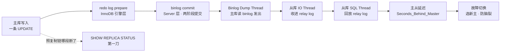
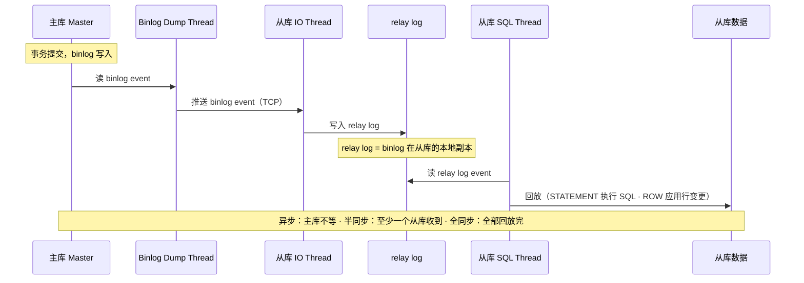
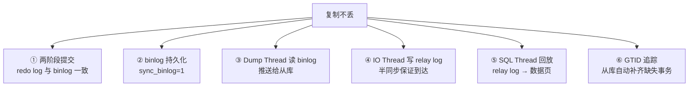
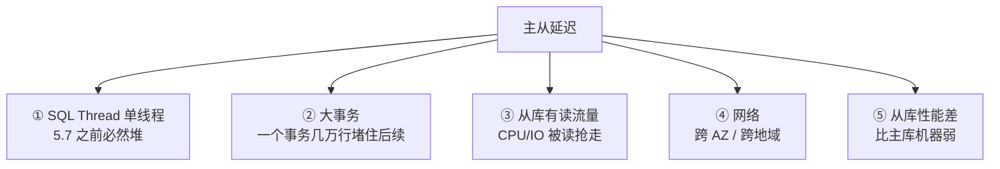
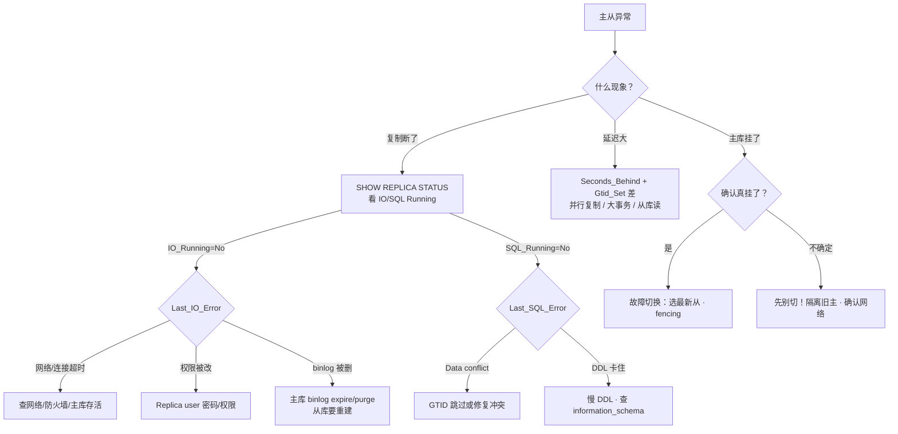

# 主从与高可用

> 主库挂了，从库差 10 秒——有人直接提升从库，有人要先补数据，有人喊先别切。群里已经有人在改 VIP，切完新主一查：丢了 200 条写入。
> **本章回答**：一次写入从主库到从库会经历什么（两阶段提交 → 复制 → 回放 → 延迟 → 故障切换），每个阶段什么会坏。
> **不讲**：InnoDB 存储引擎内部 → [02-01-01](../../02-中间件与数据库/01-MySQL/01-架构与存储引擎/)；事务隔离与锁 → [02-01-03](../../02-中间件与数据库/01-MySQL/03-事务与锁/)；备份恢复与慢查询 → [02-01-05](../../02-中间件与数据库/01-MySQL/05-备份恢复与慢查询治理/)。

**标记**：🎯重点 · 🔥难点 · ⭐常考 · 🔧实操
---

## 一、一张图：一次写入的复制之旅

> 🎯 **一句话**：一条写入从主库到从库要走完五个阶段——写 redo log → 写 binlog（两阶段提交）→ 复制线程搬 → 从库回放 → 故障时切换，卡在哪段定责哪段。



- 📖 **读图**
  - 🛤️ 主线：两阶段提交 → 三线程接力 → 延迟 → 切主；卡在哪段定责哪段
  - 🩺 `SHOW REPLICA STATUS` 照交接点：IO 断看 `Last_IO_Error`，SQL 卡看 `Last_SQL_Error`

> 本节对应练习题 **Q1、Q2、Q3**（主图地基）。

---

## 二、出发：redo log 与 binlog（两阶段提交）

> 🎯 **一句话**：主库写完 redo log（prepare）再写 binlog（commit）——两阶段提交保证两个日志一致，crash 恢复时不会丢或裂。

binlog 还要喂给从库——两本日志撕开了，主从就裂。⭐

### 📒 三个日志各是什么 ⭐

MySQL 有两个层次的日志，跨层次是高频混淆点：

- **redo log（重做日志）** = InnoDB 引擎层的物理日志，记录「哪个数据页哪个偏移改了什么」，保证 crash 后已提交事务不丢
  - 先写 redo log 再改数据页 = **WAL（Write-Ahead Logging，预写日志）**——崩了能靠日志重做
- **undo log（回滚日志）** = InnoDB 引擎层，记修改前旧值；回滚和 MVCC 都靠它
  - 不在复制链上传递；从库回放时自己再生成
- **binlog（二进制日志）** = MySQL Server 层的逻辑日志，记写操作（SQL 或行变更）
  - 复制源头 + PITR（Point-in-Time Recovery）基础；换引擎 binlog 仍在

> ⚠️ **别混**：redo log 是 **InnoDB 引擎层**、**物理**日志；binlog 是 **Server 层**、**逻辑**日志。两层两格式，别当成一个东西。

### 🔗 两阶段提交：保证 redo log 与 binlog 一致 🔥⭐

如果 redo 写了但 binlog 没写 → 主库有、从库收不到；反过来 binlog 写了 redo 没 commit → 从库有、主库可能没有。🔥 **两阶段提交（2PC）**：**两本账先都写到「准备好」，再一起落锤——中间崩了，以 binlog 有没有完整记录来裁决提交还是回滚**。

#### ❓ 复制场景下为什么必须两阶段提交？

- 🏠 主库只靠 redo 能自愈，**从库只吃 binlog**
- 💥 两本日志撕裂 = 主从永久不一致
- ✅ prepare → binlog → commit，恢复以 binlog 为准裁决

```mermaid
sequenceDiagram
    participant App as 应用
    participant IDB as InnoDB
    participant REDO as redo log
    participant UNDO as undo log
    participant BIN as binlog
    App->>IDB: BEGIN; UPDATE ...
    Note over IDB: ① 写 undo log（回滚用）
    Note over REDO: ② 写 redo log（prepare 状态）· fsync
    Note over IDB: 数据页改在内存（Buffer Pool）
    Note over BIN: ③ 写 binlog · fsync（sync_binlog=1）
    Note over REDO: ④ redo log 改为 commit 状态
    IDB->>App: 返回事务成功
```

- 📖 **读图**
  - 命门在 ②③：prepare 先记「要提交」，binlog 确认「复制源有了」，④ 才标 commit
  - **binlog 写成功之前 redo 停在 prepare；写成功之后才 commit**

crash 在不同阶段：

```text
crash 在 ② 后 ③ 前 → prepare、binlog 无 → 恢复回滚（从库不会收到）
crash 在 ③ 后 ④ 前 → prepare、binlog 有 → 恢复必须提交！（从库可能已收到）
crash 在 ④ 后       → commit + binlog 都有 → 正常，没分歧
```

#### ❓ 为什么 crash 在「binlog 已写、redo 还 prepare」必须提交？

- 📡 从库可能已经收到这条 binlog——主库若回滚 = **主无从有**，永久裂
- ⚖️ 裁决规则：**以 binlog 是否完整为准**，不是以 redo commit 位为准
- 🧠 这正是 2PC 存在的理由：准备态 + 外部日志，恢复时能唯一裁决

> 💡 **打个比方**：签合同要有公证人——你先签字（redo prepare），公证人盖章（binlog），你才正式生效（redo commit）。晕倒时：公证书没章 → 作废；已盖章 → 合同有效。

> 📝 **面试**：2PC 不是为了「分布式事务」，是为了**单机 redo 与 binlog 一致**。不用 2PC：redo 有 binlog 无 → 主有从无；反过来 → 从有主无，都裂。

### 🧾 binlog_format：ROW / STATEMENT / MIXED ⭐

| 对比 | **STATEMENT** | **ROW** | **MIXED** |
|------|---------------|---------|-----------|
| 记什么 | SQL 原文 | 每行变更前后值 | 默认 STATEMENT，遇非确定性切 ROW |
| 日志大小 | 小 | 大（行多时） | 中等 |
| 风险 | `NOW()`/`UUID()`/`RAND()` 主从不一致 | 无 | 极少数边缘 case |

- **STATEMENT**：从库再执行 `NOW()` → 时间可能不同。生产不建议
- **ROW**：记确定行值，结果必与主库一致。生产建议
- **MIXED**：自动选；仍建议直接 ROW

#### ❓ 为什么生产硬推 ROW，不是「日志更小的 STATEMENT」？

- 🎲 STATEMENT 把非确定性函数推到从库再算 → 主从不一致
- ⚡ ROW 日志虽大，回放直接 apply 行变更，往往**更快**
- 🔒 ROW 不走「再解析 SQL」那条路，安全性与可预期性更高

> ⚠️ **别混**：`binlog_format` 只影响 **binlog 记什么**，不影响 redo（永远物理）。

> 🔍 **现场**：看 format 与「双 1」。

```bash
mysql -e "SHOW VARIABLES LIKE 'binlog_format';"
# binlog_format | ROW   # ← 生产建议 ROW

mysql -e "SHOW VARIABLES LIKE 'sync_binlog';"
# sync_binlog | 1   # ← 每次提交 fsync binlog；0 = 交给 OS

mysql -e "SHOW VARIABLES LIKE 'innodb_flush_log_at_trx_commit';"
# innodb_flush_log_at_trx_commit | 1   # ← 每次提交 fsync redo；与 sync_binlog=1 合称「双 1」
```

「双 1」= 两个都 fsync，crash 不丢；任一为 0 就有丢数风险。更多 crash 参数见 [02-01-01](../../02-中间件与数据库/01-MySQL/01-架构与存储引擎/)。

主库内部对齐了，下一步才是「搬到从库」——三个线程接力。

> 本节对应练习题 **Q1、Q2**。

---

## 三、复制：主从复制原理

> 🎯 **一句话**：主库 Binlog Dump Thread 读 binlog 发出，从库 IO Thread 收进 relay log，SQL Thread 回放——三个线程接力，三种模式只差「主库等不等从库」。

⭐ 口诀：**Dump 推、IO 收、SQL 放**——三种复制模式只差「主库等不等从库 ACK」。

### 🏃 三个线程怎么接力 🔥⭐



- 📖 **读图**
  - **Dump** 读 binlog → **IO** 写入 **relay log**（中继日志 = 从库本地 binlog 副本）→ **SQL** 回放
  - 交接故障分界：IO 断 → `Last_IO_Error`（网络/权限/主库 binlog 被删）；SQL 卡 → `Last_SQL_Error`（冲突/DDL/类型不匹配）

### 📡 三种复制模式 ⭐🔥

三种模式只差一个地方——**主库在哪个环节返回「写成功」**：

| 对比 | **异步（async）** | **半同步（semi-sync）** | **全同步** |
|------|-------------------|------------------------|-----------|
| 主库何时返回 | 写完 binlog | ≥1 从库**收到** binlog | 全部从库**回放完** |
| 数据安全 | 未发出的可能丢 | ≥1 份在 relay log | 不丢 |
| 性能 | 最快 | 多一次 RTT | 最慢 |
| 生产 | 默认大量用 | 核心业务 | 几乎不用 |

- **异步**：默认。主库不等从库；主挂且 binlog 未发出 → 丢
- **半同步**：等 ≥1 从库写入 relay log 才返回。`rpl_semi_sync_source_enabled=ON`（8.0+ source；旧版 master）
  - ⚠️ 保证「到了 relay log」，**不保证回放完**
- **全同步**：等全部回放。MGR 用共识接近全同步，但不是传统全同步

#### ❓ 异步丢不丢？半同步到底解决什么？

- 📡 **异步**：主库写完 binlog 就返回——没 ACK，主挂可能丢最后一批
- 🤝 **半同步**：至少一台从库收到并写入 relay log 才返回客户端
- ⚠️ 半同步 ≠ 已回放完；延迟仍可能在 SQL Thread；切主前要等追上

> ⚠️ **别混**：半同步 **≠ 不丢数据**。切主时 relay 有但表里没有 → 先 `WAIT_FOR_EXECUTED_GTID_SET` 再切流量。

### 🆔 GTID：取代 file:position ⭐

```text
传统复制（file:position）：
  CHANGE REPLICATION SOURCE TO
    SOURCE_LOG_FILE='mysql-bin.000123', SOURCE_LOG_POS=4567;
  → 切主时手动算新主 position，极易出错

GTID 复制：
  CHANGE REPLICATION SOURCE TO
    SOURCE_AUTO_POSITION=1;
  → 从库自动补缺失 GTID，切换不用算 position
```

**GTID（Global Transaction Identifier）** = `server_uuid:transaction_id`，每个已提交事务一个全局唯一 ID。从库报已执行集合，主库只补缺的。`gtid_mode=ON`，新部署强烈建议。

> 💡 **打个比方**：传统像「记到第几卷第几页」——换档案室要对位置；GTID 像每份文件有编号，报「我有 1~5000」，对方从 5001 开始补。

> 📝 **面试**：GTID 三点——① 切换不用算 position；② 跨从库拓扑更安全；③ 可 `WAIT_FOR_EXECUTED_GTID_SET` 等追上再切。限制：不支持 `CREATE TABLE ... SELECT` 等非事务语句。

### 📦 relay log 与 SQL Thread 🔧

- **relay log** = 从库本地 binlog 副本：IO 写、SQL 读；格式与 binlog 相同，只是「收到的副本」
- SQL Thread：5.7 前**单线程**回放 → 主库并发、从库串行，延迟必堆
  - 5.7+ **并行复制**（`replica_parallel_workers`）：同一 group commit 内无锁冲突可并行
  - 8.0 默认 `slave_parallel_type=LOGICAL_CLOCK`

> ⚠️ **别混**：并行复制不是「各跑各的」——只并行「同一 group commit 里无冲突」的事务；开太大不一定快。

> 🔍 **现场**：看复制状态和延迟。

```bash
mysql -e "SHOW REPLICA STATUS\G" 2>/dev/null || mysql -e "SHOW SLAVE STATUS\G"
# 8.0.22+ SHOW REPLICA STATUS；5.7 SHOW SLAVE STATUS，同一件事
```

```text
             Replica_IO_Running: Yes     # ← IO Thread 在跑吗
            Replica_SQL_Running: Yes     # ← SQL Thread 在跑吗
        Seconds_Behind_Master: 0          # ← 延迟秒数；NULL = 复制断了
      Last_IO_Error:                    # ← 空 = 没错
      Last_SQL_Error:                   # ← 空 = 没错
   Retrieved_Gtid_Set: uuid:1-5000       # ← 已收到
    Executed_Gtid_Set: uuid:1-4998       # ← 已回放；差 = 回放落后
```

`Seconds_Behind_Master` 是第一指标，但有坑——见下节 ❓。真正延迟看 `Retrieved_Gtid_Set` 与 `Executed_Gtid_Set` 的差。

### 收束：一次写入凭什么到从库 🎯⭐

面试问「**主从不丢靠什么**」，答这张清单——**六件套**：



- 📖 **读图**
  - ①② 主库不丢；③④ 传输不丢（半同步 ≥1 份）；⑤⑥ 回放不漏
  - 断了：主库侧看 `Last_IO_Error`，从库侧看 `Last_SQL_Error`

> ⚠️ **别混**：不丢 **≠ 不延迟**；也 **≠ 强一致**。强一致读走主库，或半同步 + `WAIT_FOR_EXECUTED_GTID_SET`。

> 📝 **面试**：六件套按「主库不丢 → 传输不丢 → 回放不漏」记。补一句「不丢 ≠ 不延迟、≠ 强一致」——半同步只到 relay，切主前要等追上。

复制链路通了，值班天天见的却是「从库慢了几秒」。

> 本节对应练习题 **Q3、Q4、Q5**。

---

## 四、延迟：主从延迟从哪来

> 🎯 **一句话**：主从延迟 = SQL Thread 回放速度 < 主库写入速度，主因是单线程回放、大事务、从库有读流量。

开篇丢了 200 条，根子往往在这里：切主时从库还落后——先会测、再会治。

### 🐢 延迟的五个来源 ⭐



- 📖 **读图**
  - 不等式：主库写入 > 从库回放。① 历史问题；② 突发最常见；③ 读写分离固有代价
  - 先分「持续」还是「突发」：持续 = 性能/单线程；突发 = 大事务

> 💡 **打个比方**：主库像流水线产货，从库像一辆卡车——产快搬慢就堆。并行复制 = 多几辆车（只能搬同一批打包货）；拆大事务 = 别让一个包裹堵住传送带；从库不做读 = 卡车不绕路。

### 📏 怎么测 🔧

```bash
mysql -e "SHOW REPLICA STATUS\G" | grep -E 'Seconds_Behind|Gtid_Set'
# Seconds_Behind_Master: 3
# Retrieved_Gtid_Set: uuid:1-5000
# Executed_Gtid_Set: uuid:1-4997  # ← 差 3 = 回放落后 3 个

mysql -e "SHOW VARIABLES LIKE 'replica_parallel_workers';"
# replica_parallel_workers | 8   # ← 0 = 单线程回放
```

#### ❓ 为什么 `Seconds_Behind_Master=0` 还可能有延迟？

- ⏱️ 它测的是「从库当前时间 − 最后一个 event 上的主库时间戳」
- 💤 主库完全不写时，秒数可以是 **0**，从库其实空转/落后
- ✅ 真延迟看 **GTID 差**：`Retrieved` 与 `Executed` 不一致 = 还没回放完
- 📌 `Seconds_Behind=0` 但 GTID 差 ≠ 0 = 刚收完、还没放完

### 🛠️ 怎么治

- **开并行复制**：`replica_parallel_workers=8`（或 `slave_parallel_workers`），5.7+
- **拆大事务**：百万行 `DELETE` → 分批 `LIMIT 1000`；大事务也是 binlog 膨胀源头
- **从库不做读**：备份/统计专用；读重业务单独加从库
- **网络**：跨 AZ RTT 有贡献，但主因通常在回放端

#### ❓ 为什么开了 8 个 parallel worker 还是不快？

- 🧩 只能并行「同一 group commit、无锁冲突」的事务——组就那么多
- 📊 现场看有几个 worker 真在干活：长期只有 1～2 个 ON → 再加大无用
- 🧱 大事务/DDL 仍会串行堵住后续——并行救不了「一个巨型包裹」

> 📝 **面试**：延迟别只答「开并行」——先分持续/突发；持续查并行与规格，突发查大事务/DDL；从库有读是读写分离代价。

> 🔍 **现场**：延迟告警，先分突发/持续再开方。

```bash
# 连采三次看趋势
for i in 1 2 3; do
  mysql -e "SHOW REPLICA STATUS\G" | grep -E 'Seconds_Behind|Executed_Gtid_Set'
  sleep 5
done
# 一直涨 = 持续 → 并行配置 / 从库负载
# 跳高再回落 = 突发 → 大事务 / DDL

mysql -e "SELECT * FROM performance_schema.replication_applier_status_by_worker\G" | grep -E 'WORKER_ID|APPLYING_TRANSACTION|LAST_APPLIED_TRANSACTION'
# APPLYING_TRANSACTION 持续不变 = 卡在某个大事务

mysql -e "SELECT COUNT(*) FROM performance_schema.replication_applier_status_by_worker WHERE SERVICE_STATE='ON';"
# 8   # ← 都 ON；长期 1-2 个 → 无冲突组太少
```

「突发」三类：批量 DML 堵 worker、大表 DDL 串行、从库慢查询抢 IO。持续则 `replica_parallel_workers=0` 或规格不足（`top`/`iostat`）。

延迟会看了，回到开篇：主库挂了，怎么切。

> 本节对应练习题 **Q6、Q12**。

---

## 五、切换：故障切换与高可用

> 🎯 **一句话**：主库挂了选最新从库提升——关键是确认旧主真挂（防脑裂）、选数据最新的从库（防丢）、其他从库跟新主（防拓扑裂）。

⭐ **先 fencing 确认旧主真挂，再选 Executed_Gtid_Set 最大的从库**——别先改 VIP。

### 🔄 故障切换流程 ⭐🔥


- 📖 **读图**
  - 命门 ②③：未确认旧主真挂 → 脑裂；未选 GTID 最大 → 丢数
  - ④ 关 `read-only`；⑤ GTID 用 `SOURCE_AUTO_POSITION=1`，不用算 position

#### ❓ 为什么不能先改 VIP、再慢慢确认旧主？

- 🧠 旧主若还活着接写 + 新主也接写 = **脑裂**，对账永远平不掉
- 🚧 fencing（关电/ACL/拔 VIP）必须在提升**之前**，不是之后补救
- 👑 半同步**不防脑裂**——见下一小节

### 🧠 脑裂：两个主同时在写 🔥

🔥 **脑裂（split brain）**：**两个船长同时上任**——旧主没真挂、新主已提升，两边都写，数据不一致。切主最怕这个。

> 💡 **打个比方**：换船长最怕两个同时上任。要么先确认老船长真不在（fencing），要么多数派只认一个新船长（MGR）。

防脑裂三种手段：

- **Fencing（隔离）**：关电源 / 改 ACL / 拔 VIP，再提升。MHA、Orchestrator 都要配合外部 fencing
- **多数派共识（MGR）**：只有多数派同意的写生效；少数派自动停写，无需外部 fencing
- **应用层防双写**：VIP/DNS/代理只指向一个主

> ⚠️ **别混**：**半同步 ≠ 防脑裂**。半同步只保证 binlog 到从库；旧主没死透时仍可双写，半同步还会退化成异步。防脑裂靠 fencing 或共识，不靠复制模式。

### 🏗️ MHA / Orchestrator / MGR ⭐

| 对比 | **MHA** | **Orchestrator** | **MGR（组复制）** |
|------|---------|------------------|-------------------|
| 架构 | 外部脚本 + SSH | 外部服务 + 拓扑 | 内嵌 MySQL，Paxos 变种 |
| 切主 | 选最新从库 | 复杂拓扑可切 | 多数派自动选主 |
| 防脑裂 | 依赖 fencing | 依赖 fencing | 内置多数派 |
| 生产 | 老牌、维护趋缓 | 互联网常见 | 新部署首选 |

- **MHA**：Perl 脚本选 relay 最新从库；本身不 fencing，要配合 VIP/隔离
- **Orchestrator**：Go + Web UI，复杂拓扑；fencing 仍靠外部
- **MGR（MySQL Group Replication）**：XCom（Paxos 变种）多数派写入；单主（主流）或多主（有冲突检测）；**内置防脑裂**

#### ❓ 为什么 MGR 最少 3 节点？2 节点行不行？

- 🗳️ 多数派 = floor(N/2)+1：3 节点容 1 挂；2 节点挂 1 个就达不到多数 → 整组停写
- 🛡️ 少数派自动停写 = 防脑裂的核心，不是「多几台从库」
- 📌 生产主流 **单主模式**；多主有冲突检测开销，慎用

> 📝 **面试**：老系统 MHA+VIP 还在跑但维护趋缓；新系统首选 MGR（内置防脑裂）；Orchestrator 适合复杂拓扑+Web UI。补一句：MGR 多主有冲突开销，单主是主流。

### 🔒 read-only 与读写分离 ⭐

从库必须 `read-only=ON`（更好：`super_read_only=ON`——连 SUPER 也不能写）。提升新主第一步：关只读。

**读写分离**：写主读从。代价 = 异步延迟下从库可能落后。对策：

- 强一致读走主库
- 半同步 + `WAIT_FOR_EXECUTED_GTID_SET` 等追上再读
- 会话级粘主：同会话写后读仍走主

> ⚠️ **别混**：`read-only` **不挡** SUPER 写（除非 `super_read_only`）；也 **不挡** SQL Thread 回放。

> 🔍 **现场**：切主后验三件事——新主可写、从库跟上、应用正常。

```bash
mysql -e "SHOW VARIABLES LIKE '%read_only%';"
# read_only / super_read_only 都 OFF 才能接写

mysql -e "SHOW REPLICA STATUS\G" | grep -E 'Running|Gtid_Set'
# Retrieved 与 Executed 一致 = 追上

mysql -e "SELECT MEMBER_HOST,MEMBER_STATE,MEMBER_ROLE FROM performance_schema.replication_group_members;"
# 单主只一个 PRIMARY；ONLINE 才健康；RECOVERING/UNREACHABLE/OFFLINE 要查

mysql -e "SELECT WAIT_FOR_EXECUTED_GTID_SET('uuid:1-5000', 10);"
# 0 = 追上；非 0 = 超时，别急着加回旧主
```

切主后最常翻车：新主只读没关；从库没追上就切流量。MGR：N 节点 floor(N/2)+1 同意才提交。

> 本节对应练习题 **Q7、Q8、Q9、Q10**。

---

## 六、作战：定责（主从断了 / 延迟了 / 切主了）

> 🎯 **一句话**：先 `SHOW REPLICA STATUS` 看是断了还是延迟了——`Last_IO_Error` 往网络/主库查，`Last_SQL_Error` 往回放查，`Seconds_Behind_Master` 大往并行/大事务查。

### 🧭 定责决策树



- 📖 **读图**
  - 第一刀分「断了 / 延迟了 / 挂了」；IO 断往网络与主库，SQL 断往回放，方向反了白忙
  - 主库挂了先确认是不是真挂——别脑裂

### 现象 · 先做 · 别做

| 现象 | 先做 | 别做 |
|------|------|------|
| 复制断了 | `SHOW REPLICA STATUS\G` 看 IO/SQL 哪个 No | 直接重建从库 |
| IO_Running=No | 看 `Last_IO_Error`：网络/权限/binlog | 重启从库 MySQL |
| SQL_Running=No | 看 `Last_SQL_Error`：冲突/DDL 卡 | 跳过错误不查根因 |
| 延迟大 | GTID 差 + parallel workers + 查大事务 | 直接重启从库 |
| 主库挂了 | 先 fencing 确认真挂 | 不确认就切 → 脑裂 |
| 切主后丢数据 | 查新主 `Executed_Gtid_Set` 是否最大 | 选了落后的从库 |
| 切主后双写 | 查旧主是否还在 + fencing | 两主都接受写 |
| 从库误写 | `super_read_only=ON` | 只设 `read_only` |
| 读从库读到旧数据 | 强一致读主 / `WAIT_FOR_GTID` | 加大从库性能当根治 |

#### ❓ 为什么选新主要看 `Executed_Gtid_Set`，不是 relay log「最大」？

- 📬 relay log「收到多」≠ 表里「已经有」——半同步场景尤其坑
- ✅ **Executed** = 已回放进库的事务集合；切过去立刻可读可写的才是真最新
- 🛑 选了 relay 大、Executed 小的从库 → 提升后仍要追回放，或直接丢可见数据

### 60 秒剧本 🔧

> 🔍 **现场**：接到「主从异常」，60 秒走完再开口。

```text
① 0–10s  SHOW REPLICA STATUS\G → IO/SQL 哪个 No、Seconds_Behind 多少
② 10–30s 断了看 Error；延迟看 GTID 差
          → Last_IO_Error → 网络/权限/主库 binlog
          → Last_SQL_Error → 冲突/DDL
③ 30–45s 主库挂了？先确认（ping/SSH/进程），fencing 再选 Executed 最大
④ 45–60s 新主 read-only OFF → 其他从库跟新主 → 切流量 → 验三件
```

> 🔍 **现场**：怀疑脑裂，先验双写再决断。

```bash
# MGR：两边是否都自认 PRIMARY
mysql -h new-primary -e "SELECT MEMBER_HOST,MEMBER_ROLE FROM performance_schema.replication_group_members WHERE MEMBER_ROLE='PRIMARY';"
mysql -h old-primary -e "SELECT MEMBER_HOST,MEMBER_ROLE FROM performance_schema.replication_group_members WHERE MEMBER_ROLE='PRIMARY';"
# 应只有一个 PRIMARY

# 非 MGR：旧主 binlog Position 隔 10s 是否还在涨
mysql -h old-primary -e "SHOW BINARY LOG STATUS\G"  # 8.x；5.7 用 SHOW MASTER STATUS

mysql -h old-primary -e "SHOW VARIABLES LIKE 'super_read_only';"
# ON = 已 fence；仍 OFF = 立刻拔 VIP/关电源

mysql -h new-primary -e "SELECT @@global.gtid_executed;"
mysql -h old-primary -e "SELECT @@global.gtid_executed;"
# 旧主 ⊆ 新主 = 可安全拉回；旧主有独立 GTID = 资损，先对账
```

fencing 标准 = `super_read_only=ON` + VIP/ACL 拔掉，不是「kill 进程」（会被拉起）。旧主加回前必先比 GTID。

现在再看群里那句「直接提升从库 / 先改 VIP」，你知道该怎么拦住他了。

> 本节对应练习题 **Q11、Q13、Q14**。

---

## 七、收口

### 命令速查 🔧

```bash
mysql -e "SHOW REPLICA STATUS\G"            # 复制全貌（5.7 用 SHOW SLAVE STATUS）
mysql -e "SHOW STATUS LIKE 'Rpl%';"         # 半同步状态
mysql -e "SHOW REPLICA STATUS\G" | grep -E 'Seconds_Behind|Gtid_Set|Running'
mysql -e "SET GLOBAL replica_parallel_workers=8;"
mysql -e "SET GLOBAL super_read_only=ON;"
mysql -e "SHOW VARIABLES LIKE 'gtid_mode';"      # ON = GTID
mysql -e "SHOW VARIABLES LIKE 'binlog_format';"  # 生产 ROW
mysql -e "SELECT * FROM performance_schema.replication_connection_status;"
# 跳过错误（谨慎！先查根因）
mysql -e "SET GLOBAL sql_replica_skip_counter=1; START REPLICA;"
# GTID 跳过：注入空事务
mysql -e "SET GTID_NEXT='uuid:123'; BEGIN; COMMIT; SET GTID_NEXT=AUTOMATIC;"
```

### 面试锚点

| 问 | 30 秒答 |
|----|---------|
| 为什么要有两阶段提交？ | 保证 redo 与 binlog 一致——crash 后靠 binlog 是否已写决定提交/回滚，否则主从裂。 |
| redo / binlog 区别？ | redo = InnoDB 物理日志；binlog = Server 逻辑日志；两层两格式。 |
| undo log 干什么？ | 回滚 + MVCC；不进复制链，从库回放时自己生成。 |
| binlog_format 怎么选？ | 生产 ROW；STATEMENT 有非确定性风险；MIXED 仍建议 ROW。 |
| 主从几个线程？ | Dump 推、IO 收进 relay、SQL 回放。 |
| 异步/半同步/全同步？ | 异步不等；半同步等 ≥1 收到（不保证回放）；全同步等全部回放（几乎不用）。 |
| 半同步保证不丢吗？ | 不保证。只到 relay；切主前要等追上。 |
| GTID 好处？ | 不用算 position；拓扑更安全；可 WAIT 等追上。 |
| relay log 是什么？ | 从库本地 binlog 副本，IO 写、SQL 读。 |
| 延迟从哪来 / 怎么治？ | 回放跟不上：单线程/大事务/从库读；治：并行、拆大事务、从库不读、规格对齐。 |
| 故障切换怎么做？ | fencing → 选 Executed GTID 最大 → read-only OFF → 从库跟新主 → 切流量。 |
| 怎么防脑裂？ | fencing 或 MGR 多数派。半同步不防脑裂。 |
| MHA/Orchestrator/MGR？ | MHA 老牌+SSH；Orchestrator 复杂拓扑+UI；MGR 内置防脑裂，新部署首选。 |
| MGR 防脑裂？ | 多数派同意才提交，少数派停写；最少 3 节点。 |
| read-only vs 读写分离旧数据？ | 从库要 super_read_only；强一致读主 / WAIT_FOR_GTID / 会话粘主。 |
| 主从断了先看？ | SHOW REPLICA STATUS：IO No → Last_IO_Error；SQL No → Last_SQL_Error。 |
| 并行复制 / 双 1？ | group commit 内无冲突并行；sync_binlog=1 + innodb_flush_log_at_trx_commit=1。 |

### 易错一句话对照

- 先写 binlog 再写 redo → 先 redo prepare 再 binlog 再 commit
- redo 和 binlog 是一个东西 → 引擎物理 vs Server 逻辑
- 半同步保证不丢 / 防脑裂 → 只到 relay；防脑裂靠 fencing/MGR
- STATEMENT 更安全 → ROW 最安全
- 延迟是网络慢 → 主要是回放跟不上
- Seconds_Behind=0 就没延迟 → 主库不写时也是 0，看 GTID 差
- 主库挂了直接切 / 先改 VIP → 先 fencing，再选 Executed 最大
- 选新主看 relay 最大 → 看 **Executed_Gtid_Set** 最大
- read-only 防住所有写 → SUPER 仍可写，要 super_read_only
- MGR 是全同步 / 2 节点也行 → 多数派共识；最少 3 节点
- 开并行一定快 → 无冲突组有限；大事务仍堵
- MHA 自带 fencing → 要配合 VIP/隔离
- 切后从库自动跟新主 → 要 CHANGE REPLICATION SOURCE
- 读写分离加规格就能消延迟 → 异步延迟固有，强一致读走主

### 数字墙

> binlog_format 生产 **ROW** · 双 1：`sync_binlog=1` + `innodb_flush_log_at_trx_commit=1` · 半同步 ≥ **1** 从库 ACK · MGR 多数派 = floor(N/2)+1 · MGR 最少 **3** 节点 · 并行 worker 建议 **4–16** · Seconds_Behind **>10s** 该查 · GTID = `server_uuid:transaction_id` · MHA 切主超时默认 **10s** · `super_read_only=ON` 连 SUPER 不可写 · expire_logs 生产建议 **7–14** 天

---

## 合上书

对着第一节主图口述一遍，卡住就回对应小节。

- [ ] **默画主图**：写入 → redo prepare → binlog commit → Dump → IO → relay → SQL → 延迟 → 切主；`SHOW REPLICA STATUS` 照哪段。（Q1、Q3、Q13）
- [ ] **口述两阶段提交**：三日志分层；prepare → binlog → commit；各阶段 crash 怎么恢复；为何「binlog 已写」必须提交；ROW 为何硬推。（Q1、Q2）
- [ ] **口述复制**：三线程、relay、三种模式、半同步保证什么不保证什么、GTID 三点好处。（Q3、Q4）
- [ ] **默画六件套**：主库不丢 → 传输不丢 → 回放不漏；不丢 ≠ 不延迟 ≠ 强一致。（Q1、Q3、Q4、Q5）
- [ ] **口述延迟**：五来源；Seconds_Behind=0 的坑；并行为何不一定快；持续 vs 突发怎么治。（Q6）
- [ ] **口述切换**：六步；为何不能先改 VIP；脑裂三手段；半同步为何 ≠ 防脑裂；为何看 Executed 不是 relay。（Q7、Q13）
- [ ] **口述 HA**：MHA / Orchestrator / MGR；为何 MGR ≥3 节点；单主主流。（Q8）
- [ ] **口述读写分离**：旧数据对策；read-only vs super_read_only。（Q9、Q10）
- [ ] **定责**：断了/延迟了/挂了三出口；60 秒剧本；脑裂验双写。（Q11、Q6、Q13、Q14）

下一章咱们把备份恢复与慢查询治理串起来：误操作怎么闪回、慢 SQL 怎么治 → [02-01-05](../../02-中间件与数据库/01-MySQL/05-备份恢复与慢查询治理/)。
