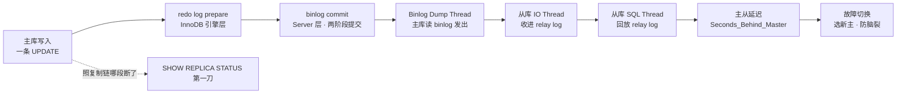
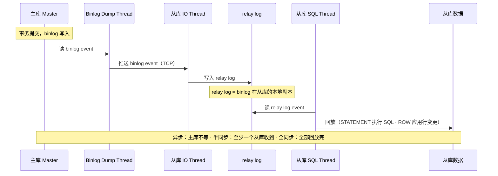
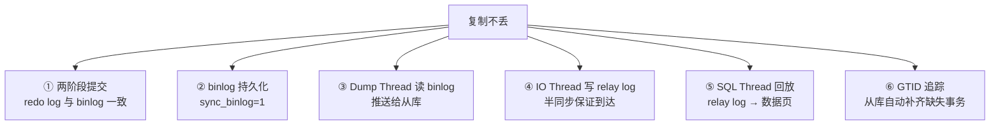
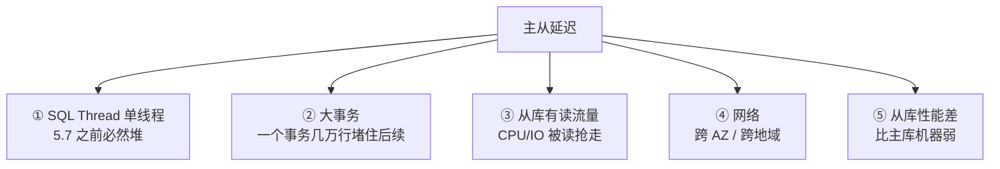
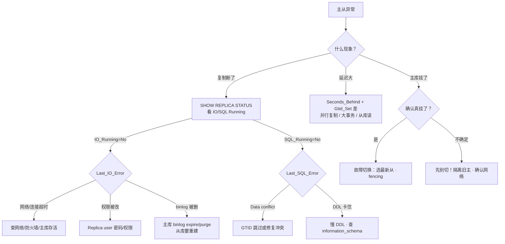

# 主从与高可用

> 主库挂了，从库差 10 秒，切完新主丢了 200 条写入——有人直接提升从库、有人要先补数据、有人喊先别切。
> **本章回答**：一次写入从主库到从库会经历什么（两阶段提交 → 复制 → 回放 → 延迟 → 故障切换），每个阶段什么会坏。
> **不讲**：InnoDB 存储引擎内部 → [02-01-01](../../02-中间件与数据库/01-MySQL/01-架构与存储引擎/)；事务隔离与锁 → [02-01-03](../../02-中间件与数据库/01-MySQL/03-事务与锁/)；备份恢复与慢查询 → [02-01-05](../../02-中间件与数据库/01-MySQL/05-备份恢复与慢查询治理/)。

**标记**：🎯重点 · 🔥难点 · ⭐常考 · 🔧实操

---

## 一、一张图：一次写入的复制之旅

> 🎯 **一句话**：一条写入从主库到从库要走完五个阶段——写 redo log → 写 binlog（两阶段提交）→ 复制线程搬 → 从库回放 → 故障时切换，卡在哪段定责哪段。



**读图**：主线是一条写入的复制旅程——先在主库内部过两阶段提交（redo log + binlog），再由三个复制线程接力搬到从库，回放后产生延迟，主库挂了要故障切换。`SHOW REPLICA STATUS` 是 X 光机，不换器官，只照「复制卡在哪一段」。三个阶段的分界线就是三个线程的交接点——IO Thread 断了看 `Last_IO_Error`，SQL Thread 卡了看 `Last_SQL_Error`。

---

## 二、出发：redo log 与 binlog（两阶段提交）

> 🎯 **一句话**：主库写完 redo log（prepare）再写 binlog（commit）——两阶段提交保证两个日志一致，crash 恢复时不会丢或裂。

### 三个日志各是什么 ⭐

MySQL 有两个层次的日志，跨层次是高频混淆点：

- **redo log（重做日志）** = InnoDB 引擎层的物理日志，记录「哪个数据页哪个偏移改了什么」，保证 crash 后已提交事务不丢。InnoDB 先写 redo log 再改数据页，这叫 **WAL（Write-Ahead Logging，预写日志）**——先记日志再动数据，崩了能靠日志重做。
- **undo log（回滚日志）** = InnoDB 引擎层，记录修改前的旧值，事务回滚和 MVCC 读快照都靠它。undo log 不在复制链上传递，但从库回放时也要生成自己的 undo log。
- **binlog（二进制日志）** = MySQL Server 层的逻辑日志，记录所有写操作（SQL 语句或行变更），是复制的源头、也是 PITR（Point-in-Time Recovery，按时间点恢复）的基础。存储引擎换了（MyISAM、InnoDB）binlog 一样有。

> ⚠️ **别混**：redo log 是 **InnoDB 引擎层**的、**物理**日志（页号 + 偏移）；binlog 是 **Server 层**的、**逻辑**日志（SQL 或行变更）。两个不同层次、不同格式，别当成一个东西。换存储引擎 redo log 可能没了，binlog 还在。

### 两阶段提交：保证 redo log 与 binlog 一致 🔥⭐

为什么不能先写 redo log 再改数据页就完事——因为还有 binlog 要写。如果 redo log 写了但 binlog 没写，crash 恢复后主库有这条数据但从库收不到；反之 binlog 写了但 redo log 没 commit，从库有了主库反而没有。**两阶段提交（2PC, two-phase commit）** 就是解决这个不一致：

```mermaid
sequenceDiagram
    participant App as 应用
    participant IDB as InnoDB
    participant REDO as redo log
    participant UNDO as undo log
    participant BIN as binlog
    App->>IDB: BEGIN; UPDATE ...
    Note over IDB: ① 写 undo log（回滚用）
    Note over REDO: ② 写 redo log（prepare 状态）· fsync
    Note over IDB: 数据页改在内存（Buffer Pool）
    Note over BIN: ③ 写 binlog · fsync（sync_binlog=1）
    Note over REDO: ④ redo log 改为 commit 状态
    IDB->>App: 返回事务成功
```

**读图**：四个步骤里 ② 和 ③ 是命门——② prepare 是 InnoDB 层先记好「要提交」，③ 写 binlog 是 Server 层确认「复制源有了」，④ 才把 redo log 标 commit。两阶段提交的核心就是：**binlog 写成功之前，redo log 处于 prepare 状态；binlog 写成功之后，redo log 才改 commit**。

crash 在不同阶段的恢复策略：

```text
crash 在 ② 之后 ③ 之前 → redo log 是 prepare、binlog 没写
                           → 恢复时回滚（从库不会收到这条）
crash 在 ③ 之后 ④ 之前 → redo log 是 prepare、binlog 已写
                           → 恢复时提交！（从库可能已收到，不能丢）
crash 在 ④ 之后         → redo log 是 commit、binlog 已写
                           → 正常提交，没分歧
```

> 💡 **打个比方**：签合同要有公证人在场——你先签好字（redo log prepare），公证人在公证书上盖完章（binlog 写完），你才算正式生效（redo log commit）。万一你签完字晕过去了：公证书没盖章 → 合同作废；公证书盖了章 → 合同有效。两个日志就是这个「双保险」关系。

> 📝 **面试**：两阶段提交不是为了「分布式事务」，是为了**单机 redo log 和 binlog 一致**——crash 恢复时靠 binlog 是否已写决定提交还是回滚。追问「如果不用两阶段提交会怎样」：redo log 写了、binlog 没写 → 主库有数据、从库没有 → 主从数据不一致；或者反过来 binlog 写了、redo log 没 commit → 从库有、主库没有 → 也裂。

### binlog_format：ROW / STATEMENT / MIXED ⭐

binlog_format 决定 binlog 记什么，直接影响从库回放的正确性：

| 对比 | **STATEMENT** | **ROW** | **MIXED** |
|------|---------------|---------|-----------|
| 记什么 | SQL 语句原文 | 每行变更前后的值 | 默认 STATEMENT，遇非确定性函数切 ROW |
| 日志大小 | 小 | 大（行多时大很多） | 中等 |
| 安全性 | 低 | 高 | 较高 |
| 风险 | `NOW()` / `UUID()` / `RAND()` 在从库结果不同 | 无 | 极少数边缘 case |

- **STATEMENT**：记录 `UPDATE t SET time=NOW()` 这条 SQL。从库回放时 `NOW()` 执行的是从库的当前时间——和主库不同。生产不建议。
- **ROW**：记录 `UPDATE t SET time='2026-09-01 10:00:00' WHERE id=1` 的行级变更。从库拿到的是确定值，结果一定和主库一致。生产建议。
- **MIXED**：MySQL 自动选，大多数情况用 STATEMENT，碰到非确定性函数自动切 ROW。

> ⚠️ **别混**：`binlog_format` 只影响 **binlog 记什么**，不影响 redo log。redo log 永远是物理日志（页号 + 偏移），格式不可选。另外 ROW 格式虽然日志大，但从库回放不走解析 SQL 那条路，反而**更快**——直接 apply 行变更。

> 🔍 **现场**：看 binlog_format 和 sync_binlog。

```bash
mysql -e "SHOW VARIABLES LIKE 'binlog_format';"
# binlog_format | ROW   # ← 生产建议 ROW，最安全

mysql -e "SHOW VARIABLES LIKE 'sync_binlog';"
# sync_binlog | 1   # ← 每次提交都 fsync binlog，最安全但最慢；0 = 交给 OS

mysql -e "SHOW VARIABLES LIKE 'innodb_flush_log_at_trx_commit';"
# innodb_flush_log_at_trx_commit | 1   # ← 每次提交都 fsync redo log，和 sync_binlog=1 配合才安全
```

`sync_binlog=1` 和 `innodb_flush_log_at_trx_commit=1` 是「双 1」配置——两个都 fsync，crash 不丢。任何一个是 0 就有丢数据风险。关于 crash 恢复的更多参数见 [02-01-01](../../02-中间件与数据库/01-MySQL/01-架构与存储引擎/)。

---

## 三、复制：主从复制原理

> 🎯 **一句话**：主库的 Binlog Dump Thread 读 binlog 发出，从库 IO Thread 收进 relay log，SQL Thread 回放——三个线程接力，三种模式只差「主库等不等从库」。

### 三个线程怎么接力 🔥⭐



**读图**：复制走三个线程的接力赛——主库的 **Binlog Dump Thread** 读 binlog 发给从库，从库的 **IO Thread** 收下写进 **relay log**（中继日志，binlog 在从库的本地副本），从库的 **SQL Thread** 读 relay log 逐条回放。三个线程的交接点就是故障的分界：IO Thread 断了看 `Last_IO_Error`（网络/权限/主库 binlog 被删），SQL Thread 卡了看 `Last_SQL_Error`（回放时冲突/语法错/数据类型不匹配）。

### 三种复制模式 ⭐🔥

三种模式只差一个地方——**主库在哪个环节返回「写成功」**：

| 对比 | **异步复制（async）** | **半同步（semi-synchronous）** | **全同步** |
|------|----------------------|-------------------------------|-----------|
| 主库何时返回 | 写完 binlog 就返回 | 至少一个从库**收到 binlog** 才返回 | 所有从库**回放完**才返回 |
| 数据安全 | 主库挂了、binlog 没发出去的丢 | 至少一个从库有 binlog | 不丢 |
| 性能 | 最快 | 略慢（多一次 RTT） | 最慢（等全部回放） |
| 生产用 | 默认，大量使用 | 核心业务 | 几乎不用 |

- **异步复制（async replication）**：MySQL 默认。主库写完 binlog 立刻返回客户端成功，不等从库。主库挂了、从库没收到的 binlog 事件就丢了。
- **半同步（semi-synchronous replication）**：主库提交后，等至少一个从库**收到 binlog 事件并写入 relay log** 才返回。注意半同步保证的是「binlog 到了从库的 relay log」，**不保证回放完**——主库挂了、从库 relay log 有但 SQL Thread 还没回放，切过去后那条数据「在 relay log 里但不在表里」。`rpl_semi_sync_source_enabled=ON` 开启（8.0+ 用 source，旧版用 master）。
- **全同步**：主库等所有从库**回放完**才返回。性能太差，生产几乎不用。MGR（组复制）用共识协议实现了「接近全同步」的效果但不是传统全同步。

> ⚠️ **别混**：半同步复制 **≠ 不丢数据**。半同步只保证 binlog 到了至少一个从库的 relay log，**不保证 SQL Thread 回放完**。切主时如果 relay log 没回放完，切过去的那条数据要等回放追上才可见——切之前要 `WAIT_FOR_EXECUTED_GTID_SET` 确认从库追上。

### GTID：取代 file:position ⭐

```text
传统复制（file:position）：
  CHANGE REPLICATION SOURCE TO
    SOURCE_LOG_FILE='mysql-bin.000123', SOURCE_LOG_POS=4567;
  → 切主时手动算新主的 file:position，极易出错

GTID 复制：
  CHANGE REPLICATION SOURCE TO
    SOURCE_AUTO_POSITION=1;
  → 从库自动找主库缺失的 GTID 补齐，切换不用算 position
```

**GTID（Global Transaction Identifier，全局事务标识符）** 格式 `server_uuid:transaction_id`，每个已提交事务一个全局唯一 ID。从库记录已执行的 GTID 集合，连上主库后发自己的集合，主库只补发从库没有的——切换时不用手动找 position。`gtid_mode=ON` 开启，生产新部署强烈建议用 GTID。

> 💡 **打个比方**：传统复制像「给你一摞卷宗，你记自己翻到第几卷第几页」——换了个档案室你得重新对位置。GTID 像每份文件都有唯一编号，你只要报「我手上有 1~5000 号」，新档案室自动从 5001 号开始给你补。

> 📝 **面试**：GTID 的好处答三点：① 切换不用算 file:position，从库自动定位；② 跨从库复制的拓扑变更更安全（从库 A 切到从库 B 不会丢或重）；③ `gtid_mode=ON` 后可用 `WAIT_FOR_EXECUTED_GTID_SET` 等从库追上再做切主，避免数据丢失。追问「GTID 限制」：不支持 `CREATE TABLE ... SELECT` 等非事务语句（会破坏原子性）。

### relay log 与 SQL Thread 🔧

**relay log（中继日志）** 是从库本地的 binlog 副本——IO Thread 收到主库的 binlog event 写到这里，SQL Thread 从这里读。relay log 和 binlog 格式相同，区别只在「binlog 是主库产生的、relay log 是从库收到的副本」。relay log 也会轮转、也有 index 文件。

SQL Thread 在 5.7 之前是**单线程**回放——主库并发写入、从库串行回放，高并发下延迟必然堆积。5.7+ 引入**并行复制（replica_parallel_workers）**：基于 group commit 的事务，同一 group 内无锁冲突的事务可以并行回放。8.0 默认 `slave_parallel_type=LOGICAL_CLOCK`，并行度更高。

> ⚠️ **别混**：并行复制不是「多线程各跑各的」——回放仍保持事务顺序，只有「主库同一 group commit 里的事务」才能并行。开太大不一定快，因为无冲突的事务组就那么多。

> 🔍 **现场**：看复制状态和延迟。

```bash
mysql -e "SHOW REPLICA STATUS\G" 2>/dev/null || mysql -e "SHOW SLAVE STATUS\G"
# 注：8.0.22+ 用 SHOW REPLICA STATUS；5.7 用 SHOW SLAVE STATUS，两个是同一件事
```

```text
             Replica_IO_Running: Yes     # ← IO Thread 在跑吗
            Replica_SQL_Running: Yes     # ← SQL Thread 在跑吗
        Seconds_Behind_Master: 0          # ← 延迟秒数；NULL = 复制断了
      Last_IO_Error:                    # ← 空 = 没错；有内容看错误
      Last_SQL_Error:                   # ← 空 = 没错；有内容看回放错误
   Retrieved_Gtid_Set: uuid:1-5000       # ← 从主库收到的 GTID 范围
    Executed_Gtid_Set: uuid:1-4998       # ← 已回放的 GTID 范围；和上面差 = 回放落后
```

`Seconds_Behind_Master` 是判断延迟的第一指标，但有个坑：它测的是「从库当前时间 - 从库收到最后一个 binlog event 时记录的主库时间戳」——如果主库完全不写（没有新事务），`Seconds_Behind_Master` 可以是 0 但从库其实是空的。真正的延迟要看 `Retrieved_Gtid_Set` 和 `Executed_Gtid_Set` 的差。

### 收束：一次写入凭什么到从库 🎯⭐

到这里，一条写入从主库到从库的全部零件都齐了。面试问「**MySQL 主从复制如何保证不丢数据**」，答这张清单——**六件套**：



**读图**：①② 保证主库自己不丢（redo log + binlog 持久化）；③④ 保证 binlog 到从库（半同步保证至少一份）；⑤⑥ 保证回放不漏（GTID 追踪已执行的事务）。前三件是「主库侧」，后三件是「从库侧」——断了看在哪一段：主库侧看 `Last_IO_Error`，从库侧看 `Last_SQL_Error`。

> ⚠️ **别混**：不丢 **≠ 不延迟**。异步复制下主库不等从库，从库可以延迟几秒甚至几分钟，但不代表数据丢了——它只是还没回放。也不 **= 强一致**：从库读到的数据可能落后于主库，要强一致读走主库或用半同步 + `WAIT_FOR_EXECUTED_GTID_SET`。

> 📝 **面试**：六件套按「主库不丢 → 传输不丢 → 回放不漏」分组记。最后补一句「不丢 ≠ 不延迟、≠ 强一致」——这句是区分「背过」和「懂了」的分水岭。半同步只保证到 relay log、不保证回放完，切主前要等追上。

---

## 四、延迟：主从延迟从哪来

> 🎯 **一句话**：主从延迟 = SQL Thread 回放速度 < 主库写入速度，主因是单线程回放、大事务、从库有读流量。

### 延迟的五个来源 ⭐



**读图**：延迟永远是一个不等式——主库写入速度 > 从库回放速度。五个来源里，① 是历史问题（5.7 之前没有并行复制），② 是最常见的突发延迟，③ 是读写分离架构的固有代价。先看延迟是「持续性」还是「突发性」：持续 = 性能瓶颈或单线程，突发 = 大事务。

> 💡 **打个比方**：主库像一条流水线不断产货，从库回放像只有一辆卡车在搬——产得快搬得慢，货越堆越多。开并行复制 = 多加几辆卡车（但只能搬同一批打包好的货），拆大事务 = 不让一个包裹大到堵住传送带，从库不做读 = 卡车不绕路送货专心搬货。

### 怎么测 🔧

```bash
mysql -e "SHOW REPLICA STATUS\G" | grep -E 'Seconds_Behind|Gtid_Set'
# Seconds_Behind_Master: 3       # ← 3 秒延迟
# Retrieved_Gtid_Set: uuid:1-5000
# Executed_Gtid_Set: uuid:1-4997  # ← 差 3 个事务 = 回放落后 3 个

mysql -e "SHOW VARIABLES LIKE 'replica_parallel_workers';"
# replica_parallel_workers | 8   # ← 并行复制 worker 数；0 = 单线程回放
```

`Seconds_Behind_Master` 和 GTID 集合差要一起看：`Seconds_Behind_Master=0` 但 GTID 差不为 0 = 刚收完还没回放。

### 怎么治

- **开并行复制**：`replica_parallel_workers=8`（或 `slave_parallel_workers`），5.7+ 有效，从库回放从单线程变多线程。
- **拆大事务**：一个 `DELETE FROM t WHERE create_time < '2026-01-01'` 删几百万行 → 改成分批 `DELETE ... LIMIT 1000` 循环。大事务是延迟暴增的头号原因，也是 binlog 膨胀的源头。
- **从库不做读**：读写分离的从库只做备份/统计、不直接接业务读请求；或给读重的业务单独加从库。
- **网络**：跨 AZ 的 RTT 增加传输延迟，但一般不是主因——主因在回放端。

> 📝 **面试**：「主从延迟怎么解决」别只答「开并行复制」，要答到「先看延迟是持续还是突发——持续查并行复制配置和从库性能，突发查大事务和 DDL；从库有读流量是读写分离的固有代价，读密集业务要单独加从库」。

> 🔍 **现场**：延迟告警，先分「突发」还是「持续」再开方——方子反了白忙。

```bash
# 持续 vs 突发：连采三次看趋势
for i in 1 2 3; do
  mysql -e "SHOW REPLICA STATUS\G" | grep -E 'Seconds_Behind|Executed_Gtid_Set'
  sleep 5
done
# 秒数一直涨 = 持续性 → 查并行配置和从库负载
# 秒数突然跳高再回落 = 突发性 → 查大事务和 DDL

# 突发延迟查当前回放卡在哪
mysql -e "SELECT * FROM performance_schema.replication_applier_status_by_worker\G" | grep -E 'WORKER_ID|APPLYING_TRANSACTION|LAST_APPLIED_TRANSACTION'
# APPLYING_TRANSACTION 持续不变 = 卡在某个大事务回放

# 并行复制实际并行度（开了 8 个 worker 是不是都在干活）
mysql -e "SELECT COUNT(*) FROM performance_schema.replication_applier_status_by_worker WHERE SERVICE_STATE='ON';"
# 8   # ← 都 ON；若长期只有 1-2 个在干活，说明无冲突事务组太少，开再多也没用
```

「突发」常见三类：批量 `DELETE/UPDATE` 几十万行堵住单 worker、`ALTER TABLE` 大表 DDL 串行回放、从库跑了慢查询抢 IO。持续则是并行复制没开（`replica_parallel_workers=0`）或从库规格不足——前者查配置，后者查 `top`/`iostat` 看是不是 CPU 或磁盘打满。

---

## 五、切换：故障切换与高可用

> 🎯 **一句话**：主库挂了选最新从库提升为新主——关键是确认旧主真挂了（防脑裂）、选数据最新的从库（防丢）、其他从库跟新主（防拓扑裂）。

### 故障切换流程 ⭐🔥


**读图**：六步里 ② 和 ③ 是命门——② 确认旧主真挂了，否则旧主还在写、新主也在写 = 脑裂；③ 选数据最新的从库（`Executed_Gtid_Set` 最大那个），否则选了落后的从库 = 丢数据。④ 把新主的 `read-only` 关掉（从库一直是 `read-only=ON`，提升后必须 `OFF`）。⑤ 其他从库指向新主用 GTID 的 `SOURCE_AUTO_POSITION=1`，不用算 position。

### 脑裂：两个主同时在写 🔥

**脑裂（split brain）** = 旧主没真挂、新主已提升，两边都在接收写入，数据不一致。这是故障切换最怕的事。

> 💡 **打个比方**：换船长最怕两个船长同时上任——船员不知道听谁的，两个航线各开各的。要么选之前确认老船长真不在了（fencing），要么用一套共识机制保证只有一个新船长（MGR 多数派）。

防脑裂三种手段：

- **Fencing（隔离）**：切之前先隔离旧主——关电源、改网络 ACL、拔 VIP。旧主物理上不能接收写，再提升新主。MHA 和 Orchestrator 都要配合 fencing 设备。
- **多数派共识（MGR）**：MGR 用 Paxos 变种，只有多数派同意的写才生效——少数派（旧主那一侧）自动停写，不需要外部 fencing。
- **应用层防双写**：VIP / DNS 只指向一个主库，应用通过代理层连库，代理层保证只连一个。

> ⚠️ **别混**：**半同步复制 ≠ 防脑裂**。半同步只保证 binlog 到了从库，不防脑裂——旧主没真挂、新主提升后，旧主仍在接受写但半同步的 ACK 来自「已不认它的从库」，会退化成异步。防脑裂靠 fencing 或共识协议，不靠复制模式。

### MHA / Orchestrator / MGR ⭐

三种生产级 HA 方案，架构完全不同：

| 对比 | **MHA** | **Orchestrator** | **MGR（组复制）** |
|------|---------|------------------|-------------------|
| 架构 | 外部脚本 + SSH 互信 | 外部服务 + 拓扑管理 | 内嵌 MySQL，Paxos 变种 |
| 切主 | 选最新从库提升 | 支持复杂拓扑切换 | 多数派自动选新主 |
| 防脑裂 | 依赖 fencing 设备 | 依赖 fencing | 内置多数派投票 |
| 依赖 | SSH 互信、Perl | Go 服务、MySQL 后端 | MySQL 原生（5.7.17+） |
| 生产 | 老牌、大量使用 | 互联网公司常见 | 新部署首选 |

- **MHA（Master High Availability）**：第三方 Perl 脚本，监控主库，挂了选 relay log 最新的从库提升。依赖 SSH 互信连所有节点。MHA 本身不 fencing，要配合 keepalived/VIP 或外部隔离。老牌但维护趋缓。
- **Orchestrator**：Go 写的，有 Web UI，支持复杂复制拓扑（一主多从、级联、多源）。故障切换可自动可半自动。比 MHA 更活跃，但 fencing 仍靠外部。
- **MGR（MySQL Group Replication，组复制）**：官方方案，内嵌在 MySQL 里。基于 XCom（Paxos 变种）实现多数派写入共识——只有多数派节点同意的写才提交。单主模式（只有一个节点可写）或多主模式（多节点可写，有冲突检测）。少数派自动停写，**内置防脑裂**，不需要外部 fencing。生产新部署首选。

> 📝 **面试**：问「MySQL 高可用怎么选」，答到「老系统 MHA + VIP 还在跑但维护趋缓；新系统首选 MGR，内置多数派防脑裂不依赖外部 fencing；Orchestrator 适合复杂拓扑和需要 Web UI 的场景」。再补一句「MGR 不是万能——多主模式有冲突检测开销，单主模式是生产主流」。

### read-only 与读写分离 ⭐

从库必须设 `read-only=ON`（8.0 用 `super_read_only=ON` 更好——连 SUPER 权限也不能写），防止应用误连从库写数据。提升新主时第一步就是关 `read-only`。

**读写分离（read-write splitting）**：写走主库，读走从库。代价是异步延迟下从库读到的数据可能落后于主库——刚写完立刻读从库可能读不到。常见对策：

- **强一致读走主库**：写完立刻读、或对一致性敏感的读走主库。
- **半同步 + GTID 等待**：写完用 `WAIT_FOR_EXECUTED_GTID_SET` 等从库追上再读。
- **会话级粘主库**：同一会话内写完的读走主库（避免「写完立刻读从库」的窗口）。

> ⚠️ **别混**：`read-only=ON` **不阻止**有 SUPER/SYSTEM_USER 权限的写（除非 `super_read_only=ON`）。所以从库防护要同时设 `super_read_only=ON`。另外 `read-only` 只防业务写，**不防**复制线程回放——SQL Thread 不受 `read-only` 限制。

> 🔍 **现场**：切主后必须验证三件事——新主可写、从库跟上、应用正常，少一项都是没切干净。

```bash
# ① 新主可写：read-only 已关
mysql -e "SHOW VARIABLES LIKE '%read_only%';"
# read_only         | OFF
# super_read_only   | OFF   # ← 都 OFF 才能接写；任一 ON = 应用写全是只读错误

# ② 从库跟上：GTID 集合对齐
mysql -e "SHOW REPLICA STATUS\G" | grep -E 'Running|Gtid_Set'
# Replica_IO_Running: Yes / Replica_SQL_Running: Yes
# Retrieved_Gtid_Set: uuid:1-5000 / Executed_Gtid_Set: uuid:1-5000   # ← 一致 = 追上

# ③ MGR 集群状态（用 MGR 时看，比 SHOW REPLICA STATUS 更直接）
mysql -e "SELECT MEMBER_HOST,MEMBER_STATE,MEMBER_ROLE FROM performance_schema.replication_group_members;"
# db-1 | ONLINE  | PRIMARY    # ← 单主模式只一个 PRIMARY；ONLINE 才健康
# db-2 | ONLINE  | SECONDARY  # RECOVERING=在追；UNREACHABLE=断了；OFFLINE=已退出

# ④ 旧主恢复后加回：不能直接接业务，先追齐再降级
mysql -e "SELECT WAIT_FOR_EXECUTED_GTID_SET('uuid:1-5000', 10);"  # 等 10 秒追上
# 0   # ← 0 = 追上；非 0 = 超时，别急着加回，否则又会双写
```

切主后最常翻车的两种：新主 `read-only` 没关应用写全是只读错误；从库没追上就切流量，读到的还是旧数据。MGR 单主模式下 `MEMBER_ROLE=PRIMARY` 只有一个，多主模式全是 `PRIMARY` 但有冲突检测开销——生产主流是单主。MGR 防脑裂靠多数派：N 节点需要 floor(N/2)+1 个同意才提交，3 节点容 1 挂、5 节点容 2 挂——这也是为什么 MGR 最少 3 节点起。

---

## 六、作战：定责（主从断了 / 延迟了 / 切主了）

> 🎯 **一句话**：先 `SHOW REPLICA STATUS` 看是断了还是延迟了——`Last_IO_Error` 往网络/主库查，`Last_SQL_Error` 往回放查，`Seconds_Behind_Master` 大往并行/大事务查。

### 定责决策树



**读图**：第一刀是分「断了 / 延迟了 / 挂了」三种——断了看 `Replica_IO_Running` 和 `Replica_SQL_Running` 哪个 No，延迟看 `Seconds_Behind_Master` 和 GTID 差，主库挂了先确认是不是真挂（别脑裂）。IO 断了往网络和主库查，SQL 断了往回放查，方向反了白忙。

### 现象 · 先做 · 别做

| 现象 | 先做 | 别做 |
|------|------|------|
| 复制断了 | `SHOW REPLICA STATUS\G` 看 IO/SQL 哪个 No | 直接重建从库 |
| IO_Running=No | 看 `Last_IO_Error`：网络/权限/binlog | 重启从库 MySQL |
| SQL_Running=No | 看 `Last_SQL_Error`：冲突/DDL 卡 | 跳过错误不查根因 |
| 延迟大 | GTID 差 + `replica_parallel_workers` + 查大事务 | 直接重启从库 |
| 主库挂了 | 先 fencing 确认真挂了 | 不确认就切 → 脑裂 |
| 切主后丢数据 | 查新主 `Executed_Gtid_Set` 是不是最大的 | 选了落后的从库 |
| 切主后双写 | 查旧主是否还在 + fencing 没做 | 两个主库都接受写 |
| 从库误写 | `super_read_only=ON` | 只设 `read_only` 以为防住了 |
| 读从库读到旧数据 | 强一致读走主库 / `WAIT_FOR_GTID` | 加大从库性能以为能解决 |

### 60 秒剧本 🔧

> 🔍 **现场**：接到「主从异常」告警，60 秒走完这条线再开口。

```text
① 0–10s  什么现象？  SHOW REPLICA STATUS\G
          → Replica_IO_Running 和 Replica_SQL_Running 哪个 No
          → Seconds_Behind_Master 多少
② 10–30s 断了看 Error；延迟看 GTID 差
          → Last_IO_Error → 网络/权限/主库 binlog
          → Last_SQL_Error → 冲突/DDL
          → Retrieved_Gtid_Set vs Executed_Gtid_Set 差多少
③ 30–45s 主库挂了？先确认真挂了（ping/SSH/进程），别脑裂
          → fencing：关旧主电源/改 ACL/拔 VIP
          → 选最新从库（Executed_Gtid_Set 最大）
④ 45–60s 切：新主 read-only OFF → 其他从库指向新主 → 应用切流量
          → 切完验证：新主可写、从库跟上、应用正常
```

> 🔍 **现场**：怀疑脑裂（旧主没死透又起来写），先验双写再决断——别急着重做拓扑。

```bash
# ① 两边都自认 PRIMARY？MGR 模式直接看
mysql -h new-primary -e "SELECT MEMBER_HOST,MEMBER_ROLE FROM performance_schema.replication_group_members WHERE MEMBER_ROLE='PRIMARY';"
mysql -h old-primary -e "SELECT MEMBER_HOST,MEMBER_ROLE FROM performance_schema.replication_group_members WHERE MEMBER_ROLE='PRIMARY';"
# 同一个集群里应只有一个 PRIMARY；旧主若也返回 PRIMARY = 分裂了（少数派把自己抬主）

# ② 非 MGR：看旧主 binlog 还在不在涨（还在写 = 没隔干净）
mysql -h old-primary -e "SHOW BINARY LOG STATUS\G"  # 8.x；5.7 用 SHOW MASTER STATUS
# File: binlog.000123  Position: 4500   # ← 隔 10s 再查一次，Position 变 = 旧主仍在接写

# ③ fencing 是否生效：旧主 super_read_only 应该被外部脚本置 ON
mysql -h old-primary -e "SHOW VARIABLES LIKE 'super_read_only';"
# super_read_only | ON   # ← ON = 已 fence；仍 OFF = 隔离没生效，立刻拔 VIP/关电源

# ④ 比两边 GTID 集合，定位谁更新
mysql -h new-primary -e "SELECT @@global.gtid_executed;"
mysql -h old-primary -e "SELECT @@global.gtid_executed;"
# 旧主 GTID ⊆ 新主 = 旧主落后，可安全拉回；有新事务不在新主 = 旧主有独立写入（资损）
```

脑裂最危险的不是「两个主」，而是「旧主还在写、应用又被切到新主」——两边各写各的，对账时这笔账永远平不掉。所以 fencing 的标准是 `super_read_only=ON` + VIP/ACL 拔掉，不是「进程 kill 了就行」（进程会被拉起）。旧主拉回前必先比 GTID 集合，确认无独立写入才能降级从库接回。

---

## 七、收口

### 命令速查 🔧

```bash
# 复制状态（8.0.22+ 用 REPLICA，5.7 用 SLAVE）
mysql -e "SHOW REPLICA STATUS\G"            # 复制全貌：IO/SQL 线程 / 延迟 / GTID / Error
mysql -e "SHOW STATUS LIKE 'Rpl%';"         # 半同步状态
# 看延迟和 GTID
mysql -e "SHOW REPLICA STATUS\G" | grep -E 'Seconds_Behind|Gtid_Set|Running'
# 开并行复制
mysql -e "SET GLOBAL replica_parallel_workers=8;"
# 从库只读
mysql -e "SET GLOBAL super_read_only=ON;"
# GTID 模式
mysql -e "SHOW VARIABLES LIKE 'gtid_mode';"  # ON = GTID 复制
# binlog 格式
mysql -e "SHOW VARIABLES LIKE 'binlog_format';"  # ROW / STATEMENT / MIXED
# 主库看有哪些从库连着
mysql -e "SELECT * FROM performance_schema.replication_connection_status;"
# 跳过复制错误（谨慎！先查根因）
mysql -e "SET GLOBAL sql_replica_skip_counter=1; START REPLICA;"  # 不用 GTID 时
# GTID 跳过：注入空事务
mysql -e "SET GTID_NEXT='uuid:123'; BEGIN; COMMIT; SET GTID_NEXT=AUTOMATIC;"
```

### 面试锚点

| 问 | 30 秒答 |
|----|---------|
| 为什么要有两阶段提交？ | 保证 redo log 和 binlog 一致——crash 后靠 binlog 是否已写决定提交还是回滚，否则主从数据裂。 |
| redo log 和 binlog 区别？ | redo log 是 InnoDB 引擎层物理日志（页号+偏移），binlog 是 Server 层逻辑日志（SQL/行变更），两个不同层次。 |
| undo log 干什么？ | InnoDB 回滚日志，记录旧值，事务回滚和 MVCC 读快照用；不在复制链上传递，从库回放时自己生成。 |
| binlog_format 怎么选？ | 生产 ROW 最安全（从库结果一定一致）；STATEMENT 有非确定性函数风险；MIXED 自动选但仍建议 ROW。 |
| 主从复制几个线程？ | 三个：主库 Binlog Dump Thread 读 binlog 发出，从库 IO Thread 收进 relay log，SQL Thread 回放。 |
| 异步/半同步/全同步？ | 异步不等（默认）、半同步等至少一个从库收到 binlog（不保证回放完）、全同步等全部回放（几乎不用）。 |
| 半同步保证不丢吗？ | 不保证。半同步只保证 binlog 到了 relay log，不保证回放完。切主前要等追上。 |
| GTID 好处？ | 切换不用算 file:position，从库自动定位；跨从库拓扑变更更安全；可 WAIT_FOR_EXECUTED_GTID_SET 等追上。 |
| relay log 是什么？ | 从库本地的 binlog 副本，IO Thread 写、SQL Thread 读，格式和 binlog 相同。 |
| 主从延迟从哪来？ | SQL Thread 回放速度 < 主库写入。主因：单线程回放（5.7 前）、大事务、从库有读流量、从库性能差。 |
| 延迟怎么治？ | 开并行复制、拆大事务、从库不做读、从库性能对齐主库。 |
| 故障切换怎么做？ | 确认旧主真挂（fencing）→ 选最新从库（GTID 最大）→ read-only OFF → 其他从库跟新主 → 应用切流量。 |
| 怎么防脑裂？ | fencing（隔离旧主）或 MGR 多数派投票。半同步不防脑裂。 |
| MHA/Orchestrator/MGR？ | MHA 老牌脚本+SSH、Orchestrator 有 Web UI 支持复杂拓扑、MGR 内置多数派防脑裂是新部署首选。 |
| MGR 防脑裂原理？ | Paxos 变种，多数派同意才提交，少数派自动停写，不需外部 fencing。 |
| 从库为什么 read-only？ | 防应用误连从库写数据；提升新主时才 OFF。super_read_only 更好（连 SUPER 也不能写）。 |
| 读写分离读到旧数据？ | 异步延迟固有代价。强一致读走主库 / 半同步+WAIT_FOR_GTID / 会话级粘主库。 |
| 主从断了先看什么？ | SHOW REPLICA STATUS：IO_Running=No 看 Last_IO_Error（网络/权限），SQL_Running=No 看 Last_SQL_Error（冲突/DDL）。 |
| 并行复制原理？ | 5.7+ 基于 group commit，同一 group 内无冲突事务并行回放；8.0 默认 LOGICAL_CLOCK。 |
| sync_binlog 和双 1？ | sync_binlog=1 + innodb_flush_log_at_trx_commit=1 = 双 1，两个都 fsync，crash 不丢。 |

### 易错一句话对照

- 先写 binlog 再写 redo log → 先 redo log（prepare）再 binlog（commit），两阶段提交
- redo log 和 binlog 是一个东西 → redo log 是 InnoDB 物理日志，binlog 是 Server 逻辑日志
- 半同步保证不丢数据 → 只保证 binlog 到 relay log，不保证回放完
- 全同步就是半同步 → 全同步等所有从库回放完，半同步只等 binlog 到达
- STATEMENT 格式更安全 → ROW 最安全，STATEMENT 有非确定性函数风险
- 主从延迟是网络慢 → 主要是回放跟不上（单线程/大事务/从库有读）
- Seconds_Behind_Master=0 就没延迟 → 主库不写时它也是 0，看 GTID 差更准
- 主库挂了直接切从库 → 先 fencing 确认真挂了，否则脑裂
- 半同步防脑裂 → 半同步只保证传输，防脑裂靠 fencing 或 MGR 多数派
- 选新主选最新的从库 → 是 Executed_Gtid_Set 最大的那个，不是 relay log 最大的
- read-only 防住了所有写 → SUPER 权限仍可写，要 super_read_only
- MGR 是全同步 → MGR 用多数派共识，接近全同步但不是传统全同步
- 读写分离加从库性能就能解决延迟 → 异步延迟是固有的，要强一致读走主库
- 开并行复制就一定快 → 无冲突的事务组就那么多，开太大不一定有用
- GTID 模式不用管 position → GTID 自动定位，但限制不支持 CREATE TABLE...SELECT
- MHA 自带 fencing → MHA 不 fencing，要配合 keepalived/VIP
- 故障切换后其他从库自动跟新主 → 要手动 CHANGE REPLICATION SOURCE
- relay log 和 binlog 格式不同 → 格式相同，relay log 是 binlog 在从库的副本

### 数字墙

> binlog_format 生产建议 **ROW** · sync_binlog **1** + innodb_flush_log_at_trx_commit **1** = 双 1 · 半同步至少 **1** 个从库 ACK · MGR 多数派 = floor(N/2)+1 · 并行复制 worker 建议 **4–16** · Seconds_Behind_Master **>10s** 就该查 · GTID 格式 `server_uuid:transaction_id` · MGR 最少 **3** 节点（容 1 挂）· MHA 切主超时默认 **10s** · read-only ON = 普通用户不可写 · super_read_only ON = SUPER 也不可写 · expire_logs_days 默认 **0**（不自动删，生产建议 **7–14**）

---

## 合上书

- [ ] **默画主图**：主库写入 → redo log prepare → binlog commit（两阶段提交）→ Binlog Dump Thread → IO Thread → relay log → SQL Thread → 从库回放 → 延迟 → 故障切换；`SHOW REPLICA STATUS` 照哪段。
- [ ] **口述两阶段提交**：redo log / undo log / binlog 各是什么、在哪个层；两阶段提交流程（prepare → binlog → commit）；crash 在各阶段如何恢复；binlog_format 三种格式怎么选。
- [ ] **口述复制**：三个线程怎么接力、relay log 是什么、三种复制模式差在哪、半同步保证什么不保证什么。
- [ ] **默画收束清单**：复制不丢的六件套（两阶段提交 / binlog 持久化 / Dump Thread / IO Thread+半同步 / SQL Thread 回放 / GTID 追踪），按「主库不丢 → 传输不丢 → 回放不漏」分组。
- [ ] **口述延迟**：五个来源、怎么测（Seconds_Behind + GTID 差）、怎么治（并行/拆大事务/从库不读）。
- [ ] **口述切换**：故障切换六步、脑裂怎么防（fencing / MGR 多数派）、半同步为什么 ≠ 防脑裂。
- [ ] **口述 HA 方案**：MHA / Orchestrator / MGR 各做什么、怎么选、MGR 防脑裂原理。
- [ ] **口述读写分离**：读到旧数据怎么办、read-only vs super_read_only、强一致读走哪。
- [ ] **定责**：决策树三个出口（断了/延迟了/挂了）；IO 断 vs SQL 断各看什么；60 秒剧本每步敲什么。
