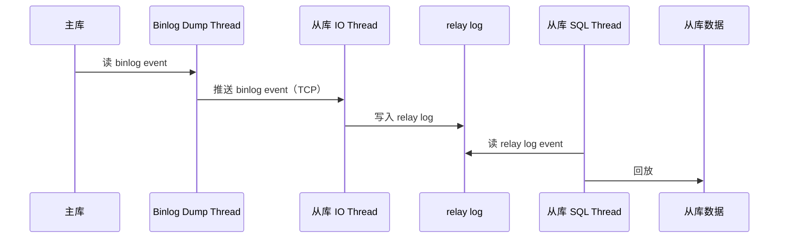
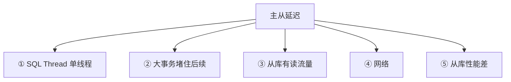
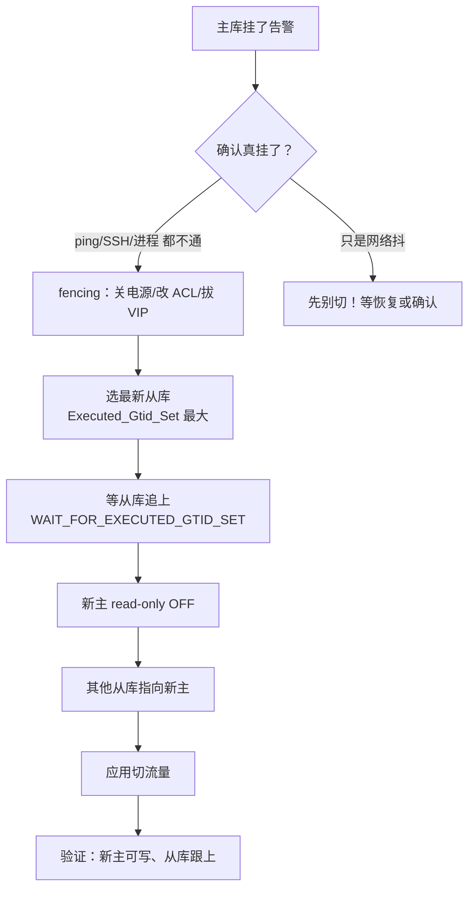

# 04｜主从与高可用 · 练习题

开始做题前，先给大家一个小建议：合上知识点，对着 **一节的主图**，把「一次写入的复制之旅」口述一遍（主库写入 → redo log → binlog 两阶段提交 → 复制线程 → relay log → 从库回放 → 延迟 → 故障切换）。能顺下来，下面这些题你会发现大半都会了；卡壳的地方，就是你该回去重读的那一节。

做题的方式也建议改一下：每道题**先看标题和场景，自己口述一遍答案，再往下看「完整解答」对答案**。直接看解答，容易产生「我会了」的错觉——能讲出来才是真的会。

| 标记 | 含义 |
|------|------|
| **核心** | 不懂整章就没建立起来 |
| **必会** | 值班和面试都要能讲 |
| **常用** | 线上会反复碰到 |
| **常考** | 白板和追问的高频口径 |

题目的顺序也是有意排的：Q1、Q2 钉死两阶段提交与 binlog；Q3～Q5 专攻复制线程与 GTID；Q6～Q10 是延迟、切主与读写分离；Q11～Q14 收尾到值班定责。

## 本题目录

- [Q1 两阶段提交与 crash 恢复](#q1)
- [Q2 binlog_format 三种格式怎么选](#q2)
- [Q3 主从复制三个线程怎么工作](#q3)
- [Q4 异步/半同步/全同步怎么选](#q4)
- [Q5 为什么要用 GTID](#q5)
- [Q6 主从延迟从哪来、怎么治](#q6)
- [Q7 故障切换怎么做、怎么防脑裂](#q7)
- [Q8 MHA / Orchestrator / MGR 怎么选](#q8)
- [Q9 读写分离读到旧数据怎么办](#q9)
- [Q10 从库为什么要设 read-only](#q10)
- [Q11 主从复制断了怎么排查](#q11)
- [Q12 并行复制原理和坑](#q12)
- [Q13 值班场景：主库挂了 60 秒决策](#q13)
- [Q14 半同步超时后会发生什么](#q14)
- [合上书](#合上书)

---

## Q1

**★★★★★｜MySQL 为什么要用两阶段提交？不用会怎样？redo log 和 binlog 是什么关系？**

**覆盖**：核心 · 必会 · 常考 ｜ **对应**：知识点 [二、出发：redo log 与 binlog（两阶段提交）](知识点.md)

### 场景

这道题几乎是主从面试的「开场白」。面试官开场就问「两阶段提交解决什么问题」。有人答「分布式事务一致性」，有人答「crash 恢复」。线上一个 MySQL crash 后重启，有人怀疑从库数据可能和主库不一致。

先自己试试：不看下面，你能口述出关键结论吗？想完再对答案。

### 完整解答

> 🎯 **一句话**：两阶段提交保证 redo log 和 binlog 一致——crash 后靠 binlog 是否已写决定提交还是回滚，否则主从数据裂。

MySQL 有两个层次的日志，跨层次是高频混淆点：

- **redo log（重做日志）** = InnoDB 引擎层的物理日志，记录「哪个数据页哪个偏移改了什么」，保证 crash 后已提交事务不丢。InnoDB 先写 redo log 再改数据页（WAL）。
- **undo log（回滚日志）** = InnoDB 引擎层，记录修改前的旧值，事务回滚和 MVCC 读快照用；不在复制链上传递，从库回放时自己生成。
- **binlog（二进制日志）** = Server 层的逻辑日志，记录所有写操作，是复制的源头和 PITR 的基础。

两阶段提交（2PC）的流程：

```mermaid
sequenceDiagram
    participant App as 应用
    participant IDB as InnoDB
    participant REDO as redo log
    participant BIN as binlog
    App->>IDB: BEGIN; UPDATE ...
    Note over REDO: ① 写 redo log（prepare）· fsync
    Note over BIN: ② 写 binlog · fsync
    Note over REDO: ③ redo log 改为 commit
    IDB->>App: 返回成功
```

crash 在不同阶段的恢复：

```text
crash 在 ① 之后 ② 之前 → redo log prepare、binlog 没写 → 回滚（从库不会收到）
crash 在 ② 之后 ③ 之前 → redo log prepare、binlog 已写 → 提交！（从库可能已收到）
crash 在 ③ 之后         → redo log commit、binlog 已写 → 正常，没分歧
```

> 💡 **打个比方**：签合同要有公证人在场——你先签好字（redo log prepare），公证人在公证书上盖完章（binlog 写完），你才算正式生效（redo log commit）。公证书没盖章 → 合同作废；盖了章 → 合同有效。

> ⚠️ **别混**：redo log 是 **InnoDB 引擎层**的物理日志，binlog 是 **Server 层**的逻辑日志——两个不同层次、不同格式。两阶段提交不是为了「分布式事务」，是为了单机两个日志一致。

### 再追问

**不用两阶段提交会怎样？**——如果先写 redo log 再改数据页就完事（没有 binlog 这步），crash 恢复后主库有数据但从库收不到（binlog 没写）。反过来如果 binlog 和 redo log 各写各的、无协调，crash 在中间可能主库有、从库也有但不一致，或者主库回滚了但从库已经收到——主从数据裂。

**`sync_binlog` 和 `innodb_flush_log_at_trx_commit` 怎么配？**——双 1：`sync_binlog=1`（每次提交 fsync binlog）+ `innodb_flush_log_at_trx_commit=1`（每次提交 fsync redo log），两个都 fsync，crash 不丢。任何一个是 0 就有丢数据风险。**不要**为了性能把两个都设 0——那是拿数据安全换速度。

---

## Q2

**★★★★☆｜binlog 有三种格式，生产用哪种？为什么 STATEMENT 不安全？**

**覆盖**：必会 · 常考 ｜ **对应**：知识点 [二、出发：redo log 与 binlog（两阶段提交）](知识点.md)

### 场景

2PC 讲完落到 binlog 格式：线上从库数据和主库对不上，查发现 binlog_format=STATEMENT，有一条 `UPDATE t SET time=NOW() WHERE id=1` 在主库和从库执行的时间不同。

先自己试试：不看下面，你能口述出关键结论吗？想完再对答案。

### 完整解答

> 🎯 **一句话**：生产用 ROW 最安全——从库拿到确定值，结果一定和主库一致；STATEMENT 有非确定性函数风险。

| 对比 | **STATEMENT** | **ROW** | **MIXED** |
|------|---------------|---------|-----------|
| 记什么 | SQL 语句原文 | 每行变更前后的值 | 默认 STATEMENT，遇非确定性函数切 ROW |
| 安全性 | 低 | 高 | 较高 |
| 风险 | `NOW()` / `UUID()` / `RAND()` 在从库结果不同 | 无 | 极少数边缘 case |

STATEMENT 记录 `UPDATE t SET time=NOW()` 这条 SQL。从库回放时 `NOW()` 执行的是从库的当前时间——和主库不同。`UUID()`、`RAND()`、`LAST_INSERT_ID()` 同理。**ROW 记录的是行级变更**：主库执行 `NOW()` 得到 `2026-09-01 10:00:00`，binlog 记的是 `SET time='2026-09-01 10:00:00'`，从库拿到确定值。

> ⚠️ **别混**：ROW 虽然日志大，但从库回放不走解析 SQL 那条路，反而**更快**——直接 apply 行变更。`binlog_format` 只影响 binlog 记什么，不影响 redo log（redo log 永远是物理日志，格式不可选）。

### 再追问

**MIXED 不就够了吗？**——MIXED 大多数情况用 STATEMENT，碰到非确定性函数自动切 ROW。但有些边缘 case（存储过程、触发器里的非确定性逻辑）MIXED 可能漏判。生产直接 ROW 最省心，磁盘和带宽现在不是瓶颈。

**ROW 格式的 binlog 怎么看？**——`mysqlbinlog --base64-output=DECODE-ROWS -v mysql-bin.000123`，`-v` 会把行事件解码成可读的 `WHERE` 和 `SET` 语句。**不要**用 `mysqlbinlog` 不加参数直接看 ROW 格式——一堆 base64 看不懂。

---

## Q3

**★★★★★｜MySQL 主从复制用了几个线程？数据怎么从主库到从库？**

**覆盖**：核心 · 必会 · 常考 ｜ **对应**：知识点 [三、复制：主从复制原理](知识点.md)

### 场景

主库日志齐了，三个线程怎么接力：面试官让你画主从复制的流程图。有人只画了「主库 binlog → 从库」，说不出线程。线上复制断了，不知道看 IO Thread 还是 SQL Thread。

先自己试试：不看下面，你能口述出关键结论吗？想完再对答案。

### 完整解答

> 🎯 **一句话**：三个线程接力——主库 Binlog Dump Thread 读 binlog 发出，从库 IO Thread 收进 relay log，SQL Thread 回放。



三个线程的分工：

- **Binlog Dump Thread**（主库）：主库收到从库连接请求后创建，读取 binlog 事件推送给从库。一个从库对应主库上一个 Dump Thread。
- **IO Thread**（从库）：接收主库 Dump Thread 推来的 binlog event，写入本地 **relay log（中继日志）**——relay log 就是 binlog 在从库的本地副本，格式相同。
- **SQL Thread**（从库）：读 relay log 逐条回放——STATEMENT 格式执行 SQL，ROW 格式 apply 行变更。回放完后从库数据和主库一致。

三个线程的交接点就是故障分界：IO Thread 断了看 `Last_IO_Error`（网络/权限/主库 binlog 被删），SQL Thread 卡了看 `Last_SQL_Error`（回放冲突/语法错/DDL 卡住）。

> 📝 **面试**：画图必须标出三个线程的名字和交接物（binlog → relay log → 数据页），不能只画「主库 → 从库」一根箭头。再补一句 relay log 是 binlog 在从库的本地副本、格式相同。

### 再追问

**relay log 和 binlog 有什么区别？**——格式相同，区别只在来源：binlog 是主库产生的，relay log 是从库 IO Thread 收到的副本。relay log 也会轮转、也有 index 文件，SQL Thread 回放完后可以设 `relay_log_purge=ON` 自动清理。

**从库挂了重启，复制会断吗？**——不会。从库记录了 `relay_log_recovery` 和 GTID 集合，重启后 IO Thread 自动重连主库、从断点继续拉 binlog。GTID 模式下更简单——从库发自己的 `Executed_Gtid_Set`，主库自动补发缺失的。**不要**重启从库后手动 `CHANGE REPLICATION SOURCE` 重新配——除非拓扑变了。

---

## Q4

**★★★★☆｜异步复制、半同步、全同步有什么区别？生产用哪个？半同步保证不丢吗？**

**覆盖**：核心 · 必会 · 常考 ｜ **对应**：知识点 [三、复制：主从复制原理](知识点.md)

### 场景

这是 Q3 的模式选型版——核心业务要求数据不丢，有人提议改成全同步。也有人开了半同步觉得万无一失，但切主后发现数据还是少了几条。

先自己试试：不看下面，你能口述出关键结论吗？想完再对答案。

### 完整解答

> 🎯 **一句话**：三种模式只差一个地方——主库在哪个环节返回「写成功」；半同步只保证 binlog 到了 relay log，不保证回放完。

| 对比 | **异步复制** | **半同步** | **全同步** |
|------|-------------|-----------|-----------|
| 主库何时返回 | 写完 binlog 就返回 | 至少一个从库**收到 binlog** 才返回 | 所有从库**回放完**才返回 |
| 数据安全 | 主库挂了没发出去的丢 | 至少一个从库有 binlog | 不丢 |
| 性能 | 最快 | 略慢 | 最慢 |

- **异步复制（async replication）**：MySQL 默认。主库写完 binlog 立刻返回，不等从库。主库挂了、从库没收到的就丢了。
- **半同步（semi-synchronous replication）**：主库等至少一个从库**收到 binlog 事件并写入 relay log** 才返回。但只保证 binlog 到了 relay log，**不保证 SQL Thread 回放完**——切主时 relay log 有但表里没数据，切过去后要等回放追上。
- **全同步**：主库等所有从库回放完才返回。性能太差，生产几乎不用。MGR 用共识协议实现「接近全同步」但不是传统全同步。

> ⚠️ **别混**：半同步 **≠ 不丢数据**。半同步只保证 binlog 到了至少一个从库的 relay log，不保证回放完。切主前要用 `WAIT_FOR_EXECUTED_GTID_SET` 确认从库追上。另外半同步在超时后会**退化成异步**——`rpl_semi_sync_source_timeout` 到了还没收到 ACK，主库不等了直接返回，此时和异步一样。

### 再追问

**全同步为什么不用？**——每次写要等所有从库回放完，一个从库慢就拖垮全部写入。而且「所有从库」意味着任一从库挂了主库就写不了，可用性极低。MGR 的多数派共识是更好的替代——只等多数派，不是全部，且少数派挂了不影响。

**半同步退化成异步怎么办？**——半同步有超时机制，`rpl_semi_sync_source_timeout`（默认 10s）内没收到从库 ACK 就退化成异步。**不要**把超时设太大——主库会卡着不返回。正确做法是半同步 + 监控告警「半同步退化」事件，退化说明从库有问题，不是把超时拉长假装没退化。

---

## Q5

**★★★☆☆｜GTID 是什么？比传统复制好在哪里？有什么限制？**

**覆盖**：必会 · 常考 ｜ **对应**：知识点 [三、复制：主从复制原理](知识点.md)

### 场景

位点管理的现代写法：线上用传统 file:position 复制，主库挂了切主时手动算新主的 position 算错了，从库数据少了。有人提议上 GTID。

先自己试试：不看下面，你能口述出关键结论吗？想完再对答案。

### 完整解答

> 🎯 **一句话**：GTID 给每个事务一个全局唯一 ID，从库自动找主库缺失的事务补齐——切换不用手动算 position。

**GTID（Global Transaction Identifier，全局事务标识符）** 格式 `server_uuid:transaction_id`，每个已提交事务一个全局唯一 ID。从库记录已执行的 GTID 集合，连上主库后发自己的集合，主库只补发从库没有的。

```text
传统复制：CHANGE REPLICATION SOURCE TO
  SOURCE_LOG_FILE='mysql-bin.000123', SOURCE_LOG_POS=4567;  ← 切主时手动算，极易出错

GTID 复制：CHANGE REPLICATION SOURCE TO
  SOURCE_AUTO_POSITION=1;  ← 从库自动定位，不用算 position
```

> 💡 **打个比方**：传统复制像「给你一摞卷宗，你记自己翻到第几卷第几页」——换档案室要重新对位置。GTID 像每份文件有唯一编号，你报「我有 1~5000 号」，新档案室自动从 5001 号开始补。

三个好处：① 切换不用算 position；② 跨从库拓扑变更更安全（从库 A 切到从库 B 不会丢或重）；③ `gtid_mode=ON` 后可用 `WAIT_FOR_EXECUTED_GTID_SET` 等从库追上再切主。

### 再追问

**GTID 有什么限制？**——不支持 `CREATE TABLE ... SELECT`（一个语句里既有 DDL 又有 DML，破坏 GTID 原子性）、不支持临时表和事务表混用。`gtid_mode` 不能在线直接从 OFF 改成 ON，要走 `OFF → OFF_PERMISSIVE → ON_PERMISSIVE → ON` 四步。**不要**在生产直接 `SET GLOBAL gtid_mode=ON`——要先确保所有节点和复制链都准备好。

**从库的 GTID 集合怎么看？**——`Executed_Gtid_Set` 在 `SHOW REPLICA STATUS\G` 里。主库用 `SELECT @@GLOBAL.gtid_executed;`。两个集合一比就知道从库差多少。

---

## Q6

**★★★★★｜主从延迟从哪来？怎么测、怎么治？Seconds_Behind_Master=0 就没问题吗？**

**覆盖**：核心 · 必会 · 常用 · 常考 ｜ **对应**：知识点 [四、延迟：主从延迟从哪来](知识点.md)

### 场景

链路通了，值班天天见延迟：从库延迟告警，`Seconds_Behind_Master=30`。有人要重启从库，有人要加从库 CPU。主库刚做了个大事务删了几百万行。

先自己试试：不看下面，你能口述出关键结论吗？想完再对答案。

### 完整解答

> 🎯 **一句话**：主从延迟 = SQL Thread 回放速度 < 主库写入速度，主因是单线程回放、大事务、从库有读流量。

五个来源：



怎么测——两个指标一起看：

```bash
mysql -e "SHOW REPLICA STATUS\G" | grep -E 'Seconds_Behind|Gtid_Set'
# Seconds_Behind_Master: 30      # ← 30 秒延迟
# Retrieved_Gtid_Set: uuid:1-5000
# Executed_Gtid_Set: uuid:1-4970  # ← 差 30 个事务 = 回放落后
```

`Seconds_Behind_Master` 有个坑：它测的是「从库当前时间 - 从库收到最后一个 event 时记录的主库时间戳」。主库完全不写时它也是 0——但不代表从库追上了。**真正的延迟看 GTID 差**：`Retrieved_Gtid_Set` vs `Executed_Gtid_Set` 的差值才是回放落后量。

怎么治：① **开并行复制** `replica_parallel_workers=8`；② **拆大事务**（分批 `DELETE ... LIMIT 1000`）；③ **从库不做读**（读写分离的从库只做备份/统计）；④ **从库性能对齐主库**。

> ⚠️ **别混**：主从延迟主要不是「网络慢」——网络只是传输延迟，主因是回放端跟不上。加大从库 CPU 只在回放 CPU 瓶颈时有意义，大事务和单线程回放靠加 CPU 治不了。

### 再追问

**为什么并行复制开了还是延迟？**——并行复制只让「主库同一 group commit 里无冲突的事务」并行回放。如果主库并发低、group commit 里就一两个事务，并行没意义。另外 DDL 是串行的，一个大 DDL（如 `ALTER TABLE` 加列）会堵住所有后续事务。**不要**开 `replica_parallel_workers=64` 以为越多越快——无冲突的事务组就那么多，开太大反而调度开销大。

**大事务怎么发现？**——`mysqlbinlog` 看单条 event 大小，或 `performance_schema.events_transactions_summary_by_digest` 按事务行数排序。生产建议设 `binlog_row_event_max_size` 和 `max_binlog_cache_size` 限制事务大小。

---

## Q7

**★★★★★｜主库挂了怎么做故障切换？怎么防脑裂？半同步能防脑裂吗？**

**覆盖**：核心 · 必会 · 常考 ｜ **对应**：知识点 [五、切换：故障切换与高可用](知识点.md)

### 场景

就是开篇那个切主现场——主库突然不可用，群里有人喊「直接把从库提升为主」，有人喊「先等等」。旧主可能只是网络抖了一下还没真挂。

先自己试试：不看下面，你能口述出关键结论吗？想完再对答案。

### 完整解答

> 🎯 **一句话**：故障切换六步——发现 → fencing 确认真挂 → 选最新从库 → read-only OFF → 其他从库跟新主 → 应用切流量；防脑裂靠 fencing 或 MGR 多数派。


六步里 ② 和 ③ 是命门：

- **② fencing（隔离）**：切之前先隔离旧主——关电源、改网络 ACL、拔 VIP。旧主物理上不能接收写，再提升新主。不做 fencing = 脑裂风险。
- **③ 选最新从库**：选 `Executed_Gtid_Set` 最大的那个，不是 relay log 最大的——relay log 有但没回放完的数据不在表里。

**脑裂（split brain）** = 旧主没真挂、新主已提升，两边都在接收写入，数据不一致。这是故障切换最怕的事。

> 💡 **打个比方**：换船长最怕两个船长同时上任。要么选之前确认老船长真不在了（fencing），要么用共识机制保证只有一个新船长（MGR 多数派）。

防脑裂三种手段：① **Fencing**（关电源/改 ACL/拔 VIP）；② **MGR 多数派**（Paxos 变种，少数派自动停写）；③ **应用层防双写**（VIP 只指向一个主库）。

> ⚠️ **别混**：**半同步复制 ≠ 防脑裂**。半同步只保证 binlog 到了从库，不防脑裂——旧主没真挂、新主提升后，旧主仍在接受写但半同步的 ACK 来自「已不认它的从库」，会退化成异步。防脑裂靠 fencing 或共识协议，不靠复制模式。

### 再追问

**不做 fencing 直接切会怎样？**——旧主还在接受写，新主也在接受写，两边数据分叉。等旧主恢复了，它的数据和新主不一样，要丢一边——丢谁的？通常丢旧主的（因为新主是「官方」），但旧主上可能有新主没有的写（异步复制没发出去的）。**不要**认为「旧主恢复后自动变成从库跟新主」——它的 binlog 和新主不一致，GTID 集合有分叉，接上去会报错。

**切主前怎么确保从库追上？**——GTID 模式下用 `WAIT_FOR_EXECUTED_GTID_SET` 等从库回放到指定 GTID。半同步保证 binlog 到了 relay log，但回放完没完要自己等。**不要**切了再发现从库落后——切之前就确认。

---

## Q8

**★★★☆☆｜MHA、Orchestrator、MGR 三种高可用方案怎么选？MGR 防脑裂原理是什么？**

**覆盖**：必会 · 常考 ｜ **对应**：知识点 [五、切换：故障切换与高可用](知识点.md)

### 场景

切主流程讲完要会选型：新项目要选 MySQL 高可用方案。有人推荐 MHA（老牌），有人推荐 MGR（官方），有人推荐 Orchestrator（有 UI）。

先自己试试：不看下面，你能口述出关键结论吗？想完再对答案。

### 完整解答

> 🎯 **一句话**：老系统 MHA+VIP 还在跑但维护趋缓；新系统首选 MGR 内置多数派防脑裂；Orchestrator 适合复杂拓扑。

| 对比 | **MHA** | **Orchestrator** | **MGR（组复制）** |
|------|---------|------------------|-------------------|
| 架构 | 外部脚本 + SSH 互信 | 外部服务 + 拓扑管理 | 内嵌 MySQL，Paxos 变种 |
| 切主 | 选最新从库提升 | 支持复杂拓扑切换 | 多数派自动选新主 |
| 防脑裂 | 依赖 fencing 设备 | 依赖 fencing | 内置多数派投票 |
| 依赖 | SSH 互信、Perl | Go 服务、MySQL 后端 | MySQL 原生（5.7.17+） |

- **MHA（Master High Availability）**：第三方 Perl 脚本，监控主库，挂了选 relay log 最新的从库提升。依赖 SSH 互信。MHA 本身不 fencing，要配合 keepalived/VIP。老牌但维护趋缓。
- **Orchestrator**：Go 写的，有 Web UI，支持复杂复制拓扑。故障切换可自动可半自动。比 MHA 更活跃，但 fencing 仍靠外部。
- **MGR（MySQL Group Replication，组复制）**：官方方案，内嵌在 MySQL 里。基于 XCom（Paxos 变种）实现多数派写入共识——只有多数派节点同意的写才提交。少数派自动停写，**内置防脑裂**，不需要外部 fencing。

MGR 防脑裂原理：写请求到 Leader 节点 → Leader 用 Paxos 向所有节点提议 → 多数派同意才提交 → 少数派（旧主那侧）凑不齐多数派，自动停写。网络分区时多数派继续工作、少数派只读。**不需要外部 fencing 设备**，这是 MGR 比 MHA/Orchestrator 最大的优势。

> 📝 **面试**：问「MySQL 高可用怎么选」，答到「老系统 MHA+VIP 还在跑但维护趋缓；新系统首选 MGR，内置多数派防脑裂不依赖外部 fencing；Orchestrator 适合复杂拓扑和需要 Web UI 的场景」。再补一句「MGR 单主模式是生产主流，多主模式有冲突检测开销」。

### 再追问

**MGR 多主模式能替代分库分表吗？**——不能。MGR 多主模式支持多节点写，但有冲突检测（乐观锁），冲突多时性能下降明显。适合「多写少冲突」的场景，不是「提升写吞吐」的方案。**不要**把 MGR 当「加节点就能提升写性能」的方案——写仍要过多数派共识，加节点反而写更慢。

**MGR 最少几台？**——3 台，容 1 台挂（quorum=2）。5 台容 2 台挂。和 etcd 一样的奇数原则——偶数没收益。生产常见 3 节点单主模式。

---

## Q9

**★★★★☆｜读写分离后读到旧数据怎么办？写完立刻读从库读不到？**

**覆盖**：必会 · 常用 · 常考 ｜ **对应**：知识点 [五、切换：故障切换与高可用](知识点.md)

### 场景

切完主还要面对读旧数据：用户提交订单后立刻查列表，读走从库，结果查不到刚提交的订单。有人要加从库性能，有人要上全同步。

先自己试试：不看下面，你能口述出关键结论吗？想完再对答案。

### 完整解答

> 🎯 **一句话**：异步复制下从库延迟是固有代价——强一致读走主库，或半同步+GTID 等待，或会话级粘主库。

读写分离（read-write splitting）写走主库、读走从库。但异步复制下从库延迟几秒，刚写完立刻读从库可能读不到。三种对策：

- **强一致读走主库**：对一致性敏感的读（如「写完立刻读」）直接走主库。最简单、最可靠。
- **半同步 + GTID 等待**：写完用 `WAIT_FOR_EXECUTED_GTID_SET` 等从库回放到这个 GTID 再读。保证从库有这条数据。
- **会话级粘主库**：同一会话内写完的读走主库（「读自己写」走主库），过一段时间后再切回从库。

> ⚠️ **别混**：加大从库性能 **不能**解决读到旧数据——异步延迟是复制模式的固有特性，不是性能问题。从库再快也有 IO Thread → relay log → SQL Thread 的接力延迟。要强一致只有「走主库」或「等追上」。

### 再追问

**半同步不就保证数据到从库了吗？**——半同步保证 binlog 到了 relay log，**不保证回放完**。从库 relay log 有但 SQL Thread 还没回放，表里没数据，读还是读不到。要 `WAIT_FOR_EXECUTED_GTID_SET` 等回放完。**不要**以为开了半同步就万事大吉——切主前不等的还是可能丢。

**读写分离一般怎么实现？**——代理层（ProxySQL / MySQL Router / ShardingSphere）或应用层路由。代理层根据 SQL 类型自动路由（写走主、读走从）。**不要**在应用代码里手动 `if (read) connect_slave() else connect_master()`——连接管理复杂且容易出错，交给代理层。

---

## Q10

**★★★☆☆｜从库为什么要设 read-only？只设 read_only 够吗？super_read_only 有什么区别？**

**覆盖**：必会 · 常用 ｜ **对应**：知识点 [五、切换：故障切换与高可用](知识点.md)

### 场景

读写分离的安全阀：从库设了 `read_only=ON`，但有个有 SUPER 权限的 DBA 不小心在从库上执行了 `UPDATE`，从库数据和主库对不上，复制报错。

先自己试试：不看下面，你能口述出关键结论吗？想完再对答案。

### 完整解答

> 🎯 **一句话**：从库必须设 `super_read_only=ON`——只设 `read_only` 连 SUPER 权限也防不住。

- **`read_only=ON`**：普通用户不能写，但 **SUPER 权限用户仍可写**。DBA 手滑、脚本用 root 连接执行写语句，照样能改。
- **`super_read_only=ON`**：连 SUPER 权限也不能写（复制线程除外）。从库防护应该用这个。

```bash
mysql -e "SET GLOBAL super_read_only=ON;"
# 提升新主时：
mysql -e "SET GLOBAL super_read_only=OFF;"
```

> ⚠️ **别混**：`read-only` 只防业务写，**不防**复制线程回放——SQL Thread 不受 `read_only` 和 `super_read_only` 限制。这是对的：从库要靠 SQL Thread 回放主库的写操作，如果 read-only 把 SQL Thread 也挡了，从库就没法同步了。

### 再追问

**提升新主时要关 super_read_only？**——是的。从库一直是 `super_read_only=ON`，提升为新主后第一步就是 `SET GLOBAL super_read_only=OFF`，否则新主也写不了。**不要**忘了这一步——切完主应用报错「read-only」才发现。

**从库上建临时表也不行吗？**——`super_read_only=ON` 时连临时表也不能写。如果从库需要做统计查询用到临时表，要么关 `super_read_only`（不安全），要么用只读的 CTE（`WITH ... AS`）替代。

---

## Q11

**★★★★☆｜主从复制断了怎么排查？IO Thread 断和 SQL Thread 断分别看什么？**

**覆盖**：必会 · 常用 · 常考 ｜ **对应**：知识点 [三、复制：主从复制原理](知识点.md)

### 场景

这是 Q3 结论的排障版——告警「从库复制延迟 NULL」（=断了）。有人要重启从库 MySQL，有人要抓包查网络。

先自己试试：不看下面，你能口述出关键结论吗？想完再对答案。

### 完整解答

> 🎯 **一句话**：先 `SHOW REPLICA STATUS` 看 IO/SQL 哪个 No——IO 断看 `Last_IO_Error`（网络/权限/binlog），SQL 断看 `Last_SQL_Error`（冲突/DDL）。

```bash
mysql -e "SHOW REPLICA STATUS\G" | grep -E 'Running|Error'
# Replica_IO_Running: No        # ← IO Thread 断了
# Replica_SQL_Running: Yes       # ← SQL Thread 还在
# Last_IO_Error: error connecting to master 'repl@10.0.1.10:3306'
#                                # ← 网络或主库挂了
```

IO Thread 断的常见原因：

- **网络/连接超时**：主库不可达、防火墙、DNS。`Last_IO_Error` 里有 `connection timeout` 或 `Can't connect`。
- **权限被改**：repl 账号密码变了或权限被回收。`Last_IO_Error` 里有 `Access denied`。
- **主库 binlog 被删**：从库请求的 binlog 文件已被主库 `PURGE` 了。`Last_IO_Error` 里有 `could not find first log file`。这种情况从库要重建。

SQL Thread 断的常见原因：

- **数据冲突**：从库被误写（没设 `super_read_only`），主库回放时主键冲突。`Last_SQL_Error` 里有 `Duplicate entry`。
- **DDL 卡住**：大 `ALTER TABLE` 在回放。`Last_SQL_Error` 空但 `Replica_SQL_Running=No` 或 `Seconds_Behind_Master` 暴涨。
- **字符集/数据类型不匹配**：主从字符集不同。

> ⚠️ **别混**：IO 断了往**网络/主库**查，SQL 断了往**回放/从库本身**查——方向反了白忙。不要一断就重启从库 MySQL——先看 Error 消息，多数情况不用重启就能修复。

### 再追问

**SQL Thread 回放冲突怎么修？**——先查根因：为什么从库有主库没有的数据？通常是没设 `super_read_only` 被误写。修复：① GTID 模式下注入空事务跳过冲突的 GTID：`SET GTID_NEXT='uuid:123'; BEGIN; COMMIT; SET GTID_NEXT=AUTOMATIC;`；② 非 GTID 模式 `SET GLOBAL sql_replica_skip_counter=1; START REPLICA;`。**不要**无脑跳过——要先确认这条冲突数据确实不需要，否则从库永久和主库不一致。

**主库 binlog 被删了从库怎么办？**——从库请求的 binlog 已被 `expire_logs_days` 或手动 `PURGE` 删掉了，IO Thread 连不上。只能**重建从库**：`xtrabackup` 备份主库 → 恢复到从库 → `CHANGE REPLICATION SOURCE TO SOURCE_AUTO_POSITION=1; START REPLICA;`。**不要**试图跳过——跳了就丢了那一段 binlog 里所有事务。备份和恢复见 [02-01-05](../../02-中间件与数据库/01-MySQL/05-备份恢复与慢查询治理/)。

---

## Q12

**★★★☆☆｜并行复制原理是什么？开了为什么还延迟？replica_parallel_workers 设多少？**

**覆盖**：必会 · 常用 ｜ **对应**：知识点 [三、复制：主从复制原理](知识点.md)

### 场景

延迟治理里的并行复制特写：从库开了 `replica_parallel_workers=16` 还是延迟。主库 QPS 不高但偶尔有个大 DDL。

先自己试试：不看下面，你能口述出关键结论吗？想完再对答案。

### 完整解答

> 🎯 **一句话**：并行复制让「主库同一 group commit 里无冲突的事务」并行回放；开了还延迟多半因为主库并发低（group 里就一两个事务）或 DDL 串行堵住。

5.7 之前 SQL Thread 是单线程——主库并发写、从库串行回放，高并发下延迟必然堆积。5.7+ 引入并行复制：

```text
主库 group commit：[T1, T2, T3]  [T4, T5]  [T6]
                      ↓              ↓        ↓
从库并行回放：    T1|T2|T3 并行   T4|T5 并行  T6 单独
```

同一 group commit 里的事务在主库已经无锁冲突（否则不会在同一 group），从库可以安全并行回放。8.0 默认 `slave_parallel_type=LOGICAL_CLOCK`，基于 group commit 信息判断并行度。

`replica_parallel_workers` 建议 4–16，不是越大越好——无冲突的事务组就那么多，开太大反而调度开销大。

> ⚠️ **别混**：并行复制 **不是**「多线程各跑各的」——回放仍保持事务顺序，只有同一 group 里的才能并行。DDL 是串行的，一个大 `ALTER TABLE` 堵住所有后续事务。

### 再追问

**开了并行复制还延迟怎么办？**——先看延迟是持续还是突发。持续 → 查 `replica_parallel_workers` 是不是 0（没开）、主库并发是不是太低（group commit 里事务太少，并行没用）。突发 → 查大事务和 DDL：`information_schema.innodb_trx` 看长事务、`SHOW PROCESSLIST` 看是不是有 DDL 在跑。**不要**无脑加大 `replica_parallel_workers`——先看瓶颈在哪。

**并行复制会乱序吗？**——不会。同一 group 里的事务并行，但 commit 仍按顺序。从库看到的最终状态和主库一致。**不要**担心「并行回放导致数据不一致」——MySQL 保证同一 group 内无冲突，并行是安全的。

---

## Q13

**★★★★★｜值班收到「主库挂了」告警，60 秒内你怎么做？**

**覆盖**：核心 · 必会 · 常考 ｜ **对应**：知识点 [六、作战：定责（主从断了 / 延迟了 / 切主了）](知识点.md)

### 场景

这张表把前面切主题串起来了：凌晨告警「主库不可用」。从库还在但延迟 3 秒。有人喊直接切，有人要先确认旧主真挂了。

先自己试试：不看下面，你能口述出关键结论吗？想完再对答案。

### 完整解答

> 🎯 **一句话**：先确认旧主真挂了（fencing），别脑裂；再选最新从库（GTID 最大）切，切前等追上。



60 秒剧本：

```text
① 0–10s  确认真挂了：ping/SSH/进程检查；不是网络抖就先别切
          → fencing：关旧主电源/改 ACL/拔 VIP
② 10–30s 选最新从库：SHOW REPLICA STATUS 看各从库 Executed_Gtid_Set
          → 最大那个是最新从库
          → 确认从库追上（GTID 差为 0）
③ 30–45s 切：新主 SET GLOBAL super_read_only=OFF
          → 其他从库 CHANGE REPLICATION SOURCE TO SOURCE_AUTO_POSITION=1
④ 45–60s 应用切流量（VIP/DNS/代理层）；验证新主可写、从库跟上
```

> ⚠️ **别混**：不确认就切 = 脑裂风险。旧主可能只是网络抖了一下还在接受写，切了新主也在接受写，两边数据分叉。**先 fencing 再切**——旧主物理上不能接收写了，再提升新主。

### 再追问

**旧主恢复了怎么办？**——旧主恢复后它的 binlog 和新主不一致（新主可能多了一些旧主没有的写，旧主也可能有一些没发出去的写）。不能直接接上去当从库——GTID 集合有分叉会报错。正确做法：① 评估旧主上有没有新主没有的写（异步没发出去的）；② 有则用 `pt-table-sync` 或 binlog 补到新主；③ 旧主以新主为源头重建（备份恢复 + 重新配复制）。**不要**直接把旧主当从库接上新主——GTID 冲突会报错，硬跳过会丢数据。

**切主后发现丢了几条数据怎么办？**——查新主的 `Executed_Gtid_Set`，看是不是选了落后的从库。如果旧主有些 binlog 没发出去（异步复制），这些数据在旧主的 binlog 里但不在任何从库——只能从旧主 binlog 里提取补到新主。如果旧主也挂了没法恢复，那部分数据就丢了。**不要**选了落后从库还假装没丢——`Executed_Gtid_Set` 一比就知道差多少。

---

## Q14

**★★★★☆｜半同步复制超时后会发生什么？能当「不丢数据」吗？**

**覆盖**：必会 · 常考 ｜ **对应**：知识点 [三、复制：主从复制原理](知识点.md)

### 场景

就是 Q4 半同步的超时特写——主库开了半同步 `rpl_semi_sync_master_timeout=1000`（1 秒）。从库机房网络抖 2 秒，支付写入全部超时。

先自己试试：不看下面，你能口述出关键结论吗？想完再对答案。

### 完整解答

> 🎯 **一句话**：半同步等从库 **ack**；超时后**降级回异步**继续写——那一秒内的提交可能只有主库有，**不等于强一致**。

```text
正常：主提交 → 等 ≥1 个从库 ack → 返回客户端
超时：主提交 → 等满 timeout → 自动变异步 → 仍返回成功（可能未 ack）
```

```sql
SHOW VARIABLES LIKE 'rpl_semi_sync_master%';
-- rpl_semi_sync_master_timeout = 1000
SHOW STATUS LIKE 'Rpl_semi_sync_master_status';
-- OFF   ← 已降级异步
```

防脑裂靠 **fencing + MGR 多数派**，不是半同步。支付核心：**超时设合理 + 监控降级 + GTID 对账**，**不要**把半同步当分布式共识。

> ⚠️ **别混**：半同步保证「多数时候从库收到」；超时降级后行为等同异步。`sync_binlog=1` + 两阶段提交保证主库不丢，不保证从库实时有。

### 再追问

**timeout 设 30 秒行不行？**——支付接口会卡 30 秒。一般 1–3 秒，配合从库同 AZ 部署。**不要**用超大 timeout 假装安全。

---

## 合上书

做完题再合上书，对着知识点「合上书」逐条过一遍——条数对齐，卡壳的回对应 Q：

- [ ] **默画主图**：主库写入 → redo log prepare → binlog commit（两阶段提交）→ Binlog Dump Thread → IO Thread → relay log → SQL Thread → 从库回放 → 延迟 → 故障切换；`SHOW REPLICA STATUS` 照哪段。（Q1、Q3、Q13）
- [ ] **口述两阶段提交**：redo log / undo log / binlog 各是什么、在哪个层；两阶段提交流程（prepare → binlog → commit）；crash 在各阶段如何恢复；binlog_format 三种格式怎么选。（Q1、Q2）
- [ ] **口述复制**：三个线程怎么接力、relay log 是什么、三种复制模式差在哪、半同步保证什么不保证什么。（Q3、Q4）
- [ ] **默画收束清单**：复制不丢的六件套（两阶段提交 / binlog 持久化 / Dump Thread / IO Thread+半同步 / SQL Thread 回放 / GTID 追踪），按「主库不丢 → 传输不丢 → 回放不漏」分组。（Q1、Q3、Q4、Q5）
- [ ] **口述延迟**：五个来源、怎么测（Seconds_Behind + GTID 差）、怎么治（并行/拆大事务/从库不读）。（Q6）
- [ ] **口述切换**：故障切换六步、脑裂怎么防（fencing / MGR 多数派）、半同步为什么 ≠ 防脑裂。（Q7、Q13）
- [ ] **口述 HA 方案**：MHA / Orchestrator / MGR 各做什么、怎么选、MGR 防脑裂原理。（Q8）
- [ ] **口述读写分离**：读到旧数据怎么办、read-only vs super_read_only、强一致读走哪。（Q9、Q10）
- [ ] **定责**：决策树三个出口（断了/延迟了/挂了）；IO 断 vs SQL 断各看什么；60 秒剧本每步敲什么。（Q11、Q6、Q13、Q14）
