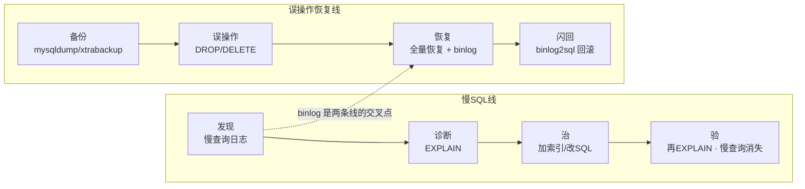
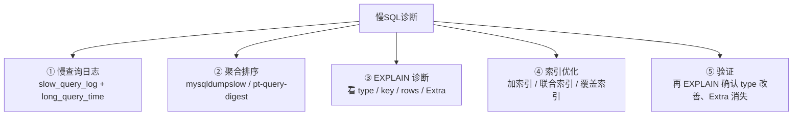
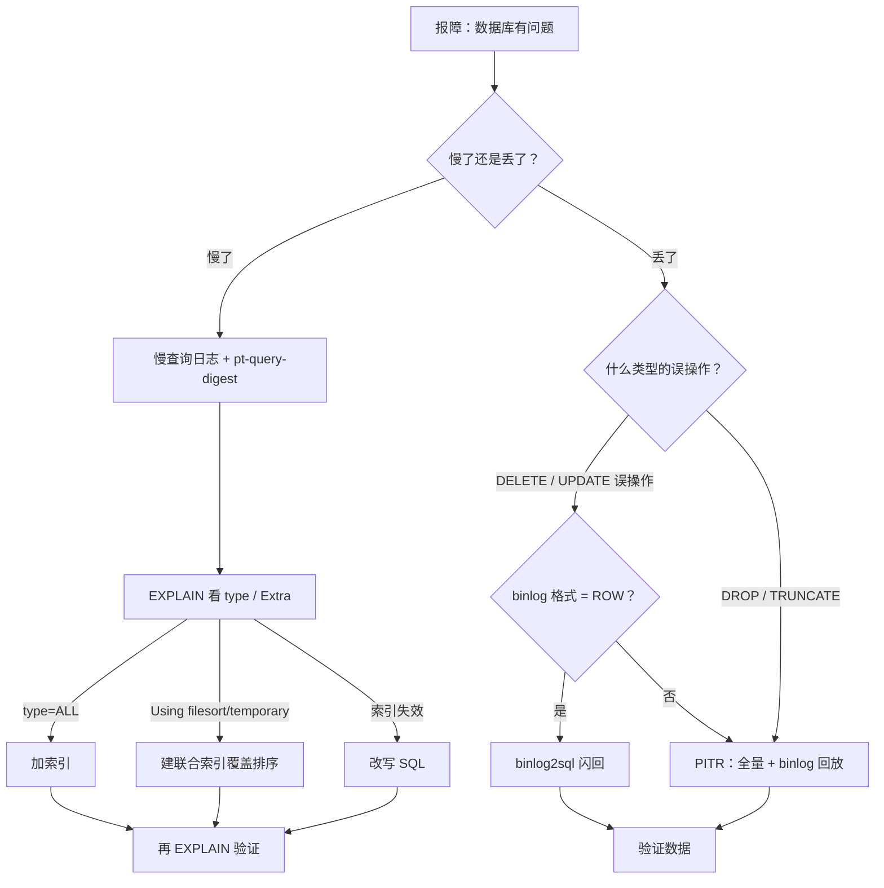

# 05 备份恢复与慢查询治理

> 大家好，欢迎来到这次分享。开讲之前，先带大家回到两个很多值班同学都经历过的现场：
> 凌晨有人 `DELETE FROM user WHERE 1=1`——忘了 WHERE 条件外的限流，群里已经有人在喊「赶紧重启从库顶上去」；另一边，白天活动高峰一条全表扫描把库拖死，慢查询堆了两千条，有人准备「先把慢查询日志关掉少点噪音」。
> 这一章讲完，你会知道当时那两个人错在哪：误操作第一件事是**停写**而不是乱切；慢查询第一件事是**开日志聚合排序**而不是关日志——两条线中间，靠 binlog 串起来。
> **本章回答的问题**：一条慢 SQL 怎么发现、怎么诊断、怎么治；一次误操作怎么用备份 + binlog 恢复到时间点。
> **本章不讲**：存储引擎与 Buffer Pool → [02-01-01](../../02-中间件与数据库/01-MySQL/01-架构与存储引擎/)；索引数据结构与 B+ 树 → [02-01-02](../../02-中间件与数据库/01-MySQL/02-索引与执行计划/)；事务与锁 → [02-01-03](../../02-中间件与数据库/01-MySQL/03-事务与锁/)；主从复制与高可用 → [02-01-04](../../02-中间件与数据库/01-MySQL/04-主从与高可用/)。这些都有专门章节，本章只在用到时点到为止。

**标记**：🎯重点 · 🔥难点 · ⭐常考 · 🔧实操

**怎么听这场分享**：咱们先把第一节的双线图看熟——慢 SQL 线（发现→EXPLAIN→治→验）和误操作线（备份→binlog→闪回/PITR）；第二到第五节顺着两条线展开；第六节专门讲慢了/丢了怎么定责——也就是开头两个现场的正确解法。每一节讲完会提示对应练习题。

---

## 一、一张图：一条慢SQL的诊断 + 一次误操作的恢复

> 🎯 **一句话**：两条线——上线后一条慢 SQL 从发现到治好，凌晨一次误操作从备份到闪回，中间靠 binlog 串起来。



**读图**：上面一条线是「慢了怎么治」——从日志发现到 EXPLAIN 诊断再到索引优化。下面一条线是「丢了怎么救」——先有备份才能恢复，binlog 决定能恢复到哪个时间点。两条线的交叉点是 binlog：它既是闪回的数据来源，也是时间点恢复（PITR）的依据。值班时先问「是慢了还是丢了」——慢了走上线，丢了走下线。

带着这两条线，咱们先走「慢 SQL」那条——没有日志，后面的 EXPLAIN 全是瞎猜。

> 本节对应练习题 **Q1**（主图整体对应两条线）。

---

## 二、发现：慢查询日志

> 🎯 **一句话**：慢查询日志是 MySQL 自己记录「执行超过阈值」的 SQL，先打开、再看，不打开就等于没监控。

开篇那两千条慢查询堆着没人看——第一步不是关日志，是**打开并聚合排序，先治吃时间最多的那条**。⭐ 值班天天见。

### 打开与配置 ⭐🔧

**慢查询（slow query）** = 执行时间超过 `long_query_time` 的 SQL，MySQL 把它写进**慢查询日志（slow_query_log）**。这个日志默认关闭，线上必须打开。

```sql
-- 查看当前配置
SHOW VARIABLES LIKE 'slow_query%';
SHOW VARIABLES LIKE 'long_query_time';
```

```text
+---------------------+----------------------------+
| Variable_name       | Value                      |
+---------------------+----------------------------+
| slow_query_log      | OFF                        |  # ← 默认关着，线上必须 ON
| slow_query_log_file | /var/lib/mysql/slow.log    |
+---------------------+----------------------------+
+-----------------+-----------+
| long_query_time | 10.000000 |  # ← 默认 10s 太宽，生产设 1s 或 0.5s
+-----------------+-----------+
```

线上推荐配置（写到 `my.cnf` 的 `[mysqld]` 段）：

```ini
slow_query_log = 1                        # ← 打开慢查询日志
long_query_time = 1                       # ← 超过 1 秒就算慢；核心库可设 0.5
log_queries_not_using_indexes = 1        # ← 没走索引的也记（即使没超时）
log_slow_admin_statements = 1            # ← DDL 也记
```

> ⚠️ **别混**：`long_query_time` 是**执行时间**阈值，不是锁等待时间。一条 SQL 等锁 5 秒但执行 0.01 秒，只要总耗时没超 `long_query_time` 就不会被记。锁等待看 `performance_schema` 或 `innodb_lock_wait_timeout`，不在慢查询日志里。

### 怎么读慢查询日志 🔧

> 🔍 **现场**：慢查询日志里 SQL 可能上千条，不能一条条看。

```bash
# mysqldumpslow 按平均耗时排序
mysqldumpslow -s t -t 10 /var/lib/mysql/slow.log
```

```text
Count: 482  Time=3.25s (1568s)  Lock=0.00s (0s)  Rows=0.0 (0)
  SELECT * FROM player_log WHERE create_time BETWEEN 'S' AND 'S'
# ← 出现 482 次，平均 3.25s，累计吃掉 1568s —— 排第一先治这个
```

**读法**：`Count` 是出现次数，`Time=3.25s` 是平均执行时间，括号里是累计时间。`-s t` 按总时间排序，`-t 10` 只看前 10 条。`S` 是 mysqldumpslow 把字符串参数化后的占位符，方便聚合相同模式的 SQL。

生产环境更推荐 **pt-query-digest**（Percona Toolkit），它能按指纹聚合、给出 95% / 99% 分位、关联 EXPLAIN。

```bash
pt-query-digest /var/lib/mysql/slow.log | head -40
```

```text
# 360ms user time, 30ms system time, 42.50M rss, 4.12G vsz
# Profile
# Rank Query ID                      Response time  Calls R/Call V/M
# ==== ============================= ============== ===== ====== ====
#    1 0x2A3B4C5D6E7F8A9B            1568.0000 0.0  482   3.25  0.1 SELECT player_log
# ← Rank 1 的 SQL 吃掉最多响应时间，先治它
```

> 📝 **面试**：问「慢查询怎么排查」，答「先确认 `slow_query_log` 打开了、`long_query_time` 设成 1s 或更低；用 `mysqldumpslow` 或 `pt-query-digest` 聚合后按响应时间排序，先治 Top 1——不是看到哪条慢就改哪条，是按累计影响排序」。

日志有了，下一站用 EXPLAIN 拍 X 光——02 章的读法，这里落到「治」。

> 本节对应练习题 **Q1**。

---

## 三、诊断：EXPLAIN与优化

> 🎯 **一句话**：EXPLAIN 是 MySQL 给你看「这条 SQL 打算怎么跑」的执行计划——看 `type` 列判断扫描方式、看 `Extra` 列判断有没有额外排序，没有它改索引就是瞎猜。

⭐ 口诀：**先看 type，再看 key，再看 Extra，最后看 rows**——type=ALL 先别谈别的。

### EXPLAIN 怎么用 🔧⭐

在 SQL 前面加 `EXPLAIN` 就行，不会真正执行：

```sql
EXPLAIN SELECT * FROM player_log WHERE create_time BETWEEN '2026-09-01 00:00:00' AND '2026-09-01 23:59:59';
```

```text
+----+-------------+------------+------------+------+---------------+------+---------+------+--------+----------+-------------+
| id | select_type | table      | partitions | type | possible_keys | key  | key_len | ref  | rows   | filtered | Extra       |
+----+-------------+------------+------------+------+---------------+------+---------+------+--------+----------+-------------+
|  1 | SIMPLE      | player_log | NULL       | ALL  | NULL          | NULL | NULL    | NULL | 850000 |    11.11 | Using where |
+----+-------------+------------+------------+------+---------------+------+---------+------+--------+----------+-------------+
# ← type=ALL 全表扫描 · key=NULL 没走索引 · rows=85万行要全扫 → 慢的根源
```

**读法**：重点看四列——`type`（扫描方式）、`key`（实际用的索引）、`rows`（预估扫描行数）、`Extra`（额外信息）。上面这条 `type=ALL` 且 `key=NULL`，说明全表扫描了 85 万行，这就是慢的原因。

### type 列：扫描方式的严重程度 🔥⭐

**type（连接类型）** 反映 MySQL 找到数据的方式，从好到坏：

| type | 含义 | 是否有问题 |
|------|------|-----------|
| `const` / `system` | 主键或唯一索引等值查询，最多一行 | 最佳 |
| `eq_ref` | 主键或唯一索引等值 JOIN，最多一行 | 很好 |
| `ref` | 非唯一索引等值查询，可能多行 | 正常 |
| `range` | 索引范围扫描（BETWEEN、>、<、IN） | 正常 |
| `index` | 扫描整个索引树（比全表好一点） | 需优化 |
| `ALL` | 全表扫描，没走索引 | **必须治** |

> 🎯 **关键直觉**：看到 `ALL` 就要问「为什么没走索引」——要么没建索引、要么索引失效（函数包裹列、隐式类型转换、`OR` 连接非索引列）。

```sql
-- 加索引前
EXPLAIN SELECT * FROM player_log WHERE create_time BETWEEN '2026-09-01 00:00:00' AND '2026-09-01 23:59:59';
-- type=ALL  key=NULL  rows=850000

-- 加索引
ALTER TABLE player_log ADD INDEX idx_create_time (create_time);

-- 加索引后
EXPLAIN SELECT * FROM player_log WHERE create_time BETWEEN '2026-09-01 00:00:00' AND '2026-09-01 23:59:59';
```

```text
+----+-------------+------------+------------+-------+-----------------+-----------------+---------+------+------+----------+-----------------------+
| id | select_type | table      | partitions | type  | possible_keys   | key             | key_len | ref  | rows | filtered | Extra                 |
+----+-------------+------------+------------+-------+-----------------+-----------------+---------+------+------+----------+-----------------------+
|  1 | SIMPLE      | player_log | NULL       | range | idx_create_time | idx_create_time | 5       | NULL | 8200 |   100.00 | Using index condition |
+----+-------------+------------+------------+-------+-----------------+-----------------+---------+------+------+----------+-----------------------+
# ← type=range 走了索引范围扫描 · key=idx_create_time · rows 从 85万 降到 8200 → 治好了
```

**读法**：加了索引后 `type` 从 `ALL` 变成 `range`，`key` 从 `NULL` 变成 `idx_create_time`，`rows` 从 85 万降到 8200——扫描量降了两个数量级，这条慢 SQL 治好了。

### Extra 列：有没有额外代价 🔥⭐

**Extra** 列告诉你 MySQL 做完扫描后还干了什么额外的事。两个值最危险：

| Extra 值 | 含义 | 为什么危险 |
|----------|------|-----------|
| `Using filesort` | MySQL 无法用索引排序，在内存（或磁盘）里额外排序 | 数据量大时吃 CPU 和临时空间 |
| `Using temporary` | MySQL 创建了临时表来暂存中间结果 | 临时表写磁盘 = 严重变慢 |

> 💡 **打个比方**：`Using filesort` 就像你在图书馆找了一摞书后，还得在桌上按出版日期重新排一遍——书越多排得越久。`Using temporary` 更惨，得先搬一张桌子来摆书，桌子不够大还得去仓库搬——磁盘临时表就是那个仓库。

```sql
EXPLAIN SELECT * FROM player_log WHERE player_id = 10086 ORDER BY create_time DESC LIMIT 20;
```

```text
+----+-------------+------------+------+---------------+-------------+---------+-------+--------+----------+-----------------------------+
| id | select_type | table      | type | possible_keys | key         | key_len | ref   | rows   | filtered | Extra                       |
+----+-------------+------------+------+---------------+-------------+---------+-------+--------+----------+-----------------------------+
|  1 | SIMPLE      | player_log | ref  | idx_player     | idx_player   | 4       | const | 152000 |   100.00 | Using filesort              |
+----+-------------+------------+------+---------------+-------------+---------+-------+--------+----------+-----------------------------+
# ← type=ref 走了索引但 Extra=Using filesort → 排序没走索引，要额外排 15 万行
```

治法：建联合索引 `(player_id, create_time)`，让排序直接走索引顺序，消除 `Using filesort`：

```sql
ALTER TABLE player_log ADD INDEX idx_player_create (player_id, create_time);
EXPLAIN SELECT * FROM player_log WHERE player_id = 10086 ORDER BY create_time DESC LIMIT 20;
```

```text
| type | possible_keys           | key               | Extra       |
| ref  | idx_player,idx_player_create | idx_player_create | NULL        |
# ← Extra 变成 NULL，排序被索引顺序覆盖了，Using filesort 消失
```

> ⚠️ **别混**：`Using index`（Extra）和 `type=index` 是两码事。`Using index` = **覆盖索引**，直接从索引树取数据不用回表，是好事；`type=index` = 扫描整个索引树，虽然比 `ALL` 好但仍需优化。一个在 `Extra` 列，一个在 `type` 列。

### 索引失效的常见场景 ⭐🔥

不是建了索引就一定会走，以下五种常见写法会让索引失效：

**① 对索引列做函数运算**：

```sql
-- 索引失效：YEAR() 函数包裹了列
SELECT * FROM player_log WHERE YEAR(create_time) = 2026;
-- 改写：改成范围查询
SELECT * FROM player_log WHERE create_time >= '2026-01-01' AND create_time < '2027-01-01';
```

**② 隐式类型转换**：

```sql
-- 索引失效：player_id 是 INT，传了字符串
SELECT * FROM player_log WHERE player_id = '10086';
-- 改写：传对类型
SELECT * FROM player_log WHERE player_id = 10086;
```

**③ LIKE 左模糊**：

```sql
-- 索引失效：左边 % 无法走 B+ 树前缀
SELECT * FROM player WHERE name LIKE '%张';
-- 改写：右模糊可以走索引
SELECT * FROM player WHERE name LIKE '张%';
```

**④ OR 连接非索引列**：

```sql
-- 索引失效：OR 两边不都有索引
SELECT * FROM player_log WHERE player_id = 10086 OR server_id = 1;
-- 改写：确保 OR 两边都有索引，或用 UNION ALL
```

**⑤ 联合索引不满足最左前缀**：

```sql
-- 索引 (a, b, c) 只能用于 a / a,b / a,b,c 的查询
SELECT * FROM t WHERE b = 1 AND c = 2;  -- 走不了索引，少了 a
```

> 📝 **面试**：问「索引为什么失效」，答「核心是一条：**B+ 树按索引列的值有序排列，任何破坏这个有序性的操作都会让索引无法使用**——函数包裹列改变了值的排列、隐式转换导致类型不匹配、左模糊无法定位前缀、OR 有一边没法走索引。本质上都是让 B+ 树的有序查找退化为遍历」。

> 🔍 **现场**：改完 SQL 或加了索引后，**一定要再 EXPLAIN 一遍验证**，不要凭感觉认为「加了索引就快了」。看 `type` 是否改善、`rows` 是否下降、`Extra` 里的 `Using filesort` / `Using temporary` 是否消失。

### 收束：慢SQL诊断清单 🎯⭐

到这里，慢 SQL 诊断的全部零件都齐了。面试问「慢 SQL 怎么排查和优化」，答这张清单：



**读图**：

- ① 保证能发现（日志打开 + 阈值合理），② 保证先治影响最大的（按累计时间排序），③ 用 EXPLAIN 定位根因（`ALL` 全扫还是 `Using filesort` 排序），④ 对症下药（缺索引加索引、失效改写法），⑤ **改完必须验证**——不验证等于没改。
- 前两步是「发现」，后三步是「治」。漏掉验证那一步是最常见的坑——「加了索引应该快了」是猜，再 EXPLAIN 一遍才是确认。

> ⚠️ **别混**：`type=ALL` 说明扫描方式有问题（没走索引），`Using filesort` 说明排序方式有问题（索引没覆盖排序）。两者独立——可能 `type=ref` 走了索引但仍有 `Using filesort`（走了索引但排序没被覆盖），也可能 `type=ALL` 但 `Extra` 干净（全扫但不需要额外排序）。看 `type` 判断扫描、看 `Extra` 判断代价，两列都要看。

> 📝 **面试**：背这张清单时按「发现 → 定位 → 治 → 验」分组。发现靠日志和聚合工具，定位靠 EXPLAIN 四列，治靠加索引或改写 SQL，验靠再 EXPLAIN 一遍。最后补一句「索引不是加了就快，要验证 `type` 改善、`rows` 下降、`Using filesort` 消失」——这是区分「背过」和「做过」的分水岭。

慢 SQL 线告一段落。换到另一条线：没有可靠备份，误操作只能干瞪眼。

> 本节对应练习题 **Q2、Q3、Q4、Q5**。

---

## 四、备份：mysqldump与xtrabackup

> 🎯 **一句话**：mysqldump 是逻辑备份（导出 SQL 文本），xtrabackup 是物理备份（拷贝数据文件）；恢复速度物理快得多，但逻辑备份更通用、更灵活。

大家想想：备份有了却从没演练过恢复——等于没备份。RPO/RTO 就是用来回答「能丢多少、多久救回来」。

### 两种备份方式 ⭐🔧

**mysqldump** 是 MySQL 自带的逻辑备份工具——它把表结构和数据导出成 SQL 文本（`CREATE TABLE` + `INSERT`），恢复时就是把这些 SQL 重新跑一遍。

```bash
# 全量备份单库
mysqldump --single-transaction --master-data=2 \
  -u root -p game_db > /backup/game_db_20260901.sql
```

```text
-- CHANGE MASTER TO MASTER_LOG_FILE='mysql-bin.000123', MASTER_LOG_POS=154;
# ← --master-data=2 记录了备份时刻的 binlog 位点，PITR 要用
```

```bash
# 验证备份文件非空且有内容
head -5 /backup/game_db_20260901.sql
wc -l /backup/game_db_20260901.sql
```

```text
-- MySQL dump 10.13  Distrib 8.0.36
--
-- Host: localhost    Database: game_db
-- ------------------------------------------------------
12000    /backup/game_db_20260901.sql
# ← 12000 行，非空，备份文件可用
```

> 🔍 **现场**：`--single-transaction` 用 InnoDB 的一致性读（MVCC 快照）做热备份，不锁表。**不加这个参数会锁表**。`--master-data=2` 把 binlog 位点以注释形式写进文件，恢复时拿来做 PITR。这两个参数是生产标配。

**xtrabackup**（Percona XtraBackup）是物理备份工具——它直接拷贝 **InnoDB** 的数据文件（**ibd** 文件，每个表的数据文件）和系统表空间（**ibdata**，共享表空间文件），恢复时把文件拷回数据目录即可，不用重放 SQL。

```bash
# 全量物理备份
xtrabackup --backup --target-dir=/backup/xtrabackup/full_20260901 \
  -u root -p
```

```text
...
210901 03:00:15 completed OK!
# ← 出现 completed OK 才算备份成功
```

```bash
# 增量备份（基于全量）
xtrabackup --backup --target-dir=/backup/xtrabackup/incr_20260901_12 \
  --incremental-basedir=/backup/xtrabackup/full_20260901 \
  -u root -p
```

**增量备份（incremental backup）** = 只备份自上次全量或增量以来变化的数据页。xtrabackup 通过 InnoDB 页的 **LSN（Log Sequence Number，日志序列号）** 判断哪些页变了，只拷贝变化部分，速度快、空间小。

### 两种工具怎么选 ⭐

| 对比 | **mysqldump**（逻辑） | **xtrabackup**（物理） |
|------|----------------------|----------------------|
| 备份内容 | SQL 文本 | 数据文件（ibd / ibd / ibdata） |
| 速度 | 慢（要 SELECT + 写文本） | 快（直接拷文件） |
| 恢复速度 | 慢（要重放 SQL） | 快（拷文件 + 应用 redo） |
| 跨版本 | 可跨版本迁移 | 需版本兼容 |
| 锁表 | `--single-transaction` 不锁 | 不锁（InnoDB 热备） |
| 增量 | 不支持 | 支持 |

> 💡 **打个比方**：mysqldump 像把整本书重新抄一遍——可读性强但慢，而且恢复时还得一个字一个字写回去。xtrabackup 像直接把硬盘的扇区复制一份——快是快，但只能往同款硬盘上还原。

> ⚠️ **别混**：**全量备份（full backup）** 和 **增量备份** 是维度概念，逻辑和物理工具都能做全量，但**增量备份只有 xtrabackup 这种物理工具能高效做**——mysqldump 没有「增量」概念，每次都是全量。把 mysqldump 跑成 cron 定时任务不是「增量备份」，只是「定期全量」。

### 备份策略与 RPO / RTO ⭐

> 💡 **打个比方**：备份就像买保险——全量备份是一次买齐的大额保单，增量是每天补的小额保单，binlog 是实时流水账。出了事先用大额保单兜底（全量恢复），再用流水账补到出事那一刻（PITR）。

生产标准备份策略（三层）：

- **全量备份**：每天凌晨一次（xtrabackup 或 mysqldump），异地保留 7~30 天。
- **增量备份**：每 4~6 小时一次（xtrabackup），保留到下次全量。
- **binlog**：持续开启，定期归档——这是**时间点恢复**的唯一依据。

**RPO（Recovery Point Objective，恢复点目标）** = 最多能丢多少数据。全量 + 增量 + binlog 的 RPO ≈ binlog 的最后归档间隔（通常 < 5 分钟），不是 0。

**RTO（Recovery Time Objective，恢复时间目标）** = 多久能恢复服务。物理备份恢复快（拷文件），逻辑备份恢复慢（重放 SQL）。RTO 只有演练过才知道。

> ⚠️ **别混**：RPO 衡量**丢数据**（能回放到多久之前），RTO 衡量**停服时间**（多久能恢复）。`RPO=0` 要求 binlog 实时归档且不丢；`RTO<5min` 通常需要物理备份 + 自动化恢复脚本。两者独立——可以 RPO 很小但 RTO 很大（binlog 没丢但恢复慢）。

> 📝 **面试**：问「备份策略怎么定」，答「三层：每天全量（xtrabackup 物理备份）+ 每 4~6 小时增量 + binlog 持续归档。RPO ≈ binlog 归档间隔，RTO 只有演练过才知道。关键一句：**没有演练 = 没有备份**」。

> 🔍 **现场**：定期验证备份可用——`mysqldump` 出来的文件 `head` 和 `wc -l` 看非空；xtrabackup 出来的目录看有没有 `completed OK`。恢复演练每季度做一次，记下 RTO。

备份在手，开篇那个 `DELETE ... WHERE 1=1` 怎么救？靠 binlog。

> 本节对应练习题 **Q6、Q7**。

---

## 五、恢复：binlog恢复与闪回

> 🎯 **一句话**：全量备份恢复到备份时刻，binlog 从备份时刻回放到误操作前——两步合起来叫 PITR；binlog2sql 能直接生成反向 SQL 做闪回。

开讲时那个误操作现场的正确解法，就在这一节：⭐ **先停写，再分清 DELETE 可闪回、DROP 只能 PITR**——别先重启从库顶上去。

### binlog 是什么 ⭐🔥

**binlog（二进制日志，binary log）** 是 MySQL Server 层的日志，记录所有**已提交**的写操作（DDL + DML），不记录 SELECT。它主要用于主从复制和数据恢复。

binlog 有三种格式：

| 格式 | 记录内容 | 优缺点 |
|------|---------|--------|
| `STATEMENT` | 记录 SQL 语句原文 | 日志小，但 `NOW()` / `UUID()` 等函数在从库重放结果可能不一致 |
| `ROW` | 记录每行变化前后的值 | 日志大，但精确可靠，**闪回必须用 ROW** |
| `MIXED` | 混合，自动选择 | 兼顾但不够精确，闪回仍需 ROW |

```sql
SHOW VARIABLES LIKE 'binlog_format';
SHOW VARIABLES LIKE 'log_bin';
```

```text
+---------------+-------+
| binlog_format | ROW   |  # ← 生产必须 ROW，闪回依赖它
+---------------+-------+
+---------------+-------+
| log_bin       | ON    |  # ← binlog 总开关
+---------------+-------+
```

> ⚠️ **别混**：binlog 在 **Server 层**，记录所有引擎的写操作；**redo log（重做日志）** 在 **InnoDB 引擎层**，记录数据页的物理修改。两者不同：redo log 保证 crash recovery（掉电不丢已提交事务），binlog 保证复制和恢复。崩溃恢复时先重放 redo log 恢复数据页，再从 binlog 的位点继续。存储引擎与日志体系见 [02-01-01](../../02-中间件与数据库/01-MySQL/01-架构与存储引擎/)。

### 时间点恢复（PITR） 🔥⭐🔧

🔥 **PITR（Point-in-Time Recovery，时间点恢复）** 大白话：**先回到某次全量备份，再把 binlog 像录像带一样快进到事故前一秒按下暂停**。两个位点缺一不可。

**PITR（Point-in-Time Recovery，时间点恢复）** = 先恢复全量备份，再用 binlog 从备份时刻回放到指定时间点。整个过程分两步：


**读图**：PITR 的关键是「两个位点」——全量备份记录的 binlog 起点（`--master-data=2` 给的），和误操作前的 binlog 终点。mysqlbinlog 把这段 binlog 转成 SQL 回放回去，数据就恢复到误操作前那一刻。

假设误操作是 `DROP TABLE player_log`，恢复流程：

```bash
# Step 1: 查看备份文件里的 binlog 位点
head -20 /backup/game_db_20260901.sql | grep 'CHANGE MASTER'
```

```text
-- CHANGE MASTER TO MASTER_LOG_FILE='mysql-bin.000123', MASTER_LOG_POS=154;
# ← 全量备份时刻的 binlog 起点，从这里开始回放
```

```bash
# Step 2: 查看 binlog 找到 DROP TABLE 的位点
mysqlbinlog --base64-output=DECODE-ROWS -v /var/lib/mysql/mysql-bin.000124 | grep -n 'DROP TABLE'
```

```text
1230: # at 8200
1231: #260901 14:30:00 server id 1  Query_thread_id=5  exec_time=0  error_code=0
1232: DROP TABLE `player_log` /* generated by server */
# ← 误操作在 mysql-bin.000124 的 pos=8200 处，回放到 8199 为止
```

```bash
# Step 3: 用 mysqlbinlog 回放到误操作前
mysqlbinlog --start-position=154 --stop-position=8200 \
  /var/lib/mysql/mysql-bin.000123 /var/lib/mysql/mysql-bin.000124 \
  | mysql -u root -p game_db
# ← 从备份位点 154 回放到误操作前 8200，数据恢复到 DROP 之前
```

> ⚠️ **别混**：`--start-position` 来自全量备份记录的位点，`--stop-position` 来自误操作前的位点。**不是从 binlog 文件开头开始回放**——全量备份已经包含到备份那一刻的数据，binlog 只补备份之后的增量变化。如果从 binlog 文件开头回放，等于把备份前的操作重做一遍，会报错或重复。

### binlog2sql 与闪回 🔥⭐🔧

大家想想：DELETE 了几千行，有没有办法「倒放」而不整库回滚？有——前提是 ROW 格式 binlog。

**闪回（flashback）** = 不恢复全量，而是用 binlog 生成**反向 SQL**，直接抵消误操作。比 PITR 快得多，不需要全量恢复。

**binlog2sql** 是一个开源工具（基于 Python + mysql-replication 库），它从 binlog 中解析出原始 SQL，并生成对应的反向 SQL——`DELETE` 反转成 `INSERT`，`INSERT` 反转成 `DELETE`，`UPDATE` 反转成反向 `UPDATE`。

> 💡 **打个比方**：PITR 像把整个仓库回滚到昨天的状态——先搬空再重建，慢但彻底。闪回像只撤销你手滑放错的那一箱货——精准、快，但前提是 binlog 记录了每行变化（ROW 格式）。

```bash
# 用 binlog2sql 解析误操作的 binlog
python3 binlog2sql.py -h127.0.0.1 -P3306 -uroot -p \
  --start-file='mysql-bin.000124' \
  --start-position=8200 --stop-position=8400 \
  -B  # ← -B 生成反向 SQL（flashback 模式）
```

```text
INSERT INTO `game_db`.`player_log`(`id`,`player_id`,`action`,`create_time`) VALUES (1001, 10086, 'login', '2026-09-01 14:00:00');
INSERT INTO `game_db`.`player_log`(`id`,`player_id`,`action`,`create_time`) VALUES (1002, 10087, 'login', '2026-09-01 14:01:00');
# ← -B 模式把 DELETE 反转成 INSERT，每行都带完整字段值
```

```bash
# 审核反向 SQL 后执行
mysql -u root -p game_db < /tmp/rollback.sql
# ← 数据恢复完成，无需全量恢复
```

闪回的前提条件：① binlog 格式必须是 `ROW`；② binlog 文件还在（没被清理）；③ 误操作到发现之间的时间窗口内 binlog 没被 `PURGE` 掉。

> ⚠️ **别混**：闪回 ≠ PITR。闪回是**精准回滚误操作**（快，但只回滚那几条 SQL），PITR 是**恢复到某个时间点**（慢，需要全量恢复 + binlog 回放）。`DELETE` 误删用闪回最快；`DROP TABLE` / `TRUNCATE` 删的是表结构不是数据行，binlog 里记录的是 DDL 不是行级变化，**闪回对 DDL 无效**——`DROP TABLE` 只能靠 PITR 恢复。

> 📝 **面试**：问「误删数据怎么恢复」，先分两类：`DELETE` 误删数据行 → binlog2sql 生成反向 SQL 闪回（前提 binlog_format=ROW）；`DROP TABLE` / `TRUNCATE` 删表 → 闪回无效，走 PITR（全量恢复 + binlog 回放到 DROP 前）。再补一句「前提是 binlog 还在、备份做过」。

### 误操作的常见类型 ⭐

| 误操作 | 能否闪回 | 恢复方式 |
|--------|---------|---------|
| `DELETE FROM t WHERE ...` | 能（ROW 格式） | binlog2sql 生成反向 INSERT |
| `UPDATE t SET ... WHERE ...` | 能 | binlog2sql 生成反向 UPDATE |
| `DROP TABLE` | 不能 | PITR：全量恢复 + binlog 回放 |
| `TRUNCATE TABLE` | 不能 | PITR：全量恢复 + binlog 回放 |
| `DELETE FROM t`（无 WHERE） | 能 | binlog2sql 逐行反转（数据量大时慢） |

> 🔍 **现场**：发现误操作后**第一件事不是恢复，是停写**——立即把相关表设为只读或对应用加锁，防止新写入覆盖 binlog 位点之间的数据。然后确认 binlog 还在、备份可用，再选恢复方式。

两条线的零件都齐了。值班 60 秒怎么定责？

> 本节对应练习题 **Q8、Q9、Q10、Q11**。

---

## 六、作战：定责（慢了/丢了/恢复了）

> 🎯 **一句话**：接报先问「是慢了还是丢了」——慢了走 EXPLAIN 那条线，丢了走备份恢复那条线，别慌着恢复。

### 定责决策树



**读图**：入口先分「慢了还是丢了」——慢了走左线（日志 → EXPLAIN → 索引优化 → 验证），丢了走右线（判断误操作类型 → 闪回 or PITR → 验证）。左线和右线的共同终点是**验证**——不验证等于没做完。

### 现象 · 先做 · 别做

| 现象 | 先做 | 别做 |
|------|------|------|
| 接口慢、DB CPU 高 | 查慢查询日志 + pt-query-digest | 先加 CPU |
| EXPLAIN type=ALL | 加索引 + 再 EXPLAIN 验证 | 盲目重建索引 |
| `Using filesort` | 建联合索引覆盖排序 | 只加单列索引 |
| 索引建了不走 | 检查函数包裹 / 类型转换 / 左模糊 | 反复加索引 |
| `DELETE` 误删 | 停写 + 确认 binlog=ROW + binlog2sql | 直接恢复全量备份 |
| `DROP TABLE` | 停写 + PITR 全量恢复 + binlog 回放 | 用 binlog2sql（对 DDL 无效） |
| 误操作后还想恢复 | 先停写防止覆盖 | 在原库直接操作不备份 binlog |
| 恢复后数据不对 | 对比恢复前后 count / 抽查 | 声称已恢复不验证 |
| 慢查询堆了两千条 | 按 pt-query-digest 排序治 Top 1 | 一条条看 |

### 60 秒剧本 🔧

> 🔍 **现场**：接到「数据库慢」或「误删数据」告警，60 秒走完这条线再动手。

```text
① 0–10s  分型：是慢了还是丢了？
          慢了 → 查 slow.log / pt-query-digest Top 1
          丢了 → 立即停写！确认 binlog 还在、备份可用
② 10–30s 慢了：EXPLAIN Top 1 SQL，看 type / key / rows / Extra
          丢了：确认误操作类型（DELETE 还是 DROP）+ binlog_format 是否 ROW
③ 30–45s 慢了：定型：ALL 全扫 / Using filesort / 索引失效
          丢了：DELETE→binlog2sql 闪回；DROP→PITR 全量+binlog
④ 45–60s 慢了：加索引/改SQL → 再 EXPLAIN 验证
          丢了：先备份当前 binlog → 执行恢复 → 验证 count / 抽查
```

现在再看群里那两句「关掉慢查询日志 / 重启从库顶上去」，你知道该怎么拦住他了。

> 本节对应练习题 **Q12、Q13、Q14**。

---

## 七、收口

### 命令速查 🔧

```bash
# 慢查询
SHOW VARIABLES LIKE 'slow_query%';          # 查慢查询日志状态
SHOW VARIABLES LIKE 'long_query_time';      # 查阈值
mysqldumpslow -s t -t 10 /var/lib/mysql/slow.log   # 按总时间 Top 10
pt-query-digest /var/lib/mysql/slow.log     # 更详细的聚合分析

# EXPLAIN
EXPLAIN SELECT ...;                         # 看执行计划，重点 type/key/rows/Extra

# 备份
mysqldump --single-transaction --master-data=2 -u root -p db > backup.sql  # 逻辑全量
xtrabackup --backup --target-dir=/backup/full -u root -p                   # 物理全量
xtrabackup --backup --target-dir=/backup/incr --incremental-basedir=/backup/full -u root -p  # 物理

# binlog
SHOW BINLOG EVENTS IN 'mysql-bin.000124';   # 查看 binlog 事件
mysqlbinlog --start-position=154 --stop-position=8200 mysql-bin.000124 | mysql -u root -p db  # PITR 回放

# 闪回
python3 binlog2sql.py -h127.0.0.1 -P3306 -uroot -p --start-file='mysql-bin.000124' --start-position=8200 --stop-position=8400 -B  # 生成反向 SQL

# 验证
SELECT COUNT(*) FROM table_name;            # 恢复后验证行数
```

### 面试锚点

遮住右列自问自答，卡壳的行回去重读对应小节——能讲出来才算会。

| 问 | 30 秒答 |
|----|---------|
| 慢查询怎么排查？ | 打开 slow_query_log + long_query_time=1s → pt-query-digest 按时间排序 → EXPLAIN Top 1 → 治 → 再 EXPLAIN 验证。 |
| EXPLAIN 看哪几列？ | type（扫描方式，ALL 最差）、key（实际用的索引）、rows（预估扫描行数）、Extra（Using filesort / Using temporary 要治）。 |
| type=ALL 怎么办？ | 没走索引：检查有没有索引、索引是否失效（函数包裹列 / 隐式转换 / 左模糊 / OR / 不满足最左前缀）。 |
| Using filesort 什么意思？ | 排序没走索引，在内存/磁盘额外排序；建联合索引让排序走索引顺序即可消除。 |
| Using index 和 type=index 区别？ | Using index（Extra）= 覆盖索引不回表，好事；type=index = 扫描整棵索引树，仍需优化。 |
| mysqldump vs xtrabackup？ | 逻辑 vs 物理；mysqldump 慢但通用可跨版本；xtrabackup 快但版本敏感，支持增量。 |
| 备份策略怎么定？ | 每天全量 + 每 4~6h 增量 + binlog 持续归档；RPO ≈ binlog 归档间隔，RTO 靠演练。 |
| RPO 和 RTO 区别？ | RPO = 最多丢多少数据（能恢复到多久前）；RTO = 多久能恢复服务。两者独立。 |
| binlog 有哪几种格式？ | STATEMENT（记录 SQL）/ ROW（记录行变化）/ MIXED；生产用 ROW，闪回依赖它。 |
| binlog 和 redo log 区别？ | binlog 在 Server 层（复制+恢复），redo log 在 InnoDB 引擎层（crash recovery）。 |
| 误删数据怎么恢复？ | DELETE→binlog2sql 闪回（需 ROW 格式）；DROP/TRUNCATE→PITR 全量+binlog 回放。 |
| 闪回和 PITR 什么区别？ | 闪回精准回滚几条 SQL（快，只对 DML）；PITR 恢复到时间点（慢，需全量恢复+binlog）。 |
| DROP TABLE 能闪回吗？ | 不能，DDL 在 binlog 里不是行级变化；只能 PITR 全量恢复 + binlog 回放到 DROP 前。 |
| PITR 的两个位点是什么？ | 起点 = 全量备份记录的 binlog 位点（--master-data=2）；终点 = 误操作前的 binlog 位点。 |
| 发现误操作第一件事做什么？ | 停写！防止新写入覆盖 binlog 位点之间的数据；然后确认 binlog 还在、备份可用。 |
| 没演练过算有备份吗？ | 不算；没有演练 = 没有备份，RTO 只有真做过才知道。 |
| 增量备份和全量备份区别？ | 全量 = 备份所有数据；增量 = 只备份变化的数据页（xtrabackup 靠 LSN 判断）。mysqldump 没有增量。 |
| --single-transaction 干什么？ | InnoDB MVCC 快照热备份，不锁表；不加会锁表。--master-data=2 记录 binlog 位点。 |

### 易错一句话对照

- 慢查询日志默认开着 → 默认关着，必须手动开
- long_query_time 是锁等待时间 → 是执行时间阈值，锁等待看 performance_schema
- type=index 和 Using index 一样 → type=index 扫描整棵索引树（需优化）；Using index 是覆盖索引（好事）
- 加了索引一定快 → 要再 EXPLAIN 验证 type/rows/Extra 是否改善
- Using filesort 就是用了临时文件 → 不一定，小结果集在内存排，大结果集才落盘
- mysqldump 可以做增量 → 不行，每次都是全量；增量只有 xtrabackup
- --single-transaction 会锁表 → 不锁，用 MVCC 快照；不加才锁
- RPO 和 RTO 是一回事 → RPO 丢多少数据，RTO 多久恢复
- binlog 在 InnoDB 引擎层 → 在 Server 层；redo log 才在引擎层
- binlog STATEMENT 格式也能闪回 → 不行，闪回需要 ROW 格式记录行级变化
- DROP TABLE 用 binlog2sql 闪回 → 不行，DDL 不是行级变化，只能 PITR
- 闪回比 PITR 万能 → 闪回只对 DML 有效且快；DDL 和大面积删除仍需 PITR
- 误操作后第一件事是恢复 → 第一件事是停写，防止覆盖
- PITR 从 binlog 文件开头回放 → 从全量备份记录的位点开始，不是从头
- 有 cron 备份就不用演练 → 有备份没演练 = 没备份，RTO 只有做过才知道
- pt-query-digest 和 mysqldumpslow 功能一样 → pt-query-digest 更强：指纹聚合、分位数、关联 EXPLAIN
- 索引失效就重建索引 → 先查原因（函数包裹/类型转换/左模糊），改写 SQL 可能更对

### 数字墙

> slow_query_log 默认 **OFF** · long_query_time 默认 **10s**（生产设 **1s** 或 **0.5s**）· EXPLAIN type 从好到坏 **6** 档（const→eq_ref→ref→range→index→ALL）· `Using filesort` + `Using temporary` 是 **2** 个最危险的 Extra · mysqldump `--single-transaction` + `--master-data=2` 是生产 **2** 个必加参数 · xtrabackup 全量 + 增量靠 **LSN** 判断变化页 · binlog 格式 **3** 种（STATEMENT / ROW / MIXED），生产必须 **ROW** · PITR 需要 **2** 个位点（备份起点 + 误操作终点）· 闪回只对 **DML** 有效，**DDL** 无效 · 备份三层：每天全量 + 每 **4~6h** 增量 + binlog 持续归档 · RPO ≈ binlog 归档间隔（< **5min**）· **frm** = 表结构定义文件 · **ibd** = InnoDB 表数据文件 · **ibdata** = 系统表空间共享文件

---

## 合上书

学到这里，先别急着翻下一章。合上书，试试下面这几件事能不能做到——能做到，这章才算真的听懂了。卡住的那一条，就回到对应小节再听一遍：

- [ ] **默画一节的图**：两条线——慢SQL线（发现→EXPLAIN→治→验）和误操作恢复线（备份→误操作→binlog→闪回/PITR），说清两条线的交叉点是 binlog。（对应练习题 Q1～Q12）
- [ ] **口述发现**：slow_query_log 默认关着、long_query_time 生产设多少、mysqldumpslow / pt-query-digest 怎么聚合排序、先治哪条。（Q1）
- [ ] **口述诊断**：EXPLAIN 看哪四列、type 从好到坏的顺序、ALL 怎么治、Using filesort / Using temporary 各是什么、Using index 和 type=index 的区别。（Q2、Q4）
- [ ] **口述索引失效**：五种常见场景（函数包裹 / 隐式转换 / 左模糊 / OR / 最左前缀不满足），本质是什么。（Q5）
- [ ] **默画收束清单**：慢SQL诊断五步（日志→聚合→EXPLAIN→索引→验证），说清为什么改完必须再 EXPLAIN。（Q3）
- [ ] **口述备份**：mysqldump vs xtrabackup（逻辑 vs 物理）、--single-transaction 不锁表原理、增量备份靠 LSN、三层备份策略。（Q6、Q7）
- [ ] **口述 RPO/RTO**：RPO 丢多少数据、RTO 多久恢复、两者独立、为什么没演练等于没备份。（Q7）
- [ ] **口述 binlog**：binlog 在 Server 层、三种格式、为什么闪回要 ROW、binlog 和 redo log 的区别。（Q8、Q12）
- [ ] **口述 PITR**：两个位点是什么、恢复步骤（全量恢复 + binlog 回放）、从哪个位点开始回放。（Q11）
- [ ] **口述闪回**：binlog2sql 生成反向 SQL 原理、DELETE 能闪回 DROP 不能、闪回和 PITR 的区别。（Q9、Q10）
- [ ] **口述误操作分类**：DELETE/UPDATE 能闪回、DROP/TRUNCATE 只能 PITR、发现后第一件事是停写——现在再看开篇那句「重启从库顶上去」，你知道该怎么拦住他了。（Q9、Q10）
- [ ] **定责**：决策树两个入口（慢了/丢了）；60 秒剧本每步敲什么。（Q13、Q14）

MySQL 五章到这儿收束。需要回炉时：[02-01-01 架构与存储引擎](../../02-中间件与数据库/01-MySQL/01-架构与存储引擎/) · [02-01-02](../../02-中间件与数据库/01-MySQL/02-索引与执行计划/) · [02-01-03](../../02-中间件与数据库/01-MySQL/03-事务与锁/) · [02-01-04](../../02-中间件与数据库/01-MySQL/04-主从与高可用/)。
