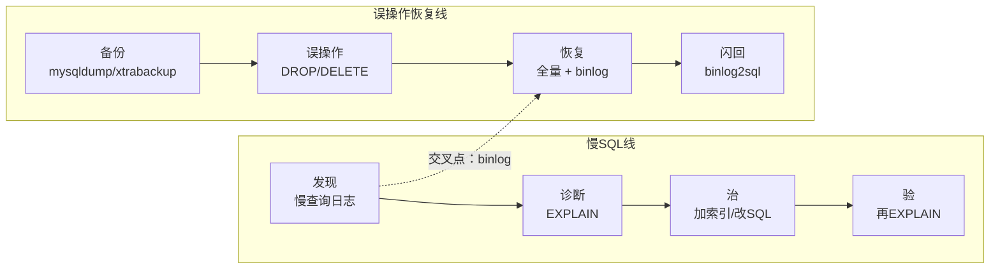
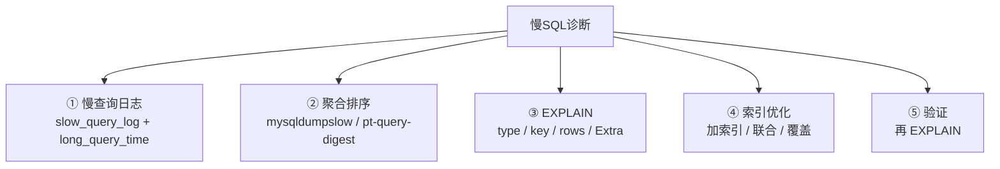
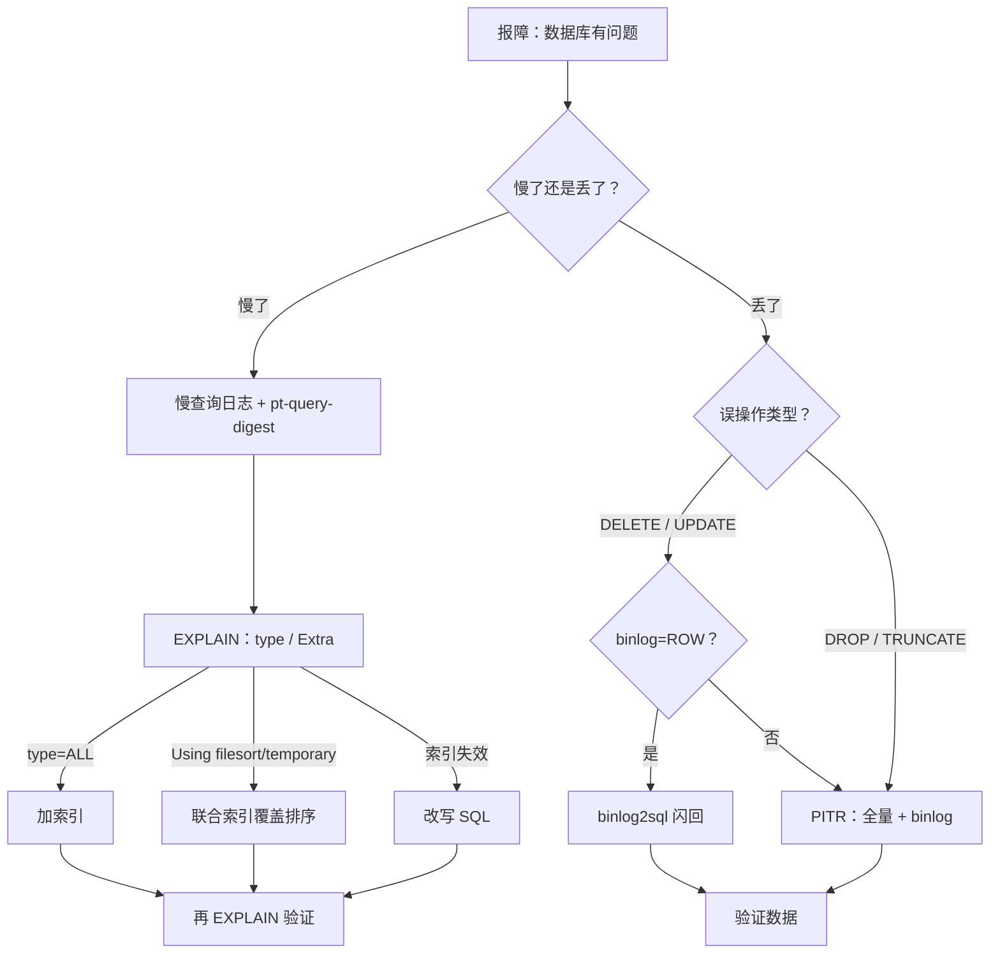

# 05 备份恢复与慢查询治理

> 凌晨有人 `DELETE FROM user WHERE 1=1`——群里喊「赶紧重启从库顶上去」；白天活动高峰一条全表扫描把库拖死，又有人准备「先把慢查询日志关掉少点噪音」。
> **本章回答**：一条慢 SQL 怎么发现、诊断、治好；一次误操作怎么用备份 + binlog 恢复到时间点。
> **不讲**：存储引擎与 Buffer Pool → [01](../01-架构与存储引擎/)；索引与 B+ 树细节 → [02](../02-索引与执行计划/)；事务与锁 → [03](../03-事务与锁/)；主从与高可用 → [04](../04-主从与高可用/)。

**标记**：🎯重点 · 🔥难点 · ⭐常考 · 🔧实操
---

## 一、一张图：慢SQL线 + 误操作恢复线

> 🎯 **一句话**：两条线——慢了从日志到 EXPLAIN 到治；丢了从备份到 binlog 到闪回/PITR；交叉点是 binlog。



- 📖 **读图**
  - 🛤️ 上线「慢了怎么治」；下线「丢了怎么救」——值班先问「慢了还是丢了」
  - 🔗 交叉点是 **binlog**：闪回来源 + PITR 依据（Q1）

#### ❓ 为什么 PITR 要「全量 + binlog」？

- 📦 **全量**是底座：没有它，binlog 无处可贴
- 🎞️ **binlog** 从备份位点播到误操作前——两个位点缺一不可
- ⚡ **闪回**（binlog2sql）适合可逆 DML；DDL / 大范围仍常走全量 + PITR

---

## 二、发现：慢查询日志

> 🎯 **一句话**：慢查询日志记「超过阈值」的 SQL——先打开、再聚合排序，不打开等于没监控。

第一步不是关日志，是**打开并按累计耗时治 Top1**。⭐

### 📡 打开与配置 ⭐🔧

**慢查询（slow query）** = 执行时间超过 `long_query_time` 的 SQL，写入 **slow_query_log**（默认关，线上必须开）。

#### ❓ 为什么先开慢日志，而不是先关？

- 📴 关掉 = 瞎飞——不知道哪条吃时间
- 📊 打开后**按耗时聚合排序**，先治 Top1
- 🎯 阈值建议 **1s**（默认 10s 太钝）

```sql
SHOW VARIABLES LIKE 'slow_query%';
SHOW VARIABLES LIKE 'long_query_time';
```

```text
| slow_query_log      | OFF                     |  # ← 默认关，线上必须 ON
| slow_query_log_file | /var/lib/mysql/slow.log |
| long_query_time     | 10.000000               |  # ← 默认 10s 太宽，生产 1s / 0.5s
```

```ini
# my.cnf [mysqld]
slow_query_log = 1
long_query_time = 1                 # ← 核心库可 0.5
log_queries_not_using_indexes = 1   # ← 没走索引也记
log_slow_admin_statements = 1       # ← DDL 也记
```

> ⚠️ **别混**：`long_query_time` 是**执行时间**阈值，不是锁等待。等锁 5s、执行 0.01s 可能不进慢日志——锁等待看 `performance_schema` / `innodb_lock_wait_timeout`。

### 📊 怎么读慢查询日志 🔧

> 🔍 **现场**：上千条不能一条条看——聚合排序，先治累计影响最大的。

```bash
mysqldumpslow -s t -t 10 /var/lib/mysql/slow.log
```

```text
Count: 482  Time=3.25s (1568s)  Lock=0.00s (0s)  Rows=0.0 (0)
  SELECT * FROM player_log WHERE create_time BETWEEN 'S' AND 'S'
# ← 482 次 · 均 3.25s · 累计 1568s —— 排第一先治
```

- 🔑 **读法**：`Count` 次数 · `Time=` 平均 · 括号累计 · `-s t` 按总时间 · `S` 是参数化占位

生产更推荐 **pt-query-digest**（指纹聚合、分位、可关联 EXPLAIN）：

```bash
pt-query-digest /var/lib/mysql/slow.log | head -40
```

```text
# Rank Query ID           Response time  Calls R/Call
#    1 0x2A3B4C5D...      1568.0000      482   3.25  SELECT player_log
# ← Rank 1 吃掉最多响应时间，先治它
```

> 📝 **面试**：先确认 `slow_query_log` 开、`long_query_time`≤1s；`mysqldumpslow` / `pt-query-digest` 按响应时间排，**先治 Top1（按累计影响）**，不是看到哪条改哪条。

下一站用 EXPLAIN 拍 X 光——02 章的读法，这里落到「治」。

> 本节对应练习题 **Q1**。

---

## 三、诊断：EXPLAIN 与优化

> 🎯 **一句话**：EXPLAIN 看「打算怎么跑」——先 `type`，再 `key`，再 `Extra`，最后 `rows`；`type=ALL` 先别谈别的。⭐

### 🔬 EXPLAIN 怎么用 🔧⭐

SQL 前加 `EXPLAIN`（不真正执行）：

```sql
EXPLAIN SELECT * FROM player_log
WHERE create_time BETWEEN '2026-09-01 00:00:00' AND '2026-09-01 23:59:59';
```

```text
| type | key  | rows   | Extra       |
| ALL  | NULL | 850000 | Using where |
# ← type=ALL 全表扫 · key=NULL · rows=85万 → 慢的根源
```

- 🔑 **四列**：`type`（扫描）· `key`（实际索引）· `rows`（预估行数）· `Extra`（额外代价）

### 📶 type：扫描方式从好到坏 🔥⭐

- `const` / `system` → 主键/唯一等值，最多一行 · **最佳**
- `eq_ref` → 主键/唯一 JOIN · 很好
- `ref` → 非唯一等值 · 正常
- `range` → 索引范围（BETWEEN / IN / >）· 正常
- `index` → 扫整棵索引树 · 需优化
- `ALL` → 全表扫 · **必须治**

> 🎯 **关键直觉**：见 `ALL` 先问「为何没走索引」——没建、或失效（函数包裹、隐式转换、左模糊、`OR` 非索引列）。

```sql
ALTER TABLE player_log ADD INDEX idx_create_time (create_time);
EXPLAIN SELECT * FROM player_log
WHERE create_time BETWEEN '2026-09-01 00:00:00' AND '2026-09-01 23:59:59';
```

```text
| type  | key             | rows | Extra                 |
| range | idx_create_time | 8200 | Using index condition |
# ← ALL→range · rows 85万→8200 → 治好了
```

### ⚠️ Extra：额外代价 🔥⭐

两个最危险：

- 🔥 **`Using filesort`**：排序走不了索引，内存/磁盘额外排——量大吃 CPU
- 🔥 **`Using temporary`**：建临时表；落盘 = 严重变慢

> 💡 **打个比方**：`Using filesort` 像找完书还得在桌上重排；`Using temporary` 更惨——桌不够还得到仓库搬一张（磁盘临时表）。

```sql
EXPLAIN SELECT * FROM player_log WHERE player_id = 10086
ORDER BY create_time DESC LIMIT 20;
```

```text
| type | key        | rows   | Extra          |
| ref  | idx_player | 152000 | Using filesort |
# ← 走了索引，但排序没被覆盖 → 额外排 15 万行
```

治法：联合索引 `(player_id, create_time)`，让排序走索引顺序：

```sql
ALTER TABLE player_log ADD INDEX idx_player_create (player_id, create_time);
-- Extra 变 NULL，Using filesort 消失
```

#### ❓ 为什么 `Using index` 和 `type=index` 不是一回事？

- ✅ **`Using index`（Extra）** = **覆盖索引**，索引树直接出结果、不回表——好事
- ⚠️ **`type=index`** = 扫整棵索引树——比 `ALL` 好，仍常需优化
- 📍 一个在 Extra 列，一个在 type 列；名字像，方向相反

### 🪤 索引失效五场景 ⭐🔥

不是建了就会走。核心一句：**B+ 树按列值有序，破坏有序性就退化为遍历**。

- ① **函数包裹列**：`YEAR(create_time)=2026` → 改成范围 `>= '2026-01-01' AND < '2027-01-01'`
- ② **隐式类型转换**：`player_id`（INT）=`'10086'` → 传 `10086`
- ③ **LIKE 左模糊**：`LIKE '%张'` → 改右模糊 `LIKE '张%'`（或全文/搜索引擎）
- ④ **OR 非索引列**：两边不都有索引 → 两边都加索引，或 `UNION ALL`
- ⑤ **联合索引丢最左**：索引 `(a,b,c)` 只查 `b,c` → 补上 `a` 或重建索引

> 📝 **面试**：失效本质是「破坏 B+ 树有序查找」——函数/隐式转换/左模糊/OR/不满足最左前缀，都会让查找退化成遍历。

> 🔍 **现场**：改完**一定再 EXPLAIN**——看 `type` 改善、`rows` 下降、`Using filesort` / `Using temporary` 是否消失。

### 收束：慢SQL诊断清单 🎯⭐



- 📖 **读图**
  - ①② 发现（能看见 + 先治最大）；③④ 定位与治；⑤ **不验证等于没改**
  - 漏验证是最常见坑——「加了应该快」是猜，再 EXPLAIN 才是确认

#### ❓ 为什么 `type=ALL` 和 `Using filesort` 不冲突？

- 📶 **`type`** 管扫描方式（有没有走索引）
- 💸 **`Extra`** 管额外代价（排序/临时表）
- 🔀 可同时：`type=ref` 仍有 `Using filesort`（走了索引但排序没覆盖）；也可 `type=ALL` 且 Extra 干净
- ✅ 两列都要看——见第三节末「别混」

> ⚠️ **别混**：`type=ALL` ≠ `Using filesort`。看 `type` 判扫描，看 `Extra` 判代价。

> 📝 **面试**：发现→定位→治→验。发现靠日志/聚合；定位靠四列；治靠加索引或改写；验靠再 EXPLAIN。补一句「加了索引要验证 type/rows/Extra」——区分「背过」和「做过」。

慢 SQL 线告一段落。换线：没有可靠备份，误操作只能干瞪眼。

> 本节对应练习题 **Q2、Q3、Q4、Q5**。

---

## 四、备份：mysqldump 与 xtrabackup

> 🎯 **一句话**：mysqldump = 逻辑备份（SQL 文本）；xtrabackup = 物理备份（拷数据文件）——大库热备选物理，小库/迁移选逻辑。

#### ❓ mysqldump 和 xtrabackup 怎么选？

- 📄 **mysqldump**：逻辑 SQL，小库 / 可停写窗口友好，大库慢
- 🧱 **xtrabackup**：物理拷贝，热备大库首选，恢复快
- 🎯 看库大小与可接受停写窗口，不是「谁更新」

备份有了却从没演练过恢复——等于没备份。RPO/RTO 回答「能丢多少、多久救回来」。

### 🧰 两种备份方式 ⭐🔧

**mysqldump** = 导出 `CREATE` + `INSERT` 文本，恢复 = 重跑 SQL。

```bash
mysqldump --single-transaction --master-data=2 \
  -u root -p game_db > /backup/game_db_20260901.sql
```

```text
-- CHANGE MASTER TO MASTER_LOG_FILE='mysql-bin.000123', MASTER_LOG_POS=154;
# ← --master-data=2 记下备份时刻 binlog 位点，PITR 要用
```

```bash
head -5 /backup/game_db_20260901.sql
wc -l /backup/game_db_20260901.sql
# ← 非空才算可用
```

> 🔍 **现场**：`--single-transaction` 用 InnoDB **MVCC 快照**热备、**不锁表**（不加会锁）。`--master-data=2` 把位点写进注释。两参数生产标配。

**xtrabackup** = 直接拷 **ibd**（表数据文件）+ **ibdata**（系统表空间），恢复拷回数据目录。

```bash
xtrabackup --backup --target-dir=/backup/xtrabackup/full_20260901 -u root -p
# … completed OK!  ← 出现才算成功

# 增量（基于全量）
xtrabackup --backup --target-dir=/backup/xtrabackup/incr_20260901_12 \
  --incremental-basedir=/backup/xtrabackup/full_20260901 -u root -p
```

**增量备份** = 只拷自上次以来变化的数据页；xtrabackup 靠 InnoDB **LSN（Log Sequence Number）** 判断。

| 对比 | mysqldump（逻辑） | xtrabackup（物理） |
|------|-------------------|-------------------|
| 内容 | SQL 文本 | ibd / ibdata |
| 速/恢复 | 慢 | 快 |
| 跨版本 | 可 | 需兼容 |
| 增量 | 无 | 有（LSN） |
| 锁表 | `--single-transaction` 不锁 | InnoDB 热备不锁 |

> 💡 **打个比方**：mysqldump 像整本书重抄——可读、慢；xtrabackup 像扇区镜像——快，但要往同款「硬盘」还原。

> ⚠️ **别混**：全量/增量是维度；**增量高效只有物理工具**。mysqldump 的 cron 只是「定期全量」，不是增量。

### 🛡️ 备份策略与 RPO / RTO ⭐

生产三层：

- **全量**：每天凌晨（xtrabackup / mysqldump），异地留 7～30 天
- **增量**：每 4～6h（xtrabackup），留到下次全量
- **binlog**：持续开、定期归档——**PITR 唯一依据**

- **RPO（Recovery Point Objective）** = 最多丢多少数据 ≈ binlog 归档间隔（通常 <5min），不是 0
- **RTO（Recovery Time Objective）** = 多久恢复服务；物理快、逻辑慢——**只有演练过才知道**

> ⚠️ **别混**：RPO 管**丢数据**，RTO 管**停服时间**。可 RPO 很小但 RTO 很大（binlog 没丢、恢复很慢）。

> 📝 **面试**：每天全量 + 4～6h 增量 + binlog 归档；RPO≈归档间隔；**没有演练 = 没有备份**。

备份在手，开篇那个 `DELETE ... WHERE 1=1` 怎么救？靠 binlog。

> 本节对应练习题 **Q6、Q7**。

---

## 五、恢复：binlog 恢复与闪回

> 🎯 **一句话**：全量回到备份时刻，binlog 回放到误操作前 = PITR；binlog2sql 生成反向 SQL = 闪回。

⭐ **先停写，再分清 DELETE 可闪回、DROP 只能 PITR**——别先重启从库顶上去。

### 📜 binlog 是什么 ⭐🔥

**binlog（binary log）** = Server 层日志，记已提交写操作（DDL+DML），不记 SELECT；用途：复制 + 恢复。

| 格式 | 记什么 | 要点 |
|------|--------|------|
| `STATEMENT` | SQL 原文 | 小；`NOW()`/`UUID()` 从库可能不一致 |
| `ROW` | 行前后镜像 | 大；**闪回必须 ROW** |
| `MIXED` | 自动选 | 兼顾；闪回仍要 ROW |

```sql
SHOW VARIABLES LIKE 'binlog_format';  -- 生产 ROW
SHOW VARIABLES LIKE 'log_bin';         -- 总开关 ON
```

> ⚠️ **别混**：binlog 在 **Server 层**；**redo log** 在 **InnoDB 引擎层**（crash recovery）。崩了先 redo 修数据页，复制/PITR 靠 binlog。详见 [01](../01-架构与存储引擎/)。

### ⏪ 时间点恢复（PITR） 🔥⭐🔧

🔥 **PITR** = 先恢复全量，再把 binlog 像录像带快进到事故前一秒暂停。两个位点缺一不可。


- 📖 **读图**
  - 起点 = 全量里的 `--master-data=2` 位点；终点 = 误操作前 pos
  - mysqlbinlog 把这段转成 SQL 回放 → 回到 DROP 前一刻

```bash
head -20 /backup/game_db_20260901.sql | grep 'CHANGE MASTER'
# -- … MASTER_LOG_FILE='mysql-bin.000123', MASTER_LOG_POS=154;

mysqlbinlog --base64-output=DECODE-ROWS -v /var/lib/mysql/mysql-bin.000124 \
  | grep -n 'DROP TABLE'
# # at 8200 … DROP TABLE `player_log`  ← 回放到 8199 为止

mysqlbinlog --start-position=154 --stop-position=8200 \
  /var/lib/mysql/mysql-bin.000123 /var/lib/mysql/mysql-bin.000124 \
  | mysql -u root -p game_db
```

#### ❓ 为什么不从 binlog 文件开头回放？

- 📦 全量**已经包含**到备份那一刻的数据
- 🎞️ binlog 只补**备份之后**的增量
- ❌ 从头回放 = 把备份前操作再做一遍 → 报错或重复

> ⚠️ **别混**：`--start-position` = 备份位点；`--stop-position` = 误操作前。不是文件头。

### 🪄 binlog2sql 与闪回 🔥⭐🔧

**闪回** = 不整库回滚，用 binlog 生成**反向 SQL** 抵消误操作（比 PITR 快）。

**binlog2sql** 解析 ROW binlog：`DELETE`↔`INSERT`，`UPDATE`↔反向 `UPDATE`。

> 💡 **打个比方**：PITR 像整仓回滚到昨天；闪回像只撤销手滑那一箱——前提是 ROW 记了每行镜像。

```bash
python3 binlog2sql.py -h127.0.0.1 -P3306 -uroot -p \
  --start-file='mysql-bin.000124' \
  --start-position=8200 --stop-position=8400 \
  -B   # ← flashback：生成反向 SQL
# INSERT INTO … VALUES (…);  ← DELETE 被反转
mysql -u root -p game_db < /tmp/rollback.sql
```

前提：① `binlog_format=ROW` ② binlog 还在（没被 `PURGE`）③ 发现窗口内文件未清。

#### ❓ 为什么闪回救不了 DROP / TRUNCATE？

- 🧾 DDL 在 binlog 里是**语句级事件**，不是行前后镜像
- 🔄 binlog2sql 只能反转行级 DML
- ✅ `DROP` / `TRUNCATE` → **只能 PITR**（全量 + 回放到 DDL 前）

> ⚠️ **别混**：闪回 ≠ PITR。闪回 = 精准回滚几条 DML（快）；PITR = 回到某时间点（慢，要全量）。`DELETE`/`UPDATE` 优先闪回；DDL 只能 PITR。

> 📝 **面试**：误删分两类——行级 DML→binlog2sql（需 ROW）；DROP/TRUNCATE→PITR。前提：binlog 还在、备份做过。

### 🧨 误操作分类 ⭐

| 误操作 | 闪回？ | 走法 |
|--------|--------|------|
| `DELETE` / `UPDATE` | 能（ROW） | binlog2sql 反向 SQL |
| `DELETE` 无 WHERE | 能 | 反向逐行（量大则慢） |
| `DROP` / `TRUNCATE` | 不能 | PITR |

#### ❓ 为什么发现误操作第一件事是停写？

- 🛑 新写入会继续推进 binlog，搅乱「误操作前后」边界
- 🔒 先只读 / 锁应用，确认 binlog 与备份还在，再选闪回或 PITR
- ❌ 别先「重启从库顶上去」——从库可能已复制了误操作

> 🔍 **现场**：停写 → 确认 binlog/备份 → 选路径 → 恢复后 `COUNT(*)` / 抽查。

> 本节对应练习题 **Q8、Q9、Q10、Q11、Q12**。

---

## 六、作战：定责（慢了 / 丢了）

> 🎯 **一句话**：接报先问「慢了还是丢了」——慢走 EXPLAIN 线，丢走备份线，别慌着恢复。

### 🧭 定责决策树



- 📖 **读图**
  - 入口二分；左右终点都是**验证**
  - 丢了先判类型 + 格式，再选闪回或 PITR

### 现象 · 先做 · 别做

| 现象 | 先做 | 别做 |
|------|------|------|
| 接口慢、DB CPU 高 | 慢日志 + pt-query-digest | 先加 CPU |
| `type=ALL` | 加索引 + 再 EXPLAIN | 盲目重建索引 |
| `Using filesort` | 联合索引覆盖排序 | 只加单列 |
| 索引建了不走 | 查函数/类型/左模糊 | 反复加索引 |
| `DELETE` 误删 | 停写 + ROW + binlog2sql | 直接全量恢复 |
| `DROP TABLE` | 停写 + PITR | 对 DDL 用闪回 |
| 慢查询两千条 | 治 Top1 | 一条条看 |

### 60 秒剧本 🔧

> 🔍 **现场**：接到「库慢」或「误删」，60 秒走完再动手。

```text
① 0–10s  分型：慢了还是丢了？
          慢 → slow.log / pt-query-digest Top1
          丢 → 立即停写！确认 binlog、备份
② 10–30s 慢 → EXPLAIN Top1（type/key/rows/Extra）
          丢 → 类型（DELETE vs DROP）+ binlog_format
③ 30–45s 慢 → 定型：ALL / filesort / 失效
          丢 → DELETE→闪回；DROP→PITR
④ 45–60s 慢 → 加索引/改SQL → 再 EXPLAIN
          丢 → 备份当前 binlog → 恢复 → COUNT/抽查
```

现在再看「关掉慢日志 / 重启从库顶上去」——你知道怎么拦。

> 本节对应练习题 **Q13、Q14**。

---

## 七、收口

### 命令速查 🔧

```bash
# 慢查询
SHOW VARIABLES LIKE 'slow_query%';
SHOW VARIABLES LIKE 'long_query_time';
mysqldumpslow -s t -t 10 /var/lib/mysql/slow.log
pt-query-digest /var/lib/mysql/slow.log

# EXPLAIN
EXPLAIN SELECT ...;                    # 盯 type/key/rows/Extra

# 备份
mysqldump --single-transaction --master-data=2 -u root -p db > backup.sql
xtrabackup --backup --target-dir=/backup/full -u root -p
xtrabackup --backup --target-dir=/backup/incr --incremental-basedir=/backup/full -u root -p

# PITR / 闪回
SHOW BINLOG EVENTS IN 'mysql-bin.000124';
mysqlbinlog --start-position=154 --stop-position=8200 mysql-bin.000124 | mysql -u root -p db
python3 binlog2sql.py … -B            # 反向 SQL
SELECT COUNT(*) FROM t;               # 恢复后验证
```

### 面试锚点

| 问 | 30 秒答 |
|----|---------|
| 慢查询怎么排查？ | 开日志 + `long_query_time`≤1s → 聚合排序 → EXPLAIN Top1 → 治 → 再 EXPLAIN。 |
| EXPLAIN 看哪几列？ | type / key / rows / Extra；ALL 最差；filesort/temporary 要治。 |
| type=ALL？ | 没走索引：查有无索引、是否失效（函数/转换/左模糊/OR/最左前缀）。 |
| Using filesort？ | 排序未走索引；联合索引覆盖排序即可消。 |
| Using index vs type=index？ | Extra 覆盖索引（好）；type=index 扫整棵索引树（需优化）。 |
| dump vs xtrabackup？ | 逻辑 vs 物理；后者快、可增量；前者通用可跨版本。 |
| 备份策略？ | 日全量 + 4～6h 增量 + binlog；RPO≈归档间隔；没演练=没备份。 |
| RPO vs RTO？ | 丢多少数据 vs 多久恢复；独立。 |
| binlog 格式？ | STATEMENT/ROW/MIXED；生产 ROW，闪回依赖它。 |
| binlog vs redo？ | Server 层复制恢复 vs InnoDB crash recovery。 |
| 误删怎么恢复？ | DML→闪回（ROW）；DDL→PITR。 |
| 闪回 vs PITR？ | 精准回滚几条 DML vs 回到时间点（要全量）。 |
| DROP 能闪回吗？ | 不能；只能 PITR。 |
| PITR 两个位点？ | 备份 `--master-data=2` 起点 + 误操作前终点。 |
| 发现误操作先做？ | 停写，再确认 binlog/备份。 |

### 易错一句话对照

- 慢查询日志默认开着 → 默认关，必须开
- `long_query_time` 是锁等待 → 是执行时间阈值
- `type=index` = `Using index` → 前者扫整棵索引树；后者覆盖索引（好事）
- 加了索引一定快 → 再 EXPLAIN 验证
- `Using filesort` = 一定落盘 → 小结果可在内存排
- mysqldump 能增量 → 不能；增量靠 xtrabackup
- `--single-transaction` 会锁表 → 不锁（MVCC）；不加才锁
- RPO = RTO → 丢数据 vs 停服时间
- binlog 在 InnoDB 层 → Server 层；redo 才在引擎层
- STATEMENT 也能闪回 → 不行，要 ROW
- DROP 用 binlog2sql → 不行，DDL 只能 PITR
- 闪回万能 → 只对 DML；DDL/大范围仍要 PITR
- 误操作先恢复 → 先停写
- PITR 从 binlog 文件头回放 → 从备份位点起
- 有 cron 备份就够 → 没演练 = 没备份
- 索引失效就重建 → 先查失效原因，改 SQL 可能更对

### 数字墙

> slow_query_log 默认 **OFF** · `long_query_time` 默认 **10s**（生产 **1s**/0.5s）· type **6** 档（const→…→ALL）· 危险 Extra **2** 个（filesort / temporary）· dump 标配 **2** 参数（`--single-transaction` + `--master-data=2`）· 增量靠 **LSN** · binlog **3** 格式，生产 **ROW** · PITR **2** 位点 · 闪回只对 **DML** · 三层备份：日全量 + **4～6h** 增量 + binlog · RPO≈归档间隔（<**5min**）· **ibd** = 表数据文件 · **ibdata** = 系统表空间

---

## 合上书

对着第一节主图口述一遍，卡住就回对应小节。

- [ ] **默画主图**：慢 SQL 线（发现→EXPLAIN→治→验）+ 恢复线（备份→误操作→binlog→闪回/PITR），交叉点是 binlog。（Q1～Q12）
- [ ] **口述发现**：默认关、阈值设多少、怎么聚合、先治哪条。（Q1）
- [ ] **口述诊断**：四列、type 顺序、ALL 怎么治、filesort/temporary、Using index vs type=index。（Q2、Q4）
- [ ] **口述失效**：五场景 +「破坏 B+ 有序」本质。（Q5）
- [ ] **默画五步清单**：日志→聚合→EXPLAIN→索引→验证，为何必须再 EXPLAIN。（Q3）
- [ ] **口述备份**：逻辑 vs 物理、`--single-transaction`、LSN 增量、三层策略。（Q6、Q7）
- [ ] **口述 RPO/RTO**：丢多少 vs 多久；没演练=没备份。（Q7）
- [ ] **口述 binlog**：Server 层、三格式、闪回要 ROW、vs redo。（Q8、Q12）
- [ ] **口述 PITR**：两位点、从备份位点回放、步骤。（Q11）
- [ ] **口述闪回**：反向 SQL、DELETE 能 DROP 不能、vs PITR。（Q9、Q10）
- [ ] **口述误操作**：先停写；再看开篇「重启从库」该怎么拦。（Q9、Q10）
- [ ] **定责**：决策树二分；60 秒每步敲什么。（Q13、Q14）

MySQL 五章到这儿收束。回炉：[01 架构](../01-架构与存储引擎/) · [02 索引](../02-索引与执行计划/) · [03 事务](../03-事务与锁/) · [04 主从](../04-主从与高可用/)。
