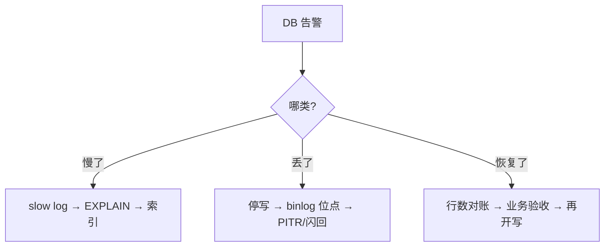

# 05｜备份恢复与慢查询治理 · 练习题

先合上知识点，对着 **一节的主图** 把「一条慢SQL的诊断 + 一次误操作的恢复」口述一遍（发现→EXPLAIN→治→验 / 备份→误操作→binlog→闪回），再来做题。

| 标记 | 含义 |
|------|------|
| **核心** | 不懂整章就没建立起来 |
| **必会** | 值班和面试都要能讲 |
| **常用** | 线上会反复碰到 |
| **常考** | 白板和追问的高频口径 |

## 本题目录

- [Q1 慢查询日志怎么排查](#q1)
- [Q2 EXPLAIN 看哪几列](#q2)
- [Q3 type=ALL 怎么治](#q3)
- [Q4 Using filesort 怎么消除](#q4)
- [Q5 索引为什么失效](#q5)
- [Q6 mysqldump vs xtrabackup](#q6)
- [Q7 备份策略与 RPO/RTO](#q7)
- [Q8 binlog 三种格式](#q8)
- [Q9 误删数据怎么恢复（DELETE）](#q9)
- [Q10 DROP TABLE 怎么恢复](#q10)
- [Q11 PITR 的两个位点](#q11)
- [Q12 binlog 和 redo log 的区别](#q12)
- [Q13 pt-query-digest 怎么治慢 SQL](#q13)
- [Q14 慢了/丢了/恢复了 60 秒定责](#q14)
- [合上书](#合上书)

---

## Q1

**★★★★★｜线上数据库慢，怎么排查慢查询？**

**覆盖**：核心 · 必会 · 常用 · 常考 ｜ **对应**：知识点 [二、发现：慢查询日志](知识点.md)

### 场景

活动高峰接口变慢，DBA 说「CPU 没到瓶颈」，开发说「SQL 没问题之前一直很快」。群里没人知道 slow_query_log 开没开。

### 完整解答

> 🎯 **一句话**：先确认慢查询日志打开了、阈值合理了，再用 pt-query-digest 聚合排序，先治累计影响最大的那条。

慢查询日志默认**关闭**，必须先检查：

```sql
SHOW VARIABLES LIKE 'slow_query%';
SHOW VARIABLES LIKE 'long_query_time';
```

```text
| slow_query_log      | OFF                        |  # ← 默认关着，线上必须 ON
| slow_query_log_file | /var/lib/mysql/slow.log    |
| long_query_time     | 10.000000                  |  # ← 默认 10s 太宽，生产设 1s 或 0.5s
```

线上推荐配置（写到 `my.cnf`）：

```ini
slow_query_log = 1
long_query_time = 1
log_queries_not_using_indexes = 1   # ← 没走索引的也记
```

打开后用 `pt-query-digest` 聚合排序：

```bash
pt-query-digest /var/lib/mysql/slow.log | head -40
```

```text
# Rank Query ID           Response time  Calls R/Call
#    1 0x2A3B4C5D6E7F8A9B 1568.0000 0.0  482   3.25  SELECT player_log
# ← Rank 1 吃掉最多响应时间，先治这条，不是看到哪条慢就改哪条
```

`mysqldumpslow` 也能用但功能弱些：

```bash
mysqldumpslow -s t -t 10 /var/lib/mysql/slow.log
```

```text
Count: 482  Time=3.25s (1568s)  Lock=0.00s  Rows=0.0
  SELECT * FROM player_log WHERE create_time BETWEEN 'S' AND 'S'
# ← 出现 482 次，平均 3.25s，累计 1568s —— 排第一先治
```

> ⚠️ **别混**：`long_query_time` 是**执行时间**阈值，不是锁等待时间。等锁 5s 但执行 0.01s，只要总耗时没超阈值就不记。锁等待看 `performance_schema`。

> 📝 **面试**：问「慢查询怎么排查」，答「先确认日志打开 + 阈值合理 → 用 `pt-query-digest` 聚合按响应时间排序 → 先治 Top 1 → EXPLAIN 诊断 → 治完再验证」。不是一条条看，是按累计影响排序。

### 再追问

**慢查询日志没开怎么办？**——紧急时可以用 `performance_schema.events_statements_summary_by_digest` 看历史执行统计（如果 MySQL 5.7+ 且 `performance_schema` 开着），但不如慢查询日志详细。**长期必须打开**，不开等于裸奔。

**阈值设多少合适？**——核心库 0.5s，普通库 1s。太低日志量爆炸，太高漏掉真正的慢 SQL。配合 `log_queries_not_using_indexes=1` 兜底，没走索引的就算没超时也记。

---

## Q2

**★★★★★｜EXPLAIN 输出重点看哪几列？各代表什么？**

**覆盖**：核心 · 必会 · 常考 ｜ **对应**：知识点 [三、诊断：EXPLAIN与优化](知识点.md)

### 场景

面试让你对着一条 SQL 说 EXPLAIN 怎么看。有人只会看 `key` 有没有值，不知道 `type` 和 `Extra` 的含义。

### 完整解答

> 🎯 **一句话**：重点看四列——`type`（扫描方式）、`key`（实际用的索引）、`rows`（预估扫描行数）、`Extra`（额外代价）。

```sql
EXPLAIN SELECT * FROM player_log WHERE create_time BETWEEN '2026-09-01 00:00:00' AND '2026-09-01 23:59:59';
```

```text
| type | possible_keys | key  | rows   | Extra       |
| ALL  | NULL          | NULL | 850000 | Using where |
# ← type=ALL 全表扫描 · key=NULL 没走索引 · rows=85万行 → 慢的根源
```

**type（连接类型）** 从好到坏：

```text
const  >  eq_ref  >  ref  >  range  >  index  >  ALL
 主键/唯一索引等值    索引等值JOIN   非唯一等值   范围扫描   扫描索引树   全表扫描
 ← 从左到右越来越差，ALL 是最差的，必须治
```

- **`type`**：判断扫描方式。`ALL` = 全表扫描，必须加索引；`ref` / `range` = 正常用索引；`const` = 最优。
- **`key`**：实际用的索引。`NULL` = 没走索引。`possible_keys` 是候选索引，`key` 是最终选的那个。
- **`rows`**：预估扫描行数。越大越慢。加索引后应该大幅下降。
- **`Extra`**：额外信息。`Using filesort`（额外排序）和 `Using temporary`（临时表）是危险信号，需优化。`Using index` 是覆盖索引，好事。

> ⚠️ **别混**：`Using index`（在 `Extra` 列）和 `type=index` 是两码事。`Using index` = 覆盖索引，不用回表，好事；`type=index` = 扫描整棵索引树，仍需优化。一个在 Extra 列，一个在 type 列，别混。

> 📝 **面试**：口诀「type 看扫描、key 看索引、rows 看量、Extra 看代价」。看到 `ALL` 就问为什么没走索引，看到 `Using filesort` 就问排序能不能走联合索引。

### 再追问

**`possible_keys` 有值但 `key` 是 NULL 怎么办？**——MySQL 评估后觉得全表扫更快（比如表很小、或者索引选择性差）。看 `rows` 列确认，如果确实扫得少就不用管。但大表上 `possible_keys` 有值却不走，通常是因为**统计信息过期**——跑 `ANALYZE TABLE` 更新统计信息。

**`filtered` 列什么意思？**——过滤后剩余的百分比。100% 说明 WHERE 条件全部命中；11% 说明扫了 85 万行只有 11% 符合条件——说明扫描量远大于结果集，索引或 SQL 需要优化。

---

## Q3

**★★★★★｜EXPLAIN type=ALL 怎么治？加索引后怎么验证？**

**覆盖**：核心 · 必会 · 常用 · 常考 ｜ **对应**：知识点 [三、诊断：EXPLAIN与优化](知识点.md)

### 场景

一条 `SELECT * FROM player_log WHERE create_time BETWEEN ...` 慢了 3 秒，EXPLAIN 发现 `type=ALL`。开发加了索引，但没验证就说「应该快了」。

### 完整解答

> 🎯 **一句话**：`type=ALL` 说明没走索引，加索引后再 EXPLAIN 确认 `type` 改善、`rows` 下降——不验证等于没改。

```sql
-- 加索引前
EXPLAIN SELECT * FROM player_log WHERE create_time BETWEEN '2026-09-01 00:00:00' AND '2026-09-01 23:59:59';
-- type=ALL  key=NULL  rows=850000
```

```text
| type | key  | rows   | Extra       |
| ALL  | NULL | 850000 | Using where |
# ← 全表扫 85 万行，慢的根源
```

加索引：

```sql
ALTER TABLE player_log ADD INDEX idx_create_time (create_time);
```

加索引后再 EXPLAIN：

```sql
EXPLAIN SELECT * FROM player_log WHERE create_time BETWEEN '2026-09-01 00:00:00' AND '2026-09-01 23:59:59';
```

```text
| type  | key               | rows | Extra                 |
| range | idx_create_time   | 8200 | Using index condition |
# ← type=range 走了索引 · rows 从 85万 降到 8200 → 治好了
```

**读法**：`type` 从 `ALL` → `range`（索引范围扫描），`key` 从 `NULL` → `idx_create_time`，`rows` 从 85 万 → 8200——扫描量降了两个数量级，这条慢 SQL 治好了。

> ⚠️ **别混**：加了索引不等于一定走索引。索引可能因为**函数包裹列、隐式类型转换、左模糊、OR 连接、最左前缀不满足**而失效。改完**一定要再 EXPLAIN 验证**，不能凭感觉。

> 📝 **面试**：问「全表扫描怎么优化」，答「EXPLAIN 确认 `type=ALL` → 查原因（没索引就加、有索引就查为什么失效）→ 加索引或改写 SQL → **再 EXPLAIN 验证 type/rows/Extra 改善**」。最后那句验证是区分「做过」和「听说过」的分水岭。

### 再追问

**如果加了索引还是 `type=ALL` 怎么排查？**——五种失效场景逐个查：① 列被函数包裹（`YEAR(create_time)`）；② 隐式类型转换（`player_id='10086'` 传了字符串给 INT 列）；③ LIKE 左模糊（`'%张'`）；④ OR 两边不都有索引；⑤ 联合索引不满足最左前缀。

**大表加索引会不会锁表？**——MySQL 5.6+ 支持**Online DDL**，`ALTER TABLE ... ADD INDEX` 默认不阻塞读写（InnoDB）。但大表加索引仍会消耗 IO 和临时空间，高峰期建议在从库先做或用 `pt-online-schema-change`。

---

## Q4

**★★★★☆｜Using filesort 和 Using temporary 是什么？怎么消除？**

**覆盖**：必会 · 常用 · 常考 ｜ **对应**：知识点 [三、诊断：EXPLAIN与优化](知识点.md)

### 场景

EXPLAIN 看到 `Extra: Using filesort`，开发说「名字里有 filesort 说明用了临时文件排序」，但实际结果集只有几千行，不可能落盘。

### 完整解答

> 🎯 **一句话**：`Using filesort` = 排序没走索引要额外排；`Using temporary` = 要建临时表存中间结果——两者都是危险信号，建联合索引消除。

> 💡 **打个比方**：`Using filesort` 就像你在图书馆找了一摞书后，还得在桌上按出版日期重新排一遍——书越多排得越久。`Using temporary` 更惨，得先搬一张桌子来摆书。

```sql
EXPLAIN SELECT * FROM player_log WHERE player_id = 10086 ORDER BY create_time DESC LIMIT 20;
```

```text
| type | key        | rows   | Extra           |
| ref  | idx_player | 152000 | Using filesort  |
# ← type=ref 走了索引但排序没走索引，要额外排 15 万行
```

问题：`idx_player` 只有 `player_id`，`ORDER BY create_time` 没法走索引顺序，MySQL 要把 15 万行捞出来再排序。

治法：建联合索引 `(player_id, create_time)`，让 `ORDER BY` 走索引顺序：

```sql
ALTER TABLE player_log ADD INDEX idx_player_create (player_id, create_time);

EXPLAIN SELECT * FROM player_log WHERE player_id = 10086 ORDER BY create_time DESC LIMIT 20;
```

```text
| type | key               | Extra |
| ref  | idx_player_create | NULL  |
# ← Extra 变 NULL，排序被索引顺序覆盖，Using filesort 消失
```

> ⚠️ **别混**：`Using filesort` **不一定真的用了临时文件**——小结果集在内存里用 sort buffer 排，只有超过 `sort_buffer_size` 才落盘。名字叫「filesort」不代表一定有磁盘 IO，但它说明排序没有走索引，数据量大时一定有问题。

### 再追问

**`Using temporary` 什么时候出现？**——`GROUP BY`、`DISTINCT`、`UNION` 这些需要临时表暂存中间结果的操作。如果 `GROUP BY` 的列有索引，可以避免临时表。`Using temporary; Using filesort` 同时出现说明查询非常低效——通常是 `GROUP BY` + `ORDER BY` 不同的列且都没有合适索引。

**联合索引的列顺序怎么定？**——等值查询的列在前、范围查询的列在后、排序列紧跟等值列。例：`WHERE player_id=10086 AND create_time BETWEEN ... ORDER BY id DESC` → 索引 `(player_id, create_time, id)`。最左前缀和索引列顺序见 [02-01-02](../../02-中间件与数据库/01-MySQL/02-索引与执行计划/)。

---

## Q5

**★★★★☆｜哪些写法会让索引失效？为什么？**

**覆盖**：必会 · 常考 ｜ **对应**：知识点 [三、诊断：EXPLAIN与优化](知识点.md)

### 场景

开发建了索引但 `type=ALL`，怀疑「MySQL 的索引有 bug」。实际是 SQL 写法导致索引失效。

### 完整解答

> 🎯 **一句话**：任何破坏 B+ 树有序性的操作都会让索引失效——函数包裹列、隐式类型转换、左模糊、OR 有一边无索引、联合索引不满足最左前缀。

五种常见场景：

```sql
-- ① 函数包裹索引列
WHERE YEAR(create_time) = 2026        -- 失效：YEAR() 破坏了有序性
WHERE create_time >= '2026-01-01' AND create_time < '2027-01-01'  -- 改写

-- ② 隐式类型转换
WHERE player_id = '10086'            -- 失效：INT 列传了字符串
WHERE player_id = 10086               -- 改写：传对类型

-- ③ LIKE 左模糊
WHERE name LIKE '%张'                -- 失效：无法定位前缀
WHERE name LIKE '张%'                -- 改写：右模糊可以走索引

-- ④ OR 连接非索引列
WHERE player_id = 10086 OR server_id = 1  -- 失效：server_id 没索引时全走不了
-- 改写：给 server_id 也加索引，或用 UNION ALL

-- ⑤ 联合索引不满足最左前缀
-- 索引 (a, b, c) 只能用于 a / a,b / a,b,c
WHERE b = 1 AND c = 2                -- 失效：少了 a
```

本质：B+ 树按索引列的值**有序排列**，查找靠的是「从根到叶按值范围缩小」。函数包裹列改变了值的排列顺序、隐式转换导致类型不匹配、左模糊无法定位前缀范围、OR 有一边没法走索引就只能全扫、联合索引跳过最左列后面无法继续缩小范围。

> 📝 **面试**：问「索引为什么失效」，别只列举场景，要答到本质——「B+ 树按索引列的值有序排列，任何破坏有序性的操作（函数、类型转换、模糊前缀、OR 不对称、跳过最左列）都让有序查找退化为遍历」。

### 再追问

**`!=` 或 `<>` 会走索引吗？**——通常不走，因为 B+ 树擅长范围和等值匹配，`!=` 意味着「除了这个值以外的所有值」，等于扫大部分数据，MySQL 评估后通常选全表扫更快。改写思路是看能不能转成 `IN` 或 `> / <`。

**`IN` 列表会不会走索引？**——会，`IN` 可以用索引。但 `IN` 列表过长（数百个）时 MySQL 可能放弃索引改全表扫。大 `IN` 考虑用 `JOIN` 临时表替代。

---

## Q6

**★★★★☆｜mysqldump 和 xtrabackup 有什么区别？生产用哪个？**

**覆盖**：必会 · 常用 · 常考 ｜ **对应**：知识点 [四、备份：mysqldump与xtrabackup](知识点.md)

### 场景

新项目要定备份方案。有人提议用 mysqldump 每天跑 cron 就行，有人担心大数据量恢复太慢。

### 完整解答

> 🎯 **一句话**：mysqldump 是逻辑备份（导出 SQL 文本），xtrabackup 是物理备份（拷数据文件）；物理备份恢复快得多，大数据量生产必须用 xtrabackup。

| 对比 | **mysqldump**（逻辑） | **xtrabackup**（物理） |
|------|----------------------|----------------------|
| 备份内容 | SQL 文本（CREATE TABLE + INSERT） | 数据文件（ibd / ibdata） |
| 备份速度 | 慢（SELECT + 写文本） | 快（直接拷文件） |
| 恢复速度 | 慢（重放 SQL） | 快（拷文件 + 应用 redo） |
| 跨版本 | 可跨版本迁移 | 需版本兼容 |
| 增量 | 不支持 | 支持（靠 LSN 判断变化页） |

mysqldump 生产必加两个参数：

```bash
mysqldump --single-transaction --master-data=2 \
  -u root -p game_db > /backup/game_db_20260901.sql
```

```text
-- CHANGE MASTER TO MASTER_LOG_FILE='mysql-bin.000123', MASTER_LOG_POS=154;
# ← --master-data=2 记录了备份时刻的 binlog 位点，PITR 要用
```

- `--single-transaction`：InnoDB MVCC 快照热备份，不锁表。**不加会锁表**。
- `--master-data=2`：把 binlog 位点以注释形式写进文件。

xtrabackup 全量 + 增量：

```bash
# 全量
xtrabackup --backup --target-dir=/backup/full_20260901 -u root -p
# 增量
xtrabackup --backup --target-dir=/backup/incr_12 \
  --incremental-basedir=/backup/full_20260901 -u root -p
```

```text
210901 03:00:15 completed OK!
# ← 出现 completed OK 才算成功
```

> 💡 **打个比方**：mysqldump 像把整本书重新抄一遍——可读性强但慢，恢复时还得一个字一个字写回去。xtrabackup 像直接把硬盘扇区复制一份——快是快，但只能往同款硬盘还原。

> ⚠️ **别混**：**mysqldump 没有增量**。每次都是全量。把 mysqldump 跑成 cron 定时任务不是「增量备份」，只是「定期全量」。增量只有 xtrabackup 这种物理工具能高效做（靠 InnoDB 页的 LSN 判断变化）。

### 再追问

**小库能不能只用 mysqldump？**——能，百 MB 级别的小库 mysqldump 足够，恢复也就几秒。但库大了（GB 级以上）恢复时间指数上升，因为要重放所有 INSERT 语句。经验法则：单库超 10GB 就该上 xtrabackup。

**xtrabackup 恢复怎么操作？**——先 `--prepare`（应用 redo log 让数据文件一致），再 `--copy-back`（拷回数据目录）。prepare 是关键步骤——不 prepare 的文件是崩溃不一致状态，直接拷回去会数据损坏。

---

## Q7

**★★★★☆｜备份策略怎么定？RPO 和 RTO 各是什么？没演练过算有备份吗？**

**覆盖**：必会 · 常用 · 常考 ｜ **对应**：知识点 [四、备份：mysqldump与xtrabackup](知识点.md)

### 场景

面试问备份策略。有人答「每天 mysqldump 一次就够了」。追问 RPO 和 RTO 各是多少，答不上来。

### 完整解答

> 🎯 **一句话**：三层备份——每天全量 + 每 4~6h 增量 + binlog 持续归档；RPO ≈ binlog 归档间隔，RTO 只有演练过才知道，没演练 = 没备份。

生产标准备份策略（三层）：

```text
全量备份（xtrabackup）   每天 03:00 一次   异地保留 7~30 天
增量备份（xtrabackup）   每 4~6h 一次      保留到下次全量
binlog                  持续归档          定期拷到异地
```

- **RPO（Recovery Point Objective，恢复点目标）** = 最多能丢多少数据。全量 + 增量 + binlog 的 RPO ≈ binlog 最后归档间隔，通常 < 5 分钟，不是 0。
- **RTO（Recovery Time Objective，恢复时间目标）** = 多久能恢复服务。物理备份恢复快（拷文件），逻辑备份恢复慢（重放 SQL）。

> ⚠️ **别混**：RPO 衡量**丢数据**（能回放到多久之前），RTO 衡量**停服时间**（多久能恢复）。两者独立——可以 RPO 很小（binlog 没丢）但 RTO 很大（恢复慢），也可以 RTO 很小（有自动化恢复脚本）但 RPO 大（binlog 归档间隔长）。

> 📝 **面试**：问「备份策略」，答「三层：每天全量 + 每 4~6h 增量 + binlog 持续归档。RPO ≈ binlog 归档间隔，RTO 只有演练过才知道。关键一句：**没有演练 = 没有备份**」。问 RPO/RTO 是多少，答「RPO 看 binlog 归档间隔（通常 < 5min），RTO 要做了恢复演练才量得出来」。

### 再追问

**怎样验证备份可用？**——mysqldump 出来的文件 `head` 和 `wc -l` 看非空、有 CREATE 和 INSERT 语句；xtrabackup 出来的目录看有没有 `completed OK` 和 `xtrabackup_checkpoints` 文件。定期做恢复演练——每季度一次，在测试环境恢复一份备份，跑 `SELECT COUNT(*)` 对比。

**异地备份怎么做？**——备份文件拷到另一台机器（`rsync` / `scp` / 对象存储）。本机 cron 产出的备份如果机器死了，备份跟着死——**本机备份不算备份**。主从复制也不等于备份——如果误操作 `DROP TABLE`，从库也会同步执行，两个库一起丢。

---

## Q8

**★★★★☆｜binlog 有哪几种格式？为什么闪回要 ROW？binlog 和 redo log 什么区别？**

**覆盖**：必会 · 常考 ｜ **对应**：知识点 [五、恢复：binlog恢复与闪回](知识点.md)

### 场景

面试问 binlog 格式。有人答「生产用 STATEMENT 省空间」，问闪回能不能做就卡住了。再问 binlog 和 redo log 区别也说不清。

### 完整解答

> 🎯 **一句话**：binlog 有三种格式——STATEMENT / ROW / MIXED，生产必须 ROW，因为闪回依赖行级变化；binlog 在 Server 层，redo log 在 InnoDB 引擎层。

三种格式：

| 格式 | 记录内容 | 闪回 |
|------|---------|------|
| `STATEMENT` | SQL 语句原文 | 不行 |
| `ROW` | 每行变化前后值 | **能** |
| `MIXED` | 混合 | 不够精确 |

```sql
SHOW VARIABLES LIKE 'binlog_format';
SHOW VARIABLES LIKE 'log_bin';
```

```text
| binlog_format | ROW   |  # ← 生产必须 ROW
| log_bin       | ON    |  # ← binlog 总开关
```

为什么闪回要 ROW：`STATEMENT` 只记 `DELETE FROM t WHERE id > 100` 这条 SQL，闪回工具无法知道具体删了哪些行（因为条件可能和时间相关）；`ROW` 记录了每一行的变化前后值（`DELETE` 记录删除前的完整行值，`UPDATE` 记录前后两份值），binlog2sql 据此生成反向 SQL——`DELETE` 反转成 `INSERT`，`INSERT` 反转成 `DELETE`。

> ⚠️ **别混**：binlog 和 redo log 不是一回事。binlog 在 **Server 层**，记录所有引擎的写操作（DDL + DML），用于复制和恢复；**redo log（重做日志）** 在 **InnoDB 引擎层**，记录数据页的物理修改，用于 crash recovery（掉电后恢复已提交事务）。崩溃恢复时先重放 redo log 恢复数据页，再从 binlog 的位点继续。存储引擎与日志见 [02-01-01](../../02-中间件与数据库/01-MySQL/01-架构与存储引擎/)。

### 再追问

**STATEMENT 有什么问题？**——`NOW()`、`UUID()`、`RAND()` 这类函数在从库重放时结果可能和主库不一致（因为时间不同）。`LIMIT` 没有 `ORDER BY` 时行的顺序也不确定。ROW 格式没有这些问题——每行变化是确定性的。

**ROW 格式日志很大怎么办？**——确实比 STATEMENT 大，但磁盘成本远低于数据丢失风险。可以配 `binlog_row_image=MINIMAL`（只记录变化列而非全行）减小日志体积。生产取舍永远是**可靠性 > 空间**。

---

## Q9

**★★★★★｜DELETE 误删数据怎么恢复？什么是闪回？**

**覆盖**：核心 · 必会 · 常用 · 常考 ｜ **对应**：知识点 [五、恢复：binlog恢复与闪回](知识点.md)

### 场景

凌晨有人执行 `DELETE FROM user WHERE 1=1` 忘了限流。binlog_format=ROW，有全量备份。开发问要不要恢复全量。

### 完整解答

> 🎯 **一句话**：DELETE 误删用 binlog2sql 闪回——从 binlog 生成反向 INSERT，精准回滚，不需要全量恢复。

**闪回（flashback）** = 用 binlog 生成反向 SQL，直接抵消误操作。比 PITR 快得多。

**binlog2sql** 从 binlog 解析出原始 SQL，用 `-B` 参数生成反向 SQL：

```bash
# 第一步：找到误操作的 binlog 位点
mysqlbinlog --base64-output=DECODE-ROWS -v /var/lib/mysql/mysql-bin.000124 | grep -n 'DELETE FROM'
```

```text
1232: DELETE FROM `game_db`.`user` /* generated by server */
# ← 找到误操作的大致位置
```

```bash
# 第二步：用 binlog2sql 生成反向 SQL
python3 binlog2sql.py -h127.0.0.1 -P3306 -uroot -p \
  --start-file='mysql-bin.000124' \
  --start-position=8200 --stop-position=8400 \
  -B
```

```text
INSERT INTO `game_db`.`user`(`id`,`name`,`level`,`create_time`) VALUES (1, 'player1', 50, '2026-08-15 10:00:00');
INSERT INTO `game_db`.`user`(`id`,`name`,`level`,`create_time`) VALUES (2, 'player2', 80, '2026-08-20 14:00:00');
# ← -B 模式把 DELETE 反转成 INSERT，每行都带完整字段值
```

```bash
# 第三步：审核反向 SQL 后执行
mysql -u root -p game_db < /tmp/rollback.sql
# ← 数据恢复完成，无需全量恢复
```

> 💡 **打个比方**：PITR 像把整个仓库回滚到昨天的状态——先搬空再重建，慢但彻底。闪回像只撤销你手滑放错的那一箱货——精准、快，但前提是 binlog 记录了每行变化（ROW 格式）。

闪回前提条件：① `binlog_format=ROW`；② binlog 文件还在（没被 `PURGE` 掉）；③ 发现误操作后立即停写，防止新数据覆盖。

> ⚠️ **别混**：闪回 ≠ PITR。闪回是**精准回滚几条 SQL**（快，只对 DML），PITR 是**恢复到某个时间点**（慢，需全量恢复 + binlog 回放）。闪回和 PITR 的选择看误操作类型——DELETE/UPDATE 用闪回，DROP/TRUNCATE 用 PITR。

### 再追问

**binlog 文件已经被 PURGE 了怎么办？**——闪回做不了。只能走 PITR：全量恢复（恢复到备份时刻）+ 从备份位点开始的 binlog 回放。如果 binlog 也被清了，只能恢复到全量备份那一刻，丢失备份后的所有数据。**所以发现误操作后第一件事是停写 + 备份当前 binlog**。

**DELETE 无 WHERE（删了百万行）闪回可行吗？**——技术上可行，binlog2sql 会逐行生成 INSERT。但百万行的反向 SQL 文件可能几百 MB，执行很慢。这种情况下评估 PITR 是否更快（物理备份恢复可能只需几分钟）。

---

## Q10

**★★★★☆｜DROP TABLE 误删表怎么恢复？能用 binlog2sql 吗？**

**覆盖**：必会 · 常用 · 常考 ｜ **对应**：知识点 [五、恢复：binlog恢复与闪回](知识点.md)

### 场景

有人执行了 `DROP TABLE player_log`，准备用 binlog2sql 闪回。开发说「binlog 里应该有记录吧」。

### 完整解答

> 🎯 **一句话**：DROP TABLE 是 DDL，binlog 里不是行级变化，binlog2sql 对 DDL 无效——只能走 PITR：全量恢复 + binlog 回放到 DROP 前。

闪回对 DDL 无效的原因：`DROP TABLE` 在 binlog 里记录的是一条 DDL 语句（`DROP TABLE player_log`），不是每行的变化值。binlog2sql 靠行级变化（`DELETE` 的 `before_image`）生成反向 SQL，DDL 没有行级 before/after image，无法反转。

| 误操作 | 能否闪回 | 恢复方式 |
|--------|---------|---------|
| `DELETE FROM t WHERE ...` | 能 | binlog2sql 生成反向 INSERT |
| `UPDATE t SET ...` | 能 | binlog2sql 生成反向 UPDATE |
| `DROP TABLE` | **不能** | PITR：全量恢复 + binlog 回放 |
| `TRUNCATE TABLE` | **不能** | PITR：全量恢复 + binlog 回放 |

PITR 恢复 DROP TABLE 的流程：

```bash
# Step 1: 查备份文件里的 binlog 起点
head -20 /backup/game_db_20260901.sql | grep 'CHANGE MASTER'
```

```text
-- CHANGE MASTER TO MASTER_LOG_FILE='mysql-bin.000123', MASTER_LOG_POS=154;
# ← 全量备份时刻的起点
```

```bash
# Step 2: 找 DROP TABLE 的位点
mysqlbinlog --base64-output=DECODE-ROWS -v /var/lib/mysql/mysql-bin.000124 | grep -n 'DROP TABLE'
```

```text
1232: DROP TABLE `player_log`
# ← 误操作在 pos=8200 处
```

```bash
# Step 3: 全量恢复 + binlog 回放到 DROP 前
mysql -u root -p game_db < /backup/game_db_20260901.sql    # 先恢复全量
mysqlbinlog --start-position=154 --stop-position=8200 \
  /var/lib/mysql/mysql-bin.000123 /var/lib/mysql/mysql-bin.000124 \
  | mysql -u root -p game_db                              # 再回放 binlog 到 DROP 前
# ← 数据恢复到 DROP 之前的那一刻
```

> ⚠️ **别混**：PITR 不是从 binlog 文件**开头**开始回放——全量备份已经包含到备份那一刻的数据，binlog 只补备份之后的增量变化。从 `--master-data=2` 记录的位点开始，到误操作前的位点结束，是两个精确的位点。

### 再追问

**TRUNCATE 和 DROP 有什么区别？**——`TRUNCATE` 清空数据但保留表结构（更快、不可回滚）；`DROP` 删除表结构和数据。两者都是 DDL，binlog 里都是语句级记录，闪回都无效，都要走 PITR。

**如果全量备份到 DROP 之间有很长的 binlog 怎么办？**——回放时间长是 PITR 的代价。可以优化：用 `mysqlbinlog` 的 `--database` 参数只回放涉及的库，减少无关 SQL 的回放。或者用 xtrabackup 的增量备份先恢复到更近的时间点，减少 binlog 回放量。

---

## Q11

**★★★★☆｜PITR 的两个位点是什么？从哪到哪回放？**

**覆盖**：必会 · 常用 ｜ **对应**：知识点 [五、恢复：binlog恢复与闪回](知识点.md)

### 场景

面试让你讲 PITR 的原理和步骤。有人说不清从哪个位点开始回放，有人想从 binlog 文件开头开始。

### 完整解答

> 🎯 **一句话**：起点 = 全量备份记录的 binlog 位点（`--master-data=2` 给的），终点 = 误操作前的 binlog 位点——两步合起来恢复到时间点。

PITR（Point-in-Time Recovery）分两步：


**读图**：PITR 的关键是两个位点——全量备份的 binlog 起点，和误操作前的 binlog 终点。mysqlbinlog 把这段 binlog 转成 SQL 回放回去，数据就恢复到误操作前那一刻。

```bash
# 起点：来自全量备份文件的 --master-data=2
head -20 /backup/game_db_20260901.sql | grep 'CHANGE MASTER'
```

```text
-- CHANGE MASTER TO MASTER_LOG_FILE='mysql-bin.000123', MASTER_LOG_POS=154
# ← 起点：备份时刻 binlog 在 000123 的 pos=154
```

```bash
# 终点：误操作前
mysqlbinlog --base64-output=DECODE-ROWS -v /var/lib/mysql/mysql-bin.000124 | grep -n 'DROP\|DELETE'
```

```text
1232: # at 8200
1233: DROP TABLE `player_log`
# ← 终点：误操作在 000124 的 pos=8200，回放到 8199 为止
```

```bash
# 回放：从起点到终点
mysqlbinlog --start-position=154 --stop-position=8200 \
  /var/lib/mysql/mysql-bin.000123 /var/lib/mysql/mysql-bin.000124 \
  | mysql -u root -p game_db
```

> ⚠️ **别混**：不是从 binlog 文件开头回放——全量备份已经包含到备份那一刻的数据，binlog 只补备份之后的增量变化。从 `--master-data=2` 记录的位点开始到误操作前的位点结束，如果从 binlog 文件开头回放，等于把备份前的操作重做一遍，会报错或重复。

> 📝 **面试**：问「PITR 怎么做」，答「两个位点：起点 = 全量备份记录的 binlog 位点，终点 = 误操作前的位点。先恢复全量备份，再用 `mysqlbinlog --start-position=起点 --stop-position=终点` 回放到误操作前。核心是**不从头回放**——全量备份已经覆盖到备份那一刻，binlog 只补增量」。

### 再追问

**跨多个 binlog 文件怎么回放？**——`mysqlbinlog` 支持多个文件参数，按顺序传：`mysqlbinlog mysql-bin.000123 mysql-bin.000124 | mysql ...`。中间文件用完整回放（不指定 `--start-position` / `--stop-position`），只在第一个文件指定 start、最后一个文件指定 stop。

**怎么精确找到误操作前的位点？**——用 `SHOW BINLOG EVENTS IN 'mysql-bin.000124'` 查看事件列表，找到误操作那条的 `End_log_pos`，那就是它的位点。或者用 `mysqlbinlog --base64-output=DECODE-ROWS -v` 解码后 `grep`。**务必在停写状态下操作**，防止新事务改位点。

---

## Q12

**★★★☆☆｜binlog 和 redo log 有什么区别？crash recovery 时谁先谁后？**

**覆盖**：必会 · 常考 ｜ **对应**：知识点 [五、恢复：binlog恢复与闪回](知识点.md)

### 场景

面试高频八股。有人答「都是日志」，追问区别和 crash recovery 顺序就混了。

### 完整解答

> 🎯 **一句话**：binlog 在 Server 层记录所有写操作（用于复制和恢复），redo log 在 InnoDB 引擎层记录数据页物理修改（用于 crash recovery）——先重放 redo log 恢复数据页，再从 binlog 位点继续。

| | **binlog** | **redo log** |
|---|---|---|
| 所属层级 | Server 层 | InnoDB 引擎层 |
| 记录内容 | 已提交的写操作（DDL + DML） | 数据页的物理修改（哪个页改了什么） |
| 用途 | 主从复制 + 数据恢复 | crash recovery（掉电后恢复已提交事务） |
| 格式 | STATEMENT / ROW / MIXED | 物理日志（页级别） |
| 写入时机 | 事务提交时 | 事务执行过程中持续写入 |

crash recovery 顺序：

```text
① 崩溃后启动 → 先重放 redo log → InnoDB 数据页恢复到崩溃前已提交的状态
② 再从 binlog 的最后提交位点继续 → 保证从库和主库一致
```

> ⚠️ **别混**：redo log 保证**单机不丢已提交事务**（掉电后能恢复），binlog 保证**复制和恢复**（主从一致 + PITR）。redo log 是物理的（记录页级别变化），binlog 是逻辑的（记录 SQL 或行变化）。存储引擎与日志体系见 [02-01-01](../../02-中间件与数据库/01-MySQL/01-架构与存储引擎/)。

### 再追问

**两阶段提交是什么？**——MySQL 保证 binlog 和 redo log 一致的机制：① InnoDB 先写 redo log（prepare 状态）；② 写 binlog；③ 提交 redo log（commit 状态）。如果崩溃在②之前，redo log 没 commit，事务回滚；如果在②之后，binlog 已写，从库能收到，redo log 会重放后 commit。保证「主库提交的事务从库一定能收到」。

**redo log 满了怎么办？**——`innodb_flush_log_at_trx_commit=1` 时每次提交都刷盘，最安全但 IO 压力大。redo log 文件固定大小（`innodb_log_file_size`），循环使用——满了就触发 checkpoint 强制刷脏页。如果 redo log 太小，checkpoint 频繁导致性能波动。一般设为 1~4GB。

---

## Q13

**★★★★☆｜慢查询日志一堆，pt-query-digest 怎么排优先级？**

**覆盖**：必会 · 常用 ｜ **对应**：知识点 [二、发现：慢查询日志](知识点.md)

### 场景

`slow.log` 一夜 80GB。有人要逐条 `EXPLAIN`，有人要全加索引。

### 完整解答

> 🎯 **一句话**：**先聚合再 EXPLAIN**——按总耗时（`Query_time × 次数`）排序，治前 3 条占 80% 的 SQL。

```bash
pt-query-digest /var/log/mysql/slow.log --limit 10 --order-by Query_time:sum
# Rank Query ID           Response time  Calls  R/Call
# ==== ================== ============== ====== ======
#    1 0xABC...           45000s         12000  3.75s   ← 先治这条
```

```text
① digest 聚合 → 按总耗时排序
② 取 Top N → EXPLAIN + SHOW INDEX
③ 改索引/SQL → 再 EXPLAIN 验证
④ 上线后对比 slow log 同 Query ID 是否消失
```

**不要**按单次最慢治——低频 30 秒一次不如高频 0.5 秒 × 10 万次。**不要**没验证就关 slow log。

### 再追问

**生产能一直开 slow log 吗？**——可以，设 `long_query_time=0.5~1s` + 日志轮转；或用 `performance_schema` 采样。活动前临时调低阈值。

---

## Q14

**★★★★★｜「慢了 / 丢了 / 恢复了」三类告警，60 秒怎么分？**

**覆盖**：核心 · 必会 · 🔧 ｜ **对应**：知识点 [六、作战：定责（慢了/丢了/恢复了）](知识点.md)

### 场景

同时来三条：① P99 变慢 ② 运营说数据没了 ③ DBA 说备份恢复完了。

### 完整解答

> 🎯 **一句话**：**慢 → EXPLAIN 链；丢 → 停写 + 位点；恢复 → 对账别急着开服**——三条路径不要搅在一起。



```text
0–10s   分类：慢/丢/恢复完成
10–30s  慢：EXPLAIN；丢：误操作类型 DELETE vs DROP
30–45s  丢：PITR 两点位；慢：是否规格/锁不是索引
45–60s  恢复：对账最大 ID，未对账不开写
```

> ⚠️ **别混**：备份 restore 完≠可以开服——必须对账充值流水、道具数量。**不要**恢复过程中继续写入。

### 再追问

**DELETE 和 DROP 恢复手段差在哪？**——DELETE 可 binlog 闪回/PITR；DROP 只能 PITR 到误操作前位点。

---

## 合上书

对齐知识点「合上书」，逐条口述，卡住就回对应节：

- [ ] **默画一节的图**：两条线——慢SQL线（发现→EXPLAIN→治→验）和误操作恢复线（备份→误操作→binlog→闪回/PITR），说清交叉点是 binlog。（Q1~Q12 全覆盖）
- [ ] **口述发现**：slow_query_log 默认关着、long_query_time 设多少、mysqldumpslow / pt-query-digest 怎么聚合排序、先治哪条。（Q1）
- [ ] **口述诊断**：EXPLAIN 看哪四列、type 从好到坏的顺序、ALL 怎么治、Using filesort / Using temporary 各是什么、Using index 和 type=index 的区别。（Q2 · Q4）
- [ ] **口述索引失效**：五种常见场景（函数包裹 / 隐式转换 / 左模糊 / OR / 最左前缀不满足），本质是破坏 B+ 树有序性。（Q5）
- [ ] **默画收束清单**：慢SQL诊断五步（日志→聚合→EXPLAIN→索引→验证），说清为什么改完必须再 EXPLAIN。（Q3）
- [ ] **口述备份**：mysqldump vs xtrabackup（逻辑 vs 物理）、--single-transaction 不锁表原理、增量备份靠 LSN、三层备份策略。（Q6 · Q7）
- [ ] **口述 RPO/RTO**：RPO 丢多少数据、RTO 多久恢复、两者独立、为什么没演练等于没备份。（Q7）
- [ ] **口述 binlog**：binlog 在 Server 层、三种格式、为什么闪回要 ROW、binlog 和 redo log 的区别、crash recovery 顺序。（Q8 · Q12）
- [ ] **口述 PITR**：两个位点是什么、恢复步骤（全量恢复 + binlog 回放）、从哪个位点开始回放、跨多个 binlog 文件怎么办。（Q11）
- [ ] **口述闪回**：binlog2sql 生成反向 SQL 原理、DELETE 能闪回 DROP 不能、闪回和 PITR 的区别、前提条件。（Q9 · Q10）
- [ ] **口述误操作分类**：DELETE/UPDATE 能闪回、DROP/TRUNCATE 只能 PITR、发现后第一件事是停写、误操作对照表。（Q9 · Q10）
- [ ] **定责**：决策树两个入口（慢了/丢了）；60 秒剧本每步敲什么。
