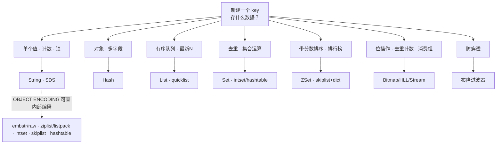
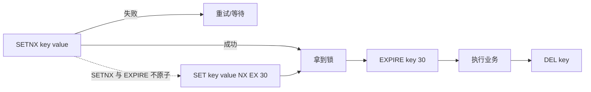
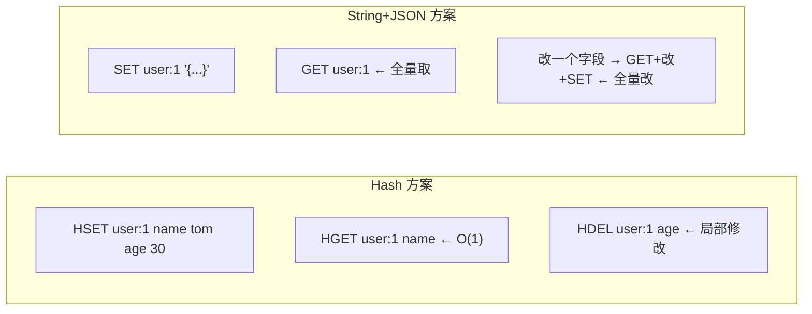
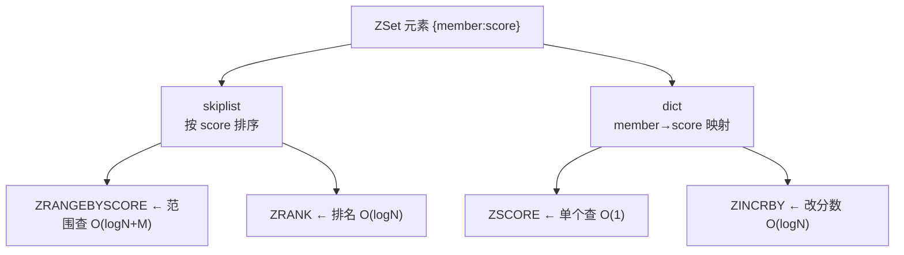
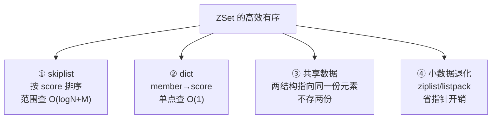
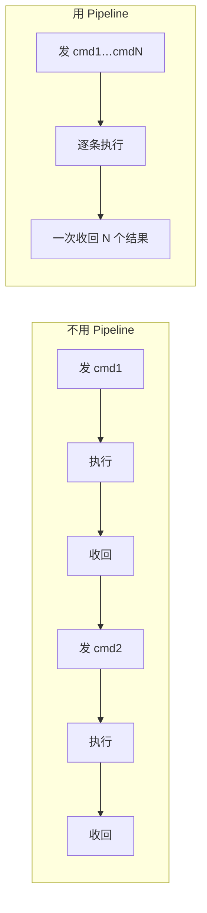
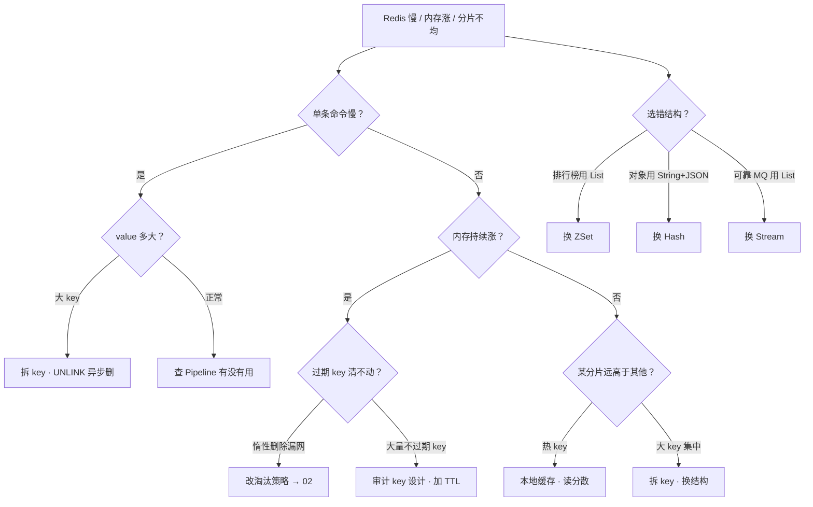

# 数据结构与使用场景

> 排行榜用 List 存，翻页越翻越慢；Hash 存用户却每次 `HGETALL` 拉全量；签到用 Set 存了一年内存翻倍——群里已经有人喊「先扩内存、再调淘汰」。
> **本章回答**：一个 key 从出生起该选什么结构、每种结构适合什么场景、选错了怎么一眼定责。
> **不讲**：RDB/AOF 与内存淘汰 → [02](../02-持久化与内存管理/)；主从/哨兵/集群 → [03](../03-高可用与集群/)；缓存穿透/击穿/雪崩与一致性 → [04](../04-缓存架构/)。

**标记**：🎯重点 · 🔥难点 · ⭐常考 · 🔧实操

---

## 一、一张图：一个 key 的出生与选型

> 🎯 **一句话**：key 出生第一问是「存什么数据」，不是「哪个快」。



- 📖 **读图**
  - 主线是一个 key 的选型决策——先看数据形态（单个值/对象/队列/集合/有序/特殊），每种形态对应一个数据结构，没有重叠
  - 虚线那条提示：选完之后可以用 `OBJECT ENCODING` 查 Redis 实际给你用了哪种内部编码，小数据走紧凑编码、大数据自动切高效率编码，切换阈值在数字墙里

> 本节对应练习题 **Q13**（整张选型树的综合题；各结构细节在后面各节对应的题里练）。

---

## 二、String（SDS）：key 的第一形态

> 🎯 **一句话**：String 是 Redis 最基础的类型，底层用 SDS 而非 C 字符串。

### 🧵 SDS 不是 C 字符串 🔥

**SDS（Simple Dynamic String）** = 在原始字符串数据前面加一个头部结构（`len`、`alloc`/`flags` 等），记录长度和容量。它解决了 C 字符串的四个痛点：

> 💡 **打个比方**：C 字符串像没拉链的布袋，想知道装了多少得一个个数（`strlen` 是 O(n)）；SDS 在袋口贴了张标签写着「这里有 3 件」，看一眼就知道（O(1)）。而且袋子还能预扩容，往里再塞东西不用每次都换新袋子。

```text
struct sdshdr {
    len    : 已用长度        ← O(1) strlen
    alloc  : 分配总长度      ← 空间预分配，减少 realloc 次数
    flags  : sdshdr 类型(5/8/16/32/64)  ← 按字符串大小选最小头部
    buf[]  : 实际数据        ← 二进制安全（可存 \0）
}
```

- 🔑 **SDS 四个关键优势**
  - `strlen` O(1)
  - **二进制安全**（可含 `\0`）
  - **空间预分配**（少 realloc）
  - **惰性空间释放**（缩短不立刻回收）

String 有三种内部编码——`OBJECT ENCODING` 可查 🔧：

```bash
SET name "tom"
OBJECT ENCODING name
# embstr   ← 短字符串（≤44 字节），SDS 和对象头一次分配
SET longstr $(python3 -c "print('x'*200)")
OBJECT ENCODING longstr
# raw      ← 长字符串，SDS 和对象头分开分配
SET count 100
OBJECT ENCODING count
# int      ← 能转 long 的数字，直接存整数
```

### 计数器、缓存与 Session ⭐

String 天生适合三个场景：

- **计数器**：`INCR` / `INCRBY` / `DECR`，原子操作，不用先读再写。
- **缓存**：`SET key value EX 300`，简单 KV 缓存。
- **Session**：`SET session:token '{"uid":1}' EX 1800`，带过期。

```bash
INCR article:1001:reads
# (integer) 1      ← 返回自增后的值，原子操作
INCRBY article:1001:reads 10
# (integer) 11
GET article:1001:reads
# "11"             ← 计数器存的是 SDS 的 int 编码
```

### 🔐 分布式锁：从 SETNX 到 SET NX EX ⭐🔧

#### ❓ 为什么不是 SETNX + EXPIRE？

- ❌ **SETNX 再 EXPIRE**：两条命令之间进程崩溃 → 锁永不过期（死锁）
- ✅ **`SET key value NX EX 30`**：加锁 + 过期一条原子命令
- 🔑 **value 必须唯一**（UUID）：解锁用 Lua「值匹配才 DEL」，防误删别人的锁
- ⚠️ 单点 Redis 锁在网络分区下仍可能双持有；集群场景才谈 Redlock（多数派）

**分布式锁** = 多进程互斥访问临界资源。经典路线与原子写法对照：



- 📖 **读图**
  - 上线：`SETNX`→`EXPIRE` 中间崩溃 → 锁永不释放
  - 虚线：`SET ... NX EX` 把「不存在才设」和「过期」合成一条原子命令

```bash
SET lock:order:1001 "uuid-abc" NX EX 30
# OK          ← 拿到锁
SET lock:order:1001 "uuid-abc" NX EX 30
# (nil)        ← 锁已被占
```

解锁用 Lua 保证「值匹配才 DEL」原子性：

```lua
if redis.call("GET", KEYS[1]) == ARGV[1] then
    return redis.call("DEL", KEYS[1])
else
    return 0
end
```

> ⚠️ **别混**：`SETNX` 不能带过期；答锁只说 `SETNX` 是高频错答——标准是 `SET key value NX EX seconds`。

> 📝 **面试**：① `SET NX EX` 原子加锁+过期；② value=UUID 防误删；③ Lua check+del 解锁；④ 集群 Redlock 多数派。补一句：网络分区下仍可能双持有，锁不是银弹。

> 🔍 **现场**：

```bash
SET lock:test "uuid-001" NX EX 10
# OK
TTL lock:test
# (integer) 10   ← 确认过期已设上
```

> 本节对应练习题 **Q1、Q2**。

---

## 三、Hash：把对象拍扁存

> 🎯 **一句话**：Hash 存对象天然省内存又按字段操作，别把 JSON 序列化塞 String。

### ziplist/listpack 与 hashtable 的切换 ⭐

Hash 有两种内部编码，数据小走紧凑、数据大自动切高效：

- **ziplist（Redis < 7.0）/ listpack（Redis ≥ 7.0）**：一块连续内存，紧凑省空间，但遍历 O(n)。适合字段少且值短的 Hash。
- **hashtable**：标准哈希表，O(1) 查找，内存开销大。

切换阈值（Redis 7.0+ 参数名改了 listpack）：

```text
hash-max-ziplist-entries  128  /  hash-max-listpack-entries  128   ← 字段数超此 → hashtable
hash-max-ziplist-value     64  /  hash-max-listpack-value    64    ← 任一值超此 → hashtable
```

```bash
HSET user:1 name "tom" age 30
OBJECT ENCODING user:1
# listpack              ← 字段少、值短 → 紧凑编码
HSET user:1 bio $(python3 -c "print('x'*200)")
OBJECT ENCODING user:1
# hashtable             ← 有字段值超 64 字节 → 切 hashtable
```

### 对象存储：Hash vs String 序列化



- 📖 **读图**
  - 存对象时 Hash 方案按字段读写，局部修改不碰其他字段
  - String+JSON 方案改一个字段要 GET 全量 → 改 → SET 全量，大对象开销大

> ⚠️ **别混**：Hash 不适合所有「对象」。字段数特别多（>512）或值特别大时切了 hashtable，内存反而比序列化大。小对象两者差不多，但 Hash 胜在**局部修改**。

> 📝 **面试**：① 常改单字段 → Hash；② 整对象读写 → String+JSON；③ 别 `HGETALL` 拉大 Hash（等于全量，易成大 key）。没有「永远用谁」——看改单字段多还是整读多。⭐

> 本节对应练习题 **Q3**。

---

## 四、List（quicklist）：有序队列

> 🎯 **一句话**：List 的底层是 quicklist——链表套紧凑块，兼顾两边操作的高效和内存紧凑。

### quicklist 的结构

**quicklist** = 一个双向链表，每个节点是一个 ziplist/listpack（紧凑的连续内存块）。结合了两者的优点：链表的两端操作 O(1) + 紧凑块的省内存。


- 📖 **读图**
  - 两端进/出 O(1)；节点内 listpack 连续内存、不存指针
  - 这是 `LPUSH`/`RPOP` 做队列的基础

```bash
LPUSH msg:q "hello" "world"
# (integer) 2
RPOP msg:q
# "hello"              ← 右端弹出
OBJECT ENCODING msg:q
# quicklist
```

### 消息队列与最新 N

`LPUSH` 入队、`RPOP` 出队（FIFO）；`BRPOP` 阻塞等，少空轮询。最新 N：`LPUSH` + `LTRIM list 0 N-1`。

```bash
BRPOP msg:q 5
# 1) "msg:q"  2) "world"   ← 最多堵 5s，有数据立即返回
LPUSH latest:log "log-line-1"
LTRIM latest:log 0 99
# OK                       ← 只留前 100 条
```

#### ❓ 为什么 List 不能当可靠 MQ？

- 💥 `RPOP`/`BRPOP` **弹出即丢**：消费者崩了，消息回不来
- ✅ Stream：`XREADGROUP` + `XACK`；未确认可 `XPENDING`/`XCLAIM` 转交
- 👉 丢了能补（日志、最新 N）→ List；要确认投递 → Stream（七节）

> ⚠️ **别混**：把 List 当可靠 MQ 是最常见误用——可靠投递用 Stream。

> 本节对应练习题 **Q4**。

---

## 五、Set（intset/hashtable）：去重与集合运算

> 🎯 **一句话**：Set 存不重复元素，全整数时走 intset 省内存，集合运算是它的杀手锏。

### intset 与 hashtable 切换 ⭐

Set 有两种内部编码：

- **intset**：所有元素都是整数且数量 ≤ `set-max-intset-entries`（默认 512），用有序整数数组存，极省内存。
- **hashtable**：有非整数元素或数量超阈值，切回哈希表。

```bash
SADD tags "redis" "mysql" "go"
OBJECT ENCODING tags
# hashtable            ← 有字符串元素 → hashtable
SADD ids 1 2 3
OBJECT ENCODING ids
# intset               ← 全是整数 → intset
SADD ids 4 5 ... 600   ← 超过 512 个
OBJECT ENCODING ids
# hashtable            ← 超阈值 → 切 hashtable
```

### 共同好友、标签

Set 的集合运算是 `SINTER`（交集）、`SUNION`（并集）、`SDIFF`（差集），直接算多集合关系：

```bash
SADD friends:u1 alice bob charlie
SADD friends:u2 bob charlie david
SINTER friends:u1 friends:u2
# 1) "bob"
# 2) "charlie"         ← 共同好友：交集
SISMEMBER friends:u1 alice
# (integer) 1          ← 判断元素是否存在，O(1)
```

> 📝 **面试**：问「共同好友怎么做」，答：每个用户的好友列表存一个 Set，`SINTER` 取交集。补一句：如果 Set 特别大（万人好友），`SINTER` 也可能慢，可以用 `SINTERSTORE` 把结果存到另一个 key。

> 本节对应练习题 **Q5**。

---

## 六、ZSet（skiplist+dict）：带分数的有序集合

> 🎯 **一句话**：ZSet 是 Redis 最精巧的结构——skiplist 管有序、dict 管 O(1) 查找，两管齐下。

### 🎿 skiplist + dict 为什么双管齐下 🔥

#### ❓ 为什么要两套结构？只用 skiplist 不行吗？

- ❌ **只有 skiplist**：按 member 查 score 也是 O(logN)
- ✅ **再加 dict**：`member → score` 映射 → `ZSCORE` O(1)
- 🔗 两套结构**共享同一份元素指针**，不存两份副本
- ❌ **不是红黑树**：skiplist 实现简单、范围遍历是链表直接走、局部改动友好

**Zset（Sorted Set）** 每个元素带 `score`，大数据走 **skiplist + dict**：

> 💡 **打个比方**：跳表像多层电梯——上层稀疏快筛、底层细走，平均 O(logN)；再加 dict 把 member→score 做成 O(1) 直查。



- 📖 **读图**
  - skiplist 负责「按分数有序」的操作（范围查、排名），dict 负责「按 member 查分数」的操作
  - 两者共享同一份数据（指针指过去），不存两份副本
  - 小数据时都退化为 ziplist/listpack，省掉这两套结构的指针开销

```bash
ZADD rank 100 "alice" 200 "bob" 150 "charlie"
# (integer) 3          ← 添加成员与分数
ZRANGE rank 0 -1 WITHSCORES
# 1) "alice"
# 2) "100"
# 3) "charlie"
# 4) "150"
# 5) "bob"
# 6) "200"             ← 按分数升序返回
ZSCORE rank "bob"
# "200"                ← O(1) 查单个分数（走 dict）
ZRANK rank "bob"
# (integer) 2          ← 排名第 3（0-based），走 skiplist
OBJECT ENCODING rank
# skiplist             ← 大 ZSet 的编码
```

### 排行榜实现

排行榜是 ZSet 的招牌场景：`ZADD` 更新分数、`ZREVRANGE rank 0 9` 取 Top 10（降序）、`ZREVRANGEBYRANK` 分页。

```bash
ZINCRBY rank 50 "alice"
# "150"               ← 原子加分，实时更新排行榜
ZREVRANGE rank 0 9 WITHSCORES
# 1) "bob"
# 2) "200"
# 3) "alice"
# 4) "150"
# 5) "charlie"
# 6) "150"            ← Top 3，降序
```

### 延迟队列

ZSet 做**延迟队列**：score 存「到期时间戳」，消费者 `ZRANGEBYSCORE` 捞到期任务、`ZREM` 删除后执行。

```bash
ZADD delay:q 1693520400 "task-1"   # score = 到期时间戳
ZRANGEBYSCORE delay:q 0 $(date +%s)   # 捞已到期的
# 1) "task-1"
```

### 收束：ZSet 凭什么「有序且高效」⭐



- 📖 **读图**
  - ① 范围/排名走 skiplist；② 单点 `ZSCORE` 走 dict；③ 共享元素指针不存两份；④ 小数据退化 listpack，连两套指针都省

可背清单：

- **按 score 范围**（`ZRANGEBYSCORE`）→ skiplist
- **按 member 查分数**（`ZSCORE`）→ dict
- **改 score**（`ZINCRBY`）→ dict 算新值 + skiplist 调位置
- **按 rank / 排名**（`ZRANGE`/`ZRANK`）→ skiplist

> ⚠️ **别混**：skiplist **期望** O(logN)，不是红黑树——实现简单、范围遍历友好、局部改动友好。别说「ZSet 用了红黑树」。

> 📝 **面试**：小数据 listpack；大数据 skiplist+dict——「skiplist 管有序，dict 管直查」，共享指针。⭐（Q6、Q7）

> 本节对应练习题 **Q6、Q7**。

---

## 七、特殊兵种：Bitmap / HyperLogLog / Stream / 布隆过滤器

> 🎯 **一句话**：特殊场景用特殊结构，别拿 String 硬扛。

### Bitmap：位级操作

Bitmap 本质是 String，但用位操作 `SETBIT`/`GETBIT`/`BITCOUNT`/`BITOP` 实现位级控制。一个 key 理论上能存 2^32 位（512MB），用用户 ID 做偏移量。

```bash
SETBIT sign:202309:uid 5 1   # 用户 5 在 9 月签到
# (integer) 0                 # 旧值是 0
BITCOUNT sign:202309:uid
# (integer) 1                 # 统计签到人数
BITCOUNT sign:202309:uid 0 30 # 统计 ID 0~240 范围内的签到
# (integer) 1
```

典型场景：**签到、在线状态、功能开关**。用 `SETBIT online 12345 1` 标记用户在线，`BITCOUNT online` 统计在线人数。注意大偏移量会产生空洞，key 不能太大。

### HyperLogLog：概率去重计数

**HyperLogLog** 是固定 12KB 内存的概率基数估算结构，标准误差 0.81%，适合**海量去重计数**（UV、IP 数）。

```bash
PFADD page:uv "user-1" "user-2" "user-3"
# (integer) 1               # 至少有一个新元素
PFCOUNT page:uv
# (integer) 3               # 估算去重后的基数
PFMERGE page:total page:uv  # 合并多个 HyperLogLog
# OK
```

> ⚠️ **别混**：HyperLogLog **不存原始元素**，只存估算用的寄存器，所以不能像 Set 那样 `SISMEMBER` 判断某个元素是否存在。它只回答「大约有多少个不同的元素」，不回答「这个元素在不在」。精确去重要用 Set，海量去重且容忍误差用 HyperLogLog。

### Stream：可靠消息队列

**Stream**（5.0+）日志型结构，带消费组：`XGROUP CREATE` → `XREADGROUP` → `XACK`；未确认可 `XPENDING`/`XCLAIM`——List 做不到。

```bash
XADD orders '*' status created amount 100
# "1693520400000-0"        ← 时间戳-序号
XREAD COUNT 2 STREAMS orders 0
# … 返回消息字段 …
```

### 布隆过滤器：防缓存穿透

**布隆过滤器** = 多哈希 + bitmap：可能假阳性，**绝无假阴性**。链路：请求 → 布隆 → 不在直接拦 → 在才查 Redis/DB（穿透细节 → [04](../04-缓存架构/)）。

```bash
BF.ADD filter "user-1"          # RedisBloom 模块
BF.EXISTS filter "user-9999"
# (integer) 0                   ← 一定不在，拦掉
```

> 📝 **面试**：多哈希+bitmap；「说不在一定不在，说在可能误判」；误判率可调；元素通常只加不删。HyperLogLog——只估个数，不存元素。⭐

> 本节对应练习题 **Q8、Q9**。

---

## 八、Pipeline：把往返跑成一趟 🔥

> 🎯 **一句话**：Pipeline 是客户端攒一批命令一次发，服务端依次执行后批量返回，省的是 RTT。

#### ❓ Pipeline 和事务会不会打架？

- 🛤️ **Pipeline**：只省 RTT；服务端仍可能被其他客户端插队 → **不保证原子**
- 🔒 **MULTI/EXEC**：事务队列，中间不被插队（仍非回滚型 ACID）
- 🧪 **Lua**：要把「读结果决定写」做成原子，用脚本
- 👉 **Pipeline 省网，事务保原子，CAS 语义找 Lua**

> 💡 **打个比方**：取 100 件货写一张单一次递进去——省的是跑腿次数（RTT），不是仓库干活时间。



- 📖 **读图**
  - 不用 = N 个 RTT；用 = 1 个 RTT + N 条执行
  - 省的是网，不是 CPU

```bash
(echo -e "SET k1 v1\nSET k2 v2\nSET k3 v3"; sleep 1) | redis-cli --pipe
# OK × N
```

> ⚠️ **别混**：单次别塞数万条（堵其他客户端）；后一条依赖前一条结果时不能用 Pipeline。

> 本节对应练习题 **Q10**。

---

## 九、大 key 与 热 key

> 🎯 **一句话**：大 key 拖慢单条命令、热 key 打挂单个分片——两者都是运维天敌。

### 🐘 大 key 检测 🔧⭐🔥

**大 key** = value 特别大（百万元素 List、10MB String）。危害：单命令堵主线程、集群内存不均、`DEL` 阻塞。

```bash
redis-cli --bigkeys --batch-scan 1000
# Biggest list found '"msg:queue:urgent"' has 150000 items
MEMORY USAGE msg:queue:urgent
# (integer) 12000000    ← 约 12MB
```

处理：① 拆 key；② **`UNLINK` 别 `DEL`**（异步删）；③ 设计时别塞全量进一个 key。

### 🔥 热 key 检测 ⭐

**热 key** = 某 key QPS 远高于其他。危害：单分片 CPU 打满、过期瞬间击穿（→ [04](../04-缓存架构/)）。

```bash
redis-cli --hotkeys          # 需 LFU 淘汰策略
# 1) "config:hot:banner" has factor 120
```

处理：本地缓存；或写多副本 key、随机读。

> 🔍 **现场**：某分片 CPU 远高于其他 → `--hotkeys` + `INFO stats` 看 `instantaneous_ops_per_sec`。

> ⭐ **口诀**：大 key `UNLINK`；热 key 本地缓存 + 读分散——别上来就调槽。

> 本节对应练习题 **Q11、Q14**。

---

## 十、过期策略：惰性删除与定期删除

> 🎯 **一句话**：Redis 过期 key 不会立刻被删——靠惰性删除 + 定期删除两套策略配合，腾不干净就走内存淘汰。

#### ❓ 为什么不「到期立刻删」？和淘汰策略冲突吗？

- 💸 **立刻扫全库**会拖死单线程；惰性 = 访问时查，定期 = 每秒 hz 次抽样
- 🧹 两套配合仍可能漏网 → 内存涨但 `expired_keys` 不涨
- ⚠️ **过期 ≠ 淘汰**：过期管 TTL 到了怎么清；淘汰管 maxmemory 满了踢谁（→ [02](../02-持久化与内存管理/)）——两套旋钮，别混着调

### 惰性删除 🔥

**惰性删除** = 访问时才查过期、过期才删。CPU 友好；大量过期但不被访问的 key 会一直占内存。

```bash
SET temp:key "data" EX 5
# 等 6 秒后
GET temp:key
# (nil)                ← 访问时惰性删
TTL temp:key
# (integer) -2         ← 已过期并删除
```

### 定期删除 🔥

**定期删除** = 每秒 `hz` 次（默认 10）随机抽检带 TTL 的 key；过期比例 >25% 继续抽——补惰性的漏。

> 💡 **打个比方**：惰性像「有人拿货才看保质期」；定期像「每 100ms 随机扫几排」。仍可能漏网 → 货架满了走淘汰（[02](../02-持久化与内存管理/)）。

> ⚠️ **别混**：过期管「TTL 到了怎么清」；淘汰管「maxmemory 满了踢谁」——两套旋钮（见本节 ❓）。

> 📝 **面试**：惰性 + 定期；清不干净才走 LRU/LFU 等淘汰。别把过期和淘汰混为一谈。

```bash
CONFIG GET hz
# 2) "10"
EXPIRE temp:key 30
TTL temp:key
# (integer) 30
PERSIST temp:key
# (integer) 1          ← 取消过期；TTL=-1 永不过期
```

> 本节对应练习题 **Q12**。

---

## 十一、作战：选错了数据结构怎么排障定责 🔧

> 🎯 **一句话**：接到 Redis 慢/内存涨/分片不均，先问「用了什么结构、key 有多大量」，不是先调参数。

### 定责决策树



- 📖 **读图**
  - 第一刀分「单条慢」还是「全局涨」——单条慢往大 key 查，全局涨往过期策略和 key 设计查
  - 选错结构是最底层的原因：排行榜用 List 翻页慢、对象用 String 改字段全量取、可靠 MQ 用 List 丢消息

### 现象 · 先做 · 别做

| 现象 | 先做 | 别做 |
|------|------|------|
| 单条命令卡几百毫秒 | `MEMORY USAGE key` 查大小 | 先调 `hz` / 换淘汰策略 |
| 大 key 被发现 | `UNLINK` 异步删 + 拆 key | `DEL` 大 key（阻塞主线程） |
| 内存持续涨 | 查有没有设 TTL、过期 key 是否太多 | 先扩内存盖住 |
| 某分片 CPU 爆 | `--hotkeys` 查热 key | 先调集群槽 |
| 排行榜翻页慢 | 查是不是用了 List | 加更多内存 |
| 改一个字段拉回全量 | 查是不是 String+JSON 存对象 | 加 Pipeline（不解决根因） |
| List 消息丢 | 换 Stream | 加 BRPOP 超时 |

### 60 秒剧本 🔧

> 🔍 **现场**：接到「Redis 慢/告警」，60 秒走完这条线。

```text
① 0–10s  哪个 key？     redis-cli --bigkeys 快速扫，或 MONITOR 采样 5 秒看高频 key
② 10–30s 有多大？       MEMORY USAGE <key> 看字节数，OBJECT ENCODING 看编码类型
③ 30–45s 结构对不对？    List 存排行榜？ String+JSON 存对象？ List 做 MQ？→ 换结构
④ 45–60s 定责 + 处置：  大 key → UNLINK + 拆；热 key → 本地缓存；结构错 → 改方案
```

> 本节对应练习题 **Q13、Q14**。

---

## 十二、收口

### 命令速查 🔧

```bash
# 查内部编码
OBJECT ENCODING key                    # embstr/raw/int/listpack/quicklist/intset/skiplist/hashtable
# 大 key 扫描
redis-cli --bigkeys                    # 全库扫描找最大的 key
MEMORY USAGE key                        # 单个 key 占多少字节
# 热 key 扫描（需 LFU）
redis-cli --hotkeys                     # 按访问频次排
# 大 key 异步删除
UNLINK bigkey                           # 异步删，不阻塞主线程（vs DEL 同步删）
# 过期相关
EXPIRE key 30                           # 设置 TTL 30 秒
TTL key                                 # 剩余秒数；-1 永不过期；-2 已过期/不存在
PERSIST key                             # 取消过期
# 分布式锁
SET lock:name "uuid" NX EX 30           # 原子加锁 + 过期
# Lua 解锁（check value + del）
# EVAL "if redis.call('GET',KEYS[1])==ARGV[1] then return redis.call('DEL',KEYS[1]) else return 0 end" 1 lock:name "uuid"
# Pipeline
echo -e "SET k1 v1\nSET k2 v2" | redis-cli --pipe  # 批量发
```

### 面试锚点

遮住右列自问自答，卡壳的行回去重读对应小节。

| 问 | 30 秒答 |
|----|---------|
| Redis 有哪些数据结构？ | String/Hash/List/Set/ZSet 五大种 + Bitmap/HyperLogLog/Stream/布隆过滤器 特殊种。 |
| String 底层是什么？ | SDS：带 len/alloc 头部的动态字符串，O(1) strlen、二进制安全、预分配少 realloc。编码分 int/embstr/raw。 |
| 分布式锁怎么实现？ | `SET key value NX EX 30`（原子加锁+过期）；value 唯一防误删；Lua 脚本解锁；集群用 Redlock 多数派。 |
| Hash 底层编码？ | 小数据 ziplist/listpack（紧凑），超阈值（128/64）切 hashtable。存对象按字段操作比 String+JSON 好。 |
| List 底层是什么？ | quicklist：链表套 listpack 节点。两端 O(1)。做消息队列不可靠，要可靠用 Stream。 |
| Set 底层编码？ | 全整数且 ≤512 用 intset（有序数组省内存），否则 hashtable。集合运算 SINTER/SUNION/SDIFF。 |
| ZSet 底层是什么？ | 小数据 ziplist/listpack；大数据 skiplist+dict 双管——skiplist 管有序（范围查/排名），dict 管 O(1) 查分数。不用红黑树因为 skiplist 实现简单、范围遍历友好。 |
| Bitmap 怎么用？ | String 做位操作，SETBIT/BITCOUNT。用户 ID 做偏移量，签到/在线统计。 |
| HyperLogLog 是什么？ | 固定 12KB 概率基数估算，误差 0.81%。不存原始元素，只回答「约多少个不同元素」。UV 统计利器。 |
| Stream 和 List 做 MQ 的区别？ | Stream 有消费组、消息确认（XACK）、可回溯，可靠投递；List BRPOP 弹出即丢，不可靠。 |
| Pipeline 是什么？ | 客户端攒一批命令一次发、批量收，省 RTT。不是事务，不保证原子性，要原子用 MULTI/EXEC 或 Lua。 |
| 大 key 怎么发现和处理？ | `--bigkeys` 扫 / `MEMORY USAGE` 查；处理拆分 + UNLINK 异步删，别 DEL。 |
| 热 key 怎么发现和处理？ | `--hotkeys` 查（需 LFU）；处理本地缓存 + 读分散副本。 |
| 布隆过滤器是什么？ | 多哈希函数 + bitmap，可能假阳性不假阴性。防缓存穿透：不在则一定不在，拦截无效请求。 |
| 过期策略是什么？ | 惰性删除（访问时查）+ 定期删除（每秒 hz 次随机抽检）。≠ 内存淘汰策略（LRU/LFU），后者是内存满了踢人。 |
| skiplist 为什么不用红黑树？ | 实现简单、范围遍历友好（链表直接走）、并发友好（局部锁）。 |

### 易错一句话对照

- SETNX 能带过期 → SETNX 不能带过期，要 `SET NX EX`；SETNX+EXPIRE 不原子
- Pipeline 是事务 → Pipeline 只省 RTT，不保证原子；要原子用 MULTI/EXEC 或 Lua
- ZSet 用红黑树 → 用 skiplist+dict 双管齐下
- HyperLogLog 能查元素在不在 → 不能，只估基数，不存原始元素
- List 做 MQ 很好 → BRPOP 弹出即丢，不可靠；要可靠用 Stream
- Hash 一定比 String 省内存 → 字段少时差不多，字段多了切 hashtable 反而更大
- intset 永远是 intset → 超过 512 个元素或有非整数就切 hashtable
- 大 key 用 DEL 删 → 用 UNLINK 异步删，DEL 大 key 阻塞主线程
- 过期 key 到期立即被删 → 惰性删除可能一直不删，定期删除抽样补漏
- 过期策略就是淘汰策略 → 过期策略管「TTL 到了怎么清」，淘汰策略管「内存满了踢谁」，两套机制
- 布隆过滤器说不在可能在 → 反了：说不在一定不在，说在可能误判
- ziplist 是 List 的底层 → List 底层是 quicklist（链表套 listpack），不是直接 ziplist

### 数字墙

> String 编码：**embstr ≤ 44 字节** · SDS 头 **sdshdr5/8/16/32/64** · Hash 超过 **128** 字段或单值 **64** 字节 → hashtable · Set intset 上限 **512** · ZSet 超过 **128** 元素或单值 **64** 字节 → skiplist+dict · HyperLogLog 固定 **12KB**、误差 **0.81%** · Bitmap 最大 **512MB**（String 上限） · Pipeline 建议 **≤ 10000** 条/批 · `hz` 默认 **10** 次/秒定期删除 · 定期删除过期率阈值 **25%** · 分布式锁过期时间建议 **30s** · Redlock 最少 **5** 节点取 **3** 多数派 · `MEMORY USAGE` 返回**字节**数 · `--bigkeys` 用 `SCAN` 不阻塞

---

## 合上书

- [ ] **默画一张图**：选型决策树——存什么数据 → 选什么结构 → 内部编码怎么切。（对应练习题 Q13）
- [ ] **口述 String**：SDS 比 C 字符串好在哪（四点）、三种编码（int/embstr/raw）、计数器和缓存场景。（Q1）
- [ ] **口述分布式锁**：SETNX 的问题 → `SET NX EX` → value 唯一防误删 → Lua 解锁 → Redlock。（Q2）
- [ ] **口述 Hash**：ziplist/listpack → hashtable 切换阈值、Hash vs String+JSON 存对象的取舍。（Q3）
- [ ] **口述 List**：quicklist 是什么（链表套 listpack）、消息队列的 BRPOP、为什么 List 做不可靠 MQ。（Q4）
- [ ] **口述 Set**：intset → hashtable 切换、共同好友（SINTER）、典型场景。（Q5）
- [ ] **默画 ZSet 收束图**：skiplist 管有序 + dict 管 O(1) 查分数、共享数据不存两份、各操作走哪条路、为什么不用红黑树。（Q6、Q7）
- [ ] **口述特殊兵种**：Bitmap 签到、HyperLogLog 估算 UV（不存原始元素）、Stream 消费组、布隆过滤器防穿透。（Q8、Q9）
- [ ] **口述 Pipeline**：省 RTT 不是省执行时间、不是事务、和 MULTI/EXEC 的区别。（Q10）
- [ ] **口述大 key 与热 key**：怎么发现（`--bigkeys`/`--hotkeys`）、怎么处理（UNLINK 拆 key / 本地缓存读分散）。（Q11、Q14）
- [ ] **口述过期策略**：惰性删除 + 定期删除怎么配合、和内存淘汰策略的区别。（Q12）
- [ ] **定责**：选错结构的典型现象（排行榜用 List 翻页慢、对象用 String 全量改、List 做 MQ 丢消息），各怎么换——现在再看开篇那句「先扩内存」，你知道该怎么拦住他了。（Q13、Q14）

下一章： key 怎么活过重启、内存满了怎么踢人 → [02-持久化与内存管理](../02-持久化与内存管理/)。缓存模式与一致性 → [04](../04-缓存架构/)。
