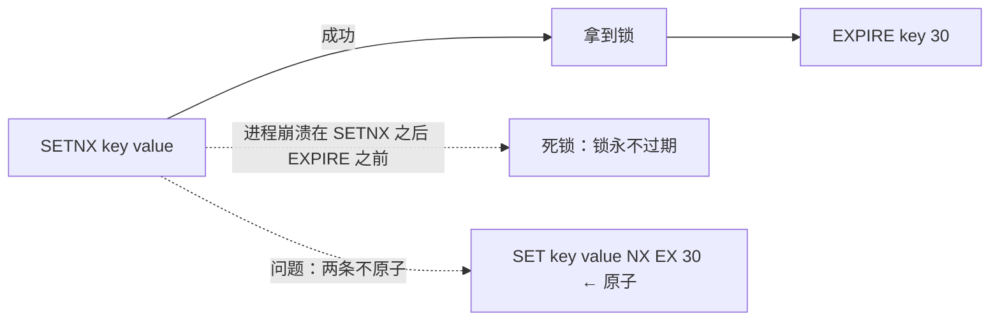
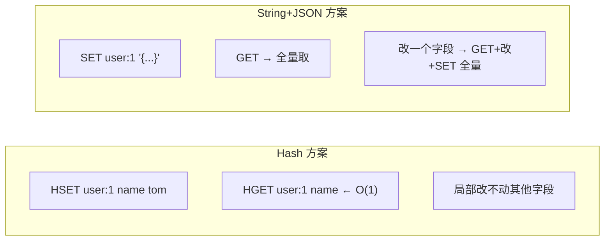
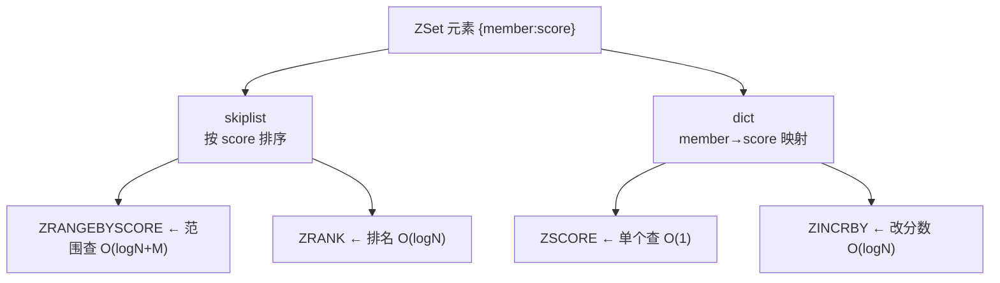
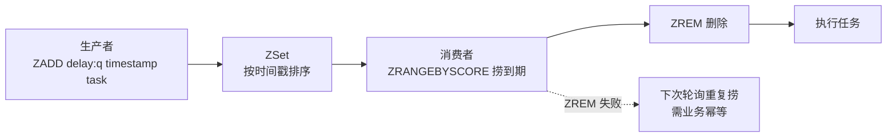
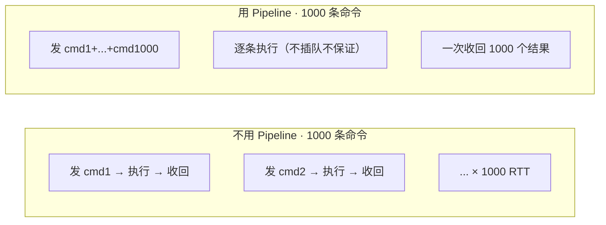
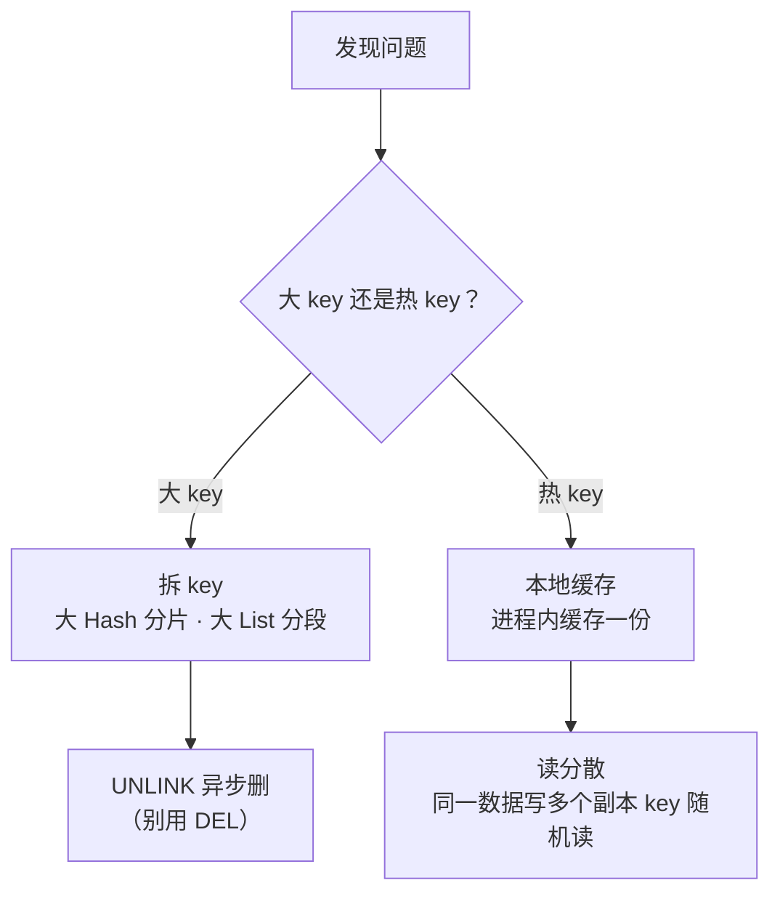
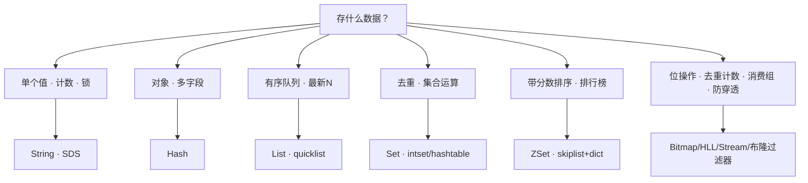

# 02-01｜数据结构与使用场景 · 练习题

先合上知识点，对着 **一节的主图** 把「一个 key 的出生与选型」口述一遍（存什么数据 → 选什么结构 → 内部编码怎么切），再来做题。

| 标记 | 含义 |
|------|------|
| **核心** | 不懂整章就没建立起来 |
| **必会** | 值班和面试都要能讲 |
| **常用** | 线上会反复碰到 |
| **常考** | 白板和追问的高频口径 |

## 本题目录

- [Q1 为什么 Redis 用 SDS 而不是 C 字符串](#q1)
- [Q2 分布式锁怎么实现](#q2)
- [Q3 Hash 存对象 vs String+JSON](#q3)
- [Q4 List 做 MQ 可靠吗](#q4)
- [Q5 Set 做共同好友](#q5)
- [Q6 ZSet 底层为什么是 skiplist+dict](#q6)
- [Q7 排行榜与延迟队列怎么实现](#q7)
- [Q8 签到和 UV 用什么存](#q8)
- [Q9 Stream 比 List 好在哪](#q9)
- [Q10 Pipeline 省的是什么](#q10)
- [Q11 大 key 和热 key 怎么发现怎么处理](#q11)
- [Q12 过期 key 怎么删除](#q12)
- [Q13 给场景选数据结构](#q13)
- [Q14 大 key 延迟毛刺怎么查](#q14)
- [合上书](#合上书)

---

## Q1

**★★★★★｜Redis 的 String 底层是什么？为什么不用 C 语言的字符串？**

**覆盖**：核心 · 必会 · 常考 ｜ **对应**：知识点 [二、String（SDS）：key 的第一形态](知识点.md)

### 场景

面试官翻简历看到「Redis 缓存」就问底层。有人答「就是 C 的 char 数组」，有人答「SDS 但说不清为什么」。

### 完整解答

> 🎯 **一句话**：String 底层是 SDS——头部带 len/alloc 的动态字符串，比 C 字符串多四个关键优势。

**SDS（Simple Dynamic String）** 在原始数据前加一个头部结构（`len`、`alloc`、`flags`），记录长度和容量。四个优势按「发现问题 → 解决问题」背：

```text
struct sdshdr {
    len    : 已用长度        ← O(1) strlen（C 字符串是 O(n)）
    alloc  : 分配总长度      ← 空间预分配，减少 realloc 次数
    flags  : sdshdr 类型      ← 按字符串大小选 5/8/16/32/64 最小头部
    buf[]  : 实际数据         ← 二进制安全（可含 \0）
}
```

- **① O(1) strlen**：C 字符串 `strlen` 要遍历到 `\0`，SDS 头部直接记了长度。
- **② 二进制安全**：C 字符串用 `\0` 判结尾，数据含 `\0` 就截断；SDS 按 `len` 读，什么都能存（图片、序列化字节流）。
- **③ 空间预分配**：修改字符串时，SDS 会预分配 `2 × len` 或多分 1MB，减少 `realloc` 次数；C 字符串每次改都要 realloc。
- **④ 惰性空间释放**：缩短时不立即回收多余空间，防反复扩缩。

String 有三种内部编码——用 `OBJECT ENCODING` 可查：

```bash
SET name "tom"
OBJECT ENCODING name
# embstr   ← ≤44 字节，SDS+对象头一次分配
SET count 100
OBJECT ENCODING count
# int      ← 能转 long 的数字直接存整数
```

> ⚠️ **别混**：SDS 的「二进制安全」不是说 SDS 是二进制数据结构，而是说 `buf` 里可以存任意字节（包括 `\0`），不会被 `\0` 截断。C 字符串函数（`strlen`/`strcat`）遇到 `\0` 就停。

### 再追问

**embstr 和 raw 有什么区别？**——embstr 是 SDS 和 Redis 对象头（`redisObject`）在一次内存分配里，适合短字符串（≤44 字节）；raw 是两次分配，适合长字符串。embstr 更省内存但只读——修改时会被转为 raw。

**SDS 的 `flags` 为什么有五种类型？**——按字符串长度选最小的头部（5/8/16/32/64 位），短字符串用 1 字节记长度就够，不浪费 4 字节。这是 Redis 内存优化的细节。

---

## Q2

**★★★★★｜Redis 分布式锁怎么实现？SETNX 有什么问题？**

**覆盖**：核心 · 必会 · 常考 ｜ **对应**：知识点 [二、String（SDS）：key 的第一形态](知识点.md)

### 场景

下单服务多实例部署，要对同一订单加分布式锁。有人写 `SETNX` + `EXPIRE` 两条命令，生产偶发死锁。

### 完整解答

> 🎯 **一句话**：SETNX + EXPIRE 两条不原子，现在标准写法是 `SET key value NX EX seconds` 一条搞定。



**读图**：`SETNX` 只管「不存在才设置」，`EXPIRE` 只管设过期，两条命令之间进程崩溃 → 锁永远不过期 = 死锁。`SET ... NX EX` 把两个操作合成一条原子命令。

```bash
SET lock:order:1001 "uuid-abc" NX EX 30
# OK          ← 拿到锁
SET lock:order:1001 "uuid-abc" NX EX 30
# (nil)        ← 锁已被占
```

**解锁必须用 Lua 脚本**——先检查 value 是不是自己的，再删：

```lua
if redis.call("GET", KEYS[1]) == ARGV[1] then
    return redis.call("DEL", KEYS[1])
else
    return 0
end
```

为什么要检查 value？场景：A 拿锁 → 30 秒到期自动释放 → B 拿到锁 → A 回来执行 `DEL` 删了 B 的锁。value 必须唯一（如 UUID），check + del 必须原子。

> ⚠️ **别混**：`SETNX` 是一条命令没错，但它**不能带过期**，必须配合 `EXPIRE`——两条就不原子了。面试别只答 `SETNX`，要答 `SET NX EX` + Lua 解锁。

> 📝 **面试**：问「Redis 分布式锁」，四步答：① `SET key value NX EX 30`（原子加锁+过期防死锁）；② value 唯一防误删；③ Lua 脚本解锁（check + del 原子）；④ 集群用 Redlock（N 个节点，多数派 N/2+1 成功才算拿到锁）。补一句：分布式锁不是银弹，网络分区时仍可能出问题。

### 再追问

**Redlock 是什么？为什么需要它？**——单节点 Redis 做锁，节点宕了锁全失效。Redlock 在 N（通常 5）个独立 Redis 实例上各加一次锁，多数派（N/2+1）成功才算拿到。**不要**用主从替代 Redlock——主从异步复制，主挂了从还没同步到锁，会重复加锁。

**锁过期了业务还没做完怎么办？**——**不要**简单把过期时间设很长。常见做法是「看门狗」线程定期续期（Redisson 框架自带），或业务侧做幂等设计——即使锁过期被别人重新拿到，自己的后续操作也不会造成重复。

---

## Q3

**★★★★☆｜存用户对象用 Hash 还是 String+JSON？Hash 的内部编码怎么切换？**

**覆盖**：必会 · 常用 · 常考 ｜ **对应**：知识点 [三、Hash：把对象拍扁存](知识点.md)

### 场景

用户信息有 20 个字段，目前用 `SET user:1 '{...JSON...}'` 存，每次改一个字段要 GET 全量 → 改 → SET 全量。有人提议改 Hash。

### 完整解答

> 🎯 **一句话**：频繁改单字段用 Hash（HSET/HGET 不碰其他字段），整体读写为主用 String+JSON。



**读图**：Hash 按字段读写，改一个字段不碰其他字段；String+JSON 改一个字段要 GET 全量 → 反序列化 → 改 → 序列化 → SET 全量，大对象开销大。

Hash 有两种内部编码，小数据紧凑、大数据切高效：

- **ziplist（Redis < 7.0）/ listpack（Redis ≥ 7.0）**：连续内存块，紧凑省空间。
- **hashtable**：标准哈希表，O(1) 查找，内存开销大。

切换阈值：`hash-max-ziplist-entries 128`（字段数超此切 hashtable）、`hash-max-ziplist-value 64`（任一字段值超此切 hashtable）。

```bash
HSET user:1 name "tom" age 30
OBJECT ENCODING user:1
# listpack              ← 字段少、值短 → 紧凑编码
HSET user:1 bio $(python3 -c "print('x'*200)")
OBJECT ENCODING user:1
# hashtable             ← 有字段值超 64 字节 → 切 hashtable
```

> ⚠️ **别混**：Hash 不适合所有「对象」。字段数特别多或值特别大时切了 hashtable，内存反而比序列化大。**不要**用 `HGETALL` 拉大 Hash——那等于序列化全量，触发大 key 告警。

### 再追问

**大 Hash 怎么拆？**——按字段分组存到不同 key（如 `user:1:profile` 存基础信息、`user:1:ext` 存扩展信息），或者按字段加 TTL（有些字段需要过期、有些不需要，拆开更灵活）。**不要**把所有字段塞一个 Hash 然后用 `HGETALL`——那就是大 key。

---

## Q4

**★★★★☆｜List 做消息队列可靠吗？BRPOP 和 RPOP 有什么区别？**

**覆盖**：必会 · 常用 ｜ **对应**：知识点 [四、List（quicklist）：有序队列](知识点.md)

### 场景

业务用 `LPUSH` + `RPOP` 做消息队列，消费者轮询 RPOP。偶尔消息丢失，有人想加大轮询频率。

### 完整解答

> 🎯 **一句话**：List 做消息队列不可靠——RPOP 弹出后消费者崩溃就丢消息；BRPOP 是阻塞版减少空轮询，但可靠性问题不变。

List 的底层是 **quicklist**：一个双向链表，每个节点是一个 listpack（紧凑连续内存块）。两端操作 O(1)：

```bash
LPUSH msg:q "hello" "world"
# (integer) 2          ← 从左端批量插入
RPOP msg:q
# "hello"              ← 从右端弹出
BRPOP msg:q 5
# 1) "msg:q"
# 2) "world"           ← 阻塞最多 5 秒，有数据立即返回
```

RPOP vs BRPOP：

| | RPOP | BRPOP |
|---|------|-------|
| 模式 | 拉模式，轮询 | 阻塞等待，有数据立即返回 |
| 空队列 | 返回 nil，要不断重试 | 阻塞，不空轮询 |
| 可靠性 | 弹出即丢 | 同样弹出即丢 |

两者可靠性问题一样：**消息弹出后消费者崩溃就丢了**，List 不保留已消费消息、没有确认机制。

> ⚠️ **别混**：BRPOP 解决的是「空轮询浪费 CPU」，**不是**「消息可靠投递」。要可靠 MQ 用 Stream（消费组 + XACK 确认），List 只适合「丢了能补」的场景（实时日志、最新列表）。

### 再追问

**最新 N 条怎么用 List 存？**——`LPUSH` 入队 + `LTRIM list 0 N-1` 裁剪，保留固定长度。`LRANGE list 0 -1` 查看。**不要**用 `SORT` + `ZRANGEBYSCORE` 去查——List 没有排序能力，它只是有序队列，顺序是插入顺序不是分数顺序。

---

## Q5

**★★★☆☆｜Set 做「共同好友」怎么做？intset 和 hashtable 怎么切换？**

**覆盖**：必会 · 常考 ｜ **对应**：知识点 [五、Set（intset/hashtable）：去重与集合运算](知识点.md)

### 场景

社交系统要做「共同好友」功能，每个用户的好友列表几百到几万人。有人想用 List 存然后取交集。

### 完整解答

> 🎯 **一句话**：每个用户的好友列表存一个 Set，`SINTER` 直接算交集——Set 天生去重且支持集合运算。

```bash
SADD friends:u1 alice bob charlie
SADD friends:u2 bob charlie david
SINTER friends:u1 friends:u2
# 1) "bob"
# 2) "charlie"         ← 交集：共同好友
SISMEMBER friends:u1 alice
# (integer) 1          ← 判断元素是否存在，O(1)
```

Set 有两种内部编码：

- **intset**：所有元素都是整数且数量 ≤ `set-max-intset-entries`（默认 512），用有序整数数组存，极省内存。
- **hashtable**：有非整数元素或数量超阈值，切回哈希表。

```bash
SADD ids 1 2 3
OBJECT ENCODING ids
# intset               ← 全整数 → intset
SADD ids "string-element"
OBJECT ENCODING ids
# hashtable            ← 有字符串 → hashtable
```

> 📝 **面试**：问「共同好友怎么做」，答：每个用户好友存 Set，`SINTER` 取交集。补一句：Set 特别大（万人好友）时 `SINTER` 也可能慢，可以用 `SINTERSTORE` 把结果存到另一个 key，或分批计算。

### 再追问

**intset 为什么省内存？**——它是升序排列的整数数组，没有哈希表的结构开销（桶数组 + 指针），每个元素只占 `int16/int32/int64`（按最大元素自适应）。代价是查找是二分 O(logN) 而非 O(1)，但小集合下差异不大。**不要**把 intset 当通用 Set——它只能存整数。

---

## Q6

**★★★★★｜ZSet 底层是什么？为什么用 skiplist 而不是红黑树？**

**覆盖**：核心 · 必会 · 常考 ｜ **对应**：知识点 [六、ZSet（skiplist+dict）：带分数的有序集合](知识点.md)

### 场景

面试官让你画 ZSet 的底层结构。有人画了一棵红黑树，有人画了 B+ 树，有人只说「跳表」但说不清为什么。

### 完整解答

> 🎯 **一句话**：ZSet 大数据用 skiplist + dict 双管齐下——skiplist 管有序，dict 管 O(1) 查分数，不用红黑树。



**读图**：skiplist 负责「按分数有序」的操作（范围查、排名），dict 负责「按 member 查分数」的操作。两者共享同一份数据（指针指过去），不存两份副本。小数据时都退化为 ziplist/listpack。

> 💡 **打个比方**：跳表像一栋楼装了好几部电梯——底层是完整链表，上面几层是「快车道」，越往上越稀疏。找人的时候先坐快车道粗筛、到底层细走，每步跳过一大片，平均 O(logN)。但如果只有跳表，按 member 查分数要 O(logN)；加一张 dict 把 member→score 映射起来，查分数变成 O(1)。

**为什么不用红黑树**：

- ① **实现简单**：skiplist 是概率平衡的链表，代码比红黑树的旋转/染色简单得多。
- ② **范围遍历友好**：skiplist 底层是链表，`ZRANGEBYSCORE` 沿链表走即可；红黑树范围遍历需要中序遍历，复杂。
- ③ **并发友好**：skiplist 修改只需局部锁（改几个节点的前后指针），红黑树旋转影响范围大。

```bash
ZADD rank 100 "alice" 200 "bob" 150 "charlie"
OBJECT ENCODING rank
# skiplist              ← 大 ZSet 的编码
ZSCORE rank "bob"
# "200"                ← O(1) 查分数（走 dict）
ZRANK rank "bob"
# (integer) 2          ← 排名（走 skiplist）
```

> ⚠️ **别混**：skiplist 是**期望** O(logN) 而非最坏 O(logN)，不是完全平衡的。Redis 选它不是因为性能比红黑树好（两者渐近一样），而是实现简单 + 范围遍历友好。

### 再追问

**小数据 Zset 用什么编码？**——ziplist/listpack，连续内存块，省掉 skiplist 和 dict 的指针开销。超过 `zset-max-ziplist-entries 128` 或单值超 `zset-max-ziplist-value 64` 切 skiplist+dict。`OBJECT ENCODING` 可查。

**dict 和 skiplist 怎么共享数据？**——dict 的 value 和 skiplist 的 node 指向同一个 `zset` 元素结构（含 member 和 score），不是存两份副本。所以内存开销不是 2×，是 skiplist 节点指针 + dict 桶指针的额外开销。

---

## Q7

**★★★★☆｜排行榜和延迟队列分别怎么用 ZSet 实现？**

**覆盖**：必会 · 常用 · 常考 ｜ **对应**：知识点 [六、ZSet（skiplist+dict）：带分数的有序集合](知识点.md)

### 场景

游戏要做实时排行榜和 30 分钟后自动取消未支付订单的延迟队列。有人想用定时任务扫表。

### 完整解答

> 🎯 **一句话**：排行榜用 ZADD 更新分数 + ZREVRANGE 取 Top N；延迟队列用 score 存到期时间戳 + ZRANGEBYSCORE 捞过期。

**排行榜**：

```bash
ZINCRBY rank 50 "alice"
# "150"               ← 原子加分，实时更新
ZREVRANGE rank 0 9 WITHSCORES
# 1) "bob"
# 2) "200"
# 3) "alice"
# 4) "150"           ← Top 2 降序（ZREVRANGE = 降序版 ZRANGE）
ZREVRANGEBYRANK rank 10 19
# ...第 11~20 名，分页
```

**延迟队列**：

```bash
ZADD delay:q 1693520400 "order:1001"   # score = 到期时间戳
# 消费者轮询
ZRANGEBYSCORE delay:q 0 1693520400       # 捞 score ≤ 当前时间戳的
# 1) "order:1001"
ZREM delay:q "order:1001"                # 删除后执行任务
# (integer) 1
```



**读图**：延迟队列的核心是 score 存时间戳，消费者定时捞已到期的。`ZRANGEBYSCORE` + `ZREM` 不是原子操作——如果 `ZREM` 前消费者崩溃，下次会重复捞，**业务必须做幂等**。

> ⚠️ **别混**：ZSet 延迟队列 `ZRANGEBYSCORE` + `ZREM` 不原子，多消费者可能抢同一条消息（都捞到了，只有一个 `ZREM` 成功）。要严格不重复，用 Lua 脚本把「捞 + 删」合成原子操作，或改用 Stream 的消费组 + `XCLAIM` 机制。

### 再追问

**排行榜分数相同怎么排序？**——分数相同时按 member 的字典序排（Redis 默认行为）。如果要按时间先后排，可以在 score 里编码时间戳（如 `score = 实际分数 * 1e13 + 时间戳`，让更早的排在前面）。

---

## Q8

**★★★☆☆｜签到功能和 UV 统计分别用什么数据结构？**

**覆盖**：必会 · 常考 ｜ **对应**：知识点 [七、特殊兵种：Bitmap / HyperLogLog / Stream / 布隆过滤器](知识点.md)

### 场景

产品要做每日签到和页面 UV 统计。签到用 Set 存了 1000 万用户，内存爆炸；UV 用 Set 存了 5000 万访问者，内存更爆炸。

### 完整解答

> 🎯 **一句话**：签到用 Bitmap（一位一用户，12MB 存 1 亿人），UV 用 HyperLogLog（固定 12KB 估算，不存原始元素）。

**Bitmap 签到**：本质是 String，用用户 ID 做位偏移量，`SETBIT` 标记签到、`BITCOUNT` 统计人数：

```bash
SETBIT sign:202309:1 1001 1    # 用户 1001 在 9 月 1 日签到
# (integer) 0                  # 旧值 0
BITCOUNT sign:202309:1
# (integer) 1                  # 当天签到人数
# 对比：Set 存 1 亿用户 ≈ 600MB；Bitmap 存 1 亿用户 = 12.5MB
```

**HyperLogLog 统计 UV**：固定 12KB 内存，误差 0.81%，只回答「约多少个不同元素」：

```bash
PFADD page:uv "user-1" "user-2" "user-3"
PFCOUNT page:uv
# (integer) 3               # 估算去重后的基数
# 对比：Set 存 5000万 UV ≈ 300MB；HyperLogLog = 12KB
```

> ⚠️ **别混**：HyperLogLog **不存原始元素**，只存估算寄存器。所以不能 `SISMEMBER` 判断某个元素在不在——它只回答「大约有多少个不同的元素」，不回答「这个元素在不在」。精确去重要用 Set，海量去重且容忍 0.81% 误差用 HyperLogLog。

| 场景 | 结构 | 内存（1亿用户） | 精确？ |
|------|------|-----------------|--------|
| 签到 | Bitmap | ~12.5MB | 精确 |
| UV | HyperLogLog | 12KB | 估算（0.81% 误差） |
| 精确去重 | Set | ~600MB | 精确 |

### 再追问

**布隆过滤器什么时候用？**——防缓存穿透：请求 → 查布隆过滤器 → 不在直接返回（一定不在）→ 在才查 Redis/DB（可能在）。布隆过滤器用多哈希函数 + bitmap，**说不在就一定不在，说在可能误判**。和 HyperLogLog 对比：布隆过滤器能回答「这个元素在不在」（可能误判），HyperLogLog 只回答「大约有多少个不同元素」。穿透问题详见 [04](../04-缓存架构/)。

---

## Q9

**★★★★☆｜Stream 比 List 好在哪？什么时候该用 Stream？**

**覆盖**：必会 · 常用 ｜ **对应**：知识点 [七、特殊兵种：Bitmap / HyperLogLog / Stream / 布隆过滤器](知识点.md)

### 场景

订单系统要可靠的消息队列，不能丢消息。目前用 List + BRPOP，消费者崩溃后消息丢失。有人想上 Kafka，有人提议用 Redis Stream。

### 完整解答

> 🎯 **一句话**：Stream 有消费组和消息确认（XACK），消息读走后不删、确认后才标记已处理——List 弹出即丢，不可靠。

```bash
# Stream 基本操作
XADD orders '*' status created amount 100
# "1693520400000-0"        # 自动生成 ID（时间戳-序号）
XREAD COUNT 2 STREAMS orders 0
# 1) 1) "orders"
#    2) 1) 1) "1693520400000-0"
#          2) 1) "status"
#             2) "created"
#             3) "amount"
#             4) "100"

# 消费组
XGROUP CREATE orders order-group 0    # 创建消费组
XREADGROUP GROUP order-group consumer-1 COUNT 10 STREAMS orders >
# 读取分配给 consumer-1 的消息
XACK orders order-group 1693520400000-0
# (integer) 1               # 确认处理完成
XPENDING orders order-group          # 查看未确认的消息
XCLAIM orders order-group consumer-2 0 1693520400000-0
# 把超时未确认的消息重新分配给 consumer-2
```

| 对比 | List（BRPOP） | Stream（XREADGROUP + XACK） |
|------|--------------|---------------------------|
| 消息可靠性 | 弹出即丢 | 消息保留、需 XACK 确认 |
| 消费组 | 不支持 | 支持（多消费者各自消费、消息分配） |
| 未确认处理 | 无 | XPENDING + XCLAIM 重新分配 |
| 消息回溯 | 不支持 | 可按 ID 回溯（XREAD from id） |
| 消息保留 | 弹出后删 | 需手动 XTRIM 或 MAXLEN |

> ⚠️ **别混**：Stream 的消息不是永久保留的——需要定期 `XTRIM` 或 `XADD ... MAXLEN N` 裁剪，否则内存会涨。Stream 也不保证严格有序跨消费组——每个消费组独立消费，消费顺序是 Stream 内部的 ID 顺序。**不要**把 Stream 当 Kafka 的完整替代——Redis 单线程，吞吐量远低于 Kafka；但轻量场景（单机、万级 QPS）Stream 够用且运维简单。

### 再追问

**Stream 的 ID 是什么格式？**——`时间戳-序号`，如 `1693520400000-0`。同一毫秒内多条消息序号递增。`XADD orders '*'` 中的 `*` 表示让 Redis 自动生成 ID。**不要**手动指定过小的 ID——Stream 要求 ID 单调递增。

---

## Q10

**★★★★☆｜Pipeline 为什么快？和事务（MULTI/EXEC）有什么区别？**

**覆盖**：必会 · 常考 ｜ **对应**：知识点 [八、Pipeline：把往返跑成一趟](知识点.md)

### 场景

批量写入 1000 条数据到 Redis，一条一条 SET 慢得像爬。有人加 Pipeline 快了 100 倍，有人问「这是不是事务」。

### 完整解答

> 🎯 **一句话**：Pipeline 是客户端攒一批命令一次发、批量收，省的是 RTT，不是服务端执行时间——也不是事务。



**读图**：不用 Pipeline，N 条命令 = N 个 RTT（每次发一条等一条回来）；用 Pipeline，N 条命令 = 1 个 RTT + N 条执行时间。省的是网络往返，不是 CPU。

```bash
(echo -e "SET k1 v1\nSET k2 v2\nSET k3 v3\nSET k4 v4"; sleep 1) | redis-cli --pipe
# OK
# OK
# OK
# OK            # 一趟 RTT 发了 4 条命令
```

> ⚠️ **别混**：Pipeline **不是事务**。Pipeline 只是把命令攒着批量发，服务端可能被其他客户端的命令插队。要原子性用 `MULTI/EXEC`（事务，命令队列在服务端排队一次性执行），要 CAS 语义用 Lua 脚本。Pipeline 省的是 RTT，事务保的是原子性，两者完全不同。

| | Pipeline | MULTI/EXEC |
|---|---------|-----------|
| 省什么 | RTT | 不省 RTT |
| 原子性 | 不保证，可能被插队 | 保证（命令队列一次性执行） |
| 命令间有依赖 | 不能用（后一条依赖前一条结果） | 不能用（事务内命令不能依赖彼此结果） |
| 用途 | 批量写入/读取 | 原子操作多条命令 |

### 再追问

**Pipeline 单次多少条合适？**——建议 ≤ 10000 条/批。太多可能阻塞其他客户端（服务端单线程逐条执行，攒太多会让其他请求等）。**不要**把几十万条塞一个 Pipeline——那等于让 Redis 单线程卡几百毫秒。

---

## Q11

**★★★★★｜大 key 和热 key 怎么发现？怎么处理？**

**覆盖**：核心 · 必会 · 常用 · 常考 ｜ **对应**：知识点 [九、大 key 与 热 key](知识点.md)

### 场景

生产某 Redis 分片 CPU 跑满，其他分片只有 5%。有人怀疑是热 key，有人说是大 key。不知道怎么排查。

### 完整解答

> 🎯 **一句话**：大 key 拖慢单条命令（DEL 阻塞主线程），热 key 打挂单个分片——先用 `--bigkeys` / `--hotkeys` 定位，再拆 key 或加本地缓存。

**大 key 检测**：

```bash
# 方法一：全库扫描找最大的 key
redis-cli --bigkeys
# [00.00%] Biggest list found so far '"msg:queue:urgent"'
# -------- summary -------
# Biggest list found '"msg:queue:urgent"' has 150000 items   ← 大 key 定位

# 方法二：查单个 key 占多少内存
MEMORY USAGE msg:queue:urgent
# (integer) 12000000    # 约 12MB
```

**热 key 检测**：

```bash
# 需先开 LFU 淘汰策略：CONFIG SET maxmemory-policy allkeys-lfu
redis-cli --hotkeys
# 1) "config:hot:banner" hasfactor 120   ← 热 key：访问频次最高
```

**处理方式**：



**读图**：大 key 拆完还要安全删除——`DEL` 大 key 会阻塞主线程（Redis 单线程），用 `UNLINK` 异步删。热 key 加本地缓存后 Redis 访问量下降，分片 CPU 就降下来。

> ⚠️ **别混**：`DEL` 和 `UNLINK` 都能删 key，但 `DEL` 是同步删（阻塞主线程），`UNLINK` 是异步删（先断引用，后台线程释放内存）。**大 key 一定用 UNLINK**，小 key 用哪个都行。

> 📝 **面试**：问「大 key 怎么处理」，答：① 发现：`--bigkeys` 扫 / `MEMORY USAGE` 查；② 处理：拆 key（Hash 分片 / List 分段）+ `UNLINK` 异步删；③ 预防：设计时就限制 key 大小，List 设 `MAXLEN`、Hash 控制字段数。热 key：`--hotkeys` 查 + 本地缓存 + 读分散副本。

### 再追问

**为什么不能用 MONITOR 日常跑？**——`MONITOR` 会输出每条命令，本身有性能损耗（Redis 要把每条命令推给 monitor 客户端），生产环境日常开着会让 Redis 变慢。只在排障时短暂开几秒采样。**不要**把 MONITOR 当监控手段——用 `--hotkeys` 或 slowlog 更安全。

---

## Q12

**★★★★★｜Redis 的过期 key 怎么删除？惰性删除和定期删除是什么？过期策略和淘汰策略什么区别？**

**覆盖**：核心 · 必会 · 常考 ｜ **对应**：知识点 [十、过期策略：惰性删除与定期删除](知识点.md)

### 场景

线上 Redis 内存持续涨，查了发现大量设了 TTL 的 key 没被删。有人以为设了 TTL 就自动释放了。

### 完整解答

> 🎯 **一句话**：Redis 过期 key 靠惰性删除（访问时查）+ 定期删除（每秒抽样），两者都清不干净时走内存淘汰——过期策略和淘汰策略是两套机制。

> 💡 **打个比方**：惰性删除像「超市货架只在有人拿的时候才看保质期扔掉」——没人拿的过期食品永远占着货架。定期删除像「超市每 100 毫秒派个人随机扫几排货架，看到过期的就扔」。两者配合，但仍有漏网之鱼——货架满了就走内存淘汰。

**惰性删除（lazy expiration）**：访问某个 key 时才检查是否过期，过期才删。CPU 友好但可能内存泄漏。

```bash
SET temp:key "data" EX 5
# OK
# 等 6 秒后
GET temp:key
# (nil)                # 访问时才发现过期 → 惰性删除
TTL temp:key
# (integer) -2         # -2 = key 已过期并被删除
```

**定期删除（periodic expiration）**：Redis 每秒执行 `hz` 次（默认 10），每次随机抽部分设置了过期时间的 key 检查，删掉已过期的。如果过期比例超过 25%，继续抽检。

```bash
CONFIG GET hz
# 1) "hz"
# 2) "10"              # 每秒 10 次定期扫描
```

> ⚠️ **别混**：**过期策略** ≠ **内存淘汰策略（eviction）**。过期策略管的是「设了 TTL 的 key 到期了怎么清」（惰性 + 定期），内存淘汰策略管的是「内存满了按什么规则踢人」（LRU/LFU/random/TTL）。前者是清「该清的」，后者是「不该清也得清」。内存淘汰详见 [02](../02-持久化与内存管理/)。

| | 过期策略 | 内存淘汰策略 |
|---|---------|-------------|
| 触发条件 | key 的 TTL 到期 | 内存用满（maxmemory） |
| 对象 | 只管设了 TTL 的 key | 所有 key（看策略） |
| 机制 | 惰性删除 + 定期删除 | LRU / LFU / random / TTL |
| 详见 | 本节 | [02](../02-持久化与内存管理/) |

> 📝 **面试**：问「Redis 过期 key 怎么删除」，答：① 惰性删除——访问时检查、过期才删；② 定期删除——每秒 hz 次随机抽检；③ 两者清不干净时走内存淘汰（LRU/LFU）。**一定要补一句「过期策略 ≠ 淘汰策略」**，这是最高频混答点。

### 再追问

**如果大量 key 同时过期会怎样？**——定期删除那一轮会抽到大量过期 key，CPU 骤升。更严重的是惰性删除：大量请求同时访问刚过期的 key，全部触发删除。常见做法是给过期时间加随机抖动（如 `EX 300 + random(0,60)`），避免同时过期。雪崩问题详见 [04](../04-缓存架构/)。

---

## Q13

**★★★★☆｜给你几个场景，分别选什么数据结构？**

**覆盖**：必会 · 常考 ｜ **对应**：知识点 [一、一张图：一个 key 的出生与选型](知识点.md)

### 场景

面试官一口气给五个场景：① 计数器 ② 用户对象 ③ 消息队列 ④ 排行榜 ⑤ 签到。

### 完整解答

> 🎯 **一句话**：先看数据形态（单值/对象/队列/集合/有序/位级），再选结构，最后看内部编码是否匹配数据量。



五个场景的选型：

| 场景 | 选什么 | 为什么 | 别选 |
|------|--------|--------|------|
| ① 计数器 | String | INCR 原子操作，int 编码省内存 | Hash（杀鸡用牛刀） |
| ② 用户对象（20 字段，频繁改） | Hash | HSET 局部改不碰其他字段 | String+JSON（改一字段全量读写） |
| ③ 可靠消息队列 | Stream | 消费组 + XACK 确认，不丢消息 | List（BRPOP 弹出即丢） |
| ④ 排行榜 | ZSet | skiplist 按分数有序，ZREVRANGE 取 Top N | List（无排序能力，翻页越翻越慢） |
| ⑤ 签到（亿级用户） | Bitmap | 一位一用户，12.5MB 存 1 亿人 | Set（1 亿元素 ≈ 600MB） |

> ⚠️ **别混**：选型不是看「哪个快」——所有结构都快。选型看的是**数据形态和操作模式**：单值选 String、对象选 Hash、队列选 List/Stream、集合选 Set、有序选 ZSet。选错了后面调参数调内存都在亡羊补牢。

### 再追问

**什么场景要换结构？**——当操作模式和当前结构不匹配时。排行榜用 List 翻页越翻越慢（List 无排序能力，`LRANGE` 取中间段要遍历），该换 ZSet。对象用 String+JSON 改一字段要全量读写，该换 Hash。可靠 MQ 用 List 丢消息，该换 Stream。这些都是「选错结构 → 现象 → 换结构」的典型路径。

---

## Q14

**★★★★★｜Redis 单 key 5MB，延迟毛刺怎么查？**

**覆盖**：核心 · 必会 · 常用 ｜ **对应**：知识点 [九、大 key 与 热 key](知识点.md)

### 场景

`redis-cli --latency` 周期性 50ms 尖刺。`INFO` 内存正常。有人要加内存。

### 完整解答

> 🎯 **一句话**：**大 key 阻塞主线程**——用 `--bigkeys` / `redis-cli --memkeys` 找，拆 key 或迁走，**不要**只加内存。

```bash
redis-cli --bigkeys -i 0.1
# Biggest string: 'user:bag:88291' (5242880 bytes)

redis-cli MEMORY USAGE user:bag:88291
# 5242880

redis-cli HLEN user:bag:88291
# 50000   ← Hash 过大，应拆 shard 或落 DB
```

治理：Hash 按 `user_id % 64` 拆 `bag:{uid}:{shard}`；String 大 JSON 改 Hash 或落库；删除用 `UNLINK` 异步。**不要** `KEYS *` 扫——自己制造大 key 级毛刺。

> 📝 **面试**：大 key 症状 = 延迟尖刺 + fork 慢 + 迁移卡；热 key 另治（本地缓存/分片）。

### 再追问

**热 key 和大 key 能一起治吗？**——热 key 用分桶/本地缓存；大 key 用拆分。加内存不治热 key。

---

## 合上书

对齐知识点「合上书」，逐条口述，卡住就回对应节：

- [ ] **默画一张图**：选型决策树——存什么数据 → 选什么结构 → 内部编码怎么切。（Q13）
- [ ] **口述 String**：SDS 比 C 字符串好在哪（四点）、三种编码（int/embstr/raw）、计数器和缓存场景。（Q1）
- [ ] **口述分布式锁**：SETNX 的问题 → `SET NX EX` → value 唯一防误删 → Lua 解锁 → Redlock。（Q2）
- [ ] **口述 Hash**：ziplist/listpack → hashtable 切换阈值、Hash vs String+JSON 存对象的取舍。（Q3）
- [ ] **口述 List**：quicklist 是什么（链表套 listpack）、消息队列的 BRPOP、为什么 List 做不可靠 MQ。（Q4）
- [ ] **口述 Set**：intset → hashtable 切换、共同好友（SINTER）、典型场景。（Q5）
- [ ] **默画 ZSet 收束图**：skiplist 管有序 + dict 管 O(1) 查分数、共享数据不存两份、各操作走哪条路、为什么不用红黑树。（Q6）
- [ ] **口述 ZSet 场景**：排行榜（ZADD + ZREVRANGE）、延迟队列（score 存时间戳 + ZRANGEBYSCORE）。（Q7）
- [ ] **口述特殊兵种**：Bitmap 签到、HyperLogLog 估算 UV（不存原始元素）、Stream 消费组、布隆过滤器防穿透。（Q8 · Q9）
- [ ] **口述 Pipeline**：省 RTT 不是省执行时间、不是事务、和 MULTI/EXEC 的区别。（Q10）
- [ ] **口述大 key 与热 key**：怎么发现（`--bigkeys`/`--hotkeys`）、怎么处理（UNLINK 拆 key / 本地缓存读分散）。（Q11）
- [ ] **口述过期策略**：惰性删除 + 定期删除怎么配合、和内存淘汰策略的区别。（Q12）
- [ ] **定责**：选错结构的典型现象（排行榜用 List 翻页慢、对象用 String 全量改、List 做 MQ 丢消息），各怎么换。（Q13）
- [ ] **边界**：持久化与内存淘汰 → [02](../02-持久化与内存管理/)；高可用与集群 → [03](../03-高可用与集群/)；缓存穿透/击穿/雪崩与一致性 → [04](../04-缓存架构/)。
