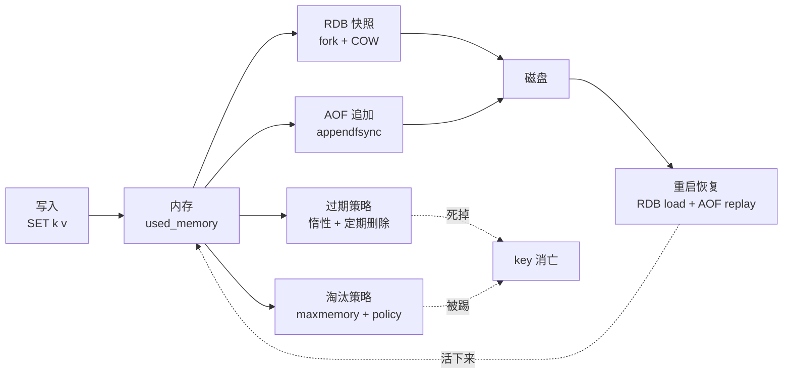
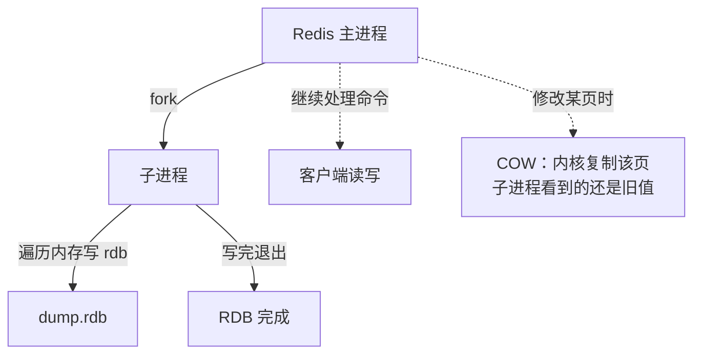
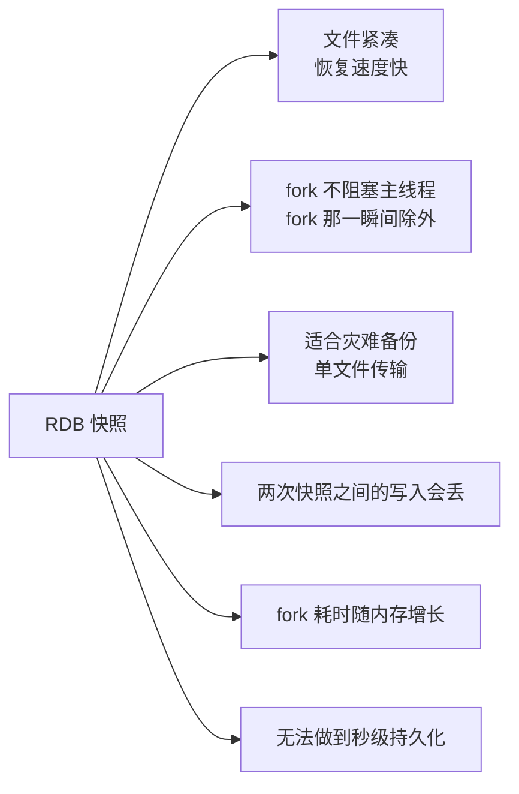
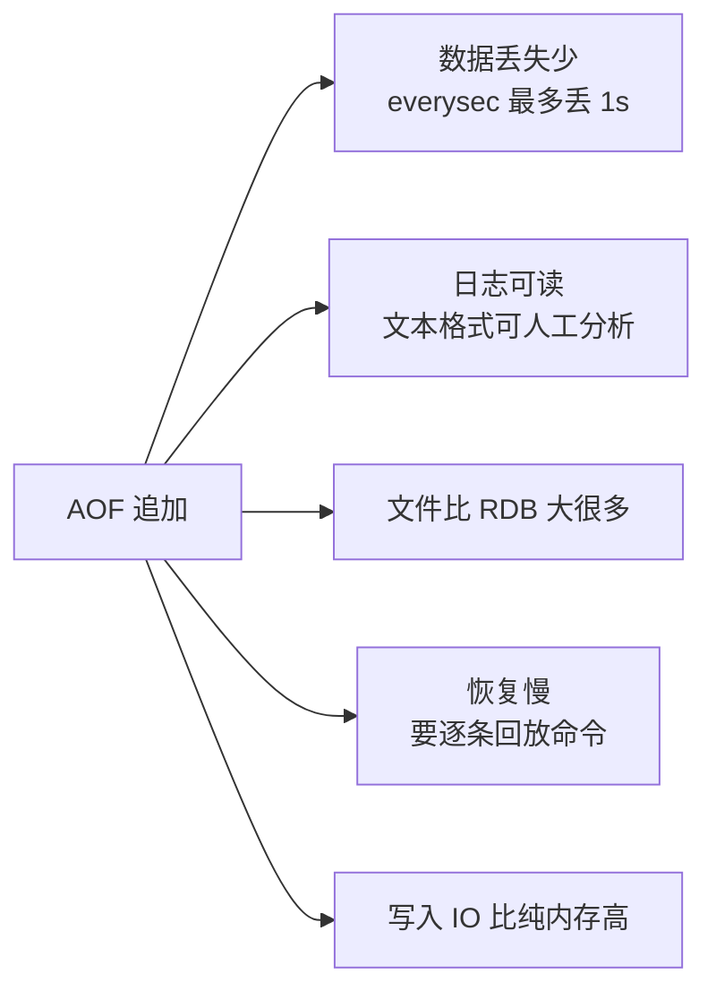
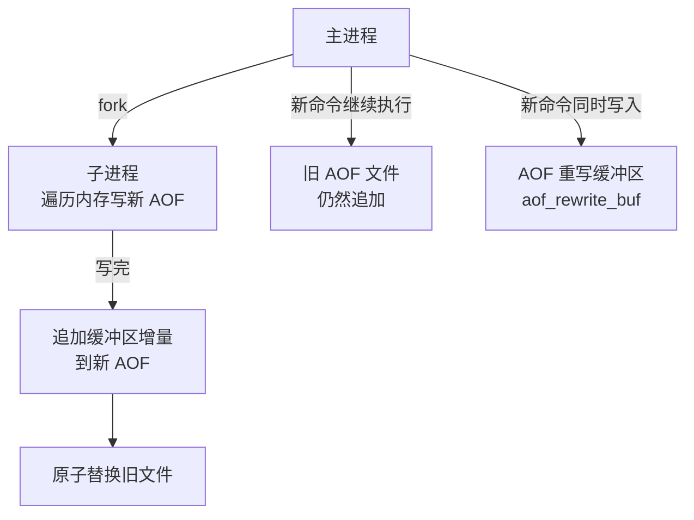
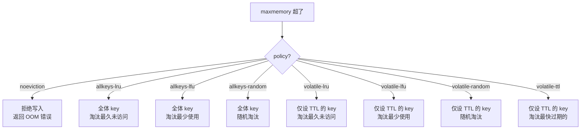
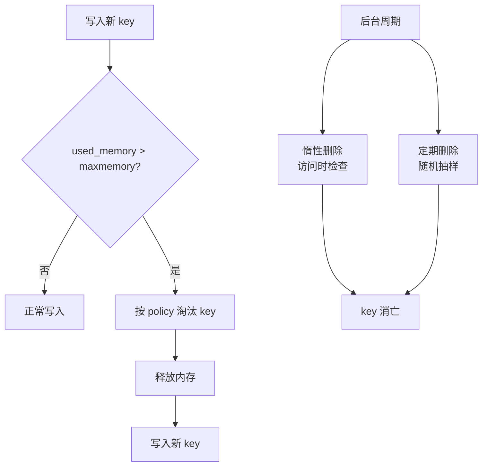
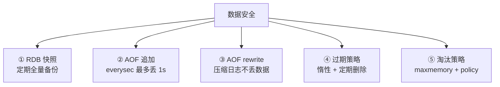
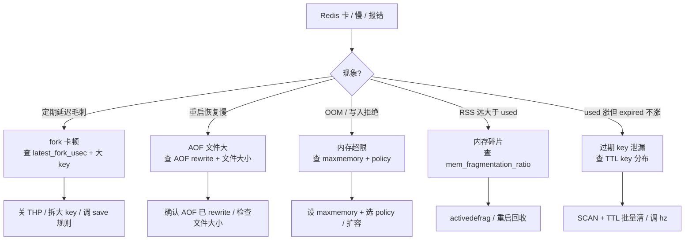

# 持久化与内存管理

> 大家好，欢迎来到这次分享。开讲之前，先带大家回到一个很多值班同学都经历过的现场：
> Redis 重启后有的 key 还在、有的没了，`INFO` 里 `used_memory` 和 RSS 差了 2GB——群里已经有人在喊「先把 maxmemory 调大」「AOF 太慢关掉算了」。持久化不是「存磁盘」三个字能概括的，内存管理也不是「设个 maxmemory」就完了。
> 这一章讲完，你会知道当时那个人错在哪：不该先关 AOF、不该先盲调 maxmemory——该先问「key 怎么活过重启、内存满了谁先走」。
> **本章回答的问题**：一个 key 写进内存后，怎么活过重启、怎么在内存满了时被淘汰、怎么在过期后死去。
> **本章不讲**：数据结构选型 → [01](../01-数据结构与使用场景/)；主从/哨兵/集群故障转移 → [03](../03-高可用与集群/)；缓存穿透/击穿/雪崩 → [04](../04-缓存架构/)。这些都有专门章节，本章只在用到时点到为止。

**标记**：🎯重点 · 🔥难点 · ⭐常考 · 🔧实操

**怎么听这场分享**：咱们先把第一节的存活路径图看熟——写入内存 → RDB/AOF 落盘 → 重启恢复 → 过期/淘汰消亡；第二到第七节顺着这三关往下走；第八节专门讲排障定责——也就是开头那个现场的正确解法。每一节讲完会提示对应练习题，学完就去练。

---

## 一、一张图：一个 key 的存活路径

> 🎯 **一句话**：key 从写入内存到活过重启，要过三关——持久化（RDB/AOF）、过期策略（何时死）、淘汰策略（内存满了谁走）。

咱们先不急着背 `save`/`appendfsync`/`maxmemory-policy`。学持久化最怕的就是上来背参数，背完还是分不清「过期」和「淘汰」。先看图：



**读图**：

- 主线是一条 key 的存活路径：写入内存后，通过 RDB 或 AOF 落盘才能活过重启；过期和淘汰是 key 的两种死法。
- RDB 和 AOF 是两条并行路径，可以只开一条、也可以同时开——重启时先 load RDB 再 replay AOF。
- 过期策略管「到了 TTL 该怎么死」，淘汰策略管「内存满了谁先走」——这是两个独立机制，别混。

带着这张图，咱们正式出发。先搞清楚「内存里到底怎么记账」——`used_memory` 和 RSS 差 2GB，根因就在这儿。

> 本节对应练习题：整张存活路径是后面各题的地基；内存细节见 **Q8、Q9**。

---

## 二、出生在内存：Redis 的内存模型

> 🎯 **一句话**：Redis 所有数据常驻物理内存，used_memory 是你存了多少、used_memory_rss 是操作系统实际给了多少，两者之差就是碎片。

Redis 是**单线程内存数据库**（指命令执行单线程，持久化 fork 和后台任务另起子进程），所有 key-value 存在主内存里。理解内存模型是理解持久化、淘汰、OOM 的前提。

### 三个核心指标 ⭐

```text
used_memory         ← Redis 分配器分配的总字节数（逻辑用了多少）
used_memory_rss     ← 操作系统视角的常驻内存（物理占了多少）
used_memory_peak    ← 历史峰值
```

```bash
redis-cli INFO memory | grep -E 'used_memory:|used_memory_rss:|used_memory_peak:'
# used_memory:1073741824          # ← 1GB，逻辑用量
# used_memory_rss:2013265920      # ← 1.875GB，物理占用，比逻辑大 = 有碎片
# used_memory_peak:2147483648     # ← 2GB，历史峰值
```

> 🔍 **现场**：看到 RSS 远大于 used_memory 别慌——先看碎片率，不是直接重启。

### 内存碎片率 🔧

**mem_fragmentation_ratio** = `used_memory_rss / used_memory`，是判断内存健康的第一指标：

```bash
redis-cli INFO memory | grep mem_fragmentation_ratio
# mem_fragmentation_ratio:1.87    # ← RSS / used_memory
```

- **1.0 ~ 1.5**：正常。jemalloc 分配器有少量碎片是常态。
- **> 1.5**：碎片明显。频繁修改/删除大 key 后，分配器归还不了物理页给 OS。
- **< 1.0**：OS 在换页/swap，**危险**——Redis 性能会断崖式下降。

> 💡 **打个比方**：你租了一个仓库（RSS），里面放了 100 个货架（used_memory）。搬走 80 个货架后仓库还是那么大——空出来的地方没还给房东，这就是碎片。碎片率 1.8 就是「仓库里快一半是空的但退不掉」。

### 内存分配器

Redis 默认使用 **jemalloc**（编译时指定），它按大小分桶（small/large/huge），对小块频繁分配/释放的场景比 glibc malloc 碎片更少。

```bash
redis-cli INFO mem_allocator
# mem_allocator:jemalloc-5.1.0    # ← 确认分配器
```

### activedefrag：在线碎片整理 🔧

Redis 4.0+ 支持 `activedefrag`，在后台线程把碎片整理回来，不用重启：

```bash
CONFIG SET activedefrag yes       # ← 开启主动碎片整理
# OK
CONFIG SET active-defrag-ignore-bytes 100mb    # ← 总碎片低于此值不启动
# OK
CONFIG SET active-defrag-threshold-lower 10   # ← 碎片率超过 10% 开始整理
# OK
CONFIG SET active-defrag-threshold-upper 100  # ← 碎片率超过 100% 全力整理
# OK
```

> ⚠️ **别混**：`activedefrag` 整理的是**碎片**（RSS 和 used_memory 的差），不是回收**已过期未删除的 key**（那是过期策略的事，六节）。碎片率高但 used_memory 也高 → 该扩容，不是 defrag。

### 大 key 对内存的影响 ⭐🔥

**大 key** 指单个 key 的 value 特别大——一个 list 100 万元素、一个 hash 50 万字段。大 key 的问题贯穿持久化、淘汰、删除全链：

```bash
redis-cli --bigkeys               # ← 扫描各类型最大 key
redis-cli MEMORY USAGE mykey      # ← 单个 key 占多少字节（含 overhead）
# Integer: 72                      # ← 72 字节
```

大 key 的三重危害：① `fork` 子进程时复制页表慢（三节）；② 删除时阻塞主线程（`DEL` 大 key 是 O(N)）；③ 淘汰时单个 key 可能占满内存导致频繁触发。

```bash
# 用 UNLINK 代替 DEL 异步删除大 key（Redis 4.0+）
UNLINK bigkey1 bigkey2            # ← 后台线程异步释放，不阻塞主线程
# (integer) 2                      # ← 成功移除 2 个
```

> 📝 **面试**：问「大 key 怎么处理」，答四步：① 用 `--bigkeys` 或 `MEMORY USAGE` 发现；② `UNLINK` 异步删除；③ 拆分成小 key（hash 分桶）；④ 监控 `MEMORY USAGE` 上限告警。**不要**在生产环境直接 `DEL` 百万元素的 key——主线程会卡到超时。


> ⭐ **口诀**：大 key 用 `UNLINK` 别 `DEL`；碎片率高先查大 key 和 allocator，别先盲开 `activedefrag`。

好，内存账本清楚了。大家想想：进程一重启，内存里的 key 全没了——怎么让它们活过来？先讲 RDB 快照这条路。

> 本节对应练习题 **Q8、Q9**。
---

## 三、活过重启：RDB 快照

> 🎯 **一句话**：RDB 是某一时刻全量数据的二进制快照，靠 fork 子进程 + COW 写盘，恢复快但会丢最后一次快照后的写入。

### fork + COW 机制 🎯🔥

大家想想：`BGSAVE` 的 fork 是不是把整份内存复制一份？很多人答「是，所以大内存实例千万别开」——错了一半。咱们放慢讲。

RDB 的核心是操作系统 **fork** 出一个子进程，子进程把内存里的数据写到磁盘上的 `.rdb` 文件。**子进程不会复制全部物理内存**——靠 **COW（Copy-On-Write，写时复制）**：父子进程共享物理页，只有父进程修改某页时，内核才把那页复制一份给子进程。



**读图**：fork 瞬间只复制**页表**（不是全部数据），所以快；之后父进程继续干活，子进程拿着一份「冻结在 fork 那一刻」的内存快照写盘。只有父进程修改的页才真正复制——写越少，COW 复制越少。

> 💡 **打个比方**：你给图书馆拍全景照片（fork），拍照时书架上有什么就是什么（快照）。拍照时有人来还书/借书（父进程写入），不影响你拍的那张照片——但如果有书被换了位置，换的那本要给你单独留一份旧版（COW）。

### fork 的开销 ⭐🔧

fork 本身是 **O(页表大小)** 而非 O(数据量)，但页表大小跟 used_memory 成正比：

```bash
redis-cli INFO stats | grep latest_fork_usec
# latest_fork_usec:45000          # ← 上次 fork 耗时 45000 微秒 = 45ms
```

- **< 10ms**：健康。
- **10ms ~ 100ms**：可以接受。
- **> 100ms**：主线程在此期间被阻塞，客户端会感知到延迟毛刺。
- **> 1s**：严重。常见于**大 key 多、内存大、THP（透明大页）开启**。

> 🔍 **现场**：`latest_fork_usec` 是排查「定期延迟毛刺」的第一指标——每 5 分钟一次 ~100ms 延迟，多半是 RDB 自动触发 fork。

### bgsave 与 save ⭐

```bash
BGSAVE                             # ← 后台异步触发 RDB，立即返回
# Background saving started        # ← 已开始，fork 在后台进行

SAVE                               # ← 前台同步触发，主线程阻塞！生产别用
# OK                               # ← 写完才返回

redis-cli DBSIZE                   # ← 查当前 key 数
# (integer) 100000
```

> ⚠️ **别混**：`SAVE` 在前台执行、阻塞所有命令，**生产环境绝对不用**。`BGSAVE` fork 子进程异步写。手动触发只用 `BGSAVE`。

### 自动触发条件

Redis 配置里的 `save` 规则在**同时满足「时间」和「变更次数」**时自动触发 BGSAVE：

```bash
CONFIG GET save
# save
# 3600 1 300 100 60 10000
# ← 3600s 内 ≥1 次变更 / 300s 内 ≥100 次变更 / 60s 内 ≥10000 次变更 → 触发 BGSAVE
```

其他自动触发场景：① 正常 `SHUTDOWN` 时会做最后一次 SAVE；② 主从全量同步时主节点触发 BGSAVE 生成 RDB 发给从节点（→ [03](../03-高可用与集群/)）。

### RDB 优缺点 ⭐



**读图**：RDB 的优势在「快」——文件小恢复快，适合冷备；劣势在「丢」——两次快照之间的数据全丢，不可能做到秒级不丢。

> 📝 **面试**：问「RDB 的优缺点」，答「优点是文件紧凑、恢复快、适合备份；缺点是两次快照之间有数据丢失窗口，fork 大内存实例时主线程有延迟毛刺」。


大家想想：RDB 两次快照之间的写入会丢——能不能把每次写命令都记下来？这就是 AOF。很多人会问「那是不是开 AOF 就零丢失」——先别急着答，看 `appendfsync` 三档。

> 本节对应练习题 **Q1、Q2、Q11**。
---

## 四、活过重启：AOF 追加

> 🎯 **一句话**：AOF 把每条写命令追加到日志文件，重启时按顺序回放——数据丢失少但文件大、恢复慢。

### AOF 工作流程 🎯


**读图**：命令先在主线程执行，再写入 `aof_buf`（内存缓冲），然后按 `appendfsync` 策略刷到磁盘的 `.aof` 文件。重启时按文件顺序回放每条命令来恢复数据。

### appendfsync 三档策略 ⭐🔥

这是 AOF 的核心配置，决定「最多丢多少数据」：

| 策略 | 语义 | 丢数据 | 性能影响 |
|------|------|--------|----------|
| `always` | 每条命令都 fsync | **0 丢失** | 最差，磁盘 IO 瓶颈 |
| `everysec` | 每秒 fsync 一次 | **最多 1 秒** | 折中，**默认** |
| `no` | 交给 OS，Redis 不管 | OS 刷盘间隔（~30s） | 最好，但不可控 |

```bash
CONFIG GET appendfsync
# appendfsync
# everysec                    # ← 默认值，每秒刷一次，最多丢 1 秒

CONFIG SET appendfsync everysec  # ← 生产环境标准配置
# OK
```

> ⚠️ **别混**：`always` 不是「更安全的 everysec」——`always` 是**每条命令都 fsync**，在高写入场景下性能会降到原来的 1/10 甚至更低。生产环境**几乎不用 always**，用 `everysec` 损失最多 1 秒数据就够了。

### AOF 优缺点 ⭐



**读图**：AOF 的优势在「不丢」——每秒刷一次盘最多丢 1 秒；劣势在「慢」——文件不断膨胀，恢复时要逐条回放，大文件恢复可能要几分钟。

### 开启 AOF 🔧

```bash
CONFIG SET appendonly yes        # ← 开启 AOF
# OK
CONFIG GET appendonly
# appendonly
# yes
# ← 此时 Redis 开始写 appendonly.aof

CONFIG GET appendfilename
# appendfilename
# appendonly.aof                # ← AOF 文件名（4.0+ 可加序号）
```

> 🔍 **现场**：线上从纯 RDB 切换到 RDB+AOF，`CONFIG SET appendonly yes` 会在后台生成第一份 AOF 文件，期间 Redis 性能会有短暂下降——别在高峰期操作。


AOF 会不停追加，文件越来越大。大家想想：同一个 key 改了 100 次，日志里就有 100 条——恢复时要重放 100 次。有没有办法压缩？——rewrite。

> 本节对应练习题 **Q3**。
---

## 五、AOF rewrite 重写

> 🎯 **一句话**：AOF 文件会越写越大，rewrite 把里面无效/过期的命令去掉，用最小命令集重建一份新 AOF。

### 为什么需要 rewrite 🎯⭐

```text
原始 AOF：
  SET k1 v1
  SET k1 v2           ← 覆盖了上一条，v1 没用了
  SET k1 v3           ← 又覆盖了，v2 也没用了
  LPUSH list a
  LPUSH list b
  DEL list            ← list 已经删了，前面两条白写

rewrite 后：
  SET k1 v3           ← 只保留最终状态
  （list 相关命令全部去掉）
```

rewrite 后的 AOF 文件只保留**每个 key 的最终状态**，体积大幅缩小。

### bgrewriteaof 与触发条件 🔧

```bash
BGREWRITEAOF                        # ← 手动触发 AOF 重写
# Background append only file rewriting started

CONFIG GET auto-aof-rewrite-percentage
# auto-aof-rewrite-percentage
# 100                               # ← AOF 文件比上次重写后大了 100% 就自动重写

CONFIG GET auto-aof-rewrite-min-size
# auto-aof-rewrite-min-size
# 67108864                          # ← 64MB，且文件 ≥64MB 才触发
```

两个条件**同时满足**才自动触发：① 当前 AOF 文件 ≥ `auto-aof-rewrite-min-size`；② 当前 AOF 文件比上次 rewrite 后大了 `auto-aof-rewrite-percentage`%。

### rewrite 的 fork 开销 🔥

rewrite 和 RDB 的 BGSAVE 一样，靠 **fork 子进程 + COW** 实现。子进程遍历当前内存、把每个 key 的最终状态写成新 AOF 命令。所以 rewrite 同样有 fork 开销：

```bash
redis-cli INFO stats | grep latest_fork_usec
# latest_fork_usec:78000            # ← 重写时 fork 耗时 78ms
```

> ⚠️ **别混**：RDB 的 `BGSAVE` 和 AOF 的 `bgrewriteaof` 都是 fork 子进程，`latest_fork_usec` 记录的是**最近一次** fork（可能是其中任一个）。监控延迟毛刺时要同时排查两种持久化。

### rewrite 期间的新写入怎么办 ⭐

子进程 fork 后拿着快照写新 AOF，这期间主进程还在处理新命令。新写入会同时追加到**旧 AOF** 和 **AOF 重写缓冲区**。子进程写完后，主进程把缓冲区里的增量命令追加到新 AOF，然后原子替换旧文件。



**读图**：rewrite 期间 Redis 同时维护旧 AOF（保证不丢）和重写缓冲区（收集增量）。子进程完成后，增量补入新文件再替换——所以 rewrite 期间不会丢数据。

> 📝 **面试**：问「AOF rewrite 期间的写入会丢吗」，答「不会。子进程 fork 后遍历内存写新文件，期间主进程的新写入同时进旧 AOF 和重写缓冲区，子进程完成后把缓冲区增量追加到新文件再原子替换」。


持久化讲完了。key 还有两种「死法」——到了 TTL，或者内存满了被踢。先讲过期。很多人答「到期立刻删」——错了。

> 本节对应练习题 **Q4**。
---

## 六、过期策略：key 怎么死

> 🎯 **一句话**：设了 TTL 的 key 不会到点自动消失——Redis 靠惰性删除 + 定期删除两套机制清理过期 key。

### 惰性删除 ⭐

客户端访问某个 key 时，Redis 先检查它是否过期，过期就删掉并返回 nil：

```bash
SET session:abc "data" EX 60        # ← 60 秒后过期
# OK
# （59 秒后）
GET session:abc
# "data"                            # ← 还没过期，正常返回
# （61 秒后）
GET session:abc
# (nil)                             # ← 过期了，访问时删除并返回 nil
```

优点：对 CPU 友好，只在访问时检查。缺点：如果 key 过期后**从不再被访问**，它会一直占着内存——这就是「过期但未删除」的泄漏内存。

### 定期删除 ⭐

Redis 每秒执行 10 次（默认）定期扫描，每次从设有 TTL 的 key 中**随机抽取一部分**检查，删掉过期的：

```bash
CONFIG GET hz
# hz
# 10                                # ← 每秒执行 10 次定期删除周期

CONFIG GET maxmemory-samples
# maxmemory-samples
# 5                                 # ← 每次随机抽 5 个 key 检查过期（也用于淘汰）
```

定期删除的策略：① 每次随机抽 `maxmemory-samples` 个 key 检查；② 如果过期比例超过 25%，继续抽下一轮；③ 每轮执行不超过 25ms（`fast` 模式更短），防止阻塞主线程。

### 过期 key 的内存泄漏 🔥

> 💡 **打个比方**：你家垃圾桶（过期 key）不会自己倒——只有你路过看一眼（惰性删除）或环卫定时来扫（定期删除），桶里的垃圾才会被清。如果某个角落的桶从没人路过、环卫随机抽样也没抽到，垃圾就一直堆着。

**大量已过期但未被删除的 key** 是 Redis 内存泄漏的常见原因。定期删除是随机抽样的，如果过期 key 数量巨大且采样率不够，很多 key 不会被及时清。

```bash
redis-cli INFO stats | grep expired_keys
# expired_keys:15234               # ← 累计被删除的过期 key 数
```

> 🔍 **现场**：`expired_keys` 长期不涨但 used_memory 持续升 → 可能是大量 key 过期了但没被采样到。用 `SCAN` + `TTL` 批量检查。

> ⚠️ **别混**：过期策略 ≠ 淘汰策略。过期策略管「到了 TTL 怎么死」（惰性 + 定期删除），淘汰策略管「内存满了谁先走」（maxmemory + policy）。一个 key 可以**没过期但被淘汰**，也可以**过期了但还没被删**。


> ⭐ **口诀**：过期管「TTL 到了怎么清」，淘汰管「内存满了踢谁」——两套机制，别混。

好，该死的清完了。内存还满怎么办？——淘汰策略上场。开篇有人喊「先把 maxmemory 调大」，先别调，先问 policy 是什么。

> 本节对应练习题 **Q5**。
---

## 七、淘汰策略：内存满了怎么办

> 🎯 **一句话**：当 used_memory 超过 maxmemory 时，Redis 按 maxmemory-policy 配置的策略主动踢掉一些 key 腾空间。

### maxmemory ⭐🔧

```bash
CONFIG GET maxmemory
# maxmemory
# 0                                 # ← 0 = 不限制（危险！吃光内存会被 OOM kill）

CONFIG SET maxmemory 4gb
# OK                                # ← 限制最大 4GB
```

> 🔍 **现场**：`maxmemory=0` 意味着 Redis 可以吃光全部物理内存——直到被 Linux OOM killer 杀掉。生产环境**必须设置**。

### 八种淘汰策略 🎯⭐🔥



**读图**：八种策略分两组——`allkeys-*` 在所有 key 中选，`volatile-*` 只在设了 TTL 的 key 中选。`noeviction` 不淘汰、直接拒绝写入。

```bash
CONFIG GET maxmemory-policy
# maxmemory-policy
# noeviction                        # ← 默认！超了直接报错

CONFIG SET maxmemory-policy allkeys-lru
# OK                                # ← 改为全量 LRU
```

> ⚠️ **别混**：`noeviction` 是 Redis 的**默认策略**——内存满了不淘汰、直接 `OOM command not allowed` 拒绝写入。很多人以为「Redis 会自动淘汰」是错的。**生产环境必须显式设策略**。

### LRU vs LFU 🔥

| 对比 | LRU（Least Recently Used） | LFU（Least Frequently Used） |
|------|------|------|
| 淘汰依据 | 最久未被访问 | 访问频率最低 |
| 适合场景 | 时间局部性强的访问 | 部分热点 key 访问频繁 |
| Redis 实现 | 近似 LRU（随机采样） | 频率计数器 + 衰减 |

> 💡 **打个比方**：LRU 是「最久没人碰的书扔掉」，LFU 是「翻得最少的书扔掉」。一本工具书你昨天翻过一次（LRU 留着），但一年就翻这一次（LFU 扔掉）；一本小说你天天翻（两个都留着）。

Redis 的 LRU 不是精确 LRU（维护双向链表太耗内存），而是**近似 LRU**：每次淘汰时随机抽 `maxmemory-samples` 个 key，淘汰其中最久未访问的。采样数越大越接近精确 LRU 但 CPU 开销越高：

```bash
CONFIG SET maxmemory-samples 10    # ← 默认 5，调大更精确但更慢
# OK
```

**LFU**（Redis 4.0+）给每个 key 维护一个频率计数器，访问越多计数越高；同时计数器会**随时间衰减**，防止旧热点 key 永远占着位置。LFU 更适合「有明确热点」的场景。

> 📝 **面试**：问「LRU 和 LFU 怎么选」，答「Redis 用的是近似 LRU（随机采样而非全量链表），LFU 是 4.0+ 加入的。热点明确的缓存场景用 LFU，时间局部性强的用 LRU。采样数 `maxmemory-samples` 默认 5，调到 10 更接近精确 LRU 但 CPU 开销更大」。

### 淘汰与过期的协作

实际清理内存时，淘汰策略和过期策略是**协同工作**的：



**读图**：淘汰是**写入时触发**（push 型，内存满了才踢），过期是**访问时 + 后台定期触发**（pull 型，到了 TTL 才清）。两条路径独立运行，都会释放内存。

### 收束：持久化与内存管理凭什么保证数据安全 🎯⭐

到这里，「一个 key 怎么活过重启」的全部零件都齐了。面试直接问「Redis 如何保证数据不丢」，要的就是这张清单——**五道防线**：



**读图**：

- ①② 是持久化双保险：RDB 恢复快但有丢失窗口，AOF 丢失少但恢复慢。**同时开启**时重启先 load RDB 再 replay AOF，兼顾恢复速度和数据安全。
- ③ 保证 AOF 不会无限膨胀：rewrite 压缩文件但不会丢数据（增量缓冲区）。
- ④⑤ 是内存管理的两道闸：过期策略清「该死的 key」，淘汰策略清「满了先踢谁」。**没有这两道闸，Redis 要么内存泄漏要么 OOM kill**。

> ⚠️ **别混**：这五道防线**不保证零丢失**。`everysec` 最多丢 1 秒；RDB 丢最后一次快照后的全部写入。**零丢失只能用 `appendfsync always`**——但性能代价巨大，生产几乎不用。Redis 的数据安全是「可接受少量丢失」的工程权衡，不是数据库级的 ACID 持久化。

> 📝 **面试**：五道防线按「持久化 → 内存管理」分组背：持久化三件（RDB 全量备份 / AOF 增量追加 / rewrite 压缩日志），内存管理两件（过期策略清 TTL / 淘汰策略管上限）。最后补一句「Redis 不保证零丢失，是工程权衡——要零丢失就用 `always` 或换数据库」。


八种淘汰策略、RDB/AOF、过期——主线走完了。回到开篇那个现场：群里要关 AOF、调大 maxmemory——咱们用决策树拦住他。

> 本节对应练习题 **Q6、Q7、Q10、Q13**。
---

## 八、作战：排障定责

> 🎯 **一句话**：Redis 性能问题 80% 落在四件事上——fork 卡顿、AOF 恢复慢、OOM、内存碎片。先看 INFO 再动手。

### 决策树



**读图**：第一刀看现象——定期毛刺是 fork 问题，重启慢是 AOF 问题，写不进是 maxmemory 问题，RSS 虚高是碎片问题，used 持续涨但 expired 不涨是过期泄漏。

### 现象 · 先做 · 别做

| 现象 | 先做 | 别做 |
|------|------|------|
| 每 5min 延迟毛刺 ~100ms | `latest_fork_usec` + `INFO memory` | 直接扩容不查 fork |
| 重启恢复几分钟 | 查 AOF 文件大小 + 是否 rewrite | 直接换 RDB only |
| 写入报 OOM | 查 maxmemory + policy 是否 noeviction | 直接重启不查原因 |
| RSS 2× used_memory | 查 mem_fragmentation_ratio + activedefrag | 直接重启（会丢未刷盘数据） |
| used 涨但 expired 不涨 | SCAN + TTL 查过期 key 分布 | 直接调 maxmemory-samples 到 100 |
| 大 key 删除卡 | 用 UNLINK 代替 DEL | 直接 DEL 百万元素 |
| appendfsync=always 慢 | 改 everysec | 为了性能关掉 AOF |

### 60 秒剧本 🔧

> 🔍 **现场**：接到「Redis 卡/慢/报错」工单，60 秒走完这条线再下结论。

```text
① 0–10s   是不是内存超限？  INFO memory 看 used_memory / maxmemory / mem_fragmentation_ratio
② 10–30s  是不是 fork 毛刺？ INFO stats 看 latest_fork_usec；看延迟是否周期性
③ 30–45s  是不是 AOF 问题？ INFO persistence 看 aof_enabled / aof_last_*；查 AOF 文件大小
④ 45–60s  定型 + 验证：fork 慢→拆大 key 关 THP / OOM→设 policy 扩容 / 碎片→activedefrag
```


现在再看开篇那句「先把 maxmemory 调大」「AOF 太慢关掉算了」，你知道该怎么拦住他了。

> 本节对应练习题 **Q12、Q14**。
---

## 九、收口

### 命令速查 🔧

```bash
# 内存三件套
redis-cli INFO memory | grep -E 'used_memory:|used_memory_rss:|mem_fragmentation_ratio:'
# used_memory:1073741824              # ← 逻辑用量
# used_memory_rss:2013265920          # ← 物理占用
# mem_fragmentation_ratio:1.87         # ← 碎片率

# fork 耗时
redis-cli INFO stats | grep latest_fork_usec
# latest_fork_usec:45000              # ← 上次 fork 微秒

# RDB 状态
redis-cli INFO persistence | grep -E 'rdb_last_bgsave|bgsave_in_progress'
# rdb_last_bgsave_status:ok           # ← 上次 BGSAVE 成功
# bgsave_in_progress:0                # ← 0=没有正在执行

# AOF 状态
redis-cli INFO persistence | grep -E 'aof_enabled|aof_last_bgrewrite|aof_rewrite_in_progress'
# aof_enabled:1                       # ← AOF 已开启

# 过期 key 统计
redis-cli INFO stats | grep expired_keys
# expired_keys:15234                  # ← 累计删除的过期 key 数

# 淘汰 key 统计
redis-cli INFO stats | grep evicted_keys
# evicted_keys:892                    # ← 累计淘汰的 key 数

# 大 key 扫描
redis-cli --bigkeys                   # ← 扫描各类型最大 key
redis-cli MEMORY USAGE mykey          # ← 单个 key 占多少字节

# 手动触发持久化
redis-cli BGSAVE                      # ← 后台 RDB
redis-cli BGREWRITEAOF                # ← 后台 AOF 重写

# 异步删除大 key（4.0+）
redis-cli UNLINK bigkey               # ← 不阻塞主线程
# (integer) 1

# 在线碎片整理（4.0+）
redis-cli CONFIG SET activedefrag yes  # ← 开启主动碎片整理
```

### 面试锚点

遮住右列自问自答，卡壳的行回去重读对应小节。

| 问 | 30 秒答 |
|----|---------|
| RDB 和 AOF 区别？ | RDB 是全量快照恢复快但丢窗口期数据，AOF 是增量日志丢失少但恢复慢。生产同时开。 |
| fork 为什么慢？ | fork 复制页表，页表大小与 used_memory 成正比。大 key + THP 会更慢。查 `latest_fork_usec`。 |
| appendfsync 三档？ | always 每条 fsync 零丢但最慢；everysec 每秒一次最多丢 1s（默认）；no 交给 OS 不可控。 |
| AOF rewrite 丢数据吗？ | 不丢。子进程写新文件时，增量写重写缓冲区，完成后追加再原子替换。 |
| 过期策略两种？ | 惰性删除（访问时检查）+ 定期删除（随机抽样）。过期了不访问不会被立即清。 |
| 淘汰策略怎么选？ | 缓存用 allkeys-lru；有热点用 allkeys-lfu；混存用 volatile-lru；默认 noeviction 要改。 |
| LRU 和 LFU 区别？ | LRU 淘汰最久未访问（近似实现，随机采样）；LFU 淘汰频率最低（4.0+，有衰减）。 |
| noeviction 是什么？ | 默认策略，内存满了不淘汰直接拒绝写入。生产要改成 allkeys-lru 等。 |
| used_memory 和 RSS 差很多？ | 碎片。查 mem_fragmentation_ratio，>1.5 用 activedefrag 整理，不直接重启。 |
| 大 key 怎么处理？ | `--bigkeys` 发现，`UNLINK` 异步删除，拆分小 key，监控 MEMORY USAGE。 |
| 过期 key 不被清怎么办？ | 定期删除是随机采样，大量过期 key 可能漏。调 hz 或用 SCAN + TTL 批量清。 |
| Redis 重启恢复流程？ | 先 load RDB 到内存，再 replay AOF 之后的增量命令。RDB 给速度，AOF 补差额。 |

### 易错一句话对照

- RDB 恢复快 = 不丢数据 → RDB 丢最后一次快照后的全部写入
- AOF 每条命令都追加 = 每条都 fsync → `everysec` 每秒 fsync，`always` 才是每条
- rewrite 会丢数据 → rewrite 期间增量写重写缓冲区，完成后追加，不丢
- 过期了就自动删 → 惰性 + 定期，过期但不访问可能一直占着内存
- 内存满了 Redis 自动淘汰 → 默认 noeviction 直接拒绝写入
- LRU 是精确 LRU → 近似 LRU，随机采样 maxmemory-samples 个再淘汰
- LFU 就是 LRU → LFU 看访问频率，LRU 看最近访问时间
- RSS 大就是内存泄漏 → 先看碎片率，碎片高用 activedefrag 不用重启
- DEL 删大 key 没问题 → DEL 是同步 O(N)，大 key 阻塞主线程，用 UNLINK
- 关掉 AOF 性能更好 → 关了丢的是所有未刷盘数据，everysec 代价已足够小
- fork 复制全部内存 → fork 只复制页表，靠 COW 按需复制
- maxmemory=0 是不限制内存 → 是，会被 OOM kill，生产必须设

### 数字墙

> RDB 文件 = 二进制全量快照 · AOF 文件 = 文本命令日志 · `everysec` 最多丢 **1 秒** · `always` 零丢但性能降 **~10×** · `maxmemory-samples` 默认 **5** · `hz` 默认 **10** 次/秒 · 定期删除每轮不超过 **25ms** · 过期比例超 **25%** 继续抽样 · `latest_fork_usec` 健康值 **小于 10ms** · `mem_fragmentation_ratio` 正常 **1.0~1.5** · `activedefrag` 需要 **4.0+** · `UNLINK` 需要 **4.0+** · LFU 需要 **4.0+** · 淘汰策略共 **8** 种 · 持久化防线 **5** 道

---

## 合上书

学到这里，先别急着翻下一章。合上书，试试下面这几件事能不能做到——能做到，这章才算真的听懂了。卡住的那一条，就回到对应小节再听一遍：

- [ ] **默画一节的图**：写入内存 → RDB/AOF 落盘 → 重启恢复 → 过期/淘汰消亡；五道防线。（对应练习题 Q12）
- [ ] **口述内存模型**：used_memory / RSS / mem_fragmentation_ratio 各是什么、碎片率高怎么办、activedefrag 整理什么。（Q8、Q9）
- [ ] **口述 RDB**：fork + COW 怎么工作、bgsave vs save、自动触发条件、优缺点、fork 为什么慢。（Q1、Q2、Q11）
- [ ] **口述 AOF**：追加日志流程、appendfsync 三档各丢多少数据、优缺点。（Q3）
- [ ] **口述 AOF rewrite**：为什么需要 rewrite、bgrewriteaof 触发条件、rewrite 期间新写入怎么办、fork 开销。（Q4）
- [ ] **口述过期策略**：惰性删除 + 定期删除各怎么做、过期 key 不被清会怎样、expired_keys 怎么看。（Q5）
- [ ] **默画淘汰策略**：八种策略分两组（allkeys-* / volatile-*）、noeviction 是默认、LRU vs LFU 区别。（Q6、Q7、Q10、Q13）
- [ ] **口述大 key**：怎么发现、怎么删（UNLINK）、怎么拆、对 fork 的影响。（Q8、Q9）
- [ ] **口述恢复流程**：重启时先 load RDB 再 replay AOF、为什么同时开两种。（Q11）
- [ ] **定责**：fork 毛刺 / AOF 恢复慢 / OOM / 碎片各看什么字段、各走哪条——现在再看开篇那句「先调 maxmemory / 关 AOF」，你知道该怎么拦住他了。（Q12、Q14）

下一章咱们讲节点挂了 key 怎么还在 → [高可用与集群](../03-高可用与集群/)。数据结构 → [01](../01-数据结构与使用场景/)；缓存架构 → [04](../04-缓存架构/)。
