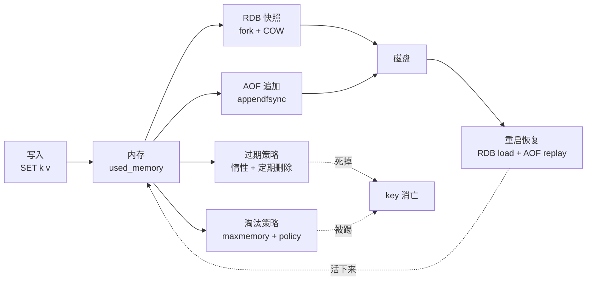
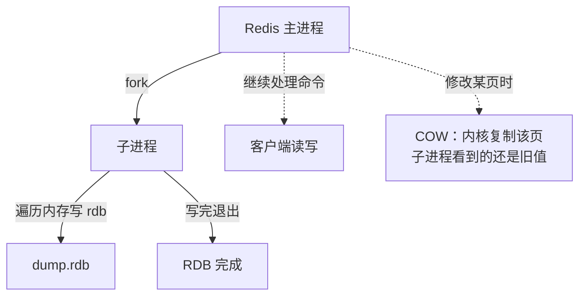
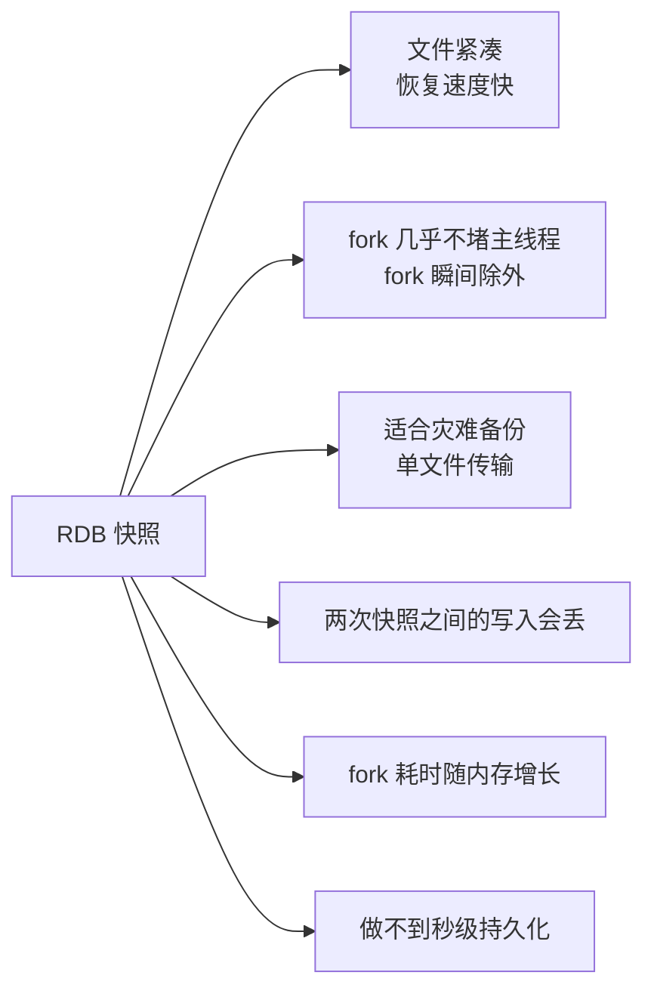
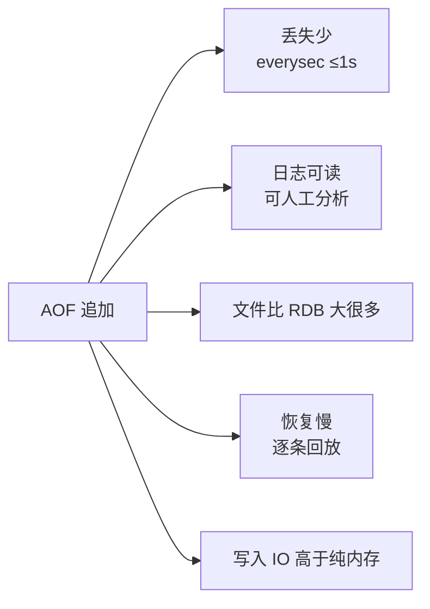
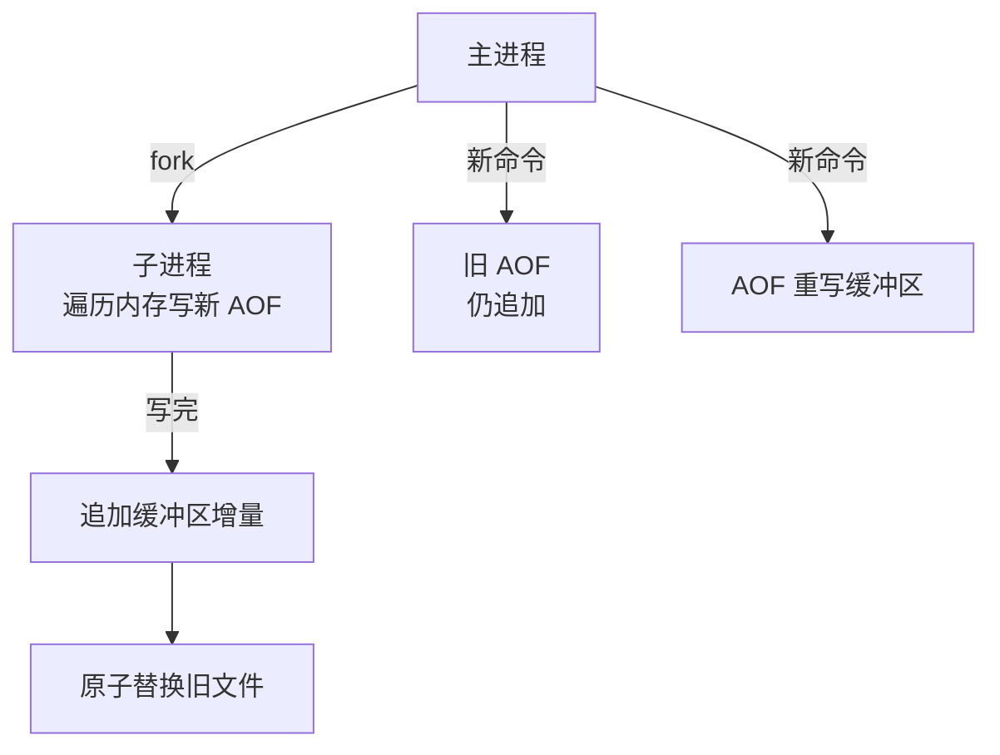
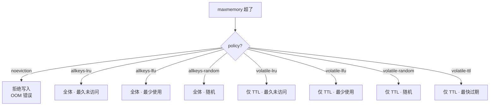
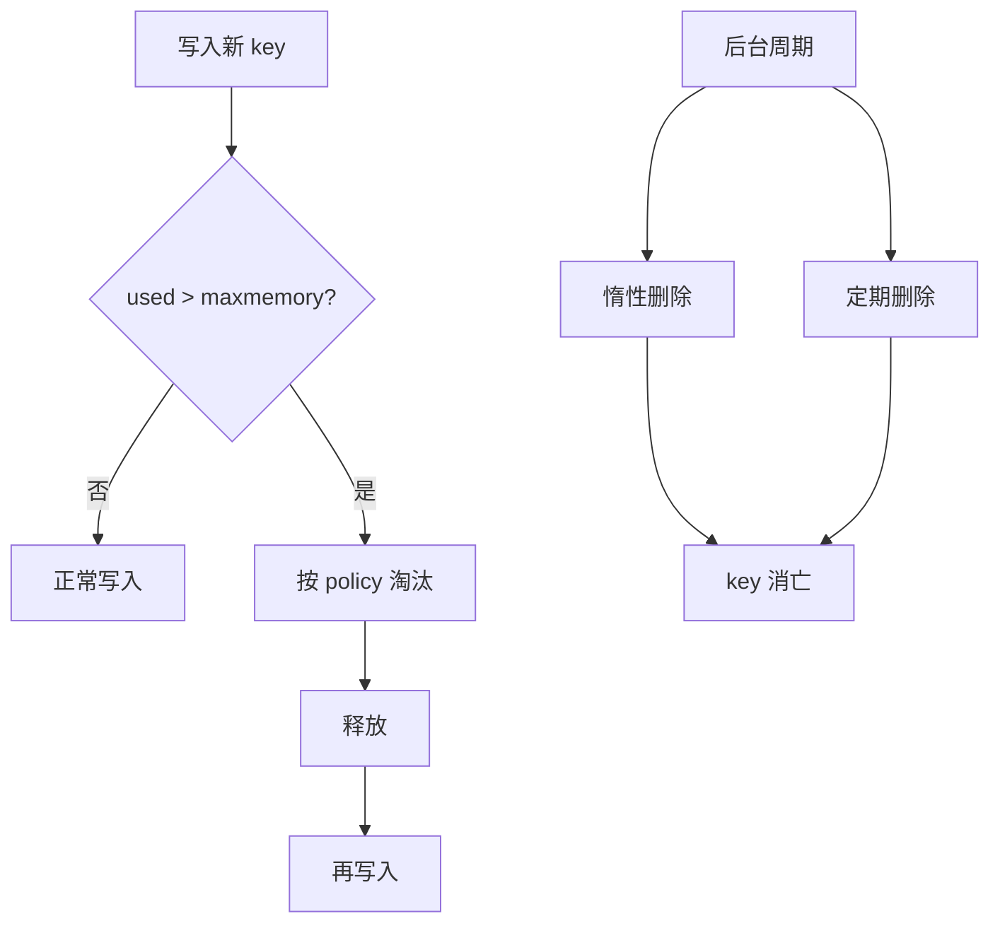
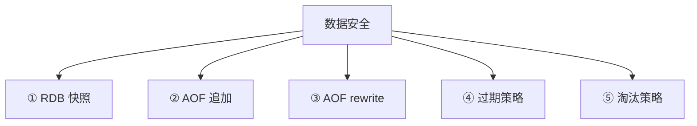
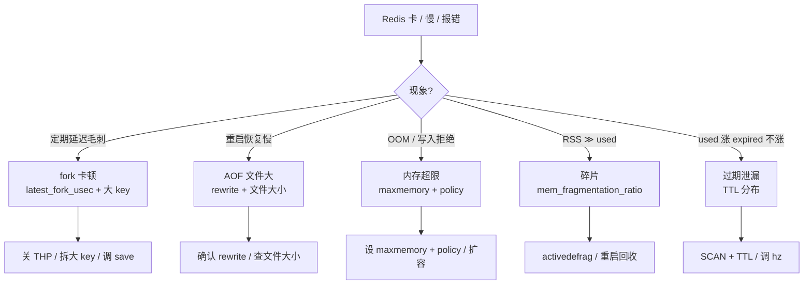

# 持久化与内存管理

> Redis 重启后有的 key 还在、有的没了，`used_memory` 和 RSS 差了 2GB——群里已经有人喊「先把 maxmemory 调大」「AOF 太慢关掉算了」。
> **本章回答**：一个 key 写进内存后，怎么活过重启、怎么在内存满了时被淘汰、怎么在过期后死去。
> **不讲**：数据结构选型 → [01](../01-数据结构与使用场景/)；主从/哨兵/集群故障转移 → [03](../03-高可用与集群/)；缓存穿透/击穿/雪崩 → [04](../04-缓存架构/)。

**标记**：🎯重点 · 🔥难点 · ⭐常考 · 🔧实操

---

## 一、一张图：一个 key 的存活路径

> 🎯 **一句话**：key 从写入内存到活过重启，要过三关——持久化（RDB/AOF）、过期（何时死）、淘汰（内存满了谁走）。



- 📖 **读图**
  - 主线：写入内存 → RDB/AOF 落盘 → 重启活下来；过期 / 淘汰是两条独立死法
  - RDB 与 AOF 可并行；重启时**先 load RDB，再 replay AOF**
  - 过期管 TTL，淘汰管 maxmemory——别混（六节、七节）

> 本节对应练习题：整张存活路径是后面各题的地基；内存细节见 **Q8、Q9**。

---

## 二、出生在内存：Redis 的内存模型

> 🎯 **一句话**：数据常驻物理内存；`used_memory` 是逻辑用量，`used_memory_rss` 是 OS 实给，两者之差是碎片。

Redis 是**命令执行单线程**的内存库（fork / 后台任务另起子进程）。搞清内存模型，才搞得清持久化、淘汰、OOM。

### 📊 三个核心指标 ⭐

```text
used_memory         ← Redis 分配器分配的总字节（逻辑用了多少）
used_memory_rss     ← OS 视角常驻内存（物理占了多少）
used_memory_peak    ← 历史峰值
```

```bash
redis-cli INFO memory | grep -E 'used_memory:|used_memory_rss:|used_memory_peak:'
# used_memory:1073741824          # ← 1GB，逻辑用量
# used_memory_rss:2013265920      # ← 1.875GB，物理占用，比逻辑大 = 有碎片
# used_memory_peak:2147483648     # ← 2GB，历史峰值
```

> 🔍 **现场**：RSS ≫ used_memory 先看碎片率，别直接重启。

### 🧩 内存碎片率 🔧

**mem_fragmentation_ratio** = `used_memory_rss / used_memory`：

```bash
redis-cli INFO memory | grep mem_fragmentation_ratio
# mem_fragmentation_ratio:1.87    # ← RSS / used_memory
```

- **1.0 ~ 1.5**：正常（jemalloc 少量碎片常态）
- **> 1.5**：碎片明显——频繁改/删大 key 后，分配器还不出物理页给 OS
- **< 1.0**：OS 在换页 / swap，**危险**——性能会断崖

> 💡 **打个比方**：租了仓库（RSS），货架只占一半（used_memory）。搬走货架后仓库面积退不掉——碎片率 1.8 ≈「快一半空着却退不了」。

#### ❓ 碎片率 <1 为什么比 >1.5 更危险？

- `>1.5`：浪费物理内存，还能用，最多扩容 / `activedefrag`
- `<1`：RSS **小于**逻辑用量 → 多半在 **swap**——Redis 变成「磁盘数据库」，延迟爆炸
- 👉 值班先盯 `<1`；`>1.5` 再谈整理

默认分配器是 **jemalloc**（编译期选定），按大小分桶，小块频繁分配比 glibc malloc 更省碎片：

```bash
redis-cli INFO mem_allocator
# mem_allocator:jemalloc-5.1.0    # ← 确认分配器
```

### 🔧 activedefrag：在线碎片整理 🔧

Redis 4.0+ 后台线程整理碎片，不必重启：

```bash
CONFIG SET activedefrag yes
# OK
CONFIG SET active-defrag-ignore-bytes 100mb    # ← 总碎片低于此不启动
# OK
CONFIG SET active-defrag-threshold-lower 10    # ← 碎片率超 10% 开始
# OK
CONFIG SET active-defrag-threshold-upper 100   # ← 超 100% 全力
# OK
```

> ⚠️ **别混**：`activedefrag` 清的是**碎片**（RSS − used），不是**已过期未删的 key**（那是过期策略，六节）。碎片率高且 used 也高 → 该扩容，不是 defrag。

### 🐘 大 key 对内存的影响 ⭐🔥

**大 key** = 单 key 的 value 特别大（list 百万元素、hash 五十万字段）。危害贯穿 fork / 删除 / 淘汰：

```bash
redis-cli --bigkeys               # ← 扫各类型最大 key
redis-cli MEMORY USAGE mykey      # ← 单 key 字节（含 overhead）
# Integer: 72                      # ← 72 字节
```

- ① fork 时页表 / COW 更重（三节）
- ② `DEL` 大 key 是 O(N)，卡主线程
- ③ 淘汰时一个大 key 可占满限额，反复触发

```bash
UNLINK bigkey1 bigkey2            # ← 4.0+ 异步释放，不堵主线程
# (integer) 2
```

> 📝 **面试**：大 key 四步——`--bigkeys` / `MEMORY USAGE` 发现 → `UNLINK` 删 → 拆小 key → 监控上限告警。**生产别 `DEL` 百万元素**。

> ⭐ **口诀**：大 key 用 `UNLINK` 别 `DEL`；碎片率高先查大 key 和 allocator，别盲开 `activedefrag`。

> 本节对应练习题 **Q8、Q9**。

---

## 三、活过重启：RDB 快照

> 🎯 **一句话**：RDB 是某一时刻的二进制全量快照；靠 fork + COW 写盘，恢复快，但会丢最后一次快照后的写入。

### 🧬 fork + COW 🎯🔥

#### ❓ fork 会不会把整份内存复制一份？

- ❌ **不是整份复制**：fork 只复制**页表**；父子共享物理页
- ✅ **COW**：父进程改某页时，内核才复制那一页给子进程
- 📏 开销 ≈ 页表大小 ∝ `used_memory`；大 key / THP 会把 `latest_fork_usec` 打毛刺
- 🔍 第一刀：`INFO stats | grep latest_fork_usec`



- 📖 **读图**
  - fork 瞬间只复制页表；子进程拿「冻结在 fork 那一刻」的视图写盘
  - 父继续干活；只有被改动的页才真正复制——写越少，COW 越轻

> 💡 **打个比方**：给图书馆拍全景（fork）——拍下的是那一瞬间的书架。有人还书不影响照片；被换位置的书，才单独给你留一份旧版（COW）。

### fork 开销 ⭐🔧

```bash
redis-cli INFO stats | grep latest_fork_usec
# latest_fork_usec:45000          # ← 45000μs = 45ms
```

- **< 10ms**：健康
- **10ms ~ 100ms**：可接受
- **> 100ms**：主线程被堵，客户端感知毛刺
- **> 1s**：严重——常见于大 key 多、内存大、**THP 开启**

> 🔍 **现场**：周期性 ~100ms 延迟毛刺 → 先查 `latest_fork_usec`（多半是自动 RDB / rewrite fork）。

### bgsave 与 save ⭐

```bash
BGSAVE
# Background saving started        # ← fork 后台写

SAVE                               # ← 前台同步，主线程阻塞！生产别用
# OK

redis-cli DBSIZE
# (integer) 100000
```

> ⚠️ **别混**：`SAVE` 堵全库；手动只许 `BGSAVE`。

### 自动触发

`save` 规则在**时间 + 变更次数同时满足**时触发 BGSAVE：

```bash
CONFIG GET save
# save
# 3600 1 300 100 60 10000
# ← 3600s≥1 变更 / 300s≥100 / 60s≥10000 → BGSAVE
```

- 正常 `SHUTDOWN` 会做最后一次 SAVE
- 主从全量同步时主节点 BGSAVE 生成 RDB 发给从（→ [03](../03-高可用与集群/)）

### RDB 优缺点 ⭐



- 📖 **读图**：优势在「快」；劣势在「丢」——两次快照之间全丢，不可能秒级零丢

> 📝 **面试**：RDB 优点——紧凑、恢复快、好备份；缺点——丢失窗口、大内存 fork 毛刺。

> 本节对应练习题 **Q1、Q2、Q11**。

---

## 四、活过重启：AOF 追加

> 🎯 **一句话**：AOF 把每条写命令追加到日志；重启按序回放——丢得少，但文件大、恢复慢。

### AOF 工作流程 🎯


- 📖 **读图**：主线程先执行 → 进 `aof_buf` → 按 `appendfsync` 刷盘；重启按文件顺序回放

### 💾 appendfsync 三档 ⭐🔥

#### ❓ 开 AOF 是不是就零丢失？always 更安全吗？

- `everysec`（默认）：最多丢 **约 1 秒**——生产标准档
- `always`：每条 fsync，接近零丢，写入可掉一个数量级——几乎不用
- `no`：交给 OS，丢失窗口不可控
- 👉 「更安全」要说清代价；别把 always 当 everysec 的升级版

| 策略 | 语义 | 丢数据 | 性能 |
|------|------|--------|------|
| `always` | 每条 fsync | **0 丢失** | 最差 |
| `everysec` | 每秒一次 | **最多 1 秒** | 折中，**默认** |
| `no` | 交给 OS | ~30s 量级 | 最好，不可控 |

```bash
CONFIG GET appendfsync
# appendfsync
# everysec                    # ← 默认

CONFIG SET appendfsync everysec
# OK
```

> ⚠️ **别混**：`always` ≠ 「更安全的 everysec」——高写入下性能可掉到 1/10。生产几乎一律 `everysec`。

### AOF 优缺点 ⭐



- 📖 **读图**：优势在「不丢」；劣势在「慢」——文件膨胀，大 AOF 恢复可能数分钟

### 开启 AOF 🔧

```bash
CONFIG SET appendonly yes
# OK
CONFIG GET appendonly
# appendonly
# yes

CONFIG GET appendfilename
# appendfilename
# appendonly.aof
```

> 🔍 **现场**：从纯 RDB 切到 RDB+AOF，`appendonly yes` 会在后台生成首份 AOF，短暂降速——别在高峰开。

同一 key 改 100 次，日志就有 100 条——恢复要重放 100 次。压缩靠 rewrite（五节）。

> 本节对应练习题 **Q3**。

---

## 五、AOF rewrite 重写

> 🎯 **一句话**：rewrite 去掉无效/过期命令，用最小命令集重建新 AOF，文件瘦下来但不丢数据。

### 为什么需要 rewrite 🎯⭐

```text
原始 AOF：
  SET k1 v1
  SET k1 v2           ← 覆盖，v1 没用了
  SET k1 v3           ← 又覆盖
  LPUSH list a
  LPUSH list b
  DEL list            ← list 已删，前面白写

rewrite 后：
  SET k1 v3           ← 只留最终状态
  （list 相关全部去掉）
```

### bgrewriteaof 与触发 🔧

```bash
BGREWRITEAOF
# Background append only file rewriting started

CONFIG GET auto-aof-rewrite-percentage
# auto-aof-rewrite-percentage
# 100                               # ← 比上次 rewrite 后大 100% 就触发

CONFIG GET auto-aof-rewrite-min-size
# auto-aof-rewrite-min-size
# 67108864                          # ← ≥64MB 才考虑
```

两个条件**同时满足**才自动触发：文件 ≥ `min-size`，且相对上次 rewrite 后增长 ≥ `percentage`%。

### rewrite 的 fork 开销 🔥

rewrite 与 BGSAVE 一样走 **fork + COW**：子进程遍历内存，把每个 key 的最终状态写成新 AOF 命令。

```bash
redis-cli INFO stats | grep latest_fork_usec
# latest_fork_usec:78000            # ← 78ms
```

> ⚠️ **别混**：`BGSAVE` 与 `BGREWRITEAOF` 都是 fork；`latest_fork_usec` 记的是**最近一次**——排毛刺两边都查。

### rewrite 期间的新写入 ⭐

#### ❓ rewrite 期间写入会丢吗？和 BGSAVE 冲突吗？

- ✅ **不丢**：新写同时进**旧 AOF** + **重写缓冲区**；子进程写完后把增量补进新文件再原子替换
- ⚠️ 两者都是 fork；`latest_fork_usec` 只记最近一次——排毛刺两边都查
- 🔁 rewrite 压缩的是「最终状态命令集」，不是删历史备份



- 📖 **读图**：旧 AOF 保底不丢；重写缓冲区收增量；完成后补入再替换

> 📝 **面试**：rewrite 不丢——fork 后主进程双写旧 AOF + 重写缓冲，子进程完成后追加再原子替换。

#### ❓ 为什么同时开 RDB+AOF？重启先 load 谁？

- 🚀 **RDB**：冷启动快（二进制直灌内存）
- 🛡️ **AOF**：补上 RDB 之后的增量（`everysec` 窗口内）
- 📦 **恢复顺序**：先 load RDB → 再 replay AOF 增量
- ❌ 只开 RDB：丢快照后全部写入；只开 AOF：大文件回放慢

> 本节对应练习题 **Q4**。

---

## 六、过期策略：key 怎么死

> 🎯 **一句话**：设了 TTL 不会到点自动消失——靠**惰性删除 + 定期删除**两套机制清。

#### ❓ 过期了为什么还占着内存？和淘汰会不会打架？

- 😴 **惰性**：没人访问就不查过期 → 可一直占内存
- 🎲 **定期**：随机抽样，大比例过期 key 可能漏
- 🤝 **不冲突**：过期是 pull（到点清），淘汰是 push（写满才踢）；可以「没过期被淘汰」，也可以「过期了还没删」

### 惰性删除 ⭐

访问某 key 时先查 TTL，过期则删并返回 nil：

```bash
SET session:abc "data" EX 60
# OK
GET session:abc          # 59s 内
# "data"
GET session:abc          # 61s 后
# (nil)                  # ← 访问时删除
```

- ✅ 对 CPU 友好
- ❌ 过期后**再不访问** → 一直占内存（「过期未删」泄漏）

### 定期删除 ⭐

默认每秒 `hz` 次，从带 TTL 的 key 里**随机抽**一批检查：

```bash
CONFIG GET hz
# hz
# 10                                # ← 每秒 10 次周期

CONFIG GET maxmemory-samples
# maxmemory-samples
# 5                                 # ← 每次抽 5 个（也用于淘汰）
```

- 抽 `maxmemory-samples` 个；过期比例 >25% 继续下一轮
- 每轮 ≤25ms（`fast` 更短），防堵主线程

### 过期 key 的内存泄漏 🔥

> 💡 **打个比方**：垃圾桶（过期 key）不会自己倒——你路过看一眼（惰性）或环卫随机扫（定期）。某角从没人路过、抽样也没抽到，垃圾就堆着。

```bash
redis-cli INFO stats | grep expired_keys
# expired_keys:15234               # ← 累计删除的过期 key
```

> 🔍 **现场**：`expired_keys` 长期不涨、used 持续升 → 大量过期 key 没被采样到。`SCAN` + `TTL` 批量查。

> ⚠️ **别混**：过期 ≠ 淘汰。过期管「TTL 到了怎么清」；淘汰管「内存满了踢谁」。

> ⭐ **口诀**：过期管 TTL，淘汰管上限——两套机制。

> 本节对应练习题 **Q5**。

---

## 七、淘汰策略：内存满了怎么办

> 🎯 **一句话**：`used_memory` 超过 `maxmemory` 时，按 `maxmemory-policy` 主动踢 key 腾空间。

### maxmemory ⭐🔧

```bash
CONFIG GET maxmemory
# maxmemory
# 0                                 # ← 0 = 不限制（会被 OOM kill）

CONFIG SET maxmemory 4gb
# OK
```

> 🔍 **现场**：`maxmemory=0` 可吃光物理内存直到 OOM killer。生产**必须设**。

### 🧹 八种淘汰策略 🎯⭐🔥



- 📖 **读图**
  - `allkeys-*` 在全体 key 里选；`volatile-*` 只在带 TTL 的里选
  - `noeviction`：不淘汰，直接拒写

```bash
CONFIG GET maxmemory-policy
# maxmemory-policy
# noeviction                        # ← 默认！

CONFIG SET maxmemory-policy allkeys-lru
# OK
```

> ⚠️ **别混**：默认就是 `noeviction`——满了不淘汰、返回 `OOM command not allowed`。以为「会自动淘汰」是错的。生产必须显式设策略。

#### ❓ 内存满了 Redis 会自动淘汰吗？

- ❌ **默认不会**：`noeviction` 直接拒写
- ✅ 生产显式设 `allkeys-lru` / `allkeys-lfu` / `volatile-*`
- 📊 LRU 是**近似**采样（`maxmemory-samples`），不是精确链表

### LRU vs LFU 🔥

| 对比 | LRU | LFU |
|------|-----|-----|
| 依据 | 最久未访问 | 访问频率最低 |
| 场景 | 时间局部性强 | 明确热点 |
| 实现 | 近似 LRU（随机采样） | 频率计数 + 衰减 |

> 💡 **打个比方**：LRU =「最久没人碰的书扔掉」；LFU =「翻得最少的书扔掉」。工具书昨天翻过一次（LRU 留），一年就翻这一次（LFU 扔）。

```bash
CONFIG SET maxmemory-samples 10    # ← 默认 5，调大更接近精确 LRU，更耗 CPU
# OK
```

- Redis LRU **不是**双向链表精确 LRU，是近似采样
- LFU（4.0+）有频率计数 + **时间衰减**，防旧热点永占

> 📝 **面试**：热点明确用 LFU，时间局部性用 LRU；采样默认 5，调 10 更准更慢。

### 淘汰与过期的协作



- 📖 **读图**：淘汰是**写时 push**；过期是**访问 + 后台 pull**——两条独立路径都会释内存

### 收束：数据安全五道防线 🎯⭐

面试问「Redis 如何保证不丢」，要的是这张清单：



- 📖 **读图**
  - ①② 持久化双保险：RDB 快、AOF 少丢；同时开时先 RDB 再 AOF
  - ③ rewrite 防 AOF 无限胀，增量缓冲保证不丢
  - ④⑤ 内存两道闸：清 TTL / 管上限——没有就泄漏或 OOM kill

> ⚠️ **别混**：五道防线**不保证零丢失**。`everysec` ≤1s；RDB 丢快照后全部。零丢失只能 `always`（代价巨大）或换真数据库。Redis 是「可接受少量丢失」的工程权衡。

> 📝 **面试**：持久化三件（RDB / AOF / rewrite）+ 内存两件（过期 / 淘汰）；补一句「不保证零丢，是权衡」。

> 本节对应练习题 **Q6、Q7、Q10、Q13**。

---

## 八、作战：排障定责

> 🎯 **一句话**：卡 / 慢 / 报错 80% 落在 fork、AOF 恢复、OOM、碎片——先 `INFO` 再动手。

### 决策树



- 📖 **读图**：毛刺→fork；恢复慢→AOF；写不进→maxmemory；RSS 虚高→碎片；used 涨 expired 不涨→过期泄漏

### 现象 · 先做 · 别做

| 现象 | 先做 | 别做 |
|------|------|------|
| 每 5min 毛刺 ~100ms | `latest_fork_usec` + `INFO memory` | 不查 fork 直接扩容 |
| 重启恢复几分钟 | AOF 大小 + 是否 rewrite | 直接砍成 RDB only |
| 写入报 OOM | maxmemory + policy | 直接重启 |
| RSS 2× used | 碎片率 + activedefrag | 直接重启（丢未刷盘） |
| used 涨 expired 不涨 | SCAN + TTL | 盲调 samples 到 100 |
| 大 key 删除卡 | `UNLINK` | `DEL` 百万元素 |
| appendfsync=always 慢 | 改 everysec | 为性能关 AOF |

### 60 秒剧本 🔧

> 🔍 **现场**：接到「Redis 卡/慢/报错」，60 秒走完再下结论。

```text
① 0–10s   内存超限？  INFO memory → used / maxmemory / fragmentation
② 10–30s  fork 毛刺？ INFO stats → latest_fork_usec；延迟是否周期性
③ 30–45s  AOF 问题？ INFO persistence → aof_*；查文件大小
④ 45–60s  定型：fork→拆大 key 关 THP / OOM→policy 扩容 / 碎片→activedefrag
```

> 本节对应练习题 **Q12、Q14**。

---

## 九、收口

### 命令速查 🔧

```bash
# 内存三件套
redis-cli INFO memory | grep -E 'used_memory:|used_memory_rss:|mem_fragmentation_ratio:'
# used_memory:1073741824
# used_memory_rss:2013265920
# mem_fragmentation_ratio:1.87

# fork
redis-cli INFO stats | grep latest_fork_usec
# latest_fork_usec:45000

# RDB
redis-cli INFO persistence | grep -E 'rdb_last_bgsave|bgsave_in_progress'
# rdb_last_bgsave_status:ok
# bgsave_in_progress:0

# AOF
redis-cli INFO persistence | grep -E 'aof_enabled|aof_last_bgrewrite|aof_rewrite_in_progress'
# aof_enabled:1

# 过期 / 淘汰累计
redis-cli INFO stats | grep expired_keys
# expired_keys:15234
redis-cli INFO stats | grep evicted_keys
# evicted_keys:892

# 大 key
redis-cli --bigkeys
redis-cli MEMORY USAGE mykey

# 手动持久化
redis-cli BGSAVE
redis-cli BGREWRITEAOF

# 异步删 / 碎片整理（4.0+）
redis-cli UNLINK bigkey
# (integer) 1
redis-cli CONFIG SET activedefrag yes
```

### 面试锚点

| 问 | 30 秒答 |
|----|---------|
| RDB vs AOF？ | RDB 全量快照恢复快但有丢失窗口；AOF 增量日志少丢但恢复慢。生产同时开。 |
| fork 为什么慢？ | 复制页表，∝ used_memory；大 key + THP 更慢。查 `latest_fork_usec`。 |
| appendfsync 三档？ | always 每条 fsync 零丢最慢；everysec 最多丢 1s（默认）；no 交 OS 不可控。 |
| rewrite 丢数据吗？ | 不丢。双写旧 AOF + 重写缓冲，完成后追加再原子替换。 |
| 过期两种？ | 惰性（访问时）+ 定期（随机抽样）。过期不访问可不立刻清。 |
| 淘汰怎么选？ | 缓存 allkeys-lru；热点 allkeys-lfu；混存 volatile-*；默认 noeviction 要改。 |
| LRU vs LFU？ | LRU 看最近访问（近似采样）；LFU 看频率（4.0+，有衰减）。 |
| noeviction？ | 默认，满了拒写。生产改 allkeys-lru 等。 |
| used 与 RSS 差很多？ | 碎片。查 ratio，>1.5 用 activedefrag，别盲重启。 |
| 大 key？ | `--bigkeys` 发现，`UNLINK` 删，拆小，监控 USAGE。 |
| 过期清不掉？ | 随机采样会漏；调 hz 或 SCAN+TTL 批量清。 |
| 重启恢复？ | 先 load RDB，再 replay AOF。RDB 给速度，AOF 补差额。 |

### 易错一句话对照

- RDB 恢复快 = 不丢 → 丢最后一次快照后的全部写入
- AOF 每条追加 = 每条 fsync → `everysec` 每秒一次；`always` 才是每条
- rewrite 会丢 → 增量进重写缓冲，不丢
- 过期了就自动删 → 惰性 + 定期；不访问可能一直占着
- 内存满了自动淘汰 → 默认 noeviction 拒写
- LRU 是精确 LRU → 近似采样 `maxmemory-samples`
- LFU = LRU → LFU 看频率，LRU 看最近时间
- RSS 大 = 泄漏 → 先看碎片率；高用 activedefrag
- `DEL` 大 key 没事 → O(N) 堵主线程，用 `UNLINK`
- 关 AOF 更爽 → 丢的是未刷盘全部；everysec 代价已够小
- fork 复制全部内存 → 只复制页表，COW 按需
- maxmemory=0 没事 → 会被 OOM kill，生产必须设
- 碎片率 <1 只是「挺好」 → 多半在 swap，比 >1.5 更危险

### 数字墙

> RDB = 二进制全量 · AOF = 文本命令日志 · `everysec` 最多丢 **1s** · `always` 零丢性能降 **~10×** · `maxmemory-samples` 默认 **5** · `hz` 默认 **10**/s · 定期删除每轮 ≤**25ms** · 过期比例超 **25%** 继续抽 · `latest_fork_usec` 健康 **<10ms** · `mem_fragmentation_ratio` 正常 **1.0~1.5** · `activedefrag` / `UNLINK` / LFU 均需 **4.0+** · 淘汰策略 **8** 种 · 防线 **5** 道

---

## 合上书

- [ ] **默画一节的图**：写入 → RDB/AOF → 重启 → 过期/淘汰；五道防线。（Q12）
- [ ] **口述内存模型**：used / RSS / 碎片率；`<1` 为何更危险；activedefrag 清什么。（Q8、Q9）
- [ ] **口述 RDB**：fork+COW、bgsave vs save、触发条件、优缺点、fork 为何慢。（Q1、Q2、Q11）
- [ ] **口述 AOF**：追加流程、appendfsync 三档、优缺点。（Q3）
- [ ] **口述 rewrite**：为何需要、触发条件、期间新写入、与 BGSAVE 的 fork 关系；为何同时开 RDB+AOF、恢复顺序。（Q4）
- [ ] **口述过期**：惰性 + 定期、过期未删、`expired_keys`。（Q5）
- [ ] **默画淘汰**：八种分两组、默认 noeviction、LRU vs LFU。（Q6、Q7、Q10、Q13）
- [ ] **口述大 key**：发现、`UNLINK`、拆分、对 fork 的影响。（Q8、Q9）
- [ ] **口述恢复**：先 RDB 再 AOF、为何双开。（Q11）
- [ ] **定责**：fork / AOF / OOM / 碎片各看什么——再拦开篇那句「调 maxmemory / 关 AOF」。（Q12、Q14）

下一章：节点挂了 key 怎么还在 → [高可用与集群](../03-高可用与集群/)。数据结构 → [01](../01-数据结构与使用场景/)；缓存架构 → [04](../04-缓存架构/)。
