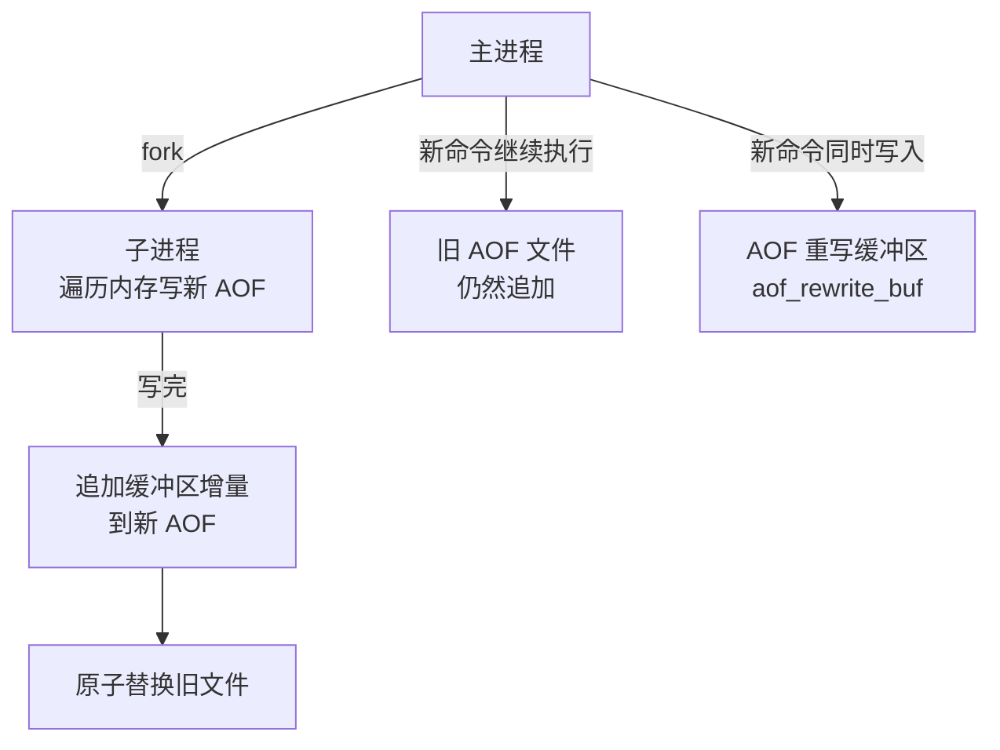
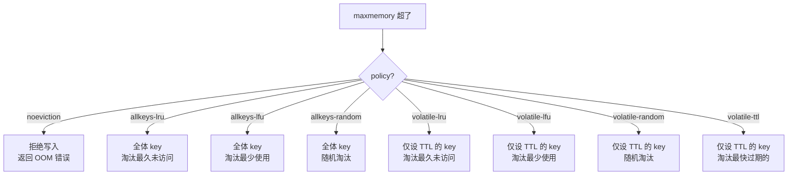
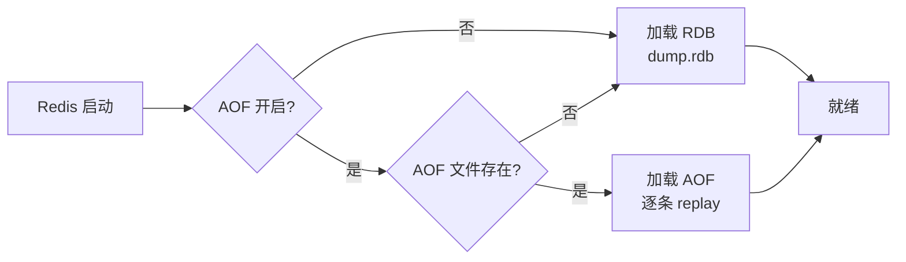

# 02-02｜持久化与内存管理 · 练习题

开始做题前，先给大家一个小建议：合上知识点，对着 **一节的主图**，把主线口述一遍。能顺下来，下面这些题你会发现大半都会了；卡壳的地方，就是你该回去重读的那一节。

做题的方式也建议改一下：每道题**先看标题和场景，自己口述一遍答案，再往下看「完整解答」对答案**。直接看解答，容易产生「我会了」的错觉——能讲出来才是真的会。

| 标记 | 含义 |
|------|------|
| **核心** | 不懂整章就没建立起来 |
| **必会** | 值班和面试都要能讲 |
| **常用** | 线上会反复碰到 |
| **常考** | 白板和追问的高频口径 |

题目的顺序也是有意排的：Q1～Q4 先把 RDB/AOF/rewrite 钉死；Q5～Q7、Q10、Q13 专攻过期与淘汰；Q8、Q9 内存模型与大 key；Q11～Q14 收尾到恢复与值班定责。

## 本题目录

- [Q1 RDB 和 AOF 区别与选型](#q1)
- [Q2 fork 为什么慢](#q2)
- [Q3 appendfsync 三档丢多少数据](#q3)
- [Q4 AOF rewrite 丢数据吗](#q4)
- [Q5 过期 key 不被清怎么办](#q5)
- [Q6 八种淘汰策略怎么选](#q6)
- [Q7 LRU vs LFU](#q7)
- [Q8 used_memory 和 RSS 差很多](#q8)
- [Q9 大 key 怎么处理](#q9)
- [Q10 noeviction 导致写入报 OOM](#q10)
- [Q11 Redis 重启恢复流程](#q11)
- [Q12 定期延迟毛刺排查](#q12)
- [Q13 maxmemory-policy 怎么选](#q13)
- [Q14 内存 OOM 60 秒定责](#q14)
- [合上书](#合上书)

---

## Q1

**★★★★★｜RDB 和 AOF 区别是什么？生产环境怎么选？**

**覆盖**：核心 · 必会 · 常考 ｜ **对应**：知识点 [三、活过重启：RDB 快照](知识点.md)

### 场景

这道题几乎是 Redis 持久化面试的「开场白」。

新项目要上线，架构评审时有人问「Redis 持久化选 RDB 还是 AOF」。有人说「RDB 恢复快选 RDB」，有人说「AOF 不丢数据选 AOF」。还有人问「能不能两个都开」。

先自己试试：不看下面，你能口述出关键结论吗？想完再对答案。

### 完整解答

> 🎯 **一句话**：RDB 是全量快照恢复快但有丢失窗口，AOF 是增量日志丢失少但恢复慢——生产同时开，重启先 load RDB 再 replay AOF。

两者的机制完全不同：

```text
RDB：fork 子进程 → 把内存全量数据写成二进制 dump.rdb → 恢复时直接加载
AOF：每条写命令追加到 appendonly.aof → 恢复时逐条回放
```

| 对比 | RDB | AOF |
|------|-----|-----|
| 原理 | 全量快照（二进制） | 增量日志（文本命令） |
| 丢数据 | 两次快照之间的写入全丢 | everysec 最多丢 1 秒 |
| 恢复速度 | 快（直接加载二进制） | 慢（逐条回放命令） |
| 文件大小 | 紧凑 | 比较大（需 rewrite 压缩） |
| fork 开销 | 有（BGSAVE） | rewrite 时有（bgrewriteaof） |

**生产推荐**：同时开 RDB + AOF。RDB 做灾难恢复的底牌（文件小、传得快），AOF 做日常数据安全（最多丢 1 秒）。重启时 Redis 先 load RDB 到内存（快），再 replay AOF 中 RDB 之后产生的增量命令（补差额）——兼顾恢复速度和数据安全。

> ⚠️ **别混**：同时开 RDB + AOF 不是「RDB 负责一部分、AOF 负责另一部分」。RDB 是某个时间点的全量快照，AOF 是那之后的增量日志。恢复时 RDB 给一个快速的起点，AOF 补上从那个起点到宕机的差额。

> 📝 **面试**：问「RDB 还是 AOF」，答「同时开。RDB 恢复快做冷备，AOF 丢得少做热备。重启先 load RDB 再 replay AOF。不要为了性能只开 RDB——丢了最后一次快照后的全部写入，业务不一定能接受」。

### 再追问

**只开 AOF 行不行？**——可以，但 AOF 文件大、恢复慢。一个 10GB 的 AOF 回放可能要几分钟，而 RDB 加载可能只要几十秒。灾难恢复时「快速拉起来」很重要，RDB 做底牌。

**RDB 的 save 规则怎么配？**——默认 `3600 1 300 100 60 10000` 已经够用。不要配得太频繁（如 `60 1`），会频繁 fork 造成延迟毛刺。对数据安全要求高就靠 AOF 的 everysec 兜底，不是把 RDB 触发频率调高。

---

## Q2

**★★★★★｜RDB 的 fork 为什么会卡？怎么排查？**

**覆盖**：核心 · 必会 · 常考 ｜ **对应**：知识点 [三、活过重启：RDB 快照](知识点.md)

### 场景

Q1 讲了 RDB 是什么；这道题抠 fork + COW——很多人答「fork 复制全部内存」。

线上 Redis 每 5 分钟出现一次 ~100ms 的延迟毛刺，业务报 P99 偶发尖刺。有人怀疑网络抖动，有人要扩容。

先自己试试：不看下面，你能口述出关键结论吗？想完再对答案。

### 完整解答

> 🎯 **一句话**：fork 复制的是页表不是全部内存，但页表大小跟 used_memory 成正比——内存越大 fork 越慢，大 key 和 THP 会更慢。

RDB 的 `BGSAVE` 靠 `fork` 出子进程 + COW 写盘。fork 本身是 **O(页表大小)**：操作系统要复制父进程的页表（虚拟内存到物理内存的映射表），这个表的大小和数据量成正比。

```bash
redis-cli INFO stats | grep latest_fork_usec
# latest_fork_usec:78000          # ← 上次 fork 耗时 78ms
```

fork 慢的三个常见原因：

- **内存大**：10GB 数据的页表远大于 1GB，fork 自然慢。
- **大 key 多**：大 key 导致 COW 时复制的页更多——虽然 fork 本身只复制页表，但 fork 后父进程修改大 key 会触发大量 COW 页复制，间接影响性能。
- **THP（透明大页）开启**：THP 把 4KB 页合并成 2MB 大页，fork 时复制页表的条目数减少但每个条目覆盖的内存大，COW 时一改就复制 2MB 而非 4KB——**放大写时复制开销**。

```bash
# 检查 THP
cat /sys/kernel/mm/transparent_hugepage/enabled
# [always] madvise never          # ← always = THP 开启，要关

# 关闭 THP（Redis 官方推荐）
echo never > /sys/kernel/mm/transparent_hugepage/enabled
```

> ⚠️ **别混**：fork 复制页表不等于复制全部内存。fork 后父子进程共享物理页，只有父进程修改某页时内核才 COW 复制那一页。**不要**说「fork 会把内存复制一份」——那是 COW 做的、而且是按需的。

> 📝 **面试**：问「fork 为什么慢」，答三点：① fork 要复制页表，大小与 used_memory 成正比；② THP 放大 COW 开销；③ 大 key 增加写时复制的页数。排查看 `latest_fork_usec`，关 THP，拆大 key。

### 再追问

**延迟毛刺怎么确认是 fork 导致的？**——看周期性。RDB 自动触发的 `save` 规则如 `300 100`（5 分钟内 100 次变更触发），毛刺间隔正好 5 分钟一次就高度可疑。配合 `INFO persistence` 的 `rdb_last_bgsave_time_sec` 和 `bgsave_in_progress` 确认。

**扩容能解决吗？**——不能直接解决。加内存反而让页表更大、fork 更慢。正确做法：关 THP、拆大 key、调稀 save 规则、评估是否上 [03](../03-高可用与集群/) 的集群分片让单实例数据量降下来。

---

## Q3

**★★★★☆｜appendfsync 三档策略各丢多少数据？always 为什么生产几乎不用？**

**覆盖**：必会 · 常考 ｜ **对应**：知识点 [四、活过重启：AOF 追加](知识点.md)

### 场景

RDB 有丢失窗口，下一问自然是 AOF。

团队讨论 AOF 配置，有人说「用 always 最安全」，有人说「always 太慢用 everysec」，有人问「no 是什么」。

先自己试试：不看下面，你能口述出关键结论吗？想完再对答案。

### 完整解答

> 🎯 **一句话**：always 每条命令都 fsync 零丢失但性能降 ~10×；everysec 每秒一次最多丢 1 秒（默认）；no 交给 OS 不可控。

AOF 命令先写 `aof_buf` 内存缓冲区，再按 `appendfsync` 策略刷到磁盘：

| 策略 | 语义 | 丢数据 | 性能 |
|------|------|--------|------|
| `always` | 每条命令执行后立即 fsync | 0 丢失 | 最差（~10× 慢） |
| `everysec` | 每秒 fsync 一次 | 最多 1 秒 | 折中（默认） |
| `no` | 不主动 fsync，交给 OS | OS 刷盘间隔（~30s） | 最好但不可控 |

```bash
CONFIG GET appendfsync
# appendfsync
# everysec                    # ← 默认值

CONFIG SET appendfsync everysec
# OK
```

**always 为什么生产几乎不用**：`fsync` 要求磁盘把数据真正写到物理扇区，这个操作在机械盘上 ~10ms、SSD 上也要 1~2ms。高写入场景下每条命令都等 fsync，Redis 的吞吐会降到原来的 1/10 甚至更低。`everysec` 的折中已经足够——最多丢 1 秒数据，对绝大多数缓存场景可接受。

> ⚠️ **别混**：`always` 不是「更安全的 everysec」——`everysec` 是每秒一次 fsync，`always` 是**每条命令**都 fsync，性能差距不是一个量级。不要因为「安全」就上 always，先评估业务能否接受 1 秒丢失。

> 📝 **面试**：问「appendfsync 怎么选」，答「生产用 everysec，最多丢 1 秒，性能影响可控。always 零丢失但每条命令都 fsync，高写入下性能降 10 倍，除非是金融级且写入量极低的场景才考虑。no 不可控，不用」。

### 再追问

**everysec 的「最多丢 1 秒」怎么理解？**——Redis 有一个后台线程每秒执行一次 fsync。如果 Redis 在两次 fsync 之间崩溃，最后一次 fsync 之后到崩溃前的写入会丢——这段最多 1 秒。

**关掉 AOF 性能更好对吗？**——对，但关了丢的是**所有**未刷盘数据。`everysec` 的性能代价已经足够小（一个后台线程每秒一次 fsync），不值得为这点性能关掉 AOF。

---

## Q4

**★★★★☆｜AOF rewrite 期间的写入会丢吗？rewrite 的触发条件是什么？**

**覆盖**：必会 · 常考 ｜ **对应**：知识点 [五、AOF rewrite 重写](知识点.md)

### 场景

就是 Q3 的续集：AOF 文件膨胀了怎么办。

AOF 文件涨到 5GB，运维要手动执行 `BGREWRITEAOF`，开发担心「重写期间的新写入会不会丢」。

先自己试试：不看下面，你能口述出关键结论吗？想完再对答案。

### 完整解答

> 🎯 **一句话**：不会丢。子进程写新文件时，主进程的新写入同时进旧 AOF 和重写缓冲区，子进程完成后把增量追加到新文件再原子替换。

rewrite 的流程：



**读图**：rewrite 期间 Redis 同时维护旧 AOF（保证不丢）和重写缓冲区（收集增量）。子进程完成后，增量补入新文件再替换——所以 rewrite 期间不会丢数据。

**自动触发条件**：两个条件同时满足才触发：

```bash
CONFIG GET auto-aof-rewrite-percentage
# auto-aof-rewrite-percentage
# 100                               # ← 比上次重写后大了 100%

CONFIG GET auto-aof-rewrite-min-size
# auto-aof-rewrite-min-size
# 67108864                          # ← 且文件 ≥64MB
```

也可以手动触发：

```bash
BGREWRITEAOF
# Background append only file rewriting started
```

rewrite 和 BGSAVE 一样靠 fork 子进程 + COW，所以同样有 fork 开销。`latest_fork_usec` 记录最近一次 fork（可能是 BGSAVE 或 bgrewriteaof）。

> ⚠️ **别混**：rewrite 不是「删掉旧文件再写新的」。rewrite 是生成一份**新文件**，完成后**原子替换**旧文件。在替换之前旧文件一直在写——即使子进程崩溃，旧 AOF 完好无损。

### 再追问

**rewrite 和 BGSAVE 能同时执行吗？**——不能。Redis 4.0+ 会在 BGSAVE 执行期间拒绝 BGREWRITEAOF（返回错误），反之亦然。如果两者排队，会按发起顺序串行执行。

**rewrite 期间性能下降正常吗？**——正常。fork 本身有开销（Q2），加上子进程写盘的 IO 竞争。但如果下降严重，考虑：① 内存太大 → 分片（→ [03](../03-高可用与集群/)）；② 磁盘 IO 不够 → 用更快的 SSD；③ 调大 `auto-aof-rewrite-min-size` 减少 rewrite 频率。

---

## Q5

**★★★★★｜设了 TTL 的 key 过期后会立即被删吗？大量过期 key 不被清怎么办？**

**覆盖**：核心 · 必会 · 常考 ｜ **对应**：知识点 [六、过期策略：key 怎么死](知识点.md)

### 场景

持久化讲完，换 key 的死法：过期策略。

线上 Redis used_memory 持续上涨，但 `expired_keys` 计数几乎不涨。开发说「这些 key 都设了 TTL，到期会自动清的」。

先自己试试：不看下面，你能口述出关键结论吗？想完再对答案。

### 完整解答

> 🎯 **一句话**：设了 TTL 的 key 不会到点自动消失——Redis 靠惰性删除（访问时检查）+ 定期删除（随机抽样）清理，过期但不访问的 key 可能一直占着内存。

**惰性删除**：客户端访问某个 key 时，Redis 检查它是否过期，过期就删掉返回 nil。

```bash
SET session:abc "data" EX 60
# OK
# （61 秒后）
GET session:abc
# (nil)                             # ← 访问时才删
```

**定期删除**：Redis 每秒 10 次（`hz=10`）定期扫描，每次随机抽 `maxmemory-samples`（默认 5）个设了 TTL 的 key 检查，过期的删掉。如果过期比例超 25%，继续抽下一轮，每轮不超过 25ms。

**大量过期 key 不被清的原因**：定期删除是**随机抽样**，如果设了 TTL 的 key 数量巨大（比如百万级），每次抽 5 个，命中率很低。这些 key 过期了但不会被及时清，一直占着内存——这就是过期 key 的内存泄漏。

```bash
redis-cli INFO stats | grep expired_keys
# expired_keys:15234               # ← 累计被清的过期 key 数
# 如果这个数长期不涨但 used_memory 涨 → 大量过期 key 没被采样到
```

**处理办法**：

- 调大 `hz`（如 `CONFIG SET hz 20`），让定期删除更频繁——但会增加 CPU 开销。
- 调大 `maxmemory-samples`（如 `CONFIG SET maxmemory-samples 10`），每次抽更多 key——但每轮更慢。
- 用 `SCAN` + `TTL` 批量扫描主动清理：`SCAN` 遍历所有 key，对设了 TTL 的检查是否过期，过期的用 `UNLINK` 删。
- 设淘汰策略（七节）作为兜底——内存满了至少会踢掉一些 key，不管过没过期。

> ⚠️ **别混**：过期策略 ≠ 淘汰策略。过期策略管「到了 TTL 怎么死」，淘汰策略管「内存满了谁先走」。过期了没被清的 key 会被淘汰策略兜底，但那是「内存满了」之后的被动行为，不是「过期就清」的主动行为。

> 📝 **面试**：问「Redis 过期 key 怎么清理」，答「惰性删除 + 定期删除。惰性是访问时检查，定期是随机抽样。大量过期 key 可能漏掉——定期删除是抽样不是全量扫描。调 hz 或 maxmemory-samples 可以加快清理，但最彻底的是 SCAN + TTL 批量清」。

### 再追问

**为什么不做成全量扫描？**——全量扫描百万个 key 会阻塞主线程几秒。Redis 的设计哲学是「单线程不阻塞」，定期删除每轮控制在 25ms 以内就是为此。抽样不是偷懒，是权衡。

**惰性删除的 key 会影响 `INFO` 里的 used_memory 吗？**——会。未被清理的过期 key 仍然算在 used_memory 里——Redis 没删它，内存就没释放。所以「used_memory 涨但 expired_keys 不涨」是过期泄漏的典型信号。

---

## Q6

**★★★★☆｜Redis 有哪几种淘汰策略？缓存场景怎么选？**

**覆盖**：必会 · 常考 ｜ **对应**：知识点 [七、淘汰策略：内存满了怎么办](知识点.md)

### 场景

过期清不干净、内存还满——淘汰策略上场。开篇有人喊调大 maxmemory，先别调。

Redis 当缓存用，内存 8GB，满了之后要踢 key。运维问「策略选哪个」，有人说「随机踢就行」，有人说「LRU」。

先自己试试：不看下面，你能口述出关键结论吗？想完再对答案。

### 完整解答

> 🎯 **一句话**：八种策略分两组——allkeys-* 在所有 key 中选，volatile-* 只在设了 TTL 的 key 中选；缓存场景用 allkeys-lru。



**缓存场景怎么选**：

- **纯缓存（所有 key 都可踢）**：`allkeys-lru`。不区分有无 TTL，全量 LRU 淘汰最久未访问的——最通用。
- **有明确热点的缓存**：`allkeys-lfu`（4.0+）。淘汰访问频率最低的，热点 key 不容易被踢。
- **混存（有些 key 不能踢）**：`volatile-lru`。只淘汰设了 TTL 的 key，没设 TTL 的永久 key 不受影响。

```bash
CONFIG SET maxmemory 8gb
# OK
CONFIG SET maxmemory-policy allkeys-lru
# OK
```

> ⚠️ **别混**：`noeviction` 是 Redis 的**默认策略**——内存满了不淘汰、直接拒绝写入（`OOM command not allowed`）。**不要**以为 Redis 会自动淘汰，生产必须显式设策略。很多人上线时没改配置，内存满了写入全报错。

> 📝 **面试**：问「淘汰策略怎么选」，答「纯缓存用 allkeys-lru，有热点用 allkeys-lfu，混存用 volatile-lru。默认 noeviction 要改。allkeys-* 在所有 key 中选，volatile-* 只在设了 TTL 的 key 中选」。

### 再追问

**volatile-ttl 是什么？**——在设了 TTL 的 key 中，优先淘汰 TTL 最短（最快过期）的。思路是「反正快过期了不如先踢」，但它只看 TTL 不看访问频率——一个 TTL 短但访问频繁的 key 也会被踢，不一定是好选择。

**random 策略什么时候用？**——访问模式很均匀、没有明显冷热区分时。实际很少用，LRU/LFU 几乎总是更好。

---

## Q7

**★★★★☆｜Redis 的 LRU 和 LFU 有什么区别？LRU 是精确 LRU 吗？**

**覆盖**：必会 · 常考 ｜ **对应**：知识点 [七、淘汰策略：内存满了怎么办](知识点.md)

### 场景

这是 Q6 的参数特写版：八种 policy 怎么选。

面试官问「Redis 的 LRU 是怎么实现的」，追问「和教科书上的 LRU 一样吗」。再问「LFU 又是什么」。

先自己试试：不看下面，你能口述出关键结论吗？想完再对答案。

### 完整解答

> 🎯 **一句话**：Redis 的 LRU 是近似 LRU（随机采样不是全量链表），LFU 是 4.0+ 加入的按访问频率淘汰。

| 对比 | LRU（Least Recently Used） | LFU（Least Frequently Used） |
|------|------|------|
| 淘汰依据 | 最久未被访问 | 访问频率最低 |
| 适合场景 | 时间局部性强的访问 | 有明确热点的访问 |
| Redis 实现 | 近似 LRU（随机采样） | 频率计数器 + 随时间衰减 |

**Redis 的 LRU 不是精确 LRU**：精确 LRU 要维护一个双向链表，每次访问把 key 移到链表头，淘汰时删链表尾。但 Redis 有百万级 key，维护全量链表的内存和 CPU 开销太大。所以 Redis 用**近似 LRU**：

```bash
CONFIG GET maxmemory-samples
# maxmemory-samples
# 5                                 # ← 每次随机抽 5 个 key，淘汰其中最久未访问的

CONFIG SET maxmemory-samples 10
# OK                                # ← 调大更精确但 CPU 开销更大
```

每次淘汰时随机抽 `maxmemory-samples` 个 key，从中淘汰最久未访问的那个。采样数越大越接近精确 LRU，但每次淘汰的 CPU 开销也越大。默认 5 是性能和精度的折中。

**LFU（4.0+）** 给每个 key 维护一个频率计数器（8 位，0~255），每次访问计数 +1。同时计数器会**随时间衰减**（对数衰减），防止旧热点 key 永远占着位置。LFU 更适合「有明确热点」的场景——一个偶尔被访问一次的 key（LRU 会留着，因为「最近访问过」）在 LFU 下会被淘汰（因为「访问频率低」）。

> 💡 **打个比方**：LRU 是「最久没人碰的书扔掉」，LFU 是「翻得最少的书扔掉」。一本工具书你昨天翻过一次（LRU 留着），但一年就翻这一次（LFU 扔掉）；一本小说你天天翻（两个都留着）。

> ⚠️ **别混**：Redis 的 LRU 不是教科书的双向链表 LRU。面试答「Redis 用近似 LRU，随机采样 maxmemory-samples 个 key 再淘汰最久未访问的」比答「维护双向链表」更准确。

> 📝 **面试**：问「LRU 和 LFU 怎么选」，答「Redis 用近似 LRU（随机采样而非全量链表），LFU 是 4.0+ 加入的。热点明确的缓存场景用 LFU，时间局部性强的用 LRU。采样数 maxmemory-samples 默认 5，调到 10 更接近精确 LRU 但 CPU 开销更大」。

### 再追问

**为什么不用精确 LRU？**——百万级 key 维护双向链表的内存开销（每个 key 两个指针）和每次访问的移动操作 CPU 开销都太大。近似 LRU 用采样代替全量排序，5 个采样的命中率已经接近精确 LRU 的 80%+。

**LFU 的频率计数器怎么衰减？**——Redis 用对数概率计数器，每次访问以一定概率让计数器 +1（不是每次都 +1），同时长时间不访问的 key 计数器会按时间衰减。这样旧热点不会永远占着位置。

---

## Q8

**★★★★☆｜INFO 里 used_memory 和 RSS 差了很多，怎么回事？怎么办？**

**覆盖**：必会 · 常用 ｜ **对应**：知识点 [二、出生在内存：Redis 的内存模型](知识点.md)

### 场景

淘汰讲完，回到内存账本：used_memory 和 RSS 差一大截。

监控告警 Redis RSS 3.5GB，但 used_memory 只有 1.8GB。运维准备重启 Redis 回收内存。

先自己试试：不看下面，你能口述出关键结论吗？想完再对答案。

### 完整解答

> 🎯 **一句话**：RSS 和 used_memory 的差就是碎片——先看 mem_fragmentation_ratio，>1.5 用 activedefrag 整理，不用重启。

```bash
redis-cli INFO memory | grep -E 'used_memory:|used_memory_rss:|mem_fragmentation_ratio:'
# used_memory:1932735283           # ← 1.8GB，逻辑用量
# used_memory_rss:3758096384       # ← 3.5GB，物理占用
# mem_fragmentation_ratio:1.94     # ← 1.94，碎片明显
```

**mem_fragmentation_ratio** = `used_memory_rss / used_memory`：

- **1.0 ~ 1.5**：正常。jemalloc 有少量碎片是常态。
- **> 1.5**：碎片明显。频繁修改/删除大 key 后分配器归还不了物理页给 OS。
- **< 1.0**：OS 在 swap，**危险**——Redis 性能断崖式下降。

**本例碎片率 1.94**，不重启的处理方式：

```bash
CONFIG SET activedefrag yes         # ← 4.0+，后台线程整理碎片
# OK
# 等几分钟后再看
redis-cli INFO memory | grep mem_fragmentation_ratio
# mem_fragmentation_ratio:1.12      # ← 降下来了
```

`activedefrag` 在后台线程把零散的内存页合并，把空闲页归还给 OS。不需要重启、不丢数据。

> ⚠️ **别混**：`activedefrag` 整理的是**碎片**（RSS 和 used_memory 的差），不是回收**已过期未删除的 key**（那是过期策略的事，Q5）。碎片率高但 used_memory 也高 → 该扩容，不是 defrag。

> 📝 **面试**：问「RSS 比 used_memory 大很多怎么办」，答「先看 mem_fragmentation_ratio，>1.5 是碎片，用 activedefrag 在线整理，不用重启。小于 1.0 是 swap 要紧急扩容或减载。直接重启会丢未刷盘的 AOF 数据，不是第一选择」。

### 再追问

**直接重启不行吗？**——可以回收碎片，但会丢最后一次 fsync 后的 AOF 数据（everysec 最多丢 1 秒），还有重启恢复时间。`activedefrag` 不丢数据、不停服。只有在碎片极度严重且 activedefrag 效果不好时才考虑重启。

**碎片为什么会产生？**——jemalloc 按大小分桶分配，频繁删除和重新写入不同大小的 key 后，桶内产生空洞。这些空洞在 jemalloc 内部记账但没归还给 OS，所以 RSS 不降。activedefrag 把还在用的数据搬到别的桶，空出整页归还给 OS。

---

## Q9

**★★★★☆｜怎么发现和处理大 key？DEL 大 key 有什么问题？**

**覆盖**：必会 · 常用 · 常考 ｜ **对应**：知识点 [二、出生在内存：Redis 的内存模型](知识点.md)

### 场景

就是 Q8 那位同学踩的坑的特写：大 key 怎么发现、怎么删。

Redis 偶发卡顿，`latest_fork_usec` 很高。怀疑有大 key 但不知道是哪个。

先自己试试：不看下面，你能口述出关键结论吗？想完再对答案。

### 完整解答

> 🎯 **一句话**：用 `--bigkeys` 或 `MEMORY USAGE` 发现大 key，用 `UNLINK` 异步删除（不要用 DEL），再拆分成小 key。

```bash
# 方法一：扫描各类型最大 key
redis-cli --bigkeys
# Scanning the entire keyspace
# Biggest string found 'user:profile:123' has 9000000 bytes
# Biggest list   found 'queue:tasks' has 500000 items
# ← 找出各类型最大的 key

# 方法二：查单个 key 占多少字节
redis-cli MEMORY USAGE user:profile:123
# (integer) 9000123               # ← 含 overhead 的总字节数
```

**DEL 大 key 的问题**：`DEL` 是同步操作、O(N)，在主线程执行。删除一个百万元素的 list 会阻塞主线程几秒，期间所有命令超时。

```bash
# 不要这样做
DEL bigkey                         # ← 主线程阻塞几秒！

# 用 UNLINK 代替（4.0+）
UNLINK bigkey                      # ← 后台线程异步释放内存，主线程不阻塞
# (integer) 1
```

**`UNLINK`** 从字典中移除 key（O(1)，主线程做），然后把 value 的释放交给后台线程（异步）。这样主线程几乎不阻塞。

**拆分大 key 的策略**：

- 大 hash（50 万字段）→ 按 hash 取模拆成多个小 hash：`user:123:profile` → `user:123:profile:0` / `user:123:profile:1` ...
- 大 list（100 万元素）→ 分段存储，每段 1 万元素。
- 大 string（10MB 的 JSON）→ 考虑只存热点字段或压缩。

```bash
# 拆分示例：把大 hash 分成 16 个小 hash
HGETALL big_hash                   # ← 先读出所有字段（离线低峰做）
# 然后按 hash(field) % 16 分到 big_hash:0 ~ big_hash:15
UNLINK big_hash                    # ← 异步删掉旧的大 key
```

> ⚠️ **别混**：`DEL` 和 `UNLINK` 对小 key 几乎没区别——区别只在 value 很大时。但**养成用 UNLINK 的习惯**，因为你不知道什么时候 key 就变大了。`DEL` 适合确定是极小 key 的场景。

> 📝 **面试**：问「大 key 怎么处理」，答四步：① `--bigkeys` 或 `MEMORY USAGE` 发现；② `UNLINK` 异步删除不阻塞主线程；③ 拆分小 key（hash 分桶）；④ 监控 `MEMORY USAGE` 告警。**不要**在生产直接 `DEL` 百万元素的 key。

### 再追问

**大 key 对 fork 有什么影响？**——fork 本身只复制页表，但 fork 后父进程如果修改大 key 会触发大量 COW 页复制。一个 100MB 的大 hash 被修改时，COW 要复制几十页——间接影响 RDB/AOF rewrite 期间的性能。所以拆大 key 不只是方便删除，也减少 fork 后的 COW 开销。

**--bigkeys 会阻塞吗？**——`--bigkeys` 用 `SCAN` 遍历，不阻塞主线程，但在大数据集上可能跑几分钟。建议在从节点或低峰期跑。

---

## Q10

**★★★☆☆｜Redis 写入报 OOM，是什么原因？noeviction 是什么？**

**覆盖**：必会 · 常考 ｜ **对应**：知识点 [七、淘汰策略：内存满了怎么办](知识点.md)

### 场景

Q6、Q7 的追问版：noeviction 下写满会怎样。

线上 Redis 突然写入全报错 `(error) OOM command not allowed when used memory > 'maxmemory'`。运维问「为什么内存满了不自动淘汰」。

先自己试试：不看下面，你能口述出关键结论吗？想完再对答案。

### 完整解答

> 🎯 **一句话**：noeviction 是 Redis 默认淘汰策略——内存满了不淘汰任何 key，直接拒绝写入。生产环境必须改成 allkeys-lru 等。

```bash
CONFIG GET maxmemory
# maxmemory
# 4294967296                        # ← 4GB 限制

CONFIG GET maxmemory-policy
# maxmemory-policy
# noeviction                        # ← 默认！满了不踢，直接报错
```

`noeviction` 的语义：当 `used_memory > maxmemory` 时，所有写命令（SET/INCR/LPUSH 等）返回 OOM 错误，读命令不受影响。Redis **不会**主动淘汰任何 key。

**处理步骤**：

```bash
# 第一步：改成淘汰策略
CONFIG SET maxmemory-policy allkeys-lru
# OK                                # ← 立即生效，Redis 开始淘汰腾空间

# 第二步：确认 used_memory 降下来了
INFO memory | grep used_memory
# used_memory:3221225472            # ← 已降到 3GB（maxmemory 4GB 以内）

# 第三步：如果内存确实不够，扩容
CONFIG SET maxmemory 8gb            # ← 或加内存/分片
# OK
```

> ⚠️ **别混**：`noeviction` 不等于「不设 maxmemory」。`noeviction` 是 maxmemory 设了但策略是「满了不踢只报错」；`maxmemory=0` 是根本不限制内存。两者都危险，但危险方式不同：noeviction 是写不进（数据不丢但服务不可用），maxmemory=0 是吃光内存被 OOM kill（数据全丢进程死掉）。

> 📝 **面试**：问「noeviction 是什么」，答「Redis 默认淘汰策略，内存满了不淘汰直接拒绝写入。很多人以为 Redis 会自动淘汰是错的，上线必须改成 allkeys-lru 或 allkeys-lfu」。

### 再追问

**改完 policy 之后原来的 key 会立刻被踢吗？**——会。Redis 在每次写入前检查 `used_memory > maxmemory`，超了就按 policy 踢 key 直到降到 maxmemory 以内。改完 policy 后下一次写入就会触发淘汰。

**读命令也会报 OOM 吗？**——不会。`noeviction` 只拒绝**写**命令（会改变数据的命令），GET/HGET/LRANGE 等读命令正常返回。所以「OOM 报错但读还正常」是 noeviction 的典型症状。

---

## Q11

**★★★★☆｜Redis 重启恢复的流程是什么？RDB 和 AOF 同时开会怎样？**

**覆盖**：必会 · 常考 ｜ **对应**：知识点 [三、活过重启：RDB 快照](知识点.md)

### 场景

RDB + AOF 都开了，重启到底怎么恢复？

Redis 崩溃重启后，开发问「数据是怎么恢复的，RDB 和 AOF 先加载哪个」。

先自己试试：不看下面，你能口述出关键结论吗？想完再对答案。

### 完整解答

> 🎯 **一句话**：先 load RDB 到内存（快），再 replay AOF 中的增量命令（补差额）——RDB 给速度，AOF 补差额。



**读图**：如果 AOF 开启且有 AOF 文件，Redis 优先用 AOF 恢复（AOF 数据更完整）。如果 AOF 没开或没有 AOF 文件，才加载 RDB。

**同时开 RDB + AOF 的恢复流程**：

1. Redis 启动，检查 AOF 是否开启。
2. AOF 开启且有文件 → 直接 replay AOF（AOF 里已经包含了 RDB 那个时间点之后的所有命令，所以不需要先 load RDB）。
3. AOF 没开 → load RDB 到内存。

> ⚠️ **别混**：同时开 RDB + AOF 时，恢复**不是**「先 load RDB 再 replay AOF」。实际是：AOF 开启时优先 replay AOF（AOF 已经是最全的），RDB 文件在恢复时不参与。RDB 的作用是**灾难备份**和 **AOF 损坏时的 fallback**。但 AOF 文件如果太大，恢复会很慢——这时候有人会在恢复前临时关掉 AOF、用 RDB 快速拉起、再开 AOF。

> 📝 **面试**：问「RDB 和 AOF 同时开怎么恢复」，答「AOF 开启时优先 replay AOF（最全），不 load RDB。RDB 做灾难备份。如果 AOF 文件太大恢复慢，可以临时关 AOF、用 RDB 快速拉起、再开 AOF」。

### 再追问

**AOF 文件损坏怎么办？**——Redis 启动时会检查 AOF 文件完整性。如果末尾不完整（如崩溃时写了一半），会报错并提示修复。用 `redis-check-aof --fix appendonly.aof` 修复（截掉不完整的末尾）。

```bash
redis-check-aof --fix appendonly.aof
# AOF analyzed: filename=appendonly.aof, size=...
# AOF is not valid. It may be truncated. Do you want to truncate it? y/n
# y                                 # ← 截掉末尾不完整的命令
```

**RDB 文件损坏怎么办？**——用 `redis-check-rdb dump.rdb` 检查。RDB 文件有校验和（checksum），损坏会报错。RDB 损坏比 AOF 少见（二进制格式更紧凑），但一旦损坏那个快照的数据全丢。

---

## Q12

**★★★☆☆｜Redis 每 5 分钟出现一次延迟毛刺，怎么排查？**

**覆盖**：必会 · 常用 ｜ **对应**：知识点 [八、作战：排障定责](知识点.md)

### 场景

这张决策树把前面十道题串起来了。

监控系统发现 Redis P99 每 5 分钟出现一次 ~100ms 尖刺。`INFO` 看内存正常，业务 QPS 正常。

先自己试试：不看下面，你能口述出关键结论吗？想完再对答案。

### 完整解答

> 🎯 **一句话**：定期延迟毛刺的第一嫌疑是 fork——RDB 自动触发或 AOF rewrite 自动触发。看 `latest_fork_usec` 确认。

```text
① 0–10s   是不是内存超限？  INFO memory 看 used_memory / maxmemory / mem_fragmentation_ratio
② 10–30s  是不是 fork 毛刺？ INFO stats 看 latest_fork_usec；看延迟是否周期性
③ 30–45s  是不是 AOF 问题？ INFO persistence 看 aof_enabled / aof_last_*；查 AOF 文件大小
④ 45–60s  定型 + 验证：fork 慢→拆大 key 关 THP / OOM→设 policy 扩容 / 碎片→activedefrag
```

**本例排查**：

```bash
# 第一步：看 fork 耗时
redis-cli INFO stats | grep latest_fork_usec
# latest_fork_usec:95000          # ← 95ms，偏高

# 第二步：看 RDB 是否在周期性触发
redis-cli INFO persistence | grep -E 'rdb_last_bgsave|bgsave_in_progress|rdb_changes_since_last'
# rdb_last_bgsave_status:ok
# rdb_last_bgsave_time_sec:1591234567
# bgsave_in_progress:0
# rdb_changes_since_last:150000    # ← 自上次 BGSAVE 以来 15 万次变更

# 第三步：看 save 规则
redis-cli CONFIG GET save
# save
# 3600 1 300 100 60 10000
# ← 300 100 = 5 分钟内 100 次变更触发 BGSAVE ← 毛刺间隔正好 5 分钟！
```

**确认**：`save` 规则的 `300 100` 每 5 分钟触发一次 BGSAVE，fork 耗时 95ms 导致延迟毛刺。

**处理**：

- **关 THP**：`echo never > /sys/kernel/mm/transparent_hugepage/enabled`
- **拆大 key**：减少 COW 页复制
- **调稀 save 规则**：如 `CONFIG SET save "3600 1 300 100"` → 改成 `CONFIG SET save "3600 1"`（去掉 5 分钟档），靠 AOF everysec 兜底数据安全
- **评估分片**：单实例数据太大时考虑集群分片（→ [03](../03-高可用与集群/)）

> ⚠️ **别混**：不是所有延迟毛刺都是 fork。如果是**非周期性**的随机毛刺，更可能是大 key 操作（DEL/HGETALL 大 hash）或 `KEYS *` 之类的慢命令。用 `SLOWLOG GET` 排查慢命令：

```bash
redis-cli SLOWLOG GET 10
# 1) 1) (integer) 14               # ← 日志 ID
#    2) (integer) 1591234567       # ← 时间戳
#    3) (integer) 120000           # ← 耗时 120ms
#    4) 1) "KEYS"
#       2) "*"                     # ← KEYS * 阻塞了主线程 120ms！
```

### 再追问

**关掉 RDB 行不行？**——可以（`CONFIG SET save ""`），但会失去灾难备份能力。正确做法是调稀 save 规则（去掉频繁触发的档），靠 AOF everysec 兜底数据安全，保留 RDB 做冷备。

**调 hz 会影响吗？**——`hz` 控制定期删除频率，不影响 fork。但如果 `hz` 太高（如 50），定期删除每秒 50 次也会造成 CPU 开销和延迟毛刺——但这个毛刺是高频小毛刺，不是 5 分钟一次的大毛刺。

---

## Q13

**★★★★☆｜缓存和会话混用，maxmemory-policy 怎么选？**

**覆盖**：必会 · 常考 ｜ **对应**：知识点 [七、淘汰策略：内存满了怎么办](知识点.md)

### 场景

就是 Q7 的 LRU vs LFU 特写。

`maxmemory 8gb`，`maxmemory-policy allkeys-lru`。活动配置 key 被 LRU 踢掉，玩家会话还在——登录态随机掉线。

先自己试试：不看下面，你能口述出关键结论吗？想完再对答案。

### 完整解答

> 🎯 **一句话**：**会话/登录态用 volatile-lru 或 noeviction + 限 TTL**；可重建缓存用 allkeys-lru——**不要**全库一把梭。

| 策略 | 淘汰范围 | 适用 |
|------|----------|------|
| `allkeys-lru` | 所有 key | 纯缓存，可回源 |
| `volatile-lru` | 设了 TTL 的 key | 会话带 TTL、配置单独 noeviction |
| `noeviction` | 不淘汰，写拒绝 | 账本/计数不能丢，必须扩容 |

```bash
redis-cli CONFIG GET maxmemory-policy
# allkeys-lru   ← 配置 key 无 TTL 也会被踢

redis-cli INFO stats | grep evicted_keys
# evicted_keys:12840
```

活动配置：**独立实例或 key 前缀 + 长 TTL + 监控 evicted**。**不要**和排行榜热 key 混同一实例不设上限。

### 再追问

**LFU 什么时候上？**——访问有明显热冷（道具字典热、长尾冷），Redis 4.0+ `allkeys-lfu` 比 LRU 准。

---

## Q14

**★★★★★｜写入报 OOM / 内存 100%，60 秒怎么定责？**

**覆盖**：核心 · 必会 · 🔧 ｜ **对应**：知识点 [八、作战：排障定责](知识点.md)

### 场景

就是开篇那个现场的值班剧本版。

`OOM command not allowed` 和 `used_memory` 顶满同时出现。有人要 `FLUSHALL`。

先自己试试：不看下面，你能口述出关键结论吗？想完再对答案。

### 完整解答

> 🎯 **一句话**：先看 **policy 是 noeviction 还是 evict 跟不上**——再查大 key、碎片、泄漏，**禁止 FLUSHALL**。

```text
0–10s   INFO memory：used_memory / maxmemory / mem_fragmentation_ratio
10–30s  policy？ evicted_keys 涨不涨？ rejected_connections？
30–45s  --bigkeys / 最近发版 key 前缀变更？
45–60s  定型：扩容 / 调 policy / 拆大 key / 清泄漏
```

```bash
redis-cli INFO memory | grep -E 'used_memory_human|maxmemory_human|mem_fragmentation'
# used_memory_human:7.98G
# maxmemory_human:8.00G
# mem_fragmentation_ratio:1.85   ← 碎片高可 activedefrag
```

> ⚠️ **别混**：`noeviction` 写拒绝是设计行为，不是 bug——要么扩容要么迁数据。**不要** FLUSHALL 当止血。

### 再追问

**碎片率 1.8 怎么办？**——`activedefrag yes` 低峰开；极端情况重启（需评估持久化恢复时间）。

---

## 合上书

做完题再合上书，对着知识点「合上书」逐条过一遍——条数对齐，卡壳的回对应 Q：

- [ ] **默画一节的图**：写入内存 → RDB/AOF 落盘 → 重启恢复 → 过期/淘汰消亡；五道防线。（Q12）
- [ ] **口述内存模型**：used_memory / RSS / mem_fragmentation_ratio 各是什么、碎片率高怎么办、activedefrag 整理什么。（Q8、Q9）
- [ ] **口述 RDB**：fork + COW 怎么工作、bgsave vs save、自动触发条件、优缺点、fork 为什么慢。（Q1、Q2、Q11）
- [ ] **口述 AOF**：追加日志流程、appendfsync 三档各丢多少数据、优缺点。（Q3）
- [ ] **口述 AOF rewrite**：为什么需要 rewrite、bgrewriteaof 触发条件、rewrite 期间新写入怎么办、fork 开销。（Q4）
- [ ] **口述过期策略**：惰性删除 + 定期删除各怎么做、过期 key 不被清会怎样、expired_keys 怎么看。（Q5）
- [ ] **默画淘汰策略**：八种策略分两组（allkeys-* / volatile-*）、noeviction 是默认、LRU vs LFU 区别。（Q6、Q7、Q10、Q13）
- [ ] **口述大 key**：怎么发现、怎么删（UNLINK）、怎么拆、对 fork 的影响。（Q8、Q9）
- [ ] **口述恢复流程**：重启时先 load RDB 再 replay AOF、为什么同时开两种。（Q11）
- [ ] **定责**：fork 毛刺 / AOF 恢复慢 / OOM / 碎片各看什么字段、各走哪条。（Q12、Q14）
