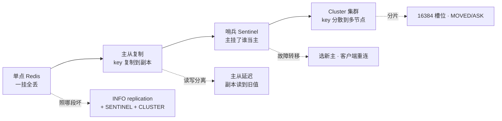
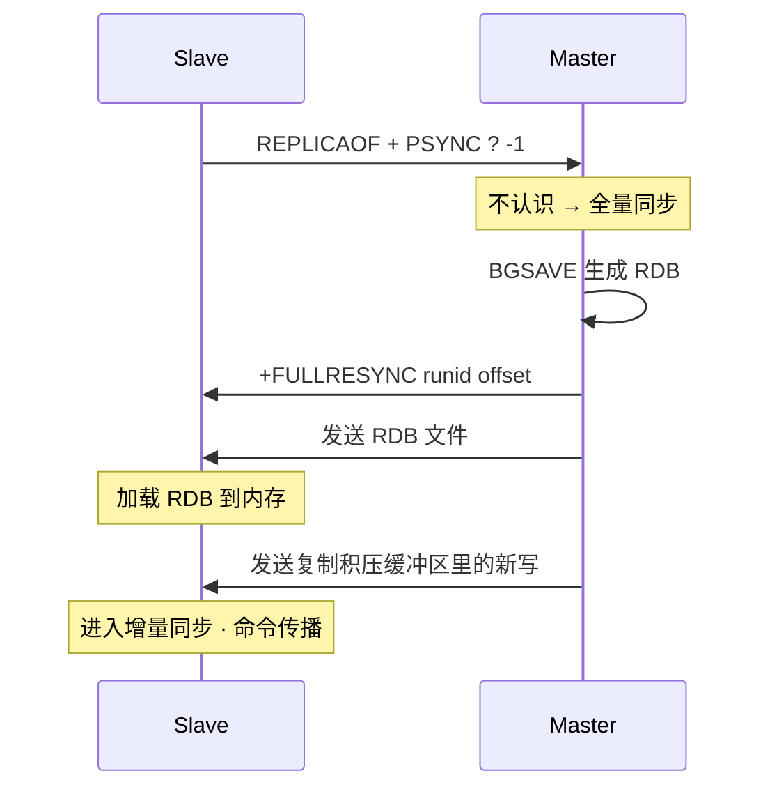
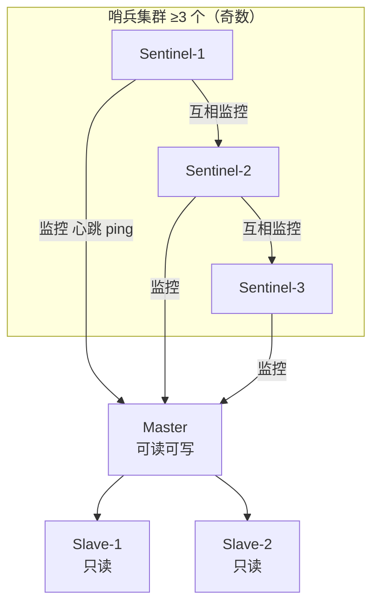
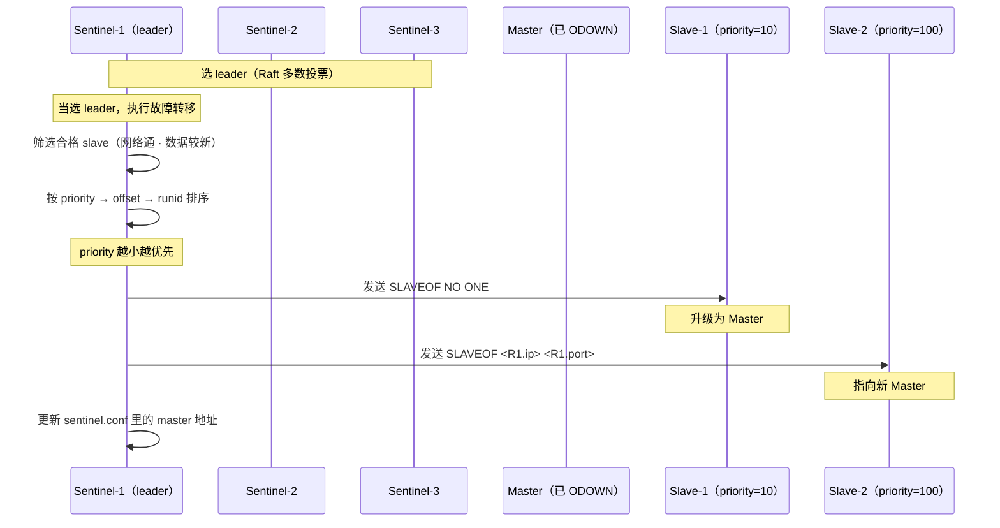
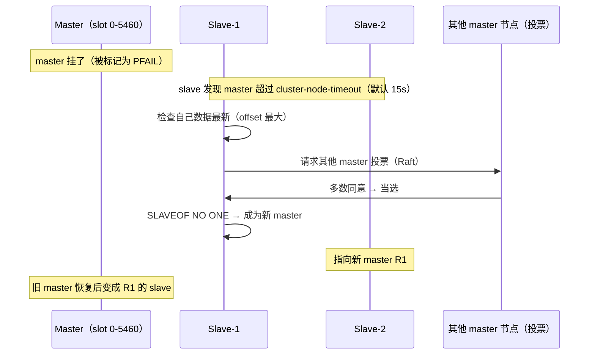
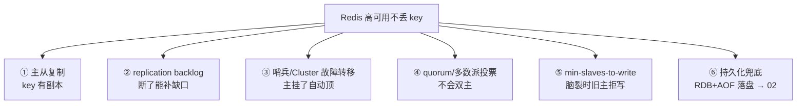
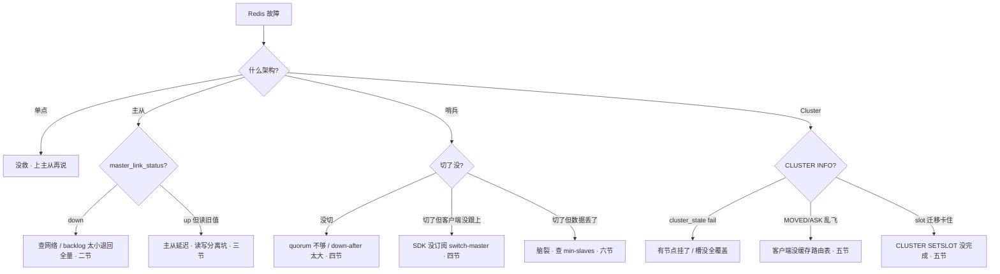

# 高可用与集群

> 大家好，欢迎来到这次分享。开讲之前，先带大家回到一个很多值班同学都经历过的现场：
> 凌晨 Redis 主节点 OOM，`redis-cli` 还连得上、`INFO` 也回得了，但从库全标 `master_link_status:down`，哨兵说「主还活着」不肯切。等了 3 分钟哨兵才 ODOWN，切完主从，业务却报「缓存全空」——群里已经有人在喊「重启全部 Redis」「手动 SLAVEOF 切主」。
> 这一章讲完，你会知道当时那个人错在哪：不该先盲切、不该先全重启——该先问「卡在主从、哨兵还是脑裂」。
> **本章回答的问题**：一个 key 怎么活过节点故障——从单点到主从、从哨兵到 Cluster，每层保证什么、不保证什么。
> **本章不讲**：key 选什么数据结构 → [01](../01-数据结构与使用场景/)；key 怎么活过重启（RDB/AOF） → [02](../02-持久化与内存管理/)；缓存穿透/击穿/雪崩 → [04](../04-缓存架构/)。这些都有专门章节，本章只在用到时点到为止。

**标记**：🎯重点 · 🔥难点 · ⭐常考 · 🔧实操

**怎么听这场分享**：咱们先把第一节的四步递进图画熟——单点→主从→哨兵→Cluster；第二到第六节顺着这四层往下走；第七节专门讲定责——也就是开头那个现场的正确解法。每一节讲完会提示对应练习题，学完就去练。

---

## 一、一张图：一个 key 的高可用路径

> 🎯 **一句话**：单点 → 主从复制 → 哨兵 → Cluster，每一层解决不同的故障，叠加才有「节点挂了 key 还在」。

咱们先不急着背 `REPLICAOF`/`SENTINEL`/`CLUSTER`。学高可用最怕的就是上来背命令，背完还是分不清「主从延迟」和「脑裂」。先看图：



**读图**：主线是四步递进——单点只保证「有」，主从保证「副本在」，哨兵保证「副本能自动顶上」，Cluster 保证「顶得上还能横向扩」。`INFO replication`、`SENTINEL get-master-addr-by-name`、`CLUSTER NODES` 三条命令是 X 光机，照的是「卡在哪一段」。


带着这张图，咱们正式出发。先从「把 key 复制到副本」讲起——没有副本，后面哨兵和 Cluster 都无从谈起。

> 本节对应练习题：四步递进图是后面各题的地基。
---

## 二、主从复制：把 key 复制到副本

> 🎯 **一句话**：主库写完往从库同步，从库只读不写——PSYNC 协议决定走全量还是增量。

### 全量同步：第一次连或断太久 🎯⭐

> 💡 **打个比方**：新员工入职，师傅把整本手册从头念一遍——不管你之前听过没有，全量同步就是 master 把当前内存**整盘**发给你。

从库执行 `REPLICAOF master.ip 6379`（旧命令 `SLAVEOF`，5.0 后改名为 `REPLICAOF`，两者等价）后，如果 master 不认识这个从库（首次连接 / runid 变了 / backlog 对不上），就走**全量同步（full sync）**：



**读图**：全量同步的代价是 master 要 `BGSAVE` + 发 RDB，从库要 `LOAD` 到内存——大库全量一次几十 GB，期间 master 还在收新写，这些新写先存进 **replication backlog（复制积压缓冲区）**，RDB 发完后补发。全量同步对 master 压力极大，能不走就不走（见部分重同步）。

> ⚠️ **别混**：全量同步期间 master 不会卡住写——它仍然接收客户端写请求，新写积压在 backlog 里等 RDB 发完再补。但 master 的 `BGSAVE` 会 fork 子进程，大库 fork 会短暂阻塞主线程（毫秒到秒级），这是全量同步的隐性成本。

### 部分重同步：断了又连、backlog 还在 ⭐🔥

> 💡 **打个比方**：师傅念到第 1000 页你电话断了，重拨后你说「我听到第 997 页」，师傅看记录本还在，就从 998 页接着念——不用从头来。

从库断线重连后发 `PSYNC runid offset`，master 检查：

- offset 在 **replication backlog** 范围内 → **部分重同步（partial resync）**，只补 backlog 里缺失的那段。
- offset 不在 backlog 范围内（断太久、backlog 太小）→ 退回全量同步。

```text
master 维护：
  runid（重启会变）
  offset（全局写序号，单调递增）
  replication backlog（环形缓冲区，默认 1MB）

slave 重连发：PSYNC <master_runid> <last_offset>

master 判断：
  runid 匹配 且 last_offset 在 backlog 窗口内 → 部分重同步（补缺口）
  runid 不匹配 或 offset 超出窗口 → 全量同步（从头来）   # ← 大库最怕这个
```

**读图**：能不能走部分重同步，取决于 backlog 够不够大。backlog 是环形缓冲区，写满了就覆盖旧数据——断线时间 × 写入速率 > backlog 大小，就会退回全量。**backlog 默认只有 1MB，高写入场景必须调大**。

> 📝 **面试**：问「主从断线重连会发生什么」，答「从库发 PSYNC 带上 last runid 和 offset，master 检查 offset 是否在 replication backlog 窗口内——在就部分重同步只补缺口，不在就全量同步」。补一句「PSYNC2 是 2.8 引入的协议，之前断了必然全量」。

### PSYNC2 与 backlog 调优 🔧

> 🔍 **现场**：从库 `INFO replication` 看到 `master_link_status:down`，等它恢复了再看 `master_repl_offset` 和 `slave_repl_offset` 的差。

```bash
# 从库执行
INFO replication
# role:slave
# master_link_status:up          ← down = 主从断了
# master_last_io_seconds_ago:3   ← 超过 30 就要查
# slave_repl_offset:1024000      ← 从库收到的位置
# master_repl_offset:1024000     ← 主库发到的位置（差距 = 延迟量）
```

```bash
# 主库执行
INFO replication
# role:master
# connected_slaves:2
# slave0:ip=10.0.0.2,port=6379,state=online,offset=1024000,lag=0   ← lag 超过 30 秒告警
# repl_backlog_size:1048576      ← backlog 大小，1MB 默认值，高写入要调大
# repl_backlog_first_byte_offset:900000   ← backlog 最早存的 offset
# master_repl_offset:1024000    ← backlog 覆盖范围：900000~1024000
```

backlog 调优公式：`repl_backlog_size ≈ 平均断线秒数 × 峰值写入速率 × 2`。例：峰值写 5MB/s，常见断线 10s → `50MB × 2 = 100MB`。

```bash
# 主库配置
CONFIG SET repl-backlog-size 104857600   # 100MB，线上从 1MB 调到 100MB
# 持久化到 redis.conf: repl-backlog-size 100mb
```

> ⚠️ **别混**：`repl-backlog-size` 调大不等于「从库数据更多」——backlog 只存 master 最近的写命令，不是完整数据快照。backlog 的唯一作用是让断了又连的从库**不退回全量同步**。


大家想想：全量同步和部分重同步的分界线在哪？很多人答「断线就全量」——不完全对，看 backlog 还在不在。⭐ 这是面试必考。

好，副本有了。业务同学下一句常常是「那读走从库分流吧」——慢着，先问会不会读到旧值。

> 本节对应练习题 **Q1、Q2**。
---

## 三、读写分离与主从延迟

> 🎯 **一句话**：从库可以分担读，但复制是异步的——读到旧值不是 bug，是主从延迟的固有代价。

### 读写分离的收益与坑 ⭐

从库天然只读，把读流量分到从库能减轻主库压力。但 Redis 的主从复制是**异步**的——master 写完立即回客户端 OK，再异步把写命令发给从库。从库和主库之间永远有延迟窗口：

```text
时间线：
  t0  master 写入 key=v2  →  立即返回 OK 给客户端
  t1  master 异步发 REPL_SET key v2 给 slave   ← 这段就是延迟
  t2  slave 执行 SET key v2

  如果客户端在 t0~t1 之间去读 slave → 读到 v1（旧值）
```

**读自己的写**（read-after-write）是最高频的坑：用户刚改了昵称，立刻刷新页面，读走从库 → 昵称没变 → 用户以为「没保存」。

| 场景 | 读谁 | 原因 |
|------|------|------|
| 钱包/库存/订单 | 读 master | 不能容忍旧值 |
| 刚写完立刻读 | 读 master 或等 1 个 RTT | read-after-write |
| 排行榜/统计 | 读 slave | 旧值无所谓 |
| 拉取列表/配置 | 读 slave | 减轻主库压力 |

> ⚠️ **别混**：Redis 的复制是**异步**的，不是 MySQL 那种**半同步**。master 不会等从库 ACK 才回客户端——所以「写成功了」不代表从库已经收到。MySQL 的 `semi-sync` 会等至少一个从库 ACK 才返回，Redis 没有这个机制（`WAIT` 命令除外，见下）。

### WAIT 命令：强行等从库 ACK 🔧

```bash
# 写完之后，强制等 N 个从库确认收到
SET user:1001 name "新昵称"
WAIT 1 100   # 等至少 1 个从库 ACK，最多等 100ms
# 返回值：实际 ACK 的从库数
# (integer) 1   ← 1 个从库确认了，读这个从库就是新值
# (integer) 0   ← 超时没等到，从库可能还是旧值
```

`WAIT` 不是事务，不保证一致性，只是降低读到旧值的概率。而且它会阻塞当前连接直到 ACK 或超时，高频场景不能乱用。

> 📝 **面试**：问「Redis 读写分离怎么保证不读到旧值」，答「关键路径（钱包、订单）直接读主库，不读从库；或写完后 `WAIT 1 timeout` 等从库 ACK 再读从库」。补一句「Redis 复制是异步的，不像 MySQL 有半同步」。


> ⭐ **口诀**：读后写敏感路径读主库；`WAIT` 只降概率、不保证强一致。

主从有了，人还得半夜爬起来切主——能不能自动？哨兵上场。开篇那个「哨兵不肯切」，根因就在 SDOWN→ODOWN 和 quorum。

> 本节对应练习题 **Q3**。
---

## 四、哨兵 Sentinel：谁当主

> 🎯 **一句话**：哨兵盯着 master，挂了就投票选一个 slave 提升为新 master，客户端找哨兵要新地址。

### 哨兵架构 ⭐



**读图**：哨兵是独立进程，不和 Redis 数据节点混部。哨兵之间互相监控，同时监控 master 和所有 slave。**哨兵自身必须是集群（≥3 个、奇数）**——单哨兵自己挂了就没人切了。

### SDOWN 与 ODOWN 🔥

> 💡 **打个比方**：一个哨兵觉得 master 不行，叫「主观下线」（SDOWN）——只是个人意见；大多数哨兵都同意，才叫「客观下线」（ODOWN）——这是集体决议，才真正触发故障转移。

```text
单个哨兵：  心跳 ping 超过 down-after-milliseconds（默认 30s）→ 标记 SDOWN
多个哨兵：  超过 quorum 个哨兵都标 SDOWN → 升级为 ODOWN → 开始故障转移
```

**quorum（法定人数）**：配置在哨兵里，表示「至少几个哨兵同意才认定 master 客观下线」。例：3 个哨兵配 `quorum=2`，表示至少 2 个同意才算 ODOWN。

> ⚠️ **别混**：**quorum 是「认定 master 挂了需要几个哨兵同意」，不是「选 leader 做故障转移需要几个」**。故障转移的 leader 选举走的是 Raft-like 多数（`N/2+1`），和 quorum 不一定相等。例：5 个哨兵、quorum=2——2 个就能认定 ODOWN，但故障转移的 leader 要 3 个（5/2+1）投票才当选。

### 故障转移全过程 ⭐🔥



**读图**：故障转移四步——① 选 leader 哨兵（Raft 多数）；② leader 在合格 slave 里挑（`priority` 最小优先，其次 `offset` 最大数据最新，最后 `runid` 字典序最小）；③ 给选中 slave 发 `SLAVEOF NO ONE` 提升为新 master；④ 给其他 slave 发 `SLAVEOF` 指向新 master。

### 客户端重连

客户端不直接连 master，而是连哨兵问「master 在哪」：

```bash
# 客户端找哨兵要 master 地址
redis-cli -p 26379 SENTINEL get-master-addr-by-name mymaster
# 1) "10.0.0.2"       ← 新 master IP
# 2) "6379"           ← 端口
```

切换后，哨兵更新 `sentinel.conf` 里的 master 地址。客户端 SDK（如 Jedis、go-redis）会自动订阅哨兵的 `+switch-master` 频道，收到通知后重连新 master。**没接哨兵的客户端只能等连接报错再手工切**。

> 🔍 **现场**：切换后从库 `role` 变了，确认一下。

```bash
# 在新 master 上
INFO replication
# role:master               ← 之前是 slave，现在是 master
# connected_slaves:1        ← 另一个 slave 已指向自己

# 在另一个 slave 上
INFO replication
# role:slave
# master_host:10.0.0.2      ← 已指向新 master
# master_link_status:up
```

> ⚠️ **别混**：哨兵只管**单 master + 多 slave**这一组。哨兵不做分片——1000 万 key 全在一个 master 上，哨兵只保证这个 master 挂了有人顶，不保证「装不下」。要分片得用 Cluster。


大家想想：quorum 是什么？大白话——**过半数确认才算数**。哨兵说「主挂了」必须多数派同意，否则会误切。

好，单组 master+slave 能自动切了。但 1000 万 key 全堆一个 master 上——要横向扩，上 Cluster。

> 本节对应练习题 **Q4、Q5、Q6**。
---

## 五、Cluster 集群：把 key 分散到多个节点

> 🎯 **一句话**：Cluster 把 16384 个槽位分到多个节点，key 算 CRC16 取模落槽，每个节点负责一部分——分片和高可用一体。

### 16384 槽位 ⭐🔥

> 💡 **打个比方**：16384 个格子排成一圈，每个 key 用 CRC16 算一个数再对 16384 取模，落在哪个格子就去找管这个格子的节点。

```text
slot = CRC16(key) mod 16384

  key "user:1001" → CRC16 → 34567 → mod 16384 → slot 1823
  key "order:200" → CRC16 → 12345 → mod 16384 → slot 4249
```

**为什么是 16384 不是 65536？** 两个理由：

1. **心跳包大小**：Cluster 节点之间用 gossip 协议互发心跳，带上自己负责的槽位 bitmap。16384 位 = 2KB，65536 位 = 8KB——心跳包太大浪费带宽。
2. **集群规模**：Redis 官方建议集群不超过 1000 个节点，16384 个槽分给 1000 个节点，每个节点约 16 个槽，够用了。

> ⚠️ **别混**：**16384 是槽位总数，不是 key 上限**。一个槽位可以装无限多个 key——槽位是 key 到节点的映射规则，不是容量限制。

### hash tag：让多个 key 落同一个槽 ⭐

有些操作需要多个 key 在同一次命令里（`MGET`、`SUNION`、Lua 脚本里的多 key 操作）。但不同 key 可能落在不同槽、不同节点——Cluster 不支持跨节点命令。解法是 **hash tag**：

```bash
# 不带 hash tag：三个 key 可能分散到三个节点
SET {user:1001}:name "Alice"     # CRC16("user:1001") → slot X
SET {user:1001}:age 30            # CRC16("user:1001") → slot X（一样！）
SET {user:1001}:city "Beijing"    # CRC16("user:1001") → slot X（一样！）

# 带 {} 的 key，CRC16 只算 {} 里的部分 → 一定落同一个槽
MGET {user:1001}:name {user:1001}:age {user:1001}:city   # 同槽，Cluster 允许
```

`{...}` 里那段就是 hash tag，CRC16 只对括号内的内容计算。**所有共享同一个 hash tag 的 key 一定落在同一个节点**，可以安全地做多 key 操作。

> ⚠️ **别混**：hash tag 是「手动控制 key 落同一个槽」，不是「同一个 key的多个副本」。它解决的是**跨节点命令不允许**的问题，不是复制问题。滥用 hash tag 会导致数据倾斜——所有带同一 tag 的 key 挤在一个节点，其他节点空着。

### MOVED 与 ASK：客户端重定向 🔧

```bash
# 客户端连到节点 A，但 key 的槽在节点 B
SET user:1001 "Alice"
# (error) MOVED 7898 10.0.0.3:6379    ← 永久重定向：slot 7898 在 10.0.0.3

# 客户端记住后，下次直接连 10.0.0.3
```

```bash
# 槽位正在迁移中：从节点 A 迁到节点 B
SET user:1001 "Alice"
# (error) ASK 7898 10.0.0.3:6379     ← 临时重定向：去 B 问一下

# 客户端临时连 B，但下次还是先问 A
# ASK 不更新本地路由表，MOVED 会更新
```

**读图（两条命令）**：

- **MOVED**：槽位**已**永久迁移到新节点。客户端收到后更新本地槽位映射表，以后这个槽的请求直接发新节点，不再问旧节点。
- **ASK**：槽位**正在**迁移中，数据可能在旧节点也可能在新节点。客户端临时去新节点试一下，但不更新路由表——下次还是先问旧节点。

> 📝 **面试**：问「MOVED 和 ASK 区别」，答「MOVED 是永久重定向，客户端更新路由表；ASK 是迁移中的临时重定向，客户端不更新路由表，只是临时去新节点试。」

### gossip 协议

Cluster 节点之间用 **gossip 协议**互相发现和保活：每个节点定期往几个随机节点发 `PING`，带上自己知道的集群状态（谁在线、谁负责哪些槽）。`PONG` 回包带自己的状态。信息像传八卦一样扩散到全网。

```bash
CLUSTER NODES
# 节点列表，每行一个：
# {id} <ip:port@cport> <flags> <master> <ping_sent> <pong_recv> <epoch> <link_state> <slots>
# 1a2b... 10.0.0.1:6379@16379 master - 1234567 1234567 1 connected 0-5460    # ← 负责槽 0~5460
# 3c4d... 10.0.0.2:6379@16379 master - 1234567 1234567 1 connected 5461-10922
# 5e6f... 10.0.0.3:6379@16379 master - 1234567 1234567 1 connected 10923-16383
```

```bash
CLUSTER INFO
# cluster_state:ok              ← 集群健康
# cluster_slots_assigned:16384  ← 全部分配
# cluster_slots_ok:16384
# cluster_known_nodes:6         ← 节点总数（含从库）
```

> 🔍 **现场**：日常巡检看 `CLUSTER INFO` 的 `cluster_state` 和 `cluster_slots_ok`，不是 `ok` 就要 `CLUSTER NODES` 看谁掉线了。


> ⭐ **口诀**：MOVED 是「永久搬家」，ASK 是「临时去对面取」——别混。

Cluster 把 key 散开了。主节点挂了怎么切？和哨兵的故障转移像，但不一样——咱们放慢对比。

> 本节对应练习题 **Q7、Q8、Q11、Q12、Q14**。
---

## 六、故障转移：主节点挂了怎么办

> 🎯 **一句话**：哨兵的故障转移是「选一个 slave 升 master」；Cluster 的故障转移是「槽位所在节点的 slave 自己选主」——两者都靠多数派投票，但选主范围不同。

### 哨兵的故障转移回顾 ⭐

哨兵模式下（见四节），master 挂了 → ODOWN → 选 leader 哨兵 → leader 挑 slave 升 master。**故障转移的执行者是哨兵**，不是 Redis 数据节点自己。

### Cluster 的故障转移 🔥

Cluster 模式下，master 挂了，它的 slave 会自己发起故障转移——不需要哨兵：



**读图**：Cluster 故障转移三步——① slave 发现 master 超时；② 数据最新的 slave 向其他 master 节点发拉票请求，拿到多数票当选；③ 升级为 master，其他 slave 指向它。

- **PFAIL（主观下线）**：单个节点认为另一节点不可达。
- **FAIL（客观下线）**：超过半数 master 都认为某节点 PFAIL → 标记 FAIL → 触发故障转移。

> ⚠️ **别混**：**哨兵的 quorum 是哨兵之间投票，Cluster 的投票是 master 节点之间投票**。哨兵模式里 slave 不参与投票；Cluster 模式里 slave 会主动拉票、master 投票。

### 脑裂：旧主还在收写 ⭐🔥

大家想想：脑裂期间业务报「缓存全空」，很多人答「没预热」——错了。根因是旧主隔离期间还在收写，切回来这部分写丢了。咱们放慢讲。

> 💡 **打个比方**：主节点网络隔离了，哨兵觉得它挂了切了新主，但旧主自己觉得还活着——两个 master 同时存在，客户端往旧主写的数据在切回来后全丢。

```mermaid
flowchart TB
    subgraph ISOLATED["网络隔离区"]
        OLD["旧 Master<br/>还活着 · 还在收写"]
    end
    subgraph NORMAL["正常区"]
        SENT["哨兵 ODOWN"]
        NEW["新 Master<br/>从旧 slave 提升"]
    end
    SENT --> NEW
    CLIENT["客户端"] -->|先写旧主| OLD
    CLIENT2["客户端"] -->|切到新主| NEW
    Note over OLD,NEW: 两边都在收写 = 脑裂
```

**读图**：脑裂的根因是**网络分区**——旧主和哨兵之间断开了，哨兵认为它挂了、切了新主，但旧主没收到通知、还在接收客户端写。网络恢复后旧主变成 slave，它隔离期间收的写会被新主覆盖，**数据丢失**。

### 防脑裂：min-slaves-to-write 🔧

```bash
# master 配置
CONFIG SET min-slaves-to-write 1    # 至少 1 个 slave 在线才允许写
CONFIG SET min-slaves-max-lag 10    # slave 延迟不超过 10 秒才算「在线」
```

这两个参数组合的含义：**master 必须有至少 N 个 slave 且延迟 ≤ M 秒才接受写**。隔离后旧主发现 slave 全断 → 拒绝写 → 脑裂期间旧主不收新数据 → 切回来后不丢数据。

```text
正常时：  master 有 2 个 slave 在线，延迟 0s → 可以写
隔离后：  旧 master 的 slave 全断了 → min-slaves-to-write 不满足 → 拒绝写
          客户端收到 error → 转去新主 → 数据不丢
```

> ⚠️ **别混**：`min-slaves-to-write` 不是「同步复制」——它只是门槛，master 仍然异步发写给 slave。它只是「slave 都断了我就不写了」，降低脑裂风险，不等于强一致。Cluster 模式下也有等价参数（`cluster-require-full-coverage`）。

> 📝 **面试**：问「Redis 怎么防脑裂」，答「配 `min-slaves-to-write 1` + `min-slaves-max-lag 10`——master 发现至少一个 slave 在线且延迟可控才接受写，网络隔离后 slave 全断就拒绝写，旧主不收新数据」。补一句「这是降低风险，不是消除——Redis 本质是异步复制，不可能完全防脑裂」。

### 收束：高可用凭什么不丢 key 🎯⭐

到这里，四层高可用的零件都齐了。面试直接问「**Redis 高可用怎么保证不丢 key**」，要的就是这张清单：



**读图**：

- ① 保证「key 不只在一个节点」，② 保证「断了不用从头来」，③ 保证「人不用半夜爬起来切主」，④ 保证「不会两个 master 同时收写」，⑤ 保证「就算双主了旧主也不收写」，⑥ 保证「全节点都炸了还能从磁盘恢复」。
- 前 5 件是**在线高可用**，第 6 件是**兜底**——前面全失效时靠 RDB/AOF 恢复（→ [02](../02-持久化与内存管理/)）。

> ⚠️ **别混**：**高可用 ≠ 不丢数据**。Redis 本质是**异步复制**，master 回 OK 时 slave 还没收到——这中间窗口的写在主挂掉且 slave 没收到时会丢。`min-slaves-to-write` 只能**降低**脑裂丢数据的风险，不等于强一致。要强一致请用 `WAIT` 命令或考虑别的存储。

> 📝 **面试**：背的时候按「**有副本 → 断了能补 → 挂了能切 → 不会双主 → 双主不收写 → 磁盘兜底**」六步分组。最后一定补一句「Redis 是异步复制，做不到强一致，只能降风险」——这句是区分「背过」和「懂了」的分水岭。


开篇那个「缓存全空」——不是没预热，是**脑裂期间旧主还在收写**。脑裂怎么防？`min-slaves-to-write` 是门槛不是强一致。

好，四层 + 故障转移讲完。回到凌晨那个现场，用决策树拦住「重启全部 Redis」。

> 本节对应练习题 **Q9、Q10**。
---

## 七、作战：定责

> 🎯 **一句话**：主从断了看 `INFO replication`，哨兵没切看 `SENTINEL`，Cluster 槽位不对看 `CLUSTER NODES`，脑裂了查 `min-slaves` 配置。

### 定责决策树



### 现象 · 先做 · 别做

| 现象 | 先做 | 别做 |
|------|------|------|
| 从库 master_link_status:down | 查网络 + `INFO replication` 看 offset 差 | 直接重启从库（会触发全量） |
| 从库读旧值 | 关键读切主库 / `WAIT` | 只调 backlog 大小 |
| 哨兵没切 | 查 quorum 和 down-after-milliseconds | 手工 `SLAVEOF NO ONE`（绕过哨兵） |
| 切了客户端还连旧主 | 查 SDK 是否订阅 `+switch-master` | 手工改配置（下次切又不对） |
| Cluster MOVED 乱飞 | 查 `CLUSTER NODES` 槽分配 | 往所有节点发请求 |
| slot 迁移卡住 | `CLUSTER SETSLOT` + `MIGRATE` 检查 | 直接 `DEL` 迁移中的 key |
| 旧主恢复后数据没了 | 确认脑裂 + 查 `min-slaves` 配置 | 责怪从库「不同步」 |
| 全量同步慢 | 查库大小 + fork 时间 + 网络带宽 | 限制 master 写入（治标不治本） |

### 60 秒剧本 🔧

> 🔍 **现场**：值班收到「Redis 不对」报障，60 秒走完这条线再下结论。

```text
① 0–10s  什么架构？   INFO replication → role + master_link_status + offset 差
② 10–30s 哨兵还是 Cluster？
          哨兵：redis-cli -p 26379 SENTINEL get-master-addr-by-name {name} 看切了没
          Cluster：CLUSTER INFO 看 cluster_state + CLUSTER NODES 看谁掉线
③ 30–45s 定型：
          主从断了 → 查网络 + backlog 是否太小（INFO replication repl_backlog_size）
          哨兵没切 → 查 quorum / down-after-milliseconds（SENTINEL masters）
          Cluster fail → CLUSTER NODES 找 flags=fail 或 fail? 的节点
④ 45–60s 定责 + 验证：
          主从断 → 修网络 / 调大 backlog
          哨兵 → 修配置 / 查 SDK 重连
          Cluster → 修节点 / 补槽 / 手动 CLUSTER FAILOVER
```


现在再看开篇群里那句「重启全部 Redis」「手动 SLAVEOF 切主」，你知道该怎么拦住他了。

> 本节对应练习题 **Q13**。
---

## 八、收口

### 命令速查 🔧

```bash
# 主从复制状态
INFO replication                    # role / master_link_status / offset / backlog 大小
# 哨兵
redis-cli -p 26379 SENTINEL masters            # 所有被监控的 master
redis-cli -p 26379 SENTINEL get-master-addr-by-name mymaster  # 当前 master 地址
redis-cli -p 26379 SENTINEL ckquorum mymaster  # 检查 quorum 是否够
# Cluster
CLUSTER INFO                        # cluster_state / cluster_slots_ok
CLUSTER NODES                       # 节点列表 + 槽分配 + 在线状态
CLUSTER SLOTS                       # 槽到节点的映射
CLUSTER KEYSLOT <key>               # 算 key 落哪个槽
CLUSTER FAILOVER                    # 手动触发故障转移（在 slave 上执行）
# 脑裂防护
CONFIG GET min-slaves-to-write      # 查配置
CONFIG GET min-slaves-max-lag
# slot 迁移
CLUSTER SETSLOT <slot> NODE <node-id>       # 把槽指派给节点
CLUSTER SETSLOT <slot> MIGRATING <node-id>  # 槽正在迁出
CLUSTER SETSLOT <slot> IMPORTING <node-id>  # 槽正在迁入
```

### 面试锚点

遮住右列自问自答，卡壳的行回去重读对应小节。

| 问 | 30 秒答 |
|----|---------|
| Redis 怎么做高可用？ | 单点→主从复制→哨兵→Cluster，层层叠加。主从有副本，哨兵自动切主，Cluster 分片+内置 HA。 |
| 主从复制原理？ | 异步复制：master 写完即回 OK，再异步发写命令给 slave。PSYNC 协议：断了走全量（BGSAVE+RDB）或部分重同步（backlog 补缺口）。 |
| 全量 vs 部分重同步？ | 全量：首次/断太久/backlog 不够→BGSAVE+发 RDB+从库 load。部分：offset 在 backlog 窗口内→只补缺口。 |
| replication backlog？ | master 的环形缓冲区，存最近的写命令。断了重连时 slave 带 offset，master 查 backlog 决定走部分还是全量。默认 1MB 太小，高写入要调大。 |
| 读写分离会读到旧值吗？ | 会。Redis 复制是异步的，master 回 OK 时 slave 还没收到。关键读走 master，或 `WAIT N timeout` 等从库 ACK。 |
| 哨兵怎么发现 master 挂了？ | 单个哨兵心跳超时→SDOWN（主观下线）；超过 quorum 个哨兵同意→ODOWN（客观下线）→触发故障转移。 |
| quorum 是什么？ | 认定 master 客观下线需要几个哨兵同意。≠ leader 选举多数（N/2+1）。 |
| 哨兵故障转移怎么选 slave？ | 合格 slave 里按 priority（小优先）→ offset（大优先，数据新）→ runid（字典序小优先）。 |
| Cluster 槽位为什么 16384？ | 心跳包带槽位 bitmap，16384 位=2KB 够用且省带宽；官方建议集群≤1000 节点，16384 槽够分。 |
| hash tag 干什么？ | `{tag}` 让多个 key 落同一槽，支持跨 key 命令（MGET/SUNION/Lua）。滥用会数据倾斜。 |
| MOVED vs ASK？ | MOVED=永久重定向，客户端更新路由表；ASK=迁移中临时重定向，不更新路由表。 |
| Cluster 怎么故障转移？ | slave 发现 master 超时→数据最新的 slave 拉票→其他 master 多数同意→SLAVEOF NO ONE 升 master。 |
| 哨兵 vs Cluster？ | 哨兵=单 master+多 slave 的 HA，不做分片；Cluster=分片+内置 HA，每个分片有自己的 master+slave。 |
| 脑裂怎么办？ | 配 `min-slaves-to-write 1` + `min-slaves-max-lag 10`：slave 全断时 master 拒写。降低风险，不等于消除——Redis 异步复制做不到强一致。 |
| 脑裂为什么会丢数据？ | 旧主隔离了还在收写，哨兵切了新主。网络恢复后旧主变 slave，隔离期间收的写被新主覆盖。 |
| gossip 干什么？ | Cluster 节点间互发心跳，带自己的槽位和集群状态，像传八卦一样扩散到全网，用于节点发现和保活。 |

### 易错一句话对照

- 主从复制是同步的 → 异步，master 回 OK 时 slave 还没收到
- 断了重连一定全量同步 → offset 在 backlog 窗口内就走部分重同步
- backlog 越大从库数据越多 → backlog 只存最近写命令，不是全量快照
- 从库读一定和主库一样 → 有延迟窗口，关键读走主库
- 哨兵 quorum = 选主票数 → quorum 是认定下线，选 leader 走 N/2+1
- 哨兵能分片 → 哨兵只做单 master 的 HA，分片用 Cluster
- Cluster 槽位是 key 上限 → 槽位是映射规则，一个槽可装无限 key
- 16384 是随便定的 → 心跳包 2KB + 集群≤1000 节点够分
- MOVED 和 ASK 一样 → MOVED 更新路由表，ASK 不更新
- hash tag 是复制 → 是让多 key 落同槽，不是副本
- Cluster 故障转移靠哨兵 → 靠 master 节点投票，slave 自己拉票
- min-slaves-to-write 是强一致 → 是门槛，master 仍异步复制，只降脑裂风险
- 脑裂不丢数据 → 旧主隔离期间收的写切回来会丢
- 读写分离永远安全 → read-after-write 会读到旧值
- 全量同步会卡住 master 写 → 不会卡写，但 BGSAVE fork 会短暂阻塞

### 数字墙

> 槽位 **16384** · backlog 默认 **1MB**（高写入调到 50-100MB）· 哨兵建议 **≥3 个奇数** · `down-after-milliseconds` 默认 **30s** · quorum 示例 **2/3** · Cluster `cluster-node-timeout` 默认 **15s** · CRC16 取模 **mod 16384** · 心跳包槽位 bitmap **2KB** · 官方建议集群 **≤1000 节点** · `min-slaves-to-write` 至少 **1** · `min-slaves-max-lag` 建议 **10s** · `WAIT N timeout` 阻塞当前连接 · PSYNC2 自 **2.8** 引入 · `REPLICAOF` 替代 `SLAVEOF` 自 **5.0**

---

## 合上书

学到这里，先别急着翻下一章。合上书，试试下面这几件事能不能做到——能做到，这章才算真的听懂了。卡住的那一条，就回到对应小节再听一遍：

- [ ] **默画一节的图**：单点→主从→哨兵→Cluster 四步递进，每层解决什么故障，`INFO replication` / `SENTINEL` / `CLUSTER` 各照哪段。（对应练习题 Q13）
- [ ] **口述主从复制**：PSYNC 全量 vs 部分重同步的条件、全量同步的步骤（BGSAVE→RDB→load→backlog 补发）、backlog 的作用和调优。（Q1、Q2）
- [ ] **口述读写分离**：为什么会读到旧值、哪些场景该读主库、`WAIT` 命令怎么用、和 MySQL 半同步的区别。（Q3）
- [ ] **默画哨兵架构与故障转移**：哨兵集群≥3 奇数、SDOWN→ODOWN、quorum 的含义、leader 选举、选 slave 的三步排序、客户端 `get-master-addr-by-name`。（Q4、Q5、Q6）
- [ ] **口述 Cluster**：16384 槽为什么是这个数、hash tag 让多 key 落同槽、MOVED vs ASK、gossip 心跳。（Q7、Q8、Q11、Q12、Q14）
- [ ] **默画 Cluster 故障转移**：slave 发现超时→拉票→master 多数同意→SLAVEOF NO ONE，和哨兵故障转移的区别。（Q9、Q10）
- [ ] **口述脑裂**：脑裂怎么产生、为什么丢数据、`min-slaves-to-write` + `min-slaves-max-lag` 怎么防、为什么不等于强一致。（Q9、Q10）
- [ ] **默画高可用清单**：主从复制 / backlog / 故障转移 / 多数派投票 / min-slaves / 持久化兜底，说清每件保证什么、不保证什么。（Q11）
- [ ] **定责**：主从断了看 `INFO replication`、哨兵没切查 quorum、Cluster fail 看 `CLUSTER NODES`、脑裂查 `min-slaves`——现在再看开篇那句「重启全部 Redis」，你知道该怎么拦住他了。（Q13）

下一章咱们讲缓存层怎么挡读放大、三大故障怎么分开治 → [04](../04-缓存架构/)。数据结构 → [01](../01-数据结构与使用场景/)；持久化 → [02](../02-持久化与内存管理/)。
