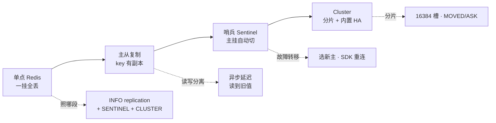
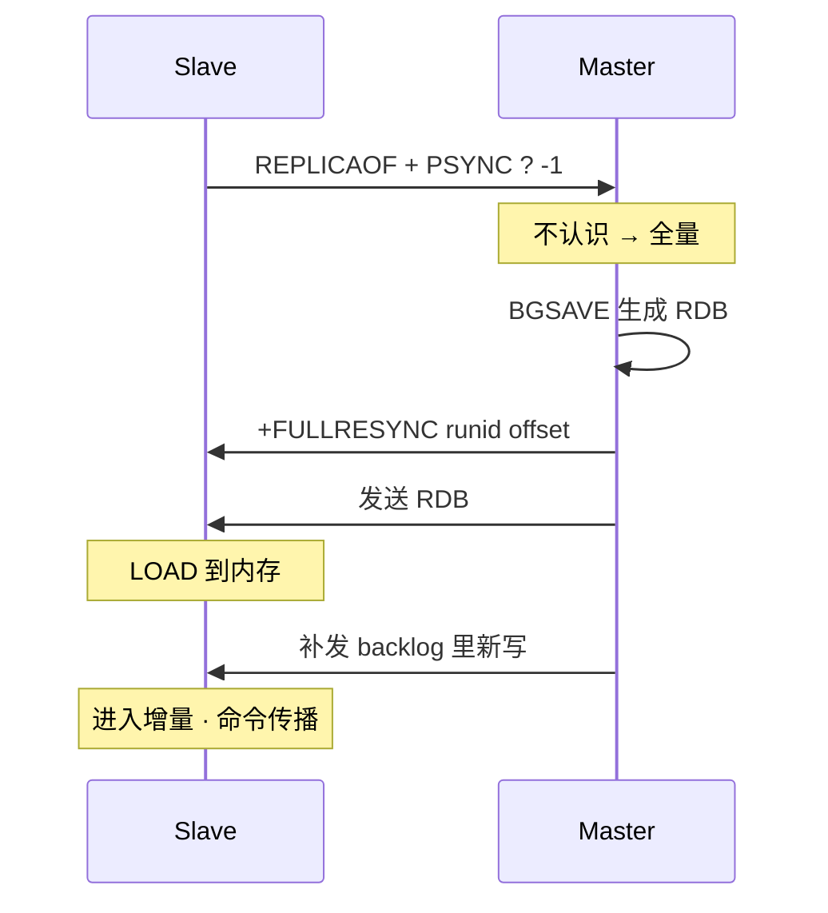
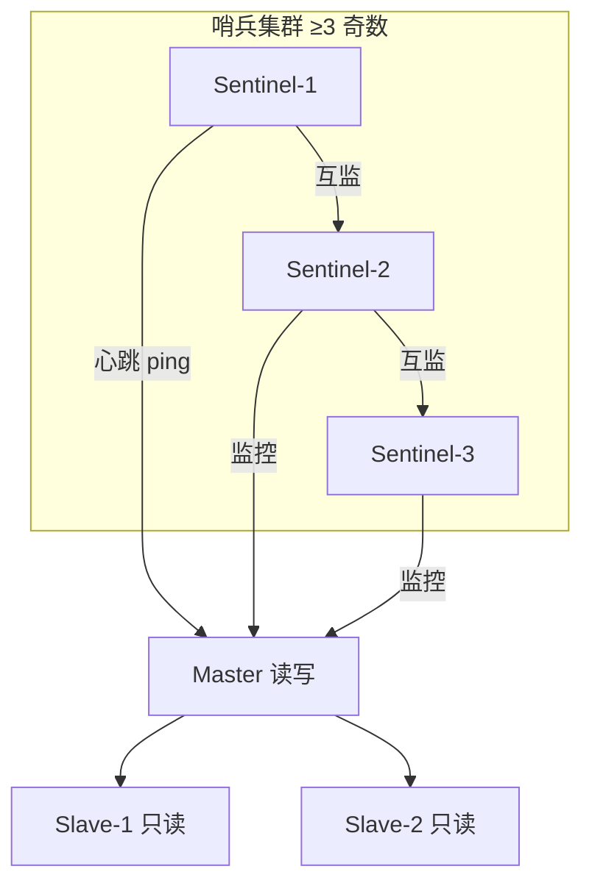
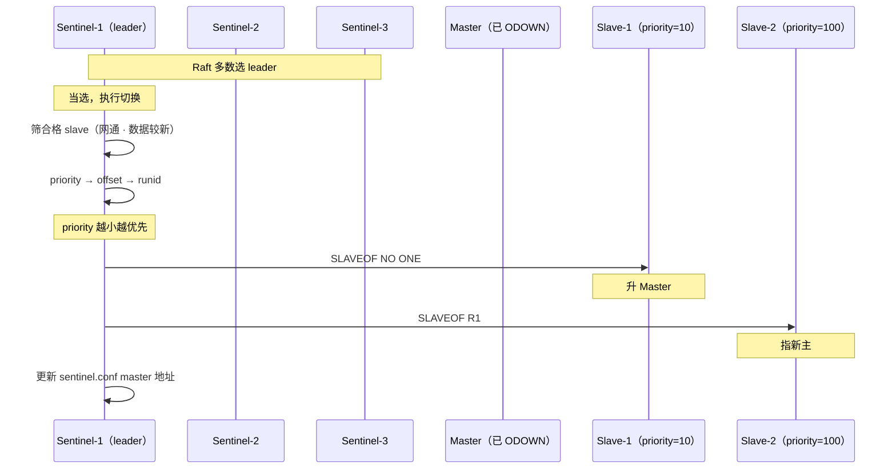
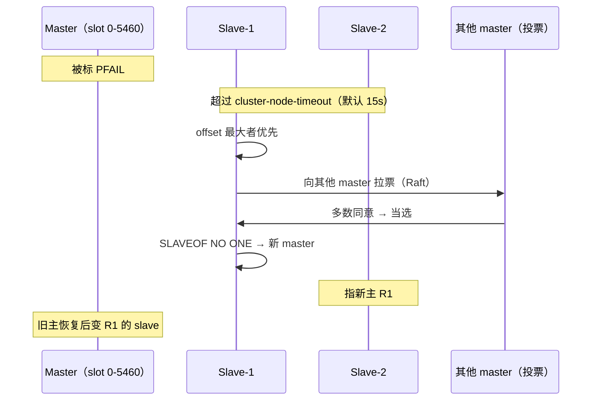
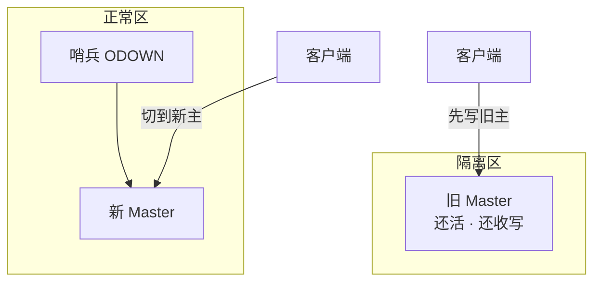
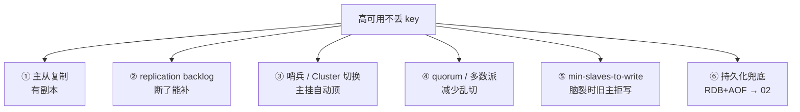
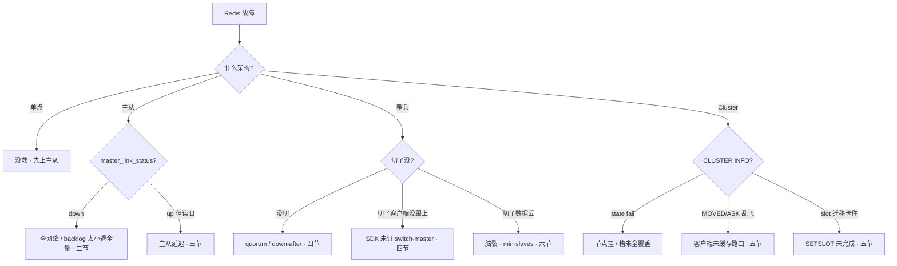

# 高可用与集群

> 凌晨主节点 OOM，`redis-cli` 还连得上，但从库全标 `master_link_status:down`，哨兵说「主还活着」不肯切；切完业务却报「缓存全空」——群里已经有人喊「重启全部 Redis」「手动 SLAVEOF 切主」。
> **本章回答**：一个 key 怎么活过节点故障——从单点到主从、从哨兵到 Cluster，每层保证什么、不保证什么。
> **不讲**：key 选什么数据结构 → [01](../01-数据结构与使用场景/)；RDB/AOF → [02](../02-持久化与内存管理/)；缓存穿透/击穿/雪崩 → [04](../04-缓存架构/)。

**标记**：🎯重点 · 🔥难点 · ⭐常考 · 🔧实操

---

## 一、一张图：一个 key 的高可用路径

> 🎯 **一句话**：单点 → 主从 → 哨兵 → Cluster，每层解不同故障；坏了先问「卡在哪一层」。




- 📖 **读图**
  - 🛤️ 四步递进：有 → 有副本 → 副本能自动顶 → 顶得上还能横向扩
  - ⚔️ 第一刀：`INFO replication` / `SENTINEL get-master-addr-by-name` / `CLUSTER NODES`——照「卡在哪段」

本节对应练习题：四步图是后面各题的地基。

---


## 二、主从复制：把 key 复制到副本

> 🎯 **一句话**：主写从读；`PSYNC` 决定走全量还是只补缺口。


### 📦 全量同步：第一次连或断太久 🎯⭐

> 💡 **打个比方**：新员工入职，师傅把整本手册从头念一遍——全量同步就是 master 把当前内存**整盘**发给你。

从库 `REPLICAOF master.ip 6379`（5.0 前叫 `SLAVEOF`，等价）后，master 不认识这从库（首次 / `runid` 变了 / backlog 对不上）→ **全量同步（full sync）**：




- 📖 **读图**
  - 代价：master `BGSAVE` + 发 RDB，从库 `LOAD`；大库几十 GB 一次，能不走就不走
  - 全量期间 master **仍收写**——新写进 **replication backlog（复制积压缓冲区）**，RDB 发完再补发

> ⚠️ **别混**：全量不卡住客户端写；但 `BGSAVE` 的 fork 会短暂阻塞主线程（毫秒～秒），这是隐性成本（fork → [02](../02-持久化与内存管理/)）。


### 🔁 部分重同步：断了又连、backlog 还在 ⭐🔥


#### ❓ 断线重连一定会全量同步吗？

- ❌ **不是**：`PSYNC runid offset` 若 offset 仍在 **replication backlog** 窗口内 → **部分重同步**只补缺口
- 💥 backlog 默认 **1MB**，高写入断几秒就可能溢出 → 退回全量（大库灾难）
- 📐 调优：`repl_backlog_size ≈ 断线秒数 × 峰值写速率 × 2`

> 💡 **打个比方**：师傅念到第 1000 页电话断了；你说「我听到 997」，记录本还在就从 998 接着念——不用从头来。

```text
master 维护：
  runid（重启会变）
  offset（全局写序号，单调递增）
  replication backlog（环形缓冲，默认 1MB）

slave 重连：PSYNC <master_runid> <last_offset>

判断：
  runid 匹配 且 offset 在 backlog 窗口 → 部分重同步
  否则 → 全量同步                              # ← 大库最怕这个
```

- 📖 **读图**
  - 能不能部分重同步，只看 backlog 够不够盖住断线窗口
  - 环形缓冲写满覆盖旧数据：断线秒数 × 写速率 > backlog → 全量

> 📝 **面试**：从库发 `PSYNC` 带 last runid + offset；在 backlog 窗口内就部分补缺口，否则全量。补一句「PSYNC2 自 2.8；之前断了必全量」。


### 🔧 PSYNC2 与 backlog 调优 🔧

> 🔍 **现场**：从库 `master_link_status:down` 恢复后，比两边 offset。

```bash
# 从库
INFO replication
# role:slave
# master_link_status:up          ← down = 主从断了
# master_last_io_seconds_ago:3   ← 超过 30 要查
# slave_repl_offset:1024000
# master_repl_offset:1024000     ← 差 = 延迟量
```

```bash
# 主库
INFO replication
# role:master
# connected_slaves:2
# slave0:ip=10.0.0.2,port=6379,state=online,offset=1024000,lag=0   ← lag>30s 告警
# repl_backlog_size:1048576      ← 默认 1MB，高写入必调
# repl_backlog_first_byte_offset:900000
# master_repl_offset:1024000     ← 窗口：900000~1024000
```

- 例：峰值写 5MB/s、常见断线 10s → `50MB × 2 = 100MB`

```bash
CONFIG SET repl-backlog-size 104857600   # 100MB
# redis.conf: repl-backlog-size 100mb
```

> ⚠️ **别混**：调大 backlog ≠「从库数据更多」——只存 master **最近写命令**，唯一作用是断线重连**少退全量**。

> 本节对应练习题 **Q1、Q2**。

---


## 三、读写分离与主从延迟

> 🎯 **一句话**：从库可分担读，但复制异步——读到旧值不是 bug，是固有代价。


#### ❓ Redis 有没有半同步复制？读从库会不会读到旧值？

- Redis 复制默认**异步**：master 写成功就回客户端，不等 slave ACK
- 读后写敏感（钱包 / 刚改昵称）→ **读主**；或 `WAIT N timeout` 只**降低**读旧概率，不是强一致
- ⚠️ 别拿 MySQL semi-sync 硬套 Redis


### 📖 读写分离的收益与坑 ⭐

```text
t0  master 写 key=v2 → 立即 OK 给客户端
t1  异步发 REPL_SET 给 slave          ← 延迟窗口
t2  slave 执行 SET key v2

t0~t1 读 slave → 读到 v1（旧值）
```

- 🔥 **读自己的写（read-after-write）**：刚改昵称立刻刷新走从库 → 以为「没保存」——最高频坑


| 场景              | 读谁              | 原因               |
| --------------- | --------------- | ---------------- |
| 钱包 / 库存 / 订单    | master          | 不能容忍旧值           |
| 刚写完立刻读          | master 或等 1 RTT | read-after-write |
| 排行榜 / 统计 / 配置列表 | slave           | 旧值可接受，减主压        |


> ⚠️ **别混**：master「写成功」≠ slave 已收到。MySQL semi-sync 会等至少一个从库 ACK；Redis 默认没有（`WAIT` 除外）。


### ⏳ WAIT：强行等从库 ACK 🔧

```bash
SET user:1001 name "新昵称"
WAIT 1 100   # 至少 1 个从库 ACK，最多 100ms
# (integer) 1   ← 可放心读该从库
# (integer) 0   ← 超时，从库可能仍旧
```

- `WAIT` **不是事务**、不保证一致性，只降概率；阻塞当前连接，高频慎用

> 📝 **面试**：关键路径读主；或写后 `WAIT 1 timeout` 再读从。补「异步复制，没有 MySQL 那种半同步默认档」。

> ⭐ **口诀**：读后写敏感读主；`WAIT` 降概率、不保强一致。

主从有了，人还得半夜爬起来切主——哨兵上场。开篇「哨兵不肯切」，根因在 SDOWN→ODOWN 与 quorum。

> 本节对应练习题 **Q3**。

---


## 四、哨兵 Sentinel：谁当主

> 🎯 **一句话**：哨兵盯 master，挂了投票选 slave 升主；客户端问哨兵要新地址。


### 🏛️ 哨兵架构 ⭐




- 📖 **读图**
  - 哨兵是**独立进程**，不和数据节点混部；同时盯 master、slave、彼此
  - 自身必须 ≥3 奇数——单哨兵自己挂了就没人切


### 👁️ SDOWN 与 ODOWN 🔥


#### ❓ 为什么一个哨兵说挂了还不够？quorum 和多数派是一回事吗？

- 👻 **SDOWN**：单个哨兵主观认为挂了（心跳 > `down-after-milliseconds`，默认 30s）
- ✅ **ODOWN**：≥ **quorum** 个哨兵同意 → 才启动故障转移
- ⚠️ **quorum ≠ leader 选举票数**：选执行故障转移的 leader 走 Raft-like 多数（`N/2+1`）；例 5 哨兵 quorum=2 可 ODOWN，但选 leader 要 3 票

> 💡 **打个比方**：一个人觉得 master 不行叫「主观下线」；多数同意才叫「客观下线」——集体决议才真切。

```text
单哨兵 ping 超时 → SDOWN
≥ quorum 个标 SDOWN → ODOWN → 故障转移
例：3 哨兵 quorum=2 → 至少 2 票才 ODOWN
```

> ⚠️ **别混**：quorum 管「认定挂了」；leader 选举管「谁来执行切换」——两套门槛，别说成一个数。


### 🔄 故障转移全过程 ⭐🔥




- 📖 **读图**
  - ① Raft 选 leader 哨兵 → ② 合格 slave 按 `priority`（小）→ `offset`（大=新）→ `runid`（字典序小）
  - ③ `SLAVEOF NO ONE` 升主 → ④ 其他 slave 改指新主


### 📡 客户端重连

客户端不硬编码 master，问哨兵「master 在哪」：

```bash
redis-cli -p 26379 SENTINEL get-master-addr-by-name mymaster
# 1) "10.0.0.2"   ← 新 master
# 2) "6379"
```

- SDK（Jedis / go-redis）订 `+switch-master` 频道，收到后重连；**没接哨兵的客户端只能等连错再手工切**

> 🔍 **现场**：切完核对角色。

```bash
# 新 master
INFO replication
# role:master
# connected_slaves:1

# 另一从库
INFO replication
# role:slave
# master_host:10.0.0.2
# master_link_status:up
```

> ⚠️ **别混**：哨兵只管**单 master + 多 slave** 这一组，**不做分片**——1000 万 key 仍在一个 master 上。要分片 → Cluster。

> 本节对应练习题 **Q4、Q5、Q6**。

---


## 五、Cluster 集群：把 key 分散到多个节点

> 🎯 **一句话**：16384 槽分到多节点，`CRC16(key) mod 16384` 落槽——分片与 HA 一体。


### 🎰 16384 槽位 ⭐🔥


#### ❓ 为什么是 16384 槽？hash tag 和副本是一回事吗？

- 📡 心跳带槽位 bitmap：16384 位 ≈ **2KB**；若 65536 位 ≈ 8KB，gossip 太胖
- ⚠️ **槽数 ≠ key 上限**：一槽可装无数 key；槽只是路由
- 🏷️ **hash tag** `{...}`：多 key 落同槽以便多 key 命令——**不是**多副本；滥用会倾斜

> 💡 **打个比方**：16384 个格子排成一圈，key 算 CRC16 再取模，落哪格就找管那格的节点。

```text
slot = CRC16(key) mod 16384
  "user:1001" → … → slot 1823
  "order:200" → … → slot 4249
```

- 官方建议集群 ≤ **1000** 节点：16384 / 1000 ≈ 每节点十几槽，够用

> ⚠️ **别混**：16384 是映射规则，不是容量上限。


### 🏷️ hash tag：多 key 落同槽 ⭐

Cluster **禁止跨槽多 key 命令**（`MGET` / `SUNION` / 多 key Lua）。解法：CRC16 只算 `{}` 里那段：

```bash
SET {user:1001}:name "Alice"   # CRC16("user:1001")
SET {user:1001}:age 30         # 同槽
MGET {user:1001}:name {user:1001}:age   # 同槽 → 允许
```

> ⚠️ **别混**：hash tag 管「同槽」，不管「副本」。同一 tag 挤一节点 = 倾斜。


### ↪️ MOVED 与 ASK：客户端重定向 🔧


#### ❓ MOVED 和 ASK 有什么不一样？

- **MOVED**：槽**已**永久迁走 → 客户端**更新**本地槽表，以后直连新节点
- **ASK**：槽**正在**迁移 → 临时去目标节点试，**不**更新路由表，下次仍先问旧节点

```bash
SET user:1001 "Alice"
# (error) MOVED 7898 10.0.0.3:6379   ← 永久：记到本地映射

# 迁移中
# (error) ASK 7898 10.0.0.3:6379     ← 临时：去试一下，不改表
```

> 📝 **面试**：MOVED=永久搬家、更新路由；ASK=搬家中临时去对面取、不改表。

> ⭐ **口诀**：MOVED 永久，ASK 临时——别混。


### 🕸️ gossip 协议

节点定期随机 `PING`/`PONG`，带上「谁在线、谁管哪些槽」——状态像八卦扩散全网。

```bash
CLUSTER NODES
# {id} ip:port@cport flags master ping pong epoch link slots
# 1a2b... 10.0.0.1:6379@16379 master - … connected 0-5460      # ← 槽 0~5460
# 3c4d... 10.0.0.2:6379@16379 master - … connected 5461-10922
# 5e6f... 10.0.0.3:6379@16379 master - … connected 10923-16383
```

```bash
CLUSTER INFO
# cluster_state:ok
# cluster_slots_assigned:16384
# cluster_slots_ok:16384
# cluster_known_nodes:6          ← 含从库
```

> 🔍 **现场**：巡检看 `cluster_state` / `cluster_slots_ok`；不是 `ok` 再 `CLUSTER NODES` 找掉线。

Cluster 把 key 散开了；主挂了怎么切？和哨兵像，但不一样——下一节对照。

> 本节对应练习题 **Q7、Q8、Q11、Q12、Q14**。

---


## 六、故障转移：主节点挂了怎么办

> 🎯 **一句话**：哨兵是「哨兵挑 slave 升主」；Cluster 是「该槽的 slave 自己竞选」——都靠多数派，选主范围不同。


#### ❓ 哨兵和 Cluster 的故障转移谁在执行？会不会脑裂双主？

- 哨兵：**哨兵**挑 slave 升主；Cluster：**该槽 slave** 自己拉票竞选
- 🧠 网络分区下可能短暂双主；客户端必须认「以谁为准」（哨兵地址 / Cluster 槽映射），别两头写
- 👉 开篇「哨兵不肯切」：先看 SDOWN→ODOWN 与 quorum，再谈手动 `SLAVEOF`


### 🛰️ Cluster 故障转移 🔥

哨兵流程见四节。Cluster **不需要哨兵**——slave 自己发起：




- 📖 **读图**
  - ① 超时发现 → ② 最新 slave 向其他 **master** 拉票 → ③ 升主，其余 slave 改指
  - **PFAIL**：单节点主观不可达；**FAIL**：超半数 master 同意 → 客观下线 → 触发切换

> ⚠️ **别混**：哨兵投票在**哨兵之间**；Cluster 投票在**master 节点之间**。哨兵模式 slave 不投票；Cluster 里 slave 拉票、master 投票。


### 🧠 脑裂：旧主还在收写 ⭐🔥

> 💡 **打个比方**：主被网络隔离，哨兵切了新主，旧主自己觉得还活着——两边同时收写；切回来后隔离期写入被覆盖 = **丢数据**。




- 📖 **读图**
  - 根因是**网络分区**：哨兵以为挂了、旧主没收到通知仍接写
  - 恢复后旧主变 slave，隔离期写入被新主覆盖 → 开篇「缓存全空」的典型根因之一


### 🛡️ 防脑裂：min-slaves-to-write 🔧


#### ❓ min-slaves-to-write 是不是同步复制？

- ❌ **不是**：仍异步发写；只是「在线合格 slave 不够就**拒写**」
- ✅ 隔离后旧主发现 slave 全断 → 拒写 → 客户端转新主 → **降低**脑裂丢数
- 👉 降风险 ≠ 强一致；Cluster 另有 `cluster-require-full-coverage` 管槽覆盖

```bash
CONFIG SET min-slaves-to-write 1    # ≥1 个 slave 在线才允许写
CONFIG SET min-slaves-max-lag 10    # 延迟 ≤10s 才算「在线」
```

```text
正常：2 slave 在线、lag 0 → 可写
隔离：slave 全断 → 不满足门槛 → 拒写 → 客户端转新主
```

> 📝 **面试**：`min-slaves-to-write 1` + `min-slaves-max-lag 10`——隔离后拒写。补「降风险不是消除；异步复制做不到强一致」。


### 收束：高可用凭什么不丢 key 🎯⭐

面试问「**Redis 高可用怎么保证不丢 key**」，要这张清单：




- 📖 **读图**
  - ①～⑤ 在线 HA；⑥ 全炸时靠磁盘（→ [02](../02-持久化与内存管理/)）
  - 分组背：**有副本 → 断了能补 → 挂了能切 → 多数派 → 双主拒写 → 磁盘兜底**

> ⚠️ **别混**：**高可用 ≠ 不丢数据**。master 回 OK 时 slave 可能还没收到——窗口内主挂且 slave 未收到会丢。`min-slaves` / `WAIT` 只降风险。

> 📝 **面试**：按六步分组背，最后必补「异步复制，做不到强一致」——这句区分「背过」和「懂了」。

> 本节对应练习题 **Q9、Q10**。

---


## 七、作战：定责

> 🎯 **一句话**：主从断了看 `INFO replication`，哨兵没切看 `SENTINEL`，Cluster 看 `CLUSTER NODES`，脑裂查 `min-slaves`。


### 定责决策树




### 现象 · 先做 · 别做


| 现象                        | 先做                         | 别做                       |
| ------------------------- | -------------------------- | ------------------------ |
| `master_link_status:down` | 查网络 + offset 差             | 直接重启从库（易触发全量）            |
| 从库读旧值                     | 关键读主 / `WAIT`              | 只调 backlog               |
| 哨兵没切                      | 查 quorum / `down-after`    | 手工 `SLAVEOF NO ONE` 绕过哨兵 |
| 切了还连旧主                    | 查 SDK 是否订 `+switch-master` | 手工改配置应付一次                |
| Cluster MOVED 乱飞          | `CLUSTER NODES` 看槽         | 往所有节点盲打                  |
| slot 迁移卡住                 | `SETSLOT` + `MIGRATE`      | `DEL` 迁移中的 key           |
| 旧主恢复后数据没了                 | 脑裂 + `min-slaves`          | 责怪「从库不同步」                |
| 全量同步慢                     | 库大小 + fork + 带宽            | 盲目限 master 写             |


### 60 秒剧本 🔧

> 🔍 **现场**：报障「Redis 不对」，60 秒走完再下结论。

```text
① 0–10s   INFO replication → role / link_status / offset 差
② 10–30s  哨兵还是 Cluster？
           哨兵：SENTINEL get-master-addr-by-name 看切了没
           Cluster：CLUSTER INFO + CLUSTER NODES
③ 30–45s  定型：断链路 / quorum / fail 节点 / 槽覆盖
④ 45–60s  定责：修网·调 backlog / 修哨兵配置·SDK / 修节点·补槽·CLUSTER FAILOVER
```

> 本节对应练习题 **Q13**。

---


## 八、收口


### 命令速查 🔧

```bash
# 主从
INFO replication
# 哨兵
redis-cli -p 26379 SENTINEL masters
redis-cli -p 26379 SENTINEL get-master-addr-by-name mymaster
redis-cli -p 26379 SENTINEL ckquorum mymaster
# Cluster
CLUSTER INFO
CLUSTER NODES
CLUSTER SLOTS
CLUSTER KEYSLOT <key>
CLUSTER FAILOVER                    # 在 slave 上手动切
# 脑裂
CONFIG GET min-slaves-to-write
CONFIG GET min-slaves-max-lag
# 槽迁移
CLUSTER SETSLOT <slot> NODE <node-id>
CLUSTER SETSLOT <slot> MIGRATING <node-id>
CLUSTER SETSLOT <slot> IMPORTING <node-id>
```


### 面试锚点

遮住右列自问自答；卡壳回对应小节。


| 问                    | 30 秒答                                                 |
| -------------------- | ----------------------------------------------------- |
| Redis 怎么做高可用？        | 单点→主从→哨兵→Cluster。主从有副本，哨兵自动切，Cluster 分片+内置 HA。        |
| 主从复制原理？              | 异步；PSYNC：全量（BGSAVE+RDB）或部分（backlog 补缺口）。              |
| 全量 vs 部分？            | 首次/断太久/backlog 不够→全量；offset 在窗口内→部分。                  |
| replication backlog？ | master 环形缓冲存最近写；默认 1MB 太小，高写入调大。                      |
| 读写分离读旧值？             | 会。关键读主，或 `WAIT N timeout`。                            |
| 哨兵怎么发现挂了？            | 单哨兵超时→SDOWN；≥quorum→ODOWN→切换。                         |
| quorum？              | 认定客观下线的票数；≠ leader 选举 N/2+1。                          |
| 哨兵怎么选 slave？         | priority 小 → offset 大 → runid 字典序小。                   |
| 为何 16384 槽？          | 心跳 bitmap 2KB；≤1000 节点够分。                             |
| hash tag？            | `{}` 让多 key 同槽；滥用倾斜；不是副本。                             |
| MOVED vs ASK？        | MOVED 永久改路由；ASK 迁移中临时去、不改表。                           |
| Cluster 怎么切主？        | slave 超时→最新者拉票→master 多数→SLAVEOF NO ONE。              |
| 哨兵 vs Cluster？       | 哨兵=单主 HA 不分片；Cluster=分片+每分片自带 HA。                     |
| 防脑裂？                 | `min-slaves-to-write` + `min-slaves-max-lag`；降风险≠强一致。 |
| 脑裂为何丢数？              | 旧主隔离期仍收写，恢复变 slave 被覆盖。                               |
| gossip？              | 节点互发心跳带槽/状态，扩散发现与保活。                                  |


### 易错一句话对照

- 主从是同步的 → 异步，回 OK 时 slave 可能未收到
- 断了必全量 → backlog 窗口内走部分重同步
- backlog 越大从库数据越多 → 只存最近写命令
- 从库读一定新 → 有延迟窗口，关键读主
- quorum = 选主票数 → quorum 认定下线；选 leader 走 N/2+1
- 哨兵能分片 → 只管单主 HA；分片用 Cluster
- 16384 是 key 上限 → 是路由槽数
- 16384 随便定的 → 心跳 2KB + ≤1000 节点够分
- MOVED = ASK → 一个改路由、一个不改
- hash tag 是复制 → 是同槽，不是副本
- Cluster 切主靠哨兵 → 靠 master 投票，slave 拉票
- min-slaves 是强一致 → 是拒写门槛，仍异步
- 脑裂不丢数 → 隔离期写入会丢
- 读写分离永远安全 → read-after-write 会读旧
- 全量会卡死 master 写 → 不卡写，但 fork 短暂阻塞


### 数字墙

> 槽位 **16384** · backlog 默认 **1MB**（高写入 50–100MB）· 哨兵 **≥3 奇数** · `down-after-milliseconds` 默认 **30s** · quorum 例 **2/3** · `cluster-node-timeout` 默认 **15s** · CRC16 **mod 16384** · 槽 bitmap **2KB** · 集群建议 **≤1000** · `min-slaves-to-write` ≥ **1** · `min-slaves-max-lag` **10s** · PSYNC2 自 **2.8** · `REPLICAOF` 自 **5.0**

---


## 合上书

- [ ] **默画一节图**：单点→主从→哨兵→Cluster，每层解什么；三条 X 光机各照哪段。（Q13）
- [ ] **口述主从**：PSYNC 全量 vs 部分条件；BGSAVE→RDB→load→backlog 补发；backlog 调优。（Q1、Q2）
- [ ] **口述读写分离**：为何读旧、何时读主、`WAIT`、与 MySQL 半同步区别。（Q3）
- [ ] **默画哨兵**：≥3 奇数、SDOWN→ODOWN、quorum vs N/2+1、选 slave 三步、`get-master-addr-by-name`。（Q4～Q6）
- [ ] **口述 Cluster**：16384 为何、hash tag、MOVED vs ASK、gossip。（Q7、Q8、Q11、Q12、Q14）
- [ ] **默画 Cluster 切换**：超时→拉票→多数→SLAVEOF NO ONE；与哨兵执行者区别。（Q9、Q10）
- [ ] **口述脑裂**：怎么产生、为何丢、`min-slaves` 怎么防、为何≠强一致。（Q9、Q10）
- [ ] **默画六件套**：副本 / backlog / 切换 / 多数派 / min-slaves / 持久化——各保证什么、不保证什么。
- [ ] **定责**：主从断 / 哨兵没切 / Cluster fail / 脑裂——再听开篇「重启全部 Redis」，你知道怎么拦。（Q13）

下一章：缓存层怎么挡读放大、三大故障怎么分开治 → [04](../04-缓存架构/)。数据结构 → [01](../01-数据结构与使用场景/)；持久化 → [02](../02-持久化与内存管理/)。