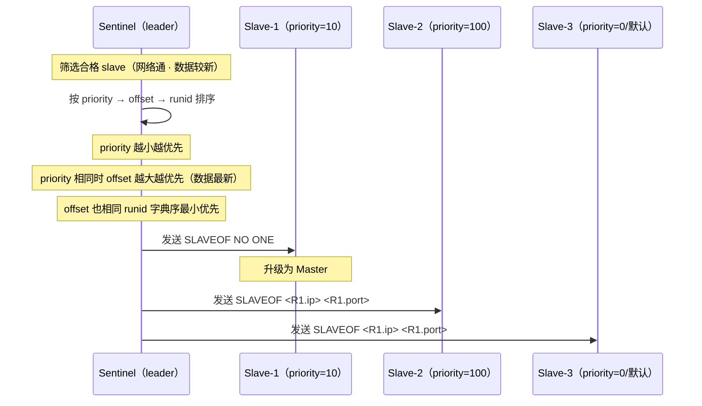
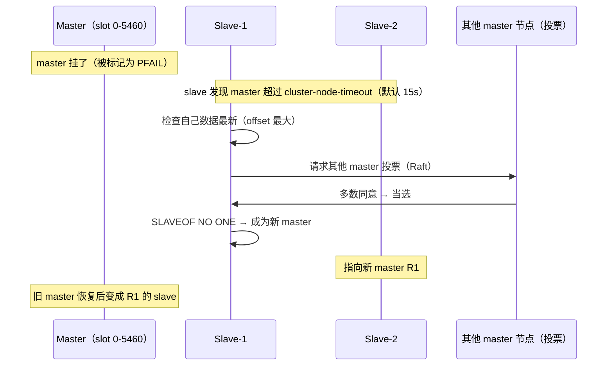
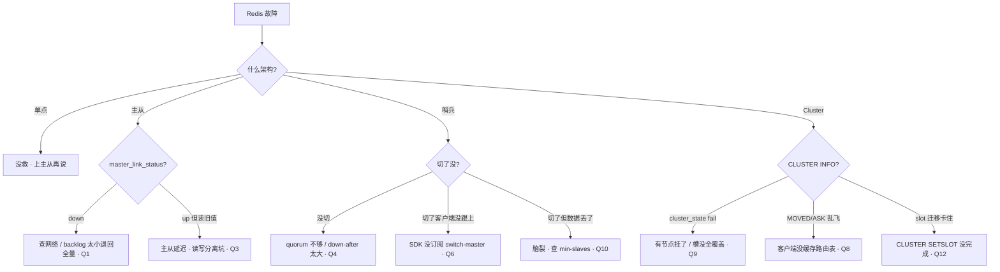

# 02-03｜高可用与集群 · 练习题

开始做题前，先给大家一个小建议：合上知识点，对着 **一节的主图**，把主线口述一遍。能顺下来，下面这些题你会发现大半都会了；卡壳的地方，就是你该回去重读的那一节。

做题的方式也建议改一下：每道题**先看标题和场景，自己口述一遍答案，再往下看「完整解答」对答案**。直接看解答，容易产生「我会了」的错觉——能讲出来才是真的会。

| 标记 | 含义 |
|------|------|
| **核心** | 不懂整章就没建立起来 |
| **必会** | 值班和面试都要能讲 |
| **常用** | 线上会反复碰到 |
| **常考** | 白板和追问的高频口径 |

题目的顺序也是有意排的：Q1、Q2 先把主从复制钉死；Q3 读写分离；Q4～Q6 哨兵；Q7、Q8、Q11、Q12、Q14 Cluster；Q9、Q10 故障转移与脑裂；Q13 收尾到值班定责。

## 本题目录

- [Q1 主从复制全量 vs 部分重同步](#q1)
- [Q2 replication backlog 调优](#q2)
- [Q3 读写分离读到旧值](#q3)
- [Q4 哨兵 SDOWN 与 ODOWN](#q4)
- [Q5 哨兵故障转移选哪个 slave](#q5)
- [Q6 哨兵切换后客户端没跟上](#q6)
- [Q7 Cluster 16384 槽位](#q7)
- [Q8 hash tag 的作用与坑](#q8)
- [Q9 MOVED vs ASK](#q9)
- [Q10 Cluster 故障转移过程](#q10)
- [Q11 脑裂怎么防、为什么还会丢数据](#q11)
- [Q12 哨兵 vs Cluster 怎么选](#q12)
- [Q13 值班 60 秒定责](#q13)
- [Q14 Cluster 扩节点加槽怎么滚](#q14)
- [合上书](#合上书)

---

## Q1

**★★★★★｜主从断了重连会发生什么？什么条件走全量、什么条件走部分重同步？**

**覆盖**：核心 · 必会 · 常考 ｜ **对应**：知识点 [二、主从复制：把 key 复制到副本](知识点.md)

### 场景

这道题几乎是 Redis 高可用面试的「开场白」。

从库因网络抖动断线 10 秒后重连，`INFO replication` 看到开始全量同步。有人觉得「10 秒不应该全量」，要调 `repl-backlog-size`；有人要重启从库试试。

先自己试试：不看下面，你能口述出关键结论吗？想完再对答案。

### 完整解答

> 🎯 **一句话**：从库重连发 PSYNC 带上 offset，master 查 replication backlog 决定——offset 在窗口内走部分重同步只补缺口，不在窗口内走全量从头来。

从库执行 `REPLICAOF` 后，发 `PSYNC <runid> <offset>` 给 master。master 判断：

- **runid 匹配 且 offset 在 replication backlog 范围内** → **部分重同步（partial resync）**：只从 offset 补 backlog 里的写命令，秒级完成。
- **runid 不匹配（master 重启过）或 offset 超出 backlog 窗口** → **全量同步（full sync）**：master `BGSAVE` 生成 RDB → 发给从库 → 从库 load 到内存 → 补发 backlog 里的新写。大库几十 GB，耗时分钟级。

```text
master 维护：
  runid（重启会变）
  offset（全局写序号，单调递增）
  replication backlog（环形缓冲区，默认 1MB）

slave 重连发：PSYNC <master_runid> <last_offset>

master 判断：
  runid 匹配 且 last_offset 在 backlog 窗口内 → 部分重同步（补缺口）
  runid 不匹配 或 offset 超出窗口 → 全量同步（从头来）   # ← 大库最怕这个
```

本例 10 秒断线却走了全量，多半是 **backlog 太小**（默认 1MB）——10 秒峰值写入如果超过 1MB，offset 就被覆盖了，master 查不到缺口，只能全量。调大 `repl-backlog-size` 就能走部分重同步。

> ⚠️ **别混**：**全量同步不会卡住 master 写**——master 仍然接收写请求，新写存进 backlog，RDB 发完后再补发。但 `BGSAVE` 的 fork 会短暂阻塞主线程（毫秒到秒级），大库时不可忽略。也**不是**「断了 10 秒一定走部分」——取决于 backlog 大小和写入速率，不是断线时长。

> 📝 **面试**：问「主从断线重连怎样」，答「从库发 PSYNC 带 runid 和 offset，master 检查 offset 是否在 replication backlog 窗口内——在就部分重同步只补缺口，不在就全量同步」。补一句「PSYNC2 协议从 2.8 开始才有，之前断了必然全量」。

### 再追问

**全量同步的步骤？**——`REPLICAOF` → slave 发 `PSYNC ? -1` → master `BGSAVE` 生成 RDB → 发 `+FULLRESYNC` 带新 runid 和 offset → 发 RDB 文件 → slave load 到内存 → master 补发 backlog 里的新写 → 进入增量命令传播。

**backlog 默认 1MB 够吗？**——低写入够，高写入不够。公式：`backlog ≈ 平均断线秒数 × 峰值写入速率 × 2`。例：峰值 5MB/s、常见断线 10s → `50MB × 2 = 100MB`。**不要**重启从库——重启必然触发全量，更慢。

---

## Q2

**★★★★☆｜replication backlog 大小怎么定？为什么默认 1MB 不够？**

**覆盖**：必会 · 常用 ｜ **对应**：知识点 [二、主从复制：把 key 复制到副本](知识点.md)

### 场景

Q1 讲了主从是什么；这道题抠 PSYNC 全量 vs 部分重同步。

线上 Redis 峰值写入约 5MB/s，每次网络抖动 5~10 秒就触发全量同步，从库 `INFO replication` 的 `master_link_status` 在 down/up 之间反复横跳。

先自己试试：不看下面，你能口述出关键结论吗？想完再对答案。

### 完整解答

> 🎯 **一句话**：backlog 是 master 的环形缓冲区，断了重连能不能走部分重同步全看它够不够大——默认 1MB 高写入必不够。

backlog 存的是 master 最近的写命令，是个**环形缓冲区**——写满了就覆盖最旧的数据。从库断线重连时，master 检查从库要的 offset 还在不在 backlog 里：

- 在 → 部分重同步（补缺口）
- 不在 → 全量同步

```bash
# 主库 INFO replication 关键字段
INFO replication
# repl_backlog_size:1048576        ← backlog 大小（1MB 默认）
# repl_backlog_first_byte_offset:900000  ← backlog 最早存的 offset
# master_repl_offset:1024000       ← 当前 offset
# backlog 覆盖范围：900000~1024000 = 1MB 的写命令
```

**调优公式**：`repl_backlog_size ≈ 平均断线秒数 × 峰值写入速率 × 2`（留 2 倍余量）。例：峰值 5MB/s，常见断线 10s → `10 × 5MB × 2 = 100MB`。

```bash
# 调整 backlog 大小
CONFIG SET repl-backlog-size 104857600   # 100MB
# 持久化到 redis.conf: repl-backlog-size 100mb
```

> ⚠️ **别混**：backlog 调大**不等于**从库数据更多——backlog 只存 master 最近的写命令，不是完整数据快照。它的唯一作用是让断了重连的从库**不退回全量同步**。也**不是**「backlog 越大延迟越小」——backlog 大小和主从延迟无关，只影响断线重连走不走全量。

### 再追问

**backlog 和 RDB 什么关系？**——RDB 是磁盘持久化（→ [02](../02-持久化与内存管理/)），backlog 是内存里的复制缓冲。两者完全独立：backlog 给从库补缺口用，RDB 给重启恢复用。全量同步时 master 会 `BGSAVE` 生成一份 RDB 发给从库，但那不是 backlog，是临时全量快照。

**从库 `master_link_status:down` 超过多久要告警？**——`master_last_io_seconds_ago` 超过 30 秒就查。常见原因：网络分区、master OOM、master fork 阻塞。**不要**直接重启从库——重启必然触发全量同步，更慢。

---

## Q3

**★★★★★｜读写分离后用户刚改昵称刷新页面没变，怎么回事？**

**覆盖**：核心 · 必会 · 常考 ｜ **对应**：知识点 [三、读写分离与主从延迟](知识点.md)

### 场景

副本有了，业务要读写分离——会不会读到旧值？

用户改了昵称，前端立刻刷新，后端读走从库——昵称没变。用户投诉「没保存」，后端说「master 上明明是新值，肯定是缓存问题」。

先自己试试：不看下面，你能口述出关键结论吗？想完再对答案。

### 完整解答

> 🎯 **一句话**：Redis 复制是异步的，master 回 OK 时 slave 还没收到——读自己的写（read-after-write）会读到旧值。

```text
时间线：
  t0  master 写入 key=v2  →  立即返回 OK 给客户端
  t1  master 异步发 REPL_SET key v2 给 slave   ← 这段就是延迟
  t2  slave 执行 SET key v2

  如果客户端在 t0~t1 之间去读 slave → 读到 v1（旧值）
```

Redis 的主从复制是**异步**的：master 写完立即回客户端 OK，再异步把写命令发给 slave。所以「写成功了」只代表 master 收了，不代表 slave 已经收到。客户端在写完后的延迟窗口内去读 slave，就会读到旧值。

**对策**：

| 场景 | 读谁 | 原因 |
|------|------|------|
| 钱包/库存/订单 | 读 master | 不能容忍旧值 |
| 刚写完立刻读 | 读 master 或等 1 个 RTT | read-after-write |
| 排行榜/统计 | 读 slave | 旧值无所谓 |
| 拉取列表/配置 | 读 slave | 减轻主库压力 |

```bash
# 写完后强制等从库 ACK
SET user:1001 name "新昵称"
WAIT 1 100   # 等至少 1 个从库 ACK，最多 100ms
# (integer) 1   ← 1 个从库确认了，读这个从库就是新值
# (integer) 0   ← 超时没等到，从库可能还是旧值
```

`WAIT` 不是事务，不保证强一致，只是降低读到旧值的概率。高频场景不能乱用——它阻塞当前连接。

> ⚠️ **别混**：Redis 复制是**异步**的，不是 MySQL 的**半同步**。MySQL `semi-sync` 会等至少一个从库 ACK 才回客户端 OK；Redis 的 `WAIT` 是手动加的，默认不等。所以「Redis 读写分离」默认不保证 read-after-write，要手动处理。

> 📝 **面试**：问「Redis 读写分离怎么保证不读到旧值」，答「关键路径直接读主库，不读从库；或写完后 `WAIT N timeout` 等从库 ACK 再读从库」。补一句「Redis 复制是异步的，不像 MySQL 有半同步」。

### 再追问

**为什么 Redis 不做成同步复制？**——同步复制每条写要等从库 ACK，master 吞吐会被最慢的从库拖死，Redis 设计目标是低延迟。异步换来的代价就是「可能丢数据」（主挂时 slave 没收到）和「可能读旧值」（读写分离时）。

**`WAIT` 能保证不丢数据吗？**——不能完全保证。`WAIT` 等到 ACK 只代表从库**收到了**写命令，不代表从库已经执行完或持久化。而且超时返回 0 时 master 还是会回 OK——只是你不知道从库跟没跟上。

---

## Q4

**★★★★☆｜哨兵的 SDOWN 和 ODOWN 区别？quorum 是什么？**

**覆盖**：核心 · 必会 · 常考 ｜ **对应**：知识点 [四、哨兵 Sentinel：谁当主](知识点.md)

### 场景

主从有了，人还得半夜切主——哨兵怎么自动选主？

线上 master 偶尔卡顿几秒，哨兵每次都切了，业务被频繁打断。有人要调大 `down-after-milliseconds`，有人觉得「quorum 设大一点就不会误切了」。

先自己试试：不看下面，你能口述出关键结论吗？想完再对答案。

### 完整解答

> 🎯 **一句话**：SDOWN 是单个哨兵的个人判断，ODOWN 是超过 quorum 个哨兵的集体决议——只有 ODOWN 才触发故障转移。

```text
单个哨兵：  心跳 ping 超过 down-after-milliseconds（默认 30s）→ 标记 SDOWN（主观下线）
多个哨兵：  超过 quorum 个哨兵都标 SDOWN → 升级为 ODOWN（客观下线）→ 开始故障转移
```

- **SDOWN（Subjectively Down，主观下线）**：一个哨兵 ping master 超时 → 自己标记为 SDOWN。只是个人意见，不触发切换。
- **ODOWN（Objectively Down，客观下线）**：超过 **quorum** 个哨兵都标了 SDOWN → 集体认定 master 挂了 → 才真正触发故障转移。

**quorum（法定人数）**：哨兵配置里的参数，表示「至少几个哨兵同意才认定 master 客观下线」。

> 💡 **打个比方**：一个哨兵觉得 master 不行，叫 SDOWN——只是个人意见；大多数哨兵都同意，才叫 ODOWN——这是集体决议，才真正动手切。

> ⚠️ **别混**：**quorum 是「认定 master 挂了需要几个哨兵同意」，不是「选 leader 做故障转移需要几个」**。故障转移的 leader 选举走 Raft-like 多数（`N/2+1`）。例：5 个哨兵、quorum=2——2 个就能认定 ODOWN，但故障转移的 leader 要 3 个（5/2+1）投票才当选。所以调大 quorum 只是让「认定下线更难」，不影响「选 leader 的票数」。

本例 master 偶尔卡顿几秒就切，应该调大 `down-after-milliseconds`（默认 30s 太激进就调到 60s），而不是调 quorum——卡顿几秒根本不应该触发 SDOWN，是 `down-after` 设太短。

> 📝 **面试**：问「哨兵怎么判断 master 挂了」，答「单个哨兵心跳超时标 SDOWN，超过 quorum 个哨兵同意升级 ODOWN 才触发故障转移。quorum 是认定下线的票数，选 leader 走 Raft N/2+1，两者不等」。

### 再追问

**哨兵为什么至少 3 个？**——单哨兵自己挂了就没人切了。2 个的话，一个说挂一个说没挂，谁也说服不了谁。3 个奇数能投票有结果（多数派 = 2）。线上常见 3 个或 5 个。

**master 卡顿和真挂怎么分？**——`down-after-milliseconds` 设够大（30~60s），配合 `sentinel ping` 心跳。短暂卡顿（GC、fork）不应该算挂。**不要**设成 5s——会频繁误切。

---

## Q5

**★★★★★｜哨兵故障转移时怎么选哪个 slave 升 master？**

**覆盖**：核心 · 必会 · 常考 ｜ **对应**：知识点 [四、哨兵 Sentinel：谁当主](知识点.md)

### 场景

这是 Q4 的细节版：SDOWN→ODOWN 和 quorum。

面试官问「3 个 slave，priority 分别是 10、100、0（默认），offset 分别是 5000、5000、4900，选哪个升 master？」有人答「offset 最大的」，有人答「priority 最大的」。

先自己试试：不看下面，你能口述出关键结论吗？想完再对答案。

### 完整解答

> 🎯 **一句话**：哨兵按 priority（越小越优先）→ offset（越大越优先，数据最新）→ runid（字典序小优先）三步排序选。



**读图**：三步排序——① **priority**（哨兵配置的优先级，**越小越优先**，0 表示永不选为主）；② **offset**（复制偏移量，越大代表数据越新）；③ **runid**（每个 Redis 实例的唯一标识，字典序最小的优先，纯粹为了排序确定性）。

回到场景题：三个 slave 的 priority 分别是 10、100、0（默认）。priority=0 表示「永不选为主」，所以排除 slave-3。slave-1（priority=10）比 slave-2（priority=100）小，**选 slave-1**。offset 只在 priority 相同时才比，这里不需要看 offset。

> ⚠️ **别混**：**priority 越小越优先，不是越大**。priority=0 是特殊值，表示「永远不选这个 slave 当 master」（用于只想让它做读副本、不升主的节点）。offset 越大越优先因为代表从主库收到的数据越多越新。

> 📝 **面试**：答三步排序——「priority 小优先 → offset 大优先（数据新）→ runid 字典序小优先」，补一句「priority=0 永不选为主」。

### 再追问

**故障转移完旧 master 恢复了怎么办？**——哨兵会把它标记为新 master 的 slave，让它追赶新 master 的数据。如果旧 master 隔离期间收了写（脑裂），这些写会被新 master 的数据覆盖——这就是脑裂丢数据的原因（Q11）。

**能不能手动指定哪个 slave 升主？**——可以，给目标 slave 设 `CONFIG SET replica-priority 1`，其他设 0（永不选）。但这是手动干预，正常应让哨兵自动选。**不要**在故障转移过程中改 priority——排序结果不确定。

---

## Q6

**★★★☆☆｜哨兵切换完了，客户端还在连旧 master，怎么办？**

**覆盖**：必会 · 常用 ｜ **对应**：知识点 [四、哨兵 Sentinel：谁当主](知识点.md)

### 场景

就是 Q5 那位同学踩的坑：哨兵配置/客户端怎么感知新主。

哨兵完成故障转移，新 master 已上线，但应用日志全是 `MOVED` 或 `Connection refused`。一看客户端还在连旧 master IP。

先自己试试：不看下面，你能口述出关键结论吗？想完再对答案。

### 完整解答

> 🎯 **一句话**：客户端不直连 master，而是找哨兵问「master 在哪」——SDK 要订阅哨兵的 `+switch-master` 频道自动重连。

```bash
# 客户端找哨兵要 master 地址
redis-cli -p 26379 SENTINEL get-master-addr-by-name mymaster
# 1) "10.0.0.2"       ← 新 master IP
# 2) "6379"           ← 端口
```

切换后哨兵更新 `sentinel.conf` 里的 master 地址，并通过发布订阅频道 `+switch-master` 通知所有订阅者。**接了哨兵的客户端 SDK（Jedis、go-redis、StackExchange.Redis）会自动订阅这个频道，收到通知后重连新 master**。没接哨兵的客户端（裸 `redis-cli` 或自研连接池）只能等连接报错再手工切。

本例的解法：检查客户端 SDK 是否配置了哨兵模式。Jedis 用 `JedisSentinelPool`，go-redis 用 `UniversalClient` + `Addrs` 填哨兵地址列表。如果用裸 IP 连 master，哨兵切换后必然连不上。

```bash
# 确认新 master 身份
INFO replication
# role:master               ← 之前是 slave，现在是 master
# connected_slaves:1        ← 另一个 slave 已指向自己
```

> ⚠️ **别混**：**哨兵切换是新 master 顶替旧 master 的 IP+端口**，不是旧 master 改了 IP。客户端如果硬编码旧 master IP，切换后连的旧 master 已经变成 slave（只读），写操作会报错。**不要**手工改配置文件里的 IP——下次切换又得改。正解是让 SDK 通过哨兵发现 master。

### 再追问

**切换期间写丢了怎么办？**——切换窗口（几秒到几十秒）内客户端的写会失败。应用要**重试 + 幂等**：写入失败重试，重试要幂等（带唯一 ID 去重）。**不要**把失败请求丢异步队列不管——切换后重试可能成功。

**能不能让哨兵切之前先通知客户端？**——不能。哨兵的切换是故障驱动的，master 已经挂了才开始切。`+switch-master` 是切换**完成后**发的通知，不是切之前。所以切换窗口内必然有写失败，应用必须兜住。

---

## Q7

**★★★★★｜Cluster 为什么是 16384 个槽？hash tag 怎么用？**

**覆盖**：核心 · 必会 · 常考 ｜ **对应**：知识点 [五、Cluster 集群：把 key 分散到多个节点](知识点.md)

### 场景

单组顶得上了，要横向扩——Cluster 16384 槽。

面试官问「Cluster 怎么分 key？」有人答「一致性哈希」，有人答「16384 槽位」。再问「为什么 16384？」「MGET 跨节点怎么办？」就卡住了。

先自己试试：不看下面，你能口述出关键结论吗？想完再对答案。

### 完整解答

> 🎯 **一句话**：Cluster 用 CRC16(key) mod 16384 算 slot，每个节点负责一部分槽——16384 是心跳包大小和集群规模权衡的结果。

```text
slot = CRC16(key) mod 16384

  key "user:1001" → CRC16 → 34567 → mod 16384 → slot 1823
  key "order:200" → CRC16 → 12345 → mod 16384 → slot 4249
```

**为什么是 16384 不是 65536？** 两个理由：

1. **心跳包大小**：Cluster 节点之间用 gossip 协议互发心跳，带上自己负责的槽位 bitmap。16384 位 = 2KB，65536 位 = 8KB——心跳包太大浪费带宽。
2. **集群规模**：Redis 官方建议集群不超过 1000 个节点，16384 个槽分给 1000 个节点，每个约 16 个槽，够用了。

> ⚠️ **别混**：Redis Cluster **不是一致性哈希**——一致性哈希是环形空间、虚拟节点，扩缩容时只迁移相邻节点数据。Cluster 是**固定 16384 槽**，扩缩容时迁移槽位（`CLUSTER SETSLOT`），迁移期间用 ASK 重定向。两者完全不同。

**hash tag**：多 key 命令（`MGET`、`SUNION`、Lua 脚本跨 key）要求所有 key 落同一个槽，用 `{tag}` 让 CRC16 只算括号内的内容：

```bash
# 不带 hash tag：三个 key 可能分散到三个节点
SET {user:1001}:name "Alice"     # CRC16("user:1001") → slot X
SET {user:1001}:age 30            # CRC16("user:1001") → slot X（一样）
SET {user:1001}:city "Beijing"    # CRC16("user:1001") → slot X（一样）

# 带 {} 的 key，CRC16 只算 {} 里的部分 → 一定落同一个槽
MGET {user:1001}:name {user:1001}:age {user:1001}:city   # 同槽，Cluster 允许
```

**读图（命令对）**：所有共享同一 hash tag 的 key 一定落在同一节点，可以安全多 key 操作。`{user:1001}` 是 tag，CRC16 只算 `user:1001` 这一段。

```bash
# 算 key 落哪个槽
CLUSTER KEYSLOT user:1001
# (integer) 7898    # ← CRC16("user:1001") mod 16384
```

> 📝 **面试**：问「Cluster 怎么分片」，答「CRC16(key) mod 16384 算槽位，不是一致性哈希。16384 是因为心跳包 bitmap 2KB 够用 + 集群≤1000 节点够分」。补一句「多 key 命令用 hash tag `{tag}` 让 key 落同槽」。

### 再追问

**hash tag 有什么坑？**——滥用会数据倾斜：所有带同一 tag 的 key 挤在一个节点，其他节点空着。比如所有用户 key 用 `{user}` 做 tag，全部落一个节点——Cluster 的分片就没意义了。**hash tag 只在必须多 key 操作时用**，且 tag 要让数据均匀分散（用用户 ID 而非固定前缀）。

**Cluster 不支持哪些命令？**——跨槽的多 key 命令：`KEYS *`（只返回当前节点的 key）、`DBSIZE`（只返回当前节点）、`FLUSHALL`（只清当前节点）、不带 hash tag 的 `MGET` / `SUNION`。要全集群操作得用 `--cluster` 命令或逐节点遍历。

---

## Q8

**★★★☆☆｜MOVED 和 ASK 重定向什么时候出现？客户端怎么处理？**

**覆盖**：必会 · 常考 ｜ **对应**：知识点 [五、Cluster 集群：把 key 分散到多个节点](知识点.md)

### 场景

这是 Q7 的路由特写：MOVED vs ASK。

线上 Cluster 迁移槽位，客户端日志里一堆 `MOVED` 和 `ASK` 混在一起。有人问「这俩不是一回事吗？」

先自己试试：不看下面，你能口述出关键结论吗？想完再对答案。

### 完整解答

> 🎯 **一句话**：MOVED 是永久重定向，客户端更新路由表；ASK 是迁移中临时重定向，客户端不更新路由表。

```bash
# 槽位已永久迁移到节点 B
SET user:1001 "Alice"
# (error) MOVED 7898 10.0.0.3:6379    ← 永久重定向：slot 7898 在 10.0.0.3

# 槽位正在迁移中：从节点 A 迁到节点 B
SET user:1001 "Alice"
# (error) ASK 7898 10.0.0.3:6379     ← 临时重定向：去 B 问一下
```

**读图（两条命令对）**：

- **MOVED**：槽位**已**永久迁移到新节点。客户端收到后**更新本地槽位映射表**，以后这个槽的请求直接发新节点，不再问旧节点。
- **ASK**：槽位**正在**迁移中，数据可能在旧节点也可能在新节点。客户端**临时**去新节点试一下，但**不更新路由表**——下次还是先问旧节点。

| | MOVED | ASK |
|---|---|---|
| 时机 | 迁移完成后 | 迁移进行中 |
| 客户端动作 | 更新路由表，以后直接找新节点 | 临时去新节点，不更新路由表 |
| 持续性 | 一次性 | 迁移期间反复出现 |

> ⚠️ **别混**：**MOVED 会让客户端永久记住新地址，ASK 不会**。ASK 是「我现在不确定 key 在哪，你去那边问一下」，客户端问完还是回到旧路由。这是为了保证迁移期间数据一致性——旧节点和迁移目标节点可能都有一份 key，需要协调。

> 📝 **面试**：问「MOVED 和 ASK 区别」，答「MOVED 是永久重定向，客户端更新路由表，以后直接找新节点；ASK 是迁移中临时重定向，客户端不更新路由表，只是临时去新节点试」。

### 再追问

**迁移过程中 key 在哪？**——迁移开始后，旧节点发 `ASK` 给客户端，客户端临时去新节点。旧节点会把 key 用 `MIGRATE` 命令搬到新节点。迁移期间 key 可能短暂存在两边——旧节点迁移前先 `DUMP`，目标节点 `RESTORE`，成功后旧节点才 `DEL`。`CLUSTER SETSLOT` 标记迁移状态：`MIGRATING`（迁出中）和 `IMPORTING`（迁入中）。

**客户端 SDK 会自动处理 MOVED/ASK 吗？**——主流 SDK（Jedis、go-redis、Lettuce）会自动跟随重定向。但频繁 ASK 会增加延迟，迁移尽量在低峰期做。**不要**在迁移期间跑大量批量命令——重定向开销叠加。

---

## Q9

**★★★★☆｜Cluster 的 master 挂了怎么自动切换？和哨兵的故障转移有什么区别？**

**覆盖**：必会 · 常用 · 常考 ｜ **对应**：知识点 [六、故障转移：主节点挂了怎么办](知识点.md)

### 场景

开篇那个「缓存全空」现场——故障转移与脑裂。

Cluster 某个 master 挂了，有人问「哨兵会切吗？」另人说「Cluster 不用哨兵，自己切」。追问「谁投票？怎么选？」

先自己试试：不看下面，你能口述出关键结论吗？想完再对答案。

### 完整解答

> 🎯 **一句话**：Cluster 的 slave 自己发起拉票，其他 master 节点投票——不需要哨兵。



**读图**：Cluster 故障转移三步——① slave 发现 master 超过 `cluster-node-timeout`（默认 15s）不可达；② 数据最新的 slave（offset 最大）向其他 master 节点发拉票请求，拿到多数票（master 总数的 N/2+1）当选；③ 升级为 master，其他 slave 指向它。

- **PFAIL（主观下线）**：单个节点认为另一节点不可达。
- **FAIL（客观下线）**：超过半数 master 都认为某节点 PFAIL → 标记 FAIL → 触发故障转移。

> ⚠️ **别混**：**哨兵的投票是哨兵之间投，Cluster 的投票是 master 节点之间投**。哨兵模式里 slave 不参与投票，故障转移由哨兵执行；Cluster 模式里 slave 主动拉票、master 投票，故障转移由集群自己执行，不需要额外组件。也**不是**「Cluster 每个节点都投票」——只有 master 节点有投票权，slave 没有。

> 📝 **面试**：问「Cluster 怎么故障转移」，答「slave 发现 master 超时→数据最新的 slave 拉票→其他 master 多数同意→SLAVEOF NO ONE 升 master」。补一句「和哨兵的区别：哨兵是哨兵之间投票选 leader 执行切换，Cluster 是 slave 自己拉票、master 投票，不需要哨兵」。

### 再追问

**旧 master 恢复后呢？**——变成新 master 的 slave，追赶数据。如果旧 master 隔离期间收了写（脑裂），这些写会被覆盖——Q11 详解。

**手动故障转移怎么做？**——在 slave 上执行 `CLUSTER FAILOVER`，可选 `TAKEOVER`（不等 master 投票直接抢）或默认（等 master 同意）。用于计划性维护：把 master 的某个节点滚动升级，先手动切到 slave 再升级旧 master。**不要**用 `TAKEOVER` 做日常维护——它绕过了投票，可能导致脑裂。

---

## Q10

**★★★★★｜脑裂是怎么回事？min-slaves-to-write 怎么防？为什么说防不住？**

**覆盖**：核心 · 必会 · 常考 ｜ **对应**：知识点 [六、故障转移：主节点挂了怎么办](知识点.md)

### 场景

就是 Q9 的脑裂防法特写：`min-slaves-to-write`。

凌晨 Redis 主节点网络隔离，哨兵切了新主。网络恢复后旧主变 slave，但业务反馈「隔离期间的写没了」。有人要追责「为什么没防脑裂」，运维说「配了 `min-slaves-to-write` 还是丢了」。

先自己试试：不看下面，你能口述出关键结论吗？想完再对答案。

### 完整解答

> 🎯 **一句话**：脑裂是网络分区导致旧主还在收写、哨兵切了新主——两个 master 同时存在，切回来后旧主隔离期间的写被新主覆盖。

```mermaid
flowchart TB
    subgraph ISOLATED["网络隔离区"]
        OLD["旧 Master<br/>还活着 · 还在收写"]
    end
    subgraph NORMAL["正常区"]
        SENT["哨兵 ODOWN"]
        NEW["新 Master<br/>从旧 slave 提升"]
    end
    SENT --> NEW
    CLIENT["客户端"] -->|先写旧主| OLD
    CLIENT2["客户端"] -->|切到新主| NEW
    Note over OLD,NEW: 两边都在收写 = 脑裂
```

**读图**：脑裂根因是**网络分区**——旧主和哨兵之间断开了，哨兵认为它挂了、切了新主，但旧主没收到通知、还在接收客户端写。网络恢复后旧主变成 slave，它隔离期间收的写会被新主覆盖，**数据丢失**。

**防脑裂：`min-slaves-to-write` + `min-slaves-max-lag`**：

```bash
# master 配置
CONFIG SET min-slaves-to-write 1    # 至少 1 个 slave 在线才允许写
CONFIG SET min-slaves-max-lag 10    # slave 延迟不超过 10 秒才算「在线」
```

```text
正常时：  master 有 2 个 slave 在线，延迟 0s → 可以写
隔离后：  旧 master 的 slave 全断了 → min-slaves-to-write 不满足 → 拒绝写
          客户端收到 error → 转去新主 → 数据不丢
```

**为什么说「防不住」**：`min-slaves-to-write` 是**门槛**，不是同步复制——master 仍然异步发写给 slave，只是「slave 都断了我就不写了」。它降低风险但不等于消除：

1. **门槛和写入之间有窗口**：master 检查 slave 状态有间隔，隔离后到检查到之间可能还收了几条写。
2. **slave 在线不代表数据已同步**：`min-slaves-max-lag 10` 允许 10 秒延迟，这 10 秒内的写如果 master 挂了、slave 没收到就丢了。
3. **Redis 本质是异步复制**：master 回 OK 时 slave 还没收到，这中间窗口的写主挂掉就丢。

> ⚠️ **别混**：`min-slaves-to-write` **不是同步复制**——它只是「slave 全断了就拒写」，不是「等 slave ACK 才回 OK」。要强一致用 `WAIT` 命令或考虑别的存储。**不要**以为配了 `min-slaves-to-write` 就不丢数据——它只是降低脑裂风险。

> 📝 **面试**：问「Redis 怎么防脑裂」，答「配 `min-slaves-to-write 1` + `min-slaves-max-lag 10`——slave 全断时 master 拒写」。**一定补一句**「这是降低风险，不等于消除——Redis 异步复制做不到强一致」。这句是区分「背过」和「懂了」的分水岭。

### 再追问

**本例配了 `min-slaves-to-write` 还丢了，可能什么原因？**——最常见是 `min-slaves-max-lag` 设太大（比如 30s），隔离后 slave 还在 10~30s 的「可接受延迟」内，master 没拒写。或者 `min-slaves-to-write 0`（等于关闭）。检查配置：

```bash
CONFIG GET min-slaves-to-write    # 确认 > 0
CONFIG GET min-slaves-max-lag     # 确认 ≤ 10s
```

**要完全不丢怎么办？**——Redis 做不到。`WAIT` 命令也只是降低概率。要强一致考虑：① Redis + 同步刷盘的 AOF（`appendfsync always`，性能下降 10 倍+，→ [02](../02-持久化与内存管理/)）；② 换 MySQL 做关键数据存储，Redis 只做缓存。

---

## Q11

**★★★★☆｜什么时候用哨兵、什么时候上 Cluster？**

**覆盖**：必会 · 常考 ｜ **对应**：知识点 [四、哨兵 Sentinel：谁当主](知识点.md) · [五、Cluster 集群：把 key 分散到多个节点](知识点.md)

### 场景

哨兵 vs Cluster——什么时候用哪个？

业务量增长，单 master 内存撑不住。有人提议「多加几个 slave 分担」，有人提议「上 Cluster」。运维问「哨兵 + 主从和 Cluster 到底什么区别？」

先自己试试：不看下面，你能口述出关键结论吗？想完再对答案。

### 完整解答

> 🎯 **一句话**：哨兵是单 master+多 slave 的 HA，不做分片；Cluster 是分片+内置 HA，每个分片有自己的 master+slave。

| | 哨兵模式 | Cluster 模式 |
|---|---|---|
| 分片 | 不分片，全部 key 在一个 master | 16384 槽分散到多个节点 |
| HA | 哨兵负责切换 | 集群自己投票切换 |
| 数据量 | 单机内存上限（几 GB~几十 GB） | 可横向扩展（TB 级） |
| 客户端 | SDK 连哨兵发现 master | SDK 支持 Cluster 协议（MOVED/ASK） |
| 多 key 操作 | 不受限（都在一个节点） | 必须同槽（hash tag） |
| 运维复杂度 | 低 | 高（槽迁移、扩缩容） |

**选型决策**：

```text
数据量 < 单机内存 且 只需 HA → 哨兵 + 主从
数据量 > 单机内存 或 要横向扩展 → Cluster
```

> ⚠️ **别混**：**哨兵 + 多 slave ≠ 水平扩展**——所有 slave 都存全量数据，加 slave 只分担读不增加容量。要水平扩容（存更多 key）必须上 Cluster。也**不是**「Cluster 一定比哨兵好」——Cluster 运维复杂得多（槽迁移、跨节点命令限制、客户端 SDK 要支持 Cluster 协议），数据量没超单机上限就用哨兵更简单。

> 📝 **面试**：问「哨兵和 Cluster 怎么选」，答「数据量没超单机内存用哨兵（简单、运维成本低），超了或要水平扩展用 Cluster。哨兵只做单 master 的 HA，Cluster 分片+内置 HA」。

### 再追问

**能先哨兵后 Cluster 吗？**——可以，但不平滑。从哨兵迁到 Cluster 要重新分槽、迁移全量数据、改客户端 SDK。**不要**「先用哨兵跑着、大了再说」——提前评估数据增长，该上 Cluster 就早上。

**Cluster 也有 slave 吗？**——有。Cluster 每个 master 分片通常配 1~2 个 slave 做高可用。master 挂了 slave 顶上。但 Cluster 的 slave 不分担读（默认不接受读请求，要 `READONLY` 开启），主要是故障转移用。哨兵模式的 slave 可以分担读。**不要**指望 Cluster 的 slave 做读写分离——它的定位不一样。

---

## Q12

**★★★☆☆｜slot 迁移卡住了怎么办？MIGRATE 报错了怎么处理？**

**覆盖**：常用 · 常考 ｜ **对应**：知识点 [五、Cluster 集群：把 key 分散到多个节点](知识点.md)

### 场景

Cluster 运维题：槽迁移与扩容。

Cluster 扩容，迁移槽位到新节点。迁移到一半 `CLUSTER NODES` 显示槽还在 `MIGRATING` 状态，客户端日志一直报 ASK。

先自己试试：不看下面，你能口述出关键结论吗？想完再对答案。

### 完整解答

> 🎯 **一句话**：slot 迁移用 `CLUSTER SETSLOT` 标记状态 + `MIGRATE` 搬 key——卡住要先查状态，别直接删迁移中的 key。

```bash
# 槽位迁移三步
CLUSTER SETSLOT 7898 MIGRATING <target-node-id>   # 源节点标记「迁出中」
CLUSTER SETSLOT 7898 IMPORTING <source-node-id>   # 目标节点标记「迁入中」
# 逐个 key 迁移
MIGRATE <target-ip> <target-port> "" 0 5000 KEYS user:1001 order:200 ...
# 全迁完后
CLUSTER SETSLOT 7898 NODE <target-node-id>         # 全网通告槽归属
```

迁移期间，旧节点收到这个槽的请求会回 `ASK` 给客户端去新节点试。迁移完成后回 `MOVED`。

**卡住排查**：

```bash
# 查槽位状态
CLUSTER NODES
# 找 flags 里带 [MIGRATING] 或 [IMPORTING] 的节点

# 查这个槽还有多少 key 没迁
CLUSTER COUNTKEYSINSLOT 7898
# (integer) 150   ← 还有 150 个 key 在源节点

# 逐个迁
CLUSTER GETKEYSINSLOT 7898 100   # 拿 100 个 key
# 1) "user:1001"
# 2) "order:200"
# ...
MIGRATE <target-ip> <target-port> "" 0 5000 KEYS user:1001 order:200
```

> ⚠️ **别混**：**迁移中 key 可能短暂存在两边**——源节点 `DUMP` + 目标节点 `RESTORE`，成功后源节点才 `DEL`。迁移中 `ASK` 重定向是正常的，客户端 SDK 会自动跟随。也**不要**直接 `DEL` 迁移中的 key——可能导致两边都不一致。**不要**用 `FLUSHALL` 清空迁移中的节点——只清当前节点，会丢这个节点的数据。

### 再追问

**MIGRATE 超时了怎么办？**——`MIGRATE` 有超时参数（默认 5000ms），超时后源节点会重试。如果反复超时：① 查网络带宽是否打满；② 减小每批 key 数量；③ 用 `redis-cli --cluster reshard` 自动化迁移（内置重试和断点续传）。**不要**手动 `SETSLOT NODE` 强行通告——key 还没迁完就通告会导致客户端找不到 key。

**迁移期间能正常服务吗？**——能，但有性能影响。每次 `ASK` 重定向多一次往返。大 key 迁移（如大 Hash）会阻塞源节点和目标节点（`MIGRATE` 是同步操作）。**不要**在高峰期迁大 key——低峰期做或先 `SCAN` 拆分大 key。

---

## Q13

**★★★★☆｜值班收到「Redis 不对」，60 秒怎么定责？**

**覆盖**：必会 · 常用 ｜ **对应**：知识点 [七、作战：定责](知识点.md)

### 场景

这张决策树把前面十道题串起来了。

值班收到告警「Redis 异常」，群里已经有人喊「重启试试」。没有具体现象，只有一句「不对」。

先自己试试：不看下面，你能口述出关键结论吗？想完再对答案。

### 完整解答

> 🎯 **一句话**：先 `INFO replication` 看主从，再 `SENTINEL` 或 `CLUSTER INFO` 看架构层，最后定位是主从断、哨兵没切、还是 Cluster 节点挂。

```text
① 0–10s  什么架构？   INFO replication → role + master_link_status + offset 差
② 10–30s 哨兵还是 Cluster？
          哨兵：redis-cli -p 26379 SENTINEL get-master-addr-by-name {name} 看切了没
          Cluster：CLUSTER INFO 看 cluster_state + CLUSTER NODES 看谁掉线
③ 30–45s 定型：
          主从断了 → 查网络 + backlog 是否太小（INFO replication repl_backlog_size）
          哨兵没切 → 查 quorum / down-after-milliseconds（SENTINEL masters）
          Cluster fail → CLUSTER NODES 找 flags=fail 或 fail? 的节点
④ 45–60s 定责 + 验证：
          主从断 → 修网络 / 调大 backlog
          哨兵 → 修配置 / 查 SDK 重连
          Cluster → 修节点 / 补槽 / 手动 CLUSTER FAILOVER
```

**第一刀分架构**：

```bash
# 不确定是哨兵还是 Cluster？
INFO replication
# 如果有 master_host / master_link_status → 主从架构（或哨兵模式的 slave）
# 如果 role:master 且有 connected_slaves → 主从架构的 master 侧

# 哨兵？
redis-cli -p 26379 PING
# PONG → 哨兵在

# Cluster？
CLUSTER INFO
# cluster_state:ok → Cluster 架构
# cluster_state:fail → Cluster 有问题
```

**定责决策树**：



> ⚠️ **别混**：**不要重启 Redis**——重启会触发全量同步（主从）或丢掉内存数据（如果没有持久化）。**不要**手工 `SLAVEOF NO ONE` 绕过哨兵——下次哨兵切回来你又不对。先 `INFO replication` + `CLUSTER INFO` 定型，再动手。

### 再追问

**什么情况该手动切、什么情况等自动切？**——哨兵和 Cluster 都有自动故障转移，正常情况等它切。只有自动切不了（quorum 不够、所有 slave 都挂了）才手动切。手动切前先确认旧 master 真的挂了（`redis-cli -h <master> ping` 超时），**不要**在 master 还活着时手动切——会脑裂。

**告警怎么设？**——核心指标：`master_link_status != up`（从库断）、`master_last_io_seconds_ago > 30`（主从无通信）、`cluster_state != ok`（集群异常）、`cluster_slots_ok < 16384`（槽不全）。**不要**只监控 `PING` 返回 PONG——Redis 进程活着不代表主从正常、不代表 Cluster 健康。

---

## Q14

**★★★★☆｜Cluster 从 3 主 3 从扩到 6 主，槽怎么迁？能不停服吗？**

**覆盖**：必会 · 常用 ｜ **对应**：知识点 [五、Cluster 集群：把 key 分散到多个节点](知识点.md)

### 场景

就是 Q7、Q8 的 hash tag / 多 key 同槽特写。

数据量翻倍，要加 3 个 master。运维直接 `redis-cli --cluster add-node`，玩家报 `MOVED` 暴增。

先自己试试：不看下面，你能口述出关键结论吗？想完再对答案。

### 完整解答

> 🎯 **一句话**：**加节点 → reshard 迁槽 → 等迁移完成**——迁移中 `ASK` 正常，要**低峰滚**、控制 batch，**不要**强行 `SETSLOT` 未迁完的槽。

```bash
redis-cli --cluster add-node new-host:6379 existing-host:6379
redis-cli --cluster reshard existing-host:6379 --cluster-from all --cluster-to <new-id> --cluster-slots 2730
# 分批迁，每批后 CLUSTER COUNTKEYSINSLOT 确认
redis-cli CLUSTER INFO | grep cluster_slots
# cluster_slots_ok:16384   ← 必须全覆盖
```

```text
① add-node 空 master 进群
② reshard 从旧节点匀槽到新节点（每次几百槽）
③ 迁大 key 低峰做，监控 ASK/MOVED 率
④ 客户端 SDK 需支持重定向（Jedis/Lettuce 一般自带）
```

> ⚠️ **别混**：扩节点不自动分槽——必须 reshard。只加节点不迁槽，新节点空载，旧节点仍满。

### 再追问

**迁槽期间能写吗？**——能，单 key 迁移原子；但延迟上升。活动高峰**不要**大规模 resharding。

---

## 合上书

做完题再合上书，对着知识点「合上书」逐条过一遍——条数对齐，卡壳的回对应 Q：

- [ ] **默画一节的图**：单点→主从→哨兵→Cluster 四步递进，每层解决什么故障。（Q13）
- [ ] **口述主从复制**：PSYNC 全量 vs 部分重同步、全量同步步骤、backlog 调优。（Q1、Q2）
- [ ] **口述读写分离**：为什么会读到旧值、哪些场景读主库、`WAIT` 怎么用。（Q3）
- [ ] **默画哨兵架构与故障转移**：≥3 奇数、SDOWN→ODOWN、quorum、选 slave、客户端发现新主。（Q4、Q5、Q6）
- [ ] **口述 Cluster**：16384 槽、hash tag、MOVED vs ASK、gossip。（Q7、Q8、Q11、Q12、Q14）
- [ ] **默画 Cluster 故障转移**：与哨兵故障转移的区别。（Q9、Q10）
- [ ] **口述脑裂**：怎么产生、为什么丢数据、`min-slaves` 怎么防、不等于强一致。（Q9、Q10）
- [ ] **默画高可用清单**：六件套各保证什么、不保证什么。（Q11）
- [ ] **定责**：主从断 / 哨兵没切 / Cluster fail / 脑裂各看什么。（Q13）
