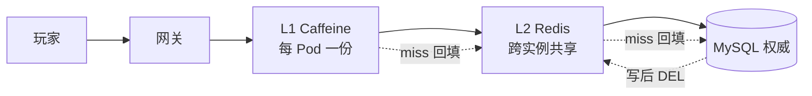
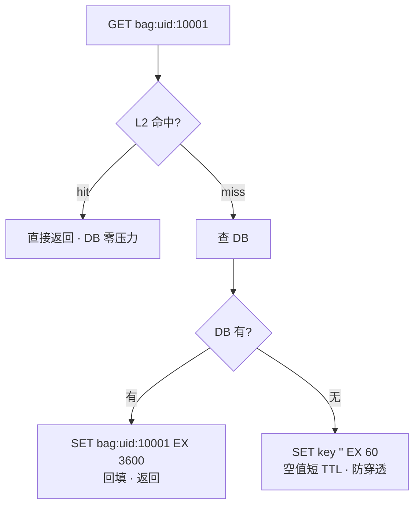
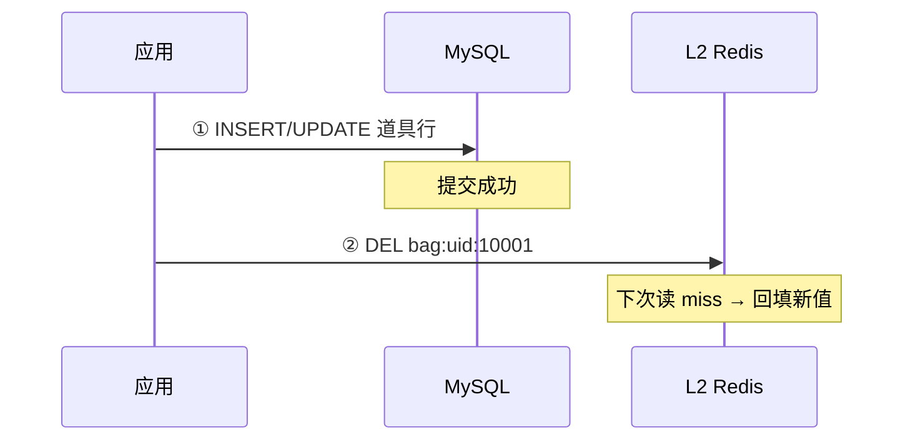
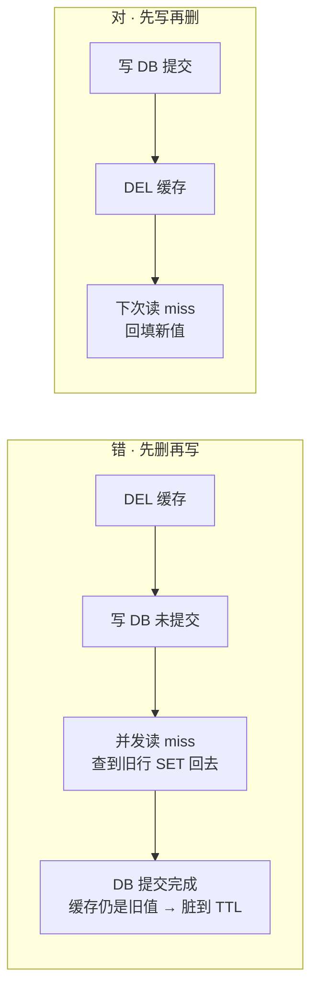
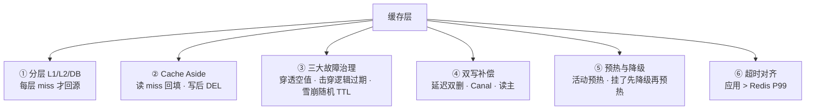
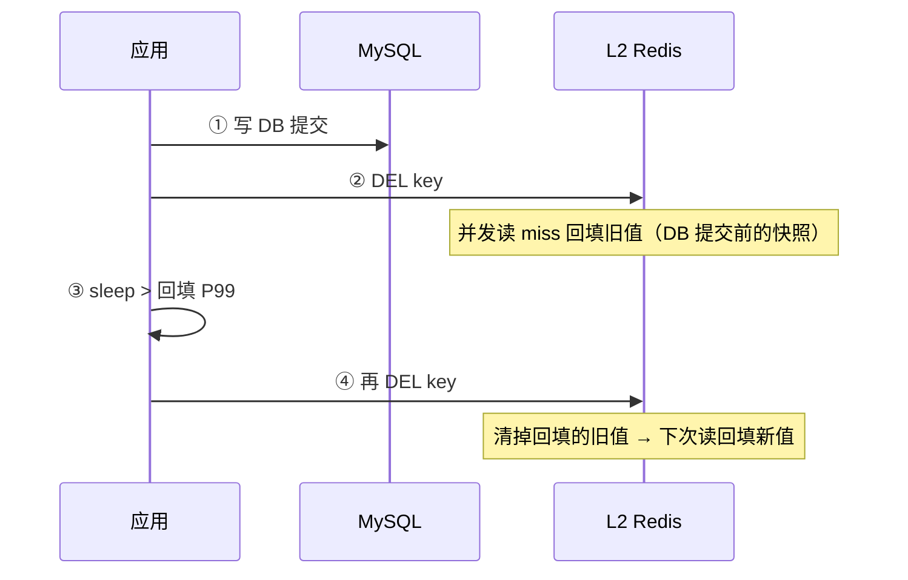
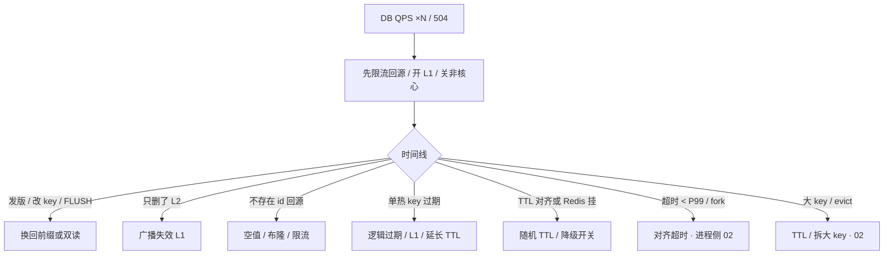

# 缓存架构

> 周五 20:00 限时礼包开卖，Redis `ping` 全绿、CPU 30%，MySQL 连接数却 3 分钟从 200 飙到 2800——2000 个 Pod 同时 miss 同一行。群里已经有人喊「扩 MySQL」「重启全部逻辑服」。
> **本章回答**：一个 key 怎么服务缓存层——读写路径怎么走、三大故障怎么分开治、双写怎么不脏。
> **不讲**：Redis 进程 / fork / 持久化 / 内存管理 → [02](../02-持久化与内存管理/)；Cluster / 哨兵 / HA → [03](../03-高可用与集群/)；MySQL 主从延迟 → [02-01](../../01-MySQL/)；网关 504 → [02-09](../../09-API网关与服务治理/)。

**标记**：🎯重点 · 🔥难点 · ⭐常考 · 🔧实操
---

## 一、一张图：一个 key 的缓存旅程

> 🎯 **一句话**：缓存层挡读放大，挂了不让 DB 死——盯的是命中率和回源 QPS，不是 Redis `up`。



- 📖 **读图**
  - 🛤️ 读主线：玩家 → 网关 → L1 → L2 → DB，每层 miss 才回源；写反过来——先提交 DB 再 DEL
  - 🧩 L1 每 Pod 一份 → 必然短暂不一致；L2 跨实例共享 → 仍可脏到 DEL/TTL
  - 📌 **没有箭头规定 Redis 比 DB 更新**——权威只在 MySQL；缓存是「允许按产品窗口变脏」的加速层

- 📊 **命中率（hit rate）** = `hits / (hits + misses)`；**回源** = miss 后查库的那一次
  - 命中率掉一点，回源乘很多——用数字算，不要凭感觉：

| 接口 QPS | 命中率 | 回源 QPS | 若 DB 上限 3000 |
|----------|--------|----------|-----------------|
| 20000 | 95% | 1000 | 活着 |
| 20000 | 70% | 6000 | **已经死了**（×6） |

- 🔗 **连接池也是乘法**：`40 逻辑服 × pool=50 = 2000`；K8s 滚动新旧各 40 → 4000
  - 超时 50ms、Redis P99 80ms 时，这些连接会同时把 miss 打到 DB

> ⚠️ **别混**：全局命中率 99% 会骗人——公告/皮肤预览占了 90% 读，支付可能只有 60%。**必须按接口拆命中率**。

托管 Redis（ElastiCache 等）：进程 HA 是厂商的，**回源放大和降级开关仍是你的**——不能跳过本章。

> 本节对应练习题 **Q1**。

---

## 二、出生：Cache Aside 读写路径

> 🎯 **一句话**：读 miss 回填，写先提交 DB 再 DEL——不在写路径 SET 新对象。

### 📖 读路径：miss 才回填 ⭐



- 📖 **读图**
  - hit 直接返回不碰 DB；miss 才回填；DB 也没有 → 空值短 TTL 挡扫号
  - 回填只发生在**读**路径；写路径不 SET

### ✍️ 写路径：先提交 DB 再 DEL 🔥

> 💡 **打个比方**：像图书馆——还书必须先改书库记录（提交 DB），再撕掉书架上的旧复印（DEL）；直接在书架贴「新版摘要」（写路径 SET）容易贴错页。



- 📖 **读图**
  - 两步：先提交 DB（权威）→ 再 DEL（下次 miss 回填新值）
  - DEL 失败要重试或 Canal 补偿，不是放任

### 🚫 为什么 DEL 不 SET ⭐🔥

#### ❓ 写路径为什么 DEL 而不是 SET 新值？

- ❌ **SET 不幂等**：并发下**晚到的旧 SET** 会盖住新值 → 脏到 TTL
- ✅ **DEL 幂等**：谁先谁后结果一样；下次读 miss 再回填权威值
- 👉 Cache Aside：**写路径只 DEL，不 SET**

```text
并发写 A、B：
  A 写 DB（v2）→ A SET 缓存 v2
  B 写 DB（v3）→ B SET 缓存 v3
  若 A 的 SET 因网络抖动晚于 B → 缓存停在 v2，DB 已是 v3 → 脏到 TTL
```

### ↔️ 先写再删 vs 先删再写 ⭐🔥

#### ❓ 先删再写不是空窗更短吗？

- ❌ **先删再写**：DEL 后 DB 未提交，并发读 miss 会把**旧行** SET 回缓存 → **脏得更久**
- ✅ **先写再删**：窗口只在「DB 已提交 → DEL」之间；miss 回填的是新行
- 生产默认：**先提交 DB，再 DEL**



- 📖 **读图**
  - 坑在 A2→A3：DEL 后 DB 未提交，并发 miss 把旧行 SET 回去，脏到 TTL
  - 先写再删的窗口只在「提交 → DEL」——并发 miss 回填的是新行

> ⚠️ **别混**：先删再写的「空窗短一点」是错觉——不是空窗短，是**脏得更久**。

### 📝 三种写模式对照 ⭐

| 模式 | 写路径 | 何时用 |
|------|--------|--------|
| **Cache Aside** | 应用写 DB，删缓存 | **默认** |
| **Write Through** | 同步写缓存和 DB | 少；延迟高 |
| **Write Behind** | 先缓存再异步刷 DB | 可丢数据，钱包/背包/邮件**禁用** |

> ⚠️ **别混**：**Write Behind** 禁用于钱包、背包、邮件——异步刷 DB 丢数据就是事故。只有可丢计数展示（在线人数）可用，且要对账。

> 📝 **面试**：「默认 Cache Aside：读 miss 回填，写先提交 DB 再 DEL，不在写路径 SET。并发旧值盖新值是 SET 的致命问题。先删再写空窗更脏。钱包不缓存或读主。」

> 本节对应练习题 **Q2、Q3**。

---

## 三、卡壳：穿透、击穿、雪崩

> 🎯 **一句话**：穿透是根本没有的 id，击穿是一个热 key 过期，雪崩是整片过期或 Redis 挂了——三样治理完全不同。

#### ❓ 穿透、击穿、雪崩都是 miss 打 DB，为啥不能一套治？

| | 根因 | 治理 |
|--|------|------|
| 穿透 | **根本不存在**的 id | 空值短 TTL / 布隆 / 限流校验 |
| 击穿 | **一个**热 key 刚好过期 | 互斥锁 / 逻辑过期 |
| 雪崩 | **一片** TTL 对齐或 Redis 整体不可用 | 随机 TTL / 降级 / HA |

- 混治会治错病：对穿透上互斥锁没用；对击穿只加空值也挡不住热点

> 💡 **打个比方**：穿透像反复问「有没有 999 号柜」（根本没有）；击穿像「1 号柜」传单刚好过期，所有人同时涌向仓库；雪崩像整栋商场传单同一秒过期，或促销员集体请假。

### 🕳️ 穿透：查根本不存在的 id 🔥

攻击脚本 `GET player:uid:999999999`，每秒 5000 次，key 各不相同。每个请求 L2 miss → DB miss → 再来。

```text
redis keyspace_hits: 正常（key 各不相同，全局命中率甚至 97%）
mysql threads_connected: 2800 ↑   slow_query: SELECT player WHERE uid=...
```

- 🎭 **全局命中率在骗人**——按**不存在 id 的回源次数**看：Redis 还活着，DB 在替缓存扛扫号

- 🛡️ **治理两套**
  1. **空值缓存**：DB miss 后 `SET key "" EX 60`——短 TTL；太长会挡住刚注册的新号；空值还能打满内存，必须配限流
  2. **布隆过滤器**：说「不存在」一定没有，说「存在」可能误判；活动新 id 还没进过滤器会被当成不存在

#### ❓ 空值和布隆哪个更好？活动期为什么不能一直开布隆？

- 空值：实现简单，挡「已知不存在」；代价是占内存 + 挡新号窗口
- 布隆：内存极省，适合扫号海量 id；假阳性可接受，假阴性（漏加）会挡真用户
- 👉 **活动期**：先写 DB 再加过滤器，或关闭布隆只靠空值 + 网关限流/id 校验
- 🚪 第一道网关限流 + id 合法性；第二道空值；第三道布隆

### 💥 击穿：一个热 key 过期 🔥

`activity:config` TTL 3600s，20:00 整点到期，2000 个 Pod 同时 miss → 2000 个并发 `SELECT * FROM activity_config WHERE id=1`。

```text
redis: up, cpu 30%
mysql: rows_read/s 暴增, 单行 SELECT 占满 slow log
单接口 cache_miss{activity_config}: 2000/s 瞬间尖刺
```

- Redis 进程健康，是**一个热 key** 过期，不是 Redis 挂了

- 🛡️ **治理两套**
  1. **互斥锁**：`SET lock:key NX EX 10`——获锁者回源，其他人短睡再 GET；代价 P99 升高
  2. **逻辑过期**：key 不物理过期，value 内带 `expire_at`——过期后仍返回旧值并异步刷新；极热 key 用这套，P99 不抖

#### ❓ 互斥锁和逻辑过期为什么不能混为一谈？

- 互斥锁：保证**只有一人回源**，其他人等——挡击穿，但等锁抬高 P99
- **singleflight** 只挡**单 Pod 内**并发；2000 个 Pod 还要分布式锁、L1 或逻辑过期
- 逻辑过期：宁可短暂脏，也不让 DB 被同一行打穿——极热配置首选
- 👉 口诀：**一般热 key 互斥锁；极热 key 逻辑过期**

### 🌊 雪崩：整片过期或 Redis 挂了 🔥

所有活动 key TTL=3600，20:00 整点一起过期；回源限流按 Redis QPS 设了 5 万，DB 上限其实 3000。

```text
20:00:00 cache_miss 全接口同时尖刺
db connections: 3000/3000  pool exhausted
gateway 504 比例 ↑
redis: 仍然 up
```

- TTL 对齐 + 回源阈值设错 = 雪崩；更致命的是 Redis 挂了/网络分区，全部 miss 同时打 DB

- 🛡️ **治理两套**
  1. **TTL `base + rand`**：`3600 + rand(0, 600)`，错开整点；热点配置用逻辑过期
  2. **降级开关 + HA**：关 L2 / 关排行 / 只保登录支付；哨兵/Cluster 解决切主

> ⚠️ **别混**：进程挂比 TTL 对齐更致命。HA 解决切主，解决不了「应用把超时当 miss」。fork 尖刺导致超时、应用把超时当 miss，表现也是雪崩（[02](../02-持久化与内存管理/)）。

### 收束：缓存层凭什么挡住读放大 🎯⭐

到这里，缓存层的全部零件都齐了。面试问「缓存层凭什么挡住读放大」，要的就是这张清单：



- 📖 **读图**
  - ① 大部分读止于缓存；② 写后缓存会被正确失效；③ 单点故障不放大成 DB ×N
  - ④⑤ 补偿失败或 Redis 挂了，DB 也不会死；⑥ 不会自己制造击穿

> ⚠️ **别混**：缓存层挡的是**读放大**，不保证强一致——强一致走 DB 或读主，别指望 Redis 锁当事务。

> 📝 **面试**：背的时候按「**分层 → 读写路径 → 故障治理 → 补偿 → 运维**」分组——少了任何一组，缓存层就有洞。

> ⭐ **口诀**：穿透是「查没有的」，击穿是「热点刚好过期」，雪崩是「一片一起死」——别混。

三大故障分清了。不同业务允许多脏、挂了怎么办不一样——钱包、排行、会话不能一套打天下。

> 本节对应练习题 **Q4、Q11**。

---

## 四、选型：道具、排行、会话怎么缓存

> 🎯 **一句话**：库存扣减不打缓存；排行展示可脏；会话可丢重登——装错层挂的时候影响面完全不同。

> 💡 **打个比方**：道具数量像银行余额——柜台（DB）才是权威，门口电子屏（缓存）可以慢几秒；排行像体育积分榜——晚几秒观众能接受，发奖金仍看官方账本；会话像游乐园手环——丢了重新领，不能当唯一身份证。

### 🎒 道具 / 背包（Cache Aside）⭐

玩家刚用钻石买了一件皮肤，立刻打开背包还是旧的。查三件事：

- 写路径是不是先 DEL 再写 DB？（先删再写更脏）
- 是不是读从库？（主从延迟读旧 → [02-01](../../01-MySQL/)）
- 是不是只删了 L2、L1 还在吐旧配置？

修法：先提交 DB 再 DEL；刚买读主；广播失效 L1。

### 🏆 排行 Top N（Redis ZSet）⭐

- 展示榜可以脏几秒；**发奖必须以 DB 为准**
- Redis 挂了：从 DB 重算或关排行降级，不要硬读 DB 实时算榜
- ZSet 实现见 [01](../01-数据结构与使用场景/)

### 🎫 会话（L2 + TTL ≈ 心跳）⭐

- 可丢，踢回登录
- 不要当无降级唯一库——摘 Redis 会把登录打成风暴，降级档里留「踢回登录」

### ⚙️ 活动配置（L1 + 逻辑过期）

#### ❓ 只删 L2 为什么关活动还有 Pod 在卖？

- L1 每 Pod 一份：只 DEL L2，各 Pod 的 L1 仍吐旧配置，直到 L1 TTL（5～30s）或广播失效
- 关活动 / 改价 / 紧急下架 → **必须广播删 L1**（或等 TTL，看产品能否忍）
- 发版改序列化：L1 旧对象反序列化失败 → 被当成 miss 打满 Redis → 换前缀 `v2:` 或广播失效

### 选型对照 ⭐

| 数据 | 放哪 | 一致性 | 挂了怎么办 |
|------|------|--------|------------|
| 道具数量 / 交易 | DB 权威；L2 缓存展示 | 写后 DEL；刚买读主 | 回源；禁止 Write Behind |
| 背包列表 | L2 Cache Aside | 可脏到补偿完成 | 回源；空值防扫号 |
| 排行 Top N | Redis ZSet | 展示可脏；发奖看 DB | 从 DB 重算；关排行降级 |
| 会话 | L2 + TTL≈心跳 | 可丢，重登 | 踢回登录 |
| 活动配置 | L1 + 逻辑过期 | 可脏数十秒 | 广播失效 L1 |

> ⚠️ **别混**：L1 脏（每 Pod 一份）vs L2 脏（DEL 窗口）；Redis 进程故障（[02](../02-持久化与内存管理/)）vs 缓存用法故障（本章）。

> 📝 **面试**：「钱包不缓存或读主；背包 Cache Aside 写后 DEL；排行展示可脏发奖看 DB；会话可丢。L1 多副本必然短暂不一致，关活动要广播失效。」

选型有了「允许多脏」的尺子。下一问：双写怎么尽量不脏？

> 本节对应练习题 **Q5**。

---

## 五、并发：双写一致性

> 🎯 **一句话**：双写的「一致」是窗口——把窗口说成「最多脏多久」，不要说「最终一致」三个字了事。

#### ❓ 延迟双删、Canal、读主能不能互相替代？

- 延迟双删：挡**并发回填旧值**（不解决删失败）
- Canal/binlog：挡**删失败 / 多服务共享**（有消费延迟窗口）
- 强一致：钱包/库存 → **不缓存或读主** + 版本号/唯一约束
- 三者各管一段，不能互相替代

### 🔁 延迟双删 ⭐🔥

写 DB → DEL → sleep（> 回填 P99）→ 再 DEL。清掉并发读回填的旧值。



- 📖 **读图**
  - 解决「并发读回填旧值」——② DEL 后到可见之间，并发 miss 可能 SET 旧行；④ 再 DEL 清掉
  - sleep 必须压测得出，不是拍 500ms
  - **不解决删失败**——删失败必须 Canal 补偿

### 📡 Canal / binlog 补偿 ⭐

- 业务只写 DB，binlog → MQ → 删 key；适合多服务共享同一批缓存
  - 秒级窗口（binlog 消费延迟）
  - Canal 自身要 HA，积压当 P1
  - 消费必须幂等（重复 DEL 无害）
  - Canal 挂了 = 脏窗口拉长到 TTL 全长

### 🔒 强一致：不缓存或读主 ⭐

- 余额、发货、库存扣减：不缓存，或写后读主
- 用版本号 / 唯一约束，而不是「再加一把 Redis 锁就当强一致」

> ⚠️ **别混**：延迟双删解决**并发回填旧值**，Canal 解决**删失败**，强一致靠**不缓存或读主**——三者各管一段（见本节 ❓）。

> 📝 **面试**：「默认 Cache Aside + 延迟双删挡并发回填；多服务共享用 Canal；钱包不缓存或读主 + 唯一约束。把窗口说成『最多脏多久』。」

> ⭐ **口诀**：延迟双删挡并发回填，Canal 挡删失败，强一致靠不缓存或读主。

一致性窗口说清了。Redis 真挂了呢？预热、降级——开篇有人喊「重启逻辑服」，正确姿势在这儿。

> 本节对应练习题 **Q6、Q14**。

---

## 六、运维：预热与降级

> 🎯 **一句话**：活动前限速预热热点 id，Redis 挂了先降级再预热再放量——顺序不能反。

#### ❓ Redis 刚恢复为什么不能立刻放量？

- 冷缓存 = 全 miss → **第二次雪崩**打穿 DB
- 正确顺序：降级保核心 → 恢复进程 → **限速预热** → 放量盯命中率/回源
- 禁止 `KEYS`/`FLUSHALL` 当预热或发版步骤

### 🔥 活动预热 🔧⭐

> 🔍 **现场**：活动前 30 分钟，用**业务热点列表**预热，禁止 `KEYS activity*`（会卡住 Redis，见 [02](../02-持久化与内存管理/)）。

```bash
# 限速预热，每批 100 key，间隔 50ms
while read key; do
  redis-cli GET "$key" >/dev/null || curl -s "http://app/internal/warm?key=$key"
  sleep 0.05
done < /ops/hotkeys_activity_20250828.txt
```

```text
cache_hit{activity}=0.96   backsource_qps=200   db_conn=180/3000
# ← 命中率已升，回源在 DB 上限内。活动开始 1 分钟继续盯——不升就是列表错了或 key 前缀发版改了
```

- ✅ **预热 checklist**：热点列表打完 · TTL 错开 · 回源限流已开 · 降级开关在值班人手里
- ⚠️ 库存预热的是商品详情，不是库存数字当权威——扣库存必须打 DB 当前读或乐观锁（[02-01](../../01-MySQL/)）

### 🆘 Redis 挂了 SOP 🔧⭐

没有开关就硬打 DB，会全站 504。


- 📖 **读图**
  - 六步顺序不能反——先降级保核心，再恢复，**预热在放量前**（冷启动全 miss = 第二次雪崩）

- 🗣️ **六步口述**
  1. 确认范围（整集群还是一个分片）
  2. 开关切「限流直连 DB 或返回降级数据」
  3. 保登录和支付，非核心直接失败
  4. 恢复 Redis（进程侧 [02](../02-持久化与内存管理/)）
  5. **预热**热点列表（限速）
  6. 放量，盯命中率和 DB QPS

- 🎚️ **降级档位**：① 关 L2，L1 + 限流读 DB ② 非核心直接失败（排行、推荐）③ 只保登录和支付

> ⚠️ **别混**：预热在放量**前**——不是 Redis 恢复就放量。演练时真的把 Redis 摘掉，看 DB 连接和 5xx。

### 🏷️ 发版换 key 版本 🔧

- 改序列化必须双读或换前缀 `v2:`；禁止 `FLUSHALL` 当发布步骤
- 发版后 5 分钟看按接口命中率曲线，比等告警打到 DB 更早
- L1 旧对象反序列化失败会被当成 miss——结构变了必须失效 L1
- 代码回滚必须能认旧 key 或双读，只回代码不换回前缀会继续全 miss

### ⏱️ 回源限流与超时 🔧⭐

- 回源限流 = **DB 压测上限**，不是 Redis QPS
- 缓存超时 < Redis P99 → 自己制造击穿

```yaml
cache:
  redis_timeout_ms: 120        # > Redis P99 80ms
  l2_ttl_base_s: 3600
  l2_ttl_jitter_s: 600         # base + rand(0,600)，错开整点
  empty_value_ttl_s: 60        # 穿透空值，必须短
  l1_ttl_s: 15                 # 活动配置
  fallback_enabled: true       # Redis 挂了走降级，不是硬打 DB
  backsource_limit_qps: 3000   # = DB 压测上限，不是 Redis QPS
```

> 📝 **面试**：「回源限流用 DB 压测上限，不用 Redis QPS。缓存超时 < Redis P99 = 自己制造击穿。」

预热、降级、限流——运维侧讲完。回到周五 20:00：Redis 全绿、DB 爆炸——用决策树拦住「扩 MySQL」。

> 本节对应练习题 **Q7、Q8、Q10、Q13**。

---

## 七、作战：排障定责

> 🎯 **一句话**：Redis 活着 DB ×5 是本章主场景——先限流回源，再查时间线、按接口命中率、超时和 fork。

### 🧭 定责决策树



- 📖 **读图**
  - 第一刀先限流止血，再看时间线分流——发版/活动/flush/切主
  - 分支互斥，先定型再动手
  - **大 key** 和 evict 归进程侧（[02](../02-持久化与内存管理/)），不在本章治

### 现象 · 先做 · 别做 ⭐

| 现象 | 先做 | 别做 |
|------|------|------|
| 全局命中 97%、支付在烧 | 按接口拆 | 只钉全局命中率 |
| 发版后全 miss | key 前缀 / 序列化 | 先 explain 已死的 DB |
| 扫号 DB 爆、命中率不跌 | 空值 + 限流 + 校验 id | 当雪崩去加 Redis |
| 整点一起过期 | 随机 TTL、逻辑过期 | 重启 Redis |
| Redis 挂了 | 降级开关 → 预热再放量 | 硬切全部直连 DB |
| 关活动还有 Pod 在卖 | 广播 L1 | 只 DEL L2 |
| 超时 50ms / P99 80ms | 对齐超时 | 先加 Redis CPU |
| 写后读旧 | 先写再删；延迟双删 / Canal | 写路径 SET 覆盖 |

### ⏱️ 60 秒剧本 🔧

> 🔍 **现场**：接到「DB 爆了」报障，别先 explain DB，60 秒走完这条线再下结论。

```text
① 0–10s  Redis 活着吗？     redis-cli ping + 看 keyspace_hits/misses
② 10–30s 哪个接口 miss？    按接口拆命中率，别钉全局 97%
③ 30–45s 时间线：           刚发版？活动开卖？TTL 整点？fork 尖刺？
④ 45–60s 止血 + 定型：       限流回源 / 开 L1 / 关非核心，再查根因
```

> 本节对应练习题 **Q9、Q12**。

---

## 八、收口

### 命令速查 🔧

```bash
# Redis 侧（进程问题走 02）
redis-cli ping                           # ← PONG = 活，不是 Redis 挂了
redis-cli info stats | grep keyspace     # keyspace_hits / keyspace_misses
# keyspace_hits:2847593  keyspace_misses:152847
# ← 全局 ≈ 94.9%，但这是全局——支付接口可能只有 60%

redis-cli info memory                    # evicted_keys, used_memory（大 key 见 02）
redis-cli --latency-history -i 1         # P99 尖刺；应用超时 50ms / P99 80ms → 自造击穿

# 应用侧：Prometheus / 日志按接口看 hit 比、回源 QPS、timeout——不要只钉全局
```

### 面试锚点

遮住右列自问自答，卡壳的行回去重读对应小节。

| 问 | 30 秒答 |
|----|---------|
| 缓存层怎么画？ | L1 → L2 Redis → MySQL 权威；每层 miss 才回源；权威只在 DB。 |
| 命中率 95%→70%？ | 回源 ×6，DB 上限 3000 时已经死。 |
| Cache Aside 读写？ | 读 miss 回填；写先提交 DB 再 DEL，不 SET。 |
| 为什么 DEL 不 SET？ | SET 不幂等，并发旧值盖新值；DEL 幂等。 |
| 先删再写为什么更脏？ | DEL 后 DB 未提交，并发 miss 回填旧行，脏到 TTL。 |
| 穿透/击穿/雪崩？ | 穿透=不存在 id，空值+布隆；击穿=热 key，逻辑过期+互斥锁；雪崩=整片或挂，随机 TTL+降级。 |
| 延迟双删 / Canal / 强一致？ | 双删挡并发回填；Canal 挡删失败；强一致不缓存或读主——不能互相替代。 |
| Write Behind 能用在哪？ | 可丢计数展示；钱包/背包/邮件禁用。 |
| 全局命中率 99% 够吗？ | 不够，必须按接口拆。 |
| 回源限流 / 超时？ | 限流按 DB 压测上限；超时必须 > Redis P99。 |
| Redis 挂了 SOP？ | 降级保核心 → 恢复 → 预热 → 放量。 |
| 道具/排行/会话？ | 道具写后 DEL；排行展示可脏发奖看 DB；会话可丢重登。 |
| 预热为什么不能 KEYS？ | KEYS 卡住 Redis（02），用热点列表限速。 |
| 发版改序列化？ | 换前缀 `v2:`，禁止 FLUSHALL。 |
| 上了 Cluster 就没三大问题？ | HA ≠ 怎么用缓存，fork 超时照样雪崩。 |
| 空值 TTL / 双删 sleep？ | 空值约 60s；sleep > 回填 P99，压测得出。 |

### 易错一句话对照

- Redis `up` 说明缓存没问题 → 盯接口命中率和回源
- 全局命中率 99% 支付就不会慢 → 公告会抬高全局，必须按接口拆
- 写路径 SET 比 DEL 更一致 → 并发旧值盖新值
- 先删再写空窗更短更好 → 并发读回填旧行，脏更久
- 延迟双删能替代删失败补偿 → 不解决删失败
- Redis 锁 = 和 DB 强一致 → 不缓存或读主 + 唯一约束
- Write Behind 背包也能用 → 能丢；钱包/背包/邮件禁用
- 穿透 = 热 key 过期 → 穿透是根本没有的 id
- 击穿 = Redis 挂了 → 击穿是一个热 key；挂了是雪崩
- 互斥锁重建没有副作用 → P99 升高；极热用逻辑过期；singleflight 挡不住跨 Pod
- 回源限流按 Redis QPS → 按 DB 压测上限
- 预热用 KEYS / 恢复后立刻放量 → 热点列表限速；先预热再放量
- 只删 L2，L1 会一起新 → 要广播或等 L1 TTL
- 空值 TTL 越长越防扫号 → 挡新号；空值还能打满 Redis
- 超时 50ms 能让接口更快 → P99 80ms 时自己制造击穿
- 上了 Cluster 就没有三大问题 → HA ≠ 怎么用缓存
- 布隆过滤器活动期一直开着 → 新 id 没进过滤器被当不存在

### 数字墙

> 命中 95%→70% 回源 **×6** · L1 TTL **5～30s** · 空值 TTL **60s**（必须短）· 回源告警 **0.7× DB 上限** · 发版后看曲线 **5 分钟** · 活动开始盯 **1 分钟** · 预热限速 **50ms/批** · 延迟双删 sleep **> 回填 P99** · 降级档位 **3 档** · Redis 挂了 SOP **6 步** · Write Behind **禁用**（钱包/背包/邮件）

---

## 合上书

- [ ] **默画一节的图**：L1 → L2 Redis → MySQL 的读路径和写路径，标清「miss 才回源」「写后 DEL」。（对应练习题 Q1）
- [ ] **口述 Cache Aside**：读写标准流程、为什么 DEL 不 SET、先写再删 vs 先删再写谁更脏。（Q2、Q3）
- [ ] **默画三大故障**：穿透/击穿/雪崩各是什么、各两套治理；空值 vs 布隆、互斥锁 vs 逻辑过期何时用。（Q4、Q11）
- [ ] **口述选型**：道具/排行/会话/活动配置各允许多脏、挂了各怎么办；只删 L2 为什么不够。（Q5）
- [ ] **口述双写一致性**：延迟双删、Canal、读主三者不能互相替代。（Q6、Q14）
- [ ] **口述预热与降级**：不能 KEYS、六步 SOP、为什么恢复后要先预热。（Q7、Q8、Q10、Q13）
- [ ] **定责**：Redis 活着 DB ×5 的决策树、60 秒剧本各敲什么——现在再看开篇「扩 MySQL」，你知道该怎么拦住他了。（Q9、Q12）
- [ ] **口述数字**：命中 95%→70% 回源乘多少、回源限流按什么设、超时 < P99 算哪种事故。（Q9）
- [ ] **口述**：延迟双删 sleep 为什么不能拍 500ms？布隆活动期为什么不能一直开？（Q6、Q4）
- [ ] **口述**：互斥锁代价是什么？极热 key 用什么替代？Write Behind 钱包为什么禁用？（Q11、Q3）
- [ ] **默画**：缓存层收束清单（分层 → 读写 → 故障 → 补偿 → 运维 → 超时），少哪组就有洞。（Q1～Q14）

下一章：[02-09 接入网关与服务治理](../../09-API网关与服务治理/)。Redis 进程：[02](../02-持久化与内存管理/) · 集群：[03](../03-高可用与集群/)。
