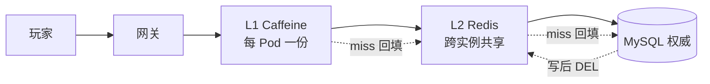
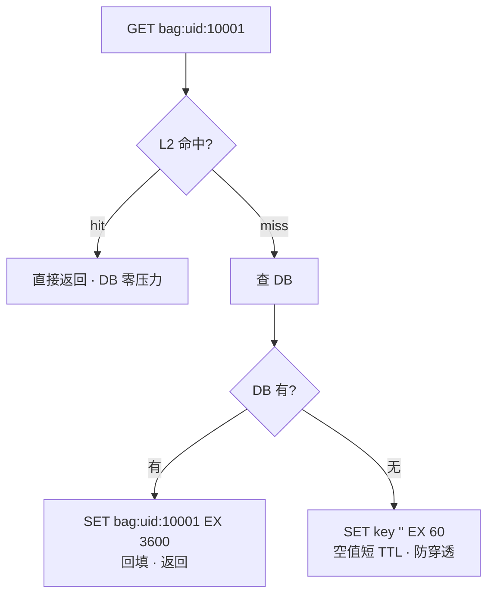
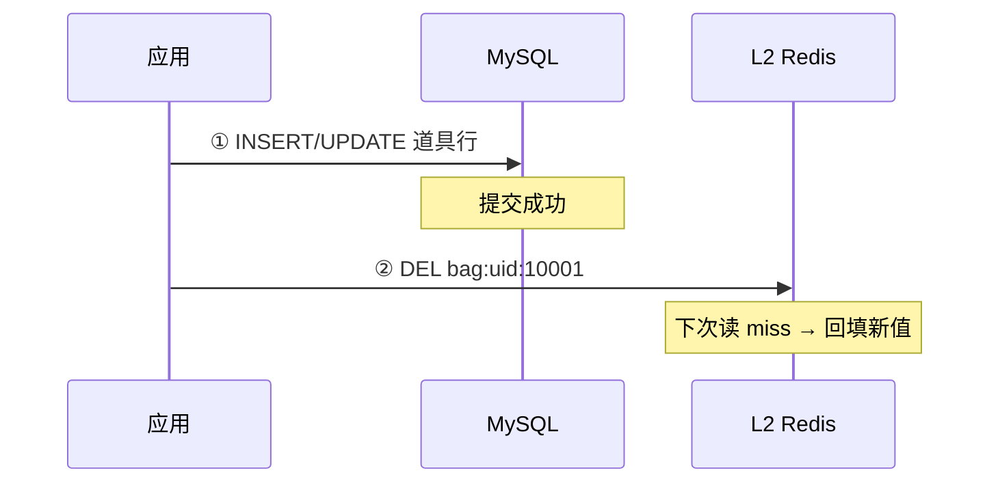
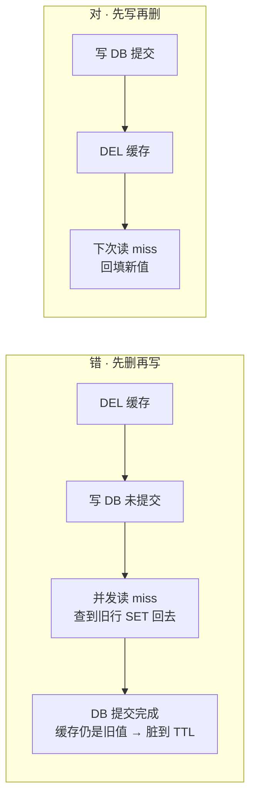
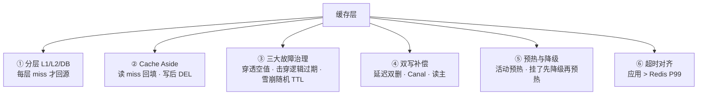
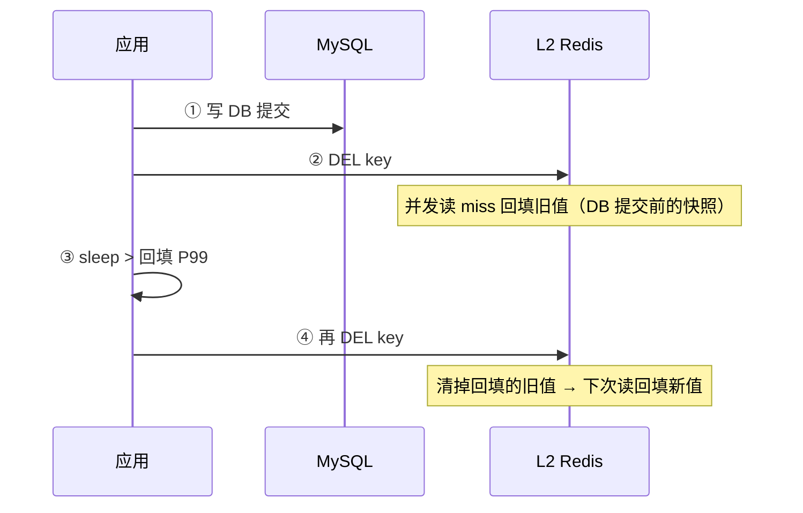
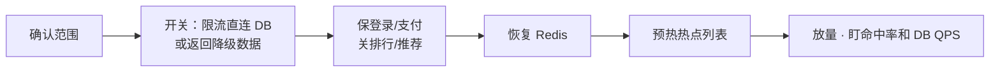
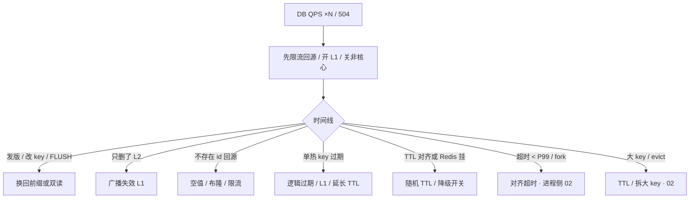

# 缓存架构

> 大家好，欢迎来到这次分享。开讲之前，先带大家回到一个很多值班同学都经历过的现场：
> 周五 20:00 限时礼包开卖，Redis `ping` 全绿、CPU 30%，MySQL 连接数却 3 分钟从 200 飙到 2800——2000 个 Pod 同时 miss 同一行，DB 在替缓存扛枪。群里已经有人在喊「扩 MySQL」「重启全部逻辑服」。
> 这一章讲完，你会知道当时那个人错在哪：不该先扩 DB、不该先重启逻辑服——该先问「命中率掉了没有、是穿透还是击穿还是雪崩」。
> **本章回答的问题**：一个 key 怎么服务缓存层——读写路径怎么走、三大故障怎么分开治、双写怎么不脏。
> **本章不讲**：Redis 进程 / fork / 持久化 / 内存管理 → [02](../02-持久化与内存管理/)；Cluster / 哨兵 / HA → [03](../03-高可用与集群/)；MySQL 主从延迟 → [02-01](../../01-MySQL/)；网关 504 → [02-09](../../09-API网关与服务治理/)。这些都有专门章节，本章只在用到时点到为止。

**标记**：🎯重点 · 🔥难点 · ⭐常考 · 🔧实操

**怎么听这场分享**：咱们先把第一节的缓存旅程图看熟——L1→L2→DB 的读路径和写后 DEL；第二到第六节顺着读写、三大故障、选型、双写、预热降级往下走；第七节专门讲定责——也就是开头那个现场的正确解法。每一节讲完会提示对应练习题，学完就去练。

---

## 一、一张图：一个 key 的缓存旅程

> 🎯 **一句话**：缓存层挡读放大，挂了不让 DB 死——盯的是命中率和回源 QPS，不是 Redis `up`。

咱们先不急着背「穿透/击穿/雪崩」三个词。学缓存最怕的就是上来背名词，背完线上 Redis 全绿、DB 已经死了。先看图，把「miss 才回源、写后 DEL」装进脑子里：



**读图**：

- 主线是读路径：玩家 → 网关 → L1 → L2 → DB，每一层 miss 才回源到下一层；写路径反过来——先提交 DB 再 DEL 缓存。
- L1 每 Pod 一份，必然短暂不一致；L2 跨实例共享，仍可脏到 DEL/TTL 生效。
- **没有箭头规定 Redis 比 DB 更新**——权威数据只在 MySQL，缓存只是"允许按产品窗口变脏"的加速层。

**命中率（hit rate）** = `hits / (hits + misses)`，衡量缓存挡住了多少读。**回源** = cache miss 后回数据库查的那一次。命中率掉一点，回源乘很多——用数字算，不要凭感觉：

| 接口 QPS | 命中率 | 回源 QPS | 若 DB 上限 3000 |
|----------|--------|----------|-----------------|
| 20000 | 95% | 1000 | 活着 |
| 20000 | 70% | 6000 | **已经死了**（×6） |

连接池同样用乘法：`40 个逻辑服 × pool=50 = 2000`，K8s 滚动新旧各 40 个 Pod 就是 4000。超时 50ms、Redis P99 80ms 时，这些连接会同时把 miss 打到 DB。

> ⚠️ **别混**：全局命中率 99% 会骗人——公告/皮肤预览 QPS 占了 90% 读，把全局抬上去，支付接口可能只有 60%。**必须按接口拆命中率**，不要拿全局 99% 说"缓存没问题"。

托管 Redis（如 ElastiCache）：进程 HA 是厂商的，**回源放大和降级开关仍是你的**——不能跳过本章。


带着这张图，咱们正式出发。先把读写标准路径钉死——路径错了，后面三大故障怎么治都是在补洞。

> 本节对应练习题 **Q1**。
---

## 二、出生：Cache Aside 读写路径

> 🎯 **一句话**：读 miss 回填，写先提交 DB 再 DEL——不在写路径 SET 新对象。

### 读路径：miss 才回填 ⭐



**读图**：读路径只在 miss 时回填——hit 直接返回不碰 DB，DB 也没有就写空值短 TTL 挡扫号。回填只发生在读路径，写路径不 SET。

### 写路径：先提交 DB 再 DEL 🔥

> 💡 **打个比方**：像图书馆借书——还书（写）必须先把书库记录改了（提交 DB），再把书架上的旧复印撕掉（DEL），下次有人来借才会拿新版。直接在书架上贴一张"新版摘要"（写路径 SET）容易贴错页。



**读图**：写路径两步——先提交 DB（权威），再 DEL 缓存（让下次读 miss 回填新值）。DEL 失败要重试或 Canal 补偿，不是放任。

### 为什么 DEL 不 SET ⭐🔥

写路径 SET 新对象有两个坑：

```text
并发写 A、B 两条：
  A 写 DB（新值 v2）  →  A SET 缓存 v2
  B 写 DB（新值 v3）  →  B SET 缓存 v3
  如果 A 的 SET 晚于 B 的 SET（网络抖动）→ 缓存停留在 v2（旧值），DB 已是 v3
  → 脏到 TTL
```

DEL 是幂等的——重复 DEL 无害，谁先谁后不影响结果。SET 不幂等——后到的旧值会盖掉新值。所以 **Cache Aside 的写路径只 DEL，不 SET**。

### 先写再删 vs 先删再写 ⭐🔥



**读图**：先删再写的坑在 A2→A3——DEL 之后 DB 还没提交，并发读 miss 会查到旧行并 SET 回去，DB 提交后缓存还是旧的，脏到 TTL。先写再删的窗口只在"DB 提交到 DEL 之间"——并发读 miss 回填的是新行。

> ⚠️ **别混**：先删再写的"空窗短一点"是错觉——它不是空窗短，是**脏得更久**。生产默认先写再删。

### 三种写模式对照 ⭐

| 模式 | 写路径 | 何时用 |
|------|--------|--------|
| **Cache Aside** | 应用写 DB，删缓存 | **默认** |
| **Write Through** | 同步写缓存和 DB | 少；延迟高 |
| **Write Behind** | 先缓存再异步刷 DB | 可丢数据，钱包/背包/邮件**禁用** |

> ⚠️ **别混**：**Write Behind** 禁用于钱包、背包、邮件——异步刷 DB 丢数据就是事故。只有可丢计数展示（如在线人数）可用，且要对账。

> 📝 **面试**：「默认 Cache Aside：读 miss 回填，写先提交 DB 再 DEL，不在写路径 SET 新对象。并发旧值盖新值是 SET 的致命问题。先删再写空窗更脏。钱包不缓存或读主。」


大家想想：写路径为什么 DEL 不 SET？很多人答「SET 更快」——错了。SET 新对象会把并发旧值盖成「看起来更新」的脏数据。⭐ 这是面试必考。

好，路径清楚了。开篇那个 DB ×14 的现场——多半栽在三大故障之一。先分清再治。

> 本节对应练习题 **Q2、Q3**。
---

## 三、卡壳：穿透、击穿、雪崩

> 🎯 **一句话**：穿透是根本没有的 id，击穿是一个热 key 过期，雪崩是整片过期或 Redis 挂了——三样治理完全不同。

> 💡 **打个比方**：穿透像有人反复问"有没有 999 号柜"（根本没有）；击穿像"1 号柜"传单刚好过期，所有人同时涌向仓库拿同一件货；雪崩像整栋商场传单同一秒过期，或者促销员集体请假。

### 穿透：查根本不存在的 id 🔥

大家想想：穿透和击穿差在哪？很多人答「都是 miss 打到 DB」——只答对了一半。穿透是查**本来没有的**，击穿是**热点 key 刚好过期**。咱们放慢分开治。

攻击脚本 `GET player:uid:999999999`，每秒 5000 次，key 各不相同。每个请求 L2 miss → DB miss → 再来。

```text
redis keyspace_hits: 正常（key 各不相同，全局命中率甚至 97%）
mysql threads_connected: 2800 ↑   slow_query: SELECT player WHERE uid=...
```

**全局命中率在骗人**——按**不存在 id 的回源次数**看，Redis 还活着，DB 在替缓存扛扫号。

**治理（两套）**：

1. **空值缓存（empty value caching）**：DB miss 后 `SET key "" EX 60`——短 TTL，太长会挡住刚注册的新号。空值还能打满 Redis 内存，必须配限流。
2. **布隆过滤器（bloom filter）**：在 Redis 前加一层布隆——说"不存在"一定没有，说"存在"可能误判。活动新 id 还没进过滤器会被当成不存在，活动期要先写 DB 再加过滤器，或关闭布隆只靠空值。

网关限流 + id 合法性校验是第一道，空值第二道，布隆第三道。

### 击穿：一个热 key 过期 🔥

`activity:config` TTL 3600s，20:00 整点到期，2000 个 Pod 同时 miss → 2000 个并发 `SELECT * FROM activity_config WHERE id=1` 打同一行。

```text
redis: up, cpu 30%
mysql: rows_read/s 暴增, 单行 SELECT 占满 slow log
单接口 cache_miss{activity_config}: 2000/s 瞬间尖刺
```

Redis 进程健康，是**一个热 key** 过期引发击穿，不是 Redis 挂了。

**治理（两套）**：

1. **互斥锁（mutex）**：`SET lock:key NX EX 10`——获锁者回源，其他人短睡再 GET。代价：P99 升高。**singleflight** 只挡单 Pod 内并发，2000 个 Pod 还要 L1 或逻辑过期。
2. **逻辑过期（logical expiration）**：key 不物理过期，value 内带 `expire_at` 字段——过期后仍返回旧值并异步刷新。极热 key 用这套，P99 不抖。

### 雪崩：整片过期或 Redis 挂了 🔥

所有活动 key TTL=3600，20:00 整点一起过期；回源限流按 Redis QPS 设了 5 万，DB 上限其实 3000。

```text
20:00:00 cache_miss 全接口同时尖刺
db connections: 3000/3000  pool exhausted
gateway 504 比例 ↑
redis: 仍然 up
```

TTL 对齐 + 回源阈值设错 = 雪崩。更致命的是 Redis 进程挂了/网络分区，全部 miss 同时打 DB。

**治理（两套）**：

1. **TTL `base + rand`**：`3600 + rand(0, 600)`，错开整点。热点配置用逻辑过期。
2. **降级开关 + HA**：应用有降级档位——关 L2 / 关排行 / 只保登录支付；哨兵/Cluster 解决切主。

> ⚠️ **别混**：进程挂比 TTL 对齐更致命。HA 解决切主，解决不了"应用把超时当 miss"。fork 尖刺导致超时、应用把超时当 miss，表现也是雪崩（[02](../02-持久化与内存管理/)）。

### 三大问题对照 ⭐

| | 是什么 | 不是什么 | 治理 |
|--|--------|----------|------|
| 穿透 | 查询根本不存在的 id | 热 key 过期 | 空值短 TTL、布隆、限流、校验 id |
| 击穿 | **一个**热点刚好过期 | 大量 key 一起过期 | 互斥锁、逻辑过期、热点永驻 |
| 雪崩 | 大量 TTL 对齐**或 Redis 整体不可用** | 单 key | 随机 TTL、多级缓存、限流、降级、HA |

> 📝 **面试**：「穿透看不存在 id 回源，击穿是一个热 key 过期，雪崩是整片过期或 Redis 挂了。穿透限流+空值，击穿逻辑过期或互斥锁，雪崩随机 TTL+降级开关。三者治理不能混。」

### 收束：缓存层凭什么挡住读放大 🎯⭐

到这里，缓存层的全部零件都齐了。面试直接问"缓存层凭什么挡住读放大"，要的就是这张清单：



**读图**：

- ① 保证"大部分读止于缓存"，② 保证"写后缓存会被正确失效"，③ 保证"单点故障不放大成 DB ×N"。
- ④⑤ 保证"即使补偿失败或 Redis 挂了，DB 不会死"，⑥ 保证"不会自己制造击穿"。

> ⚠️ **别混**：缓存层挡的是**读放大**，不保证强一致——强一致走 DB 或读主，别指望 Redis 锁当事务。

> 📝 **面试**：背的时候按"**分层 → 读写路径 → 故障治理 → 补偿 → 运维**"分组——少了任何一组，缓存层就有洞。


> ⭐ **口诀**：穿透是「查没有的」，击穿是「热点刚好过期」，雪崩是「一片一起死」——别混。

三大故障分清了。不同业务允许多脏、挂了怎么办不一样——钱包、排行、会话不能一套打天下。

> 本节对应练习题 **Q4、Q11**。
---

## 四、选型：道具、排行、会话怎么缓存

> 🎯 **一句话**：库存扣减不打缓存；排行展示可脏；会话可丢重登——装错层挂的时候影响面完全不同。

> 💡 **打个比方**：道具数量像银行余额——柜台（DB）才是权威，门口电子屏（缓存）可以慢几秒；排行像体育积分榜——晚更新几秒观众能接受，但发奖金仍看官方账本；会话像游乐园手环——丢了重新领一张，不能当唯一身份证。

### 道具 / 背包（Cache Aside）⭐

玩家刚用钻石买了一件皮肤，立刻打开背包还是旧的。查三件事：

- 写路径是不是先 DEL 再写 DB？（先删再写更脏）
- 是不是读从库？（主从延迟读旧 → [02-01](../../01-MySQL/)）
- 是不是只删了 L2、L1 还在吐旧配置？

修法：先提交 DB 再 DEL；刚买读主；广播失效 L1。

### 排行 Top N（Redis ZSet）⭐

展示榜可以脏几秒；**发奖必须以 DB 为准**。Redis 挂了：从 DB 重算或关排行降级，不要硬读 DB 实时算榜。ZSet 实现见 [01](../01-数据结构与使用场景/)。

### 会话（L2 + TTL ≈ 心跳）⭐

可丢，踢回登录。不要当无降级唯一库——摘 Redis 会把登录打成风暴，降级档里留"踢回登录"。

### 活动配置（L1 + 逻辑过期）

关活动后部分 Pod 还在卖 → 只删 L2 不够，必须广播删 L1 或等 L1 TTL（5～30s）。发版改序列化，L1 旧对象反序列化失败 → 被当成 miss 打满 Redis → 换 key 前缀 `v2:` 或广播失效。

### 选型对照 ⭐

| 数据 | 放哪 | 一致性 | 挂了怎么办 |
|------|------|--------|------------|
| 道具数量 / 交易 | DB 权威；L2 缓存展示 | 写后 DEL；刚买读主 | 回源；禁止 Write Behind |
| 背包列表 | L2 Cache Aside | 可脏到补偿完成 | 回源；空值防扫号 |
| 排行 Top N | Redis ZSet | 展示可脏；发奖看 DB | 从 DB 重算；关排行降级 |
| 会话 | L2 + TTL≈心跳 | 可丢，重登 | 踢回登录 |
| 活动配置 | L1 + 逻辑过期 | 可脏数十秒 | 广播失效 L1 |

> ⚠️ **别混**：L1 脏（每 Pod 一份）vs L2 脏（DEL 窗口）；Redis 进程故障（[02](../02-持久化与内存管理/)）vs 缓存用法故障（本章）。

> 📝 **面试**：「钱包不缓存或读主；背包 Cache Aside 写后 DEL；排行展示可脏发奖看 DB；会话可丢。L1 多副本必然短暂不一致，关活动要广播失效。」


选型有了「允许多脏」的尺子。下一问：双写怎么尽量不脏？延迟双删、Canal、强一致——三者各管一段。

> 本节对应练习题 **Q5**。
---

## 五、并发：双写一致性

> 🎯 **一句话**：双写的"一致"是窗口——把窗口说成"最多脏多久"，不要说"最终一致"三个字了事。

### 延迟双删 ⭐🔥

写 DB → DEL → sleep（> 回填 P99）→ 再 DEL。清掉并发读回填的旧值。



**读图**：延迟双删解决"并发读回填旧值"——② DEL 之后到 DB 提交可见之间，并发读可能 miss 查到旧行 SET 回去，④ 再 DEL 一次清掉它。sleep 必须压测得出，不是拍 500ms。**不解决删失败**——删失败必须 Canal 补偿。

### Canal / binlog 补偿 ⭐

业务只写 DB，binlog → MQ → 删 key。适合多服务共享同一批缓存。

- 秒级窗口（binlog 消费延迟）
- Canal 自身要 HA，积压当 P1
- 消费必须幂等（重复 DEL 无害）
- Canal 挂了 = 脏窗口拉长到 TTL 全长

### 强一致：不缓存或读主 ⭐

余额、发货、库存扣减：不缓存，或写后读主。用版本号 / 唯一约束，而不是"再加一把 Redis 锁就当强一致"。

> ⚠️ **别混**：延迟双删解决**并发回填旧值**，Canal 解决**删失败**，强一致靠**不缓存或读主**——三者各管一段，不能互相替代。

> 📝 **面试**：「默认 Cache Aside + 延迟双删挡并发回填；多服务共享用 Canal 补偿；钱包不缓存或读主 + 唯一约束。把窗口说成"最多脏多久"，不说最终一致。」


> ⭐ **口诀**：延迟双删挡并发回填，Canal 挡删失败，强一致靠不缓存或读主——三者不能互相替代。

一致性窗口说清了。Redis 真挂了呢？预热怎么做、降级怎么开——开篇有人喊「重启逻辑服」，正确姿势在这儿。

> 本节对应练习题 **Q6、Q14**。
---

## 六、运维：预热与降级

> 🎯 **一句话**：活动前限速预热热点 id，Redis 挂了先降级再预热再放量——顺序不能反。

### 活动预热 🔧⭐

> 🔍 **现场**：活动前 30 分钟，用**业务热点列表**预热，禁止 `KEYS activity*`（会卡住 Redis，见 [02](../02-持久化与内存管理/)）。

```bash
# 限速预热，每批 100 key，间隔 50ms
while read key; do
  redis-cli GET "$key" >/dev/null || curl -s "http://app/internal/warm?key=$key"
  sleep 0.05
done < /ops/hotkeys_activity_20250828.txt
```

```text
cache_hit{activity}=0.96   backsource_qps=200   db_conn=180/3000
# ← 命中率已升，回源在 DB 上限内。活动开始 1 分钟继续盯——不升就是列表错了或 key 前缀发版改了
```

预热 checklist：热点列表是否打完 · TTL 是否错开 · 回源限流是否已开 · 降级开关是否在值班人手里。

库存预热的是商品详情，不是库存数字当权威——扣库存必须打 DB 当前读或乐观锁（[02-01](../../01-MySQL/)）。

### Redis 挂了 SOP 🔧⭐

没有开关就硬打 DB，会全站 504。



**读图**：六步顺序不能反——先降级保核心，再恢复 Redis，**预热在放量前**（冷启动全 miss，恢复瞬间第二次雪崩），最后放量盯指标。

六步口述：① 确认范围（整集群还是一个分片）② 开关切"限流直连 DB 或返回降级数据" ③ 保登录和支付，非核心直接失败 ④ 恢复 Redis（进程侧 [02](../02-持久化与内存管理/)） ⑤ **预热**热点列表（限速） ⑥ 放量，盯命中率和 DB QPS。

降级档位：① 关 L2，L1 + 限流读 DB ② 非核心接口直接失败（排行、推荐）③ 只保登录和支付。

> ⚠️ **别混**：预热在放量**前**——不是 Redis 恢复就放量。演练时真的把 Redis 摘掉，看 DB 连接和 5xx，不要只写 runbook 从没演练。

### 发版换 key 版本 🔧

改序列化必须双读或换前缀 `v2:`。禁止 `FLUSHALL` 当发布步骤——发版后 5 分钟看按接口命中率曲线，比等告警打到 DB 更早。L1 旧对象反序列化失败会被当成 miss 打满 Redis——配置结构变了必须失效 L1（广播或换版本）。代码回滚必须能认旧 key 或双读，只回代码不换回前缀会继续全 miss。

### 回源限流与超时 🔧⭐

回源限流 = **DB 压测上限**，不是 Redis QPS。缓存超时 < Redis P99 → 自己制造击穿。

```yaml
cache:
  redis_timeout_ms: 120        # > Redis P99 80ms
  l2_ttl_base_s: 3600
  l2_ttl_jitter_s: 600         # base + rand(0,600)，错开整点
  empty_value_ttl_s: 60        # 穿透空值，必须短
  l1_ttl_s: 15                 # 活动配置
  fallback_enabled: true       # Redis 挂了走降级，不是硬打 DB
  backsource_limit_qps: 3000   # = DB 压测上限，不是 Redis QPS
```

> 📝 **面试**：「回源限流用 DB 压测上限，不用 Redis QPS。缓存超时 < Redis P99 = 自己制造击穿。」


预热、降级、限流——运维侧讲完。回到周五 20:00 那个现场：Redis 全绿、DB 爆炸——用决策树拦住「扩 MySQL」。

> 本节对应练习题 **Q7、Q8、Q10、Q13**。
---

## 七、作战：排障定责

> 🎯 **一句话**：Redis 活着 DB ×5 是本章主场景——先限流回源，再查时间线、按接口命中率、超时和 fork。

### 定责决策树



**读图**：第一刀先限流止血，再看时间线分流——发版/活动/flush/切主。分支互斥，先定型再动手。**大 key** 和 evict 归进程侧（[02](../02-持久化与内存管理/)），不在本章治。

### 现象 · 先做 · 别做 ⭐

| 现象 | 先做 | 别做 |
|------|------|------|
| 全局命中 97%、支付在烧 | 按接口拆 | 只钉全局命中率 |
| 发版后全 miss | key 前缀 / 序列化 | 先 explain 已死的 DB |
| 扫号 DB 爆、命中率不跌 | 空值 + 限流 + 校验 id | 当雪崩去加 Redis |
| 整点一起过期 | 随机 TTL、逻辑过期 | 重启 Redis |
| Redis 挂了 | 降级开关 → 预热再放量 | 硬切全部直连 DB |
| 关活动还有 Pod 在卖 | 广播 L1 | 只 DEL L2 |
| 超时 50ms / P99 80ms | 对齐超时 | 先加 Redis CPU |
| 写后读旧 | 先写再删；延迟双删 / Canal | 写路径 SET 覆盖 |

### 60 秒剧本 🔧

> 🔍 **现场**：接到"DB 爆了"报障，别先 explain DB，60 秒走完这条线再下结论。

```text
① 0–10s  Redis 活着吗？     redis-cli ping + 看 keyspace_hits/misses
② 10–30s 哪个接口 miss？    按接口拆命中率，别钉全局 97%
③ 30–45s 时间线：           刚发版？活动开卖？TTL 整点？fork 尖刺？
④ 45–60s 止血 + 定型：       限流回源 / 开 L1 / 关非核心，再查根因
```


现在再看开篇群里那句「扩 MySQL」「重启全部逻辑服」，你知道该怎么拦住他了。

> 本节对应练习题 **Q9、Q12**。
---

## 八、收口

### 命令速查 🔧

```bash
# Redis 侧（进程问题走 02）
redis-cli info stats          # keyspace_hits / keyspace_misses
redis-cli info memory         # evicted_keys, used_memory（大 key 见 02）
redis-cli --latency-history -i 1   # P99 尖刺
# 应用侧（按接口看，不要只钉全局）
# Prometheus / 日志：登录 / 支付 / 活动各自 hit 比、回源 QPS、timeout 次数
```

```text
keyspace_hits:2847593
keyspace_misses:152847
# ← 命中率 = 2847593 / 3000440 ≈ 94.9%。但这是全局——支付接口可能只有 60%
```

### 面试锚点

遮住右列自问自答，卡壳的行回去重读对应小节。

| 问 | 30 秒答 |
|----|---------|
| 缓存层怎么画？ | L1 → L2 Redis → MySQL 权威；每层 miss 才回源；权威只在 DB。 |
| 命中率 95% 掉到 70%？ | 回源 ×6，DB 上限 3000 时已经死。 |
| Cache Aside 读写顺序？ | 读 miss 回填；写先提交 DB 再 DEL，不 SET。 |
| 为什么 DEL 不 SET？ | SET 不幂等，并发旧值盖新值；DEL 幂等。 |
| 先删再写为什么更脏？ | DEL 后 DB 未提交，并发读 miss 回填旧行，脏到 TTL。 |
| 穿透/击穿/雪崩？ | 穿透=不存在 id，空值+布隆；击穿=热 key 过期，逻辑过期+互斥锁；雪崩=整片过期或 Redis 挂，随机 TTL+降级。 |
| 延迟双删解决什么？ | 并发回填旧值；不解决删失败。 |
| Canal 解决什么？ | 删失败补偿；多服务共享删缓存。 |
| 强一致怎么做？ | 不缓存或写后读主 + 唯一约束，不靠 Redis 锁。 |
| Write Behind 能用在哪？ | 可丢计数展示（在线人数），钱包/背包/邮件禁用。 |
| 全局命中率 99% 够吗？ | 不够，公告会抬高全局，必须按接口拆。 |
| 回源限流按什么设？ | DB 压测上限，不是 Redis QPS。 |
| 超时 50ms / P99 80ms？ | 自己制造击穿，超时要 > Redis P99。 |
| Redis 挂了 SOP？ | 降级保核心 → 恢复 → 预热 → 放量。 |
| 道具/排行/会话怎么缓存？ | 道具 DB 权威写后 DEL；排行展示可脏发奖看 DB；会话可丢重登。 |
| 预热为什么不能 KEYS？ | KEYS 卡住 Redis（02），用热点列表限速预热。 |
| 发版改序列化？ | 换 key 前缀 v2:，禁止 FLUSHALL。 |
| 上了 Cluster 就没三大问题？ | HA ≠ 怎么用缓存，fork 超时照样雪崩。 |
| 延迟双删 sleep 多少？ | > 回填 P99，压测得出，不是拍 500ms。 |
| 空值 TTL 设多长？ | 60s，太长挡新号，太短不防穿透。 |
| 回源限流按什么设？ | DB 压测上限，不是 Redis QPS；缓存超时 > Redis P99。 |

### 易错一句话对照

- Redis `up` 说明缓存没问题 → 盯接口命中率和回源
- 全局命中率 99% 支付就不会慢 → 公告会抬高全局
- 写路径 SET 新对象比 DEL 更一致 → 并发旧值盖新值
- 先删缓存再写 DB 空窗更短更好 → 并发读回填旧行，脏更久
- 延迟双删能替代删失败补偿 → 不解决删失败
- Redis 锁 = 和 DB 强一致 → 不缓存或读主 + 唯一约束
- Write Behind 背包也能用 → 能丢；钱包/背包/邮件禁用
- 穿透 = 热 key 过期 → 穿透是根本没有的 id
- 击穿 = Redis 挂了 → 击穿是一个热 key；挂了是雪崩
- 互斥锁重建没有副作用 → P99 升高；极热用逻辑过期
- 回源限流按 Redis QPS → 按 DB 压测上限
- 预热用 KEYS 扫库 → 热点列表 + 限速
- Redis 恢复后立刻放量 → 先预热否则二次雪崩
- 只删 L2，L1 会一起新 → 要广播或等 L1 TTL
- 空值 TTL 越长越防扫号 → 挡新号；空值还能打满 Redis
- 超时 50ms 能让接口更快 → P99 80ms 时自己制造击穿
- 上了 Cluster 就没有三大问题 → HA ≠ 怎么用缓存
- 延迟双删 sleep 随便设 → 必须 > 回填 P99，压测得出
- 空值 TTL 设 1 小时更防穿透 → 挡新注册；空值还能打满 Redis
- 回源限流按 Redis QPS → 按 DB 压测上限
- 互斥锁没有副作用 → P99 升高，极热 key 用逻辑过期
- 布隆过滤器活动期一直开着 → 新 id 没进过滤器被当不存在，活动期先写 DB 再加或关布隆

### 数字墙

> 命中 95%→70% 回源 **×6** · L1 TTL **5～30s** · 空值 TTL **60s**（必须短）· 回源告警 **0.7× DB 上限** · 发版后看曲线 **5 分钟** · 活动开始盯 **1 分钟** · 预热限速 **50ms/批** · 延迟双删 sleep **> 回填 P99** · 降级档位 **3 档** · Redis 挂了 SOP **6 步** · Write Behind **禁用**（钱包/背包/邮件）

### 现场命令 🔧

> 🔍 **现场**：接报「DB 爆了」，60 秒先确认 Redis 活着、再按接口拆命中率——

```bash
# 0-10s: Redis 活着吗？
redis-cli ping                           # ← PONG = 活，不是 Redis 挂了
redis-cli info stats | grep keyspace     # keyspace_hits / keyspace_misses
# keyspace_hits:2847593  keyspace_misses:152847
# ← 全局 ≈ 95%，但这是全局——支付接口可能只有 60%

# 10-30s: 哪个接口 miss？按接口拆命中率
# Prometheus / 日志：登录 / 支付 / 活动各自 hit 比、回源 QPS、timeout
# ← 不要只钉全局 97%，公告/皮肤预览抬高全局

# 30-45s: 时间线——刚发版？活动开卖？TTL 整点？fork 尖刺？
# 刚发版 → key 前缀 / 序列化变了 → 全 miss → 换 v2: 前缀
# TTL 对齐 → 整点一起过期 → 随机 TTL + 逻辑过期
# fork 尖刺 → Redis bgsave / BGREWRITEAOF → 进程侧 02

# 45-60s: 止血 + 定型
# 限流回源 / 开 L1 / 关非核心 → 再查根因
# ← 不先 explain DB，不先重启 Redis，不先加 Redis CPU
```

```bash
# 确认缓存超时 < P99 导致自造击穿
redis-cli --latency-history -i 1          # ← P99 尖刺
# 应用超时 50ms / Redis P99 80ms → 自己制造击穿
```

---

## 合上书

学到这里，先别急着翻下一章。合上书，试试下面这几件事能不能做到——能做到，这章才算真的听懂了。卡住的那一条，就回到对应小节再听一遍：

- [ ] **默画一节的图**：L1 → L2 Redis → MySQL 的读路径和写路径，标清"miss 才回源""写后 DEL"。（对应练习题 Q1）
- [ ] **口述 Cache Aside**：读写标准流程、为什么 DEL 不 SET、先写再删 vs 先删再写谁更脏。（Q2、Q3）
- [ ] **默画三大故障**：穿透/击穿/雪崩各是什么、各两套治理，能画出回源路径。（Q4、Q11）
- [ ] **口述选型**：道具/排行/会话/活动配置各允许多脏、挂了各怎么办。（Q5）
- [ ] **口述双写一致性**：延迟双删解决什么、Canal 解决什么、强一致怎么做，三者不能互相替代。（Q6、Q14）
- [ ] **口述预热与降级**：预热为什么不能 KEYS、Redis 挂了六步 SOP、为什么恢复后要先预热。（Q7、Q8、Q10、Q13）
- [ ] **定责**：Redis 活着 DB ×5 的排障决策树、60 秒剧本各敲什么——现在再看开篇那句「扩 MySQL」，你知道该怎么拦住他了。（Q9、Q12）
- [ ] **口述数字**：命中 95%→70% 回源乘多少、回源限流按什么设、超时 < P99 算哪种事故。（Q9）
- [ ] **口述**：延迟双删 sleep 为什么不能拍 500ms？布隆过滤器活动期为什么不能一直开？（Q6、Q4）
- [ ] **口述**：60 秒剧本接到「DB 爆了」各敲什么？为什么先确认 Redis 活着而不是先 explain DB？（Q12）
- [ ] **口述**：互斥锁重建的代价是什么？极热 key 用什么替代？P99 为什么升高？（Q11）
- [ ] **口述**：Write Behind 能用在哪？钱包/背包/邮件为什么禁用？在线人数可以用吗？（Q3）
- [ ] **默画**：缓存层收束清单（分层 → 读写路径 → 故障治理 → 补偿 → 运维 → 超时对齐），少哪组就有洞。（Q1～Q14）

下一章：[02-09 接入网关与服务治理](../../09-API网关与服务治理/)。Redis 进程：[02](../02-持久化与内存管理/) · 集群：[03](../03-高可用与集群/)。
