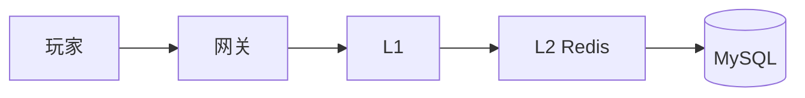
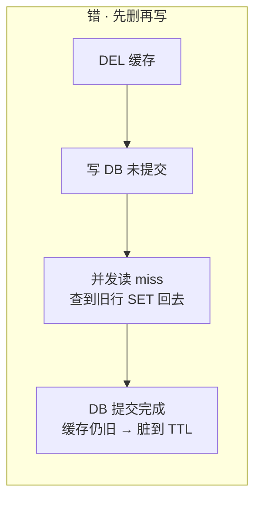
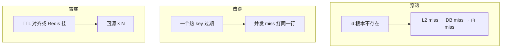
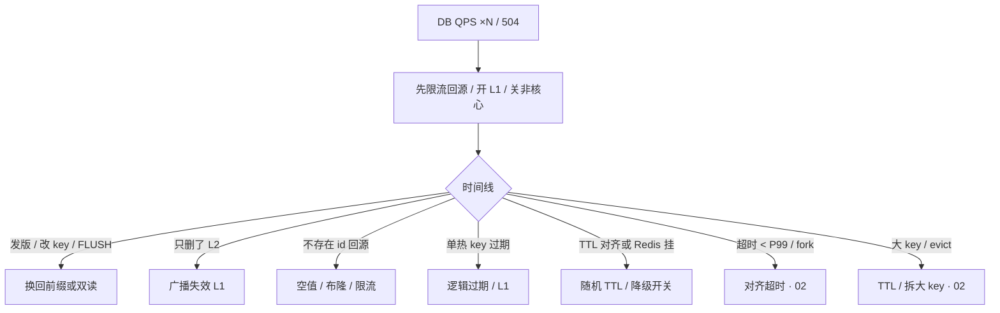

# 02-04｜缓存架构 · 练习题

开始做题前，先给大家一个小建议：合上知识点，对着 **一节的主图**，把主线口述一遍。能顺下来，下面这些题你会发现大半都会了；卡壳的地方，就是你该回去重读的那一节。

做题的方式也建议改一下：每道题**先看标题和场景，自己口述一遍答案，再往下看「完整解答」对答案**。直接看解答，容易产生「我会了」的错觉——能讲出来才是真的会。

| 标记 | 含义 |
|------|------|
| **核心** | 不懂整章就没建立起来 |
| **必会** | 值班和面试都要能讲 |
| **常用** | 线上会反复碰到 |
| **常考** | 白板和追问的高频口径 |

题目的顺序也是有意排的：Q1 先把旅程图钉死；Q2、Q3 Cache Aside；Q4、Q11 三大故障；Q5 选型；Q6、Q14 双写；Q7、Q8、Q10、Q13 预热降级；Q9、Q12 收尾到值班定责。

## 本题目录

- [Q1 缓存层怎么画、回源乘多少](#q1)
- [Q2 Cache Aside 读写标准流程](#q2)
- [Q3 先写再删 vs 先删再写](#q3)
- [Q4 穿透、击穿、雪崩各是什么](#q4)
- [Q5 道具、排行、会话怎么缓存](#q5)
- [Q6 延迟双删、Canal、强一致](#q6)
- [Q7 活动高峰缓存怎么准备](#q7)
- [Q8 Redis 挂了完整止血 SOP](#q8)
- [Q9 命中率 99% 为什么支付还慢](#q9)
- [Q10 超时当 miss 算哪种事故](#q10)
- [Q11 空值缓存与布隆过滤器的坑](#q11)
- [Q12 DB ×5 Redis 还活着怎么查](#q12)
- [Q13 回源限流按什么设、发版换 key](#q13)
- [Q14 延迟双删窗口内读到脏数据](#q14)
- [合上书](#合上书)

---

## Q1

**★★★★★｜缓存层怎么画？这一层失效下一层乘多少？Redis ping 通为什么不能结案？**

**覆盖**：核心 · 必会 · 常考 ｜ **对应**：知识点 [一、一张图：一个 key 的缓存旅程](知识点.md)

### 场景

这道题几乎是缓存架构面试的「开场白」。

白板：「画从玩家到 DB。」有人开始背 LRU，有人只画了一层 Redis。追问「Redis ping 通为什么 DB 还是爆了」就卡住。

先自己试试：不看下面，你能口述出关键结论吗？想完再对答案。

### 完整解答

> 🎯 **一句话**：权威在 MySQL；命中率从 95% 掉到 70% 回源 ×6，Redis ping 通不能结案。

分层画法：L1（Caffeine 等，每 Pod 一份）→ L2 Redis（跨实例共享）→ MySQL（权威）。每一层 miss 才回源到下一层。



命中率掉了回源乘很多，用数字算：接口 QPS 20000、命中 95% → 回源 1000；命中 70% → 回源 6000（×6）。DB 上限 3000 时已经死。连接池同样用乘法：`40 个逻辑服 × pool=50 = 2000`，滚动新旧各 40 个 Pod 就是 4000。

> ⚠️ **别混**：全局命中率 99% 会骗人——公告/皮肤预览 QPS 占了 90% 读把全局抬上去，支付接口可能只有 60%。必须**按接口拆命中率**。

托管 Redis 能跳过本章吗？——不能。进程 HA 是厂商的，**回源放大和降级开关仍是你的**。

### 再追问

**L1 和 L2 各脏多久？**——L1 每 Pod 一份，必然短暂不一致（5～30s TTL）；L2 跨实例共享，脏到 DEL/TTL 生效。只删 L2 不会碰 L1，关活动要广播失效 L1。

---

## Q2

**★★★★★｜Cache Aside 读写标准流程？为什么写是删缓存不是更新？**

**覆盖**：核心 · 必会 · 常考 ｜ **对应**：知识点 [二、出生：Cache Aside 读写路径](知识点.md)

### 场景

图有了，落到读写路径：为什么写后 DEL 不 SET？

商城改完价格，有人在写路径里 `SET` 新对象进 Redis。并发两条更新，线上价格来回跳。有人主张先删缓存再写 DB「空窗短一点」。

先自己试试：不看下面，你能口述出关键结论吗？想完再对答案。

### 完整解答

> 🎯 **一句话**：Cache Aside：读 miss 回填，写先提交 DB 再 DEL；更新缓存易旧盖新，先删再写空窗更脏。

**读路径**：`GET` → miss 则查 DB 再 `SET ... EX 3600` → 返回。DB 也没有 → `SET key "" EX 60`（空值短 TTL）。回填只发生在读路径。

**写路径**：先提交 DB，再 `DEL`。DEL 失败要重试或 Canal 补偿。

**为什么 DEL 不 SET**：DEL 是幂等的，重复 DEL 无害；SET 不幂等，并发写时后到的旧值会盖掉新值：

```text
并发写 A、B：
  A 写 DB v2 → A SET v2
  B 写 DB v3 → B SET v3
  A 的 SET 晚于 B（网络抖动）→ 缓存停留 v2（旧），DB 已是 v3 → 脏到 TTL
```

> 📝 **面试**：「默认 Cache Aside：读 miss 回填，写先提交 DB 再 DEL，不在写路径 SET 新对象。并发旧值盖新值是 SET 的致命问题。钱包不缓存或读主。」

### 再追问

**Write Through 和 Write Behind 呢？**——Write Through 同步写缓存和 DB，延迟高，少用。Write Behind 先缓存再异步刷 DB，**能丢数据**，钱包/背包/邮件**禁用**。只有可丢计数展示（如在线人数）可用，且要对账。

---

## Q3

**★★★★☆｜先删缓存再写 DB 空窗更短所以更好？延迟双删呢？**

**覆盖**：必会 · 常用 · 常考 ｜ **对应**：知识点 [二、出生：Cache Aside 读写路径](知识点.md)

### 场景

这是 Q2 的变体：先删再写 vs 先写再删，谁更脏？

有人主张「先 DEL 再写 DB，空窗更短」。线上写后读偶发旧值，有人 sleep 500ms 再删一次，没压测过。

先自己试试：不看下面，你能口述出关键结论吗？想完再对答案。

### 完整解答

> 🎯 **一句话**：先删再写不是空窗短，是脏得更久——DEL 后 DB 未提交，并发读 miss 回填旧行。



**读图**：先删再写的坑在 A2→A3——DEL 之后 DB 还没提交，并发读 miss 查到旧行并 SET 回去，DB 提交后缓存还是旧的，脏到 TTL。生产默认**先写再删**。

**延迟双删**解决的是"并发读回填旧值"：写 DB → DEL → sleep（> 回填 P99）→ 再 DEL。sleep 必须压测得出，不是拍 500ms。**不解决删失败**——删失败必须 Canal 补偿。

> ⚠️ **别混**：先删再写的"空窗短一点"是错觉。延迟双删解决**并发回填旧值**，不解决**删失败**，两者各管一段。

### 再追问

**延迟双删的 sleep 多长？**——必须大于"miss → 查库 → SET"的 P99，压测得出。写路径被拉长是代价。sleep 拍 500ms 不算。

**把窗口说成什么？**——"最多脏多久"，不要说"最终一致"三个字了事。

---

## Q4

**★★★★★｜穿透、击穿、雪崩各是什么？各给两套治理。**

**覆盖**：核心 · 必会 · 常考 ｜ **对应**：知识点 [三、卡壳：穿透、击穿、雪崩](知识点.md)

### 场景

开篇那个 DB 爆炸现场——先分清穿透/击穿/雪崩。

开场就问「缓存三大问题」。有人把 Redis 挂了说成击穿，把扫号说成雪崩。要求三个都答到，并画出回源路径。

先自己试试：不看下面，你能口述出关键结论吗？想完再对答案。

### 完整解答

> 🎯 **一句话**：穿透是 key 不存在、击穿是热 key 过期、雪崩是 TTL 对齐或 Redis 挂——三者治理手段不同。

必须分清"几个 key、缓存里有没有过、DB 有没有"：



| | 治理（至少两套） |
|--|------------------|
| 穿透 | 空值短 TTL；布隆过滤器；网关限流；校验 id 空间 |
| 击穿 | 互斥锁重建（`SET lock:key NX EX 10`）；逻辑过期（返回旧值异步刷）；热点永驻 |
| 雪崩 | TTL + random；HA；限流降级；预热；非核心熔断 |

观测要点：回源 QPS、DB QPS、是否单 key、Redis `up`。止血：限流回源、延长热点 TTL、打开 L1、非核心降级。互斥锁副作用：P99 升高，极热用逻辑过期。singleflight 只挡单 Pod 内，挡不住 2000 个 Pod。

> 📝 **面试**：「穿透看不存在 id 回源，击穿是一个热 key 过期，雪崩是整片过期或 Redis 挂了。穿透限流+空值，击穿逻辑过期或互斥锁，雪崩随机 TTL+降级开关。三者治理不能混。」

### 再追问

**上了 Cluster 就没有三大问题？**——否。HA ≠ 怎么用缓存。哨兵解决切主，解决不了"应用把超时当 miss"。fork 尖刺导致超时、应用把超时当 miss，表现也是雪崩（[02](../02-持久化与内存管理/)）。

---

## Q5

**★★★★☆｜道具、排行榜、会话分别怎么缓存？Write Behind 能用在背包吗？**

**覆盖**：必会 · 常用 · 常考 ｜ **对应**：知识点 [四、选型：道具、排行、会话怎么缓存](知识点.md)

### 场景

三大故障会治了，不同业务允许多脏不一样。

有人要把扣钻改成先写 Redis 再异步刷 DB。排行发奖以 ZSet 为准。会话只放 Redis 且没有降级。背包写完立刻走从库读（[02-01](../../01-MySQL/)）又走 L2。

先自己试试：不看下面，你能口述出关键结论吗？想完再对答案。

### 完整解答

> 🎯 **一句话**：道具/扣减 DB 权威写后 DEL；排行 ZSet 展示发奖在 MySQL；会话 L2+TTL 要有降级；Write Behind 禁用于钱包背包。

| 数据 | 做法 |
|------|------|
| 道具数量 / 扣减 | DB 权威；L2 只缓存展示；写后 DEL；刚买读主 |
| 排行 | Redis ZSet 展示（[01](../01-数据结构与使用场景/)）；发奖流水在 MySQL；挂了关排行或 DB 重算 |
| 会话 | L2 + TTL≈心跳；挂了踢回登录，不要当无降级唯一库 |
| 活动配置 | L1 + 逻辑过期；关活动广播失效 L1，不只删 L2 |
| 库存写 | 不靠缓存挡 `UPDATE stock`，扣库存打 DB 当前读或乐观锁 |

> ⚠️ **别混**：**Write Behind** 禁用于钱包、背包、邮件——异步刷 DB 丢数据就是事故。只有可丢计数展示（如在线人数）可用，且要对账。拿在线人数做发奖门槛，丢了就是事故。

### 再追问

**支付该不该碰 Redis？**——余额、发货状态：不缓存或写后读主。订单详情展示可以短 TTL。不要一刀切"支付不能碰 Redis"。

**关活动后部分 Pod 还在卖？**——只删了 L2 不够，L1 每 Pod 一份还在吐旧配置。必须广播失效 L1 或等 L1 TTL（5～30s）。发版改序列化也要换 key 前缀 `v2:` 或广播失效。

---

## Q6

**★★★★☆｜延迟双删和 Canal 各解决什么？强一致怎么办？**

**覆盖**：必会 · 常用 · 常考 ｜ **对应**：知识点 [五、并发：双写一致性](知识点.md)

### 场景

选型有了尺子，双写怎么尽量不脏？

写后立刻读偶发旧值。有人 sleep 500ms 再删一次。另一边多个服务共享玩家缓存，想接 Canal。支付同学问"锁一下是不是就强一致了"。

先自己试试：不看下面，你能口述出关键结论吗？想完再对答案。

### 完整解答

> 🎯 **一句话**：延迟双删清并发回填旧值，Canal 适合多服务共享删缓存；强一致不缓存或写后读主。

**延迟双删**：写 DB → DEL → sleep（> 回填 P99）→ 再 DEL。清掉并发读回填的旧值。sleep 必须压测得出，不是拍 500ms。**不解决删失败**。

**Canal**：业务只写 DB，binlog → MQ → DEL。适合多服务共享缓存。秒级窗口；Canal 要 HA；消费幂等（重复 DEL 无害）。Canal 挂了脏窗口拉长到 TTL 全长，积压当 P1。

**强一致**：不缓存或写后读主 + 唯一约束，不要指望 Redis 锁当事务。

> ⚠️ **别混**：延迟双删解决**并发回填旧值**，Canal 解决**删失败**，强一致靠**不缓存或读主**——三者各管一段，不能互相替代。

### 再追问

**sleep 500ms 行不行？**——必须大于回填 P99（miss → 查库 → SET 的全程 P99），压测得出。删失败仍要 Canal 补偿。

**Canal 绿着 Redis 也绿着就可以不管积压？**——否。补偿停了窗口变 TTL 全长。Canal / MQ 积压当 P1。

---

## Q7

**★★★★★｜活动高峰缓存怎么准备？预热为什么不能扫库？回源限流按什么设？**

**覆盖**：必会 · 常用 · 常考 ｜ **对应**：知识点 [六、运维：预热与降级](知识点.md)

### 场景

一致性窗口说清了，Redis 真挂了怎么降级？

周五 20:00 限时礼包。有人计划 19:50 `KEYS activity*` 预热。TTL 全是 3600，整点过期。回源限流按 Redis 能扛的 QPS 设的。降级开关还在需求文档里。

先自己试试：不看下面，你能口述出关键结论吗？想完再对答案。

### 完整解答

> 🎯 **一句话**：活动前限速预热热点 id、TTL 加随机、L1 挡读、回源限流按 DB 上限、降级开关演练过。

发布前五件事：① 用热点商品 id 列表批量 GET，miss 再回源 SET（**限速**，每批间隔 50ms） ② TTL = `base + rand`，热点配置逻辑过期 ③ 热点进 L1 ④ 回源限流 = **DB 压测上限** ⑤ 降级开关在值班人手里，演练过摘 Redis。

```bash
# 限速预热，每批 100 key，间隔 50ms
while read key; do
  redis-cli GET "$key" >/dev/null || curl -s "http://app/internal/warm?key=$key"
  sleep 0.05
done < /ops/hotkeys_activity_20250828.txt
```

```text
cache_hit{activity}=0.96   backsource_qps=200   db_conn=180/3000
# ← 命中率已升，回源在 DB 上限内。活动开始 1 分钟继续盯
```

> ⚠️ **别混**：禁止预热时无限速打 DB——不限速的预热和没预热一样。`KEYS activity*` 会卡住 Redis（[02](../02-持久化与内存管理/)）。回源限流按 **DB 压测上限**设，不是 Redis QPS——Redis 能扛 5 万，DB 上限 3000，按 5 万设就是让 DB 先死。

### 再追问

**库存预热的是什么？**——商品详情，不是库存数字当权威。扣库存必须打 DB 当前读或乐观锁（[02-01](../../01-MySQL/)）。

**本地缓存多副本不一致？**——L1 TTL 短或发失效消息。不要假设立刻一致。要即时，发失效广播，不要幻想 L1 强一致。

---

## Q8

**★★★★☆｜Redis 挂了完整止血 SOP？为什么恢复后要先预热？**

**覆盖**：必会 · 常用 ｜ **对应**：知识点 [六、运维：预热与降级](知识点.md)

### 场景

就是 Q7 的预热特写：为什么不能 KEYS。

Cluster 多数派丢了。DB 连接已经在涨。群里有人要立刻把所有流量切直连 DB「先保证功能」。

先自己试试：不看下面，你能口述出关键结论吗？想完再对答案。

### 完整解答

> 🎯 **一句话**：Redis 挂了先限流/降级保登录支付，恢复后限速预热再放量，硬切全直连 DB 会第二次雪崩。

六步顺序不能反：① 确认范围（整集群还是一个分片）② 开关切"限流直连 DB 或返回降级数据" ③ 保登录和支付，非核心直接失败 ④ 恢复 Redis ⑤ **预热**热点列表（限速） ⑥ 放量，盯命中率和 DB QPS。

降级档位：① 关 L2，L1 + 限流读 DB ② 非核心接口直接失败（排行、推荐）③ 只保登录和支付。

> ⚠️ **别混**：预热在放量**前**——冷启动全 miss，恢复瞬间第二次雪崩。演练时真的把 Redis 摘掉，看 DB 连接和 5xx，不要只写 runbook 从没演练。

### 再追问

**只保登录支付够不够？**——活动期排行可关；支付不能 Write Behind 顶。降级档位预先写进值班手册。

**硬切全部直连 DB 会怎样？**——没有限流的全 miss 直接打 DB，DB 连接池秒爆，全站 504。必须先限流再切。

---

## Q9

**★★★★☆｜命中率 99% 为什么支付接口还慢？**

**覆盖**：必会 · 常用 ｜ **对应**：知识点 [七、作战：排障定责](知识点.md)

### 场景

这张决策树把前面题串起来了：Redis 活着 DB 却炸了。

大盘缓存命中率 99.2%，支付 P99 800ms。公告和皮肤预览 QPS 占了 90% 读。支付短 TTL，有的路径根本没走缓存。

先自己试试：不看下面，你能口述出关键结论吗？想完再对答案。

### 完整解答

> 🎯 **一句话**：全局命中率被公告抬高；支付慢要按接口拆，余额/发货不缓存或读主。

全局命中率被读多的公告接口抬高。必须按接口 / 业务线拆。支付可能根本不该走缓存，或短 TTL 命中率低是正常的，慢在 DB / 下游。

告警不要只钉全局命中率。登录、支付、活动回源 QPS 分开。钱包走缓存还用 Write Behind，是另一条红线。发版后 5 分钟看按接口命中率曲线，比等告警打到 DB 更早。

> 📝 **面试**：「全局命中率 99% 不够——公告会抬高全局。必须按接口拆，支付可能根本不该走缓存。」

### 再追问

**支付该不该缓存？**——余额、发货状态不缓存或写后读主。订单详情展示可以短 TTL。不要一刀切"支付不能碰 Redis"。

---

## Q10

**★★★☆☆｜超时 50ms、Redis P99 80ms，这算哪一种事故？**

**覆盖**：常用 · 常考 ｜ **对应**：知识点 [六、运维：预热与降级](知识点.md)

### 场景

Q7 的限流参数版：回源限流按什么设。

网关把下游超时设成 50ms。Redis 正常 P99 是 80ms，fork 时到 200ms。DB QPS 跟 Redis 延迟一起抖。

先自己试试：不看下面，你能口述出关键结论吗？想完再对答案。

### 完整解答

> 🎯 **一句话**：超时 < Redis P99 会把慢当 miss 打 DB，fork 尖刺时变成真雪崩。

自己制造击穿 / 雪崩。超时当 miss 再打 DB，等于把 Redis 的每一次慢，放大成一次回源。fork 尖刺时变成真雪崩。

先对齐超时：应用超时 > Redis 正常 P99 并留余量，且 < 网关超时。再谈容量。连接池耗尽同样表现为 Redis 指标还好、应用大量 timeout。超时过长会让慢请求占满连接池。

> ⚠️ **别混**：调大超时是前提，治本仍在 fork、大 key、热 key（[02](../02-持久化与内存管理/)）。超时过长故障放大。

### 再追问

**连接池耗尽和超时什么关系？**——超时过长 → 慢请求占着连接不还 → 池耗尽 → 新请求拿不到连接 → 表现为 Redis 指标还好、应用大量 timeout。和网关 504 同一逻辑（[02-09](../../09-API网关与服务治理/)）。

---

## Q11

**★★★☆☆｜空值缓存的坑？布隆在活动期能不能开？Write Behind 呢？**

**覆盖**：常用 · 常考 ｜ **对应**：知识点 [三、卡壳：穿透、击穿、雪崩](知识点.md)

### 场景

就是 Q4 的击穿特写：互斥锁重建 vs 逻辑过期。

防扫号上了空值 TTL=10 分钟。新注册玩家立刻登录，提示角色不存在。活动新道具 id 还没进布隆，商城全 404。另有人要把点赞和背包都改 Write Behind。

先自己试试：不看下面，你能口述出关键结论吗？想完再对答案。

### 完整解答

> 🎯 **一句话**：空值 TTL 太长挡新合法数据；布隆说不存在一定没有；Write Behind 禁用于钱包背包。

空值 TTL 太长会挡住刚插入的合法数据；太短防不住扫号。扫号还能用空值打满 Redis，必须限流 + 校验 id。网关是第一道，空值第二道，布隆第三道。

**布隆过滤器**：说"不存在"一定没有，说"存在"可能误判。活动新 id 还没进过滤器会被当成不存在。先写 DB 再加过滤器，或活动期关闭布隆只靠空值。活动结束 id 空间变化要重建。

**Write Behind**：钱包、背包、邮件禁用。在线人数展示可以，发奖门槛不行。

> ⚠️ **别混**：空值 TTL 不是越长越好——太长挡新号，空值还能打满 Redis 内存。先限流，不是先加 Redis 内存。

### 再追问

**空值 key 把 Redis 打满？**——短 TTL 空值 × 扫号 QPS。先限流，不是先加 Redis 内存。

---

## Q12

**★★★★★｜线上 DB QPS 突然 ×5，Redis 进程还活着，怎么查？**

**覆盖**：核心 · 必会 · 常用 ｜ **对应**：知识点 [七、作战：排障定责](知识点.md)

### 场景

就是开篇那个现场的 60 秒剧本。

活动开始 2 分钟，MySQL 连接打满。Redis `ping` 通，CPU 不高。全局命中率还显示 97%。刚发过一版，改了序列化。

先自己试试：不看下面，你能口述出关键结论吗？想完再对答案。

### 完整解答

> 🎯 **一句话**：Redis 进程 alive 不等于命中率正常；先限流回源，再查发版改 key/序列化、fork 超时、evict。

Redis alive 不等于命中率正常。全局 97% 会掩盖单个接口全 miss。**先限流回源 / 开 L1 / 关非核心**，再对齐时间线：发布 / 活动 / flush / 切主。



发版改 key 前缀 / 序列化 → 新代码 GET 全 miss → 回源 ×5。也可能：fork 超时被当 miss、evict 热数据、扫号穿透。

按接口看 miss。看超时是否 < Redis P99。看 `keyspace_hits/misses`、`latest_fork_usec`、`evicted_keys`、慢 SQL。禁止 `FLUSHALL` 当发布步骤。发版改序列化换 key 版本。

> ⚠️ **别混**：先 explain 已死的 DB 是顺序反了。先限流止血，再查时间线和按接口命中率。

### 再追问

**fork 和 miss 有什么关系？**——父进程 fork（BGSAVE/AOF）时卡住超时，应用当 miss 打 DB，表现为雪崩。Redis 进程还活着。见 [02](../02-持久化与内存管理/)。

**60 秒剧本怎么走？**

```text
① 0–10s  Redis 活着吗？     redis-cli ping + 看 keyspace_hits/misses
② 10–30s 哪个接口 miss？    按接口拆命中率，别钉全局 97%
③ 30–45s 时间线：           刚发版？活动开卖？TTL 整点？fork 尖刺？
④ 45–60s 止血 + 定型：       限流回源 / 开 L1 / 关非核心，再查根因
```

---

## Q13

**★★★☆☆｜回源限流按什么设？发版改序列化怎么不断缓存？**

**覆盖**：必会 · 常用 ｜ **对应**：知识点 [六、运维：预热与降级](知识点.md)

### 场景

Q7、Q8 的超时对齐：超时 < P99 会自造击穿。

回源限流按 Redis 能扛的 QPS（5 万）设的，DB 上限其实 3000。发版改了序列化结构，上线后全 miss。

先自己试试：不看下面，你能口述出关键结论吗？想完再对答案。

### 完整解答

> 🎯 **一句话**：回源限流按 DB 压测上限设；发版改序列化换 key 前缀，禁止 FLUSHALL。

回源限流 = **DB 压测上限**，不是 Redis QPS。Redis 能扛 5 万不代表 DB 能扛——按 5 万设就是让 DB 先死。回源告警阈值 0.7× DB 上限。

发版改序列化必须双读或换前缀 `v2:`。新代码 GET 旧 key 全 miss → 回源 ×5。禁止 `FLUSHALL` 当发布步骤——发版后 5 分钟看按接口命中率曲线。L1 旧对象反序列化失败会被当成 miss 打满 Redis，配置结构变了必须失效 L1（广播或换版本）。代码回滚必须能认旧 key 或双读。

```yaml
cache:
  redis_timeout_ms: 120        # > Redis P99 80ms
  l2_ttl_base_s: 3600
  l2_ttl_jitter_s: 600         # base + rand(0,600)
  backsource_limit_qps: 3000   # = DB 压测上限，不是 Redis QPS
```

> ⚠️ **别混**：回源限流按 Redis QPS 设 → DB 先死。超时 < Redis P99 → 自己制造击穿。

### 再追问

**只回代码不换回前缀会怎样？**——继续全 miss，因为新代码认新前缀、旧 key 还在。L1 也要清一次（重启 Pod 或广播）。

---

## Q14

**★★★★☆｜延迟双删仍读到旧道具数量，怎么查？**

**覆盖**：必会 · 常考 ｜ **对应**：知识点 [五、并发：双写一致性](知识点.md)

### 场景

就是 Q6 的 Canal / 强一致边界特写。

更新 DB 后 `DEL cache`，500ms 后再 `DEL` 一次。仍有玩家看到旧背包数量 3 秒。

先自己试试：不看下面，你能口述出关键结论吗？想完再对答案。

### 完整解答

> 🎯 **一句话**：双删只挡**写后短窗口**——查是否有**读请求在删前回填旧值**、L1 本地缓存、或 Canal 延迟。

```text
写 DB → DEL Redis → [窗口：读 miss 回源旧从库] → 延迟 DEL
                      ↑ 从库延迟 / 事务未提交读 / L1 未失效
```

```text
① 查主从延迟：读到从库回填？
② 查 L1 Caffeine：进程内是否仍持旧对象？
③ 强一致路径：写后读主库 + 删缓存，或 Canal 订阅 binlog 再删
④ 窗口时间：500ms < 从库延迟 → 加大延迟或改 MQ 异步删
```

> ⚠️ **别混**：延迟双删 ≠ 强一致。支付/库存要 **DB 事务内删缓存** 或 **Canal/MQ 顺序删**。**不要**无限加大 sleep。

### 再追问

**Canal 和双删能只选一个吗？**——Canal 适合最终一致；强一致场景仍要业务层 `FOR UPDATE` + 删缓存。

---

## 合上书

做完题再合上书，对着知识点「合上书」逐条过一遍——条数对齐，卡壳的回对应 Q：

- [ ] **默画一节的图**：L1 → L2 → MySQL 读路径和写路径，标清 miss 回源、写后 DEL。（Q1）
- [ ] **口述 Cache Aside**：读写流程、为什么 DEL 不 SET、先写再删 vs 先删再写。（Q2、Q3）
- [ ] **默画三大故障**：穿透/击穿/雪崩各是什么、各两套治理。（Q4、Q11）
- [ ] **口述选型**：道具/排行/会话/活动配置各允许多脏、挂了怎么办。（Q5）
- [ ] **口述双写一致性**：延迟双删、Canal、强一致三者各管一段。（Q6、Q14）
- [ ] **口述预热与降级**：不能 KEYS、Redis 挂了六步 SOP、恢复后先预热。（Q7、Q8、Q10、Q13）
- [ ] **定责**：Redis 活着 DB ×5 的决策树、60 秒剧本。（Q9、Q12）
- [ ] **口述数字**：命中率掉一点回源乘多少、回源限流按 DB 上限、超时 < P99。（Q9）
- [ ] **口述**：延迟双删 sleep、布隆过滤器活动期。（Q6、Q4）
- [ ] **口述**：60 秒剧本先确认 Redis 活着。（Q12）
- [ ] **口述**：互斥锁重建代价、极热 key 替代。（Q11）
- [ ] **口述**：Write Behind 禁用边界。（Q3）
- [ ] **默画**：缓存层收束清单。（Q1～Q14）
