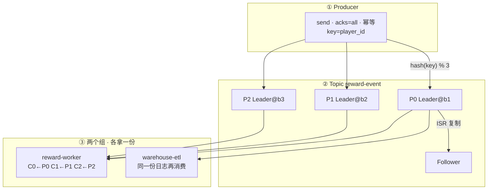
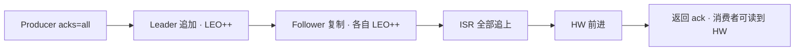
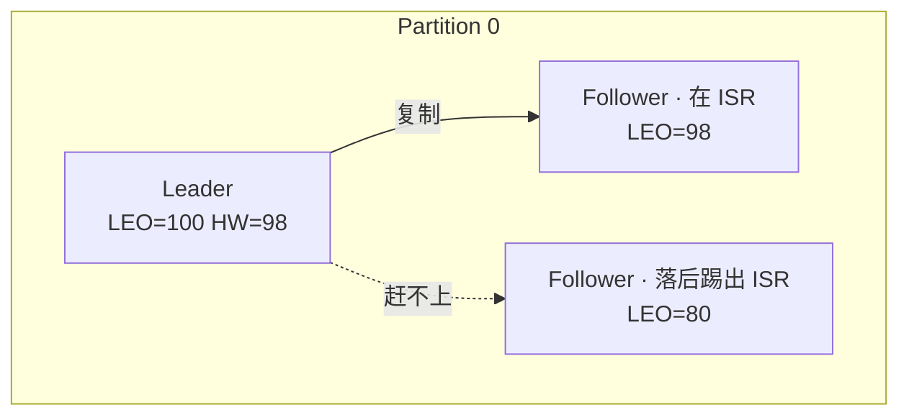
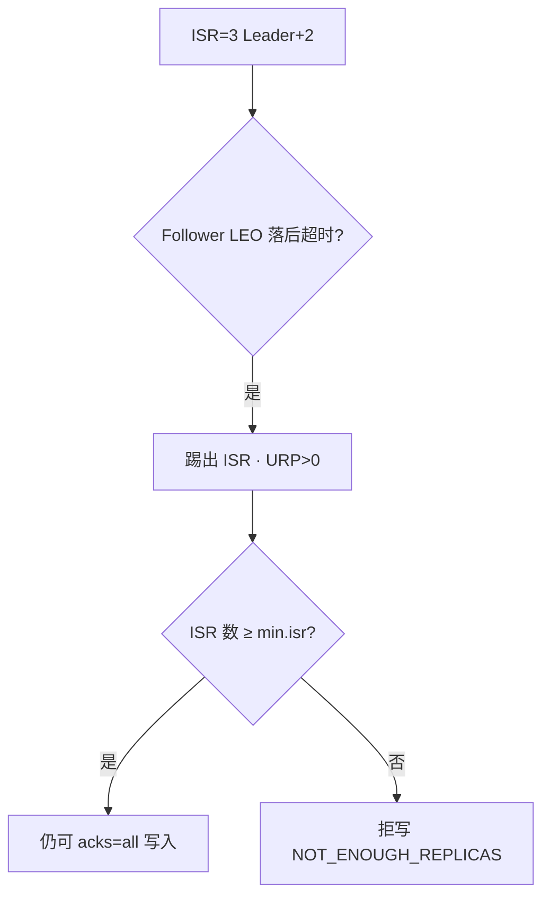
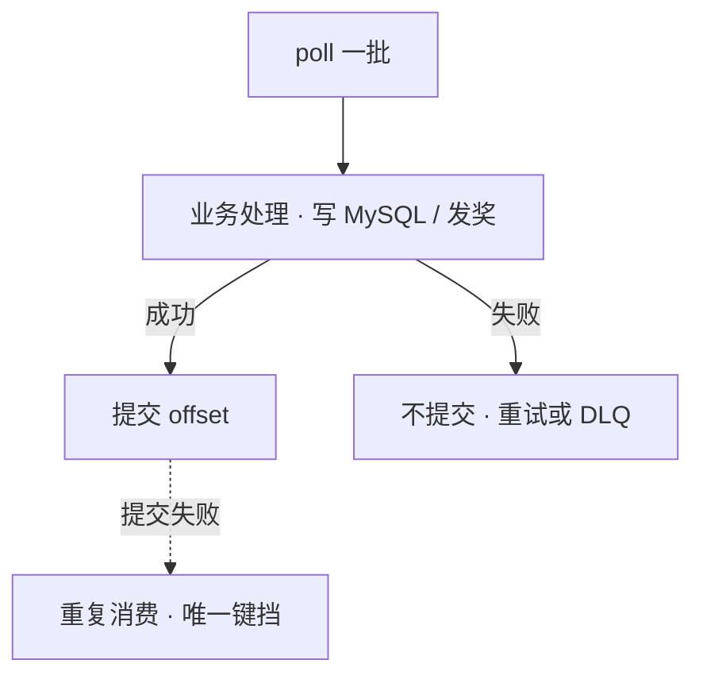
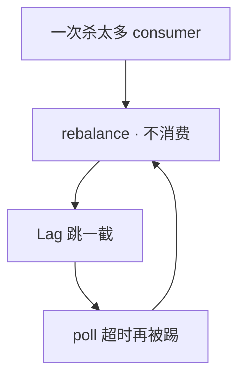
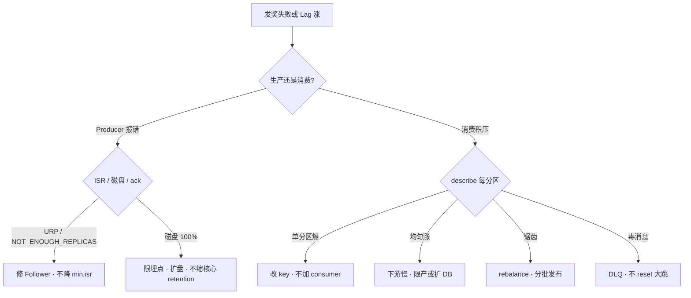

# Kafka

> 活动整点发奖，`reward-worker` Lag 飙到 80 万——有人喊「Kafka 丢了」，有人 `--reset-offsets --to-latest`，有人把 `min.insync.replicas` 改成 1；三刀叠在一起，没 ack 的奖和被跳过的积压一起炸。
> **本章回答**：一条发奖消息从 Producer 进分区、过 ISR、落到消费位点，中间每一站谁在干活；Lag 涨了、写失败了、说「丢了」时怎么一眼定责。
> **不讲**：落库唯一键、大事务拖垮消费 → [01 MySQL](../01-MySQL/)；热 key / 缓存被打爆 → [02 Redis](../02-Redis/)；活动流量与限流 → [07-03](../../07-游戏运维专题/03-活动高峰与压测/)；ZK 运维 / KRaft 迁移方案 → 项目文档（新集群用 KRaft 即可）；日志检索 → [04 ES](../04-Elasticsearch/)。RabbitMQ / RocketMQ 对照放在九节末。

**标记**：🎯重点 · 🔥难点 · ⭐常考 · 🔧实操
---

## 一、一张图：一条消息的一生

> 🎯 **一句话**：消息的一生四段——进仓（写 Leader）、抄账（ISR）、出仓（消费提交位点）、出事时按层定责；坏了先问卡在哪一段。


- 📖 **读图**
  - 🛤️ 主线「进场 → 写入 → 复制 → 消费」；Lag / rebalance 挂在消费之后，不是另一套系统
  - ⚔️ 第一刀永远是 `describe --topic`（ISR）+ `describe --group`（按分区 Lag）——别先 reset、别先降 min.isr
  - ⭐ 口诀：**并行看分区，可靠看 ISR，积压看分区 Lag**（Q1、Q2、Q5、Q14）

### 🏗️ 架构一眼：写打 Leader，组间各拿一份



- 📖 **读图**
  - ✍️ 写打 Leader；Follower 进 ISR 后 HW 才前进——写失败从 Leader/ISR 查，不要先 reset
  - 👥 同一时刻组内一分区一只消费者；加消费者超分区数没用
  - 🚫 没有箭头从业务直接改 Broker 日志——`--reset-offsets` 改的是组位点，必须 dry-run + owner 签字（Q10）

---

## 二、进场：Topic · 分区 · 消费组

> 🎯 **一句话**：Kafka 是按 Topic 分类的追加日志；并行度上限 = 分区数，组间各拿一份。

很多人嘴里的 Kafka「像一个队列，谁抢到谁消费」——**错了**。

### 🗂️ 三个角色 🎯⭐

- **Producer** = 往分区 **Leader** 追加；`acks=all` 等 ISR 确认（三节）
  - 值班碰到：写失败、`NOT_ENOUGH_REPLICAS`
- **Broker / 分区副本** = Leader 接读写，Follower 同步；**ISR（In-Sync Replicas）** = 跟上 Leader 的那批副本
  - 值班碰到：URP>0、磁盘满、滚节点
- **Consumer Group** = 组内一人一块分区，组与组互不影响——同一份日志可被发奖组、数仓组各消费一遍
  - 值班碰到：Lag、rebalance、reset

发奖：`send(topic=reward-event, key=uid:10001, value=发 10 钻)`。有 key → `hash(key) % 分区数` 进固定分区；无 key → 轮询，顺序不保证（五节）。

#### ❓ 为什么不是「一个队列谁抢谁」？

- ❌ **抢队列模型**（像 RabbitMQ 默认语义）：一条消息被一个消费者取走，重放、多组各拿一份都别扭
- ✅ **分区日志**：消息追加在分区上，位点在组里——**组间各拿一份**，组内才「分摊」
- 👉 **并行度上限 = 分区数**：分区 3、组里塞 10 个消费者 → 7 个空转；堆积时先看分区和下游，不要先加机器
- 🧩 别把登录、打点、发奖、CDC 塞进**同一个 Topic 组**——职责搅在一起，Lag 无法分责

> ⚠️ **别混**：
> - Kafka 里：Topic / 分区日志 / offset / ISR / Lag / HW / LEO
> - 不在 Kafka 里：发奖是否入账（MySQL 唯一键）、玩家在线态（Redis / 战斗服）、「业务丢了」的全部原因（九节）
> - Kafka 保的是日志和位点，**不保**跨系统 exactly once。游戏发奖默认 **At least once + 消费幂等**（落库唯一键见 [01](../01-MySQL/)）

- 📐 **磁盘估算**：`写入 MB/s × 保留秒 × 副本数 × 1.3`。满盘 = 全集群拒写。核心 Topic 与埋点 **分集群或至少分盘**。新集群用 **KRaft**；老集群挂 ZK 的迁移是项目，不是本章主菜。

本节对应练习题 Q1。角色钉住了——消息怎么写进去、消费者为什么读不到 Leader 刚写下的那几条？

---

## 三、写入：acks / ISR / HW / LEO 🔥⭐

> 🎯 **一句话**：`acks=all` 等的是 ISR 全部确认，HW 前进后消费者才读得到。

很多人答「acks=all = 等每台 Broker 都写完」——**错了**。

> 💡 **打个比方**：Leader 是总仓记账，Follower 是分仓抄账；**HW** 是「所有合格分仓都抄到的页码」——总仓自己多记两页，对外发货只能发到 HW 那一页。

### 🔑 三个位点 🎯🔥

- **LEO（Log End Offset）** = 该副本本地日志最后一条的**下一条** offset；每个副本一份，Leader 通常最大
- **HW（High Watermark）** = ISR 里 **最小的 LEO**——已提交、可被消费的水位
- **Consumer offset** = 该组在该分区已经处理到哪（存在组协调器 / `__consumer_offsets`）



- 📖 **读图**：ack 返回与「消费者可读」都钉在 **HW**，不是 Leader 的 LEO。Leader LEO=100、某 Follower LEO=98 → HW 最多到 98。

一个分区里三份副本怎么站位：



- 📖 **读图**：HW=98 来自 ISR 里最小 LEO（F1）；F2 已出 ISR，不算进水位。消费者最多读到 HW 之前。

#### ❓ 为什么不是等「全机房」？消费者为何读不到 LEO？

- ❌ **等全机房**：宕机、缩容、跨机房副本都会把写入钉死；Kafka 只认 **ISR**（跟上的副本）
- ✅ **acks=all** = 等当前 ISR 全部确认（常配 `min.insync.replicas=2`）
- 👀 **读不到 LEO 之后**：防 Follower 还没抄到就对外可见——Leader 一挂，已「看见」的消息会消失

| acks | 等什么 | 游戏核心 |
|------|--------|----------|
| all | ISR 全部 | **默认** |
| 1 | 只等 Leader | Leader 挂且未同步就丢 |
| 0 | 不等 | **禁用** |

生产默认骨架：

```properties
replication.factor=3
min.insync.replicas=2
acks=all
enable.idempotence=true
retries=2147483647
```

### 🔍 现场：`NOT_ENOUGH_REPLICAS` 🔧

```bash
export BS=broker1:9092,broker2:9092,broker3:9092
kafka-topics.sh --bootstrap-server $BS --describe --topic reward-event
```

```text
Topic: reward-event  PartitionCount: 3  ReplicationFactor: 3
  Partition: 0  Leader: 1  Replicas: 1,2,3  Isr: 1          # ← ISR 只剩 Leader
  Partition: 1  Leader: 2  Replicas: 2,3,1  Isr: 2,3
  Partition: 2  Leader: 3  Replicas: 3,1,2  Isr: 3,1,2
```

- 读列：`Leader` = 当前读写节点；`Replicas` = 应有副本；`Isr` = 跟上的——**Isr 数 < min.isr → 拒写**
- P0 的 `Isr: 1` + `min.isr=2` → **拒写是保数据**，不是 Kafka 坏了；按分区看，不能只看集群平均
- 下一步：查 broker2/3 上 P0 Follower 的盘 / GC / 网——**不要降 min.isr**

### 🔁 幂等 Producer ⭐

- **幂等** = 同一操作做一次和做十次结果一样
- **幂等 Producer**（`enable.idempotence=true`）防的是网络重试导致 Broker **同一条写两遍**（PID + 序号去重）
- ⚠️ **不防**消费侧重复，也不跨 Topic、跨会话；口头仍是 At least once + 消费幂等；进 MySQL 靠 `order_id + event_type` 唯一键
- 重启后 PID 变了 → Broker 侧重试去重窗口重置，靠消费幂等兜底（Q13）

### 收束：Kafka 写入凭什么「可靠」🎯

```text
① rf=3                 至少三份落盘意图
② min.isr=2 + acks=all  写入必须过 ISR 门槛
③ HW = ISR 最小 LEO     对外可见不超过「都抄到」
④ unclean=false         禁止落后副本抢 Leader
⑤ 幂等 Producer         防重试双写（Broker 侧）
⑥ 消费幂等 / 唯一键     出 Kafka 之后的最后一道
⑦ 拒写不降 min.isr      可用性换数据安全，不是故障
```

- 📖 **读图**：①～④ 是 Broker 侧保「写进去且不假可见」；⑤ 防生产侧重试；⑥ 才跨系统；⑦ 是值班红线。

> ⚠️ **别混**：这七件套 **不保证**「玩家一定收到奖」——业务过滤、错 Topic、先提交后处理、误 reset，都在七件套外面。

> 📝 **面试**：acks=all 等 ISR，不是每台 Broker；HW = ISR 最小 LEO；ISR 不够拒写先修 Follower。记忆法：副本意图 → ISR 门槛 → HW 水位 → unclean 禁令 → 两侧幂等。⭐（Q2、Q8、Q13）

本节对应练习题 Q2、Q8、Q13。写进去了——Follower 掉队时会发生什么？
---

## 四、复制：ISR 收缩与滚动 🔥

> 🎯 **一句话**：Follower 落后超时会被踢出 ISR；ISR < min.isr 时 acks=all 拒写。

开篇那位「把 min.isr 改成 1」的同学——错就错在这儿。

> 💡 **打个比方**：消防队至少 2 人在岗（min.isr=2）；一人掉队还能写；只剩队长——宁可关门也不单人值班，否则队长一倒就全丢。



- 📖 **读图**：踢出 ISR ≠ 立刻丢消息；**ISR < min.isr** 才拒写。URP（UnderReplicatedPartitions）= 按分区 Replicas − Isr，持续 >0 = 丢冗余。

#### ❓ 为什么拒写了不能降 min.isr？

- ❌ **降到 1**：允许单副本写入 → 再挂 Leader = 已 ack 也可能没了
- ✅ **修 Follower**：盘、IO、跨 AZ 延迟、GC——让它回到 ISR
- 🛑 **`unclean.leader.election.enable=false`**：禁止选 ISR 外副本当 Leader，否则 HW 回退、已 ack 可能丢
- ⏱️ `replica.lag.time.max.ms` 常见 **30s**：窗口内追不上就踢；过小 ISR 抖，过大假同步

### 🔧 滚动 Broker 🔧

1. 确认 ISR、URP、磁盘
2. **一次一台**：等该分区 Isr 恢复、URP=0 再下一台
3. 活动中途不要滚；ISR 大面积不够时先限非核心 Topic，保发货

```bash
df -h /var/lib/kafka
# Broker 日志：slow replica、IO wait、GC
```

> 📝 **面试**：ISR 收缩常见盘/IO/跨 AZ；拒写说明 min.isr 在起作用；unclean 必须 false；滚动一次一台等 ISR 齐。⭐（Q3）

本节对应练习题 Q3。复制可靠了——同玩家的状态为什么还可能乱序？

---

## 五、顺序：key 与分区 ⭐

> 🎯 **一句话**：同 key 进同一分区 + 该分区串行消费 = 该 key 有序。

> 💡 **打个比方**：银行按身份证号分窗口——同一人的业务在同一窗口排队，窗口之间不保证谁先办完。

#### ❓ 为什么不是全局有序？扩分区为何破序？

- ❌ **全局有序** = 单分区 → 吞吐崩；游戏通常只保 **同订单 / 同玩家** 有序
- ✅ **有序三件套**：有 key、不乱扩分区、分区内串行处理（或按 key 再排队）
- 💥 **扩分区只增不减**：`hash(key) % n` 变了 → 同一玩家可能换分区 → 跨分区无序
- 🚫 无 key 轮询、消费多线程「谁先完成谁先提交」都会破序

分区数按峰值并行度和单分区吞吐估，宁少勿多。过多：选举、恢复、元数据都贵；过少：加消费者没用。

> 📝 **面试**：顺序靠 key + 分区串行；无 key、扩分区、乱序提交都会破；全局有序要单分区。⭐（Q7）

本节对应练习题 Q7。消息到了消费者——offset 什么时候交？

---

## 六、消费：offset · 幂等 · 毒消息 🔥⭐

> 🎯 **一句话**：处理成功再提交 offset；先提交后处理 = 静默丢。

> 💡 **打个比方**：快递签收单——先开箱再签字，丢了货还能追；先签字后丢件，系统认为你已收货。



- 📖 **读图**：成功路径才前进位点；失败不提交 → At least once 重复；提交成功但业务没落库 = **静默丢**。

#### ❓ 为什么毒消息不能 `--to-latest` 跳过？

- ☠️ **毒消息** = 某条永远处理失败，CURRENT 钉死、后面全堵
- ❌ **reset 往后跳**：跳过的是还没发的奖——工单会翻倍
- ✅ **重试 N 次进 DLQ**，人工补；offset 仍按分区顺序提交
- 🎮 发奖：**先写发奖结果再提交 offset**；禁用自动提交。埋点可开自动提交

### 🔍 现场：按分区看卡点 🔧

```bash
kafka-consumer-groups.sh --bootstrap-server $BS \
  --describe --group reward-worker
```

```text
GROUP           TOPIC           PARTITION  CURRENT-OFFSET  LOG-END-OFFSET  LAG
reward-worker   reward-event    0          120045          120048          3
reward-worker   reward-event    1          98001           98001           0
reward-worker   reward-event    2          450000          520000          70000   # ← 头卡住
```

- Lag = LOG-END − CURRENT；CURRENT 不动、LEO 还在涨 = 卡死在该 offset
- P2 Lag 爆且 CURRENT 不动 → 毒消息嫌疑，不是「Kafka 慢」

> 📝 **面试**：发奖先落库再提交；毒消息进 DLQ，reset 不是止血；多线程可以，offset 仍须按分区顺序提交。⭐（Q4、Q9）

本节对应练习题 Q4。Lag 飙到 80 万——加 20 个 consumer 管用吗？

---

## 七、积压：Lag 按分区看 🔥⭐

> 🎯 **一句话**：Lag = LEO − 已提交位点；先比生产/消费速率，再看是不是单分区热点。

> 💡 **打个比方**：入库 1 万件/分、出库 5 千，Lag 一定涨；若只有一个货架（分区）堆满，加再多搬运工也超不过货架数。

#### ❓ 为什么加 consumer 不一定消化 Lag？

- 🧱 **并行度 ≤ 分区数**：已有 3 消费者对 3 分区，再加空转
- 🔥 **单分区爆**：key 倾斜（活动 id 当 key）→ 改 key，不是加机器
- 🐢 **三分区均匀涨**：下游整体慢 → 限产或扩 MySQL/发奖接口，**别加 consumer 打死 DB**
- 📉 **超过 retention**：合法过期，不是「还能追上」——业务侧像「丢了」

### 🗺️ 五步口算 🔧

```text
1. 哪个 Topic / Group / 哪些分区？
2. 生产速率 vs 消费速率（两次 describe 做差）
3. 消费者在线吗、是不是一直 rebalance
4. 处理耗时：MySQL / Redis / HTTP
5. Broker：磁盘、URP、拉取 P99
```

```text
# 10:00  P2 LAG=70000  CURRENT=450000
# 10:05  P2 LAG=85000  CURRENT=465000
# ← 5 分钟消费 1.5 万、生产约 3.5 万，还在恶化；若已满分区数，加 consumer 无效
```

| 你看到的 | 说明 | 下一步 |
|----------|------|--------|
| P0/P1≈0，P2 爆 | key 倾斜 | 改 key 为 player_id |
| 三分区均匀涨 | 下游慢 | 限产 / 扩下游 |
| Lag 大但 CURRENT 追 LEO | 在消化历史 | 看速率差是否为负 |
| Lag 锯齿 | rebalance | 八节，分批发布 |

> ⭐ **口诀**：平均 Lag 会骗人，按分区看才老实。（Q5）

本节对应练习题 Q5。Lag 锯齿、日志里频繁 join/leave——是不是刚发了一版？

---

## 八、抖动：Rebalance ⭐

> 🎯 **一句话**：组成员变化或 poll 超时触发 rebalance；经典协议下这段 **Stop-the-world 不消费**。

> 💡 **打个比方**：班级重新分桌——分桌那几分钟没人听课，Lag 跳一截；有人处理太慢又被踢 → 再分桌 → 锯齿。



- 📖 **读图**：发布风暴和「处理太慢被踢」共用一个环；打断环靠分批发布 + 缩短单条处理，不是整点扩 consumer。

#### ❓ 为什么活动整点不能扩 consumer？

- 🔄 扩/缩组成员 = 触发 rebalance = **停消费** → Lag 更跳
- ⏱️ 一轮处理超过 `max.poll.interval.ms`（常见 5min）→ 被踢 → 再 rebalance
- ✅ 减小 `max.poll.records`；发布 **分批**；调大 interval 是止痛，治本是缩短处理时间
- 🚀 Producer 侧吞吐：`batch.size` + `linger.ms`，`compression.type=lz4`；必须处理发送失败 callback（Q11）

协作式 rebalance 缩短停消费窗口，**不能替代**处理慢的根本修复。

> 📝 **面试**：Lag 锯齿先怀疑 rebalance；活动整点别扩 consumer；风暴靠分批 + 控 poll records。（Q6、Q11、Q12）

本节对应练习题 Q6、Q11、Q12。客服说「奖没到」——先怪 Kafka 还是先分层？

---

## 九、定责：「丢了」四层 + 作战 🔥⭐🔧

> 🎯 **一句话**：「奖没到」先拿消息 ID 分层查；Kafka 拒写 ≠ 立刻 reset。

> 💡 **打个比方**：快递没收到——查寄件人有没有寄出、中转有没有丢、门卫有没有签收、地址填没填错，不能直接把面单撕了当「没寄」。

### 📦 四层清单 ⭐

现场拿 `event_id` / offset / 时间戳，按层过一遍：

```text
Producer：没等 ack、callback 没告警、异步 send 不看失败
Broker：  acks 非 all、ISR 不够、磁盘满、retention 到期
Consumer：先提交后处理；异常被吞；误 reset --to-latest
业务：    错 Topic、过滤条件、处理成功但没改状态
```

#### ❓ 为什么不能 `--to-latest` 当止血？

- `--to-latest` = **跳过积压**（业务当丢）——没 ack 的 + 被跳过的叠在一起
- ✅ 正确顺序：**保盘和 ISR、限埋点、补偿表重放**
- 🔍 证明没丢：
  - 消息 ID 在 Leader 日志里 → 消费/业务问题
  - 不在且超 retention → 合法过期
  - 从未出现 → 生产没写成功

**活动发奖事故链**：埋点与发货同盘 → 打点打满盘 → 发货 `acks=all` 失败 → 有人 `--to-latest` → 双炸。

活动整点优先保什么：

```text
活动整点
   +-- 生产打满：限日志 Topic，保 reward-event
   +-- 消费变慢：看下游，不要加 consumer 打死 DB
   +-- 滚动发版：分批，避开 rebalance 和整点
   +-- URP>0：先别滚下一台 Broker
```

### 🏗️ 落地怎么选（验收不看 TCP）

- ≥3 Broker，rf=3；独立 SSD；核心与埋点分盘；同城多 AZ + `broker.rack`
- 新集群 **KRaft**；`unclean.leader.election=false`；`advertised.listeners` 对端可达（别配 localhost）
- 验收：`describe` 看 ISR = Replicas；带 key 消息能被组消费；磁盘告警已接——**不要只探 9092**

| 参数 | 生产 | 改错会怎样 |
|------|------|------------|
| `replication.factor` | **3** | 1 = 无冗余 |
| `min.insync.replicas` | **2**（配 acks=all） | 降到 1 = 允许丢 |
| `unclean.leader.election.enable` | **false** | true = 已 ack 也可能丢 |
| `replica.lag.time.max.ms` | 同城保持（~30s） | 过小抖；过大假同步 |
| `retention.ms` | 埋点 24～72h；发货更长 | 短于最慢组 = 合法删 |
| `max.poll.interval.ms` / `records` | 一轮处理落在 interval 内 | 太大 → 循环 rebalance |

### ⚔️ 决策树



- 📖 **读图**：先分写/读；写失败钉 ISR/盘；Lag 必须按分区分叉——平均会骗人。

| 现象 | 先做 | 别做 |
|------|------|------|
| `NOT_ENOUGH_REPLICAS` | 查 ISR、盘、GC；修 Follower | 把 min.isr 改成 1 |
| URP>0 | 一次一台等 ISR | 继续滚下一台 |
| Lag 均匀涨 | 下游 MySQL / 发奖接口 | 加 consumer 打死 DB |
| 单分区 Lag 爆 | 改 key | 只看平均 Lag |
| Lag 锯齿 | 分批发布、减小 poll records | 整点扩 consumer |
| 「丢了」 | 消息 ID 四层查 | 先怪 Kafka、先 reset |
| 满盘 | 限埋点、扩盘 | `--to-latest` 清 Lag |
| 毒消息堵头 | DLQ，保留 offset | 往后跳一大截 |

### 60 秒剧本 🔧

> 🔍 **现场**：接到「发奖失败 / Lag 飙」报障，60 秒走完再下结论。

```text
① 0–10s   describe --topic 看 Isr；df 看盘；有没有 NOT_ENOUGH_REPLICAS
② 10–30s  describe --group 按分区看 LAG / CURRENT 动不动
③ 30–45s  分叉：写失败→修 Follower；单分区爆→key；均匀涨→下游；锯齿→发布/poll
④ 45–60s  定责：保 ISR/盘、限埋点、DLQ/补偿表；禁止 --to-latest、禁止降 min.isr
```

### 🔧 变更红线（位点 · 扩分区 · 换盘 · 升级）

- **备份位点**：变更前 `describe` 组打出每分区 CURRENT-OFFSET 存档；发奖备份 = 位点 + 下游库 + 补偿表；季度演练「停消费 → 指定 offset 重放一小段 → 对账」
- **扩分区**：只增不减；低峰操作；算一次 rebalance（停消费）；活动整点不要扩
- **换盘 / 迁盘**：保证其它副本还在 ISR → 停该 Broker → 拷数据目录 → 改挂载 → 拉起 → 等 ISR；80% 告警，85% 删旧段或扩盘，100% 拒写
- **升级**：一次一台，等 URP=0；不要三台同时换包；记下位点与 Topic 配置再动
- **reset**：必须 `--dry-run` + owner 签字；组名写错会 reset 到空组（看起来成功、生产组没动）

```text
--to-latest   = 跳过积压（业务当丢）——活动窗口禁用
--to-earliest = 全量重放（可能打爆下游）
按时间戳重置  → 确认时区
```

### RabbitMQ / RocketMQ 对照

- **Kafka** = 分区日志：可重放、按组多次消费、并行靠加分区
- **RabbitMQ** = Broker 队列：每条常被一个消费者取走；路由/死信好用，堆积回放不是长项
- **RocketMQ** 更像 Kafka（队列/位点）；排障仍看并行度、位点、积压速率、幂等
- 游戏事件总线、CDC、活动打点 → Kafka；短任务分发、低流量灵活路由 → RabbitMQ

> 📝 **面试**：丢消息四层——生产/Broker/消费/业务；retention 到期是合法删；reset --to-latest 活动窗口禁用；跨系统 exactly once 靠业务唯一键。（Q9、Q10、Q14）

本节对应练习题 Q9、Q10、Q14。开篇那三刀——你知道该怎么拦住他们了。

---

## 十、收口

### 命令速查 🔧

```bash
export BS=broker1:9092,broker2:9092,broker3:9092
kafka-topics.sh --bootstrap-server $BS --describe --topic reward-event
# ← Isr 是否等于 Replicas；Isr 数 < min.isr → 拒写

kafka-consumer-groups.sh --bootstrap-server $BS --describe --group reward-worker
# ← 每分区 LAG；CURRENT 不动 = 毒消息/卡死

kafka-consumer-groups.sh --bootstrap-server $BS --list
kafka-topics.sh --bootstrap-server $BS --alter --topic reward-event --partitions N   # 只增不减
kafka-consumer-groups.sh --bootstrap-server $BS --reset-offsets --group reward-worker \
  --topic reward-event --to-latest --dry-run                                          # 必须 dry-run

df -h /var/lib/kafka
# 指标：URP>0 持续 → P0/P1；盘 >80% 告警，85% 处置，100% 拒写
```

### 面试锚点

| 问 | 30 秒答 |
|----|---------|
| Kafka 是队列吗？ | 分区追加日志；组内分摊、组间各拿一份；并行度 ≤ 分区数。 |
| acks=all 等谁？ | 等 ISR 全部，不是每台 Broker。 |
| LEO / HW / offset？ | LEO=副本本地末尾；HW=ISR 最小 LEO（可读水位）；offset=组已处理到哪。 |
| ISR 不够怎么办？ | 拒写保数据；修 Follower，不降 min.isr；unclean=false。 |
| 同 key 如何保序？ | 同分区 + 分区内串行；无 key/扩分区/乱序提交会破。 |
| 幂等 Producer？ | 防 Broker 侧重试双写；不防消费重复；跨系统靠唯一键。 |
| Lag 怎么查？ | 按分区；分热点 / 下游慢 / rebalance / 毒消息；平均会骗人。 |
| 毒消息？ | 重试进 DLQ；禁止 reset 大跳。 |
| 「丢了」？ | 四层：生产/Broker/消费/业务；retention 到期是合法过期。 |
| reset 红线？ | dry-run + owner；活动窗口禁用 --to-latest。 |
| 滚动 Broker？ | 一次一台等 URP=0；活动窗口不滚。 |

### 易错一句话对照

- 加 consumer 一定能消化 Lag → 错，并行度 ≤ 分区数；下游慢会更死
- acks=all = 每台 Broker 写完 → 错，等的是 ISR
- ISR 不够应降 min.isr → 错，保数据，修 Follower
- HW = Leader 的 LEO → 错，HW = ISR 最小 LEO
- 无 key 单线程 Producer 能保序 → 错，轮询已跨分区
- 扩分区不影响同 key 顺序 → 错，`hash % n` 会变
- 幂等 Producer 开了消费不重复 → 错，只去重 Broker 侧重试
- Kafka 事务 = 进 MySQL exactly once → 错，出 Kafka 仍要唯一键
- 平均 Lag 不高就没事 → 错，按分区告警
- retention 到期是 Broker 丢消息 → 错，合法过期
- `--to-latest` 可当积压止血 → 错，业务当丢
- 4 台 Broker 一定比 3 台更能抗 2 台挂 → 看 rf/ISR，不是台数口算
- 拒写 = 丢消息 → 错，拒写是 Kafka 在拦你；丢往往是先提交后处理或误 reset

### 数字墙

> rf **3** · min.isr **2** · `replica.lag.time.max.ms` **~30s** · 磁盘 **80 / 85 / 100%** · 埋点 retention **24～72h** · `max.poll.interval.ms` 与一轮处理对齐 · `max.poll.records` 常见从 **500** 往下收 · unclean **false** · 容量 `写入×保留×副本×1.3`

---

## 合上书

- [ ] **默画一节的图**：进场 → 写入 → 复制 → 消费 → Lag/rebalance，外加第一刀 `describe topic` + `describe group`。
- [ ] **口述进场**：为什么不是抢队列；并行度=分区数；组间各拿一份（Q1）。
- [ ] **默画写入**：acks=all → Leader LEO → Follower → HW；标出 LEO / HW / consumer offset 三处（Q2）。
- [ ] **口述 ISR**：何时拒写；为何不降 min.isr；unclean=false；滚动等 URP=0（Q3）。
- [ ] **口述顺序**：有序三件套；扩分区为何破序（Q7）。
- [ ] **口述消费**：先落库再提交；毒消息进 DLQ；幂等 Producer 不保消费 exactly once（Q4、Q8）。
- [ ] **口述 Lag**：五步口算；热点 vs 下游慢 vs 锯齿；平均会骗人（Q5、Q6）。
- [ ] **定责**：丢消息四层；60 秒剧本四步；reset 三条红线——现在再看开篇那三刀，你知道该怎么拦住他们了（Q9、Q10、Q14）。

六题都能口述，这一章就过了。落库唯一键回 [01](../01-MySQL/)；下一章讲日志怎么倒排、黄红怎么定责 → [04 Elasticsearch](../04-Elasticsearch/)。Mongo 副本集与分片 → [05](../05-MongoDB/)。
