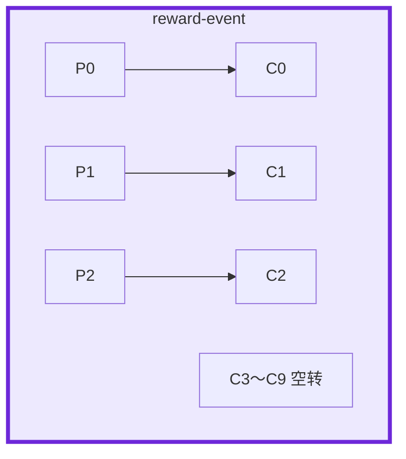
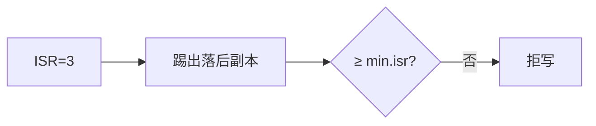
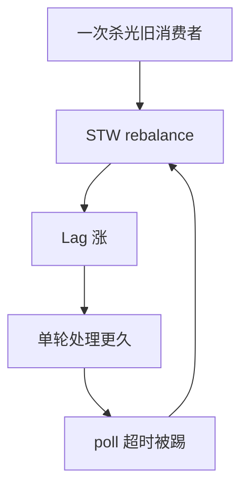

# 03｜Kafka · 练习题

开始做题前，先给大家一个小建议：合上知识点，对着 **本章主线**（分层 → 归类 → 留证）和第二节架构图，把一条发奖消息从 Producer 到消费位点口述一遍。能顺下来，下面这些题你会发现大半都会了；卡壳的地方，就是你该回去重读的那一节。

做题的方式也建议改一下：每道题**先看标题和场景，自己口述一遍答案，再往下看「完整解答」对答案**。直接看解答，容易产生「我会了」的错觉——能讲出来才是真的会。

| 标记 | 含义 |
|------|------|
| **核心** | 不懂整章就没建立起来 |
| **必会** | 值班和面试都要能讲 |
| **常用** | 线上会反复碰到 |
| **常考** | 白板和追问的高频口径 |

题目的顺序也是有意排的：Q1、Q2 先把分区/组与写入可靠性钉死；Q3～Q7 顺着 ISR、offset、Lag、rebalance、顺序展开；Q8、Q9 幂等与丢消息分层；Q10～Q14 落到变更、吞吐、风暴与 60 秒定责。

## 本题目录

- [Q1 Topic、分区、组](#q1)
- [Q2 acks / ISR / HW / LEO](#q2)
- [Q3 ISR 收缩](#q3)
- [Q4 offset 与丢重](#q4)
- [Q5 Lag 积压](#q5)
- [Q6 Rebalance](#q6)
- [Q7 分区与顺序](#q7)
- [Q8 幂等与 Exactly once](#q8)
- [Q9 发奖、毒消息、丢消息分层](#q9)
- [Q10 磁盘、reset、升级回滚](#q10)
- [Q11 Producer batch 与压缩](#q11)
- [Q12 消费组 rebalance 风暴](#q12)
- [Q13 幂等 Producer 重启后怎么办](#q13)
- [Q14 Kafka 故障 60 秒定责](#q14)
- [合上书](#合上书)

---

## Q1

**★★★★★｜Topic、分区、消费组是什么关系？堆积时加消费者一定有用吗？**

**覆盖**：核心 · 必会 · 常考
**对应**：知识点 [1. 基本概念](知识点.md)、[3. 原理](知识点.md)

### 场景

发奖 Topic 3 个分区，Lag 到了几百万。有人把消费组副本从 3 扩到 10，Lag 几乎没动，还多了 7 个空转的 Pod。

先自己试试：不看下面，你能口述出关键结论吗？想完再对答案。

### 完整解答

> 🎯 **一句话**：并行度上限 = 分区数；组内一分区一消费者，加消费者超过分区数只会空转。

Topic 是逻辑分类。Partition 是追加日志，**分区内有序、跨分区无序**。Consumer Group 组内分摊分区，组间各消费一份。



同一时刻一个分区只能被组内一个消费者拉，所以 **并行度上限 = 分区数**。加消费者之前：看分区数够不够（不够才扩，只增不减）；看下游是否已经慢；看是不是单分区热点。带 key 扩分区后 `hash(key) % n` 变了，依赖顺序的组要评估。

### 再追问

无 key 的消息顺序还保得住吗？——保不住。无 key 轮询打到不同分区。要同订单有序，用 `order_id` 做 key。

---

## Q2

Q1 把分区和组钉住了。接下来问写入可靠性——这是开篇「降 min.isr」那位同学踩的坑的正对面。

**★★★★★｜怎么保证写入可靠？acks=all 等的是谁？HW / LEO？**

**覆盖**：核心 · 必会 · 常考
**对应**：知识点 [3.1 一次写入：acks / ISR / HW / LEO](知识点.md)

### 场景

支付发货 Topic 有人觉得「acks=all 就等于不丢」。白板追问：「消费者为什么读不到 Leader 刚写下的最后几条？」

先自己试试：不看下面，你能口述出关键结论吗？想完再对答案。

### 完整解答

> 🎯 **一句话**：可靠写 = rf + min.isr + acks=all + 幂等 Producer；acks=all 等 ISR 全部确认，消费者只读到 HW 前。

可靠写是一套：Topic `rf=3, min.insync.replicas=2`；Producer `acks=all, enable.idempotence=true`，看 callback；Consumer 处理成功再提交 + 业务唯一键。

`acks=all` 等的是 **ISR 全部确认**，不是集群里每一台。

| 位点 | 含义 |
|------|------|
| **LEO** | 该副本本地日志末尾 |
| **HW** | ISR 里最小 LEO；已提交 |
| **consumer offset** | 该组处理到哪 |

消费者只能读到 **HW 之前**。Leader LEO 可以更大，Follower 没追上则 HW 不前进。这是切主安全，不是丢了。

`acks=1` 只等 Leader，支付/发货禁用。幂等 Producer 不防消费重复。Exactly once 出 Kafka 进 MySQL 仍要唯一键。生产口头：**At least once + 幂等消费**。

### 再追问

HW 就是 Leader 的 LEO？——不是。ISR 最小 LEO 才是 HW。读 Follower 也受 HW 约束（一致性配置另说），控制面式的「已提交」以 HW 为准。

---

## Q3

这是 Q2 结论的「ISR 收缩版」：acks=all 等的是 ISR，ISR 不够会怎样？

**★★★★★｜ISR 收缩会怎样？能不能把 min.isr 改成 1？**

**覆盖**：核心 · 必会 · 常用
**对应**：知识点 [3.2 ISR 收缩](知识点.md)

### 场景

活动中一台 Broker 磁盘慢，ISR 掉到只剩 Leader，写入报 `NOT_ENOUGH_REPLICAS`。群里有人要把 `min.insync.replicas` 改成 1 先顶过去。另一次滚动 Broker 没等 URP 回 0 就下一台。

先自己试试：不看下面，你能口述出关键结论吗？想完再对答案。

### 完整解答

> 🎯 **一句话**：ISR 收缩低于 min.isr 时 acks=all 拒写保数据；降 min.isr 等于允许单副本写，滚动等 URP=0。

Follower LEO 在 `replica.lag.time.max.ms`（常见 30s）内赶不上就被踢出 ISR。URP>0 = 丢冗余。ISR < min.isr 时 `acks=all` **拒写**——这是保数据。



把 min.isr 降到 1 等于允许单副本写入，再挂 Leader 就丢。`unclean.leader.election` 必须 false，禁止 ISR 外选主。拒写时：Producer 失败进补偿表，限非核心 Topic 保发货，修 Follower 磁盘/GC 让 ISR 回来。滚动 **一次一台**，等 ISR 齐、URP=0。

### 再追问

拒写的时候业务怎么办？——补偿表 + 限埋点，不要降 min.isr 换吞吐。

---

## Q4

写侧可靠了，消费侧呢？这道题专门钉「先提交后处理 = 静默丢」。

**★★★★★｜offset 何时提交？和丢、重分别什么关系？**

**覆盖**：核心 · 必会 · 常用
**对应**：知识点 [3.4 消费与 offset](知识点.md)

### 场景

发奖消费者开了自动提交。客诉「有的邮件没到」。日志里处理函数抛过异常，但 offset 已经往前走了。另一组多线程按完成时间提交。

先自己试试：不看下面，你能口述出关键结论吗？想完再对答案。

### 完整解答

> 🎯 **一句话**：处理成功再提交 offset；先提交或自动提交会丢，多线程乱序提交也会真丢中间消息。

```
  先提交再处理 / 自动提交  → 处理失败也提交 → 丢
  处理成功再提交，提交失败 → 再拉一次 → 重复（唯一键挡）
```

核心组关掉自动提交。异常被吞、catch 之后照样提交，等于手动制造 At most once。多线程不能按完成时间乱序提交：中间失败、后面成功先提交，中间被跳过，是真丢。offset 仍按分区顺序。

### 再追问

自动提交能不能开？——埋点可以。发奖、支付、合服流水禁用。

---

## Q5

就是开篇 Lag 飙到 80 万、有人要加 20 个 consumer 的现场——这是 Q1「并行度=分区数」的排障版。

**★★★★★｜Lag 持续增长怎么排？平均 Lag 为什么骗人？**

**覆盖**：核心 · 必会 · 常用
**对应**：知识点 [3.5 积压 Lag](知识点.md)

### 场景

活动整点，`reward-worker` 平均 Lag 看起来还行，但有一个分区 Lag 在直线涨。有人准备把消费者再加一倍。

先自己试试：不看下面，你能口述出关键结论吗？想完再对答案。

### 完整解答

> 🎯 **一句话**：Lag 按分区查，平均 Lag 会骗人；先找涨的分区，再看生产/消费速率和下游慢。

按层查，不要先加机器：

1. describe 组：哪个分区在涨？
2. 生产速率 vs 消费速率：差为正才是还在恶化
3. 在不在、是不是一直 rebalance（Lag 锯齿）
4. 下游耗时：慢 SQL、HTTP、线程池
5. 单分区热点：key 是不是都是同一个活动 id
6. Broker：磁盘、URP、P99

```bash
kafka-consumer-groups.sh --bootstrap-server $BS \
  --describe --group reward-worker
```

止血：下游慢 → 限产或扩下游。毒消息进死信。热点改 key。分区不够再扩分区。Lag 很大但速率已跟上：在消化历史。超过 retention 的部分已经没了。

### 再追问

为什么平均 Lag 不高还会出事？——两个分区 0、一个几百万，平均被摊平。告警必须按组和分区。

---

## Q6

Q5 里「Lag 锯齿」那一支，根因往往在这里。

**★★★★☆｜Rebalance 为什么让堆积更严重？**

**覆盖**：必会 · 常用
**对应**：知识点 [3.6 Rebalance](知识点.md)

### 场景

发版窗口把消费组 12 个 Pod 一次换完。Lag 跳一截，随后消费变慢，过一会儿又跳一截。

先自己试试：不看下面，你能口述出关键结论吗？想完再对答案。

### 完整解答

> 🎯 **一句话**：Rebalance 期间整组 STW 停消费；一次杀光消费者会让 Lag 锯齿恶化，活动整点别扩组。

成员变化或 `max.poll.interval.ms` 内没 poll，组要重新分配分区。经典协议下这段时间 **整组停消费**。



治理：滚动分批、减小 `max.poll.records`、修下游。调大 interval 是止痛。处理放到别的线程可以，但 offset 仍按分区顺序提交。协作式 rebalance 缩短窗口，不是处理慢的补丁。

怎么看：组日志里成员频繁进出、Lag 呈锯齿而不是一条斜线。

### 再追问

活动中途扩容消费者会怎样？——会触发一次 rebalance。不要在整点发奖那一分钟扩。

---

## Q7

回到 Q1 的 key：顺序到底靠什么保？

**★★★★☆｜顺序消息怎么保？为什么不要全局有序？**

**覆盖**：必会 · 常用 · 常考
**对应**：知识点 [3.3 分区与顺序](知识点.md)

### 场景

订单状态机要「创建 → 支付 → 发货」按序。有人准备把 Topic 改成 1 个分区，「这样全世界都有序」。另有人活动中途扩分区。

先自己试试：不看下面，你能口述出关键结论吗？想完再对答案。

### 完整解答

> 🎯 **一句话**：同 key 进同分区保序；全局单分区吞吐崩，扩分区会改 hash 映射要评估。

同业务 key 进同一分区 + 该分区串行消费。订单用 `order_id`，发奖用 `player_id`。全局有序 = 单分区，吞吐崩。

```
  对：hash(order_id) → 同订单同分区，分区内串行
  错：单分区保全局顺序
  错：扩分区后仍假设旧 key 映射不变
  错：分区内多线程乱序处理
  错：无 key 靠 Producer 单线程
```

扩分区只增不减，`hash % n` 会变。只保证「同订单有序」。

### 再追问

无 key 能靠 Producer 单线程保序吗？——不能。无 key 轮询到不同分区，Broker 侧已经乱了。

---

## Q8

Q2 提过幂等 Producer——这道题把「幂等 ≠ exactly once」钉死。

**★★★★☆｜幂等 Producer 开了，消费还会重复吗？Exactly once 呢？**

**覆盖**：必会 · 常用 · 常考
**对应**：知识点 [3.4 消费与 offset](知识点.md)、[8. 必会 · 常考](知识点.md)

### 场景

Producer 配了 `enable.idempotence=true`。消费侧仍出现同一笔发奖写了两次。有人说「Kafka 不是 Exactly once 吗」。

先自己试试：不看下面，你能口述出关键结论吗？想完再对答案。

### 完整解答

> 🎯 **一句话**：幂等 Producer 只防 Broker 侧重试写；消费仍可能重复，Exactly once 出 Kafka 进 MySQL 仍要唯一键。

幂等 Producer 只防 **Broker 因网络重试写两遍**。消费侧：提交失败重拉、rebalance 重复分配、业务超时重试，都会再处理一次。PID 在 Producer 重启后会换，跨会话不保证。

Exactly once / 事务消息只在 Kafka 自己的读写链路里。进 MySQL + Redis，Kafka 事务管不到。生产默认 At least once + 幂等表。发奖表用流水号唯一索引，先写结果再提交 offset。

### 再追问

Producer 重启后幂等还在吗？——PID 会换。所以消费幂等不能省。

---

## Q9

开篇那句「Kafka 丢消息了」——分层查法就在这道题。

**★★★★☆｜游戏发奖用 Kafka，重复、毒消息、「丢了」怎么分层？**

**覆盖**：必会 · 常用 · 常考
**对应**：知识点 [3.7 丢消息分层](知识点.md)

### 场景

运营说「这批发奖有的玩家没收到」。群里已经有人在怪 Kafka。一条坏 JSON 卡在分区 0 队头。有人把 offset 往后跳了一大截。消息 ID 还没对上。

先自己试试：不看下面，你能口述出关键结论吗？想完再对答案。

### 完整解答

> 🎯 **一句话**：丢消息分 Producer/Broker/Consumer/业务四层查；毒消息进 DLQ，reset 必须 dry-run。

先定层，先要到消息 ID，对发送日志和消费日志：

```
  Producer：ack / callback / 补偿表
  Broker：  acks、ISR、磁盘满、retention 到期（合法删除）
  Consumer：先提交、异常被吞、reset --to-latest
  业务：    错 Topic、过滤条件、状态没改
```

还在分区里而消费日志没有 = 消费或业务。不在且超过 retention = 过期。从未出现在 Leader = 生产没写成功。

重复是常态：流水号唯一索引。毒消息重试 N 次 → **DLQ**（保留原始 offset 和 payload），死信没有 oncall = 静默丢。跳过 offset 等于宣布后面那截已消费，必须 dry-run、业务签字。

活动中限非核心 Topic，保发奖 Topic 的磁盘和 ISR。和 RabbitMQ 比：要按玩家保序、要重放、同一份给风控再给数仓、活动吞吐高 → Kafka。短任务分发 → RabbitMQ。

### 再追问

怎么证明 Kafka 没丢？——消息 ID 在分区里按 offset / 时间戳查。埋点 24～72h，发货更长。

---

## Q10

这是 Q3、Q9 的操作落地：磁盘、reset、升级回滚各踩什么红线。

**★★★★☆｜磁盘怎么估？reset 红线？升级失败怎么回滚？**

**覆盖**：必会 · 常用
**对应**：知识点 [6.5 升级](知识点.md)、[6.7 重置 offset](知识点.md)

### 场景

埋点和发货共用一块盘。打点高峰把盘打到 100%，发货 Producer 全部失败。另有人丢了一条 `--reset-offsets --to-latest`。控制面刚升完一台 ISR 落后，有人要把三台包一起改回去。

先自己试试：不看下面，你能口述出关键结论吗？想完再对答案。

### 完整解答

> 🎯 **一句话**：磁盘按写入×保留×副本估，85% 告警；reset --to-latest 等于跳过积压，升级一次一台等 URP=0。

```
  容量 ≈ 写入 MB/s × 保留秒 × 副本 × 1.3
  80% 告警；85% 删旧段或扩盘；100% = 全集群拒绝生产
```

核心与埋点分盘。满盘是写不进去，不是「Kafka 丢了再 reset」。

重置：必须 `--dry-run`；`--to-latest` = 跳过积压（业务当丢）；`--to-earliest` 可能打爆下游；组名写错会 reset 到空组。

升级：先存档位点和 Topic 配置；一次一台等 URP=0。日志格式升过可能不能靠换回二进制。一台落后先看盘和网，按换 Broker 摘掉重加，不要三台一起回滚。没有补偿表和位点存档 = 发奖没有回滚。缩核心 retention 抢磁盘 = 主动删未消费数据。

### 再追问

缩 retention 抢磁盘行不行？——能腾空间，要算最慢组和重放窗口。`advertised.listeners` 配 localhost？——bootstrap 通、进集群就断。

---

## Q11

吞吐不够时先动 batch/压缩——别和 Q6 的 rebalance 风暴混成一锅。

**★★★★☆｜Producer `batch.size` 和 `linger.ms` 怎么调？活动高峰丢吞吐怎么办？**

**覆盖**：必会 · 常用 ｜ **对应**：知识点 [3. 原理](知识点.md)

### 场景

埋点 Producer 单条发，Broker CPU 低、网络 RTT 高，吞吐只有 2 万/s。目标 10 万/s。

先自己试试：不看下面，你能口述出关键结论吗？想完再对答案。

### 完整解答

> 🎯 **一句话**：**批量 + 压缩** 换吞吐——`linger.ms` 攒批、`batch.size` 上限、`compression.type=lz4/zstd`，**不要**单条 sync 发。

```properties
linger.ms=10
batch.size=65536
compression.type=lz4
acks=all
```

```text
吞吐 ≈ (batch 条数 / (RTT + linger)) × 分区数
```

活动前压测调参；`buffer.memory` 打满会 `RecordAccumulator full`——扩 buffer 或加分区。**不要**为降延迟把 `linger.ms=0` 且 batch=1 当常态。

### 再追问

**压缩 CPU 扛不住？**——换 lz4；或降压缩只给非核心 Topic。

---

## Q12

就是 Q6 那位同学踩的坑的「风暴版」。

**★★★★★｜消费组频繁 rebalance，Lag 锯齿怎么治？**

**覆盖**：核心 · 必会 · 常考 ｜ **对应**：知识点 [3. 原理](知识点.md)

### 场景

每次发版 consumer 全 rebalance，Lag 从 0 飙到 50 万再回落。`max.poll.interval.ms` 告警。

先自己试试：不看下面，你能口述出关键结论吗？想完再对答案。

### 完整解答

> 🎯 **一句话**：rebalance 三大诱因——**处理超 `max.poll.interval`、session 超时、成员数变**；静态成员 + 合理 poll 间隔 +  cooperative sticky。

```properties
max.poll.interval.ms=300000
session.timeout.ms=45000
partition.assignment.strategy=CooperativeStickyAssignor
```

```text
① 消费逻辑别阻塞 poll 线程（大 SQL 放 worker，poll 只提交）
② 发版用滚动，避免全组同时停
③ static membership（group.instance.id）减无谓 rebalance
④ 查 __consumer_offsets 与 broker 日志 "Revoking assignment"
```

> ⚠️ **别混**：加 consumer **不超过分区数**——多了只 rebalance 不提速。

### 再追问

**单条处理 2 分钟怎么办？**——拆批、`pause` 分区、或减 `max.poll.records`，**不要**只调大 interval 不查慢处理。

---

## Q13

这是 Q8 的追问落地：幂等 Producer 重启后 PID 变了怎么办。

**★★★★☆｜幂等 Producer 重启后 PID 变了，怎么保证不重复？**

**覆盖**：必会 · 常考 ｜ **对应**：知识点 [3. 原理](知识点.md)

### 场景

发奖 Producer 启用了 `enable.idempotence=true`。滚动重启后，部分玩家收到双倍邮件。

先自己试试：不看下面，你能口述出关键结论吗？想完再对答案。

### 完整解答

> 🎯 **一句话**：Producer 幂等只防 **Broker 重试重复**——**PID 重启就变**，消费端和业务表仍要 **幂等键 + 唯一索引**。

```text
Producer 幂等：单 PID 单会话 seq 去重
重启后：新 PID → 同业务消息可能再写一次
消费端：activity_id + role_id + tier UNIQUE
```

```sql
INSERT INTO mail_log (idempotent_key, ...) VALUES (?, ...)
-- Duplicate entry → 跳过，返回成功
```

> 📝 **面试**：Kafka 幂等 + 事务 ≠ 端到端 exactly once；发奖必须 DB 幂等兜底。

### 再追问

**事务 Producer 能替代消费幂等吗？**——不能；跨会话、跨重启仍要业务幂等。

---

## Q14

这张表把前面十多道题串起来了——60 秒定责。

**★★★★★｜Lag 暴涨 / ISR 缩 / 拒写，60 秒怎么分？**

**覆盖**：核心 · 必会 · 🔧 ｜ **对应**：知识点 [7. 生产排障](知识点.md)

### 场景

同时告警：consumer Lag 100 万、under-replicated partitions、producer 超时。

先自己试试：不看下面，你能口述出关键结论吗？想完再对答案。

### 完整解答

> 🎯 **一句话**：**ISR 缩 → 先 Broker 盘/网**；**Lag → 分区级查慢消费/毒消息**；**拒写 → min.insync.replicas**——不要降 `acks`。

```text
0–10s   kafka-topics --describe：URP、Leader 分布
10–30s  磁盘 df、ISR 成员是否掉线
30–45s  consumer-groups --describe：哪分区 Lag 最大
45–60s  定型：扩消费/修毒消息/修盘，禁止 --to-latest 当止血
```

```bash
kafka-consumer-groups.sh --bootstrap-server kafka:9092 \
  --describe --group mail_sender | sort -k6 -rn | head
# PARTITION  LAG
# 3          980000   ← 热点分区或毒消息
```

> ⚠️ **别混**：Lag 高不一定是 consumer 少——可能是 **单分区热点** 或 **处理阻塞 rebalance**。

### 再追问

**能临时 `acks=1` 吗？**——活动发奖**不要**；埋点可评估，要有补偿。

---

## 合上书

做完题再合上书，对着知识点「合上书」逐条过一遍——条数对齐，卡壳的回对应 Q：

- [ ] 能说出并行度 = 分区数；组间各消费一份 offset 不抢（Q1）
- [ ] 能讲 acks=all 等 ISR；LEO / HW / consumer offset 不混（Q2）
- [ ] 能处理 ISR 收缩拒写，不降 min.isr；滚动等 URP=0（Q3）
- [ ] 能讲处理后提交 offset；多线程不能乱序提交（Q4）
- [ ] 能按分区查 Lag，区分热点 / 下游慢 / rebalance / 毒消息（Q5、Q6、Q14）
- [ ] 能保同 key 顺序并说明扩分区改映射；分层查丢消息；reset 必须 dry-run——现在再看开篇那三刀，你知道该怎么拦住他们了（Q7、Q9、Q10）
