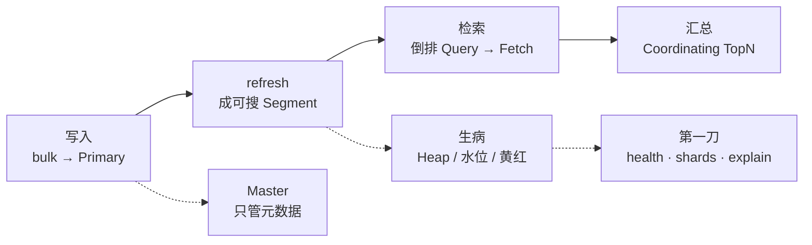
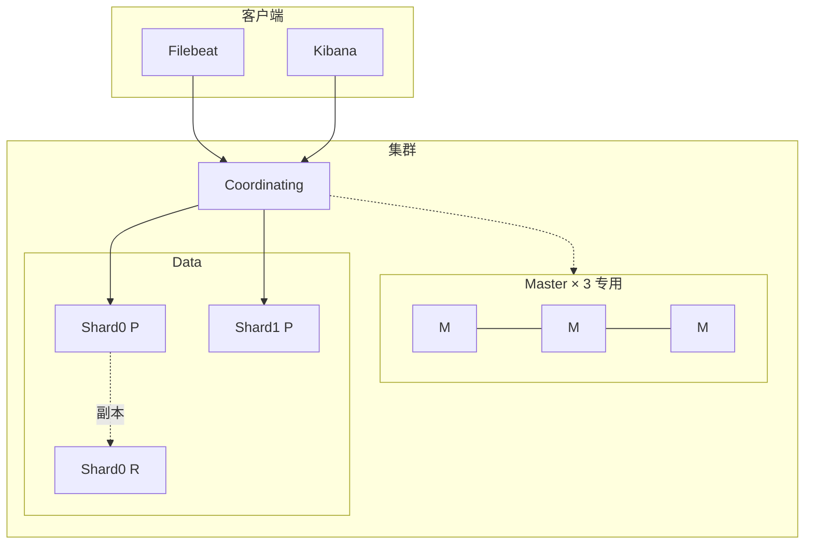
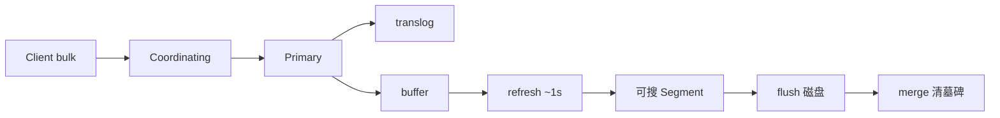
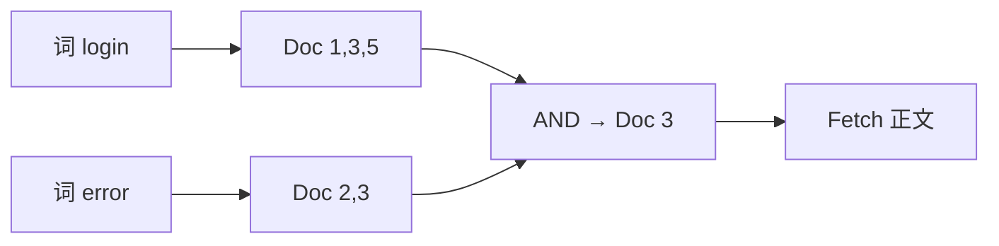
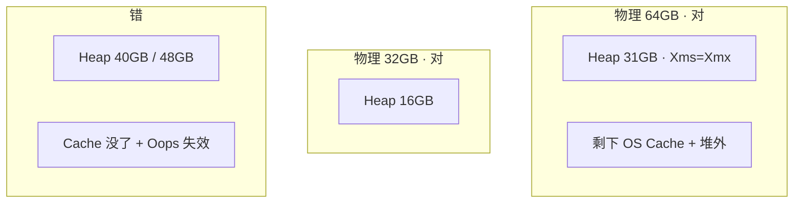
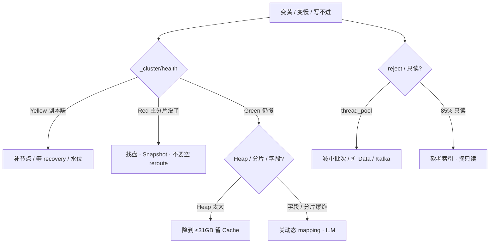

# Elasticsearch

> 活动高峰，Kibana 顶栏从绿变黄。客服说「搜玩家 10001 还能出结果，就是慢」。群里有人要把 Data 节点 Heap 加到 40GB，另有人要重启 es-data-2「变绿」——你 `df -h` 一眼 `/var/lib/elasticsearch` **87%**，Filebeat 还在 bulk，日志刷 `flood stage`。
> **本章回答**：一次检索从 Coordinating 到分片倒排怎么走；黄 / 红 / 只读 / Heap 飙高时怎么一眼定责。
> **不讲**：采集、EFK vs Loki 架构 → [03-20](../../03-Kubernetes/20-日志管理/)；消息管道 → [03 Kafka](../03-Kafka/)；文档库 / TTL → [05 MongoDB](../05-MongoDB/)；列存 SQL 细节不单开，选型见第二节。

**标记**：🎯重点 · 🔥难点 · ⭐常考 · 🔧实操

---

## 一、一张图：一次检索的一生

> 🎯 **一句话**：文档先进 Primary 再 refresh 成 Segment；搜时 Coordinating 散到各分片倒排，Query 拿 ID、Fetch 拿正文。黄红看分片分配，Heap / 水位看 Data。



- 📖 **读图**
  - 🛤️ 主线「写入 → refresh → 检索 → 汇总」；Master 不在数据路径上
  - 🔭 黄 / 红照分片分配；慢 / GC / 只对照 Data 的 Heap 与盘；值班三刀 `_cluster/health` → `_cat/shards` → `allocation/explain`
  - ⭐ 开场两刀对号：加 Heap 40GB → 生病段；重启 Data 变绿 → 黄了别动 Data，先问能不能搜全

排障口诀三步：**分层**（Coordinating → Primary → Segment）→ **归类**（黄红 / 慢 / 写不进）→ **留证**（health + shards + explain）。

---

## 二、选型：ES 搜，不记账

> 🎯 **一句话**：倒排 + 分片并行让 ES 快；适合全文多条件搜，不适合当账本、不当 OLAP。

- 🔑 **Elasticsearch** = 基于 Lucene 的分布式搜索 / 分析引擎
  - **倒排索引（inverted index）** = 词 → 文档 ID 列表（像字典「词目 → 页码」）
  - **分片并行** = 各 Shard 同时查，Coordinating 汇总
  - 近实时：默认 **refresh 1s** 后才可搜——不是实时，更不是账本

- 🩺 **值班什么时候碰到**：客服搜「玩家 10001 登录失败」、活动 bulk reject、Kibana 顶栏变黄 / 变红、磁盘 85% 索引只读

| 维度 | Elasticsearch | Loki | ClickHouse |
|------|---------------|------|------------|
| 擅长 | 全文、多条件、客服关键词 | 按 label 捞一段日志 | 留存 / 漏斗 / 亿级 group by |
| 索引 | 正文倒排 | 只索引 label | 列存 |
| 成本 | 堆 + 盘都贵 | 低 | 中 |
| 不擅长 | 超大范围聚合 | 内容全文 | 全文搜 |

- 🗺️ **选型三条分支**
  - 「搜报错原文 / 玩家聊天 / 客服关键词」→ **ES**
  - 「按 namespace、level、pod 拉一段时间」→ **Loki**（→ [03-20](../../03-Kubernetes/20-日志管理/)）
  - 「留存、付费漏斗、亿级 group by」→ **ClickHouse**；削峰重放 → [03 Kafka](../03-Kafka/)
  - 采集侧应有 Kafka 缓冲：ES 拒写时日志还在队列里，否则丢的是检索不是管道

> ⚠️ **别混**：Mongo 适合按 `player_id` 拉文档；要全文多条件高并发用 ES。邮件过期用 Mongo TTL（→ [05](../05-MongoDB/)），不要靠 ES 当源数据。玩家钱包 / 发货账本在 [01 MySQL](../01-MySQL/)。

- 📎 **RDBMS 对照**（内联一次）：Index ≈ 表，Document ≈ 行，Field ≈ 列，Mapping ≈ schema，Shard ≈ 分区，Replica ≈ 从副本。7.x 后一 Index 一表更干净。

⭐ 口诀：**「倒排查词，分片并行；ES 搜，不记账」**。

> 📝 **面试**：「ES / Loki / CH 怎么选？」——全文多条件 ES；按 label 捞 Loki；亿级聚合 CH。ES 不当 MySQL。⭐（练习题 Q5、Q11）

本节对应练习题 Q5、Q11。道选好了，集群怎么出生？

---

## 三、出生：角色 · 分片 · 配置

> 🎯 **一句话**：Master 管元数据不存业务；Data 存倒排；写入打 Primary，搜可打副本。主分片数创建时定死。

### 🏛️ 三个角色 🎯⭐



- 📖 **读图**
  - ✍️ 写入打 **Primary**，再复制到 Replica；搜可以打副本——排障先看 Primary 在不在
  - 🧭 Master **不存业务数据**；Data Full GC 会拖集群状态 → Master 专用，从 Data 查起
  - 📦 **Index → Shard → Segment**（Lucene 不可变文件）；Yellow/Red 看的是 Shard 分配，不是 Index 名字

| 角色 | 干什么 | 值班怎么认 |
|------|--------|------------|
| **Master** | 元数据、分片分配 | `_cat/nodes` 里 `m`；生产 **3 台专用** |
| **Data** | 存数据、建倒排、查 | `d`；GC、磁盘水位都在这里 |
| **Coordinating** | 收请求、散分片、汇总 | 大集群可独立；小集群 Data 兼任 |

> 💡 **打个比方**：Master 像馆长管书架编号；Data 是分馆书架；Coordinating 是前台汇总。

### 📐 分片与副本 🔥⭐

> 🎯 **一句话**：主分片数创建后不能改；单片目标 30～50GB；日志靠 ILM rollover 防分片爆炸。

> 💡 **打个比方**：主分片像承重墙——楼建好了不能改墙数，只能 reindex 搬家；副本像备份书架，随时可加，但得有空房间（节点）放。

#### ❓ 为什么主分片数创建后不能改？

- 🧱 文档落片：`hash(routing) % 主分片数`（默认 `_id`，业务用 `player_id`）
- 🔢 改主分片数 = 改哈希空间 → 旧文档落点全错 → **只能 reindex 到新 Index**
- ✅ 副本 `number_of_replicas` **可动态改**；配置了 replica=1 ≠ 已有副本——Yellow 拖很久 = 无冗余
- ⚠️ 单节点一直黄是拓扑，不是故障

**规划 500GB 游戏日志（现场口述）**：

1. 估容量：500GB，日增 20GB，保留 30 天
2. 主分片：`500GB ÷ 40GB/片 ≈ 12`，取 **10～12**
3. `replicas: 1` → 总分片 20～24，均摊 Data
4. 创建时写死 `"number_of_shards": 10`——之后不能改
5. 绑 ILM：rollover **1 天或 50GB**，30 天 Delete——别手建无限日索引还不删

```text
index          shard prirep state      docs   store
logs-2026.08   0     p      STARTED    12.3m  42.1gb   # ← 单片 ~42GB，落在 30～50 带
logs-2026.08   0     r      STARTED    12.3m  42.1gb
logs-2026.08   1     p      UNASSIGNED                 # ← 看颜色：p 缺=红，仅 r 缺=黄
```

- 🔍 **现场**：单片 **>100GB** → 恢复 / GC 疼；每节点堆过约 **1000** 片 → 元数据膨胀、集群变慢

> 📝 **面试**：「主分片怎么估、能改吗？」——按 30～50GB/片估，创建定死，要改只能 reindex；日志用 ILM rollover。⭐（Q2、Q12）

### 🧾 生产配置骨架 🔧

```yaml
cluster.name: game-es
node.name: es-master-1
node.roles: [ master ]          # Data 写 [ data ]；别 Master+Data 混部扛业务
network.host: 10.0.1.11
http.port: 9200                 # 节点间 9300
discovery.seed_hosts: ["10.0.1.11", "10.0.1.12", "10.0.1.13"]
cluster.initial_master_nodes: ["es-master-1", "es-master-2", "es-master-3"]  # 仅首次 bootstrap
path.data: /var/lib/elasticsearch
bootstrap.memory_lock: true
```

- ⚠️ **`initial_master_nodes` 只空白集群第一次用**；已组群再写可能当成新集群 → 脑裂风险（七节）
- Heap 在 `jvm.options`：`-Xms31g -Xmx31g`（铁律见七节）
- 验收：`GET _cluster/health` 绿（或单节点预期黄）；`_cat/nodes` 角色对；**不要只探 TCP 9200**

- ✅ **生产清单**：Master 3 专用奇数 · replica≥1 跨 AZ · 独立 SSD 盯水位 · Heap≤一半且≤31GB · 日志 / 业务分 Index · 前面 Kafka 缓冲
- ☁️ 云上 Data 跨 AZ，避免主副同一机架；定期 Snapshot 到 OSS/S3

只动有证据的项。改主分片数 ≠ 改配置——要 reindex。

| 参数 | 生产怎么用 | 改错会怎样 |
|------|------------|------------|
| 主分片数 | 按 30～50GB/片估，创建定死 | 过多元数据爆炸；过少恢复 / GC 疼 |
| `number_of_replicas` | ≥1，可动态改 | 单节点一直黄是拓扑 |
| `refresh_interval` | 默认 1s；灌日志可 30s | 当实时；或关 translog 换吞吐 |
| 磁盘水位 | 80% 告警；85% 只读 | 当成采集挂了去重启 Filebeat |
| 动态 mapping | 关或白名单 | 字段爆炸打满集群状态 |

本节对应练习题 Q2、Q3、Q6、Q12。角色和分片钉住了，文档怎么写进去？

---

## 四、写入：bulk → refresh → Segment

> 🎯 **一句话**：bulk 进 buffer + translog，**refresh 默认 1s** 后才成 Segment 可搜——近实时，不是实时。

> 💡 **打个比方**：记者稿先放编辑台（buffer），印厂开机（refresh）才上报纸（可搜）；删稿只是划掉（墓碑），旧版要回收合并（merge）才腾地方。



- 📖 **读图**
  - 🚪 进门：Coordinating 路由到 Primary；**translog** 保崩溃可恢复，别关它换吞吐
  - ⏱️ refresh 把 buffer 刷成 Segment 才可搜；flush 才稳落盘；merge 清墓碑腾空间

#### ❓ 为什么 bulk 返回 200，立刻搜还没有？

- ✅ **写入成功 ≠ 立刻可搜**：还没 refresh（默认 1s）
- ❌ **不要**把「搜不到」当成写入失败去重推——等 1～2s 再搜
- 🚨 bulk `429` / `rejected execution` → 线程池满，这批**没进 ES**，靠 Kafka 重试
- 🚫 `403` + 索引带只读块 → 磁盘水位（七节），不是 Filebeat 坏了

```json
{ "errors": false, "items": [ { "index": { "status": 201, "result": "created" } } ] }
# ← errors:true 要逐条看；201=新建；429=reject；403=只读
```

- 🔧 **灌日志优化**：Bulk 单批 **5～15MB**；可调大 `refresh_interval`；临时 replica=0 有窗口风险
- 🗑️ 删文档磁盘不掉 = 墓碑等 merge；**热 Index 别 forcemerge**

> 📝 **面试**：「写入近实时」——bulk 成功要等 refresh 才可搜；reject 没进 ES；不关 translog。⭐（Q7）

本节对应练习题 Q7。

---

## 五、检索：倒排 Query / Fetch 🔥⭐

> 🎯 **一句话**：倒排是词 → 文档 ID；Query 各分片并行报 ID，Fetch 再取正文——不是逐条扫日志。

很多人答「ES 快是因为分布式」——只对一半。快的核心是**倒排**，机器多是放大器。

> 💡 **打个比方**：查「login AND error」= 两个页码列表取交集，再去对应页拿正文；不是把整本日志从头读到尾。

#### ❓ 为什么不是「扫一遍日志就出结果」？

- ❌ 正排思维：文档 → 词（扫文档找词）
- ✅ 倒排：词 → 文档 ID；**词典（term dictionary）+ 倒排表（posting list）**
- 🔀 两阶段：**Query** 拿 ID + 分数 → Coordinating 汇总 TopN → **Fetch** 按 ID 取 `message` 等字段
- 🏷️ `text` 分词做全文；`keyword` 整值做过滤 / 聚合 / **routing**——别混



- 📖 **读图**：左两路是倒排命中；中间 AND 交集；最右才 Fetch——面试白板要画出「先 ID 后正文」

**客服搜登录失败（走一遍）**：

1. Kibana：`player_id:10001 AND message:login AND message:error` → Coordinating
2. 散到各 Primary/Replica 并行查倒排
3. 各片回 Doc ID + `_score`；汇总 TopN
4. Fetch 取正文拼结果
5. 没设 `routing=player_id` → 每次 scatter 全片 → 高峰「能搜到，但慢」

```json
{ "took": 842, "hits": { "total": { "value": 37 }, "hits": [ { "_id": "abc", "_score": 4.2 } ] } }
# ← took 高：分片多 / 段多 / 没 routing；_score 全文才有，filter 不算分
```

### 📚 日志 Index vs 业务 Index ⭐

> 🎯 **一句话**：都用倒排，但 **Index 设计、ILM、routing、能不能丢** 两套——不要一个大 Index 扛所有。

> 💡 **打个比方**：日志像每日报纸——印完看几天就扔（ILM Delete）；业务检索像借阅卡——映射要严、按 `player_id` 分区（routing），丢了是客服事故。

#### ❓ 为什么日志和业务不能塞进同一个 Index？

- 💥 活动 JSON 灌进客服 Index → `event.extra_*` 每天出新 key → 动态 mapping 字段爆炸 → 集群状态膨胀、Master 变慢、变黄
- ✅ **日志**单独模板：`dynamic: strict` 或白名单；`message` text + `@timestamp` + 少量 keyword；ILM 7～30 天删
- ✅ **业务**：`player_id` keyword + **routing=player_id**，正文 text，**关动态 mapping**；源数据仍在 MySQL
- 📊 漏斗报表去 ClickHouse，不要逼 ES 做亿级 group by

| | 日志检索 | 业务检索 |
|--|----------|----------|
| 典型 | 登录失败原文、堆栈 | 客服按 `player_id` 搜操作 / 聊天 |
| 写入 | 极高；reject 可重试 | 中等；丢了是事故 |
| Mapping | 关动态 / 白名单；`message` text | `player_id` keyword + **routing**；关动态 |
| 生命周期 | ILM 7～30 天删 | 更长；改 mapping 常要 reindex |
| 查询 | 时间窗 + 关键词 | **必须 routing** |

### 收束：ES 凭什么快

```text
① 倒排：词 → ID，不是扫文档
② 分片并行：各 Shard 同时查
③ Query / Fetch 两阶段：先筛 ID 再取正文
④ Segment 不可变 + OS Page Cache：读热段不走堆
⑤ routing：热点业务避免每次 scatter 全片
```

> ⚠️ **别混**：快 ≠ 实时（要等 refresh）；快 ≠ 适合聚合（亿级 group by 去 CH）；快 ≠ 可以当账本。

> 📝 **面试**：「ES 为什么快？」——倒排词查文档，Query 并行报 ID、Fetch 取正文；`player_id` keyword + routing。⭐（Q1、Q13）

本节对应练习题 Q1、Q13、Q5。搜通了，接着看颜色——黄红到底能不能搜全？

---

## 六、副本与黄红：能不能搜全 🔧

> 🎯 **一句话**：先问**能不能搜全**，再动手。Yellow 能搜全；Red 搜不全。黄了别先重启 Data。

| 颜色 | 含义 | 现场 |
|------|------|------|
| Green | 主分片 + 副本都在 | 正常 |
| Yellow | 主全在，副本缺 | **能搜全，冗余不够** |
| Red | 有主分片没了 | **数据不完整，紧急** |

#### ❓ 为什么 Yellow 别重启 Data？

- 🟡 Yellow = 仅副本 UNASSIGNED → 搜还全；补节点 / 等 recovery / 查水位
- 🔴 重启 Data 可能把还活着的 Primary 也弄挂 → **黄变红**
- 🩹 Red：找 `p UNASSIGNED` → `allocation/explain` → 修盘拉回 / Snapshot restore
- ❌ **空 reroute 把空主当分片「修成功」= 假修复**（丢数据伪装成绿）

```bash
GET _cluster/health                 # status, unassigned_shards
GET _cat/shards?v                   # 哪片 UNASSIGNED · p 还是 r
GET _cluster/allocation/explain     # 为什么分不出去
GET _cat/allocation?v               # 磁盘水位
GET _cat/thread_pool?v              # bulk rejected
GET _cat/recovery?v
```

### ♻️ ILM 与 Snapshot

```text
Hot     正在写、正在搜      rollover：1 天或 50GB
Warm    只读、合并段        forcemerge 到少量 Segment
Cold    便宜盘 / 少副本     很少查
Delete  到期删              不要手留一年日索引
```

- 📅 游戏行为日志 **7～30 天**全文即可；更老归档对象存储，或根本不进 ES
- ☠️ 按天 Index 不 ILM → 三个月后 Master 被分片数拖死
- 📸 **Snapshot** 到 OSS/S3；Red 且主分片回不来才 restore
  - 快照不是 WAL，**RPO = 快照间隔**
  - 不要用 reroute 空主当分片修复

**health 解读**：`unassigned_shards` 配合 `_cat/shards` 看是 `p` 还是 `r`。指标：**Red P0**；磁盘 **80/85/95%**；bulk reject / Heap GC / 字段分片爆炸 **P1**。日志关键字：`flood stage`=水位；`rejected execution`=线程池；`failed to ping`=网络或 GC。

> 📝 **面试**：「Yellow / Red？」——黄能搜全别重启 Data；红找主分片，空 reroute 是假修复。⭐（Q4、Q9、Q10）

本节对应练习题 Q4、Q8、Q9、Q10。颜色分清了，Heap / 水位 / 脑裂这三处真会死人。

---

## 七、生病：Heap · 水位 · 脑裂 🔥⭐

### 🧠 Heap 为什么不能 40GB

开篇那位要把 Heap 加到 40GB——错就错在这儿。

> 🎯 **一句话**：64GB 机器 Heap **31GB 封顶**——超过 31GB 压缩指针失效；Lucene 靠 OS Page Cache 读 Segment，Heap 太大 Cache 没了更慢。

> 💡 **打个比方**：堆像工作台，Page Cache 像旁边大仓库。工作台扩到占满房间（40GB Heap），货每次从远处搬（读盘），反而不如 31GB 工作台 + 大仓库。

#### ❓ 为什么内存越大堆越大反而更慢？

- 📐 铁律：Heap **≤ 物理一半**，且 **≤ 31GB**；`Xms=Xmx`；7.x+ 用 G1
- 🗜️ **>31GB** → Compressed Oops 失效，指针 8 字节，同样对象更占堆，GC 更重
- 📚 Lucene **mmap 读 Segment** 吃 OS Cache；64GB 机正确是 `31g` Heap + ~33GB Cache
- 🔍 慢了先查：字段爆炸 / 分片过多 / 大聚合 / fielddata——**不加 Heap 掩盖**



- 📖 **读图**：左两框是「一半且 ≤31GB」；右框是开篇那刀——Heap 吃掉 Cache，查询变磁盘 IO

```text
heap.percent ram.percent node.role name
          92          78 d         es-data-1   # ← >85% 持续 → 查根因，别直接加到 40g
          88          75 d         es-data-2
```

| 现象 | 根因 | 修法 |
|------|------|------|
| fielddata 膨胀 | 对 text 聚合 | 改 keyword；限 circuit breaker |
| 段太多 | 热 Index 不 merge | 温数据低峰 forcemerge |
| 字段爆炸 | 动态 mapping | 关动态 / 白名单 |
| 分片过多 | 日索引不 ILM | ILM + Delete |

### 💾 磁盘水位：摘只读

水位硬门槛：约 **85%** → `read_only_allow_delete`；**95%** → flood stage 禁写。不是「再写一点」——集群开始拒写、分片分不出去，Yellow/Red 一起出现。采集还在跑，业务以为 Filebeat 挂了。

**现场走一遍**（磁盘 87%，bulk 403）：

1. `_cat/allocation?v` → 某 Data `disk.percent` **87**
2. `_cat/indices?v` → 热 Index 带 `r`（read_only_allow_delete）
3. bulk `403` / 日志 `flood stage` —— **不是 Filebeat 坏了，是 ES 拒写**
4. 删 ILM 该过期的老 Index（不是当天热 Index），或扩盘 / 温数据 forcemerge
5. 盘降到 80% 以下后摘只读

#### ❓ 为什么清完盘还写不进？

- 🧹 空间回来了，**只读块不会自动消失**
- 🔓 必须手动：

```bash
PUT idx/_settings
{ "index.blocks.read_only_allow_delete": null }
# ← 不摘只读，盘空了也 403；别删当天热 Index 当腾空间
```

### 🧩 脑裂

> 🎯 **一句话**：网络分区后两个 Master-eligible 都当选 → 两套 `cluster_uuid`、两套数据，**不能自动合并**。

> 💡 **打个比方**：两个馆长各发一套书架编号，读者还书还到不同分馆——合并编号会把书放错架，只能保住数据多的那一套，另一套清空重来。

#### ❓ 为什么两个 UUID 不能手合并？

- 🧬 两套元数据各写各的；硬合并会把文档「放错架」
- ✅ 保住文档多、时间戳新的一团；另一团 **停 ES → 清空 `path.data` → 以新节点加入**
- ❌ 空 reroute / 强行合并分片 = 造更多空主
- 🛡️ 防：Master **3 台专用奇数**（4 台没收益）；`initial_master_nodes` **仅首次**；日常 `discovery.seed_hosts`；Master 不与 Data 混
- 🩺 `master` 频繁切换：先查 Data GC 是否拖 Master，再查网络——不是先加第四台 Master

```json
{ "cluster_name": "game-es", "cluster_uuid": "abc123...", "version": { "number": "7.17.9" } }
# ← 分别 curl 不同 Master：两个 UUID = 已裂；同一 UUID 才是单集群
```

⭐ 口诀：**「Heap ≤ 一半且 ≤31GB；Master 奇数专用；脑裂别手合并」**。

> 📝 **面试**：Heap≤31GB 留 Cache；85% 只读要手动摘块；脑裂保一团清另一团。⭐（Q3、Q6、Q8）

本节对应练习题 Q3、Q6、Q8。机制齐了，回到开篇——用决策树拦住那两刀。

---

## 八、作战：定责 🔧

> 🎯 **一句话**：先问能不能搜全、能不能写、Heap/盘谁在告警——黄了别先重启。



- 📖 **读图**：颜色分叉先定「能不能搜全」；写入另开一支看 reject / 只读；Green 仍慢才进 Heap / 分片 / 字段

| 现象 | 先做 | 别做 |
|------|------|------|
| Yellow | 能搜全；补副本、等 recovery | 重启 Data 黄变红 |
| Red | 找主分片在哪台盘 | 空 reroute；当采集故障 |
| 查询慢就加 Heap | 给 OS Cache；查分片 / 字段 | 加到 40GB |
| 磁盘 85% 只读 | 砍 ILM 老索引，摘只读 | 重启 Filebeat；删当天热索引 |
| bulk reject | Kafka 缓冲、减小批次 | 关 translog |
| 两个集群 UUID | 保有数据的一团 | 强行合并 |
| 用 ES 扛全服付费 group by | 去 CH | 加 Data 硬扛 |

### 60 秒剧本 🔧

> 🔍 **现场**：接到「黄 / 慢 / 写不进」，60 秒走完再下结论。

```text
① 0–10s   GET _cluster/health          # 绿/黄/红？unassigned 多少？
② 10–30s  GET _cat/shards?v            # UNASSIGNED 是 p 还是 r？
③ 30–45s  allocation/explain + allocation 磁盘 + thread_pool
④ 45–60s  定责：黄补副本 / 红找盘与快照 / 只读摘块 / 慢查分片字段——不动「先重启 Data」「先加 40GB」
```

开篇两刀——「Heap 加到 40GB」「重启 es-data-2 变绿」——拦住他们：先看水位和黄红，Heap 守 31GB。

本节对应练习题 Q14。

---

## 九、收口

### 命令速查 🔧

```bash
GET _cluster/health
GET _cat/nodes?v
GET _cat/shards?v
GET _cat/indices?v
GET _cluster/allocation/explain
GET _cat/allocation?v              # 磁盘水位
GET _cat/thread_pool?v             # rejected
GET _cat/recovery?v
GET _cat/nodes?v&h=heap.percent,ram.percent,node.role,name
PUT idx/_settings {"index.blocks.read_only_allow_delete": null}   # 清盘后摘只读
```

### 面试锚点

| 问 | 30 秒答 |
|----|---------|
| ES 为什么快？ | 倒排词→文档 ID；Query 并行报 ID，Fetch 取正文；不是扫全表。 |
| 主分片能改吗？ | 创建定死，要改只能 reindex；按 30～50GB/片估；副本可动态改。 |
| Yellow / Red？ | 黄=主全在副本缺，能搜全，别重启 Data；红=主缺，搜不全。 |
| 为什么不是实时？ | refresh 默认 1s 后 Segment 才可搜；bulk 成功≠立刻可搜。 |
| Heap 为什么 ≤31GB？ | 超 31GB 压缩指针失效；Lucene 靠 Page Cache，Heap 过大 Cache 没了更慢。 |
| 防脑裂？ | Master 三台专用奇数；initial_master_nodes 仅首次；已两 UUID 保一团清另一团。 |
| 85% 只读怎么办？ | 砍 ILM 老索引 / 扩盘，降到 80% 下手动摘 `read_only_allow_delete`。 |
| 日志 vs 业务 Index？ | 日志 ILM 短保留；业务 keyword+routing、严 mapping；全文 ES、label Loki、漏斗 CH。 |
| reject 了数据在哪？ | 没进 ES；靠 Kafka / 采集重试。 |
| Snapshot 干什么？ | Red 且主回不来才 restore；RPO 看快照间隔，不是 WAL。 |

### 易错一句话对照

- ES 快是因为扫文档很快 → 倒排：词 → 文档；Query 再 Fetch
- 主分片数可以随时改 → 创建后不能改，要 reindex
- Yellow 不能搜、要重启 Data → 能搜全；重启可能黄变红
- Heap 越大越好，64GB 给 48GB → ≤一半且 ≤31GB，留给 Page Cache
- 超过 31GB 只是「没用完压缩指针」 → 指针 8 字节，GC 更差
- 4 台 Master 比 3 台更能抗 2 台故障 → 偶数没收益；专用 3 台
- 已经组群每次都写 initial_master_nodes → 仅首次；否则脑裂风险
- 关 translog 换写入吞吐可以 → 崩溃丢数据
- 磁盘 85% 还能再写一点 → 只读；清完要手动摘
- 日志和客服检索可以一个大 Index → ILM vs 严 mapping + routing
- 用 ES 当玩家档 / 当 MySQL → 源数据在 01 / 05
- Loki 能替 ES 做全文客服检索 → Loki 只索引 label
- 用 ES 做亿级 group by → ClickHouse
- replica=1 配置等于已经有副本 → Yellow 拖很久 = 没有冗余
- reject 了数据一定在 ES 里 → 这批没进；靠 Kafka 重试

### 数字墙

> 单片目标 **30～50GB** · >**100GB** 疼 · 每节点别堆过约 **1000** 片 · refresh 默认 **1s** · Bulk **5～15MB** · Heap **≤一半 RAM 且 ≤31GB** · 磁盘水位约 **80 / 85 / 95%** · Master **3** 专用奇数 · 行为日志全文 **7～30 天** · rollover **1 天或 50GB** · HTTP **9200** / 传输 **9300**

---

## 合上书

对着第一节主图口述一遍，卡住就回对应小节。开头那个现场——加 Heap 40GB、重启 Data 变绿——两个人各自错在哪，现在该能说清了。

- [ ] **默画主图**：写入 → refresh → 倒排 Query/Fetch → 汇总；Master 管元数据；黄红 / Heap / 水位照哪一段。（→ Q14）
- [ ] **口述选型**：ES / Loki / CH 怎么分；为什么 ES 不当账本。（→ Q5 · Q11）
- [ ] **口述出生**：三角色、主分片为何不能改、500GB 怎么估片、routing 干什么。（→ Q2 · Q12 · Q6）
- [ ] **口述写入**：bulk → buffer/translog → refresh → Segment；为何 200 仍搜不到；reject 意味着什么。（→ Q7）
- [ ] **默画倒排**：词→ID 交集再 Fetch；text vs keyword；日志 / 业务 Index 两套设计。（→ Q1 · Q13 · Q5）
- [ ] **口述黄红**：能不能搜全；为何黄了别重启 Data；空 reroute 为何是假修复；ILM 四阶段与 Snapshot RPO。（→ Q4 · Q9 · Q10）
- [ ] **口述生病**：Heap 两条铁律；85% 摘只读；脑裂两 UUID 怎么办。（→ Q3 · Q6 · Q8）
- [ ] **定责**：60 秒三刀 health → shards → explain；开篇两刀怎么拦。（→ Q14）

八条都能口述，这一章就过了。下一章讲文档层 → [05 MongoDB](../05-MongoDB/)。账本仍在 MySQL，管道在 Kafka，检索在本章。
