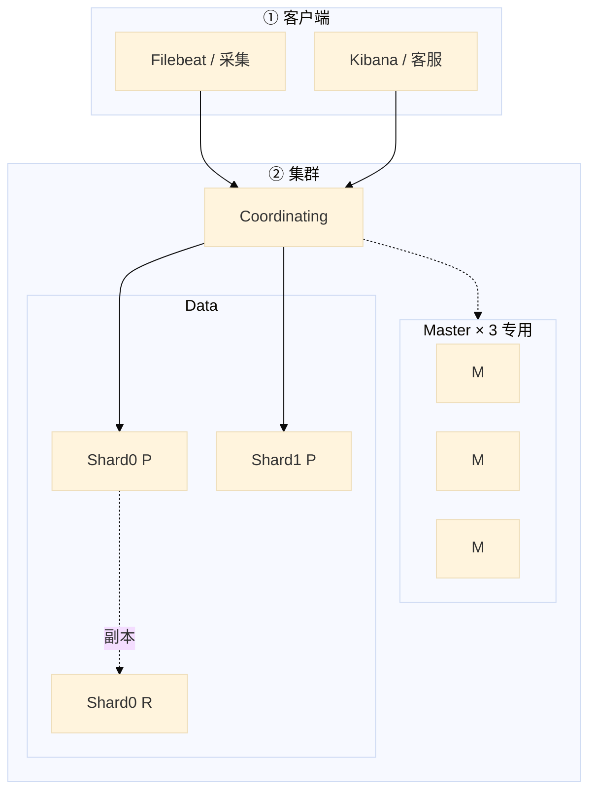
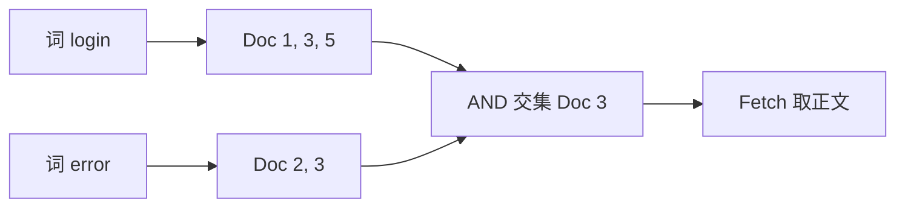
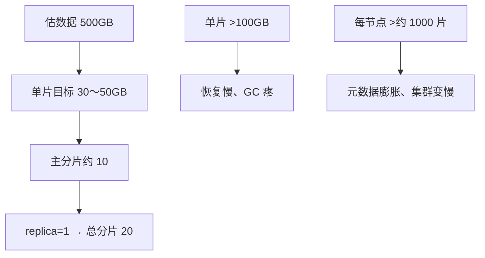
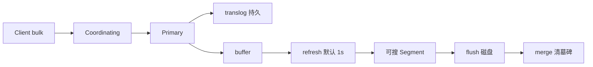
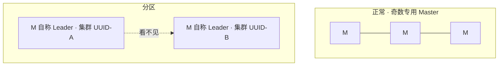
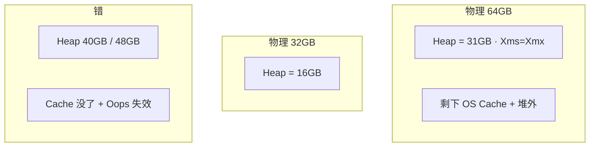
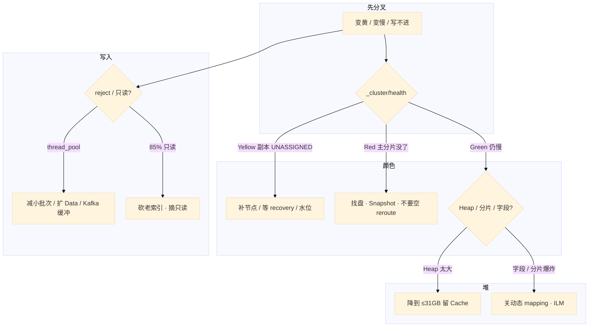

# Elasticsearch


活动高峰，Kibana 顶栏从绿变黄。客服说「搜玩家 10001 还能出结果，就是慢」。群里有人要把 Data 节点 Heap 加到 40GB，另有人要重启 es-data-2「变绿」——你 `df -h` 一眼看到 `/var/lib/elasticsearch` **87%**，Filebeat 还在往集群 bulk，日志里刷 `flood stage`。

先别动手。这一章后半全是你会动手的：**怎么看黄红、怎么救磁盘水位、怎么 ILM、怎么 snapshot。** 前面的概念和原理，是为了让你动手时不选错路。

**本章主线（排障就按这三步想）：**

1. **分层**：Coordinating → Primary Shard → Segment；Master 管元数据，Data 存倒排。
2. **归类**：黄/红 → 先问能不能搜全；慢 → Heap/分片/字段；写不进 → 水位/reject。
3. **留证**：`_cluster/health` + `_cat/shards` + `allocation/explain`，黄了别先重启 Data。

**读完你能：** 白板上画出倒排和分片；Yellow / Red 能判断能不能搜全；Heap 不超过 31GB；会 ILM、水位摘只读、Snapshot；能区分日志检索和业务检索，以及 ES / Loki / CH。

## 本章目录

- [1. 基本概念](#1-基本概念)
- [2. 架构图](#2-架构图)
- [3. 原理](#3-原理)
  - [3.1 倒排](#31-倒排词查文档不是扫日志)
  - [3.2 分片与副本](#32-分片与副本大小主分片改不了)
  - [3.3 一次写入](#33-一次写入refresh-后才可搜)
  - [3.4 脑裂](#34-脑裂两个-master-各写各的)
  - [3.5 GC 与堆](#35-gc-与堆为什么不能-40gb)
  - [3.6 日志检索 vs 业务检索](#36-日志检索-vs-业务检索)
- [4. 落地](#4-落地)
  - [4.1 生产怎么选](#41-生产怎么选)
  - [4.2 落地你实际看到什么](#42-落地你实际看到什么)
- [5. 核心配置](#5-核心配置)
- [6. 命令与操作](#6-命令与操作)
  - [6.1 ILM](#61-ilm)
  - [6.2 Snapshot](#62-snapshot)
  - [6.3 Yellow / Red](#63-yellow--red)
  - [6.4 磁盘水位](#64-磁盘水位摘只读)
- [7. 生产排障](#7-生产排障)
- [8. 必会 · 常考](#8-必会--常考)
- [合上书](#合上书问自己)

**本章不讲：** 采集、EFK vs Loki 架构 → [03-20 日志](../../03-Kubernetes/20-日志管理/)；消息管道、积压 → [03 Kafka](../03-Kafka/)；文档库、TTL 邮件 → [05 MongoDB](../05-MongoDB/)；列存 SQL 细节不单开，选型见 3.6。

---

## 1. 基本概念

ES 是基于 Lucene 的分布式搜索和分析引擎。快，是因为 **倒排索引**（词 → 文档列表）加上 **分片并行**。它不是通用数据库：写入近实时、堆贵、磁盘水位狠，适合搜，不适合当账本。

**值班里什么时候碰到**：客服搜「玩家 10001 登录失败」、活动灌日志 bulk reject、Kibana 顶栏变黄/变红、磁盘 85% 索引只读——都是这一章的事。

| 在 ES 里 | 不在 ES 里 |
|----------|------------|
| 倒排、分片、副本、Segment | 玩家钱包、发货账本（01 MySQL） |
| 全文、多条件筛选、客服按关键词 | 超大范围 group by（ClickHouse） |
| 近实时可搜（refresh 后） | 实时（默认 1s 间隔） |

RDBMS 对照：Index ≈ 表，Document ≈ 行，Field ≈ 列，Mapping ≈ schema，Shard ≈ 分区，Replica ≈ 从副本。7.x 后一 Index 一表更干净。

三个角色不要混：

| 角色 | 干什么 | 值班里怎么认 |
|------|--------|--------------|
| **Master** | 元数据、分片分配 | `_cat/nodes` 里 `m`；生产 **3 台专用**，不存业务数据 |
| **Data** | 存数据、建倒排、查 | `d`；GC 疼、磁盘水位都在这里 |
| **Coordinating** | 收请求、散到各分片、汇总 | 大集群可独立；小集群 Data 兼任 |

**打个比方**：Master 像馆长管书架编号；Data 是分馆书架；Coordinating 是前台汇总。

> **记住**：倒排是词查文档，不是扫日志。ES 不当 MySQL 存玩家档。用 ES 当源数据是选型错误。

---

## 2. 架构图

先把整张图钉住。后面安装、命令、排障都对着这张图说话。



**读图三句话：**

1. **写入打 Primary**，再复制到 Replica；搜可以打副本——排障时先看 Primary 在不在。
2. **Master 不存业务数据**；Data Full GC 会拖集群状态——所以 Master 专用，从 Data 节点查起。
3. **Index → Shard → Segment**（Lucene 不可变文件）；Yellow/Red 看的是 Shard 分配，不是 Index 名字。

三种检索不要混（装的时候选索引设计，挂的时候成本不一样）：


采集侧应有 Kafka 缓冲（05），ES 拒写时日志还在队列里，否则丢的是检索不是管道。CH 不单开章。

---

## 3. 原理

原理只保留动手和面试会用到的：为什么快、片怎么规划、为什么不是实时、两个 Master 为什么危险、堆为什么不能 40GB、日志和业务检索为什么不要一个 Index。

**本节 6 块：** 3.1 倒排 · 3.2 分片副本 · 3.3 写入 · 3.4 脑裂 · 3.5 GC · 3.6 日志 vs 业务

### 3.1 倒排：词查文档，不是扫日志

**一句话：** 倒排是词 → 文档 ID 列表；Query 拿 ID，Fetch 拿正文——不是逐条扫日志。

**打个比方**：像字典的「词目 → 页码列表」。查「login AND error」= 两个页码列表取交集，再去对应页拿正文；不是把整本日志从头到尾读一遍。

**现场走一遍**（客服搜玩家登录失败）：

1. 客服在 Kibana 输入 `player_id:10001 AND message:login AND message:error`，请求打到 Coordinating 节点。
2. Coordinating 把查询散到 `player-ops-*` 的各 Primary/Replica Shard 并行查倒排表。
3. 各分片返回匹配的 Doc ID + 相关分数；Coordinating 汇总排序，取 TopN 的 ID。
4. **Fetch 阶段**：再按 ID 回各分片取 `message` 等字段正文，拼成最终结果返回客服界面。
5. 若没设 `routing=player_id`，每次查询 scatter 全部分片——活动高峰就会「能搜到，但慢」。



**输出解读**（`_search` 的 `took` 和 `hits`）：

```json
{
  "took": 842,
  "hits": { "total": { "value": 37 }, "hits": [ { "_id": "abc", "_score": 4.2 } ] }
}
```

| 字段 | 含义 | 高了说明什么 |
|------|------|--------------|
| `took` | 协调节点视角总耗时 ms | scatter 分片太多、段太多、没 routing |
| `hits.total` | 匹配文档数 | 正常业务量；亿级说明条件太宽 |
| `_score` | 相关度 | 全文检索才有；filter 不算分 |

倒排由 **词典（term dictionary）+ 倒排表（posting list）** 组成。分词器把正文切成 term：`text` 会分词，`keyword` 整值不分词。过滤、聚合、routing 用 keyword；全文用 text。

**面试怎么说**：「ES 快是因为倒排——词查文档 ID，Query 阶段各分片并行报 ID，Fetch 再取正文；不是扫全表。客服按 player_id 我会加 routing，避免每次打全部分片。」

> **记住**：Query 拿 ID，Fetch 拿正文；`player_id` 用 keyword + routing，正文用 text。

### 3.2 分片与副本：大小、主分片改不了

**一句话：** 主分片数创建后不能改；单片目标 30～50GB，日志靠 ILM rollover 防分片爆炸。

**打个比方**：主分片像建楼时的承重墙——楼建好了不能改墙数，只能 reindex 搬家；副本像备份书架，随时可加，但得有空房间（节点）放。

**现场走一遍**（新集群规划 500GB 游戏日志）：

1. 估数据量：当前 500GB，日增 20GB，保留 30 天。
2. 算主分片：`500GB ÷ 40GB/片 ≈ 12`，取 **10～12 个主分片**。
3. 设 `number_of_replicas: 1` → 总分片 20～24，均摊到 Data 节点。
4. 创建 Index 时写死 `"number_of_shards": 10`——**之后不能改**，只能 reindex 到新 Index。
5. 日志 Index 绑 ILM：rollover **1 天或 50GB** 切新 Index，30 天后 Delete——不要手建无限 `logs-yyyy.MM.dd` 还不删。



**输出解读**（`_cat/shards?v` 关键列）：

```text
index          shard prirep state    docs   store ip         node
logs-2026.08   0     p      STARTED  12.3m  42.1gb 10.0.2.11 es-data-1
logs-2026.08   0     r      STARTED  12.3m  42.1gb 10.0.2.12 es-data-2
logs-2026.08   1     p      UNASSIGNED
```

| 列 | 正常 | 异常 |
|----|------|------|
| `prirep` | `p` 主分片、`r` 副本 | `UNASSIGNED` → 看颜色 |
| `store` | 30～50GB/片 | >100GB → 恢复/GC 疼 |
| `state` | STARTED | UNASSIGNED / INITIALIZING 过久 |

文档落片：`hash(routing) % 主分片数`（默认 `_id`，业务用 `player_id`）。replica ≥ 1 跨 AZ；配置了 replica=1 **不等于已有副本**——Yellow 拖很久 = 无冗余。单节点一直黄是拓扑不是故障。

**面试怎么说**：「主分片数创建时定死，要改只能 reindex。我按 30～50GB/片估，日志用 ILM rollover 按天或 50GB 切，避免三个月后 Master 被分片数拖死。」

> **记住**：单片 30～50GB；主分片数创建后不能改；日志靠 ILM 防分片爆炸。

### 3.3 一次写入：refresh 后才可搜

**一句话：** bulk 先进 buffer + translog，**refresh 默认 1s** 后才成 Segment 可搜——近实时，不是实时。

**打个比方**：像报社排版——记者稿子先放编辑台（buffer），印厂开机（refresh）才上报纸（可搜）；删稿只是划掉（墓碑），旧版报纸要回收合并（merge）才腾地方。

**现场走一遍**（活动灌日志，bulk 返回 200 但搜不到）：

1. Filebeat 把一批登录日志 bulk 到 Coordinating → 路由到各 Primary Shard。
2. Primary 写 translog（崩溃可恢复）+ 内存 buffer。
3. **默认 1s 后 refresh**：buffer 刷成新 Segment，此时才可搜。
4. 你在 Kibana 立刻搜「刚写入的那条 trace_id」——**没有**，正常；等 1～2s 再搜就有了。
5. 若 bulk 返回 `429` 或日志里 `rejected execution` → 线程池满，这批**没进 ES**，采集侧要重试或 Kafka 缓冲。



**输出解读**（bulk 响应）：

```json
{ "errors": false, "items": [ { "index": { "status": 201, "_id": "x1", "result": "created" } } ] }
```

| 字段 | 正常 | 异常 |
|------|------|------|
| `errors: false` | 整批成功 | `true` → 逐条看 status |
| `status: 201` | 新建成功 | `429` reject；`403` 只读（85% 水位） |
| 立刻搜不到 | 等 refresh | 不是写入失败 |

写入优化（活动灌日志）：Bulk 单批 **5～15MB**、调大 refresh、临时 replica=0（有窗口风险）。删文档磁盘不掉 = 墓碑等 merge；热 Index 别 forcemerge。

**面试怎么说**：「写入近实时：bulk 成功不等于立刻可搜，要等 refresh 默认 1s。reject 是线程池满，这批没进 ES，前面要有 Kafka 缓冲；我不会关 translog 换吞吐。」

### 3.4 脑裂：两个 Master 各写各的

**一句话：** 网络分区后两个 Master-eligible 都当选 → 两套集群 UUID、两套数据，**不能自动合并**。

**打个比方**：两个馆长各发一套书架编号，读者借的书还到了不同分馆——合并书架编号会把书放错架，只能保住数据多的那一套，另一套清空重来。

**现场走一遍**（凌晨告警 Master 选主抖动）：

1. `GET _cluster/health` 时好时坏；`_cat/nodes` 看到部分节点 `master` 角色在抢。
2. 分别 curl 不同 Master 节点：`GET /` 看 **`cluster_uuid`**——若两个 UUID，已经裂成两团。
3. **不要尝试合并**。确认哪一团有完整业务数据（Index 文档数、最新时间戳）。
4. 保住有数据的一团；另一团节点 **停 ES → 清空 `path.data` → 以新节点加入** 正确集群。
5. 不要用 reroute 把空主分片「分配」到新节点当修复成功——那是空数据。



**输出解读**（`GET /` 根路径）：

```json
{ "cluster_name": "game-es", "cluster_uuid": "abc123...", "version": { "number": "7.17.9" } }
```

| 现象 | 说明 | 下一步 |
|------|------|--------|
| 所有节点同一 `cluster_uuid` | 正常单集群 | 查别的原因 |
| 两批节点各一个 UUID | 已脑裂 | 保一团、清另一团 |
| `master` 频繁切换 | Data GC 拖 Master 或网络 | Master 专用 + 查 GC |

怎么防：Master **3 台专用奇数**（4 台没收益）；`initial_master_nodes` **仅首次 bootstrap**（7.x+ 日常用 `discovery.seed_hosts`；6.x 用 `minimum_master_nodes=N/2+1`）；Master 不与 Data 混。

**面试怎么说**：「防脑裂：Master 三台专用奇数，initial_master_nodes 只首次 bootstrap。已经两团 UUID 不合并，保数据团、清空另一团重新加入。」

### 3.5 GC 与堆：为什么不能 40GB

**一句话：** 64GB 机器 Heap **31GB 封顶**——超过 31GB 压缩指针失效，且 Lucene 靠 OS Page Cache 读 Segment，Heap 太大 Cache 没了更慢。

**打个比方**：堆像工作台，Page Cache 像旁边的大仓库货架。工作台扩到占满整个房间（40GB Heap），货只能每次从远处搬（读磁盘），反而比 31GB 工作台 + 大仓库更慢。

**现场走一遍**（查询变慢，有人提议 Heap 40GB）：

1. 先看 `_cat/nodes?v&h=heap.percent,ram.percent,node.role,name`：

```text
heap.percent ram.percent node.role name
           92          78 d         es-data-1
           88          75 d         es-data-2
```

2. `heap.percent` 持续 >85%，GC 日志里 long pause —— 但 **别直接加到 40GB**。
3. 查根因：`_cat/indices?v` 字段数爆炸？`_cat/shards` 分片过多？大聚合？
4. 64GB 物理机正确姿势：`-Xms31g -Xmx31g`，**剩下 ~33GB 给 OS Cache** mmap 读 Segment。
5. 若加到 40GB：Cache 只剩 24GB，查询变磁盘 IO；且 **Compressed Oops 失效**，指针 8 字节，同样对象占更多堆，GC 扫描更重。



**输出解读**（GC 疼常见来源）：

| 现象 | 根因 | 修法 |
|------|------|------|
| fielddata 膨胀 | 对 text 做聚合 | 改 keyword；限 circuit breaker |
| 段太多 | 热 Index 不 merge | 温数据低峰 forcemerge |
| 动态 mapping 字段爆炸 | 活动 JSON 新 key | 关动态 mapping |
| 分片过多 | 按天 Index 不 ILM | ILM rollover + Delete |

铁律：Heap **不超过物理内存一半**，**不超过 31GB**。`Xms=Xmx`。7.x+ 用 G1。

**面试怎么说**：「64GB 机器我给 31GB Heap 不是 48GB——Lucene 靠 Page Cache 读段，Heap 过大 Cache 没了；超过 31GB 压缩指针失效 GC 更差。慢先查分片和字段爆炸，不加 Heap 掩盖。」

> **记住**：64GB 机器 Heap 31GB，不是 48GB「显得大方」。超过 31GB 指针变 8 字节，同样数据占更多堆，GC 扫描更重。

### 3.6 日志检索 vs 业务检索

**一句话：** 都用倒排，但 **Index 设计、ILM、routing、能不能丢** 完全两套——不要一个大 Index 扛所有。

**打个比方**：日志像每日报纸——印完看几天就扔（ILM Delete）；业务检索像图书馆借阅卡——映射要严、按 player_id 分区（routing），丢了是客服事故。

**现场走一遍**（活动 JSON 灌进客服 Index，集群变慢）：

1. 开发把活动埋点也写进 `player-ops` Index，字段 `event.extra_*` 每天出新 key。
2. 动态 mapping 自动建新字段 → 集群状态膨胀，Master 分配变慢，`_cluster/health` 变黄。
3. 正确做法：**日志** 单独 Index 模板，`dynamic: strict` 或白名单；`message` text + `@timestamp` + 少量 keyword。
4. **业务检索** Index：`player_id` keyword + **routing=player_id**，正文 text，**关动态 mapping**；源数据仍在 MySQL。
5. 漏斗报表去 ClickHouse，不要逼 ES 做亿级 group by。

| | 日志检索 | 业务检索 |
|--|----------|----------|
| 典型 | 登录失败原文、异常堆栈 | 客服按 `player_id` 搜操作、聊天 |
| 写入 | 极高；reject 可重试 | 中等；映射要严，丢了是事故 |
| Mapping | 动态关/白名单 | keyword + routing；关动态 |
| 生命周期 | ILM：1 天或 50GB rollover，7～30 天删 | 更长；常要 reindex 改 mapping |
| 查询 | 时间范围 + 关键词 | **必须 routing** |
| 可以换成 | 只按 label 捞 → Loki | 不能换 Loki；漏斗 → CH |

| | Elasticsearch | Loki | ClickHouse |
|--|---------------|------|------------|
| 擅长 | 全文搜、多条件筛选 | 按 label 捞日志 | OLAP 聚合 |
| 索引 | 正文倒排 | 只索引 label | 列存 |
| 成本 | 堆 + 盘都贵 | 低 | 中 |
| 不擅长 | 超大范围 group by | 内容全文、复杂检索 | 全文搜 |

```
  「搜这段报错原文 / 玩家聊天 / 客服按关键词」 --> ES
  「按 namespace、level、pod 拉一段时间日志」   --> Loki（K8s 19）
  「留存、付费漏斗、亿级 group by」             --> ClickHouse
  管道、削峰、重放                               --> Kafka（05）
```

**面试怎么说**：「日志和业务分 Index：日志 ILM rollover 7～30 天删；业务 player_id routing + 严 mapping。全文客服用 ES，按 label 捞用 Loki，漏斗用 CH。」

> **别混**：Mongo 适合按 `player_id` 拉文档；要全文多条件高并发用 ES。邮件过期用 Mongo TTL（06），不要靠 ES 当源数据。

---

## 4. 落地

### 4.1 生产怎么选

| 项 | 选 | 不选 |
|----|----|------|
| Master | 3 专用，奇数 | 4 台；和 Data 混部 |
| 副本 | replica ≥ 1，跨 AZ | 单节点还开副本却怪一直黄 |
| 磁盘 | 独立 SSD；盯水位 | 和游戏日志 / 容器盘混用到 85% |
| 堆 | ≤ 一半内存且 ≤31GB，Xms=Xmx | 40GB Heap |
| 检索 | 日志一套 ILM Index；业务一套严 mapping | 一个集群一个 Index 扛所有 |
| 缓冲 | 前面 Kafka | Filebeat 直打 ES 还当不丢 |

云上 Data 跨 AZ，避免主副同一机架。定期 Snapshot 到 OSS/S3。

### 4.2 落地你实际看到什么

角色在 `elasticsearch.yml`：`node.roles: [master]` 或 `[data]`。发现：`discovery.seed_hosts`；**仅首次** `cluster.initial_master_nodes`。数据目录 `path.data` 是数据。HTTP **9200**，节点间 **9300**。

```yaml
cluster.name: game-es
node.name: es-master-1
node.roles: [ master ]
network.host: 10.0.1.11
http.port: 9200
discovery.seed_hosts: ["10.0.1.11", "10.0.1.12", "10.0.1.13"]
cluster.initial_master_nodes: ["es-master-1", "es-master-2", "es-master-3"]
path.data: /var/lib/elasticsearch
bootstrap.memory_lock: true
```

`initial_master_nodes` 只在空白集群第一次用。已经组过群再写，可能当成新集群，诱发脑裂。Heap 在 `jvm.options`：`-Xms31g -Xmx31g`。

验收：`GET _cluster/health` 为 green（或单节点预期 yellow）；`_cat/nodes` 角色对；不要只探 TCP 9200。

---

## 5. 核心配置

只动有证据的项。改主分片数不等于改配置——要 reindex。

| 参数 | 生产怎么用 | 改错会怎样 |
|------|------------|------------|
| 主分片数 | 按 30～50GB/片估，创建时定死 | 过多元数据爆炸；过少恢复/GC 疼 |
| `number_of_replicas` | ≥1，可动态改 | 单节点一直黄是拓扑 |
| `refresh_interval` | 默认 1s；灌日志可 30s | 当实时；或关 translog 换吞吐 |
| 磁盘水位 | 80% 告警；85% 只读 | 当成采集挂了去重启 Filebeat |
| Heap | ≤50% 且 ≤31GB | Cache 没了 / Oops 失效 |
| 动态 mapping | 关或白名单 | 字段爆炸打满集群状态 |
| `cluster.initial_master_nodes` | 仅首次 bootstrap | 每次启动当新集群 → 脑裂风险 |

> **记住**：清完盘必须手动摘 `read_only_allow_delete`。quota 式的磁盘水位是硬的，不是「再写一点」。

---

## 6. 命令与操作

值班先问**能不能搜全**，再动手。

```bash
GET _cluster/health          # status, unassigned_shards
GET _cat/nodes?v
GET _cat/shards?v            # 哪片 UNASSIGNED
GET _cat/indices?v
GET _cluster/allocation/explain
GET _cat/recovery?v
GET _cat/allocation?v        # 磁盘
GET _cat/thread_pool?v       # reject
```

| 命令 | 什么时候用 | 正常 | 异常 |
|------|------------|------|------|
| `_cluster/health` | 第一眼 | green / 单节点 yellow | red；unassigned > 0 |
| `_cat/shards` | 找 UNASSIGNED | 全 STARTED | p UNASSIGNED → red |
| `allocation/explain` | 片分不出去 | — | 磁盘水位、节点不够 |
| `_cat/allocation` | 磁盘 | 小于 80% | ≥85% flood stage |
| `_cat/thread_pool` | bulk reject | rejected=0 | write/bulk rejected > 0 |

**health 解读**：Yellow = 主分片全在、副本缺 → **能搜全**；Red = 主分片缺失 → **搜不全**。`unassigned_shards` 配合 `_cat/shards` 看是 `p` 还是 `r`。

指标：**Red P0**；磁盘 **80/85/95%**；bulk reject / Heap GC / 字段分片爆炸 **P1**。日志：`flood stage`=水位；`rejected execution`=线程池；`failed to ping`=网络或 GC。

---

### 6.1 ILM

日志必须 ILM：Hot 写 → Warm forcemerge → Cold 便宜盘 → Delete。游戏行为日志 **7～30 天**全文，更老的要么归档对象存储，要么根本不进 ES。

```
  Hot    正在写、正在搜     rollover：1 天或 50GB
  Warm   只读、合并段       forcemerge 到少量 Segment
  Cold   便宜盘 / 少副本    很少查
  Delete 到期删             不要手留一年日索引
```

按天 Index 不 ILM，三个月后 Master 被分片数拖死。

### 6.2 Snapshot

Snapshot 到 OSS/S3。Red 且主分片回不来才 restore。快照不是 WAL，**RPO 看快照间隔**。不要用 reroute 空主当分片修复。

### 6.3 Yellow / Red

集群颜色是运维第一句。先问能不能搜全，**不要先重启 Data 节点**。

| 颜色 | 含义 | 现场 |
|------|------|------|
| Green | 主分片+副本都在 | 正常 |
| Yellow | 主分片全在，副本缺 | **能搜全，冗余不够** |
| Red | 有主分片没了 | **数据不完整，紧急** |

Yellow：主分片全在、副本 UNASSIGNED → **能搜全**；补节点/等 recovery/查水位。**别重启 Data**——可能黄变红。

Red：有 **p UNASSIGNED** → 搜不全；`allocation/explain` 找原因 → 修盘拉回 / Snapshot restore。**空 reroute 是假修复**。

预防：replica≥1 跨 AZ；Red 仍可能是副本从未同步完或 awareness 规则过严。

### 6.4 磁盘水位：摘只读

水位是硬的：大约 **85% 只读**（`read_only_allow_delete`），**95% 禁写**。不是「再写一点」，是集群开始拒写、分片分不出去，Yellow/Red 一起出现。采集还在跑，业务以为 Filebeat 挂了。

**现场走一遍**（磁盘 87%，bulk 403）：

1. `_cat/allocation?v` → 某 Data 节点 `disk.percent` **87**。
2. `_cat/indices?v` → 热 Index 带 `r`（read_only_allow_delete）。
3. bulk 返回 `403` / 日志 `flood stage` —— **不是 Filebeat 坏了，是 ES 拒写**。
4. 删 **ILM 该过期的老 Index**（不是当天热 Index），或扩盘、温数据 forcemerge 腾空间。
5. 盘降到 80% 以下后摘只读：`PUT idx/_settings {"index.blocks.read_only_allow_delete": null}`。不摘只读，盘空了也写不进；别删当天热 Index。

---

## 7. 生产排障

和基础底座同一套三问：进程还在不在？**还能不能搜全？** 写入还进不进得去？

**Yellow ≠ 挂了。** 黄了别重启 Data。



现场顺序：`health` → `shards` → `allocation/explain` → `allocation` 磁盘 → `thread_pool`。

| 现象 | 先做什么 | 不要做什么 |
|------|----------|------------|
| Yellow | 能搜全；补副本、等 recovery | 重启 Data 黄变红 |
| Red | 找主分片在哪台盘 | 空 reroute；当采集故障 |
| 查询慢就加 Heap | 给 OS Cache；查分片/字段 | 加到 40GB |
| 磁盘 85% 只读 | 砍 ILM 老索引，摘只读 | 重启 Filebeat；删当天热索引 |
| bulk reject | Kafka 缓冲、减小批次 | 关 translog |
| 两个集群 UUID | 保有数据的一团 | 强行合并 |
| 用 ES 扛全服付费 group by | 去 CH | 加 Data 节点硬扛 |

误判：① 查询慢就加 Heap ② Yellow 重启节点 ③ 磁盘只读当成采集故障 ④ 按天索引不 ILM ⑤ 用 ES 当 MySQL ⑥ 动态 mapping 无限字段。

---

## 8. 必会 · 常考

白板和追问高频，能一口回：

| 说法 | 对错 | 口径 |
|------|:----:|------|
| ES 快是因为扫文档很快 | 错 | 倒排：词 → 文档；Query 再 Fetch |
| 主分片数可以随时改 | 错 | 创建后不能改，要 reindex |
| Yellow 不能搜、要重启 Data | 错 | 能搜全；重启可能黄变红 |
| Heap 越大越好，64GB 机器给 48GB | 错 | ≤一半且 ≤31GB，留给 Page Cache |
| 超过 31GB 只是「没用完压缩指针」 | 错 | 指针 8 字节，GC 更差 |
| 4 台 Master 比 3 台更能抗 2 台故障 | 错 | 偶数没收益；专用 3 台 |
| 已经组群每次都写 initial_master_nodes | 错 | 仅首次；否则脑裂风险 |
| 关 translog 换写入吞吐可以 | 错 | 崩溃丢数据 |
| 磁盘 85% 还能再写一点 | 错 | 只读；清完要手动摘 |
| 日志和客服检索可以一个大 Index | 错 | ILM vs 严 mapping + routing |
| 用 ES 当玩家档 / 当 MySQL | 错 | 源数据在 01/06 |
| Loki 能替 ES 做全文客服检索 | 错 | Loki 只索引 label |
| 用 ES 做亿级 group by | 错 | ClickHouse |
| replica=1 配置等于已经有副本 | 错 | Yellow 拖很久 = 没有冗余 |
| reject 了数据一定在 ES 里 | 错 | 这批没进；靠 Kafka 重试 |

数字：单片 **30～50GB**；>100GB 疼；每节点别堆过约 **1000** 片；refresh **1s**；Bulk **5～15MB**；Heap **31GB** 红线；磁盘 **80 / 85 / 95%**；Master **3**；行为日志 **7～30 天**；rollover **1 天或 50GB**。

易混：Yellow vs Red；compact 式 merge vs forcemerge 时机；Heap vs Page Cache；日志 Index vs 业务 Index；ES vs Loki vs CH；脑裂 vs 普通 Master 丢 1；主分片不可改 vs 副本可改。

---

## 合上书，问自己

- [ ] 倒排是什么？Query / Fetch 两阶段？为什么不是实时？
- [ ] 500GB 怎么估主分片？主分片数能改吗？routing 干什么？
- [ ] Heap 两条铁律？为什么不能 40GB？Master 为什么专用且奇数？
- [ ] Yellow / Red 能不能搜全？黄了为什么别重启 Data？
- [ ] 85% 只读怎么恢复？ILM 四阶段？Snapshot 的 RPO？
- [ ] 日志检索和业务检索 Index 怎么分开？什么时候用 Loki / CH？脑裂已经发生怎么办？

六题都能口述，这一章就过了。中间件与数据库模块到此收口：账本在 MySQL，缓存在 Redis，管道在 Kafka，文档在 Mongo，打散在分片，发现在注册中心，检索在 ES。
