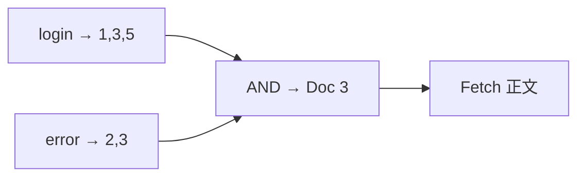
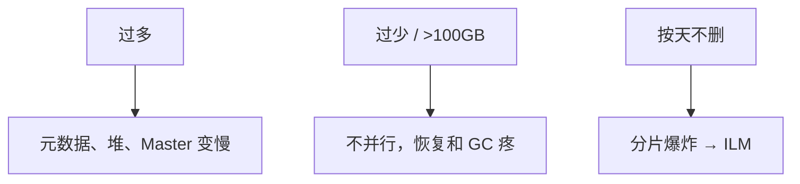
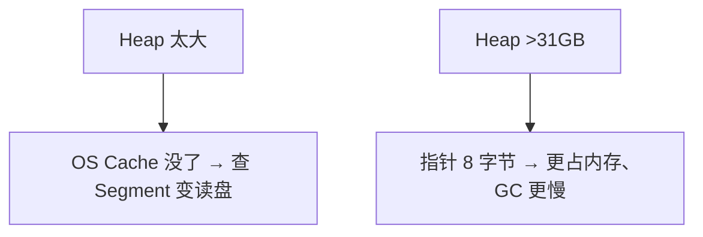
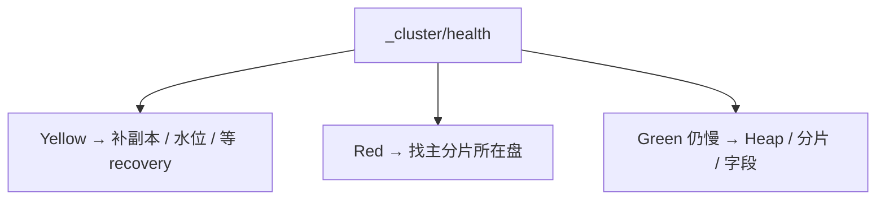
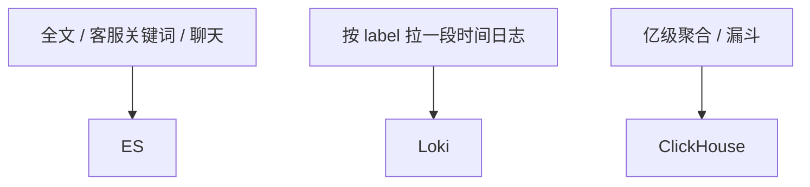
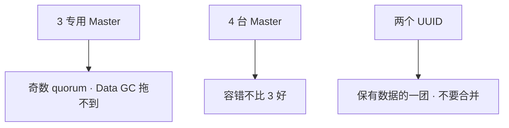
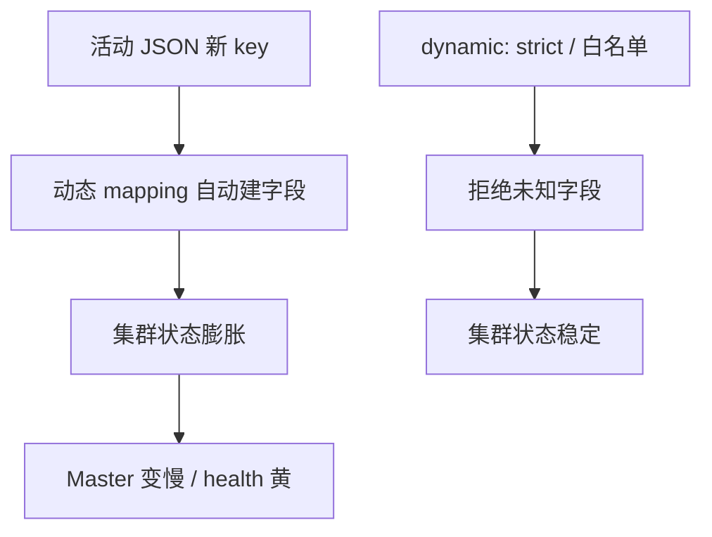

# 04｜Elasticsearch · 练习题

先对照 [知识点](知识点.md) **本章主线** 自己口述，再对答案。每题标了覆盖范围：

| 标记 | 含义 |
|------|------|
| **核心** | 不懂整章就没建立起来 |
| **必会** | 值班和面试都要能讲 |
| **常用** | 线上会反复碰到 |
| **常考** | 白板和追问的高频口径 |

## 本题目录

- [Q1 倒排与查询两阶段](#q1)
- [Q2 分片与副本](#q2)
- [Q3 Heap / GC](#q3)
- [Q4 Yellow / Red](#q4)
- [Q5 日志检索 vs 业务检索](#q5)
- [Q6 Master 奇数、脑裂](#q6)
- [Q7 写入 Bulk](#q7)
- [Q8 磁盘水位](#q8)
- [Q9 Red 与 Snapshot](#q9)
- [Q10 ILM 四阶段](#q10)
- [Q11 mapping 与动态字段](#q11)
- [Q12 主分片数怎么估、能改吗](#q12)
- [Q13 search slow 与 fetch 阶段](#q13)
- [Q14 ES 集群 60 秒定责](#q14)
- [合上书](#合上书)

---

## Q1

**★★★★★｜ES 为什么快？倒排索引和查询两阶段是什么？**

**覆盖**：核心 · 必会 · 常考
**对应**：知识点 [3.1 倒排：词查文档，不是扫日志](知识点.md)

### 场景

白板：「你们日志怎么搜的？」有人开始背集群安装步骤。

### 完整解答

**一句话**：倒排是词→文档列表；Query 各分片报 ID+分数，Fetch 取正文；refresh 后才可搜所以近实时。

基于 Lucene。倒排是词 → 文档列表，不是从文档里扫词。分片并行查。写入先进 buffer，refresh（默认 1s）后新 Segment 才可搜，所以是近实时。



Query：各分片报 ID+分数，汇总 TopN。Fetch：按 ID 取文档。Segment 不可变，删除是墓碑，靠 merge 清空间。`text` 分词，`keyword` 整值过滤。

### 再追问

- 为什么不是实时？——refresh 有间隔。手动 refresh 能立刻搜，写吞吐会掉。灌活动日志可把 refresh 调到 30s。
- player_id 用 text 还是 keyword？——过滤、routing 用 keyword；正文用 text。

---

## Q2

**★★★★★｜分片怎么规划？主分片数能改吗？副本呢？**

**覆盖**：核心 · 必会 · 常考
**对应**：知识点 [3.2 分片与副本：大小、主分片改不了](知识点.md)

### 场景

500GB 日志，有人建了 100 个主分片「为了快」。Master CPU 很高，查询没快。客服按 `player_id` 查也是全集群扫。

### 完整解答

**一句话**：按单片 30～50GB 估主分片，主分片创建后不能改；routing=player_id 让同玩家落一片。

按 **单片 30～50GB** 估。500GB → 大约 10 个主分片，replica=1 → 总分片 20。主分片创建后不能改，要 reindex。副本可动态改。



routing 默认 `_id`，可改 `player_id` 让同一玩家在一片。每节点分片别堆到上千。配置 replica=1 不等于已经有副本；Yellow 拖很久 = 没有冗余。

### 再追问

- 日志分片怎么管理？——ILM：rollover（1 天或 50GB）→ warm forcemerge → cold → delete。
- 单节点一直黄？——没地方放副本，是拓扑不是故障。

---

## Q3

**★★★★★｜JVM Heap 怎么分？为什么不能把内存全给堆？**

**覆盖**：核心 · 必会 · 常用
**对应**：知识点 [3.5 GC 与堆：为什么不能 40GB](知识点.md)

### 场景

64GB 机器 Heap 设了 48GB。查询变慢，GC 时间变长。有人说再加大堆到 40GB「显得大方」。

### 完整解答

**一句话**：Heap 不超过物理内存 50% 且不超过 31GB；再大 OS Page Cache 没了查 Segment 变读盘。

两条铁律：Heap **不超过物理内存 50%**（留给 Lucene 的 Page Cache mmap），**不超过 31GB**（再大压缩指针失效）。64GB 机器 Heap 31GB，Xms=Xmx。32GB 机器 16GB。7.x+ 用 G1。



Full GC：fielddata 过大、段过多、字段爆炸。限 cache、breaker，低峰 forcemerge。不要用加 Heap 掩盖分片爆炸。Data 混 Master 时 Full GC 会拖选主。

### 再追问

- 超过 31GB 为什么更慢？——Compressed Oops 失效，对象指针从 4 字节变 8 字节，同样数据占更多堆，GC 扫描更重。
- forcemerge 随时跑？——只对只读/温数据、低峰。热 Index 上抢 IO。

---

## Q4

**★★★★★｜集群 Yellow / Red 怎么排？Yellow 能不能搜？**

**覆盖**：核心 · 必会 · 常用
**对应**：知识点 [6.3 Yellow / Red](知识点.md)

### 场景

健康值 Yellow。有人重启了一台 Data。随后变 Red，部分日志搜不到。

### 完整解答

**一句话**：Yellow 主分片都在能搜全只是缺副本；Red 有主分片没了数据缺，黄了别乱重启 Data。

Yellow = 主分片都在，**能搜全**，只是缺副本。Red = 有主分片没了，**数据缺**。不要为了「变绿」乱重启。



现场：`health` → `shards` → `allocation/explain` → `recovery` → `allocation`。单节点集群没有地方放副本，会一直黄。

### 再追问

- 磁盘满了会怎样？——约 85% 只读，95% 更狠。采集还在推，ES 拒写。先别重启 Filebeat。
- 黄了重启 Data 为什么会红？——可能把还在的主分片打掉。

---

## Q5

**★★★★☆｜日志检索和业务检索怎么分开？ES / Loki / CH 怎么选？**

**覆盖**：必会 · 常用 · 常考
**对应**：知识点 [3.6 日志检索 vs 业务检索](知识点.md)

### 场景

领导想「日志、检索、留存报表一个集群搞定」。所有日志一个大 Index，`message` 当 text，按 `player_id` 查也是全集群扫，动态 mapping 出一堆新 key。账单已经很难看。

### 完整解答

**一句话**：日志 Index 用 ILM 高写入；业务检索 player_id keyword+routing，不要混一个大 Index。



日志 Index：ILM、高写入、可 Kafka 缓冲、时间范围查询。业务检索：`player_id` keyword + **routing**、关动态 mapping、源数据仍在 MySQL/Mongo。不要混在一个大 Index。Loki 不索引正文。CH 列存聚合快，不当全文引擎。可以并存。CH 不单开章。

### 再追问

- 游戏生产怎么拆？——应用日志 Loki；需要搜内容的行为/客服 ES；运营报表 CH。
- 和 Mongo 里搜邮件有什么差别？——Mongo 按 player_id 拉文档；全文高并发用 ES。邮件过期用 Mongo TTL（06）。

---

## Q6

**★★★★☆｜集群怎么做高可用？Master 为什么要奇数且专用？脑裂怎么办？**

**覆盖**：必会 · 常用 · 常考
**对应**：知识点 [3.4 脑裂：两个 Master 各写各的](知识点.md)、[2. 架构图](知识点.md)

### 场景

三台机器每台都是 Master+Data。一次 Full GC，选主抖动，分配分片卡住。另有人上 4 台 Master「更稳」。已经出现两个 cluster UUID。

### 完整解答

**一句话**：3 专用 Master 奇数 quorum；Data GC 不拖选主；脑裂两 UUID 不要合并，保有数据的留。



replica≥1，跨 AZ，allocation awareness。Snapshot 到 OSS。`cluster.initial_master_nodes` 仅首次 bootstrap；日常 `discovery.seed_hosts`。3 台丢 1 还能选主能写；丢 2 控制面停。已经裂开不要强行合并，另一团清数据目录后以新节点加入。

### 再追问

- Master 挂一台还能写吗？——3 丢 1 多数派还在。和 etcd 同一类。
- 老集群 minimum_master_nodes？——6.x 的 `N/2+1`。7.x 不要靠这套当日常配置。

---

## Q7

**★★★★☆｜写入吞吐低怎么优化？Bulk 多大？reject 丢数据吗？**

**覆盖**：必会 · 常用
**对应**：知识点 [3.3 一次写入：refresh 后才可搜](知识点.md)

### 场景

活动灌日志，单条 index，refresh 1s，副本 1。reject 开始出现。有人要关 translog。

### 完整解答

**一句话**：写入用 Bulk 5～15MB、调大 refresh_interval；reject 了这批没进 ES，采集侧要重试或 Kafka 缓冲。

1. Bulk，单批大约 5～15MB。太小网络浪费，太大内存和 reject。
2. 调大 `refresh_interval`。
3. 写入窗口可临时 replica=0，写完改回（有丢副本窗口）。
4. 多客户端并行，盯 `thread_pool` reject；reject 就减小批次或扩 Data。
5. 时间序列 Index + ILM，避免单 Index 无限长。

不要关 translog 当「调优」。reject 了这批没进 ES。采集侧要重试或进 Kafka 缓冲，否则就是丢日志。监控 bulk reject，不是只看 CPU。

### 再追问

- bulk 200 立刻搜没有？——等 refresh，正常。
- 删了文档磁盘没掉？——墓碑，等 merge。

---

## Q8

**★★★★☆｜磁盘水位踩了只读，怎么恢复？**

**覆盖**：必会 · 常用
**对应**：知识点 [6.4 磁盘水位：摘只读](知识点.md)

### 场景

索引突然不能写。Kibana 报 forbid。磁盘 87%。有人删了正在写的当天 Index，另有人重启 Filebeat。

### 完整解答

**一句话**：85% 触发只读；删 ILM 该过期的老 Index 腾空间，摘 read_only_allow_delete 才能恢复写。

先确认是 `read_only_allow_delete`。删当天热索引会丢正在进的日志。应删 **ILM 该过期的老 Index**、扩盘、或 forcemerge 温数据腾空间。空间下来后：

```
PUT logs-*/_settings
{ "index.blocks.read_only_allow_delete": null }
```

不摘只读，盘空了也写不进去。根因是保留太长或分片规划失败，用 ILM 把删除自动化。80% 就动手，不要等 85%。

### 再追问

- 95% 呢？——更狠，禁写、分片分不出去，Yellow/Red 一起出现。
- forcemerge 生产随时跑吗？——只对只读/温数据、低峰。

---

## Q9

**★★★★☆｜Red 了主分片所在节点起不来？副本在为什么还会 Red？**

**覆盖**：必会 · 常用
**对应**：知识点 [6.2 Snapshot](知识点.md)、[6.3 Yellow / Red](知识点.md)

### 场景

一台 Data 磁盘坏了。部分主分片只在这台上（副本没成功）。集群 Red。有人要用 reroute 把空主分片分到新节点。

### 完整解答

**一句话**：Red 缺主分片优先修盘让原节点回来，否则 Snapshot restore；不要用 reroute 分配空主分片。

缺主分片的那部分数据搜不全。能做的：

1. 修盘/换盘，让原节点带着数据回来，优先这条。
2. 回来不了，从 Snapshot restore 对应 Index。RPO = 上次快照。快照不是 WAL。
3. 不要用 reroute 把空主分片「分配」到新节点当修复成功——那是空数据。

预防：replica≥1 且跨 AZ。副本在为什么还会 Red？可能副本从未同步完，或分配规则把副本和主限制在同一故障域。看 `allocation/explain`，不要假设 replica=1 配置等于已经有副本。Yellow 拖很久等于你已经没有冗余。

### 再追问

- 两个 cluster UUID 呢？——脑裂。保有数据的一团，不要合并。
- 托管了这章能跳过吗？——不能。ILM、mapping、Heap、reject 时自己的采集仍是你的。

---

## Q10

**★★★★☆｜ILM 四阶段是什么？不设会怎样？**

**覆盖**：必会 · 常用 ｜ **对应**：知识点 [6.1 ILM](知识点.md)

### 场景

日志按天建 Index 不删，三个月后 `_cat/shards` 返回上万行，Master 变慢，`_cluster/health` 都卡。有人手动删老 Index 但漏了几天。

### 完整解答

> 🎯 **一句话**：ILM 管 Hot→Warm→Cold→Delete 全生命周期；按天建 Index 不删 = 分片爆炸拖死 Master。


四阶段：

- **Hot**：正在写、正在搜。rollover 切新 Index，阈值 **1 天或 50GB**。
- **Warm**：只读。forcemerge 到少量 Segment，省文件句柄和堆。
- **Cold**：搬到便宜盘、减副本。很少查，查慢可接受。
- **Delete**：到期自动删。游戏行为日志 **7～30 天**，更老的归档对象存储或不进 ES。

不设 ILM 的后果：按天建 Index 三个月后分片数上万 → Master 元数据膨胀 → 集群状态变更变慢 → `_cluster/health` 都卡。手动删容易漏且没有审计。

> ⚠️ **别混**：forcemerge 只对**只读/温数据**跑，热 Index 上抢 IO。ILM 的 rollover 切新 Index 不是删老 Index——Delete 阶段才删。

> 📝 **面试**：「日志必须 ILM：Hot rollover 按天或 50GB 切，Warm forcemerge，Cold 便宜盘，Delete 7～30 天自动删。不设 ILM 三个月后 Master 被分片数拖死。」

### 再追问

- rollover 阈值怎么定？——按天切适合日志查询习惯；50GB 切防单片过大。两者取先到。
- 已经分片爆炸了怎么办？——先加 ILM Delete 到期删老 Index，再 forcemerge 温数据；分批降负载，不要一次全删。

---

## Q11

**★★★★★｜mapping 怎么设计？动态 mapping 为什么会炸？**

**覆盖**：必会 · 常用 · 常考 ｜ **对应**：知识点 [3.1 倒排：词查文档，不是扫日志](知识点.md)

### 场景

活动埋点 JSON 写进客服 Index，每天出新字段 `event.extra_xxx`。集群状态膨胀，Master 变慢，`_cluster/health` 变黄。

### 完整解答

> 🎯 **一句话**：`text` 分词适合全文搜，`keyword` 整值适合过滤和聚合；动态 mapping 不关 = 字段爆炸打满集群状态。



mapping 设计要点：

- **text vs keyword**：`text` 会分词，用于全文检索（聊天、日志正文）；`keyword` 整值不分词，用于过滤、聚合、routing。`player_id` 必须 keyword。
- **关动态 mapping**：`"dynamic": "strict"` 拒绝未知字段，或白名单只允许已知字段。否则活动 JSON 每天出新 key → 字段数膨胀 → 集群状态（cluster state）存所有 Index 的 mapping → Master 被拖死。
- **字段数控制**：一个 Index 字段数别上千。拆 Index 比拆字段干净。
- **Index Template**：日志和业务各一套模板，mapping、ILM、分片数一次定义。

```text
GET player-ops/_mapping
{"player-ops":{"mappings":{"properties":{"player_id":{"type":"keyword"},"message":{"type":"text"},"event":{"dynamic":"strict"}}}}}
# ← player_id=keyword 正确；message=text 全文搜；dynamic=strict 拒绝未知字段
```

> ⚠️ **别混**：动态 mapping 关掉不等于不能加字段——可以手动 PUT mapping 加字段。`strict` 是拒绝**自动**加，不是禁止手动加。

> 📝 **面试**：「`player_id` 用 keyword 不用 text，text 会分词导致过滤不对。动态 mapping 要关 strict，否则活动 JSON 字段爆炸打满集群状态。已经爆了就 reindex 到新 Index 切别名。」

### 再追问

- 已经字段爆炸了怎么办？——reindex 到新 Index（mapping 精简），切别名，删老 Index。不要在线上 Index 上逐个删字段（删不掉，墓碑等 merge）。
- `player_id` 用 text 会怎样？——分词后 `10001` 可能被切成 `100` 和 `01`，过滤和聚合都不对。必须 keyword。

---

## Q12

**★★★★☆｜日志 Index 主分片设多少？创建后能改吗？**

**覆盖**：必会 · 常考 ｜ **对应**：知识点 [2. 架构图](知识点.md)

### 场景

按天建 `logs-2024-01-01`，`number_of_shards=5`。三个月后查询慢，想改成 20。

### 完整解答

> 🎯 **一句话**：**主分片创建后不能改**——按 **30～50GB/片** 估；要扩只能 **reindex 到新 Index + 切别名**。

```text
日写入 200GB → 按 40GB/片 ≈ 5 主分片 + 1 副本
节点数 ≥ 主分片数（数据节点）才能摊平
```

```bash
POST _reindex
{"source":{"index":"logs-old"},"dest":{"index":"logs-new"}}
POST _aliases
{"actions":[{"remove":{"index":"logs-old","alias":"logs"}},{"add":{"index":"logs-new","alias":"logs"}}]}
```

> ⚠️ **别混**：加副本不减单片大小——只提高可用性。分片过多 Master 元数据膨胀。

### 再追问

**5 个分片够为什么要 20？**——单片超 50GB 查询/merge 慢；按容量 reindex，**不要** online 改 shards。

---

## Q13

**★★★★☆｜查询 P99 慢，是 query 还是 fetch 阶段？**

**覆盖**：必会 · 常用 ｜ **对应**：知识点 [1. 基本概念](知识点.md)

### 场景

客服搜 `player_id` + 时间范围，P99 8 秒。`profile: true` 显示 `took` 200ms 但端到端 8s。

### 完整解答

> 🎯 **一句话**：**`took`  mostly query 阶段**；端到端慢常在 **fetch 大字段 / 深分页**——用 `_source` 过滤、`search_after`，**不要** `from+size` 深翻。

```json
"profile": true
// query 200ms + fetch 7.8s → 返回字段太大或 hit 太多
```

```text
优化：
① _source: ["player_id","message"]  砍字段
② size 限制 + search_after  代替 from=10000
③ routing=player_id  单分片查
④ 热温分离，老 Index 只读 forcemerge
```

> 📝 **面试**：query 找文档 ID，fetch 拉 `_source`；慢在 fetch 加过滤不加重分片。

### 再追问

**scroll 能当分页吗？**——离线导出可以；在线深分页用 `search_after`。

---

## Q14

**★★★★★｜Yellow / Red / Heap 90%，60 秒怎么定责？**

**覆盖**：核心 · 必会 · 🔧 ｜ **对应**：知识点 [7. 生产排障](知识点.md)

### 场景

`_cluster/health` 黄了，部分分片 UNASSIGNED。有人要重启所有 Data 节点。

### 完整解答

> 🎯 **一句话**：**Yellow = 副本未分配常能搜**；**Red = 主分片缺数据**——先 `/_cluster/allocation/explain`，**不要**盲重启 Data。

```text
0–10s   GET _cluster/health + unassigned_shards
10–30s  allocation explain：磁盘 watermark？节点数不够副本？
30–45s  磁盘 >85% → 扩盘/删旧 Index(ILM)；Heap → 查 fielddata/circuit
45–60s  Red 且无副本 → snapshot restore，禁止空 reroute
```

```bash
curl -s localhost:9200/_cat/shards?v | grep UNASSIGNED
curl -s localhost:9200/_cluster/allocation/explain?pretty
```

> ⚠️ **别混**：黄了不重启——多是副本或磁盘水位；重启可能加剧 Red。

### 再追问

**脑裂后两 Master 怎么办？**——按官方恢复，**不要**手工 merge 分片。

---

## 合上书

- [ ] 能画出倒排和 Query / Fetch，说明 refresh 后才可搜
- [ ] 能按 30～50GB 估主分片；主分片不能改；routing=player_id
- [ ] 能说出 Heap ≤ 一半且 ≤ 31GB；3 专用 Master 奇数
- [ ] 能区分 Yellow 能搜全 / Red 数据缺，黄了不重启 Data
- [ ] 能把日志检索和业务检索拆开，选出 ES / Loki / CH
- [ ] 能处理 85% 只读和 Red（修盘或 Snapshot，不要空 reroute）；脑裂不要合并
- [ ] 能默写 ILM 四阶段（Hot→Warm→Cold→Delete），不设 = 分片爆炸拖死 Master
- [ ] 能说明 text vs keyword、动态 mapping 关 strict 防字段爆炸
